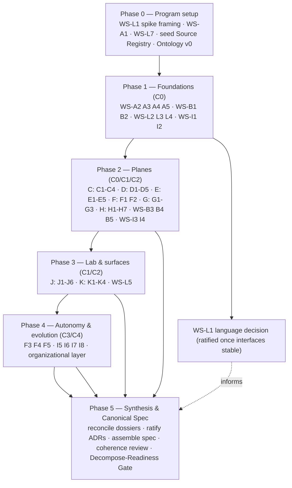

# MetaHarness — Meta-Plan & Research/Design Ledger

**Document 3 of the MetaHarness corpus.** A plan for how we will *manage the research and synthesis work* required to produce the project's single, canonical systems/software design + implementation spec. This document is **not** the research, and it is **not** the spec. It is the program that produces the spec.

> ⚙️ **If you are an agent session invoked to *execute* this plan (not a human reader):** your operating contract is **§11 — Operator's Runbook (Autonomous Execution Protocol)**. Read docs 1–3 in full first, then follow §11. Your mandate is to produce, on disk, the complete `research/` ledger (LEDGER, ~50 dossiers, ADRs, registers) and the final `spec/CANONICAL_SPEC.md` + `spec/READINESS_REPORT.md`. You stop at the Decompose-Readiness Gate (§7.3) and do **not** run `decompose-spec`/`orchestrate-build`/`implement-spec` or write framework implementation code.

> **What this document is.** A meta-plan: the workstream map, governance artifacts, methodology, dependency graph, and synthesis process by which we convert the doc-2 research frontier into a finalized, decompose-ready **Canonical Spec**.
>
> **What this document is not.** It does not perform the deep research, does not make the component-level design decisions, and does not write the Canonical Spec. Those are downstream outputs of executing this plan.

---

## 0. How to read this document

- **Terminal deliverable:** one **Canonical Spec** — a comprehensive, full-vision systems + software design and implementation specification for the MetaHarness framework and laboratory. It is authored *after* the research/synthesis program in this plan is executed, and it is shaped so it can be partitioned by `decompose-spec` and driven to implementation by `orchestrate-build` + `implement-spec` (one ticket per fresh-context run).
- **Provenance:** grounded in `2_Harness_Engineering_Genealogy_Anatomy_2026_Frontier_v2.md` (hereafter **doc 2**), which is treated as a *starting map, not an authority* — its provisional 2026 preprints are re-validated, not trusted. Doc 1 is retained only as a v1→v2 diff baseline.
- **Two firm constraints from project sponsor:**
  1. **Language/ecosystem-agnostic.** Nothing upstream of the Canonical Spec commits to a programming language, runtime, or framework. Language/ecosystem selection is an explicit, criteria-driven decision *inside* this plan (workstream **WS-L1**), deliberately deferred until the ontology, IR, and interface contracts are stable enough to judge it on evidence.
  2. **Full-vision Canonical Spec.** The spec covers the entire vision in one artifact — *with* a mandatory internal **core/extension layering** and **staged build ladder** so that "one spec" does not mean "one monolith." (See §1.3 and §9 for how we discharge the integration risk doc 2 explicitly warns against.)
- **Reading order for a newcomer:** §1 (what we're really building) → §2 (full functional scope) → §5 (the workstream ledger) → §6 (sequencing). §3–§4 and §7–§10 are the operating manual for the program.

---

## 1. First-principles synthesis: what we are really building

### 1.1 Reading the intent critically

The sponsor's brief describes "the most sophisticated, generic, modular, extensible meta-harness framework on the market." Taken literally, "most generic" is a **trap**, and doc 2 names it twice (the "lowest-common-denominator abstraction" risk around both a *Harness ABI* and a *Harness IR*): maximal genericity tends to hide exactly the **model-conditioned** features that drive real performance. So the honest restatement of the goal is not "the most abstract framework in existence." It is:

> **The MetaHarness thesis.** We are building a *research instrument and reference implementation* for harness engineering: a framework whose distinctive, load-bearing capability is that **any harness — expressed as a composition of pluggable, typed components over a stable semantic representation — can be assembled, executed, and directly compared against any other, holding model × configuration × environment × budget as explicit experimental factors, under shared evals.** The "meta" is the comparison instrument; the "harness" is the reference runtime that proves the representation is real.

This reframe matters because it resolves the sponsor's own uncertainty ("I'm not sure I specified what I want properly"). The centre of gravity is **comparability under a portable representation**, not scaffolding volume. Every other subsystem (runtime, orchestrator, toolset, router, memory, security, evolution) is both (a) a first-class product feature *and* (b) an object the laboratory must be able to swap and measure.

> **Positioning — ratified as ADR-0001: native-primary, hosting-as-participant.** The white-box path is the core: harnesses expressed in *our* IR and run on *our* native runtime, whose components can be swapped, ablated, causally attributed, and evolved. Because a third-party harness (Codex, Claude Code, OpenHands, Cursor CLI) is always a black box we do not control, external harnesses join as *hosted participants* through a deliberately **thin observational ABI** (start/resume/cancel, stream events, supply context/tools/skills, request permission, account cost) — sharing the same environments, evals, scorecards, and cost/latency/audit as IR-native harnesses, but never pretending to be component-decomposable. **One comparison plane, two participant classes: IR-native (white-box) and hosted-external (black-box).** This gives "our runtime AND compare everyone's" without inheriting the lowest-common-denominator-ABI trap, because deep interop lives on the white-box path where we own the internals. External hosting is first-class but strictly secondary to the native instrument.

### 1.2 The two design tensions we resolve up front (as stance, not yet as design)

| Tension | Naïve reading | Stance we adopt (to be validated, not assumed) |
|----|----|----|
| Generic **vs** performant | "Make it maximally abstract" | **Stable semantic interface + model-conditioned compilation.** Portability means one behavioral meaning compiled per model/target — never pretending models are interchangeable. (doc 2 §4 cross-cutting; §5.9) |
| Full-vision **vs** rigor/de-risking | "Build everything at once" | **Full-vision spec, layered internally.** A hard **MetaHarness Core** (the minimal inspectable runtime + IR + measurement backbone) that everything else extends; a **staged build ladder** inside the spec so decompose/build proceeds core-first. (doc 2 §11 staged sequence) |

### 1.3 Discharging the integration risk of a single full-vision spec

Doc 2 explicitly cautions against maximal scaffolding and recommends a small rigorous core first. The sponsor chose one full-vision spec. These are reconciled — not by shrinking the vision, but by **requiring the spec's internal structure to be build-order-aware**:

1. **Core/extension layering.** The spec designates a **Core** (§2 tier C0) that is independently coherent and shippable, and **Extension tiers** (C1–C4) that depend only on the Core and on each other along a declared DAG. No extension may reach into another extension's internals except through Core-defined contracts.
2. **Staged build ladder.** The spec embeds an explicit stage sequence (echoing doc 2 §11 Stages 0–6) so `decompose-spec` inherits a natural dependency ordering and `orchestrate-build` can complete a working system at each stage boundary.
3. **Every subsystem ships behind a stable contract before its rich variant is built.** E.g., a trivial single-strategy compactor satisfies the Context contract in the Core; the *family* of compaction strategies is an extension. This is what lets "one spec" decompose into many independently-buildable tickets.

### 1.4 What "done" means — for the spec, not the software

The research/synthesis program is complete when the Canonical Spec satisfies the **Decompose-Readiness Gate** (§7.3): every functional item in §2 is either specified with an interface contract, data model, acceptance criteria, and build-stage assignment — or explicitly deferred with a recorded rationale (ADR). Software completeness is a downstream concern owned by `orchestrate-build`.

---

## 2. The full functional scope (first-principles re-derivation)

This is the **living scope catalogue** the sponsor asked for — re-reasoned rather than copied from the brief. It is the skeleton that the research workstreams (§5) investigate and that the Canonical Spec must cover section-for-section. **Each item is a *research-and-design target*, not a design decision.** Items are tagged with a **Core tier** (C0 = MetaHarness Core; C1–C4 = extension tiers) and a **novelty marker**:

- **⊕ NEW** — a subsystem the sponsor's brief did *not* name, added from first principles + doc 2. These are the answer to "my wording may be missing key sub-components."
- **↑ EXT** — named by the sponsor but materially *expanded* here beyond the brief's framing.

### 2.1 Foundations (C0)

| Item | Tier | Note |
|----|----|----|
| **Ontology / conceptual systematization** — the novel, defensible systematization of a generic harness (refined 7-plane model + partially-programmable-policy-stack formalism + `validity vs compliance` + `compatibility surface` + the two **participant classes**: IR-native white-box / hosted-external black-box) | C0 | The project's intellectual differentiator. doc 2 §1, §4; ADR-0001 |
| **Harness IR** — typed, behavioral (not framework-specific) representation: `Goal, Observation, ContextItem, Memory, Procedure, ToolCapability, Permission, Effect, Artifact, Validator, AgentProcess, Budget, HarnessRule` + edges (`depends-on, supersedes, authorizes, produced-by, validates, delegated-to`) | C0 ⊕ NEW | doc 2 §11 IR sketch |
| **Compilation model** — IR → executable runtime + model profiles + protocol targets | C0 ⊕ NEW | Multi-target compiler |
| **Configuration & composition model** — declarative assembly of a harness from component variants + params; the code-vs-config boundary | C0 ↑ EXT | Enables the lab (J-track) |
| **Provenance & authority model** — first-class origin/version/authority-class on every context item, memory, tool result, and harness edit | C0 ⊕ NEW | doc 2 §4 cross-cutting; §11 additions |
| **Resource-economics & accounting model** — tokens, model calls, wall-clock, VM minutes, network, subagent fan-out, human approvals as a unified budgeted resource | C0 ↑ EXT | The harness-as-scheduler view |

### 2.2 Core runtime & durability (C0/C1)

| Item | Tier | Note |
|----|----|----|
| **Event store / run ledger** — append-only typed event log; immutable run/turn/tool/artifact/subagent IDs; materialized views | C0 | doc 2 §11; Logos, Managed Agents |
| **Effect & transaction model** — `intent → prepared → commit → observed`; idempotency keys; leases; compensating actions; at-least-once/exactly-once semantics | C0 ⊕ NEW | doc 2 §5.5 |
| **Durable execution & recovery** — restartability, checkpoints, event-driven wakeups, crash recovery, self-healing environments | C1 ↑ EXT | Cursor cloud agents, Cloudflare Agents SDK |
| **Reversible & speculative execution** — typed git-like execution traces; fork/replay/branch; snapshotting; nondeterminism boundaries | C2 ⊕ NEW | Shepherd |
| **Execution-environment abstraction** — ephemeral sandbox/VM handles decoupled from the harness process | C0 ↑ EXT | Hard blast-radius boundary |

### 2.3 Model plane (C0/C1)

| Item | Tier | Note |
|----|----|----|
| **Model adapter / gateway** — provider-agnostic inference interface; streaming; tool-call normalization | C0 ↑ EXT | |
| **Model router** — capability/cost/latency/quality-aware routing; fallback; ensembling | C1 ↑ EXT | Named by sponsor |
| **Model-profile compiler** — one semantic meaning → model-specific prompt layout, tool names/schemas, error formats, compaction policy; profile is an independently testable, expirable component | C1 ⊕ NEW | doc 2 §5.9, §11 additions |
| **Caching & token economics** — prompt/KV/semantic caching; per-call accounting feeding the resource model | C1 | |

### 2.4 Context & memory plane (C0/C1/C2)

| Item | Tier | Note |
|----|----|----|
| **Context builder / policy engine** — provenance-aware working-set assembly; tokens as budgeted working memory | C0 ↑ EXT | doc 2 §5.1 |
| **Compaction strategies** — pluggable family (summarize / offload / evict / restructure), model-conditioned | C1 ↑ EXT | Sponsor's own example; a canonical lab comparison target |
| **Retrieval & memory hierarchy** — working / artifact / episodic / procedural / durable-session layers | C1 | doc 2 §5.1 |
| **Memory lifecycle semantics** — validity, versioning, revocation, conflict/supersession edges, expiry, taint/trust; retrieval filters by authority/validity *before* relevance | C2 ⊕ NEW | Invalidation Contracts; "Revoked but Still Authoritative" |
| **Skills & Procedure IR** — procedural memory between prose and code: typed preconditions/effects/validators; compiles to instructions, workflow node, or subagent task | C2 ⊕ NEW | Agent Skills; procedural graphs (doc 2 §5.12) |

### 2.5 Tools & action plane (C0/C1)

| Item | Tier | Note |
|----|----|----|
| **Tool registry & typed capabilities** — schemas + cost/risk/permission/observability metadata | C0 ↑ EXT | doc 2 §11 |
| **Tool-interface compiler** — semantic capability → model-specific tool surface; wrapper synthesis with semantic-equivalence + safety checks | C2 ⊕ NEW | doc 2 §5.2; Cursor model-specific tools; HEART |
| **Tool scaling** — discovery, deferred loading, large-catalog retrieval | C1 | Anthropic advanced tool use |
| **Protocol edges** — MCP (client + server), A2A, ACP | C1 ↑ EXT | doc 2 §5.10 |
| **Sandboxed tool execution & effect capture** | C0 | Ties to security kernel (H-track) |

### 2.6 Control & orchestration plane (C0/C2/C3)

| Item | Tier | Note |
|----|----|----|
| **Control strategies** — pluggable family: ReAct, plan-execute, FSM/workflow, deterministic-envelope ("agentic programming") | C0 ↑ EXT | doc 2 §5.4; a core lab comparison target |
| **Control envelope** — budgets, stop/retry, timeouts, state invariants, schema validation, idempotency | C0 | doc 2 §11 |
| **Sub-agent orchestrator** — spawn/isolate/merge; topology; recursive full-harness delegation | C3 ↑ EXT | Anthropic orchestrator-worker; Recursive Agent Harnesses; Prime Agent |
| **Value-of-compute scheduler** — predict marginal success-per-token/latency/risk of spawning a subagent / alt model / evaluator / longer search | C3 ⊕ NEW | doc 2 §10; Task-CoEvolve |
| **Multi-agent coordination & consistency** — shared-state ownership, belief merge, conflict resolution, failure containment | C3 ⊕ NEW | doc 2 §5.7 |

### 2.7 Verification plane (C1/C2)

| Item | Tier | Note |
|----|----|----|
| **Verification fabric** — task contracts; executable validators/oracles; local (post-side-effect) + global (task-invariant) checks | C1 ↑ EXT | doc 2 §5.3 |
| **Execution-alignment / belief-state reconciliation** — continuously reconcile model claims with authoritative external state | C2 ⊕ NEW | Harness-Bench |
| **Independent critics/evaluators** — that consume the *same authoritative evidence*, not another model's prose | C2 | |

### 2.8 Security & governance plane (C0/C1/C2)

| Item | Tier | Note |
|----|----|----|
| **Reference-monitor security kernel & capability model** — out-of-band typed capabilities; least-privilege; "the model may propose an action, only the runtime confers authority" | C0 ⊕ NEW | CaMeL; CapScope; capability security |
| **Information-flow control & taint labeling** — confidentiality/integrity labels; declassification points | C2 ⊕ NEW | Fides |
| **Credential mediation & secret isolation** | C0 ⊕ NEW | doc 2 §5.6 |
| **Egress / network policy & sandbox boundaries** | C0 ⊕ NEW | Anthropic containment |
| **Extension supply-chain trust** — pin/sign/sandbox/taint/audit for skills, hooks, MCP servers, plugins, fetched instructions | C1 ⊕ NEW | context-privilege escalation |
| **Deep audit trail & tamper-evident logging** — at every level, correlated to the event ledger | C0 ↑ EXT | Sponsor emphasis ("deep audit trails at all levels") |
| **Human-in-the-loop / approval & escalation policy** — approval-fatigue-aware | C1 ⊕ NEW | Anthropic containment telemetry (~93% approvals) |

### 2.9 Measurement & evolution plane (C0/C1/C4)

| Item | Tier | Note |
|----|----|----|
| **Telemetry, tracing & cost/latency instrumentation** — deep audit at all levels; per-call cost + latency | C0 ↑ EXT | Sponsor emphasis |
| **Eval framework** — factorial design; the harness scorecard (capability/reliability/grounding/efficiency/autonomy/security/portability/evolvability); distributions not means; process metrics | C0 ↑ EXT | doc 2 §8 |
| **Reproducible harness bundle** — model snapshot + harness commit + profile + tools + skills + env image + permissions + policies + budgets + grader + task data + raw traces | C1 ⊕ NEW | doc 2 §8 |
| **Benchmark/environment integration** — coding/terminal first (SWE-bench, Terminal-Bench); harness-specific benches | C1 | Per sponsor domain choice |
| **Evolution service** — governed pipeline: propose → failure-hypothesis → counterexample set → matched-budget eval → held-out regression → cross-model compat → security-invariant check → canary → rollout → retirement test | C4 ↑ EXT | doc 2 §5.8, §11; AHE, RHO, Meta-Harness, Harness-R1 |
| **Assumption-debt manager** — every model-specific rule carries hypothesis, evidence, owner, expiry, removal test | C4 ⊕ NEW | doc 2 §5.9, §12 |
| **Causal attribution & counterfactual execution** — trajectory interventions for component-level credit | C4 ⊕ NEW | doc 2 §10 |
| **Model-harness co-evolution & consolidation** — weights↔harness coupling (later-tier research) | C4 ⊕ NEW | Co-Harness, WHALE, SafeEvolve |

### 2.10 Meta-harness laboratory (the distinctive core) (C1/C2)

| Item | Tier | Note |
|----|----|----|
| **Harness assembly & declarative definition** — compose a harness from component variants + params; validate against the IR | C1 ↑ EXT | The sponsor's central "meta" capability |
| **Component-variation registry** — many implementations per component class (e.g., compaction strategies), versioned and discoverable | C1 ↑ EXT | |
| **Experiment & sweep engine** — define/run `model × harness × environment × params × seed` factorials with budget control | C1 ⊕ NEW | doc 2 §8 |
| **Comparison & analysis engine** — scorecards, capability-cost Pareto frontiers, transfer metrics, interaction effects, significance; spans **both** participant classes | C2 ⊕ NEW | doc 2 §8; ADR-0001 |
| **Results store, experiment ledger & leaderboard** — every run an inspectable scientific object | C1 ⊕ NEW | |
| **External-harness hosting / Harness ABI** — wrap external harnesses as **black-box participants** behind a *thin observational ABI* (start/resume/cancel, stream events, supply context/tools/skills, request permission, account cost) so they join the same experiment/eval/comparison plane as IR-native harnesses. First-class but **secondary** to the white-box path. | C2 ⊕ NEW | Omnigent; ACP; doc 2 §5.11; ADR-0001 |

### 2.11 Surfaces (C1/C2)

| Item | Tier | Note |
|----|----|----|
| **CLI** | C1 | Sponsor-named |
| **Web-based local dev-tooling** — assemble harnesses, launch experiments, trace/time-travel viewer, comparison dashboards, debugging | C2 ↑ EXT | Sponsor-named |
| **MCP server** — expose MetaHarness capabilities as tools to external agents | C2 ↑ EXT | Sponsor-named |
| **SDK / embedding API** — embed the runtime in host applications | C1 ⊕ NEW | |

### 2.12 Cross-cutting & program concerns (C0/L)

| Item | Tier | Note |
|----|----|----|
| **Versioning, reproducibility & artifact identity** — version *everything*; content-addressed artifacts | C0 ↑ EXT | doc 2 §8 |
| **Extensibility / plugin architecture & third-party component contracts** | C0 ↑ EXT | The mechanism that makes "modular/extensible" true |
| **Language/ecosystem selection** — deferred, criteria-driven | — | **WS-L1**; kept out of C-tiers by mandate |
| **Packaging, licensing, OSS governance, docs & community** | — | WS-L6 |
| **Novelty/differentiation thesis & naming** | — | WS-L7; guards against LCD abstraction |
| **Human-agent organizational layer** — event/ticket/webhook-triggered agent fleets; accountability/escalation/ownership | C4 ⊕ NEW | doc 2 §10 organizational semantics (candidate later tier) |

> **⊕ NEW subsystems the brief did not name, surfaced here (summary):** provenance/authority model · resource-economics model · effect/transaction model · reversible/speculative execution · model-profile compiler · memory lifecycle semantics · Procedure IR · tool-interface compiler · value-of-compute scheduler · multi-agent consistency · execution-alignment layer · full security kernel (capabilities + IFC + credential mediation + egress + extension supply-chain trust) · reproducible harness bundle · assumption-debt manager · causal attribution/counterfactual execution · model-harness co-evolution · external-harness hosting (Harness ABI) · SDK/embedding API · human-agent organizational layer. **These are the answer to "my wording may be missing key sub-components."**

---

## 3. Research & synthesis methodology (rigor standards)

The program inherits and enforces doc 2's own evidence discipline. These are binding rules for every workstream.

### 3.1 Evidence classes and how each is weighted

- **Mechanism evidence** (a failure mode exists; an architecture is implementable) vs **performance evidence** (a benchmark lift). We may adopt a *mechanism* on fresh evidence; we may **not** generalize a *performance* claim from an unreplicated 2026 preprint into a design commitment.
- **Provisional tagging.** Every 2026 single-team/preprint result is tagged `provisional` in the Source Registry and cannot be load-bearing for a Core (C0) decision without corroboration or an independent re-derivation of the mechanism.
- **Matched-budget skepticism.** Any "evolution/optimization beats baseline" claim is discounted unless the comparison is compute/feedback/eval-matched (per *Rethinking Harness Evolution*). This especially governs the I-track and C4 tier.
- **Counter-evidence parity.** Each workstream dossier must record the strongest disconfirming evidence and negative results, not only supporting citations.

### 3.2 The four source streams (every design decision triangulates ≥2)

1. **Academic / frontier literature** — the doc-2 syllabus (Tiers 0–4) as the seed, extended per workstream.
2. **OSS source-code audit** — reading *implementation*, not architecture diagrams, via the **vertical-slice method** (doc 2 §7): trace one concern — e.g. context construction, then tool dispatch + error representation, then permissions/sandboxing, then session/event persistence — across several repos (Codex, Pi, OpenHands, Browser-Use, AIOS, goose, opencode, mini-SWE-agent, Aider, Omnigent, DGM, CaMeL, Fides).
3. **Protocol specifications** — MCP, A2A, ACP, and cloud harness/runtime interfaces (AgentCore, Agent Framework, Cloudflare Agents SDK).
4. **Production engineering write-ups** — OpenAI/Anthropic/Cursor/cloud-vendor posts, mined for *mechanisms*, discounted for product-specific assumptions.

### 3.3 The synthesis contract

Every design decision that lands in the Canonical Spec must carry, in its ADR: (a) the mechanism evidence, (b) ≥1 source-code precedent **or** an explicit `no-precedent / novel` flag, (c) the disconfirming evidence considered, (d) the conditionality (which model tiers / task classes / budgets it assumes), and (e) its build-stage assignment.

### 3.4 Novelty bar

Doc 2 §9 is explicit that most mechanisms are old; the genuinely new thing is *semantic systems engineering* — the moving boundary of control. Our novelty claims are confined to: (i) the **comparison-first ontology + IR** as a portable behavioral representation, (ii) the **assembly/experiment lab** as an integrated instrument, and (iii) specific mechanisms in the §12 contribution map (IR + compiler, assumption-debt manager, safe adaptive optimizer, execution-alignment layer, trust-aware memory, capability kernel, benchmark science). WS-L7 owns keeping these claims honest against the crowded orchestration-library landscape.

---

## 4. Governance artifacts (the ledger system)

The program is *managed* through a small set of durable, language-agnostic (Markdown + structured data) artifacts. Proposed layout, designed to later live inside the repo:

```
docs/
  3_MetaHarness_Meta_Plan_and_Research_Ledger.md   ← this file (the program plan)
research/
  LEDGER.md                 ← master index: every workstream, owner, status, blocking edges
  dossiers/
    WS-A1.md ... WS-L7.md    ← one Research Dossier per workstream (§5)
  decisions/
    ADR-0001.md ...          ← Architecture Decision Records (one per load-bearing decision)
  registers/
    sources.md               ← Source Registry (papers/repos/specs/posts; tier, credibility, provisional?)
    open-questions.md         ← unresolved questions; resolver; blocking?
    ontology.md               ← canonical vocabulary + entity/edge definitions (the living glossary)
    conflicts.md              ← contradictions between sources/threads + resolution
    scope.md                  ← the §2 catalogue as tracked requirements (ID, owner WS, spec section, MoSCoW)
    risks.md                  ← program-level risk register
spec/
  CANONICAL_SPEC.md (+ sections)  ← the terminal deliverable, assembled in Phase 5
```

**Dossier template (each `research/dossiers/WS-*.md`):**
`Scope & boundary · Key questions · Sources consulted (4 streams) · Findings (mechanism vs performance) · Disconfirming evidence · Recommendation for the spec · Open questions raised · Confidence (high/med/low + why) · ADRs produced · Spec section(s) fed · Status`

**ADR template:** `Context · Options considered · Decision · Evidence (per §3.3 synthesis contract) · Consequences · Conditionality · Build-stage · Reversibility · Status (proposed/ratified/superseded)`.

The **LEDGER.md** is the single source of truth for program state; the **Source Registry** is seeded immediately from doc 2's Sources (§Sources) and Tier 0–4 syllabus so we start from the known corpus rather than rediscovering it. Two decisions are **pre-ratified** before Phase 0 and seeded into `decisions/`: **ADR-0001** (positioning — native-primary, hosting-as-participant; two participant classes) and **ADR-0002** (evolution/co-evolution fully in-scope, not stubbed). All other ADRs are produced by workstreams and ratified in synthesis passes.

---

## 5. The research workstream ledger

The core of the meta-plan. **12 tracks (A–L), ~50 workstreams.** Each workstream is a self-contained deep-research-then-synthesize unit producing one Dossier and ≥1 ADR. Columns: **ID · Scope / key questions · Primary anchors & sources · Feeds spec area**. (Tracks map to §2 subsections; sources abbreviate the doc-2 corpus.)

### Track A — Foundations, Ontology & IR *(upstream of everything; mostly C0)*

| ID | Scope / key questions | Primary anchors & sources | Feeds |
|----|----|----|----|
| **WS-A1** | Positioning & prior-art/competitive audit: what do existing orchestration libs/SDKs/hosts already do; where is genuine novelty vs renaming? | LangGraph/LangChain, AutoGen, OpenHands SDK, AIOS, Omnigent, DSPy; doc 2 §9, §12 | §1, WS-L7 |
| **WS-A2** | The novel ontology: refine the 7-plane model + policy-stack formalism; formalize `validity vs compliance` and the `compatibility surface` | doc 2 §1, §4 | Ontology; §2.1 |
| **WS-A3** | Harness IR design: typed entities/edges; behavioral-not-framework-specific; what must be typed/diffable/verifiable | doc 2 §11 IR sketch; DSPy, ADAS, AFlow, GPTSwarm; PL/IR theory (Tier 0) | §2.1 |
| **WS-A4** | Compilation model: IR → runtime + model profiles + protocol targets; multi-target compiler design | doc 2 §5.2, §5.9, §11 additions | §2.1, §2.3 |
| **WS-A5** | Configuration & composition model: declarative harness assembly; the code-vs-config boundary (doc 2's `harness code vs harness configuration`) | doc 2 §7 (config migration finding) | §2.1, §2.10 |

### Track B — Core Runtime & Durability *(C0–C2)*

| ID | Scope / key questions | Primary anchors & sources | Feeds |
|----|----|----|----|
| **WS-B1** | Event store / run ledger: event taxonomy, ID model, materialized views; event-sourcing "selectively not dogmatically" | doc 2 §11; Logos; Managed Agents | §2.2 |
| **WS-B2** | Effect & transaction model: intent/prepared/commit/observed; idempotency; leases; compensation | doc 2 §5.5 | §2.2 |
| **WS-B3** | Durable execution & recovery: restart, checkpoint, event-driven wakeups, self-healing envs | Cursor cloud agents; Cloudflare Agents SDK; Temporal-style durability | §2.2 |
| **WS-B4** | Reversible & speculative execution: git-like typed traces, fork/replay/branch, nondeterminism limits | Shepherd | §2.2 |
| **WS-B5** | Execution-environment abstraction: sandbox/VM handle model decoupled from harness process | doc 2 §5.5–5.6; OpenHands (local vs ephemeral) | §2.2, §2.8 |

### Track C — Model Plane *(C0–C1)*

| ID | Scope / key questions | Primary anchors & sources | Feeds |
|----|----|----|----|
| **WS-C1** | Model adapter/gateway: provider-agnostic inference contract; streaming; tool-call normalization | goose, opencode (provider abstraction) | §2.3 |
| **WS-C2** | Model router: capability/cost/latency/quality routing; fallback; ensembles | doc 2 §11 (model switching) | §2.3 |
| **WS-C3** | Model-profile compiler: semantic → model-specific surfaces; profile as testable, expirable component | doc 2 §5.9, §11 additions; Cursor model-specific tools | §2.3, WS-I6 |
| **WS-C4** | Caching & token economics: prompt/KV/semantic cache; accounting hooks | doc 2 §8 (efficiency metrics) | §2.3, WS-L2 |

### Track D — Context & Memory *(C0–C2)*

| ID | Scope / key questions | Primary anchors & sources | Feeds |
|----|----|----|----|
| **WS-D1** | Context builder/policy engine: provenance-aware working-set assembly | doc 2 §5.1 | §2.4 |
| **WS-D2** | Compaction strategy family: summarize/offload/evict/restructure; model-conditioned; the canonical lab demo comparison | doc 2 §5.1; Anthropic/Cursor context work | §2.4, §2.10 |
| **WS-D3** | Retrieval & memory hierarchy: working/artifact/episodic/procedural/durable | doc 2 §5.1; MemGPT, Generative Agents | §2.4 |
| **WS-D4** | Memory lifecycle semantics: validity/version/revocation/conflict/expiry/taint; authority-before-relevance retrieval | Invalidation Contracts; "Revoked but Still Authoritative" | §2.4 |
| **WS-D5** | Skills & Procedure IR: typed pre/postconditions, effects, validators; compile to instruction/workflow/subagent | doc 2 §5.12; Agent Skills; procedural graphs | §2.4 |

### Track E — Tools & Action *(C0–C2)*

| ID | Scope / key questions | Primary anchors & sources | Feeds |
|----|----|----|----|
| **WS-E1** | Tool registry & typed capabilities: schemas + cost/risk/permission/observability metadata | doc 2 §11 | §2.5 |
| **WS-E2** | Tool-interface compiler: capability → model-specific surface; wrapper synthesis + semantic-equivalence/safety checks | doc 2 §5.2; HEART; Cursor edit tools | §2.5 |
| **WS-E3** | Tool scaling: discovery, deferred loading, large-catalog retrieval | Anthropic advanced tool use; MCP | §2.5 |
| **WS-E4** | Protocol edges: MCP client+server, A2A, ACP; where each boundary belongs | doc 2 §5.10, §3 | §2.5, §2.11 |
| **WS-E5** | Sandboxed tool execution & effect capture; tie-in to security kernel | doc 2 §5.6; Codex sandbox/approval | §2.5, §2.8 |

### Track F — Control & Orchestration *(C0–C3)*

| ID | Scope / key questions | Primary anchors & sources | Feeds |
|----|----|----|----|
| **WS-F1** | Control-strategy family: ReAct / plan-execute / FSM-workflow / deterministic-envelope; "where should control live?" | doc 2 §4, §5.4; ReAct; Agentic Programming; Dhage | §2.6 |
| **WS-F2** | Control envelope: budgets/stop/retry/timeout/invariants/schema/idempotency | doc 2 §11 | §2.6 |
| **WS-F3** | Sub-agent orchestrator: spawn/isolate/merge; recursive full-harness delegation; topology | Anthropic orchestrator-worker; Recursive Agent Harnesses; Prime Agent | §2.6 |
| **WS-F4** | Value-of-compute scheduler: marginal-value estimation for subagent/alt-model/evaluator/search | doc 2 §10; Task-CoEvolve | §2.6, WS-I5 |
| **WS-F5** | Multi-agent coordination & consistency: shared-state ownership, belief merge, conflict resolution, containment | doc 2 §5.7 | §2.6 |

### Track G — Verification *(C1–C2)*

| ID | Scope / key questions | Primary anchors & sources | Feeds |
|----|----|----|----|
| **WS-G1** | Verification fabric: task contracts; executable validators/oracles; local + global checks | doc 2 §5.3 | §2.7 |
| **WS-G2** | Execution-alignment / belief-state reconciliation: detect narrative-vs-state divergence pre-completion | Harness-Bench | §2.7 |
| **WS-G3** | Independent critics/evaluators consuming authoritative evidence | doc 2 §5.3, §8 | §2.7 |

### Track H — Security & Governance *(C0–C2)*

| ID | Scope / key questions | Primary anchors & sources | Feeds |
|----|----|----|----|
| **WS-H1** | Reference-monitor kernel & capability model: out-of-band typed capabilities; least-privilege delegation | CaMeL; CapScope; capability security | §2.8 |
| **WS-H2** | Information-flow control & taint labeling: confidentiality/integrity labels; declassification | Fides | §2.8 |
| **WS-H3** | Credential mediation & secret isolation | doc 2 §5.6 (containment) | §2.8 |
| **WS-H4** | Egress/network policy & sandbox boundaries; deterministic containment as backstop | Anthropic containment | §2.8 |
| **WS-H5** | Extension supply-chain trust: pin/sign/sandbox/taint/audit skills/hooks/MCP/plugins/fetched instructions | context-privilege escalation studies | §2.8 |
| **WS-H6** | Deep audit trail & tamper-evident logging correlated to the event ledger | doc 2 §4, §11; sponsor emphasis | §2.8, §2.9 |
| **WS-H7** | HITL/approval & escalation policy; approval-fatigue mitigation | Anthropic containment telemetry | §2.8 |

### Track I — Measurement & Evolution *(C0–C4)*

| ID | Scope / key questions | Primary anchors & sources | Feeds |
|----|----|----|----|
| **WS-I1** | Telemetry/tracing + cost & latency instrumentation at all levels | doc 2 §8; sponsor emphasis | §2.9 |
| **WS-I2** | Eval framework: factorial design; the 8-dimension scorecard; distributions; process metrics; executable oracles | doc 2 §8 | §2.9, §2.10 |
| **WS-I3** | Reproducible harness bundle format | doc 2 §8 | §2.9, §2.10 |
| **WS-I4** | Benchmark/environment integration (coding/terminal first): SWE-bench, Terminal-Bench, τ-bench; harness-specific benches | doc 2 §8 | §2.9 |
| **WS-I5** | Evolution service as a governed deployment pipeline; safe self-modification; matched-budget gates | doc 2 §5.8, §11; AHE, RHO, Meta-Harness, Harness-R1; **counter:** Rethinking Harness Evolution, HarnessDev | §2.9 |
| **WS-I6** | Assumption-debt manager: hypothesis/evidence/owner/expiry/removal-test per rule | doc 2 §5.9, §12 | §2.9 |
| **WS-I7** | Causal attribution & counterfactual execution over trajectories | doc 2 §10; Shepherd | §2.9 |
| **WS-I8** | Model-harness co-evolution & consolidation (later-tier) | Co-Harness, WHALE, SafeEvolve | §2.9 |

### Track J — Meta-Harness Laboratory *(C1–C2; the distinctive core)*

| ID | Scope / key questions | Primary anchors & sources | Feeds |
|----|----|----|----|
| **WS-J1** | Harness assembly & declarative definition; validation against the IR | doc 2 §11; WS-A3/A5 | §2.10 |
| **WS-J2** | Component-variation registry: many impls per component class; versioning/discovery | doc 2 §7 (extension surfaces) | §2.10 |
| **WS-J3** | Experiment & sweep engine: model×harness×env×param×seed factorials; budget control | doc 2 §8 (minimum experimental design) | §2.10 |
| **WS-J4** | Comparison & analysis engine: scorecards, Pareto, transfer, interaction effects, significance | doc 2 §8 | §2.10 |
| **WS-J5** | Results store, experiment ledger & leaderboard as inspectable objects | doc 2 §8 (bundle) | §2.10 |
| **WS-J6** | External-harness hosting / Harness ABI: wrap external harnesses as black-box participants behind a thin observational ABI; define the two-participant-class model (with WS-A2) and how black-box participants share environments/evals/scorecards with IR-native ones | Omnigent; ACP; doc 2 §5.11; ADR-0001 | §2.10, §2.11 |

### Track K — Surfaces *(C1–C2)*

| ID | Scope / key questions | Primary anchors & sources | Feeds |
|----|----|----|----|
| **WS-K1** | CLI design & command surface | mini-SWE-agent, goose, opencode CLIs | §2.11 |
| **WS-K2** | Web dev-tooling: assembly UI, experiment launcher, trace/time-travel viewer, comparison dashboards | doc 2 §8 (trace viewer) | §2.11 |
| **WS-K3** | MCP server exposing MetaHarness capabilities | MCP spec | §2.11 |
| **WS-K4** | SDK/embedding API & host-app integration boundary | OpenHands SDK; Pi embedding surface | §2.11 |

### Track L — Cross-cutting & Program *(C0/L)*

| ID | Scope / key questions | Primary anchors & sources | Feeds |
|----|----|----|----|
| **WS-L1** | **Language/ecosystem selection spike**: decision criteria (research/eval alignment, protocol edges, durability, web tooling, perf); recommend *after* IR/interfaces stable. Keep all upstream artifacts language-neutral. | doc 2 §7 (Rust cores vs Python/TS research); sponsor mandate | ADR; all impl |
| **WS-L2** | Resource-economics & accounting model (cross-cutting scheduler view) | doc 2 §4 cross-cutting | §2.1, §2.12 |
| **WS-L3** | Provenance & authority model (shared by security/context/memory) | doc 2 §4, §11 additions | §2.1 |
| **WS-L4** | Versioning, reproducibility & artifact identity | doc 2 §8 | §2.12 |
| **WS-L5** | Extensibility/plugin architecture & third-party component contracts | doc 2 §7 (platform-ization) | §2.12 |
| **WS-L6** | Packaging, licensing, OSS governance, docs & community strategy | OSS norms | §2.12 |
| **WS-L7** | Novelty/differentiation thesis & naming; guard against LCD abstraction | doc 2 §9, §12 | §1, §3.4 |

---

## 6. Dependency graph & sequencing

Workstreams are grouped into **phases** by dependency, not by track. Within a phase, workstreams run in parallel. Phase boundaries are **gates** with explicit exit criteria (§7).



**Textual dependency summary (if the diagram doesn't render):**

- **Phase 0 (setup):** stand up the ledger; seed the Source Registry from doc 2; run the positioning/competitive audit (WS-A1) and novelty thesis (WS-L7); draft Ontology v0; *frame* (not decide) the language spike (WS-L1).
- **Phase 1 (Foundations, C0):** the ontology (A2), IR (A3), compiler model (A4), composition model (A5); event store + effect model (B1, B2); cross-cutting provenance/resource/versioning (L2–L4); measurement backbone (I1, I2). **Everything downstream depends on Phase 1.**
- **Phase 2 (Planes):** model / context / tools / verification / security planes + remaining durability (B3–B5) + bundle/benchmarks (I3, I4). Largely parallel; each depends only on Phase 1 contracts.
- **Phase 3 (Lab & surfaces):** the laboratory (J1–J6) and surfaces (K1–K4) — depend on planes existing behind stable contracts.
- **Phase 4 (Autonomy & evolution):** subagents/scheduler/multi-agent (F3–F5) and the evolution/attribution/co-evolution cluster (I5–I8) — depend on measurement + security + durable runtime. Highest-uncertainty, most provisional evidence; deliberately last.
- **Phase 5 (Synthesis):** reconcile all dossiers, ratify ADRs, ratify the language decision, assemble the Canonical Spec, adversarial coherence review, pass the Decompose-Readiness Gate.

**Language-decision timing.** WS-L1 is *framed* in Phase 0 and *ratified* at the end of Phase 1 / start of Phase 2 — late enough that the IR and interface contracts judge it on evidence, early enough that Phase 2+ prototyping (if any) isn't blocked. All Phase 0–1 artifacts remain strictly language-neutral.

---

## 7. Synthesis process → Canonical Spec

### 7.1 From dossiers to decisions

Each workstream closes by producing a Dossier + ≥1 proposed ADR. ADRs are **ratified** in cross-track synthesis passes where conflicts (logged in `conflicts.md`) are resolved — e.g. the context builder (WS-D1), security kernel (WS-H1), and provenance model (WS-L3) must agree on a single authority/label scheme before any of their ADRs ratify. The Ontology/Glossary register is the tie-breaker for vocabulary.

### 7.2 Required structure of the Canonical Spec (so it decomposes cleanly)

The spec is authored in Phase 5 against a fixed skeleton, each section traceable to Dossiers + ADRs:

1. **Vision, thesis, non-goals** (from §1, WS-A1/L7)
2. **Ontology & formal model** (WS-A2)
3. **Harness IR & compilation** (WS-A3/A4)
4. **Architecture overview**: the control-plane / execution-plane split; the Core (C0) and extension tiers (C1–C4) with the dependency DAG
5. **Per-subsystem specifications** — for each §2 item: responsibility, **interface contract**, data model, dependencies, failure modes, security/provenance obligations, **acceptance criteria**, **test-matrix hooks**, and **build-stage assignment**
6. **The meta-harness laboratory** (assembly, registry, experiment, comparison, hosting)
7. **Surfaces** (CLI, web, MCP, SDK)
8. **Cross-cutting contracts** (provenance, resource accounting, versioning, extensibility)
9. **The staged build ladder** (Stage 0→N) — the explicit dependency ordering `decompose-spec` inherits
10. **Evaluation & reproducibility plan**
11. **Deferred/out-of-scope items** with rationale (ADR-linked)

### 7.3 The Decompose-Readiness Gate (exit criterion for the whole program)

The spec is done when: every §2 item is specified-or-explicitly-deferred; every subsystem has an interface contract + acceptance criteria + build-stage; the build ladder forms a valid DAG with no cross-extension internal coupling; every load-bearing decision has a ratified ADR meeting the §3.3 synthesis contract; and an **adversarial coherence review** (self-review / editorial-review style, ideally an independent second read) finds no unresolved cross-subsystem contradiction. Only then does the spec hand off.

### 7.4 Handoff to the build pipeline

`decompose-spec` partitions the Canonical Spec into the fewest self-contained, dependency-ordered tickets (each sized to one fresh-context run), seeding the build ledger + per-ticket contracts. `orchestrate-build` then drives each ticket through `implement-spec` in a fresh context, core-first along the build ladder, pausing at ticket boundaries. **This plan's job ends when the spec passes §7.3.**

---

## 8. Decision gates & open strategic questions

| Decision | When resolved | Owner WS |
|----|----|----|
| **Positioning: native-primary, hosting-as-participant** | **Resolved — ADR-0001** | WS-A1, WS-J6 |
| **C4 evolution/co-evolution: fully specified in this spec, not stubbed** | **Resolved — ADR-0002** | WS-I5, WS-I8 |
| Language/ecosystem | End of Phase 1 | WS-L1 |
| IR expressiveness ceiling (how much behavior is typed vs left to compiled code) | Phase 1 | WS-A3 |
| Event-sourcing scope (what is authoritative log vs materialized view) | Phase 1 | WS-B1 |
| Depth of the thin observational ABI (what black-box participants must expose) | Phase 3 | WS-J6 |
| MoSCoW prioritization of §2 within the full-vision spec | Continuous, frozen at Phase 5 | scope.md |

Open strategic questions accumulate in `open-questions.md`; any that reach Phase 5 unresolved must be converted to an explicit deferral ADR rather than silently dropped.

---

## 9. Program-level risks & mitigations

| Risk | Mitigation |
|----|----|
| **Integration risk of a single full-vision spec** (doc 2's core caution) | Mandatory C0 Core / C1–C4 extension layering + staged build ladder *inside* the spec (§1.3); each subsystem behind a stable contract before its rich variant |
| **Lowest-common-denominator abstraction** in IR/ABI | "Stable semantic interface + model-conditioned compilation" stance (§1.2); WS-L7 novelty bar; profile/tool compilers (WS-C3/E2) preserve model-specific behavior |
| **Over-trusting fresh 2026 preprints** | Provisional tagging + mechanism-vs-performance rule + matched-budget skepticism (§3.1); C0 decisions may not rest on unreplicated performance claims |
| **Scope creep / boil-the-ocean** | MoSCoW in `scope.md`; Core-first build ladder; evolution cluster deferred to Phase 4; the gate is *spec-readiness*, not software |
| **Novelty/differentiation failure** (crowded orchestration-lib market) | WS-A1 competitive audit + WS-L7 thesis; novelty confined to comparison-first ontology/IR, the lab instrument, and the §12 contribution mechanisms |
| **Fast-moving model/evidence landscape invalidating decisions** | Versioned Source Registry; conditionality recorded per ADR; assumption-debt discipline (WS-I6) applied to the *design decisions themselves*, with revalidation cadence |
| **Cross-subsystem contradiction** (e.g. provenance vs security vs context disagree) | Cross-track synthesis passes (§7.1); shared Ontology register; adversarial coherence review at the gate (§7.3) |

---

## 10. Immediate next action

The program is executed **autonomously** by an agent session following the **Operator's Runbook (§11)** — the manual bootstrap steps are now Preflight (§11.2). The single human action required is:

> **Hand this file (doc 3) to a fresh frontier-model session (§11.1) with write access to this repo, and instruct it to execute the Operator's Runbook.** That session runs Preflight (§11.2) → Phases 0–5 → the Decompose-Readiness Gate, persisting the full `research/` ledger and `spec/CANONICAL_SPEC.md` to disk, and stops there.

For reference, Preflight (§11.2) discharges what were previously the manual bootstrap steps: scaffold the `research/` ledger, seed the Source Registry from doc 2, initialize all registers, write the pre-ratified ADR-0001/0002, and import §2 into the scope register with MoSCoW.

---

## 11. Operator's Runbook — Autonomous Execution Protocol

*Audience: an **agent session** invoked to execute this meta-plan end-to-end. A human may read it, but its instructions are addressed to the executing model. Every output is persisted to disk; nothing relies on chat scrollback.*

### 11.0 Mandate & stop condition
- **Goal:** produce, on disk, (a) the complete `research/` ledger — `LEDGER.md`, all ~50 workstream dossiers, all ADRs, all registers — and (b) `spec/CANONICAL_SPEC.md` + `spec/READINESS_REPORT.md`, by executing the 12-track program (§5) along the phase DAG (§6), under the methodology (§3) and synthesis process (§7).
- **Hard stop:** the Decompose-Readiness Gate (§7.3). You do **not** run `decompose-spec`, `orchestrate-build`, or `implement-spec`, and you write **no** framework implementation code. Your deliverable is the spec + artifacts.
- **Prime directives:** persist continuously; never silently drop or add scope (log every deferral/addition as an ADR); keep every artifact language/ecosystem-agnostic until WS-L1 ratifies; the evidence discipline (§3.1) is binding — a `provisional` claim may **never** be load-bearing for a Core (C0) decision.

### 11.1 Session & model setup
- **Model:** run the **orchestrator/synthesis** role on a 1M-context frontier model with strong long-horizon reasoning — **Opus 4.8 (1M) recommended** as the driver. **Fable 5.1 (1M)** is a fine alternative and a good choice for the high-parallelism *research fan-out* subagents if throughput/cost favors it. A hybrid — Opus 4.8 orchestrating, a faster model on the parallel research agents — is ideal.
- Enable a scratchpad for intermediate notes. Confirm write access to the repo root that holds docs 1–3.
- **Git:** this repo is not yet a git repo. Offer to `git init` so phase-boundary commits give resumability and provenance; if declined, rely on on-disk artifacts + `LEDGER.md`.

### 11.2 Preflight (once, before Phase 0)
1. Read docs 1, 2, and 3 **in full**.
2. Create the `research/` tree exactly as in §4, plus `spec/`.
3. **Seed `registers/sources.md`** from doc 2's entire Sources section + the Tier 0–4 syllabus: one row per source — `{title, kind (paper|repo|spec|post), tier, primary/secondary, provisional?, url-if-known}`.
4. **Initialize `LEDGER.md`** with every workstream WS-A1…WS-L7 from §5 — fields `{id, track, phase, status=todo, blocking-edges, dossier-path, owner-agent}`.
5. Initialize the registers: `open-questions.md`; `ontology.md` (paste the doc 2 §1/§4 vocabulary as Ontology v0); `conflicts.md`; `scope.md` (import all §2 items as tracked requirements with IDs + a MoSCoW column — default Must for C0, Should/Could down the tiers); `risks.md` (import §9).
6. **Write the two pre-ratified ADRs**, `status: ratified`: `ADR-0001` (positioning: native-primary, hosting-as-participant; two participant classes) and `ADR-0002` (evolution/co-evolution fully in-scope, not stubbed).

### 11.3 Execution model (how to parallelize)
This is an **explicitly sanctioned large multi-agent program** — the sponsor opted in by commissioning this runbook, so do not down-scope it to a handful of agents. But **fan out one phase at a time** and honor the gates; never launch all ~50 workstreams at once.

- **Preferred — the Workflow tool** for deterministic orchestration (load the `workflow-authoring` skill first). Model each phase as a `phase()`; within it, `parallel()` the phase's workstreams (each a research `agent()` with a JSON result schema); after the fan-out, run a synthesis `agent()`; gate; proceed. Use `pipeline()` where a later track can begin synthesizing as an earlier one finishes. Each agent persists to disk via Write. Resume an interrupted run with `resumeFromRunId`.
- **Fallback — the Agent tool** directly (if Workflow is unavailable): per phase, spawn the phase's workstream agents in a single message (parallel), await all, then spawn a synthesis agent, then gate. Track status in `LEDGER.md` so a re-invoked session resumes from the first non-`done` workstream.
- **Concurrency:** cap simultaneous research agents to ≈6–10 for legibility; a phase with more workstreams runs in waves. Each research agent is a **fresh (non-fork) subagent** so its large source-reading context stays out of the orchestrator.

### 11.4 The Research-Agent contract (per workstream)
Brief each research subagent as:
> You own workstream **{WS-ID} — {title}**. Its scope, key questions, primary anchors, and the spec area it feeds are in doc 3 §5 (quoted to you below). Conduct deep research: triangulate **≥2 of the 4 source streams** (§3.2) — academic literature (start from the doc-2 syllabus, extend via web search), OSS source-code audit (read the named repos in source via the vertical-slice method), protocol specs, and production write-ups. Apply the evidence discipline (§3.1): tag every 2026 single-team/preprint claim `provisional`; separate **mechanism** evidence from **performance** evidence; record the strongest **disconfirming** evidence. Write findings to `research/dossiers/{WS-ID}.md` using the §4 dossier template, and propose load-bearing decisions as `research/decisions/ADR-NNNN.md` (`status: proposed`) meeting the §3.3 synthesis contract. Return a compact JSON summary: `{recommendations[], adrs_proposed[], open_questions[], conflicts_flagged[], confidence, sources_added[]}`.

Each research agent needs web search/fetch, repo-read, and file-write tools, and must **persist its dossier before returning** (its prose is not otherwise retained).

### 11.5 Phase loop (repeat for Phases 0→5 per §6)
1. Confirm all upstream gate criteria are met (read `LEDGER.md`).
2. Fan out the phase's workstreams (§11.3) with the §11.4 contract; each writes its dossier + proposed ADRs.
3. Fold agent returns into `sources.md`, `open-questions.md`, `ontology.md`.
4. **Run a phase-synthesis pass** (a synthesis agent): read the phase's dossiers + adjacent ones, reconcile contradictions into `conflicts.md`, ratify/amend/reject proposed ADRs, and drive **shared-contract convergence** (§7.1) — the provenance (WS-L3), security-kernel (WS-H1), and context-builder (WS-D1) ADRs must agree on one authority/label scheme before any ratifies; the IR (WS-A3) arbitrates typed vocabulary.
5. Mark workstreams `done`; append a phase progress summary to `LEDGER.md` and report it to the human.
6. Enforce the **gate exit criteria** (§6/§7) before advancing. End of Phase 1 also triggers **WS-L1 language-decision ratification** (its own ADR) once the IR + interface contracts are stable.

### 11.6 Spec assembly (Phase 5)
1. Author `spec/CANONICAL_SPEC.md` against the fixed skeleton in **§7.2**, one section per §2 subsystem. Each subsystem section carries: responsibility, **interface contract**, data model, dependencies, failure modes, security/provenance obligations, **acceptance criteria**, **test-matrix hooks**, and **build-stage assignment** (C0/C1–C4 + Stage N). Every claim traces to a dossier and a ratified ADR.
2. Include the **C0-Core / C1–C4 extension DAG** and the **staged build ladder** (Stage 0→N) so the spec decomposes core-first.
3. For a large spec, write sections as files under `spec/sections/` and assemble/link them from `CANONICAL_SPEC.md`.
4. **Adversarial coherence review:** run the `self-review` skill (and `editorial-review` for the argument/prose layer) as an independent pass over the assembled spec — prefer a fresh-context reviewer agent so it isn't anchored by authoring context. Log findings, fix, re-check.

### 11.7 Decompose-Readiness Gate & handoff
1. Verify every §7.3 criterion; produce `spec/READINESS_REPORT.md` — a checklist with evidence links (coverage of every §2 item; contract + acceptance + stage per subsystem; valid build DAG with no cross-extension internal coupling; an ADR per load-bearing decision; coherence review clean).
2. If any item fails, loop back to the owning workstream/synthesis pass; do **not** force the gate.
3. On pass: **STOP.** Emit a final report summarizing what was produced and where, and note that `decompose-spec` → `orchestrate-build` → `implement-spec` is the separate, human-initiated next step.

### 11.8 Resumability & reporting
- `LEDGER.md` is the single source of truth for progress; every artifact lives on disk; design so a re-invoked session reads `LEDGER.md` and resumes at the first incomplete workstream/phase.
- Commit at each phase boundary if git is enabled.
- Report concisely at each gate; never fabricate the result of a still-running subagent — wait for it.

---

> **One-line statement of the plan.** Execute 12 tracks of triangulated research into durable dossiers + ADRs, converge them through cross-track synthesis into a full-vision, core/extension-layered, build-ladder-ordered **Canonical Spec**, prove it at the Decompose-Readiness Gate, and hand it to `decompose-spec` → `orchestrate-build` → `implement-spec`.
