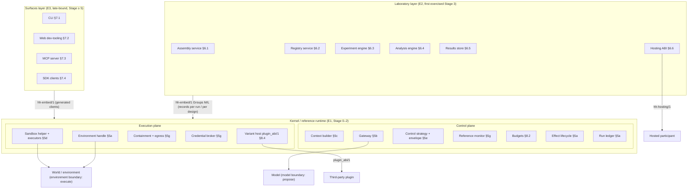

# HarnessHarness — Canonical Specification

**Version:** 1.0-rc2 · **Date:** 2026-09-11 · **Status:** assembled; adversarial review round 1 applied by the fixer pass (2026-09-11: 34 blocker/major findings, all applied) and review round 2 applied by the fresh fixer (2026-09-11: 38 blocker/major findings, all applied; CF-479…CF-486; OQ-469 — see the LEDGER Phase 5 rows); Decompose-Readiness Gate **PASSED** 7/7 (`spec/READINESS_REPORT.md`, 2026-09-11); hygiene pass applied (2026-09-11: every remaining `[[GAP: …]]` marker converted to an open-question note or resolved from a ratified ADR, residuals N1–N5 cleared, the mechanical review-lens minors applied, OQ-470/OQ-471 and CF-487 registered — `READINESS_REPORT.md` §10).

**Provenance.** Assembled from the ratified decision record ADR-0001…ADR-0216 (ADR-0001…ADR-0209 ratified at Phases 0–4; ADR-0210…ADR-0215 the Phase 5 deferral ADRs authored at assembly under doc 3 §8; ADR-0216 the fixer-authored deferral ADR for the review-raised gaps; ADR-0012/0025/0040/0066/0078/0093/0107/0124/0129/0133 and ADR-0210…0215 carry Phase 5 fixer amendment logs from review round 1; ADR-0014/0052/0057/0058/0059/0066/0104/0132/0143/0206 carry review-round-2 logs — CF-479…CF-486, and the T-LCD statements ADR-0057…0059 lacked), `registers/ontology.md` **v4** (five rows amended at the fixer pass under CF-468/472/473/474/475; the chain-event row under CF-483), `registers/spec-debt.md` (generated at the fixer pass under ADR-0198 D1; 216 rows), `registers/scope.md` (65 rows after the R-2.7.2 split; 64 `specified`/`specified-by-ADR`, 1 `deferred(ADR-0210)`), `registers/lcd-test-battery.md`, the Phase 0–4 synthesis memos' "settled" sections and `synthesis/l1-spike-spec.md`. Git commit: `<stamped by the orchestrator at the Phase 5 boundary commit>`. Sources-of-truth precedence: ratified ADRs → synthesis memos (ADR-0048/0145/0183/0208 reconciliations) → dossiers → registers. Section files: `spec/sections/01…11` (this document inlines them verbatim under a `## §N` heading that replaces each file's own title line; subsections are `### x.y` / `#### x.y.z`, subsystem specifications `### 05a.1 … 08.5` with their nine headings at `####`, uniformly).

**Binding conventions.** The product is **HarnessHarness**; "MetaHarness" appears only in historical citations and repository paths. Every normative claim cites a ratified ADR by number; contracts are operations, inputs/outputs, invariants and failure modes, language- and ecosystem-neutral under ADR-0050 §8. no `[[GAP: …]]` marker remains after the hygiene pass: a point no ratified ADR decides is an **Open question** blockquote — `> **Open question (non-blocking for Stages 0–3): OQ-nnn** — statement — owner; due stage; ratified default in force` — naming its `registers/open-questions.md` row (one such note, OQ-256 in §5e.1, carries the register's `blocking? = yes` flag and says so; it is recorded as a gate concern in `READINESS_REPORT.md` §10); `[[DEFERRED ADR-021x: …]]` marks a point deferred by a Phase 5 deferral ADR with an interim rule in force and an entry test. `provisional` evidence is never load-bearing for a C0 rule; C3/C4 items carry maturity flags (`instrument-grade` | `research-grade`) and matched-budget conditionality. `n/a{reason}` is a typed value, never 0. MUST-data / MUST-code follow ADR-0024. **Normative keywords:** in every contract, invariant, failure-mode and acceptance-criteria table the words "must", "never", "refuses", "only" and "always" are normative (RFC 2119 MUST / MUST NOT) whether or not capitalised; "may" is permissive (MAY); the spec issues no SHOULD-level recommendations — every recommendation is either a requirement or an open question in §11 (the single "SHOULD" in §7.2 quotes MCP's own transport rule); capitalised MUST-code / MUST-data are ADR-0024's placement classes, not keyword strength.


**Glossary check (Phase 5 fixer re-run, 2026-09-11; round 2 additions at the end).** Retired-spelling grep over the assembled document — the assembly list (`measurement.artifact.*`, `step_id`, bare `call_id`, `ResolvedDefinition`/"resolved definition", `RenderedRequest`, "results ledger", "Harness ABI", "HTIR", "Bench", `research_grade`/`experimental` as maturity values, `ChildResult`, `Cue.peer_message`, `snapshot_scope[]`, `detach_to_owner`, `retired{reason: consolidated}`, `imported` as an authority class, "last-writer-wins", unqualified "the ABI", "MetaHarness") plus the spellings retired by the fixer's CF rulings (`router_alternate`/"router alternate", `summarizer`/`shim_interpreter`/`subagent(class)` as `ModelRole` values — CF-468; `decision ∈ {timeout, abandoned}` — CF-469; ADR-0107's `context_window_exceeded`/`sandbox_denied`/`executor_lost`/`server_overloaded`/`stream_idle`/`empty` — CF-470; `workspace_tree`/`process_image`/`full_vm` — CF-472; `episodic`/`procedural_note` — CF-473; `Δ` for the decision-point set — CF-474; "Hydra" — CF-475; `classify_home_plane`; `benefit_kind ∈ {artifact, search_time, …}`; "§05e L8"; `R-2.12.x`/`R-2.5.x` as scope ids; `#5` for doc 3's item 5) — **clean**: every residual occurrence is a retirement statement (§1.7, §2.11, §3.2.3, §5e.2), one of the CF mapping tables that read the old spelling into the ratified one (§3.2.3, §5a.4, §5c.3, §5e.2, §5g.6), a historical citation ("MetaHarness"/"meta-harness" in §1.1, §1.7, ADR-0003's title in Appendix B; "HarnessFix HTIR" as a source name in §1), ADR-0192's own "no last-writer-wins" wording, or the helper-protocol field `sandbox_denied?` of ADR-0100 D5 (§5d.5, not the error sum). Recorded for the readiness glossary pass: "E1–E4" names both ADR-0022's equivalence obligations and the memory-lifecycle invariants (§5c, §9); "meta-harness document shape" (ADR-0150) and "meta-harnessing" (ADR-0196) are ratified wordings read against AC-A2-7; the bare noun "capability" is to be scanned for unregistered senses; the scope register's summary table (60 items) lags its 65 rows — register hygiene. **Round 2 (2026-09-11):** the sweep was re-run over the spellings the round-2 CF rulings retire — `stop{environment_lost}` and a bare `escalation_unresolved` stop reason (CF-479), `allow_pattern`/`reject_once`/`reject_always`/`allow_always` as `ApprovalOption.kind` values (CF-480; the ACP-lowered names survive only in lowering rows), `stop_reason ∈ {end, …, length, …, aborted}` on `Cue.model_completed` (CF-481), `security.egress.attempted/blocked` (CF-482), `detector ∈ {deterministic, judged}` as the chain sum (CF-483), `scopes_ok`/`blobs_ok`, `context.compaction.completed{status: ok}`, `Memory{kind: episodic}`, `artifact_id` as an identifier, a two-valued `OpenSpec.mode`, `R-2.9.5`/`R-2.10.5` as the WS-L4/Hosting-ABI scope ids in §5b, and `R-2.2.3⁰`/`R-2.2.4⁰`/`R-2.9.4⁰`/`R-2.9.6⁰`/`R-2.11.1⁰`/`R-2.1.4¹` as unsplit node names — **clean**: every residual occurrence is a retirement statement, a CF mapping row that reads the old spelling into the ratified one, or an ACP lowering row. **Round 2 (2026-09-11):** the sweep was re-run over the spellings the round-2 CF rulings retire — `stop{environment_lost}` and a bare `escalation_unresolved` stop reason (CF-479), `allow_pattern`/`reject_once`/`reject_always`/`allow_always` as `ApprovalOption.kind` values (CF-480; the ACP-lowered names survive only in lowering rows), `stop_reason ∈ {end, …, length, …, aborted}` on `Cue.model_completed` (CF-481), `security.egress.attempted/blocked` (CF-482), `detector ∈ {deterministic, judged}` as the chain sum (CF-483), `scopes_ok`/`blobs_ok`, `context.compaction.completed{status: ok}`, `Memory{kind: episodic}`, `artifact_id` as an identifier, a two-valued `OpenSpec.mode`, `R-2.9.5`/`R-2.10.5` as the WS-L4/Hosting-ABI scope ids in §5b, and `R-2.2.3⁰`/`R-2.2.4⁰`/`R-2.9.4⁰`/`R-2.9.6⁰`/`R-2.11.1⁰`/`R-2.1.4¹` as unsplit node names — **clean**: every residual occurrence is a retirement statement, a CF mapping row that reads the old spelling into the ratified one, or an ACP lowering row. **Hygiene pass (2026-09-11):** the same sweep re-run over the assembled v1.0-rc2 body against the v1.0-rc1 body — no retired spelling gained an occurrence (the N1 cell `benefit_kind = search_time}` is gone; `MetaHarness`/`meta-harness` occurrences unchanged: the historical citations of §1.1/§1.7, ADR-0003's title in Appendix B, ADR-0196's "meta-harnessing" label and ADR-0150's "meta-harness document shape"); the hygiene pass introduced no new vocabulary beyond the four §2.11 rows (target/lowering/lifting/lowering loss report, sealed definition, Compiled Bundle, `LcdReport`) lifted from `registers/ontology.md` — **clean**.

**Gap sweep (Phase 5 assembly, updated at the fixer pass).** 275 `[[GAP: …]]` markers were collected from the section files at assembly; 2 were resolved from ratified ADRs, six deferral ADRs (ADR-0210…ADR-0215) converted 166 into `[[DEFERRED ADR-021x: …]]` markers or §11 cells, and 109 remained. The fixer pass (review round 1) resolved the `EnvSnapshot`/`SnapshotRecord` conflict (CF-472), the two `MemoryKind` sums (CF-473) and the `classify_home` naming (CF-474 companion), and authored ADR-0216 for the three points no ratified ADR decides — the per-kind `classify_home` table (OQ-467), the `control.work_item.*` audit-field partition (OQ-465 second half) and the five CLI verbs without a stable `hh-embed/1` operation (OQ-468) — so the document carried **108 `[[GAP: …]]` markers** after round 1 (the 98 program-level questions of §11.4.3 owned and due at a named stage; the four memory-plane defaults of §5c; the egress-family spelling of ADR-0066 D2 in §5g; the `refused_by_kernel` derivation of §7.1; the §10.2 seventh-gate generalization, CF-476; and the remaining per-section open questions each naming its OQ row) and **98 `[[DEFERRED ADR-021x: …]]` markers**. Review round 2 (2026-09-11) closed ten more from ratified ADRs (OQ-328, 285, 297, 229, 161, 179, 119, 344 were resolved at Phases 2–4 but still marked; the ADR-0066 D2 egress spelling by CF-482), re-keyed OQ-299 and OQ-256 as program-level questions with their interim rules in §11.4.3, and opened OQ-469 (`ValidatesRecord` dialect home) for the residual of OQ-266, so the document now carries **98 `[[GAP: …]]` markers** and **96 `[[DEFERRED ADR-021x: …]]` markers** (opening tokens counted over the section files; this front matter's own mentions excluded). Every gap is either an OQ row with an owner and a stage or a CF row for the readiness pass; none is a decision this document takes. **Hygiene pass (2026-09-11):** the 98 remaining markers were cleared — 97 converted to **Open question** blockquotes naming their register row, owner, due stage and ratified default (two of them on new rows OQ-470 `refused_by_kernel`, CF-487, and OQ-471 the CF-476 seventh-gate generalization), 1 resolved by the ratified deferral ADR-0216 (§7.1: the nested `[[GAP:` opener dropped, the `[[DEFERRED ADR-0216: OQ-468 …]]` marker stands), and the §5e.1 note for OQ-256 carries the register's `blocking? = yes` flag (gate concern, `READINESS_REPORT.md` §10). The document now carries **0 `[[GAP: …]]` markers**, **96 `[[DEFERRED ADR-021x: …]]` markers** and 97 open-question notes (opening tokens counted over the section files; this front matter's own mentions excluded).

## Reader's guide

**Program documents.** "doc 1", "doc 2" and "doc 3" are the program's rationale sources, not normative text: doc 1 = `docs/1_harness_engineering_frontier_report.md` (the frontier report); doc 2 = `docs/2_Harness_Engineering_Genealogy_Anatomy_2026_Frontier_v2.md` (the genealogy/anatomy — the seven-plane source and the §11 stages, §12 mechanisms); doc 3 = `docs/3_MetaHarness_Meta_Plan_and_Research_Ledger.md` (the meta-plan and research ledger — the §7.2 spec template, the §7.3 readiness gate, the §3.1 evidence rule, the §8 deferral rule). A bare "§7.2 #5"/"§7.2 item 5" cited beside "doc 3" is that document's section, never this spec's §7.2 (R-2.11.2). Every normative statement cites a ratified ADR; the docs are cited only as rationale.

1. **§1–§3** state what HarnessHarness is (thesis, non-goals, LCD battery), the ontology every section uses (two levels, seven planes, two boundaries, participant classes, validity vs compliance) and the Harness IR with its compilation and assembly contracts.
2. **§4** is the map: the control/execution-plane split, the three process layers and three bindings, the C0 Core and C1–C4 extension tiers as a checked dependency DAG.
3. **§5a–§5i, §6, §7, §8** are the subsystem specifications. Every scope item is specified under nine headings — responsibility, interface contract, data model, dependencies, failure modes, security & provenance obligations, acceptance criteria, test-matrix hooks, build-stage assignment — with its tier map at the head of the section (§2 carries the same nine for R-2.1.1 under 2.9.1–2.9.8). **Acceptance-criterion ids:** every subsystem criterion has the canonical id `AC-R-<item>-n` and a dossier alias `AC-<WS>-n` given in parentheses at its definition (the workstream code `WS-…` of each scope item is the third column of Appendix A, so `AC-K4-2` resolves to R-2.11.4 and "§5 (D1)" to R-2.4.1 without leaving this document); §2/§3 keep their prefixes `AC-A2-`, `AC-IR-`, `AC-CP-`, `AC-CC-`; cross-references prefer the canonical id. Subsystem headings are numbered `05a.1 … 08.5` uniformly (§5a.1 = R-2.2.1, §5c.1 = R-2.4.1, §5d.5 = R-2.5.5). §8's schemas are canonical; other sections cite them.
4. **§9** places every slice on the Stage 0→6 ladder with gating acceptance criteria, removability builds and the Stage-0 spike as acceptance check; **§10** states which criteria are preconditions of a claim; **§11** records the non-goals, the deferrals (ADR-0210…ADR-0216) and the open questions by stage.
5. **Appendix A** maps every scope item to its section, tier, first stage, ADRs and status; **Appendix B** indexes every ADR to the sections that cite it.
6. Readers building Stage 0 follow §9.1; readers auditing readiness follow Appendix A, §4.4's verification statement, §9.8 and §10.8.

## Table of contents


- [§1 Vision, thesis and non-goals](#sec-01)
- [§2 Ontology and formal model](#sec-02)
- [§3 Harness IR and compilation](#sec-03)
- [§4 Architecture overview](#sec-04)
- [§5a Subsystems — runtime and durability](#sec-05a)
- [§5b Subsystems — model plane](#sec-05b)
- [§5c Subsystems — context and memory](#sec-05c)
- [§5d Subsystems — tools and action](#sec-05d)
- [§5e Subsystems — control and orchestration](#sec-05e)
- [§5f Subsystems — verification](#sec-05f)
- [§5g Subsystems — security and governance](#sec-05g)
- [§5h Subsystems — measurement and evolution](#sec-05h)
- [§5i Subsystems — organizational layer](#sec-05i)
- [§6 The Harness Lab](#sec-06)
- [§7 Surfaces](#sec-07)
- [§8 Cross-cutting contracts](#sec-08)
- [§9 Staged build ladder](#sec-09)
- [§10 Evaluation and reproducibility plan](#sec-10)
- [§11 Deferred and out-of-scope items](#sec-11)
- [Appendix A — Coverage matrix](#app-a)
- [Appendix B — ADR index](#app-b)


<a id="sec-01"></a>

## §1 Vision, thesis and non-goals


*Authority: ADR-0001, 0003, 0004, 0005, 0006 (amended P0, P3), 0007 (amended P4), 0008, 0010, 0011; WS-A1, WS-L7; `registers/lcd-test-battery.md`; R-2.12.5. Vocabulary per `registers/ontology.md` §6; "MetaHarness" appears only in quoted historical text (ADR-0011).*

### 1.1 Vision

The sponsor's brief asked for "the most sophisticated, generic, modular, extensible meta-harness framework on the market" and the ability to "compare everyone's" harness. Doc 3 §1.1 declined the literal reading: maximal genericity is the **lowest-common-denominator (LCD) trap** — an abstraction admitting only the intersection of its targets' behaviours hides the model-conditioned features that drive performance and is routed around until vestigial (WS-L7 F1; S-154, S-152, S-035). The centre of gravity is **comparability under a portable behavioural representation** (ADR-0003).

Two Phase 0 narrowings complete the vision. "Compare everyone's" is not the differentiator: a comparison plane spanning controlled and uncontrolled participants exists in five independent systems, one Tier-A (Harbor S-132/S-133; HAL S-134/S-135; Inspect AI S-136/S-137; Omnigent S-118; Harness-Bench S-062) — ADR-0004 refuted the Preflight `novel` flag; ADR-0001's decision stands on precedent. And no mature coding harness imports a general-purpose framework for its core loop (S-074; WS-A1's reading of seven runtimes; CF-009 resolved), so competing on framework adoption has no whitespace (ADR-0003). What survives is **component-level harness science**: a white-box participant class decomposable through a typed IR, a laboratory that varies one component under matched budget, and integrated mechanisms cited against partial prior art.

HarnessHarness is therefore a **research instrument and reference runtime for harness engineering** (ADR-0003 decision 1). "Framework" never describes HarnessHarness; it names what others build on top (ADR-0008 rule 2). Adoption pressure sits on the IR's external edges — ACP (the Agent Client Protocol), MCP (the Model Context Protocol), trajectory interchange, export — never on the loop (ADR-0003, ADR-0005). The reference runtime is opinionated, minimal and event-sourced; its purpose is instrument validity (ablation, attribution), not hosting third-party core loops (ADR-0003 decision 4).

### 1.2 The HarnessHarness thesis

ADR-0006 decision 1 adopts the WS-L7 §6.1 paragraph verbatim; it is reproduced with the product name substituted per ADR-0011, the only permitted change:

> **HarnessHarness is a research instrument and reference runtime for harness engineering, not another agent framework.** Its load-bearing capability is that any harness expressed in its behavioral Harness IR — a typed, provenance-bearing representation of all seven harness planes — can be assembled from swappable component variants, compiled per model profile and protocol target without loss of model-specific behaviour, executed on a deterministic runtime, and compared against any other harness (native or hosted) as an explicit model × harness × environment × budget configuration under shared evals. The instrument is what is new: existing frameworks give you *a* harness; existing leaderboards compare *opaque* harnesses; HarnessHarness makes the harness itself the decomposable, attributable, evolvable experimental variable, and proves the representation is real by running a reference harness on it.

"Deterministic runtime" in the thesis paragraph means that the reference runtime's decision path is a deterministic function of the run ledger and is replayable as such (ADR-0028; ADR-0135 — sources are substituted only in deterministic replay); model sampling, environment and served-model drift are not eliminated but recorded and classified by the reproducibility levels R0–R3 of ADR-0038 (§10.4), which is why every effect is paired and seeded (§2.5.6) and why attribution may be reported infeasible under nondeterminism (§1.4 (b); ADR-0004 (d)). The gloss is the spec's reading of the mandated sentence, not an edit to it (ADR-0006 decision 1).

The thesis has three parts, each tied to a test (WS-L7 §6.1; ADR-0006 decision 4): the *representation* is judged by T-LCD-04 (one definition → two Model Profiles × two targets) and T-LCD-03 (a reference harness round-trips); the *instrument* by T-LCD-09 (interaction effects) and T-LCD-14 (un-budgeted comparisons refused); the *mechanisms* by their own acceptance criteria plus reflexive expiry (T-LCD-05).

**Falsifiability (ADR-0006 decision 4).** If the reference harness cannot round-trip through the Harness IR (T-LCD-03), or one definition cannot compile to two profiles × two targets with semantics preserved (T-LCD-04), the IR is an LCD wrapper and the thesis fails. Both are C0/Stage 3 executable tests; the build ladder (§9) places them **before** profiles (Stage 5) and evolution (Stage 6) (ADR-0007 decision 2).

**Conditionality.** Holds for any model tier and task class; assumes models keep family-specific tool/prompt conditioning (S-107, S-110, S-145, S-049). If conditioning converges, the profile tier is descoped by ADR without touching the comparison claim, because T-LCD-05 applies to the Profile Compiler itself (ADR-0006 (d); ADR-0007 decision 6). No `provisional` performance number is load-bearing: the 2026 preprints corroborating "harness is a policy intervention with model-conditioned effects" (S-062, S-072, S-088, S-148) supply mechanism only, backed by Tier-B production reports (S-047, S-049) and pinned-commit source (doc 3 §3.1; ADR-0006 amendment log).

### 1.3 Two participant classes, one comparison plane, and the hosting stance

ADR-0001 (pre-ratified; evidence amended by ADR-0004, decision unchanged) fixes **native-primary, hosting-as-participant**:

| element | ratified content | source |
|---|---|---|
| White-box core | Harnesses in the Harness IR (HIR) on the reference runtime; components swapped, ablated, attributed, evolved | ADR-0001; ADR-0003 |
| **IR-native participant (white-box)** — *native participant* | θ is a Harness Definition known to the Lab; the compiled harness is transparent; all three comparison granularities admissible | ADR-0001; ADR-0008; ADR-0013; §2 |
| **Hosted-external participant (black-box)** — *hosted participant* | Joined through the **Hosting ABI** (ABI — application binary interface; the ratified *thin observational ABI*: start/resume/cancel · stream events · supply context/tools/skills · request permission · account cost); shares environments, evals, scorecards, cost/latency/audit; never decomposable; `configuration-level` (SUPPORTED coordinates only) and `product-level` granularity | ADR-0001; ADR-0004; ADR-0013; ADR-0164 |
| One comparison plane | One experiment/eval/scorecard/analysis surface for both classes; component-level analyses only for native participants; every metric class-scoped, inapplicable cells `n/a`, never 0 | ADR-0001; ADR-0004; ADR-0045; T-LCD-15 |
| Class declared, never inferred | The participant descriptor declares class, hosting mechanism, capability declaration, observability level; "grey-box" is a level, never a third class | ADR-0013; §2 |
| Hosting first-class but secondary | Hosting ABI = minimum observable event set + capability declaration, neutral across session-ABI, model-boundary interception, container-installed; session-ABI first | ADR-0001; ADR-0005; ADR-0164…0166; §6 |
| Interoperate, don't duplicate | Typed native run ledger; interchange export (compatible with Harbor's Agent Trajectory Interchange Format, ATIF, or a documented mapping) and `product-level` import; HarnessHarness can act as a participant in Harbor/Inspect/Omnigent-style planes via an ACP-style session | ADR-0005; ADR-0018; ADR-0098; ADR-0141; §6 |
| Conformance is data | Capability declaration reconciled against probes into a capability vector `{declared, probed, unknown}`; DRIFT stored as experimental data; `unknown` never coerced | ADR-0004; ADR-0166; T-LCD-07 |

**Two-step delivery (ADR-0010, mandatory wording).** *Cross-participant comparison is delivered in two steps — native-vs-native comparison at Stage 3 (evaluation-first), hosted participants joining the same plane at Stage 4 via the Hosting ABI, session-ABI mechanism first (ADR-0005).* External-harness hosting (R-2.10.6) is MoSCoW (Must/Should/Could/Won't) **Should** at tier C2 (ADR-0010; CF-014 resolved); readiness does not require any specific external harness to be integrated (ADR-0001). The C0/Stage-1 prerequisites that make the plane class-aware from the start — participant descriptor, class/observability stamps on every ledger event, `MetricDeclaration` — are **Must** by inheritance (ADR-0010 decision 3; ADR-0013; ADR-0026; ADR-0045).

**Conditionality.** Participants exposing none of the three mechanisms are excluded, never accommodated by loosening the native path; container-installed cost attribution carries lower, stamped confidence (ADR-0001/0005; ADR-0039; ADR-0165).

### 1.4 Differentiation: novel, precedented, renamed

Doc 3 §3.4 confined novelty to (i) the comparison-first ontology + IR, (ii) the lab, (iii) the doc 2 §12 mechanisms; two independent audits narrowed each identically (WS-A1 §5–§6; WS-L7 §5; CF-010/011/015). ADR-0006 decision 2 fixes the **only three novelty statements** this spec may make; any "novel" must name the prior art it is novel relative to.

| id | narrowed statement (ADR-0006 decision 2) | novel relative to | status after Phases 1–4 |
|---|---|---|---|
| (a) | First IR spanning all seven planes — `Permission`, `Effect`, `Validator`, `Budget`, `Memory` with validity, `HarnessRule` with assumption-debt fields alongside agent/tool/flow entities — with provenance and authority on every entity and **profile-compiled lowering**, designed for comparison | Open Agent Spec (S-138/S-139: versioned IR, six adapters, evaluation package — agent/tool/flow/LLM-config only); AutoGen `ComponentModel` (S-145); DSPy (S-144); AgentSquare (S-024); GPTSwarm/ADAS (S-020/S-023); HarnessFix HTIR, a *trace* IR (S-146); PRISM (S-093); LangGraph (S-143) | **CF-011 `resolved-conditional`.** WS-A3 condition discharged on paper at Phase 1 (ADR-0015/0016; ADR-0033); WS-C3/E2 condition at Phase 2 (ADR-0124…0126; ADR-0090/0091). **Executable proof remains T-LCD-03/-04 at Stage 3**; on failure the claim reverts to "renamed" (ADR-0006). |
| (b) | A lab that varies **one component under matched budget** across native participants and admits hosted participants on the same plane **without weakening native contracts** | Harbor (S-132), HAL (S-134/S-135, Tier A), Inspect (S-136/S-137), Omnigent (S-118), Pi eval tables (S-113) — opaque participants, no component variation or attribution | Specified (ADR-0147…0163) with T-LCD-09/-14/-15 as engine preconditions; hosting with T-LCD-06/-07 pass on paper (ADR-0164…0166); attribution ADR-0199…0201. If attribution proves infeasible under nondeterminism, the "causal attribution" clause is softened; ablation remains (ADR-0004 (d)). |
| (c) | The §12 mechanisms — IR + compiler, assumption-debt manager, safe adaptive optimizer, execution-alignment layer, trust-aware memory, capability kernel, benchmark science — as **integrated contracts with provenance and expiry** (`novel as integrated`) | DSPy adapters/optimizers; AutoGen `ModelInfo` (no evidence/expiry); CaMeL/Fides (S-099/S-101); HAL Pareto analysis; Meta-Harness, PRISM, Prime `/refine` — optimizers without a governed pipeline (WS-A1 F8) | Specified (ADR-0051…0053; ADR-0112…0114; ADR-0078…0083; ADR-0194…0201). **Evidence discipline:** every C3/C4 member carries `maturity ∈ {instrument-grade, research-grade}` and matched-budget conditionality (ADR-0194 decision 6; ADR-0208 §5; CF-463); `research-grade` results are `preview`-labelled and never ground a program claim. |

Further no-precedent items (WS-A1 §6.2) are claimed only in their owning sections: expirable profiles (§3; ADR-0020/0124); declared ⇄ observed conformance as a factor (§6; ADR-0166); the governed evolution pipeline (§5; ADR-0194/0195); the capability kernel (§5; ADR-0051); the assumption-debt manager (§5; ADR-0197).

**The "renamed" list (WS-A1 §6.3; ADR-0003 decision 3).** These exist elsewhere; the spec *cites and conforms* and claims only the typed content named. Every ⊕ NEW / ↑ EXT scope item carries a `precedent | renamed | novel` annotation in its owning section (WS-A1 §4c/§6.2/§6.3; ADR-0184, ADR-0209); the readiness report checks it.

| capability | renamed from | claimed |
|---|---|---|
| Assembly / Harness Definition (R-2.1.4, R-2.10.1) | Omnigent agent YAML, OpenHands `AgentProfile`, AutoGen `ComponentModel`, AgentCore/Agent Framework config, Agent Spec | typed component *variants*; definition is data (ADR-0023) |
| Hosting / Hosting ABI (R-2.10.6) | ACP, Omnigent `Executor`, Codex app-server, Harbor installed agents, Inspect bridge | **nothing** — `renamed`; cite and conform (ADR-0004/0005; ADR-0184) |
| Run ledger (R-2.2.1) | OpenHands `EventLog`, Pi entries, LangGraph checkpoints | what is typed on events: effects, provenance, authority, class stamps (ADR-0026) |
| Experiment engine (R-2.10.3) | Harbor `JobConfig`, HAL runner, Pi, agbench | factor set, cross-class joins, refusal set (ADR-0154; ADR-0184) |
| Results store / leaderboard (R-2.10.5) | Harbor Hub, HAL, OpenHands eval CDN | admission by validated object; class strata; matched budget or no rank (ADR-0161…0163) |
| Reproducible bundle (R-2.9.3) | Harbor trial dir + ATIF; Omnigent agent image | profile + permissions + policies + provenance + `LcdReport` (ADR-0139…0141) |
| Component families: compaction, critic/verification, control strategies, sub-agent orchestration | OpenHands condensers/`CriticBase`, Inspect, Pi, Harbor verifier, ReAct/FSM (LangGraph, Agent Spec), Prime RLM, Omnigent/Claude Agent SDK/AutoGen sub-agents | model-conditioned variants inside the contract (T-LCD-08); one verdict record, no default judge (ADR-0047/0110); the control boundary β as a factor (ADR-0012); one `spawn`, one `MergePolicy` (ADR-0185…0187; ADR-0208) |

### 1.5 Canonical non-goals N1–N13

ADR-0006 decision 3 (amended P0 by CF-019, P3 by CF-342) is the **only** non-goals list in this spec; ADR-0003's five map to N1, N2, N4, N3, N13.

| id | non-goal | rationale | specified instead in |
|---|---|---|---|
| **N1** | Not a general-purpose framework for other products' core loops | S-074; WS-A1 F5; CF-009/012 (ADR-0003) | §3 (IR edges); §7 embedding (R-2.11.4; ADR-0176) |
| **N2** | Not a universal Harness ABI others must implement; the Hosting ABI is thin, observational, ours, and never treats hosted participants as decomposable | doc 2 §5.11; ADR-0001; T-LCD-06/-07 | §6 (ADR-0164…0166) |
| **N3** | Not a hosted collaboration platform / managed multi-device hosting product | Omnigent S-118, Cloudflare S-056, AWS S-058 own that plane (CF-013) | §6 |
| **N4** | Not a public leaderboard service — *the Lab's own leaderboard definition + snapshot views over its results store, and their publication as ADR-0141 exports, are in scope (R-2.10.5; ADR-0163)* — hosting exists for joint native/hosted science and interoperation with existing planes (ADR-0005) | HAL S-135 is that service (CF-342) | §6 (ADR-0161…0163); §10 |
| **N5** | Not a new tool/agent/client protocol; MCP, A2A (the Agent-to-Agent protocol), ACP are lowering targets and Hosting-ABI substrates | doc 2 §5.10; S-035; S-153 | §3 (ADR-0021); §5 (ADR-0096…0099) |
| **N6** | Not behavioural interchangeability of models; one semantic definition compiled per Model Profile, never "works the same" unmeasured | doc 2 §4; S-049; S-047 | §3 (ADR-0020); §5 (ADR-0124…0126) |
| **N7** | Not a claim that generic beats bespoke; the Lab measures the gap; the reference harness may lose on bespoke home turf | S-075 (`provisional`); CF-009 | §6; §10 |
| **N8** | Not autonomous self-deployment; evolution proposes, governance deploys | ADR-0002 (i)–(iv); doc 2 §11 Stage 6 | §5 (ADR-0194/0195 G1–G10; ADR-0053 D-5) |
| **N9** | Not a model-training stack; HarnessHarness never trains | ADR-0002; ADR-0202 | §5 (ADR-0202…0204, `research-grade`; R-2.9.8 conditional, ADR-0209) |
| **N10** | Not an IDE, chat product or end-user assistant surface | doc 3 §2.11 | §7 (ADR-0167…0179) |
| **N11** | Not merely an evaluation harness; the object of study is runtime harnesses | doc 2 §1; ontology §4a | §2; §10 |
| **N12** | Not a language/runtime/framework commitment before WS-L1 — **discharged** by ADR-0050, whose §8 constraint governs every contract here (ecosystems named only by ADR id and layer) | RK-09; ADR-0009/0050 | §4; §8 |
| **N13** | Not a benchmark author; benchmarks are integrated, not invented | WS-A1 §6.1; ADR-0005; CF-019 | §5 (ADR-0142…0144); §10 |

Reversing N1 would re-open the LCD trap and is the reversal ADR-0006 makes deliberate; widening into N1, N2, N5, N6 or N12 requires a superseding ADR (phase-0 memo §5.1).

### 1.6 The LCD-trap battery as a binding design constraint

The stance *stable semantic interface + model-conditioned compilation* (doc 3 §1.2) is a check, not a principle. ADR-0007 adopts T-LCD-01…15 (WS-L7 §6.3, verbatim in `registers/lcd-test-battery.md`) as **binding acceptance criteria**. Failure signatures: **feature intersection**, **untyped escape hatches**, **silent loss on lowering** (S-154); antidote: **capability declaration + verified probing + typed extension slots + per-target compilation** (S-152, S-035, S-153). Binding rules (ADR-0007 decisions 1–6): each owning section carries an acceptance-criterion line encoding its tests, and the readiness report's 15-row matrix (test → section → criterion → stage → status) **cannot pass with any row "not encoded"**; the compiler exposes `lcd_report(harness_def, profiles[], targets[]) → LcdReport` and treats `UnexpressibleSurface(entity, profile)` as an **error**, never a warning; the engine refuses un-budgeted arms; `LcdReport` is stored in the bundle (§3, §6, §8; ADR-0139); any ADR introducing an abstraction spanning models, targets or participants states which tests it satisfies, and a "does not" without mitigation is grounds for rejection — every Phase 1–4 ADR that introduces an abstraction spanning models, targets or participants carries a T-LCD statement checked at its phase synthesis (application records in `registers/lcd-test-battery.md`; the reconciliation and scope-register ADRs — ADR-0048/0145/0183/0208, ADR-0049/0050, ADR-0146/0184/0209 — introduce none and are exempt), and the Phase 5 fixer pass found ADR-0057…0059 without one and supplied them by amendment log (2026-09-11); reflexively, the Profile Compiler and Hosting ABI carry assumption-debt records so convergence triggers documented descoping.

| test | criterion (must hold) | class · stage | discharged by |
|---|---|---|---|
| **T-LCD-01** Model-specific tool shape without escape hatch | One `ToolCapability` → profile-differing surfaces; zero per-model branches in the IR; divergence only in profile-owned fields | static · C0/S1 | ADR-0015/0016; ADR-0020; ADR-0124 (closed rule kinds); ADR-0090; ADR-0022 |
| **T-LCD-02** Opacity budget | Surfaces typed; free text only as a `Text` leaf with provenance/owner/authority; opacity ratio reported; leaves ablatable | static · C0/S1 | ADR-0015 (leaf kinds; ratio per OQ-036 with ADR-0045); ADR-0019; ADR-0124; ADR-0092 |
| **T-LCD-03** Behavioural round-trip | A Stage-0 reference harness in HIR reproduces its original within pre-registered equivalence | executable · C0/S3 | ADR-0015/0019 (`equivalence_run`); ADR-0022 E1–E7; ADR-0124 (null profile); ADR-0156 (`equivalence` kind); anchor per OQ-039 (ADR-0144) |
| **T-LCD-04** Two targets × two profiles | One definition → ≥2 profiles and ≥2 targets, semantics preserved by executable validators | executable · C0/S3 | ADR-0019/0020 (two minimal profiles); ADR-0021 (MCP C0/S3); ADR-0090; ADR-0124; ADR-0173 |
| **T-LCD-05** Every conditioned rule expires | Every profile-owned rule carries hypothesis, evidence, owner, expiry, removal test; refused otherwise; reflexive | contract · C0/S1–3 | ADR-0016; ADR-0020; ADR-0124/0126; ADR-0166; ADR-0197 (`DebtHomes/1`, typed `RemovalTest`); ADR-0198 |
| **T-LCD-06** Hosted participants never weaken native contracts | Hosting changes no native contract and is removable; no IR → Hosting-ABI edge | static · C0/S1 | ADR-0018 (`OpaqueProcess`); ADR-0025 (`hosting_edges = []`); ADR-0164/0166; ADR-0182 (removability builds); ADR-0205 |
| **T-LCD-07** Declare, verify, stratify — never intersect | Declared, probed, undeclared = UNKNOWN; features never removed; comparisons stratify | hosting · C2 | ADR-0164; ADR-0166 (`hh-hosting/1`, probes P-01…P-16, DRIFT — the T-07 row); ADR-0099; ADR-0152/0181 |
| **T-LCD-08** Component contracts see the profile | Every component-class contract receives Model Profile and resource accounting | contract · C0/S1–3 | ADR-0023; ADR-0124; ADR-0181 (`bind`); ADR-0185 |
| **T-LCD-09** Interaction effects representable | Model × harness × environment × budget × seed explicit; interactions reported, never one score | contract · C0/S1–3 | ADR-0045; ADR-0154; ADR-0158 (`contrast`); ADR-0161; ADR-0186 |
| **T-LCD-10** Names are surfaces, identities semantic | Identity content-addressed over semantics; rename is a profile diff | static · C0/S1 | ADR-0015; ADR-0017 (`SurfaceEdit`); ADR-0036; ADR-0124; ADR-0163 |
| **T-LCD-11** Lowering lossless-or-declared-lossy | Metadata through typed slots; lowering loss report; lifting recovers the rest | executable · C0/S3 | ADR-0019/0021; ADR-0018; ADR-0141; ADR-0164/0166; ADR-0173; ADR-0202 |
| **T-LCD-12** Contracts are operations, not inheritance | No subclassing/import of a framework object; implementable out of process | static · C0/S1 | ADR-0023/0025; ADR-0050 §8; ADR-0176 (`hh-embed/1`); ADR-0181 (`plugin_abi/1`) |
| **T-LCD-13** Compliance observable separately from validity | *delivered / activated / followed* events with artifact ids | executable · C0/S3 | ADR-0014; ADR-0026 (CF-101 identifiers); ADR-0042; ADR-0045; ADR-0125 |
| **T-LCD-14** No un-budgeted comparison | Arms without a matched budget refused; search-time and artifact benefit separated | contract · C0/S1–3 | ADR-0041; ADR-0046; ADR-0155; ADR-0157; ADR-0163 L4; ADR-0194 (`matched_total`) |
| **T-LCD-15** Class-scoped metrics | Every metric declares classes and observability levels; hosted component metrics `n/a`, never 0 | contract · C0/S1–3 | ADR-0013; ADR-0045 (`MetricDeclaration`, `n/a{reason}`); ADR-0165; ADR-0157; ADR-0161 |

Gate placement (ADR-0045; OQ-037): T-02/-09/-14/-15 are automated gates; T-03/-13 executable tests with review items. Static and contract tests are unconditional; executable tests assume the Stage 3 suite, run on the coding/terminal domain first, with T-03 margins pre-registered per suite (§10). The tests check expressibility, declaration and reporting, not performance; no `provisional` number is load-bearing (ADR-0007 (d)).

### 1.7 Naming and vocabulary

- **Product name: HarnessHarness** (ADR-0011; resolves OQ-035/CF-013). "MetaHarness" collided with a harness generator (S-149), an optimizer implementation (S-150), the Stanford *Meta-Harness* paper/repo (S-080/S-151) and Omnigent's "the open-source meta-harness" (S-118) — where "meta-harness" already means the hosting plane disclaimed by N3. "HarnessHarness" is the proper noun only: the runtime is *the reference runtime*, the instrument *the Harness Lab*; no sub-concept uses "meta-"; docs 1–3 and Phase-0 artifacts keep the old string as history; the glossary check flags any other residual.
- **Canonical names** (ADR-0008; Ontology §6): *Harness IR (HIR)*, dialects HIR/1, HIR/2 (never "HTIR"); *Harness Definition*; *native participant* / *hosted participant*; *comparison plane*; *Harness Lab* (never "Bench"); *Hosting ABI* (never "Harness ABI"); *Model Profile* / *Profile Compiler*; *target* / *lowering* / *lifting* / *lowering loss report*; *configuration* / *arm*; *component class* / *component variant* ("plugin" = third-party packaging); *conditioned rule* / *assumption-debt record*; *class-scoped metric*; *capability declaration* / *capability vector*; *LCD trap*, *escape hatch*, *opacity ratio*, *surface vs semantic identity*. First use expands; "framework" never describes HarnessHarness; brands are aliases; the glossary check fails on unregistered synonyms.
- [[DEFERRED ADR-0210 (OQ-035 follow-up): the public qualifier line for "HarnessHarness" and the collision re-check for the new name (repositories, packages, trademarks) ordered by ADR-0011 are WS-L6 Phase 5 deliverables; WS-L6 is `todo`, so no qualifier text or re-check result exists to cite. This section states the name and rules only.]]

### 1.8 Scope coverage and cross-references

| scope item | disposition here |
|---|---|
| **R-2.12.5** Thesis & naming (Must; WS-L7) | **Specified**: §1.2–§1.7 (qualifier line = WS-L6 gap). A program row: the nine-heading subsystem template of doc 3 §7.2 item 5 is inapplicable (a decision, not a subsystem); its acceptance is the glossary/annotation checks of the readiness report |
| R-2.10.6 Hosting (Should, C2) | Stance and two-step delivery §1.3; contracts §6 (ADR-0164…0166) |
| R-2.10.5 Results/leaderboard (Should, C1) | N4 boundary §1.5; contracts §6 (ADR-0161…0163) |

Obligations on other sections: §2 formalizes participant classes, granularity, observability level (ADR-0012/0013); §3 specifies `lcd_report`, `UnexpressibleSurface`, the lowering loss report, the two minimal profiles (ADR-0019…0022); every subsystem section carries its T-LCD criterion line and `precedent | renamed | novel` annotation; §6 marks hosting *secondary* and states black-box comparison is precedented (ADR-0004); §9 places T-LCD-03/-04/-11/-13 at Stage 3 before Stages 5–6 with the Stage-6 maturity sub-ladder (ADR-0194); §10.2 fixes the shape of the T-LCD-03 margin pre-registration (values at Stage 3 — OQ-113/126, ADR-0213); the readiness report carries the LCD matrix, glossary/annotation checks and the spec-debt register (ADR-0198).


<a id="sec-02"></a>

## §2 Ontology and formal model


### 2.0 Purpose, scope and reading rules

This section is the vocabulary and formal model every other section resolves its symbols against. It specifies scope item **R-2.1.1** (ontology: seven-plane model, policy-stack formalism, validity vs compliance, compatibility surface, two participant classes), tier **C0**, **Must**, status `specified-by-ADR` (ADR-0012, ADR-0013, ADR-0014). Its text is Ontology **v4** (`registers/ontology.md`; §1–§4 are the v1 text of those three ADRs, unchanged through v2–v4) plus the amendments Phases 2–4 logged on them and their neighbours (ADR-0048, ADR-0145, ADR-0183, ADR-0208). Nothing is decided anew; a missing decision is marked as a gap inline.

| Rule | Statement | Source |
|---|---|---|
| Symbol resolution | θ, M, E, D, B, κ, β, Δ, 𝒟, Ψ, J, π_M, π_system each have exactly one definition, in §2.5 (AC-A2-2). Δ is the harness effect (§2.5.4); the closed decision-point set over which β ranges is written 𝒟 (§2.5.5) — ADR-0012 uses Δ for both, reconciled as a notation ruling in CF-474. | ADR-0012; CF-474 |
| Vocabulary tie-breaker | The Ontology register breaks vocabulary ties; WS-A2 owns concepts, WS-A3 arbitrates typed IR vocabulary, WS-B1 owns event identifiers (`plane.noun.verb`, prefix = home plane). The readiness glossary check fails on unregistered synonyms. | ADR-0008 rules 1–3; ADR-0048 (consequences: the readiness glossary check; §A: one spelling per object; WS-B1's `plane.noun.verb` rule with the home-plane prefix) |
| Vocabulary rules | Prose *artifact*, identifiers `artefact` (CF-032). No bare noun *capability*: use `ToolCapability` (P2 entity), `Permission` (P6 grant), *capability declaration* / *capability vector* (hosted participants) or *authority handle* (kernel object-capability) (CF-037). *Native participant* / *hosted participant* are the short forms of ADR-0001's *IR-native participant (white-box)* / *hosted-external participant (black-box)*; first use expands. "Plane" is reserved for P1–P7; *comparison plane* is the one sanctioned exception. | ADR-0012 decision 9; ADR-0008; Ontology §4h |
| Neutrality | Contracts are operations, inputs/outputs, invariants and failure modes; no language, runtime, package or library is named. | ADR-0050 §8 |
| Evidence | The C0 content (definitions, event schema, factor tuple, class formalization) rests on Tier-A/B evidence — response-surface methodology (S-167), the options-framework lineage (S-168), source audits at pinned commits. The 2026 preprints S-077 and S-088 are `provisional (mech)` corroboration only; no number from them is load-bearing. | ADR-0012/0014 evidence (a); doc 3 §3.1 |

### 2.1 Two levels of the ontology

Every term belongs to exactly one of two levels (ADR-0012 decision 1). The split is implicit in every audited precedent — a harness kernel knows nothing of experiments, an experiment runner knows nothing of planes (WS-A2 F7) — and collapsing it is how the historical product-name collision arose (CF-013).

| Level | What lives there | Realized by |
|---|---|---|
| **Object level** | One harness: its seven planes, two boundaries, IR entities and artifacts, component classes/variants, policies, θ, the harness step, π_system. | The reference runtime; Harness IR and the compiler (§3). |
| **Instrument level** | The Harness Lab and everything that *compares* harnesses: participants and descriptors, configurations, arms, runs and the **run envelope** (run/turn lifecycle), metrics and `MetricDeclaration`s, conformance records, fitted-surface reports, the Hosting ABI, the comparison plane. | The Lab and results store (§6); telemetry and scorecard (§5, §10). |

Level rules: (1) the evolution service (C4) is an object-level P7 component that *calls* the instrument level; proposal is separated from deployment (ADR-0002). (2) An *exposure definition* — the Lab's own MCP artifact (ADR-0173) — is an object-level Harness Definition whose `ToolCapability` entities call instrument operations; instrument operations never become object-level entities (ADR-0183, CF-366). (3) A hosted participant appears at the object level only as `AgentProcess.hosted = OpaqueProcess`, never with sub-entities (ADR-0016/0018). (4) A run's discriminator is `run_kind ∈ {agent, experiment, surface, inbox, fleet}` (ADR-0183 §C.1; ADR-0208 CF-441); only `agent` runs drive a harness and carry a configuration, the others have no configuration, environment or metric cells, hold their own fenced writer, chain by `continued_from` and never enter subject aggregates.

### 2.2 The seven planes and the home-plane rule

#### 2.2.1 The planes

Names, core questions, mechanisms and failures are the v0 table, kept (ADR-0012 decision 2; doc 2 §4).

| # | Plane | Core question | Typical mechanisms | Characteristic failure |
|---|---|---|---|---|
| P1 | **Observation & context** | What does the model see now? | System instructions, history, retrieval, compaction, tool descriptions, artifacts, multimodal observations | Context rot, omitted evidence, stale/poisoned memory |
| P2 | **Action & tools** | What can it do, and how? | Shell/code, filesystem, browser, MCP, APIs, computer use, dynamic tool discovery | Tool misuse, schema friction, excessive tokens, non-composable interfaces |
| P3 | **Control & orchestration** | Who decides the next step? | ReAct loop, FSM/workflow, routing, planning, retries, stopping, subagent scheduler | Loops, premature stopping, control-flow hallucination, coordination overhead |
| P4 | **Verification & feedback** | How does the system know it is right? | Tests, linters, validators, end-state checks, critics, task contracts, proof-of-work | Plausible but ungrounded completion; reward hacking; weak judges |
| P5 | **State & durability** | What survives a turn/process/window? | Filesystem, git, event log, checkpoints, session store, progress files, memory layers | Lost progress, duplicate side effects, unrecoverable crashes |
| P6 | **Security & governance** | What is the maximum allowed blast radius? | Sandbox/VM, permissions, egress controls, credential isolation, audit | Prompt injection, exfiltration, over-broad privileges, approval fatigue |
| P7 | **Measurement & evolution** | How does the harness improve? | Traces, evals, A/B tests, attribution, candidate edits, canaries, rollback | Overfitting, regressions, model-specific brittleness, untraceable changes |

**Design principle (v0, kept):** hard invariants live in deterministic software; open-ended search, decomposition, interpretation and recovery tactics live in the model; move the boundary only when evaluation shows a benefit. ADR-0012 decision 6 reads this as β's *default*, not a fixed decision.

#### 2.2.2 What a plane is

- A plane is a **partition of harness responsibilities**, not an architectural layer: planes carry no dependency direction; the build DAG (§4, §9) is by tier and stage, never by plane (ADR-0012 decision 2).
- The seven planes are a **superset classification**: every audited industrial decomposition (AIOS S-030/S-031, LangChain S-045, Cloudflare S-056, Harness-Bench S-062) is a strict subset, and all omit P4 and treat P7 as telemetry (WS-A2 F1). Stating P4 and P7 as *planes of the harness* is what makes novelty claim (a) of ADR-0006 ("an IR spanning all seven planes") checkable.
- **Home-plane rule.** Every IR entity kind, component class, plane operator and event family declares exactly one `home ∈ {P1..P7} ∪ {model_boundary, environment_boundary} ∪ {run_lifecycle}`; cross-plane relations are typed edges; `classify_home(kind)` is total over registered kinds and an unclassifiable kind is the schema error `UnclassifiedKind` at IR validation — the reflexive LCD check that nothing hides "between planes" (ADR-0012 decision 2; ADR-0016). On every HIR node `home_plane` is a derived, total attribute, stored for querying and never free-set (ADR-0016).
- **Adding a plane or boundary** = an ADR + reclassification of every affected kind + a re-run of the totality check; the event `plane` enum change bumps the ledger `schema_version` and the HIR dialect; no `state` value is added to the enum; no "misc" column ever (ADR-0048 rule 17 resolving OQ-052; CF-030).

#### 2.2.3 Home assignments

Event families are homed by the identifier-prefix rule (WS-B1's `plane.noun.verb` rule with the home-plane prefix — ADR-0048 §A) through the `plane` enum mapping of ADR-0012 decision 3 / ADR-0026 (CF-030).

| Kind | Home | Source |
|---|---|---|
| `context.*` (incl. `context.artefact.delivered/activated`, `context.assembled`, `context.memory.*`, `context.compaction.*`) | P1 | prefix rule |
| `action.*` (`action.tool.*`, `action.effect.*`, `action.environment.*`) | P2 | prefix rule; `execute` crosses the environment boundary |
| `control.*` (`control.decision`, `control.guard.fired`, `control.budget.*`, `control.subagent.*`, `control.compute.decided`) | P3 | prefix rule |
| `verification.*` (`verification.artefact.followed`, `verification.validator.*`, `verification.claim.*`) | P4 | prefix rule |
| P5 state events | P5 via the owning operator `persist` | no `state` prefix exists; state-changing events are stamped by their owning operator's plane (CF-030 ruling) |
| `security.*` | P6 | prefix rule |
| `measurement.*` (incl. the instrument-produced `measurement.experiment.*`) | P7 | prefix rule |
| `model.*` (`model.call.*`, `model.route.decided`, `model.cache.resolved`, `model.surface.relowered`) | `model_boundary` | `model → model_boundary` |
| `lifecycle.*` | `run_lifecycle` (instrument level) | `lifecycle → run_lifecycle`; the run envelope owns no harness responsibility |
| Operators `render`, `interpret`, `authorize`, `execute`, `verify`, `persist`, `decide`, `observe` | P1, P2, P6, P2, P4, P5, P3, P7 | ADR-0012 decision 5 |
| Operator `propose` | `model_boundary` | the model call is the crossing point |
| Model gateway ("model adapter"), router, Profile Compiler, prompt/KV/semantic caches, model-call interposition | `model_boundary` | ADR-0012 decision 3; ADR-0118, 0121, 0124, 0127…0129 |
| Environment/sandbox handle, effect capture, egress mediation | `environment_boundary` | ADR-0012 decision 3; ADR-0136, 0100…0102, 0060…0062 |
| Component classes `control_strategy`, `compute_policy` | P3 | ADR-0103; ADR-0188 |
| Component class `context_policy` | P1 | ADR-0072 |
| IR entity kinds `Goal, Observation, ContextItem, Memory, Procedure, ToolCapability, Permission, Effect, Artifact, Validator, AgentProcess, Budget, HarnessRule`; leaves `Text`, `CompiledPayload` | derived by `classify_home(kind)` | ADR-0016; the per-kind value table is §3.1.3 (thirteen rows, one plane each) — interim under [[DEFERRED ADR-0216: OQ-467 — no ratified ADR publishes the per-kind `classify_home` table; ADR-0216 fixes the §3.1.3 rows as MUST-data placeholders until WS-A2/WS-A3 ratify them by an ADR-0048-class ruling]]. |
| Other registered component classes (compaction, retrieval, memory store, tool registry, verifier, critic, sandbox helper, hosting adapter, evolution proposer, …) | per their `ClassRecord` | ADR-0023. (Resolved by ADR-0151 D5 as amended: the registry's `ClassRecord` carries `home` beside `contract_version`, `declaration_schema`, `conformance_suite_ref`, `decision_points`, `metrics_declared`, `slot_key` and `tier` — §6.2 heading 3; the HIR/1 `ClassRecord` of ADR-0023 is its projection.) |

### 2.3 The two boundaries

The **model boundary** (M | H) and the **environment boundary** (H | E) are first-class; there is no eighth plane (ADR-0012 decision 3). In every audited runtime the objects doc 3 §2.3 grouped as a "Model plane" sit at the boundary (AIOS `LLMAdapter` behind a syscall queue; Omnigent `Executor.run_turn`; Cloudflare "model execution" inside the harness — WS-A2 F2), and "how do we call the model" is the crossing point of `propose`, not a responsibility; the "Model plane" is a scope-catalogue grouping of model-boundary components (CF-026).

| Boundary | Between | Boundary components (`home` = the boundary) | Crossing operator |
|---|---|---|---|
| **Model boundary** | the harness and every model snapshot it binds | model gateway, router, Profile Compiler, caches, model-call interposition | `propose` |
| **Environment boundary** | the harness and the external world | environment/sandbox handle, effect capture, egress mediation | `execute` |

The Hosting ABI is an *instrument-level* boundary, not one of these two (ADR-0012 decision 1). It is one of three verb-shaped bindings — `hh-embed/1` (embedding contract), `plugin_abi/1` (plugin ABI), `hh-hosting/1` (Hosting ABI) — and prose names the binding, never "the ABI" (ADR-0183 CF-383). Hosted participants are outside the router's scope; a Lab-set `model` coordinate on a hosted participant (interception or `set_coordinate`) is a `configuration-level` factor for that role only and never changes class (ADR-0121 G-7; ADR-0165 decision 9; ADR-0013).

### 2.4 Cross-cutting properties as mandatory attributes

The three cross-cutting properties are mandatory *attributes of every entity and event*, never planes (ADR-0012 decision 4).

| Property | Definition (v0, kept) | Attribute | Owner |
|---|---|---|---|
| **Resource economics** | Every plane consumes resources; the harness is a scheduler; "better" is judged on a capability–cost Pareto frontier. | `resource` accounting over the kernel dimension list; `Budget.dimensions` is that list | ADR-0039…0041; §8 |
| **Provenance** | Origin/version/authority sufficient to decide trust; flattening sources is the root cause of privilege escalation and revoked-memory failures. | `provenance{origin, authority: AuthorityClass, taint, readers, scope, derived_from, …}` — the single CF-006 scheme; `kernel > definition > principal > delegate > environment > external > unverified` | ADR-0033…0035; ADR-0016; §8 |
| **Model conditioning** | The same policy/tool/memory has different effects across models; portability = stable semantic interface + model-conditioned compilation. | `conditioning{semantic_id, surface_owner}` — the semantic/surface split of every HIR node | ADR-0015/0016; ADR-0020/0124; §3 |

### 2.5 The formal model

The formalism's only duty is to fix **what is held constant and what is varied**; the runtime never computes it (ADR-0012 decision 5). Its lineage — temporal abstraction over a base policy (S-168) — is lineage, not a load-bearing result.

#### 2.5.1 Objects

| Symbol | Object | Definition | Source |
|---|---|---|---|
| **M** | model snapshot | Provider, version identity and sampling parameters; induces π_M(a \| c) over rendered contexts c. Replaces "frozen model": a configuration pins the snapshot it *believes* it has, and served-model drift is a ledger fact (`model.call.completed{served_model, snapshot_id?, substitution}`; the served model is the call's model coordinate), never an assumption. | ADR-0012 (CF-033); ADR-0120 decision 4 |
| **M-set** | model set | The snapshots a run binds, with roles `ModelRole ∈ {primary, utility, compaction, subagent, judge, router_predictor}` (ADR-0121 D2; CF-468); typed as the sealed `ModelRoleTable{role → {model_ref, profile_ref}}` whose `semantic_id` is `configuration_id.model_ref`; the realized table is a manifest end-state fact. "The" model is the `primary` role. | ADR-0012 (OQ-048); ADR-0036; ADR-0121/0124 (CF-313) |
| **E** | environment | The external world with state s and an effect semantics, reached only through the environment boundary; identified by an `EnvironmentRecord` in κ. | doc 2 §1; ADR-0136/0137 |
| **D** | task distribution | The distribution of goals; every result row carries a task with suite id and split label. | doc 2 §1; ADR-0045 |
| **B** | budget vector | A vector over the kernel resource dimensions — counters (`tokens.*`, `model_calls`, `tool_calls`, `turns`, `retries`, `spawns`, `approvals.*`, `evaluator_calls`, `network.*`, `time.*`, `env.*`, `spend`) and gauges (`context.occupancy`, `fan_out`, `delegation_depth`); every Goal and AgentProcess references one. | ADR-0039 decision 1; ADR-0016 |
| **θ** | harness parameterization | θ = (h, p, β, π_pol): a Harness Definition h in HIR, a Model Profile p, a control boundary β, and the policies h references (permission, budget, retry, stopping). The v0 content list (prompts, context policies, tool schemas, middleware, state machines, memory policies, subagent topology, validators, permission rules, retry and stopping) is the *content* of h and p. h names component variants, parameters and policies and *may constrain* profiles; the profile is a configuration coordinate (CF-054). | ADR-0012 decisions 5, 9 |
| **H** | harness transformation | Native: H = compile(h, p), transparent. Hosted: opaque. | ADR-0013 decision 1 |

#### 2.5.2 Plane operators and the harness step

One **harness step** is the composition, around the model boundary, of plane-owned operators (ADR-0012 decision 5):

| Operator | Home | Operation |
|---|---|---|
| `render` | P1 | σ_t ↦ c_t: the context builder assembles a `ContextPlan` into the sealed `ProviderRequestPlan{transcript, tool_payload, params}` under budget; emits `context.assembled` and one `context.artefact.delivered` per artifact per model call. |
| `propose` | model boundary | a_t ~ π_M(· \| c_t) when β assigns the point to `model`, else a deterministic (code) or human choice; the gateway stamps `model.call.*`. |
| `interpret` | P2 | Parse/validate a_t into a typed action against the compiled surface (`action.tool.proposed`). |
| `authorize` | P6 | The reference monitor confers or refuses authority out-of-band from text (`security.permission.decided{decider}`); always code-owned. |
| `execute` | P2 → environment boundary | Effect on E through the environment handle and sandbox helper, captured as `action.effect.intended … committed … observed`. |
| `verify` | P4 | Validators, oracles, critics reconcile claims with state; emits `verification.artefact.followed` where the target carries a `delivery_id`. |
| `persist` | P5 | Append events, checkpoint; the run ledger is the authoritative record (ADR-0026). |
| `decide` | P3 | The strategy *proposes* a `ControlDecision`; the value-of-compute scheduler *binds* unbound parameters (never proposes, refuses, grants or owns β); the envelope *checks*; the driver *executes* (`control.decision{decision_point, owner, verdict}`). The four parties never merge (ADR-0103; ADR-0188; ADR-0208 §A). |
| `observe` | P7 | Records every operation; no telemetry store, exporters are subscribers (ADR-0042). |

Rules: a *turn* is principal-input → idle (`lifecycle.turn.*`), a *harness step* is one `propose` cycle (ADR-0103 decision 9, CF-222); every `action.effect.intended` carries its licensing `decision_id` in `causes[]` (ADR-0103 I1); no run-time operation may deliver a surface or artifact without a compiled identity — the closed-world rule that makes `context.artefact.delivered` attributable (ADR-0019).

#### 2.5.3 The policy stack

**π_system = H_{θ,E,B}[π_M]** is the closed-loop policy over environment states induced by iterating the harness step; harness edits are policy interventions at named decision points; the stack is *partially programmable* because β assigns each decision point to `code`, `model` or `human` (ADR-0012 decision 5). Three objections are absorbed by definition (ADR-0012 evidence (c)): π_M is nonstationary (hence *snapshot* with drift detection), a harness binds several models (hence *model set* with roles), and π_system is a description, not a computable object (hence never computed).

#### 2.5.4 Objective and harness effect

- **Objective.** J(θ; M, E, D, B) = E_{τ∼π_system}[U(success, quality) − λ_c C(τ) − λ_l L(τ) − λ_r R(τ)] subject to c(τ) ≤ B and the safety and permission constraints (v0, notation fixed; ADR-0012).
- **Harness effect.** Δ(θ, θ₀ | M, E, D, B) = J(θ) − J(θ₀), always **paired**, always at **matched B**, never an absolute score (ADR-0012; T-LCD-14). Operational forms: `paired_effect(arm_a, arm_b, metric) → Dist(Δ)`, refusing `UnmatchedBudget`; and the `ComparisonReport` with `benefit_kind ∈ {artifact_benefit, search_time_benefit, transfer}` and `budget_match.status` (ADR-0041/0046; §10) — the only admissible form of any "X beats baseline" claim in this spec. For `matched_cap`, every arm's `budget_enforcement[dimension]` must be `enforced` for each dimension in the `MatchSpec` (§10.2), else `IncommensurableMatch` (ADR-0165 decision 4).

#### 2.5.5 The control boundary β

β is the object named by doc 2 §9's "moving boundary of control" (ADR-0012 decision 6).

| Element | Specification | Source |
|---|---|---|
| Decision points 𝒟 | 𝒟 = HIR/1 `DecisionPoint = {plan, act, retrieve, compact, verify, delegate, authorize, retry, stop, escalate}`, closed; extended only by dialect bump (`route`/`effort` scheduled for HIR/2, OQ-425). | ADR-0048 rule 10 (CF-107); ADR-0208 |
| β | β : 𝒟 → {code, model, human} with per-decision-point guards (ADR-0012 writes the domain Δ; 𝒟 here per CF-474 so that Δ keeps its single meaning as the harness effect). | ADR-0012; CF-474 |
| Representation | `ControlBoundary{assignments: map<DecisionPoint, {code, model, human}>, guards: map<DecisionPoint, Predicate>}` — a typed **record on `AgentProcess.native`**, not an entity (OQ-051). `guards` is the typed content of the F2 `EnvelopePolicy` (content-addressed, sealed with the definition); guards are predicates over ledger-derived state, may reference deterministic Validators `{schema, predicate, executable}` at C0, and a `judge` Validator enters only at C2 as an input to `escalate` (OQ-062). | ADR-0016; ADR-0106 decision 1; ADR-0103 decision 8 |
| Envelope-reserved points | `authorize` is always `code`; `stop{budget_exhausted \| context_exhausted \| cancelled}` and infrastructure `retry` are always `code`; `validate`/`open` refuse a contrary `ControlBoundary` (`IncompatibleBoundary`). A `model`-owned `stop{completed}` is a *proposal*, accepted only when open effects are closed, a required submission exists and every `stop` guard passes. | ADR-0103 I5, I6 |
| As a factor | `component-level` (native only); hosted participants expose β only through ABI-settable coordinates. CF-005 remains a Lab comparison target. | ADR-0012; ADR-0013 |
| As an observable | Every `control.decision` carries `{decision_point, owner}`; `boundary_observed` vs declared `assignments` is `boundary_drift`. A code-owned step has no model call (precedents: Harbor ATIF `llm_call_count == 0`; Omnigent `handles_tools_internally`). | ADR-0103 I8; ADR-0012 |
| Stage | *Representable* at C0/Stage 1; *variable* at C0/Stage 3 (WS-F1). | ADR-0012 evidence (e) |

#### 2.5.6 Configuration and arm

- **Configuration** κ = (M-set, h, p, E, B, seed) is one factorial point; results are keyed by configuration id (ADR-0012). Two identities exist (ADR-0036 decision 3, CF-083): **`configuration_id`** — semantic coordinate over `semantic_id`s, seed excluded; results *aggregate* by it — and **`configuration_version_id`** — exact-bytes manifest key over `version_id`s, seed included; rows are *keyed* by it. `configuration_id.model_ref` is the `ModelRoleTable`'s `semantic_id`; `environment_ref` is the `EnvironmentRecord.semantic_id`; `bundle_id` is recorded but never a coordinate (CF-108).
- **Seed** is the replicate axis (CF-095): `replicate` carries seed material (harness RNG, requested sampling seed, image digest); pairing across arms is by task, by replicate only where every participant declares `seed_honoured` (ADR-0045 decision 2).
- **Result-row key** (T-LCD-09): `(model snapshot(s) with roles, harness at a declared granularity, environment image + fault/perturbation profile, task with split label, budget vector, replicate index)` (ADR-0045).
- **Arm.** A set of κ under one hypothesis with matched B and separate `search_budget` / `eval_budget` (ADR-0046; T-LCD-14); `Design` and `PreRegistration` are first-class and immutable once the first run opens (ADR-0045).

#### 2.5.7 The compatibility surface

**Ψ_θ : F → Dist(Δ)** maps the **factor space** F — model snapshot, task distribution, environment image, budget vector, context window, tool-surface target, control boundary β, component variant, profile, hosting mechanism — to the *distribution of the paired harness effect* (ADR-0012 decision 7). It is a response surface in the textbook sense (S-167, Tier A); its interesting terms are interactions on mostly categorical axes with curves only along budget-like axes (WS-A2 F5).

| Rule | Statement | Source |
|---|---|---|
| Derived view | Never stored as truth; persisted only as a **`FittedSurfaceReport`** `{metric, factors, levels, design_ref, model_form, sample_sizes, estimates_with_ci{main_effects[], interactions[], curves[]}, conditionality_region, portability{sign_stability, n_families}, configuration_ids[], unknown_cells[], fitted_at, expiry_condition, status ∈ {active, expiring, expired}, debt_record_ref, generated_from}`. | ADR-0012 decisions 7–8; ADR-0160 decision 4 |
| Operation | `fit_surface(rows, factors[], metric, model_form, MatchSpec) → FittedSurfaceReport + AssumptionDebtRecord`; `model_form ∈ {contrast (C1 default), factorial_glmm (C2), curve_on_ordered_axis}`; one `MatchSpec` per surface (`IncommensurableMatch` otherwise). | ADR-0160 decisions 1–2 (OQ-050) |
| No interpolation | Categorical axes are never interpolated; an unprobed level is `UnknownLevel`; cells below the minimum design (≥ 2 levels, ≥ 3 replicates, ≥ 30 tasks) are `unknown{insufficient, n}`, never dropped or estimated (T-LCD-07). | ADR-0012; ADR-0160 decision 3 |
| Admissibility | Component-level axes yield a native-only surface; hosted rows join only on SUPPORTED configuration-level coordinates. | ADR-0160; ADR-0013 |
| Expiry | The report's `AssumptionDebtRecord` expires on supersession/retirement of any snapshot, profile, suite or image in `configuration_ids` or on `max_age` (placeholder 90 days, OQ-368); it is then annotated `expired`, never hidden (T-LCD-05 reflexively). | ADR-0160 decision 5 |
| Portability / conditionality | *Portability* of θ = sign-stability of Ψ_θ along the model axis (reported only with ≥ 2 families and ≥ 1 held-out level; any `unknown` model-axis cell ⇒ `inconclusive`); *conditionality* = the region of F where Δ > 0 with stated confidence. | ADR-0012; ADR-0160 decision 7 |
| Consumers | `conditionality_region` entries may serve as `evidence_refs` in a rule's debt record; the engine never emits a rule, profile, surface or routing decision. | ADR-0160 decision 6 (OQ-019) |

### 2.6 Validity vs compliance as a measured pair

Harness **validity** (the artifact encodes a correct policy or fact) and **compliance** (the beneficiary model notices, activates and follows it) are measured separately and never reported as one number (ADR-0014). S-077 (validity decided by protocol-layer stamps is identical across models while compliance with identical bytes varies by model and flips across versions of one family) and S-088 (compliance fails at *activation* and *following* separately) corroborate the mechanism as `provisional (mech)`; the C0 content rests on Tier-B source precedents (OpenHands `SystemPromptEvent` / `activated_skills`; AIOS `ContextInjector` records) and the LCD battery (T-LCD-13).

#### 2.6.1 Validity

| Item | Specification | Source |
|---|---|---|
| Contract | `validity(α, at: event_id) → {valid, invalid, unknown, check_ref}`, decided by a protocol-layer check that **never consults the beneficiary model** — version stamp, executable validator (`validates` edge), external oracle, or the declared validity interval; `unknown` when none exists. | ADR-0014 decision 1 |
| Invariant (testable) | Identical result for the same artifact version and check across all configurations (the S-077 property). | ADR-0014 |
| Two faces, one notion | WS-A3's `ValidityState` / `validity{valid_from, valid_until \| invalidation_condition}` is the *declared interval* on a Memory/ContextItem/Permission; `validity(α, at)` is the *outcome of a check at an event*. For memory versions it is the `check_ref` projection of the derived `lifecycle_state(v, at) → valid \| superseded{by} \| revoked{record} \| expired{reason} \| stale_by_dependency{revoked_inputs[]} \| unknown`, precedence `revoked > superseded > expired > stale_by_dependency > valid > unknown`; no version is ever mutated. | ADR-0012 decision 9 item 10; ADR-0081 decision 1 |
| Memory obligation | Every memory artifact declares a check or interval (CF-008/CF-028); retrieval order validity → authority → readers → relevance is a C0 contract. | ADR-0014; ADR-0034 P5; ADR-0048 stage note R-2.4.4 |

#### 2.6.2 The compliance chain

Events are typed by WS-B1 with identifiers fixed at synthesis (ADR-0048 rule 1, CF-101); all three carry the envelope's `participant_class`, `observability_level` and `configuration_id` (ADR-0026).

| Event | Home | Payload beyond the envelope | Rule |
|---|---|---|---|
| `context.artefact.delivered` | P1 | `artefact_id, delivery_id, version, kind, activation_observable, model_call_id, position, rendering_ref, provenance` | emitted by the context builder for every artifact placed in c_t; one per artifact per model call; requires a compiled identity; `UndeliverableArtifact` if identity/provenance is missing |
| `context.artefact.activated` | P1 | `artefact_id, delivery_id, detector ∈ {deterministic, judged, human} (one sum with `Verdict.detector`, ADR-0110; ADR-0014 as amended, CF-483), signal? ∈ {cited, tool_used, procedure_invoked, loaded, retrieved}, detector_ref, confidence, evidence` | deterministic detectors are P1/P2 components (skill load, handle-only expansion, retrieval injection, tool call naming the artifact); judged detectors are P4; never emitted for kinds with `activation_observable = false` |
| `verification.artefact.followed` | P4 | `artefact_id, delivery_id, detector, detector_ref (validator_ref or judge configuration), verdict, confidence, evidence_ref` | emitted by `verify` when the target carries a `delivery_id`; deterministic only via a validator the artifact references; else judged; `NoDetector` ⇒ `n/a{no_detector}` |

A judge configuration is a `Validator{kind: judge}` with a `ProfileRef`, `calibration_ref`, independence from every beneficiary snapshot and `charged_to = instrument` (ADR-0047, ADR-0115/0116, CF-114); it is a conditioned component with expiry (T-LCD-05 reflexively).

**Harness artifact.** Any identified, versioned, provenance-bearing thing delivered to a model: `kind ∈ {instruction, rule, memory, tool_surface, procedure, observation}`, with `validity_check_ref?` and `activation_observable: bool`; `artefact_id` is the content-addressed `semantic_id` (for `tool_surface`, the surface record's hash). `HarnessArtifact` is a projection over existing HIR kinds, not a new entity; `activation_observable` sits on `ContextItem` and each delivery bears a `delivery_id` (ADR-0012; ADR-0016). Kinds without an activation signal (instructions inside a rendered prompt) collapse the chain to delivered → followed and say so in the metric (ADR-0014 decision 5).

**Detectors per kind (OQ-049, resolved).** Activation is deterministic on handle-only expansion for `procedure`, `tool_surface` and `memory` (`signal = loaded`), on plan entry for a workflow node, and on child spawn for a subagent task (ADR-0073, ADR-0085, ADR-0083). Following is deterministic iff the artifact references a `schema` or `trace_predicate` validator evaluable from `events`/`end_state` alone: `tool_surface` (args conform, effect class as declared), typed `procedure` (ordered decision/tool subsequence matches its steps), kernel-executed and soft-budget `rule`s (postcondition holds in the ledger), closed-schema and `recovery` `memory` (citation-in-action; first-try canonical-args match), and `instruction` only with such a `validates` edge; prose instructions and prose memories stay judged-only (ADR-0111 decision 5; ADR-0083 decision 7). The per-profile share of deliveries with `detector = deterministic` is a reported metric (AC-G1-9). `followed` has no source-code precedent and remains the chain's main unproven obligation at Stage 3 (ADR-0014 evidence (b)).

#### 2.6.3 Decomposition and class-scoped metrics

- **Reporting shape.** E[Δ] ≈ P(valid) · P(activated | delivered, valid) · P(followed | activated) · E[Δ | followed]; each factor is reported with its detector class and sample size; no bare "compliance score" (ADR-0014 decision 3). Compliance is keyed by model *snapshot* through the configuration; a sign flip across versions of one family is data (decision 4). ADR-0002's evidence item "beneficiary-model compliance" is computable through this chain.
- **Class scoping.** `MetricDeclaration` (single full form in §05h.2, R-2.9.2; restated in §10.1; ADR-0045 as amended) carries `requires_observability ⊆ {events, model_io, end_state, ledger}`, `applies_to_classes ⊆ {native, hosted}`, `admissible_granularities`, `detector_classes_allowed ⊆ {deterministic, judged, human}` (CF-483), `oracle_classes_allowed`, and (Phase 3) `requires_capabilities`, `requires_mediation ∈ {any, observed, mediated(effects | egress | model_calls)}`; applicability = class ∧ observability ∧ capabilities ∧ mediation (ADR-0165 decision 6). Deterministic stages require `{events}`, judged stages `{model_io}`; unavailable ⇒ the typed `n/a{reason ∈ {class, observability, capability, mediation, estimator_undefined, not_run, no_detector}}`, never 0, never a configuration-level proxy (T-LCD-15).

### 2.7 Participant classes and admissible granularities

ADR-0001's classes are unchanged; ADR-0013 supplies their formal reading. The **comparison plane** — one experiment/eval/scorecard/analysis surface spanning both classes — is *precedented* (HAL, S-135); the class criterion and the admissibility derivation are the novel elements (ADR-0004 items (ii)/(iii)).

#### 2.7.1 Class criterion: transparency of H

| Class | Criterion | θ | Typed form |
|---|---|---|---|
| **native participant** | θ is a Harness Definition h in HIR known to the Lab; H = compile(h, p) is transparent; component-level variation is meaningful. | (h, p, β, π_pol) | `AgentProcess.native` |
| **hosted participant** | H is opaque. | product version + ABI-settable coordinates | `AgentProcess.hosted = OpaqueProcess{participant_ref, declared_capabilities (tri-state), observability_levels, version_identity, hosting_mechanism, supplies, budget, permissions}`, no component sub-entities |

Rules (ADR-0013 decisions 1–2, 5): (1) **class is declared, never inferred** from mechanism or observability (`ClassUndeclared`); observability is a level, never a class; grey-box = `hosted` with `observability_level ⊇ {model_io}`; model-boundary interception is an observability upgrade, never a class change (OQ-038; ADR-0165 decision 9). (2) **Class is relative to the Lab's knowledge of θ**: a native harness observed by a lab that does not own its definition is hosted *for that lab*; one exposed through the Hosting ABI (ADR-0005 "act as a participant") stays native for the lab that owns it. (3) A third "grey-box" class is rejected — it differs from hosted only in observability.

#### 2.7.2 Participant descriptor

`ParticipantDescriptor` is instrument-level, immutable per run, stored in the run manifest (`lifecycle.run.created`) — ADR-0013 decision 2; ADR-0026.

| Field | Domain | Rule |
|---|---|---|
| `class` | `{native, hosted}` | declared |
| `hosting_mechanism` | `{none, session_abi, model_boundary_intercept, container_installed}` (underscore form in records, hyphenated in prose) | `none` only on a native descriptor; `OpaqueProcess` never carries it (CF-351); a network-remote A2A peer is `session_abi` + `process_placement = remote_service` (ADR-0164 decision 7) |
| `capability_declaration` | a versioned, append-only record; the manifest pins one `version_id` (CF-084) | the claimed record; typed `CapabilityDeclarationRecord` with tri-state fields (ADR-0018) |
| `version_identity` | a `version_id` over the declaration | ADR-0036 |
| `observability_level` | `⊆ {events, model_io, end_state, ledger}` | **`ledger ∈ observability_level ⇔ class = native`** — entailed, never declarable (CF-059): a native-shaped export from a hosted product does not make H transparent |
| `model_binding` | `{bound(M-set), self_selected}` | a Lab-set `model` coordinate for one role leaves the participant hosted (OQ-048) |
| `hh.hosting/1` extension fields (the `ext` namespace of the `hh-hosting/1` binding — one contract: dotted as an `ext` key, hyphenated as a binding name) | `process_placement ∈ {in_environment, lab_host, remote_service}`; `budget_enforcement: map<dimension, {enforced, advisory, unenforceable}>` (derived from mechanism × placement × interception); `model_io_intercept ∈ {base_url, client_patch, none, unknown}`; `permission_surface ∈ {protocol, hook, approval_mirror, none}` | ADR-0165 decisions 2–3, 9; ADR-0164 decision 2 |

**Mediation** is orthogonal to observability: every hosted ledger row stamps `mediation ∈ {mediated, observed, unobserved}` (the kernel produced or gated the fact; reported live by the participant; reconstructed or synthesized); the adapter cannot assert `mediated`, and participant-reported tool events never produce `action.effect.*` rows (ADR-0164 decisions 4–6).

#### 2.7.3 Capability declaration vs capability vector

CF-020 is confirmed: the two stay distinct (ADR-0013 decision 3). `capability_vector = reconcile(capability_declaration, probes) → {declared, probed, unknown}` per dimension, verdicts `SUPPORTED / UNSUPPORTED / PARTIAL / NOT_APPLICABLE / UNKNOWN / SKIPPED / DRIFT`; DRIFT only when both sides are concrete and differ (symmetric), stored as experimental data in a `conformance_report{subject_kind: participant}` — one record kind, three subjects (ADR-0183 CF-325/387). An entry omitted on the wire (ACP "omitted = UNSUPPORTED") is re-mapped to `unknown` at the analysis layer (CF-027); `unknown` is never coerced in either direction (T-LCD-07). Until probes exist (C2/Stage 4) every hosted entry is `unknown` and admissible granularities collapse to `product-level` (ADR-0013 evidence (d)).

#### 2.7.4 Comparison granularity and admissible granularities

**Comparison granularity** — the unit at which a factor varies — has the values `{component-level, configuration-level, product-level}` (CF-021 resolved by rename; *configuration* keeps its single meaning): an IR component variant or parameter (native only); a non-component coordinate the Hosting ABI lets the Lab vary for any participant (model, context/tool/skill supply, permission policy, budget); a participant version as a whole.

| Class | `admissible_granularities(P)` | Engine behaviour |
|---|---|---|
| native | ⊇ {component-level, configuration-level, product-level} | β and every component variant are component-level factors |
| hosted | ⊆ {configuration-level restricted to SUPPORTED capability-vector coordinates, product-level} | a factor outside the set is `InadmissibleFactor`; the report renders `n/a{class}`, never 0 and never a proxy (T-LCD-15) |

`admissible_granularities` is derived from class and capability vector, never declared; it is an engine precondition at C0/Stage 1 and the mixed-class fixture is an acceptance test (ADR-0013 decision 4; AC-A2-4).

#### 2.7.5 ABI projection

`proj_ABI : native ledger → minimum observable event set` is **total**: every native run can be presented as a hosted run (ADR-0005), and no dependency edge runs from any HIR entity to the Hosting ABI (T-LCD-06). The Hosting ABI's descriptor *lowers to* `ParticipantDescriptor` and `OpaqueProcess` and may not add fields to native entities (ADR-0013 decision 5). Adapter zero — native runs through the projection — is the executable form of this decision; with `HostedEvent` and `proj_ABI` it is a C0/Stage 3 schema and fixture removable with the hosting tier (ADR-0166 AC-J6-2; ADR-0184 stage note R-2.10.6).

### 2.8 First-class entities, derived views and reports

Every concept is one of three things (ADR-0012 decision 8; Ontology §4g): derived views are never stored as truth; reports are computed once and persisted with provenance. An *analysis* spans many runs and depends on registry/pricing versions and a resampling seed, so it is a report, not a view (ADR-0157).

| First-class (identified, versioned, stored) | Derived views (recomputable; never truth) | Reports (computed once; persisted with provenance) |
|---|---|---|
| Harness Definition, Model Profile, component variant, harness artifact, Budget, Configuration, Arm, Run (+ run envelope), ledger Event, `ParticipantDescriptor`, `CapabilityDeclaration`, `conformance_report`, `MetricDeclaration`, `AssumptionDebtRecord`, `EnvironmentRecord`, task/suite, `Design`, `PreRegistration` | π_system, Ψ_θ, capability vector, `admissible_granularities`, scorecard values, compliance rates, opacity ratio (`opacity_ratio` static / `opacity_dynamic`, CF-100), memory `lifecycle_state`, comparison granularity, planes, cross-cutting attributes, `home_plane`, `boundary_observed` | `LcdReport`, lowering loss report, opacity report, `FittedSurfaceReport`, `EquivalenceReport`, `ComparisonReport`, `AnalysisReport` (+ ledger `AnalysisRecord`), `AttributionReport/1`, `DebtReport`, `EvolutionAcceptanceReport` |

### 2.9 Contracts, acceptance criteria and build stage

#### 2.9.1 Interface contracts

| Operation | → Output | Invariant / failure | Section |
|---|---|---|---|
| `classify_home(kind)` | `plane \| boundary \| run_lifecycle` | total over registered kinds; `UnclassifiedKind` at IR validation | §3 |
| `deliver(run, artefact_id, surface_ref, position)` | `context.artefact.delivered` | one per artifact per model call; compiled identity required; `UndeliverableArtifact` | §5 (D1) |
| `detect_activation(run, artefact_id)` | `context.artefact.activated{detector, detector_ref, confidence}` | never when `activation_observable = false` | §5 (D1/D3/D5) |
| `detect_following(run, artefact_id, window)` | `verification.artefact.followed{…}` | deterministic only via a referenced validator; `NoDetector` ⇒ `n/a{no_detector}` | §5 (G1/G3) |
| `validity(artefact_id, at)` | `{valid, invalid, unknown, check_ref}` | model-free; identical across configurations | §5 (D4) |
| `describe(participant)` | `ParticipantDescriptor` | immutable per run; `ClassUndeclared` | §6 (J6) |
| `admissible_granularities(participant)` | granularity set | derived; `unknown` never coerced; `InadmissibleFactor`; `n/a` never 0 | §6 (J3/J4) |
| `paired_effect(arm_a, arm_b, metric)` | `Dist(Δ)` | matched B; `UnmatchedBudget`, `IncommensurableMatch` | §6 (J4), §10 |
| `fit_surface(rows, factors[], metric, model_form, MatchSpec)` | `FittedSurfaceReport + AssumptionDebtRecord` | no categorical interpolation; `UnknownLevel` | §6 (J4) |
| `proj_ABI(native ledger)` | minimum observable event set | total; no reverse edge | §6 (J6) |

#### 2.9.2 Acceptance criteria

*(The nine headings of doc 3 §7.2 item 5 for R-2.1.1: responsibility §2.0; interface contract 2.9.1; acceptance criteria 2.9.2; build stage 2.9.3; data model 2.9.4; dependencies 2.9.5; failure modes 2.9.6; security & provenance obligations 2.9.7; test-matrix hooks 2.9.8. Numbering keeps the cross-references of other sections stable.)*

| AC | Criterion | Discharged by |
|---|---|---|
| AC-A2-1 | §2 contains the two-level statement, the seven planes with core questions, the two boundaries, the three cross-cutting attributes, and a `home` assignment for every entity kind, component class and event family named anywhere in the spec; a missing row fails readiness (the interim rows of §3.1.3 under ADR-0216 count as rows until OQ-467 closes). | §2.1–§2.4; §2.2.3; §3.1.3 `classify_home` table |
| AC-A2-2 | The formal model of §2.5 is present; every symbol used elsewhere (κ, B, β, Δ, Ψ, θ, M, J) resolves to §2. | §2.5 |
| AC-A2-3 (T-LCD-13) | The taxonomy contains the three chain events with `detector` provenance; a per-profile compliance metric is computable from ledger events alone for deterministic stages. | ADR-0026; ADR-0045; §5, §10 |
| AC-A2-4 (T-LCD-15) | Every metric carries `applies_to_classes` and `requires_observability`; a mixed-class comparison renders `n/a` on inadmissible cells; a one-native-one-hosted fixture demonstrates it. | ADR-0045; ADR-0013; §6, §10 |
| AC-A2-5 (T-LCD-09) | A configuration record has all six factors explicit and β is representable as a factor; "does variant V help M₁ more than M₂?" is expressible against the data model. | ADR-0036; ADR-0045; ADR-0160 |
| AC-A2-6 (T-LCD-06/-07) | `admissible_granularities` never coerces `unknown`; the spec DAG shows no HIR → Hosting ABI edge while `proj_ABI` is total on native ledgers. | ADR-0013; ADR-0164; §4 DAG check |
| AC-A2-7 | The glossary check passes with the v4 register: no unregistered synonym, no "meta-" sub-concept, "HarnessHarness" only as the proper noun. | §2.11; readiness pass |

#### 2.9.3 T-LCD statement and build stage

The ontology satisfies T-LCD-05 (reflexively: surface reports and judge configurations expire), -06, -07, -09, -13, -14 and -15; it does not itself satisfy T-LCD-01/-02/-03/-04/-10/-11 (§3) and does not supply detectors for every artifact kind (§5 G1/D4) — the ADR-0012/0013/0014 T-LCD statements.

Build stage (ADR-0012/0013/0014 evidence (e)): **C0/Stage 1** — this text; the `home` table; κ and both configuration ids; β *representable*; the descriptor schema with `class`; `admissible_granularities` as an engine precondition; the chain event *schema* with `detector`; `MetricDeclaration.detector_classes_allowed`; `activation_observable`; the `validity()` contract. **C0/Stage 2** — `delivered` emitted by the context builder. **C0/Stage 3** — β *variable*; `paired_effect` with the matched-budget precondition; deterministic `activated` and validator-based `followed` on the reference harness; the per-profile compliance metric; adapter zero. **C2/Stage 3–4** — judged detectors with provenance and cost attribution; `FittedSurfaceReport`s (`contrast` at C1, `factorial_glmm` at C2); capability declarations, probes, conformance records and the `proj_ABI` implementation.

#### 2.9.4 Data model

Records this item owns or fixes the shape of; each is canonical in the section named and cited here by owning ADR.

| Record | Fields (as fixed here) | Owning ADR | Canonical section |
|---|---|---|---|
| `ParticipantDescriptor` | `{class ∈ {native, hosted}, hosting_mechanism ∈ {none, session_abi, model_boundary_intercept, container_installed}, capability_declaration, version_identity, observability_level ⊆ {events, model_io, end_state, ledger}, model_binding ∈ {bound(M-set), self_selected}}` plus the `hh.hosting/1` extension fields; immutable per run | ADR-0013 D1; ADR-0164/0165 | §2.7.2; §6.6 |
| `CapabilityDeclaration` → `capability_vector` (derived) | per-dimension `{declared, probed, unknown}` with verdicts `SUPPORTED / UNSUPPORTED / PARTIAL / NOT_APPLICABLE / UNKNOWN / SKIPPED / DRIFT`; stored as `conformance_report{subject_kind: participant}` | ADR-0013 D3; ADR-0183 (CF-325/387) | §2.7.3; §6.6 |
| `home` table row | `(kind \| class \| operator \| event family) → home ∈ {P1..P7} ∪ {model_boundary, environment_boundary} ∪ {run_lifecycle}` | ADR-0012 D2; ADR-0016 (`home_plane` derived on every node) | §2.2.3; §3.1.3 |
| `MetricDeclaration` | `{…, applies_to_classes, requires_observability, detector_classes_allowed, veto?}`; `n/a{reason}` as a typed value | ADR-0045 | §5h.2 |
| Chain events | `context.artefact.delivered`, `context.artefact.activated`, `verification.artefact.followed` — payloads per §2.6.2 (canonical §5c.1 / §5f.1; §8.5); no second field list here | ADR-0014; ADR-0026 (schema per class) | §5c.1, §5f.1; §8.5 |
| `ControlBoundary` | `{assignments: map<DecisionPoint, {code, model, human}>, guards: map<DecisionPoint, Predicate>}` — a record on `AgentProcess.native` | ADR-0016; ADR-0106 D1; ADR-0103 D8 | §2.5.5; §3.1.3 |
| `FittedSurfaceReport` | as in §2.5.7 | ADR-0012 D7–D8; ADR-0160 D4 | §6.4 |
| `ComparisonReport` (form fixed here, owned elsewhere) | `benefit_kind ∈ {artifact_benefit, search_time_benefit, transfer}`, `budget_match.status` | ADR-0046 D4 | §10.2 |

#### 2.9.5 Dependencies

*Consumes:* the authority lattice and provenance record (ADR-0033/0035 — §8.1) for `authority` on every entity; the identity model `semantic_id`/`version_id` and both configuration ids (ADR-0036 — §8.3); the ledger envelope and class schema (ADR-0026 — §5a.1) for the chain events and `control.decision{decision_point, owner}`; `MetricDeclaration` and the outcome classes (ADR-0045 — §5h.2); the hosting extension fields and mediation stamp (ADR-0164/0165 — §6.6); the closed `DecisionPoint` sum (ADR-0048 rule 10 — §3.1). *Produces for:* §3 (the entity-kind set, `home_plane`, `ControlBoundary`), §5a–§5i (the chain events, β as an observable, the participant-class rule on every metric), §6 (`ParticipantDescriptor`, `admissible_granularities`, `proj_ABI`, `FittedSurfaceReport`), §10 (Δ as the only reportable effect; the `ComparisonReport` form).

#### 2.9.6 Failure modes

| Failure | Raised by | Rule |
|---|---|---|
| `ClassUndeclared` | `describe(participant)` | class is declared, never inferred from mechanism (ADR-0013 D1; CF-059) |
| `UnclassifiedKind` | `classify_home(kind)` at IR validation | `classify_home` is total over registered kinds (ADR-0012 D2) |
| `InadmissibleFactor` | design registration (`admissible_granularities`) | a factor outside the class's set is refused; cells render `n/a{class}` (ADR-0013 D4; T-LCD-15) |
| `UndeliverableArtifact` | `deliver` | compiled identity required; one delivery per artifact per model call (ADR-0014) |
| `NoDetector` ⇒ `n/a{no_detector}` | `detect_following` | deterministic only via a referenced validator; never a proxy (ADR-0014) |
| `UnmatchedBudget`, `IncommensurableMatch` | `paired_effect` | matched B is a precondition (ADR-0012; ADR-0041/0046; T-LCD-14) |
| `UnknownLevel` | `fit_surface` | no interpolation across categorical axes (ADR-0012 D7; ADR-0160) |
| `IncompatibleBoundary` | `validate`/`open` | envelope-reserved points are always `code` (ADR-0103 I5/I6) |
| `boundary_drift` (observable, not an error) | `control.decision` projection | declared `assignments` vs `boundary_observed` (ADR-0103 I8) |

#### 2.9.7 Security & provenance obligations

Participant class is declared, never inferred (ADR-0013 D1); `ledger ∈ observability_level ⇔ class = native` is entailed, never declarable (CF-059); `validity()` is model-free and identical across configurations (ADR-0014); `n/a{reason}` is a typed value never coerced to 0 or a proxy, and `unknown` is never coerced in either direction (T-LCD-07/-15); `model_claim` never satisfies a Validator alone and Observation authority never exceeds its source (ADR-0016 invariants); an adapter cannot assert `mediation = mediated` and participant-reported tool events never produce `action.effect.*` rows (ADR-0164 D4–D6); `ParticipantDescriptor` is immutable per run; the harness effect is always paired at matched B (ADR-0012; T-LCD-14).

#### 2.9.8 Test-matrix hooks

Fixtures: the mixed-class fixture and the one-native-one-hosted fixture (AC-A2-4/-6; ADR-0013 D4), the T-LCD-13 chain fixture with all three events and `detector` provenance (AC-A2-3), the six-factor configuration fixture with β as a factor (AC-A2-5). Checks: totality of `classify_home` over every registered kind, class, operator and event family (AC-A2-1; re-run whenever a kind is added — OQ-052), the §4.4 spec-DAG check for the HIR → Hosting ABI edge (AC-A2-6), the glossary check against Ontology v4 (AC-A2-7). Conformance: `proj_ABI` over the Stage-3 native runs (adapter zero — ADR-0166 AC-J6-2).

### 2.10 Reflexive LCD check

Applied per ADR-0007 to the constructs this section introduces (Ontology §4i).

| Abstraction | Intersection risk | Escape hatch | Silent loss | Mitigation |
|---|---|---|---|---|
| seven planes | a mechanism with no natural home | a "misc" plane | straddling kinds lose a plane | total home rule; new plane only by ADR; typed cross-plane edges |
| participant class | class inferred from mechanism | "grey-box" as a third class | a native run through the Hosting ABI loses `native` | class declared, relative to the Lab; observability orthogonal; `proj_ABI` total |
| validity/compliance | a judged number read as validity | `followed` without a detector | kinds without an activation signal | three-valued validity; detector provenance; `activation_observable`; typed `n/a` |
| compatibility surface | interpolating categorical axes | a stored surface as truth | staleness after model churn | `UnknownLevel`; derived view; debt record with expiry |
| control boundary β | the default treated as the answer | an untyped "owner: other" | β unrecorded in trajectories | β ∈ θ; closed owner set; `owner` on every decision; `boundary_drift` |
| model snapshot | a family name standing for a version | "latest" as a coordinate | provider substitution unrecorded | snapshot per configuration; served-model drift as a ledger fact with `annotate + split` (ADR-0120) |

### 2.11 Glossary

Canonical terms used elsewhere in the spec, with level and ratifying ADR; the Ontology register carries the full row.

| Term | Definition | Level | ADR |
|---|---|---|---|
| **HarnessHarness** | The product: a research instrument and reference runtime; proper noun only (the provisional pre-ADR-0011 name survives only in historical text). | — | ADR-0011, 0003 |
| **harness** / **agent** | The model-external machinery governing an agent's closed loop across seven planes; Agent = Model + Harness (+ Environment). | object | v0 seed |
| **model snapshot** (M) / **model set** / `ModelRoleTable` | Provider + version + sampling parameters, inducing π_M; the roled set a run binds; the sealed role table whose `semantic_id` is `configuration_id.model_ref`. | object | ADR-0012, 0036, 0121/0124 |
| **environment** (E) / **task distribution** (D) / **budget** (B) | The external world behind the environment boundary; the goal distribution; the vector over kernel resource dimensions. | object / instrument / object | v0 seed; ADR-0136; ADR-0039 |
| **harness parameterization** (θ) | θ = (h, p, β, π_pol). | object | ADR-0012 |
| **Harness Definition** / **Harness IR (HIR)** | The `HirDocument` naming variants, parameters and policies (may constrain profiles); the typed, behavioural, provenance-bearing representation (HIR/1, HIR/2; never "HTIR"). | object | ADR-0016, 0023; ADR-0008, 0015 |
| **Model Profile** / **Profile Compiler** | The versioned, expirable owner of every model-conditioned surface decision; the boundary component applying it. | object | ADR-0008, 0020, 0124 |
| **model gateway** ("model adapter") / **router** | The model-boundary transport; the model-boundary component choosing the snapshot per call and role. | object | ADR-0118; ADR-0121 |
| **plane** / **home plane** (`home_plane`) | A partition of responsibilities with a total home rule; the single plane, boundary or `run_lifecycle` a kind answers to (derived). | object | ADR-0012, 0016 |
| **model boundary** / **environment boundary** / **boundary component** | M \| H and H \| E, crossed by `propose` and `execute`; a component homed on a boundary. | object | ADR-0012 |
| **cross-cutting property** | `resource`, `provenance`, `conditioning` — attributes on every entity and event. | object | ADR-0012 |
| **plane operator** / **harness step** / **turn** | `render … observe`; one `propose` cycle; principal-input → idle. | object / instrument | ADR-0012, 0103 (CF-222) |
| **policy stack** (π_system = H[π_M]) | The closed loop induced by iterating the step; partially programmable via β. | object | ADR-0012 |
| **harness objective** (J) / **harness effect** (Δ) | The v0 objective; the paired difference at matched B, never absolute. | instrument | ADR-0012 (T-LCD-14) |
| **decision point** / `DecisionPoint` (the set 𝒟) | `{plan, act, retrieve, compact, verify, delegate, authorize, retry, stop, escalate}`, closed; the domain of β (CF-474). | object | ADR-0048 (CF-107), 0016 |
| **control boundary** (β) / `ControlBoundary` / **moving boundary of control** | β : 𝒟 → {code, model, human} with guards (CF-474); a record on `AgentProcess.native`; a component-level factor; its migration as models change. | object | ADR-0012, 0016, 0103, 0106 |
| **control envelope** / `EnvelopePolicy` / **control strategy** | The F2 kernel interpreting the sealed policy that is β's `guards` (only stops, refuses, tightens); the class owning `decide` (its `program` variant is the *deterministic-envelope strategy*). | object | ADR-0106; ADR-0103 (CF-220) |
| **configuration** (κ) / `configuration_id` / `configuration_version_id` | One factorial point; the semantic seedless coordinate; the seeded manifest key. | instrument | ADR-0008, 0012, 0036 |
| **replicate** / **arm** / **factor space** (F) | The seed axis of κ; a set of κ under one hypothesis with matched B and split budgets; the mixed space of factors. | instrument | ADR-0045, 0046, 0012 |
| **comparison granularity** / **admissible granularities** | `{component-level, configuration-level, product-level}`; the set a participant admits, else `InadmissibleFactor`/`n/a`. | instrument | ADR-0012/0013 (CF-021) |
| **compatibility surface** (Ψ_θ) / **fitted-surface report** / **portability** / **conditionality** | F → Dist(Δ), a derived view; its only persisted, expiring form; sign-stability along the model axis; the region where Δ > 0 with confidence. | instrument | ADR-0012, 0160 |
| **harness artifact** / `activation_observable` | A delivered, identified, versioned, provenance-bearing thing of kind `instruction, rule, memory, tool_surface, procedure, observation` (a projection over HIR kinds, one `delivery_id` per delivery); the per-kind activation flag. | object | ADR-0012, 0014, 0016 |
| **harness validity** / **harness compliance** / **compliance chain** | `validity(α, at) ∈ {valid, invalid, unknown}` model-free; delivered → activated → followed with `detector ∈ {deterministic, judged, human}` (CF-483). | object / instrument | ADR-0014 (T-LCD-13) |
| `context.artefact.delivered` · `context.artefact.activated` · `verification.artefact.followed` | The chain events (P1, P1, P4). | object | ADR-0014, 0048 (CF-101) |
| **detector** / **realized-benefit decomposition** | The deterministic or judged emitter of a chain event; E[Δ] ≈ P(valid)·P(activated \| delivered, valid)·P(followed \| activated)·E[Δ \| followed]. | object / instrument | ADR-0014 |
| **class-scoped metric** / `MetricDeclaration` / `n/a{reason}` | The single full metric form (`requires_observability`, `applies_to_classes`, `admissible_granularities`, `detector_classes_allowed`, `requires_capabilities`, `requires_mediation`); the typed not-applicable value, never 0. | instrument | ADR-0045 (CF-094), 0014, 0165 |
| **native participant** / **hosted participant** / **class criterion** | The ADR-0001 classes; native ⇔ θ known to the Lab (H transparent), hosted ⇔ H opaque; declared, relative to the Lab. | instrument | ADR-0001, 0008, 0013 |
| **participant descriptor** / **hosting mechanism** / **observability level** / **mediation** | The per-run immutable record; `session_abi` / `model_boundary_intercept` / `container_installed` (`none` only native); `⊆ {events, model_io, end_state, ledger}` with `ledger ⇔ native`; `{mediated, observed, unobserved}`, orthogonal. | instrument | ADR-0013, 0165; ADR-0005, 0183 (CF-351); ADR-0164 |
| **capability declaration** / **capability vector** / `conformance_report` | The claimed versioned record; `reconcile(declaration, probes) → {declared, probed, unknown}`; the one record kind for `{variant, profile, participant, snapshot_pair}` verdicts `SUPPORTED … DRIFT`. | instrument | ADR-0013 (CF-020), 0018, 0183, 0208 |
| **ABI projection** (`proj_ABI`) / **comparison plane** / **Hosting ABI** (`hh-hosting/1`) | The total map native ledger → minimum event set; the one surface spanning both classes; the thin observational ABI, one of three bindings with `hh-embed/1` and `plugin_abi/1`. | instrument | ADR-0013, 0005; ADR-0001, 0004; ADR-0164…0166, 0183 |
| **Harness Lab** ("the Lab") / **run envelope** (`run_lifecycle`) / `run_kind` / **run ledger** | Assembly, registry, experiment, comparison, results, hosting; the instrument-level run/turn lifecycle; `{agent, experiment, surface, inbox, fleet}`; the authoritative log + blobs + manifest. | instrument / object | ADR-0008, 0183; ADR-0012 (CF-030); ADR-0183, 0208; ADR-0026 |
| **first-class entity** / **derived view** / **report** | Stored-and-versioned vs recomputable-never-truth vs computed-once-with-provenance. | both | ADR-0012 |
| **component class** / **component variant** | A Core-defined operation-shaped slot contract; one registered implementation. | object | ADR-0008, 0023 |
| **conditioned rule** / **assumption-debt record** | A profile-owned rule justified by a hypothesised model deficiency; its mandatory record with hypothesis, evidence, owner, expiry and removal test. | object | ADR-0007/0008, 0197 |
| **surface vs semantic identity** / **opacity ratio** | `semantic_id` over the semantic projection (surfaces are profile-owned renderings); the pair `opacity_ratio` / `opacity_dynamic`. | object / instrument | ADR-0012 (CF-034), 0015; ADR-0045 (CF-100) |
| **LCD trap** / **escape hatch** | The intersection-only portability failure; any path bypassing the typed, profile-owned route. | — | ADR-0007 |
| **authority classes** / **authority handle** | `kernel > definition > principal > delegate > environment > external > unverified` (lifted content is `origin = import`, `authority = unverified`); the kernel object-capability, never in model context. | object | ADR-0033, 0048 (CF-082); ADR-0051 |
| **maturity flag** / `charged_to` | `{instrument-grade, research-grade}` on every C3/C4 item (`research-grade` never grounds a program claim); `{subject, instrument}` on every charge. | instrument | ADR-0208 (CF-453), 0209; ADR-0039 (CF-109) |
| **target** · **lowering** · **lifting** · **lowering loss report** | *Target*: a protocol or runtime a Harness Definition is compiled to (native runtime, MCP, A2A, ACP, provider tool API). *Lowering*: compiling HIR to a target under a profile. *Lifting*: recovering HIR-level metadata from a target artefact. *Lowering loss report*: the compiler's declaration of the metadata a target cannot carry, by lowering loss class (`no_slot`, `hint_only`, `untyped_slot`, `narrowed`, `truncated`; severity `info \| narrowed \| lost`). | object | ADR-0008, 0019…0022, 0048 |
| **sealed definition** | A Harness Definition whose references are all pinned to `version_id`s and whose ids are computed; the only form a run may execute or a diff may be taken over (§3.3.4). | object | ADR-0025, 0048 |
| **Compiled Bundle** | The sealed, content-addressed output of the compiler for one (sealed definition, profile chain, target set, compiler version): `{bundle_id, derivation_key, runtime_plan, model_surface, target_artefacts{}, trace_map, lcd_report, loss_reports{}, opacity_report, diagnostics[]}`; references no run-time value; recorded in the run manifest (§3.2.8). | object | ADR-0019 |
| **`LcdReport`** | The compiler's per-definition LCD report (`lcd_report` of the Compiled Bundle): per-profile diff fields, lowering loss, conditioned rules and benchmark-conditioned rules — the static evidence for T-LCD-01/-02/-11 and the L2 anti-leakage check (§3.2.8; §3.3.4). | object | ADR-0007, 0019…0022, 0143 |


<a id="sec-03"></a>

## §3 Harness IR and compilation


### 3.0 Scope and sources

This section specifies three C0 Core items: **R-2.1.2** the Harness IR (HIR/1), **R-2.1.3** the compilation model, and **R-2.1.4** the configuration and composition model with the code-vs-config boundary. Each follows the subsystem template of doc 3 §7.2 item 5 (responsibility, interface contract, data model, dependencies, failure modes, security/provenance obligations, acceptance criteria, test-matrix hooks, build-stage assignment). Every normative statement traces to a ratified ADR; the Phase 2–4 amendments logged on ADR-0015…ADR-0025 are folded in place and indexed in §3.4.

| Item | Tier / stage | ADRs (as amended) | Reconciliation rulings |
|---|---|---|---|
| R-2.1.2 Harness IR | C0 / Stage 1; opacity, ablation, T-LCD-03 at Stage 3 | ADR-0015, ADR-0016 (P1, P2, P4), ADR-0017 (P2, P4), ADR-0018 (P1) | ADR-0048 §A/§B; ADR-0145 §F; ADR-0208 §4 |
| R-2.1.3 Compilation model | C0 / Stage 1 (stages 0–2, 5); C0 / Stage 3 (stages 3–4, `relower`, two profiles, two targets) | ADR-0019 (P1, P2), ADR-0020 (P2, P4), ADR-0021 (P1, P2), ADR-0022 (P2) | ADR-0048 §B.13/18, §C; ADR-0145 §F/§G |
| R-2.1.4 Configuration & composition | C0 / Stage 1 (grammar, operations); C0 / Stage 3 (`compose`, `space`/`enumerate`); assembly/registry *services* are C1 (§6) | ADR-0023 (P3), ADR-0024, ADR-0025 (P1, P3) | ADR-0048 §B.12/13, §C (CF-053); ADR-0183 §A |

The three items are one chain: a Harness Definition is a HIR document (§3.1); the assembly operations of §3.3 turn authored fragments into a **sealed definition**; the compiler of §3.2 consumes only sealed definitions and emits a content-addressed **Compiled Bundle**. Vocabulary is Ontology v4; typed forms are as WS-A3 arbitrated them (ADR-0008, ADR-0016).

### 3.1 R-2.1.2 — The Harness IR (HIR/1)

#### 3.1.1 Responsibility

HIR/1 is the typed, behavioural, framework-neutral representation of a harness across all seven planes: thirteen entities, two opaque leaf kinds, seven edges, and a provenance record and version record on every node and edge (ADR-0016). It supplies the identities every subsystem keys on (`semantic_id`, `version_id`), the unit of edit (`HirDiff`), the typed home of hosted participants (`AgentProcess.hosted = OpaqueProcess`), and the static schema checks of the LCD battery (T-LCD-01/-02/-06/-10/-12). Novelty claim (a) of ADR-0004/ADR-0006 is conditional on this item; the Phase 1 re-check (CF-011) records the seven-plane set with provenance delivered on paper, conditional on T-LCD-03/-04 at Stage 3.

#### 3.1.2 Type discipline and the expressiveness ceiling (ADR-0015)

**Meta-model.** A HIR document is a DAG of nodes `{version_id, semantic_id, kind, home_plane, dialect, version, provenance, semantic, surface?, ext}` and edges `{kind, from, to, provenance, fields}`. `home_plane` is derived from `kind` by the ontology's total home-plane function (ADR-0012); an unclassifiable kind is `UnclassifiedKind`. `KindRecord` (the `semantic` part) and `EdgeRecord` are product types fixed per kind per dialect.

**Closed sums per dialect.** `EntityKind`, `EdgeKind`, `EffectDomain` and the `EffectAttributes` sums (product: `EffectClass`), `AuthorityClass` (shape here; values per ADR-0033), `ValidityState`, `OpaqueKind = {Text, CompiledPayload}`, `ProcedureStepKind`, `ValidatorKind`, `AgentProcessKind = {native, hosted}`, `DecisionPoint`. Every consumer handles every variant; adding one is a **dialect bump with a migration**, never an in-place widening. Closed sums are required *as a property*, satisfiable by native exhaustiveness checking or by schema validation plus a registry-completeness test, so no C6 hard gate of the language decision fires (ADR-0015 decision 8; ADR-0050).

**Extension slots.** `ext: map<PrefixedKey, TypedValue>` with reverse-DNS prefixes and a reserved `hir/` namespace; each key registers a schema; unknown keys are preserved byte-for-byte and never interpreted. **No extension slot may decide authority, budget or validity** — the type-level form of T-LCD-01's "no escape hatch". Protocol edges preserve foreign `_meta`/extension data in `ext` and report it in the loss report; the ecosystem boundary keeps rejecting unknowns (CF-209).

**The ceiling.** A construct **must be typed** if it (T1) crosses a plane boundary, (T2) is the object of an authority, budget or validity decision, (T3) must be ablated, attributed, diffed or stratified by the Lab, or (T4) must survive lowering to ≥2 targets or profiles. A construct **may be opaque** only as one of two leaves and only as (O1) the *body* of something whose interface is declared, (O2) never a decider of authority/budget/validity, (O3) individually addressable:

| Leaf | Fields | Use | Identity |
|---|---|---|---|
| `Text` | `{content, owner, authority, provenance, language?}` | the only construct for model-facing prose (instructions, tool `purpose`, rubrics, memory content) | content hash enters `semantic_id`; rendering is `surface` (CF-039) |
| `CompiledPayload` | `{format_tag, bytes_hash, declared_interface{inputs, outputs, effects: set<EffectClass>, deterministic, target}, owner, provenance}` | the only construct for executable bodies (variant implementations, `Opaque` steps, executable validators, `parse` grammars) | `bytes_hash` — a content-addressed pointer, never bytes (the WS-A5 pointer rule at type level) |

Anything else string-shaped is invalid (`OpaqueWithoutInterface` / `UnexpressibleSurface`), not merely opaque. Control strategies, compaction strategies, context builders and routers are therefore component variants whose implementations are `CompiledPayload`s behind Core contracts while their parameters and decisions are typed (ADR-0023).

**Surface records are profile-owned.** Model-facing names, description templates, argument naming/order, error rendering and placement live in `surface`, are excluded from `semantic_id`, and are writable only by the Profile Compiler. The kernel schema has **no field typed by model identity** outside `ProfileRef` (T-LCD-01/-10).

**Two identities.** `version_id = H(canonical(node))`; `semantic_id = H(canonical(kind ∥ semantic ∥ refs-by-semantic_id))` — surface, provenance, `ext` and version records excluded; `Text` leaves contribute their content hash. Rename ⇒ `semantic_id` unchanged. *Semantic identity* is identity over the canonical semantic projection, never semantic equivalence (CF-034).

**Canonical form.** Required: hash over a JCS-class (JSON Canonicalization Scheme, RFC 8785) deterministic serialisation of a JSON-model tree (sorted keys, no whitespace, UTF-8, integers or decimal strings, no Unicode normalisation, no duplicate keys). Storage and wire encodings are free if they round-trip losslessly; hash function and canonical-form version are pinned per dialect under the identity profile `idp/1` and rotated by §8's contract (ADR-0029; ADR-0036). Two independent implementations must agree byte-for-byte.

**Effects.** `ToolCapability.effects: set<EffectClass>` is an authoritative, provenance-stamped declaration; `Procedure.effects` is derived; validation enforces **V-EFF** (`derived_effects ⊆ ∪ authorizes in scope`, coverage by domain and scope) as a graph query. MCP `ToolAnnotations` are a lowering projection of `attributes` (CF-041/CF-047). **No static effect type system is required of the host**; observed effects are enforced by the reference monitor (§5g).

**Opacity ratio (static).** Tokens of the compiled model-facing surface contributed by `Text` leaves ÷ total surface tokens, per sealed definition per profile, tokenised by the profile's tokenizer or declared proxy, tool `purpose` prose counted; stored in the bundle as the **opacity report** `{opacity_ratio, opaque_leaf_count, per-owner-class breakdown, compiled_payload_count}` (OQ-036). Phase 2 added the `profile_prose` bucket and a separate `profile_opacity_ratio` per profile hash, excluded from the harness ratio (ADR-0124 §7; OQ-064). The dynamic per-call ratio is a scorecard metric (ADR-0045; §10).

**Dialects.** Every document carries `hir_version`; every kind schema carries `since`/`until`; `migrate(doc, from, to)` is total or returns `MigrationLoss`; unknown *kinds* are rejected, unknown *extension keys* preserved. The `EffectDomain` list is frozen for HIR/1 (OQ-055); the HIR/2 backlog is §3.5.

**Host-ecosystem requirements (properties only, ADR-0050 §8).** Closed kernel enums with exhaustive-consumer checking (native or CI); immutable product records; one schema source generating a language-neutral schema document and CI-checked bindings; a JCS-class canonical serialiser; cryptographic hashing; explicit kind registration; hash-addressed opaque payloads; graph queries over DAGs ≤10⁴ nodes; Unicode-preserving strings; out-of-process implementability of every operation (WS-A3 §6.11 P1–P12). Satisfied by the ADR-0050 kernel ecosystem; no static effect typing is required.

#### 3.1.3 The entity and edge catalogue (ADR-0016, as amended)

WS-A3 dossier §6.2 as ratified, with the Phase 1 (CF-052/060/067/074/075/076/102/104/107/114), Phase 2 (CF-123/160/175/191/234/313; ADR-0084/0087/0110) and Phase 4 (CF-416) amendments applied. Common to every entity: `version`, `provenance`, `ext`, two ids, derived `home_plane`.

| # | Entity (home) | Semantic fields | Surface (profile-owned) | Invariants |
|---|---|---|---|---|
| 1 | `Goal` (P3) | `statement: Text`, `success_criteria: [Ref<Validator>]`, `budget: Ref<Budget>`, `origin ∈ {human, system, delegated, scheduled}`, `parent?` | none | criteria non-empty or `unverifiable_reason: Text`; `budget ≤ parent.budget` dimension-wise |
| 2 | `Observation` (P1; runtime payload type) | `source ∈ {tool_result, environment, human, model_claim, validator}`, `producer`, `content: Text \| StructuredValue \| Ref<Artifact>`, `authority`, `taint: set<TaintTag>`, `risk_assessment?` (never authoritative) | none | `authority ≤ authority(source)`; a `model_claim` observation never satisfies a Validator alone; the IR owns the payload type, the ledger the envelope (CF-036; §5a) |
| 3 | `ContextItem` (P1) | `payload: Ref<Text \| Memory \| Observation \| Artifact \| Procedure \| ToolCapability>`, `authority`, `validity{from, until \| condition}`, `placement_policy: Ref<HarnessRule>?`, `priority`, `delivery_id` (T-LCD-13), `activation_observable` | rendering template, position | traceable to an origin node; `Text` payloads counted by opacity; `placement_policy` is the rule whose `insert ContextItem` action creates a candidate with an advisory `slot_hint` — admission decides (ADR-0074; CF-160) |
| 4 | `Memory` (P5) | `content`, `validity{valid_from, valid_until \| invalidation_condition}`, `authority`, `confidence`, `source_trajectories: [RunRef]`, `scope` | none | retrieval filters on validity and authority before relevance (§5c); revocation = new version + `supersedes`, never deletion |
| 5 | `Procedure` (P3) | `preconditions`, `steps: [ProcedureStep]` with `ProcedureStep = Instruction(Text) \| Invoke(Ref<ToolCapability>, ArgBinding) \| Delegate(AgentProcessSpec, Ref<Budget>, Ref<Permission>) \| Branch \| Loop(bound: Ref<Budget>, body) \| Verify(Ref<Validator>) \| Opaque(CompiledPayload)`, `expected_evidence`, `allowed_capabilities`, `failure_handlers`, `effects` (derived); `ext` block `ProcedureProfile/1` (ADR-0084; CF-038) | `compile_hint ∈ {instruction, workflow_node, subagent_task}` — the *procedure target* chosen by the total selection rule (ADR-0085; §5c) | every step typed; `Opaque` steps declare an interface; V-EFF; every `Loop` bounded by a Budget; `ProcedureStepKind` extended only via `ext` or HIR/2 |
| 6 | `ToolCapability` (P2) — per ADR-0087 (CF-191) | `purpose: Text`, `input_schema`, `output_schema?`, `effects: set<EffectClass> \| pure`, `preconditions: [PreconditionDomain]` (closed sum), `scope_bindings \| scope_bindings_unknown`, `resources{declared, keys}` (tri-state), `observation_contract`, `cost_model?` (ADR-0089), `execution_requirement`, `source`, `exposure_hint`, `postconditions: [Ref<Validator>]` (ADR-0111), `flow_contract?` (ADR-0054) | `name`, `namespace`, `description_template: Text`, argument names/order, `examples`, `error_format`, `result_renderer`, `strictness`, `schema_dialect_narrowing`, `exposure_mode`, `display_title`, `icon_ref` | **no** `risk_class`/`idempotent`/`reversible`/`read_only` field — risk is `project_risk(effects)` re-assessed by the kernel (CF-104; ADR-0031); `semantic_id` excludes `exposure_hint` and `cost_model.measured_ref`; lifted declarations are `unverified` (ADR-0034 P7) |
| 7 | `Permission` (P6) | `holder: Ref<AgentProcess>` (CF-076), `grants: [{effect{domain, attributes?}, scope: ResourcePattern, constraints{budget?, time?, count?}, delegable}]`, `issuer{authority, Ref}`, `validity`, `revocation?` | none — never model-facing | `issuer.authority ≠ model_claim`; delegation only attenuates; the IR records, the reference monitor enforces (§5g); a widening diff is `AuthorityWidening` (ADR-0002 iii) |
| 8 | `Effect` (P2), two-level | **`EffectClass = {domain, attributes}`**: `EffectDomain = {fs_read, fs_write, exec, net_egress, secret_access, spend, message_human, spawn_process, memory_write, permission_request, model_call}` (frozen; CF-102); `EffectAttributes = {mutability ∈ {read_only, additive, destructive}, repeat_safety ∈ {idempotent, non_idempotent}, world ∈ {closed, open}, reversibility ∈ {reversible(Ref<Procedure>), compensable, irreversible}}`. **`Effect` record** (runtime): field list of the effect model (§5a; ADR-0030) with ids `run_id ⊃ turn_id ⊃ model_call_id ⊃ tool_call_id` (CF-060), `declared: EffectClass`, derived `effective_risk_class` (CF-104), `handle_ids[]` (CF-120) | none | every record has a `produced-by` edge; `effective ⊑ declared` or the widening is approval-authorised; transaction semantics are §5a's (CF-035); `compensates`/`reverts`/`parent-of` are ledger relations, not HIR edges (CF-043) |
| 9 | `Artifact` (P5) | `content_hash`, `media_type`, `size`, `storage_ref`, `produced_by` | none | immutable; new content ⇒ new node + `supersedes`; never inlined above the offload threshold (ADR-0029) |
| 10 | `Validator` (P4) — per ADR-0110 | `kind ∈ {executable(CompiledPayload \| Invoke), schema, predicate, judge(Text rubric, ProfileRef), human}`, `inputs`, `verdict_type`, `deterministic`, `cost`, `evidence_out`; `judge` carries `calibration_ref?`, `charged_to ∈ {subject, instrument}` (CF-114); declaration/verdict records and the three bindings are §5f's | rubric rendering; `explain` output | `judge ⇒ deterministic = false ∧ profile_ref ∧ assumption_debt`; `model_claim`-only evidence is `ClaimOnlyEvidence` |
| 11 | `AgentProcess` (P3) | `native{harness_def, profile: ProfileRef, slots: map<class_id, SlotBinding \| [SlotBinding]>, control_boundary: ControlBoundary{assignments: map<DecisionPoint, {code, model, human}>, guards}, budget, permissions, environment} \| hosted(OpaqueProcess)`; `DecisionPoint = {plan, act, retrieve, compact, verify, delegate, authorize, retry, stop, escalate}` (CF-107); `control_strategy` and `context_policy` mandatory slot keys at Stage 1 (CF-052); `native.profile` is the `primary` row of the sealed `ModelRoleTable` (CF-313) | none | `native` has component sub-entities, `hosted` has none; both have `budget` and `permissions`; no `native` field exists "so that hosted participants can fill it" (T-LCD-06); `ControlBoundary` is a typed record, not an entity (OQ-051); its `guards` content is the `EnvelopePolicy` (ADR-0106; §5e) |
| 12 | `Budget` (P7; the resource attribute of §2.4 is cross-cutting, the entity's home is P7) | `dimensions` = the kernel dimension list of ADR-0039 (CF-067), each `{hard?, soft?}`, `scope`, `parent?`, `accounting: Ref` (§8) | none | `child ≤ parent.remaining at allocation`; every Goal and AgentProcess references a Budget (T-LCD-14) |
| 13 | `HarnessRule` (P7) | `trigger: Predicate`, `action ∈ {insert ContextItem, restrict tool set, set compaction policy, set retry/stop policy, require Validator, request approval, flow_policy, declassify(readers_to), sanitize(sanitizer_ref, param)}` (last three: dialect bump, C0 schema, used at C2 — CF-123), `scope`, `conditioned_on: ProfileRef?`, `assumption_debt?` | none | `conditioned_on ≠ null ⇒` complete record `{rule_id, hypothesis, evidence_refs[], owner, expiry_condition, removal_test_ref, status}` (T-LCD-05) else `ConditionedRuleIncomplete`; an action never references a grant wider than its scope's |

**`classify_home` — the per-kind value table (ADR-0012 D2; ADR-0016 kind semantics).** One plane per kind; `home_plane` is derived from it on every node. The rows are MUST-data placeholders under [[DEFERRED ADR-0216: OQ-467 — no ratified ADR publishes this table; the interim assignment is the WS-A3 dossier §6.2 primary reading of each kind, ratified as an interim rule by ADR-0216 with WS-A2/WS-A3's ADR-0048-class ruling as the entry test]]:

| Kind | `home` | Reading |
|---|---|---|
| `Goal` | P3 | the object control decides against (success criteria are `Ref<Validator>` in P4) |
| `Observation` | P1 | what the model sees |
| `ContextItem` | P1 | the delivered unit of context |
| `Memory` | P5 | what survives a turn/process/window; retrieved into P1 |
| `Procedure` | P3 | who decides the next step (steps, delegation) |
| `ToolCapability` | P2 | what it can do |
| `Permission` | P6 | maximum blast radius |
| `Effect` | P2 | the action's world change (recorded in P5's ledger, gated by P6) |
| `Artifact` | P5 | durable content by hash |
| `Validator` | P4 | how the system knows it is right |
| `AgentProcess` | P3 | the process the control boundary belongs to |
| `Budget` | P7 | measured and accounted; enforced at P3 decision points (ADR-0040) |
| `HarnessRule` | P7 | the evolvable, debt-carrying rule (ADR-0016; T-LCD-05) |

**Leaves (14, 15):** `Text`, `CompiledPayload` (§3.1.2). **Reference types:** `Ref = {semantic_id, version_id | version_selector}` — the HIR projection of the one `VersionedRef` (CF-110); `ProfileRef`, `ComponentVariantRef` (§3.3), `EnvironmentRef`, `RunRef`. Inside a sealed definition every `Ref` is pinned to a `version_id`; unpinned selectors are legal only in the assembly section.

**Edges (7).**

| Edge | From → to | Fields / rule |
|---|---|---|
| `depends-on` | any → any | `reason`; acyclic within a sealed definition |
| `supersedes` | same kind | `reason ∈ {edit, revocation, expiry, migration, consolidation, fork}` (ADR-0037 D2 as amended by ADR-0082 D1 — `fork` — and ADR-0080 D4 — `consolidation`; CF-175/CF-182; canonical owner §8.3, R-2.12.1); acyclic version chain (`NotAncestorOrSibling` admitted only with `reason = fork`) |
| `authorizes` | `Permission` → `ToolCapability \| EffectClass \| Procedure` | scope; the edges V-EFF is evaluated over |
| `produced-by` | `Observation \| Artifact \| Effect \| Memory` → `Invoke` step \| `Validator` \| `AgentProcess` | every runtime record has one |
| `validates` | `Validator` → `Goal \| Artifact \| Procedure \| Memory \| HarnessRule` | validators bind per edge (OQ-073) |
| `delegated-to` | `AgentProcess` → `AgentProcess` | `Ref<Permission>` ⊆ parent's, `Ref<Budget>` ≤ parent's; identical for native and hosted targets |
| `derived-from` | new node version → `{hypothesis: Text, trajectories: [RunRef], candidate_id?}` | edit provenance; the structured `FailureHypothesis` is referenced through the reserved `ext` key `hh.evolution/hypothesis_ref: ContentAddress` until HIR/2 adds the field; `ext` never decides validity — the evolution gate reads the record (ADR-0195 D1; CF-416) |

**Provenance record (every node and edge)** — the ADR-0033 record: `{origin ∈ kernel(component_ref) | human(author_ref, role ∈ {author, principal, reviewer}) | model | tool(…, inner_source?: TaintTag) | evolution | participant(participant_ref, hosting_mechanism) | import | migration, authority: AuthorityClass, taint: set<TaintTag> = ∅, readers: ReaderSet = Public, scope: PersistenceScope, derived_from: [Derivation] = [], created_at, attestation?}`. `AuthorityClass` values are `kernel > definition > principal > delegate > environment > external > unverified` (ADR-0033); lifted or imported content is `origin = import`, `authority = unverified` — `imported` is never an authority value (CF-082). The scheme is §8's; this section fixes the slot shape. **Version record:** `{version_id, semantic_id, dialect, supersedes?, sealed}`.

**Document root.** A HIR document *is* a Harness Definition: `HirDocument{hir_version, root: Ref<AgentProcess>, nodes, edges, assembly?}`; the `assembly` grammar is §3.3's and only resolved documents are sealable (CF-042/CF-052). `HarnessArtifact{kind ∈ {instruction, rule, memory, tool_surface, procedure, observation}}` is a *projection* over existing kinds with `artefact_id = semantic_id` (for `tool_surface`, the surface record's hash), not an entity (OQ-051).

#### 3.1.4 Kernel invariants and validation errors

`validate` enforces, as errors never warnings: V-EFF; delegation attenuates; Budget monotone containment; `Permission.issuer.authority ≠ model_claim`; Observation authority never exceeds its source and `model_claim` never satisfies a Validator alone; Memory revocation is a new version + `supersedes`; every Goal/AgentProcess references a Budget; conditioned `HarnessRule` ⇒ complete assumption-debt record; `hosted` has no component sub-entities; `supersedes`/`delegated-to`/`depends-on` acyclic; every `Loop` bounded; every `Opaque` step and `CompiledPayload` has a declared interface; provenance on every `Text` leaf; the static T-LCD checks (01: no model-identity-typed field outside `ProfileRef`/`surface`; 02: only the two leaves are opaque; 06: no dependency on the Hosting ABI; 10: identity excludes surface). Error set: `UnknownKind, DialectUnsupported, UnresolvedRef, CycleDetected, EffectUncovered, AuthorityWidening, BudgetExceedsParent, ConditionedRuleIncomplete, NonCanonicalInput, OpaqueWithoutInterface, UnexpressibleSurface, UnclassifiedKind, MissingProvenance, AuthorityExceedsOrigin, TextAboveExternal, TaintedAboveExternal, IllegitimateEndorsement, ScopeCeilingExceeded` (the last five from ADR-0033/0034); ADR-0148 mirrors it one-to-one as the `C-KERN-*` diagnostic codes.

#### 3.1.5 Typed diff — `HirDiff` (ADR-0017, as amended)

`HirDiff = {base, target: DefinitionVersionRef, dialect, ops: [DiffOp], classification, provenance: derived-from{hypothesis, trajectories[], candidate_id?}}`; `DiffOp = AddNode | RemoveNode | ReplaceField(id, path, old, new) | ReplaceLeaf(id, old_hash, new_hash) | AddEdge | RemoveEdge | Rebind(id, path, old_ref, new_ref) | SurfaceEdit(profile_ref, id, path, old, new) | ExtEdit(id, key, old, new)`, each tagged `{plane, entity_kind, semantic: bool}` (only `SurfaceEdit` and `ExtEdit` are non-semantic). `classification = {semantic_ops, surface_ops, provenance_only_ops, ext_ops, authority_delta ∈ {none, narrowing, widening}, budget_delta ∈ {none, tightening, loosening}, validity_delta ∈ {none, tightening, loosening}` (ADR-0082; CF-183), `coordination_delta ∈ {none, tightening, loosening}` (ADR-0193 K-4; CF-414 — relaxing a `ConsistencyLevel`, enabling `sibling`/`broadcast` messaging, widening `default_isolation` toward `share`, raising `depth_cap`/`fan_out_cap`, or `on_absent_child = annotate` is `loosening`), `touches_conditioned_rules: [rule_id]}`; `loosening` on validity or coordination is treated like `authority_delta = widening` in evolution contexts.

**Invariants.** Computed by node identity, never tree matching; `apply(base, diff) = target` byte-for-byte in canonical form; `invert(diff)` exists and round-trips; a rename/reorder/reword-template produces only `SurfaceEdit` ops and changes no `semantic_id` (the T-LCD-10 test); `authority_delta = widening` is rejected when `provenance.origin = evolution` (ADR-0002 iii) and otherwise requires `origin = human` with attestation; a model-drafted flow-policy edit applies only when `classify_policy_edit = narrowing` (ADR-0056; CF-128); an op touching a `conditioned_on` rule must carry or update its debt record (T-LCD-05); every diff carries `derived-from` (empty only for `origin = human | migration`). **An all-`SurfaceEdit` diff is a profile version** filed against the Model Profile with its own experiment arm. Textual renderings of `ReplaceLeaf` are produced for humans on demand and never stored; no IR↔source round-trip is required (Q-L1-04) — the round-trip owed is lower→lift per target (T-LCD-11). Operations: `diff`, `apply`, `invert`, `classify`, and `rebase(d, a′)` as a C1 extension (OQ-061; ADR-0195 D12: `StaleBase` re-proposal at Stage 6a/6b, `rebase` at 6c). The sameness ladder L0–L4 (ADR-0037; §8) is computed from this classification.

#### 3.1.6 Hosted participants — `OpaqueProcess` (ADR-0018)

`AgentProcess.hosted = OpaqueProcess{participant_ref, declared_capabilities: CapabilityDeclarationRecord, observability_levels ⊆ {events, model_io, end_state, ledger}, version_identity = H(declaration ∥ participant_version), hosting_mechanism ∈ {session_abi, model_boundary_intercept, container_installed}, supplies{context: [Ref<ContextItem>], tools: [Ref<ToolCapability>], procedures: [Ref<Procedure>]}, budget: Ref<Budget>, permissions: Ref<Permission>}`. `CapabilityDeclarationRecord` is a **kernel record** over the ratified ontology list (streaming, interrupt, steer, live_queue, resume, fork, compaction, images, subagents, permission_surface, instruction_delivery, model_family, effort_vocabulary, trajectory_export, native_config), each tri-state `{supported, unsupported, unknown}`; `unknown` is never coerced (T-LCD-07); its history is append-only and the run manifest pins one `version_id` (CF-084).

**Invariants.** No component sub-entities and no `ComponentVariantRef`s on `hosted`; comparison granularity `component` is inapplicable and class-scoped metrics render `n/a` (T-LCD-15); the IR defines this record itself and imports nothing from the Hosting ABI — `hh-hosting/1` (§6; ADR-0164/0166) *lowers to* it, and a missing field is added by `ext` or a dialect bump, keeping the direction ABI → IR (T-LCD-06); `budget` and `permissions` are enforced at the boundary by the reference runtime, never by self-report; `delegated-to` into a hosted process carries attenuated Permission and contained Budget exactly as for native processes. Hosted participants may declare `params` in the §3.3 `ParameterSpec` grammar at `configuration`/`product` granularity only (ADR-0023 decision 6); the assembly validator returns `n/a{class}` for their class-conformance, profile-compatibility and opacity stages (ADR-0148 V-4; `C-CLASS-6 SlotsOnHosted`).

**Open Agent Spec interop (OQ-031) — C2 / Stage 4.** `export(sealed, target = agent_spec) → {document, LoweringLossReport}`, `import(agent_spec_doc) → doc`. Mapping: `AgentProcess.native → Agent{llm_config, system_prompt (concatenated Text leaves, opacity recorded), tools (surfaces)}`; `Procedure(compile_hint = workflow_node) → Flow` nodes; any grant requiring approval → `Tool.requires_confirmation`; ids → `Component.metadata`. **Declared lost:** Permission grants and delegation, `EffectClass` declarations, Validator, Budget, Memory validity/authority, HarnessRule and assumption debt, provenance, Observation authority. Import lifts with `origin = import`, `authority = unverified` on all `Text` leaves and a default-deny `Permission` with a single `permission_request` grant; `product` granularity only; never a route to third-party runtime adapters as compile targets (CF-040/CF-048).

#### 3.1.7 Interface contract

| Operation | Inputs → outputs | Invariants / failure modes |
|---|---|---|
| `validate(doc)` | → `ValidationReport \| [Error]` | schema per dialect; ref pinning; every §3.1.4 invariant and static T-LCD check; the §3.1.4 error set |
| `canonicalize(doc)` | → bytes | deterministic; byte-identical across independent implementations; `NonCanonicalInput` |
| `identity(node \| doc)` | → `{semantic_id, version_id}` | §3.1.2; document identity = the root's ids |
| `seal(doc)` | resolved document → sealed definition | all refs pinned; ids computed; immutable; invoked by `resolve` and only by it (ADR-0025); `UnresolvedRef` |
| `diff / apply / invert / classify` | §3.1.5 | `apply(base, diff(base, target)) = target`; `apply(target, invert(d)) = base`; `AuthorityWidening`, `ConditionedRuleIncomplete` |
| `migrate(doc, from, to)` | dialect migration | total or `MigrationLoss` (declared) |
| `opacity(sealed, profile)` | → opacity report | one operation per number (CF-050) |
| `ablate(sealed, node_id \| leaf_id)` | → sealed′ | records `derived-from{hypothesis: "ablation"}`; a `Text`-leaf ablation is a kernel placeholder of matched estimated length (OQ-058; ADR-0072/0077) |
| `project(sealed, plane \| kind)` | → sub-DAG | read-only |
| `export / import (agent_spec)` | §3.1.6 | C2; declared loss report |

Failure modes are typed errors, never warnings, except the declared losses `MigrationLoss` and `LoweringLossReport`; every operation runs out-of-process over the canonical encoding (T-LCD-12).

#### 3.1.8 Data model

`HirDocument` · `Node`/`Edge` · `KindRecord`/`EdgeRecord` · `ProvenanceRecord` · `VersionRecord` · `Text` · `CompiledPayload` · `ExtensionSlots` · `Ref`/`VersionedRef` · `EffectClass` · `ControlBoundary` · `OpaqueProcess` · `CapabilityDeclarationRecord` · `AssumptionDebtRecord` (one schema, two homes — CF-049; the closed inventory `DebtHomes/1`, ADR-0197) · `HirDiff` · `OpacityReport` · `ValidationReport`.

#### 3.1.9 Dependencies

Consumes §2 (ontology, home-plane rule), §8 (label scheme, provenance record, `idp/1`, budget dimensions), §5a (effect record fields). Produces for §3.2, §3.3, the ledger (events stamp `semantic_id`/`version_id`), the reference monitor (`Permission`, `EffectClass`), the Lab (`ablate`, `project`, `n/a` on `OpaqueProcess`), the Hosting ABI (`OpaqueProcess` as lowering target), evolution (`HirDiff`) and the plugin contract (`ext`).

#### 3.1.10 Failure modes

The §3.1.4 error set; `MigrationLoss`; identity migration when the canonical form or hash rotates (the costly reversibility direction — hence pinning per dialect from the first release); `DialectIncompatible` between a definition and a variant's `dialect_range` (§3.3).

#### 3.1.11 Security and provenance obligations

Provenance on every node and edge; `ext` never decides authority, budget or validity; `Permission` is never model-facing; Observation authority never elevates; imported/lifted content is `unverified` at `origin = import` and default-deny until probed or pinned (ADR-0021 decision 3; ADR-0034 P7; ADR-0035 basis `pin`); `AuthorityWidening` diffs from non-human origins are refused before any run (ADR-0002 iii); `Text` leaves carry `owner`/`authority` and render only into roles ≤ `role_map(authority)` (the role-placement invariant, ADR-0034; §5c).

#### 3.1.12 Acceptance criteria

| ID | Criterion (T-LCD) | Stage |
|---|---|---|
| AC-IR-01 | The HIR/1 schema defines exactly the 13 entities, 2 leaves, 7 edges, provenance and version records of §3.1.3 with every §3.1.4 invariant encoded as a `validate` check; every kind carries `since = HIR/1` | 1 |
| AC-IR-02 (T-01) | One `ToolCapability` *edit file* compiled under two profiles (patch vs string replacement) differs only in `surface` fields; no schema field is typed by model identity outside `ProfileRef` | 3 |
| AC-IR-03 (T-02) | The only string-valued semantic fields are inside `Text`/`CompiledPayload`; `opacity()` returns the report for the Stage-0 reference definition | 1 / 3 |
| AC-IR-04 (T-06) | The IR module's dependency graph has no edge to the Hosting ABI; `OpaqueProcess` is defined in the IR | 1 |
| AC-IR-05 (T-10) | Renaming a compiled tool, reordering its arguments and rewording its description template yields `semantic_ops = ∅` and unchanged `semantic_id` | 1 |
| AC-IR-06 | `canonicalize` is byte-identical across two independent implementations on ≥100 definitions; `apply(base, diff(base, target)) = target` and `apply(target, invert(diff)) = base` on the same corpus | 1 |
| AC-IR-07 | An uncovered Procedure effect fails with `EffectUncovered`; a conditioned rule without a complete record fails with `ConditionedRuleIncomplete`; a delegation exceeding the parent's Permission or Budget fails | 1 |
| AC-IR-08 (T-03) | The Stage-0 reference harness (mini-SWE-agent class; fixture per ADR-0144) is expressed in HIR/1 with `opacity_ratio` reported and round-trips behaviourally within the pre-registered margin (paired runs, fixed model/seed/budget) | 3 |
| AC-IR-09 (OQ-031) | Agent Spec export lists at least Permission, Effect, Validator, Budget, Memory validity, HarnessRule and provenance as lost; import yields a valid default-deny definition | 4 (C2) |
| AC-IR-10 (T-12) | Every §3.1.7 operation is specified as operations/inputs/outputs/invariants/failure modes and runs out-of-process over the canonical encoding | 1 |

#### 3.1.13 Test-matrix hooks

T-LCD-01/-02/-06/-10/-12: static Stage-1 checks (AC-IR-02…05, -10). T-LCD-05/-13/-14/-15: schema fields supplied here (debt record, `delivery_id`, Budget on every Goal/AgentProcess, no component fields on `hosted`). T-LCD-03: Stage 3 with §3.2 (AC-IR-08). T-LCD-07/-11: via §3.1.6 and §3.2. Stage-3 fixtures: two-profile compile, null-profile round-trip, rename fixture.

#### 3.1.14 Build-stage assignment

**C0 / Stage 1:** HIR/1 schema, `validate`, `canonicalize`, `identity`, `seal`, `diff/apply/invert/classify`, `migrate` (identity only), `project`; the `AgentProcess` sum and `OpaqueProcess` schema (class-aware from the start, ADR-0010). **Stage 0:** the baseline may be hand-authored as a HIR/1 document with no tooling beyond `validate`. **Stage 2:** Memory/Procedure entities populated; `rebase` C1/Stage 2+. **C0 / Stage 3:** `opacity`, `ablate`, T-LCD-03 on the small anchor. **C2 / Stage 4:** `OpaqueProcess` population and probing; Agent Spec export/import. **HIR/2** by migration for the §3.5 backlog.

### 3.2 R-2.1.3 — The compilation model

#### 3.2.1 Responsibility

The compiler turns a sealed definition, a Model Profile chain and a set of target specifications into a **Compiled Bundle** — runtime-interpreted control structures, a per-profile model surface, per-target artifacts with loss reports, a total trace map and the static LCD report — as a pure, content-addressed function (ADR-0019). It owns the Model Profile *contract* (ADR-0020; the rule inventory and Profile Compiler are §5b's), the protocol-target mechanism (ADR-0021; transports are §5d's) and the equivalence obligations of every compiled tool surface (ADR-0022; the C2 tool-interface compiler is §5d's). The pipeline is itself a component class (`Compiler`) receiving the profile and accounting and running out-of-process (T-LCD-08/-12).

#### 3.2.2 The pipeline (ADR-0019, as amended)

**Input.** The **sealed definition** produced only by `compose → resolve → validate_assembly → seal` (§3.3; CF-056): every reference pinned to a `version_id`, ids computed, secret-free, canonical. The compiler does not re-implement `validate`; a non-sealed or non-canonical input is refused.

| Stage | Input → output | Decides | Invariants | Failure modes |
|---|---|---|---|---|
| **0 accept** | sealed definition → validated graph | nothing new; *calls* `validate_assembly` (ADR-0025 decision 2); re-asserts that the canonical-form hash matches `version_id` | T-LCD-02/-06/-10 proven upstream | `InvalidDefinition[]`, `NotSealed`, `NonCanonicalInput` |
| **1 link** | validated graph × profile refs × target refs → linked graph | binds the profile chain (profile is a *configuration coordinate*, bound here, not in the definition) and target-spec versions; resolves nothing §3.3 owns; refuses unpinned selectors | every slot bound; every conditioned rule in the resolved profile has a complete debt record (refusal, T-LCD-05); expired rules produce diagnostics; chain overrides ⊆ owned fields; `capability_requires` preconditions checked here (ADR-0087) | `LinkError{unbound_slot \| version_conflict \| missing_debt_record \| unknown_target}`; `NoProfile` unless an explicit `fallback_profile` with a dated debt hypothesis is bound (ADR-0124 §5) |
| **2 lower-native** | linked graph → `RuntimePlan/1` | control plan over a closed set of plan-node kinds (loop, step, branch-on-validator, delegate, stop-rule); tool table; policy tables; budget envelope; context-policy parameters; validator bindings; artifact/ledger ids | plan is data; every node carries `hir_node_id`; policy tables derive **only** from `Permission`/`EffectClass`/`Budget` entities, never from surfaces | `PlanError{unsupported_construct(node)}` — the ceiling surfaces as an error, never a silent fallback |
| **3 lower-profile** | plan × profile → `ModelSurface` | prompt layout (typed sections in profile-declared order with declared run-time slots), tool surfaces (name, description, schema in the profile's dialect, error format, result renderer, `SurfaceArgMap`), interaction mode, sampling/caching parameters, compaction/reminder parameters, the **transcript renderer spec** | `diff(lower_profile(plan, P1), lower_profile(plan, P2)) ⊆ owned(P1) ∪ owned(P2)` (T-LCD-01); surface ↔ HIR identity map total; opacity computed; every element stamped `rule_ids[]`; role-placement invariant applied through the profile's `role_map` (ADR-0034) | `UnexpressibleSurface(entity, profile, reason)` — an error, never a warning |
| **4 lower-target** (per target) | plan × surface? → `(TargetArtefact, LoweringLossReport)` | §3.2.5 | minimum carried set present or granularity ceiling `product`; every dropped field a typed loss entry; `lift` recovers everything not declared lost (T-LCD-11) | `TargetError`; loss report |
| **5 seal** | all outputs → `CompiledBundle` | `derivation_key`, `bundle_id`, trace map, `lcd_report`, opacity report (via `opacity`), loss reports, equivalence evidence, diagnostics | canonical; same `bundle_id` on any host; no run-time value referenced | `SealError{non_canonical}` |

**Compiled control structures are runtime-interpreted data** (OQ-043 / Q-L1-07). `RuntimePlan/1` is a versioned, closed set of plan-node kinds interpreted by the reference runtime; the compiler never emits host-language source, so the kernel language is not the compile-target language. Phase 2 added three attributes on existing node kinds without opening the set — `step.mode ∈ {sequential, parallel}`, `step.output_schema?: Ref<Validator{kind: schema}>`, `loop.replan_on ∈ {never, failure, always}` (ADR-0103; CF-219); the `EnvelopePolicy` of the control boundary lowers into the plan's budget-envelope and stop-rule nodes (ADR-0106; §5e). Expressiveness gaps are absorbed by component variants or a dialect bump (`RuntimePlan/2`), never by an escape hatch.

**Purity and two identities.** `compile(inputs) → bundle` reads only declared inputs — definition `version_id`, variant digests, profile hashes, target-spec versions, compiler version — with no clock, randomness, environment or network; environment-dependent values are declared slots filled at run time and ledgered. `derivation_key = H(canonical(inputs))` is the input address (caching, early cut-off); `bundle_id = H(canonical(outputs))` is the content address (experiment identity; the reproducible bundle of §10). Two compiler versions emitting identical bytes share a `bundle_id`; `bundle_id` is recorded in the run manifest but **never a coordinate of `configuration_id`** (CF-108). Any ordering a target treats as semantically or cache-relevant is represented as **array order**, never object-key order, so wire bytes are a deterministic function of the canonical artifact plus the serialiser version in the derivation key (OQ-065).

**Trace map is total.** `trace(bundle, locator) → {hir_node_ids[], rule_ids[], target_rule_ids[]}` resolves every model-facing token span and every emitted target field; the ledger's `context.artefact.delivered.rendering_ref` is `{bundle_id, locator}` (CF-101).

**The closed-world rule.** Compile time decides *existence, identity, shape, layout, policy, budget and mode*; run time decides *selection* (deferred loading, tool search — `select_surfaces`, executed by the tool plane, §5d), *filling* (declared slots), *ordering within declared layout*, *triggering* (compaction, reminders, retries, stop rules), *authority* (reference monitor) and *transcript rendering* under the compiled renderer spec. **No run-time operation may deliver to a model, or expose to an external system, an artifact without a compiled identity** — what makes T-LCD-13's delivered/activated/followed chain attributable and the opacity ratio meaningful. OQ-063 is closed: the context builder executes the compiled renderer spec and fills the `transcript` of the one `ProviderRequestPlan` the model gateway consumes as data, owning transport only (ADR-0072, ADR-0118; CF-044/CF-258; §5b, §5c).

**Re-lowering.** A mid-run model-binding change (router fallback, user switch, changed provider compatibility token) is `relower(bundle, new_profile)`: stages 3–5 re-run, `runtime_plan` unchanged, a new `bundle_id` issued, the new transcript renderer applied — profile-opaque items such as another model's reasoning signatures are dropped or replaced by a typed placeholder per the profile's `transcript_render.stale_signature` rule (OQ-067; ADR-0124) — and `model.surface.relowered{old_bundle_id, new_bundle_id, old_profile_ref, new_profile_ref, dropped_items[], rewritten_items[], reason}` is appended, `reason` including `compatibility_token_changed` (ADR-0126; CF-268); every later `model.call.requested` references the new profile. "Retire rule R" is `relower(bundle, profile − R)`, so a delete-this-rule arm is one compile away (T-LCD-05).

#### 3.2.3 The Model Profile contract (ADR-0020, as amended)

A Model Profile is a versioned, content-addressed data document and the *sole owner* of surface fields (ADR-0008). This section fixes the contract; `ProfileRuleInventory/1`, probes, chains beyond two levels, renderer families and the Profile Compiler as a boundary component class are §5b's (ADR-0124…0126).

**Shape.** `ModelProfile{profile_id, version, content_hash, selector{provider_api_family, model_family, version_pattern: Pattern ∈ {exact | prefix | range | any}, precedence, successor_ref?, retirement_at?, roles_admitted}, extends?, capabilities: CapabilityDeclaration, rules: ProfileRule[], ext?: {<vendor-prefix>: typed block}, expiry: AssumptionDebtRecord, compatibility{inventory_version, min_compiler_version}, tests{…}}`. Profiles chain base → family → version by declared selector precedence and specificity; ties are `AmbiguousSelector`; resolution never uses substring tests in code; overrides touch only profile-owned fields under per-field merge policy `override | append | forbid_override` (ADR-0124 §3/§5).

**Capability declaration** — typed per model/API pair: `native_function_calling, parallel_tool_calls, strict_schema_dialect, structured_output, grammar_tools, reasoning_replay{field, opaque}, interleaved_reasoning, image_input, context_window, max_output, developer_role, cache_control_convention, tool_result_name_required, assistant_required_after_tool_result, temperature_supported, deferred_tools, tool_search`, plus the Phase 2 additive fields `seed_honoured` (tri-state), `substitution_allowed`, `compatibility_token?{value, provenance}`, `usage_mapping`, `tool_result_role`, `reasoning_levels[]` (CF-272). Values start `declared`; `probe_profile(profile, model_adapter) → ConformanceRecord[]` turns them `probed` and flags `DRIFT` as experimental data; `unknown` is never coerced (T-LCD-07 applied to profiles). **Declaration/constraint split:** provider *requirements* are declaration fields from which the compiler derives mandatory renderer/serialisation steps with no debt record — a constraint is not a hypothesis; rules carry only *choices* (ADR-0124 §2).

**Rules.** `ProfileRule{rule_id, kind, owned_fields[], params, debt: AssumptionDebtRecord, scope?, supersedes?, compliance{detector_class ∈ {deterministic, judged, none}, followed_predicate_ref?}}`, `kind ∈ {tool_shape, naming, schema_dialect, description_template, error_format, result_render, prompt_layout, interaction_mode, transcript_render, compaction_reminder, sampling_defaults, caching_markers, procedure_target}` — a closed enum per profile-schema version (`procedure_target`, owning `compile_hint`, admitted at Phase 2: ADR-0085; CF-316). A rule writes only surface records and profile parameters, never `Permission`, `EffectClass`, `Budget`, `Validator` or identity. `ProfileRule` is the profile-level home of *conditioned rules*, `HarnessRule.conditioned_on` the definition-level home; one `AssumptionDebtRecord` schema (CF-049). `tool_shape` selects a surface family **by id**, never an inline surface (CF-199). C0 admits `interaction_mode = native_fc` only.

**Debt discipline and expiry.** Every rule and the profile carry `{rule_id, hypothesis, evidence_refs[], owner, expiry_condition ∈ {model_version_change, date, probe_failure, evidence_refresh_due, experiment_ref}, removal_test_ref, status ∈ {active, expiring, expired, retired}}`. The compiler *refuses* an incomplete record at link, *warns* on `expired`, lists both in `lcd_report.conditioned_rules`, and exposes retirement as `relower(bundle, profile − R)`. A profile version is `active` while all rules are; `expiring` when any condition is met; `expired` when a probe fails or the pattern matches no served model; `retired` after a passed removal test — inside the product a human-sealed supersession (`apply` + `seal`/`publish`, `supersedes{reason: expiry}`) referencing `RetirementRecord{removal_test_report_ref, verdict_ref, decided_by: human, rationale}` (ADR-0197 D7; CF-427). Compiling under `expired` requires an explicit recorded intent in the bundle. A rename or template edit yields a new profile hash and no HIR change (T-LCD-10).

**Escape-hatch containment.** The `ext` block is typed, owner-prefixed and carries a debt record; every use is reported in `lcd_report.per_profile_diff_fields` and metered (`profile.ext_field_count`).

**Test obligations (independently runnable):** (i) *static* — schema validity; owned-field discipline (compile a fixture under this profile and a null profile; diff ⊆ owned fields, T-LCD-01); (ii) *probe* — `ConformanceRecord`s; (iii) *equivalence* — every `tool_shape` rule ships the §3.2.6 evidence for its family; (iv) *behavioural* — a per-profile compliance suite computing delivered/activated/followed (T-LCD-13).

**Per-role binding.** The run manifest carries `profile_binding: map<ModelRole, ProfileRef>` with `ModelRole ∈ {primary, utility, compaction, subagent, judge, router_predictor}` (closed per dialect; ADR-0121 D2 as amended — the profile projection of the sealed `ModelRoleTable`, CF-313; ADR-0124 D6's older spellings read `summarizer → compaction`, `shim_interpreter → utility`, `subagent(class) → subagent` with the subagent class carried as a coordinate of the binding, never as a role value — CF-468); `AgentProcess.native.profile` is the `primary` entry; `configuration_id` takes the primary profile's `semantic_id` (ADR-0124 §6; CF-313).

**C0 scope.** `ModelProfile/1` schema, selector, declaration, `ProfileRule` with the debt record, and **two minimal profiles** differing in `tool_shape` for `edit_file` (patch vs string replacement) and `naming` scheme (prefix vs suffix namespacing) — the minimum T-LCD-01/-04 can execute against; a C0/Stage 2 schema slice of `compaction_reminder` params (CF-271). The rule family, chains and probes are C1/Stage 5.

#### 3.2.4 Determinism and reproducibility

Compiler determinism is necessary, not sufficient, for run reproducibility: the levels R0–R3 and bundle manifest of ADR-0038 add model snapshot, seeds and traces (§8, §10). `bundle_id` stability across hosts is AC-CP-01. Registry storage of compiled artifacts uses the OCI-descriptor-style (Open Container Initiative) record `{kind, dialect, digest, size}` under `idp/1` (ADR-0025; ADR-0036).

#### 3.2.5 Protocol targets and the minimum carried set (ADR-0021, as amended)

**Artifacts are data.** Stage 4 emits, per target, a document conforming to the target's published schema — never host-language code (OQ-043 / Q-L1-08); bindings are generated from the published schema sources with CI drift checks; transports are §5d's.

**Minimum carried set.** `{semantic_id + bundle_id, effects (the EffectClass set), permission class, provenance pointer (origin + authority class), budget reference}` must travel in the target's typed extension slot — MCP `_meta["<hh-prefix>/hir"]`, ACP `_meta` on every emitted type, A2A `AgentExtension{uri: <hh-hir-uri>, params}` at card/skill level — or the export is admitted only at `product` comparison granularity. Whether cost/risk classes join the set is open (OQ-069; the set stands without them). `[[DEFERRED ADR-0210 (OQ-068): the `<hh-prefix>` reverse-DNS prefix and the A2A extension URI are unallocated (OQ-068, owner WS-L6; collision-checked before Stage 3 fixtures freeze)]]`

**Effect projection.** MCP hints are a fixed projection of `EffectAttributes`: `readOnlyHint ⇐ ∀ mutability = read_only`; `destructiveHint ⇐ ∃ mutability = destructive`; `idempotentHint ⇐ ∀ repeat_safety = idempotent`; `openWorldHint ⇐ ∃ world = open ∨ resources.declared = false` (CF-047/CF-102). Authority never flows through hints: hints alone lift to `origin = import`, `authority = unverified`, default-deny until probed; the general form — a versioned *projection* from any IR sum to a protocol enum, living in the compiler's target module and never an IR field — is ADR-0096 D5.

**Loss reports are typed.** `LoweringLossReport{target, target_version, entries[{hir_node_id, field, class ∈ {no_slot, hint_only, untyped_slot, narrowed, truncated}, severity ∈ {info, narrowed, lost}}], granularity_ceiling ∈ {component, configuration, product}}` is part of the bundle; `lift(lower(x)) ∪ loss_report = x` is the round-trip test for every target the compiler produced *with a `lift`* — MCP at C0/Stage 3, ACP at C1, A2A and Agent Spec at C2 (T-LCD-11). The provider tool-API target has no `lift` (ADR-0021 D5: consumed by the model) and discharges T-LCD-11 by its `LoweringLossReport` (`narrowed`/`truncated` entries) together with ADR-0118 D6's T1–T7 tool-call normalization, which recovers `tool_call_id`/`semantic_id` on the response path. Silent coercion is forbidden: a narrowing is declared `narrowed` or raised as `UnexpressibleSurface` per the profile's `strict ∈ {prefer, require}`. `lift` of foreign artifacts yields `PartialHIR{recovered, unknown[], declared_unverified[]}` with origin ∈ `{import, participant, tool}` and `authority = unverified`; unknown `_meta` is preserved in `ext` and reported.

| Target | Emitted artifact | Carrier | Declared losses | Tier / stage |
|---|---|---|---|---|
| Provider tool API (per profile) | `ProviderRequestPlan`: tool list in the profile's dialect (function / custom-freeform / namespace / strict subset), layout, sampling, cache markers, deferral | profile-owned fields | keywords outside the strict subset (`narrowed`), truncation | C0 / Stage 3 (consumed by the model, not lifted; T-LCD-11 discharged by the loss report and ADR-0118 D6 T1–T7 response-side normalization) |
| MCP tool surface | canonical tool catalogue as a **pure function of `bundle_id`** — `ListToolsResult` in canonical order (`semantic_id`, then surface name) and the discovery result, byte-identical for every connection of one bundle; `listChanged` only when the served bundle changes; per-run selection is client-side under the closed-world rule; Lab operations use server-minted handles (ADR-0097; CF-206) | `_meta` | permission *enforcement* location, budgets, validators (`no_slot`) | **C0 / Stage 3** — the second T-LCD-04 target (OQ-070; CF-045) |
| ACP session | `initialize.capabilities` from the definition's capability declaration; session-variable parameters (model, mode, reasoning level) → `configOptions` in categories `model`/`mode`/`_hh_*` with mandatory defaults; ledger events → `session/update` through the versioned event-class lowering table; reference-monitor decisions → `session/request_permission` per `effect_id`; `tool_call_update` stream; `_meta` ids on every type; `_hh/*` extension methods (CF-211) | `_meta` | budgets, effect metadata beyond tool kind, validators, content-block provenance | C1 / Stage 4; ships **v2 plus a v1 compatibility profile** with its own loss report and debt record (ADR-0098; CF-207); *running* as a hosted participant in foreign planes is C2 (CF-051) |
| A2A | `AgentCard{skills ← exported Procedures/Goals by semantic id, capabilities.extensions[hh-hir], version ← bundle_id, signatures}`; `Task` states ← run states (`INPUT_REQUIRED` ← permission/elicitation, `AUTH_REQUIRED`, `REJECTED` ← policy denial) | `AgentExtension`, `metadata` | all per-tool metadata (by construction) | C2 |
| Open Agent Spec | §3.1.6 | `Component.metadata` | the seven-plane surplus | C2 / Stage 4; `product` only |

Every peer connection is a `ProtocolBinding` with probe-first pinning of era and version (ADR-0099); the Hosting ABI's session-ABI baseline is ACP v2's stable core (CF-208; §6). Target-spec versions (MCP 2026-07-28, ACP v2, A2A 1.0.0) are derivation-key inputs; a bump is a recompile plus a loss-report diff.

#### 3.2.6 Semantic-equivalence obligations E1–E7 (ADR-0022, as amended)

For a `ToolCapability` C lowered under profile P to surface S, stage 3 attaches `EquivalenceEvidence{E1..E7: pass | fail | n/a(reason)}`:

| # | Obligation | Preserved | Level | Owner |
|---|---|---|---|---|
| E1 | Effect equality | `effects(S) = effects(C)` (whole `EffectClass` set) for every reachable invocation | static, from the argument map | compiler, C0 |
| E2 | Authority soundness and totality | every S argument maps through `SurfaceArgMap{surface_field → capability_param, transform, narrowing?}`; no unmapped argument; no mapped value reaches a C parameter outside its declared domain; the reference monitor evaluates `Permission` on C's parameters only, matching scopes through the `ScopeBinding`s of ADR-0087 | static + property test | compiler, C0 |
| E3 | Precondition-domain preservation | accepted inputs of S, after mapping, ⊆ C's closed `PreconditionDomain`s; narrowing declared `narrowed`; widening is an error | static (schema inclusion) | compiler, C0 |
| E4 | Differential end-state equivalence (closed-world only) | a scripted sequence of C invocations through S and through the reference surface yields identical workspace end-state and identical `Effect` ledger records on a fixture suite | executable, Stage 3 | §5d / §10 |
| E5 | Error-class surjectivity | every failure class in C's `observation_contract.error_classes` has a pairwise-distinguishable rendering in S's error format | static + rendering test | §5b |
| E6 | Result-observation adequacy | S's result renderer preserves every field a bound Validator reads; truncation declared `truncated` with retained fields listed | static against validator bindings | compiler + §5f |
| E7 | Accounting and identity | cost/latency/approvals attributed to C's `semantic_id` regardless of surface; `trace_map(S) ∋ C.semantic_id`; rename changes the profile hash only; the `SurfaceBinding` is the only accounting key (ADR-0090 §4) | static | compiler, C0 |

**Rules.** (i) C0 admits a surface only with E1–E3 and E7 `pass`; E4 `pass` is required at Stage 3 for `edit_file`, `execute`, `read_file`; open-world `ToolCapability`s record E4 `n/a(open-world)` — never 0 or fail (T-LCD-15). (ii) `SurfaceArgMap.transform ∈ {identity, rename, const, project, coerce(declared_loss?), parse(grammar_ref), unescape(policy_ref), resolve_name(table_ref)}` — closed; each a Core interpreter with no ambient authority; `parse` is in the C0 set because the patch-shaped minimal profile needs it, its grammar a `CompiledPayload` leaf (ADR-0090; CF-197); `resolve_name` is exact-table only. (iii) **Composite or synthesized surfaces** — one surface ↔ many `ToolCapability`s, wrappers with logic, code-mode — express their mapping as a `PlanMap` (a `Procedure` restricted to `Branch`/`Invoke`/`Verify`) so E1–E3 remain checkable per branch; otherwise they are `UncheckableSurface` and belong to the C2 tool-interface compiler with E4 mandatory (ADR-0090 §6; OQ-066). (iv) The evidence is part of the bundle and of `lcd_report`; a `tool_shape` rule ships it for its family. (v) An evolution-proposed surface edit whose E2 result changes from `pass` is `AuthorityWidening`-class and rejected; synthesized surfaces additionally carry safety evidence S1–S4 and enter a bundle only as conditioned rules with debt records (ADR-0091). The reference monitor's enforcement points are spelled EP1–EP4 (CF-202).

#### 3.2.7 Interface contract

| Operation | Inputs → outputs | Invariants / failure modes |
|---|---|---|
| `link(sealed, registry_view, profile_refs[], target_refs[])` | → linked graph | never resolves a selector; `LinkError{…}` |
| `lower_native(linked)` | → `RuntimePlan/1` | closed node kinds; `hir_node_id` on every node; policy tables from entities only; `PlanError` |
| `lower_profile(plan, profile)` | → `ModelSurface` | owned-field discipline; total identity map; `rule_ids[]` per element; `UnexpressibleSurface` |
| `lower_target(plan, surface?, target)` | → `(TargetArtefact, LoweringLossReport)` | minimum carried set or `product` ceiling; typed loss entries; `TargetError` |
| `lift(target_artefact, target)` | → `PartialHIR` | `recovered ∪ loss_report = original` for own artifacts; foreign artifacts `unverified` |
| `seal(outputs)` | → `CompiledBundle` | canonical; `bundle_id` stable across hosts; no run-time values; `SealError` |
| `relower(bundle, new_profile)` | → `CompiledBundle′` + `TranscriptMigration{dropped_items[], rewritten_items[]}` | `runtime_plan` unchanged; stages 3–5 only |
| `trace(bundle, locator)` | → `{hir_node_ids[], rule_ids[], target_rule_ids[]}` | total |
| `lcd_report(sealed, profiles[], targets[])` | → `LcdReport{per_profile_diff_fields, lowering_loss, conditioned_rules, benchmark_conditioned_rules[BenchmarkConditionedRule{node, reference ∈ {suite_id, task_id, foreign_id, split_label, family_id}}], identity_stability, hosting_edges, opacity_ratio}` | composes `opacity`/`identity` (§3.1), `hosting_edges` and the L2 findings of `validate_assembly` stage 7-L2 (§3.3; ADR-0143 D2 — `benchmark_conditioned_rules = []` is the §10.2 L2 gate); never recomputes (CF-050) |
| `check_equivalence(surface, capability_ref, suite?)` | → `EquivalenceEvidence` | §3.2.6 |
| `probe_profile(profile, model_adapter)` | → `ConformanceRecord[]` (C1; executed by the gateway `probe`) | `unknown` never coerced |
| Run-time hooks specified here, executed elsewhere | `render_transcript(ledger_view, renderer_spec)` (context builder, §5c); `select_surfaces(bundle, turn_state)` (tool plane, §5d) | both under the closed-world rule |

#### 3.2.8 Data model

`CompiledBundle{bundle_id, derivation_key, runtime_plan, model_surface, target_artefacts{}, trace_map, lcd_report, loss_reports{}, opacity_report, equivalence_evidence[], diagnostics[]}` · `RuntimePlan/1{plan_version, control: PlanNode[], tools: ToolBinding[], policies, budget, context_policy, validators, ids}` · `ModelSurface{layout: Section[]{section_id, source_node_ids, slots[], text?}, tools: ToolSurface[], interaction_mode, params, transcript_renderer}` · `ToolSurface{surface_name, hir_node_id, dialect, schema, description, error_format, result_render, arg_map, equivalence}` · `SurfaceBinding` (ADR-0090) · `SurfaceArgMap` · `LoweringLossReport` · `TraceMap` · `ModelProfile/1` · `ProfileRule` · `AssumptionDebtRecord` · `ConformanceRecord{profile_version, declaration_field, declared, probed, verdict, probe_run_id}` · `ProviderRequestPlan` · `ProtocolBinding` · the event `model.surface.relowered`.

#### 3.2.9 Dependencies

Consumes §3.1 (canonical form, identity, `EffectClass` projection, surface records, `opacity`, `UnexpressibleSurface`) and §3.3 (the sealed definition; `validate_assembly` at stage 0; `hosting_edges`). Produces for the ledger (`model.surface.relowered`, `rendering_ref`, `bundle_id` in the run manifest), the model gateway (`ProviderRequestPlan`), the context builder (renderer spec), the tool plane (`select_surfaces`), the reference monitor (`SurfaceArgMap`, policy tables), the Profile Compiler, protocol edges and the MCP server (§7), the reproducible bundle (§10) and evolution ("retire rule R").

#### 3.2.10 Failure modes

`NotSealed`, `NonCanonicalInput`, `InvalidDefinition[]`, `LinkError{…}`, `NoProfile`/`AmbiguousSelector`, `PlanError{unsupported_construct}`, `UnexpressibleSurface`, `UncheckableSurface`, `DialectNarrowingUndeclared`, `TargetError`, `SealError{non_canonical}`, `ProtocolVersionMismatch` at the edge — all errors with non-zero exit; loss reports and `expired` rules are declared conditions, never silent.

#### 3.2.11 Security and provenance obligations

Policy tables derive only from `Permission`/`EffectClass`/`Budget` entities; the reference monitor evaluates `Permission` on `ToolCapability` parameters through `SurfaceArgMap`, never on surface fields (E2); items render only into roles ≤ `role_map(authority)` (ADR-0034); lifted declarations are `unverified` and default-deny; preserved `ext` data never carries authority; hints are claims — `effective_risk_class = max_by_danger(kernel_assessed, projected(declared))` (ADR-0097 D5; ADR-0031); a bundle references no secret and no run-time value.

#### 3.2.12 Acceptance criteria

| ID | Criterion (T-LCD) | Stage |
|---|---|---|
| AC-CP-01 | Identical inputs on two independent hosts yield byte-identical bundles; a clock/environment read fails the purity test | 1 |
| AC-CP-02 (T-01) | A fixture compiled under two profiles differs only in owned fields; a per-model branch fixture in HIR fails validation | 3 |
| AC-CP-03 | 100% of model-facing token spans and emitted target fields resolve through `trace` | 1 |
| AC-CP-04 (T-11) | For every *lifted* target (MCP at C0/Stage 3; ACP at C1), `lift(lower(x)) ∪ loss_report = x`; for the provider tool-API target (no `lift`, ADR-0021 D5) every narrowed or truncated field appears in the `LoweringLossReport` and T1–T7 normalization recovers `tool_call_id`/`semantic_id` on the response; dropping permission metadata without a loss entry fails | 3 |
| AC-CP-05 | A profile requiring an inexpressible surface raises `UnexpressibleSurface` as an error | 1 |
| AC-CP-06 (T-05) | An incomplete debt record is refused at link; an expired rule warns and is listed in `lcd_report`; "retire rule R" produces a valid arm | 1 / 3 |
| AC-CP-07 (T-04) | The Stage-0 reference harness compiled to the provider tool API and the MCP tool surface under both minimal profiles passes the same executable validators; permission/effect/budget tables identical across targets by construction from the shared `RuntimePlan` | 3 |
| AC-CP-08 (T-03) | Behavioural round-trip: paired runs, pre-registered margin, distributions reported (§10) | 3 |
| AC-CP-09 | A mid-run model switch yields a new `bundle_id`, a `model.surface.relowered` event, and a transcript with no profile-opaque items from the previous model | 3 |
| AC-CP-10 | Every C0 tool surface carries E1–E3, E7 `pass`; `edit_file`/`execute`/`read_file` carry E4 `pass`; open-world surfaces carry E4 `n/a(open-world)` | 1 / 3 |
| AC-CP-11 (T-12) | The compiler runs as a separate process exchanging typed documents with the acceptance suite unchanged | 1 |
| AC-CP-12 (T-02) | The opacity report is stored in every bundle and equals the `ValidationReport`'s value for the same (definition, profile) pair (CF-050) | 3 |
| AC-CP-13 | The MCP catalogue for one bundle is byte-identical across connections; `listChanged` fires only on bundle change | 3 |

#### 3.2.13 Test-matrix hooks

T-LCD-01 (AC-CP-02), -02 (AC-CP-12), -03 (AC-CP-08), -04 (AC-CP-07), -05 (AC-CP-06), -10 (content-derived bundle identity), -11 (AC-CP-04), -12 (AC-CP-11), -13 (compiled identity on every delivered artifact; behavioural profile suite), -15 (`n/a` in evidence and granularity ceilings). Stage-3 fixtures: two-profile compile, null-profile round-trip, E4 differential suite.

#### 3.2.14 Build-stage assignment

**C0 / Stage 1:** stages 0–2 and 5; `RuntimePlan/1`; trace map; `derivation_key`/`bundle_id`; `ModelProfile/1` schema, debt-record schema, link-time refusal; `SurfaceArgMap`/`EquivalenceEvidence` schemas with E1–E3/E7 static checks; static `lcd_report` parts. **C0 / Stage 2:** `compaction_reminder` schema slice. **C0 / Stage 3:** stage 3 with the two minimal profiles, stage 4 with the provider tool-API and MCP targets, lifting and loss reports, `relower`, E4 fixture suite, E5/E6, executable T-LCD-03/-04/-11. **C1 / Stage 4:** ACP session artifact (§5d, §6, §7). **C1 / Stage 5 (referenced, not this item's slice):** the Profile Compiler rule family, probes, chains and renderer families are R-2.3.3's C1/Stage 5 content (§5b.3; ADR-0048 §C, CF-046) and split/static composite surfaces are R-2.5.2's (§5d.2); the compiler gains no Stage-5 code of its own (§4.4 second table). **C2:** tool-interface compiler with synthesized/composite surfaces, code-mode and shim modes, A2A, Agent Spec, grammar-constrained dialects (§5d). **C4:** the assumption-debt *manager* (§5h).

### 3.3 R-2.1.4 — Configuration and composition; the code-vs-config boundary

#### 3.3.1 Responsibility

This item fixes that a Harness Definition is a **data document** with a registered slot/variant/parameter grammar (ADR-0023), the rule placing every behaviour in Core code, a variant, a typed parameter or a text leaf together with the ladder along which it moves (ADR-0024), and the assembly operations and guarantees that turn authored fragments into the sealed definition results are keyed by (ADR-0025). The stage note of ADR-0048 (CF-053) is binding: the grammar and the `load/compose/resolve/validate_assembly/identity/instantiate/verify_resume` contracts are C0/Stage 1 here; the assembly *service*, registry *service*, discovery and sweep *scheduling* are C1 items of §6 (ADR-0147…0156).

#### 3.3.2 A Harness Definition is a data document (ADR-0023, as amended)

**Q-L1-09.** A Harness Definition is one HIR document (dialect `hir/1`) whose `assembly` section — `Assembly{dialect, profile_binding, slots, parameters, values, entities, constraints, layers?, ext}` — contains no host-language content. Composition requires runtime code, but only the Core assembler's; no host-language code appears in, or is needed to author, a definition. Code enters in exactly two forms: a `CompiledPayload` leaf with a declared interface, or a **code-pointer leaf** — a versioned identity (package, path, module, command) that `resolve` turns into a content address plus trust record (§8; ADR-0063…0065). Inline bodies and serialised closures are `OpaqueWithoutInterface`.

| Element | Shape | Rules |
|---|---|---|
| `slots` | `map<class_id, SlotBinding \| [SlotBinding]>` keyed by **component class**, never by plane or a fixed field list | `control_strategy` and `context_policy` mandatory at Stage 1 with `cardinality = exactly-one` (CF-052); adding a class is a `ClassRecord` registration, not a dialect bump; an `ordered-many` slot is one ordered list whose identity is the `semantic_id` over the ordered element `semantic_id`s, per-element `enabled` is the ablation switch, reorder is a semantic op (OQ-073; ADR-0048 §B.12; compaction admits `ordered-many` with first-satisfying semantics, ADR-0075; validators bind per `validates` edge, ADR-0110) |
| `SlotBinding` | `{variant: ComponentVariantRef{class_id, variant_id, version_selector \| version_id}, params: map<name, Value \| $param:<id> \| $entity:<id>>, enabled = true, locality?}` | authored form may carry a selector (name, range, deny-list); sealed form carries a `version_id`; `enabled = false` is the canonical whole-component ablation switch and disabled bindings still count toward identity; `locality` is a hint |
| `ClassRecord` (registered by Core) | `{class_id, contract{operations[{name, inputs, outputs, invariants, failure_modes}]}, cardinality ∈ {exactly-one, optional, ordered-many}, required_inputs ⊇ {ModelProfile, ResourceAccount}, base_param_schema, hot_path, dialect_introduced}` | contracts are operation records, never inheritance (T-LCD-12); every class receives the profile and accounting (T-LCD-08) |
| `VariantRecord` (registry row, §6) | `{variant_id, class_id, version, version_id, param_schema, implementation: CompiledPayload \| {entrypoint_identity, placement}, capability_declaration, conditioned_rules[AssumptionDebtRecord], provenance/trust, dialect_range}` | variant tags are **open, registry-validated**: an unregistered `variant_id` is `UnresolvedRef`, never silently accepted; kernel enums stay closed (no C6 gate fires) |
| `parameters` / `values` | `map<param_id, ParameterSpec{type ∈ {int, real, bool, enum, string, duration, token_count, ref<class_id>, ref<entity_kind>}, domain, default?, required ∈ {required, optional, prompt}, unit?, sweepable, affects[], budget_relevant}>`; `values` is the definition's point in the space | the declared parameter space (never inferred from code) |
| `entities` | `map<entity_id, Ref \| Entity>` | §3.1 entities referenced by slots and values |
| `constraints` | `[Constraint{kind ∈ {requires, conflicts, implies, range, authority_cap}, subject, source: LayerProvenance}]` | `authority_cap` is monotone (§3.3.3) |
| `profile_binding` | `unbound \| ProfileRef \| ProfileConstraint` | **unbound by default** — profile is a configuration coordinate, so one definition compiles under ≥2 profiles (T-LCD-04; CF-054); pinning is admitted (OQ-078; ADR-0154 D5): the definition is then `non_portable = true`, admissible only in arms where the profile is not the varied factor, refused across profile factors (`ProfilePinnedAcrossProfiles`, `C-PROF-3`) |
| `layers?` / `ext` | `[LayerProvenance]` on composed documents only; extension slots | `ext` is the only place unknown keys may live; any other unknown key is an error |

All free text is a typed `Text` leaf with provenance/owner/authority; instruction-file prose enters as a `ContextItem` with `origin = import` and its frontmatter as typed fields (T-LCD-02). `dialect, slots, values, entities, constraints` describe **desired state**; observed conformance lives in the run record, never in the definition.

**Q-L1-10 — variants bind in-process or out-of-process.** Class contracts are operation records, so both localities bind; locality is a property of the *variant registration*, never of the class contract. Phase 3 made `implementation.placement ∈ {in_process, subprocess_confined, container, remote}` the registration's primary field (`component_model` reserved) with `locality` derived (ADR-0181; CF-378); `in_process` is admissible only for first-party variants in the kernel namespace; every third-party variant has `placement ≠ in_process` (`subprocess_confined` by default) and binds through the variant host `plugin_abi/1` (§8; CF-141; ADR-0153). Out-of-process cost is attributed, never assumed free; the per-class ceiling above which an out-of-process binding is refused for a `hot_path` class is set from Stage-3 measurements and recorded as an assumption-debt record (OQ-075; ADR-0181 §8).

**Host-ecosystem requirement (ADR-0050 §8).** Deterministic canonical encoding, schema validation and content hashing of schema-described documents; an operation-shaped binding mechanism for in-process variants; a process/transport boundary carrying the variant-host verbs. Nothing here requires closed sum types over variant tags.

#### 3.3.3 The code-vs-config boundary (ADR-0024)

**MUST be code** (Core or a variant implementation; never on the optimizer's editable surface): the loader/validator/resolver/assembler of definitions; the event ledger and effect model; the reference monitor, credential mediation, egress and sandbox boundaries, extension trust and audit (ADR-0002 iii); budget enforcement; component-class *contracts* and variant *algorithms* (the `CompiledPayload` bodies behind Core contracts); the interpreter of any admitted policy leaf.

**MUST be data** (in the Harness Definition): which variant fills each slot and whether it is `enabled`; every parameter value and the declared parameter space; every reference to profile constraints, entities, environments and budgets; permission/effect/validator *declarations*; prompts and instructions as `Text` leaves; tool/skill/procedure inventories; conditioned rules with their debt records; experiment overrides. Only data can be diffed structurally, content-addressed, swept, ablated, versioned, attributed and edited under governance.

**The migration ladder** governs everything between: `prose (opaque) → typed Text leaf with provenance/owner/authority → typed parameter or entity → registered variant → Core invariant (by ADR only)`. A text rule becomes a **parameter** when it can be stated as a value in a typed domain; a parameterised behaviour becomes a **variant** when it is an algorithm with its own failure modes and contract tests; a variant becomes **Core** only when it is a hard invariant every harness must satisfy, and only by ADR. Retirement: a conditioned rule whose debt record expires is removed by the "retire rule R" recipe; a Core invariant is never demoted without an ADR. Every promotion is a Lab experiment (paired runs, matched budget) and lowers the opacity ratio. Every subsystem states its rung (the ADR-0024 rung obligation); the worked example (a reminder rule migrating prose → `Text` leaf → parameter → conditioned rule with expiry) is §8's.

**The pointer rule for hybrids.** Hooks, skills, extensions and plugins are data records naming executables only by versioned identity or as a `CompiledPayload`; they execute only through a Core-declared effect class and permission. Interpreted policy leaves (templates with variables, exec-policy rule languages, schema-constraint leaves) are admissible only as `TypedValue` leaves of a declared kind whose interpreter is a Core component with no ambient authority; **at C0 only `Text` and `CompiledPayload` are admitted** — interpreted leaves are deferred pending OQ-077 (open; the C0 default stands). A per-model branch in code is a defect relocated into a profile-owned field or a variant whose `capability_declaration` names the condition (T-LCD-01). A hook contribution is a `HarnessRule` whose action is a code pointer bound at a `DecisionPoint`, returning a `GuardVerdict` that can narrow but never `allow` (ADR-0181 D6; §8). `[[DEFERRED ADR-0212 (OQ-165): the HIR placement of hooks — guard on `ControlBoundary` per `DecisionPoint` vs `HarnessRule` with a `CompiledPayload` action, and the hook-event → `DecisionPoint` map — is OQ-165, open with WS-F1/WS-A3; the plugin-side half is ratified]]`

**Layered composition with per-field merge policy.** A definition may be authored as layers `{fragment, provenance: LayerProvenance{source_kind ∈ {packaged-default, organisation, user, project, experiment, session}, id, version, precedence}}`; `compose` merges them by a policy **declared in the schema per field** — `replace | append-set | stricter-wins | forbidden-below(precedence)` — never by generic deep-merge; the composed document carries `layers[]` recording the winning source per path; defaulting fills only unset fields and never rewrites a user-set value; equal-precedence layers setting one path differently is `LayerConflict`, never silent last-wins (ADR-0148 `C-COMP-3`). The experiment layer is an ordinary layer with `source_kind = experiment` so attribution can name the override (OQ-076).

**Authority caps are monotone.** `Constraint{kind: authority_cap, subject, source}` from any layer bounds a permission, budget or effect set; lower-precedence layers — the experiment layer included — may only **narrow** it (`AuthorityViolation{path, attempted, cap, source}`); a disablement from any layer wins. This is the property `Budget` containment, `delegated-to` attenuation and `HirDiff.authority_delta` enforce, under the one label scheme of §8. The Lab needs three layers at Stage 3 (baseline, experiment override, security/budget caps); organisation-level layers are C2.

#### 3.3.4 Interface contract — assembly validation and sealed-definition identity (ADR-0025, as amended)

All operations are pure over their inputs and runnable out-of-process over the canonical encoding (T-LCD-12).

| Operation | Inputs → outputs | Invariants | Failure modes |
|---|---|---|---|
| `load(bytes, expected_dialect?)` | → `Assembly` | decoding via the canonical form; unknown non-`ext` keys are errors; `load(encode(a)) = a` | `ParseError{path, reason}`, `UnknownDialect{found}` |
| `compose(layers[], merge_policy)` | → `Assembly` with `layers[]` | deterministic, order-defined; per-field policy; caps monotone | `AuthorityViolation`, `LayerConflict` |
| `resolve(assembly, registry_view, environment)` | → sealed definition | pins every `ComponentVariantRef` and entity `Ref` to a `version_id`; substitutes every `$param`; replaces secrets by *channel names*, never values; records `registry_snapshot_id` (ADR-0036; OQ-074) and `resolved_at`; passes the document through `seal`; result is *closed*, *secret-free*, *idempotent* (`resolve(sealed) = sealed`); `resolve(mode = execute)` refuses stale heads whose pinned closure contains a revoked version (`StaleIndex`, ADR-0037) | `UnresolvedRef{path, ref}`, `AmbiguousVersion{path, candidates}`, `DialectIncompatible{variant, range}`, `NameCollision` |
| `validate_assembly(assembly \| sealed, class_catalog, profiles?)` | → `ValidationReport{status, diagnostics[AssemblyDiagnostic], derived{opacity_ratio?, identity_stability, hosting_edges, benchmark_conditioned_rules[]}}` | seven stages, **all run and all reported, never fail-fast**: (1) schema; (2) class conformance — `variant.class_id = slot.class_id`, cardinality, `params` against `base_param_schema ∪ variant.param_schema`, unknown param → error; (3) parameter space — every `values` key declared, every `sweepable` parameter has a domain, every `$param` used is declared **and** every declared parameter is used; (4) constraints; (5) kernel validation delegated to `validate` (§3.1.4); (6a) declaration-level profile compatibility — `VariantRecord.capability_declaration` ∧ `dialect_range` against the named profiles' declarations, no compilation (`C-PROF-1`, C1/Stage 3, so two-profile sweeps refuse incompatible points before spend); (6b) compiled-surface compatibility — `UnexpressibleSurface` propagated at plan time as an **error** (`C-PROF-2`, C1/Stage 5) (CF-323); (7) LCD static checks — T-02 opacity via `opacity`, T-06 `hosting_edges = []`, T-10 identity excludes surface, T-12 no catalog contract requires inheritance; (7-L2) `BenchmarkConditionedRule` — a `HarnessRule`, `ProfileRule`, `Text` leaf, slot binding, parameter value or `ext` entry of the definition or its bound profiles that references a `suite_id`, `task_id`, `foreign_id`, split label or family identifier as a condition or selector is a diagnostic of status **error, never warning**, run again at `seal`, listed in `derived.benchmark_conditioned_rules[]` and `lcd_report.benchmark_conditioned_rules[]` (ADR-0143 D2; the T-LCD-01 analogue; family-conditioned behaviour is admissible only as a registered variant selected through `VariantRecord.applies_to_families`, ADR-0151 D5). Hosted processes return `n/a{class}` for stages 2, 6 and 7-opacity (ADR-0148 V-4) | every rejection is an `AssemblyDiagnostic` (§3.3.5) |
| `identity(sealed)` | → `{semantic_id, version_id}` of the root | §3.3.6 | — |
| `instantiate(sealed, runtime, profile, accounting)` | → `HarnessInstance` | every class receives `(profile, accounting)` (T-LCD-08); each binding appends `lifecycle.component.bound{slot, class_id, variant_ref, placement, host_id, bind_result}` so the run record shows the instance graph (OQ-079; ADR-0181) | `BindFailure{slot, variant, reason ∈ {not_installed, trust_denied, locality_unsupported, contract_mismatch, isolation_unavailable}}` |
| `diff(sealed_a, sealed_b)` | → `HirDiff` | **not a separate object**: `Rebind` for slot-variant changes, `ReplaceField` for `params`/`values`/`enabled`, `AddNode`/`RemoveNode` for entities and constraints; `authority_delta` computed from `authority_cap` changes | §3.1.5 |
| `verify_resume(persisted, current, ledger_view)` | → `Compatible \| Incompatible{reasons[{path, rule}]}` | dialect equal; every slot's `class_id` equal; tool inventory add-only wherever the ledger shows a `context.artefact.delivered` event referencing a removed item (T-LCD-13); budgets may only decrease mid-run if accounting allows; every other change accepted and recorded as `lifecycle.definition.changed{diff_ref}`; resume is a compatibility check, never a merge — the persisted sealed definition is the source of truth | `Incompatible` |
| `space(sealed)` / `enumerate(space, design)` | → `ParameterSpace{params, slot_choices: map<class_id, [ComponentVariantRef]>, constraints}` → `[sealed definition]` | `design ∈ {FullFactorial, Fractional{…}, OverrideList[Override]}`; `Override` uses the ADR-0025 override grammar (precedent S-185; CF-475) — `path=v` set, `+path=v` append, `++path=v` append-or-override, `~path` delete, `path=v1,v2` choice sweep; `class_id=variant_id` is a **group override** on `slots`, other paths manipulate `values`/`enabled`; every point passes `validate_assembly` before budget is spent (`validate_batch` over stages 1–6a is the sweep engine's pre-spend gate, ADR-0147); each point carries `search_budget`/`eval_budget` placeholders the experiment engine fills before a run is admitted (T-LCD-14); identity of each point is `identity()` | ill-typed sweep refused |
| `export(sealed, target)` | the §3.2 compiler, stages 1–5 | the sealed definition is `lcd_report`'s input | — |

**One resolver, two callers (CF-056).** `compose → resolve → validate_assembly → seal` is the only path to a sealed definition; the compiler's stage 0 *calls* `validate_assembly`, its stage 1 *consumes* the sealed definition and refuses an unpinned selector with `LinkError{unbound_slot}` rather than resolving it. The canonical name is *sealed definition*; the former compiler-side alias is retired and fails the glossary check.

#### 3.3.5 Diagnostics carry provenance

Every rejection returned to any caller is an `AssemblyDiagnostic{code, class, severity ∈ {error, warning, info}, path (JSON pointer), source_layer?, subject, stage ∈ {desugar, compose, resolve, validate:1..7, link, lower, instantiate, resume}, detail: Text{owner = kernel}, remedy, owner_adr}` with a registered code from the closed per-dialect taxonomy (`C-LOAD-*`, `C-COMP-*`, `C-REF-*`, `C-CLASS-*`, `C-PARAM-*`, `C-CONS-*`, `C-KERN-*` mirroring §3.1.4, `C-PROF-1…3`, `C-LCD-*`, `C-LOC-1`, `C-TRUST-1`, `C-SEC-1`, `C-LINK-1`, `C-PLAN-1`, `C-RES-1`, `C-INT-1`); a string-only rejection is `C-INT-1 UncodedRejection` and a defect; `status = error ⇔ ∃ severity = error`; warnings never block; adding a code is a dialect bump with a fixture and there is no `Other` (ADR-0148). Validation returns errors and never silently corrects. The schema `C-LOAD-*` validates against is a derived artifact of the `hir/1` type definitions, published for editors and never hand-maintained.

#### 3.3.6 Configuration identity

The `harness_definition` coordinate of **`configuration_id`** = `H(idp ∥ "configuration" ∥ canonical{model_ref, harness_def.semantic_id, profile.semantic_id, environment_ref, budget.semantic_id})` — seed excluded, seeds are replicates (CF-083/CF-095/CF-115) — is the root's **`semantic_id`**; the run manifest's exact-bytes key is **`configuration_version_id`** (the same over `version_id`s plus seed). Surface fields are excluded (T-LCD-10) and **`layers[]` provenance is excluded**, so two authoring paths that resolve identically are one configuration, while the bundle records `version_id`, `registry_snapshot_id` and `layers[]` for provenance (ADR-0036). The manifest's `harness_def_ref` is `{semantic_id, version_id}`; `bundle_id` is recorded, never a coordinate (CF-108). Registry storage uses `{kind, dialect, digest, size}`; pinning and rotation are §8's.

#### 3.3.7 Data model

`Assembly` · sealed definition (all refs pinned, `values` complete, `layers[]`, `registry_snapshot_id`, `resolved_at`, ids computed) · `SlotBinding` · `ComponentVariantRef` · `ClassRecord` · `VariantRecord` (with `implementation.placement`) · `ParameterSpec` · `ParameterSpace` / `Override` · `Constraint` / `authority_cap` · `LayerProvenance` · `AssemblyDiagnostic` / `ValidationReport` · code-pointer leaf · `HarnessInstance` · the events `lifecycle.component.bound`, `lifecycle.definition.changed`.

#### 3.3.8 Dependencies

Consumes §3.1 (root node, `slots`, leaves, identity, `seal`, `HirDiff`, `ext`), §3.2 (stage 0/1 handoff; `export`), §8 (pinning, registry record, `registry_snapshot_id`, label scheme for `authority_cap`, trust records, `plugin_abi/1` placements, cost attribution), §5a (`context.artefact.delivered`; manifest `configuration_id`). Produces for §6 (assembly/registry services and the experiment engine — `AssemblySource`, dry-run parity, `validate_batch`, `AssemblyDiff`, hosted definitions, ADR-0147…0150; overrides as `experiment` layers; results keyed by `configuration_version_id`, aggregated by `configuration_id`), §10 (sealed definition + `ValidationReport` + `layers[]` in the bundle), §5h (`HirDiff` over sealed definitions, never authored files), §5b (stage 6).

#### 3.3.9 Failure modes

`ParseError`, `UnknownDialect`, `AuthorityViolation`, `LayerConflict`, `UnresolvedRef`, `AmbiguousVersion`, `DialectIncompatible`, `NameCollision`, `SlotUnbound`, `SlotsOnHosted`, `ProfilePinnedAcrossProfiles`, `BindFailure{…}`, `Incompatible` on resume, `DefaultedBudgetRelevant` (warning), `DenyListNoop` (info), `UncodedRejection` — each with a path and, where a layer set the field, its `source_layer`.

#### 3.3.10 Security and provenance obligations

Secrets never enter a sealed definition (channel names only); code enters only as trust-recorded pointers or `CompiledPayload` leaves and executes only through a declared effect class and permission; the experiment layer can never satisfy `forbidden-below` for security/budget caps and `AuthorityViolation` is an experiment-engine precondition failure; `authority_cap` and the reference monitor share one label scheme; every binding is ledgered with its `placement`; third-party variants never bind `in_process`; the variant host enforces V1–V6 (no authority crosses inward; byte-identical documents; one plugin, one process, one policy; no ambient channel; exact pinning; single schema source — ADR-0181; §8).

#### 3.3.11 Acceptance criteria

| ID | Criterion (T-LCD) | Stage |
|---|---|---|
| AC-CC-01 (T-12) | Every `ClassRecord.contract` is operations/inputs/outputs/invariants/failure modes; a conformance harness binds a stub variant to each Core class out-of-process and passes the class's contract tests | 1 / 2 |
| AC-CC-02 (T-08) | Every `ClassRecord.required_inputs ⊇ {ModelProfile, ResourceAccount}`; a model-conditioned compaction variant is implementable without touching Core | 1 |
| AC-CC-03 | `resolve` is closed and secret-free; `identity(resolve(a))` is stable across machines for one registry snapshot; two authoring paths with identical resolved content yield one `semantic_id` | 1 |
| AC-CC-04 | `validate_assembly` reports all diagnostics with paths and layer provenance; the Stage-0 reference definition validates with zero errors and an opacity ratio | 1 / 3 |
| AC-CC-05 | `compose` rejects an experiment-layer widening with `AuthorityViolation` naming the capping layer | 3 |
| AC-CC-06 (T-10) | A compiled-tool rename under a profile yields only `SurfaceEdit` ops and no `semantic_id` change; an `enabled = false` ablation is exactly one `ReplaceField` | 1 |
| AC-CC-07 (T-13) | `verify_resume` refuses removal of a tool with a `context.artefact.delivered` event and accepts additions | 1 |
| AC-CC-08 (T-14) | `enumerate` output carries per-arm `search_budget`/`eval_budget` placeholders; no point is runnable until filled | 3 |
| AC-CC-09 | The ladder, its criteria and the worked example are documented (§8) and every subsystem ADR states its rung | 1 |
| AC-CC-10 (CF-056) | `link` accepts a sealed definition without re-resolving any selector; an unpinned selector is refused with `LinkError{unbound_slot}` | 1 |
| AC-CC-11 | One invalid fixture per diagnostic code is rejected with exactly that code, a resolving path and the correct `source_layer`; a planted multi-error fixture returns every diagnostic; a fuzzed corpus yields no `C-INT-1` | 3 |
| AC-CC-12 (T-15) | For a definition whose root is `AgentProcess.hosted`, stages 2, 6 and 7-opacity return `n/a{class}` | 1 |
| AC-CC-13 (T-01 analogue; ADR-0143 D2) | A definition carrying a `suite_id` (or `task_id`/`foreign_id`/split/family) predicate in any rule, `Text` leaf, slot binding, parameter or `ext` entry fails `validate_assembly` and `seal` with a `BenchmarkConditionedRule` diagnostic of status error; the Stage-0 reference definition yields `lcd_report.benchmark_conditioned_rules = []` | 1 |

#### 3.3.12 Test-matrix hooks

T-LCD-02 (`Text` leaves only; opacity at stage 7), -05 (stage 5; `VariantRecord.conditioned_rules`), -06 (`hosting_edges = []`), -08 (AC-CC-02), -10 (AC-CC-03/06), -12 (AC-CC-01), -13 (AC-CC-07), -14 (AC-CC-05/08), -15 (AC-CC-12), -01 (per-model code branches are defects; its L2 analogue `BenchmarkConditionedRule` — AC-CC-13, ADR-0143 D2). Not here: T-03/-04/-11 (§3.2), T-07 (§6), T-09 (§6, §10 — this item supplies the factor vocabulary).

#### 3.3.13 Build-stage assignment

**C0 / Stage 1:** assembly grammar in the `hir/1` schema; `ClassRecord`/`VariantRecord` shapes; class catalog for `control_strategy` and `context_policy`; `load`, `validate_assembly` stages 1–5 and 7, `resolve`, `identity`, `diff` via `HirDiff`, in-process `instantiate` with `lifecycle.component.bound`, `verify_resume`; the MUST-code/MUST-data lists; per-field merge policy in the schema; the diagnostic taxonomy. **C0 / Stage 2:** out-of-process variant host and placement binding (`plugin_abi/1` preview); `Text`/skill/procedure entities. **C0 / Stage 3:** `compose` with layers and `authority_cap`; `space`/`enumerate` with the override grammar (§6); opacity ratio in the bundle; first promotion experiment and the "retire rule R" recipe; the one-fixture-per-code corpus as the sweep engine's gate. **C1 / Stage 3:** stage 6a (`R-2.1.4¹ᵃ`). **C1 / Stage 5:** stage 6b `C-PROF-2` (`R-2.1.4¹ᵇ` — this item owns `validate_assembly` stage 6b; the assembly service's `plan` calls it, §6.1) and `profile_binding` constraints (§5b); the assembly and registry services themselves are §6's items. **C2:** organisation-level layers.

### 3.4 Phase 2–4 amendments folded into this section

| ADR | Amendment (additive or wording; closed sums grow by dialect bump) | Source |
|---|---|---|
| ADR-0016 | `ToolCapability` per ADR-0087; `HarnessRule.action` flow kinds; `supersedes.reason ∋ consolidation`; `placement_policy` semantics; `native.profile` = primary role row; `ProcedureProfile/1`; Validator per ADR-0110; `hh.evolution/hypothesis_ref` | P2: CF-191/123/175/160/313/038/234/125; P4: CF-416 (ADR-0195) |
| ADR-0017 | `validity_delta`; flow policies apply only when `classify_policy_edit = narrowing`; `coordination_delta` | P2: CF-183 (ADR-0082), CF-128 (ADR-0056); P4: CF-414 (ADR-0193) |
| ADR-0019 | `RuntimePlan/1` attributes `step.mode`, `step.output_schema?`, `loop.replan_on`; `relowered.reason ∋ compatibility_token_changed`; OQ-063 closed | CF-219 (ADR-0103), CF-268 (ADR-0126), CF-258 (ADR-0072/0118) |
| ADR-0020 | `procedure_target` kind; additive declaration/selector fields; `profile_prose`; `compaction_reminder` C0/Stage 2 slice; `expired → retired` as human-sealed supersession with `RetirementRecord` | P2: CF-316 (ADR-0085), CF-272 (ADR-0124/0120), CF-271; P4: CF-427 (ADR-0197) |
| ADR-0021 | MCP catalogue as a pure function of `bundle_id`, client-side selection, server-minted handles; ACP spellings; v2 + v1 compatibility profile; `_hh/*` methods; Hosting-ABI baseline = ACP v2 core; unknown `_meta` preserved and reported; `ProtocolBinding` probe-first pinning | CF-206/CF-211 (ADR-0097), CF-207/CF-208 (ADR-0098), CF-209, ADR-0099 |
| ADR-0022 | closed `SurfaceArgMap.transform` vocabulary with `parse` at C0; EP1–EP4; S1–S4 | CF-197 (ADR-0090), CF-202, ADR-0091 |
| ADR-0023 | `locality` derived from `implementation.placement`; third-party `placement ≠ in_process` | P3: CF-378 (ADR-0181), CF-141 (ADR-0153) |
| ADR-0025 | `configuration_id`/`configuration_version_id` split; T-LCD-13 event spellings; `registry_snapshot_id` semantics; lifecycle events confirmed; stage 6 → 6a (C1/Stage 3) + 6b (C1/Stage 5); `validate_batch` pre-spend gate | P1: CF-083/CF-115, CF-101, OQ-074/OQ-079 (ADR-0036); P3: CF-323 (ADR-0147/0148) |
| ADR-0143 | L2 `BenchmarkConditionedRule` runs in `validate_assembly` (stage 7-L2) and again at `seal`, error never warning; `LcdReport.benchmark_conditioned_rules[]` and `ValidationReport.derived.benchmark_conditioned_rules[]`; family scoping read from `VariantRecord.applies_to_families` at `seal` | P2: ADR-0143 D2; P3: CF-326 (ADR-0151 D5); Phase 5 fixer fold |

### 3.5 Cross-references, HIR/2 backlog and gaps

**Specified elsewhere, referenced here.** §8: authority/label scheme, provenance semantics, `idp/1`, sameness ladder, reproducibility levels, budget dimensions, `plugin_abi/1`, trust records (ADR-0033…0041, ADR-0063…0065, ADR-0180…0182). §5a: the `Effect` record and lifecycle (ADR-0030). §5b: Profile Compiler, `ProfileRuleInventory/1`, model gateway (ADR-0118, ADR-0124…0126). §5c: context builder, role placement, procedure targets (ADR-0072…0074, ADR-0084…0086). §5d: tool-interface compiler, `PlanMap`, wrapper synthesis, protocol transports (ADR-0087…0099). §5e: control strategy and `EnvelopePolicy` (ADR-0103…0108). §5f: validator bindings and verdicts (ADR-0109…0117). §5g: reference monitor and Π (ADR-0051…0053, ADR-0069…0071). §5h: evolution, attribution, debt manager (ADR-0194…0201). §6: assembly, registry, experiment and hosting services, `hh-hosting/1` (ADR-0147…0166). §10: reproducible bundle, matched-budget protocol (ADR-0038, ADR-0041, ADR-0139…0141).

**HIR/2 backlog (dialect bump with migration, never in place).** `derived-from.hypothesis_ref` as a field (CF-416); a `route`/`effort` `DecisionPoint` (OQ-425, with OQ-292); `EffectDomain` extensions beyond the frozen list (OQ-055); `ProcedureStepKind` extensions beyond `ext` (CF-038); later entity proposals.

**Deferred points in this section** (each under a ratified deferral ADR with an interim rule in force; neither is a gap): the `<hh-prefix>` reverse-DNS prefix and A2A extension URI (OQ-068, WS-L6 — ADR-0210); the HIR placement of hooks (OQ-165, WS-F1/WS-A3 — ADR-0212). Open questions that are *not* gaps because a ratified default stands: cost/risk classes in the minimum carried set (OQ-069); interpreted policy leaves at C0 (OQ-077 — deferred, `Text`/`CompiledPayload` only); the `hot_path` out-of-process ceiling (OQ-075 — measured at Stage 3, recorded as debt); `rebase` (OQ-061 — C1 extension at Stage 6c).


<a id="sec-04"></a>

## §4 Architecture overview


This section fixes the shape of HarnessHarness as a whole: the two levels and the two boundaries of the ontology (ADR-0012), the three process layers of the ecosystem decision (ADR-0050), the one Core (C0) and four extension tiers (C1–C4) of doc 3 §1.3 as an explicit dependency DAG (ADR-0182 X1–X6), and the rule every later section obeys — an extension reaches another extension only through a contract reference, never through its internals. Nothing here adds a contract; every row of the DAG table names the section and ADRs that own it. §9 turns the DAG into the staged build ladder.

### 4.1 Two levels, two boundaries, seven planes (ADR-0012)

HarnessHarness has an **object level** — the harness under study, a *native participant* (IR-native, white-box) or a *hosted participant* (hosted-external, black-box; ADR-0001/0013) — and an **instrument level** — the Harness Lab, which assembles, runs, compares and evolves harnesses (ADR-0012 decision 1). The object level is partitioned into seven planes P1–P7 (observation & context, action & tools, control & orchestration, verification & feedback, state & durability, security & governance, measurement & evolution) under the home-plane rule: every entity kind, component class, plane operator and event family declares exactly one home; planes carry no dependency direction (§2; ADR-0012 decisions 2–3). Two boundaries cut the object level: the **model boundary**, crossed only by `propose` (the compiled `ProviderRequestPlan` out, the model's proposal in — §5b, §5c), and the **environment boundary**, crossed only by `execute` (an authorized effect out, a captured observation in — §5d, §5a). Everything between the two boundaries is kernel-owned decision machinery; everything beyond them is either a model or a world. The **control boundary β** is the third, movable line — which decision points are code-owned and which model-owned — represented in the Harness Definition and varied only by measured comparison (ADR-0012 decision 6; ADR-0105).

The reference runtime realises this as a **control plane** and an **execution plane**. The control plane is the kernel's decision path for one harness step: context admission (R-2.4.1) → `propose` through the gateway (R-2.3.1) → the control strategy's decision inside the envelope (R-2.6.1/R-2.6.2) → `authorize` by the reference monitor (R-2.8.1) with budget `check`/`reserve` (R-2.1.6) → the effect lifecycle's write-ahead `committed` record (R-2.2.2) — every step a ledger append by the run's single fenced writer (R-2.2.1). The execution plane is what the kernel drives across the environment boundary: the environment handle (R-2.2.5), the sandbox helper and executors (R-2.5.5), egress mediation and containment (R-2.8.4), the credential broker's channels (R-2.8.3), and out-of-process component variants behind `plugin_abi/1` (R-2.12.2). The control plane decides and records; the execution plane acts and reports; authority never flows from the execution plane inward (ADR-0181 V1; ADR-0182 X6; §8 rule 2).

### 4.2 Three process layers and three bindings (ADR-0050)

ADR-0050 D1 splits the program into three layers bound to ecosystems at different stages: the **kernel / reference runtime with its sandbox helper** (candidate E1; binds at Stage 0–2), the **laboratory** (candidate E2; first exercised at Stage 3) and the **surfaces** (E3 as declared default; late-bound at Stage ≥ 5 — OQ-130, ADR-0179 D4). The layers meet at two boundaries whose crossings are fixed by ADR-0050 D2 as records, never live objects: the kernel↔lab boundary crosses per run for run-time verbs and per design/publish for the design-time Group L verbs (ADR-0183 §A.2), the kernel↔surfaces boundary crosses through generated clients. Three bindings share one verb shape and differ in schema and direction (Ontology v3 §5e; CF-023):

| Binding | Direction | Who is on the far side | Contract | Section |
|---|---|---|---|---|
| `hh-embed/1` | outside → kernel | the CLI, the web surface, the MCP server's tool bodies, the Lab, the ACP artefact, third-party SDK clients — all *native attachments* with `observability_level = ledger` | ADR-0176…0179: Groups H/S/W/R/M/L/U, I1–I9, one frame model, a closed error sum, three transport bindings validated by one conformance suite | §7.4 |
| `plugin_abi/1` | kernel → extension | every non-kernel executable contribution: component variants, hooks/guards, validators, benchmark adapters | ADR-0180…0182: `PluginManifest/1`, closed placement sum, closed host callbacks, V1–V6, `GuardVerdict` | §8.4 |
| `hh-hosting/1` | Lab → hosted participant | an external harness joining the comparison plane as an `OpaqueProcess` | ADR-0164…0166: baseline / capability-declared / excluded verbs, `HostedEvent`, mediation stamp, `budget_enforcement` | §6.6 |

ADR-0050 §8 governs every ecosystem reference in this document: contracts are operations, inputs/outputs, invariants and failure modes; ecosystems appear only by candidate id and layer; no language, runtime, library or build tool is named in any contract, data model, criterion or stage plan.



### 4.3 The Core and the four extension tiers (doc 3 §1.3; ADR-0182)

**C0 — HarnessHarness Core** is the smallest set that makes the LCD battery's structural tests executable and the Stage-3 evaluation-first suite runnable: the ontology and the HIR/1 dialect with its cross-cutting records (§2, §3, §8), the run ledger, effect lifecycle and environment handle (§5a), the gateway, context builder, `react/minimal` strategy and envelope (§5b, §5c, §5e), the capability record, execution contract and helper (§5d), the reference monitor, credentials, containment, audit (§5g), the eval framework and telemetry (§5h), the extensibility mechanism (§8.4), and the C0 *slices* that ratified stage notes place inside C1–C4 items (ADR-0048, ADR-0146, ADR-0184, ADR-0209): the registry store, the experiment schemas and single-worker engine, the estimator kernel, results rows, the Stage-0 CLI driver, the `hh-embed/1` contract, `HostedEvent`/adapter zero, the Validator contract, extension records and pins, Π floor rows, the memory store, `evict_oldest`, the branch model and the counterfactual hook, the debt schemas and the run bundle. Every C0 class contract ships its trivial Stage-1 variant in C0 (doc 3 §1.3 rule 3), so removing any richer variant never removes a slot (ADR-0182 X4).

**C1–C4** are extension tiers along the declared DAG: C1 the Should-tier services and families (durable execution, router, profiles, caching, compaction, retrieval, tool scaling, protocol edges, verification fabric, extension trust, approvals, bundles, benchmarks, the Lab services, the CLI, the SDK), C2 the Could-tier depth (reversible execution, memory lifecycle, skills, the tool-interface compiler, the reconciler, critics, IFC (information-flow control) enforcement, the analysis engine, the Hosting ABI, the web surface, the MCP server), C3 the control/orchestration cluster (sub-agents, value-of-compute, coordination), C4 the evolution cluster and the organizational layer (evolution service, debt manager, attribution, co-evolution, fleets). C3/C4 items carry maturity flags and matched-budget conditionality (ADR-0002 (d)/(e); ADR-0209): their *specification* is unconditional, their *value* is conditional on model tier, task class and budget, and `research-grade` results never enter a C0–C3 acceptance decision.

**The six invariants (ADR-0182 D2–D7) as this document applies them.** **X1 contract-only reach:** an item's `depends_on` names only `ContractRef{kind ∈ {class_contract, record_kind, dialect, protocol_binding}, id, version_range}`; another item's implementation, process, files, private records, kernel projections beyond granted views, Π and the handle table are *internals* and unreachable — physically for third-party code (placement ≥ `subprocess_confined`, closed callbacks), by module-graph lint for first-party in-process variants (ADR-0181 D2/D3). **X2 tier monotonicity and acyclicity:** a C(n) item depends only on contracts whose *defining* tier is ≤ n and the item graph is acyclic; the readiness gate's spec-DAG check reports `tier_violations = []` and `cycles = []` (generalising T-LCD-06's `hosting_edges = []`). **X3 kernel-mediated interaction:** two extensions interact only through ledger records, HIR entities, effects and registry records, each observed through the observer's own contract. **X4 removability per tier:** for n ∈ {0..3} the build with tiers > n absent passes the tier-n acceptance suite unchanged — the `removability(n)` rows of the readiness report, run at every stage gate from Stage 2 (§9). **X5 substitution without ripple:** replacing a variant with any `substitutable` one changes no other item's `depends_on`; a class-contract change is a new `contract_version` under `ContractVersionPolicy` (ADR-0180 D3). **X6 authority never flows up:** a `Permission` is issued at `seal` and attenuates downward; extension-contributed `HarnessRule`s narrow only; the evolution service edits only `HirDiff`s with `authority_delta ∈ {none, narrowing}` and `budget_delta ∈ {none, tightening}`, and its own definition, proposer variants and campaign spec are outside every candidate's target set (`SelfModificationRefused`; ADR-0053 D-5; ADR-0195 G5).

Three reading conventions make the DAG table checkable. (i) **`KS` — the Core schema set.** Every `record_kind` and `dialect` reference (`hir/1`, `registry/1`, the ledger envelope, `ProvenanceRecord`, `DimensionId`/`MatchSpec`, `idp/1`/`VersionedRef`, `hh-bundle/1`, `hh-results-row/1`, `hh-experiment/1`, `MetricDeclaration`, the `hh-embed/1` and `plugin_abi/1` message schemas) resolves to the kernel's single schema source (ADR-0176 I1; ADR-0178 D1; ADR-0181 V6) and is written `KS`; the item that *owns* a schema is named in §8.5 and in the owning section, and mutual schema references between C0 items (a record embedded in a dialect that also constrains the record) are co-definitions inside `KS`, not edges. Edges in the table are therefore operation, class-contract and protocol dependencies. (ii) **Slice nodes.** A C0 slice ratified inside a C1–C4 item by a stage note is written `R-x.y.z⁰` and is a node of its own, so a C0 item may depend on it without depending on the extension (e.g. `R-2.1.4 → R-2.10.2⁰`, the registry *store*, never the C1 registry *service*); a C0 slice that lands in two stages is split `R-x.y.z⁰ᵃ`/`R-x.y.z⁰ᵇ` (three: `⁰ᶜ`) — the Lab kernel (schemas at S1, executables at S3 — ADR-0184 D2, ADR-0157 (e), ADR-0176 (e)), the CLI (`R-2.11.1⁰ᵃ` S0 driver / `⁰ᵇ` S1 attended mode — ADR-0167…0169 (e)), durability (`R-2.2.3⁰ᵃ` S1 / `⁰ᵇ` S2 / `⁰ᶜ` S3 — ADR-0130/0132 (e)), branches (`R-2.2.4⁰ᵃ` S2 / `⁰ᵇ` S3 replay and counterfactual hook — ADR-0133/0135 (e)), benchmarks (`R-2.9.4⁰ᵃ` S1 records / `⁰ᵇ` S3 adapters) and debt (`R-2.9.6⁰ᵃ` S1 schemas / `⁰ᵇ` S3 retirement fixtures — ADR-0209 D2), so that no node bundles content from two stages; a C0 slice may also be ratified by the owning ADR's own tier decision (`R-2.5.3⁰`, ADR-0093 D9 — CF-477). (iii) **Slices at a tier other than the item's.** Every slice of tier n ≠ the item's tier that §9 or a section's build-stage table names is a node of its own, written `R-x.y.zⁿ` — the C1 kernel `spawn` slice inside the C3 orchestrator (`R-2.6.3¹`; ADR-0209 D2, CF-397), the C1/C2 slices inside C0 items, the C1/C2 slices inside C4 items, the C2 slices inside C1 items and the C4 slices inside C0–C3 items. The second table of 4.4 lists all 63 with their edges (two of them unstaged: `R-2.8.4²`, `R-2.12.2²`). Each lands at its own tier and stage in §9, is absent from every removability build below its tier, and the DAG check reads its dependencies at the slice's tier (never at the item's). Where a slice is the *only* consumer of a higher-tier contract in its item — the K6 cache of R-2.3.4 (`R-2.3.4²`; K4 is a C1 slice at Stage 2, CF-478), the hosted-desugaring slice of R-2.10.1 (`R-2.10.1²`), the hosted-levels slice of R-2.10.3 (`R-2.10.3²`), the `participant` noun of R-2.11.1 (`R-2.11.1²`) — the item's own row carries no edge to that contract.

### 4.4 The dependency DAG

The first table lists every scope-register row (65 rows after the R-2.7.2 split; ADR-0146) with its section, tier and the first stage at which the item proper lands (`S0→S1` marks a C0 item whose §9.1 row lands a hand-authored subset before the contract lands at Stage 1), its C0 slice node(s), the Core contracts it consumes, the extension contracts it consumes and its owning ADRs. The second table lists every slice whose tier differs from its item's (convention (iii)). Tiers per `registers/scope.md`; the C0/C1/C2/C3/C4/program row counts are 24/19/11/3/5/3 (the register's summary table was corrected to these counts at the readiness pass). An extension edge annotated "consumed at Sn" is consumed only by the item's content landing at that stage (§9), which is how the stage check of §9.8 reads it.

| Scope item | Section | Tier · first stage of the item proper | C0 slice node(s) (stage) | Core contracts depended on | Extension contracts depended on (tier; stage of the consuming content where later than the item's first stage) | ADRs |
|---|---|---|---|---|---|---|
| `R-2.1.1` | §2 | C0 · S1 | whole item | — | — | ADR-0012…0014 |
| `R-2.1.2` | §3.1 | C0 · S0→S1 | whole item (§9.1 lands the hand-authored `validate`-only subset) | KS, R-2.1.1, R-2.1.5, R-2.12.1 | — | ADR-0015…0018 |
| `R-2.1.3` | §3.2 | C0 · S1 | whole item | item → KS, R-2.1.2, R-2.1.4, R-2.1.5, R-2.12.1 | — | ADR-0019…0022 |
| `R-2.1.4` | §3.3 | C0 · S1 | whole item | item → KS, R-2.1.2, R-2.1.5, R-2.12.1, R-2.1.6, R-2.10.2⁰ | — | ADR-0023…0025 |
| `R-2.1.5` | §8.1 | C0 · S0→S1 | whole item (§9.1: hand-stamped `principal`/`definition`/`external`) | item → KS, R-2.12.1 | — | ADR-0033…0035 |
| `R-2.1.6` | §8.2 | C0 · S0→S1 | whole item (§9.1: one root `BudgetNode`, `check`, `budget_exhausted`) | item → KS, R-2.1.2, R-2.1.5, R-2.12.1, R-2.2.1 | — | ADR-0039…0041 |
| `R-2.2.1` | §5a.1 | C0 · S1 | whole item | item → KS, R-2.12.1, R-2.1.5, R-2.1.2 | — | ADR-0026…0029 |
| `R-2.2.2` | §5a.2 | C0 · S1 | whole item | item → KS, R-2.2.1, R-2.1.2, R-2.1.5, R-2.1.6 | — | ADR-0030…0032 |
| `R-2.2.3` | §5a.3 | C1 · S2 | `R-2.2.3⁰ᵃ` (S1): checkpoint view, `restore` per scope, writer takeover, `retry_due`; `R-2.2.3⁰ᵇ` (S2): `verify_environment`/`verify_resume`, detached reconciliation, HLC on continuation/child runs, `preserve_until`; `R-2.2.3⁰ᶜ` (S3): the kill-point battery KP-1…9/13/15 × four classes (ADR-0130/0132 (e); ADR-0146 D2; convention (ii)) | `R-2.2.3⁰ᵃ` → KS, R-2.2.1, R-2.2.2, R-2.1.6, R-2.2.5; `R-2.2.3⁰ᵇ` → KS, R-2.2.3⁰ᵃ, R-2.2.1, R-2.2.2, R-2.2.5; `R-2.2.3⁰ᶜ` → KS, R-2.2.3⁰ᵇ, R-2.2.1, R-2.2.2, R-2.2.5; item (leases, `suspend`, wakeups, `HealingPolicy` — C1 · S2) → R-2.2.3⁰ᵃ, R-2.2.3⁰ᵇ, R-2.2.1, R-2.2.5 | — | ADR-0130…0132 |
| `R-2.2.4` | §5a.4 | C2 · S4 | `R-2.2.4⁰ᵃ` (S2): branch model, `coherent_fork_points`, inter-run `fork`, `fs_tree` snapshots, `rollback` (ADR-0133 (e)); `R-2.2.4⁰ᵇ` (S3): both replay-driver modes, `ReplayValidityReport`, recording rules, the `counterfactual` hook with the factual arm (ADR-0135 (e); convention (ii)) | `R-2.2.4⁰ᵃ` → KS, R-2.2.1, R-2.2.2, R-2.2.3⁰ᵃ, R-2.2.5, R-2.1.6; `R-2.2.4⁰ᵇ` → KS, R-2.2.4⁰ᵃ, R-2.2.1, R-2.2.2, R-2.2.5; item → R-2.2.4⁰ᵃ, R-2.2.4⁰ᵇ | — | ADR-0133…0135 |
| `R-2.2.5` | §5a.5 | C0 · S0→S1 | whole item (§9.1: `local_host`, `EnvHandle`, three states) | item → KS, R-2.2.1, R-2.2.2, R-2.1.6, R-2.8.4, R-2.12.1 | — | ADR-0136…0138 |
| `R-2.3.1` | §5b.1 | C0 · S0→S1 | whole item (§9.1: one wire dialect, usage on `completed`) | KS, R-2.2.1, R-2.1.3, R-2.1.6, R-2.8.3, R-2.8.4, R-2.12.1 | — | ADR-0118…0120 |
| `R-2.3.2` | §5b.2 | C1 · S5 | `R-2.3.2⁰` (S0): static role table | `R-2.3.2⁰` → KS, R-2.3.1, R-2.1.6; item → R-2.3.2⁰, R-2.3.1, R-2.6.2 | R-2.3.3 (C1), R-2.3.4 (C1) | ADR-0121…0123 |
| `R-2.3.3` | §5b.3 | C1 · S5 | `R-2.3.3⁰` (S1): ModelProfile/1 record, null profile | `R-2.3.3⁰` → KS, R-2.1.3, R-2.3.1; item → R-2.3.3⁰, R-2.1.3, R-2.4.1, R-2.9.6⁰ᵃ | — | ADR-0124…0126 |
| `R-2.3.4` | §5b.4 | C1 · S5 | `R-2.3.4⁰` (S1): prefix-stable invariants, cache accounting | `R-2.3.4⁰` → KS, R-2.3.1, R-2.4.1, R-2.2.1, R-2.1.6; item → R-2.3.4⁰ | R-2.3.3 (C1) | ADR-0127…0129 |
| `R-2.4.1` | §5c.1 | C0 · S0→S1 | whole item (§9.1: the `default` policy with six reserved slots) | item → KS, R-2.1.2, R-2.1.3, R-2.1.5, R-2.2.1, R-2.1.6, R-2.4.3⁰ | — | ADR-0072…0074 |
| `R-2.4.2` | §5c.2 | C1 · S5 | `R-2.4.2⁰` (S2): evict_oldest, gauge cap | `R-2.4.2⁰` → KS, R-2.4.1, R-2.2.1, R-2.1.5, R-2.1.6, R-2.3.1, R-2.1.4; item → R-2.4.2⁰ | R-2.3.3 (C1) | ADR-0075…0077 |
| `R-2.4.3` | §5c.3 | C1 · S4 | `R-2.4.3⁰` (S1): MemoryStore, retrieve | `R-2.4.3⁰` → KS, R-2.2.1, R-2.1.5, R-2.12.1; item → R-2.4.3⁰, R-2.4.1 | R-2.6.3¹ (C1) | ADR-0078…0080 |
| `R-2.4.4` | §5c.4 | C2 · S4 | `R-2.4.4⁰` (S1): validity functions E1–E4 | `R-2.4.4⁰` → KS, R-2.4.3⁰, R-2.12.1, R-2.1.5, R-2.2.1; item → R-2.4.4⁰ | R-2.4.3 (C1), R-2.7.3 (C2), R-2.8.7 (C1) | ADR-0081…0083 |
| `R-2.4.5` | §5c.5 | C2 · S5 | `R-2.4.5⁰` (S2): ProcedureProfile/1, lift_skill | `R-2.4.5⁰` → KS, R-2.1.2, R-2.1.3, R-2.4.1; item → R-2.4.5⁰, R-2.7.1⁰ | R-2.6.3¹ (C1) | ADR-0084…0086 |
| `R-2.5.1` | §5d.1 | C0 · S1 | whole item | item → KS, R-2.1.2, R-2.1.5, R-2.12.1, R-2.2.5 | — | ADR-0087…0089 |
| `R-2.5.2` | §5d.2 | C2 · S5 | `R-2.5.2⁰` (S1): SurfaceBinding schema, primitive shapes | `R-2.5.2⁰` → KS, R-2.1.3, R-2.5.1; item → R-2.5.2⁰, R-2.7.1⁰ | R-2.3.3 (C1), R-2.7.1 (C1) | ADR-0090…0092 |
| `R-2.5.3` | §5d.3 | C1 · S2 | `R-2.5.3⁰` (S1): exposure-mode sum, `Catalog`/`ExposurePlan`/`RevealedSet`, `direct_all`, `check_callable` (CF-477) | `R-2.5.3⁰` → KS, R-2.5.1, R-2.4.1, R-2.2.1, R-2.8.1; item → R-2.5.3⁰, R-2.5.1, R-2.4.1, R-2.2.1, R-2.8.1, R-2.4.2⁰, R-2.8.5⁰, R-2.5.4⁰; consumed at S3 | R-2.5.4 (C1); consumed at S4 | ADR-0093…0095 |
| `R-2.5.4` | §5d.4 | C1 · S4 | `R-2.5.4⁰` (S3): MCP stdio client + stateless server | `R-2.5.4⁰` → KS, R-2.1.3, R-2.5.1, R-2.8.1, R-2.8.3, R-2.8.4, R-2.2.1, R-2.5.5; item → R-2.5.4⁰ | R-2.11.4 (C1), R-2.8.5 (C1) | ADR-0096…0099 |
| `R-2.5.5` | §5d.5 | C0 · S0→S1 | whole item (§9.1: one in-process `tool_executor`; the S1 spike) | item → KS, R-2.2.2, R-2.2.5, R-2.8.1, R-2.8.3, R-2.8.4, R-2.1.6, R-2.2.1 | — | ADR-0100…0102 |
| `R-2.6.1` | §5e.1 | C0 · S0→S1 | whole item (§9.1: `react/minimal`) | item → KS, R-2.1.2, R-2.4.1, R-2.3.1, R-2.6.2, R-2.2.1, R-2.5.5 | — | ADR-0103…0105 |
| `R-2.6.2` | §5e.2 | C0 · S0→S1 | whole item (§9.1: ceilings, transport retry, tool timeout, parse refusal) | item → KS, R-2.1.6, R-2.2.1, R-2.2.2, R-2.8.1, R-2.2.3⁰ᵃ | — | ADR-0106…0108 |
| `R-2.6.3` | §5e.3 | C3 · S4 | — (its kernel slice `R-2.6.3¹` is C1, second table) | item → R-2.6.2, R-2.1.6 | R-2.6.3¹ (C1), R-2.6.5 (C3), R-2.4.5¹ (C1) | ADR-0185…0187 |
| `R-2.6.4` | §5e.4 | C3 · S4 | — | item → R-2.6.2, R-2.1.6, R-2.2.1, R-2.7.1⁰ | R-2.3.2 (C1); consumed at S5, R-2.6.3 (C3), R-2.10.4 (C2); consumed at S5, R-2.7.3 (C2) | ADR-0188…0190 |
| `R-2.6.5` | §5e.5 | C3 · S4 | — | item → R-2.2.3⁰ᵇ, R-2.2.1, R-2.1.5, R-2.7.2a, R-2.8.1 | R-2.6.3¹ (C1), R-2.4.4 (C2), R-2.7.1 (C1) | ADR-0191…0193 |
| `R-2.7.1` | §5f.1 | C1 · S3 | `R-2.7.1⁰` (S1): Validator contract, local checks | `R-2.7.1⁰` → KS, R-2.1.2, R-2.2.1, R-2.2.2, R-2.5.5, R-2.1.5, R-2.1.6; item → R-2.7.1⁰, R-2.9.2, R-2.2.2 | — | ADR-0109…0111 |
| `R-2.7.2a` | §5f.2 | C0 · S1 | whole item | KS, R-2.2.1, R-2.2.2, R-2.7.1⁰, R-2.1.5 | — | ADR-0112…0114 |
| `R-2.7.2b` | §5f.3 | C2 · S4 | — | R-2.7.2a, R-2.7.1⁰ | R-2.7.3 (C2), R-2.7.1 (C1), R-2.3.3 (C1); consumed at S5 | ADR-0114 |
| `R-2.7.3` | §5f.4 | C2 · S4 | `R-2.7.3⁰` (S1): critic schemas, programmatic critics | `R-2.7.3⁰` → KS, R-2.7.1⁰, R-2.2.1, R-2.8.1, R-2.1.6; item → R-2.7.3⁰ | R-2.6.3¹ (C1), R-2.8.7 (C1), R-2.7.1 (C1) | ADR-0115…0117 |
| `R-2.8.1` | §5g.1 | C0 · S1 | whole item | item → KS, R-2.1.5, R-2.1.2, R-2.2.1, R-2.2.2 | — | ADR-0051…0053 |
| `R-2.8.2` | §5g.2 | C2 · S2 | — | R-2.1.5, R-2.8.1, R-2.2.1, R-2.4.1, R-2.5.1 | R-2.7.1 (C1); consumed at S3, R-2.6.3¹ (C1); consumed at S4, R-2.10.6 (C2); consumed at S4 | ADR-0054…0056 |
| `R-2.8.3` | §5g.3 | C0 · S0→S1 | whole item (§9.1: kernel-held credential, allow-list, masking) | item → KS, R-2.8.1, R-2.8.4, R-2.2.1, R-2.1.5 | — | ADR-0057…0059 |
| `R-2.8.4` | §5g.4 | C0 · S1 | whole item | KS, R-2.8.1, R-2.1.5, R-2.2.1, R-2.1.6 | — | ADR-0060…0062 |
| `R-2.8.5` | §5g.5 | C1 · S4 | `R-2.8.5⁰` (S1): extension records, pins | `R-2.8.5⁰` → KS, R-2.12.1, R-2.1.5, R-2.2.1, R-2.5.5, R-2.8.1; item → R-2.8.5⁰, R-2.8.1 | — | ADR-0063…0065 |
| `R-2.8.6` | §5g.6 | C0 · S1 | whole item | item → KS, R-2.2.1, R-2.12.1, R-2.1.5, R-2.9.1 | — | ADR-0066…0068 |
| `R-2.8.7` | §5g.7 | C1 · S2 | `R-2.8.7⁰` (S1): Π floor rows, approval records | `R-2.8.7⁰` → KS, R-2.8.1, R-2.1.6, R-2.2.1, R-2.2.3⁰ᵃ, R-2.1.5; item → R-2.8.7⁰, R-2.8.1, R-2.8.5⁰, R-2.2.3⁰ᵃ | R-2.2.3 (C1), R-2.7.1 (C1); consumed at S3 | ADR-0069…0071 |
| `R-2.9.1` | §5h.1 | C0 · S0→S1 | whole item (§9.1: M1/M3/M7 in a single-file trace) | item → KS, R-2.2.1, R-2.1.6, R-2.12.1, R-2.1.5 | — | ADR-0042…0044 |
| `R-2.9.2` | §5h.2 | C0 · S1 | whole item | item → KS, R-2.1.6, R-2.2.1, R-2.9.1, R-2.1.1, R-2.12.1, R-2.7.1⁰ | — | ADR-0045…0047 |
| `R-2.9.3` | §5h.3 | C1 · S4 | `R-2.9.3⁰` (S3): bundle(kind = run), R0/R1 | `R-2.9.3⁰` → KS, R-2.12.1, R-2.2.1, R-2.8.6, R-2.9.2, R-2.1.6, R-2.8.5⁰; item → R-2.9.3⁰ | — | ADR-0139…0141 |
| `R-2.9.4` | §5h.4 | C1 · S4 | `R-2.9.4⁰ᵃ` (S1): `EnvironmentFamily`, task/suite/validity/split records, the L1 predicate and L2 check, `training_cutoff_claim`; `R-2.9.4⁰ᵇ` (S3): adapters A, C, D, E out of process, `separate` verifiers, the infra detector, parity reports, L4 (ADR-0142…0144 (e); convention (ii)) | `R-2.9.4⁰ᵃ` → KS, R-2.9.2, R-2.2.1; `R-2.9.4⁰ᵇ` → KS, R-2.9.4⁰ᵃ, R-2.7.1⁰, R-2.9.2, R-2.2.5, R-2.8.4, R-2.2.1, R-2.5.5; item → R-2.9.4⁰ᵃ, R-2.9.4⁰ᵇ, R-2.7.1⁰ | R-2.10.3 (C1) | ADR-0142…0144 |
| `R-2.9.5` | §5h.5 | C4 · S6 | `R-2.9.5⁰` (S3, optional publication): candidate/hypothesis/campaign/report schema documents and the `measurement.evolution.*` family; G2/G5/G6/G10 as `classify`/`validate_assembly` refusals | `R-2.9.5⁰` → KS, R-2.1.2, R-2.1.4, R-2.9.2, R-2.2.1; item → R-2.9.5⁰, R-2.1.2, R-2.1.4, R-2.8.1, R-2.1.6, R-2.2.1, R-2.12.2 | R-2.10.1 (C1), R-2.10.2 (C1), R-2.10.3 (C1), R-2.10.4 (C2), R-2.10.5 (C1), R-2.9.6 (C4), R-2.9.7 (C4), R-2.9.3 (C1), R-2.2.4 (C2), R-2.10.6 (C2); consumed at S6 (6c — hosted-coordinate campaigns over the `hh-hosting/1` capability declarations, ADR-0196 D7; CF-485) | ADR-0194…0196 |
| `R-2.9.6` | §5h.6 | C4 · S6 | `R-2.9.6⁰ᵃ` (S1): `DebtHomes/1`, `AssumptionDebtRecord/1`, `RemovalTest`/`RemovalVerdict`/`RetirementRecord`, `validate_removal_test`; `R-2.9.6⁰ᵇ` (S3): retirement experiments for every rule of the two minimal profiles, `settle_removal_test`/`retire`, `expired_used` exclusion, the minimal `DebtReport` (ADR-0197 (e); ADR-0209 D2; convention (ii)) | `R-2.9.6⁰ᵃ` → KS, R-2.12.1, R-2.1.4; `R-2.9.6⁰ᵇ` → KS, R-2.9.6⁰ᵃ, R-2.3.3⁰, R-2.10.3⁰ᵇ, R-2.9.2; item → R-2.9.6⁰ᵃ, R-2.9.6⁰ᵇ, R-2.12.1 | R-2.10.3 (C1), R-2.10.4 (C2), R-2.3.3 (C1) | ADR-0197/0198 |
| `R-2.9.7` | §5h.7 | C4 · S6 | — | item → R-2.2.4⁰ᵇ, R-2.9.2, R-2.2.1 | R-2.10.4 (C2), R-2.10.3 (C1), R-2.2.4 (C2), R-2.11.4 (C1) | ADR-0199…0201 |
| `R-2.9.8` | §5h.8 | C4 · S6 | `R-2.9.8⁰` (S1): `SnapshotClaim` extension, `CompatibilityRecord` schema | `R-2.9.8⁰` → KS, R-2.12.1, R-2.9.2, R-2.3.1; item → R-2.9.8⁰, R-2.12.1, R-2.1.4, R-2.9.2, R-2.3.1 | R-2.9.5 (C4), R-2.9.6 (C4), R-2.3.3 (C1), R-2.10.3 (C1) | ADR-0202…0204 |
| `R-2.10.1` | §6.1 | C1 · S3 | — | item → R-2.1.4, R-2.1.3, R-2.12.1, R-2.10.2⁰, R-2.8.5⁰, R-2.11.4⁰ᵇ | R-2.10.2 (C1); consumed at S4 | ADR-0147…0150 |
| `R-2.10.2` | §6.2 | C1 · S4 | `R-2.10.2⁰` (S1): registry store | `R-2.10.2⁰` → KS, R-2.12.1, R-2.1.5, R-2.2.1; item → R-2.10.2⁰, R-2.8.5⁰, R-2.12.1, R-2.1.6, R-2.12.2 | R-2.8.5 (C1) | ADR-0151…0153 |
| `R-2.10.3` | §6.3 | C1 · S4 | `R-2.10.3⁰ᵃ` (S1): experiment schemas; `R-2.10.3⁰ᵇ` (S3): register/expand, single-worker engine | `R-2.10.3⁰ᵃ` → KS, R-2.9.2, R-2.1.6, R-2.12.1; `R-2.10.3⁰ᵇ` → KS, R-2.10.3⁰ᵃ, R-2.2.1, R-2.2.3⁰ᵇ, R-2.2.5, R-2.3.1, R-2.1.4, R-2.10.2⁰, R-2.10.5⁰, R-2.9.4⁰ᵇ, R-2.11.4⁰ᵇ; item → R-2.10.3⁰ᵇ | R-2.10.1 (C1), R-2.10.2 (C1), R-2.10.5 (C1), R-2.9.3 (C1) | ADR-0154…0156 |
| `R-2.10.4` | §6.4 | C2 · S5 | `R-2.10.4⁰ᵃ` (S1): analysis schemas; `R-2.10.4⁰ᵇ` (S3): estimator kernel A1/A2/A3/A8/A12 | `R-2.10.4⁰ᵃ` → KS, R-2.9.2, R-2.12.1; `R-2.10.4⁰ᵇ` → KS, R-2.10.4⁰ᵃ, R-2.9.2, R-2.10.5⁰, R-2.11.4⁰ᵇ; item → R-2.10.4⁰ᵇ, R-2.9.6⁰ᵃ | R-2.10.5 (C1), R-2.10.3 (C1), R-2.10.6 (C2) | ADR-0157…0160 |
| `R-2.10.5` | §6.5 | C1 · S4 | `R-2.10.5⁰` (S3): ResultsRow/1, cells, lab-internal leaderboard | `R-2.10.5⁰` → KS, R-2.2.1, R-2.9.2, R-2.12.1, R-2.10.2⁰, R-2.8.6, R-2.1.6; item → R-2.10.5⁰, R-2.8.6 | R-2.9.3 (C1), R-2.10.2 (C1) | ADR-0161…0163 |
| `R-2.10.6` | §6.6 | C2 · S4 | `R-2.10.6⁰` (S3): HostedEvent, proj_ABI, adapter zero | `R-2.10.6⁰` → KS, R-2.1.2, R-2.9.2, R-2.11.4⁰ᵇ, R-2.5.4⁰; item → R-2.10.6⁰, R-2.8.1, R-2.8.3, R-2.8.4, R-2.2.5, R-2.5.5, R-2.9.2, R-2.1.6, R-2.11.3⁰ | R-2.5.4 (C1), R-2.10.2 (C1) | ADR-0164…0166 |
| `R-2.11.1` | §7.1 | C1 · S2 | `R-2.11.1⁰ᵃ` (S0): the CLI driver slice; `R-2.11.1⁰ᵇ` (S1): attended terminal mode with per-effect approvals, `approval *`, `run resume/fork/cancel/inspect`, the attendance declaration, I-1, the full exit-class table, `json`, stdin typing, `InvocationRecord` (ADR-0167…0169 (e); ADR-0184 D2; convention (ii)) | `R-2.11.1⁰ᵃ` → R-2.11.4⁰ᵃ, R-2.3.2⁰, R-2.1.6; `R-2.11.1⁰ᵇ` → R-2.11.1⁰ᵃ, R-2.11.4⁰ᵇ, R-2.1.6, R-2.9.1, R-2.8.7⁰, R-2.2.3⁰ᵃ; item → R-2.11.1⁰ᵇ, R-2.11.4⁰ᵇ, R-2.10.4⁰ᵃ, R-2.8.7⁰, R-2.1.6, R-2.9.2, R-2.9.1, R-2.10.2⁰; consumed at S3, R-2.10.3⁰ᵇ; consumed at S3, R-2.10.5⁰; consumed at S3, R-2.9.3⁰; consumed at S3 (`bundle create/validate`, `run export/import` — CF-484) | R-2.11.4 (C1); consumed at S4, R-2.10.1 (C1); consumed at S3, R-2.10.2 (C1); consumed at S4, R-2.10.3 (C1); consumed at S4, R-2.10.5 (C1); consumed at S4, R-2.8.7 (C1), R-2.5.4 (C1); consumed at S4, R-2.9.3 (C1); consumed at S4, R-2.8.5 (C1); consumed at S4 | ADR-0167…0169 |
| `R-2.11.2` | §7.2 | C2 · S5 (the C1 read-only instrument `R-2.11.2¹` lands at S4 — ADR-0170 (e); ADR-0184 D2) | — | item → R-2.11.4⁰ᵇ, R-2.2.4⁰ᵇ, R-2.8.6, R-2.8.7⁰, R-2.9.1, R-2.9.6⁰ᵃ | R-2.11.4 (C1), R-2.11.1 (C1), R-2.2.4 (C2), R-2.10.1 (C1), R-2.10.3 (C1), R-2.10.4 (C2); consumed at S5, R-2.10.5 (C1), R-2.9.3 (C1), R-2.8.7 (C1) | ADR-0170…0172 |
| `R-2.11.3` | §7.3 | C2 · S5 (the C1 `hh-lab/1` read/launch/experiment/results slice `R-2.11.3¹` lands at S4 — ADR-0173 (e); ADR-0184 D2) | `R-2.11.3⁰` (S3): fixture MCP server | `R-2.11.3⁰` → KS, R-2.5.4⁰, R-2.1.3, R-2.11.4⁰ᵇ, R-2.8.1; item → R-2.11.3⁰, R-2.11.4⁰ᵇ, R-2.1.3, R-2.1.4, R-2.8.1, R-2.8.3, R-2.1.6 | R-2.11.4 (C1), R-2.5.4 (C1), R-2.8.5 (C1), R-2.10.1 (C1), R-2.10.2 (C1), R-2.10.3 (C1), R-2.10.5 (C1), R-2.10.4 (C2); consumed at S5, R-2.8.7 (C1) | ADR-0173…0175 |
| `R-2.11.4` | §7.4 | C1 · S4 | `R-2.11.4⁰ᵃ` (S0): `hello`, `ContractIdentity`, schema export → codegen; `R-2.11.4⁰ᵇ` (S1): Groups H/S/W/R, frame model, error sum, bindings (a)/(b) | `R-2.11.4⁰ᵃ` → KS; `R-2.11.4⁰ᵇ` → KS, R-2.11.4⁰ᵃ, R-2.1.4, R-2.2.1, R-2.2.2, R-2.2.3⁰ᵃ, R-2.1.5, R-2.8.1, R-2.8.3, R-2.8.6, R-2.8.7⁰, R-2.12.1, R-2.1.6, R-2.5.1, R-2.5.5, R-2.2.5; item → R-2.11.4⁰ᵇ, R-2.6.1 | — | ADR-0176…0179 |
| `R-2.12.1` | §8.3 | C0 · S1 | whole item | item → KS | — | ADR-0036…0038 |
| `R-2.12.2` | §8.4 | C0 · S1 | whole item | item → KS, R-2.10.2⁰, R-2.8.5⁰, R-2.12.1, R-2.1.5, R-2.1.6, R-2.5.5, R-2.1.4 | — | ADR-0180…0182 |
| `R-2.12.3` | §11.5 | — | — | — | — — program-level decision | ADR-0009/0050 |
| `R-2.12.4` | §11.3 | — | — | — | — — program-level; deferred | ADR-0210 (deferral) |
| `R-2.12.5` | §1 | — | — | — | — — program-level | ADR-0003/0006/0007/0008/0011 |
| `R-2.12.6` | §5i.1 | C4 · S4 | — | R-2.2.3⁰ᵇ, R-2.8.7⁰, R-2.8.6, R-2.2.1, R-2.1.6, R-2.8.1, R-2.12.2 | R-2.2.3 (C1), R-2.8.7 (C1), R-2.6.3¹ (C1), R-2.10.3 (C1) | ADR-0205…0207 |

**Slice nodes at a tier other than their item's (convention (iii)).**

| Node | Item (tier) | Slice tier · stage | Content | Consumes (contracts; tier ≤ slice tier) | Assigning ADRs |
|---|---|---|---|---|---|
| `R-2.1.3¹` | `R-2.1.3` (C0) | C1 · S4 | the ACP session artefact in the compiler (stage 4 target) | R-2.1.3, R-2.5.4 | ADR-0019/0021 (e); ADR-0098 |
| `R-2.1.4¹ᵃ` | `R-2.1.4` (C0) | C1 · S3 | `validate_assembly` stage 6a (`validate_batch` pre-spend gate; CF-323) | R-2.1.4, R-2.10.1 | ADR-0025 as amended; ADR-0147 |
| `R-2.1.4¹ᵇ` | `R-2.1.4` (C0) | C1 · S5 | `validate_assembly` stage 6b — compiled-surface compatibility, `UnexpressibleSurface` propagated at plan time as `C-PROF-2` (CF-323); the assembly service's `plan` calls it (§6.1), it is not §6.1's slice | R-2.1.4, R-2.1.3, R-2.3.3 | ADR-0025 as amended; ADR-0147/0148 (e) |
| `R-2.1.5¹` | `R-2.1.5` (C0) | C1 · S4 | delegation attenuation with subagents and hosted children (P2, check 7 live), `participant` origin | R-2.1.5, R-2.6.3¹, R-2.10.6⁰ | ADR-0034/0035 (e) as amended |
| `R-2.1.6¹` | `R-2.1.6` (C0) | C1 · S4 | `slice`/`pool` delegation exercised by `spawn` (`allocate{mode}` is C0 schema — CF-471), `fan_out`/`delegation_depth` gauges | R-2.1.6, R-2.2.1 | ADR-0040 (e) as amended; ADR-0185 SP-2 |
| `R-2.1.6²` | `R-2.1.6` (C0) | C2 · S4 | hosted boundary budgets with the hosting adapter (`budget_enforcement` derivation) | R-2.1.6, R-2.10.6 | ADR-0040/0041 (e); ADR-0165 |
| `R-2.1.6⁴` | `R-2.1.6` (C0) | C4 · S6 | M3 `matched_total` as the gate of every evolution claim | R-2.1.6, R-2.9.5 | ADR-0041 (e); ADR-0195 |
| `R-2.2.1¹` | `R-2.2.1` (C0) | C1 · S4 | subagent events and lineage, hosted ingestion, lineage-aware export, the index latency criterion | R-2.2.1, R-2.6.3¹, R-2.10.6⁰ | ADR-0026/0027 (e) as amended |
| `R-2.2.2¹` | `R-2.2.2` (C0) | C1 · S2 | effect/resource leases, saga `compensate_run` | R-2.2.2, R-2.2.1, R-2.2.3⁰ᵃ | ADR-0031/0032 (e) |
| `R-2.2.2²` | `R-2.2.2` (C0) | C2 · S4 | target-side key forwarding, hosted status mapping | R-2.2.2, R-2.10.6 | ADR-0032 (e); ADR-0164 |
| `R-2.2.3²` | `R-2.2.3` (C1) | C2 · S5 | `control.wakeup.*` lowered to MCP tasks/push, hosted `resume` mapping, hibernation-aware leases | R-2.2.3, R-2.11.3, R-2.10.6 | ADR-0131/0132 (e); ADR-0175 |
| `R-2.2.5¹` | `R-2.2.5` (C0) | C1 · S4 | `remote_ephemeral`/`remote_persistent`, `provider_hosted` adapters, `suspended`, `share` mode, `detach_to_child`, provider meters | R-2.2.5, R-2.2.3 | ADR-0136…0138 (e) |
| `R-2.2.5²` | `R-2.2.5` (C0) | C2 · S5 | `memory` snapshots, `restore_in_place`, attested microVM images | R-2.2.5, R-2.2.4 | ADR-0136/0137 (e) |
| `R-2.3.4¹` | `R-2.3.4` (C1) | C1 · S2 | K4 tool-result cache as `Memory{kind: tool_result}` with the mutation epoch (CF-478) | R-2.3.4⁰, R-2.4.3⁰, R-2.4.4⁰, R-2.2.5 | ADR-0129 (e) |
| `R-2.3.4²` | `R-2.3.4` (C1) | C2 · S5 | K6 similarity-keyed semantic cache with the mandatory verifier and `readers` scoping | R-2.3.4, R-2.7.1, R-2.8.2, R-2.4.4 | ADR-0129 (e) |
| `R-2.4.1¹` | `R-2.4.1` (C0) | C1 · S5 | the context-policy family, profile slot families, demotion wrappers, reminder rules | R-2.4.1, R-2.3.3 | ADR-0072…0074 (e) |
| `R-2.4.1⁴` | `R-2.4.1` (C0) | C4 · S6 | guideline optimisation under the ADR-0046 gates | R-2.4.1, R-2.9.5 | ADR-0074 (e) |
| `R-2.4.2²` | `R-2.4.2` (C1) | C2 · S4 | hosted lift, `relower_summarize`, `fold_on_return`, the boundary companion, judged fidelity | R-2.4.2⁰, R-2.10.6, R-2.7.3 | ADR-0076/0077 (e) |
| `R-2.4.2⁴` | `R-2.4.2` (C1) | C4 · S6 | compaction rules as evolution targets under the gates | R-2.4.2, R-2.9.5 | ADR-0077 (e) |
| `R-2.4.3²` | `R-2.4.3` (C1) | C2 · S5 | `similarity_rerank` with pinned embedders, `readers` enforcement, lifecycle richness | R-2.4.3, R-2.4.4, R-2.8.2 | ADR-0079/0080 (e) |
| `R-2.4.4⁴` | `R-2.4.4` (C2) | C4 · S6 | memory-lineage reads by candidates; `validity_delta = loosening` gated like widening | R-2.4.4, R-2.9.5 | ADR-0082 d7 |
| `R-2.4.5¹` | `R-2.4.5` (C2) | C1 · S4 | the `subagent_task` target | R-2.4.5⁰, R-2.6.3¹ | ADR-0085 (e) |
| `R-2.5.1¹` | `R-2.5.1` (C0) | C1 · S4 | `search_projection` + `catalog`, the `provider_hosted` source | R-2.5.1, R-2.5.3, R-2.5.4 | ADR-0087/0088 (e) |
| `R-2.5.5¹` | `R-2.5.5` (C0) | C1 · S2 | executor-side dedup, `preserve_until`; at S4 remote executors and hosted `n/a` rows | R-2.5.5, R-2.2.2, R-2.2.1, R-2.2.5¹; consumed at S4 | ADR-0101/0102 (e) |
| `R-2.6.1¹` | `R-2.6.1` (C0) | C1 · S2 | `react/steerable` | R-2.6.1, R-2.6.2 | ADR-0104 (e) |
| `R-2.6.1⁴` | `R-2.6.1` (C0) | C4 · S6 | β-ablation `HirDiff`s on `ControlBoundary` as human-proposed evolution candidates at 6a — designed at Stage 5, executed under the ADR-0046 §7 gates from 6a (§9.7) | R-2.6.1, R-2.9.5 | ADR-0105 (e) |
| `R-2.6.2¹` | `R-2.6.2` (C0) | C1 · S4 | judged loop detector, subagent cancel/drain, `model_fallback` as an `attempt_delta`; at S5 the profile-conditioned thresholds/templates with retirement tests and the INV-9 sampling policy outside experiments | R-2.6.2, R-2.7.1, R-2.6.3¹, R-2.3.2⁰, R-2.3.3; consumed at S5 | ADR-0106…0108 (e) |
| `R-2.6.2²` | `R-2.6.2` (C0) | C2 · S4 | the hosted boundary envelope | R-2.6.2, R-2.10.6 | ADR-0108 (e) |
| `R-2.6.3¹` | `R-2.6.3` (C3) | C1 · S4 | `spawn`/`merge`, `SubagentSpec`/`SubagentResult`, SP-1…SP-8, C-1…C-8 (CF-397) | R-2.1.6, R-2.2.5, R-2.8.1, R-2.2.1, R-2.1.5, R-2.6.2, R-2.2.3⁰ᵇ | ADR-0185/0187 (e); ADR-0209 D2 |
| `R-2.6.4⁴` | `R-2.6.4` (C3) | C4 · S6 | `predictor` variants with `SearchBudgetRecord`; scheduling rules as tightening-only evolution targets | R-2.6.4, R-2.9.5 | ADR-0188…0190 (e); ADR-0209 |
| `R-2.6.5⁴` | `R-2.6.5` (C3) | C4 · S6 | `CoordinationPolicy` diffs tightening only; topology as an evolvable factor | R-2.6.5, R-2.9.5 | ADR-0193 (e) |
| `R-2.7.1²` | `R-2.7.1` (C1) | C2 · S4 | judged validators, hosted `end_state` verdicts | R-2.7.1, R-2.7.3, R-2.10.6 | ADR-0110/0111 (e) |
| `R-2.7.3⁴` | `R-2.7.3` (C2) | C4 · S6 | `held_out_from`/`JudgeLeakedIntoArtifact`, judge selectors with honeypots, untrusted-monitor protocols | R-2.7.3, R-2.9.5 | ADR-0115…0117 (e) |
| `R-2.8.1¹` | `R-2.8.1` (C0) | C1 · S4 | H-4/H-6 with subagents and hosted participants, AT-H1-04 full form | R-2.8.1, R-2.6.3¹, R-2.10.6⁰ | ADR-0051…0053 (e) |
| `R-2.8.4¹` | `R-2.8.4` (C0) | C1 · S4 | `user_space_kernel`/`microvm` classes with `attested` evidence, per-phase `policy_rule` layers, hosted `external`, the transparent-redirect backend class (AC-H4-12/-13) | R-2.8.4, R-2.8.5, R-2.10.6⁰ | ADR-0060…0062 (e) |
| `R-2.8.4²` | `R-2.8.4` (C0) | C2 · — (unstaged: ADR-0061 (e) names the tier and no stage; enters the ladder with a ratified stage note) | `tls.terminate`, `inspect_hooks`, R-2.8.2's reader-set flow check as the closer of `approved_host_body` (AC-H4-05 (iv)) | R-2.8.4, R-2.8.2 | ADR-0061 (e) |
| `R-2.8.3¹` | `R-2.8.3` (C0) | C1 · S4 | encoded-variant detectors, LT-12, `wrapped_long_lived`, hosted `credential_supply` | R-2.8.3, R-2.10.6⁰ | ADR-0057…0059 (e) |
| `R-2.8.5²` | `R-2.8.5` (C1) | C2 · S6 | evolution candidates using the model-install path under the experiment's `authority_cap` (6c) | R-2.8.5, R-2.9.5⁰ (schemas only) | ADR-0065 (e) |
| `R-2.8.6¹` | `R-2.8.6` (C0) | C1 · S4 | hosted `n/a` rows, bundle attestation, the lab-wide audit index, rotation end-to-end | R-2.8.6, R-2.9.3, R-2.10.6⁰ | ADR-0066…0068 (e) |
| `R-2.9.1¹` | `R-2.9.1` (C0) | C1 · S4 | M12 subagent rollup, M18 hosted ingestion, lossy interchange export | R-2.9.1, R-2.6.3¹, R-2.10.6⁰ | ADR-0042…0044 (e) |
| `R-2.9.2²` | `R-2.9.2` (C0) | C2 · S4 | judge oracles with calibration and independence, execution-alignment detectors, hosted rows with `capability_vector` strata | R-2.9.2, R-2.7.3, R-2.7.2b, R-2.10.6 | ADR-0045…0047 (e) |
| `R-2.9.3²` | `R-2.9.3` (C1) | C2 · S5 | R2 `reproduce` gated on profile pinning and image digests, hosted `end_state` R2, the independent-reproduction status | R-2.9.3, R-2.10.6, R-2.3.3 | ADR-0139…0141 (e); ADR-0038 (e) |
| `R-2.9.4²` | `R-2.9.4` (C1) | C2 · S5 | `browser_computer`/`search_research` families (OQ-341), τ²-bench, `probe_memorization`, judged graders | R-2.9.4, R-2.7.3, R-2.10.6 | ADR-0142…0144 (e) |
| `R-2.9.4⁴` | `R-2.9.4` (C1) | C4 · S6 | L3 enforced against every search run, Evo-Bench | R-2.9.4, R-2.9.5 | ADR-0143 (e) |
| `R-2.9.6¹` | `R-2.9.6` (C4) | C1 · S5 | live trigger evaluation, the `DebtIndex`, profile-change and evidence-supersession triggers, notices | R-2.9.6⁰ᵃ, R-2.3.3, R-2.10.3 | ADR-0197 (e); ADR-0209 D2 |
| `R-2.9.7²` | `R-2.9.7` (C4) | C2 · S5 | M1 designed ablation over `ComponentTarget`s incl. the `retirement` recipe, `AttributionReport/1`, KA-I7-4/-10/-11 | R-2.2.4⁰ᵇ, R-2.9.2, R-2.10.3, R-2.10.4, R-2.2.4 | ADR-0199/0200 (e); ADR-0209 D2 |
| `R-2.9.8¹` | `R-2.9.8` (C4) | C1 · S5 | the provider-drift half of the compatibility guard: synthetic claims from `DRIFT`, `run_regression_suite`, `drifted ⇒ expiring` | R-2.9.8⁰, R-2.3.3, R-2.10.3, R-2.9.6¹ | ADR-0203 (e)/D5; ADR-0209 D2 |
| `R-2.10.1²` | `R-2.10.1` (C1) | C2 · S4 | hosted desugaring populated, driver binding, T-4 diffs — the only consumer of R-2.10.6 in this item | R-2.10.1, R-2.10.6 | ADR-0149/0150 (e) |
| `R-2.10.3²` | `R-2.10.3` (C1) | C2 · S4 | hosted levels through the Hosting ABI verbs, the boundary companion — the only consumer of R-2.10.6 in this item | R-2.10.3, R-2.10.6 | ADR-0154…0156 (e) |
| `R-2.10.3⁴` | `R-2.10.3` (C1) | C4 · S6 | campaign experiments, `retirement_batch`, matched-total arms (6a); `adaptive_search` strategies under the gates (6b) | R-2.10.3, R-2.9.5, R-2.9.6 | ADR-0156 (e); ADR-0194; ADR-0209 D2 |
| `R-2.10.4¹` | `R-2.10.4` (C2) | C1 · S4 | A4 frontier, A5/A6, A9 rank sets, A11, A13 power, A15, `contrast` surfaces, KA-3/-6/-7/-10/-11 | R-2.10.4⁰ᵇ, R-2.10.5, R-2.10.3 | ADR-0157…0160 (e) |
| `R-2.10.4⁴` | `R-2.10.4` (C2) | C4 · S6 | gate rows, M2–M5, `critic_experiment`/value-of-compute rows | R-2.10.4, R-2.9.5, R-2.9.7 | ADR-0157 (e) |
| `R-2.10.5²` | `R-2.10.5` (C1) | C2 · S5 | hosted strata, `verifiable_by` per reader set | R-2.10.5, R-2.10.6, R-2.8.2 | ADR-0161/0163 (e) |
| `R-2.11.1²` | `R-2.11.1` (C1) | C2 · S4 | the `participant` noun — the only consumer of R-2.10.6 in this item | R-2.11.1, R-2.10.6 | ADR-0167 (e) |
| `R-2.11.2¹` | `R-2.11.2` (C2) | C1 · S4 | the read-only instrument V1, V2, V3-scrub, V5-monitor, V6 scorecard/comparison, V7–V11 over binding (c) with the full security battery | R-2.11.4, R-2.11.1, R-2.9.3, R-2.10.5 | ADR-0170…0172 (e); ADR-0184 D2 |
| `R-2.11.2⁴` | `R-2.11.2` (C2) | C4 · S6 | proposals and counterfactual arms through V3/V6 | R-2.11.2, R-2.9.5 | ADR-0170 D8 |
| `R-2.11.3¹` | `R-2.11.3` (C2) | C1 · S4 | the `hh-lab/1` read/launch/experiment/results groups over stdio and Streamable HTTP, `CallerBinding`, the surface-session run | R-2.11.3⁰, R-2.11.4, R-2.10.3, R-2.10.5, R-2.10.2 | ADR-0173…0175 (e); ADR-0184 D2 |
| `R-2.12.1¹` | `R-2.12.1` (C0) | C1 · S4 | hosted-participant bundles, lineage export, `rotate`/`migrate_id` end-to-end with the audit checkpoint | R-2.12.1, R-2.9.3, R-2.10.6⁰ | ADR-0036…0038 (e) |
| `R-2.12.1²` | `R-2.12.1` (C0) | C2 · S5 | R2 semantic reproduction gated on profile pinning | R-2.12.1, R-2.3.3, R-2.9.3² | ADR-0038 (e) |
| `R-2.12.1⁴` | `R-2.12.1` (C0) | C4 · S6 | evolution lineages and attribution over the lineage DAG | R-2.12.1, R-2.9.5, R-2.9.7 | ADR-0037 (e) |
| `R-2.12.2¹` | `R-2.12.2` (C0) | C1 · S4 | third-party publish/install, foreign import/export, attestation-gated admission, `remote`/`container` placements | R-2.12.2, R-2.10.2, R-2.8.5 | ADR-0180…0182 (e) |
| `R-2.12.2²` | `R-2.12.2` (C0) | C2 · — (deferred: OQ-410, ADR-0050 trigger 3) | `component_model` placement, cross-plugin flow checks with IFC, organisation-level `ContractVersionPolicy` layers | R-2.12.2, R-2.8.2 | ADR-0182 D8 |
| `R-2.12.2⁴` | `R-2.12.2` (C0) | C4 · S6 | evolution-service plugins in `exp/` | R-2.12.2, R-2.9.5 | ADR-0182 D8 |

**Verification statement (ADR-0182 X2; the spec-DAG check, re-run at the Phase 5 fixer pass — review round 2 — over the two tables above as data: the checker parses the rows, so a row edit that breaks a rule is caught at the next run).** Over the 163 nodes (62 tiered items, 38 C0 slice nodes incl. the `⁰ᵃ`/`⁰ᵇ`/`⁰ᶜ` splits, 63 slice nodes at another tier; `KS` beside them) and their 741 edges (59 of them to `KS`): every Core-column entry is `KS` or a C0 node (`R-2.6.3¹` is a C1 node and appears only in the extension column — CF-397); every edge `u → v` satisfies `tier(v) ≤ tier(u)` with the tier of a slice node read as the slice's own tier; the graph has no cycle — a topological order exists and begins `KS → R-2.11.4⁰ᵃ → R-2.1.1 → R-2.12.1 → R-2.1.5 → R-2.1.2 → R-2.2.1 → R-2.1.6 → R-2.10.2⁰ → R-2.1.4 → R-2.1.3 → R-2.2.2 → R-2.4.3⁰ → R-2.4.1 → R-2.4.4⁰ → R-2.8.1 → …` and ends `… → R-2.6.1⁴ → R-2.6.4⁴ → R-2.6.5⁴ → R-2.7.3⁴ → R-2.9.4⁴ → R-2.9.8`. **Result: `tier_violations = []`, `cycles = []`.** The stage check of §9.8 runs over the same edges; the two unstaged C2 slice nodes (`R-2.8.4²`, `R-2.12.2²`) take part in the tier check and are excluded from the stage check until a stage note is ratified. Where a section's *Dependencies* heading names a richer set of consumed items than these tables (sections list every consumer and every consumed record), the difference is a record-kind reference resolved to `KS` under convention (i); a reviewer who finds an operation dependency missing from the tables proposes it as a CF row — the tables, not the prose, are the checked artefact.

**Cross-extension coupling found and how it is bounded.** Every extension→extension edge in the table is a contract reference at a tier ≤ the consumer's; no edge reaches an internal. Three families deserve naming because they are where coupling would re-enter: (a) the Lab services (R-2.10.1…R-2.10.5, all C1) consume one another only through the `hh-embed/1` Group L operation records (assembly, registry, experiment, analysis, results verbs — ADR-0176 as amended, CF-383) and the experiment event family the results store validates (ADR-0162 D6); the analysis engine (C2) reads rows only through `query_rows @ watermark_set` and writes only through `record_analysis` (ADR-0157/0161); (b) the surfaces (R-2.11.1…R-2.11.3) reach every Lab operation through Group L and nothing else — a Lab noun, view or tool cannot ship before its Group L binding exists (ADR-0167 D4 as amended; AC-K4-2); (c) the C3/C4 cluster consumes the C1 `spawn` slice, the Lab services and the C0 debt/attribution schemas, never a Lab service's store or scheduler state, and is consumed by nothing below C3 except through registered `MetricDeclaration`s and gate rows (ADR-0046 §7; ADR-0208 §C). The Hosting ABI (C2) is consumed only by the C2 slice nodes of the second table (hosted desugaring, hosted levels, the `participant` noun, hosted boundary budgets/envelope/lifts/verdicts/strata), by the analysis engine's strata, by the web surface's badges and by the evolution service's hosted-coordinate campaigns (the C4 → C2 edge `R-2.9.5 → R-2.10.6`, consumed at 6c under `research-grade` — ADR-0196 D7; ADR-0208 §C.5; CF-485); no HIR entity, C0 contract or native item depends on it (T-LCD-06; AC-R-2.10.6-5; AC-R-2.12.2-12).

### 4.5 Reading the rest of the specification

§5a–§5i and §6–§8 are the subsystem specifications, each subsection under the nine headings of doc 3 §7.2 item 5 with its tier map at the head of the section; §9 places every node of 4.4 on the ladder; §10 states which acceptance criteria are preconditions of a claim; §11 records what is deferred and by which ADR. A reader building Stage 0 needs only §2, §3, §5a, §5b.1, §5b.2 (the static-router slice `R-2.3.2⁰`), §5c.1, §5d.5, §5e.1–2, §5g.3, §5h.1, §7.1, §7.4, §8.1 (the hand-stamped provenance subset), §8.2, §8.3 (the hand-authored identity subset), §10.6 and §11.5 (the language decision's triggers); §9.1 lists the exact slices.


<a id="sec-05a"></a>

## §5a Subsystems — runtime and durability


This section specifies the five runtime subsystems of doc 3 §2.2: the run ledger (R-2.2.1), the effect & transaction model (R-2.2.2), durable execution & recovery (R-2.2.3), reversible & speculative execution (R-2.2.4) and the execution-environment abstraction (R-2.2.5). Together they are the kernel's *state substrate*: every other plane writes through them and reads projections of them. Every contract below is language- and ecosystem-neutral (ADR-0050 §8); host-ecosystem requirements are stated as properties and satisfied by "the ADR-0050 kernel ecosystem" or "the ADR-0050 helper ecosystem" only.

| item | title | tier · MoSCoW | C0 slice (doc 3 §1.3 rule 3) | extension family | governing ADRs |
|---|---|---|---|---|---|
| R-2.2.1 | Event store / run ledger | C0 · Must | envelope, append/read/head/subscribe, blob store, persistence-policy table, hash chain, `context_view`/`run_summary` projections (Stage 1); fork/navigate/rollback, compaction, index, audit checkpoints (Stage 2); `artefact.*` chain, `results_row`, interchange identifiability (Stage 3) | subagent and hosted ingestion, lineage-aware export, derived-index query latency (C1/Stage 4) | ADR-0026, ADR-0027, ADR-0028, ADR-0029 (+ amendment logs Phases 1–4) |
| R-2.2.2 | Effect & transaction model | C0 · Must | twelve-phase lifecycle, write-ahead `committed`, `unknown`/`probe`, writer-lease fencing, effect risk class projection, idempotency key, per-class delivery table, `CompensationPlan` schema, `abandoned` (Stage 1); fault-injection battery (Stage 3) | effect/resource-scoped leases with progress payloads, executor-side dedup store, saga coordinator `compensate_run` (C1/Stage 2); target-side key forwarding (Stage 4) | ADR-0030, ADR-0031, ADR-0032 (+ logs); ADR-0100, ADR-0102, ADR-0107, ADR-0052 |
| R-2.2.3 | Durable execution & recovery | C1 · Should, with a **C0 stage note** (ADR-0146; CF-285) | checkpoint view, `restore` with the recovery table, writer takeover, `retry_due` recomputation (Stage 1); `verify_environment`, detached reconciliation, `verify_resume`, HLC on continuation/child runs (Stage 2); the kill-point battery (Stage 3) | suspension, wakeups, goals, healing, effect/resource/environment/wakeup leases, liveness shortening (C1/Stage 2–4); wakeup lowering and hosted `resume` mapping (C2/Stage 4–5) | ADR-0130, ADR-0131, ADR-0132 (+ logs); ADR-0146 |
| R-2.2.4 | Reversible & speculative execution | C2 · Could, with a **C0/Stage 2 slice** (scope register) | branch model, coherent fork points, inter-run `fork` with `snapshot \| trace_only`, `fs_tree` snapshots, `rollback` with restore and rewind note, `deferred` schema (Stage 2); replay drivers, `ReplayValidityReport`, `counterfactual` hook (Stage 3) | intra-run branches, K concurrent branches, promote/discard with deferred release, `SpeculationPolicy`, layer/VM snapshot rungs (C2/Stage 4); counterfactual attribution (C4/Stage 6) | ADR-0133, ADR-0134, ADR-0135 (+ logs) |
| R-2.2.5 | Execution-environment abstraction | C0 · Must (stage note ADR-0049 satisfied by ADR-0136) | `local_host` record and minimal machine (Stage 0); full machine minus `suspended`, `local_sandboxed` via the helper, fail-closed attach, effect-operation surface with R-NOSIDE/R-NONET, `EnvironmentRecord` by digest, `path_baseline`, three kernel-clock counters (Stage 1); `local_container`, `unreachable/reattach/replace/heal`, `fs_tree` snapshot/restore/`diff`, `derive` (three modes), per-class meters (Stage 2); cross-backend conformance and overhead measurement (Stage 3) | `remote_*`, `provider_hosted`, `suspended`, `share`/`detach_to_child`, hosted mapping (C1/Stage 4); `memory`/`fs_layer` kinds, `restore_in_place`, attested microVM images (C2/Stage 5–6) | ADR-0136, ADR-0137, ADR-0138 (+ log) |

**Shared conventions.** (i) Every operation is stated as name · inputs · outputs · errors and is implementable out-of-process (T-LCD-12; ADR-0007). (ii) Every record named here is either part of the authoritative record, a materialized view over it, or a kernel runtime record — never an HIR/1 entity unless the IR section (§03) lists it (ADR-0016; ADR-0048 ruling 14). (iii) Hosted participants never add a field to any native contract (T-LCD-06); where their observability lacks a class, metrics render `n/a{reason}` (T-LCD-15; ADR-0045). (iv) The vocabulary is Ontology v4 (`registers/ontology.md`); the historical program name appears only inside quoted paths and citations.

**Cross-section pointers.** The reference monitor's decision function and policy table Π are §05g (ADR-0052); the execution contract's seven stages, capture and normalization are §05d (ADR-0100…0102); the control envelope's retry/timeout policy and stop protocol are §05e (ADR-0106/0107); the audit trail, tamper evidence and retention rules are §05g (ADR-0066…0068); identity kinds, canonical form pinning and bundles are §08/§05h (ADR-0036…0038, ADR-0139…0141); the `spawn` composition over `derive` and the writer lease is §05e (ADR-0185); the time-travel viewer over the branch model is §07 (ADR-0171).

---

### 05a.1 R-2.2.1 — Event store / run ledger

#### 1. Responsibility

The run ledger is the **sole authoritative record** of what a run decided, did and observed: a typed, append-only, hash-chained event log plus the content-addressed blob store it references plus the immutable run manifest (ADR-0026 §1). Every other run-scoped state — context view, run summary, HEAD, indexes, effect ledger, audit chain heads, results rows, cost totals, checkpoint view, branch tree — is a materialized view: a pure, rebuildable projection stamped with the `(run_id, seq)` watermark it was derived from (ADR-0026 §2). Event sourcing is *selective*: environment state, secret values, streaming deltas, large payloads and UI presentation facts are excluded by a declared persistence policy (ADR-0026 §3). Tier **C0 / Must**. Applicability: native participants write the full typed ledger (`ledger ⇔ native`, ADR-0013); hosted participants' rows enter through the same native envelope via the hosting adapter with `participant_class = hosted`, the `observability_level` their declaration permits, and `provenance = imported{format, source}` for interchange imports (ADR-0026 §7; ADR-0027 §7; ADR-0164). Durability means **event reconstruction**, never deterministic replay of the control loop (ADR-0028 §1).

#### 2. Interface contract

All operations are pure over the durable prefix except the appending ones; cursors are inclusive (ADR-0026; WS-B1 §6.2).

| operation | inputs → outputs | invariants / pre- and postconditions | errors |
|---|---|---|---|
| `open_run(manifest: RunManifest) → RunId` | allocates a time-ordered `RunId`; appends `lifecycle.run.created` as `seq 0` carrying the manifest; acquires the writer lease | manifest immutable thereafter; `participant_class`, `observability_level`, `configuration_id`, `configuration_version_id`, `idp`, `run_kind` present (ADR-0026 §1, ADR-0036, ADR-0183) | `ManifestInvalid`, `ConfigurationUnresolvable`, `UnresolvedRef` (mutable image tag, ADR-0137) |
| `acquire_writer(run, holder: HolderIdentity, ttl) → Lease{lease_id, lease_generation, expires_at}` · `renew(lease)` · `release(lease, reason)` | at most one valid writer lease per run; `lease_generation` strictly increases on takeover and is the fencing token on every event (ADR-0026 §5; ADR-0030 §6); takeover policy is R-2.2.3's (ADR-0130 §4) | `WouldBlock(active_holder)`, `Fenced` |
| `append(run, lease, events: [Event]) → SeqRange` | atomic multi-event unit; assigns dense contiguous `seq`; validates schema, unique `event_id`, `parent_event_id` exists or is the root sentinel, scope ids refer to opened scopes, `lease_generation` current, `prev_hash` continuity, provenance rules (ADR-0033 §7), producer rule for audit-grade classes (ADR-0066 Rule P), endorsement legitimacy (ADR-0035 §1) | **durable-before-visible**; no partial batch (ADR-0026 §5) | `SchemaViolation`, `UnknownParent`, `DuplicateEventId`, `ScopeNotOpen`, `Fenced`, `Durability(io)` (batch not visible; retry safe), `MissingProvenance`, `AuthorityExceedsOrigin`, `TextAboveExternal`, `TaintedAboveExternal`, `IllegitimateEndorsement`, `ScopeCeilingExceeded`, `AuditProducerInvalid`, `AuditFieldsTooLarge` |
| `read(run, cursor{from_seq \| from_event_id, inclusive: true}, filter?{plane, class, scope, ir_refs}, direction ∈ {fwd, rev}, limit) → Page{events, next_cursor}` | returns durable events only; reverse scan supported so reconstruction is O(tail); `ir_refs` filter over a rebuildable index (ADR-0026 Phase 3 log) | `UnknownRun`, `UnknownCursor` |
| `head(run) → {seq, event_id, hash}` · `lineage(run) → [{run_id, up_to_seq, head_hash}]` | lineage resolves `forked_from`/`continued_from` root-first (ADR-0027 §6; ADR-0131 §5) | `UnknownRun` |
| `fork(run, at: seq \| EventId, manifest_delta) → RunId` | new run whose `lifecycle.run.created` carries `forked_from{run_id, at_seq, source_head_hash}`; source untouched; referenced prefix pinned against GC (ADR-0027 §6); admission conditions are R-2.2.4's (`coherent_fork_points`, ADR-0133 §2) | `UnknownForkPoint`, `SourceIncomplete`, `ForkPointNotCoherent` |
| `navigate(run, lease, to: EventId \| null)` | appends `lifecycle.head.moved`; later appends carry `parent_event_id = to`; never deletes (ADR-0026 §4; ADR-0027 §5) | `Fenced`, `UnknownParent` |
| `put_blob(bytes, media_type) → ContentAddress` · `get_blob(addr) → bytes \| Missing{reason}` | address = hash over raw bytes with the `blob` domain tag under the manifest `idp`; idempotent; dedup (ADR-0029 §2, ADR-0036) | `TooLarge(policy)`, `Missing{gc \| redacted \| key_unavailable}` (never `Tampered`, ADR-0068 R3) |
| `project(run, view_kind, until?: seq) → View{payload, derived_from: (run_id, seq), view_policy_version, view_hash}` | deterministic in `(events ≤ until, view policy version)`; two rebuilds yield equal `view_hash` (ADR-0026 §2) | `UnknownRun`, `UnknownViewKind` |
| `verify(run, from?, to?) → ok \| Tampered{at_seq, kind}` | recomputes the chain over the canonical form; follows fork/continuation/spawn anchors (ADR-0029 §3; ADR-0067 §4–5) | — |
| `redact(run, lease, targets[], reason_code, endorser, basis) → SeqRange` | appends `lifecycle.ledger.redacted` tombstone then deletes blob bytes; canonical hashes remain verifiable because they cover the address (ADR-0029 §4; ADR-0068 R2) | `NotRedactable(class \| audit_field)`, `IllegitimateEndorsement` |
| `gc(addresses[], policy_ref, tier) → SeqRange` | appends `lifecycle.ledger.gc` before deletion; refused for addresses referenced by a retained bundle, a live fork prefix or a published leaderboard snapshot (ADR-0068 R2, Phase 3 log) | `Pinned` |
| `subscribe(run, from: Cursor) → Stream<EventFrame>` | live tail after durability; frames `sync \| durable{seq, event, hash} \| ephemeral{…} \| lagged \| closed`; ephemeral classes appear here and never in `read`; a `head.moved` is delivered as a rewind (ADR-0026 §5; ADR-0133 §7; ADR-0176) | `UnknownRun`, `UnknownCursor` |

Storage-class properties the kernel ecosystem must satisfy (properties, no technology; ADR-0026 §6; WS-B1 §6.6): ordered append-only record store with atomic multi-record append and acknowledged durable flush; exclusive-writer primitive with stale-holder detection across processes on one host at Stage 0–1; forward/reverse scan and random access by `seq`/`event_id` through a rebuildable index; content-addressed blob store with dedup, size limits and delete-by-address; a JCS-class canonical serializer with arbitrary-precision integers (ADR-0029 §1); schema-versioned decoding of every historical version; a streaming tail with inclusive cursors; domain-separated hashing; compression at rest that round-trips canonical bytes; tens of events per second per run at event size ≤ 64 KiB.

#### 3. Data model

**Event envelope** (every event; Ontology v1 term *event envelope*; ADR-0026 §7, ADR-0027, ADR-0029, ADR-0033 §7):

| field | type / rule | ADR |
|---|---|---|
| `event_id` | allocated, creation-time-sortable, unique within the run; hash is separate | ADR-0027 §1, §4 |
| `run_id`, `seq` | `RunId` allocated at `open_run`; `seq` per-run, dense `0..n`, assigned only at durable append; `(run_id, seq)` totally orders one run | ADR-0027 §4 |
| `ts`, `hlc?` | RFC 3339 UTC ms; hybrid logical clock optional at C0, **required** on `control.wakeup.occurred` and on every event of a run with `activation_no > 1` or with child runs | ADR-0027 §5; ADR-0130 (e) |
| `plane`, `class` | `plane ∈ {run_lifecycle, context, model_boundary, action, control, verification, security, measurement}` (CF-030); `class = plane.noun.verb`, past-participle verbs | ADR-0026 log P1; ADR-0048 |
| `schema_version` | on every event; loaders accept every prior version; a client refuses a newer dialect (`SchemaMismatch`) | ADR-0026 (consequences; Phase 3 log) |
| `producer{component_class, component_variant_ref, participant_ref}` | audit-grade classes accept only kernel producers | ADR-0066 Rule P |
| `participant_class ∈ {native, hosted}`, `observability_level ⊆ {events, model_io, end_state, ledger}` | stamped on every event; `ledger` entailed by `native` (CF-059) | ADR-0026 §7; ADR-0013 |
| `durability ∈ {ledger, ephemeral}` | class-level constant from the persistence-policy table; audit-grade classes forced `ledger` | ADR-0026 §3; ADR-0066 §2 |
| `scope{turn_id?, model_call_id?, tool_call_id?, effect_id?, child_run_id?, branch_id?}` | structural chain `run_id ⊃ turn_id ⊃ model_call_id ⊃ tool_call_id`; `branch_id` optional for intra-run branches | ADR-0027 §1; CF-286 |
| `lease_generation` | the writer's fencing token; stale ⇒ `Fenced` | ADR-0026 §5 |
| `parent_event_id`, `causes: [EventRef]` | branch tree with a reserved root sentinel; non-tree causal links (may cross runs); `EventRef = (run_id, event_id \| seq)`; `compensates`/`reverts`/`parent-of` are `causes[]` roles, never HIR edges | ADR-0027 §5; ADR-0048 ruling 14 |
| `refs: [ContentAddress]`, `ir_refs: [{semantic_id, version_id}]` | payload offloads, artifacts, snapshots; the HIR entities the event is about | ADR-0029 §5; ADR-0027 |
| `provenance: ProvenanceRecord` | mandatory on the classes of ADR-0035 §4; `origin = kernel` on lifecycle/environment rows | ADR-0033 §1; ADR-0035 §4 |
| `prev_hash`, `hash` | `hash = H(leaf_tag ∥ canonical(envelope − {hash}) ∥ prev_hash)`; a forked/continued run's first event anchors to the source head hash | ADR-0029 §2–3; ADR-0067 §4 |
| `surface_ids{}` (payload) | provider/hosted native ids stored as aliases, indexed, never join keys | ADR-0027 §3 |

**Identity kinds.** Allocated ids: `RunId, EventId, TurnId, ModelCallId, ToolCallId, PermissionId, LeaseId, EnvHandleId` (ADR-0027 §1; ADR-0136 consequences). Derived: `EffectId = f(run_id, model_call_id, tool_call_id, ordinal)` (ADR-0027 §2). Content addresses: `configuration_id` (semantic coordinate, seed excluded), `configuration_version_id` (manifest key, seed included), `HarnessDefinitionRef`, `ModelProfileRef`, `ComponentVariantRef`, `ArtifactId`, `ContextItemId` over `(bytes, provenance)`, `SnapshotRef` (ADR-0027 §2; ADR-0036; ADR-0137). `ContentAddress = {idp, algorithm, digest, media_type, size}` (CF-086).

**Canonical form** (properties; ADR-0029 §1): deterministic serialization of a JSON-model tree — members sorted by code point, no insignificant whitespace, UTF-8, fixed escaping, no Unicode normalization, no duplicate keys, arbitrary-precision integers, decimal strings for fractions, no IEEE-754 doubles, explicit `null` vs absent, byte strings as a declared encoding; version and hash algorithm pinned by the manifest `idp` (ADR-0036); stored/wire forms may differ provided `canonicalize(decode(bytes))` reproduces it (CF-058).

**Run manifest** (payload of `lifecycle.run.created`; immutable): `{configuration_id, configuration_version_id, harness_def_ref, model_profile_ref / profile_binding, environment_ref (semantic) + EnvironmentRecord.version_id, budget, seed, idp, participant_class, observability_level, hosting_mechanism?, capability_declaration_ref?, parent_run_id?, spawn_event?, forked_from?, continued_from?, activation_no, run_kind ∈ {agent, experiment, surface, inbox, fleet}, attendance{value, source}, workspace_trust, overrides_layer_id, envelope_policy_ref, healing_policy_ref, lease_ttl{writer, environment, wakeup_claim}, grace_ms, task_ref{task_id, suite_id, split_label}, model_set_realized, routing.deviation, compute_policy_ref, embedding{…} beside protocol_bindings[], KernelSignerRecord, …}` (ADR-0026 §1 and Phase 2–4 logs; ADR-0130/0131; ADR-0067 §2; ADR-0183; ADR-0188). `experiment`, `surface`, `inbox` and `fleet` runs carry no `configuration_id`, environment or metric cells and never enter subject aggregates (ADR-0183 §C).

**Event taxonomy.** The class table of WS-B1 §6.3 is read with the ADR-0026 amendment logs (Phases 1–4): the T-LCD-13 chain is `context.artefact.delivered/activated` and `verification.artefact.followed` (CF-101); effect phases are `action.effect.{intended, authorized, refused, prepared, deferred, committed, observed, unknown, probed, compensated, reverted, abandoned}` (CF-103, CF-287); security classes are `security.permission.{requested, pending, decided, granted, revoked}`, `security.label.{applied, endorsed, declassified}`, `security.policy.evaluated`, `security.credential.*`, `security.secret.*`, `security.egress.*`, `security.containment.*`, `security.extension.*`, `security.audit.checkpoint`; lifecycle classes include `lifecycle.run.{created, resumed, suspended, finished, forked, rolled_back}`, `lifecycle.head.moved`, `lifecycle.lease.{acquired, renewed, released, fenced}{scope}`, `lifecycle.branch.{opened, disposed}`, `lifecycle.replay.{started, finished}`, `lifecycle.ledger.{redacted, gc}`, `lifecycle.escalation.{raised, resolved}`, `lifecycle.component.{bound, invoked}`, `lifecycle.definition.changed`, `lifecycle.registry.*`, `lifecycle.hosted.*`, `lifecycle.session.*`, `lifecycle.surface.invoked`, `lifecycle.debt.*`; control classes include `control.decision`, `control.budget.*`, `control.retry.scheduled`, `control.timeout.fired`, `control.wakeup.{scheduled, occurred, fired, skipped, cancelled}`, `control.subagent.{spawned, result, cancelled, detached}`, `control.ownership.*`, `control.merge.*`, `control.message.*`, `control.compute.*`, `control.work_item.*`, `control.clock.read`, `control.random.read`; action classes include `action.tool.{proposed, started, completed, rejected, surface_rejected, surface.revealed}`, the `action.environment.*` lifecycle family and `action.world_state.{snapshot, patch, discontinuity}`; measurement classes include `measurement.metric.emitted`, `measurement.cost.attributed`, `measurement.export.delivered`, `measurement.experiment.*`, `measurement.evolution.*`. Each class declares a versioned payload schema, `durability`, its inline offload threshold (default 64 KiB canonical; class-tunable — OQ-080), the minimum `observability_level` at which it is expected, its producers, and its lowering to the Hosting-ABI vocabulary or `none` (ADR-0026 §3; ADR-0029 §5; ADR-0164). Every closed-sum growth is a dialect bump; kernel-authored experimental payload fields live under `ext` prefix `hh.experimental/<n>` until promoted (OQ-403).

**View kinds at C0** (`project`): `context_view` (§05c), `run_summary`, `HEAD`, derived index, `effect_ledger` (R-2.2.2), `audit_view` and chain heads (ADR-0066/0067), `results_row` realized as `ResultsRow/1` (ADR-0161), cost totals (ADR-0043), `checkpoint_view` (R-2.2.3), `branch_tree` (R-2.2.4; ADR-0026 Phase 3 log), `handle_table` (ADR-0051), `trace_view`/`open_scopes` (ADR-0042), `effects_by_key` (ADR-0102 §10).

**Persistence-policy table.** One declared table (never producer-local code) stating per class `durability` and offload threshold; ephemeral at C0: `model.stream.delta`, `security.permission.requested{rendering}`, executor `output_chunk`/`progress`, UI presentation facts; `security.permission.pending` is `ledger` (ADR-0026 §3 and Phase 2 log; ADR-0102 §8).

**Retention.** Tiered by experiment membership (hot active; warm bundle-bound; cold unbound with GC-able blobs); *hashes survive, bytes may not*; referenced fork prefixes and snapshots are pinned; retention order `audit_envelope_floor ≥ experiment/bundle retention ≥ blob tier` (WS-B1 §6.5; ADR-0068 R1–R4; ADR-0163). Durations and legal hold are OQ-173 (WS-L6).

#### 4. Dependencies

Consumes: canonical IR encoding and content addressing (R-2.1.2, ADR-0015; R-2.12.1, ADR-0036); provenance/authority scheme (R-2.8.2, ADR-0033…0035); identity profile pinning and rotation (ADR-0036 — the rotation checkpoint is ADR-0067's); lease policy from R-2.2.3 (ADR-0130). Consumed by: R-2.2.2 (`effect_ledger`, `effect_id`), R-2.2.3 (checkpoint/restore, `lifecycle.run.resumed`), R-2.2.4 (`forked_from`, `head.moved`, `rolled_back`, `branch_tree`), R-2.2.5 (`action.environment.*`), R-2.4.1 (`context_view`; ADR-0072), R-2.8.6 (audit view, tamper evidence, redaction/GC; ADR-0066…0068), R-2.9.1/R-2.9.2 (`results_row`, metrics as ledger-computed declarations; ADR-0044/0045/0161), R-2.9.3 (bundle members; ADR-0139), R-2.10.5 (results store as a projection layer; ADR-0161/0162), R-2.11.2/R-2.11.4 (viewer R-TT-1…12; `stream_events` frames; ADR-0171, ADR-0176), R-2.10.6 (hosted lifting tables; ADR-0164), R-2.12.6 (fleet run; ADR-0205). Ecosystem requirement: satisfied by the ADR-0050 kernel ecosystem (ADR-0050 §8(a); ADR-0009 criterion C3 relaxed by ADR-0028 §5).

#### 5. Failure modes

| failure | detection | containment |
|---|---|---|
| Torn tail / crash mid-batch (KP-9) | reader stops at the last complete record; `append` returns `Durability(io)`; `verify` passes on the durable prefix | batch is absent as a unit; retry is safe; restore (R-2.2.3) recomputes from `head` (ADR-0026 §5; ADR-0132 §4) |
| Stale writer (paused/hibernated holder resumes after takeover) | `append` refuses `lease_generation < current` with `Fenced`; `lifecycle.lease.fenced` appended by the ledger | no event from the stale holder becomes visible; executor `exec` refused `NotCommitted`/`Fenced` (ADR-0026 §5; ADR-0130 L-1; ADR-0100 I-1) |
| Two writers with valid-looking tokens | exclusive-writer primitive plus generation fence; AC-B1-11 | the fenced writer's events are absent (ADR-0026 §5) |
| Storage tampering (edit/delete/reorder/truncate/late insert/prefix replacement) | `verify` → `Tampered{at_seq, kind}`; auditors compare signed checkpoints; anchor mismatch `Tampered{fork_equivocation}` | run flagged; `restore` aborts on `Tampered`; audit_completeness veto (ADR-0029 §3; ADR-0067 §5–6; ADR-0130 §2) |
| Blob missing (GC'd, redacted, key unavailable) | `get_blob → Missing{reason}`; hash still verifies; `audit_view.blobs_accounted` requires a tombstone | bundle reports R0 with `missing[]`; never reported as tampered (ADR-0029 §4; ADR-0068 R3–R4) |
| Schema drift between kernel versions or client dialects | golden fixtures per prior version; compatibility-matrix fixtures; `SchemaMismatch` at the client | additive evolution with deprecation handlers; field removal requires a recorded deprecation (ADR-0026 consequences; ADR-0178) |
| Payload above threshold inline | class schema check at `append` (`SchemaViolation`) | offload to blob and reference (ADR-0029 §5) |
| Non-kernel producer of an audit-grade class; `Text` in `audit_fields` | `AuditProducerInvalid`, `AuditFieldsTooLarge` at `append` | event refused (ADR-0066 Rules C/P) |
| Illegitimate label raise or provenance violation | append-time checks of ADR-0033 §7 / ADR-0035 §1 | event refused; never a warning |
| Referenced prefix or snapshot deleted | `gc` refused `Pinned`; `SnapshotMissing`/`Missing` with verifiable hash | lineage stays resolvable while any fork/bundle/leaderboard cites it (ADR-0027 §6; ADR-0068) |
| Unbounded per-run growth on a long-lived goal | continuation chain with `continued_from` bounds each run (ADR-0131 §5) | no eternal run; goal aggregation by `goal_ref` |

#### 6. Security & provenance obligations

- **Authority classes and labels.** Ledger facts, monitor decisions and lifecycle/environment rows are minted at `kernel` only by the reference runtime; the ledger refuses `MissingProvenance`, `AuthorityExceedsOrigin`, `TextAboveExternal`, `TaintedAboveExternal`, `IllegitimateEndorsement`, `ScopeCeilingExceeded` at append (ADR-0033 §2, §7). The per-run chain is the `hash_chain` attestation anchor for every stamped record (ADR-0035 §4). Provenance is mandatory on the classes listed in ADR-0035 §4 (as re-keyed by its Phase 4 log).
- **Monitor.** The reference monitor reads records only; the ledger is the only way in for every producer (ADR-0026 consequences; ADR-0035 §5). The ledger never stores a credential value, kernel identity material or lease token (ADR-0057; ADR-0068 R3).
- **Audit.** `audit_view(run)` is the audit trail — no second store; audit-grade classes carry content-free envelopes (Rule C) from kernel producers (Rule P) with declared obligations (Rule O) (ADR-0066). The ledger emits `lifecycle.lease.*`, `lifecycle.ledger.redacted/gc`, `lifecycle.run.created/finished/resumed/forked/rolled_back`, `lifecycle.head.moved` as audit-grade rows and supplies the leaves for `security.audit.checkpoint`, inclusion/consistency proofs and cross-run anchors (ADR-0067 §1–4). `audit_completeness` is a C0/Stage 3 veto metric computed by `audit_view` (ADR-0068 §6).
- **Redaction and retention.** Envelopes never leave; content leaves only by endorsed tombstone (`authority ≥ principal` with `basis = approval`, or the kernel scanner with `basis = policy_rule`); every tombstone is audited (ADR-0068 R1–R5).
- **Secrets.** Secret values are never event-sourced (ADR-0026 §3; ADR-0057 SV-invariants); an accidental leak is handled by R2 with `policy_rule` or `approval`.

#### 7. Acceptance criteria

| id | criterion (checkable) | stage |
|---|---|---|
| AC-R-2.2.1-1 | **Append-only.** No operation mutates or removes a durable event; `verify` detects any byte change; `redact`/`gc` leave the chain valid and the `content_fingerprints[]` prove prior existence (AC-B1-1; ADR-0068 R2). | C0/S1 |
| AC-R-2.2.1-2 | **Crash consistency.** Discharged by the shared kill-point battery cells KP-1…KP-9 (ADR-0132 §5): after resume `project(context_view)` equals the pre-crash `view_hash` for every durable prefix, no `committed` effect is re-executed, every open scope is closed by an explicit recovery event (AC-B1-2; ADR-0028 §1). | C0/S3 |
| AC-R-2.2.1-3 | **Rebuildability.** Delete every view and index; rebuild from log + blobs; every view's `view_hash` and every results row are identical (AC-B1-3); `branch_tree` and every `ReplayValidityReport` rebuild equal (AC-B4-11). | C0/S1–S3 |
| AC-R-2.2.1-4 | **Replay determinism where declared.** For a control-strategy variant declaring `deterministic_replay`, re-driving against recorded `model_io` and effect outcomes reproduces the `control.decision` and `context.assembled.view_hash` sequences; non-declaring variants report `n/a`, never 0 or failure (AC-B1-4; ADR-0028 §3). | C0/S3 |
| AC-R-2.2.1-5 | **Stamping.** 100 % of events carry `participant_class`, `observability_level`, `schema_version`, `producer`, `lease_generation`; a metric registry check resolves `requires_observability` against them (AC-B1-5; T-LCD-15). | C0/S1 |
| AC-R-2.2.1-6 | **Compliance observability.** For every `context.artefact.delivered` a compliance metric is computable from `activated`/`verification.artefact.followed` with `detector` provenance per Model Profile; the reference harness emits all three at Stage 3 (AC-B1-6; T-LCD-13). | C0/S3 |
| AC-R-2.2.1-7 | **Offload.** No durable event exceeds its class threshold; dedup verified (same bytes ⇒ same address) (AC-B1-7). | C0/S1 |
| AC-R-2.2.1-8 | **Schema evolution, bidirectional.** Golden fixtures from every prior schema version load; removing a field requires a recorded deprecation; a client refuses a newer dialect with `SchemaMismatch`; both checked by the compatibility-matrix fixtures (AC-B1-8; ADR-0178 rule 8). | C0/S1 |
| AC-R-2.2.1-9 | **Fork immutability.** After `fork`, the source's head hash at the fork point is unchanged and the fork's projected view up to the fork point equals the source's (AC-B1-9; AC-B4-3). | C0/S2 |
| AC-R-2.2.1-10 | **Ordering.** `seq` dense and strictly increasing; `parent_event_id` acyclic; every cross-run `EventRef` resolves; a child's `lifecycle.run.created` causally follows `control.subagent.spawned` and carries `parent_anchor` (AC-B1-10; ADR-0067 §4). | C0/S1; C1/S4 |
| AC-R-2.2.1-11 | **Single writer.** Two writers cannot both append; the fenced writer receives `Fenced`, the event is absent, and `lifecycle.lease.fenced` is audited (AC-B1-11). | C0/S1 |
| AC-R-2.2.1-12 | **Ephemeral discipline.** Streaming deltas, `requested{rendering}` and executor chunks appear on `subscribe` and never in `read`; the persistence policy is one declared table (AC-B1-12). | C0/S1 |
| AC-R-2.2.1-13 | **Interchange identifiability.** Imported rows carry `provenance = imported{format, source}` and `participant_class = hosted`; exported runs round-trip `RunId`, `configuration_id`, lineage and `observability_level` (AC-B1-13; T-LCD-06/-10). | C0/S3 |
| AC-R-2.2.1-14 | **Canonical-form byte equality.** Two independent implementations agree byte-for-byte on the shared golden corpus of IR documents, events and context items (ADR-0029 §1; WS-A3 AC-6 extended). | C0/S1 |
| AC-R-2.2.1-15 | **Audit rules at append.** A non-kernel producer of an audit-grade class, a `Text` leaf in `audit_fields`, and an unmet obligation are refused/reported exactly as ADR-0066 Rules C/P/O state; `audit_completeness` renders per-component `n/a{reason}` (ADR-0068 §6; T-LCD-15). | C0/S2–S3 |
| AC-R-2.2.1-16 | **Derived-index query latency** at Stage 4 per the ADR-0171 viewer requirements (OQ-388; CF-360). | C1/S4 |

T-LCD tests applying: T-LCD-06, -10, -12, -13, -15 (ADR-0026/0027 statements); T-LCD-08 and -15 for the replay capability (ADR-0028); T-LCD-10, -11, -12 for the canonical form (ADR-0029).

#### 8. Test-matrix hooks

- **Fault-injection points:** KP-9 (mid-batch `append`, torn tail) and KP-7 (after `observed` durable, before visible/charged) in the shared battery (ADR-0132 §4); the stale-worker case (pause past ttl, takeover, resume) for AC-R-2.2.1-11.
- **Fixtures:** the golden canonical-form corpus shared with WS-A3 (ADR-0029); golden event fixtures per schema version and the ADR-0178 compatibility matrix; the Stage-3 reference run's ledger for the `artefact.*` chain; an audit-producer fuzz (non-kernel component attempts an audit-grade append).
- **Conformance suites:** rebuild-equality per view kind (each view owner writes it against AC-R-2.2.1-3); `verify` over tampered corpora (each `Tampered.kind`); the viewer requirements R-TT-1…12 (ADR-0171) as read/subscribe conformance.
- **Process metrics:** `audit_completeness` (veto), `coverage_unmet_count`, `redaction_count`, `checkpoint_interval_events`, `unsigned_tail_events` (ADR-0068 §6); ledger throughput against the Stage-1 target (WS-B1 §6.6 item 10).

#### 9. Build-stage assignment

| slice | tier · stage | content | assigning ADR |
|---|---|---|---|
| C0 minimal | C0 · Stage 1 | envelope, ID model, `open_run/append/read/head/subscribe/put_blob/get_blob`, `project(context_view, run_summary)`, lifecycle + model + action (incl. effect phases) + `security.permission.*` classes, persistence-policy table, canonical form, hash chain, `verify`, offload thresholds, `schema_version` + golden fixtures. Stage 0 may write the same envelope to a single file. | ADR-0026 (e), ADR-0027 (e), ADR-0029 (e) |
| C0 | C0 · Stage 2 | `fork/navigate/rolled_back`, lineage, HEAD navigation, GC pinning, compaction/memory/`context.assembled`/`artefact.delivered` classes, derived index, redaction tombstones, compression at rest, audit checkpoints and tree heads (with §05g) | ADR-0026 (e), ADR-0027 (e), ADR-0029 (e), ADR-0067 |
| C0 | C0 · Stage 3 | `artefact.activated/followed`, validator/claim classes, `results_row` projection, AC-R-2.2.1-4 replay driver for declaring variants, interchange identifiability, `audit_completeness` veto | ADR-0026 (e), ADR-0028 (e), ADR-0068 |
| extension | C1 · Stage 4 | subagent events and lineage, hosted ingestion (`lifecycle.hosted.*`), HLC if adopted for subagent-bearing runs, lineage-aware bundle export, derived-index latency criterion | ADR-0026 (e), ADR-0027 (e), ADR-0171 |

---

### 05a.2 R-2.2.2 — Effect & transaction model

#### 1. Responsibility

An **effect** is the runtime's unit of side-effect accounting: one attempt-independent identity (`effect_id`) for one semantic action the harness intends to perform on an environment or the outside world; one tool call may fan out into several effects linked by `parent_effect_id` (Ontology v1; ADR-0030 §1). The subsystem fixes the effect lifecycle as typed ledger events with a **write-ahead commit record** gating dispatch, an explicit `unknown` outcome resolved by `probe`, retries that share identity, fencing inherited from the run writer lease, the **effect risk class** and its per-class delivery semantics, the ledger-derived idempotency key, and compensation as an audited best-effort saga with an `abandoned` terminal (ADR-0030, ADR-0031, ADR-0032). Tier **C0 / Must** (novelty ⊕). Applicability: native participants run the full lifecycle; hosted participants map their five-state tool-call status onto it (`pending → intended`, `in_progress → committed`, `completed → observed(applied)`, `failed → observed(not_applied)`, `cancelled → unknown{cause: cancelled}`), undeclared risk classes stay `unknown` and no native field is added (ADR-0030 (d); T-LCD-06/-07). The spec never claims "exactly-once effect" (ADR-0031 §4).

#### 2. Interface contract

The kernel's seven execution stages `resolve → authorize → prepare → commit → execute → capture → observe` (§05d, ADR-0100 §1) map onto this lifecycle without change: `resolve` is pre-authorization, `prepare` post-authorization (CF-216; ADR-0030 Phase 2 log).

| operation | inputs → outputs | invariants / pre- and postconditions | errors |
|---|---|---|---|
| `begin_effect(intent: EffectIntent) → effect_id` | appends `action.effect.intended{effect_id, tool_call_id, capability_id, capability_version, args_ref, args_canonical_hash, declared: EffectClass, parent_effect_id?}`; idempotent for `(run_id, model_call_id, tool_call_id, ordinal)` so a re-parsed response never mints a duplicate intent | `effect_id` allocated once, never re-minted (ADR-0027 §2; ADR-0030 §1) | `ScopeNotOpen`, `Fenced` |
| `authorize(effect_id, decision: KernelDecision) → authorized \| refused` | recorded on `security.permission.decided{…, effect_id, effective_risk_class}` (§05g owns the decision function, ADR-0052); `refused` appends `action.effect.refused{reason, decider}` and is terminal; approval timeout is a refusal, never `unknown` | `effective_risk_class ≥ kernel_assessed` (ADR-0031 §2); a `compensable` effect is authorized only if its compensator would be authorized now under the same grant and is no more dangerous (ADR-0032 §2) | `CapabilityMissing`, `PolicyDenied`, `ApprovalTimedOut`, `NoCoveringGrant` |
| `prepare(effect_id, env_handle, lease) → PreparedEffect{idempotency_key, baseline_ref?, compensation_plan_id?, resource_keys[], attribution_token, deadline, grace_ms, drain_ms, output_policy, resource_reservation_ref, credential placeholders}` | appends `action.effect.prepared`; `baseline_ref` mandatory for `reversible` (default `path_baseline`, ADR-0137 S5); `CompensationPlan` mandatory for `compensable`; resource keys acquired in sorted order; reservation per ADR-0040; ownership check 8 for delegation-bearing runs (ADR-0035 Phase 4 log) | `BaselineUnavailable` ⇒ the class is **downgraded** (`compensable`/`irreversible`) and ledgered, never proceeds silently and never refuses by itself (ADR-0031; ADR-0137 S5); `CompensatorMissing`, `ResourceLockTimeout`, `NotOwner{owner}`, `InsufficientBudget` |
| `defer(effect_id, reason ∈ {speculative_branch, awaiting_promotion}, branch_id)` | appends `action.effect.deferred`; leaves only to `committed` (after fresh authorization on promotion) or `refused{branch_discarded}`; never committed inside the branch (ADR-0134 §2; ADR-0030 Phase 2 log) | `NotPrepared` |
| `commit(effect_id, attempt_no, fencing_token) → CommitToken` | appends `action.effect.committed{effect_id, attempt_no, fencing_token, dispatched_at}` **durable before return** and before the executor receives the request, for every reversibility other than `read_only`; `committed` means "commit record durable", never "applied" (ADR-0030 §2; CF-066); a repeated `commit` whose `idempotency_key` already has `observed(applied)` returns the stored observation without dispatch (ADR-0102 §10) | `Fenced`, `NotPrepared` |
| `observe(commit_token, outcome: Observation)` | appends `action.effect.observed{effect_id, attempt_no, outcome ∈ {applied, not_applied, partial}, status, exit_status?, outcome_ref, capture_manifest_ref, output_artifact_ids[], postcondition_results: [EventRef], detached_effect_ids[], cost, completeness}`; exactly one `observed` per `(effect_id, attempt_no)`; `outcome` decided by the kernel from the executor hint, the capture manifest and the class, never copied (ADR-0030 §5; ADR-0102 §1, §3) | `Fenced`, `AlreadyObserved` |
| `mark_unknown(effect_id, attempt_no, cause ∈ {cancelled, lease_expired, worker_lost, timeout, executor_error, environment_replaced})` | appends `action.effect.unknown`; must be followed by `probe`, a class-policy decision or `abandon` — never silent redispatch; the model receives an explicit "may have partially executed" observation (ADR-0030 §3–4; ADR-0136 L3) | `Fenced` |
| `probe(effect_id) → ProbeVerdict{verdict ∈ {applied, not_applied, undeterminable}, evidence_refs[]}` | read-only; appends `action.effect.probed`; `applied`/`not_applied` transition to `observed`; `undeterminable` returns to `unknown` with `probe_count + 1`, escalated after `max_probes`; a late executor report after `unknown` is `probed`, never a second `observed` (ADR-0030 §3; ADR-0100 I-4) | `ProbeUnsupported` (capability declares `probe_support = none` ⇒ `undeterminable`) |
| `compensate(effect_id) → compensating_effect_id` · `revert(effect_id) → revert_effect_id` | each is a new effect with its own full lifecycle and a `compensates`/`reverts` role in `causes[]`; appends `action.effect.compensated{…}`/`action.effect.reverted{baseline_ref, revert_effect_id}` on the original | compensators idempotent; a compensator's risk class ≤ the original's (ADR-0032 §2–3) | `CompensatorMissing`, `PreconditionsFailed` ⇒ `abandoned` |
| `abandon(effect_id, reason, escalation_ref)` | appends `action.effect.abandoned`; terminal; always escalated (`lifecycle.escalation.raised`) and audited | (ADR-0032 §4; ADR-0066 Rule O) | — |
| `compensate_run(run_id \| branch_id)` (C1) | runs compensators in reverse commit order for `observed(applied)` effects marked for undo (run abort, branch discard, approval revocation, explicit request); idempotent resume after a crash mid-saga applies no additional external effect (ADR-0032 §3) | `Fenced` |
| `effect_state(effect_id) → Effect` · `effects_in_state(run_id, state) → [effect_id]` · `project(run, effect_ledger)` | the live view must equal the rebuilt projection (ADR-0030 §8; AC-B2-06) | `UnknownRun` |

**Global invariants** (ADR-0030 §1–7; WS-B2 §6.1): (1) no dispatch without durability for non-`read_only` classes; (2) every `committed` is followed by exactly one terminal event — lease expiry, cancellation, timeout, worker loss and executor error produce `unknown`; (3) retries share identity (`attempt_no + 1`, same `effect_id`; the idempotency key is a function of `effect_id`, never of `attempt_no`); (4) no blind redispatch — an `unknown` effect is redispatched only if `repeat_safety = idempotent` or a probe returned `not_applied`; `irreversible` never automatically; (5) the model always sees a terminal or an explicit `unknown`; (6) every event after `prepared` carries the writer lease's `fencing_token`; (7) compensation is itself an effect, idempotent, no more dangerous than the original; (8) detached children are recorded (`detached_effect_ids[]`) as child effects in `committed` under the run's lease, owned by the environment handle (ADR-0102 §9); (9) a `deferred` effect is never committed inside its branch (ADR-0134).

**Delivery semantics per effective reversibility** (ADR-0031 §3; consumed, never re-decided, by the envelope's `RetryPolicy` — ADR-0107 §2):

| effective reversibility | dispatch | on `unknown` | approval default (floor narrowed by §05g policy) | undo |
|---|---|---|---|---|
| `read_only` | at-least-once; free retry; **no write-ahead** | redispatch | auto | none |
| `reversible` (`workspace_local`) | at-least-once; effectively-once by revert-and-redo from `baseline_ref` or by dedup key | probe by `diff(baseline)`; else revert + redispatch | auto inside a sandbox with writable-root containment; ask outside | mechanical revert (R-2.2.4/R-2.2.5) |
| `compensable` | at-most-once dispatch per attempt with **mandatory idempotency key**; effectively-once iff `dedup_support ≠ none` | probe first; `not_applied` ⇒ retry same key; `undeterminable` ⇒ escalate after `max_probes` | auto iff a `CompensationPlan` is registered and the grant covers it; else ask | compensator (saga) |
| `irreversible` | at-most-once; **no automatic retry ever**; key forwarded to the target when supported | never redispatched automatically; escalated with evidence; probe only if read-only | **ask**, per-effect record with approver identity; session cache only on a canonical action pattern (ADR-0071), never a bare call id | none — `abandoned` or human resolution |

`idempotent` repeat-safety permits redispatch from `unknown` without a probe; `external` scope raises the approval default one step (ADR-0031 §3). Redispatch after environment loss follows the same table (CF-297).

**Idempotency key** `= H(run_id, effect_id, canonical(args), capability_version)` over the ADR-0029 canonical form; stable across attempts and restarts; executors declare `dedup_support ∈ {none, executor, target}` and `dedup_window`; one key never yields two `applied` observations with different outputs when `dedup_support ≠ none` (ADR-0031 §5). Key derivation is this subsystem's; retry counts, backoff and budgets are the control envelope's (CF-061; ADR-0107).

#### 3. Data model

**`Effect` record** (HIR/1 runtime record shape fixed by ADR-0016 with the transaction fields of ADR-0030/0031/0032; CF-035): `{effect_id, run_id, turn_id, model_call_id, tool_call_id, parent_effect_id?, capability_id, capability_version, declared: EffectClass{domain, attributes}, args_canonical_hash, declared_risk_class, effective_risk_class, state, attempt_no, fencing_token, idempotency_key, env_handle_id, baseline_ref?, compensation_plan_id?, resource_keys[], handle_ids[], decider, outcome?, outcome_ref?, output_artifact_ids[], postcondition_results: [EventRef], detached_effect_ids[], compensating_effect_id?, revert_effect_id?, cost{tokens?, wall_ms, env_ms}, provenance}`. Edges as ledger relations: `produced-by`, `authorizes`, `compensates`, `reverts`, `parent-of` (ADR-0048 ruling 14).

**Effect risk class** = `{reversibility ∈ {read_only, reversible, compensable, irreversible}, repeat_safety ∈ {idempotent, non_idempotent}, scope ∈ {workspace_local, external}}`, a **projection** of the capability's declared `EffectAttributes` (`reversibility' = read_only if mutability = read_only else reversibility`; `scope = workspace_local if world = closed else external`; `repeat_safety` verbatim) — never a second declaration on `ToolCapability` (ADR-0031 §1; CF-104). **`effective_risk_class = max_by_danger(kernel_assessed, declared)`**; `unknown ⇒ {irreversible, non_idempotent, external}`; assessment precedence static metadata → deterministic argument analysis → hooks (raise/deny only) → model self-report (raise only); unparseable ⇒ `unknown` (ADR-0031 §2; ADR-0052 decision 4).

**`KernelDecision`** `{effective_risk_class, allow | ask | deny, reason, cache_key?, handle_ids[], policy_ref, checks[], effective_authority, taint, assessment_inputs_ref, decider ∈ {policy, cache, hook, auto_reviewer, human}}` (ADR-0031 §6 and Phase 2 log; owned by §05g).

**`CompensationPlan`** `{plan_id, effect_id, compensator: EffectIntentTemplate, preconditions[], idempotent: true, expires_at?, owner, provenance}` — a runtime record (field group on `Effect` + registered template), registered at `prepare` for every `compensable` effect; promotable to an HIR entity only by dialect bump (ADR-0032 §1; OQ-088).

**States.** `intended → authorized | refused → prepared → deferred? → committed → observed(applied | not_applied | partial) | unknown → probed → observed | compensated | reverted | abandoned`; terminal set `{refused, observed(applied | not_applied), compensated, reverted, abandoned}`; non-terminal `{intended, authorized, prepared, deferred, committed, unknown, probed(undeterminable)}` (ADR-0030 §1 as amended). `partial` is admitted only for capabilities that can express partial application.

**Observation** (payload of `observed`; ADR-0102 §1) and the two error sums (`ErrorClass` for effects, `ModelErrorClass` for model calls; CF-314) are §05d's; the kernel's lifecycle mapping from error origin × class to `observed`/`unknown` is ADR-0102 §3.

**Lease** at C0 is the run writer lease of R-2.2.1; effect- and resource-scoped leases with `progress` payloads are the C1 extension (ADR-0030 §6; ADR-0130 §4). Clock assumption: non-Byzantine, bounded drift, monotonic local clocks, renewal ≤ ttl/3.

#### 4. Dependencies

Consumes: R-2.2.1 (envelope, `EffectId` derivation, writer lease, durable-before-visible, canonical form; ADR-0026/0027/0029); R-2.1.2 (`Effect` record, `EffectClass`, `EffectDomain`; ADR-0016); R-2.5.1 (`ToolCapability.attributes`, `observation_contract`, `probe_support`; ADR-0087); R-2.5.5 (execution contract, executor declaration, capture manifest, normalization, detached children, dedup store; ADR-0100…0102); R-2.8.1 (kernel decision, Π, precedence; ADR-0051…0053); R-2.8.7 (approval records, leases, caches; ADR-0069…0071); R-2.6.2 (`RetryPolicy`, `TimeoutPolicy`, derived deadlines; ADR-0107); R-2.2.5 (`env_handle_id`, `baseline_ref`, `diff`; ADR-0137/0138); R-2.1.5 (budget reservation; ADR-0040). Consumed by: R-2.2.3 (recovery table over phases), R-2.2.4 (`deferred`, containment table, discard saga), R-2.7.1/R-2.7.2 (local checks after terminals, claim reconciliation, completion gate over non-terminal and `abandoned` effects; ADR-0111…0113), R-2.8.6 (every phase is audit-grade; ADR-0066), R-2.9.1/R-2.9.2 (class-scoped process metrics), R-2.10.6 (hosted status mapping; ADR-0164), R-2.6.3 (spawn as a `spawn_process` effect; ADR-0185).

#### 5. Failure modes

| failure | detection | containment |
|---|---|---|
| Runtime dies between dispatch and observation (KP-5/KP-6) | `committed` without terminal on restore | `unknown{cause: worker_lost}` → probe per class table; `irreversible` escalated, never redispatched (ADR-0030 §3; ADR-0130 R-1) |
| Runtime dies after `committed` before dispatch (KP-4) | same | executor never received the request iff no `action.tool.started`; transport-proven non-dispatch ⇒ `observed(not_applied)`, else `unknown → probe` (ADR-0102 §3) |
| Runtime dies after `prepared` before `committed` (KP-3) | `prepared` without `committed` | non-`read_only` ⇒ `unknown{worker_lost}`; `read_only` re-prepared (ADR-0130 recovery table) |
| Cancellation mid-execution | `interrupt(graceful)` → `grace_ms` → `interrupt(kill)` → `drain_ms` | typed `cancelled` observation with partial output; `compensable`/`irreversible` with `interrupt ∈ {unsupported, unknown}` are not killed before `deadline`, then `unknown` (ADR-0102 §7) |
| Retry re-runs a partially executed command | class table forbids blind redispatch | probe-before-retry; `reversible` revert-and-redo from baseline; `irreversible` `abandoned` or human (ADR-0031 §3) |
| Stale worker commits after takeover | `Fenced` at `commit`/`observe`; helper refuses `NotCommitted`/`Fenced` | no effect has two `applied` observations (AC-B2-02; ADR-0100 I-1) |
| Dedup window lapses mid-retry | executor reports; kernel | `probe`, never redispatch (ADR-0102 §10) |
| `BaselineUnavailable` for a `reversible` effect | at `prepare` | class downgraded and ledgered; approval path follows the new class (ADR-0137 S5) |
| Compensator fails / preconditions no longer hold / crash mid-saga | saga coordinator | `abandoned{reason, escalation_ref}`; idempotent re-run applies no extra effect (ADR-0032 §3–4) |
| Misclassification (self-report or hint attempts to lower) | monotone `max_by_danger`; hooks raise-only | class never lowered; `unknown ⇒ irreversible` (ADR-0031 §2) |
| Detached process outlives its effect | executor `process{detached}` capture item | child effect in `committed`; terminated at `detach`/run terminal or preserved by `on_kernel_loss`; the model is told (ADR-0102 §9) |
| Timeout on a non-`read_only` effect | helper enforces `deadline`; kernel marks at `deadline + grace + drain + slack` | `unknown{cause: timeout}` + `control.timeout.fired`; `read_only` ⇒ `observed(not_applied)` (ADR-0107 §4) |
| Unresolved `unknown`/`abandoned` at run end | completion gate | non-terminal effects block completion; `abandoned` annotates with a veto (ADR-0113; OQ-092) |

#### 6. Security & provenance obligations

- **Monitor inputs.** `effective_risk_class` is a required input of the reference monitor; self-report enters last and only upward (ADR-0031 §2, §6; ADR-0052). Every non-`read_only` effect satisfies I-1: `security.permission.decided{allow}` ≺ `action.effect.committed` ≺ `action.tool.started` in `seq` (ADR-0100 I-1).
- **Approval scope.** An approval endorses exactly one `(effect_id, args_canonical_hash)`, never content or a class; cached decisions are `decider = cache` with the originating `permission_id`; a label raise via approval is `security.label.endorsed{basis: approval, basis_ref: permission_id}` (ADR-0035 §2; ADR-0066 §7). Approvals never survive a branch (`deferred` effects are re-authorized on promotion; ADR-0134 §3).
- **Labels.** `effective_authority(p) = min(authority(proposer), context_label.authority)`, `taint(p) = taint(context_label) ∪ taint(args)`; compensator templates are authorized under the in-scope `Permission` at `prepare` (ADR-0034 P3; ADR-0032 consequences). Ownership check 8 applies at `prepare` for delegation-bearing runs (ADR-0191; ADR-0035 Phase 4 log).
- **Audit events emitted.** Every `action.effect.*` phase is audit-grade with a content-free envelope; obligations: every non-`read_only` `action.tool.proposed` has exactly one `security.permission.decided` or an `action.effect.refused`; every `effect_id` closes with one terminal; every `abandoned` and every `unknown` open at `finished` has a `lifecycle.escalation.raised` (ADR-0066 §2, §5). `Fenced` refusals are audited (ADR-0030 consequences).
- **Secrets.** Executors receive credential placeholders only; `args_canonical_hash` and observations are redacted inside the capture path (ADR-0057/0058; ADR-0101).

#### 7. Acceptance criteria

| id | criterion | stage |
|---|---|---|
| AC-R-2.2.2-1 | **Duplicate-after-retry per class.** In the shared battery (KP-3…KP-6 × the four probe tools): `read_only` re-executes; `reversible` ends in a state equal to one execution; `compensable` ends with external counter = 1 and the second attempt returns the stored observation (`dedup_support = executor`) or is escalated (`none`); `irreversible` is never redispatched, ends `unknown → escalation`, and the model-facing history shows "may have partially executed" (AC-B2-01). | C0/S3 |
| AC-R-2.2.2-2 | **Fencing.** Two successive token holders; the older's `commit`/`observe` after takeover is `Fenced` and audited; no effect has two `applied` observations (AC-B2-02). | C0/S3 |
| AC-R-2.2.2-3 | **No dangling intent.** After cancel, timeout or crash the reconstructed model-facing history has a terminal or `unknown` record for every `intended` effect (AC-B2-03). | C0/S1 |
| AC-R-2.2.2-4 | **Compensation idempotence and order.** Aborting with E1..E3 applied runs C3, C2, C1; re-running after a crash mid-saga adds no external effect; a failing compensator yields `abandoned` + escalation (AC-B2-04). | C1/S2 |
| AC-R-2.2.2-5 | **Classification monotonicity.** A `readOnlyHint` tool whose arguments write outside writable roots executes as `compensable`/`irreversible`; a model "LOW" never lowers a kernel "HIGH"; `unknown` requires approval under the default policy (AC-B2-05). | C0/S1 |
| AC-R-2.2.2-6 | **Projection equivalence.** `project(run, effect_ledger)` rebuilt from events equals the live view for every Stage-3 run including takeovers and compensations (AC-B2-06). | C0/S3 |
| AC-R-2.2.2-7 | **Key stability.** The idempotency key is byte-identical before and after restart and across attempts, and differs for a semantically different argument set (AC-B2-07). | C0/S1 |
| AC-R-2.2.2-8 | **Detached effects.** Cancelling a tool that spawned a background process yields a child effect; killing the run terminates or marks it `unknown`; the model is told (AC-B2-08). | C0/S3 |
| AC-R-2.2.2-9 | **Hosted mapping.** A hosted participant's five-state status stream maps onto the lifecycle with no native field; undeclared classes report `unknown`, never `read_only` (AC-B2-09; T-LCD-06/-07). | C2/S4 |
| AC-R-2.2.2-10 | **Write-ahead barrier.** Over the Stage-1 reference ledger every non-`read_only` effect satisfies I-1 (decided ≺ committed ≺ started); a helper `exec` without a valid `CommitToken` is refused `NotCommitted` (ADR-0100 I-1; AC-B5-01). | C0/S1 |
| AC-R-2.2.2-11 | **Deferred never committed.** In a speculative branch an `irreversible` probe tool reaches `deferred` and is never `committed`; promotion re-authorizes with a new `security.permission.decided`; discard yields `refused{branch_discarded}` (AC-B4-5; joined with AC-R-2.2.2-1). | C0/S3 schema; C2/S4 execution |
| AC-R-2.2.2-12 | **Key survival through lowering.** Class and key survive MCP/ACP/A2A lowering through typed extension slots or the lowering loss report lists them (T-LCD-11; ADR-0031 statement; shared with §05d). | C0/S3 |

T-LCD tests applying: T-LCD-06, -07, -10, -12 (ADR-0030/0031/0032 statements); T-LCD-04 as an executable Stage-3 obligation shared with §03/§05d (identical effect invariants across targets); T-LCD-11 mitigated by AC-R-2.2.2-12.

#### 8. Test-matrix hooks

- **Fault-injection points:** KP-1…KP-8 and KP-15 of the shared battery (ADR-0132 §4) crossed with four probe tools — `read_only` counter read, `reversible` file edit with baseline, `compensable` external counter with `dedup_support ∈ {executor, none}`, `irreversible` external counter; the crash-mid-saga cell (ADR-0032 (e)); the S-476 duplicate-payment scenario as the `deferred` cell (AC-B4-5).
- **Fixtures:** the probe-tool set and external counters are one Lab component, `charged_to = instrument`; hosted-status mapping fixtures over the five ACP states.
- **Conformance:** the `normalize`-style no-dangling-intent check (AC-R-2.2.2-3) as a static ledger predicate; executor `declare()` tri-state honesty (ADR-0100 §3).
- **Process metrics (class-scoped, `requires_observability ⊇ {events}`):** `duplicate_effect_count` (**veto**, ADR-0047 §5 "duplicate side effect after retry"), `abandoned` count, approval count per class, `unknown_effects_per_resume`, deferred/compensated counts (ADR-0031 consequences; ADR-0134 statement).

#### 9. Build-stage assignment

| slice | tier · stage | content | assigning ADR |
|---|---|---|---|
| C0 minimal | C0 · Stage 1 | event family and state machine incl. `deferred` schema; `effect_id`/key derivation; write-ahead `committed`; `unknown` + `probe`; fencing inheritance; risk-class projection and `effective_risk_class` in the kernel decision; per-class dispatch table; `CompensationPlan` schema, `compensation_plan_id`, `compensates` relation, authorization precondition, `abandoned`; static AC-R-2.2.2-3/-5/-7/-10 | ADR-0030 (e), ADR-0031 (e), ADR-0032 (e), ADR-0134 (e) |
| C0 | C0 · Stage 3 | fault-injection battery AC-R-2.2.2-1/-2/-6/-8 with `search_budget`/`eval_budget` recorded; C0 `effects_by_key` dedup projection; duplicate-effect veto and class-scoped metrics registered | ADR-0030 (e), ADR-0031 (e), ADR-0132 §5 |
| extension | C1 · Stage 2 | effect/resource-scoped leases with progress payloads; executor-side dedup store with `dedup_window`; saga coordinator `compensate_run`; AC-R-2.2.2-4 | ADR-0030 (e), ADR-0031 (e), ADR-0032 (e), ADR-0102 §10 |
| extension | C2 · Stage 2–3 | mechanical revert from `baseline_ref` and revert-and-redo over R-2.2.4/R-2.2.5 snapshots | WS-B2 §6.6; ADR-0133/0137 |
| extension | Stage 4 | target-side idempotency-key forwarding per protocol (§05d, WS-E4); hosted status mapping | ADR-0031 (e), ADR-0164 |

---

### 05a.3 R-2.2.3 — Durable execution & recovery

#### 1. Responsibility

This subsystem makes a run survive the death of the process, host, worker or environment executing it, and wake again on an event, over the ledger of R-2.2.1 and the effect lifecycle of R-2.2.2. It fixes: a **checkpoint as a view** (never a second store), **restore as a phase-resolved procedure** with a normative per-scope recovery table and an auditable `recovery_decision`, the replay rules that operationalize ADR-0028, **four fenced lease scopes sharing one generation fence**, ledger-derived retry timers, durable **subscription → occurrence → claim → fire** wakeups, **suspended runs**, **long-lived goals** as continuation chains, **environment verification and policy-bound healing**, and the **kill-point failure-injection battery** that is the one shared durability acceptance suite (ADR-0130, ADR-0131, ADR-0132). Tier **C1 / Should** with a binding **C0 stage note**: the recovery procedure, writer takeover, `retry_due` recomputation and the Stage-3 battery are the C0 slice; suspension, wakeups, goals and healing remain C1 (ADR-0146; CF-285). Applicability: native runs; hosted participants declare `resume ∈ {declared, probed, unknown}` and recovery metrics render `n/a` for `unknown` (ADR-0130 consequences; T-LCD-07/-15). No model-tier or task-class conditionality (ADR-0130 (d)).

#### 2. Interface contract

**Durability (C0 slice unless marked).**

| operation | inputs → outputs | invariants / pre- and postconditions | errors |
|---|---|---|---|
| `checkpoint(run, until?: seq) → Checkpoint` | `= project(run, checkpoint_view, until)`; may be materialized as a content-addressed blob and cited (`child_head.checkpoint_ref`); restore from the blob and from the raw prefix must yield the same `RecoveryPlan` (ADR-0130 §1) | no separate checkpoint store; no process-memory snapshot; no eternal run | `UnknownRun`, `SourceIncomplete` |
| `restore(run, holder: HolderIdentity, mode ∈ {takeover, continue}) → RecoveryPlan{lease, from_seq, recovery_decision{last_durable_phase, action ∈ {continue, resolve_unknowns, suspend, stop{reason}}, cause}, actions[]}` | procedure: acquire the writer lease (takeover per lease rules) → `verify(run)` (`Tampered` aborts) → build the checkpoint view → apply the recovery table to every open scope → append exactly one `lifecycle.run.resumed{from_seq, lease, recovery_decision, holder, cause ∈ {crash, takeover, wakeup, operator, continuation}}` → execute every `RecoveryAction` as its own ledgered event → `envelope.arm` (§05e G-RESUME) → deliver `Cue.resumed{last_durable, recovery_decision}` (§05e). `verify_resume` applies (add-only ⇒ `lifecycle.definition.changed`; else `DefinitionChanged`); `resolve(mode = execute)` refuses revoked heads (ADR-0130 §2; ADR-0025; ADR-0037). `open_session(resume)` over `hh-embed/1` is `restore`; a concurrent resume returns `WouldBlock(active_holder)` (ADR-0176; ADR-0130 Phase 3 log) | **R-1** no `committed` effect dispatched again with the same `attempt_no`; **R-2** no model call issued to rebuild a view; **R-3** exactly one `lifecycle.run.resumed` per restore; **R-4** idempotent — each `RecoveryAction` keyed by scope id and durable before the next, so a crash during restore (KP-13) and a second restore yield the same ledger; **R-5** every appended event carries the new `lease_generation` (ADR-0130 §3) | `UnknownRun`, `SourceIncomplete`, `Fenced`, `Tampered`, `WouldBlock(active_holder)`, `HolderUnknown`, `ManifestUnresolvable`, `DefinitionChanged` |
| `due(now) → [(subscription_id, occurrence_key)]` | recomputes every pending timer/schedule/retry from the ledger; `control.retry.scheduled{scope_id, attempt_no, not_before}` **is** the timer; a retry whose scope has terminated is `skipped{scope_closed}`; process memory is never the only copy (ADR-0130 §5) | — | — |
| `reconcile_detached(child_effect_id) → observed \| unknown \| terminated` | on restore the runtime re-attaches to the helper session (`hello(resume_session_id)`, §05d) and reconciles every `detached_effect_ids[]` entry in `committed` via `list_detached`; terminals are written by the resuming writer, never by the helper; a helper `preserve_until(ttl)` must satisfy `ttl ≥ writer_lease.ttl + recovery_grace` (ADR-0130 §6; ADR-0132 §3; OQ-252) | C0/Stage 2 | `HelperUnreachable` |

**Leases (writer C0; effect/resource/environment/wakeup C1).**

| operation | inputs → outputs | invariants | errors |
|---|---|---|---|
| `acquire(scope ∈ {writer(run), effect(effect_id), resource(key), environment(handle), wakeup(subscription_id, occurrence_key)}, holder, ttl) → Lease` · `renew(lease, progress?) → Lease` (generation unchanged; `progress` readable by a successor) · `release(lease, reason)` · `probe_holder(lease) → alive \| dead \| unknown` (same host only) · `takeover(scope, holder) → Lease` | **L-1** the ledger refuses stale generations (`Fenced`); **L-2** ttl per scope is a manifest constant, renewal ≤ ttl/3, clocks non-Byzantine; **L-3** writer-lease expiry triggers `restore(mode = takeover)`; **L-4** an environment lease's expiry never destroys the environment before `verify_environment` runs under the new writer lease; **L-5** reservations held under the lease convert or release at takeover (ADR-0040). **Liveness-probe shortening:** takeover before `expires_at` only when `probe_holder = dead` for a same-host holder whose recorded `pid` is gone or whose `start_id` no longer matches; off-host holders wait for expiry; a paused-but-alive holder is defeated by the fence, never by the clock (ADR-0130 §4). Every transition is `lifecycle.lease.{acquired, renewed, released, fenced}{scope}` (CF-280). `resource(run_plan_id)` is reused by the sweep engine for run-plan claims (ADR-0155; ADR-0130 Phase 3 log) | `WouldBlock(active_holder)`, `Fenced`, `HolderUnknown` |

**Wakeups (C1; external sources Stage 4; lowering C2).**

| operation | inputs → outputs | invariants | errors |
|---|---|---|---|
| `subscribe(owner: RunId \| GoalRef, trigger: Trigger, policy: WakeupPolicy) → subscription_id` | appends `control.wakeup.scheduled{subscription}`; schedules are MUST-data of the Harness Definition; the next due instant is derived, never the only stored copy (ADR-0131 §1); `schedule`/`external` triggers refuse `attendance = interactive` unless a principal is reachable | `TriggerUnregistered`, `AttendanceUnknown`, `SubscriptionLimit` |
| `record_occurrence(subscription_id, occurrence_key, payload_ref, observed_at, provenance) → SeqRange` | appends `control.wakeup.occurred{…, provenance{origin ∈ {kernel, ingress(source_ref)}, authority ∈ {kernel, principal, external}}}` **durable before any run acts**; idempotent on `(subscription_id, occurrence_key)` (duplicate ⇒ `control.wakeup.skipped{duplicate_occurrence}`); writers: timer service, permission responder (§05g `respond`), orchestrator (child terminal), executor (effect terminal), ingress adapters (§07), peers (`Trigger.peer_message`, ADR-0191); a goal with no open activation receives it in its **inbox run** (`run_kind = inbox`; ADR-0183) | `Fenced` |
| `fire(subscription_id, occurrence_key, holder) → fired \| skipped{reason ∈ {already_claimed, coalesced, expired, subscription_cancelled, run_finished}}` | acquires a `wakeup` claim lease, restores or continues the run under a fresh writer generation, appends `control.wakeup.fired{subscription_id, occurrence_key, occurred_event, lease}`, delivers `Cue.woken{trigger, payload_ref, delivery_mode}` at the next decision point. **W-1** at most one `fired` per `(subscription_id, occurrence_key)`; **W-2** `occurred` precedes `fired`; **W-3** no delivery while an effect is `committed` (`follow_up` waits for the terminal; `steer` is delivered before the next model call; neither interrupts an effect — §05e INV-3); **W-4** an occurrence for a `finished` owner with no goal subscription is `skipped{run_finished}` and audited; **W-5** coalescing is recorded. Semantics: **at-least-once occurrence, idempotent fire** — never "exactly-once wakeup" (ADR-0131 §3) | `Fenced`, `WouldBlock` |
| `cancel_subscription(subscription_id, reason)` · `list_subscriptions(owner)` | appends `control.wakeup.cancelled` | — |
| `suspend(run, lease, reasons: [SuspendReason], subscriptions[], release_lease = true) → SeqRange` | appends `lifecycle.run.suspended{reasons, subscription_ids, resume_policy}` then `lifecycle.lease.released{reason: suspended}`; **S-1** no effect in `prepared`, `deferred` or `committed` at suspension (`intended` effects and `pending` permissions may remain); a suspended run is exempt from liveness-based takeover and stall restart; its environment lease continues in `env.reserved_ms` (ADR-0131 §4; OQ-095) | `OpenCommittedEffects[effect_ids]`, `Fenced` |
| `continue_goal(goal_ref, from_run, carried{resume_set_heads, budget_id}, manifest_delta) → RunId` | opens a run with `lifecycle.run.created{continued_from{run_id, at_seq, head_hash}, activation_no}` — fork-by-reference restricted to `kind: continuation` (no divergence; a second continuation from the same head is `AlreadyContinued`); carried state = the §05c `resume_set` plus the goal-scoped `BudgetNode` (ADR-0040 `scope: Goal`), never a copied transcript; `verify_resume` at every activation boundary; goal-scoped subscriptions survive; scheduled/goal runs default to `attendance = unattended` (ADR-0131 §5) | `AlreadyContinued`, `GoalFinished`, `BudgetExhausted` |

Boundary idempotency: every `hh-embed/1` verb that injects work (`submit`, permission responses, occurrence injection) carries a caller `idempotency_key`; a duplicate returns the recorded result (ADR-0131 §6; ADR-0050 Phase 2 log; CF-282).

**Environments (verification C0/Stage 2; healing C1).**

| operation | inputs → outputs | invariants | errors |
|---|---|---|---|
| `verify_environment(run, lease, handle) → attached{helper_session, containment_report} \| reattachable{helper_session} \| lost{cause ∈ {helper_gone, image_missing, workspace_missing, lease_expired, containment_changed}}` | mandatory, read-only, for every handle in the checkpoint view before `Cue.resumed`; compares current state (helper `hello`, handle inspection, `ContainmentReport`) with the manifest's `environment_ref` and the last `action.world_state.snapshot/patch`; appends `action.environment.verified{handle, verdict, spec_ref, world_state_ref?}`; level-triggered — never trusts a stale in-memory handle (ADR-0132 §1) | `HelperUnreachable` |
| `heal(run, lease, handle, policy: HealingPolicy) → healed{new_handle, restored ∈ {full, snapshot{ref}, none}, lost_items_ref} \| refused{reason} \| ask{permission_id}` | reprovision is an ordinary effect `{domain: spawn_process \| exec, reversibility: reversible, repeat_safety: idempotent, scope: workspace_local}` through the R-2.2.2 lifecycle (Π-authorized; `committed` before dispatch), built from `environment_ref` and the definition's init procedure; followed by `action.environment.attached` and `action.environment.healed{from_handle, to_handle, cause, restored, heal_no, verification_verdict}`; `lost_items_ref` (uncommitted files, unsnapshotted state, terminated detached children) is delivered to the model as an observation with `authority = environment` — never silently; `heal_no > max_heals` ⇒ `MaxHealsExceeded` ⇒ §05e `stop{infrastructure_failure{error_class: environment_lost}}` (ADR-0132 §2 as amended, CF-479 — `environment_lost` is an `error_class` value of `infrastructure_failure`, never a member of ADR-0106 D6's closed `StopReason`). The handle-level procedure (`reattach → resume → replace per on_loss`) is R-2.2.5's `heal(env_handle)` (ADR-0136 §6) | `MaxHealsExceeded`, `ImageUnresolvable`, `PolicyDenied`, `HelperUnreachable` |

**Battery operations** (Lab fixture, `charged_to = instrument`): `inject(kill_point, target)`, `probe_counter(tool) → int` (ADR-0132 §6).

#### 3. Data model

- `Checkpoint = {run_id, seq, head_hash, control_state_ref (the §05e `checkpoint_ref` of the last admitted `control.decision`), effect_summary: [{effect_id, phase, attempt_no}], open_scopes: [ScopeRef], env_handles: [{handle, spec_ref, last_verified_seq}], subscriptions[], budget{budget_id, consumed, reserved}, resume_set_heads[], pending_permissions[], view_hash}` (ADR-0130 §1).
- `RecoveryPlan{lease, from_seq, recovery_decision{last_durable_phase, action, cause}, actions: [RecoveryAction]}`; `RecoveryAction` is the payload schema of the recovery table; `recovery_decision.action` summarizes it: `continue` (no open non-`read_only` effects), `resolve_unknowns` (≥ 1 `unknown` emitted), `suspend` (a pending permission or subscription is the only open item), `stop{reason}` (definition unresolvable, `MaxHealsExceeded`, budget exhausted) (WS-B3 §6.3).
- **Recovery table (normative; ADR-0130 §2–3; WS-B3 §6.3):**

| open scope / phase | recovery action | ledger record |
|---|---|---|
| `effect` in `intended` | keep; decision proceeds after resume | none |
| `effect` `authorized`, not `prepared` | keep; `prepare` proceeds; approval survives iff its handle lifetime permits (default `run`; OQ-134) | none |
| `effect` `prepared` (or `deferred`), not `committed` | non-`read_only` ⇒ `action.effect.unknown{cause: worker_lost}`; `read_only` ⇒ re-prepare; resource keys/baselines released and re-acquired by `prepare` | `action.effect.unknown` |
| `effect` `committed`, no terminal | `action.effect.unknown{cause: worker_lost, attempt_no}` then `probe` per the ADR-0031 class table (`read_only` redispatch; `reversible` probe-or-revert-and-redo; `compensable` probe then same-key retry only on `not_applied`; `irreversible` never redispatched, escalated) | `unknown → probed → terminal` |
| `effect` `observed` durable, budget charge missing | re-post charges (`charge` idempotent on `(source_event, dimension)`, ADR-0039) | `control.budget.consumed` |
| `effect` `unknown`/`probed(undeterminable)` before crash | continue the probe policy; `probe_count` from the ledger | as R-2.2.2 |
| detached child effect `committed` | `reconcile_detached` | child terminal |
| `model_call` open | `model.call.failed{error_class: worker_lost}`; retry is an ordinary `model_attempt` under `RetryPolicy` with the same `model_call_id`; partial streams were ephemeral; surfaces rewind | `model.call.failed`, `control.retry.scheduled` |
| `context_assembly` open | discard; redone by the next decision (pure) | none |
| `compaction` open | discard; unpaired `started` force-closed `abandoned` by §05e INV-1 | — |
| `tool_call` open, no intents parsed | re-parse from the durable `model.call.completed.response_ref`; `effect_id` derivation is deterministic so no duplicate intent | `action.effect.intended` |
| `permission` `pending` | keep pending; past `deadline` ⇒ `refused` (never `unknown`); re-bind the `permission_decided` subscription | `security.permission.decided{decision: timed_out}` |
| `subagent` open | keep; parent subscribes `child_terminal`; the child restores under its own lease; parent waits ≤ `TimeoutPolicy[subagent]` | none |
| `validation` open | re-run (instrument-charged, idempotent, read-only) | `verification.validator.invoked` |
| `environment_op` open | `verify_environment`; incomplete snapshot ⇒ `unknown` + re-snapshot | `action.environment.verified` |
| `wakeup` claimed, not fired | re-fire from the claim (idempotent by key) | `control.wakeup.fired` or `skipped{already_claimed}` |
| `turn` open with `control.decision{stop}` appended | resume the drain (§05e stop protocol) | as §05e |
| any scope past its deadline | force-close per §05e INV-1; default deadline = hard `time.wall_ms` ceiling + manifest `grace_ms` (OQ-119/OQ-174) | `control.timeout.fired` |

- `Lease{lease_id, scope: LeaseScope, holder: HolderIdentity{host, pid?, start_id?, participant_ref, instance_id}, generation, acquired_at, expires_at, progress?: ContentAddress}` (ADR-0130 §4). ttl defaults per scope and `recovery_grace` are manifest constants.
- `RunState ∈ {created, active, suspended, finished}` (derived view; `recovering` is never durable); `SuspendReason ∈ {awaiting_approval{permission_id}, awaiting_event{subscription_id}, awaiting_timer{at}, awaiting_child{child_run_id}, awaiting_effect{effect_id}, awaiting_environment{handle}, operator_pause, hibernated}` (ADR-0131 §4).
- `WakeupSubscription{subscription_id, owner: RunId | GoalRef, trigger, policy, created_by: EventRef, state ∈ {active, paused, cancelled, exhausted}, next_due?: derived}`; `Trigger` (closed sum, HIR/1 dialect) = `timer{at} · schedule{expression, timezone, kind ∈ {cron, interval}} · permission_decided{permission_id} · child_terminal{child_run_id} · effect_terminal{effect_id} · environment_ready{handle} · retry_due{scope_id} · external{source_ref: VersionedRef, filter} · manual{principal} · peer_message{from: RunId}` (ADR-0131 §1 and Phase 4 log); `WakeupPolicy{delivery_mode ∈ {steer, follow_up}, coalesce ∈ {none, latest, all}, max_pending, expires_at?, attendance_required ∈ {interactive, async, unattended}, occurrence_key_fn}`; `Occurrence{subscription_id, occurrence_key (timers = ISO instant; schedules = scheduled instant; permission = permission_id; child/effect = terminal EventRef; peer message = message_id; external = source-declared delivery id else `H(canonical(payload))`), payload_ref, observed_at, provenance}` (WS-B3 §6.4; ADR-0205 D5 for work-source keys).
- `HealingPolicy{on_lost ∈ {reprovision, snapshot_restore_then_reprovision, ask, fail}, max_heals, verify_after?: Ref<Validator>, preserve_detached: bool}` — MUST-data of the Harness Definition; defaults by manifest `attendance`: `interactive → ask`, `async | unattended → reprovision` (`snapshot_restore_then_reprovision` when snapshots exist) (ADR-0132 §2). `EnvironmentVerdict ∈ {attached, reattachable, lost{cause}}`.
- Manifest additions: `attendance`, `activation_no`, `continued_from?`, `lease_ttl{writer, environment, wakeup_claim}`, `grace_ms`, `healing_policy_ref`, `envelope_policy_ref` (WS-B3 §6.4; ADR-0026 logs).
- Event classes (all `durability = ledger`): `lifecycle.run.resumed{from_seq, lease, recovery_decision, holder, cause}`, `lifecycle.run.suspended`, `lifecycle.lease.*{scope}`, `control.wakeup.{scheduled, occurred, fired, skipped, cancelled}`, `control.retry.scheduled`, `control.timeout.fired`, `action.environment.{verified, healed}`, `lifecycle.run.created{continued_from, activation_no}` (CF-280); audit-grade: `lifecycle.run.resumed/suspended`, `lifecycle.lease.*`, `control.wakeup.fired`, `action.environment.healed` (ADR-0066 §2 and Phase 2 log). `control.clock.read`/`control.random.read` durability is R-2.2.4's rule.
- ADR-0024 ladder: ttl constants, `grace_ms`, deadline policy, `HealingPolicy`, `WakeupPolicy`, triggers, schedules and the fixture catalogue are MUST-data; the recovery procedure, fence, claim service, verification, heal path and injector are MUST-code (ADR-0130/0131/0132 statements).

> **Open question (non-blocking for Stages 0–3): OQ-315** — default ttl per lease scope (`writer`, `environment`, `wakeup`) and `recovery_grace`, and whether they are Lab-tunable factors, are unratified — owner WS-B5/WS-E5 with WS-L6, WS-B3; due Stage 2 (R-2.2.3 proper; `recovery_latency_ms` measurement); ratified default in force: manifest constants with MUST-data placeholder values, not Lab factors.

> **Open question (non-blocking for Stages 0–3): OQ-316** — admission of `delivery_mode = steer` at C1 versus `follow_up` only — owner WS-F1 with WS-D1, WS-B3; due Stage 2; ratified default in force: `follow_up` only (ADR-0131 (c); the fleet needs only `follow_up`, ADR-0207 O-4).

#### 4. Dependencies

Consumes: R-2.2.1 (ledger, ids, reconstruction, chain; ADR-0026…0029), R-2.2.2 (lifecycle, classes, compensation; ADR-0030…0032), R-2.2.5 (`heal(env_handle)`, `reattach_window_ms`, `on_loss`, `snapshot_cadence`, `detached` state, handle inspection, content-addressed `environment_ref`; ADR-0136…0138), R-2.5.5 (`hello(resume_session_id)`, `on_kernel_loss = preserve_until(ttl)`, `list_detached`, `NotCommitted`; ADR-0100/0102), R-2.6.1 (`Cue.resumed`/`Cue.woken`, `checkpoint_ref` on every `control.decision`, `deterministic_replay` declaration; ADR-0103), R-2.6.2 (G-RESUME re-arm, `RetryPolicy`, `TimeoutPolicy`, INV-1/INV-3, stop protocol; ADR-0106/0107), R-2.8.7 (asynchronous `defer` as trigger `permission_decided`, `attendance`, `respond` as an occurrence source, `UnattendedPolicy`; ADR-0069/0070), R-2.8.6 (audit-grade rows, cross-run anchors; ADR-0066/0067), R-2.4.3 (`resume_set`; ADR-0078), R-2.7.2 (level-triggered verification; completion gate over `unknown`, `lost_items_ref`; ADR-0113), R-2.1.5 (reservations expire with the lease; charges idempotent; ADR-0039/0040), R-2.1.4 (`verify_resume`; ADR-0025), R-2.12.1 (`resolve(mode = execute)`; ADR-0037), R-2.8.2 (external occurrences at `external` authority; ADR-0033/0035). Consumed by: R-2.6.3 (child leases; parent resume over open children; `child_terminal`; KP-16…21; ADR-0185/0187/0193), R-2.6.5 (peer messages as occurrences; ownership; ADR-0191), R-2.11.1/R-2.11.2/R-2.12.6 (ingress adapters writing `occurred`; `session/resume`; the fleet reconciler reusing leases, triggers, inbox runs and `control.retry.scheduled` — no second timer; ADR-0205…0207), R-2.5.4 (`control.wakeup.*` lowering to MCP tasks / push configs; ADR-0175), R-2.10.6 (`resume` capability key; ADR-0164), R-2.10.3 (scheduler claims over `resource(run_plan_id)`; ADR-0155), R-2.9.3 (checkpoint blob as an optional bundle member), R-2.2.4 (`continued_from` is a non-diverging fork; `rollback` consumed in recovery).

#### 5. Failure modes

| failure | detection | containment |
|---|---|---|
| Process/host death at any kill point KP-1…KP-15 | writer-lease expiry or same-host dead-holder probe; open scopes in the checkpoint view | `restore(takeover)` applies the recovery table; R-1…R-5 hold; oracle = the table plus the ADR-0031 class table (ADR-0130; ADR-0132 §4) |
| Crash during `restore` (KP-13) | `lifecycle.run.resumed` present with incomplete `RecoveryAction`s | second `restore` is idempotent (R-4); same final ledger (AC-R-2.2.3-1) |
| Paused-but-alive holder (signal stop, VM hibernation) | fence, not clock | every append `Fenced`; helper `exec` refused; no duplicate `applied` (AC-R-2.2.3-4) |
| Liveness probe wrong (pid reuse, pid namespaces) | `start_id` mismatch; off-host `unknown` | takeover refused until expiry; probes never override the fence (ADR-0130 §4; AC-R-2.2.3-5) |
| Timers lost with process memory (Symphony §14.3 gap) | `due()` recomputes from `control.retry.scheduled`/subscriptions | fires after restart within `ttl + grace` (ADR-0130 §5; AC-R-2.2.3-7) |
| Occurrence arrives while the runtime is down or a run is finished | durable `occurred` before any run acts; inbox run for goals; `skipped{run_finished}` audited | never lost, never silently dropped (ADR-0131 §2–3) |
| Two wakeup services race on one occurrence | claim lease under the fresh writer generation | exactly one `fired`, N−1 `skipped{already_claimed}` (W-1) |
| Suspension with open committed work | `OpenCommittedEffects` refusal | S-1 guarantees nothing after `intended` exists to replay on resume (ADR-0131 §4) |
| Definition/profile changed or revoked between crash and resume | `verify_resume`; `resolve(mode = execute)` | add-only proceeds with `lifecycle.definition.changed`; otherwise `DefinitionChanged`/`ManifestUnresolvable` refusal (ADR-0025; ADR-0037) |
| Environment lost (helper gone, image/workspace missing, containment changed) | `verify_environment = lost{cause}` on every resume | healing only under `HealingPolicy`, bounded by `max_heals`, as a ledgered `reversible` effect; `lost_items_ref` observation; `ask` for interactive attendance; `stop{infrastructure_failure{error_class: environment_lost}}` past the bound (ADR-0132 §2 as amended, CF-479) |
| Heal loop | `heal_no` counted from the ledger | `MaxHealsExceeded` |
| Preserved detached children outlive the recovery window | `preserve_until(ttl)` with `ttl ≥ writer_lease.ttl + recovery_grace` | helper terminates at ttl; the next `restore` records `terminated` for each (ADR-0132 §3; OQ-252) |
| Continuation divergence (two activations from one head) | `AlreadyContinued` | chain stays linear; R-2.2.4 fork semantics untouched (ADR-0131 §5) |
| Ledger tampered before resume | `verify` → `Tampered` | restore aborts; run flagged |
| Budget exhausted mid-effect (AC-L2-4 cell) | hard ceilings fire only at decision points | run ends `budget_exhausted` after open effects close (ADR-0040) |

#### 6. Security & provenance obligations

- **External never endorses.** Occurrence payloads from ingress adapters and peers carry `authority = external` (peers `⊔(ctx(from), delegate)`, ADR-0191); they can wake a run and never endorse, widen a permission or satisfy a validator (ADR-0131 §2; ADR-0033/0035). `lost_items_ref` observations carry `authority = environment` (ADR-0132 §2).
- **Attendance.** Scheduled and goal-scoped runs default to `attendance = unattended`; under unattended attendance `ask` resolves per `UnattendedPolicy ∈ {deny, defer, auto_review}` (ADR-0131 §5; ADR-0069; ADR-0168). Healing defaults follow attendance.
- **Approvals across resume.** A granted handle of default `run` scope survives `restore`, is re-validated at `authorize`, and does not survive `continue_goal` or `fork` unless the grant declares `session` scope (OQ-134 answer, WS-B3 §6.5; ADR-0051/0071). Asynchronous `defer` parks the intent durably as `security.permission.pending` + `lifecycle.run.suspended{awaiting_approval}` (ADR-0070; ADR-0131).
- **Monitor and containment on resume.** `verify_environment` compares the `ContainmentReport` in force with the manifest; `containment_changed` is a `lost` cause; a `memory` snapshot restored under a different policy re-attaches and re-verifies (ADR-0132 §1; ADR-0137 S6). Reprovision is Π-authorized like any effect.
- **Audit events emitted.** `lifecycle.run.resumed` (audit-grade, one per restore), `lifecycle.run.suspended`, every `lifecycle.lease.*` transition, `control.wakeup.fired`, `action.environment.healed`, every `RecoveryAction` as an ordinary audit-grade terminal, `control.timeout.fired`, cross-run anchors on continuation (`continued_from.head_hash` verified by H6 rule 4) (ADR-0130 consequences; ADR-0066; ADR-0067 §4). A crash without `resumed` leaves `scopes_closed = false` until recovery appends the terminals — the crash-vs-truncation discriminator (ADR-0068 §7).
- **Ownership.** Nothing in recovery grants authority; the fence and the `restore` procedure are MUST-code inside the kernel TCB (ADR-0053).

#### 7. Acceptance criteria

| id | criterion | stage |
|---|---|---|
| AC-R-2.2.3-1 | **Resolution per table.** For every (KP, class) cell of the shared battery the post-resume ledger matches the recovery table exactly: the right `unknown`/`probe`/terminal sequence, one `lifecycle.run.resumed` with the expected `recovery_decision`, and `project(effect_ledger)` equal to the live view (AC-B3-01). | C0/S3 |
| AC-R-2.2.3-2 | **Checkpoint equivalence.** `checkpoint(run)` from the raw prefix and from a materialized blob yield equal `view_hash`; restoring from either yields byte-identical `RecoveryPlan.actions` (AC-B3-02). | C0/S1 |
| AC-R-2.2.3-3 | **Duplicate-effect veto.** Across the matrix external counters read exactly 1 for compensable-with-dedup and irreversible tools, ≤ 1 + probes for reversible; `duplicate_effect_count = 0`; any 2 fails the suite (AC-B3-03; ADR-0047 veto). | C0/S3 |
| AC-R-2.2.3-4 | **Stale worker fenced.** A holder paused past ttl, taken over, then resumed: every append `Fenced`, its executor `exec` refused `NotCommitted`/`Fenced`, no effect has two `applied` observations — extended to environment and wakeup leases (AC-B3-04). | C0/S3 |
| AC-R-2.2.3-5 | **Liveness shortening is safe.** Dead same-host holder ⇒ takeover before `expires_at`; reused pid ⇒ refused until expiry (start-id check); off-host ⇒ wait for expiry (AC-B3-05). Conditional on the host ecosystem exposing a process-liveness probe with a start identifier (ADR-0050 §8(a)). | C1/S2 |
| AC-R-2.2.3-6 | **Suspension invariant.** `suspend` with any effect in `prepared`/`deferred`/`committed` is refused `OpenCommittedEffects`; a resumed suspended run re-emits no effect phase after `intended` (AC-B3-06; shared with §05g AC-H7-05). | C1/S2 |
| AC-R-2.2.3-7 | **Wakeup idempotence.** The same occurrence delivered N ≥ 3 times through two racing services yields exactly one `fired` and N−1 `skipped{already_claimed \| duplicate_occurrence}`; KP-11 yields exactly one `fired` after restart; an occurrence for a `finished` run is `skipped{run_finished}` and audited; timers and retries scheduled before a crash fire after restart within `ttl + grace` (AC-B3-07). | C1/S2; external S4 |
| AC-R-2.2.3-8 | **Delivery at decision points.** A `follow_up` occurrence arriving during a `committed` effect is delivered only after its terminal; a `steer` occurrence before the next model call; neither interrupts an effect (AC-B3-08). | C1/S2 |
| AC-R-2.2.3-9 | **Environment verification and healing.** Destroy the workspace/helper between KP-8 and resume: `verify_environment = lost`; under `on_lost = reprovision` a ledgered reprovision effect runs at most `max_heals` times, a snapshot (if any) is restored, `action.environment.healed` names what was not restored and the model's next context contains that observation with `authority = environment`; under `interactive` an `ask` is raised; past `max_heals` the run stops `environment_lost` (AC-B3-09). | C1/S2 |
| AC-R-2.2.3-10 | **Continuation chain.** Three activations: `continued_from` links verify (H6 cross-run rule), the goal's budget node totals equal the sum of activations, a goal-scoped subscription fires after activation 2 and opens activation 3, a second continuation from the same head is `AlreadyContinued` (AC-B3-10). | C1/S4 |
| AC-R-2.2.3-11 | **Resume verification.** Changing the sealed definition between crash and resume: add-only ⇒ `lifecycle.definition.changed` and continue; otherwise `DefinitionChanged` (AC-B3-11; ADR-0025). | C0/S2 |
| AC-R-2.2.3-12 | **Recovery metrics.** `recovery_latency_ms` (takeover `lease.acquired` → `Cue.resumed`), `wasted_calls`, `unknown_effects_per_resume`, `heal_count`, `wakeups_skipped{reason}` are `MetricDeclaration`s with `requires_observability ⊇ {events}`, `applies_to_classes = {native}`, hosted `n/a{observability}` unless `resume` is declared (AC-B3-12; ADR-0045; T-LCD-15). | C0/S3 |
| AC-R-2.2.3-13 | **Hosted mapping.** A hosted participant declaring `resume ∈ {declared, probed}` maps `session/resume{replayFrom}` to `lifecycle.run.resumed{cause: wakeup \| operator}` with no native field; `unknown` renders every recovery metric `n/a`, never 0 (AC-B3-13; T-LCD-06/-07/-15). | C2/S4 |
| AC-R-2.2.3-14 | **Detached reconciliation.** With `on_kernel_loss = preserve_until(ttl)`, a takeover within ttl finds every preserved child alive and reconciles each to `observed \| unknown \| terminated` with terminals written by the resuming writer; past ttl the next restore records `terminated` (ADR-0132 §3; shared with §05d AC-E5-06/-09). | C0/S2 |
| AC-R-2.2.3-15 | **Parent/child and fleet rows.** KP-16…KP-21 (ADR-0187/0193; ADR-0132 Phase 4 log) and KP-F1…KP-F5 (ADR-0207): no duplicate effect; merge after restore equals merge without crash (`merge_hash` equal); `restore(fleet)` then `reconcile` yields the same actions. | C1/S4 |

T-LCD tests applying: T-LCD-06, -07, -08, -12, -15 (ADR-0130/0131/0132 statements); T-LCD-05 for the model-side init-rerun `HarnessRule` (debt record with removal test "delete the rule and re-run the matrix"); T-LCD-11 for wakeup lowering (§05d); T-LCD-13 for healing/progress rules; T-LCD-14 for the budgeted, instrument-charged battery.

#### 8. Test-matrix hooks

- **The kill-point matrix (the one shared durability suite; ADR-0132 §4–5):** injected runtime death at KP-1 (after `intended`, before `decided`), KP-2 (after `decided{allow}`, before `prepared`), KP-3 (after `prepared`, before `committed`), KP-4 (after `committed` durable, before dispatch), KP-5 (during execution), KP-6 (after execution, before `observed` durable), KP-7 (after `observed` durable, before visible/charged), KP-8 (after visible, before the next `control.decision`), KP-9 (mid-batch append), KP-10 (after `suspended`, before `lease.released`), KP-11 (after `occurred`, before `fired`), KP-12 (during `heal`), KP-13 (during `restore`), KP-14 (child run while the parent is active), KP-15 (helper death with the runtime alive), KP-16…KP-21 (parent stop with running children; child killed mid-effect; child exhausts while the parent is spent; parent handle revoked mid-run; parent and child killed; kill between reservation and spawn), KP-F1…KP-F5 (fleet reconciler) — each crossed with the four probe tools; plus the stale-worker, duplicate-occurrence (N ≥ 3 via two racing services) and budget-exhaustion-mid-effect cases. Oracle: the recovery table and the ADR-0031 class table. Discharges AC-B1-2, AC-B2-01/-02/-06/-08, AC-F2-08, AC-E5-02(c)/-06/-09, AC-G2-4, AC-L2-4/-6 and AC-B3-01/-03/-04/-07/-09; `decompose-spec` receives one ticket for it.
- **Fixtures:** probe tools, fault injector, external counters as one Lab component (`charged_to = instrument`; bundle-includable as instrument members); a hosted-`resume` mapping fixture; a continuation-chain fixture (three activations).
- **Process metrics:** the five recovery metrics of AC-R-2.2.3-12 and the `duplicate_effect_count` veto; `search_budget`/`eval_budget` recorded on every battery run (T-LCD-14).

#### 9. Build-stage assignment

| slice | tier · stage | content | assigning ADR |
|---|---|---|---|
| C0 minimal | C0 · Stage 1 | `checkpoint` view; `restore` with the recovery table for `effect`, `model_call`, `context_assembly`, `tool_call`, `turn` scopes; `lifecycle.run.resumed{recovery_decision}`; writer takeover with generation fencing and expiry; `retry_due` recomputation; AC-R-2.2.3-2/-11 static (Stage 0 needs only "resume from the ledger") | ADR-0130 (e); ADR-0146 stage note |
| C0 | C0 · Stage 2 | `verify_environment` on resume; detached reconciliation and the `preserve_until` ttl rule; `verify_resume` integration; HLC on continuation/child runs | ADR-0130 (e); ADR-0132 (e) |
| C0 | C0 · Stage 3 (evaluation-first) | kill-point matrix KP-1…9/13/15 × four classes with `search_budget`/`eval_budget` recorded; AC-R-2.2.3-1/-3/-4/-12; veto and recovery metrics registered | ADR-0130 (e); ADR-0132 (e) |
| extension | C1 · Stage 2 | `suspend`; `WakeupSubscription`/`occurred`/`fired`/`skipped` with kernel-internal triggers (`timer`, `permission_decided` with §05g `defer`, `child_terminal`, `effect_terminal`, `retry_due`); effect/resource/environment/wakeup leases; liveness shortening; `HealingPolicy` with reprovision and `lost_items_ref`; KP-10/11/12; AC-R-2.2.3-5…-9 | ADR-0130 (e); ADR-0131 (e); ADR-0132 (e) |
| extension | C1 · Stage 4 | `schedule` and `external` triggers via registered ingress adapters; `peer_message`; `continue_goal`, goal-scoped subscriptions, inbox runs; unattended defaults; KP-14/16…21, KP-F1…F5; AC-R-2.2.3-10/-15 | ADR-0131 (e); ADR-0187/0193/0207 |
| extension | C2 · Stage 4–5 | lowering of `control.wakeup.*` to MCP tasks / push-notification configs (§05d/§07); hosted `resume` mapping (AC-R-2.2.3-13); hibernation-aware environment leases with R-2.2.5 snapshots; snapshot-first restore in healing | ADR-0131 (e); ADR-0132 (e); ADR-0175 |

---

### 05a.4 R-2.2.4 — Reversible & speculative execution

#### 1. Responsibility

This subsystem lets the runtime **branch, rewind, speculate and re-execute** over the ledger, the effect lifecycle and the environment handle: two branch granularities with one record, coherent fork points, **atomic trace–environment coupling** with declared snapshot coverage, rollback as an appended record with restore and a rewind note (ADR-0133); risk-class-driven **speculative-effect containment** with the `deferred` phase, promotion-time re-authorization and discard as restore-plus-saga under a `SpeculationPolicy` whose `defer_irreversible` is not overridable (ADR-0134); and the **nondeterminism recording rules** and four-valued **replay validity** with the intervention record and the mandatory factual re-execution arm for counterfactual comparisons (ADR-0135). Tier **C2 / Could** (novelty ⊕) with a **C0/Stage 2 slice** — the branch model, the `deferred` schema and `fs_tree` snapshots — and a **C0/Stage 3 slice** — replay drivers, validity reports and the `counterfactual` hook (scope register; ADR-0133/0134/0135 (e)). Applicability: native participants; a hosted participant may be forked only if its capability declaration says `fork = supported` and its hosting mechanism can snapshot at declared coverage, else `fork` returns `n/a{reason: class}` and every branch metric is `n/a` (ADR-0133 statement; T-LCD-06/-07/-15). Deterministic replay is available only to native (or model-boundary-intercepted hosted) participants with `model_io` recorded and a declaring control-strategy variant (ADR-0028; ADR-0135 (d)). Environment snapshots make *reconstruction* deterministic, never *decisions* (CF-290).

#### 2. Interface contract

| operation | inputs → outputs | invariants / pre- and postconditions | errors |
|---|---|---|---|
| `coherent_fork_points(run, from_seq?, to_seq?) → [seq]` | pure projection over the durable prefix; `seq` is coherent iff every `model_call_id` scope opened at or before it is closed and every `effect_id` scope opened at or before it is terminal, `deferred`, or listed in `detached_effect_ids[]`; turn boundaries and effect terminals are always coherent (ADR-0133 §2) | — |
| `fork(run, at: seq, kind: branch_kind, opts{env ∈ {snapshot, trace_only}, replay_mode?, intervention_ref?, policy_ref, budget_slice, coerce_to_boundary}) → BranchRef{branch_id \| run_id, branch_record}` | inter-run: a new run per ADR-0027 §6 with `lifecycle.run.created{forked_from}` + `lifecycle.run.forked{BranchRecord}`; intra-run (C2): `lifecycle.branch.opened{BranchRecord}` under the same writer lease with `parent_event_id = fork point`. **B1** fork point coherent, or coerced to the nearest earlier coherent seq with a synthesized `lifecycle.turn.finished{stop_reason: forked}` on the parent; **B2** source prefix untouched and pinned; **B3** `env = snapshot` ⇒ a snapshot whose `taken_at.seq` equals the fork point and a *fresh* handle restored from it; `trace_only` ⇒ `SpeculationPolicy.allow_classes` forced to `{read_only}` — sharing a live environment between two branches that may write is a refusal, never a default; **B4** the branch budget is a `slice` of the parent's with reserve-before-spend and root-first exhaustion (ADR-0040) and its permissions are attenuated (ADR-0034 P2); **B5** `replay_mode = deterministic` requires a declaring variant, every source confined to events and `observability_level ⊇ model_io`, else it downgrades to `reconstruct_reexecute` with the reason recorded (ADR-0133 §1–3; ADR-0135) | `ForkPointNotCoherent(seq, open_scopes[])`, `UnknownForkPoint`, `SourceIncomplete`, `SnapshotUnavailable(kind)`, `CoverageInsufficient(required, available)`, `InsufficientBudget`, `PolicyForbids(class)`, `AuthorityWidening`, `Fenced` |
| `snapshot(env_handle, kind?, reason) → SnapshotRef` | R-2.2.5's operation: content-addressed; idempotent for unchanged covered state (equal state ⇒ equal address); refused while a non-`read_only` effect on that handle is between `committed` and its terminal; appends `action.environment.snapshot` (ADR-0133 §4; ADR-0137) | `EnvBusy(open_effects[])`, `Unsupported(kind)`, `NotQuiescent`, `SnapshotTooLarge` |
| `restore(env_handle \| new, snapshot, reason ∈ {rollback, discard, replay}) → env_handle'` | yields a handle whose covered state equals the snapshot's and whose identity material outside coverage is fresh; the same snapshot may be restored many times into distinct handles; appends `action.environment.restored{from, new_env_handle, reason, verified}`; a GC'd snapshot returns `SnapshotMissing` with a still-verifiable hash (ADR-0133 §4; ADR-0137 S2/S3) | `SnapshotMissing`, `CoverageMismatch`, `RestoreMismatch`, `RestoreFailed(io)` |
| `promote(branch) → seq` (C2 intra-run; inter-run per OQ-321) | intra-run: `lifecycle.head.moved{to: branch_leaf}` + `lifecycle.branch.disposed{promoted{at_seq}}`; every `deferred` effect is re-authorized with a fresh `security.permission.decided` (approvals are never inherited across branches — new `effect_id`s) then `committed` in branch order; a refused release yields `refused` and the promotion still completes; the branch's handle becomes live (ADR-0133 §1; ADR-0134 §3) | `BranchNotOpen`, `DeferredEffectRefused(effect_id)` (non-fatal) |
| `discard(branch, reason) → BranchDisposition` | `head.moved{to: fork_point}` (intra-run) or `lifecycle.run.finished{stop_reason: discarded}` (inter-run); `restore(parent_env, branch snapshot)`; for every `observed(applied)` effect on the branch in reverse commit order: `reversible` covered by the restore (`action.effect.reverted{baseline_ref = snapshot}`), `compensable` ⇒ `compensate` (failure ⇒ `abandoned` + escalation), `deferred` ⇒ `refused{branch_discarded}`; disposition lists `compensated[]`/`uncompensable[]`; a rewind note is rendered. **B7** discarded events remain in the ledger, outside `path_to_root(HEAD)`; **B8** any `irreversible` effect found `observed(applied)` on a discarded branch is an `uncompensable[]` entry, always escalated and audited — a defect signal (ADR-0133 §1; ADR-0134 §4) | `BranchNotOpen`, `Fenced` |
| `rollback(run, to: seq, reason) → RollbackRecord` | appends `lifecycle.run.rolled_back{to_event_id, env_restore_ref, compensated[], uncompensable[], reason}` + `lifecycle.head.moved`; restores the environment from the snapshot at `to`; compensates `compensable` effects applied after `to` in reverse order; lists every effect it could not undo; renders a **rewind note** into the model-facing view (ADR-0133 §5); consumed by R-2.2.3 recovery | `SnapshotMissing`, `Fenced` |
| `replay(run \| branch, driver_mode ∈ {reconstruct, deterministic}, until?: seq) → ReplayHandle` | `reconstruct` rebuilds views and the environment (snapshot + recorded observations) without re-executing anything (ADR-0028 §1); `deterministic` feeds recorded responses, observations and decisions to a declaring variant and dispatches **no** effect (the external-gateway rule); a call the record does not contain is `ReplayDiverged(at_seq, expected, got)` and makes the branch `invalid`; appends `lifecycle.replay.started/finished{mode, report_ref}` on the branch (ADR-0135 §3) | `ReplayDiverged`, `VariantNotDeclaring` |
| `validity(branch) → ReplayValidityReport` | pure over the branch record, the source prefix and the bundle; mode = minimum over sources; recorded on every branch and every branch-derived results row (ADR-0135 §4) | — |
| `counterfactual(run, at: seq, intervention: InterventionRecord, design{n_seeds ≥ k, budget: MatchSpec, factual_arm: true}) → {factual: [BranchRef], counterfactual: [BranchRef], comparison_ref}` | refuses `at > intervention.earliest_affected_seq` and refuses without a `MatchSpec` (T-LCD-14; ADR-0041); opens `n ≥ k` factual re-executions (no intervention) and `n ≥ k` counterfactual branches from the same fork point and snapshot, seeds as the replicate axis, matched on the suffix budget, all `branch_kind = counterfactual`, `charged_to = instrument`; the factual arm's dispersion is the noise floor and is always reported; `k = 1` suffices for the decision sequence in `deterministic` mode, never for outcomes; `k`, margin and statistic are §05h's (ADR-0135 §6; ADR-0199; OQ-323) | `InterventionPrecedesForkPoint`, `UnbudgetedArm` |
| `defer(effect_id, …)` | R-2.2.2's operation, invoked by the containment table below | — |

**Speculative-effect containment table** (by `effective_risk_class`; ADR-0134 §1):

| class | in a speculative branch | on `promote` | on `discard` |
|---|---|---|---|
| `read_only` | runs (at-least-once) | — | — |
| `reversible ∧ workspace_local ∧ target ⊆ coverage` | runs | the branch environment becomes live | undone by `restore`; `action.effect.reverted{baseline_ref = snapshot}` |
| `reversible` outside coverage, or `external` | treated as `compensable` (ADR-0031 scope rule) | — | — |
| `compensable` | runs only if `SpeculationPolicy.allow_classes ∋ compensable` and a `CompensationPlan` is registered at `prepare`; default **deny** ⇒ deferred | — | `compensate` in reverse order; failure ⇒ `abandoned` + escalation |
| `irreversible`, non-compensable `external`, `unknown`, `message_human`, `permission_request` | **deferred** at `prepared`; the model is told; the branch continues only if the capability declares the effect's output non-blocking, else pauses `awaiting_promotion` | re-authorized (fresh approval), then `committed` in branch order | `refused{branch_discarded}` |
| `model_call` (spend) | runs, charged to the branch's slice; `attribution = subject` for harness-initiated speculation, `instrument` for Lab/I7 branches (ADR-0039) | — | not refundable; recorded as branch cost |

Rules: classification uses `effective_risk_class` — self-report never lowers containment; `defer_irreversible` is not overridable by any composition layer (`authority_cap`, ADR-0024) nor by evolution (`authority_delta = widening` unacceptable, ADR-0017/0046); a branch may only narrow its parent's policy; K concurrent branches each hold a distinct handle and budget slice and the parent's writer lease serializes their appends; a branch inherits the parent's `context_label` and may only narrow it; approvals on the parent never cover branch effects; detached effects started on a branch are terminated on discard and re-parented on promote (ADR-0134 §5–6; OQ-090).

> **Open question (non-blocking for Stages 0–3): OQ-324** — whether a human principal may *widen* a branch's `SpeculationPolicy` to admit `compensable` mid-run while `defer_irreversible` stays fixed — owner WS-H7 with WS-B4 (WS-A5 layering rules); due Stage 4 (R-2.2.4 proper); ratified default in force: narrowing only.

#### 3. Data model

- `ForkPoint = (run_id, seq)`; coherence is derived, never stored (ADR-0133 §2).
- `BranchRecord{branch_id: EventId (intra-run) | RunId (inter-run), fork_point, source_head_hash, branch_kind ∈ {speculative, counterfactual, exploration, recovery, delegation}, env_binding ∈ {snapshot: SnapshotRef, trace_only}, replay_mode ∈ {reconstruct_reexecute, deterministic}, intervention_ref?, speculation_policy_ref, budget_id (a `slice`), permissions (attenuated), seed, provenance{origin ∈ {runtime, lab, human, evolution}, authority ≤ delegate for lab/evolution}, disposition?}` — payload of `lifecycle.run.forked` / `lifecycle.branch.opened`; a delegation is an inter-run branch with `branch_kind = delegation` (§05e). `BranchDisposition ∈ {promoted{at_seq}, discarded{reason, restored_to, compensated[], uncompensable[]}, abandoned{reason}, merged{into_run_id, merge_ref}}` (merge semantics §05e, ADR-0192) recorded by `lifecycle.branch.disposed`; exactly one disposition per branch; open branches at run end are disposed `abandoned{run_finished}` (ADR-0133 §1). **Seed:** `H(configuration_version_id.seed ∥ branch_id)`, or under `noise_coupling = crn` the factual and counterfactual branch of one replicate share `branch_seed = H(seed ∥ replicate_index ∥ fork_point)` (ADR-0135 §2 and Phase 4 log; ADR-0199 D7).
- **Environment snapshot.** The content-addressed state record referenced by `action.environment.snapshot` and never an event payload; the coupling view used here is `EnvSnapshot{snapshot_id: ContentAddress (tree rule for the workspace-tree rung; `foreign_digest` claim otherwise), env_handle, taken_at: EventRef, kind, coverage ⊆ {workspace_files, filesystem, processes, memory, devices}, uncaptured[] ⊇ {network_connections, wall_clock, entropy, external_services, secrets} as applicable, cost, idp}` (ADR-0133 §3); the mechanism record with the closed `SnapshotKind {path_baseline, fs_tree, fs_layer, memory, shell_state}` and rules S1–S7 is R-2.2.5's `SnapshotRecord` (ADR-0137). Coverage bounds the `reversible` class: an effect whose target lies outside coverage is treated as `compensable`; `BaselineUnavailable`/`CoverageInsufficient` downgrade, never proceed silently (OQ-089, ADR-0133 §4). **Ruling (CF-472; ADR-0133 amended at the Phase 5 fixer pass):** `SnapshotRecord{kind: SnapshotKind}` (ADR-0137 §4) is the single mechanism record; `EnvSnapshot` is a named *projection* over it — `snapshot_id ≡ snapshot_ref`, `env_handle ≡ env_handle_id`, `taken_at ≡ at_seq` — whose `coverage` is derived from `kind` + `roots_covered` (`path_baseline`/`fs_tree` ⇒ `workspace_files`; `fs_layer` ⇒ `filesystem`; `memory` ⇒ `processes` + `memory`; `shell_state` covers nothing and is excluded from identity). ADR-0133's kind spellings read `workspace_tree → fs_tree` and `process_image | full_vm → memory` and are retired from the dialect; the bundle member (R-2.9.3), the coverage input of the `reversible` class (R-2.2.2) and `ReplayValidityReport.env` (R-2.9.7) all carry the `SnapshotRecord` and cite the projection. Ontology v4's `EnvSnapshot` row is amended accordingly.
- `ReplayValidityReport{mode ∈ {deterministic, re_executed, degraded, invalid}, variant_declares_deterministic_replay, sources[{source, confined_to_events, substituted}], env{binding, coverage, uncaptured[]}, model{snapshot_record, fingerprint_match ∈ {match, mismatch, unknown}}, external_dependencies[{effect_id, probed_at, verdict}], coupled_sources[], coupling_agreement, reasons[]}` (ADR-0135 §4 and Phase 4 log). Verdicts: `deterministic` iff the variant declares it, every source consumed in the prefix is confined to events, the fork point is coherent, `fingerprint_match ≠ mismatch`, and the driver reproduced the recorded `control.decision` and `view_hash` sequences (AC-R-2.2.1-4 as precondition) — a claim about decisions and derived views (ADR-0038 R1), never about re-sampled outcomes; `re_executed` iff coherent and snapshot-coupled but some source unrecorded or the variant undeclared; `degraded` when the world moved (fingerprint mismatch, a probe contradicting a recorded observation, uncovered environment reads) — reported, never hidden, excluded from `artifact_benefit` rows by default; `invalid` for an incoherent fork point, a `trace_only` branch that executed a non-`read_only` effect, `ReplayDiverged`, or an intervention preceding the fork point. A bundle's `claimed_level` for a branch is capped: `invalid ⇒ R0`; `degraded`/`re_executed ⇒ ≤ R3` (or R2 where ADR-0038 pins allow); `deterministic ⇒ R1` for decisions and views (ADR-0135 §7).
- `NondeterminismSource = {provider_sampling, wall_clock, randomness, network, filesystem_order, concurrency, environment_state, human_input, external_service}` (extends ADR-0038; CF-288); **recording rules** (ADR-0135 §2): `provider_sampling` — `model.call.requested.request_ref`/`completed.response_ref` at `observability_level ⊇ model_io`, `ModelSnapshotRecord` with `observed_fingerprint`, seed in the manifest; `wall_clock`/`randomness` — a control strategy obtains time and randomness only from the runtime; a declaring variant's reads are `control.clock.read{value}`/`control.random.read{value}` (`durability = ledger` for declaring variants, `ephemeral` otherwise); `environment_state` — a snapshot at the fork point, uncovered reads ⇒ `degraded`; `network`/`external_service` — `context.observation.recorded`, substituted in deterministic mode, re-issued live with `external_dependencies[].verdict` via `probe`; `human_input` — `security.permission.decided{decider: human}` and principal inputs substituted in deterministic mode and **never reused** for new effects on a live branch; `filesystem_order`/`concurrency` — declared only; a prefix with parallel scopes is never `deterministic` unless the variant declares single-scope scheduling.
- `InterventionRecord{kind ∈ {definition_diff, profile_diff, response_substitution, observation_substitution, decision_override, budget_change, permission_change}, target: EventRef | version_id, payload_ref (a `HirDiff` for definition/profile kinds, ADR-0017), earliest_affected_seq (derived from `ir_refs[]`), coupling_assumption ∈ {weak, declared_strong}, hypothesis, provenance}` (ADR-0135 §5); the vocabulary distinguishes `coupling_assumption` from `noise_coupling` (CF-435).
- `SpeculationPolicy{allow_classes ⊆ {read_only, reversible_workspace_local, compensable} (default the first two), require_compensator = true, max_concurrent_branches, budget_fraction, coverage_required, defer_irreversible = true}` — a `HarnessRule`-class artifact (MUST-data) whose delivery/activation/following is measurable (ADR-0134 §5).
- **Rewind note**: a typed `Text` leaf, `authority = kernel`, `{rolled_back_to, persisted_external_effects[], compensated[], deferred_released[], attempt_summary_ref?}` rendered by §05c after rollback/discard (ADR-0133 §5; T-LCD-02).
- Event classes: `lifecycle.branch.{opened, disposed}`, `action.environment.restored`, `lifecycle.replay.{started, finished}`, `action.effect.deferred`, optional `scope.branch_id`, `control.clock.read`, `control.random.read` (CF-286/CF-287; ADR-0026 Phase 2 log); persistence table lists them `ledger` (clock/random conditional).
- Results rows of branches are keyed `(configuration_version_id, run_id)` and record `branch_kind`, `fork_point`, `replay_mode` in `ResultsRow.lineage` with `arm_role ∈ {factual, counterfactual}` and `intervention_ref?` (ADR-0133 Phase 3 log; ADR-0161 log). ADR-0024 rung: `fork/snapshot/restore/rollback/replay/validity`, the containment table and the `deferred` phase are MUST-code; `SpeculationPolicy`, `coverage_required`, the rewind-note template, `k`/margins and `coupling_assumption` defaults are MUST-data.

> **Open question (non-blocking for Stages 0–3): OQ-322** — whether `control.clock.read`/`control.random.read` are always ledger-durable at instrumentation level L1 or only for variants declaring `deterministic_replay` — owner WS-I1 with WS-F1, WS-B4; due Stage 3; ratified default in force: durable only where the variant declares `deterministic_replay` (conditional on declaration).

> **Open question (non-blocking for Stages 0–3): OQ-320** — whether the discarded attempt's summary is a deterministic `kernel` projection or a `delegate`-authored summary, and the token budget D1 reserves for it — owner WS-D1 with WS-B4 (WS-L3); due Stage 4 (R-2.2.4 proper); ratified default in force: none — see OQ row.

#### 4. Dependencies

Consumes: R-2.2.1 (`forked_from`, `head.moved`, `rolled_back`, `causes[]`, offload, `branch_tree`; ADR-0026/0027/0029), R-2.2.2 (phases, risk classes, `baseline_ref`, `CompensationPlan`, `detached_effect_ids[]`, saga; ADR-0030…0032), R-2.2.5 (`SnapshotRecord`, kinds, `restore`, `derive(fork_snapshot)`, `restore_in_place` as a declared capability; ADR-0137/0138), R-2.2.3 (recovery may call `rollback`; `continued_from` is a non-diverging fork; ADR-0130/0131), R-2.12.1/R-2.9.3 (content addresses, tree rule, `NondeterminismDeclaration`, `ModelSnapshotRecord`, R0–R3; ADR-0036…0038), R-2.1.5 (slices, attribution; ADR-0039/0040), R-2.8.2 (attenuation; approval scope per `effect_id`; ADR-0034/0035), R-2.9.2 (replicate axis, paired protocol, `MatchSpec`; ADR-0041/0045/0046), R-2.1.2 (`HirDiff`, `ir_refs[]`; ADR-0017), R-2.6.1 (declaring variants route clock/random reads through the runtime; ADR-0028/0103), R-2.3.1 (fingerprint probe as a runtime verdict input; ADR-0120). Consumed by: R-2.9.7 (intervention record, pairing design, validity modes, estimand hierarchy; ADR-0199…0201), R-2.9.5 (evolution proposals evaluated as counterfactual arms; ADR-0194), R-2.6.3 (delegation forks; merge disposition; ADR-0185/0187/0192), R-2.7.2 (deferred/`uncompensable[]` effects block or annotate completion; ADR-0113), R-2.4.1 (rewind note rendering; discarded subtrees excluded by HEAD; ADR-0072), R-2.8.7 (fresh approval on promotion; ADR-0070), R-2.10.3/R-2.10.5 (branches as arms; row fields; ADR-0155/0161), R-2.11.2/R-2.11.4 (time-travel viewer, replay-mode badges, stream rewind; ADR-0171/0176), R-2.9.3 (bundle members: snapshots, validity reports, intervention records; ADR-0139), R-2.5.5 (executor accepts a `deferred` outcome; reports detached processes per branch; ADR-0100/0102).

#### 5. Failure modes

| failure | detection | containment |
|---|---|---|
| Fork inside an open model-call or effect scope (SF2 inconsistent cut) | `coherent_fork_points` | `ForkPointNotCoherent(open_scopes[])` or `coerce_to_boundary` with a synthesized `turn.finished{forked}` (ADR-0133 §2) |
| Trace-only fork sharing a live writable workspace (SF2/SF3) | `env_binding = trace_only` | `allow_classes` forced to `{read_only}`; a non-`read_only` proposal is `PolicyForbids`; violation ⇒ `invalid` validity (ADR-0133 §3; ADR-0135 §4) |
| Speculative branch performs an irreversible external action (SF5 duplicate payment) | containment table at `prepared` | deferred, never committed inside the branch; `defer_irreversible` non-overridable (ADR-0134) |
| Misclassified effect applied on a discarded branch | discard saga | `uncompensable[]` entry, `abandoned`, escalation — never silence (AC-R-2.2.4-6) |
| Compensator fails on discard | saga | `abandoned` + escalation; listed on the disposition (ADR-0032 §4) |
| Snapshot GC'd / missing bytes | `SnapshotMissing` with verifiable hash | fail closed; no restore into an unknown state (ADR-0133 §4) |
| Restore does not reproduce the covered state | `RestoreMismatch` (tree address check) | refusal (ADR-0137 S3) |
| Multiple restores duplicate once-only identity material | invariant B6 | every restore yields fresh identity outside coverage; `entropy` listed `uncaptured` (ADR-0133 §4, (c)) |
| Replay driver diverges from the record | `ReplayDiverged(at_seq, expected, got)` | branch `invalid`; no effect dispatched (ADR-0135 §3) |
| Provider fingerprint moved; external dependency contradicts recorded observation; uncovered environment read | `validity` | `degraded` — reported, excluded from `artifact_benefit` by default (ADR-0135 §4) |
| Counterfactual without matched budget or with fork point after the earliest affected seq | `counterfactual` preconditions | `UnbudgetedArm` / `InterventionPrecedesForkPoint` refusals (T-LCD-14) |
| Branch budget exhausted | root-first exhaustion | `abandoned{budget_exhausted}` after open effects close (ADR-0134 §6; ADR-0040) |
| Branch attempts authority its parent lacks | `AuthorityWidening` at `fork` | refusal (ADR-0034 P2) |
| Branch stalls on a deferred effect whose output is needed | capability declares blocking | branch pauses `awaiting_promotion` — an honest partial result (ADR-0134 (c)) |
| Open branches at run end | runtime | disposed `abandoned{run_finished}` |

#### 6. Security & provenance obligations

- **Attenuation.** A branch inherits the parent's `context_label` and permissions attenuated and may only narrow them (ADR-0034 P2/P3); `AuthorityWidening` is refused at `fork`. Lab/evolution-opened branches carry `provenance.authority ≤ delegate` (ADR-0133 §1).
- **Approvals.** An approval endorses one `effect_id`; branch effects are new `effect_id`s, so promotion re-issues `security.permission.decided` (ADR-0035 §2; ADR-0134 §3). `human_input` recorded in the prefix is substituted only in deterministic replay and never reused for new effects on a live branch (ADR-0135 §2).
- **Speculation policy.** `SpeculationPolicy` is a `HarnessRule`-class artifact with a debt record; `defer_irreversible` is a hard floor no layer or evolution may loosen (ADR-0024; ADR-0134 §5).
- **Monitor checks.** Every branch effect passes the ordinary reference-monitor set (§05g); `message_human` and `permission_request` domains are deferred in speculative branches so a branch never interrupts the principal (ADR-0134 §1).
- **Audit events emitted.** `lifecycle.run.forked`, `lifecycle.run.rolled_back`, `lifecycle.head.moved` (audit-grade); `lifecycle.branch.opened/disposed`, `lifecycle.replay.*`, `action.environment.restored`, `action.effect.deferred`; every `uncompensable[]` entry and every deferred-effect release is audited (ADR-0066; ADR-0134 consequences). Rewind notes carry `authority = kernel` (T-LCD-02).
- **Secrets and snapshots.** Snapshots carry credential placeholders only and record the containment policy in force (ADR-0137 S6; ADR-0057).

#### 7. Acceptance criteria

| id | criterion | stage |
|---|---|---|
| AC-R-2.2.4-1 | **Coherence.** `fork` inside an open model-call or effect scope returns `ForkPointNotCoherent` listing the open scopes; with `coerce_to_boundary` it forks at the nearest earlier coherent seq and the parent gains `lifecycle.turn.finished{stop_reason: forked}`; `coherent_fork_points` agrees with a brute-force scan on the Stage-3 corpus (AC-B4-1). | C0/S2 |
| AC-R-2.2.4-2 | **Atomic coupling.** After `fork(env: snapshot)` the branch's handle differs from the parent's, restored state equals the snapshot's covered state (tree-address equality for the workspace-tree rung), a write on the branch is invisible to the parent; a `trace_only` fork proposing a non-`read_only` effect gets `PolicyForbids` (AC-B4-2). | C0/S3 |
| AC-R-2.2.4-3 | **Source immutability.** After any fork, promote, discard or rollback the source prefix's head hash at the fork point is unchanged and `verify` passes (AC-B4-3). | C0/S2 |
| AC-R-2.2.4-4 | **Discard restores.** A branch that applied N `reversible` workspace effects and is discarded leaves the parent's environment tree-hash-equal to the fork snapshot; discarded events remain readable by `read` and absent from `project(context_view)`; the rewind note is present in the next `context.assembled` (AC-B4-4). | C0/S3 |
| AC-R-2.2.4-5 | **Deferral.** In a speculative branch an `irreversible` probe tool reaches `prepared → deferred`, is never `committed`; on `promote` it is re-authorized (a new `security.permission.decided`; the parent's cached approval is not cited) and committed once; on `discard` it is `refused{branch_discarded}`; the model-facing history shows "deferred" and never a success (AC-B4-5; joined with AC-R-2.2.2-1). | C0/S3 (schema); C2/S4 (execution) |
| AC-R-2.2.4-6 | **No irreversible loss on discard.** Injected misclassification of a compensable effect as reversible yields an `uncompensable[]` entry, an `abandoned` effect and an escalation event — never silence (AC-B4-6). | C0/S3; C2/S4 |
| AC-R-2.2.4-7 | **Replay modes.** For a declaring variant with `model_io` recorded, `replay(deterministic)` reproduces the `control.decision` and `view_hash` sequences with executor call count = 0; a non-declaring variant yields `re_executed` with `validity` naming the sources; an injected fingerprint mismatch or contradicting probe yields `degraded`; forking mid-scope yields `invalid`; `n/a` (never 0) for hosted participants without `fork` (AC-B4-7). | C0/S3 |
| AC-R-2.2.4-8 | **Counterfactual hook.** `counterfactual` refuses without `MatchSpec` (`UnbudgetedArm`) and when `at > earliest_affected_seq`; produced rows carry `branch_kind`, `fork_point`, `replay_mode`, `arm_role`, `charged_to = instrument`; the factual arm's distribution is present in the `ComparisonReport` (AC-B4-8; T-LCD-14). **Conditionality:** every counterfactual claim is admissible only under matched suffix budget with `n ≥ k` per arm; `k`, margin and statistic per §05h (ADR-0199; OQ-323). | C0/S3 |
| AC-R-2.2.4-9 | **Snapshot semantics.** Two snapshots of an unchanged workspace share one address; `restore` of a GC'd snapshot returns `SnapshotMissing` with a verifiable hash; restoring one snapshot twice yields two handles with distinct identity material; `uncaptured[]` on a full-VM-class snapshot includes `network_connections, wall_clock, entropy` (AC-B4-9). | C0/S2 |
| AC-R-2.2.4-10 | **Budget and authority containment.** Branch spend posts to the branch's slice (`control.budget.consumed`); root-first exhaustion ends open branches `abandoned{budget_exhausted}`; a branch cannot hold an authority its parent lacks (`AuthorityWidening` at `fork`) (AC-B4-10). | C2/S4 |
| AC-R-2.2.4-11 | **Rebuildability.** `project(branch_tree)` and every `ReplayValidityReport` rebuild from the ledger alone with equal hashes (AC-B4-11). | C0/S3 |
| AC-R-2.2.4-12 | **Policy floor.** A composition layer, an `authority_cap` override or an evolution `HirDiff` that sets `defer_irreversible = false` or widens `allow_classes` beyond the parent's is refused (`AuthorityWidening`/`ConditionedRuleIncomplete` class errors; ADR-0024/0017/0134 §5). | C0/S2 |

T-LCD tests applying: T-LCD-02, -06, -07, -08, -09, -10, -12, -14, -15 (ADR-0133/0134/0135 statements).

#### 8. Test-matrix hooks

- **Fault-injection points:** the S-476 duplicate-payment scenario as the `deferred` cell of the shared battery (AC-R-2.2.4-5, joined with KP-3/KP-4 × `irreversible`); misclassification injection (AC-R-2.2.4-6); fingerprint-mismatch and contradicting-probe injection (AC-R-2.2.4-7); mid-scope fork attempts (AC-R-2.2.4-1); snapshot GC before restore (AC-R-2.2.4-9).
- **Fixtures:** the Stage-3 ledger corpus for `coherent_fork_points` brute-force agreement; the replay driver shared with AC-R-2.2.1-4; the ADR-0199 KA-I7 known-effect suite consumes `counterfactual` at Stage 5–6; the OpenHands shared-workspace fork as the regression case for AC-R-2.2.4-2.
- **Conformance:** hosted `fork` capability honesty (`n/a` never coerced); viewer conformance over `BranchRecord`s and dispositions (ADR-0171).
- **Process metrics (class-scoped):** deferred count, compensated count, `uncompensable` count, branch spend per `branch_kind`, `replay_mode` distribution; `degraded` rows reported separately from `artifact_benefit` (ADR-0134/0135 statements; §05h).

#### 9. Build-stage assignment

| slice | tier · stage | content | assigning ADR |
|---|---|---|---|
| C0 slice | C0 · Stage 2 | `coherent_fork_points`; inter-run `fork` with `snapshot \| trace_only`; workspace-tree (`fs_tree`) snapshots via `snapshot`/`restore`; `rollback` with restore, compensation list and rewind note; `BranchRecord`; new event classes; the `deferred` phase, `action.effect.deferred` and the containment table's schema; AC-R-2.2.4-1/-3/-9/-12 | ADR-0133 (e); ADR-0134 (e) |
| C0 slice | C0 · Stage 3 (evaluation-first) | both replay-driver modes, `validity`/`ReplayValidityReport`, recording rules for declaring variants (`control.clock.read`, `control.random.read`), `counterfactual` hook with the factual arm; AC-R-2.2.4-2/-4/-5(schema)/-6/-7/-8/-11; shares the replay driver with AC-R-2.2.1-4 | ADR-0135 (e); ADR-0028 (e) |
| extension | C2 · Stage 4 | intra-run branches under one lease, K concurrent branches with distinct handles and budget slices, `promote`/`discard` with deferred release and the discard saga, `SpeculationPolicy` as a `HarnessRule`, `compensable` opt-in; `fs_layer`/`memory` rungs behind the same contract (R-2.2.5); AC-R-2.2.4-5(execution)/-10 | ADR-0133 (e); ADR-0134 (e); ADR-0137 (e) |
| extension | C4 · Stage 6 | counterfactual attribution over branches (§05h, ADR-0199…0201); evolution proposals evaluated as counterfactual arms (ADR-0194); `research-grade` maturity where §05h states it | ADR-0135 (e) |

---

### 05a.5 R-2.2.5 — Execution-environment abstraction

#### 1. Responsibility

An execution environment is reachable by the runtime **only through an environment handle**: a kernel-owned runtime record for one environment *instance* that is never the harness process and never lives inside it. The native runtime is **harness-outside** — the ADR-0050 kernel layer never executes inside an environment; the model reaches an environment only through `ToolCapability`s whose executors dispatch through the handle under the §05d execution contract (ADR-0136 §1). One environment protocol is spoken over three backend placements (local helper binary; the same helper inside a container/VM over a bridged channel; a provider adapter with declared loss), closing OQ-045 finally on the B5 side: the helper is out-of-process (ADR-0136 §2; ADR-0049/0100). The subsystem fixes the handle record and its lifecycle state machine with self-heal as **replace-not-repair**, six environment classes, **three identity layers** (definition, instance, state) with a closed `SnapshotKind`, the closed **effect-operation surface** with no side door and no network operation, `derive` as the single isolation primitive behind subagents, verifiers, replicates and branches, and environment accounting (ADR-0136, ADR-0137, ADR-0138). Tier **C0 / Must** (novelty ↑). Applicability: native runs; "harness-inside" placements are admissible only as hosted participants with `hosting_mechanism = container-installed`, whose handles carry `origin = participant` rows for the transitions the adapter can observe and add no native field (ADR-0136 §1, §8; T-LCD-06). Model- and task-independent; coding/terminal environments first, browser/GUI classes reuse the machine with `provider_hosted` adapters (ADR-0136 (d)).

#### 2. Interface contract

**Lifecycle operations** (kernel sandbox driver, MUST-code; each transition is a `scope_kind = environment_op` span and an `action.environment.*` event ledgered *before* the backend call except the observed `unreachable` — ADR-0136 §5 L5):

| operation | inputs → outputs | invariants | errors |
|---|---|---|---|
| `provision(environment_ref, class, limits) → env_handle_id` | `declared → provisioning`; runs `after_create` hooks as budgeted effects; image digest resolved at open | **L1** exactly one `ready` handle per `(run_id, environment_ref)` | `UnresolvedRef` (mutable tag not in `unpinned[]`), `ImageUnresolvable`, `InsufficientBudget` |
| `attach(env_handle, ContainmentPolicy) → AttachReport{session_id, helper_identity (claim), capabilities (tri-state), ContainmentReport}` | `provisioning \| detached → ready` only when `ContainmentReport.enforcement_evidence ≠ unknown` for every governed field group (fail-closed, ADR-0062); `env_apply(EnvSpec)` at attach with placeholders only (ADR-0058 SV-4); `attached` references `security.containment.applied` | `AlreadyAttached`, `ContainmentUnverified`, `EnvironmentNotIsolated` |
| `detach(keep = true)` · `suspend()` (C1) · `resume()` (C1) · `reattach()` | `ready → detached`; `ready → suspended` (state preserved per `capabilities.suspend ∈ {memory, fs_only, unknown}`); `suspended → ready` re-verifies health; `unreachable → ready` within `capabilities.reattach_window_ms` via helper `hello(resume_session_id)` | `Unsupported`, `ReattachWindowExpired` |
| `replace(from ∈ {latest_snapshot, image}) → successor env_handle_id` | `unreachable → replaced`; **L3** every `committed` effect on the handle is marked `action.effect.unknown{cause: worker_lost \| environment_replaced}` by the recovery procedure; **L4** appends `action.world_state.discontinuity{from, to, restored_from, lost_range, continuity ∈ {byte_identical, restored_from_snapshot, fresh}}` unless the successor was restored from an `fs_tree` snapshot equal to the predecessor's last recorded state | `ImageUnresolvable`, `SnapshotMissing` |
| `teardown(reason ∈ {run_end, budget, principal, parent_end, error})` | **L6** runs `before_remove` hooks as budgeted effects; `remote_persistent` never deletes | — |
| `health() → {healthy, degraded, unknown}` · `status() → HandleState` | pure; never starts or repairs a connection; provider outage is `EnvironmentUnavailable`, never a command failure | — |
| `heal(env_handle) → HealOutcome` | (1) `reattach` within `reattach_window_ms` → (2) `resume` if suspended → (3) per `on_loss ∈ {fail_run, replace_from_snapshot, replace_from_image}` → (4) `replaced` + discontinuity → (5) R-2.2.3 resumes from the last durable effect phase; `snapshot_cadence ∈ {on_turn_end, every_n_effects, on_idle, never}` is MUST-data; recovery snapshots `charged_to = subject` (ADR-0136 §6) | `MaxHealsExceeded` (policy bound is R-2.2.3's), `HelperUnreachable` |

**Effect-operation surface** (closed sum on the handle; every model-reachable member names its `EffectDomain` and is invoked only by the kernel dispatcher on behalf of an `effect_id` under the §05d execution contract — ADR-0138 §1):

| operation | domain / class | invariants · errors |
|---|---|---|
| `exec(ExecutionRequest) → execution_id`; `read / write_input / signal / terminate / list_detached / terminate_detached` | `exec`, `spawn_process` (§05d verbatim) | E5 I-1…I-6; `NotCommitted`, `AttributionMismatch`, `EnvironmentUnavailable` |
| `fs.read(path, range?) → bytes \| ContentAddress`; `fs.read_dir`, `fs.metadata`, `fs.canonicalize` | `fs_read` (`read_only`) | symlinks resolved before validation; outside `roots` ⇒ `ContainmentRefused`; above `observation_contract.offload_above` ⇒ blob |
| `fs.write(path, bytes \| ContentAddress)`, `fs.create_dir`, `fs.remove`, `fs.copy` | `fs_write` | `baseline_ref` taken by `prepare` for `reversible`; `ProtectedPathExemption` (kernel-protected paths, ADR-0060); `BaselineUnavailable` ⇒ downgrade |
| `upload(tree \| bytes → path)` · `download(path → tree ContentAddress \| ContentAddress)` | `fs_write` / `fs_read` | content-addressed both ways; `download` realizes `EvidenceKind.end_state(env_handle)` (§05f) |
| `snapshot(kind, roots?) → SnapshotRef` · `diff(baseline: SnapshotRef) → FsChangeSet{added, modified, removed: [{path, before?, after?}]}` | kernel-internal; `charged_to` per `taken_by` | S1: kind must be declared `supported`; `Unsupported`, `UnknownCapability`, `NotQuiescent`, `SnapshotTooLarge(limits.snapshot_bytes)`, `EnvBusy` |
| `connection_info() → ConnectionInfo{kind ∈ {shell_command, ports[], live_url, none}}` · `meters() → EnvMeters` | kernel-internal, pure | never a credential; surfaces receive `connection_info` and never a handle reference |
| `env_apply(EnvSpec{allowlist, bindings[]})` (attach-time) · `set_containment(policy)` (only via §05g `amend()`; re-runs the probe battery) · `set_phase(setup \| agent \| verify, NetPolicy)` (refused unless `per_phase_network_policy` is declared; applies the phase schedule sealed with the containment policy — ADR-0142; CF-318) | kernel-internal | `EnvironmentNotIsolated`, `ContainmentWidening`, `StrictMode` |
| `derive(parent, mode ∈ {fresh_from_image, fork_snapshot, share, scoped_subtree}, spec) → child env_handle_id` | kernel op ledgered under the parent's budget slice | **D1** child `containment = effective(parent ⊓ child_layer)`; **D2** child bindings ⊆ parent's; **D3** child budget is a `slice`, `env.*` posts to the child's node; **D4** `on_parent_end ∈ {teardown, detach_to_child}` (ownership transfer ledgered; refused for `share`/`scoped_subtree`); **D5** merge is never implicit — the parent applies the child's artifacts/`FsChangeSet` as its own `fs_write` effects with baselines; **D6** lineage via `EnvHandle.parent` + `action.environment.derived`; `fresh_from_image` is the only mode for experiment replicates; `fork_snapshot` for branches, independent verifiers (`taken_by = instrument`) and subagents needing the parent's workspace; `share` (C1) is a scoped handle on the same instance under §05d resource keys; `scoped_subtree` is `share` with `fs.write.allow = [subtree]` (ADR-0138 §3) | `ModeUnsupported`, `InsufficientBudget`, `ContainmentRefused` |

**R-NOSIDE (no side door):** no component other than the kernel dispatcher holds a reference able to invoke `exec`/`fs.*`/`upload`/`download`; executors receive an `ExecutionRequest`, not the handle; the Lab, surfaces and hosting adapters receive `connection_info`, `health`, `meters`, snapshot refs and `download` as instrument effects only. **R-NONET:** the handle has no network operation; egress exists only through the §05g mediator reached from inside the environment; `NetPolicy.mode` on the containment policy is the sole control (ADR-0138 §2; ADR-0061). A second environment is materializable from the same digest for `separate` verification (ADR-0142; ADR-0138 log).

#### 3. Data model

- **`EnvHandle`** (kernel runtime record, never an IR entity; `AgentProcess.native.environment` is an `EnvironmentRef` to the record below — ADR-0016): `{env_handle_id (allocated, ADR-0027 class), run_id, environment_ref: VersionedRef<EnvironmentRecord>, class, state, health ∈ {healthy, degraded, unknown}, session?{session_id, helper_identity (claim), attached_at, lease_generation}, capabilities: EnvCapabilityDeclaration (tri-state; `snapshot ⊆ SnapshotKind`, `suspend`, `restore_in_place`, `reattach_window_ms`, `output_overflow ∈ {error, tail, unknown}`, `meters[]`, `per_phase_network_policy`, …), containment{policy: VersionedRef<ContainmentPolicy/1>, report: ContainmentReport}, credential_bindings[] (placeholders only), roots{workspace_roots, writable_roots, cwd}, limits: ResourceLimits + budget_node_refs, meters: EnvMeters, snapshots[], parent?{env_handle_id, mode, on_parent_end}, fault_profile_ref?, connection_info?, on_loss, provenance{origin = kernel, authority = kernel}}`; **L7** never a credential value, kernel identity or lease token (ADR-0136 §4–5).
- **`HandleState`** `declared → provisioning → ready ⇄ {detached, suspended} → unreachable → {reattached → ready | replaced | failed}`; terminal `{replaced, failed, torn_down}` (ADR-0136 §5).
- **`EnvironmentClass`** (closed per dialect) `{local_host, local_sandboxed, local_container, remote_ephemeral, remote_persistent, provider_hosted}`; `local_host` (`isolation_class = none`) only at Stage 0 or under an `authority_cap`-reviewed definition; `remote_persistent` never deletes on teardown (ADR-0136 §3). Isolation vocabularies reconciled per CF-291: §05g's `isolation_class` enum is the *mechanism* on the handle; placement classes map onto it; `isolation_min` ranges over it.
- **Three identity layers** (ADR-0137 §1–3; CF-292): *definition* `EnvironmentRecord{class, image: ContentAddress | foreign_digest{scheme, value, source}, build_context?: tree ContentAddress, platform, provisioning: ProvisioningRecipe (MUST-data; hooks as `Procedure` refs per transition), containment_policy{semantic_id, version_id}, limits, nondeterminism: [NondeterminismDeclaration], capabilities_expected, ext}` — versioned under `idp/1`; **`environment_ref = EnvironmentRecord.semantic_id` in `configuration_id`; `version_id` in `configuration_version_id` and the run manifest**; a mutable image tag fails `resolve` with `UnresolvedRef` unless listed in `unpinned[]`. *Instance* `EnvHandleId` — allocated, time-ordered, opaque; never a factor coordinate; in the bundle only as `subject.env_handle_ids[]`. *State* `SnapshotRecord{snapshot_ref: ContentAddress (domain tag `snapshot`), env_handle_id, at_seq, kind, base: image ContentAddress | SnapshotRef, content: tree ContentAddress (fs_tree) | foreign_digest (fs_layer, memory) | [{path, ContentAddress}] (path_baseline), roots_covered, quiesced, taken_by ∈ {subject, instrument}, size_bytes, expires_at?}`.
- **`SnapshotKind`** (closed): `path_baseline` (per-path addresses before a write; **C0 minimum** for the reversible class), `fs_tree` (identity-profile tree rule over `roots_covered`; deterministic; R1/R2-grade), `fs_layer` (backend delta from `base`; `foreign_digest`), `memory` (full state incl. processes; `foreign_digest`; requires `quiesced`), `shell_state` (executor-owned convenience; **excluded from every identity, baseline and bundle**) (ADR-0137 §4). **Rules S1–S7:** S1 undeclared kind ⇒ `Unsupported`, `unknown` ⇒ `UnknownCapability` (never coerced); S2 `restore` yields a *successor* handle; in-place revert only where `capabilities.restore_in_place = supported`, as R-2.2.4's `revert` effect with a `reverts` relation; S3 equal `fs_tree` addresses are the same state and `restore` verifies the address (`RestoreMismatch`); S4 R2 requires `image` as a `ContentAddress` and every restored-from snapshot in the bundle; `foreign_digest` images or `memory` snapshots cap at R0/R1/R3 with `unpinned[]`; S5 (OQ-089) the reversible class is backed by `path_baseline` at C0/Stage 1 for every class, by `fs_tree` over `writable_roots` at Stage 2 within `limits.snapshot_bytes`, by `fs_layer`/`memory` only where declared; `BaselineUnavailable` (`SnapshotTooLarge`, backend refusal, `NotQuiescent`) downgrades the effect's class and is ledgered — never proceeds silently, never refuses by itself; S6 snapshots carry credential placeholders only and record the containment policy in force; a `memory` snapshot restored under a different policy re-attaches and re-verifies; S7 `expires_at` mirrors backend expiry; an expired referenced snapshot becomes an `unpinned[]` entry (ADR-0137 §5).
- **Accounting** (ADR-0138 §4; answers OQ-095/OQ-118): kernel-clock counters, always-on from Stage 1, `measured`, producer = environment service, measurement points M-ENV-1…3 (amendment to ADR-0043): `env.reserved_ms` (provisioning entry → terminal), `env.active_ms` (in `ready` with a live session), `env.suspended_ms` (in `suspended`); invariant `reserved ≥ active + suspended`; `env.suspended_ms` enters `MeteringFormula`s with a declared weight (default 0 in the compute-minutes view; pricing-table-driven in the spend view) and is never folded into `reserved` or `active`; hibernation is `reserved_ms` with `state = hibernated`, no third counter. Always-on = the three counters + `network.calls` (§05g); per-class declared meters `env.cpu_ms`, `env.memory_peak_bytes`, `env.disk_bytes`, `env.snapshot_bytes`, `env.provision_ms`, `env.snapshot_ms`, `env.resume_ms` with `provenance ∈ {measured, estimated, unavailable}` (`unavailable` ⇒ `n/a{reason: no_detector}`; `estimated` flagged in `CostProvenance`). `ResourceLimits` map to budget dimensions; exhaustion is a budget event at a decision point, never a silent kill. `charged_to`: subject for the run's instance, recovery snapshots and subagent children; instrument for verifier environments, Lab snapshots and probes. `EnvMeters` and `EvidenceKind.end_state`/`EnvironmentStateRef{snapshot_ref, selector}` are consumed by §05f.
- **Event classes** (additions to ADR-0026, no renames; all `durability = ledger`, `observability_level ≥ events`, `origin = kernel`; hosted rows `origin = participant`): `action.environment.{declared, provisioning, attached (containment_report_ref → security.containment.applied), selected{turn_id, env_handle_id, cwd}, detached, suspended{kind}, resumed{resume_ms}, unreachable{cause, last_seen_seq}, reattached{within_window}, snapshot{snapshot_ref, kind, taken_by, size_bytes, at_seq}, restored{to_env_handle_id, snapshot_ref, verified}, derived{child, mode, parent, snapshot_ref?}, replaced{from, to, restored_from}, failed{reason}, torn_down{reason, hooks_run[]}, meters_sampled (only where not derivable from transitions), verified, healed}` and `action.world_state.discontinuity` (ADR-0136 §7; ADR-0132).
- ADR-0024 rung: driver, state machine, identity derivation, tree rule, surface, R-NOSIDE, `derive` invariants and counters are MUST-code; class, image, recipe, limits, policy refs, `on_loss`, `snapshot_cadence`, hooks, modes' defaults and meter weights are MUST-data; a model-conditioned default is a conditioned rule with a debt record (T-LCD-05).

> **Open question (non-blocking for Stages 0–3): OQ-330** — when `EnvHandle.session.helper_identity` becomes `attested`, who signs helper builds, and whether an unattested helper caps `enforcement_evidence` at `reported` — owner WS-H6 with WS-H5, WS-H4; due Stage 2; ratified default in force: `helper_identity` is recorded as a claim.

> **Open question (non-blocking for Stages 0–3): OQ-329** — `remote_persistent` teardown semantics and what the bundle may claim about an environment the run did not create — owner WS-I3 with WS-J3, WS-B5; due Stage 3 (R-2.9.3); ratified default in force: none — see OQ row.

> **Open question (non-blocking for Stages 0–3): OQ-326** — `fs_tree` scope (`writable_roots` vs whole workspace), ignored/generated trees and the `limits.snapshot_bytes` defaults — owner WS-L4 with WS-I3, WS-B5; due Stage 2; ratified default in force: C0 uses `path_baseline`.

> **Open question (non-blocking for Stages 0–3): OQ-327** — whether the `action.environment.*` family declares `home = environment_boundary` under the ontology's home-plane rule or stays in the action plane with a boundary annotation — owner WS-A2 with WS-B1; due Stage 1 (naming only); ratified default in force: the classes are spelled in the action plane.

> **Open question (non-blocking for Stages 0–3): OQ-325** — default `snapshot_cadence` and `on_loss` per environment class, to be chosen from the Stage-3 overhead measurement (AC-R-2.2.5-12) as a conditioned rule — owner WS-B3 with WS-J3, WS-B5; due Stage 3 (measurement); ratified default in force: Stage-1 defaults `never` / `fail_run`.

#### 4. Dependencies

Consumes: R-2.1.2 (`AgentProcess.native.environment: EnvironmentRef`, `EffectDomain`; ADR-0016), R-2.2.1 (events, allocated ids, offload, durable-before-visible; ADR-0026/0027/0029), R-2.2.2 (`env_handle_id` on effect events, `baseline_ref`, `unknown{cause}`, downgrade rules; ADR-0030/0031), R-2.8.2 (provenance on events; never widen; monitor reads records; ADR-0033…0035), R-2.12.1/R-2.9.3 (identity kinds, tree rule, `EnvironmentRecord` in the bundle, R-levels; ADR-0036…0038), R-2.1.5 (`env.*` dimensions, budget nodes, M-points, `CostProvenance`; ADR-0039/0040/0043), R-2.1.6 (`environment_op` scope; ADR-0042), R-2.9.2 (replicate seed material includes the image digest; `n/a`; ADR-0045), R-2.5.5 (execution contract, helper protocol minimum, `attach/detach/snapshot/diff/list_detached`, `on_kernel_loss`, resource keys, attribution token; ADR-0100…0102), R-2.8.4 (`ContainmentPolicy/1`, `ContainmentReport`, `effective()`, `amend()`, `ResourceLimits`, `NetPolicy.mode`, egress mediator; ADR-0060…0062), R-2.8.3 (`env_apply`, placeholder-only bindings, `isolation_class` gate; ADR-0057/0058), R-2.5.1 (`execution_requirement`, `bind`; ADR-0087), R-2.8.5 (placement classes; ADR-0063), R-2.9.4 (`set_phase`, `upload/download` by address, `default_user`, `fault_profile_ref`; ADR-0142), R-2.12.2 (helper placement; §8 constraint; ADR-0049/0050). Consumed by: R-2.2.3 (`heal`, `reattach_window_ms`, `on_loss`, `snapshot_cadence`, `detached` state, handle inspection for `verify_environment`), R-2.2.4 (`SnapshotRecord`, kinds, `restore_in_place`, `fork_snapshot`), R-2.6.3 (`spawn` composes `derive` + writer lease; `on_parent_end`; D5 merge rule; ADR-0185/0187/0192), R-2.7.1/R-2.7.2/R-2.7.3 (`download` as `end_state` evidence; `fork_snapshot` verifier environments; discontinuity as evidence invalidating unverified workspace claims after `lost_range`; ADR-0110/0112/0116), R-2.9.3 (`EnvironmentRecord` + `SnapshotRecord` bundle members; `unpinned[]`; ADR-0139), R-2.9.4/R-2.10.3 (`fresh_from_image` per replicate; conformance suite; ADR-0142/0155), R-2.10.5 (environment coordinate; `continuity` annotation on rows; ADR-0161), R-2.9.1/R-2.1.5 (`env.*` counters, M-ENV points, `estimated` provenance), R-2.11.2/R-2.11.4 (`connection_info`; lifecycle events on the boundary; never a handle reference), R-2.10.6 (hosted mapping; ADR-0164/0165), R-2.8.7 (approvals over handle-touching effects), R-2.9.6 (evolution never receives a handle; ADR-0053 D-5).

#### 5. Failure modes

| failure | detection | containment |
|---|---|---|
| Kernel restart while a command runs (KP-5/KP-15 mirror; AC-B5-02) | writer takeover; helper session resumable | `heal` reattaches within `reattach_window_ms`; the effect ends `observed` via `probe = read(execution_id)`; no re-execution; `env.active_ms` excludes the gap |
| Instance lost (container destroyed, helper gone) | health probe / helper disconnect ⇒ `unreachable` (observed, then ledgered) | bounded reattach window, then `resume` / `replace` per `on_loss` / `failed`; every `committed` effect on the handle `unknown{worker_lost \| environment_replaced}`; discontinuity record appended; §05f re-verifies post-gap claims (L3/L4) |
| Replacement discards un-snapshotted state | `continuity = fresh \| restored_from_snapshot` | loss visible to §05f and the Lab; bounded by `snapshot_cadence`; `lost_items_ref` via R-2.2.3 healing |
| Backend cannot prove containment | `ContainmentReport.enforcement_evidence = unknown` | handle never reaches `ready`; first `fs_write` refused `ContainmentUnverified` (fail-closed, ADR-0062) |
| Operation invoked from a non-kernel component | type-level: no handle reference; protocol-level: `NotCommitted`/`AttributionMismatch` | R-NOSIDE holds (AC-R-2.2.5-1) |
| Mutable image tag | `resolve` | `UnresolvedRef` unless `unpinned[]`; bundle claiming R2 with `foreign_digest` is `ReproClaimUnsupported` |
| Snapshot refused (`NotQuiescent`, too large, undeclared kind) | S1/S5 | `BaselineUnavailable` downgrade, ledgered; never silent, never a refusal of the effect by itself |
| Restore mismatch | S3 tree-address check | `RestoreMismatch` refusal |
| Double attachment | L1 | `AlreadyAttached` |
| Second session on a shared instance | `share` semantics | refused; child gets a scoped handle under the parent's session with its own `attribution_token` A second kernel session on one instance is never admissible: two subagents sharing an environment, or a human co-editing through `connection_info`, are scoped `share` handles under the parent's single session with distinct `attribution_token`s and E5 resource keys; a human co-edit produces `environment`-authority world changes seen at the next `verify`, never a session (OQ-328 resolved at Phase 4 — ADR-0185 D7; ADR-0187 D8). |
| Child outlives parent teardown | D4 | `detach_to_child` transfers ownership (ledgered); otherwise torn down with the parent |
| Resource limit hit inside the environment | helper reports `error(resource_limit)`; kernel posts `control.budget.exceeded` | exhaustion at a decision point, never a silent kill (ADR-0040) |
| Provider outage vs command failure conflated | `health()` and `EnvironmentUnavailable` distinct from `observed(not_applied)` | the model is never told a provider outage was its command's output |
| Meter unavailable on a backend | declaration | `n/a{reason: no_detector}`, never 0 |
| Credential value or lease token in the handle/snapshot | `leak_scan` (§05g LT-04/05) | L7/S6 violation is a veto; placeholders only |

#### 6. Security & provenance obligations

- **TCB placement.** The ledger writer, reference monitor, credential broker and gateway credential never sit inside an environment (harness-outside, ADR-0136 §1; ADR-0026/0035; ADR-0057 SV-4). Handle rows carry `origin = kernel`; hosted `container-installed` rows `origin = participant`.
- **Complete mediation.** Every effectful handle member is reached only by the kernel dispatcher on behalf of an `effect_id` with a kernel-minted attribution token (ADR-0100 I-1; ADR-0101; ADR-0138 §1–2); `read_only` effects are cheap but never unlabelled — unlabelled environment reads are the escalation channel this closes (ADR-0138 (c)).
- **Containment slot.** The handle carries `ContainmentPolicy/1` with the deny-wins layered meet and a fail-closed `ContainmentReport`; `set_containment` only via `amend()` (endorsed amendment); `set_phase` applies a sealed phase schedule; agent-phase egress `none` under anti-leakage rules (ADR-0060…0062; ADR-0142/0143).
- **Credentials.** `env_apply` with placeholders only; bindings ⊆ parent's on `derive`; snapshots value-free; `leak_scan` over the handle, every `action.environment.*` payload and an `fs_tree` snapshot (ADR-0057/0058; AC-B5-07).
- **Labels and authority.** Denial and discontinuity observations are typed at `environment` authority (R-TEXT, ADR-0033); `sandbox`-style tags are diagnostics, never authorization; helper identity is a claim (T-LCD-07). `derive` never widens containment, bindings or budget (D1–D3; ADR-0034 P2).
- **Audit events emitted.** The full `action.environment.*` family and `action.world_state.discontinuity` as ledger rows; `action.environment.attached` references `security.containment.applied`; `action.environment.healed` is audit-grade; ownership transfers on `detach_to_child` are ledgered; every `derive` is ledgered under the parent's budget slice (ADR-0136 §7; ADR-0066 Phase 2 log; ADR-0138 §3).

#### 7. Acceptance criteria

| id | criterion | stage |
|---|---|---|
| AC-R-2.2.5-1 | **No side door (static).** Over the Stage-1 reference ledger every `action.environment.*`/`action.effect.*` event that touched a handle has a preceding `security.permission.decided{allow}` and, for non-`read_only`, `action.effect.committed`; a fuzz harness invoking any handle operation from a non-kernel component cannot obtain a handle reference and is refused `NotCommitted`/`AttributionMismatch` over the helper protocol (AC-B5-01). | C0/S1 |
| AC-R-2.2.5-2 | **Kernel death ≠ environment death.** Kill the kernel at the four effect-cycle points while a command runs in a `local_sandboxed` and a `local_container` handle: on restart `heal` reattaches within `reattach_window_ms`, the effect ends `observed` via `probe = read(execution_id)`, no command is re-executed, `env.active_ms` excludes the gap (AC-B5-02). | C0/S1–S2 |
| AC-R-2.2.5-3 | **Replacement is visible.** Destroy the container under a `ready` handle: `unreachable → replaced`; every `committed` effect on the old handle `unknown`; `world_state.discontinuity{continuity = fresh \| restored_from_snapshot}` appended; §05f flags every post-gap claim; the successor carries the same `environment_ref` and a new `env_handle_id` (AC-B5-03). | C0/S2 |
| AC-R-2.2.5-4 | **Snapshot identity.** Two `fs_tree` snapshots of byte-identical workspaces (different handles, different hosts) yield equal `snapshot_ref`; `restore` verifies the address; a modified byte changes it; `shell_state` never appears in any identity or bundle (AC-B5-04). | C0/S2 |
| AC-R-2.2.5-5 | **Digest, not tag.** `resolve` of an `EnvironmentRecord` with a mutable tag fails `UnresolvedRef` unless `unpinned[]`; manifest and bundle carry `image: ContentAddress \| foreign_digest`; a `foreign_digest` bundle claiming R2 is `ReproClaimUnsupported` (AC-B5-05; ADR-0038). | C0/S1 |
| AC-R-2.2.5-6 | **Fail-closed attach.** A backend with `enforcement_evidence = unknown` for `fs` never reaches `ready`; the first `fs_write` is refused `ContainmentUnverified` (AC-B5-06). | C0/S1 |
| AC-R-2.2.5-7 | **Value-free handle and snapshots.** `leak_scan` over the handle record, every `action.environment.*` payload and an `fs_tree` snapshot of a bound environment finds only placeholders; a `memory` snapshot restored under a narrower policy re-attaches and re-verifies (AC-B5-07; §05g LT-04/05). | C0/S2 |
| AC-R-2.2.5-8 | **Derivation isolation.** A `fork_snapshot` child's writes are invisible to the parent until applied as parent `fs_write` effects with baselines; a `scoped_subtree` child writing outside its subtree is `ContainmentRefused`; `detach_to_child` transfers ownership and the parent's teardown leaves the child; child `env.*` posts to the child's slice (AC-B5-08). | C0/S2 (three modes); C1/S4 (`share`, `detach_to_child`) |
| AC-R-2.2.5-9 | **Clocks.** For every handle `reserved_ms ≥ active_ms + suspended_ms`; a `suspend`/`resume` pair moves time from `active` to `suspended`; hard `env.reserved_ms` ceilings end the run only at a decision point after open effects close (AC-B5-09). | C0/S1 |
| AC-R-2.2.5-10 | **Capability honesty.** For each backend every declared-`supported` transition and snapshot kind is exercised by the conformance suite; `unknown` fields report `n/a`, never probed-and-coerced; an adapter returning success for an undeclared operation fails (AC-B5-10; T-LCD-07). | C0/S2 |
| AC-R-2.2.5-11 | **Three backends, one suite.** The Stage-3 reference harness runs on `local_sandboxed`, `local_container` and one `provider_hosted` adapter with identical `configuration_id` except the environment coordinate; results rows differ only in the environment factor; the environment lowering-loss report lists what each backend could not enforce or observe (AC-B5-11; T-LCD-09/-11). | C0/S3 |
| AC-R-2.2.5-12 | **Overhead measured, not assumed.** `env.provision_ms`, `env.snapshot_ms`, per-effect boundary-crossing latency and snapshot bytes are reported per class under matched budget; `fs_tree` snapshot cost over the reference workspace is a `ComparisonReport` input from which the `snapshot_cadence` default is chosen as a conditioned rule with a debt record (AC-B5-12; T-LCD-05/-14). | C0/S3 |
| AC-R-2.2.5-13 | **Hosted mapping.** A `container-installed` hosted participant's run maps onto a handle with `origin = participant` rows, `observability_level ∌ events` for transitions it cannot report, and no native contract change; a session-ABI participant in a kernel-provisioned environment gets the full lifecycle (AC-B5-13; T-LCD-06). | C1/S4 |

T-LCD tests applying: T-LCD-05 (`on_loss`/`snapshot_cadence`/`on_idle` defaults carry debt records), -06, -07, -09, -10, -11, -12, -14, -15 (ADR-0136/0137/0138 statements).

#### 8. Test-matrix hooks

- **Fault-injection points:** KP-12 (during `heal`, between the reprovision `committed` and `attached`), KP-15 (helper death with the runtime alive), the AC-R-2.2.5-2 kernel-death cells, container destruction under a `ready` handle (AC-R-2.2.5-3), workspace/helper destruction between KP-8 and resume (shared with AC-R-2.2.3-9).
- **Fixtures:** a handle-operation fuzz from non-kernel components; a mutable-tag `EnvironmentRecord`; a backend adapter stub with `enforcement_evidence = unknown`; the `leak_scan` canaries of §05g; byte-identical workspaces on two hosts for AC-R-2.2.5-4; the three-backend conformance suite (local helper, container, one provider adapter) as the Lab's environment factor fixture.
- **Conformance:** per-backend declared-vs-exercised capability suite (AC-R-2.2.5-10); the environment lowering-loss report per backend and per protocol target (MCP `roots` carries only a root — declared loss).
- **Process metrics:** `env.reserved_ms`, `env.active_ms`, `env.suspended_ms`, `network.calls` (always-on); per-class declared meters with provenance; `harness_overhead.execution_ms` (§05d); `heal_count` (R-2.2.3); results-row `continuity` annotation.

#### 9. Build-stage assignment

| slice | tier · stage | content | assigning ADR |
|---|---|---|---|
| C0 minimal | C0 · Stage 0 | `local_host` class only (`isolation_class = none`, workspace-write), `EnvHandle` record, `declared → ready → torn_down`, `env.reserved/active_ms`, `path_baseline` snapshots; the Stage-0 spike exercises one sandboxed call through the helper (the `local_sandboxed` attach path) | ADR-0136 (e); ADR-0137 (e); ADR-0049 |
| C0 minimal | C0 · Stage 1 | full state machine minus `suspended`; `local_sandboxed` via the helper binary; `EnvironmentRecord` with image digest in the manifest; `UnresolvedRef` on tags; `attach` with `ContainmentReport` fail-closed; `env_apply`; effect-operation surface with R-NOSIDE/R-NONET (`fs.*`, `upload/download`, `path_baseline`); `action.environment.*` events; three kernel-clock counters; AC-R-2.2.5-1/-5/-6/-9 | ADR-0136 (e); ADR-0137 (e); ADR-0138 (e) |
| C0 | C0 · Stage 2 | `local_container`; `unreachable`/`reattach`/`replace`/`heal`; `fs_tree` snapshot/restore/verify and `diff`; `derive(fresh_from_image \| fork_snapshot \| scoped_subtree)`; per-class meters; `EnvironmentRecord`/`SnapshotRecord` bundle members (§05h); AC-R-2.2.5-2/-3/-4/-7/-8/-10 | ADR-0136 (e); ADR-0137 (e); ADR-0138 (e) |
| C0 | C0 · Stage 3 (evaluation-first) | conformance suite across backends; replicate provisioning with §06/§05h; overhead and snapshot-cost measurement; AC-R-2.2.5-11/-12 | ADR-0136 (e); ADR-0138 (e) |
| extension | C1 · Stage 4 | `remote_ephemeral`, `remote_persistent` (hooks as `Procedure`s bound to transitions), `provider_hosted` adapters, `suspended` with `on_idle` policy, `share` mode with resource keys, `detach_to_child`, provider meters, `suspended_ms` in spend views, hosted mapping; `fs_layer`, provider adapters, expiry handling; AC-R-2.2.5-13 | ADR-0136 (e); ADR-0137 (e); ADR-0138 (e) |
| extension | C2 · Stage 5–6 | `memory` snapshot kind, `restore_in_place` with R-2.2.4 revert/branch, attested microVM images with §05g E1 evidence | ADR-0136 (e); ADR-0137 (e) |

---

### 05a.6 Gaps and cross-references

**Open questions left inline** (each an open-question note naming its register row; none is resolved here): OQ-315 (lease ttl and `recovery_grace` defaults), OQ-316 (`steer` delivery at C1), OQ-320 (rewind-note authority and budget), OQ-322 (durability of clock/random reads for non-declaring variants), OQ-324 (widening a branch's `SpeculationPolicy` under human authority), OQ-325 (`snapshot_cadence`/`on_loss` defaults per class), OQ-326 (`fs_tree` scope and size defaults), OQ-327 (home plane of `action.environment.*`), OQ-328 (second session on a shared instance), OQ-329 (`remote_persistent` teardown and bundle claims), OQ-330 (helper identity attestation), and the `EnvSnapshot{workspace_tree, process_image, full_vm}` (ADR-0133) vs `SnapshotRecord{fs_tree, memory, …}` (ADR-0137) spelling mismatch, for which a CF row is requested. Additionally open but not load-bearing here: OQ-080 (per-class offload threshold owner), OQ-085/OQ-173 (retention durations and legal hold), OQ-317 (hibernation as effects vs lease transitions), OQ-318 (checkpoint blob as a bundle member), OQ-319 (snapshot coalescing per turn), OQ-321 (inter-run promotion semantics for the results store), OQ-323 (counterfactual admissibility constants — §05h).

**Cross-references this section relies on** (the owning section must define them): §05g — the reference-monitor decision function, Π and its default rows (ADR-0052), authority handles (ADR-0051), approval records/leases/caches and `UnattendedPolicy` (ADR-0069…0071), `ContainmentPolicy/1`, `ContainmentReport`, `effective()`/`amend()`, egress mediation (ADR-0060…0062), credential broker and `leak_scan` (ADR-0057…0059), the audit-grade catalogue, tamper-evidence checkpoints/proofs and redaction/GC/retention (ADR-0066…0068); §05d — the seven execution stages, `ExecutionRequest`, `ExecutorDeclaration`, capture manifest, `Observation` and `ErrorClass`, the helper protocol minimum, detached-child ownership and dedup store (ADR-0100…0102), protocol lowering of keys/classes and of `control.wakeup.*` (ADR-0021/0097/0175); §05e — `Cue.resumed`/`Cue.woken`, `checkpoint_ref` on `control.decision`, the `deterministic_replay` declaration (ADR-0103), G-RESUME, INV-1/INV-3, `RetryPolicy`/`TimeoutPolicy`, the stop protocol (ADR-0106/0107), `spawn` over `derive` + writer lease, `MergePolicy`, ownership check 8 and `Trigger.peer_message` (ADR-0185…0193); §05c — `context_view` invariants, rewind-note rendering, `resume_set` (ADR-0072/0078); §05f — local checks after effect terminals, claim reconciliation, the completion gate over non-terminal/`abandoned`/deferred effects, `EvidenceKind.end_state` (ADR-0110…0113); §05h/§08 — identity profile and canonical-form pinning/rotation (ADR-0036), `NondeterminismDeclaration`, `ModelSnapshotRecord`, R0–R3 and bundle members (ADR-0038/0139), `MetricDeclaration` and the `duplicate_effect_count`/`audit_completeness` vetoes (ADR-0045/0047), the estimand hierarchy and OQ-323 constants (ADR-0199), budget nodes, reservations and M-ENV measurement points (ADR-0040/0043); §06 — `resource(run_plan_id)` claims and the experiment run kind (ADR-0155/0162), `fresh_from_image` replicate provisioning and `set_phase` (ADR-0142); §07 — `hh-embed/1` `open_session(resume)`, `stream_events` frames, boundary `idempotency_key`, ingress adapters writing `control.wakeup.occurred`, the time-travel viewer requirements R-TT-1…12 (ADR-0171/0176/0179); §05i — the fleet run's reuse of leases, triggers, inbox runs and `control.retry.scheduled` (ADR-0205…0207); §03 — the `Effect` record shape, `EffectClass`/`EffectDomain`, `EnvironmentRef` resolution and the `EnvHandleId` allocated-id kind (ADR-0016), `HirDiff` as the intervention payload (ADR-0017), `verify_resume` (ADR-0025); §09 — the stage ladder that places the C0 slices named in each build-stage table.


<a id="sec-05b"></a>

## §5b Subsystems — model plane


**Scope.** This section specifies the four model-plane items of the scope register — R-2.3.1 model adapter/gateway, R-2.3.2 model router, R-2.3.3 Model Profile / Profile Compiler, R-2.3.4 caching & token economics — from the ratified C-track ADRs (ADR-0118…ADR-0129), their Phase 2–4 amendments (ADR-0145, ADR-0146, ADR-0183, ADR-0208; amendment logs of ADR-0120, ADR-0121, ADR-0124, ADR-0126) and the dossiers WS-C1…WS-C4. Every normative statement cites its ADR; nothing below re-decides a ratified decision.

**Position in the architecture.** All four are **boundary components** with `home = model_boundary` (ADR-0012 decision 3, CF-026; Ontology v1 §1): the *model gateway* (alias *model adapter*, ADR-0008), the *router*, the *Profile Compiler* and the cache machinery are the only components through which a native model call leaves the kernel and a provider response re-enters it. They compose in one direction per logical model call: the router selects a `ModelRef` (ADR-0121) → the Profile Compiler has already lowered the sealed definition under that model's profile (ADR-0019 stage 3, ADR-0124) → the context builder fills the one `ProviderRequestPlan` (ADR-0072, ADR-0118; CF-258) → the kernel derives the affinity key and expected cache state (ADR-0128) → the gateway serialises the plan without choosing (ADR-0118) → the terminal event carries usage, cost provenance, timing, served model and cache observation (ADR-0118 decision 7, ADR-0120, ADR-0128). Nothing in this plane holds authority: the gateway stamps the kernel-owned `context_label` and never endorses (ADR-0035, ADR-0053 CF-118); the router attenuates lifted preferences and never adds a candidate (ADR-0121 G-6); a profile rule writes surface records only (ADR-0020 decision 3); a cache hit never raises the entry's authority (ADR-0129).

**Tier declarations (ADR-0182 §1).** Each subsection below declares `tier` and `depends_on` as `ContractRef`s. The C0 contract of every class ships with its trivial variant in C0 (doc 3 §1.3 rule 3; ADR-0182 X4): one wire dialect and one hard-coded `AttemptPolicy` (ADR-0118), a `static` router (ADR-0121), two minimal profiles and the null profile (ADR-0020 §8, ADR-0124/0125), K1 observation and K2 compile-cache accounting (ADR-0127/0128). Rich variants are C1 (policy family, full rule inventory, harness-level caches), C2 (ensembles, interception, semantic cache, shim/code-mode interaction modes) and C4 (learned routing, the assumption-debt manager).

**Participant-class applicability.** Every contract here is **native-only** (T-LCD-06). Hosted participants reach the model plane only through the C2 interception variant of the gateway (ADR-0118 decision 8; ADR-0165 decision 9), which emits the same events stamped `participant_class = hosted` and yields no plan hash, no `context.artefact.delivered` and no routing decision (ADR-0013; ADR-0121 G-7); every class-scoped metric of this plane renders `n/a{class}` for hosted rows (T-LCD-15).

**Shared records and their owners.**

| record | owner (R-id · ADR) | consumers in this plane |
|---|---|---|
| `ProviderRequestPlan` (sealed, `plan_hash = H(canonical(plan))`) | produced by ADR-0019 stage 4 + ADR-0072 (D1); consumed as data by R-2.3.1 (ADR-0118 decision 3; CF-258) | gateway, cache (`static_hash`, marker positions) |
| `ModelRef{profile_ref, provider_model_id, snapshot_id?, serving_route?, effort?}` | ADR-0039 decision 3; ADR-0121 decision 3 | router selects; gateway targets; charges carry it |
| `ModelRoleTable{role → {model_ref, profile_ref}}` | R-2.3.2 (ADR-0121 as amended; CF-313); its `semantic_id` is `configuration_id.model_ref` (ADR-0036 as amended) | router, profile binding (`profile_binding` is its profile projection — ADR-0124 amendment) |
| `ModelProfile/1`, `ProfileRuleInventory/1`, `ProfileTestReport`, `ConformanceRecord` | R-2.3.3 (ADR-0020, ADR-0124, ADR-0125) | gateway (`usage_mapping`, `cache_control_convention`, `reasoning_replay`), router (guard G-1/G-2), cache (`caching_markers`) |
| `WireDialect` descriptor | R-2.3.1 (ADR-0119 decision 3) | cache (`cache_semantics`, `max_key_length`), router (error classes), profile (dialect ≠ profile custody, CF-251) |
| `ModelErrorClass` / `StopReason` / `AttemptPolicy` | R-2.3.1 (ADR-0119) | router `error_actions` (ADR-0122), control envelope F2 (supplies `AttemptPolicy`, counts attempts — CF-256/262) |
| `ModelSnapshotRecord`, `ModelDiscoveryClaim` (+ `SnapshotClaim` extension) | R-2.3.1 (ADR-0120; ADR-0202 D3; ADR-0203 D5) | profile expiry observables (ADR-0126), K5 stamps (ADR-0129 IR-4) |
| `CacheSemantics`, `AffinityKey`, `model.cache.resolved`, `cache_policy` | R-2.3.4 (ADR-0127/0128/0129) | gateway stamps `observed`; Lab `MatchSpec` (ADR-0041 as amended) |

---

### 05b.1 R-2.3.1 — Model adapter / gateway

#### Responsibility

The **model gateway** (`ModelGateway`, alias *model adapter*) is the registered component class through which every native model call leaves the kernel and every provider response re-enters it (ADR-0118 decision 1). It is **model-blind** — no model identity and no per-model branch in its code — and **dialect-parameterised** — one *wire codec* per `WireDialect`, selected by `plan.dialect` (ADR-0118 decision 1; ADR-0119 decision 3). It consumes the sealed `ProviderRequestPlan` as data and owns transport only (OQ-072 closed; CF-044), yields the normalized model-event grammar with opaque owner-stamped leaves, normalizes tool calls strictly without repair, executes identical-bytes attempts under a supplied `AttemptPolicy`, and is the sole emitter of usage, cost provenance, attempt timing, served-model drift and transport capability facts (ADR-0118 decisions 4–7; ADR-0119; ADR-0120). Tier **C0** (the contract, one dialect, the C0 variant in the kernel layer of ADR-0050 D1, crossing no boundary per call — ADR-0050 D2) with C1 (second transport, deferred requests, probes across the model set) and C2 (interception for hosted participants; `freeform`/shim/code-mode wrappers) extensions. Native participants only; the C2 interception variant is the only hosted touch-point (ADR-0165 decision 9).

#### Interface contract

`tier = C0`; `depends_on = [class_contract:ledger(ADR-0026), record_kind:ProviderRequestPlan(ADR-0019/0072), record_kind:ModelProfile/1(ADR-0020/0124), class_contract:budget(ADR-0040), class_contract:credential_broker(ADR-0058), class_contract:egress(ADR-0061), record_kind:WireDialect/1(ADR-0119)]` (ADR-0182 §1).

| operation | input → output | invariants / postconditions | typed failures | ADR |
|---|---|---|---|---|
| `open_call(run, lease, model_call_id, InferenceRequest) → CallHandle` | validates `request.plan` against `WireDialect(plan.dialect).plan_schema`; obtains an endpoint + credential *handle* for `plan.endpoint_ref` (broker `bind`, ADR-0058); appends `model.call.requested{model_call_id, model_ref, request_ref (blob iff `model_io`), plan_hash, view_hash, token_estimate, cache{…}, credential_binding_id}` | allocates no ids (B1/F2 allocate); `budget_reservation_id` present before dispatch (ADR-0040); plan immutable for the life of `model_call_id` | `UnknownDialect`, `PlanSchemaViolation`, `EndpointNotAllowed` (H4 allow-list), `CredentialUnavailable`, `MissingReservation` | ADR-0118 d.2/d.3; ADR-0026 (CF-252) |
| `stream(handle) → ModelEventStream` | drives attempts under `request.attempt_policy`; decodes wire frames into `ModelEvent`s; settles into `completed \| failed` | grammar invariants G1–G7; one `model.call.attempt.started/completed/failed` span per attempt (CF-089; ADR-0043 M4); terminal appends `model.call.completed/failed` with the decision-7 payload | `ModelError{class, retry_class, …}` (ADR-0119) | ADR-0118 d.2/d.4 |
| `complete(handle) → ModelMessage` | `= collect(stream(handle))` | identical ledger footprint to `stream` | as above | ADR-0118 d.2 |
| `cancel(handle, reason)` | aborts the in-flight attempt; drains usage-so-far where the dialect delivers it | terminal is `failed{class: cancelled}` with `usage.available` per dialect; never silent | — | ADR-0118 d.2 |
| `estimate_tokens(plan) → {count, method ∈ {provider_endpoint, declared_tokenizer, heuristic}, confidence}` | `provider_endpoint` only if `count_tokens = supported` | never a charge; feeds F2 reservation sizing (OQ-098) and D1 `context.occupancy` | `EstimateUnavailable` | ADR-0118 d.2; ADR-0120 d.6 |
| `discover(endpoint_ref) → [ModelDiscoveryClaim]` | lists models/metadata the endpoint reports | results are claims: `provenance{origin = tool(endpoint), authority = external}`; **pinned wins** — never written into a profile automatically | `EndpointUnavailable` | ADR-0120 d.3 |
| `probe(kind, model_ref, budget) → [ConformanceRecord]` | transport probes, the profile's `ProbeSpec`s (ADR-0125 d.3) or the fingerprint probe | every probe call is a normal `model.call.*` with `attribution.charged_to = instrument`; `unknown` never coerced | `ProbeBudgetExhausted` | ADR-0118 d.2; ADR-0120 d.5/d.7 |
| `describe(dialect \| endpoint_ref) → TransportCapabilityDeclaration` | the tri-state declared record | never intersected with a model's declaration (T-LCD-07) | — | ADR-0120 d.1 |

**Kernel invariants (ADR-0118 decision 3).** I1 *model-blind codec*: `serialize(dialect, plan)` and `decode(dialect, frames)` are pure functions of their arguments; a static gate finds no model identifier and no profile field in codec sources. I2 *closed world*: bytes sent = `serialize(plan)` + framing/auth/dialect-mandated envelope fields listed in the descriptor's `envelope_fields`, so `request_ref` is attributable to compiled identities (T-LCD-13). I3 *nothing unaccounted*: every terminal carries `usage{available}`; `available = false` yields `n/a`, never zero (ADR-0039 R-ACC-2). I4 *identical-bytes attempts* (ADR-0119 R-RT-2). I5 *no authority*: the gateway stamps the call's `context_label` and never endorses, widens or reads labels (ADR-0035). I6 *no secrets*: credentials are handles; `request_ref` blobs are redacted before hashing (ADR-0029; ADR-0057 SV-2/SV-3).

**Grammar invariants (ADR-0118 decision 4).** G1 exactly one `attempt.started` per attempt; `message.started` precedes any block event of that attempt. G2 each `index` opened once and completed once; deltas only between. G3 `tool_call` blocks complete with `arguments ∈ {Parsed, Unparseable{raw, reason}}` — never dropped, never repaired. G4 exactly one of `completed | failed` closes the stream. G5 `completed.message` is reconstructible from `block.completed` events alone (deltas are `ephemeral`, `model.stream.delta`). G6 `provider.notice` never changes classification or accounting by itself; unknown notice kinds are preserved byte-for-byte (ADR-0015 extension rule). G7 events carry `{model_call_id, attempt_no, seq_in_attempt}`; a provider sequence number is a surface alias.

**Tool-call normalization T1–T7 (ADR-0118 decision 6).** T1 `tool_call_id` allocated per ADR-0027 (nested under `model_call_id`); provider ids only in `surface_ids`, never rewritten. T2 argument deltas accumulated verbatim; strict JSON parse at `block.completed` into canonical form (ADR-0029) or `Unparseable{raw, reason ∈ {invalid_json, truncated, empty}}`; partial-JSON parsing only on the ephemeral channel; **no repair** (no case-folding, no JSON repair, no `invalid`-tool rewriting) — the control strategy decides at its `act` decision point and E5 renders the error through the profile's `error_format` (ADR-0022). T3 `stop_reason = max_output` with an open tool block ⇒ `truncated = true`, `Unparseable{truncated}`, never `Parsed` of a prefix. T4 `surface_name` carried verbatim; resolution to a `ToolCapability` is E3's via `SurfaceArgMap` (ADR-0019/0022); an unknown name is E3's `UnknownSurface`, not a gateway error. T5 provider order and `provider_index` preserved; parallel calls are a list. T6 thought/text signatures ride as `OpaqueLeaf` with `owner`. T7 custom/grammar tools reserve `arguments: Raw(str)` for the C2 `freeform` interaction mode (ADR-0048).

**Retry rules R-RT-1…6 (ADR-0119 decision 5).** R-RT-1 retry only on `retry_class ∈ attempt_policy.retry_on ⊆ {transient, rate_limit}`; never on `permanent | ambiguous`. R-RT-2 identical bytes: every attempt re-sends `serialize(plan)`; hash equality across attempts is tested. R-RT-3 attempts share the reservation (ADR-0040) and the `model_call_id`; each attempt is a `model.call.attempt.*` span carrying `queue_wait_ms` (R-RT-6). R-RT-4 a server-supplied delay above `retry_after_cap_ms` is reported (`attempt.failed{will_retry: false, next_delay_ms}`) and the call fails `rate_limited` — the envelope/router decides. R-RT-5 `pause_turn`, `empty_response` after attempts, `invalid_response`, policy and account classes are terminal for the gateway; a "retry" that changes anything about the request is a **new logical call** with a new `model_call_id` and `causes[] ∋ failed event`, opened at the control strategy's `retry`/`escalate` decision point (ADR-0016) or by the router (`model.rerouted`, ADR-0122). **Ownership split (ADR-0119 decision 6; CF-256/262):** the gateway *executes* attempts and *emits* the class enum and `retry_after_ms`; F2 *supplies* the `AttemptPolicy`, counts attempts from `model.call.attempt.*` and charges `retries` once; C2 owns target choice and the class → action table. No component above the gateway inspects provider message text.

**Lowering (ADR-0118 decision 8).** To the Hosting-ABI vocabulary (`block.delta{Text}` → `agent_message_chunk`; usage → `usage_update`) and to OTel GenAI (`completed.stop_reason` → `gen_ai.response.finish_reasons`; `served_model` → `gen_ai.response.model`; `ModelError.class` → `error.type` with declared loss) per the I1 telemetry loss report (T-LCD-11). The `InferenceRequest → ModelEventStream` pair is also the interception schema for hosted participants (C2): same codecs, same events stamped `participant_class = hosted, observability_level ⊇ {model_io}`, charges with `provenance = measured`, no `context.artefact.delivered` (ADR-0118 d.8; ADR-0165 d.9).

#### Data model

| entity | fields | identity / provenance rules | ADR |
|---|---|---|---|
| `InferenceRequest` | `{model_call_id, model_ref{profile_ref, provider_model_id, snapshot_id?, serving_route?}, plan: ProviderRequestPlan, context_label, budget_reservation_id, attempt_policy: AttemptPolicy, deadline_ms?, cache_state_hint ∈ {warm, cold, uncacheable, unknown} (filled from `expected_state`, ADR-0128), seed_request?, observability{capture_request, capture_response}}` | `model_call_id` allocated by B1 (ADR-0027); `context_label` stamped by the kernel (ADR-0053 CF-118) | ADR-0118 d.3 |
| `ProviderRequestPlan` | `{dialect: WireDialectRef, endpoint_ref, system[], messages: [RenderedMessage{role: ProviderRole (role_map applied upstream, ADR-0034 RP), blocks[], surface_ids}], tools: [DialectToolPayload], tool_choice ∈ {auto, required, none, named(surface_name)}, sampling{temperature?, top_p?, top_k?, stop_seqs?, max_output}, reasoning{effort? \| budget?, replay_items[]}, cache_markers[], response_format?, provider_params: map<key, TypedValue> (every key registered by `plan_schema` — no open map), metadata_passthrough?: opaque(owner = dialect)}` | sealed, content-addressed (`plan_hash`); produced by ADR-0019 stage 4 plus the D1-rendered transcript; one document (CF-258); a new plan field defaults to *in* the K5 key (ADR-0129) | ADR-0118 d.3 |
| `ModelEvent` (closed kernel sum per dialect, ADR-0015) | `attempt.started{attempt_no} \| message.started{surface_ids{response_id?}, served_model?} \| block.started{index, kind ∈ {text, reasoning, redacted_reasoning, tool_call, provider_opaque}} \| block.delta{index, Text \| Reasoning \| ToolArgs(partial_json_str)} \| block.completed{index, NormalizedBlock} \| usage.updated{partial: TokenVector, arrival ∈ {cumulative, delta}} \| provider.notice{kind ∈ {rate_limit_snapshot, served_model, fallback_boundary, safety_buffering, reasoning_included, verification_required, models_etag, other}, payload: opaque(owner = dialect)} \| attempt.failed{error, will_retry, next_delay_ms?} \| completed{message, stop_reason, stop_details?, usage, timing, surface_ids} \| failed{error, usage?, timing}` | deltas `ephemeral`; terminals and attempts durable (ADR-0026) | ADR-0118 d.4 |
| `ModelMessage` | `{blocks: [TextBlock{text, signature?} \| ReasoningBlock{text?, signature?, redacted, owner} \| ToolCallBlock{tool_call_id, surface_ids{provider_call_id, item_id?}, surface_name, namespace?, arguments: Parsed \| Unparseable \| Raw, provider_index, truncated, thought_signature?} \| ProviderOpaqueBlock{kind, payload, owner}], stop_reason, stop_details?, raw_stop_reason?, usage: UsageRecord, served_model?, snapshot_id?, surface_ids, provenance{origin = model(model_ref, run_ref, response_id), authority = delegate}}` | model text is `authority = delegate` (ADR-0033 minting); provider explanation strings are `external`; `OpaqueLeaf = {format_tag, bytes_hash, owner{provider, model}, provenance}` (WS-A3 `CompiledPayload`-class) never interpreted by the gateway — D1 decides replay/drop on re-lowering (OQ-067) | ADR-0118 d.5 |
| `StopReason` (closed) | `{end_turn, tool_use, max_output, stop_sequence, content_filter, refusal, pause_turn, deferred, cancelled, error, unknown}` + `raw_stop_reason` alias + `StopDetails{categories[{category, level?}], explanation?: Text(external)}`; `pause_turn` = "resubmit" is a control decision, never a gateway retry | growth by dialect bump (ADR-0015) | ADR-0119 d.1 |
| `ModelError` | `{class: ModelErrorClass, retry_class ∈ {transient, rate_limit, permanent, ambiguous}, attribution ∈ {provider, transport, request, account, policy, response}, retry_after_ms?, http_status?, provider_code? (surface), message: Text(external, redacted), raw_ref?}` | classification happens once, at the boundary (T-LCD-10) | ADR-0119 d.2 |
| `ModelErrorClass` (closed) | transport `network`, `timeout{connect \| attempt \| stream_idle}`, `stream_decode`, `server_error`, `overloaded`, `rate_limited`; request `auth`, `forbidden`, `not_found{endpoint \| model}`, `invalid_request`, `context_length_exceeded`, `malformed_history`, `transcript_incompatible`, `unsupported_feature`, `permanent_request`; account `quota_exhausted`, `credits_exhausted`, `usage_not_included`, `verification_required`; policy `content_policy`, `safety_blocked`, `refusal`; response `empty_response`, `invalid_response{no_stop_reason \| thinking_only \| malformed_tool_call \| unexpected_tool_call}`, `served_model_mismatch`; control `cancelled`; `unknown` | kernel-fixed default `retry_class` (transient: `network, timeout, stream_decode, server_error, overloaded, empty_response`; rate_limit: `rate_limited`; permanent: all request/account/policy; ambiguous: `unknown, invalid_response`); a dialect rule may only **narrow** transient → permanent; `unknown` rate per dialect is a class-scoped health metric (OQ-291) | ADR-0119 d.2 |
| `AttemptPolicy` (data; supplied per call by F2; C0 kernel default) | `{max_attempts, base_delay_ms, max_delay_ms, jitter ∈ [0.8, 1.2], honour_retry_after, retry_after_cap_ms, retry_on ⊆ {transient, rate_limit}, stream_idle_timeout_ms, attempt_timeout_ms, connect_timeout_ms}` | parameter/entity rung (ADR-0024); a component-level factor (T-LCD-09) | ADR-0119 d.4 |
| `WireDialect` descriptor (gateway-owned, versioned, content-addressed; selected by `provider_api_family`) | `{dialect_id, version, framing ∈ {http_json, sse, websocket, jsonrpc_stdio}, plan_schema, envelope_fields, auth_kinds ⊆ {none, bearer, api_key_header, oauth, sigv4, command_backed}, endpoint_allowlist_ref, streaming, usage_arrival ∈ {final_only, cumulative_stream, delta_stream, absent}, usage_mapping_default, cache_semantics: CacheSemantics (ADR-0127 d.2), cache_state_visible, count_tokens, deferred_requests, model_listing, snapshot_id_exposed, retry_after_sources[], retry_after_cap_ms, stream_idle_timeout_ms, rules: DialectRule[]}`; `DialectRule{rule_id, kind ∈ {status_to_class, error_code_to_class, error_text_to_class, stop_reason_map, reasoning_in_text, metadata_frame, notice_map}, params, debt: AssumptionDebtRecord}` | every textual rule carries the ADR-0020 debt record with a golden-fixture `removal_test_ref`; a document with an incomplete record fails to load (T-LCD-05 reflexive); a registry record kind (ADR-0151; phase-2 §6.5) and a `DebtHomes/1` home (ADR-0197 d.1); the profile's `usage_mapping` overrides `usage_mapping_default` per model (CF-106) | ADR-0119 d.3 |
| `TransportCapabilityDeclaration` (per dialect × endpoint; each value tri-state) | `streaming, usage_in_stream, usage_on_cancel, cache_semantics, cache_state_visible, count_tokens, deferred_requests, model_listing, snapshot_id_exposed, retry_after_honoured, seed_accepted, parallel_connections{max?}, websocket, policy_version_exposed` | declared → probed → `ConformanceRecord` with DRIFT (ADR-0013/0020 shape); never intersected (T-LCD-07) | ADR-0120 d.1 + P4 amendment |
| `ModelDiscoveryClaim` | `{provider_model_id, context_window?, max_output?, modalities?, pricing?, snapshot_id?, compatibility_token?, provenance{origin = tool(endpoint), authority = external}}` + `SnapshotClaim` extension `{base_snapshot_ref?, training_lineage?{training_run_ref, step, data_refs[], method, compute_claim{confidence = reported}}, trained_under[]?, training_cutoff_claim?, weights_digest?: ForeignRef}` | a claim never pins (ADR-0202 I-1); `declared ≠ discovered` ⇒ `ConformanceRecord{verdict: DRIFT}`, never a profile mutation | ADR-0120 d.3 + P4 amendment; ADR-0124 consequence (token) |
| `ModelSnapshotRecord` | `{provider, model_id, snapshot_id?, pinned, provenance = reported, observed_fingerprint?}` (WS-L4) | filled by the gateway from served-model/system-fingerprint fields; the gateway publishes the model-snapshot dependency stamp (OQ-206); a fingerprint `DRIFT`/token change raises a synthetic `SnapshotClaim{snapshot_id = observed}` (ADR-0203 D5) | ADR-0120 d.4 |
| Terminal payload `model.call.completed/failed` | `{usage: UsageRecord{raw: opaque(owner = dialect), canonical{tokens.input.uncached, tokens.input.cache_read, tokens.input.cache_write[ttl_class], tokens.output.visible, tokens.output.reasoning}, view: TokenVector (hh-inclusive/1), normalizer_ref (= profile `usage_mapping` version), available, arrival}, cost?: Money{…, provenance ∈ {provider_reported, gateway_reported, estimated_from_pricing, unknown}, confidence, pricing_ref?}, timing{latency_ms, attempts, ttft_ms?, queue_wait_ms, measured_at = adapter}, stop_reason, stop_details?, served_model?, snapshot_id?, substitution ∈ {none, provider_fallback, safety_routing, unknown}, surface_ids{response_id}, rate_limit_snapshot?, cache_observation (ADR-0128), served_from_cache? (ADR-0129), credential_binding_id, error?}` | normalises **once**; `available = false` ⇒ `n/a`-shaped charge; spend priced at the served model (ADR-0039 `serving_route`); `measured_at = adapter` (ADR-0043 as amended: `gateway` → `external_gateway`, CF-254) | ADR-0118 d.7; ADR-0120 d.4; ADR-0026 Phase 2 log (CF-252) |

#### Dependencies

*Consumes:* `ProviderRequestPlan` from the compiler/context builder (ADR-0019, ADR-0072; R-2.1.3/R-2.4.1); `model_call_id`/`tool_call_id` from the id allocator (ADR-0027; R-2.2.1); `budget_reservation_id` and `AttemptPolicy` from the control envelope F2 (ADR-0040, ADR-0106; R-2.6.2); credential handles from the broker (ADR-0057/0058; R-2.8.3) and the endpoint allow-list from egress mediation (ADR-0061; R-2.8.4); `usage_mapping`, `reasoning_replay`, `substitution_allowed`, `seed_honoured` from the bound Model Profile (ADR-0020/0124; R-2.3.3); the selected `ModelRef` from the router (ADR-0121; R-2.3.2); `expected_state`/affinity key from the cache projection (ADR-0128; R-2.3.4); the kernel-stamped `context_label` (ADR-0053; R-2.8.1).

*Consumed by:* the router (`ModelError.class/retry_class/retry_after_ms`, `provider.notice{served_model, rate_limit_snapshot}` — ADR-0121/0122; R-2.3.2); F2 (`model.call.attempt.*`, `estimate_tokens` — R-2.6.2); E3/E5 (`ToolCallBlock.surface_name`, `Unparseable` — ADR-0022, ADR-0093…0095; R-2.5.3/R-2.5.5); the Profile Compiler/registry (`probe` execution, discovery claims, served-model and fingerprint observables — ADR-0125/0126; R-2.3.3); the cache projection (`cache_observation`, usage roles — ADR-0128; R-2.3.4); resource accounting (usage, `Money`, M3/M4 — ADR-0039/0043; R-2.1.6/R-2.9.1); WS-L4 (`ModelSnapshotRecord`, snapshot dependency stamp — R-2.12.1); the hosting adapter as interception path (ADR-0165; R-2.10.6); the training-stack boundary (`SnapshotClaim` lifting — ADR-0202; R-2.9.x I8).

#### Failure modes

| failure | detection | containment | ADR |
|---|---|---|---|
| Plan not serialisable by the selected dialect | `PlanSchemaViolation` at `open_call` (schema check against `plan_schema`) | refused before any bytes leave; a profile bug per CF-044, never patched in the codec | ADR-0118 d.2 |
| Unknown dialect / endpoint outside allow-list / no credential | `UnknownDialect`, `EndpointNotAllowed`, `CredentialUnavailable` | refusal before dispatch; `security.egress.decided{decision: deny}` (H4; ADR-0061 D5, CF-482) where applicable | ADR-0118 d.2; ADR-0061 |
| Dispatch without a reservation | `MissingReservation` | refused; reserve-before-spend (ADR-0040) | ADR-0118 d.2 |
| Transient transport failure (network, timeouts incl. stream-idle, zero-chunk stream, 5xx, 429, overloaded) | `ModelError{retry_class ∈ {transient, rate_limit}}`; one `attempt.failed` per attempt | identical-bytes attempts bounded by `AttemptPolicy`; delay above cap ⇒ `will_retry = false`, fail `rate_limited`; F2 counts, router reroutes | ADR-0119 d.5 |
| Permanent request/account/policy failure; provider rejects replayed opaque items | class in the permanent set (`transcript_incompatible` via a dialect `error_text_to_class` rule with a debt record) | never retried by the gateway; terminal for the logical call; prevention upstream via the profile capability `reasoning_replay` | ADR-0119 d.2/d.3 |
| Unclassifiable provider signal | `class = unknown`, `retry_class = ambiguous`; `raw_*` preserved | never retried; `unknown` rate per dialect is a health metric; growth is a dialect bump | ADR-0119 d.2 |
| Malformed / truncated / empty tool arguments | `Unparseable{invalid_json \| truncated \| empty}`, `truncated = true` | proposal preserved; control strategy decides at `act`; E5 renders the error | ADR-0118 d.6 |
| Content-invalid response (no stop reason, thinking-only, malformed/unexpected tool call) | `invalid_response{kind}` (`ambiguous`) | reported, not retried; a new logical call is a control decision | ADR-0119 d.2/d.5 |
| Served-model substitution | `served_model ≠ model_ref.provider_model_id` on `message.started`/`completed`; `substitution` reason | recorded; priced at the served model; configuration-level drift annotation; `served_model_mismatch` failure only when `substitution_allowed = false` | ADR-0120 d.4 |
| Usage stripped by proxy / cancelled stream without usage | `usage.available = false` | `n/a`-shaped charge with reduced coverage, never zero | ADR-0118 I3; ADR-0039 R-ACC-2 |
| Discovery contradicts a pinned profile value | `ConformanceRecord{verdict: DRIFT}` at probe time | annotates/stratifies; never mutates the profile; dependency-scoped DRIFT refuses `link` (ADR-0125) | ADR-0120 d.3 |
| Fingerprint drift mid-experiment | agreement rate or modal output outside the pre-registered band | annotate every arm run between probes; split the arm at the drift boundary; never a gate | ADR-0120 d.5 |
| Secret material in a blob or event | `leak_scan` on `request_ref` and events (SV-2/SV-3) | append refused; `security.secret.leak_detected` | ADR-0057; ADR-0118 I6 |
| Codec regression | golden-stream fixture mismatch; two independent codec implementations disagree | dialect fails its conformance suite; not published (ADR-0152 floors) | ADR-0118 consequence; ADR-0152 |

#### Security & provenance obligations

- **Authority classes.** Model output blocks are minted `delegate`; provider explanation strings, notices and discovery claims are `external`; nothing produced here is ever `environment` or above (ADR-0033 decision 2; ADR-0120 d.3). The gateway never endorses, widens or reads labels; it stamps the kernel-owned `context_label` of the call onto `model.call.requested/completed` (ADR-0035 decision 4 — provenance mandatory on these classes; ADR-0053 CF-118).
- **Secrets.** SV-3 value-free model boundary: request views are scanned before dispatch, credentials exist only as broker bindings (`credential_binding_id` on the call), `request_ref` blobs are redacted before hashing (ADR-0057 SV-2/SV-3; ADR-0029). Credential use rides the `net_egress` effect of the call (ADR-0058 decision 5) and every attempt appends `security.credential.used`.
- **Egress.** No bytes leave to an endpoint outside `WireDialect.endpoint_allowlist_ref`; `decide_egress` (ADR-0061) is consulted with the kernel-minted attribution token; refusal is `EndpointNotAllowed` before dispatch (AC-R-2.3.1-13).
- **Monitor checks.** The reference monitor's step 0 (well-formedness: open model call, provenance present) and step 1 (`eff = min(authority(proposer), context_label.authority)`) read the gateway's `model.call.*` records and the `ToolCallBlock` proposals (ADR-0052 decision 2); the gateway supplies records only and is on no decision path.
- **Audit events.** `model.call.requested / completed / failed` are audit-grade classes (structural `audit_fields`: ids, hashes, closed enums, `plan_hash`, `served_model`, `usage` roles, `credential_binding_id`; content by `content_refs`) with the model adapter as an admitted kernel producer and `authority = kernel` on the envelope (ADR-0066 decisions 2–4). `model.call.attempt.*` spans and `model.stream.delta` (ephemeral) are not audit-grade.
- **Probes and discovery** are charged `instrument` and are ordinary ledgered runs (ADR-0120 d.7; ADR-0039 R-ACC-3).
- **Interception (C2).** Hosted calls pass the same normalizer and price tables; provenance `participant`, class unchanged, `observability_level ⊇ {model_io}` only when `model_io_intercept ≠ none` (ADR-0165 d.9; ADR-0013).

#### Acceptance criteria

Numbered `AC-R-2.3.1-n`; sources are WS-C1 §6.7 AC-C1-1…13 as adopted by ADR-0118/0119/0120; stage in brackets.

1. **AC-R-2.3.1-1 Model-blind codec (T-LCD-01, T-LCD-04).** A static gate over codec sources and every `WireDialect` document finds no model identifier and no profile field; compiling the Stage-0 definition under the two ADR-0020 minimal profiles yields two plans whose bytes differ only in profile-owned fields and the codec emits both without a branch. [C0/Stage 1]
2. **AC-R-2.3.1-2 Golden streams.** For every C0 dialect, recorded wire transcripts (happy path; split-JSON tool call; parallel calls; reasoning with signature; redacted reasoning; usage-only trailing chunk; proxy metadata frames; in-stream error frame; truncated tool call at max output; server-side substitution; cancellation mid-stream; zero-chunk stream; idle timeout) decode to a byte-identical canonical event sequence, and `collect(stream)` equals the expected `ModelMessage`; two independent codec implementations agree. [C0/Stage 1; second dialect Stage 3]
3. **AC-R-2.3.1-3 Grammar.** A property test over fixtures and fuzzed frame orderings never violates G1–G7; `completed` is reconstructible from `block.completed` alone. [C0/Stage 1]
4. **AC-R-2.3.1-4 Error classification (T-LCD-05).** Every fixture error maps to exactly one `ModelErrorClass` with the expected `retry_class`; `unknown` rate over the fixture set is 0; a dialect document whose `error_text_to_class` rule lacks a complete debt record fails to load. [C0/Stage 1]
5. **AC-R-2.3.1-5 Attempts.** Under injected 429/5xx/idle-timeout sequences: attempts = `min(failures + 1, max_attempts)`; `retry-after` (seconds, ms, HTTP-date) honoured within the cap; jitter within bounds; bytes hash-identical across attempts; one `model.call.attempt.*` pair per attempt; one reservation per logical call; a permanent 4xx never retried; a delay above the cap yields `will_retry = false`. [C0/Stage 1]
6. **AC-R-2.3.1-6 Usage (shares AC-L2-1 / AC-I1-5).** Golden usage payloads in inclusive, exclusive, nested and flat shapes lower to the canonical decomposition with `input.total = uncached + cache_read + cache_write` and `normalizer_ref` stamped; cancelled and usage-stripped fixtures yield `available = false` and no zero charge (T-LCD-15). [C0/Stage 1]
7. **AC-R-2.3.1-7 Tool calls.** Split, out-of-order-index and interleaved deltas parse to the expected object; invalid JSON yields `Unparseable{invalid_json}` with `raw` preserved; truncation yields `Unparseable{truncated}` + `truncated = true`; provider ids appear only in `surface_ids`; `tool_call_id`s are allocated under `model_call_id`; no case-folding or rewriting occurs. [C0/Stage 1]
8. **AC-R-2.3.1-8 Opaque round-trip.** Reasoning/thought/text signatures survive `decode → ledger → render` byte-for-byte with `owner` stamped; the gateway emits no interpreted view of them. [C0/Stage 1]
9. **AC-R-2.3.1-9 Drift facts (T-LCD-07, T-LCD-09).** A substitution fixture yields `served_model ≠ requested`, cost priced at the served model and a drift annotation; a discovery fixture contradicting a pinned value yields `ConformanceRecord{DRIFT}` and no profile mutation; `substitution_allowed = false` yields `served_model_mismatch`. [C0/Stage 3]
10. **AC-R-2.3.1-10 Accounting completeness (shares AC-L2-2).** Projecting a Stage-3 run yields exactly one charge per `model.call.completed/failed` and one attempt span per attempt; probes and discovery are `instrument`. [C0/Stage 3]
11. **AC-R-2.3.1-11 Out-of-process (T-LCD-12).** The recording/fake gateway variant binds in the same slot as the live variant with the suite unchanged; the live variant runs as a separate process exchanging canonical documents. [C0/Stage 1]
12. **AC-R-2.3.1-12 Fingerprint probe.** On a fake endpoint with injected output distributions the probe reports per-prompt agreement rates and flags DRIFT exactly when the injected distribution shifts beyond the band; cost charged `instrument`; a DRIFT raises a synthetic `SnapshotClaim` (ADR-0203 D5). [C0/Stage 3; parameters per OQ-286, below]

> **Open question (non-blocking for Stages 0–3): OQ-286** — fingerprint prompt-set size, `n`, agreement band and cadence defaults — owner WS-C1 with WS-I2, WS-J3; due Stage 3 (validated on the Stage-3 fake endpoint); ratified default in force: the mechanism is fixed by the acceptance criterion; the band is a `Design` parameter.
13. **AC-R-2.3.1-13 Secrets and egress.** No credential material appears in any ledger blob or event (H3 secret pattern, LT-01/08/10); an endpoint outside the H4 allow-list is refused before any bytes leave. [C0/Stage 1]
14. **AC-R-2.3.1-14 Transport declaration honesty (T-LCD-07; ADR-0152 executable kind).** Every `supported` transport capability is exercised by a probe; an undeclared operation returning success fails the suite; `unknown` is never coerced. [C0/Stage 3]
15. **AC-R-2.3.1-15 Hosted interception (C2).** An intercepted hosted call produces the same event sequence as a native fixture with `participant_class = hosted`, `provenance = measured` charges, and no `context.artefact.delivered`. [C2]

No AC above rests on a `provisional` claim; the nondeterminism magnitudes behind AC-12 (S-441/S-443) are mechanism evidence only (ADR-0120 (d)).

#### Test-matrix hooks

- **Fault-injection points:** wire-frame injector (status codes, `error.code`s, error texts, metadata frames, in-stream error frames, idle timeouts, zero-chunk streams, `retry-after` forms), served-model substitution injector, usage-stripping proxy, cancellation mid-stream, output-distribution injector for the fingerprint probe (ADR-0119 consequence; ADR-0120 (e)).
- **Fixtures:** golden-stream corpus per dialect (recorded transcripts + expected canonical event document + expected `ModelMessage`); golden usage payloads (shared with AC-L2-1/AC-I1-5); dialect-rule removal fixtures (one per `(dialect, class)` rule — the `removal_test_ref` of its debt record); the recording/fake gateway variant whose corpus is a K5 cache (ADR-0129 d.2); canary credential channels in every Stage-3 run (ADR-0057).
- **Conformance suites (ADR-0152):** a `ConformanceSuite` pinned to the gateway class contract with all four kinds — *static* (descriptor schema, debt-record completeness, `required_inputs`), *contract* (every `ModelErrorClass`/`StopReason` value exercised out-of-process), *executable* (golden streams; capability-honesty probes), *property* (G1–G7; never returns a label or permission); reports `produced_by ∈ {registry_ci, lab}` reference an `instrument`-charged run.
- **Process metrics (class-scoped):** `unknown`-class rate per dialect (OQ-291 threshold ``); DRIFT rate per dialect; `substitution ≠ none` rate per model; `cache.expectation_agreement` (ADR-0128) as the descriptor-health signal; M3/M4 attempt timing and `queue_wait_ms` (ADR-0043).

> **Open question (non-blocking for Stages 0–3): OQ-291** — the rate at which a dialect document becomes `expiring` — owner WS-C1 with WS-I6, WS-C2; due Stage 3; ratified default in force: none — see OQ row.

#### Build-stage assignment

| slice | tier · stage | content | assigning ADR |
|---|---|---|---|
| Minimal baseline | C0 · Stage 0 | one wire dialect (the Stage-0 baseline's provider family); `open_call/stream/complete/cancel`; `native_fc` only; usage + `latency_ms` on `model.call.completed`; one hard-coded `AttemptPolicy`; no probes; gateway credential kernel-held | ADR-0118 (e); ADR-0057 (e) |
| Core contract | C0 · Stage 1 | normalized event grammar and `ModelMessage`; T1–T7; closed `StopReason`/`ModelErrorClass` with kernel `retry_class` defaults; `WireDialect/1` schema with debt records for the first dialect; `AttemptPolicy` as data; R-RT-1…6; `model.call.attempt.*` and the terminal payload; `usage_mapping`/`normalizer_ref`; golden-stream suite; recording/fake variant; AC-1…8, 10, 11, 13 | ADR-0118 (e); ADR-0119 (e) |
| Evaluation-first | C0 · Stage 3 | second wire dialect from a different provider family (so T-LCD-04's two-profile compile exercises two codecs); transport declaration + probes; discovery claims + DRIFT; `served_model`/`substitution`; fingerprint probe; `estimate_tokens`; AC-9, 12, 14 | ADR-0118 (e); ADR-0120 (e) |
| Extension: transports | C1 · Stage 5 | deferred/background requests (`stop_reason = deferred`; OQ-289), websocket framing, connection adaptivity, count-tokens endpoints, `seed_honoured` probes across the model set, embedder-drift annotation with D3, external-gateway `serving_route` reporting, dialect-document governance cadence with C3/I6 (``WireDialect` rules and documents are debt home 6 of `DebtHomes/1`, owned by the dialect's registrar (the custodian of the registry record that carries them), expiring on the discovery/probe observables their records name; the debt manager schedules `probe_pass{probe_spec_refs}` for them on the same cadence rule as every other home (OQ-285 resolved at Phase 4 — ADR-0197 D1).`), OTel lowering with I1 | ADR-0119 (e); ADR-0120 (e); ADR-0197 d.1 |
| Extension: interposition and wrappers | C2 | interception variant for hosted participants (same codecs, `participant_class = hosted`); `freeform`/`shim`/`code_mode` wrappers with E2/C3 | ADR-0118 (e); ADR-0165 d.9 |

The C0 minimal variant (Stage 0/1) is the complete contract with one dialect and one fixed attempt policy; the extension family adds dialects, transports and wrappers behind the same `InferenceRequest → ModelEventStream` pair without changing it (doc 3 §1.3 rule 3; ADR-0118 reversibility note).

---

### 05b.2 R-2.3.2 — Model router

#### Responsibility

The **router** is the registered component class (`class_id = router`, `home = model_boundary`, cardinality `exactly-one` in `AgentProcess.native.slots` — ADR-0121 decision 1; ADR-0016/CF-052) that chooses, once per logical model call and per **model role**, which model snapshot the gateway calls, subject to a composed **compatibility guard**, and that owns the target-level **reroute** after a failed attempt while the control envelope owns the same-target retry (ADR-0121; ADR-0122 decision 1). It is a policy component over data: routing policies are versioned documents with a closed kind enum, each family/provider-keyed rule a conditioned rule with an `AssumptionDebtRecord` (ADR-0121 decision 4). The unit of routing is the logical model call keyed by role; the configured `ModelRoleTable` is the sealed model set and the realized table is a run fact the Lab stratifies on (`routing.deviation`) (ADR-0121 decision 2/6). **Ensembles are not router features**: they are budgeted control-plane `Procedure`s at the `delegate` decision point whose k member calls are each routed individually (ADR-0123). Tier **C1** with a **C0 static slice** (contract, `static`/`role_table` kinds, guard G-1/G-2/G-4, `model.route.decided`, `model_set_realized` — ADR-0121 decision 7; scope stage note ADR-0146), C2 ensembles (Stage 4+), C4 learned policies through the evolution pipeline. Native participants only; for `OpaqueProcess` the only model coordinate is the interception override recorded as `configuration-level`, routing metrics `n/a` (G-7; ADR-0013).

#### Interface contract

`tier = C1` (contract-defining tier C0 for the static slice — ADR-0182 §1 names this exact case); `depends_on = [class_contract:model_gateway(ADR-0118/0119), class_contract:profile_compiler(ADR-0124), class_contract:budget(ADR-0040), record_kind:pricing_table(ADR-0039), class_contract:ledger(ADR-0026), record_kind:ModelRoleTable(ADR-0121), class_contract:control_envelope(ADR-0106)]`.

| operation | input → output | invariants / postconditions | typed failures | ADR |
|---|---|---|---|---|
| `select(RoutingRequest, profile_env: ProfileResolver, account: AccountingHandle, health: HealthView, policy: RoutingPolicy) → RoutingDecision \| RoutingRefusal` | pure over its inputs (no clock, no I/O beyond the resolver and ledger-derived views) | R-1 the selected target passed G-1…G-7; R-2 a reservation exists for the target before the decision returns (`reservation_id`; reserve-before-spend, ADR-0040); R-3 every candidate in the role's binding appears in `candidates_considered[]` with a verdict; R-4 the decision carries `policy_ref{variant_ref, version_id}` and `inputs_read[]`; identical `(request, views, policy)` ⇒ identical decision minus allocated ids (deterministic replay, ADR-0028) | `RoutingRefusal ∈ {NoProfile{model_ref}, ExpiredProfile{profile_ref, status}, CapabilityUnmet{model_ref, missing[]}, CapabilityUnknown{model_ref, unknown[]}, MigrationLossExceeded{dropped, bound}, InsufficientBudget{dimension}, NoPrice{model_ref}, ChainExhausted{attempted[]}, PolicyInvalid{rule_id, reason}}` | ADR-0121 d.1/d.3/d.5 |
| `on_attempt_failed(decision, error: ModelErrorClass, attempt_no, account, health, policy) → Continue{same_target, not_before} \| Reroute{new_decision} \| GiveUp{reason}` | consulted by the control envelope after every failed `model_attempt`; the envelope obeys | R-5 a cross-profile `Reroute` is legal only if `relower` has been projected and its `TranscriptMigration` is within `policy.max_migration_loss`; R-6 the action is read from the policy's closed `error_actions` table, never from message text; R-7 a `Reroute` releases the old reservation and holds a new one; R-8 `GiveUp` when the chain is exhausted or the class is permanent with no fallback — the envelope closes `model.call.failed{error.class, attempts}` | as above | ADR-0121 d.1; ADR-0122 d.1–d.3 |
| `on_call_completed(decision, usage, timing, account, health) → ()` | posts nothing | the charge's `model_ref` equals `decision.selected` (ledger projection test) | — | ADR-0121 d.3 |
| `explain(decision_ref) → RoutingExplanation` | a projection over `model.route.decided` and `model.rerouted` for the trace viewer (K2) and the Lab (J4) | no new state | — | ADR-0121 d.1 |
| `lower(request, target ∈ {mcp_model_preferences, acp_model_option}) → document + LoweringLossReport` / `lift(document, origin) → RoutingRequest` | protocol preferences lift with `authority ≤ external` (ADR-0033 minting) and are consumable only by fields typed as *preferences* | `required_capabilities`, `budget_view`, `role` are `no_slot` loss on lowering (T-LCD-11) | — | ADR-0121 d.1/d.4 |

**Compatibility guard G-1…G-7 (ADR-0121 decision 5; all must hold before any call under a target).** G-1 exactly one profile resolves (`resolve_profile`, ADR-0124 d.5) with `expiry.status ∈ {active, expiring}` — `expired` only with a recorded `intent_ref`, `retired` never (`NoProfile` / `ExpiredProfile`). G-2 `required_capabilities ⊆ {c : capabilities[c] ∈ {declared: supported, probed: supported}}`; `unknown` ⇒ `CapabilityUnknown` unless a debt-recorded `allow_unknown` rule exists; a `DRIFT | UNSUPPORTED` record on a capability in the dependency set of any rule in the bound chain is refused without recorded intent (the ADR-0125 d.3 predicate; OQ-293 closed) — `CapabilityUnmet`. G-3 the projected `TranscriptMigration` (ADR-0019 `relower`) satisfies `max_migration_loss`, and never while a proposed effect is unresolved (ADR-0030) — `MigrationLossExceeded`. G-4 `reserve(budget_id, max_output(profile), holder)` succeeds — `InsufficientBudget`; a cheaper candidate may be tried, `amend` never (ADR-0040 decision 6). G-5 a pricing row exists when the policy reads cost — `NoPrice` (ADR-0039). G-6 a routing preference of `authority ≤ external` may *exclude* candidates it names but never *add* one outside the role table (attenuation, ADR-0034). G-7 hosted participants are out of scope (ADR-0013). Refusals are typed errors, never warnings or a silent fallback to the primary. The `effort_level`/`alternate_role` levers of the value-of-compute scheduler (ADR-0188 decision 7) reach the gateway only through `select` and G-1…G-7; a cross-profile change is a `relower` with `routing.deviation = true`.

**Reroute ordering (ADR-0122 decision 3; kernel-enforced).** For a cross-profile reroute the ledger shows, in `seq` order: `model.call.attempt.failed` → optional `context.compaction.*` **under the old profile** when the failure class was `context_length_exceeded` or the old profile's window is smaller than the new occupancy → `model.surface.relowered{dropped_items[], rewritten_items[]}` (ADR-0019) → `model.rerouted{model_call_id, from, to, reason, attempt_no, relowered = true, relower_event_ref, decision_ref}` → `model.call.attempt.started` under the new `profile_ref`. A same-profile reroute has `relowered = false` and no relower event. The reroute waits for any proposed effect to reach a terminal or `unknown` state (ADR-0030) and releases the old reservation before holding the new one (ADR-0040). A `stream_interrupted` failure after an emitted tool call leaves that call a committed observation; the reroute applies to the remainder of the logical call and the new attempt's transcript includes the partial as an `Observation` with `authority = delegate` (ADR-0122 decision 6) — `A `stream_interrupted` failure that already emitted a tool call closes the stream with a `failed` terminal after the emitted `block.completed` events; the logical call is restarted, never continued from the partial, and the partial stands as a committed observation that is reconstructible from `block.completed` alone and never re-sent (OQ-297 resolved — ADR-0118 G4/G5). Under a cross-profile reroute the restarted call is rendered from the same `ProviderRequestPlan` under the new profile; the partial is not part of that plan.`.

**Evaluation rule (ADR-0122 decision 5; ADR-0121 decision 6).** A run with any reroute has `routing.deviation = true` in its manifest and results row; a pre-registered `Design` states `{exclude_deviated, stratify, pool_with_flag}` and the report generator refuses to pool deviated and non-deviated rows without it. Pre-registered `Design`s default to `routing_policy = fail_fast` (every role's `fallback_chain = []`), so a provider failure yields `outcome_class = infrastructure_failure` (ADR-0045) rather than a silent model change. A `ComparisonReport` whose arms were scored by replaying logged trajectories under a substituted model is refused (`replayed_trajectory`); routing-policy comparisons are live, paired and matched-total (ADR-0041/0046). A learned policy's predictor calls are `model_call`s charged `subject` under `harness_overhead.routing` (ADR-0043).

#### Data model

| entity | fields | identity / provenance rules | ADR |
|---|---|---|---|
| `ModelRole` (closed per dialect) | `{primary, utility, compaction, subagent, judge, router_predictor}` | `judge` bindings satisfy ADR-0047 independence; the `profile_binding` of ADR-0124 is the profile projection of the same table over the same six-value `ModelRole` (CF-313; ADR-0124 D6's older spellings `summarizer`/`shim_interpreter`/`subagent(class)` read as `compaction`/`utility`/`subagent` — CF-468) | ADR-0121 d.2 |
| `ModelRoleTable` | `map<ModelRole, RoleBinding{model_ref (primary), alternates[], policy_ref, profile_ref}>` (rows `role → {model_ref, profile_ref}` per amendment) | data in the sealed Harness Definition (ADR-0023); its `semantic_id` is `configuration_id.model_ref` (ADR-0036 as amended; CF-260/313); a registry record kind (phase-2 §6.5) | ADR-0121 d.2 + amendment |
| `model_set_realized` / `routing.deviation` | manifest end-state: the multiset of `ModelRef`s that served calls per role; `deviation = (any role served by a non-primary)` | results-row observed fields (ADR-0045); stratified like DRIFT (ADR-0004) | ADR-0121 d.2/d.6 |
| `RoutingRequest` | `{model_call_id, run_id, role, task_class?, required_capabilities: set<CapabilityKey> (compiler-derived from the `ModelSurface` this call renders — never hand-written), budget_view{remaining: ResourceVector, budget_id}, latency_target?{p50_ms?, p95_ms?, ttft_ms?}, quality_prior_ref?, trajectory_digest?{turns, tool_error_rate, validator_fail_count, last_stop_reason} (kernel-computed from the ledger; C1+), preferences?{cost_priority?, speed_priority?, intelligence_priority?, hints[]} (lifted, `authority ≤ external`), context_label}` | routing on tainted preferences is a flow the monitor sees (ADR-0034) | ADR-0121 d.3 |
| `RoutingDecision` | `{decision_id, model_call_id, role, selected: ModelRef{profile_ref, provider_model_id, serving_route, effort?}, reservation_id, policy_ref{variant_ref, version_id}, rule_ids_fired[], candidates_considered: [{model_ref, verdict ∈ {selected, rejected{reason ∈ {no_profile, expired_profile, capability_unmet, capability_unknown, migration_loss, insufficient_budget, no_price, cooldown, policy_excluded, lower_score}}}, score?}], inputs_read[], deviation, relower_required}` | payload of `model.route.decided`; `decision_id` allocated (ADR-0027) | ADR-0121 d.3 |
| `RoutingPolicy` (MUST-data, ADR-0024) | `{policy_id, version, content_hash, role_scope: set<ModelRole>, kind ∈ {static, role_table, fallback_chain, capability_filter, cost_cap, latency_cap, quality_target, health_aware, learned}, params (per kind: `fallback_chain{targets[], max_reroutes, allowed_classes[]}`, `cost_cap{max_spend_per_call, pricing_table_ref}`, `latency_cap{p95_ms, health_window}`, `quality_target{metric, min_estimate, prior_ref}`, `learned{predictor_ref, feature_set[], threshold}`), error_actions: map<ModelErrorClass, {retry_same{max}, reroute, compact_then_retry, give_up}>, max_migration_loss{dropped_items ≤ n, no_in_flight_tool_call: true}, allow_unknown?: ConditionedRule, conditioned_rules: [HarnessRule with AssumptionDebtRecord], ext?}` | composable as an `ordered-many` pipeline (order is a semantic op); kind enum extended only by ADR; any rule keyed on family/provider/serving route is a conditioned rule with `expiry_condition ∋ model_version_change`; `link` refuses an incomplete record (`LinkError.missing_debt_record`); `RoutingPolicy.conditioned_rules[]` is a `DebtHomes/1` home (ADR-0197 d.1); `error_actions` is part of `content_hash` | ADR-0121 d.4; ADR-0122 d.2 |
| `error_actions` defaults | transient → `retry_same{max from F2}` then `reroute`; `context_length_exceeded` → `compact_then_retry` (executed by F2 via D2) then `reroute` to a larger-window candidate; `content_policy` → policy choice; `auth`/`not_found`/`unsupported_feature`/`transcript_incompatible` → `reroute`, never `retry_same`; `invalid_request` → `give_up` (a profile bug, CF-044); budget classes → `give_up` (never `amend`); `unknown` → `give_up` | the class enum is C1's `ModelErrorClass` (ADR-0119 d.2); ADR-0122's minimum set (`context_overflow`, `unsupported_capability`, `stream_interrupted`, `budget{insufficient, exhausted}`) is read against it (`context_overflow ≡ context_length_exceeded`, `unsupported_capability ≡ unsupported_feature`, `stream_interrupted ≡ stream_decode/timeout{stream_idle}`; budget refusals arrive from `reserve`, not as gateway classes — CF-259/263 reconciliation; ADR-0145 §E "two error sums at two boundaries", CF-314) | ADR-0122 d.2 |
| `HealthView` | `project(ledger, view_kind = health, window)` over `model.call.attempt.*` per `(provider_model_id, serving_route)`: attempts/failures by class, latency quantiles, `cooldown_until?`; defaults: 429 ⇒ cooldown; failure rate > θ over ≥ n attempts ⇒ cooldown; never for a role with one candidate | a materialized view (ADR-0026), never a store of truth (ADR-0042); threshold defaults `(open question OQ-295 — see the note below this table)` | ADR-0122 d.4 |
| `QualityPrior` | `{prior_id, scope{model_ref, task_class?, harness_def?}, metric: MetricDeclaration ref, estimate, interval, n, source_ref: FittedSurfaceReport \| ComparisonReport, valid_until, unknown_levels[]}` | produced by J4 (ADR-0160); consumed read-only; `unknown` levels refused (ADR-0012); a policy reading it is a conditioned rule with `evidence_refresh_due` | ADR-0121 d.3 |
| Ledger events (`model` category, `plane = model_boundary`) | `model.route.decided{RoutingDecision}` (durable; min observability `ledger`; Hosting-ABI lowering `none`); `model.rerouted{model_call_id, from, to, reason ∈ {transient_exhausted, permanent{class}, budget, cost, latency, capability_unmet, operator, policy}, attempt_no, relowered, relower_event_ref?, decision_ref}`; `model.surface.relowered` (ADR-0019) | ADR-0026 Phase 2 log (CF-261/264) | ADR-0121 d.6; ADR-0122 d.3 |
| `EnsembleProcedure` (C2) | HIR `Procedure` with `kind ∈ {sample_k_vote, mixture_of_agents, cascade}`, `members: [{role: ModelRole, count, model_binding}]`, `reducer ∈ {majority_deterministic{key}, validator_ref (judge under ADR-0047), first_passing_validator (cascade)}`, `budget: Ref<Budget>` (`slice` mode), `stop_rule`, `AssumptionDebtRecord` when any member binding is family-keyed | reached only through the `delegate` decision point and kernel `spawn` (ADR-0185 d.2); each member is its own `model_call_id` routed by `select`; the reducer's output is a `verification.validator.verdict` (or a kernel `derived` observation) with `authority ≤ delegate`; `k`, `kind`, `reducer` are factors comparable only under `MatchSpec.mode = matched_total` (`IncommensurableMatch` for `matched_cap` across k) | ADR-0123 d.1–d.3 |

> **Open question (non-blocking for Stages 0–3): OQ-295** — cooldown window/threshold defaults and whether fleet-level health crosses run boundaries — owner WS-B1/WS-F2 with WS-C2; due Stage 2; ratified default in force: none — MUST-data placeholder values; see OQ row.

#### Dependencies

*Consumes:* `ModelError.class/retry_class/retry_after_ms`, `provider.notice{served_model, rate_limit_snapshot}`, `served_model`/`substitution` from the gateway (ADR-0119/0120; R-2.3.1); `resolve_profile`, `capabilities`, `expiry.status`, `selector.successor_ref/retirement_at`, the dependency-scoped DRIFT predicate from the Profile Compiler (ADR-0124/0125/0126; R-2.3.3); `reserve`/`InsufficientBudget`, the pricing table and `NoPrice` (ADR-0039/0040; R-2.1.6); `relower` and `TranscriptMigration` (ADR-0019; R-2.1.3/R-2.4.1); compaction under the old profile (ADR-0075; R-2.4.2); `QualityPrior` and `FittedSurfaceReport` (ADR-0160; R-2.10.4); lifted MCP `ModelPreferences`/ACP `model` options (ADR-0021/0096…0099; R-2.5.4); `ComputeDecision` levers from the value-of-compute scheduler (ADR-0188; R-2.6.4).

*Consumed by:* the control envelope F2 (`on_attempt_failed`; `compact_then_retry` execution — ADR-0106/0122; R-2.6.2); the gateway (a `ModelRef` target; R-2.3.1); WS-B1 (`model.route.decided`, `model.rerouted`, manifest fields — ADR-0026; R-2.2.1); the results store and analysis (`model_set_realized`, `routing.deviation`, `replayed_trajectory` refusal — ADR-0045/0154/0161; R-2.10.3/R-2.10.4); the trace viewer (`explain`; R-2.11.2); F3 delegation and `spawn` (`EnsembleProcedure` members, `profile_binding` default `subagent` role — ADR-0185; R-2.6.3); WS-L4/J3 (`configuration_id.model_ref` = role-table `semantic_id` — ADR-0036); the hosting adapter (interception override recorded `configuration-level`; ADR-0165; R-2.10.6).

#### Failure modes

| failure | detection | containment | ADR |
|---|---|---|---|
| No live profile for a candidate | G-1: `NoProfile`/`ExpiredProfile` (`retired` never admissible) | typed refusal; next candidate or `GiveUp`; `expired` only with `intent_ref` recorded in the decision | ADR-0121 d.5 |
| Required capability unmet / unknown / drifted | G-2 against declared→probed values and the dependency-scoped DRIFT predicate | `CapabilityUnmet`/`CapabilityUnknown`; `allow_unknown` only as a debt-recorded rule | ADR-0121 d.5; ADR-0125 d.3 |
| Transcript migration exceeds the loss bound or an effect is in flight | G-3 on the projected `TranscriptMigration`; ADR-0030 terminal check | `MigrationLossExceeded`; reroute waits for the effect's terminal or `unknown` state | ADR-0121 d.5; ADR-0122 d.3 |
| Budget cannot cover the target | G-4 `reserve` fails | `InsufficientBudget`; cheaper candidate admissible; `amend` never | ADR-0121 d.5; ADR-0040 |
| Missing price when cost is read | G-5 | `NoPrice` refusal, never zero-cost fallback | ADR-0121 d.5; ADR-0039 |
| Chain exhausted / permanent class with no fallback | `on_attempt_failed` returns `GiveUp` | envelope closes `model.call.failed{error.class, attempts}` | ADR-0122 d.1 |
| Policy invalid at link (unknown kind, candidate outside the role table, missing debt record) | `PolicyInvalid{rule_id, reason}` / `LinkError.missing_debt_record` | refused before the run binds | ADR-0121 d.4 |
| Message-text classification in router or policy | static gate (T-LCD-01 defect) | not a runtime path; suite failure | ADR-0122 d.2 |
| Retry on a permanent class (`transcript_incompatible`, `unsupported_feature`, `invalid_request`) | `error_actions` forbids `retry_same` for these | never a second attempt on the same target | ADR-0122 d.2 |
| Deviated and non-deviated runs pooled | report generator checks `routing.deviation` against the `Design`'s declared policy | refusal without a pre-registered policy | ADR-0121 d.6 |
| Replay-scored routing comparison | engine refusal reason `replayed_trajectory` | `ComparisonReport` refused | ADR-0122 d.5 |
| Health store drift | `HealthView` is a projection with a `derived_from` watermark | no separate authoritative store (ADR-0042) | ADR-0122 d.4 |
| Ensemble fan-out beyond cap or `matched_cap` across k | `fan_out` gauge (`SpawnRefused`); `IncommensurableMatch` | refused at `spawn` / at `register` | ADR-0123 d.2/d.3; ADR-0185 |
| External gateway (`serving_route`) chose the model | `serving_route_reported`; candidates `unknown` | stratified, not refused, unless the `Design` says otherwise | ADR-0120 d.7; ADR-0121 (c) |

#### Security & provenance obligations

- **Authority.** Lifted routing preferences carry `authority ≤ external` (`unverified` for imported content — ADR-0033 d.2, ADR-0034 P7) and may only attenuate the candidate set (G-6); the `context_label` on the `RoutingRequest` makes routing on tainted preferences a flow the reference monitor observes (ADR-0034 P3; ADR-0052). The router issues no permission, endorses nothing and never raises a class; a learned predictor's outputs are `delegate` claims and never decide admissibility (the guard is data-only).
- **Audit.** `model.route.decided` and `model.rerouted` are durable `model`-category events carrying provenance (mandatory on `model.call.*` per ADR-0035 d.4; the decision event is `durable`, min observability `ledger` — ADR-0121 d.6); they are not audit-grade classes (ADR-0066 d.2) but are citable by `audit_ref` and are the attribution source for `cost_view.harness_overhead.routing` (ADR-0043).
- **Monitor checks.** None on the routing path itself; the reroute ordering rule (ADR-0122 d.3) is enforced by the kernel as an append-order invariant, and the compaction step it may trigger runs under the ordinary context-plane checks (ADR-0035 d.4 provenance on `context.compaction.completed`).
- **Delegation attenuation.** Ensemble members and `subagent`-role calls inherit `profile_binding` and budgets through kernel `spawn` (`delegate + allocate + derive` — ADR-0185; check 7 of ADR-0035); the reducer's verdict is `≤ delegate` (ADR-0123 d.2).
- **Hosted participants.** Never routed; the interception override is a `configuration-level` coordinate (ADR-0013); routing metrics `n/a{class}` (T-LCD-15).

#### Acceptance criteria

1. **AC-R-2.3.2-1 Static route (C0).** With a one-entry role table and `policy.kind = static`, every model call yields exactly one `model.route.decided` with `candidates_considered = [selected]`, `deviation = false` and a `reservation_id`; the run's `model_set_realized` equals the configured table. [C0/Stage 0–1]
2. **AC-R-2.3.2-2 Typed refusals.** For each of G-1…G-6 a fixture produces the named `RoutingRefusal`; none is emitted as a warning or as a silent fallback to the primary. [C0/Stage 1 for G-1/G-2/G-4; C1/Stage 5 for G-3/G-5/G-6]
3. **AC-R-2.3.2-3 Charge equals decision.** For every `model.call.completed`, the charge's `model_ref` equals `selected` of the latest `model.route.decided`/`model.rerouted` for that `model_call_id` (ledger projection test; R-ACC-2 pattern). [C0/Stage 3]
4. **AC-R-2.3.2-4 Reroute ordering.** A cross-profile reroute appends, in `seq` order, `model.call.attempt.failed` → (optional `context.compaction.*` under the old profile) → `model.surface.relowered` → `model.rerouted{relowered = true}` → `model.call.attempt.started` under the new `profile_ref`; a same-profile reroute has `relowered = false` and no relower event. [C0/Stage 3 test shape; C1/Stage 5 executable with `relower`]
5. **AC-R-2.3.2-5 No retry on permanent classes.** A `transcript_incompatible`/`unsupported_feature`/`invalid_request` failure never produces a second attempt on the same target. [C0/Stage 1]
6. **AC-R-2.3.2-6 Error actions are data (T-LCD-01).** `error_actions` is part of the policy `content_hash`; changing an action is a `HirDiff` semantic op; a message-text regex anywhere in the router or a policy is a suite failure. [C0/Stage 1]
7. **AC-R-2.3.2-7 Debt on every conditioned routing rule (T-LCD-05).** `link` refuses a `role_table`/`learned` policy whose family- or provider-keyed rule lacks an `AssumptionDebtRecord`; "retire routing rule R" is one `relower`-class recompile with a `retirement` experiment (ADR-0156). [C0/Stage 1]
8. **AC-R-2.3.2-8 Deviation is a factor (T-LCD-09).** Two arms differing only in `fallback_chain` produce results rows with `routing.deviation` populated; the report generator refuses to pool `deviation = true` and `false` rows without a pre-registered policy. [C0/Stage 3]
9. **AC-R-2.3.2-9 Fail-fast default.** A pre-registered `Design` with `routing_policy = fail_fast` yields `outcome_class = infrastructure_failure` on provider failure rather than a reroute; the stratified report shows both arms' outage counts. [C0/Stage 3]
10. **AC-R-2.3.2-10 Ensembles are k ledgered calls (T-LCD-14).** An `EnsembleProcedure{sample_k_vote, k}` produces exactly k `model_call_id`s each with its own `model.route.decided`, one reducer verdict, and a `budget_slice` whose consumption equals the sum of member charges plus the reducer's; a k-vs-1 comparison is refused without `MatchSpec.mode = matched_total`. [C2/Stage 4]
11. **AC-R-2.3.2-11 Determinism.** `select` on identical `(request, views, policy)` yields identical decisions minus `decision_id`/`reservation_id` (supports `deterministic_replay`, ADR-0028). [C0/Stage 1]
12. **AC-R-2.3.2-12 Protocol round-trip (T-LCD-11).** `lower(request, mcp_model_preferences)` then `lift` recovers `preferences` exactly and reports `required_capabilities`, `budget_view`, `role` as `no_slot` loss; lifted preferences never add a candidate. [C1/Stage 5]
13. **AC-R-2.3.2-13 Replay refusal.** A `ComparisonReport` over replayed trajectories under a substituted model is refused with reason `replayed_trajectory`. [C0/Stage 3]
14. **AC-R-2.3.2-14 Learned policy admissibility (C4; matched-total conditionality).** A `learned` policy is deployable only through the evolution pipeline with a `SearchBudgetRecord`, held-out `artifact_benefit` under `MatchSpec.mode = matched_total`, and `expiry_condition ∋ model_version_change`; any benefit claim is conditional on `budget_match.status = matched` (ADR-0046 §7; maturity `research-grade` until a campaign yields an accepted candidate — ADR-0194 d.6). [C4/Stage 6]

No C0 criterion rests on a `provisional` claim; The Replay Gap (S-454) and LLMRouterBench (S-449) are mechanism/negative evidence only (ADR-0121 (c), ADR-0122 (a)).

#### Test-matrix hooks

- **Fault-injection points:** per-class attempt failures from the fake gateway (every `ModelErrorClass` value, including `transcript_incompatible` and `stream_interrupted` after an emitted tool call); provider outage sequences for `fail_fast` vs `fallback_chain` arms; served-model substitution; profile status injection (`expiring`, `expired` with/without intent, `retired`); DRIFT on a dependency capability; budget exhaustion at `reserve`; missing pricing row (ADR-0122 (e); ADR-0121 (e)).
- **Fixtures:** one-entry and multi-entry `ModelRoleTable`s; policy documents per kind; a golden `model.route.decided` per fixture; the reroute-ordering ledger fixture (AC-4); MCP `ModelPreferences` round-trip documents; the K5 recording gateway for deterministic `select` replay.
- **Conformance suite (ADR-0152):** static (policy schema, debt-record completeness, `required_inputs`), contract (every `RoutingRefusal` and `error_actions` value driven out-of-process; purity of `select`), executable (AC-1/3/4/8/9), property (never adds a candidate outside the role table; never raises authority; deterministic).
- **Process metrics:** `routing.deviation` rate per arm; `model.rerouted` counts by reason (WS-I1 M3 as amended); `harness_overhead.routing` per run (ADR-0043); `HealthView` cooldown occupancy; `ChainExhausted` rate; for ensembles `fan_out` and per-member outcome classes.

#### Build-stage assignment

| slice | tier · stage | content | assigning ADR |
|---|---|---|---|
| C0 static slice | C0 · Stage 0–1 | `router` class contract; `RoutingRequest`/`RoutingDecision` schemas; `static` + `role_table` kinds; guard G-1/G-2/G-4; `model.route.decided`; `ModelErrorClass` consumption with C1; `error_actions` schema; `model.rerouted` payload; `GiveUp` closing `model.call.failed`; `model_set_realized` in the manifest | ADR-0121 d.7/(e); ADR-0122 (e); ADR-0146 stage note |
| Evaluation-first | C0 · Stage 3 | AC-3/4/8/9/13 executable; `routing.deviation` in results rows; `replayed_trajectory` refusal in the engine; `fail_fast` as the pre-registered default | ADR-0121 (e); ADR-0122 (e) |
| Policy family | C1 · Stage 5 | `fallback_chain`, `capability_filter`, `cost_cap`, `latency_cap`, `quality_target`, `health_aware` kinds; G-3 with `relower`; `HealthView`; `on_attempt_failed` wired to F2 with `compact_then_retry`; cross-profile reroute; streaming-partial handling (OQ-297); `explain`; MCP/ACP lowering with E4; `successor_ref` reroute with C3 | ADR-0121 (e); ADR-0122 (e) |
| Ensembles | C2 · Stage 4 / 4+ | `sample_k_vote`, `cascade` (Stage 4, after F3 `spawn` and the reservation contract); `mixture_of_agents` once a calibrated judge reducer exists (Stage 4+, WS-G3); slice accounting; `IncommensurableMatch` refusal; hosted interception override as `configuration-level` | ADR-0123 d.5/(e); ADR-0185 |
| Learned policies | C4 · Stage 6 | `learned` kind deployed only through the evolution pipeline (ADR-0194) with `SearchBudgetRecord`, held-out artifact benefit and `model_version_change` expiry; the value-of-compute scheduler may call `select` but never bypasses the guard | ADR-0121 d.7/(e); ADR-0188 d.7 |

The C0 minimal variant is the trivial router: one candidate per role, a static decision event, the three cheap guard checks; the policy family, health projection, reroutes and ensembles are extensions behind the unchanged `select`/`on_attempt_failed` contract (doc 3 §1.3 rule 3; ADR-0182 §1 cites this class as its example).

---

### 05b.3 R-2.3.3 — Model Profile / Profile Compiler

#### Responsibility

The **Model Profile** is the versioned, expirable data document holding every model-conditioned surface decision for one model family/version, and the **Profile Compiler** is the registered boundary component class (`home = model_boundary`, receiving `(ModelProfile, ResourceAccount)`, pure — no clock, environment or network — locality-neutral, carrying its own `AssumptionDebtRecord`) that resolves, links and lowers profiles during ADR-0019 stage 3, tests them, executes their probes through the gateway, evaluates their expiry and exposes "retire rule R" as one recompile (ADR-0020 as amended; ADR-0124 decisions 1–4; ADR-0126 decision 7). This subsection designs *inside* the ratified five-part shape, closed rule-kind enum, debt discipline, four test obligations and four expiry states of ADR-0020 (ADR-0124 header) and fixes what ADR-0020 delegated: the rule inventory `ProfileRuleInventory/1`, the capability/constraint split, chain resolution with a closed selector grammar and no silent default, per-role binding, the `profile_prose` opacity bucket (ADR-0124), the validity/conformance/compliance test contract (ADR-0125), and the observable-based expiry/revalidation contract (ADR-0126). Tier **C1** with a **C0 slice** (profile schema, `Pattern` grammar, capability vocabulary, null profile, the two ADR-0020 §8 minimal profiles with golden surfaces and refusal semantics, `ProfileTestReport`/`ProbeSpec`/`ConformanceRecord` schemas, status event classes, and the C0/Stage 2 schema slice of `compaction_reminder` — ADR-0146 stage note; CF-271); the rule family, chains, probes and expiry automation are C1/Stage 5; `shim`/`code_mode`/`freeform` interaction modes are C2; the assumption-debt manager over these records is C4 (ADR-0197). Native participants only (compliance metrics `applies_to_classes = {native}`; hosted rows `n/a{class}` — ADR-0125 d.4).

#### Interface contract

`tier = C1` (C0 slice as above); `depends_on = [class_contract:compiler(ADR-0019), record_kind:ModelProfile/1(ADR-0020), record_kind:SurfaceFamily(ADR-0022/0090), record_kind:Layout(ADR-0072), class_contract:model_gateway.probe(ADR-0118/0120), class_contract:registry(ADR-0151/0152), record_kind:AssumptionDebtRecord/1(ADR-0197), class_contract:ledger(ADR-0026)]`.

| operation | input → output | invariants / postconditions | typed failures | ADR |
|---|---|---|---|---|
| `resolve_profile(model_ref, registry_view, binding_policy) → ProfileChain{profiles[base…leaf], leaf_hash, selector_trace}` | declarative selector matching over every registered profile; matches ordered by `(precedence, specificity exact > range > prefix > any)`; chain = `extends` path leaf → base | exactly one leaf; ties refuse; no substring evaluation outside the `Pattern` grammar; `NoProfile` is never converted into a default | `NoProfile{model_ref}`, `AmbiguousSelector{candidates[]}`, `RetiredProfile{profile_ref, successor_ref?}` | ADR-0124 d.4/d.5 |
| `link_profile(chain, capability_declaration_pins) → ResolvedProfile` | per-field merge across the chain (`override` default for rule params; `append` for `reserved_names`, `recovery_table`, `positions`; `forbid_override` e.g. `context_window` below a base's value); verifies every rule's debt record; applies `interaction_mode.fallback` against the run-time availability record | merged `owned_fields` = union of rule `owned_fields`; two rules of one kind own one field only if the later `supersedes` the earlier; `status ∈ {active, expiring}` or recorded intent present; a bundle compiled under a profile with no `ProfileTestReport` or a failing validity section is refused | `LinkError{missing_debt_record \| owned_field_conflict \| expired_without_intent \| capability_contradiction \| capability_drift \| profile_untested \| profile_invalid \| missing_snapshot_scope}` | ADR-0124 d.4/d.5; ADR-0125 d.1/d.3; ADR-0126 d.6; ADR-0203 d.1 |
| `lower_profile(runtime_plan, resolved_profile, families: SurfaceFamilySet) → ModelSurface` (ADR-0019 stage 3) | applies rules in inventory order then by `rule_id`; `tool_shape` selects an E2 variant per capability; `prompt_layout` yields D1's `Layout` + `role_map` + demotion wrappers; `transcript_render` yields the `RendererSpec`; computes `profile_prose`; stamps `rule_ids[]` on every surface element | write-set ⊆ surface records (never `Permission`, `EffectClass`, `Budget`, `Validator`, identity — ADR-0020 d.3); `diff(lower(p, P1), lower(p, P2)) ⊆ owned(P1) ∪ owned(P2)` (T-LCD-01); every surface element traces to `hir_node_ids` and `rule_ids`; derived constraint steps carry `deriver = kernel` and no debt record | `UnexpressibleSurface(entity, profile, reason)` | ADR-0124 d.1/d.2/d.4 |
| `diff_profiles(P1, P2) → ProfileDiff{rule_ops[], capability_ops[], selector_ops[], owned_field_delta}` | identity-keyed by `rule_id`; the unit of profile edit | `apply(P1, diff) = P2` canonical; a `naming`/`description_template` change is a `SurfaceEdit`, never a HIR op (T-LCD-10) | `IncompatibleSchemaVersion` | ADR-0124 d.4 |
| `test_profile(profile, fixtures, null_profile) → ProfileTestReport` | validity suite V1–V9 + golden surfaces + equivalence linkage | runnable with no runtime and no model | `ProfileInvalid[]` | ADR-0125 d.1/d.2 |
| `probe_profile(profile, gateway, budget) → ConformanceRecord[]` | `ProbeSpec`s executed by the gateway's `probe` (ADR-0118) | every probe call charged `instrument`; `unknown` never coerced; records keyed by `(profile_hash, ModelSnapshotRecord)` | `ProbeBudgetExhausted` | ADR-0125 d.3 |
| `evaluate_expiry(profile, observables, now) → [StatusTransition]` | evaluates each rule's and the profile's `expiry_condition` over supplied observables | pure; proposes transitions; the registry appends the events; the debt manager's `evaluate_debt` delegates here for profile homes (ADR-0197 d.5) | — | ADR-0126 d.1/d.2 |
| `retire_rule(profile, rule_id) → (profile − R, ProfileDiff)` | the "delete this rule" arm; `relower(bundle, profile − R)` one call away | `profile − R` is a valid profile (owned-field closure re-checked) | `RuleRequired{rule_id, reason}` | ADR-0124 d.4; ADR-0020 d.4 |

**Chain resolution and binding rules (ADR-0124 decisions 5–6).** No silent default: `NoProfile` at `link` is an error unless the definition's `profile_binding` names an explicit `fallback_profile` whose debt hypothesis is "unprofiled model" and whose status can never be `active` past a `date` expiry; the run manifest records `profile_binding.fallback_used = true` and the Lab stratifies on it. Per-role binding: the run manifest carries `profile_binding: map<ModelRole, ProfileRef>` — the profile projection of the sealed `ModelRoleTable` (CF-313); `AgentProcess.native.profile` (ADR-0016) is the `primary` entry; every `model.call.requested` stamps its role's `profile_ref`; `configuration_id.model_ref` is the role table's `semantic_id` (ADR-0036 as amended), which closes OQ-303. Retirement and succession: when `selector.retirement_at` passes the profile transitions to `expiring`; the router may reroute to `successor_ref` only if the successor is `active | expiring` and the transcript re-lowers within the declared loss bound (ADR-0121 G-3), recorded as `model.rerouted{reason: policy}` after `retirement_at` and `operator` before it (OQ-294).

**Test contract (ADR-0125).** Three tests, three owners, one report. *Validity* (`test_profile`, compiler-only; C0/Stage 3): V1 schema + per-kind constraints; V2 owned-field discipline against the **null profile** (kernel-defined: reserved slots only, `native_fc`, identity naming, no templates) — `diff ⊆ owned_fields`; V3 debt completeness on every rule and the profile; V4 capability consistency (no rule assumes an `unsupported` capability; `*_required` constraints derived, not ruled); V5 **golden surfaces** — every compiled tool surface, layout and renderer spec equals the content address recorded at publish; V6 determinism across two implementations/hosts; V7 equivalence linkage (`tool_shape` variants carry ADR-0022 E1–E3/E7 `pass`; E4 for `edit_file`/`execute`/`read_file` at Stage 3); V8 error-format E5 surjectivity and pairwise distinguishability; V9 role placement (`role_map` total and monotone over the seven authority classes, wrappers never promote, six reserved slots present — ADR-0034 RP). *Conformance* (`probe_profile`, gateway-executed, `instrument`-charged): cadence at profile publish (registry, C3), at experiment open/close (Lab, J3, beside the fingerprint), on any `model_version_change` observable (I6 scheduler); DRIFT policy — a `DRIFT | UNSUPPORTED` record for a capability in the dependency set of any rule in the bound chain makes `link` refuse (`LinkError{capability_drift}`) unless a recorded intent is present; any other DRIFT annotates the run/arm and never refuses (OQ-071/OQ-293 closed); the router's guard evaluates the same predicate. *Compliance* (Lab; class-scoped `{native}`; `requires_observability ⊇ {ledger}`): per rule with `compliance.detector_class ≠ none`, `profile.rule.followed_rate{rule_id}` over `context.artefact.delivered → activated → verification.artefact.followed` (ADR-0014) with the rule's `followed_predicate_ref`; `n/a{no_detector}` otherwise; judged detectors are `Validator{kind: judge}` with calibration, independence and `charged_to = instrument` (ADR-0047); every compliance claim is computed on a **held-out** split pre-registered in `compliance_design_refs`.

**Expiry/revalidation contract (ADR-0126).** Triggers are observables, never version strings: `model_version_change` ⇐ (i) `served_model ≠ model_ref.provider_model_id` on ≥ 1 call of the binding, (ii) `capabilities.compatibility_token` ≠ the token in the latest discovery claim, (iii) fingerprint `DRIFT`, (iv) `resolve_profile` finds no listed model beyond `grace_period` — and, per ADR-0197 D5/ADR-0203, a consolidated/fine-tuned beneficiary registered as a new `ModelSnapshotRecord` or a regression verdict `drifted{rules[]}`; `date` ⇐ `now ≥ expiry.until` or `retirement_at` passed; `probe_failure` ⇐ `ConformanceRecord{DRIFT | UNSUPPORTED}` on a capability in the rule's dependency set; `evidence_refresh_due` ⇐ `max(age(evidence_refs)) > evidence_max_age` (ages only instrument-produced evidence; Tier-A source refs never age out by themselves — ADR-0197 D5; default value `[[DEFERRED ADR-0214: OQ-441 — the `evidence_max_age` default value is unratified]]`); `experiment_ref` ⇐ a `ComparisonReport` for the rule's removal design reporting non-inferiority. State machine per rule (profile status = worst of its rules'): `active → expiring` on any trigger; `expiring → active` on `revalidated{evidence_ref}`; `active | expiring → expired` on dependency `probe_failure`, on (iv) beyond `grace_period`, or on `retirement_at`; `expired → retired` only after a passed removal test, realised as ADR-0197's `retire(debt_ref, diff, RetirementRecord)` — a human-sealed supersession `supersedes{reason: expiry}` referencing a `pass` verdict (ADR-0126 P4 amendment; ADR-0208 §C); `expired → active` only on a fresh evidence refresh **and** a probe pass. Compatibility-token change is additionally a **re-lowering trigger**: `relower(bundle, same_profile)` before the next call with `model.surface.relowered{reason: compatibility_token_changed}` (ADR-0019 as amended) — ``. Compile under `expired` requires `intent_ref` (a `Design` or operator record) in the bundle inputs, else `LinkError{expired_without_intent}`; `expiring` only warns and is listed in `lcd_report.conditioned_rules`. **Removal test:** `RemovalTest{rule_id, design_ref}` where the `Design` has arms `P` and `P − R` (from `retire_rule`), the same snapshot(s) with roles, the same seeds, `MatchSpec{mode: matched_cap, cache_policy: cold_start}`, equal `eval_budget`; verdict = non-inferiority of `P − R` on every headline metric within a pre-registered margin (two one-sided tests over the paired per-task distribution) **and** the share of reliably regressed tasks (per-task `(c, n)`) below a pre-registered bound; reported as `ComparisonReport{benefit_kind: artifact_benefit, budget_match.status}`; it is the `retirement` experiment kind of ADR-0156 (diff-shape refusal `NotARetirementDiff`; `retirement_batch` admitted) — ``. Retirement of a *profile* requires every rule retired or a `successor_ref` whose removal test over the whole chain passes. **Reflexivity:** the Profile Compiler carries `AssumptionDebtRecord{hypothesis: "≥ 2 provider families with materially different tool/transcript conventions are in use", expiry_condition: evidence_refresh_due, removal_test_ref: "compile every registered definition under the null profile and pass the Stage-3 suite"}`; every `WireDialect` and every profile carry their own.

> **Open question (non-blocking for Stages 0–3): OQ-305** — whether compaction under the previous profile must precede the token-change re-lowering (codex `comp_hash_changed` behaviour) or the transcript migration suffices — owner WS-D2 with WS-A4, WS-C3; due Stage 5 (profiles); ratified default in force: none — see OQ row.

> **Open question (non-blocking for Stages 0–3): OQ-301** — default non-inferiority margin and reliably-regressed share bound — owner WS-I2 with WS-C3; due Stage 3; ratified default in force: pre-registered per `Design` until WS-I2 fixes defaults.

**Opacity (ADR-0124 decision 7; OQ-064).** `OpacityReport.profile_prose` = tokens of every `Text` leaf owned by the bound chain rendered into the surface (description/section templates, demotion wrappers, placeholders, reminder/guidance/fallback templates); harness `opacity_ratio` excludes it; `profile_opacity_ratio` reported per profile hash — reported, never gated (ADR-0019 AC-12).

#### Data model

| entity | fields | identity / provenance rules | ADR |
|---|---|---|---|
| `ModelProfile/1` envelope | `{profile_id, version, content_hash, schema_version, selector: Selector, extends?: ProfileRef, capabilities: CapabilityDeclaration, rules: ProfileRule[], ext?: {<owner-prefix>: {schema_ref, value, debt}}, expiry: AssumptionDebtRecord, compatibility{inventory_version, min_compiler_version}, tests{validity_ref?, golden_ref?, probe_spec_refs[], compliance_design_refs[]}}` | content-addressed: a rename or template edit yields a new profile hash and no HIR change (T-LCD-10); additive fields keep `ModelProfile/1` (WS-L4 sameness L1); immutable registry record (ADR-0151/0037); `ModelProfile.expiry`, `ModelProfile.ext[].debt`, `ProfileRule.debt` and the `fallback_profile` are `DebtHomes/1` homes (ADR-0197 d.1); the `ext` block is typed, owner-prefixed, debt-recorded and metered (`profile.ext_field_count`) | ADR-0020 d.1/d.5; ADR-0124 d.3 |
| `Selector` | `{provider_api_family, model_family, version_pattern: Pattern, precedence: int, successor_ref?: ProfileRef, retirement_at?: timestamp, roles_admitted ⊆ ModelRole}` with `Pattern ∈ {exact(id) \| prefix(id) \| range(family, lo?, hi?) \| any}` | a closed grammar — never a regex or substring; ties refuse; `exact(snapshot_id)`/`range(family)` are the snapshot-scope grammar of ADR-0197/0203; `provider_api_family` is also the `WireDialect` selector key (ADR-0119) — `(open question OQ-299 — see the note below this table)` | ADR-0124 d.3 + P4 amendment |
| `CapabilityDeclaration` (each value tri-state `{supported, unsupported, unknown}` or typed; `declared → probed`; DRIFT is data) | ADR-0020 d.2 vocabulary (`native_function_calling, parallel_tool_calls, strict_schema_dialect, structured_output, grammar_tools, reasoning_replay{field, opaque}, interleaved_reasoning, image_input, context_window, max_output, developer_role, cache_control_convention, tool_result_name_required, assistant_required_after_tool_result, temperature_supported, deferred_tools, tool_search`) + additive fields `seed_honoured`, `substitution_allowed: bool`, `usage_mapping{dialect ∈ {input_inclusive, input_exclusive}, cache_write_ttl_source, reasoning_source}` (CF-106 custody; the object `normalizer_ref` points at), `compatibility_token?{value, provenance: reported}`, `tool_result_role`, `developer_role`, `reasoning_levels[]`, `system_role_count`, `thinking_as_text_required`, `empty_signature_allowed`, `tool_name_charset`, `tool_call_id_charset`, `max_cache_breakpoints`, `effort{ladder: [level], per_message: bool, cache_invalidation_on_change: bool}` | **constraints are not rules**: provider requirements live here and the compiler derives mandatory renderer/serialisation steps with `deriver = kernel` and no debt record; `cache_control_convention` values = the `CacheSemantics` kinds (ADR-0127); a profile declaring no `effort` makes ADR-0188's `effort_level` option `capability_unmet` | ADR-0020 d.2; ADR-0124 d.2 + P4 amendment; ADR-0208 §B |
| `ProfileRule` | `{rule_id, kind, owned_fields[], params: <kind-typed>, scope?{capability_classes[] \| slots[] \| roles[]}, supersedes?: rule_id, debt: AssumptionDebtRecord, compliance{detector_class ∈ {deterministic, judged, none}, followed_predicate_ref?}}` | the profile-level home of conditioned rules; shares one `AssumptionDebtRecord/1` schema with `HarnessRule.conditioned_on` (CF-049; ADR-0197 d.2 additive fields incl. `scope.model_selectors` (ADR-0203 D1; the retired spelling `snapshot_scope[]` is not used), `debt_class = model_conditioned`) | ADR-0020 d.3; ADR-0124 d.1 |
| `ProfileRuleInventory/1` (closed; application order = row order, then `rule_id`) | see table below | growth only by ADR (`ProfileRuleInventory/2`), informed by the metered `ext` block; `procedure_target` admitted at Phase 2 (ADR-0085; CF-316) and `effort` at Phase 4 (ADR-0208 §B) by dialect bump | ADR-0124 d.1 + amendments |
| `ProfileChain` / `ResolvedProfile` | chain base → leaf with per-field merge policy `override \| append \| forbid_override` | ADR-0024 layered-composition pattern | ADR-0124 d.5 |
| Null profile | kernel-defined: reserved slots only, `native_fc`, identity naming, no templates | the V2 diff baseline; the default `profile_binding` for surfaces no model consumes directly (ADR-0173; OQ-393); the compiler's own removal-test arm | ADR-0125 d.2 |
| `profile_binding` | `map<ModelRole, ProfileRef>` over `ModelRole ∈ {primary, utility, compaction, subagent, judge, router_predictor}` (ADR-0121 D2; CF-468) in the run manifest (+ `fallback_used`) | the profile projection of the sealed `ModelRoleTable` (CF-313); `SubagentSpec.profile_binding` defaults to the parent's `subagent` role (ADR-0185) | ADR-0124 d.6 + amendment |
| `ProfileTestReport` | `{profile_hash, schema_version, validity{V1..V9: pass \| fail{diagnostics[]}}, golden{surfaces: map<(capability semantic_id, surface_id) → ContentAddress>, layout_hash, renderer_spec_hash}, equivalence: map<surface_id → EquivalenceEvidence>, probes: ConformanceRecord[], compliance: [{rule_id, metric_ref, design_ref, last_report_ref?}], produced_at, producer_version}` | immutable registry record beside the profile; `CompiledBundle.diagnostics.profile_test_report_ref`; a producer of `conformance_report{subject_kind: profile}` (ADR-0152 as amended, CF-325) | ADR-0125 d.1 |
| `ProbeSpec` / `ConformanceRecord` | `ProbeSpec{capability, kind ∈ {schema_accept, name_roundtrip, id_roundtrip, signature_replay, parallel_calls, developer_role, image_input, context_window_edge, max_output_edge, strict_keyword(kw), cache_marker_accept, seed_repeat}, fixture_ref, samples, budget, verdict_rule}`; `ConformanceRecord{profile_version, capability, declared, probed, verdict ∈ {SUPPORTED, UNSUPPORTED, PARTIAL, NOT_APPLICABLE, UNKNOWN, SKIPPED, DRIFT}, probe_run_id}` | detectors deterministic except `seed_repeat` (= the distributional fingerprint, ADR-0120); records are the per-dimension `results[]` of a `conformance_report{subject_kind: profile}` (ADR-0152/0183); each rule kind declares its capability dependency set (e.g. `caching_markers` → `cache_control_convention`, `max_cache_breakpoints`) — `(open question OQ-300 — see the note below this table)` | ADR-0125 d.3; ADR-0126 d.1 |
| `RemovalTest{rule_id, design_ref}` / `RemovalVerdict` / `RetirementRecord` | as in the expiry contract; typed `RemovalTest{kind: retirement_experiment}` validated by dry-run expansion at `seal`/`register` (`validate_removal_test`) | ADR-0197 d.2/d.7; ADR-0156 | ADR-0126 d.5 |
| Ledger events (`model` category) | `model.profile.status.changed{profile_ref, rule_id?, from, to, trigger, evidence_ref, causes[]}`; `model.profile.probed{profile_ref, probe_run_id, records[]}`; `model.profile.expired_used{profile_ref, intent_ref}` (appended to any run compiled under `expired`); `model.surface.relowered{…, reason: compatibility_token_changed}` | `model.profile.status.*` remain the profile-home instances of `lifecycle.debt.*` (ADR-0197; ADR-0026 Phase 4 log); `expired_used` rows are excluded from headline claims unless the `Design` names dead-weight testing (ADR-0126 d.3; ADR-0208 §C) | ADR-0126 d.3/d.4 |

> **Open question (non-blocking for Stages 0–3): OQ-299** — program-level (§11.4.3 model-plane row): whether `range` needs a provider-specific version ordering and how dated snapshot suffixes order — owner WS-C3 with WS-C2, WS-L4; due Stage 3–5; ratified default in force: `range` is unsupported at C0 and C0 fixtures use `exact`/`prefix`/`any`.

> **Open question (non-blocking for Stages 0–3): OQ-300** — probe budget defaults, `samples` per kind and fixture ownership per capability — owner WS-C3 with WS-I2, WS-J3, WS-C1; due Stage 3; ratified default in force: none — MUST-data placeholder values; see OQ row.

**`ProfileRuleInventory/1` (ADR-0124 decision 1; WS-C3 §6.2 table as ratified, plus the two amendments).**

| # | kind | typed `params` (what it may write / point at) | applied | admissible compliance detector | dependency set (expiry) |
|---|---|---|---|---|---|
| 1 | `interaction_mode` | `{mode ∈ {native_fc, freeform, shim, code_mode}, fallback?: mode, shim{interpreter_profile_ref, extraction_grammar_ref}?, code_mode{batch_read_only_approval?}?}` — C0 admits `native_fc` only | compile (mode); `link` (fallback vs availability) | deterministic (`surface_rejection_rate`) | `native_function_calling` |
| 2 | `tool_shape` | `{capability_class → SurfaceFamilyRef{family_id, variant_id}}` — an E2 variant **by id**, never an inline surface (CF-199/CF-270) | compile | deterministic (surface used without `surface_rejected`) | `strict_schema_dialect`, `structured_output` |
| 3 | `naming` | `{charset, max_length, case ∈ {as_is, lower, snake}, namespace{scheme ∈ {prefix, suffix, none}, separator}, reserved_names[], recovery_table?: [{observed, surface_id}]}` (E3 recovery reads it) | compile; recovery at run time under closed world | deterministic (`UnknownSurface` rate) | `tool_name_charset`, `max_tool_name_length` |
| 4 | `schema_dialect` | `{dialect_id, strict ∈ {prefer, require}, transform: SchemaDialectTransformRef}` (E2) | compile | deterministic (argument-domain violations) | `strict_schema_dialect` |
| 5 | `description_template` | `{scope: capability_class \| surface_id \| global, template: Text leaf with typed slots, examples_policy ∈ {none, one, many}}` | compile | judged only (`n/a{no_detector}` at C0) | — |
| 6 | `error_format` | `ErrorFormatSpecRef` (E2): rendering per capability and surface failure class; `distinguishable` | compile; rendered at run time by the tool plane | deterministic (repeat-error rate) | — |
| 7 | `result_render` | `ResultRenderSpecRef` (E2): `{mode ∈ {full, truncate, concise, offload}, thresholds, retained_fields[]}` per capability class | compile; executed at run time | deterministic (re-read rate of offloaded artifacts) | — |
| 8 | `prompt_layout` | `{layout: Layout (D1 `SlotDeclaration[]` beyond the six reserved), section_templates{slot_id → Text leaf}, role_map: AuthorityClass → ProviderRole, demotion_wrappers{AuthorityClass → Text leaf}?, reminder_placement: slot_id, cache_tiers}` — houses every layout choice D1 lists as profile-owned (CF-267) | compile; D1 executes | deterministic for `activation_observable` kinds; judged for instructions | `developer_role`, `system_role_count`, `tool_result_role` |
| 9 | `transcript_render` | `RendererSpec` *choices*: `{stale_signature ∈ {drop, placeholder}, placeholder_text: Text leaf, image_downgrade ∈ {placeholder, omit}, tool_result_naming_template, reasoning_summary ∈ {include, omit}}` (OQ-067 default `placeholder`); `id_normalisation` derived from capabilities | run time by D1 under the spec | deterministic (`Omission{profile_opaque}` count on relower) | `reasoning_replay`, `image_input`, `assistant_required_after_tool_result`, `tool_result_name_required` |
| 10 | `compaction_reminder` | `{threshold{tokens \| fraction_of_window}, template: Text leaf, placement: slot_id, guidance: Text leaf?, fallback{prompt: Text leaf, buffer_tokens}?}` — consumed by D2's `HarnessRule{set compaction policy}` and D1's reserved reminder; validity: threshold > 0 and < window, template non-empty, `fallback.prompt ⇒ buffer_tokens` | run time (trigger) under the compiled surface | deterministic (compaction-preparing action observed before `CompactionRequired`) | `context_window` |
| 11 | `sampling_defaults` | `{temperature?, top_p?, reasoning{default_level, admissible[]}, max_output_default}` | compile (plan) | `n/a{no_detector}` | `temperature_supported`, `reasoning_levels` |
| 12 | `caching_markers` | `{enabled, marker_positions: [tier_boundary(static) \| tier_boundary(dynamic) \| transcript_tail{n_recent_user_turns \| last_cacheable}], anchor_distance_positions?, retention_class_by_position, ttl_mix_allowed, max_markers ≤ dialect.max_markers, by_reference_default}` (ADR-0127 d.4) — writes marker positions on the plan only | compile (positions in layout); D1 evaluates; codec lowers | deterministic (cache-read ratio; ADR-0128 metrics) | `cache_control_convention`, `max_cache_breakpoints` |
| 13 | `procedure_target` | owned field `compile_hint`; selector over procedure semantic ids/tags | compile | deterministic; mandatory debt record | — (ADR-0085; CF-316) |
| 14 | `effort` | per-role/per-call effort choices within `capabilities.effort.ladder` | compile (plan); bind step may tighten (ADR-0188 B-2) | deterministic (effort level on `model.call.requested`) | `effort` capability (ADR-0208 §B; OQ-421) |

#### Dependencies

*Consumes:* the compilation pipeline, closed-world rule, `relower`, trace map and bundle identity (ADR-0019; R-2.1.3); `SurfaceFamily` variants by id, `SchemaDialectTransform`, `ErrorFormatSpec`, `ResultRenderSpec` and the E1–E7 evidence (ADR-0022, ADR-0090…0092; R-2.5.2); D1's `Layout`/`SlotDeclaration` and renderer execution (ADR-0072…0074; R-2.4.1); D2's compaction trigger contract (ADR-0075; R-2.4.2); the gateway's `probe`, discovery claims, `served_model`, fingerprint and compatibility token (ADR-0118/0120; R-2.3.1); the registry service (`registry/1`, `conformance_report`, three status axes — ADR-0151/0152/0183; R-2.10.2); the Lab's `Design`/`PreRegistration`/`retirement` kind (ADR-0154/0156; R-2.10.3); `AssumptionDebtRecord/1` and `DebtHomes/1` (ADR-0197; R-2.9.6); `MetricDeclaration` and held-out splits (ADR-0045/0046/0143; R-2.9.2); the authority lattice and RP invariant (ADR-0033/0034; R-2.8.1).

*Consumed by:* the router (`resolve_profile`, `capabilities`, `expiry.status`, `successor_ref`, the DRIFT predicate — ADR-0121; R-2.3.2); the gateway (`usage_mapping`/`normalizer_ref`, `reasoning_replay`, `substitution_allowed`, `seed_honoured` — ADR-0118/0119/0120; R-2.3.1); the cache machinery (`caching_markers`, `cache_control_convention`, `effort.cache_invalidation_on_change` — ADR-0127/0128; R-2.3.4); D1/D2/E2/E3 (executed rules; R-2.4.1/R-2.4.2/R-2.5.2/R-2.5.3); the assembly service and registry (`ProfileTestReport` at `link`; `profile_binding` in manifests — ADR-0147/0151; R-2.10.1/R-2.10.2); WS-I6's debt manager (`evaluate_expiry`, `retire_rule`, `probe_profile` — ADR-0197; R-2.9.6); WS-I5/I8 (`snapshot_scope`, `CompatibilityRecord`, regression-suite compliance rows — ADR-0203/0204; R-2.9.4/R-2.9.x); WS-J4 (`conditionality_region` entries as evidence refs only — ADR-0160; R-2.10.4); the value-of-compute scheduler (`effort` capability — ADR-0188; R-2.6.4).

#### Failure modes

| failure | detection | containment | ADR |
|---|---|---|---|
| Unknown model (no selector matches) | `NoProfile` at `resolve_profile`/`link` | refused unless an explicit, expiring `fallback_profile` is bound; `fallback_used` recorded and stratified; never a silent inherited profile | ADR-0124 d.5 |
| Ambiguous selectors | equal `(precedence, specificity)` | `AmbiguousSelector` refusal — never "last wins" | ADR-0124 d.5 |
| Rule without a complete debt record / snapshot scope | V3; `link` | `LinkError{missing_debt_record}` / `missing_snapshot_scope` | ADR-0020 d.4; ADR-0203 d.1 |
| Rule assumes an `unsupported` capability; base/leaf capability contradiction | V4; `link` merge | `LinkError{capability_contradiction}`; `forbid_override` fields | ADR-0125 d.2; ADR-0124 d.5 |
| Rule writes outside surface records / owned fields | V2 null-profile diff; write-set check at `lower_profile` | compile error; the T-LCD-01 executable test | ADR-0124 d.4; ADR-0125 d.2 |
| Golden surface mismatch | V5 | after a compiler upgrade: a compiler regression; after a profile edit: a review item with a new golden address | ADR-0125 d.2 |
| Served model lost a capability a rule depends on | `ConformanceRecord{DRIFT \| UNSUPPORTED}` on a dependency capability | `LinkError{capability_drift}` without recorded intent; rule → `expired`; other DRIFT annotates only | ADR-0125 d.3; ADR-0126 d.2 |
| Model changed behind a stable id | observables (i)–(iv), `drifted{rules[]}` regression verdict | `active → expiring`; probes and removal tests scheduled; runs stratified by profile status | ADR-0126 d.1/d.2; ADR-0203 d.3 |
| Compatibility token changed | discovery claim ≠ pinned token | re-lowering before the next call (`compatibility_token_changed`); expiry trigger | ADR-0126 d.4 |
| Compile under `expired` without intent | `link` | `LinkError{expired_without_intent}`; with intent: `model.profile.expired_used` appended, rows excluded from headline claims | ADR-0126 d.6 |
| Removal test judged on a net figure hiding per-item regressions | verdict rule requires both non-inferiority and a bounded reliably-regressed share | rule stays (`revalidated` with the report as evidence) | ADR-0126 d.5 |
| Automatic deletion of a rule | forbidden by construction | `retired` only via a human-sealed supersession with a `RetirementRecord`; an `origin = evolution` diff is a proposal only | ADR-0126 d.2 + P4 amendment; ADR-0197 d.7 |
| Profile prose hidden in slots | every `Text` leaf counted wherever it lives | `profile_prose` reported, never gated | ADR-0124 d.7 |
| Interaction mode unavailable at run time | `link` reads the availability record | declared `interaction_mode.fallback` applied and recorded | ADR-0124 d.1 |
| `ext` growth | `profile.ext_field_count` metric; every use listed in `lcd_report.per_profile_diff_fields` | observable input to `ProfileRuleInventory/2` by ADR | ADR-0020 d.5 |

#### Security & provenance obligations

- **Role placement (ADR-0034 RP).** The profile owns `role_map: AuthorityClass → ProviderRole`; an item is rendered only into a role whose privilege ≤ `role_map(authority(item))`; below-slot items are rejected or rendered through a profile-declared demotion wrapper, never promoted; V9 checks totality and monotonicity over the seven classes and that wrappers never promote; two-to-five-role providers collapse classes as a declared `narrowed` loss in the lowering report (T-LCD-11). RP is defence-in-depth beneath the kernel's `context_label` stamp (ADR-0053 CF-118).
- **Authority.** Profile `Text` leaves (templates, wrappers, placeholders) carry `authority = definition` only because the profile is sealed/pinned (ADR-0033 d.2 minting; ADR-0035 basis `seal`/`pin`); lifted or imported profiles are `unverified` until attested (ADR-0034 P7; ADR-0063). A rule may never touch `Permission`, `EffectClass`, `Budget`, `Validator` or identity (ADR-0020 d.3); a `ProfileDiff` is a surface edit with `authority_delta = none` by construction.
- **Secrets.** No profile field may carry a credential value; `SecretRef` leaves render as name + description only (ADR-0057 SV-1/SV-3).
- **Monitor checks.** None on the profile path; the compiler is pure and issues no proposal. The debt manager's retirement path requires `decided_by: ProvenanceRecord{origin: human}` (ADR-0197 d.7) — the model never retires its own rule (ADR-0002 iii; ADR-0195 G4).
- **Audit and ledger.** `model.profile.status.changed/probed/expired_used` are durable `model`-category events with `causes[]`; `model.surface.relowered` carries the reason; every `model.call.requested` stamps `profile_ref` (ADR-0035 d.4 provenance on `model.call.*`); probe runs are ordinary ledgered runs charged `instrument` (ADR-0039 R-ACC-3).
- **Registry.** `ModelProfile/1`, `ProfileTestReport` and `conformance_report{subject_kind: profile}` are immutable, provenance-bearing registry records with `require_conformance` floors checked at `publish` and `resolve(mode = execute)` (ADR-0151/0152).

#### Acceptance criteria

1. **AC-R-2.3.3-1 No model literal (T-LCD-01).** A static gate over compiler and runtime sources finds no model-family/version literal and no string test on a model id outside the selector-grammar evaluator; the Stage-0 fixture under the two ADR-0020 minimal profiles differs only in owned fields (V2); the opencode `provider(model)` shape is a failing fixture. [C0/Stage 1]
2. **AC-R-2.3.3-2 Selector grammar.** `resolve_profile` over a fixture registry yields the expected chain for `exact`/`prefix`/`range`/`any`, refuses `AmbiguousSelector` on equal precedence, refuses `NoProfile` without a fallback binding, and records `fallback_used`. [C0/Stage 3]
3. **AC-R-2.3.3-3 Golden surfaces (V5; T-LCD-04, T-LCD-10).** Every compiled tool surface/layout/renderer spec for each registered profile matches its recorded content address; a description edit changes the profile hash and the golden address and no HIR `semantic_id`. [C0/Stage 3]
4. **AC-R-2.3.3-4 Capability consistency and derived constraints (V4).** A rule assuming an `unsupported` capability fails `link`; a `*_required` capability yields a kernel-derived renderer step without a debt record; changing the capability changes the rendered transcript. [C0/Stage 3]
5. **AC-R-2.3.3-5 Probe suite (T-LCD-07).** On the fake gateway with scripted acceptance/rejection each `ProbeSpec` kind yields the expected verdict; DRIFT on a dependency capability makes `link` refuse without intent and pass with intent; every probe call is charged `instrument`; `unknown` is never coerced. [C0/Stage 3 minimal `schema_accept`, `name_roundtrip`, `id_roundtrip`; C1/Stage 5 full]
6. **AC-R-2.3.3-6 Compliance metrics (T-LCD-13, T-LCD-15).** For the reference harness under both minimal profiles, `profile.rule.followed_rate` is computed per rule with a detector on a held-out split, `n/a{no_detector}` otherwise, `n/a{class}` for hosted rows; judged detectors carry calibration and `charged_to = instrument`. [C0/Stage 3 for `tool_shape`/`naming`/`compaction_reminder`; C1/Stage 5 judged kinds]
7. **AC-R-2.3.3-7 Expiry state machine (T-LCD-05).** Injected observables (served-model drift, token change, date, probe DRIFT, `retirement_at`) produce exactly the transitions of ADR-0126 d.2 as ledger events; compiling under `expired` without intent is refused, with intent it is recorded as `expired_used`; `expired → retired` occurs only through `retire(…)` with a human `RetirementRecord`. [event schema C0/Stage 1; manual evaluation C0/Stage 3; automation C1/Stage 5]
8. **AC-R-2.3.3-8 Removal test (T-LCD-05, T-LCD-14).** `retire_rule` yields a valid arm; the engine refuses the design without `MatchSpec` (`matched_cap`, `cold_start`) or with a diff that is not a single-rule removal (`NotARetirementDiff`); a scripted fixture in which removal regresses a reliable subset while improving the mean yields *fail*. [contract C0/Stage 3; executable C1/Stage 5]
9. **AC-R-2.3.3-9 Re-lowering on token change.** A discovery claim with a changed compatibility token yields `model.surface.relowered{reason: compatibility_token_changed}` before the next call and a synthetic `SnapshotClaim{snapshot_id = observed}` (ADR-0203 D5). [C1/Stage 5]
10. **AC-R-2.3.3-10 Opacity buckets (T-LCD-02).** The bundle reports `profile_prose` separately; a profile whose layout is one opaque template is reported, not rejected; ablating one template leaf changes only that bucket. [C0/Stage 3]
11. **AC-R-2.3.3-11 Per-role binding (T-LCD-09).** A run with a summariser profile different from the primary records both in `profile_binding`, stamps each call's `profile_ref`, and its results row carries `configuration_id.model_ref` = the role table's `semantic_id` with the other roles as coordinates. [C1/Stage 5]
12. **AC-R-2.3.3-12 Out-of-process (T-LCD-12).** The Profile Compiler runs as a separate process exchanging canonical documents and the suite is unchanged. [C0/Stage 3]
13. **AC-R-2.3.3-13 Report at link.** A bundle compiled under a profile with no `ProfileTestReport` or a failing validity section is refused (`LinkError{profile_untested \| profile_invalid}`); `CompiledBundle.diagnostics.profile_test_report_ref` is present otherwise. [C0/Stage 3]
14. **AC-R-2.3.3-14 Reflexive removal test.** Compiling every registered definition under the null profile and running the Stage-3 suite is an executable `retirement` design for the Profile Compiler's own debt record. [C0/Stage 3 shape; C1/Stage 5 run]
15. **AC-R-2.3.3-15 Effort capability (Phase 4 amendment).** A profile without `effort` makes the scheduler's `effort_level` option `capability_unmet`; an effort step-up outside the declared ladder is refused; a change with `cache_invalidation_on_change = true` is a recorded `miss_reason = parameter_change` (ADR-0128). [C3/Stage 4 with ADR-0188]

No C0 criterion rests on a `provisional` claim (S-461/S-462 shape the removal verdict and corroborate scheduling only — ADR-0126 (d)).

#### Test-matrix hooks

- **Fault-injection points:** scripted acceptance/rejection on the fake gateway per `ProbeSpec` kind; injected observables for every expiry trigger; compatibility-token change in discovery claims; profile status injection at `link`; compiler-upgrade and profile-edit fixtures against golden addresses; a `retirement` fixture with a planted reliable per-item regression (ADR-0125 (e); ADR-0126 (e)).
- **Fixtures:** the two ADR-0020 §8 minimal profiles (differing in `tool_shape` for `edit_file` — patch vs string replacement — and `naming` scheme — prefix vs suffix); the null profile; the Stage-0 fixture definition; a fixture registry with `exact`/`prefix`/`range`/`any` selectors and a deliberate tie; the opencode `provider(model)` negative fixture; golden-surface snapshots keyed by `(profile_hash, capability semantic_id, surface_id)`; the removal-`Design` template from WS-J3.
- **Conformance suites (ADR-0152):** the Profile Compiler class suite — static (V1/V3; `required_inputs`), contract (every `LinkError`/`ProfileInvalid` driven out-of-process; purity), executable (V5 golden surfaces; probe verdicts; expiry transitions), property (write-set ⊆ surface records; never returns a permission/label); profile records are conformance subjects (`conformance_report{subject_kind: profile}`) with `require_conformance ∈ {none, declared, probed}` floors.
- **Process metrics (class-scoped):** `profile.rule.followed_rate{rule_id}`; `profile_opacity_ratio`; `profile.ext_field_count`; `profile.status` stratification; DRIFT rate per capability; `expired_used` run count; the debt-health family `debt.{records_total, complete_rate, expired_count, expired_used_runs, overdue_count, removal_tests_executed_rate, retirement_pass_rate, median_age}` (ADR-0197 d.8).

#### Build-stage assignment

| slice | tier · stage | content | assigning ADR |
|---|---|---|---|
| Schemas | C0 · Stage 1 | `ProfileRuleInventory/1` enum with per-kind `params` schemas; `Pattern` grammar; capability vocabulary additions; null profile; `profile_binding` manifest field; `ProfileTestReport`, `ProbeSpec`, `ConformanceRecord`, `RemovalTest`/dependency-set schemas; `LinkError` classes; `model.profile.status.changed/probed/expired_used` event classes; metric declarations | ADR-0124 (e); ADR-0125 (e); ADR-0126 (e) |
| Reminder schema slice | C0 · Stage 2 | `compaction_reminder` params (row 10) as a schema slice consumed by D2 (`evict_oldest` compactor stage); the rule *family* stays C1 | ADR-0146 stage note (CF-271); ADR-0075 |
| Evaluation-first | C0 · Stage 3 | the two minimal profiles compiled through `resolve_profile`/`link_profile`/`lower_profile` with V1–V9, golden surfaces, minimal probe set on the fake gateway, compliance metrics for `tool_shape`/`naming`/`compaction_reminder`, `profile_prose` bucket, refusal semantics, manual `evaluate_expiry` with injected observables, `expired` intent path, `retire_rule` arm compiles, `retirement` experiments on the two minimal profiles, out-of-process run | ADR-0124 (e); ADR-0125 (e); ADR-0126 (e); ADR-0197 (e) |
| Rule family and expiry automation | C1 · Stage 5 | full inventory rules (`prompt_layout` beyond reserved slots, `transcript_render` families, `caching_markers`, `sampling_defaults`, `description_template`); chains > 2 levels with per-field merge; full probe suite incl. fingerprint hand-off and judged detectors; publish/experiment/scheduler cadence; automatic trigger evaluation from C1 observables; compatibility-token re-lowering; removal-test recipe wired to J3; per-role binding executable; `successor_ref` reroute with C2; the provider-drift compatibility guard (ADR-0203 D5, built first in that layer) | ADR-0124 (e); ADR-0125 (e); ADR-0126 (e); ADR-0203 (e); phase-4 §6 ladder note |
| Interaction modes | C2 | `shim`/`code_mode`/`freeform` with E2; protocol-target naming constraints with E4 | ADR-0124 (e) |
| `effort` | C3 · Stage 4 | `effort` capability and rule kind with the value-of-compute scheduler | ADR-0208 §B/(e); ADR-0124 P4 amendment |
| Debt manager | C4 | WS-I6 manager (owners, fleet dashboards, evidence-age policy, `DebtReport`) over the records and events fixed here; WS-I5 uses the removal test as its retirement gate | ADR-0126 (e); ADR-0197 |

The C0 minimal variant is two minimal profiles plus the null profile, resolved by a closed grammar and tested by golden surfaces and three probes; the rule family, chains, expiry automation and interaction modes are extensions behind the unchanged compiler operations (doc 3 §1.3 rule 3; ADR-0124 reversibility).

---

### 05b.4 R-2.3.4 — Caching & token economics

#### Responsibility

Caching is specified as a **resource-model concern** at the model boundary (CF-026: the cache is a boundary component): (i) a closed **cache taxonomy** K1–K6 with a declared `CacheSemantics` sum carried as dialect/profile data — never a provider/model branch (ADR-0127 decisions 1–2); (ii) **prefix-stable layout constraints** LC-1…LC-9 as kernel invariants checked at `link`/`assemble`, with marker placement a profile `caching_markers` rule whose cap/lookback/eligibility violations are ledger facts (ADR-0127 decisions 3–5); (iii) a **kernel-derived prefix affinity key** with purpose scoping, an **expected-vs-observed cache state** with a closed `miss_reason`, one `model.cache.resolved` event and zero-amount charges with `cache_hit` for every harness-level hit, avoided cost as an estimate with provenance, class-scoped cache metrics, and `cache_policy` as a mandatory Lab factor (ADR-0128; closes OQ-097); (iv) **harness-level caches with validity semantics** — the tool-result/retrieval cache as a WS-D4 `Memory{kind: tool_result}` with dependency stamps and an environment mutation epoch, an exact-match response cache admissible only for reproduction, recording gateways and declared replay, a similarity-keyed semantic cache deferred to C2 with a mandatory verifier and `readers` scoping, and invalidation rules IR-1…IR-6 over WS-L4 identities (ADR-0129). Tier **C1** with a **C0 slice** — K1 observation, layout invariants, affinity key, `expected/observed` state, `model.cache.resolved` schema, K2/K3 accounting, `cache_policy` refusal (Stages 1–3; ADR-0127 consequence stage note) — K4 at C1/Stage 2, K5 and `explicit_resource` at C1/Stage 5, K6 at C2. Native participants only; hosted rows without usage roles render cache metrics `n/a{observability}` (T-LCD-15).

#### Interface contract

`tier = C1` (C0 slice as above); `depends_on = [record_kind:WireDialect/1(ADR-0119), record_kind:ModelProfile/1.caching_markers(ADR-0020/0124), class_contract:context_builder.link/assemble(ADR-0072), class_contract:ledger(ADR-0026), class_contract:budget(ADR-0039/0040), record_kind:Memory/InvalidationContract(ADR-0081), record_kind:StaleIndex(ADR-0037), record_kind:MatchSpec(ADR-0041), class_contract:model_gateway(ADR-0118)]`.

| operation | input → output | invariants / postconditions | typed failures | ADR |
|---|---|---|---|---|
| `derive_affinity_key(scope: RunId \| root RunId, static_hash, purpose ∈ {main, compaction, probe, judge, subagent(id)}) → AffinityKey{full: ContentAddress, wire: prefix ≤ dialect.max_key_length, scope, purpose}` | deterministic across processes | CK-1 a function of `(scope, static_hash, purpose)` only; CK-2 `purpose ≠ main` never equals a `main` key; CK-4 the wire form is a surface alias recorded in `surface_ids.affinity_key`; CK-5 never a raw session id, credential, principal identifier or `readers`-restricted content; `cache_policy = cold_start` salts `scope` with `configuration_version_id` and the replicate index | `AffinityUnsupported` (dialect declares `unsupported` → key omitted and recorded) | ADR-0128 d.1 |
| `expect_cache_state(run, key, static_hash, request_sent_at) → {expected ∈ {warm, cold, uncacheable, unknown}, basis{last_call?, retention_class, elapsed_ms, margin_ms}}` | a pure projection of the durable prefix (CK-3): `warm` iff a prior completed same-`(key, static_hash)` call exists whose `request_sent + nominal_ms − margin_ms > now` and no `cache_invalidating` event lies between (lease rule — earlier clock wins; TTL from request start); `cold{concurrent_sibling}` if opened before the prior call's first byte; `uncacheable` below `min_cacheable_tokens` (from `estimate_tokens`); `unknown` when semantics or retention are undeclared | replayable; fills the gateway's `cache_state_hint` | — | ADR-0128 d.2 |
| `place_markers(plan, rule: caching_markers, dialect) → {markers: [MarkerPosition], dropped: [{position, reason ∈ {cap, ineligible_carrier, below_minimum}}], substituted[]}` | pure; cap enforced by invalidation priority (static → dynamic → transcript tail); nearest eligible earlier carrier substituted | nothing dropped silently — every drop/substitution recorded on `model.call.requested.cache`; the codec never emits a request the provider would reject for markers; markers emitted only under `explicit_breakpoints` | — | ADR-0127 d.5 |
| `observe_cache(usage: canonical roles, expected) → CacheObservation{observed ∈ {warm, cold, unknown}, read, write_by_class, hit_ratio = read / input.total, write_ratio, agreement, miss_reason?}` | the gateway stamps `observed` (`warm` iff `cache_read > 0`; `unknown` iff `usage.available = false`); the kernel projection fills `agreement` and `miss_reason` as a view | raw roles stay on the producing event (ADR-0039 R-ACC-1) | — | ADR-0128 d.2 |
| K4 `lookup/write` (`Memory{kind: tool_result}`) via D4's `resolve(mode = execute \| audit)` | written by the kernel at `action.tool.completed` when admissible; served as an `Observation` with `provenance.origin = cache(entry_ref)`, `derived_from = [entry_ref]`, authority = the entry's | `stale_withheld` on any stamp mismatch or `context.memory.invalidated`; delivery through D1's ordinary events (T-LCD-13 by construction) | `NotCacheable` (risk class or `cacheable = false`) | ADR-0129 d.1 |
| K5 `lookup/write` (response cache) | key `H(plan_hash ∥ model_ref{provider_model_id, served_model?, snapshot_id?} ∥ replicate ∥ configuration_version_id)`; value = canonical `ModelMessage` + usage + timing | a hit stamps `model.call.completed{served_from_cache: entry_ref}` with `timing = n/a{not_run}`; admissible only under `reproduce(bundle, level ≥ R1)`, the recording/fake gateway, or a declared `deterministic_replay` variant; otherwise `PreRegistration` validation fails | `PreRegistrationInvalid` (undeclared K5 factor) | ADR-0129 d.2 |
| K6 `lookup(request_embedding, threshold, scope{principal, readers}) → exact_hit \| marginal{entry, similarity} \| miss`; `verify(entry, request) → pass \| fail` (C2) | a `marginal` is served only after a registered `Validator` passes, then promoted; entries readable only within `readers` | a `delegate`/`external` writer's entry is never served into a higher-authority context (ADR-0034 narrow-or-preserve); `cache.false_hit_rate` mandatory | `VerifierFailed`, `ReadersViolation` | ADR-0129 d.3 |
| Engine refusal `IncommensurableMatch` | at `register`/`launch`/report time | arms differing in `cache_policy`, or a `natural` arm on a dialect with `cache_state_visible = unsupported` without `n/a` stratification, are refused; a k-vs-1 or K5-enabled arm without a declared factor fails `PreRegistration` | — | ADR-0128 d.5; ADR-0041 as amended |

**Kernel layout invariants LC-1…LC-9 (ADR-0127 decision 3; checked at `link` for the `Layout` and at `assemble` for each `ContextPlan`; errors, never warnings).** LC-1 tier order `static → dynamic → transcript` (`SlotDeclaration.cache_tier`, ADR-0074). LC-2 static-tier bytes identical across consecutive same-purpose calls unless an invalidating event intervenes; `static_hash = H(canonical(static tier bytes ∥ tool surfaces ∥ dialect-listed prefix-affecting parameters))` per call; unexplained change ⇒ `PrefixInstability{slot, cause?}` — `[[DEFERRED ADR-0213: OQ-307 — whether `static_hash` includes the profile's `role_map` collapse and demotion wrappers, and whether `definition`-slot leaves enter by `version_id` or rendered bytes, is unratified; the LC-2 check at Stage 2 hashes rendered bytes until closed]]`. LC-3 no volatile `CandidateKind` (`budget_reminder`, `environment_state`, current time, occupancy, turn counters — the `volatile_kinds` table, CF-276) in a `static` slot (`VolatileInStaticTier`). LC-4 tool-surface order is a prefix-extension of the previous plan's (WS-E3 AC-E3-4 restated); deferred/revealed surfaces append after the cached prefix; a tool-set change is a recorded `miss_reason`. LC-5 dialect-listed `prefix_affecting[]` parameters (`tool_choice`, images, reasoning effort/verbosity — incl. the ADR-0208 `effort` capability's `cache_invalidation_on_change` — response format, sampling) enter `static_hash`; a mid-run change is `miss_reason = parameter_change`; the profile cannot mark a listed parameter non-affecting. LC-6 calls with `purpose ≠ main` (compaction summaries, probes, judges, subagent roots — F3 gives each child root `purpose = subagent(id)`) render under their own affinity key and never extend the main prefix; a compaction summary call has `retention = none` where supported. LC-7 the `transcript` slot only appends between compaction/context-edit events, which stamp `cache_invalidating = true` with re-written tokens charged `harness_overhead.compaction` (ADR-0043). LC-8 D1's reserved volatile items render in the first `dynamic` slot, never inside `definition`. LC-9 a marker attaches only to a block in the dialect's `carrier_block_kinds` (non-empty text, image, tool result; never thinking/unsigned reasoning).

**Invalidation rules IR-1…IR-6 (ADR-0129 decision 4).** IR-1 (K1) the provider prefix is invalidated by construction whenever `static_hash` changes; the kernel attributes the first subsequent miss to the causing event (`model.surface.relowered`, sealed-definition version change, tool-set change, `caching_markers` rule version change, dialect descriptor version change, compaction/context edit, prefix-affecting parameter change) — nothing is cleared, the reason is a ledger fact. IR-2 (K2–K6) every key includes the `version_id`s it depends on (deterministic miss on version change), and every entry carries a D4 `InvalidationContract` whose stamps let a `RevocationRecord` → `StaleIndex` withhold matching keys (`resolve(mode = execute)` never serves; `mode = audit` returns annotated). IR-3 (K4) the environment mutation epoch — `mutation_epoch(environment_ref)` incremented on every committed effect with `domain ∈ {fs_write, exec, net_egress, spawn_process}` in that environment; entries on an earlier epoch are `stale_withheld`; plus `scope_ended` at run end unless `session` scope is declared and the label admits it (``; ``). IR-4 (K5) a served-model drift or fingerprint DRIFT marks earlier entries `stale_by_dependency`; `reproduce` may request them explicitly, annotated. IR-5 (K3) MCP `ttlMs`/`cacheScope`/`list_changed` per WS-E3 (ADR-0093…0095) with `model.cache.resolved{kind: catalog, outcome: stale_withheld \| miss}` on expiry/change. IR-6 an edit that loosens a cache contract (widens `readers`, lengthens `freshness`, lowers a K6 threshold, sets `cacheable = true` on a non-`read_only ∧ idempotent` capability) is `validity_delta = loosening` (ADR-0017 as amended, CF-183) and unacceptable from non-human origins in an evolution context (ADR-0002; ADR-0195 G-invariants).

> **Open question (non-blocking for Stages 0–3): OQ-310** — the persistence-scope ceiling and label under which a tool-result memory may outlive its run — owner WS-C4 with WS-D4, WS-L3, WS-B5; due Stage 4; ratified default in force: Stage 2 admits `run` scope only.

> **Open question (non-blocking for Stages 0–3): OQ-311** — epoch granularity (per environment vs per path-prefix set from E5 effect capture) — owner WS-C4 with WS-E5, WS-B5, WS-B2; due Stage 2; ratified default in force: the conservative per-environment epoch (C1/Stage 2 rule).

**Accounting (ADR-0128 decision 3; ADR-0039 R-ACC-2 nothing unaccounted).** Every K2–K6 lookup emits exactly one `model.cache.resolved` (hits, misses, bypasses, `stale_withheld`, refusals). A hit that replaces a model or tool call posts `control.budget.consumed{dimension: model_calls \| tool_calls, amount: 0, attribution.cache = {kind, hit: true, avoided_ref}}` and zero-amount token-role charges; verifier calls are ordinary `model.call.*` with `charged_to` per R-ACC-3 (`subject` if the definition binds the verifier, `instrument` if Lab-side); K2 hits post nothing to the run but `compile` records `derivation_hit = true` in the bundle diagnostics; K1 writes are already charged through `tokens.input.cache_write[ttl_class]`; K4/K5 entry storage charges `ext.bytes_stored` only if declared. Avoided cost is derived from the entry's recorded roles under the *current* pinned pricing table (`estimated_from_pricing`, `confidence = estimate`, `pricing_ref` — ADR-0043) and reported in a `cost_totals` group `avoided_by_cache_kind` beside, never subtracted from, realised spend.

**Lab factor (ADR-0128 decision 5; ADR-0041 as amended; OQ-097 closed).** `cache_policy ∈ {cold_start, natural, primed{prime_ref}}` is mandatory on every arm's `MatchSpec`: `cold_start` salts the key per run so every run pays writes and no prior run's prefix is hit (the default for `matched_cap`/`iso_cost`; the only policy whose spend re-derives at ADR-0038 R2; the engine's packaged default, ADR-0154 d.7); `natural` uses the unsalted key, records `expected/observed` per call, and is admissible only if every arm shares the policy and the report stratifies by `cache.prefix_hit_ratio` bands; `primed` runs a declared priming call charged `instrument` before the first accounted call. Cross-model arms (ADR-0041 R3) match on `spend`, which already prices cache roles per model. Results rows carry `cache_policy`, `cache.prefix_hit_ratio` and `served_from_cache_count`. Export: roles lower to OTel `gen_ai.usage.cache_read/cache_write.input_tokens`; `expected_state`, `affinity_key`, `miss_reason`, `model.cache.resolved` and avoided cost are declared loss (ADR-0042; T-LCD-11).

#### Data model

| entity | fields | identity / provenance rules | ADR |
|---|---|---|---|
| Cache taxonomy | **K1** provider prefix cache (provider-owned; harness *shapes* and *observes*; key = exact bytes of the rendered prefix + affinity key + isolation scope; hit = `tokens.input.cache_read > 0`) · **K2** compile cache (ADR-0019 derivation key; hit = `compile` returns an existing bundle) · **K3** catalog cache (WS-E3; `(source, catalog epoch)`; hit = `sync_source` served without a list call) · **K4** tool-result/retrieval cache (`Memory{kind: tool_result}`) · **K5** exact-match response cache · **K6** similarity-keyed semantic cache (component variant) | K1 is the only kind whose hit is observed from usage; K2–K6 are kernel decisions and therefore ledger events; tiers K1 C0 (`explicit_resource` C1), K2/K3 C0, K4 C1/Stage 2, K5 C1/Stage 5 (Lab default `off`), K6 C2 | ADR-0127 d.1; ADR-0129 |
| `CacheSemantics` (closed kernel sum per dialect version) | `explicit_breakpoints{max_markers, lookback_positions?, position_rule ∈ {block, run_of_same_kind}, retention_classes: [RetentionClass], min_cacheable_tokens?, isolation ∈ {workspace, organization, unknown}} \| implicit_prefix{strictness ∈ {tolerant, strict}, affinity_key ∈ {supported{max_key_length}, unsupported}, retention_classes, min_cacheable_tokens?, reporting_granularity_tokens?} \| explicit_resource{ttl_classes, storage_priced: bool, reference_form} \| uncached \| unknown`; `RetentionClass{class_id ∈ {short, long, extended}, nominal_ms, guaranteed: bool}` lowered per dialect | carried as data on `WireDialect.cache_semantics` (default) and overridable per model through the profile's `cache_control_convention`; `declared → probed` (`cache_state_visible`, `affinity_key`, `retention_classes` probeable — T-LCD-07); `unknown` is the safe default (no markers; state `unknown`); no kernel or codec code branches on a provider/model identifier (K1-1); retention classes are `DebtHomes/1` homes whose removal signal is `cache.expectation_agreement` (ADR-0197 d.1) — `(open question OQ-306 — see the note below this table)` | ADR-0127 d.2 |
| `caching_markers` rule params | see R-2.3.3 inventory row 12 | writes marker positions on the plan only (a surface record); each per-family value carries an `AssumptionDebtRecord` whose removal test is a golden fixture plus `cache.expectation_agreement` | ADR-0127 d.4 |
| `AffinityKey` | `{full: ContentAddress, wire: string ≤ max_key_length, scope, purpose}` | `full` is the ledger fact; `wire` a surface alias (T-LCD-10) | ADR-0128 d.1 |
| `model.call.requested.cache` | `{semantics_kind, affinity_key (full), affinity_wire_len, static_hash, purpose, expected_state, basis, markers: count, markers_dropped[], markers_substituted, retention_classes_requested[]}` | payload extension (ADR-0026 Phase 2 log, CF-274) | ADR-0128 d.2 |
| `model.call.completed.cache_observation` | `{observed, read, write_by_class, hit_ratio, write_ratio}`; projection view adds `agreement: bool` and `miss_reason ∈ {ttl_elapsed, concurrent_sibling, provider_eviction, parameter_change, compaction, context_edit, relower, profile_version, definition_version, tool_set_change, marker_policy, dialect_change, unknown}` | raw roles on the producing event (R-ACC-1); `agreement`/`miss_reason` are a view | ADR-0128 d.2 |
| `model.cache.resolved` | `{cache_kind ∈ {compile, catalog, tool_result, response, semantic}, key: ContentAddress, scope, outcome ∈ {hit, miss, bypass, stale_withheld, refused}, reason, entry_ref?: VersionedRef, verifier_verdict?{validator_ref, verdict}, avoided{model_calls?, tokens: ResourceVector, spend: Money{provenance = estimated_from_pricing, confidence = estimate, pricing_ref}}, attribution}` | one per K2–K6 lookup; `model` category; K1 has no such event | ADR-0128 d.3; ADR-0026 (CF-274) |
| K4 entry | `{key = H(capability semantic_id ∥ capability version_id ∥ canonical(args) ∥ environment_stamp(environment_ref, mutation_epoch) ∥ readers), value: ContentAddress, label (the observation's full label), recorded_usage: ResourceVector, contract: InvalidationContract{dependencies: [{tool_capability_version}, {environment_image / mutation epoch}, {external_resource{validator_ref}}?], cache_hint = cacheable, freshness?, invalidation_condition = dependency_changed, revalidation = must_revalidate}, scope ∈ {turn, run, session}}` | admissible only for `effective_risk_class = {reversibility: read_only, repeat_safety: idempotent}` (ADR-0031; `unknown` never qualifies) with `cacheable = true` on the E1 capability record (default false); the `semantic_id ∥ version_id` key means a surface rename alone is not a miss (T-LCD-10); retrieval results (D3) use the same kind with index-watermark stamps | ADR-0129 d.1 |
| K5 entry | `{key = H(plan_hash ∥ model_ref{provider_model_id, served_model?, snapshot_id?} ∥ replicate ∥ configuration_version_id), value: canonical ModelMessage + usage + timing, contract{dependencies: [{model_snapshot}, {profile_version}, {definition_version}], freshness: policy-declared, revalidation = never}}` | `AttemptPolicy`, deadlines, observability flags and `cache_state_hint` never enter the key; a new plan field defaults to *in*; the recording/fake gateway's corpus is a K5 cache | ADR-0129 d.2 |
| K6 entry (C2) | writer's full label; `readers`; threshold and verifier part of the sealed definition and `PreRegistration` | `(open question OQ-312 — see the note below this table)` | ADR-0129 d.3 |
| Metric declarations (ADR-0045 form; dimension `efficiency`; class-scoped; `n/a{observability}` without usage roles) | `cache.prefix_hit_ratio = Σ cache_read / Σ input.total`; `cache.prefix_write_ratio[ttl_class]`; `cache.expectation_agreement = #agree / #(expected ≠ unknown)`; `cache.prefix_churn` by `miss_reason`; `cache.markers_dropped_total`; `cache.hit_rate[kind]` (K2–K6); `cache.false_hit_rate[semantic]` (C2); `cache.avoided_spend` / `cache.avoided_model_calls` (`confidence = estimate`, with band); `cache.spend_share_cached` | computed over `subject` charges; instrument-side verifier costs beside; `cache.expectation_agreement` is the removal signal for retention-class debt (T-LCD-05) | ADR-0128 d.4 |
| `MatchSpec.cache_policy` | `{cold_start, natural, primed{prime_ref}}` (mandatory) | `IncommensurableMatch` on mixing | ADR-0041 amendment; ADR-0128 d.5 |
| `explicit_resource` storage accounting (C1) | `(open question OQ-308 — see the note below this table)` | — | ADR-0127 d.2 (shape) |

> **Open question (non-blocking for Stages 0–3): OQ-306** — `margin_ms` and the `guaranteed` flag per retention class, who refreshes nominal retention values, and the agreement threshold at which a retention class becomes `expiring` — owner WS-C4 with WS-C1, WS-I6; due Stage 3 (values); ratified default in force: none — MUST-data placeholder values; see OQ row.

> **Open question (non-blocking for Stages 0–3): OQ-312** — K6 threshold pre-registration, the verifier calibration set and the `false_hit_rate` bound required before a K6 variant may be an arm — owner WS-G3 with WS-I2, WS-C4; due Stage 5 (C2 design); ratified default in force: none — see OQ row.

> **Open question (non-blocking for Stages 0–3): OQ-308** — whether Gemini-class explicit-cache storage is a time-integrated `ext.cache_storage_token_ms` dimension or spend-only via the pricing table (vendor pricing unverified at Phase 2) — owner WS-C4 with WS-L2, WS-C1; due Stage 5 (values); ratified default in force: none — see OQ row.

#### Dependencies

*Consumes:* `WireDialect.cache_semantics`, `cache_state_visible`, `max_key_length`, `carrier_block_kinds`, `prefix_affecting[]` and the gateway's usage roles/`observed` stamp (ADR-0118/0119/0120; R-2.3.1); the `caching_markers` rule, `cache_control_convention`, `effort.cache_invalidation_on_change` (ADR-0124; R-2.3.3); D1's `Layout`, `SlotDeclaration.cache_tier`, `volatile_kinds`, `ContextPlan` carrying `static_hash` and marker positions, reservations (ADR-0072…0074; R-2.4.1); D2's `cache_invalidating` stamps (ADR-0075; R-2.4.2); D4's `Memory` lifecycle, `InvalidationContract`, `DependencyKind ∋ environment_epoch`, `resolve` modes (ADR-0081…0083; R-2.4.4); E1's `cacheable`/`staleness_bound` on the capability cost record and E3's catalog epochs (ADR-0087…0089, ADR-0093…0095; R-2.5.1/R-2.5.3); E5/B5 committed-effect domains per environment for the mutation epoch (ADR-0100…0102, ADR-0136…0138; R-2.5.5/R-2.2.5); the effect model's risk class (ADR-0031; R-2.2.2); `RevocationRecord`/`StaleIndex`, `version_id`s, `ModelSnapshotRecord` (ADR-0036/0037; R-2.12.1); pricing tables and the charge model (ADR-0039/0040/0043; R-2.1.6/R-2.9.1); `reproduce` levels (ADR-0038/0140; R-2.9.3); `MatchSpec`/`PreRegistration`/engine defaults (ADR-0041/0045/0154; R-2.10.3); `readers` enforcement at C2 (ADR-0054…0056; R-2.8.2); F3 `spawn` (`purpose = subagent(id)`; ADR-0185; R-2.6.3).

*Consumed by:* the gateway (`cache_state_hint`, marker lowering, cap enforcement; R-2.3.1); the Profile Compiler (per-family marker rules and probes; R-2.3.3); D1/E3 (`link`/`assemble` checks LC-1…LC-9; R-2.4.1/R-2.5.3); WS-B1 (`model.cache.resolved` and payload extensions — ADR-0026; R-2.2.1); resource accounting and the scorecard (zero charges with `cache_hit`, `avoided_by_cache_kind`, the metric family — ADR-0039/0044/0045; R-2.1.6/R-2.9.1/R-2.9.2); the experiment engine and analysis (`cache_policy` refusal, stratification bands, `served_from_cache_count` — ADR-0154/0155/0161; R-2.10.3/R-2.10.4); the recording gateway and the attribution known-effect suite (K5 corpus — ADR-0129, ADR-0201 KA-I7; R-2.9.x); the telemetry export loss report (ADR-0042; R-2.9.1).

#### Failure modes

| failure | detection | containment | ADR |
|---|---|---|---|
| Semantics chosen by a provider/model branch | static gate over kernel and codec sources (AC-R-2.3.4-1) | suite failure; T-LCD-01 defect | ADR-0127 d.2 |
| Volatile item in the static tier; tier order violated | `link`/`assemble` checks LC-1/LC-3 | `VolatileInStaticTier` / tier-order error; never a warning | ADR-0127 d.3 |
| Unexplained static-tier change | LC-2 `static_hash` comparison | `PrefixInstability{slot, cause?}` | ADR-0127 d.3 |
| Marker cap exceeded / ineligible carrier / below minimum length | `place_markers` | invalidation-ordered drop, nearest-carrier substitution, `expected_state = uncacheable`; all recorded on `model.call.requested.cache`; no provider 400 | ADR-0127 d.5 |
| Expected warm, observed cold | projection `agreement = false` | `miss_reason` attributed (`ttl_elapsed`, `concurrent_sibling`, `provider_eviction`, `parameter_change` or the invalidating event); disagreement rate is the descriptor-health metric | ADR-0128 d.2/d.4 |
| Usage stripped / cache state invisible | `observed = unknown`; `cache_state_visible = unsupported` | metrics `n/a`; a `natural` arm on such a dialect is refused without `n/a` stratification | ADR-0128 d.2/d.5 |
| Affinity key leaks a session id, secret or principal identifier | CK-5 fuzzing against the H3 secret pattern (AC-9) | append refused; key derivation is content-only | ADR-0128 d.1; ADR-0057 |
| Auxiliary call extends the main prefix | LC-6 / CK-2 | `purpose`-scoped keys; compaction summaries `retention = none` | ADR-0127 d.3; ADR-0128 d.1 |
| Harness-level hit hides a model call | every lookup emits `model.cache.resolved`; hits post zero-amount charges | R-ACC-2 holds; avoided cost reported beside spend | ADR-0128 d.3 |
| Stale tool result served after a mutating effect | IR-3 mutation epoch; `resolve(mode = execute)` | `stale_withheld`; conservative over-invalidation, benefit measured by `hit_rate[tool_result]` | ADR-0129 d.1/d.4 |
| Revoked dependency still cached | IR-2 `StaleIndex` over stamps | withheld in `execute`; annotated in `audit` | ADR-0129 d.4 |
| Cached response fakes replicate variance | K5 key includes the replicate; Lab default `off`; `PreRegistration` validation | refused outside `reproduce`/recording/`deterministic_replay` unless declared as a factor; `timing = n/a{not_run}` | ADR-0129 d.2 |
| Semantic-cache false hit / cross-principal write path | verifier on every marginal hit; `readers` scoping; `false_hit_rate` metric | K6 is C2 only; unverified marginals never served; no authority raise | ADR-0129 d.3 |
| Cache contract loosened by an evolution edit | `validity_delta = loosening` classification | rejected from non-human origins | ADR-0129 d.4 (IR-6) |
| Mixed-warmth comparison | engine check on `MatchSpec.cache_policy` | `IncommensurableMatch` | ADR-0128 d.5 |

#### Security & provenance obligations

- **Labels and authority.** A K4/K6 hit is delivered as an `Observation` at the *entry's* label (`origin = cache(entry_ref)`, `derived_from = [entry_ref]`) — never raised (ADR-0033; ADR-0034 P1 narrow-or-preserve); the delivered item joins the call's `context_label` exactly as a fresh observation would (ADR-0034 P3). A `delegate`/`external` writer's entry is never served into a higher-authority context (ADR-0129 d.3).
- **Readers and principals.** K4 entries carry `readers` in the key and the label; K6 entries are readable only within `readers` and scoped by `principal` (ADR-0129 d.1/d.3; enforced at C2 by WS-H2 — ADR-0054…0056). An entry written under `readers = {A}` never hits for principal B (AC-9).
- **Secrets.** No key or entry may contain credential material, a raw session id or a principal identifier (CK-5; ADR-0057 SV-2); keys are content-derived hashes.
- **Validity before authority.** K4 lookups apply D4's validity filter (`resolve(mode = execute)`, `StaleIndex`) before any relevance consideration (ADR-0034 P5; ADR-0037).
- **Monitor checks.** A cached tool result bypasses no effect check: only `read_only ∧ idempotent` capabilities are cacheable (ADR-0031 risk class), so no `action.effect.*` phase is skipped for anything with side effects; IR-6 loosening is an `authority_delta`-class governance refusal (ADR-0002; ADR-0195).
- **Audit and ledger.** `model.cache.resolved` is a durable `model`-category event with `attribution`; `model.call.requested.cache` and `cache_observation` ride the audit-grade `model.call.*` envelopes as structural fields (ADR-0066); zero-amount charges with `attribution.cache.hit = true` are ordinary `control.budget.consumed` events (ADR-0039 as amended).
- **Evolution.** Cache contracts are outside the optimizer's loosening reach (IR-6); a `HirDiff` touching `cacheable`, `readers`, `freshness` or a K6 threshold in the loosening direction requires `human` origin.

#### Acceptance criteria

1. **AC-R-2.3.4-1 Declared semantics, no branch (T-LCD-01).** A static gate over kernel and codec sources finds no provider/model identifier deciding cache semantics; changing `WireDialect.cache_semantics` on a fixture from `explicit_breakpoints` to `implicit_prefix` changes emitted markers without a code change. [C0/Stage 1]
2. **AC-R-2.3.4-2 Prefix stability (LC-2/LC-4; shares AC-E3-4).** On a Stage-3 fixture run of N ≥ 20 calls with no compaction, `static_hash` is constant, tool-surface order is a prefix-extension per call, and on an `explicit_breakpoints` fake endpoint `cache_read` is non-decreasing within a turn; injecting a volatile item into a `static` slot fails `link` with `VolatileInStaticTier`. [LC-1/3/8 C0/Stage 1; LC-2/4/5/7 C0/Stage 2; run C0/Stage 3]
3. **AC-R-2.3.4-3 Affinity key (T-LCD-10, T-LCD-12).** Two processes deriving the key for equal `(scope, static_hash, purpose)` agree byte-for-byte; `purpose = compaction` never equals `main`; the wire form never exceeds the dialect length; a `cold_start` arm's key differs across runs. [C0/Stage 1]
4. **AC-R-2.3.4-4 Cap and lookback as data.** A plan requesting 6 markers on a 4-cap dialect yields 4 wire markers, 2 `markers_dropped` entries in invalidation order on `model.call.requested`, and no provider error; a marker on an ineligible carrier is substituted and recorded. [C0/Stage 1]
5. **AC-R-2.3.4-5 Expected vs observed.** On a fake endpoint with injected retention (entries expire after T; appear only after first byte), `expect_cache_state` agrees with `observed` in ≥ 95 % of calls; every disagreement carries `miss_reason ∈ {ttl_elapsed, concurrent_sibling}`; a call below `min_cacheable_tokens` is `uncacheable`, not `cold`. [C0/Stage 2 projection; C0/Stage 3 run]
6. **AC-R-2.3.4-6 Nothing unaccounted (shares AC-L2-2; T-LCD-15).** Projecting a run with K4/K5 hits yields one `model.cache.resolved` per lookup (hits and misses), a zero-amount `model_calls`/`tool_calls` charge with `cache_hit = true` per served call, `avoided.spend` with `estimated_from_pricing` provenance, and subject/instrument verifier charges summing to raw totals. [C0/Stage 3]
7. **AC-R-2.3.4-7 Invalidation on version change (IR-1/IR-2; shares AC-L4-7).** After `relower` the next call is `expected = cold{reason: relower}`; a K4 entry keyed on capability `version_id` v1 is a miss under v2; revoking the profile version withholds K5 entries with `stale_withheld` in `mode = execute` and returns them annotated in `mode = audit`. [C0/Stage 3]
8. **AC-R-2.3.4-8 Tool-result admissibility and epoch (IR-3; T-LCD-13).** A capability with `repeat_safety ≠ idempotent` or `reversibility ≠ read_only` is refused with `NotCacheable`; after a committed `fs_write` effect in the environment every K4 entry on the prior epoch is `stale_withheld`; a served hit carries `origin = cache(entry_ref)` and the entry's label and emits the same `context.artefact.delivered` shape as a fresh observation. [C1/Stage 2]
9. **AC-R-2.3.4-9 No secrets, no cross-principal leakage.** Fuzzing cache keys and entries against the H3 secret pattern finds none; an entry written under `readers = {A}` never hits for principal B (K4 Stage 2; K6 C2). [C0/Stage 1 keys; C1/Stage 2 K4; C2 K6]
10. **AC-R-2.3.4-10 Lab refusal (T-LCD-14).** The engine refuses a comparison whose arms differ in `cache_policy`, or a `natural` arm on a dialect with `cache_state_visible = unsupported` without `n/a` stratification; results rows carry `cache_policy`, `cache.prefix_hit_ratio` and `served_from_cache_count`. [C0/Stage 3]
11. **AC-R-2.3.4-11 Response cache isolation (K5).** With K5 enabled in `reproduce` mode a hit yields `timing = n/a{not_run}` and `served_from_cache_count` increments; enabling K5 in a non-reproduce arm without declaring it as a factor fails `PreRegistration` validation. [refusal shape C0/Stage 3; K5 C1/Stage 5]
12. **AC-R-2.3.4-12 Semantic cache verifier (C2).** A marginal match is never served without `verifier_verdict = pass`; the poisoning fixture (an entry written by a `delegate` writer under a crafted near-key) is refused for a `principal`-context read; `false_hit_rate` is computed per profile. Conditionality: any claimed K6 benefit is a `ComparisonReport` under `MatchSpec` with `budget_match.status = matched` and the C2 maturity flag; the hijack evidence (S-467) is `provisional` corroboration only, the Tier-B false-hit evidence (S-466) carries the gate. [C2]
13. **AC-R-2.3.4-13 Export loss declared (T-LCD-11).** Lowering a run to OTel carries `cache_read/cache_write` and lists `expected_state`, `affinity_key`, `miss_reason`, `model.cache.resolved` and `avoided.spend` in the telemetry loss report. [C0/Stage 3]
14. **AC-R-2.3.4-14 Second semantics kind.** The Stage-3 second dialect (AC-R-2.3.1-2) exercises a second `CacheSemantics` kind end-to-end through the same `place_markers`/`expect_cache_state` path. [C0/Stage 3]

No C0 criterion rests on a `provisional` claim; the C0 slice is schema fields, layout invariants and accounting rules resting on ≥ 2 source-code precedents and vendor wire semantics (ADR-0127/0128 (a)–(b)).

#### Test-matrix hooks

- **Fault-injection points:** fake endpoint with injected retention (TTL from request start; entries available only after first byte; eviction), concurrent-sibling opens, marker-cap and ineligible-carrier plans, volatile items injected into static slots, mid-run prefix-affecting parameter changes, committed `fs_write`/`exec` effects for the mutation epoch, profile-version revocation, served-model drift for IR-4, a K6 poisoning fixture (ADR-0127/0128/0129 (e)).
- **Fixtures:** per-dialect `CacheSemantics` documents (one `explicit_breakpoints`, one `implicit_prefix`); marker-rule debt fixtures (golden marker positions per family); Stage-3 N ≥ 20-call prefix-stability run; K4 admissibility fixtures across risk classes; the recording/fake gateway corpus as a K5 cache; `MatchSpec` fixtures with mixed `cache_policy`.
- **Conformance suites (ADR-0152):** cache-policy variants are component variants receiving `(ModelProfile, ResourceAccount)` (T-LCD-08) with static (semantics schema, debt completeness), contract (`derive_affinity_key`/`expect_cache_state`/`place_markers` driven out-of-process; every `miss_reason`, `outcome` value exercised), executable (AC-2/4/5/6/7/8) and property (CK-1…CK-5; never raises authority) kinds; K6 variants additionally carry a calibration record (ADR-0047) before they may be arms.
- **Process metrics (class-scoped):** the ADR-0128 d.4 family — `cache.prefix_hit_ratio`, `cache.prefix_write_ratio[ttl_class]`, `cache.expectation_agreement` (descriptor health; retention-class removal signal), `cache.prefix_churn` by `miss_reason`, `cache.markers_dropped_total`, `cache.hit_rate[kind]`, `cache.false_hit_rate[semantic]`, `cache.avoided_spend`/`cache.avoided_model_calls` (with band), `cache.spend_share_cached`; `harness_overhead.compaction` tokens re-written (ADR-0043); `served_from_cache_count` per results row.

#### Build-stage assignment

| slice | tier · stage | content | assigning ADR |
|---|---|---|---|
| Minimal baseline | C0 · Stage 0 | cache roles on `model.call.completed` (ADR-0039); nothing else | ADR-0128 (e) context; ADR-0039 (e) |
| Observation, key, layout floor | C0 · Stage 1 | `CacheSemantics` on `WireDialect/1` with `unknown` default; LC-1/LC-3/LC-8 at `link`; `derive_affinity_key`; `model.call.requested.cache{…}` and `cache_observation` schemas; `place_markers` for the Stage-0 dialect (one `caching_markers` rule with a debt record if `explicit_breakpoints`, else no markers); `model.cache.resolved` schema (K2 `derivation_hit` in bundle diagnostics) | ADR-0127 (e); ADR-0128 (e) |
| Expectation and harness caches (schema) | C0 · Stage 2 | `expect_cache_state` from the ledger; LC-2/LC-4/LC-5/LC-7 at `assemble`; `static_hash` on `ContextPlan`; `miss_reason` projection; K3 catalog accounting with E3; **K4 `Memory{kind: tool_result}` with the mutation epoch (C1 slice at Stage 2, with D4/B5/E5)** | ADR-0127 (e); ADR-0128 (e); ADR-0129 (e) |
| Evaluation-first | C0 · Stage 3 | metric declarations in the registry; `cache_policy` on every arm with `IncommensurableMatch`; K5 refusal rules in `PreRegistration`; second dialect exercises a second semantics kind; AC-2/5/6/7/10/13/14 | ADR-0127 (e); ADR-0128 (e); ADR-0129 (e) |
| Extension: per-family rules, resources, response cache | C1 · Stage 5 | per-family `caching_markers` rules and probes (`cache_state_visible`, `affinity_key`, retention classes) with C3; `explicit_resource` semantics with storage accounting (OQ-308); K5 for `reproduce`/fake gateway/`deterministic_replay` with IR-4; `primed` policy; avoided-cost reporting in J4; by-reference delivery as a Lab factor (OQ-187/OQ-309) | ADR-0127 (e); ADR-0128 (e); ADR-0129 (e) |
| Extension: semantic cache | C2 | K6 verified similarity-keyed cache as a component variant with verifier calibration (G3/I2) and `readers` scoping (H2); AC-12 | ADR-0129 (e) |

The C0 minimal variant observes K1, keys the prefix, enforces the layout floor and accounts K2/K3 — a complete resource-model contract with no harness-level cache; the extension family adds K4–K6 and per-family marker rules behind the unchanged `model.cache.resolved`/`cache_policy` surface (doc 3 §1.3 rule 3; ADR-0129 reversibility).

---

### 05b.5 Coverage and cross-references

| R-id | tier (register) | status in this section | C0 slice | extension family | primary ADRs |
|---|---|---|---|---|---|
| R-2.3.1 | C0 ↑ EXT · Must | **specified** (05b.1) | one dialect, grammar, closed sums, attempt policy, terminal payload; second dialect + probes at Stage 3 | C1 transports/deferred requests/governance; C2 interception and wrappers | ADR-0118, ADR-0119, ADR-0120 (+P4) |
| R-2.3.2 | C1 ↑ EXT · Should | **specified** (05b.2); ensemble *execution* cross-referenced to the control/orchestration section (F3 `spawn`, ADR-0185) per ADR-0123 consequence | static router, guard G-1/G-2/G-4, decision event, realized set | C1 policy family/reroutes; C2 ensembles; C4 learned | ADR-0121 (+amendment), ADR-0122, ADR-0123 |
| R-2.3.3 | C1 ⊕ NEW · Should | **specified** (05b.3); stage note ADR-0146 satisfied | schemas, grammar, null profile, two minimal profiles, golden surfaces, refusal semantics, `compaction_reminder` schema slice | C1 rule family/expiry automation; C2 interaction modes; C3 `effort`; C4 debt manager | ADR-0124 (+P2/P4), ADR-0125, ADR-0126 (+P4) |
| R-2.3.4 | C1 · Should | **specified** (05b.4) | K1 observation, affinity key, layout floor, expected/observed, `model.cache.resolved`, `cache_policy` refusal | C1 K4/K5/`explicit_resource`; C2 K6 | ADR-0127, ADR-0128, ADR-0129; ADR-0041 amendment |

**Definitions this section relies on from other sections:** the compilation pipeline, closed-world rule, `relower`/`TranscriptMigration`, `LinkError`, `OpacityReport` (§03, ADR-0019/0022); `ContextPlan`, `SlotDeclaration.cache_tier`, `volatile_kinds`, the transcript renderer and reservations (§05c D1, ADR-0072…0074); compaction events with `cache_invalidating` (§05c D2, ADR-0075); `Memory`, `InvalidationContract`, `DependencyKind ∋ environment_epoch`, `resolve` modes (§05c D4, ADR-0081…0083); `SurfaceFamily`/`SurfaceArgMap`/E5 error rendering, `cacheable` on capability cost records, catalog epochs (§05d E1–E3/E5); the control envelope's `AttemptPolicy` supply, attempt counting and `compact_then_retry` execution (§05e F2, ADR-0106); `spawn`, `SubagentSpec.profile_binding`, `fan_out` (§05e F3, ADR-0185); the value-of-compute bind step and `effort_level`/`alternate_role` levers (§05e F4, ADR-0188); the ledger event classes and payload extensions named here (§05a B1, ADR-0026); the authority lattice, propagation rules, endorsement bases and monitor check set (§05g H1/H2, ADR-0033…0035, ADR-0052…0056); secret channels, the credential broker and egress mediation (§05g H3/H4, ADR-0057/0058/0061); the audit-grade catalogue (§05g H6, ADR-0066); usage/charge/spend/timing records and `harness_overhead.*` (§08 cross-cutting, ADR-0039/0040/0043); `MatchSpec`, `Design`/`PreRegistration`, results rows, `retirement` experiments and engine defaults (§06 Lab, ADR-0041/0045/0046/0154…0156/0161); `registry/1`, `ConformanceSuite`/`conformance_report`, floors (§06 registry, ADR-0151/0152); `AssumptionDebtRecord/1`, `DebtHomes/1`, `retire`, `DebtReport` (§05h I6, ADR-0197); `SnapshotClaim`, `CompatibilityRecord`, the harness regression suite (§05h I8, ADR-0202/0203); `ModelSnapshotRecord` and `StaleIndex` (§08 versioning, ADR-0036/0037); hosted mediation and `model_io_intercept` (§06 hosting, ADR-0165); the extension DAG declarations (§08 extensibility, ADR-0182).

**HIR/2 backlog items touching this plane (not gaps in the ratified contracts):** a `route`/`effort` `DecisionPoint` so β can place model selection (OQ-292/OQ-425); `seed_honoured` plus batch-invariant sampling as a probed serving-stack coupling declaration (OQ-449); deferred/background requests as a gateway feature vs a control pattern (OQ-289); `capture_request/response` size and retention defaults at `model_io` (OQ-287).


<a id="sec-05c"></a>

## §5c Subsystems — context and memory


This section specifies the five scope items of doc 3 §2.4 — the context builder (R-2.4.1), the compaction family (R-2.4.2), retrieval and the memory hierarchy (R-2.4.3), memory lifecycle semantics (R-2.4.4) and skills / the Procedure IR (R-2.4.5) — as ratified in ADR-0072…ADR-0086 and amended at the Phase 2–4 syntheses (ADR-0145 §C, ADR-0146, ADR-0183, ADR-0208). Every item consumes one authority scheme (ADR-0033/0034/0035, as amended) and introduces no second class, label, lattice or validity flag (ADR-0145 §A.1; CF-006).

**The context chain (ADR-0145 §C).** The context builder's kernel admission over a content-addressed `ContextPlan` is the spine (ADR-0072). Compaction runs under the kernel gauge cap (`CompactionRequired`, ADR-0040 E5; CF-166) and reports `context_exhausted` through the control envelope's closed `StopReason` sum (ADR-0106; CF-168); its derivations are `delegate`-derived (ADR-0076; CF-164). Retrieval delivers memories as candidates carrying their own label, with a `memory_index` candidate kind (ADR-0079; CF-176). The memory lifecycle's `validity_policy` supersedes the builder's boolean slot flag (ADR-0081; CF-181) and gains `environment_epoch` for the tool-result cache (ADR-0129 K4; CF-277). Every layout choice is a `params` entry of the single `prompt_layout` profile-rule kind (ADR-0124; CF-267); the kernel `volatile_kinds` table is a `link` check (ADR-0127 LC-3; CF-276); `handle_only ⇔ indexed` for tool surfaces (ADR-0093; CF-203). The builder's output is the transcript field of the one `ProviderRequestPlan` the model gateway consumes as data (ADR-0118; CF-258).

**C0 minimal variant vs extension family (doc 3 §1.3 rule 3; ADR-0145 §2.7).** The C0 reference runtime of this plane is: kernel admission with the `default` selection policy and six reserved slots (R-2.4.1), the deterministic `evict_oldest` compactor under the gauge cap (R-2.4.2, stage note ADR-0146), deterministic retrieval kinds with the fixed filter order over one `MemoryStore` (R-2.4.3), the derived `lifecycle_state` with its four kernel enforcement points and the two C0 vetoes (R-2.4.4 C0 slice, ADR-0048 stage note), and the `ProcedureProfile/1` block with `lift_skill` and the `instruction` target (R-2.4.5 C0 slice, ADR-0146). The extension families — policy variants, the compaction family and `lab/compaction-family-v1`, ranker variants and `similarity`, lifecycle richness (judged conflict detectors, `subject_overlap`, readers enforcement), and `workflow_node`/`subagent_task`/induction — are registered variants, conditioned rules and Lab arms over the same contracts. Nothing in a family may widen authority, change validity or bypass the filter order.

| R-id | item | tier (scope register) | C0 slice | extension family | owning ADRs |
|---|---|---|---|---|---|
| R-2.4.1 | Context builder / policy engine | C0 ↑ EXT, Must | kernel admission + `default` policy + reserved slots + offload/handles + `render` | `priority_eviction`, `world_state_diff`, `jit_handles`, `recency_plus_pins`, `retrieval_augmented`; profile slot families; C2 readers/executed offload | ADR-0072, ADR-0073, ADR-0074 |
| R-2.4.2 | Compaction strategies | C1 ↑ EXT, Should (C0 slice per ADR-0146) | gauge-cap trigger + `evict_oldest` + invariants + events | `clear_tool_results`, `summarize_rolling`, `structured_checkpoint`, `offload_then_summarize`, `fresh_window_with_notes`, `provider_compaction`; `lab/compaction-family-v1` | ADR-0075, ADR-0076, ADR-0077 |
| R-2.4.3 | Retrieval & memory hierarchy | C1, Should (C0 contract per ADR-0048) | five addressing classes, `MemoryStore`, `retrieve` with deterministic kinds, `deterministic_default` ranker, memory-store write ceiling | ranker family, `structural`, `similarity_rerank` (C2), out-of-process stores, consolidation variants | ADR-0078, ADR-0079, ADR-0080 |
| R-2.4.4 | Memory lifecycle semantics | C2 ⊕ NEW, Could (C0 slice per ADR-0048) | `lifecycle_state`, `InvalidationContract`, E1–E4, deterministic conflict sets, `promote`, `MemoryStaleIndex`, two vetoes | judged detectors, `stale_ok`/`admit_stale_by_dependency`, `subject_overlap`, `stale_acted_on` veto, escalation UX, readers/taint | ADR-0081, ADR-0082, ADR-0083 |
| R-2.4.5 | Skills & Procedure IR | C2 ⊕ NEW, Could (C0 slice per ADR-0146) | `ProcedureProfile/1`, `Predicate`, `lift_skill`, `instruction` target, index/body candidates, deterministic detectors, `RenderTimeExecution`, claims → grants at `seal` | `workflow_node`, tests, exports, promotion policy, hooks (C1); `subagent_task`, induction, relations, HIR/2 promotion (C2) | ADR-0084, ADR-0085, ADR-0086 |

### 05c.1 R-2.4.1 — Context builder / policy engine

#### Responsibility

The context builder is the `context_policy` slot of `AgentProcess.native` (Stage-1 mandatory; ADR-0016/CF-052). It turns the ledger's context view, the retrieval and tool-plane candidates for one model call and the profile's compiled layout into a content-addressed `ContextPlan`, renders that plan into the transcript of the `ProviderRequestPlan`, and records what was delivered and what was omitted (ADR-0072). Its *kernel* — admission, budget discipline, offload, rendering and emission — is MUST-code and fixed; its *selection policy* is a registered component variant that may choose membership, slot, order and eviction among candidates the kernel has already admitted and can never widen authority, change validity or alter a slot floor (ADR-0072 decision 1, 3; ADR-0024). Tier **C0** for the kernel and the `default` policy; **C1** for the policy family; **C2** for readers enforcement at the slot boundary and executed offload (ADR-0072 (e); ADR-0073 (e)). Applies to **native participants**; hosted participants have no plan and report `n/a{observability}` for every builder metric (ADR-0072 T-LCD-15; ADR-0034 (d)).

#### Interface contract

| operation | inputs | outputs | errors | ADR |
|---|---|---|---|---|
| `assemble(AssemblyRequest)` | `{model_call_id, view: ContextView = project(run, context_view, until_seq), candidates: [Candidate], layout: Layout, budget: ContextBudget, profile, account, policy_params, estimator_ref}` | `ContextPlan` | `UndeliverableArtifact`, `ContextWindowExceeded{required_tokens, cap}`, `PolicyViolation`, `InvalidLayout`, `StaleView`, `MissingProvenance`, `EstimatorMismatch` — errors, never warnings | ADR-0072 d2–d4 |
| `policy.select(candidates ⟨annotated with admissible_slots[]⟩, layout, budget_remaining, profile, account, params)` | post-admission candidates | `Selection{chosen[(candidate_id, slot_id)], order: map<slot_id,[candidate_id]>, evict_order[], by_reference[], expand_requests[]}` | `PolicyViolation` (any attempt to touch I-NOWIDEN fields; no plan is emitted) | ADR-0072 d1, d3 |
| `policy.priority(candidate)` | candidate | `PriorityClass` (kernel-fixed closed set) | — | ADR-0073 d1 |
| `policy.declare()` | — | `{variant_id, deterministic, model_conditioned_rules[with AssumptionDebtRecord], required_inputs ⊇ {ModelProfile, ResourceAccount}}` | registration refused if a conditioned rule lacks its debt record (T-LCD-05) | ADR-0072 d1; ADR-0023 |
| `render(plan, renderer_spec, profile)` | the plan and the compiled `ModelSurface.transcript_renderer` | the `transcript: RenderedMessage[]` field of `ProviderRequestPlan{transcript, tool_payload, params}` plus `surfaces_revealed[]` and a span → `delivery_id` trace | `UnexpressibleSurface`; profile-opaque items become typed kernel placeholders listed in `model.surface.relowered.dropped_items[]` on `relower` | ADR-0074 d4; ADR-0072 amendment (CF-258); ADR-0019 §7 |
| `offload(observation \| artifact, ExcerptPolicy, label)` | payload above the profile's `result_render` threshold, or an already-delivered observation (tool-result clearing) | `{excerpt: Candidate{kind: artifact_excerpt}, handle: OffloadHandle}` | `ExcerptTooLarge`; a handle without a declared `read_capability` makes the candidate `Omission{unidentified}`; `LabelLoss` recorded in the lowering loss report when a target cannot carry `hir/provenance` | ADR-0073 d5; dossier WS-D1 §6.4 |
| `emit()` | the plan and render trace | `context.assembled{…}` and one `context.artefact.delivered{…, by_reference}` per admitted harness artifact | — | ADR-0072 d5 |

**Fixed kernel step order** (ADR-0072 d4): `admit` (I-ID, I-RP, I-ORDER, I-MEDIA, I-NOSYS) → `reserve_mandatory` → `policy.select` → `enforce_budget` → `check_invariants` → `plan`. It runs once per model call after the tool plane's `select_surfaces` and retrieval's `retrieve`, and before the reference monitor evaluates any proposal.

**Kernel admission invariants** (errors, never warnings; ADR-0072 d3):

| invariant | statement | source |
|---|---|---|
| I-ID | every `PlannedItem` has a compiled identity (trace-map locator) or a ledger content address; a `required` candidate with neither is `UndeliverableArtifact`, an optional one `Omission{unidentified}` | ADR-0019 closed-world rule |
| I-RP | an item is placed only in a slot with `slot.min_authority ≤ authority(item)`; `role_map(slot.min_authority)` bounds the provider role; an item admissible nowhere is `Omission{authority}` or enters the `external` slot through a profile-declared demotion wrapper; the builder never promotes | ADR-0034 RP verbatim |
| I-ORDER | validity, then authority, then readers are checked at admission before any policy selection, re-checking whatever retrieval already applied; validity is `lifecycle_state(v, seq) ∈ slot.validity_policy.admitted_states`, re-evaluated at the call's `seq` and again at handle expansion (enforcement point E2) | ADR-0034 P5; ADR-0081 d4 |
| I-LABEL | `context_label = ⊔ label(admitted items)` recomputed from the plan on every call and **stamped by the kernel** from the delivered-item list the variant returns; items delivered by reference join as if delivered; items delivered `as handle` (content never rendered as `Text`) do not join | ADR-0034 P3 as amended (CF-118, CF-311); ADR-0074 d5 as amended |
| I-NOWIDEN | the policy cannot set or change `authority`, `label`, `validity`, `retention = required` or any slot's `min_authority` | ADR-0072 d3; ADR-0034 P6 |
| I-PAIR / I-ATOM / I-MEDIA | every tool call in `transcript` has exactly one paired observation and vice versa; batches and tool loops are atomic; unsupported media is replaced by a typed kernel placeholder | ADR-0072 d3 |
| I-NOSYS | raw provider `system`-role items from previous responses are never candidates | ADR-0072 d3 |
| I-DET | `assemble` is a pure function of its request; two implementations agree on `plan_id` (canonical form per ADR-0015/0029); the token estimate and `estimator_ref` are recorded inputs of the hash | ADR-0072 d3 |
| I-BUDGET | `Σ tokens(admitted) + reserved ≤ window_cap − margin`; `required` items are never truncated or evicted; if the required set plus reservations alone exceeds the cap, `assemble` fails `ContextWindowExceeded` and the runtime raises `CompactionRequired` — the builder never emits `stop` | ADR-0073 d2–d3; ADR-0040 E5 |
| LC-1…LC-3 | cache-tier order `static → dynamic → transcript`; static-tier bytes identical across consecutive same-purpose calls unless an invalidating event intervenes (`PrefixInstability`); no volatile `CandidateKind` (`volatile_kinds ⊇ {budget_reminder, environment_state, kernel_notice(current_time), occupancy}`) in a `static` slot (`VolatileInStaticTier` at `link`) | ADR-0127 d3; ADR-0074 amendment (CF-276) — specified in §05b |

**Budget and retention** (ADR-0073): every candidate carries `retention ∈ {required, optional(PriorityClass)}`; `required` is set only by the kernel (reserved-slot content of the sealed definition, the principal's current message, the paired observation of any current-turn tool call, the omission item) or by a definition-level `HarnessRule` at ≥ `definition` authority. `reserve_mandatory` runs before `policy.select` and reserves the omission item, every pending soft-budget `advise` reminder (the reminder is a `kernel`-slot candidate with `required` retention for the window in which it fires; the control envelope remains the hard-budget enforcer — CF-161), a current-time item if the profile declares one, and the framing cost of every `required` item. `enforce_budget` evicts only `optional` items, whole: unfit-alone items first, then by `(PriorityClass, age)` within the kernel's class order as ordered by the policy's `evict_order`. Whenever `omitted ≠ ∅` the plan contains one kernel-authored omission item in the `kernel` slot — a `Text` leaf of the sealed definition, opacity-counted, naming counts never content, stating that omissions do not authorize actions (ADR-0073 d4).

**Offload and handle-only candidates** (ADR-0073 d5–d6, as amended): `offload` applies at record time to every tool observation above the profile's `result_render` threshold (which must be ≤ the ledger's class threshold so blob and handle share one content address, ADR-0029) and on demand for tool-result clearing (`derived_from = projection`, `deriver = kernel`). Excerpt, handle and any later read carry the same label (ADR-0034 P1 with a `kernel` deriver; P7 on read). A read of a handle is an effect through the declared `read_capability` present in the sealed definition, visible to the monitor. `Candidate.state ∈ {handle_only, expanded}`: handle-only renders the index form; expansion is an effect (`fs_read`/`memory_write`-domain read for artifacts and memories; `reveal` through the tool plane's exposure plan for tool surfaces — `handle_only ⇔ indexed`, `deferred` surfaces produce no candidate, ADR-0093/CF-203) yielding an `expanded` candidate that shares `artefact_id` and receives a new `delivery_id`, with a deterministic `context.artefact.activated`. Which kinds default to handle-only is a policy/profile parameter with a debt record. Executed offload (results consumed in a sandbox and never delivered) is a C2 variant of the tool plane (ADR-0022) and yields no `PlannedItem`.

**Layout, ordering and rendering ownership** (ADR-0074): the six kernel-reserved slots with fixed floors are `kernel` (`kernel`), `definition` (`definition`), `principal` (`principal`), `transcript` (`delegate`; model outputs with paired observations and subagent results in ledger order), `external` (`external`; the **quarantine slot** — discovered instruction files, open-world observations, unsealed skills, agent-written memories, environment free text) and `unverified` (`unverified`; lifted/imported/attestation-failed content). A layout lacking any of them fails `link` with `InvalidLayout`. Kernel-fixed ordering: slot precedence is total and applied first; within-slot order is the policy's through the declared comparator; a paired observation is adjacent to its call; the omission item renders last in the `kernel` slot. Everything else — additional slots, precedence, comparators, `cache_tier`, `diffable`, demotion wrappers, reminder placement, "put X last" — is profile-owned data under the single `prompt_layout` rule kind, each with an assumption-debt record (§05b). `render` assigns `role(item) = min(role_map(slot.min_authority), role_map(authority(item)))`, never above either; the gateway may not re-order, merge, split or re-role (CF-044). **Label reset semantics** (ADR-0074 d5, amended): the label is never carried over; compaction that evicts or offloads `external`/`unverified` items restores it; a summary of `external` items does not; a new principal message never raises it; isolation — a fresh `AgentProcess` context whose results re-enter as one `subagent_result` candidate at ≤ `delegate` with union taint (ADR-0034 P2; ADR-0187 M-1) — is the only exemption.

**C0 `default` policy** (ADR-0072 d6): admit all, layout precedence, ledger order in `transcript`, `optional` = observations older than N turns and commentary, no by-reference delivery, no expansion requests. It is the Stage 0/1 builder and the T-LCD-03 anchor's builder. **C1 family** (Stage 5): `priority_eviction`, `world_state_diff`, `jit_handles`, `recency_plus_pins`, `retrieval_augmented` and the compaction trigger policies of R-2.4.2, each a `VariantRecord` with debt records on every model-conditioned rule.

#### Data model

| entity / record | fields | identity and provenance rules | ADR |
|---|---|---|---|
| `Candidate` | `{candidate_id, context_item: Ref<ContextItem>, kind: CandidateKind, state ∈ {handle_only, expanded}, retention ∈ {required, optional(PriorityClass)}, estimate{tokens, estimator_ref}, source_event: EventRef, slot_hint?, readers?}` | provenance mandatory on the `ContextItem` (ADR-0035 table); `slot_hint` is advisory — admission decides | ADR-0072 d2 |
| `CandidateKind` | closed + registered `ext`: `kernel_notice, definition_instruction, principal_message, procedure_index, procedure_body, tool_surface, memory, memory_index, observation, artifact_excerpt, transcript_item, budget_reminder, environment_state, subagent_result` | never encodes a provider role; `memory_index` added at synthesis (CF-176) | ADR-0072; ADR-0074 amendment |
| `PriorityClass` | kernel-fixed `{commentary, observation_old, observation_recent, image, memory, memory_index, procedure_body, transcript_tail}` + registered `ext` (an `ext` class declares a total order per variant) | comparable across variants in the Lab; `memory_index` ordered after `memory` | ADR-0073 d1; ADR-0075 d7; CF-176 |
| `SlotDeclaration` | `{slot_id, min_authority ≥ unverified, validity_policy{admitted_states ⊆ {valid, unknown, stale_by_dependency}, conflict_policy, max_stale?}, admits: set<CandidateKind>, cardinality, cache_tier ∈ {static, dynamic, transcript}, diffable, budget_share?, order{precedence, within_slot: ComparatorRef}}` | profile-owned data (`prompt_layout` params); a profile may not lower a reserved floor, admit `revoked \| superseded \| expired`, or declare a non-`transcript` slot admitting `transcript_item` (`InvalidLayout` at `link`) | ADR-0074 d2 as amended (CF-181, CF-267) |
| `Layout` | ordered `[SlotDeclaration]` compiled into `ModelSurface.layout`; must contain the six reserved slots | kernel and definition slots are `static`, `transcript` is `transcript`, others default `dynamic` | ADR-0074 d1 |
| `ContextBudget` | `{window_cap, margin, reservations[{holder, tokens}], hard: Ref<BudgetNode>}` | `window_cap` = the profile's declared context window = the `context.occupancy` gauge cap | ADR-0073 d2; ADR-0039/0040 |
| `ContextPlan` | `{plan_id = H(canonical(plan − plan_id)), model_call_id, derived_from (view watermark), slots: [SlotFill{slot_id, items: [PlannedItem]}], omitted: [Omission], context_label, occupancy_estimate, legal_cut_points[], reserved}` | content-addressed; carries no provider role and no rendered text | ADR-0072 d2 |
| `PlannedItem` | `{candidate_id, context_item_id, artefact_id, delivery_id, authority, label, tokens, state, delivered_by_reference, derived_from?}` | `delivery_id` fresh, or the earlier delivery's id when delivered by reference | ADR-0072 d2 |
| `Omission` | `{candidate_id, reason ∈ {authority, validity, readers, budget, dedup, media_unsupported, cardinality, unidentified, precondition}, evidence}` | listed on `context.assembled.omitted[]`; `precondition` for procedures whose checkable precondition is false at delivery | ADR-0072 d2; ADR-0084 d4 |
| `OffloadHandle` | `{content_address, media_type, size, label, excerpt_report{truncated_by, total_lines, total_bytes, retained_range}, read_capability: Ref<ToolCapability>}` | carries the payload's label; content address = the ledger blob's | ADR-0073 d5 |
| `ExcerptPolicy` | `{max_lines, max_bytes, max_tokens?, mode ∈ {head, tail, head_tail}}` | profile `result_render` parameter with a debt record | ADR-0073 d5 |
| `ProviderRequestPlan.transcript` | `RenderedMessage[]` with a span → `delivery_id` trace and `surfaces_revealed[]` | the one sealed request document; the name `RenderedRequest` is retired | ADR-0118; CF-258 |
| ledger events | `context.assembled{model_call_id, plan_id, view_hash, items[{context_item_id, delivery_id, slot_id, provenance, authority, tokens, kind, state, delivered_by_reference, rendering}], omitted[], context_label, occupancy_estimate, reserved, assembly_ms{measured_at}, compaction_state, estimator_ref}` (items inline ≤ the class threshold, else by content address with counts inline — OQ-084); `context.artefact.delivered{artefact_id, delivery_id, kind, rendering_ref, by_reference}`; `context.artefact.activated{detector: deterministic}` on expansion; `context.observation.recorded` gains the excerpt report, handle reference and `admission` | provenance mandatory per item; `context_label` stamped by the kernel | ADR-0072 d5; ADR-0026 Phase 2 log (CF-159, CF-127); ADR-0035 d4 |

#### Dependencies

*Consumes:* the provenance record, lattice, RP, P1–P7 and endorsement list (ADR-0033/0034/0035 — §08, §05g); `ContextItem`, `Observation`, `Artifact`, `Memory` (ADR-0016 — §03); `ModelSurface.layout`, `transcript_renderer`, `relower`, the closed-world rule and `ProfileRule` kinds (ADR-0019/0020/0124 — §03, §05b); `project(run, context_view)`, content addresses and the offload threshold (ADR-0026/0029 — §05a); the `context.occupancy` gauge, `advise` and `CompactionRequired` (ADR-0039/0040 — §08); `result_render` thresholds and the exposure plan (ADR-0087/0090/0093 — §05d); cache invariants LC-1…LC-8 and `volatile_kinds` (ADR-0127 — §05b); retrieval results (R-2.4.3) and `validity_policy`/`conflict_policy` (R-2.4.4); the `subagent_result` candidate (ADR-0187 — §05e).
*Consumed by:* R-2.4.2 (`legal_cut_points`, `CompactionRequired`, `PriorityClass`, the omission item, `OffloadHandle`); R-2.4.3/R-2.4.4 (admission re-check, `view.derived_from` watermark, delivered memory list for justification stamping — ADR-0083); R-2.4.5 (`procedure_index`/`procedure_body` candidates, `Omission{precondition}`); the model gateway (`ProviderRequestPlan` as data — ADR-0118, §05b); the reference monitor (`context_label` from `context.assembled`; the read-only/closed exemption is decided on the effect — ADR-0052, §05g); the control envelope and spawn contract (`ContextWindowExceeded`; isolation — ADR-0106/0185, §05e); the ledger (payload extensions — §05a); the scorecard (`opacity_dynamic`, omission/excerpt/expansion rates, `assembly_ms` M5 — ADR-0043/0045, §05h); the Lab (policy variants as component-level factors — §06).

#### Failure modes

| failure | detection | containment | ADR |
|---|---|---|---|
| Policy attempts to widen (slot outside `admissible_slots`, `retention = required`, edited `authority`/`label`/`validity`/floor) | `PolicyViolation` at `check_invariants` (fuzzed in AC-R-2.4.1-4) | no plan emitted; the call does not proceed; the violation is recorded | ADR-0072 d3 |
| Required set plus reservations exceeds `window_cap − margin` | `ContextWindowExceeded{required_tokens, cap}` | runtime raises `CompactionRequired` to R-2.4.2 and the control envelope; never a truncated required item, never `stop` from the builder; Stage 0/1 handles `CompactionRequired` as stop until `evict_oldest` exists | ADR-0073 d3; ADR-0075 (e) |
| Candidate without compiled identity or content address | I-ID at `admit` | `Omission{unidentified}`; `UndeliverableArtifact` if `required` | ADR-0072 d3 |
| Layout missing a reserved slot, floor below `unverified`, policy admitting `revoked/superseded/expired`, volatile kind in a `static` slot | `InvalidLayout` / `VolatileInStaticTier` at `link` | the definition does not link | ADR-0074 d1–d2; ADR-0127 |
| Location- or role-based privilege escalation (M-CPE: discovered instruction file, injected observation, project skill body, prior-run memory rendered at a privileged role) | I-RP and I-LABEL; executable fixture AC-R-2.4.1-1 | inexpressible as a policy; such items live only in `external`/`unverified` slots at ≤ `role_map(external)` and lower `context_label` | ADR-0072 d3; ADR-0034 RP |
| Handle without a declared read capability | `HandleUnreadable` at offload | candidate omitted `unidentified`; nothing is delivered that the monitor could not see read | ADR-0073 d5 |
| Unpaired tool call, split batch, unsupported media without placeholder | I-PAIR/I-ATOM/I-MEDIA at `check_invariants` | plan invalid; compaction variants receive `legal_cut_points` so they cannot produce one | ADR-0072 d3 |
| Stale or missing view watermark (`view.derived_from` behind what the call requires) | `StaleView` | refuse the plan; re-project | dossier WS-D1 §6.2 |
| Token-estimate mismatch across hosts | `EstimatorMismatch`; `estimator_ref` in the plan hash | the plan hash changes and the change is recorded; determinism holds per `estimator_ref` | ADR-0072 d3 |
| Profile switch mid-run leaves items the new profile cannot represent | `relower` re-runs `render` on the same plan | typed placeholders; `model.surface.relowered.dropped_items[]`; summarising is a C2 compaction variant (`relower_summarize`) | ADR-0074 d4; ADR-0076 (e) |
| Label creep from quarantined content | per-call recomputation | eviction/offload of `external` items restores the label; isolation is the reset path | ADR-0074 d5 |

#### Security & provenance obligations

- **Authority classes and labels.** Every candidate carries the ADR-0033 record; the plan carries `authority` and `label` per item; `context_label` is the join of rendered items and is stamped by the kernel, so the builder variant never sits in the monitor's TCB (ADR-0034 P3 as amended; ADR-0053). `effective_authority(p) = min(authority(proposer), context_label.authority)` for every proposal made in the call (ADR-0035 check 1; ADR-0052).
- **Role placement.** I-RP is constitutional with ADR-0034 P3/P5; a profile's `role_map` and demotion wrappers are surfaces and never raise a class (ADR-0074).
- **Never widen.** I-NOWIDEN; lifted content enters `unverified`; a handle read never raises content authority (ADR-0034 P6/P7).
- **Secrets and handles.** No `SecretRef` value and no authority `HandleId` ever appears in a rendered surface (`HandleLeak` static error; ADR-0051 H-1; ADR-0057).
- **Anti-leakage.** The held-out surface of a task record is never a `context.artefact.delivered` payload (`HeldOutLeak` at `deliver` — error and veto; ADR-0143 L1).
- **Monitor checks it feeds.** Check 1 (authority of proposal) and check 4 (taint gate via Π) read `context_label` and `taint(context_label) ∪ taint(args)`; the read-only/closed exemption is decided on the effect, never by the plan (ADR-0035 d5; ADR-0052).
- **Audit events.** `context.assembled` (per-item provenance and `context_label` mandatory), `context.artefact.delivered/activated` with `delivery_id`, `context.observation.recorded` with the excerpt report and handle reference; `context.assembled` item lists and the artefact chain are hashed leaves citable by `audit_ref`, not audit-grade classes (ADR-0035 d4; ADR-0066 d2).
- **Quarantine handles (C2).** `ContextItem.rendering ∈ {inline, handle}`; a handle's content is never rendered into model-facing `Text` (`HandleLeaked`); it joins an argument's label when passed to a tool but not `context_label` (ADR-0054 d3; CF-311).

#### Acceptance criteria

| id | criterion | tier / stage | tests |
|---|---|---|---|
| AC-R-2.4.1-1 | **M-CPE fixture.** A discovered instruction file (`external`), a tool observation with an injected filename, a project skill body loaded from a workspace path and a prior-run memory (`≤ external`) never appear in `kernel`/`definition`/`principal` slots; each is in `external` or omitted `authority`; `render` places them only at ≤ `role_map(external)`; `context_label.authority = external`; the relevance-first top-role injection is inexpressible (`PolicyViolation`) | C0 / Stage 2, executable Stage 3 | AC-D1-1; AC-L3-3; T-LCD-02/-10 |
| AC-R-2.4.1-2 | **X-CPE fixture.** Memory written after a run read external content carries `≤ external`; the next run never admits it to a slot with `min_authority ≥ principal`; a ledgered `promotion` endorsement is the only path to a `principal` slot | C0 / Stage 2 | AC-D1-2; AC-L3-4 |
| AC-R-2.4.1-3 | **Label monotonicity.** Property test: `context_label(plan) = ⊔ label(items)`; adding a candidate never raises it; removing the last `external` item restores it; by-reference items count; `as handle` items do not | C0 / Stage 1 | AC-D1-3; CF-311 |
| AC-R-2.4.1-4 | **No-widen policy interface.** Fuzzed policies returning a non-admissible slot, `retention = required` or edited authority are rejected with `PolicyViolation` and no plan | C0 / Stage 1 | AC-D1-4; T-LCD-08/-12 |
| AC-R-2.4.1-5 | **Closed world.** Unidentified candidates are omitted `unidentified` (or `UndeliverableArtifact` if required); 100 % of rendered spans trace to a `delivery_id` | C0 / Stage 1 | AC-D1-5; ADR-0019 AC-3 |
| AC-R-2.4.1-6 | **Budget discipline.** Optional items evicted unfit-first then by `(priority, age)` deterministically; a required-only overflow yields `ContextWindowExceeded → CompactionRequired`, never truncation or `stop`; the omission item is present at `kernel` authority whenever `omitted ≠ ∅`; reservations for the omission item and `advise` reminders precede selection | C0 / Stage 1–2 | AC-D1-6; T-LCD-14 |
| AC-R-2.4.1-7 | **Structural invariants.** Random transcript deletions are legal only at `legal_cut_points`; plans with unpaired calls, split batches or unsupported media lacking placeholders are invalid; compaction variants given `legal_cut_points` cannot produce an invalid plan | C0 / Stage 2 | AC-D1-7 (shared with R-2.4.2) |
| AC-R-2.4.1-8 | **Determinism.** Same `AssemblyRequest` on two hosts and two implementations ⇒ equal `plan_id`; changing only `estimator_ref` changes the hash and is recorded | C0 / Stage 1 | AC-D1-8; T-LCD-12 |
| AC-R-2.4.1-9 | **Offload round-trip.** An over-threshold observation yields an excerpt ≤ policy and a handle dereferencing to the full bytes; excerpt, handle and a later read carry identical labels; the read is an `action.effect.*` chain through the declared capability; a handle without one is omitted | C0 / Stage 2 | AC-D1-9 |
| AC-R-2.4.1-10 | **Compliance chain.** Every admitted harness artifact emits `context.artefact.delivered` with `delivery_id`; expansion of a handle-only `procedure`/`tool_surface`/`memory` emits a deterministic `activated`; by-reference deliveries are marked; `opacity_dynamic` is computable from `context.assembled.items` | C0 / Stage 2–3 | AC-D1-10; T-LCD-13 |
| AC-R-2.4.1-11 | **Profile-conditioned variant without Core change.** A `world_state_diff` or reminder-placement variant differing by profile is a registered `context_policy` variant plus `prompt_layout` rules with debt records; "retire rule R" yields a valid arm; a variant with a model-identity branch fails registration | C1 / Stage 5 (contract check Stage 1) | AC-D1-11; T-LCD-01/-05/-08 |
| AC-R-2.4.1-12 | **Utility under matched budget.** The Lab runs "RP on vs banner-only" and "handle-only vs expanded catalogs" (and "clearing on/off") under `MatchSpec` reporting success, compliance, approvals and cost; the compliance cost of `external`-slot delivery is measured, never assumed | C0 / Stage 3 | AC-D1-12; AC-L3-10; T-LCD-14 |
| AC-R-2.4.1-13 | **Re-lowering.** A mid-run profile switch re-renders the same plan; profile-opaque items appear in `model.surface.relowered.dropped_items[]` with typed placeholders; `plan_id` unchanged | C0 / Stage 3 | AC-D1-13; T-LCD-11 |
| AC-R-2.4.1-14 | **Cache-layout invariants.** LC-1/LC-3 refused at `link`, LC-2 at `assemble` with `static_hash` per call | C0 / Stage 1–2 | AC-C4-1/2 (§05b) |

T-LCD tests applying: T-LCD-02, -05, -08, -10, -12, -13, -15 (ADR-0072/0073/0074 statements); T-LCD-01 (no per-model branch in the builder); T-LCD-11 through `LabelLoss` and role-collapse loss reports; T-LCD-14 through assembly cost charged `subject`.

#### Test-matrix hooks

- **Fault-injection points:** a fuzzed `ContextPolicy` (widening attempts); candidate sets with missing identity/provenance; required-only overflow; unpaired calls and split batches in the view; oversized observations at record time; handles with and without `read_capability`; mid-run `relower`; volatile kinds in static slots; stale view watermarks.
- **Fixtures:** the M-CPE and X-CPE privilege-preservation fixtures (executable forms of AC-L3-3/-4); the golden layout with six reserved slots; the two minimal C0 profiles (§05b); a hosted participant row rendering `n/a{observability}`.
- **Conformance suites:** the `context_policy` class suite (purity/`plan_id` agreement across two implementations, `declare()` completeness, out-of-process binding) pinned to the contract version (ADR-0152); `lcd_report.conditioned_rules` for every layout rule.
- **Process metrics** (ledger-computed, native only): `opacity_dynamic`, omission rate, excerpt ratio, expansion rate (`activated` ÷ handle-only delivered), `assembly_ms` (M5), `security.label_restored`, cache `static_hash` stability.

#### Build-stage assignment

| slice | tier / stage | content | ADR |
|---|---|---|---|
| Stage 0 baseline | — | `default` policy with the six reserved slots hand-declared; per-tool excerpt policy; `context.assembled` with items and `context_label`; `ContextWindowExceeded → stop` | ADR-0072 (e); ADR-0073 (e) |
| C0 slice | Stage 1 | schemas; I-ID, I-RP, I-ORDER (authority part), I-NOWIDEN, I-NOSYS, I-DET; retention classes, `PriorityClass`, `reserve_mandatory`, `enforce_budget`, omission item; reserved slots and floors, `SlotDeclaration`, `InvalidLayout` at `link`, decision-3 ordering rules; `context.assembled` payload | ADR-0072/0073/0074 (e) |
| C0 slice | Stage 2 | `context_label` consumed by the monitor; I-PAIR/I-ATOM with `legal_cut_points`; validity part of I-ORDER with R-2.4.3/R-2.4.4; `render` executing the renderer spec into `ProviderRequestPlan`; offload handles with `read_capability`, tool-result clearing, handle-only candidates and deterministic `activated`; label reset semantics | ADR-0072/0073/0074 (e) |
| C0 slice | Stage 3 | executable privilege-preservation fixtures; `opacity_dynamic`; re-lowering test; matched-budget arms of AC-R-2.4.1-12 | ADR-0072/0073/0074 (e) |
| C1 extension | Stage 5 | policy family; profile slot families, comparators, `diffable`, demotion wrappers, reminder rules (§05b); `world_state_diff` arm | ADR-0072/0074 (e) |
| C2 extension | Stage 2–4 | readers enforcement at the slot boundary, quarantine handles (ADR-0054 — §05g); executed offload via the tool plane (ADR-0022 — §05d) | ADR-0072/0073 (e) |
| C4 extension | Stage 6 | debt-record manager over layout rules (§05h) | ADR-0074 (e) |

### 05c.2 R-2.4.2 — Compaction strategies (pluggable family)

#### Responsibility

Compaction reclaims window occupancy when the builder cannot fit the required set (the kernel gauge cap, `CompactionRequired`), when the control envelope's conditioned soft thresholds or schedules fire, when a principal or the model requests it, or when re-lowering drops items (ADR-0075 d4). It is one registered component class, `compaction_strategy`, invoked at `DecisionPoint = compact` behind the `assess / propose / execute / declare` contract over a closed operation sum `{Evict, Offload, Summarize, Restructure}`; the kernel enforces invariants around every variant and supplies a fallback ladder that ends in the deterministic C0 `evict_oldest` compactor (ADR-0075). Every derivation it produces is labelled by ADR-0034 P1 — summaries are `delegate`-derived and never authoritative — and every model-conditioned rule lives in exactly one of three homes (ADR-0076). The family is the Lab's first canonical component-level comparison, `lab/compaction-family-v1` (ADR-0077; instantiated as an `ExperimentSpec` in ADR-0156). Tier **C1** (scope register); **C0 slice** per the ADR-0146 stage note: the trigger is the kernel gauge cap and `evict_oldest` is C0/Stage 2; soft-threshold rules and the family are C1; hosted lift and the boundary companion are C2. **Native** participants only for component-level metrics; hosted compaction markers are lifted at `origin = participant`, `authority = unverified` with component metrics `n/a{class}` (ADR-0075 d9; T-LCD-15).

#### Interface contract

| operation | inputs | outputs | errors | ADR |
|---|---|---|---|---|
| `assess(AssessInput)` — pure | `{view, plan?, occupancy{tokens, estimator_ref}, window_cap, trigger: CompactionTrigger, budget: Ref<BudgetNode>, profile, account, params}` | `Assessment{requirement ∈ {none, soft, hard}, reasons[], target_reclaim, min_reclaim}` | — | ADR-0075 d2 |
| `propose(ProposeInput)` — pure, deterministic | `AssessInput + {assessment, legal_cut_points[], candidates: [PlannedItem], previous: Ref<CompactionRecord>?}` | `CompactionProposal{proposal_id = H(canonical(…)), ops: [CompactionOp], expected_reclaim, requires_model_call, summarizer_profile?, max_summary_tokens?, fallback: [CompactionOp] (deterministic only)}` | `IllegalCut`, `PolicyViolation{required_item \| authority \| retention}` | ADR-0075 d2–d3 |
| `execute(proposal, account, gateway?)` | the proposal; the only operation that may call a model, and only through the gateway as an ordinary `model.call.*` | `CompactionRecord` | `CompactionIneffective`, `SummarizerOverflow` (handled by a declared `InputReduction`), `SummarizationFailed{error \| empty \| aborted}`, `BudgetRefused{dimension}`, `Aborted{principal \| hook \| cancel}`, `UnresolvedSummarizer` | ADR-0075 d2, d6 |
| `declare()` | — | `VariantDeclaration{variant_id, op_kinds, deterministic, control_boundary_compact ∈ {code, model}, capabilities{incremental_summary, split_turn, hard_reset, handles_requests, reactive_overflow}, model_conditioned_rules[with AssumptionDebtRecord], required_inputs ⊇ {ModelProfile, ResourceAccount}, fallback_variant?}` | registration refused for a model-identity branch (T-LCD-01) or a conditioned rule without a debt record | ADR-0075 d2; ADR-0076 d6 |

**Pipeline semantics** (ADR-0075 d1): `ClassRecord{class_id: compaction_strategy, cardinality: ordered-many, required_inputs ⊇ {ModelProfile, ResourceAccount}, hot_path: false}`; the kernel evaluates `assess` once, calls `propose` on elements in order and applies the **first proposal that satisfies the requirement**, recording `pipeline_index`. Pipeline semantics beyond first-satisfying remain OQ-191.

**Triggers** (closed; ADR-0075 d4): `occupancy_hard` (the kernel gauge cap — `CompactionRequired`, ADR-0040 E5), `occupancy_soft{rule_id}`, `overflow_reactive{error_ref}`, `request_principal`, `request_model{tool_call_id}`, `schedule{rule_id}`, `relower{dropped_items[]}`. `occupancy_hard`, `overflow_reactive` and `request_*` are `hard`; `occupancy_soft` and `schedule` are `soft` and exist only as conditioned rules (`HarnessRule{action: set compaction policy}` or `ProfileRule{compaction_reminder}`) with assumption-debt records. At C0 there are no soft rules (CF-166).

**Kernel invariants** (errors, never warnings; ADR-0075 d5):

| invariant | statement |
|---|---|
| I-CUT | every op boundary ∈ the builder's `legal_cut_points`; the post-compaction plan satisfies I-PAIR/I-ATOM |
| I-REQ | no op consumes a `required` item; the most recent principal message and every `kernel`/`definition` item are `required`; older principal messages are `optional(transcript_tail)` unless a rule pins them (`retain_principal_tokens`) |
| I-NOWIDEN | no op sets `authority`, `validity`, `readers` or `retention`; output labels per ADR-0076 |
| I-LEDGER | the ledger is untouched; `context.compaction.started` precedes any model call; `context.compaction.completed` is the only durable effect; the compacted view is `project(run, context_view)` interpreting it (ADR-0026 rule 4) |
| I-RECLAIM | `tokens_after ≤ tokens_before − min_reclaim` else `status = ineffective` and the proposal is discarded |
| I-LABEL | the context label is recomputed by the next `assemble`; the record states `context_label_after` |
| I-BUDGET | `execute` reserves the summariser call before dispatch (ADR-0040); `InsufficientBudget ⇒ BudgetRefused ⇒ fallback`; soft thresholds re-arm only on `context.compaction.completed{status: applied \| fallback_applied}` (CF-169; ADR-0106) |
| I-DET | `assess`/`propose` are pure; a `deterministic` variant never requires a model call and is admissible under a control strategy declaring `deterministic_replay` (ADR-0028) |
| I-FALLBACK | on `hard`: variant failure or ineffectiveness ⇒ `proposal.fallback` ⇒ `fallback_variant` ⇒ C0 `evict_oldest` ⇒ `CompactionImpossible` to the control envelope with `stop_reason = context_exhausted{required_tokens, cap}` (CF-168); on `soft`: return the view unchanged and record the failure |

**Per-operation provenance and validity** (ADR-0076 d1–d3):

| op | deriver | authority of output | `derived_from` | validity | placement |
|---|---|---|---|---|---|
| `Evict{item_ids[], placeholder ∈ {kernel_omission, none}}` | — | the omission item is `kernel` | forgotten set on the event | n/a | one omission item per contiguous evicted range |
| `Offload{item_ids[], handle, excerpt_policy}` | `kernel`, deterministic (`derive(kind = projection)`) | ⊔ inputs (unchanged) | inputs | inherits inputs | excerpt + handle; a read is an effect at the recorded label (P7) |
| `Summarize{input_ids[], schema_ref?, insert_at, previous_summary_ref?, instructions_ref: Ref<Text>}` | `delegate` (`derive(kind = compaction, deterministic = false)`) | `min(⊔ inputs, delegate)` — never above `delegate`; taint = ∪; readers = ∩ | forgotten ids + `model_call_id` + `instructions_ref` | `unknown` until a Validator sets it; never `valid` by construction | `ContextItem{payload: Artifact{kind: compaction_summary}}` admitted only into slots with `min_authority ≤ delegate` (`transcript`, `external`); rendered role = `role_map(authority)` |
| `Restructure{…, extractor: deterministic{projection_ref}}` | `kernel` | ⊔ inputs | inputs + `projection_ref` | `valid` when the projection is total | typed items |
| `Restructure{…, extractor: model{instructions_ref}}` | `delegate` | ≤ `delegate` | as `Summarize` | `unknown` | `Artifact{kind: compaction_checkpoint}` with each field a `Text` leaf or typed value |

Tool-result clearing is `Offload` when a content-addressed handle with a declared read capability exists, else `Evict{kernel_omission}` (CF-167). Any "prior work" preamble is a profile-owned demotion/annotation `Text` leaf with a debt record, never an authority (ADR-0076 d3). Label reset: eviction or offload of `external` items restores the next call's label; a summary of `external` items is `external` with union taint and does not (ADR-0076 d4; ADR-0074 d5).

**The three homes of model-conditioning, no fourth** (ADR-0076 d6): (i) variant parameters bound in the Harness Definition (`keep_recent_tokens`, `reserve_tokens`, `summarizer_profile: ProfileRef`, `retain_principal_tokens`, `max_summary_tokens`, `retained_image_count`, `thinking_retention`, `input_reduction`, `target_fraction`); (ii) definition-level conditioned rules `HarnessRule{trigger: profile predicate, action: set compaction policy{param overrides | soft threshold}, conditioned_on: ProfileRef, assumption_debt}`; (iii) profile-level surface rules — `compaction_reminder` (text and placement; C0/Stage 2 schema slice per CF-271), `transcript_render` (summary position, thinking-block handling), `role_map`. `summarizer_profile` makes "which model summarises" a component-level factor and a member of the run's model set (ADR-0012).

**Model-owned and provider-side compaction** (ADR-0076 d7–d8): a variant may declare `control_boundary_compact = model` (β(compact) = model): its ops are proposed by the model through declared `ToolCapability`s (`offload_note` → `Offload`/`memory_write`, `new_window` → `Evict{all optional}`, `fold` → `Summarize + Evict`), each an effect the reference monitor evaluates, and the kernel applies I-REQ/I-NOWIDEN/I-CUT/I-RECLAIM to what the model proposes, refusing violations with `PolicyViolation`. Provider-side compaction is a variant whose `execute` delegates to a gateway capability the profile declares; the returned summary is `delegate`-derived with `derived_from` = every block before the returned compaction block; if the provider cannot report the forgotten set the ledger records the full pre-compaction view hash with `forgotten = {range: all_prior}` and the loss is listed in the profile's lowering loss report; the gateway surfaces it as `provider.notice{kind: compaction_applied}` with `usage.raw` (ADR-0118; OQ-195).

**C0 `evict_oldest`** (ADR-0075 d7): `deterministic = true`, `op_kinds = {evict, offload}`, no model call; on a `hard` requirement walk `optional` items oldest-first in the kernel `PriorityClass` order `image → observation_old → commentary → procedure_body → memory → memory_index → observation_recent → transcript_tail`; emit `Offload` where a handle exists, else `Evict{kernel_omission}`; stop at the first legal cut at or after `occupancy ≤ window_cap × target_fraction` (default 0.5). It is the Stage-2 default and the universal last rung.

> **Open question (non-blocking for Stages 0–3): OQ-197** — whether `target_fraction` and `min_reclaim` are kernel constants of `evict_oldest` or definition/profile parameters at C0, and their interaction with the builder's `margin` and reservations — owner WS-L2 with WS-C3, WS-D2; due Stage 2 (R-2.4.2); ratified default in force: ADR-0075 (d) treats them as defaults with precedents, not commitments.

**C1 family** (Stage 5; ADR-0076 (e), dossier WS-D2 §6.5): `clear_tool_results{keep_recent_uses, exclude_capabilities[], clear_at_least, clear_inputs}`, `summarize_rolling{keep_recent_tokens, reserve_tokens, summarizer_profile, instructions_ref, incremental, split_turn, retain_principal_tokens, max_summary_tokens, input_reduction}`, `offload_then_summarize`, `structured_checkpoint{schema_ref, section_order}`, `fresh_window_with_notes{reminder_rule, note_capability, history_capability, fallback_buffer_tokens}` (model-owned), `world_state_refresh`, `provider_compaction`; C2: `relower_summarize`, `fold_on_return`, hosted lift.

#### Data model

| record | fields | identity / provenance | ADR |
|---|---|---|---|
| `CompactionTrigger` | closed sum above | — | ADR-0075 d4 |
| `Assessment` | `{requirement, reasons[], target_reclaim, min_reclaim}` | pure output | ADR-0075 d2 |
| `CompactionOp` | `Evict \| Offload \| Summarize \| Restructure \| ext` (an `ext` op declares its deriver and consumed set); every op names the items it consumes | — | ADR-0075 d3 |
| `CompactionProposal` | as above | content-addressed `proposal_id`; recorded on `context.compaction.started` | ADR-0075 d2 |
| `CompactionRecord` | `{compaction_id, proposal_id, applied_ops[{kind, consumed_ids, artifact_refs, handle_refs, model_call_ids}], forgotten{ids \| range}, tokens_before, tokens_after, occupancy_after, context_label_after, status ∈ {applied, ineffective, failed, aborted, fallback_applied{step}}, input_reduction_applied?, fallback_step?, summariser_usage?, duration_ms{measured_at}}` | the payload of `context.compaction.completed`; provenance mandatory on the summary record with `derived_from` (ADR-0035 d4) | ADR-0075 d8; CF-165 |
| `VariantDeclaration` | as above | `semantic_id` is the variant identity (T-LCD-10) | ADR-0075 d2 |
| `InputReduction` | `trim_oldest \| drop_tool_results_middle_out{percent} \| shrink_strings{factor}` | recorded as `input_reduction_applied` | ADR-0075 d6 |
| `Artifact{kind: compaction_summary \| compaction_checkpoint}` | provenance `{origin: model, authority ≤ delegate, taint = ∪ inputs, derived_from = forgotten ids + model_call_id + instructions_ref}`; validity `unknown` | its `Text` counts in `opacity_dynamic`; the compaction prompt (`instructions_ref`) is a `Text` leaf in the static opacity report and on the ADR-0024 ladder | ADR-0076 d1–d2, d5 |
| ledger events | `context.compaction.started{trigger, requirement, strategy_variant_ref, pipeline_index, proposal_id, occupancy_before}`; `context.compaction.completed{…CompactionRecord…}` (`scope_kind = compaction` span, ADR-0042); `control.decision{kind: compact}`; `context.artefact.delivered` for the summary and omission items; summariser calls as `model.call.*` charged `subject` under `harness_overhead.compaction` (ADR-0039 R-ACC-3, ADR-0044) | envelope unchanged; payload extensions per CF-165 | ADR-0075 d8; ADR-0026 Phase 2 log |
| `Design`/`PreRegistration` `lab/compaction-family-v1` | factors, `MatchSpec`, metric declarations, hypotheses H1–H4 (below) | immutable once the first run opens (ADR-0045); shipped as an `ExperimentSpec` (ADR-0156) | ADR-0077 |

#### Dependencies

*Consumes:* `ContextPlan`, `legal_cut_points`, `PriorityClass`, `OffloadHandle` and the omission item (R-2.4.1); `DecisionPoint.compact`, `HarnessRule.action = set compaction policy`, `ClassRecord`/`ordered-many`, the ladder (ADR-0016/0023/0024 — §03); the gauge cap and reserve-before-spend (ADR-0039/0040 — §08); `derive()` and P1/P3 (ADR-0034 — §08); `deterministic_replay` (ADR-0028), blobs and fork-by-reference (ADR-0027/0029 — §05a); `compaction_reminder`, `transcript_render`, `role_map` (ADR-0020/0124 — §05b); the gateway's provider-compaction capability and `provider.notice` (ADR-0118 — §05b); the closed `StopReason` sum and re-arm rule (ADR-0106 — §05e); idempotency keys for the repeated-action metric (ADR-0031 — §05d); the Lab instrument (ADR-0041/0045/0046/0047 — §06, §10).
*Consumed by:* R-2.4.1 (the compacted view for the next `assemble`); R-2.4.3/R-2.4.4 (summary artifacts as layer-A artifacts and layer-E inputs with `derived_from = forgotten ids`, `≤ delegate`, `scope ≤ run` unless promoted; summaries of memories inherit justifications and stale with their inputs — ADR-0083); the control strategy driver at `compact` and the envelope's `context_exhausted` (§05e); the model plane (summariser requests as data); the Lab (`compaction_strategy` as a component-level factor; ADR-0156 exemplar — §06); the scorecard (metric declarations below — §05h); the variant host (a failed plugin variant falls to the ladder — ADR-0181).

#### Failure modes

| failure | detection | containment | ADR |
|---|---|---|---|
| Required set alone exceeds the cap | `CompactionImpossible{required_tokens, cap}` after the ladder | `stop_reason = context_exhausted` to the control envelope; every open effect closed per the envelope's discipline; no truncated required item | ADR-0075 d5; ADR-0106 |
| Inflated or ineffective summary | I-RECLAIM: `tokens_after > tokens_before − min_reclaim` | `status = ineffective`, proposal discarded, ladder continues | ADR-0075 d5 |
| Summariser's own window overflows | `SummarizerOverflow` | declared `InputReduction` applied and recorded, then success or fallback | ADR-0075 d6 |
| Summariser call refused by budget | `BudgetRefused` at reservation | deterministic fallback; no unaccounted call | ADR-0075 d5 |
| Op crosses a legal cut, consumes a required item, or attempts to set a label field | `IllegalCut` / `PolicyViolation` at `propose` or on a model-owned proposal | proposal refused and recorded | ADR-0075 d5; ADR-0076 d7 |
| Summary laundering (a summary of external content rendered or persisted above its sources) | AC-R-2.4.2-2 property test; I-RP at admission | authority `= min(⊔ inputs, delegate)`; admitted only to `transcript`/`external`; written to memory at `scope ≤ run` unless promoted | ADR-0076 d1–d2 |
| Soft-threshold re-arm ambiguity when compaction fails | re-arm keyed on `completed{status: applied \| fallback_applied}` | no re-fire storm; failure recorded | CF-169; ADR-0106 |
| Provider drops blocks without reporting the forgotten set | `forgotten = {range: all_prior}` with the pre-compaction view hash | loss listed in the profile's lowering loss report (T-LCD-11) | ADR-0076 d8 |
| Post-compaction re-acquisition / repeated actions / stalls (the invisible costs) | `reacquisition_rate`, `repeated_action_rate`, `compaction_latency_ms` computed from the ledger | reported per arm; they are Lab measurements, never assumptions (`provisional` mechanism evidence only) | ADR-0077 d4–d5 |
| Hosted compaction marker without item ids | lifted as `applied_ops[{kind}]` with `tokens_before/after` | `origin = participant`, `authority = unverified`; component metrics `n/a` | ADR-0075 d9 |

#### Security & provenance obligations

- **Derivation labels.** Every `Summarize`/model `Restructure` output goes through `derive(kind = compaction, deriver = delegate)`; every `Offload`/deterministic `Restructure` through `derive(kind = projection, deriver = kernel)`; `Evict` yields only the `kernel` omission item (ADR-0076 d1; ADR-0034 P1 as amended CF-164). A summary never reaches `principal`/`definition` except by a ledgered `promotion`/`seal` (ADR-0035 bases).
- **Effective authority.** The monitor sees a summary as `delegate` at best; a run whose only instructions are a compacted summary of external content proposes at `external` (ADR-0076 consequences; ADR-0035 check 1).
- **Model-owned ops are effects.** `offload_note`/`new_window`/`fold` invocations pass `authorize` like any effect; kernel invariants are re-applied to the model's proposal (ADR-0076 d7).
- **Accounting.** Summariser and validation calls are `charged_to = subject`, attribution class `harness_overhead.compaction`; provider-side iterations post their own charge (ADR-0039 R-ACC-3; ADR-0044).
- **Audit events.** `context.compaction.completed` carries the summary record with mandatory `derived_from` (ADR-0035 d4); `control.decision{kind: compact}` and every `model.call.*` are audit-grade (ADR-0066); the compaction prompt is an opacity-counted `Text` leaf (T-LCD-02).

#### Acceptance criteria

| id | criterion | tier / stage | tests |
|---|---|---|---|
| AC-R-2.4.2-1 | **Contract conformance.** Every registered variant passes the shared battery: `assess`/`propose` purity (equal `proposal_id` on two hosts); ops only at `legal_cut_points` (fuzzed views); no op consumes a `required` item; `declare().required_inputs ⊇ {ModelProfile, ResourceAccount}`; out-of-process implementable | C0 / Stage 2 | AC-D2-1; T-LCD-08/-12 |
| AC-R-2.4.2-2 | **Provenance of derivations.** Property test over random forgotten sets with mixed labels: `Summarize`/model-`Restructure` outputs have `authority = min(⊔ inputs, delegate)` and taint = ∪; `Offload`/deterministic outputs equal ⊔ inputs; a summary is never admitted to `kernel`/`definition`/`principal` slots; a summary written to memory carries `≤ delegate` and `scope ≤ run` | C0 / Stage 2 | AC-D2-2; AC-R-2.4.1-1/-2 |
| AC-R-2.4.2-3 | **Ledger discipline.** No durable event mutated; `forgotten ∪ view = pre-compaction view`; `project(run, context_view)` rebuild equality holds; every summary resolves by content address; `derived_from` lists every forgotten id | C0 / Stage 2 | AC-D2-3; AC-B1-3 |
| AC-R-2.4.2-4 | **Reclaim and fallback.** (a) inflated summary ⇒ `ineffective`, fallback applied; (b) summariser overflow ⇒ declared `InputReduction` recorded; (c) required-only overflow ⇒ `CompactionImpossible` reaches the envelope with no truncated required item and no dangling effect; (d) `soft` failure returns the view unchanged; (e) budget refusal ⇒ deterministic fallback, no unaccounted call | C0 / Stage 2 | AC-D2-4 |
| AC-R-2.4.2-5 | **C0 evictor.** `evict_oldest` needs no model call, is `deterministic`, reclaims to `target_fraction`, evicts in the kernel priority order media-first, emits one omission item per range at `kernel` authority, and restores the context label when the evicted items were the only `external` ones | C0 / Stage 2 | AC-D2-5 |
| AC-R-2.4.2-6 | **Model-conditioned variant without Core change.** A per-profile `summarize_rolling` configuration is expressed entirely as variant params + conditioned `HarnessRule`s + `compaction_reminder` with debt records; `lcd_report.conditioned_rules` lists them; "retire rule R" yields a valid arm; a model-identity branch fails registration | C1 / Stage 5 (contract check Stage 1) | AC-D2-6; T-LCD-01/-05/-08 |
| AC-R-2.4.2-7 | **Accounting.** Every summariser call posts `control.budget.consumed{charged_to: subject}` under `harness_overhead.compaction`; provider iterations post their own charge; `turn_phase_profile.compaction` sums to the compaction span | C0 / Stage 2 | AC-D2-7; T-LCD-14 |
| AC-R-2.4.2-8 | **Process metrics from the ledger.** On a synthetic run with known forgotten sets, `reacquisition_rate`, `repeated_action_rate` and `recall_probe@compaction` are computed by `trace_predicate` oracles from events alone and match hand-computed values; hosted rows yield `n/a{class}` | C0 / Stage 3 | AC-D2-8; T-LCD-15 |
| AC-R-2.4.2-9 | **Canonical experiment executes.** `lab/compaction-family-v1` runs under `MatchSpec{matched_cap, tolerance 0.10, per-model}`; the engine refuses an arm without `MatchSpec`; the report is a `ComparisonReport{benefit_kind: artifact_benefit, budget_match.status, per-configuration distributions, interaction effects}`; the two-arm instance (`evict_oldest` vs `clear_tool_results`) at Stage 3, the full family at Stage 5 | C0 / Stage 3 (two-arm); C1 / Stage 5 | AC-D2-9; T-LCD-09/-14; ADR-0156 |
| AC-R-2.4.2-10 | **Model-owned compaction.** `fresh_window_with_notes` runs with β(compact) = model; the model's `offload_note`/`new_window` calls appear as monitor-evaluated effects; I-REQ/I-NOWIDEN/I-RECLAIM are applied to the model's proposal and violations are refused with `PolicyViolation` and recorded | C1 / Stage 5 | AC-D2-10 |
| AC-R-2.4.2-11 | **Hosted lift.** An Inspect-style `CompactionEvent` and a Claude-Code-style `compact_boundary` lift to `context.compaction.completed{applied_ops[{kind}], tokens_before/after}` with `origin = participant`, `authority = unverified`; component metrics `n/a` | C2 / Stage 4 | AC-D2-11; T-LCD-06/-15 |
| AC-R-2.4.2-12 | **Boundary-local companion.** `lab/compaction-boundary-v1` forks by reference at each `context.compaction.started`, continues k = 5 turns with and without the proposal, produces paired rows keyed by `forked_from`, and refuses unequal budgets | C2 / Stage 4 | AC-D2-12; ADR-0077 d7 |

Matched-budget conditionality (ADR-0077 (d), (e)): every claim about a compaction variant's benefit is conditional on `budget_match.status = matched` under the declared `MatchSpec` with compaction charged to the subject; hypotheses H1–H4 are tier-conditional by construction; the 2026 mechanism sources behind the process metrics are `provisional` and no number from them is reused. Guideline optimisation over the compaction prompt is a C4 search procedure under `SearchBudgetRecord` (ADR-0077 d7), never a design constant.

#### Test-matrix hooks

- **Fault-injection points:** inflated summaries; summariser overflow; budget refusal on the summariser; provider that drops blocks without a forgotten set; illegal cuts and required-item consumption in a fuzzed proposal; model-owned proposals that violate I-REQ/I-NOWIDEN; soft-threshold failure paths; hosted markers without ids.
- **Fixtures:** synthetic runs with known forgotten sets for the `trace_predicate` metrics; the golden view with unpaired calls and batches (shared with AC-R-2.4.1-7); the two-arm Stage-3 `ExperimentSpec` of ADR-0156 (`evict_oldest` vs `clear_tool_results`, one model, Terminal-Bench 2.0 family, held-out split).
- **Conformance suite:** the `compaction_strategy` class suite pinned to the contract version (ADR-0152) — purity, cut legality, required-item protection, `declare()` completeness, deterministic-replay admissibility for `deterministic` variants.
- **Process metrics** (ADR-0077 d4; `computed_from` ledger events; native unless stated): `capability.task_success` (deterministic oracles only at headline), `reliability.pass^k`, `efficiency.tokens_total`, `efficiency.spend`, `efficiency.compaction_overhead_share`, `efficiency.compaction_latency_ms`, `grounding.reacquisition_rate`, `reliability.repeated_action_rate`, `grounding.recall_probe@compaction` (`n/a{no_detector}` where no deterministic extractor exists — OQ-193), `security.label_restored`, `grounding.summary_followed`, `opacity_dynamic` delta, `compaction.count` (native and hosted), `compaction.ineffective_count`, `compaction.fallback_count`; optional C1 `grounding.summary_fidelity_judged` (`charged_to = instrument`, `headline = false`, calibrated and independent per ADR-0047).

#### Build-stage assignment

| slice | tier / stage | content | ADR |
|---|---|---|---|
| C0 slice | Stage 1 | `CompactionTrigger`, `Assessment`, `CompactionOp`, `CompactionProposal`, `CompactionRecord`, `VariantDeclaration` schemas; `ClassRecord`; event payloads; metric declarations and `Design`/`PreRegistration` records registered; `CompactionRequired` handled as stop | ADR-0075/0077 (e) |
| C0 slice | Stage 2 | `evict_oldest`; invariants I-CUT…I-FALLBACK; per-op derivation via `derive()`, validity `unknown`, placement through admission, `context_label_after`; events and accounting | ADR-0075/0076 (e); ADR-0146 |
| C0 slice | Stage 3 | first C1 variant `clear_tool_results`; two-arm `lab/compaction-family-v1`; `trace_predicate` oracles; compliance chain on summary artifacts; opacity accounting | ADR-0075/0076/0077 (e); ADR-0156 |
| C1 extension | Stage 5 | the family; variant parameters, conditioned rules, `compaction_reminder`, `summarizer_profile` as a model-set factor, `fresh_window_with_notes`, `provider_compaction`; full experiment with the conditioned-rule retirement arm | ADR-0075/0076/0077 (e) |
| C2 extension | Stage 4 | hosted lift (`origin = participant`); `relower_summarize`; `fold_on_return` (needs R-2.4.5/§05e boundaries); boundary companion with the fork driver; judged fidelity | ADR-0075/0076/0077 (e) |
| C4 extension | Stage 6 | guideline optimisation under the evolution gates (§05h) | ADR-0077 (e) |

### 05c.3 R-2.4.3 — Retrieval & memory hierarchy

#### Responsibility

The memory hierarchy is five *addressing classes* — working context (W), artifact memory (A), episodic memory (E, verbatim and distilled), procedural memory (P) and durable session state (S) — over three ratified substrates: the run ledger plus content-addressed blobs, the versioned-record registry with name histories, and the workspace/environment tree (ADR-0078). One `MemoryStore` contract holds derived records and manifests; materialized views are deterministic kernel projections rebuildable to equal hash, while derived memories are immutable `delegate`-produced versions that never replace their sources and keep verbatim history addressable (ADR-0078 d4–d5). One `retrieve` operation serves every layer with a closed query-kind sum, applies the ADR-0034 P5 filter order validity → authority → readers before a ranker that cannot widen, returns whole items under a budget with provenance and a report, guarantees read-your-writes, and ledgers every retrieval (ADR-0079). Agent-authored memories are immutable versions in the runtime-owned store under a `delegate` write ceiling and a `≤ external` label cap; manifests are name-bound records; memory consolidation is supersession under a writer lease; promotion and retirement are endorsement and supersession (ADR-0080). Tier **C1** (scope register); the retrieval order and the C0 kinds are a **C0 contract** of R-2.4.1/R-2.4.3 (ADR-0048 stage note). **Native** participants; hosted participants emit no store or retrieval events (`n/a{observability}`).

#### Interface contract

**`MemoryStore` (component class; in-process or out-of-process; ADR-0078 d2, ADR-0080):**

| operation | inputs → outputs | invariants / errors | ADR |
|---|---|---|---|
| `put(record, writer_ctx: Label, scope) → version_id` | an effect of domain `memory_write{scope, store: memory}`; label `= ⊔(context_label, label(writer))` capped at `external` for free text (R-TEXT) and at `environment` for closed-schema `StructuredValue`s endorsed by a `kernel` validator; carries the scope's `lease_generation` | `ScopeCeilingExceeded`, `MissingContract` (R-2.4.4), `TaintedAboveExternal`, `MissingProvenance`; a fenced write is refused | ADR-0080 d1–d3; ADR-0035 d3 as amended |
| `bind(name, version_id, supersedes?, reason)` | name-history append; manifests rewritten only here with `supersedes{reason: consolidation}` | a manifest entry's removal never removes a version or its ledger sources (ADR-0037 I2, S8) | ADR-0080 d4 |
| `revoke(version_id, reason, authority) → RevocationRecord` | per ADR-0037; propagates through `StaleIndex`/`MemoryStaleIndex` | authority rules of R-2.4.4 | ADR-0080 d6 |
| `resolve(name \| version_id, mode ∈ {execute, audit})` | ADR-0037 S3 verbatim; `execute` never serves revoked/stale heads | — | ADR-0078 d2 |
| `manifest(scope, at) → MemoryManifest` | the typed index form | — | ADR-0078 d3 |
| `enumerate(layer, query, at) → [RawHit]` | the index side of `retrieve` | `IndexUnavailable{view_kind}` | ADR-0078 d2 |
| `stale_candidates(scope, policy)` | derived view consumed by consolidation and R-2.4.4 | rebuild-equality | ADR-0078 d4 |

**`retrieve(request) → RetrievalResult | RetrievalError`** (ADR-0079):

| element | definition |
|---|---|
| `RetrievalRequest` | `{model_call_id, at: (run_id, seq), layers ⊆ {A, E, P, S}, query: RetrievalQuery, constraints: SlotConstraints, reader, budget{tokens, k}, ranker: RankerRef, profile, account, mode ∈ {execute, audit}}` |
| `RetrievalQuery` (closed + registered `ext`) | `by_address`, `by_name`, `by_path_glob`, `by_run{run_id, seq_range?, classes?}`, `lexical{terms, match_mode ∈ {any, all_same_line, all_within{n}}, context_lines, case_sensitive, normalized}`, `discover{path, direction ∈ {upward, jit_downward}, filenames, ceiling ∈ {workspace_root, git_root}}`, `trigger{message \| path_touched \| explicit}`, `structural{anchors, mentioned_idents}` (C1), `similarity{text, embedder: ProfileRef}` (C2). Every kind but `similarity` is a pure function of store state at `at` and the request; `similarity` declares `deterministic = false`, its embedder must have a `ModelSnapshotRecord` (`EmbedderUnpinned` otherwise; index annotated `depends_on_drifted` on fingerprint change — ADR-0120), and each embedding is a `model_call` effect reserved before spend and charged to the retrieving process |
| `SlotConstraints` | copied from the target slot's declaration (`slot_min_authority`, `validity_policy`, `readers_required`); inputs, never ranker outputs |
| pipeline (fixed) | `enumerate` → filter `lifecycle_state(item, at) ∈ validity_policy.admitted_states` (superseded, revoked, expired and `stale_by_dependency` excluded in `execute`; enforcement point E1) → filter `authority ≥ slot_min_authority` → filter `reader ∈ readers` (carried C0, enforced C2) → `ranker.score(filtered, query, profile, account, params)` → stable cut by `(score desc, version_id)` while `Σ tokens ≤ budget.tokens ∧ count ≤ k` → return |
| `RetrievedItem` | R-2.4.1 `Candidate` + `{layer, address, provenance, validity{state, check_ref}, rank_evidence{ranker_ref, score?, features}, handle?, conflict_set_ref?}` |
| `RetrievalReport` | `{request_hash, watermark, enumerated, filtered{validity, authority, readers}, ranked, returned, omitted_by_budget[], no_authoritative_items, ranker_ref, deterministic, cost{tokens_estimated, index_ms, embedder_calls}}`; `no_authoritative_items = true` iff `enumerated > 0 ∧ returned = 0 ∧ filtered.authority > 0` |
| invariants R1–R9 | R1 filters before rank, no re-admission; R2 never widen (`label(item) = label(stored)`); R3 determinism for deterministic rankers (two implementations agree on order and `request_hash`); R4 read-your-writes — the store has applied every `context.memory.written` with `seq ≤ at` or fails `StaleStore{applied_seq, requested}`, never fail-open; R5 budget — over-budget items omitted whole; R6 provenance on every item; R7 closed world (every item has an identity; `by_run` ranges carry a content address); R8 distinct empties; R9 `audit` mode returns invalid items with status and never into an `execute` slot |
| errors | `StaleStore`, `UnknownLayer`, `InvalidQueryKind`, `RankerNotDeterministic` (a slot declaring `requires_deterministic_ranker`), `EmbedderUnpinned`, `BudgetExhausted`, `MissingProvenance`, `IndexUnavailable{view_kind}` — errors, never warnings |

**Ranker component class `retrieval_ranker`** (ADR-0079 d4): `score(...) → [(candidate_id, score: decimal_string, features)]`, `declare() → {variant_id, deterministic, features_used, required_inputs ⊇ {ModelProfile, ResourceAccount}, model_conditioned_rules with AssumptionDebtRecord}` over the kernel-fixed feature vocabulary `{lexical_hits_meta, lexical_hits_body, recency_created, recency_last_read, read_count, importance, structural_rank, similarity, kind, scope}` (closed; registered `ext`). `authority`, `validity`, `readers` and `retention` are not features — a ranker cannot read or set them. Variants: C0 `deterministic_default` (exact address/name → path-glob order → lexical hits → recency; ties by `version_id`); C1 `lexical_weighted`, `structural_pagerank`, `recency_importance`; C2 `similarity_rerank`.

**Layers as addressing classes** (ADR-0078 d1): W is the `ContextPlan` projection and never a retrieval source; A is the blob store and environment tree by `ContentAddress` with names via `NameHistoryEntry`; E is verbatim (ledger `EventRef` ranges, offloaded observations by `ContentAddress`) and distilled (`Memory{kind: episode}` versions (CF-473) with `source_trajectories` and `derived_from` ranges that stay addressable); P is `Procedure`/skill versions with the index form `{name, description, triggers, location}` delivered `handle_only` (R-2.4.5); S is the ledger and its views plus named session artifacts (progress notes, feature/task list, goal state, bootstrap script) behind logical names with `supersedes` histories, read by the durability plane's resume as the `resume_set`. Every item in every layer is addressable by an ADR-0036 identity or it is not retrievable.

**Delivery** (ADR-0078 d3; dossier WS-D3 §6.5): the `MemoryManifest` of each declared scope and the procedural index are delivered eagerly under a profile rule `memory_index_budget{max_lines, max_bytes}` with a debt record, as `memory_index` candidates; bodies, rollout summaries, verbatim ranges, procedure bodies and artifact contents are `handle_only` and expand through a declared read capability with a deterministic `context.artefact.activated{signal: loaded}`; `trigger{path_touched}` enters a procedure as a `procedure_index` candidate with a `slot_hint`, never appended to a tool output. A body injected directly by retrieval records `activated{signal: cited}` only when the profile declares a citation convention and the reply carries a parseable citation (`origin = model`, lower confidence).

**Writes, consolidation, promotion and retirement** (ADR-0080): persistence effects carry `store ∈ {instructions, memory}`; `instructions` covers definition-class files, settings, skill directories and any location the sealed definition or a profile can discover and deliver as instructions (ADR-0035 ceilings verbatim); `memory` covers the runtime-owned store at scopes `project`/`user`/`session`/`run`, whose items reach a model only as `memory`-kind candidates through `retrieve` and admission. Every memory write is a new immutable version with the ADR-0033 record (`origin = model(run_ref, response_id) | evolution | human`), a `supersedes{reason}` edge when it replaces a named entry, and a `context.memory.written` event carrying `lease_generation`; the model's "remember/forget/correct" requests are ad-hoc notes (new versions) that consolidation applies. **Memory consolidation** (distinct from weight consolidation — CF-439) is a `Procedure` (`compile_hint = subagent_task` by default) run by an AgentProcess at `delegate` under a `memory_write{scope, store: memory}` grant and a writer lease on the memory scope (one per scope at a time; fenced writes refused — ADR-0130 shape), reading `stale_candidates`, `memory_usage`, the manifest and the episodic layer through `retrieve(mode = audit)`, writing only through `put`/`bind`/`revoke`, with `input_watermark`/`last_success_watermark` and a content-addressed diff ledgered; cost `charged_to = subject` under `harness_overhead.consolidation` (CF-174). **Extraction** is the same Procedure class over a claimed set of ledger ranges (per-range lease), reading through `project()` with a declared provenance-tier order and `kernel` redaction, never writing to the ledger. **Promotion** is `put` of a new version with the raised label plus `security.label.endorsed{basis: promotion}` naming the reviewer (`principal`) or `seal` (`definition`); `semantic_id` unchanged, `version_id` changed, `supersedes{reason: edit}`. **Retirement** is `supersedes{reason: expiry}` or a `RevocationRecord`; bytes are GC'd only under the audit plane's retention floors with a tombstone (ADR-0068).

> **Open question (non-blocking for Stages 0–3): OQ-205** — the cadence and budget-guard defaults of memory consolidation (session start / idle / rate-limit floor) as `HarnessRule`s, which workstream owns the default rule inventory, and whether the consolidation Procedure is a control-envelope obligation or a lifecycle policy — owner WS-D4 with WS-F2, WS-I5; due Stage 2 (ADR-0080 (e)); ratified default in force: none — see OQ row.

> **Open question (non-blocking for Stages 0–3): OQ-203** — the scope and builder of `structural_index` (workspace tree only vs ledger-referenced artifacts; the symbol extractor as a `CompiledPayload` variant; who exposes the tree `ContentAddress`) — the C1 `structural` query kind and the `structural_pagerank` ranker depend on it — owner WS-B5 with WS-E1, WS-A5; due Stage 3 (ADR-0079 (e)); ratified default in force: none — see OQ row.

#### Data model

| record | fields | identity / provenance | ADR |
|---|---|---|---|
| `Memory` (ADR-0016 entity 4) as used here | `kind: MemoryKind`, `content: Text \| StructuredValue`, `validity`, `authority`, `confidence` (writer claim, `origin = model`; never an authority input), `source_trajectories: [RunRef]`, `derived_from: [EventRef \| ContentAddress]`, `scope: PersistenceScope`, `version{version_id, semantic_id, supersedes?{version_id, reason ∈ {edit, revocation, expiry, migration, consolidation, fork}}}` plus the R-2.4.4 kernel fields | immutable versions; `consolidation` added to the closed reason sum (CF-175; ADR-0016/0037 amended) | ADR-0078 d4–d6; ADR-0080 d3 |
| `MemoryKind` | **one closed sum per HIR/1 dialect (CF-473; ADR-0078 D6 amended at the Phase 5 fixer pass):** `{fact, preference, episode, diagnosis, recovery, procedure_pointer, summary, journal, reference, decision, tool_result}` — ADR-0083 D7's lifecycle/detector list, plus ADR-0078 D6's `reference` and `decision`, with `episodic ≡ episode` and `procedural_note` collapsed into `procedure_pointer` now that the Procedure IR of R-2.4.5 exists (OQ-200), plus ADR-0129 D1's `tool_result` for the K4 cache. A ranker feature, a manifest attribute and the key of `MemoryPolicy.per_kind_defaults`; growth is a dialect bump (ADR-0015); it never decides authority, validity or readers | the K4 cache key (§05b.4) and the Stage-2 vetoes key on this one sum; OQ-210 (per-kind detector classes) stays deferred(ADR-0213) for the rows the ADR-0083 D7 rule does not name | ADR-0078 d6 as amended; ADR-0081; ADR-0083 d7; ADR-0129 d1; CF-473 |
| `MemoryManifest` | `{scope, entries[{name, version_id, kind, one_line: Text, last_read?}], version, provenance}` | bound to `(namespace = memory/<scope>, name = index)`; rebuilt by consolidation; the typed form of every index/entrypoint file | ADR-0078 d3 |
| materialized views (`deriver = kernel`, rebuildable to equal `view_hash`) | `lexical_index` (ledger ranges, memory bodies, manifests), `structural_index` (symbols and reference graph over a tree address), `memory_usage` (`memory_id → {read_count, last_read}` from `context.memory.read` — never a model-editable counter), `stale_candidates`, `resume_set` (layer-S heads by name) | `derived_from` includes the index builder's version; separation test: `project()` twice ⇒ equal hash, `extract()` twice ⇒ two versions joined by `supersedes{consolidation}` | ADR-0078 d4 |
| `RetrievalRequest`, `RetrievalQuery`, `SlotConstraints`, `RetrievedItem`, `RetrievalReport`, `RankerDeclaration` | as above | `request_hash` over canonical request; `rank_evidence` never keys on names (T-LCD-10) | ADR-0079 |
| persistence `store` dimension | `store ∈ {instructions, memory}` on every `memory_write`/`fs_write` to a persistent scope; memory-store row: write ceiling `delegate`, label cap `external` (free text) / `environment` (validator-endorsed closed schema) | the authority classes, lattice and retrieval order are untouched (CF-172) | ADR-0080 d1–d2; ADR-0035 d3 amended |
| ledger events | `context.retrieval.completed{model_call_id, request_hash, query_kind, layers, watermark, report}` (new class, P1, `durability = ledger`); `context.memory.read` extended with `{layer, delivery_id?, rank_evidence, validity{state, check_ref}, until_seq, delivered[], withheld[], filter_order_attestation}`; `context.memory.written{lease_generation, store, scope, supersedes?, …}`; consolidation watermark events; retrieval cost posts `control.budget.consumed{charged_to: subject}` under `harness_overhead.retrieval` | provenance mandatory (ADR-0035 d4); `context.memory.written/invalidated` structural fields and the structural part of `context.memory.read` are audit-grade (ADR-0066 as amended, CF-180) | ADR-0079 d8; ADR-0026 Phase 2 log (CF-173, CF-179); ADR-0044 |

#### Dependencies

*Consumes:* the ledger, `seq`, blobs and `project()` (ADR-0026/0027/0029 — §05a); identities, `resolve` modes, `supersedes`, `RevocationRecord`, `StaleIndex`, name histories (ADR-0036/0037 — §08); labels, P1/P4/P5, RP, endorsement bases and ceilings (ADR-0033/0034/0035 — §08, §05g); `validity()` and the compliance chain (ADR-0014 — §02); `Memory`, `Artifact`, `Procedure`, `EffectDomain.memory_write` (ADR-0016 — §03); accounting and reserve-before-spend (ADR-0039/0040 — §08); embedder snapshots (ADR-0120 — §05b); the writer-lease shape (ADR-0130 — §05a); `Candidate`, `OffloadHandle`, `handle_only`, `view.derived_from` and the admission re-check (R-2.4.1); `lifecycle_state`, `filter_for_slot`, `validity_policy`, `conflict_policy` (R-2.4.4); the procedure index form and triggers (R-2.4.5).
*Consumed by:* R-2.4.1 (candidates with `layer`, `rank_evidence`, `slot_hint`; the report for `opacity_dynamic` and omission metrics); R-2.4.2 (summaries as layer-A artifacts and layer-E inputs); R-2.4.4 (`stale_candidates`, `memory_usage`, `supersedes{consolidation}`, promotion as `put` + endorsement); R-2.4.5 (procedure tier retrieval); the durability plane's resume (`resume_set` — §05a); the tool plane (`lexical`/`trigger` reused for tool-surface search — §05d); the security kernel (`memory_write{scope, store}` grant coverage and check 6; Π rows — §05g); the tool-result cache K4 (`Memory{kind: tool_result}` in the store — ADR-0129, §05b); the evolution service (the episodic layer and `derived_from` ranges as evidence; `evolution`-origin memories at `delegate`/`external`, never wider — §05h); the Lab (ranker as a component-level factor — §06).

#### Failure modes

| failure | detection | containment | ADR |
|---|---|---|---|
| Revoked or unverified item outranks its replacement (S-106 shape) | R1 in type form: the ranker never receives filtered items; `report.filtered{validity, authority}` counts | inexpressible; `execute` never returns it; `audit` returns it annotated | ADR-0079 d3–d6 |
| Store behind the ledger watermark | `StaleStore{applied_seq, requested}` | hard failure, never fail-open or partial answer; the check is local to the ledger `seq` | ADR-0079 d6 |
| Ranker attempts to set or read authority/validity/readers | feature vocabulary excludes them; `RankerNotDeterministic` for a deterministic-only slot | refused at registration or request | ADR-0079 d4 |
| Unpinned or drifted embedder | `EmbedderUnpinned`; index `depends_on_drifted` | `similarity` refused or annotated; an in-flight Lab arm is downgraded per the profile-drift rules | ADR-0079 d2; ADR-0120 |
| Over-budget result | R5 | whole-item omission listed in `omitted_by_budget[]`; nothing truncated | ADR-0079 d5 |
| Required view not built for `at` | `IndexUnavailable{view_kind}` | error; views are rebuildable from the ledger (AC-B1-3) | ADR-0079 d7 |
| Agent writes memory that would command above its class (X-CPE) | write ceiling `delegate` with label cap `external`; check 6 | the write succeeds at ≤ `external`; RP keeps the item out of higher slots; only `promotion`/`seal`/`pin` raise it | ADR-0080 d2; ADR-0034 RP |
| Agent writes to an instruction location at project/user scope | `ScopeCeilingExceeded` under the unchanged instruction rows | refused | ADR-0080 d2; ADR-0035 d3 |
| In-place memory mutation | none exists; `put` always mints a version | ADR-0037 I1 preserved; every edit is a `supersedes` chain | ADR-0080 d3 |
| Concurrent consolidations or extractors | writer lease per scope; per-range claim leases; `lease_generation` on every `put` | fenced writes refused; no duplicate extraction | ADR-0080 d5, d7 |
| Manifest prunes verbatim history | `bind` only rebinds; ledger ranges untouched | verbatim stays addressable by `by_run`/`by_address`/`lexical` | ADR-0078 d5 |
| Layer-S artifact claims a validator outcome without a verdict | `resume_set` head without a validator verdict | delivered with `validity = unknown`, never `valid` | ADR-0078 d7 |
| Hosted participant | no store or retrieval events | retrieval metrics `n/a{observability}` | ADR-0079 T-LCD-15 |

#### Security & provenance obligations

- **Filter order is the contract.** Validity → authority → readers → relevance is applied inside `retrieve` (first application) and re-checked at admission (defence in depth); a policy that admits an item absent from any `context.retrieval.completed` report is auditable (ADR-0079 d9; ADR-0034 P5; ADR-0048 stage note).
- **Never widen.** R2; `MemoryKind` and `confidence` never decide authority (ADR-0078 d6; ADR-0033 d8).
- **Persistence.** `memory_write{scope, store: memory}` is an effect covered by a grant (check 2) and subject to the memory-store ceiling row (check 6) and the taint gate (check 4) (ADR-0035 as amended; ADR-0052). [[DEFERRED ADR-0212 (OQ-201): whether Π exempts `memory_write{store: memory}` from the taint gate because the persisted item is capped at `external`, and how a background consolidation run with no reachable principal proceeds, is OQ-201 (open). ADR-0052's default Π row for tainted proposals is `memory_write`: allow ≤ `run`, ask at `session`, deny above — which, read literally, prevents a tainted process from writing project-scope memory that ADR-0080's ceiling row admits; §05g must state the reconciled row.]]
- **Endorsement.** `promotion` (human reviewer → `principal`; `seal` → `definition`) is the only ascent; a `validator` basis endorses only closed-schema `StructuredValue`s to `environment`; the model never endorses (ADR-0035 d2; ADR-0080 d6).
- **Read effects.** Expansion of a handle-only memory or artifact is an effect through the declared read capability; a read never raises content authority (ADR-0073; ADR-0034 P7). [[DEFERRED ADR-0213 (OQ-186): whether the `read_capability` for offload handles and memory bodies is one kernel `read_artifact` capability present in every sealed definition or a per-surface capability declared by the tool plane, and its Π treatment, is OQ-186 (open; blocks the Stage-2 handle read path — §05d must resolve it).]]
- **Audit events.** `context.memory.written/invalidated` structural fields and the structural part of `context.memory.read` (`delivered[]`, `withheld[]`, `filter_order_attestation`) are audit-grade; `context.retrieval.completed` is `durability = ledger` (ADR-0066 as amended; ADR-0079 d8).
- **Anti-leakage and secrets.** No held-out surface is retrievable into a delivery (ADR-0143 L1); extraction applies `kernel` redaction of secrets before writing distilled records (ADR-0080 d7; ADR-0057).

#### Acceptance criteria

| id | criterion | tier / stage | tests |
|---|---|---|---|
| AC-R-2.4.3-1 | **Filter order is structural.** A store with a revoked memory of higher lexical/similarity score than its replacement, an `unverified` lifted memory and a `principal`-promoted memory: `retrieve(slot_min_authority = principal, mode = execute)` returns only the promoted item; a ranker cannot return the others (it never receives them); `report.filtered{validity ≥ 1, authority ≥ 1}` matches | C0 / Stage 2 | AC-D3-1; AC-L3-5 |
| AC-R-2.4.3-2 | **No-widen result.** Property test: `label(item) = label(stored version)` for every returned item; no `RetrievedItem` field can carry authority/validity/readers absent from the stored record | C0 / Stage 1 | AC-D3-2 |
| AC-R-2.4.3-3 | **S-106 regression.** After `revoke(v)`, `lexical`, `structural` and (C2) `similarity` requests each rank `v` above its replacement pre-filter; `execute` never returns `v` or any `StaleIndex[v]` member; `audit` returns `v` with `validity.state = invalid` and `superseded_by` | C0 / Stage 2; C2 for similarity | AC-D3-3; AC-L4-7 |
| AC-R-2.4.3-4 | **Read-your-writes.** A `put` at `seq = n` followed by `retrieve(at = (run, n))` returns the new version; against a store that applied only `n − 1` it fails `StaleStore{applied_seq = n − 1}` with no partial answer | C0 / Stage 2 | AC-D3-4 |
| AC-R-2.4.3-5 | **Budgeted return.** With `budget.tokens = B`: `Σ estimate ≤ B`, nothing truncated, `omitted_by_budget` lists the rest in rank order; changing `B` changes only the cut | C0 / Stage 1 | AC-D3-5 |
| AC-R-2.4.3-6 | **Determinism.** Two independent implementations with `deterministic_default` on the golden store (≥ 100 memories, 20 procedures, a workspace tree, 10 runs) agree on order and `request_hash`; `structural_pagerank` agrees on the ranked prefix for the repo-map fixture | C0 / Stage 1–3 | AC-D3-6; T-LCD-12 |
| AC-R-2.4.3-7 | **Derived-vs-authoritative boundary.** Delete every view; rebuild `lexical_index`, `structural_index`, `memory_usage`, `resume_set` ⇒ equal `view_hash`; `extract` twice on one ledger range ⇒ two versions linked by `supersedes{consolidation}` with identical `derived_from`; no ledger hash changes | C0 / Stage 2 | AC-D3-7; AC-B1-3 |
| AC-R-2.4.3-8 | **Write ceiling and label cap.** A `delegate` process with a `memory_write{scope: project, store: memory}` grant writes free text: the write succeeds at `external` and on the next run is admitted only to slots with `min_authority ≤ external`; the same process writing a project-scope instruction file is refused `ScopeCeilingExceeded`; a `promotion` event is the only way to a `principal` slot | C0 / Stage 2 | AC-D3-8; AC-R-2.4.1-2 |
| AC-R-2.4.3-9 | **Compliance chain.** `delivered` for every manifest line and body; deterministic `activated{tool_used}` on expansion; `cited` recorded with `origin = model`; the Lab reports P(activated \| delivered) per profile and the arm "memories in an `external` slot vs the same memories `promotion`-endorsed" under matched budget | C0 / Stage 3 | AC-D3-9; T-LCD-13/-14 |
| AC-R-2.4.3-10 | **Deterministic vs similarity under matched budget.** A pre-registered arm compares `deterministic_default`/`lexical_weighted`/`structural_pagerank` against `similarity_rerank` on a memory-dependent family under `eval_budget` equality with embedder `model_call`s counted, reporting distributions and `harness_overhead.retrieval` | C2 / Stage 5 | AC-D3-10; T-LCD-14 |
| AC-R-2.4.3-11 | **Layer-S resume.** After a crash the resume reads `resume_set` heads by name; a feature marked `passes = true` without a matching validator verdict is delivered `unknown`, never `valid` | C1 / Stage 2–3 | AC-D3-11 (with §05a) |
| AC-R-2.4.3-12 | **Trigger retrieval.** A tool effect naming a path matching a procedure's glob produces a `procedure_index` candidate and a `context.retrieval.completed{query_kind: trigger}`; the body is not injected into the tool output | C0 / Stage 2 | AC-D3-12 |

T-LCD tests applying: T-LCD-02, -05, -08, -10, -12, -13, -14, -15 (ADR-0078/0079/0080 statements). Matched-budget conditionality: the *value* of distilled vs verbatim retrieval, of index budgets and of every ranker is model- and task-conditioned and measured (AC-R-2.4.3-9/-10), never assumed; S-349 and the embedding-memory results are `provisional` or vendor-unmatched and carry no C0 claim (ADR-0078 (c); ADR-0079 (c)).

#### Test-matrix hooks

- **Fault-injection points:** stale store watermark; revoked items with top pre-filter scores; unpinned/drifted embedder; over-budget results; missing views; fenced consolidation writes; concurrent extractors on one range; a ranker returning a filtered id; a manifest bind that would drop a version.
- **Fixtures:** the golden store (≥ 100 memories, 20 procedures, workspace tree, 10 runs); the repo-map structural fixture; the AIOS-shaped negative fixture (relevance-first injection at the top role) shared with AC-R-2.4.1-1; a Codex-shaped extraction/consolidation pipeline over a recorded ledger.
- **Conformance suites:** `MemoryStore` (out-of-process binding; lease fencing; version immutability) and `retrieval_ranker` (feature vocabulary, determinism, `declare()`) suites pinned to contract versions (ADR-0152); the offline retrieval suite (ADR-0094, §05d) reusing `lexical`/`trigger`.
- **Process metrics:** `harness_overhead.retrieval` and `harness_overhead.consolidation` shares; embedder call counts; `report.filtered` counts as omission metrics; `memory_usage` read rates; index rebuild equality; P(activated | delivered) per profile.

#### Build-stage assignment

| slice | tier / stage | content | ADR |
|---|---|---|---|
| Stage 0 baseline | — | layer A only through ordinary read/grep tools; no `MemoryStore`; no retrieval events beyond `context.observation.recorded` | ADR-0079 (e) |
| C0 slice | Stage 1 | `MemoryStore` operations (`put/bind/resolve/revoke` with the cap and the `store` field), `Memory`/`Artifact` records, `lexical_index`, `resume_set`; `retrieve` with `by_address`/`by_name`/`by_path_glob`/`by_run`/`lexical`, authority filter, R2/R5/R6/R7, `deterministic_default`, `context.retrieval.completed` and `context.memory.read/written` | ADR-0078/0079/0080 (e) |
| C0 slice | Stage 2 | validity and `StaleIndex` filters, read-your-writes, `trigger`/`discover`, report consumed by admission; manifests and `memory_index_budget`; handle-only bodies with deterministic activation; extraction and consolidation Procedures under leases; `memory_usage`, `stale_candidates`, layer-S validators; ceiling row enforced by check 6; promotion/retirement events | ADR-0078/0079/0080 (e) |
| C0 slice | Stage 3 | two-implementation determinism; `structural_index` and `structural_pagerank` as a Lab arm; the memory compliance chain; retrieval overhead metrics | ADR-0078/0079 (e) |
| C1 extension | Stage 4–5 | ranker family; out-of-process store variants; `MemoryKind` uses in rankers; consolidation cadence/guard rules as variants; subagent-run consolidation with isolation | ADR-0078/0079/0080 (e) |
| C2 extension | Stage 5 | `similarity_rerank` with pinned embedders; readers enforcement (§05g); lifecycle richness (R-2.4.4); AC-R-2.4.3-10 | ADR-0079/0080 (e) |

### 05c.4 R-2.4.4 — Memory lifecycle semantics

#### Responsibility

Memory lifecycle answers "is this record still true, which version supersedes it, was it revoked, when does it expire, and what depends on it" as database, cache-coherence, truth-maintenance and security questions decided by records alone (ADR-0081). Lifecycle state is a pure function over immutable versions — never a stored flag — computed from `supersedes` edges, `RevocationRecord`s, the version's validity interval, a mandatory `InvalidationContract` with a closed set of dependency stamps, and the derived `MemoryStaleIndex`; it is enforced at four kernel operations (retrieve, admit, resolve-for-execute, write) with withheld records written to the ledger, and it is model-free (V-DET) (ADR-0081). Supersession and revocation obey the ADR-0034 P5 authority rule with closed revocation reasons; conflicts between memories are detected by a deterministic core (same `subject_key`, incompatible closed-schema values) and a judged tail that can only annotate, coexist or escalate — never supersede — with no recency tie-break and promotion as the only ascent (ADR-0082). Revocation propagates downstream along kernel-stamped justifications into `MemoryStaleIndex`, closing the write-back hole; validity and compliance are measured as a pair with deterministic vetoes at C0 (ADR-0083). Tier **C2 ⊕ NEW** (scope register); the **C0 slice** — the retrieval order as a contract of R-2.4.1/R-2.4.3, `lifecycle_state`, `InvalidationContract`, E1–E4, deterministic conflict sets, `promote`, `MemoryStaleIndex` and the two C0 vetoes — is placed by the ADR-0048 stage note (marked satisfied by ADR-0146). Procedures (R-2.4.5) inherit the same records and enforcement points. **Native** participants; hosted rows `n/a`.

#### Interface contract

| operation | inputs → outputs | invariants / errors | ADR |
|---|---|---|---|
| `lifecycle_state(v: VersionedRef<Memory>, at: Seq)` | → `valid \| superseded{by} \| revoked{record} \| expired{reason} \| stale_by_dependency{revoked_inputs[]} \| unknown` | pure over: `supersedes` edges into `v`, any `RevocationRecord` naming `v`, `v.validity`, `check_contract(v.contract, at)`, `MemoryStaleIndex`; precedence `revoked > superseded > expired > stale_by_dependency > valid > unknown`; **V-DET**: reads no `Text` leaf, consults no model, identical across configurations, processes and a rebuilt index | ADR-0081 d1, d5 |
| `validity(v, at)` | → `{valid \| invalid{reason, record_ref} \| unknown, check_ref}` | the ADR-0014 projection of `lifecycle_state` | ADR-0081 d1 |
| `check_contract(contract, at)` | → `{stamps_ok, fired: [DependencyStamp], fresh, validator: pass \| fail \| none}` | stamps read from kernel/registry records, never from the memory's text; `UnknownDependencyKind` is a validation error at `write` | ADR-0081 d2 |
| `write(draft: MemoryDraft{kind, body, subject_key?, contract, scope, declared_inputs[], supersedes?{old, reason}, validity_claim?}, ctx: WriteContext{model_call_id \| kernel, context_label, delivered_memories[], expanded_handles[]})` (= `MemoryStore.put` with lifecycle semantics; enforcement point E4) | → `MemoryVersion` | persisted label per P4 with the memory-store cap; scope ceiling; minimum-contract rule; kernel-stamped `justifications ⊇ delivered_memories ∪ expanded_handles`; deterministic conflict detection before commit; errors `ScopeCeilingExceeded`, `MissingContract`, `SupersessionAuthorityInsufficient`, `TaintedAboveExternal`, `MissingProvenance`; emits `context.memory.written` and any `ConflictSet` record | ADR-0081 d3–d4; ADR-0082 d3–d4; ADR-0083 d1 |
| `supersede(new, old, reason ∈ {edit, revocation, expiry, migration, consolidation, fork}, provenance)` | → `SupersedesEdge` | `authority(new) ≥ authority(old)` else `SupersessionAuthorityInsufficient`; `CycleDetected`, `KindMismatch` | ADR-0082 d1–d2; ADR-0037 |
| `revoke(old, reason: RevocationReason, authority, replacement?)` | → `RevocationRecord{kind = Memory, …}` | `authority(revoker) ≥ authority(old)`; for `old.authority ≥ principal` the revoker's origin is `human` or `kernel` (`AuthorityInsufficient`); a `delegate` revokes only `≤ delegate` memories in scopes ≤ `session`; `definition`-class memories only through `seal`, `pin` reversal or `promotion` reversal; `AlreadyRevoked`; emits `context.memory.invalidated` | ADR-0082 d1–d2 |
| `conflicts(v)` / `resolve_conflict(conflict_id, head, basis ∈ {supersession, promotion, approval})` | → `ConflictSet` | basis must be a legitimate endorsement or an authority-rule-satisfying supersession; a `delegate` caller is `IllegitimateEndorsement`; `approval` endorses the resolution event by `conflict_id`, never content | ADR-0082 d4 |
| `promote(v, reviewer: human(role ∈ {reviewer, principal}), to_scope, to_authority ≤ authority(reviewer))` | → `v'` | writes the new version with `supersedes{edit}` and `security.label.endorsed{basis = promotion}` in one ledger transaction (clears taint; readers as declared); a model-issued `promote` is `IllegitimateEndorsement`; `EndorserBelowTarget`, `BasisNotAllowed` (never on a `no_store` memory) | ADR-0082 d6; ADR-0035 d2 |
| `filter_for_slot(candidates, slot: SlotDeclaration, reader, until_seq)` | → `{admitted: [Candidate], withheld: [{version_id, state, reason}]}` | the lifecycle half of `retrieve` (E1) and `admit` (E2): P5 (i)–(iii) with the slot's `validity_policy`, `conflict_policy` and readers; order of application is the contract; `NoAuthoritativeItems` ≠ empty relevance; withheld candidates are recorded as `context.memory.read.withheld[]` and never delivered | ADR-0081 d4; ADR-0082 d5 |
| `revalidate(v, provenance)` | → new version with a fresh contract and `supersedes{edit}` | never mutates `v`; reads never extend freshness | ADR-0081 d2 |
| `dependants(v)`, `stale_index(until_seq) → MemoryStaleIndex` | derived views | rebuild-equality tested (ADR-0026) | ADR-0083 d3 |

**Enforcement points** (ADR-0081 d4): **E1** `retrieve` — step (i) of P5 is `lifecycle_state(v, until_seq) ∈ slot.validity_policy.admitted_states` (default `{valid}`; `unknown` only with the slot admitting it; `stale_by_dependency` only with `admit_stale_by_dependency`; `superseded | revoked | expired` never in `mode = execute`); **E2** `admit` — re-evaluated at the model call's `seq` and again at handle expansion; **E3** `resolve(mode = execute)` for pinned memory refs (ADR-0037 S3); **E4** `write`. No memory check is added to the reference monitor — the memory that motivated a proposal already lowered `context_label`, and check 4/Π handles it (CF-006: no second scheme).

**Validity rule** (ADR-0081 d2): `valid` iff every stamp equals its dependency's current stamp at `at` ∧ freshness not elapsed ∧ (no validator or last recorded verdict `pass`) ∧ no `invalidation_condition` holds; `unknown` iff the contract declares nothing checkable. `recompute` memories never persist beyond `turn`; `no_store` never persist; `must_revalidate` makes an elapsed freshness `expired` immediately; `stale_ok{max_stale}` admits only as `unknown` through the slot policy, never as `valid` (C2). A `table`-granularity stamp is legal but a kind's default policy may forbid it, and `context.memory.invalidated{reason = dependency_changed, fired_stamp}` records which stamp fired so over-invalidation is measurable. **Minimum-contract rule** (ADR-0081 d3): `write` refuses a version whose contract is empty in all four checkable fields unless `scope ∈ {run, turn}` (`MissingContract`); the sealed definition's `MemoryPolicy{per_kind_defaults, …}` (MUST-data, `authority_cap`-layered) supplies per-kind defaults such as `scope_ended(session)` for `external`/`delegate` extracts; a profile overrides a default only as a conditioned rule with a debt record (T-LCD-05). Model-conditioned *usefulness* of a memory is a `HarnessRule` conditioned on a `ProfileRef` or a compliance measurement keyed by snapshot; `Memory` carries no model identity (T-LCD-01).

**Conflict detection and resolution** (ADR-0082 d3–d5): detection at `write` is deterministic when the new and an existing valid version share `subject_key` and their closed-schema values differ, judged when a registered `Validator{kind: judge}` (`charged_to = instrument`, calibrated per ADR-0117) flags free-text incompatibility. Resolution: (a) deterministic ∧ writer asserts `supersedes` ∧ authority rule ⇒ `superseded{head = new}`; (b) deterministic ∧ authority rule fails ⇒ the write succeeds as `coexist` (the lower-authority version never withholds the higher) and `escalated` if `MemoryPolicy.escalate_on_unresolved`; (c) judged ⇒ `coexist` (optionally `escalated`) — a judged detector never emits `supersedes` or a `RevocationRecord`; (d) equal authority without asserted `supersedes` ⇒ `coexist`. No resolution depends on result order, wall-clock or model-extracted valid time; transaction order (`seq`) chooses the head only among versions already satisfying (a); `valid_until` on a successor is the *claimed* valid-time end, the transaction-time end is the `seq` of the `supersedes`/`RevocationRecord` event, and ordering uses only the latter (CF-182). Retrieval of a set follows the slot's `conflict_policy ∈ {deliver_all_annotated (default), withhold_all, deliver_head_if_resolved_else_withhold}`; delivered members carry `conflict_set_ref` (rendering is a profile surface). Unattended runs set `escalate_on_unresolved = false` and use `withhold_all` (ADR-0082 (d)).

> **Open question (non-blocking for Stages 0–3): OQ-211 / OQ-212 / OQ-432** — the escalation surface for unresolved conflict sets and `hold` revocations — how the principal is asked and whether a resolution `approval` counts against the approvals budget (OQ-211; §05g/§05i own the surface); cross-namespace revocation authority for shared memory registries (OQ-212); whether a parent's equal-authority `supersede` over a sibling's `delegate` memory version needs a stronger basis than a ledgered reason (OQ-432; ADR-0192 D2 defers to it; deferred(ADR-0214)) — owner WS-H7 with WS-D4, WS-L2 (OQ-211); WS-J2 with WS-H1, WS-L3, WS-D4 (OQ-212); WS-D4 with WS-H7, WS-F5 (OQ-432); due Stage 4 (R-2.4.4 proper); ratified default in force: Stage 1–2 is single-principal (OQ-212); ADR-0214's interim rule for OQ-432.

**Downstream inheritance** (ADR-0083 d1–d4): every version carries `justifications: [Justification{kind ∈ {delivered_memory, expanded_handle, declared_input, dependency_stamp}, ref, at}]` stamped by the kernel at `write` — `delivered_memory` = every memory version in `context.assembled.items[kind = memory]` of the producing call; `expanded_handle` = handles expanded in that call; `declared_input` = writer-declared, add-only; `dependency_stamp` = the contract's stamps. **J1:** `stale_by_dependency` iff some justification with `kind ≠ declared_input` is `revoked` or `stale_by_dependency` (transitive). **J2:** `supersedes{edit}` does not propagate; `RevocationRecord` and `supersedes{revocation}` do; `expired` propagates only where the dependant's contract declares `dependency_changed` on that stamp. **J3:** since withheld memories are never delivered, a memory cannot be justified by a memory already revoked at write time; the pre-revocation case is caught by J1. Stale versions are withheld by default, delivered only under `admit_stale_by_dependency` with the annotation, and result rows that consumed them carry `depends_on_revoked = true`. The C2 narrowing `MemoryPolicy.justification_scope = subject_overlap` is admissible in a sealed definition only after AC-R-2.4.4-12's `ComparisonReport` shows the default's utility cost; `declared_only` is never admissible. Compaction summaries of memories inherit justifications through `derived_from` and stale with their inputs.

**Evolution** (ADR-0082 d7; CF-183): a `HirDiff` that loosens a slot's `validity_policy`/`conflict_policy` toward admission or a `MemoryPolicy` toward `deliver_all` is classified `validity_delta = loosening` and treated like `authority_delta = widening` in evolution contexts (ADR-0017 as amended; §05h).

#### Data model

| record | fields | identity / provenance | ADR |
|---|---|---|---|
| `Memory` kernel fields (this item) | `kind`, `subject_key?: SubjectKey`, `contract: InvalidationContract`, `justifications: [Justification]`, `conflict_set_ref?`, `confidence?` (claim), `validity: ValidityState{valid_from, valid_until \| invalidation_condition}`, `authority`, `scope`, `source_trajectories[]`, `content` | immutable; every transition is an appended record or event | ADR-0081; dossier WS-D4 §6.7 |
| `InvalidationContract` | `{dependencies: [DependencyStamp{kind: DependencyKind, ref, stamp, granularity ∈ {row, table}}], cache_hint ∈ {cacheable, recompute, no_store}, validator_ref?, freshness?: {valid_until} \| {max_age, from}, invalidation_condition?: dependency_changed \| ttl_elapsed \| validator_fails \| superseded \| scope_ended(scope) \| replacement_published(name), revalidation ∈ {must_revalidate, stale_ok{max_stale}, never}}` | `contract_hash` on `context.memory.written` | ADR-0081 d2 |
| `DependencyKind` | closed: `registry_name, definition_version, procedure_version, tool_capability_version, environment_image, environment_epoch{(environment_ref, mutation_epoch)}, model_snapshot, memory_version, artifact, external_resource{validator_ref}` | stamps published by the registry, environment plane (`environment_epoch` maintained by the kernel from `action.effect.committed/observed{domain}`), tool plane, model gateway (`authority = external` claim) and ledger; adding a kind is a dialect bump | ADR-0081 d2 + amendment (CF-277); ADR-0120; OQ-206 resolved |
| `RevocationReason` | closed: `{contradicted, principal_withdrawn, source_revoked, dependency_revoked, expired, migrated, poisoned, hold, release}`; `release` supersedes a `hold` record with a new version, never an un-revoke | shared shape with extension revocation (§05g) | ADR-0082 d1 |
| `ConflictSet` / `SubjectKey` | `ConflictSet{conflict_id, subject_key?, members[], detector ∈ {deterministic{key_match}, judged{detector_ref, confidence}}, resolution ∈ {superseded{head}, coexist, withheld, escalated{principal_ref}}, resolved_by?}`; `SubjectKey{schema_ref: Ref<closed schema in the sealed definition>, key: canonical bytes}` | first-class records kept forever (ADR-0037 S8) | ADR-0082 d3 |
| `Justification` | `{kind, ref: VersionedRef, at: EventRef}` | kernel-stamped; `derived_from` records the derivation kind alongside; `justifications` is its kernel-verified subset | ADR-0083 d1 |
| `MemoryStaleIndex` | `project(runs, memory_stale_index, until_seq): version_id → [{revoked_ancestor, reason, since: EventRef}]` | derived, rebuildable, rebuild-equality tested; the memory analogue of `StaleIndex` | ADR-0083 d3 |
| `MemoryPolicy` | `{per_kind_defaults: map<MemoryKind, {default_scope, default_contract, granularity_allowed, conflict_policy}>, justification_scope ∈ {delivered (default), subject_overlap (C2)}, escalate_on_unresolved: bool}` | MUST-data of the sealed definition at `definition` authority; not model-conditioned | ADR-0081 d3; ADR-0083 d4 |
| `SlotDeclaration.validity_policy` | `{admitted_states ⊆ {valid, unknown, stale_by_dependency}, conflict_policy, max_stale?}` | supersedes `admit_unknown_validity`; never admits `revoked \| superseded \| expired` (`InvalidLayout`) | ADR-0081 d6; CF-181 |
| immutable for audit | every version's bytes for the audit plane's floors; every `supersedes` edge, `RevocationRecord`, `ConflictSet` and justification list forever; content redacted only by endorsed tombstone, lifecycle records never | — | ADR-0083 d5; ADR-0068 |
| ledger events | `context.memory.written{memory_id, version_id, kind, scope, label, contract_hash, justifications[], supersedes?, conflict_set_ref?, lease_generation, store}`; `context.memory.invalidated{version_id, reason: RevocationReason \| dependency_changed \| expired, by, replacement?, fired_stamp?}` (expiry emitted by the projection); `context.memory.read{query_ref, until_seq, delivered[], withheld[{version_id, state, reason}], filter_order_attestation}`; `security.label.endorsed{basis: promotion}`; M14 `memory_op` quantities gain `withheld_count`/`invalidation_reason` (CF-184) | `written/invalidated` structural fields and the structural part of `read` are audit-grade | ADR-0081; ADR-0026 Phase 2 log (CF-179); ADR-0066 (CF-180); ADR-0043 |

#### Dependencies

*Consumes:* three-valued validity and the compliance chain (ADR-0014 — §02); `Memory`, `validates`, `supersedes`, `derived-from` (ADR-0016 — §03); derived views and `seq` (ADR-0026/0027 — §05a); labels, P1–P7, endorsement bases including `promotion`, ceilings (ADR-0033/0034/0035 — §08, §05g); identity, I1–I5, S1–S8, `RevocationRecord`, `resolve` modes, `StaleIndex` (ADR-0036/0037 — §08); dependency stamps from the registry, environment (`environment_epoch`), tool and model planes (§05a, §05b, §05d, §06); judges and calibration (ADR-0047/0117 — §05f); `SlotDeclaration`, I-ORDER and `context.assembled.items` (R-2.4.1); `MemoryStore` and `retrieve` (R-2.4.3); Π `memory_write` rows and decision records (§05g); retention floors and audit-grade classes (ADR-0066/0068 — §05g).
*Consumed by:* R-2.4.3 (`filter_for_slot`, `lifecycle_state`); R-2.4.1 (`validity_policy`, `conflict_policy`, re-check at `seq` and expansion); R-2.4.5 (procedure lifecycle via the same records); R-2.4.2 (summaries stale with revoked inputs); the tool-result cache K4 (`InvalidationContract` on `Memory{kind: tool_result}` — ADR-0129, §05b); the durability plane (resume re-evaluates `lifecycle_state` at the resumed `seq` — §05a); the coordination plane (memory versions written by children into a parent-owned scope ⇒ `conflict_set` at the parent's `write` — ADR-0192, §05e); extension trust (shared `RevocationReason` shape — §05g); the scorecard and vetoes (§05h, §10); the results store (stale annotations on rows — §06); the evolution service (`validity_delta` gate — §05h).

#### Failure modes

| failure | detection | containment | ADR |
|---|---|---|---|
| Revoked fact delivered or acted on (S-106) | E1/E2 withholding; `memory.revoked_delivered` veto = 0 | never delivered in `execute`; `audit` returns it annotated | ADR-0081 d4; ADR-0083 d6 |
| Drifted dependency (a recovery memory stamped on a replaced tool version) | `check_contract` stamp mismatch ⇒ `invalid{dependency_changed}`; `memory.stale_delivered` veto | withheld; `fired_stamp` recorded; a `row`-granularity sibling on an unchanged row is still delivered | ADR-0081 d2; AC-R-2.4.4-2 |
| Write-back of a conclusion drawn from a revoked memory | J1 over kernel-stamped justifications; `MemoryStaleIndex` | `stale_by_dependency`, withheld by default, annotated never hidden; a writer cannot narrow its justifications below the kernel's view except by the measured C2 `subject_overlap` | ADR-0083 d2–d4 |
| Model-decided deletion or recency-wins resolution | no such operation exists; judged detectors cannot supersede; no tie-break by recency/result order/valid time | `coexist` (+ optional `escalated`); resolution only by authority-rule supersession or `promotion`/`approval` | ADR-0082 d4 |
| Lower-authority write asserting `supersedes` over a higher memory | `SupersessionAuthorityInsufficient` | the write persists as `coexist`; the higher memory is never withheld by it | ADR-0082 d2, d4(b) |
| `delegate` attempts `revoke` or `promote` above its class | `AuthorityInsufficient` / `IllegitimateEndorsement` at append | refused; ledgered | ADR-0082 d2, d6; ADR-0035 d1 |
| Memory without anything checkable at persistent scope | `MissingContract` at `write` | refused unless `scope ∈ {run, turn}`; per-kind defaults from `MemoryPolicy` | ADR-0081 d3 |
| TTL refresh-on-read immortality | reads never extend freshness | expiry is derived; revalidation is a new version | ADR-0081 d2 |
| Over-invalidation from `table`-granularity stamps or conservative justifications | `memory.over_invalidation` metric; `fired_stamp` on the event | measured, not assumed; C2 narrowing only from a matched-budget report | ADR-0083 d4, d6 |
| Poisoned memory | `RevocationReason = poisoned` propagates by J1 to every derived memory; P5 keeps an `external` memory below `principal` slots; inside `external` its influence is bounded by Π | withheld transitively | ADR-0082 d1; dossier WS-D4 §6.5 |
| Unattended run with an unresolved conflict | `escalate_on_unresolved = false`, `withhold_all` | no `ask` issued; set stays `coexist`/`withheld` | ADR-0082 (d) |
| Redaction of a memory's content | endorsed tombstone | lifecycle edges, conflict sets and justifications remain; `audit_completeness` holds | ADR-0083 d5; ADR-0068 |

#### Security & provenance obligations

- **Validity is orthogonal to authority.** A revoked item keeps its label and loses its validity; validity is applied before authority in retrieval (ADR-0033 d5; ADR-0034 P5).
- **Authority rule and closed bases.** `supersede`/`revoke` obey the P5 authority rule; only `promotion` (human reviewer), `seal`, `pin`, `approval` (of a resolution event by `conflict_id`) and `validator` (closed schema → `environment`) change what a memory may command; a `delegate` origin never endorses (ADR-0035 d1–d2; ADR-0082 d2, d6).
- **Persisted label.** `⊔(context_label, label(writer))` with the memory-store cap; `TaintedAboveExternal` refuses any write at higher authority; promotion clears taint and sets readers as the reviewer declares (§05g per-basis table) (ADR-0034 P4; ADR-0080; ADR-0055).
- **Readers and taint (C2).** P5 step (iii); for scopes ≥ `user` a missing or empty reader set denies; subagents read parent memories only if `reader ∈ readers` (ADR-0081 (e); ADR-0054 — §05g).
- **Monitor checks.** E1–E4 are kernel enforcement points outside the reference monitor; the monitor's check 4 gates the effects a memory motivated through `context_label`; no memory check is added to `authorize` (ADR-0081 d4). Judged detectors run as `Validator{kind: judge}` with `charged_to = instrument`, calibration and independence, and never feed validity (ADR-0047/0117).
- **Audit events.** `context.memory.written/invalidated` structural fields, the structural part of `context.memory.read` (`delivered[]`, `withheld[]`, `filter_order_attestation`) and `security.label.endorsed` are audit-grade; withheld records are the evidence that revocation was enforced (ADR-0066 as amended; CF-180).
- **Evolution gate.** `validity_delta = loosening` is refused like widening in evolution contexts (ADR-0017 as amended; ADR-0195 — §05h).

#### Acceptance criteria

| id | criterion | tier / stage | tests |
|---|---|---|---|
| AC-R-2.4.4-1 | **Revoked never surfaces.** Memory `A` (principal, keyed), replacement `A'` with `supersedes{revocation}`, `A` more relevant than `A'`: after `revoke`, `retrieve` returns `A'` and lists `A` in `withheld` with `state = revoked`; `admit` re-checks at a later `seq`; `memory.revoked_delivered = 0` across the Stage 3 suite; `mode = audit` returns `A` with its state | C0 / Stage 2 | AC-D4-1; AC-L4-7; veto |
| AC-R-2.4.4-2 | **Stale version never acted on.** A `recovery` memory stamped on `tool_capability_version = t1`; the capability republished as `t2` ⇒ `invalid{dependency_changed}` and withheld; a `row`-granularity sibling on an unchanged row still delivered; `memory.stale_delivered = 0`; validity verdicts byte-identical across two profiles | C0 / Stage 2–3 | AC-D4-2; veto; V-DET |
| AC-R-2.4.4-3 | **Downstream inheritance.** Call `c₁` delivers `A`; the model writes journal `J` in `c₁`; `A` is revoked ⇒ `J` is `stale_by_dependency{A}` in `MemoryStaleIndex`, withheld by default, delivered only under `admit_stale_by_dependency` with the annotation; a journal written in a call that did not deliver `A` is unaffected; index rebuild equality after deletion | C0 / Stage 2 (index); C2 (policy admission) | AC-D4-3 |
| AC-R-2.4.4-4 | **Conflict sets.** Two `principal` facts with the same `subject_key`, different values, no asserted `supersedes` ⇒ `coexist`; `withhold_all` withholds both, the default delivers both annotated; a judged contradiction on free text creates a set and never emits `supersedes`; an `approval`/`promotion` naming the head resolves it; no resolution depends on result order or wall-clock | C0 deterministic / Stage 2; C2 judged | AC-D4-4 |
| AC-R-2.4.4-5 | **Supersession authority.** An `external` memory asserting `supersedes` over a `principal` memory ⇒ `SupersessionAuthorityInsufficient`, persisted as `coexist`, the `principal` memory never withheld; a `delegate` cannot `revoke` a `principal` memory | C0 / Stage 2 | AC-D4-5 |
| AC-R-2.4.4-6 | **Promotion is the only way up.** Memory `M` (`≤ external`, `session`) written after reading external content never enters a slot with `min_authority ≥ principal`; `promote` by a human reviewer creates `M'` at `project`/`principal` with `security.label.endorsed{basis = promotion}` and `M'.supersedes = M`; a model-issued `promote` fails `IllegitimateEndorsement` | C0 / Stage 2 | AC-D4-6; AC-R-2.4.1-2 |
| AC-R-2.4.4-7 | **Expiry without deletion.** A `preference` with `max_age` elapses ⇒ `expired`, withheld, bytes intact, `context.memory.invalidated{reason = expired}` emitted by the projection; reads do not extend freshness; `revalidate` produces a new valid version | C0 / Stage 2 | AC-D4-7 |
| AC-R-2.4.4-8 | **Scope and readers.** A `user`-scoped instruction write without `approval` is refused `ScopeCeilingExceeded`; a memory with `readers = {p₁}` is withheld from a subagent whose reader is `p₂` (C2); a `run`-scoped memory is `expired{scope_ended}` in the next run | C0 / Stage 2; C2 readers | AC-D4-8 |
| AC-R-2.4.4-9 | **Model-free validity (V-DET).** Property test over random `(v, at)`: `validity` and `lifecycle_state` equal across two profiles, two processes and a rebuilt index; no operation on the path reads a `Text` leaf | C0 / Stage 2–3 | AC-D4-9; ADR-0014 property |
| AC-R-2.4.4-10 | **Immutability and audit.** Every transition corresponds to exactly one appended record/event; no version's bytes change; after redaction of content the lifecycle edges, conflict sets and justifications remain and `audit_completeness` holds | C0 / Stage 2 | AC-D4-10 (with §05g) |
| AC-R-2.4.4-11 | **Measurement decomposition.** The Lab reports `memory.validity_rate`, `memory.activated`, `memory.followed` with detector classes per profile and the ADR-0014 realized-benefit decomposition; `followed` deterministic for `recovery`/`procedure_pointer`, `n/a{no_detector}` or judged elsewhere; hosted rows `n/a{class}` | C0 / Stage 3 | AC-D4-11; T-LCD-13/-15 |
| AC-R-2.4.4-12 | **Utility under matched budget.** Recipe `validity filter ∈ {off, on}` × `justification_scope ∈ {delivered, subject_overlap}` × `conflict_policy` under `MatchSpec`, reporting success, memories withheld, over-invalidation, approvals and cost; the C2 narrowing is admitted only from this `ComparisonReport` | C0 / Stage 3 recipe; C2 decision | AC-D4-12; T-LCD-14 |

T-LCD tests applying: T-LCD-02, -05, -08, -10, -12, -13, -14, -15 (ADR-0081/0082/0083 statements); T-LCD-01 through V-DET and the absence of model identity on `Memory`. Evidence discipline: S-106 and S-077 supply mechanism and fixture shape only; the design rests on RFC 9111/5280, temporal-database theory, Doyle's TMS and the ratified ADRs (ADR-0081 (c)); the *value* of strict validity policies is a Stage 3 measurement.

#### Test-matrix hooks

- **Fault-injection points:** revocation landing between retrieval and rendering (E2 re-check); republished tool/registry/environment stamps at `row` and `table` granularity; judged detectors with deliberately miscalibrated confidence (must never supersede); model-issued `promote`/`revoke`; lower-authority `supersedes`; redaction tombstones; index deletion and rebuild; unattended mode with unresolved sets.
- **Fixtures:** the S-106 regression fixture (revoked outranks replacement); the S-077 drift fixture (row vs table stamps); the write-back fixture (journal justified by a later-revoked memory); the graphiti/mem0 negative fixtures (opt-in validity filter; model-decided deletion) as "must be inexpressible" checks.
- **Conformance suites:** the memory component class suite pinned to the contract version (ADR-0152): V-DET property test, E1–E4 coverage, rebuild equality of `MemoryStaleIndex`, closed-sum validation (`DependencyKind`, `RevocationReason`).
- **Process metrics and vetoes** (ADR-0083 d6; `computed_from` ledger events; native only): vetoes `memory.revoked_delivered` and `memory.stale_delivered` (C0/Stage 2), `memory.stale_by_dependency_delivered` and `memory.stale_acted_on` (C2 — the `revoked-policy action` row of OQ-128 for memories, per ADR-0183); non-veto `memory.validity_rate`, `memory.unknown_admitted_rate`, `memory.over_invalidation`, `memory.activated`, `memory.followed`; detectors per kind: `activation_observable = true` for handle-only deliveries (`signal = loaded`) and for kinds with a `subject_key` or suggested call (`signal = cited`); `followed` deterministic for `recovery` (next proposal's canonical args equal the suggestion through `SurfaceArgMap`) and `procedure_pointer` (procedure invoked), judged (`model_io`) for `fact`/`preference`/`episode`/`summary`/`journal`, `diagnosis` `n/a{no_detector}` unless it names a validator (ADR-0083 d7; ADR-0111); under CF-473 `reference`/`decision` take the free-text rule (judged; a `subject_key`-bearing `decision` is `cited`-observable) and `tool_result` entries are `loaded` on delivery with `followed = n/a{no_detector}` (ADR-0129) — OQ-210 confirms the two added rows.

#### Build-stage assignment

| slice | tier / stage | content | ADR |
|---|---|---|---|
| C0 slice | Stage 1 | schemas: `InvalidationContract`, `DependencyKind`, `RevocationReason`, `ConflictSet`, `SubjectKey`, `Justification`, `MemoryPolicy`, `validity_policy`; `validity`/`lifecycle_state` as pure functions; `write` refusals; authority rules in `write`/`supersede`/`revoke`; metric declarations registered; ledger payload extensions | ADR-0081/0082/0083 (e) |
| C0 slice | Stage 2 | E1–E4 in the retrieval, admission and resolver paths (ADR-0048 stage note); `context.memory.*` payloads; expiry projection; deterministic conflict detection, `coexist` default, `promote`, slot `conflict_policy`; kernel stamping at `write`, `MemoryStaleIndex` with rebuild test, default withholding; the two C0 vetoes | ADR-0081/0082/0083 (e) |
| C0 slice | Stage 3 | V-DET across two profiles; vetoes registered; deterministic `activated`/`followed` detectors for `recovery`/`procedure_pointer`; AC-R-2.4.4-11/-12 recipes | ADR-0081/0083 (e) |
| C2 extension (R-2.4.4 proper) | Stage 2–4 | `stale_ok`, `admit_stale_by_dependency`, external-resource validators; judged detectors (§05f); escalation UX (§05g/§05i); `subject_overlap`; `stale_acted_on` and `stale_by_dependency_delivered` vetoes; taint/readers enforcement on memory (§05g); `poisoned` propagation | ADR-0081/0082/0083 (e) |
| C4 extension | Stage 6 | evolution candidates read memory lineage; `validity_delta = loosening` gated like widening (§05h) | ADR-0082 d7 |

### 05c.5 R-2.4.5 — Skills & Procedure IR

#### Responsibility

A Procedure is the HIR/1 entity for procedural knowledge between prose and code (ADR-0016 entity 5). This item fixes the D5 semantics of its kernel fields — checkable preconditions vs applicability notes, tests through `validates` edges, model-free procedure validity, composition by resolve-time inlining — and extends it only through one registered `ext` block, `ProcedureProfile/1`, that carries retrieval, parameter and policy metadata and never decides authority, budget or validity (ADR-0084; CF-038 resolved). A Procedure compiles to one of three targets — `instruction`, `workflow_node`, `subagent_task` — chosen by a total, pure selection rule over bindability, risk and isolation with typed refusals, recorded as a Lab factor, with per-target compliance detectors (ADR-0085). Skills are lifted Procedures: the Agent Skills file tree maps to HIR in both directions with a loss report, rendering is pure, claims become grants only at `seal`, the procedure lifecycle follows R-2.4.4/§08 semantics with a promotion policy, and hooks are triggers whose actions are `workflow_node` procedures (ADR-0086). Tier **C2 ⊕ NEW** (scope register); the **C0/Stage-2 slice** per the ADR-0146 stage note (CF-188): `ProcedureProfile/1`, `lift_skill`, the `instruction` target, index/body candidates, deterministic detectors, `RenderTimeExecution`, claims → grants at `seal`; `workflow_node`, tests, exports and the promotion policy are C1/Stage 3–4; `subagent_task`, induction/transfer gate and `relations` are C2. **Native** participants; hosted participants receive procedures via `OpaqueProcess.supplies.procedures` and report `n/a` at component level.

#### Interface contract

| operation | inputs → outputs | invariants / errors | ADR |
|---|---|---|---|
| `validate_procedure(P, def)` (inside HIR `validate`) | → `ok \| [ValidationError]` | V-EFF; every `Invoke.capability ∈ allowed_capabilities`; `Loop` bounded; handlers total over `failure_classes`; parameters referenced are declared; `Predicate` kinds closed; `composition` acyclic; render purity; errors `EffectUncovered`, `HandlerIncomplete`, `UnboundParameter`, `RenderTimeExecution`, `CompositionCycle`, `OpaqueWithoutInterface`, `ProcedureUnverifiable`; `PreconditionUncheckable` is not an error (it is an applicability note) but is counted | ADR-0084 d2, d5–d6 |
| `check_preconditions(P, records)` | → `{satisfied: [Predicate], violated: [Predicate], unknown: [Ref<Validator>]}` | pure over ledger records; used by admission (a false checkable precondition at delivery ⇒ `Omission{reason: precondition}`) and by `workflow_node` entry (`PreconditionFailed` → handlers) | ADR-0084 d2, d4 |
| `select_target(P, profile, def)` | → `{target ∈ {instruction, workflow_node, subagent_task}, predicates{B, R, I}, rule_id?}` | total and pure; rule: (i) honour `target_override` if feasible else `TargetInfeasible`; (ii) `workflow_node` if `B(P)` and the bound control strategy declares `workflow_execution`; (iii) `subagent_task` if `I(P)` and the definition binds subagents and the profile declares `subagents`; (iv) `instruction`, unless `size(body) > procedure_inline_budget` with no subagent path ⇒ `UnexpressibleSurface`; (v) risk floor — if `R(P)` contains `irreversible` or `scope = external`, `expected_evidence ≠ ∅` is mandatory (`ProcedureUnverifiable`) and every such `Invoke` passes Π at the proposer's effective authority; refusals `TargetInfeasible`, `UnexpressibleAsWorkflow(step, reason ∈ {unbound_arg, uncheckable_branch, unbounded_loop, opaque_without_interface})`, `DelegationUnavailable`, `ProcedureUnverifiable` — errors, never silent fallback; before Stage 4 the rule degrades to (ii)/(iv) with `DelegationUnavailable` as the honest refusal | ADR-0085 d1–d4 |
| `lower_procedure(P, target, profile)` (compilation stages 2–3) | → `ContextItem{kind: procedure_body}` \| `RuntimePlan/1` nodes \| `DelegateSpec` | every output carries `hir_node_id` and a total trace map; `instruction` renders index + `Text` leaves + a typed step listing through `SurfaceArgMap` under the profile's `procedure_render` rule, referenced Validators stay kernel obligations at `verify`, β(`plan`, `act`) = model; `workflow_node` → `step`, `branch-on-validator`, `loop`, `delegate`, `stop-rule` nodes, `Instruction` steps become bounded `model_call` sub-steps with closed output schemas, β(`act`, `verify`) = code; `subagent_task` → the kernel `spawn` (ADR-0185) with Goal = `P` + bound parameters, `Permission ⊆` grants over `allowed_capabilities`, `Budget ≤` parent, fresh context, result re-entering `≤ delegate` with `derived_from.kind = subagent_result` | ADR-0085 d3; ADR-0019 |
| `ProcedureSelector.select(view, catalog: [ProcedureIndex], profile, accounting, k)` (component class) | → `Selection{method, ranked[], truncated}` | deterministic given inputs; reads index surfaces and records only, never bodies; applies P5 before any selection; emits `context.procedure.selected`; C0 default "index-all-under-budget" capped by the `procedures` slot `budget_share`; a model-driven selector is a `Delegate` whose choices are `delegate`-authority observations | ADR-0084 d4; dossier WS-D5 §6.7 |
| `test_procedure(P, suite, profile, target, budget)` | → `ProcedureTestReport{per_validator[{ref, verdict, run_id}], activated, followed, cost, outcome_class}` and a `ProcedureConformance` record | a Lab instrument run (`charged_to = instrument`) under a `MatchSpec`; refuses an unbudgeted arm (`UnbudgetedArm`; T-LCD-14) | ADR-0084 (e); dossier WS-D5 §6.3 |
| `lift_skill(ExtensionRecord{kind: skill})` | → `{Procedure, Text[], Artifact[], CompiledPayload[], LoweringLossReport}` | mapping table below; `NameCollision` at `resolve`, never last-wins; `RenderTimeExecution` on an execution marker; scripts without a declared interface are `OpaqueWithoutInterface` | ADR-0086 d1 |
| `export(P, skill_tree \| mcp_prompt \| a2a_skill)` | → `(artefact, LoweringLossReport)` | ADR-0021-shaped target; the minimum carried set travels only as `metadata` string pairs so exports are admitted at `configuration` granularity at best; `preconditions`, `expected_evidence`, tests, handlers, `outputs` are `no_slot` losses; `allowed_capabilities` → `allowed-tools` (a claim); round trip `lift(export(P)) ∪ loss_report = P` | ADR-0086 d3 |
| `promote(P, reviewer, policy)` | → endorsement event \| `PromotionRefused{reason ∈ {validity, transfer, authority}}` | `promotion` to `principal`/`definition` requires a human reviewer and `PromotionPolicy{require_validity = valid, require_transfer_test?: [profile_scope]}`; refusal ledgered | ADR-0086 d4 |
| `induce(trajectories[], hypothesis, budget)` (evolution service owns the pipeline) | → `HirDiff` yielding a Procedure version | `origin = evolution`, mandatory `derived-from{hypothesis, trajectories[], candidate_id}`, validity `unknown`, authority `≤ delegate`, taint ∋ `{model}`, target unset; must satisfy the promotion policy before any authority change | ADR-0084 consequences; ADR-0086 d4; ADR-0195/0196 |

**Kernel field semantics** (ADR-0084 d2): `preconditions` admit a closed `Predicate = path_glob | capability_present | artifact_present | env_requires | validator_passed(ref, within) | parameter_bound | budget_remaining` — checkable by the kernel from records — or a `Ref<Validator>`; every other applicability condition is an `applicability_notes` `Text` leaf rendered to the model and never evaluated by the kernel. `failure_handlers[].on ∈ FailureClass = {precondition_failed, step_failed(step), validator_failed(ref), budget_exhausted, permission_denied, effect_unknown, timeout, delegate_failed}`, `then ∈ Handler = retry(bound: Ref<Budget>) | fallback(Ref<Procedure>) | compensate(Ref<Procedure>) | escalate | abort`. `allowed_capabilities` is the closed set every `Invoke` references; for lifted skills it is populated only at `seal`. An effectful procedure whose risk class contains `irreversible` or `scope = external` requires `expected_evidence ≠ ∅` and otherwise carries validity `unknown` until tests exist.

**Tests and validity** (ADR-0084 d3): `ProcedureTestSuite(P) = {v : Validator | validates(v → P)}`, each `depends-on` its fixture `Artifact`s (environment image digest, task text) and recording the profile scope of its last run. `validity(P, at) = valid` iff every suite member has a `kernel`-recorded pass on its pinned fixture inside `P.validity` and no `depends-on` target is revoked or stale (`StaleIndex`); `invalid` iff any recorded fail; `unknown` otherwise; tests last run under a retired profile make validity `unknown`, not `invalid`. Validity is model-free; compliance (`activated`/`followed`) is measured per profile and target as a `ProcedureConformance` pair (ADR-0014).

**Composition** (ADR-0084 d5): `composition[]` is expanded at `resolve` by inlining the callee's steps with the binding applied, recorded as `derived_from{kind: projection}`; the call graph must be acyclic (`CompositionCycle`); `Call(Ref<Procedure>, ArgBinding)` is filed for HIR/2.

**Render purity** (ADR-0084 d6; ADR-0086 d1): a body may not contain a render-time execution marker or an `Opaque` step in its index (`RenderTimeExecution` at `validate`); dynamic content is a declared `filling` slot bound to a `ToolCapability` invocation with its own effect record (ADR-0019 closed-world rule).

**Claims → grants only at `seal`** (ADR-0086 d2): `allowed_capabilities` and the `authorizes` edges V-EFF requires are minted only when the author accepts the claim at `seal` or a principal `approval` endorses the seal diff (one edit, never content); until then a lifted procedure invoking a capability is `EffectUncovered` and cannot seal. Loading, listing, activation and enablement are *delivery* and confer neither authority nor scope (ADR-0033 rule 6; RP: an `external` body renders only into slots with `min_authority ≤ external`); activation confirmations are `approval`s of delivery counted against the approvals budget (§05g).

**Lifecycle and promotion policy** (ADR-0086 d4): origin classes — `human(author)` sealed → `definition`; `import` (lifted) → `external` unless `pin`; `model`/`evolution` (induced) → `≤ delegate` with mandatory `derived-from`. States `proposed → tested → sealed | pinned | promoted → active → expiring → superseded | revoked`. Supersession/revocation per ADR-0037; `StaleIndex` marks procedures whose `depends-on` capability, extension or fixture is revoked; `resolve(mode = execute)` and retrieval exclude them. Expiry through `validity.until | condition`; profile-conditioned targets expire through their debt records. A per-skill model binding is refused (`ConditionedRuleIncomplete`) unless expressed as a `procedure_target` profile rule with a debt record.

**Hooks** (ADR-0086 d5; input to §05e): a hook is a trigger — a `ControlBoundary.guard` at a `DecisionPoint` or a `HarnessRule` with a decision-point trigger — whose action is a `Procedure` with `compile_hint = workflow_node`. Guard outputs are `{narrow: deny | ask | none, additional_context?: ContextItem at ≤ definition, replacement_proposal?: Effect intent}`; a replacement proposal re-enters `authorize` as a new proposal at the guard's authority; `allow` is never a guard output. Hook bodies are therefore versioned, tested, revocable procedures.

**Profile conditioning** (ADR-0085 d5; ADR-0124): model-conditioned target overrides live only in `ProfileRule{kind: procedure_target, owned_fields: [compile_hint], params: {selector over procedure semantic ids or tags}, debt}` — the thirteenth kind of `ProfileRuleInventory/1` (CF-185/CF-316) — and `procedure_render`/`procedure_inline_budget` are profile parameters. No per-model branch exists in the rule. Until Stage-3 interaction data exists, rule (ii) is the default and the Lab's first procedure experiment is `target ∈ {instruction, workflow_node} × profile` (ADR-0085 d8; OQ-215 — a default flip is a policy edit, not a gap).

#### Data model

| record | fields | identity / provenance | ADR |
|---|---|---|---|
| `ProcedureProfile/1` (`ext["<prefix>/procedure"]`) | `{index{description: Text, retrieval_hints[Text], examples[Text], tags[Text]}, parameters[{name, type: TypedValueKind, required, description: Text, default?}], outputs?{schema_ref: Ref<Artifact>}, applicability_notes[Text], invocation_policy{model, principal, implicit} (defaults true), failure_classes[FailureClass], target_override?{compile_hint, reason: Text}, composition[{callee: Ref<Procedure>, binding: ArgBinding, inline_at_resolve = true}], relations[{kind: registered, to: Ref<Procedure>}], source{extension_ref?, tree_path?}}` | closed schema; nothing in it decides authority, budget or validity (ADR-0015); the block's size is reported | ADR-0084 d1 |
| `Predicate`, `FailureClass`, `Handler` | closed sums above, registered with the `ext` schema | extension by dialect bump | ADR-0084 d2 |
| Procedure validity | `validity(P, at) ∈ {valid, invalid, unknown}` from kernel-recorded verdicts and `StaleIndex` | model-free | ADR-0084 d3 |
| `ProcedureConformance` | `{procedure_version_id, profile_semantic_id, target, validity_verdict, compliance{activated, followed}, run_id}` | the measured validity/compliance pair per profile and target | ADR-0084 d3; ADR-0014 |
| `ProcedureTestReport` | `{procedure, profile, target, per_validator[], activated, followed, cost, outcome_class}` | instrument-charged | dossier WS-D5 §6.9 |
| bundle member `procedure_targets[]` | `{hir_node_id, target, predicates{B, R, I}, rule_id?}` | the target is a component-level factor (T-LCD-09); also on `context.artefact.delivered{kind: procedure, target}` | ADR-0085 d6 |
| lifted skill mapping | `name` → name-history entry + surface (`semantic_id` identity; `NameCollision` at `resolve`); `description` → `index.description` `Text` at the extension's `text_authority` (default `external`); body → one `Instruction(Text)` step at C0 (opacity bucket `procedure_instruction`); `allowed-tools` → `declared_claims` only; `compatibility` → applicability note (+ `env_requires` if typed); `metadata.version` → `version_label` claim, other keys preserved in `ext`; `license` → provenance attestation field; `scripts/*` → `CompiledPayload{format_tag, declared_interface{inputs: argv, outputs?, effects: {exec}}}` behind `Opaque` steps executed only as `exec` effects in `subprocess_confined`; `references/*`/`assets/*` → content-addressed `Artifact`s read through `fs_read` scoped to the extension's content — never a workspace widening; typed vendor fields (path triggers, inputs, arguments, dependencies, invocation policy) lifted where typed | lifted content is `external` unless pinned; hashed in `version_id` | ADR-0086 d1; ADR-0063 |
| export carried set | `metadata` string pairs (`semantic_id`, `bundle_id`, `effects`, `permission_class`, `provenance`, `budget_ref` under the program prefix) | [[DEFERRED ADR-0210 (OQ-068): the prefix and key names for the minimum carried set inside Agent Skills `metadata` (joins the `_meta`/`ext` prefix allocation) are OQ-218/OQ-068 (open; WS-L6).]] | ADR-0086 d3 |
| `PromotionPolicy` | `{require_validity = valid, require_transfer_test?: [profile_scope]}`; refusal `PromotionRefused{reason}` | gates the `promotion` endorsement (ADR-0035) | ADR-0086 d4 |
| HIR/2 promotion list (filed) | `parameters`, `outputs`, `index`, `invocation_policy`, `FailureClass`/`Handler`, `Call`, `ProcedureRelation` — promoted when a kernel invariant or Lab metric comes to depend on the field | dialect backlog (§03, §11) | ADR-0084 d7 |
| ledger events | `context.procedure.selected{method, candidates[], delivered[]}`; `context.artefact.delivered/activated` with `artefact.kind = procedure` and `target`; `verification.artefact.followed` per the detector table; `verification.procedure.tested{report_ref}`; `PromotionRefused` ledgered | provenance mandatory on the delivered chain | ADR-0084 d4; ADR-0085 d6–d7 |

#### Dependencies

*Consumes:* HIR/1 entity 5, `validates`, `depends-on`, `derived-from`, closed `ProcedureStepKind` and the `ext` rule (ADR-0015/0016/0017 — §03); compilation stages, `RuntimePlan/1`, the closed-world rule, `UnexpressibleSurface`, `resolve`/`seal`, the ladder (ADR-0019/0024/0025 — §03); `ProfileRuleInventory/1` with `procedure_target`, `procedure_render`, `procedure_inline_budget` (ADR-0020/0124 — §05b); protocol targets and loss reports (ADR-0021 — §05d); `effective_risk_class` (ADR-0031 — §05d); authority, retrieval order, endorsement bases (`promotion`, `pin`, `approval`, `seal`) (ADR-0033/0034/0035 — §08, §05g); supersession, `RevocationRecord`, `StaleIndex`, name histories (ADR-0037 — §08); the extension record, three-leg trust, isolation classes and the model-install path (ADR-0063/0064/0065 — §05g); the kernel `spawn` and `SubagentResult` (ADR-0185/0187 — §05e); the Validator contract, `trace_predicate` family and the deterministic `followed` table (ADR-0110/0111 — §05f); judges (ADR-0047/0117 — §05f); `Candidate`, slots and `Omission{precondition}` (R-2.4.1); the procedural layer and triggers (R-2.4.3); lifecycle records (R-2.4.4).
*Consumed by:* R-2.4.1 (`procedure_index`/`procedure_body` candidates; the `procedures` slot `budget_share`); R-2.4.3 (procedure tier; index form); R-2.4.2 (`fold_on_return` at procedure step boundaries); the control plane (hooks position — ADR-0103/0106; β assignments derived from the target; `B(P)`, `R(P)`, `I(P)` as inputs to the compute estimator — ADR-0186/0189 — §05e); the tool plane (composite surfaces as `workflow_node` procedures; MCP prompt export — §05d); the verification plane (`followed` detector for procedures — §05f); the extension contract (`contributes` for `kind: skill` is exactly the lift output — §05g, §08); the evolution service (`induce` output shape; promotion gate before any authority change — §05h); surfaces (A2A skill export — §07); the Lab ("skill on/off", "target", "selector" as factors — §06).

#### Failure modes

| failure | detection | containment | ADR |
|---|---|---|---|
| Skill elevated by location or role (verified skill paths at a privileged role; project-skill precedence) | RP at admission; `text_authority = external` on lift | body renders only into slots with `min_authority ≤ external` unless sealed/pinned; `NameCollision` instead of last-wins | ADR-0086 d1–d2; ADR-0034 RP |
| Activation widens workspace scope | no such operation; bundled files are `Artifact`s read via `fs_read` scoped to the extension's content | scope unchanged; every read ledgered | ADR-0086 d1 |
| `allowed-tools` treated as a grant | `EffectUncovered` at `validate`; `allowed_capabilities = ∅` until `seal` | cannot seal until the author or a principal `approval` accepts the claim | ADR-0086 d2 |
| Render-time execution inside a body | `RenderTimeExecution` at `validate` | refused; author converts to a `filling` slot bound to a capability | ADR-0084 d6; ADR-0086 d1 |
| Unconditional procedure misleads the model (Skill Imitation Trap; `provisional` mechanism) | checkable preconditions gate delivery and `workflow_node` entry; applicability notes labelled | `Omission{precondition}` / `PreconditionFailed` → handlers; the risk floor keeps Π in the loop | ADR-0084 d2, d4; ADR-0085 (c) |
| Author hint the compiler cannot honour | `TargetInfeasible` / `UnexpressibleAsWorkflow` / `DelegationUnavailable` | error, never silent degradation | ADR-0085 d4 |
| Body exceeds the inline budget with no subagent path | `UnexpressibleSurface(P, profile, exceeds_inline_budget)` | error | ADR-0085 d2 |
| Irreversible/external effects without evidence | `ProcedureUnverifiable` | refused at `validate`/`select_target` | ADR-0084 d2; ADR-0085 d2 |
| Handler set incomplete; composition cycle; script without interface | `HandlerIncomplete`, `CompositionCycle`, `OpaqueWithoutInterface` | refused at `validate` | ADR-0084 |
| Per-skill model binding without a debt record | `ConditionedRuleIncomplete` | refused unless expressed as a `procedure_target` rule with a debt record | ADR-0086 d4; T-LCD-05 |
| Induced procedure promoted without validity or transfer evidence | `PromotionRefused{reason}` ledgered | stays deliverable at its honest class into slots admitting `unknown` validity; the gate governs authority, not availability | ADR-0086 d4 |
| Fixture or capability revoked under a tested procedure | `StaleIndex` ⇒ `stale-by-dependency`; validity `unknown` | excluded from `execute` retrieval; tests re-run | ADR-0086 d4 |
| Export loses typed fields | `LoweringLossReport` with `no_slot` entries | declared-lossy; round-trip test | ADR-0086 d3 |
| Hosted participant | `supplies.procedures` | component-level procedure metrics `n/a` | ADR-0085 d3 |

#### Security & provenance obligations

- **Authority.** A lifted skill's body and description carry the extension's `text_authority` (default `external`); only `seal` (author) or `pin` (verified attestation) reach `definition`; induced procedures are `≤ delegate` with taint ∋ `{model}`; `promotion` requires a human reviewer and the promotion policy (ADR-0086 d4; ADR-0035 d2; ADR-0063).
- **Claims are not grants.** `declared_claims.allowed_tools` reaches `allowed_capabilities`/`authorizes` only through `seal` or a principal `approval` of the seal diff; enablement is data, never authority (ADR-0086 d2; CF-186).
- **Effects.** Scripts run only as `exec` effects in `subprocess_confined`; bundled files are read through `fs_read` scoped to the extension content; every `Invoke` under the risk floor passes Π at the proposer's effective authority regardless of target — the target never changes who may command an effect (ADR-0085 d2(v); ADR-0086 d1).
- **Delegation.** `subagent_task` uses the one kernel `spawn` with attenuation (`Permission ⊆`, `Budget ≤`, ceiling ≤ parent's effective authority) and results re-enter `≤ delegate` (ADR-0034 P2; ADR-0185).
- **Hooks never endorse.** Guard outputs are narrow-only; `allow` is never a guard output; a replacement proposal re-enters `authorize` (ADR-0086 d5; ADR-0035).
- **Audit events.** `context.artefact.delivered/activated` and `verification.artefact.followed` with `artefact.kind = procedure` and `target`; `security.extension.loaded` with the pin attestation (ADR-0035 d4); `PromotionRefused` and `security.label.endorsed{basis: promotion}` on promotion; `control.subagent.spawned` for `subagent_task` (ADR-0066).
- **Anti-leakage.** A procedure body is a delivered artifact and is subject to `HeldOutLeak` like any payload (ADR-0143 L1).

#### Acceptance criteria

| id | criterion | tier / stage | tests |
|---|---|---|---|
| AC-R-2.4.5-1 | **Lift.** `lift_skill` on a spec-conformant skill tree yields a valid HIR/1 document: one Procedure, one `Instruction` step, `index` in `ext`, scripts as `CompiledPayload`s with interfaces, bundled files as `Artifact`s, `text_authority = external`, `allowed_capabilities = ∅` until `seal`; the opacity report shows the body under `procedure_instruction` | C0 / Stage 2 | AC-D5-1; T-LCD-02 |
| AC-R-2.4.5-2 | **Compliance chain.** Delivering the index emits `context.artefact.delivered{kind: procedure}`; expansion emits a deterministic `activated`; a subsequent tool call naming an allowed capability with the `delivery_id ∈ causes[]` emits a deterministic `followed` | C0 / Stage 2 | AC-D5-2; T-LCD-13 |
| AC-R-2.4.5-3 | **Render purity and claims.** A body containing a render-time exec marker fails `validate` with `RenderTimeExecution`; a skill whose `allowed-tools` names a capability no in-scope Permission grants seals only after the author's acceptance produces the `authorizes` edge, else `EffectUncovered` | C0 / Stage 2 | AC-D5-3 |
| AC-R-2.4.5-4 | **Two profiles, two targets.** The same Procedure compiles to `instruction` under two profiles with diffs ⊆ profile-owned fields, and to `workflow_node` under a definition whose control strategy declares `workflow_execution`; permission/effect/budget tables identical across the three bundles | C1 / Stage 3 | AC-D5-4; T-LCD-01/-04 |
| AC-R-2.4.5-5 | **Total selection.** `select_target` is total on a corpus of ≥ 50 procedures; every non-`instruction` choice is explained by `{B, I}`; every refusal is one of the four typed errors | C1 / Stage 3 | AC-D5-5 |
| AC-R-2.4.5-6 | **Tests under budget.** `test_procedure` refuses an arm without `MatchSpec`; a valid procedure whose fixture's tool version is revoked reports `stale-by-dependency` and validity `unknown`, never `valid` | C1 / Stage 3 | AC-D5-6; T-LCD-14 |
| AC-R-2.4.5-7 | **Round trip.** `lift(export(P, skill_tree)) ∪ loss_report = P` on the corpus; the loss report lists at least `preconditions`, `expected_evidence`, tests, handlers, `outputs` as `no_slot` | C1 / Stage 3 | AC-D5-7; T-LCD-11 |
| AC-R-2.4.5-8 | **Subagent target.** `subagent_task` lowering produces a child through `spawn` with `Permission ⊆` and `Budget ≤` parent, a fresh context label, and a result re-entering at `≤ delegate` | C2 / Stage 4 | AC-D5-8; AC-F3 (§05e) |
| AC-R-2.4.5-9 | **Induced procedures.** An `origin = evolution` Procedure cannot be promoted without a human `promotion` event and `validity = valid`; the attempt is `PromotionRefused` and ledgered | C2 / Stage 6 | AC-D5-9 |
| AC-R-2.4.5-10 | **Target as a factor.** The Lab runs `target ∈ {instruction, workflow_node} × profile ∈ {P1, P2}` as a two-factor design under `MatchSpec` and reports the interaction | C1 / Stage 3 | AC-D5-10; T-LCD-09/-14 |
| AC-R-2.4.5-11 | **Precondition gating.** A procedure with a false checkable precondition at delivery is `Omission{precondition}`; at `workflow_node` entry it is `PreconditionFailed` routed to the declared handler; `PreconditionUncheckable` notes are counted, not errors | C0 / Stage 2 (delivery); C1 / Stage 3 (workflow) | ADR-0084 d4 |
| AC-R-2.4.5-12 | **Hook bodies.** A `ControlBoundary.guard` bound to a `workflow_node` procedure emits only `{narrow, additional_context?, replacement_proposal?}`; a guard returning `allow` is refused at `validate`; a replacement proposal re-enters `authorize` at the guard's authority | C1 / Stage 3–4 | ADR-0086 d5 (with §05e) |

T-LCD tests applying: T-LCD-01, -02, -04, -05, -08, -09, -10, -11, -12, -13, -14, -15 (ADR-0084/0085/0086 statements); T-LCD-03/-04 executable at Stage 3 through AC-R-2.4.5-4 and the equivalence run. Evidence discipline: S-362/S-363/S-364 are `provisional` and motivate only the precondition split, the transfer gate and the checkable/uncheckable labelling; the deterministic-vs-instruction default is a hypothesis tested at Stage 3 (ADR-0085 (d), d8); induction is `research-grade` under the evolution maturity vocabulary (ADR-0196; ADR-0208 §C.5).

#### Test-matrix hooks

- **Fault-injection points:** skill trees with execution markers, undeclared script interfaces, colliding names across locations, `allowed-tools` naming ungranted capabilities, per-skill model bindings; infeasible `target_override`s; unbound args/uncheckable branches/unbounded loops for `B(P)`; revoked fixtures and capabilities under tested procedures; guards returning `allow`; induced procedures with missing `derived-from`.
- **Fixtures:** a spec-conformant Agent Skills tree corpus (≥ 50 procedures) for lift/export round trips and `select_target` totality; the two minimal C0 profiles (§05b) for the two-profile compile; a `workflow_execution`-declaring control strategy (§05e); an MCP `Prompt{arguments}` and an A2A `AgentSkill` export fixture (§05d, §07).
- **Conformance suites:** `ProcedureSelector` class suite (determinism; reads index surfaces only); `validate_procedure` fixture per error code; `ProcedureConformance` records per profile × target pinned to contract versions (ADR-0152).
- **Process metrics:** `activated`/`followed` per target with detector class (deterministic for `instruction` via the `trace_predicate` "≥ 1 subsequent `Invoke` of an `allowed_capabilities` member or read of a bundled artifact with `delivery_id ∈ causes[]`", by construction for `workflow_node`, the child's outcome class for `subagent_task`; judged optional and labelled — ADR-0085 d7; ADR-0111); `procedure_instruction` opacity bucket; `ext` block size; export loss counts; promotion refusals by reason.

#### Build-stage assignment

| slice | tier / stage | content | ADR |
|---|---|---|---|
| C0 slice | Stage 2 | `ProcedureProfile/1` schema, `Predicate`, `validate_procedure`, `RenderTimeExecution`, C0 index-all selector, validity via `validates`; `lift_skill`; `instruction` target with predicates computed and recorded and typed refusals; `procedure_index`/`procedure_body` candidates; deterministic `activated`/`followed` detectors; claims → grants at `seal` | ADR-0084/0085/0086 (e); ADR-0146 (CF-188) |
| C1 extension | Stage 3–4 | `workflow_node` and `B(P)`; parameters/outputs in compilation; `test_procedure` and `ProcedureConformance`; `procedure_target` rule kind; lexical selectors; exports (`skill_tree`, `mcp_prompt`) with the round-trip test; promotion policy; hook bodies as procedures (with §05e); the two-factor Lab experiment; continual-compilation promotion hook with the evolution pipeline (ADR-0196 (e)) | ADR-0084/0085/0086 (e) |
| C2 extension | Stage 4–6 | `subagent_task` (needs the spawn contract) and hosted `supplies.procedures`; `a2a_skill` export; induction and the transfer gate (§05h, Stage 6); `relations`; section-level bodies; HIR/2 promotion | ADR-0084/0085/0086 (e) |

### 05c.6 Cross-references and open gaps for this plane

**Defined elsewhere and consumed here (cross-references the assembler must resolve):** the `prompt_layout`/`compaction_reminder`/`transcript_render`/`procedure_target` rule kinds, `role_map`, the two minimal profiles, `ProviderRequestPlan` and the cache invariants LC-1…LC-8 (§05b); `result_render` thresholds, the `read_capability` for handles, exposure modes and `reveal`, `SurfaceArgMap`, `effective_risk_class`, the offline retrieval suite and MCP prompt export (§05d); the policy table Π, the monitor check set incl. checks 6 and 8, the endorsement bases and per-basis taint/readers effects, quarantine handles, extension trust and lift, the audit-grade catalogue and retention floors, escalation surfaces (§05g); the ledger event taxonomy as amended, `project()` views, writer leases, blobs, the durability plane's resume over `resume_set` (§05a); `DecisionPoint.compact` call sites, the closed `StopReason` sum with `context_exhausted`, soft-threshold re-arm, hooks, `spawn` and the one `subagent_result` candidate, the compute estimator's use of `B/R/I` (§05e); the Validator contract, the deterministic `followed` table, judges and calibration (§05f); `MetricDeclaration`s, vetoes, `opacity_dynamic`, the evolution pipeline's `validity_delta` gate and induction maturity (§05h, §10); `lab/compaction-family-v1` as an `ExperimentSpec` and the ranker/target/selector factors (§06); HIR entities, `ext` blocks and the HIR/2 backlog (§03); the provenance/authority scheme, identity, supersession and accounting contracts (§08).

**Open questions left inline** (each an open register row, not a decision this section may take): OQ-210 (per-kind detector classes for the rows CF-473 added; OQ-200 is closed by CF-473); OQ-186 (`read_capability` owner and Π treatment for handle reads); OQ-201 (Π and `memory_write{store: memory}` vs ADR-0052's default row; background consolidation without a principal); OQ-197 (`target_fraction`/`min_reclaim` as constants or parameters); OQ-205 (consolidation cadence rule owner); OQ-203 (`structural_index` scope and builder); OQ-211/OQ-212/OQ-432 (conflict-set escalation surface; cross-namespace revocation; parent-over-sibling supersession basis); OQ-218/OQ-068 (export `metadata` key prefix). Also open but not blocking a C0 statement: OQ-191 (pipeline semantics beyond first-satisfying), OQ-193 (deterministic extractors for the recall probe — reported `n/a{no_detector}` until then), OQ-194 (control-strategy confirmation of β(compact) ownership), OQ-188 (demotion-wrapper reader-facing text).


<a id="sec-05d"></a>

## §5d Subsystems — tools and action


This section specifies the tools and action plane (ontology plane P2, ADR-0012): the registry of typed capabilities (R-2.5.1), the tool-interface compiler that turns capabilities into model-facing surfaces (R-2.5.2), run-time exposure and discovery of surfaces under the closed-world rule (R-2.5.3), the three standardized protocol edges (R-2.5.4), and the execution contract by which a proposed call becomes a captured, attributed effect (R-2.5.5). Every normative statement traces to a ratified ADR; the governing set is ADR-0087…ADR-0102 (WS-E1…WS-E5) as amended at the Phase 2, 3 and 4 syntheses (ADR-0145, ADR-0183, ADR-0208), read with the Phase 1 foundations they instantiate (ADR-0016 item 6, ADR-0019…ADR-0022, ADR-0030…ADR-0035, ADR-0036…ADR-0038). Vocabulary is Ontology v4 (`registers/ontology.md` §5b rows for WS-E1…E5, §5c/§5e rulings); the language-use constraint of ADR-0050 §8 applies throughout — the only ecosystem references are to the sandbox helper's host ecosystem (§8(c)), to protocol-SDK availability (§8(b)), and to isolation primitives, each by ADR id and layer.

**Shared invariants of the plane (stated once, cited per item).** (i) *Closed world* — compile time fixes the existence, identity and shape of every tool surface; run time only selects among compiled identities (ADR-0019; ADR-0093 decision 7). (ii) *Surface vs semantic identity* — a capability's `semantic_id` excludes every model-facing field; a rename is a profile edit (ADR-0087 decision 1; ADR-0036/0037; T-LCD-10). (iii) *Claims never decide* — declarations lifted from any peer, hint, hook or model are `unverified`/`delegate` inputs that may only raise risk, never grant (ADR-0031 decision 2; ADR-0033 decision 6; ADR-0035; ADR-0099 T2). (iv) *Executors report, never decide* — the kernel derives authority, risk class, outcome and retryability (ADR-0100 I-3). (v) *One tool-supply channel* — MCP is the only standardized channel through which tools cross a process boundary (ADR-0096 decision 1). (vi) *Every effect is attributable* — a kernel-minted attribution token links every observed signal to `(run_id, effect_id, attempt_no)`; unattributable signals are violations, and completeness is measured, never assumed (ADR-0101).

**The C0 minimal variant of the plane** (doc 3 §1.3 rule 3): a content-addressed capability registry holding native records only; one capability → one primitive `native_fc` surface with a total `SurfaceArgMap`; the `direct_all` exposure policy (every admitted surface `direct`, no discovery); an MCP stdio client/server pair at Stage 3 for the second lowering target; and the seven-stage execution contract with a single shell+filesystem executor behind the out-of-process sandbox helper. **The extension family:** lifted and hosted capability sources; split/composite/freeform/code-mode/shim surfaces with wrapper synthesis; indexed/deferred exposure with a `catalog_index` and catalog epochs; Streamable HTTP + OAuth MCP, the ACP session artefact and the A2A delegation edge; remote executors, executor-side dedup, preserved detached children and taint-labelled capture. Each item below states its own slice.

**Section map for cross-references.** The effect lifecycle, ledger, recovery and environment handle are §05a (ADR-0026…0032, ADR-0130…0132, ADR-0136…0138); the reference monitor, containment, credentials, extension trust, audit and approvals are §05g (ADR-0051…0071); Model Profiles, the Profile Compiler and the model gateway are §05b (ADR-0118, ADR-0124…0126); the context builder and compaction are §05c (ADR-0072…0077); compilation stages and the E1–E7 obligations are §03 (ADR-0019…0022); the MCP server, embedding contract and hosting adapters are §07 and §06 (ADR-0164…0166, ADR-0173…0179); provenance, identity, accounting and metric declarations are §08 (ADR-0033…0045).

---

### 05d.1 R-2.5.1 — Tool registry & typed capabilities

#### 1. Responsibility

The tool registry is the C0 kernel service (MUST-code, ADR-0024) that stores immutable, content-addressed **capability records** — `ToolCapability` HIR/1 nodes plus a registry envelope — resolves them under the ADR-0036/0037 identity and name-history rules, imports listings from non-native sources with lifted provenance, snapshots the closure a sealed definition references, binds records to executors, and serves derived projections (risk, required grants, cost estimate, search text, catalog) to the compiler, the reference monitor, the exposure policy, executors and the Lab (ADR-0087, ADR-0088, ADR-0089). It never renders a surface, never decides authority, never measures cost and never executes (ADR-0088 decision 6; WS-E1 §6.1). Tier **C0** (record schema, invariants, native source, registry operations) with the MCP lifting slice at C0/Stage 3 and lifted/hosted sources, catalog projections and composite sources as C1/C2 extensions (ADR-0088 (e)). Participant-class applicability: native participants only; a hosted participant's tools appear at most as a `participant_supplied` source kind of the IR's own record with `unverified` declarations and no native field exists for hosting (ADR-0087 T-LCD-06; ADR-0088 decision 2).

#### 2. Interface contract

All operations are pure over their inputs plus the immutable store, implementable out-of-process over the canonical encoding (T-LCD-12; AC-E1-11); failures are typed errors, never warnings (ADR-0088 decision 1–8; WS-E1 §6.3).

| Operation | Inputs | Outputs | Errors | ADR |
|---|---|---|---|---|
| `register(record, registrar, trust_record?)` | `ToolCapability`, `ProvenanceRecord`, optional `ExtensionTrustRecord` | `{version_id, semantic_id}`; idempotent on identical canonical bytes; emits `lifecycle.capability.registered` | `ValidationErrors` (V-E1-1…10), `TrustDenied` | ADR-0088 D1, D8; ADR-0087 D6 |
| `publish(namespace, name, version_id, label?, supersedes?, status)` | name-history entry | `NameHistoryEntry` | widening publish without `origin = human` + attestation refused | ADR-0088 D1; ADR-0037 |
| `resolve(selector, registry_snapshot_id?, mode ∈ {execute, audit, reproduce})` | name selector / `semantic_id` / `version_id` | `VersionedRef<ToolCapability>` | `Unresolved`, `Ambiguous`, `Revoked`, `Stale{depends_on_revoked}`; `mode = execute` never returns yanked/revoked/stale heads | ADR-0088 D1; ADR-0037 S3 |
| `lookup(ref)` / `history(semantic_id)` | ref | record / lineage DAG | — | ADR-0088 D1 |
| `snapshot(refs[])` | closure of referenced versions | `registry_snapshot_id` (recorded in the sealed definition and bundle `tools[] = {semantic_id, version_id, surface_hash per profile}`) | — | ADR-0088 D4; ADR-0038 |
| `bind(version_id, environment, executors[])` | `execution_requirement` vs `ExecutorDeclaration`s | `ExecutorBinding{capability_version, executor_ref, environment_handle_class, dedup_support, interrupt, isolation, usability}`; ledgered `lifecycle.component.bound{class_id = tool_executor}` | `BindFailure{env_requires_unmet \| isolation_insufficient \| dedup_required_unsupported \| not_installed}` | ADR-0088 D5; ADR-0100 D3 |
| `import_listing(source, listing_doc, server_ref, trust_record?)` | an MCP `Tool` listing (or provider/participant document) | `[{version_id, semantic_id, lifted: LiftReport}]` — every declaration `unverified`; `listing_hash = H(canonical(Tool))` | `SchemaDialectUnsupported`, `ListingMalformed` | ADR-0088 D2; ADR-0021; ADR-0034 P7 |
| `refresh(server_ref, listing_doc)` | on `notifications/tools/list_changed`, `ttlMs` expiry or session start | unchanged hash ⇒ no-op; changed ⇒ new version with `supersedes{reason: edit}` and `HirDiff.classification` (surface-only vs semantic; `authority_delta`) | — (declared results) | ADR-0088 D3 |
| `catalog(filter, snapshot, page)` | `{source_kind?, effect_domain?, world?, namespace?, status?, dialect?}` | `[CapabilitySummary]`, deterministic given a snapshot | — | ADR-0088 D6 |
| `search_projection(version_id)` | — | `SearchDoc{semantic_id, purpose_text, parameter names/descriptions, effect_domains, namespace?}` — surface-independent; never a profile name | — | ADR-0088 D6 |
| `project_risk(version_id)` | — | the CF-104 projection per effect reduced by `max_by_danger`; `unverified` ⇒ `unknown` ⇒ `{irreversible, non_idempotent, external}` | — | ADR-0089 D2; ADR-0031 |
| `required_grants(version_id)` | — | `[{domain, scope_kind, param_path?}]` (V-EFF view; never stored) | — | ADR-0088 D6 |
| `estimate(version_id, canonical_args)` | — | `CostEstimate{per dimension: value \| unknown, confidence, basis ∈ {declared, measured, none}}`; undeclared dimensions are `unknown`, never 0 | — | ADR-0089 D1; ADR-0045 |
| `revoke(version_id, reason, authority, replacement?)` / `yank` | — | `RevocationRecord`; cascades to `StaleIndex` | — | ADR-0088; ADR-0037 |

**Invariants and pre/postconditions.** Records are immutable per `version_id`; names are histories (ADR-0037 I1–I5). A publish whose diff has `authority_delta = widening` (effects grew, `world` opened, `mutability` rose, scope bindings dropped) requires `provenance.origin = human` plus attestation (ADR-0088 D1). Definitions and runs that pinned a version stay pinned across `refresh`; `verify_resume` reports `capability_changed_under_run{old, new, classification}` and a `pin` attestation names one `listing_hash` and never transfers (ADR-0088 D3; ADR-0025). Registry records carry `status ∈ {quarantined, sealed, revoked}`, read as the *admission* axis of the `RegistryEnvelope` of ADR-0151 (CF-329): a capability lifted with `effects = unknown` or absent `preconditions` registers `unverified` + `quarantined`, is not model-visible until `seal`, where E1–E3/E7 run (ADR-0088 amendment; ADR-0097; CF-210). `catalog`, `resolve` and `search_projection` are deterministic given a snapshot (AC-E1-7). A record with no successful binding in an environment is `usability = unusable` in that environment's catalog view and appears in the compiler's lowering loss report — never silently dropped (ADR-0088 D5). The registry is never model-facing: no registry operation is a `ToolCapability` (ADR-0151 R-NM).

**Policy vs store.** `tool_registry_policy` is a registered component class (admission by source kind and trust record, collision policy, refresh cadence, exposure defaults) receiving `(ModelProfile, ResourceAccount)` (T-LCD-08) and parameterised as MUST-data; the store and every operation above are MUST-code (ADR-0088 D7).

#### 3. Data model

**`ToolCapability`** (HIR/1 entity, plane 2; common node fields per ADR-0015/0016; item 6 reworded per ADR-0087 — CF-191):

| Field group | Fields | Identity / provenance rule | ADR |
|---|---|---|---|
| `semantic` | `purpose: Text`; `input_schema: SchemaDoc{dialect, document}` (the only schema stored); `output_schema?: SchemaDoc`; `effects: set<EffectClass> \| pure`; `preconditions: [PreconditionDomain]`; `postconditions: [Ref<Validator>]`; `scope_bindings: [ScopeBinding] \| scope_bindings_unknown`; `resources: {declared: bool, keys: [ResourcePattern]}`; `resource_keys[]` (ADR-0191 `ResourceKey`, for `share`-mode leases); `observation_contract`; `cost_model?`; `execution_requirement`; `source: CapabilitySource`; `exposure_hint`; `flow_contract?` (WS-H2 shape, mandatory at `seal` only when C2 flow policies are enabled) | `semantic_id = H(semantic − exposure_hint − cost_model.measured_ref)`; `version_id` hashes everything | ADR-0087 D1 + amendments (ADR-0111, ADR-0054, ADR-0191) |
| `surface` (profile-owned; written only by profile rules / `SurfaceEdit`) | `name, namespace, description_template: Text, argument_names_and_order, examples, error_format, result_renderer, strictness, schema_dialect_narrowing, exposure_mode ∈ {primitive, composite_member, hidden}, display_title, icon_ref` | excluded from `semantic_id` (T-LCD-10) | ADR-0087 D1; ADR-0020 |
| registry envelope | `{registered_at, registrar, trust_record_ref, name_history_ref, dialect_range, status, usability}` = an instance of `RegistryEnvelope` (`status` = admission axis; `usability` derived per environment) | excluded from identity | ADR-0087 P3 amendment; ADR-0151 |

There is **no** `risk_class`, `idempotent`, `reversible` or `read_only` field; the effect risk class is `project_risk(effects)` (CF-104) re-assessed by the kernel (ADR-0087 D1; ADR-0031). `execution_requirement = {environment_class ∈ {kernel_internal, sandbox_helper, environment_handle, remote_server, provider_hosted, host_process}, isolation_min: IsolationLevel (ranges over H4's enum, CF-291), interrupt ∈ {supported, unsupported, unknown}, dedup_support_required?, concurrency ∈ {serial, parallel_safe, resource_keyed}}` — `host_process` added by dialect bump for host-executed capabilities bound through the embedding contract, whose results enter at `external` authority at C0 (ADR-0087 P3 amendment; ADR-0177 D3; OQ-404 resolved).

**Closed sums (dialect bump to extend; never `ext`):**

- `PreconditionDomain = param_domain(schema_fragment) | path_within(param_path, ResourcePattern | writable_roots | environment_root) | host_within(param_path, HostPattern | definition_allowlist) | env_requires(EnvironmentRequirement) | state_requires(Ref<Validator>) | capability_requires(Ref<ToolCapability>)`; check points: static kinds at compile (E3 inclusion) and at the kernel's argument analysis (ADR-0052 check 3), `env_requires` at `bind`, `state_requires` at `prepare`, `capability_requires` at `link`; a violation is `PreconditionViolated` → `action.effect.refused`, never a warning (ADR-0087 D2).
- `ScopeBinding = {param_path, scope_kind ∈ {fs_path, host, recipient, spend_amount, secret_ref, process_target, memory_scope, resource_key}, canonicalization}`; totality: every scoped domain in `effects` has ≥ 1 binding or the record declares `scope_bindings_unknown` and is coverable only by unscoped grants; the kernel matches `Permission.grants[].scope` and authority-handle scopes against the canonical values these bindings select through `SurfaceArgMap` (ADR-0087 D3; CF-193; ADR-0052 `UnscopedParameter`).
- `observation_contract = {content_class ∈ {public, sensitive, secret_bearing}, size_class, offload_policy (default = ADR-0029 threshold), streaming, error_classes ⊆ ErrorClass}`; `partial_application` is mandatory for any record that may return `observed(partial)`; `ErrorClass` is the closed sum of ADR-0087 (ten values) extended by ADR-0102 D2 (CF-215) — see R-2.5.5 §3 (ADR-0087 D4).
- `CapabilitySource = native_variant(ComponentVariantRef) | procedure(Ref<Procedure>) | mcp_listing{server_ref, listing_hash, tool_name_on_server, listing_ttl_ms?, imported_at} | provider_hosted{provider_tool_kind} | participant_supplied{participant_ref}` (ADR-0088 D2). A `native_variant` source references the executor's `VariantRecord`, whose `capability_declaration` describes executor properties, never the tool's effects (CF-196).
- `cost_model? = {declared: partial map<KernelDimension, Estimate{kind ∈ {constant, per_unit(param_path, unit), distribution(p50, p95)}, value, unit, confidence ∈ {exact, bounded, estimate, unknown}, provenance}>, measured_ref?: ContentAddress}` over ADR-0039 kernel dimensions; `exact` only with `measured_ref`; `measured_ref` is a ledger projection `project(runs, tool_cost_profile)` with `computed_from`, refresh cadence per OQ-221 (ADR-0089 D1). `cacheable` and optional `staleness_bound` join the cost record for the tool-result cache (ADR-0129).
- `exposure_hint.default ∈ {direct, deferred, on_demand_only}` — an input to run-time selection (R-2.5.3), excluded from identity (ADR-0089 D4).

**Provenance of declarations (derived, never declared).** `effects`, `preconditions`, `scope_bindings`, `cost_model` are `definition`-authority for `native_variant` sources at `seal`; `unverified` for `mcp_listing` and `participant_supplied` (ADR-0034 P7); `unverified` declarations project to `unknown_domain` / risk `{irreversible, non_idempotent, external}` and can be raised only by a WS-H5 `pin` over the `listing_hash` with `attestation_status = verified` (ADR-0087 D5; ADR-0035 as amended, CF-142; ADR-0063). `purpose` and `description_template` are `Text` leaves under R-TEXT: lifted descriptions are `external` and render only into roles ≤ `role_map(external)` (ADR-0033; ADR-0034 RP). The result's `Observation.authority` is derived by the kernel — `environment` iff every effect has `world = closed` ∧ `output_schema` is closed ∧ `source ∈ {native_variant, pinned mcp_listing}`; else `external`; lifted/unpinned sources `unverified` — and never set by the record (ADR-0087 D4; CF-194). `provider_hosted` effects are `definition`-authored by the harness author, results `external` (ADR-0088 D2; WS-E1 §6.4). [[DEFERRED ADR-0212: OQ-223 — whether `unknown_domain` is a distinguished `EffectDomain` value by dialect bump or "no domain declared" + `scope_bindings_unknown`; both project to the most dangerous class; resolver WS-A3/WS-H1.]] [[DEFERRED ADR-0212: OQ-219 — the admitted `SchemaDialect` set for `input_schema`/`output_schema` and the keyword subset the C0 compiler must support for E3 inclusion checks; resolver WS-A4/WS-E2.]]

**Invariants V-E1-1…10** (`validate`/`register` errors): non-empty effects or `pure`; closed sums only (`UnclassifiedKind` otherwise); scope totality; every `param_path` exists in `input_schema` (`UnmappedParameter`); no model identity outside `surface`; `Text` leaves with provenance; lifted ⇒ `unverified`; `exact` cost only with `measured_ref`; identity excludes surfaces/hints/provenance/envelope; `procedure` sources' derived effects equal the record's effects (ADR-0087 D6).

#### 4. Dependencies

*Consumes:* ADR-0015/0016/0017 (leaves, entity, `HirDiff`); ADR-0019/0021/0022 (tool table, MCP target, `SurfaceArgMap`, E1–E7) — §03; ADR-0023/0024/0025 (`VariantRecord`, MUST-code, `verify_resume`); ADR-0026/0027/0029 (events, ids, offload) — §05a; ADR-0030/0031/0032 (lifecycle, risk projection, idempotency key `H(run_id, effect_id, canonical(args), capability_version)`) — §05a; ADR-0033/0034/0035 (authority, P7, endorsement bases) — §08/§05g; ADR-0036/0037/0038 (identity, supersession, snapshot); ADR-0039/0040/0042/0043/0044/0045 (dimensions, spans, sinks, `n/a`); ADR-0063/0064 (`ExtensionRecord{kind: mcp_server}`, `lift_surface`, surface pin) — §05g; ADR-0151 (`RegistryEnvelope`, `registry/1`) — §06.

*Consumed by:* R-2.5.2 (surface fields; `SurfaceArgMap` domain; capability failure classes; `callable_from_code` = `exposure_hint ∋ code_mode`, CF-198); R-2.5.3 (`search_projection`, `exposure_hint`, `catalog`, `admitted_modes`/`pinned` on the surface record); R-2.5.4 (`import_listing`/`refresh`; `_meta` carried set); R-2.5.5 and §05a B5 (`execution_requirement`, `bind`, `ExecutorDeclaration`); §05g H1 (`scope_bindings`, `preconditions`, `required_grants` — ADR-0052), H2 (`content_class`, `flow_contract` — ADR-0054), H5 (`trust_record`, `pin` over `listing_hash`), H7 (`permission_refused` rendering); §05c D1 (`observation_contract`, result authority — ADR-0072); §05e F4 (`estimate`); §05b C3 (surface field list — ADR-0124); §06 J2 (registry views — ADR-0151); §05h/§10 I3 (bundle `tools[]`, `registry_snapshot_id` — ADR-0038); §05f G1 (`postconditions` — ADR-0111); §05a C4 (`cacheable` — ADR-0129); §07 K4 (`host_process` executors — ADR-0177).

#### 5. Failure modes

| Failure | Detection | Containment | ADR |
|---|---|---|---|
| Rug pull — an approved listing's description/schema mutates after approval | `refresh` computes a new `listing_hash` → new version with `supersedes{edit}` and `HirDiff.classification`; `verify_resume` raises `capability_changed_under_run` | runs stay pinned to the old version's declarations; the changed tool's behaviour is `unknown` until re-authorised; `pin` never transfers | ADR-0088 D3; ADR-0025 |
| Tool poisoning — instructions embedded in a lifted description/schema | descriptions are `Text{external}` leaves; declarations `unverified` | rendered only under `role_map(external)`; proposals gated by authority handles the text cannot mint (ADR-0035) | ADR-0087 D5; ADR-0033 |
| Misdeclared effects (native or lifted) | `effective_risk_class = max_by_danger(kernel_assessed, projected(declared))`; E4 differential fixtures at Stage 3 for native records | monotone: a declaration can never lower the class; `unverified` ⇒ most dangerous | ADR-0031; ADR-0087 (c) |
| Gamed `scope_bindings` on a lifted record | lifted bindings are `unverified` | match only unscoped (`*`) grants — default-deny | ADR-0087 D3 |
| Name collision / rename across sources | name history per `(namespace, name)`; `Ambiguous` from `resolve`; collision policy in `tool_registry_policy` | identity by `semantic_id`; the client never parses names (ADR-0097 D6) | ADR-0088 D1, D7; (open question OQ-220 — see the note below this table) |
| Unbindable capability in an environment (`env_requires` unmet, isolation too low, dedup unsupported) | `bind` → `BindFailure{…}` | `usability = unusable` in that catalog view; recorded in the lowering loss report; never silently dropped | ADR-0088 D5; AC-E1-8 |
| Declared cost mistaken for accounting | `cost_model` is never read by `control.budget.consumed` or `MatchSpec` (structural invariant) | `estimate_error` measured as a class-scoped metric | ADR-0089 D1 |
| Revoked/yanked version referenced by a definition | `StaleIndex`; `resolve(mode = execute)` refuses | `Stale{depends_on_revoked}`; supersession by human origin | ADR-0088; ADR-0037 |
| Lifted record with unknown effects admitted to the model surface | registers `quarantined`; not model-visible until `seal` | E1–E3/E7 run at `seal` | ADR-0088 amendment; CF-210 |

> **Open question (non-blocking for Stages 0–3): OQ-220** — the prefix grammar and reserved namespaces across sources — owner WS-E3/WS-E4/WS-C3; due Stage 2 (R-2.5.3 proper); ratified default in force: none — see OQ row.

#### 6. Security & provenance obligations

- **Authority classes.** Native declarations are `definition` at `seal`; lifted/participant declarations `unverified`; result authority derived per §3 and stamped by the kernel on `context.observation.recorded` (ADR-0087 D4/D5; ADR-0033 D2). The registry never issues a `Permission`, `AuthorityHandle` or Π row; capabilities never reference them — the dependency edge points from plane 6 to plane 2 only (WS-E1 §6.5; ADR-0016 `authorizes`).
- **Labels.** `purpose`/`description_template` carry `ProvenanceRecord`s; `content_class` binds to `SinkPolicy.content_classes` — tool arguments/results reach an exporter only under a sink admitting the declared class (`sensitive` requires consent; `secret_bearing` never) (ADR-0089 D3; ADR-0044); taint enforcement beyond carriage is C2 (ADR-0054).
- **Monitor checks that read the record.** ADR-0035/0052 check 2 (grant coverage from `effects`), check 3 (argument analysis over `preconditions` and `scope_bindings`; `UnmappedArgument`/`UnscopedParameter`), check 1 (source authority: a lifted declaration never raises), the read-only∧closed exemption of Π decided from `effects` alone (ADR-0089 D2; OQ-101).
- **Endorsement.** A lifted record's declarations rise only by `pin` (`attestation_status = verified`, ADR-0063; ADR-0035 basis list); widening publishes require `origin = human` + attestation (ADR-0088 D1).
- **Audit events emitted.** `lifecycle.capability.registered/refreshed/revoked{version_id, semantic_id, source_kind, registrar, supersedes?, classification?}` (ADR-0088 D8; kind-specific classes under ADR-0151 D9); `lifecycle.component.bound{class_id = tool_executor}` at `bind` (ADR-0088 D5); `security.extension.*` for the owning `ExtensionRecord` (ADR-0064).
- **Telemetry lowering.** `execution_requirement.environment_class`/`source` lower to `gen_ai.tool.type ∈ {function, extension, datastore}` in the exporter with a loss-report entry; `tool_call`/`tool_attempt`/`effect` spans remain ledger projections whose `ir_refs[]` carry `{semantic_id, version_id}` (ADR-0089 D3; ADR-0042).

> **Open question (non-blocking for Stages 0–3): OQ-225** — the durability and minimum observability level of `lifecycle.capability.*`, and whether `refreshed` is a `lifecycle` or an `action` category event — owner WS-B1 (ADR-0026 taxonomy amendment log); due Stage 1; ratified default in force: the classes are spelled as `lifecycle.capability.*` here.

#### 7. Acceptance criteria

| AC | Criterion | Stage | T-LCD |
|---|---|---|---|
| AC-R-2.5.1-1 | `ToolCapability` carries exactly the §3 semantic, surface and envelope fields; V-E1-1…10 are `validate`/`register` errors; a record with a model-identity-typed field outside `surface` is refused (AC-E1-1) | C0/S1 | T-LCD-01 |
| AC-R-2.5.1-2 | Renaming, re-describing, re-ordering arguments, adding examples, changing strictness or `exposure_hint` yields `semantic_ops = ∅` and an unchanged `semantic_id`; changing `effects`, `input_schema`, `preconditions` or `scope_bindings` changes it (AC-E1-2) | C0/S1 | T-LCD-10 |
| AC-R-2.5.1-3 | Effect discipline: `effects = ∅` without `pure`, an attribute outside the ADR-0016 sums, or a scoped domain without a binding and without `scope_bindings_unknown` fails; `project_risk` on `mutability = read_only` yields `read_only`; on `unknown_domain` yields `{irreversible, non_idempotent, external}` (AC-E1-3) | C0/S1 | T-LCD-07 |
| AC-R-2.5.1-4 | The *edit file* capability compiled under the two minimal C0 profiles (ADR-0020: patch vs string replacement) differs only in surface fields; E4 passes on both; `SurfaceArgMap` is total and sound for both (AC-E1-4) | C0/S3 | T-LCD-01 |
| AC-R-2.5.1-5 | MCP round trip: export carries `{semantic_id, bundle_id, effects, permission class, provenance pointer, budget ref}` in `_meta` and the attribute projection in `annotations`; `import_listing` of that export recovers the record with a loss report listing exactly `cost_model.measured_ref`, `execution_requirement`, `exposure_hint`; a *foreign* listing yields `authority = unverified` on every declaration and `unknown_domain` effects; the kernel's decision for a foreign `readOnlyHint = true` tool under default Π is `ask`, never `allow` (AC-E1-5) | C0/S3 | T-LCD-04/-11 |
| AC-R-2.5.1-6 | Rug pull: with a run pinned to v1, a description change then a schema change create v2/v3 with `supersedes`, `HirDiff.classification` distinguishes them, `verify_resume` reports `capability_changed_under_run`, the run keeps v1's declarations, and the `pin` on v1's `listing_hash` does not transfer (AC-E1-6) | C0/S3 | T-LCD-07 |
| AC-R-2.5.1-7 | `catalog`, `resolve`, `search_projection` are byte-identical across two implementations for one `registry_snapshot_id`; `snapshot` over the same closure yields the same id (AC-E1-7) | C0/S1 | T-LCD-12 |
| AC-R-2.5.1-8 | Binding: `env_requires(binary: X)` fails `bind` with `env_requires_unmet` where X is absent and shows `usability = unusable`; a `compensable` capability requiring `dedup_support = executor` fails against an executor declaring `none` (AC-E1-8) | C0/S2 | T-LCD-07 |
| AC-R-2.5.1-9 | Cost is advisory: a definition without `cost_model` runs with identical `control.budget.consumed` totals as one with a wrong `cost_model`; `estimate` returns `unknown` (never 0) for undeclared dimensions; `estimate_error` is reported class-scoped for capabilities with `measured_ref` (AC-E1-9) | C0/S3 | T-LCD-14/-15 |
| AC-R-2.5.1-10 | Every record declares `error_classes`; the compiled error renderer covers each (E5); results above `offload_policy` are offloaded by content address with the declared preview; `Observation.authority` equals the §3 derivation for closed-world native, open-world native and lifted tools (three fixtures) (AC-E1-10) | C0/S1 | T-LCD-02 |
| AC-R-2.5.1-11 | Every operation runs across the ADR-0050 kernel↔lab boundary over the canonical encoding with byte-identical results (AC-E1-11) | C0/S3 | T-LCD-12 |
| AC-R-2.5.1-12 | A listing lifted with `effects = unknown` registers `quarantined` and is absent from every exposure plan until `seal`; `seal` runs E1–E3/E7 (ADR-0088 amendment) | C0/S3 | T-LCD-07 |

No matched-budget conditionality applies: this item introduces no C3/C4 mechanism; `cost_model` claims are barred from `MatchSpec` (ADR-0089 T-LCD-14).

#### 8. Test-matrix hooks

- **Fixtures.** The reference runtime's built-ins (`read_file`, `edit_file`, `execute`, `search`) as the first capability records and the T-LCD-01 fixture (ADR-0087 consequences); the two minimal profiles' *edit file* shapes (ADR-0020); three result-authority fixtures (closed-native, open-native, lifted); the MCP export/import round-trip fixture and a foreign listing fixture with `readOnlyHint` on a writing tool (AC-E4-3 shared).
- **Fault injection.** Listing mutation under a pinned run (rug-pull battery, AC-E1-6); environment without a required binary (`bind` refusal); executor declaring `dedup_support = none` against a `compensable` capability.
- **Conformance suites.** `validate`/`register` invariant suite (V-E1-1…10); snapshot-determinism suite across two implementations; out-of-process suite over the canonical encoding (AC-E1-11).
- **Process metrics.** `estimate_error = |estimate − measured|` (`requires_observability ⊇ {events}`, class-scoped); the tool `reliability` family over `error_classes` (ADR-0089 D1/D3; registered by WS-I2 — §05h); `tool_cost_profile` view with `computed_from` (ADR-0044; owner/cadence: OQ-221 below).

> **Open question (non-blocking for Stages 0–3): OQ-221** — the owner and refresh cadence of `tool_cost_profile` — owner WS-L2/WS-I1; due Stage 2; ratified default in force: none — see OQ row.

#### 9. Build-stage assignment

| Slice | Tier / Stage | Content | ADR |
|---|---|---|---|
| C0 minimal | **C0 / Stage 1** | record schema + V-E1 invariants; `register`, `publish`, `resolve`, `lookup`, `snapshot`, `project_risk`, `required_grants`, `estimate` (returns `unknown`); native source; `bind` for kernel-internal and sandbox-helper executors; `lifecycle.capability.registered` | ADR-0087 (e); ADR-0088 (e); ADR-0089 (e) |
| C0 | **Stage 2** | `bind` to environment handles (B5), usability probes; `observation_contract` offload; `env_requires` at `bind`; sink binding | ADR-0087/0088/0089 (e) |
| C0 | **Stage 3** | `import_listing`/`refresh` for `mcp_listing` (the ADR-0021/ADR-0048 C0 MCP slice); E4/E5 fixtures; `measured_ref` views; `estimate_error`; `quarantined` admission | ADR-0088 (e); ADR-0146 |
| Extension | **C1 / Stage 3–4** | `search_projection` + `catalog` for R-2.5.3; `exposure_hint` consumption; `provider_hosted` source | ADR-0088 (e); ADR-0089 (e) |
| Extension | **C2** | `procedure` sources (composite capabilities), `capability_requires`, `participant_supplied` (Stage 4 with hosting), taint-aware `content_class` enforcement (H2) | ADR-0087 (e); ADR-0088 (e) |

---
### 05d.2 R-2.5.2 — Tool-interface compiler

#### 1. Responsibility

The tool-interface compiler is the stage-3 sub-operation of the compilation pipeline for the tools plane: `lower_profile` (ADR-0019) calls `compile_tool_surfaces` for a sealed definition's capability set and the result is the `tools: ToolSurface[]` part of the model surface (WS-E2 §6.1). It fixes the closed set of exposure modes, the surface family a capability set compiles to under a profile and a *declared* task class, the `SurfaceBinding` that maps every surface back to its capabilities for authority and attribution, the compiled result- and failure-rendering records, and the gated pipeline by which a synthesized surface may enter a bundle (ADR-0090, ADR-0091, ADR-0092). It is a component class (`ToolInterfaceCompiler`) receiving `(ModelProfile, ResourceAccount)`, pure (no clock, environment or network), with content-addressed outputs (T-LCD-08/-12; ADR-0019 purity). The scope-register tier is **C2** ("Could"); by the ADR-0146 stage note the *schema slice* (`SurfaceBinding`, the transform vocabulary, `SurfaceFailure`, `ResultRenderSpec{full | truncate}`, `ErrorFormatSpec`) is C0/Stage 1, primitive surfaces are C0 (owned with §03/WS-A4), static composites and split surfaces are C1/Stage 5, and freeform, code-mode, shim and `session_state` composites are C2/Stage 5+ (ADR-0090 D7; CF-200). Native participants only; lifted foreign surfaces enter as `unverified` bindings and no surface field exists for hosted participants (ADR-0090 T-LCD-06).

#### 2. Interface contract

| Operation | Inputs | Outputs | Errors | ADR |
|---|---|---|---|---|
| `compile_tool_surfaces(capabilities[], profile, TaskClassDeclaration, EnvironmentDeclaration, permission_ceiling, validators[])` | declared records of the sealed definition/configuration only — the compiler reads nothing else | `SurfaceFamilySet{families[], bindings[], catalogue_rendering?, diagnostics[]}` | `UnexpressibleSurface(capability, profile, reason)`, `UncheckableSurface(surface, obligation ∈ {E1, E2, E3}, reason)`, `SurfaceSynthesisRefused(candidate, gate)`, `DialectNarrowingUndeclared(surface, keyword)`, `AuthorityWidening` | ADR-0090 D2, D3, D8 |
| `bind(surface)` | `ToolSurface` | `SurfaceBinding` (total over surfaces) | — | ADR-0090 D4 |
| `check_equivalence(surface, capability \| plan_map, suite?)` | — | `EquivalenceEvidence{E1..E7}` per ADR-0022; per branch for `PlanMap` | — | ADR-0090; ADR-0022 |
| `check_safety(surface, binding, permission_ceiling)` | — | `SafetyEvidence{S1..S4: pass \| fail \| n/a(reason)}` | — | ADR-0091 D3 |
| `render_result(observation, ResultRenderSpec, validator_bindings)` / `render_failure(failure, ErrorFormatSpec)` | executed at run time by the tool plane under the compiled spec (the ADR-0019 compile/run split; WS-D1 executes beside the transcript renderer, OQ-063) | `RenderedResult` / `RenderedFailure` | — | ADR-0092 D1, D6 |
| `synthesize_surface(SurfaceProposal{candidate, provenance, hypothesis: AssumptionDebtRecord, target_home ∈ {profile_rule, harness_rule}})` | pipeline `bind → check_equivalence (E1–E3, E5–E7 static, per branch) → check_safety (S1–S4) → E4 per admissibility table → admission` | `AdmissionResult{admitted(rule_id) \| SurfaceSynthesisRefused(gate, reason)}`; the author (`provenance.origin ∈ {human, model, evolution, import}`) never changes the gates | `SurfaceSynthesisRefused` | ADR-0091 D1 |
| `retire_surface(bundle, rule_id)` | — | `relower(bundle, profile − rule)`: the family falls back to its `reference_variant` | — | ADR-0090 D2; ADR-0020 D4 |

**Invariants.** Every capability is reachable from ≥ 1 surface or listed in `diagnostics` as `unexposed{policy_hidden | deferred | unsupported_mode}`; every surface has exactly one `SurfaceBinding`; `∪ effects(bindings) ⊆ effects authorized by permission_ceiling` (S1); every variant names the `ProfileRule`s (`tool_shape`, `naming`, `schema_dialect`, `description_template`, `error_format`, `result_render`, `interaction_mode` — ADR-0020's enum, unchanged, referenced by id per CF-199/ADR-0124) that shaped it and each rule carries a complete `AssumptionDebtRecord` (T-LCD-05); the diff of two compilations differing only in profile ⊆ profile-owned fields (T-LCD-01); every text field is a `Text` leaf with provenance (T-LCD-02); `reference_variant` is always a `native_fc` primitive (or split of primitives) rendering — the E4 comparand and the retirement fallback (ADR-0090 D2). Inputs are *declared, never observed*: `TaskClassDeclaration{task_class_id, labels[], expected_capabilities[]}` and `EnvironmentDeclaration{environment_count, executor_platform, session_support, capability_declaration}` are records of the sealed definition; `VariantSelector` is a closed, total, quantifier-free predicate over those records plus turn-state fields the profile declares selectable, evaluated at run time by `select_surfaces` (R-2.5.3) only among compiled variants (ADR-0090 D3).

> **Open question (non-blocking for Stages 0–3): OQ-226** — whether `VariantSelector` and WS-H2's flow-policy predicate language are one predicate form with one Core interpreter — owner WS-E3 with WS-H2, WS-E2; due Stage 2 (R-2.5.3 / R-2.8.2); ratified default in force: none — see OQ row.

**Safety obligations S1–S4** (ADR-0091 D3): **S1** no authority widening, statically — `effects_bound(S) ⊆ effects(capability_refs) ⊆ grants(permission_ceiling)` by domain and scope; a `PlanMap` invokes only capabilities in the definition's `allowed_capabilities`; `resolve_name` is exact-table only; failure `AuthorityWidening`. **S2** complete mediation of nested steps — every `PlanMap` `Invoke`, every nested code-mode call and every shim-parsed call is its own `Effect` (`effect_id`, `parent_effect_id` = the container/composite effect) and passes `authorize` individually; an approval endorses one `effect_id` (for a composite it names the plan hash and covers only that plan's branches); batch approval of nested code-mode calls only for `effective_risk_class = read_only` and only when the governing rule declares it; the sandbox running model-authored programs holds no credential and no ambient authority, every tool call from it crossing the kernel boundary (host requirement per ADR-0050 §8(c); mechanism R-2.5.5/§05a B5). **S3** synthesized text is labelled and placed — names, descriptions, examples, grammars and catalogue renderings authored by a model/evolution candidate or lifted from a foreign protocol are `Text`/`CompiledPayload` leaves with `authority ≤ delegate` (`unverified` for imports), rendered only under `role_map` (ADR-0034 RP), never in a `definition`-authority position. **S4** fail closed — `fail`/`n/a` on E1, E2 or E3, or an untyped mapping, is `UncheckableSurface` at every tier; a shim-parsed call resolving to no surface is `SurfaceFailure.unknown_surface`, never a best-effort match; only E4 may be `n/a`, with a declared reason.

> **Open question (non-blocking for Stages 0–3): OQ-228** — whether code-mode batch approval for `read_only` nested calls is declared on the `interaction_mode` profile rule or a definition-level `HarnessRule` — owner WS-H1 with WS-H7, WS-E2; due Stage 5 (R-2.5.2 proper); ratified default in force: ADR-0091 — the governing rule, either home.

**Admission home and expiry** (ADR-0091 D2, D5): an admitted surface exists in a bundle only as a conditioned rule — a `ProfileRule` (model-conditioned) or a definition-level `HarnessRule{conditioned_on}` (task-conditioned) — sharing the one `AssumptionDebtRecord` schema (CF-049); default `expiry_condition`: `model_version_change` for `tool_shape`/`interaction_mode`, `probe_failure` for `schema_dialect`, `experiment_ref` for any synthesized surface; the removal test is `retire_surface`; the admitting endorsement is `validator` then `seal` (ADR-0035 basis; no new endorsement point); an admitted rule whose E2 result changes on any re-compilation is `AuthorityWidening`-class and expires (ADR-0022 rule iv, applied continuously). An optional ToolEmu-class emulated pre-check is a `Validator{kind: judge}` with `charged_to = instrument`, a calibration reference and independence from the beneficiary snapshot (ADR-0047); it may veto admission and never grant it (ADR-0091 D4; C2).

#### 3. Data model

| Entity | Fields | Identity / provenance | ADR |
|---|---|---|---|
| `ExposureMode` (compile-time) | `primitive \| split \| composite \| freeform \| code_mode \| shim` (closed; ADR to extend). Distinct from the run-time `ExposureMode` of R-2.5.3 (`direct \| indexed \| deferred \| code_mode \| hidden`) — the former is *how a capability set is rendered*, the latter *how a compiled surface is presented per model call* | selected only by profile rules | ADR-0090 D1; ADR-0093 D1 |
| `SurfaceFamily{family_id, capability_refs[], reference_variant, variants[SurfaceVariant{variant_id, exposure_mode, surfaces[], selector: VariantSelector, rule_ids[]}]}` | one per capability set exposed together | referenced by `tool_shape` rules by id (CF-199; ADR-0124) | ADR-0090 D2 |
| `ToolSurface{surface_id, family_id, variant_id, hir_node_ids[], name, description: Text, examples[]?, dialect: SchemaDialectTransform, schema, output_schema?, error_format: ErrorFormatSpec, result_render: ResultRenderSpec, arg_map \| plan_map, equivalence, safety, rule_ids[], supersedes?}` | `surface_id` = the surface record hash (`HarnessArtifact{kind: tool_surface}`, ADR-0016) | WS-E2 §6.3 extending ADR-0021's `ToolSurface` |
| `SurfaceBinding{surface_id, exposure_mode, capability_refs: [semantic_id], mapping: SurfaceArgMap \| PlanMap, rule_ids[], evidence_ref, safety_ref, effects_bound, family_id, variant_id}` | total over surfaces; the record the trace map, the reference monitor and every `action.tool.*` event reference; the only accounting key (E7: no per-surface cost objects; a rename changes `surface_id` and the profile hash only) | ADR-0090 D4 |
| `SurfaceArgMap.transform` | closed vocabulary `identity \| rename \| const(value) \| project(path) \| coerce(type, declared_loss?) \| parse(grammar_ref) \| unescape(policy_ref) \| resolve_name(table_ref)`; each a Core interpreter with no ambient authority; `resolve_name` exact-table only; `parse` is in the **C0** vocabulary (the patch-shaped minimal profile needs it) | amends ADR-0022 (b) (CF-197) | ADR-0090 D5 |
| `PlanMap` | a `Procedure` restricted to `steps ⊆ {Branch(predicate over surface fields), Invoke(Ref<ToolCapability>, ArgBinding with its own SurfaceArgMap), Verify(Ref<Validator>)}`; no `Loop/Delegate/Opaque/Instruction`; optional `session_state: Ref<Artifact>`; `effects(PlanMap) = ∪ branches`; E1–E3 per branch; E4 inherited per branch from the invoked capability's fixture suite; anything else is `UncheckableSurface` and the shape is code-mode by definition (resolves OQ-066) | ADR-0090 D6 |
| `code_mode` container | `{catalogue: [Ref<ToolSurface>], sandbox_ref, yield_policy, result_policy ∈ {return_only, stream}}`; mapping discharged per nested call at run time; `CatalogueRendering{mode, declarations: [Text], sandbox_ref}` derived only from the nested `ToolSurface`s; nested tools opt in via `exposure_hint ∋ code_mode` | ADR-0090 D1; ADR-0091 S2 |
| `shim` | text surface; the parsed call (produced by an `interpreter: ProfileRef` model call, metered as a `model_call` effect) carries `authority = delegate` and goes through the target surface's `SurfaceArgMap` | ADR-0090 D1; Shim-interpreter calls post as ordinary `model.call.*` events under the subject configuration, attributed by `attribution` (their token role is the calling role's, never a fourth bucket) — OQ-229 resolved (ADR-0118). |
| `SchemaDialectTransform{dialect_id, strict ∈ {prefer, require}, ops[{op ∈ {drop_keyword, rewrite_optional_nullable, require_all, forbid_additional, inline_ref, oneof_to_anyof, tuple_to_array}, path}], narrowed[{path, from, to}]}` | every op declares its effect on the accepted input set; undeclared narrowing is `DialectNarrowingUndeclared` | WS-E2 §6.3; ADR-0090 D8; E3 (ADR-0022) |
| `ResultRenderSpec{mode ∈ {full, truncate{max_lines, max_bytes, max_tokens, direction ∈ {head, tail}}, concise{format_param?, retained_fields[]}, offload{threshold, preview_lines, artifact_kind}}, declared_loss: truncated{retained_fields[]}?, validator_reads: [field]}` | profile-owned surface record written by `result_render` rules; E6 = `validator_reads ⊆ retained_fields` for every Validator bound to the capability's results; `full` is the reference mode; every non-`full` mode is a conditioned rule with a debt record — compression is never a default; `offload` admissible only if the bundle contains a compiled `read_artifact` surface, else `UnexpressibleSurface` | ADR-0092 D1, D2 |
| `SurfaceFailure ∈ {unparseable, unknown_surface, unmapped_argument, domain_violation, missing_required, multiple_calls_unsupported, grammar_violation, session_state_invalid}` | closed; detected by the parser or the reference monitor before dispatch; no executor runs, no `Effect` exists; ledgered as `action.tool.surface_rejected{surface_id, binding_ref, failure_class, raw_call_hash, model_call_id, rendering_ref}` | ADR-0092 D5; ADR-0026 P2 log |
| `ErrorFormatSpec{renderings: map<SurfaceFailure ∪ CapabilityFailureClass, Text>, distinguishability: verified}` | the `error_format` rule's record; E5 ranges over both failure sets; renderings are `Text` leaves counted under `profile_prose` (OQ-064 → ADR-0124); pairwise distinguishable under the profile (static test) | ADR-0092 D6 |
| `SafetyEvidence{S1..S4}` · `SurfaceProposal` · `AdmissionResult` | as §2 | ADR-0091 |

**Admissibility by exposure mode** (ADR-0090 D7): primitive — `SurfaceArgMap`, static E1–E3, fixture E4, C0/S1–3 (§03); split — `SurfaceArgMap` with `const`, E4 inherited per surface, C1/S5; composite — `PlanMap`, static per branch, E4 inherited where the branch invokes a fixture-covered capability, S2 per step, C1/S5 (static plan) and C2 for `session_state` composites; freeform — one `parse(grammar_ref)` transform, static after parse, fixture through the parser, C2/S5; code_mode — run-time per nested call, inclusion bound on the container, E4 on nested surfaces (container `n/a(model-authored)`), S1–S4 all mandatory, C2/S5+; shim — model parse → target `SurfaceArgMap`, E4 on target surfaces (shim `n/a(model-parsed)`), interpreter call a `model_call` effect, `delegate` authority, C2/S5+. `unified_exec` is a C1 static composite (`Branch(session_id present) → Invoke(process_write); else → Invoke(exec)`) with `write_stdin` a split surface; grammar-driven orchestration is C2 code-mode. **Results that never enter context** (`result_policy = return_only`) are admissible only because nested calls are ledgered individually (S2); the returned value is an `Observation{authority = delegate}` (ADR-0092 D3). **Token-optimized notations** (non-JSON encodings of schemas, calls or results) are inadmissible at C0/C1; at C2 they are `schema_dialect`/`result_render` rules requiring their own E3/E6 evidence and a debt record (ADR-0092 D4; the only `provisional` source, S-376, is counter-evidence and not load-bearing). Whenever any loss occurs the untruncated result is stored as a content-addressed `Artifact` and the delivered `ContextItem` carries `payload: Ref<Artifact>` or a preview with a `derived-from` edge; `rendering_ref` names the surface and mode (ADR-0092 D2; ADR-0029).

#### 4. Dependencies

*Consumes:* ADR-0019/0020/0021/0022 (purity, closed-world rule, `ProfileRule` kinds and debt records, targets and loss classes, E1–E7 and `SurfaceArgMap`) — §03; ADR-0016/0017 (`ToolCapability`, `Procedure`, `AuthorityWidening`, `derived-from`); ADR-0024 (MUST-code parsers; pointer rule); ADR-0033/0034/0035 (labels, `role_map`, endorsement basis) — §08/§05g; ADR-0047 (judge governance) — §05f; ADR-0087/0088 (capability record and failure classes — R-2.5.1); ADR-0124…0126 (rule inventory referencing families by id; probes for `schema_dialect` expiry) — §05b; ADR-0110/0111 (Validator `inputs` from which `validator_reads` derives) — §05f; ADR-0073 (candidates and rendering execution) — §05c.

*Consumed by:* §03 (`lower_profile` calls `compile_tool_surfaces`; ADR-0022 amended by CF-197); §05b C3 (`tool_shape`/`interaction_mode`/`result_render`/`error_format` rules point at families); R-2.5.3 (`select_surfaces` evaluates `VariantSelector`s and reveals only compiled variants); R-2.5.4/§07 K3 (families lower to MCP `tools/list`; container `no_slot`; `retained_fields` beside `outputSchema`); R-2.5.5 and §05a B5 (credential-free, kernel-mediated sandbox for code-mode; the `read_artifact` executor for offloaded results); §05g H1 (`authorize` per `PlanMap` `Invoke` and per nested call; `UnmappedArgument`), H2 (taint gate on shim-parsed `delegate` arguments); §05a B1/§05h I1 (`action.tool.*` events carry `binding_ref`; trace-map locators resolve to `SurfaceBinding`s; `surface_rejected` projected into the tool-call span as a terminal without an effect); §05c D1 (executes `ResultRenderSpec` at run time); §05f G1 (deterministic `followed` detectors over parsed calls); §05h I2 (E4 suites per branch; `surface_rejection_rate`; surface-variant arms as profile-coordinate arms under `MatchSpec`), I5/I6 (evolution-authored `SurfaceProposal`s; rule expiry consumption).

> **Open question (non-blocking for Stages 0–3): OQ-227** — whether `binding_ref` joins ADR-0021's minimum carried set and `retained_fields` travels in `_meta` — owner WS-E4 with WS-A4, WS-L6; due Stage 3 (R-2.5.4); ratified default in force: none — see OQ row.

> **Open question (non-blocking for Stages 0–3): OQ-230** — the owner of the `read_artifact` executor (WS-E5 or WS-D3) — owner WS-E5 with WS-D3; due Stage 5; ratified default in force: none — see OQ row.

> **Open question (non-blocking for Stages 0–3): OQ-232** — which per-surface usage constraints are deterministically detectable — owner WS-G1 with WS-E2; due Stage 3; ratified default in force: none — see OQ row.

> **Open question (non-blocking for Stages 0–3): OQ-231** — whether `session_state` composites need composite-level E4 fixtures — owner WS-I2 with WS-E2; due Stage 5 (C2); ratified default in force: yes, at C2.

#### 5. Failure modes

| Failure | Detection | Containment | ADR |
|---|---|---|---|
| A capability has no admissible rendering under a profile | `UnexpressibleSurface` at `lower_profile` | compile error; never a silent omission; `diagnostics.unexposed` otherwise | ADR-0019; ADR-0090 D8 |
| Mapping cannot be typed (loop/opaque plan; untyped transform) | `UncheckableSurface(surface, obligation, reason)` | inadmissible at every tier (S4); shape is code-mode by definition | ADR-0090 D6; ADR-0091 S4 |
| Silent schema narrowing (invented type, dropped nullability) | every dialect op must carry `narrowed[]`; `DialectNarrowingUndeclared` | compile error; E3 loss declared | ADR-0090 D8; AC-5 |
| Synthesized wrapper widens authority | S1 static inclusion check; `AuthorityWidening` | `SurfaceSynthesisRefused`; evolution candidates inherit the refusal (ADR-0002) | ADR-0091 D3 |
| Model-authored program calls a tool it should not (code-mode) | each nested call is its own `Effect` through `authorize`; nested tools without `exposure_hint ∋ code_mode` are absent from the catalogue rendering | per-nested-call mediation (S2); sandbox holds no credential | ADR-0091 S2; AC-9 |
| Shim binds a call to an unnamed capability (fuzzy name resolution) | `resolve_name` exact-table only; unresolvable ⇒ `unknown_surface` | never a best-effort match | ADR-0090 D5; ADR-0091 S4 |
| Injection through a synthesized/lifted description | S3 label placement | `authority ≤ delegate`/`unverified`; `role_map` placement | ADR-0091 S3; ADR-0034 |
| Truncation drops a field a validator reads | E6 static check `validator_reads ⊆ retained_fields` | compile error; authoritative artifact always exists | ADR-0092 D1, D2 |
| Offload without a reader | `offload` requires a compiled `read_artifact` surface | `UnexpressibleSurface` | ADR-0092 D2 |
| Model emits an unusable call under a profile | parser/monitor `SurfaceFailure` before dispatch | `action.tool.surface_rejected`; no `Effect`; counted by `surface_rejection_rate` | ADR-0092 D5, D7 |
| Admitted rule drifts (E2 result changes on re-compilation) | continuous ADR-0022 rule iv | rule `expired`; `retire_surface` falls back to `reference_variant` | ADR-0091 D5 |
| Run-time task adaptation without compiled identity | inputs are declared records only; genuinely dynamic choice is `VariantSelector` over compiled variants | ADR-0019 purity | ADR-0090 D3 |

#### 6. Security & provenance obligations

- **Authority.** `SurfaceBinding.capability_refs` are semantic ids; `effects_bound ⊆ effects(capability_refs)` (S1); the compiler mints no authority and `AuthorityWidening` is the refusal class shared with ADR-0016/0017 and ADR-0002 (ADR-0091). The monitor evaluates every `PlanMap` `Invoke`, nested code-mode call and shim-parsed call individually through its own `SurfaceArgMap`; approvals name the plan hash for composites (ADR-0091 S2; ADR-0035 basis `approval`).
- **Labels.** All surface prose is `Text`/`CompiledPayload` with provenance; synthesized/lifted text `≤ delegate`/`unverified` under `role_map` (S3); shim-parsed arguments carry `delegate` authority and pass the C2 taint gate (ADR-0054); `return_only` results are `Observation{authority = delegate}` (ADR-0092 D3); offloaded artifacts carry `derived-from` edges (ADR-0034 P1).
- **Endorsement.** Admission is `validator` then `seal` (ADR-0035 closed basis); the emulated pre-check judge is veto-only, `charged_to = instrument`, calibrated (ADR-0047; ADR-0091 D4).
- **Audit events.** `action.tool.surface_rejected` (audit-adjacent; content by `raw_call_hash`, not the call — ADR-0092 D5; ADR-0066 Rule C); `action.tool.*` events carry `binding_ref` (ADR-0090 consequences); `context.artefact.delivered/activated` for surfaces and `verification.artefact.followed` per the T-LCD-13 chain (ADR-0048 A1); rule status transitions consumed by the debt manager (ADR-0091 D5).
- **Opacity.** Synthesized prose raises the `profile_prose` opacity bucket and is reported, never hidden (ADR-0124 §6.6; OQ-064 resolved).

#### 7. Acceptance criteria

| AC | Criterion | Stage | T-LCD |
|---|---|---|---|
| AC-R-2.5.2-1 | Owned-field discipline: a fixture capability set compiled under two profiles differing in `tool_shape` (patch vs string replacement) and `interaction_mode` (`native_fc` vs `code_mode`) diffs ⊆ owned fields; a fixture with a model-id predicate outside a `VariantSelector` fails link (AC-1) | C0/S1 schema; C1/S5 | T-LCD-01 |
| AC-R-2.5.2-2 | 100 % of surfaces have a `SurfaceBinding`; renaming every surface changes no `capability_refs`, no policy table and no `configuration_id` component other than the profile (AC-2) | C0/S1 | T-LCD-10 |
| AC-R-2.5.2-3 | `str_replace_editor` and `unified_exec` fixtures compile as `PlanMap` composites with E1–E3 `pass` per branch and E4 inherited from `read_file`/`write_file`/`edit_file`/`execute`; a plan containing `Loop` or `Opaque` raises `UncheckableSurface` (AC-3) | C1/S5 | T-LCD-04/-12 |
| AC-R-2.5.2-4 | The AC-3 fixtures lowered to native and MCP under both profiles pass the same validators; the MCP loss report lists the container as `no_slot` and every nested surface as carried (AC-4) | C1/S5 | T-LCD-04/-11 |
| AC-R-2.5.2-5 | Every dialect op in the fixture profile has a `narrowed[]` effect; a sanitiser that invents a type or drops nullability without an entry fails (negative fixtures) (AC-5) | C1/S5 | T-LCD-11 |
| AC-R-2.5.2-6 | For every bound validator `validator_reads ⊆ retained_fields`; `offload` without a compiled `read_artifact` surface raises `UnexpressibleSurface`; the untruncated artifact is content-addressed and referenced from the delivered item (AC-6) | C0/S3 (E6 static for the two minimal profiles); C1/S5 (`concise`, `offload`) | T-LCD-02 |
| AC-R-2.5.2-7 | Each `SurfaceFailure` class has a distinguishable rendering under each profile (E5); a run producing an unparseable call yields `action.tool.surface_rejected` and no `Effect` record (AC-7) | C0/S3 | T-LCD-13 |
| AC-R-2.5.2-8 | Synthesis gates: a model-proposed wrapper whose `PlanMap` invokes a capability outside `allowed_capabilities` is refused with `AuthorityWidening`; one whose description would render into a `definition`-authority role is refused (S3); an admitted wrapper appears as a rule with a complete debt record and `retire_surface` yields a valid arm (AC-8) | C1/S5 | T-LCD-05 |
| AC-R-2.5.2-9 | Code-mode mediation: a program calling three nested tools yields three `Effect` records with `parent_effect_id` = the container effect, each authorized individually; a nested tool without the code-mode hint is invisible in the catalogue rendering; the sandbox holds no credential (AC-9) | C2/S5+ | T-LCD-01 |
| AC-R-2.5.2-10 | Shim: the parsed call carries `authority = delegate`; an unresolvable name is `unknown_surface`; the interpreter call is metered as a `model_call` with a distinct token role (AC-10) | C2/S5+ | T-LCD-02 |
| AC-R-2.5.2-11 | The full suite passes with `ToolInterfaceCompiler` as a separate process (AC-11) | C0/S3 | T-LCD-12 |
| AC-R-2.5.2-12 | `surface_rejection_rate{applies_to_classes: {native}, requires_observability: {ledger}}` is registered and computed as `surface_rejected ÷ model-emitted calls` per (profile, family); hosted rows render `n/a{class}` | C0/S1 declaration; C0/S3 computation | T-LCD-15 |

**Matched-budget conditionality.** Any claim that a surface variant (composite, code-mode, concise rendering, notation) improves outcomes is a `ComparisonReport` between profile-coordinate arms under `MatchSpec`, with surface tokens counted in `eval_budget` and pre-check spend `charged_to = instrument`; the admission experiment is the synthesized surface's evidence (ADR-0091 T-LCD-14; ADR-0041/0046).

#### 8. Test-matrix hooks

- **Fixtures.** Two-profile × two-surface T-LCD-04 fixture (ADR-0090 battery row); `str_replace_editor`, `schedule_event` (branch-free `Invoke` sequence) and `unified_exec` composite fixtures; opencode/goose silent-narrowing negative fixtures; render fixtures per surface family (ADR-0092 battery row); a hostile-description proposal for S3; a three-nested-call code-mode program.
- **Fault injection.** Re-compilation with a changed profile to force an E2 change on an admitted rule (expiry path); a parser fault yielding `unparseable`; an offload with the `read_artifact` surface removed.
- **Conformance suites.** E1–E7 static checks per branch; S1–S4 gate pipeline (Stage 5 for code-mode); E5 pairwise-distinguishability static test; E4 differential end-state suite for composites inherited per branch (ADR-0022; ADR-0090/0091 battery rows: **pass** on paper, `registers/lcd-test-battery.md`).
- **Process metrics.** `surface_rejection_rate` (grounding/compliance, run level, native) (ADR-0092 D7); delivered/activated/followed per surface (T-LCD-13); "surface rules per capability per profile" for escape-hatch growth (ADR-0020 D5); `lcd_report.conditioned_rules` lists every surface rule (WS-E2 §6.5).

#### 9. Build-stage assignment

| Slice | Tier / Stage | Content | ADR |
|---|---|---|---|
| C0 schema slice | **C0 / Stage 1** | `SurfaceBinding`, closed transform vocabulary incl. `parse`, `SurfaceFailure` + `action.tool.surface_rejected`, `ResultRenderSpec{full \| truncate}`, `ErrorFormatSpec`, `surface_rejection_rate` declaration (stage note on R-2.5.2, no tier change) | ADR-0090 (e); ADR-0092 (e); ADR-0146 |
| C0 | **Stage 3** | the two minimal profiles' `edit_file` shapes as primitive `native_fc` functions (the patch shape via `parse(grammar_ref)`); E5 distinguishability and E6 static checks | ADR-0090 D7; ADR-0092 (e) |
| Extension | **C1 / Stage 5** | `SurfaceFamily`, `VariantSelector`, split and static composite modes, `SchemaDialectTransform`, `ResultRenderSpec{concise, offload}` with `read_artifact`, synthesis pipeline for split/static composite proposals with S1–S4 static parts, admission as rules, surface metrics | ADR-0090 (e); ADR-0091 (e); ADR-0092 (e) |
| Extension | **C2 / Stage 5+** | `freeform`, `code_mode`, `shim`, `session_state` composites, code-mode/shim per-nested-call mediation, emulated pre-check, `return_only`, token-optimized notations (if ever, with their own evidence); evolution-authored proposals via WS-I5 at Stage 6 | ADR-0090 (e); ADR-0091 (e); ADR-0092 (e) |

---
### 05d.3 R-2.5.3 — Tool scaling (discovery, deferred loading)

#### 1. Responsibility

Tool exposure decides, per model call, which compiled tool surfaces the model can see and call when the catalogue exceeds what the context budget admits — the run-time *selection* that ADR-0019 §6 reserves for run time and the closed-world rule bounds. It is one component class, `tool_exposure_policy`, bound in `AgentProcess.native.slots` (absent ⇒ the kernel's `direct_all`), plus one component class `catalog_index` (absent ⇒ `deferred` is inadmissible), under kernel-owned invariants: the closed exposure-mode sum, the catalog built from the compiled bundle, the exposure plan as ledger data, the revealed set as run state, the `callable ⇔ revealed` check before dispatch, the discovery capability as a compiled `ToolCapability`, and catalog epochs for drift (ADR-0093, ADR-0094, ADR-0095). It runs at `DecisionPoint = retrieve` before the context builder's `assemble` and receives `(ModelProfile, ResourceAccount)` (WS-E3 §6.1; ADR-0072). Tier **C1** ("Should") with a C0/Stage 1 slice (modes, schemas, `direct_all`, `check_callable`, events, invariants) and C2 extensions (`code_mode`, permission-gated discovery, `embedding`/`model_ranked`/`filesystem` indexes, `ask` adoption) (ADR-0093 D9). Native participants only; hosted rows render selection metrics `n/a{observability}` unless `model_io` observability lifts provider search items (ADR-0094 D6; T-LCD-15). Exposure never grants or widens authority (I-NOAUTH; ADR-0093 D7).

#### 2. Interface contract

| Operation | Inputs | Outputs | Errors | ADR |
|---|---|---|---|---|
| `build_catalog(bundle, sources_state, profile, account)` | compiled bundle; source snapshots | `Catalog`; `admitted_modes` by narrow-only composition; surfaces without compiled identity are never entries; `hidden` excluded from `index_ref` | `CatalogBuildError{source_unavailable, IndexOverflow{pages \| bytes}}` | ADR-0093 D2; WS-E3 §6.3 |
| `select_surfaces(catalog, turn_state, profile, account, params)` | `turn_state{model_call_id, revealed, recent_calls[], goal_ref?, budget share + counters}` | `ExposurePlan` — kernel `admit` (pinned → `direct`; hidden → `hidden`; unavailable → omitted; unsupported modes → omitted with reason) → `policy.rank(entries, turn_state, profile, account, params) → [(surface_id, mode)]` → kernel `enforce` (budget share; I-DISCOVERY; I-ORDER); emitted as `action.tool.exposure.planned` before `assemble` | `NoDiscoverySurface`, `ExposureBudgetExceeded`, `UnexpressibleExposure{mode, profile}`, `PolicyViolation` | ADR-0093 D3, D4, D8 |
| `discover(catalog, query, executor, profile, account, params)` | `DiscoveryQuery` | `DiscoveryResult{hits[{surface_id, rank, score?}], truncated, executed_by, cost}` — index forms only, never definitions; hits ⊆ entries with mode ∈ {indexed, deferred} in the current plan; never `hidden`; `\|hits\| ≤ min(query.limit, max_reveal_per_search)` (default 8; ceiling 32 unless amended by ADR); an empty result is a normal result | `DiscoveryQueryInvalid{too_long \| empty \| unsupported_form}` | ADR-0094 D1, D4 |
| `reveal(revealed, surface_ids, cause, retention)` | — | `revealed'`; one `action.tool.surface.revealed` per surface; revealed entries enter the *next* plan as `direct` in append order; `permission_coverage` unchanged (authority decided by H1 at call time) | — | ADR-0093 D6 |
| `evict(revealed, surface_ids, cause ∈ {compaction, policy, principal})` | — | `revealed'`; `action.tool.surface.evicted`; pinned surfaces cannot be evicted; exposed to the compactor (§05c) | — | ADR-0093 D6 |
| `check_callable(plan_of(model_call_id), proposal)` | the proposal and the plan of the model call that produced it | `ok`; the surface must have been `direct` in that plan (or `code_mode` for program-originated proposals) | `SurfaceNotRevealed{surface_id?, hint ∈ {search, none}}` — the refusal never carries a definition; `SurfaceUnavailable{reason}`; recorded as `action.tool.call.refused` | ADR-0093 D7 |
| `sync_source(source_ref, trigger ∈ {list_changed, ttl_expired, reconnect, extension_enabled, extension_disabled, authorization_changed})` | implemented by the MCP edge (R-2.5.4) | `CatalogDelta{source_ref, cause, added[], removed[], changed[]}`; every delta emitted as `action.tool.catalog.delta`, including empty ones; `ttlMs` honoured as a freshness hint, notifications as invalidation; pagination bounded (`IndexOverflow`; duplicate cursors are errors) | `IndexOverflow` | ADR-0095 D1 |
| `adopt(delta, drift_policy ∈ {freeze, adopt, ask})` | — | `CatalogEpoch{epoch, catalog_id_prev, catalog_id, bundle_delta, loss_report, adopted_by}` as `action.tool.catalog.epoch`, appended to the run manifest's `catalog_epochs[]`; index rebuilt (`action.tool.catalog.built`) | `CatalogDriftRefused` | ADR-0095 D2 |
| `catalog_index.build(catalog, profile, account, params)` / `query(index_ref, DiscoveryQuery, limit, profile, account)` | — | content-addressed `index_ref` (charged `instrument`) / `DiscoveryResult` (charged `subject`); declares `deterministic` and `search_text_fields` | — | ADR-0094 D4 |
| `retrieval_eval(index_ref, labelled_queries[{query, required_surface_ids}])` | Lab-labelled fixtures in the ToolRet shape | `{recall@k, nDCG@k}` — component-level, native only, `charged_to = instrument` | — | ADR-0094 D5 |

**Invariants (kernel-enforced errors, ADR-0093 D2–D8; WS-E3 §6.3).** I-CLOSED: every entry, hit and revealed surface has a compiled identity in the current epoch. I-NARROW: `admitted_modes = definition_modes ∩ profile_modes ∩ policy_modes`; `pinned` and `hidden` are set by the definition or kernel and immutable to policy; a policy returning a mode outside `admitted_modes` or touching `pinned`, `hidden`, `label`, `permission_coverage` or `availability` is rejected with `PolicyViolation` before any delivery; `deferred ∈ profile_modes` only if the profile declares a usable discovery lowering or the kernel index is bound. I-ONE-MODE: exactly one mode per surface per plan. I-DISCOVERY: a plan containing a `deferred` entry, or an `indexed` entry at granularity ≠ `surface`, must contain a `direct` discovery capability (`NoDiscoverySurface`); `validate_assembly` refuses a definition that admits `deferred` without binding one. I-CALLABLE: `callable ⇔ revealed` at the producing model call — the run-time face of the closed-world rule. I-ORDER: within a run each plan's `order` is a prefix-extension of the previous plan's order; newly revealed surfaces are appended; the transcript renderer never reorders delivered surfaces; placement of the revealed block relative to the cached prefix is a profile `caching_markers`/`prompt_layout` rule (§05b). I-LABEL: an index form contributes its label to `context_label` as if delivered (ADR-0034 P3). I-BUDGET: the plan never exceeds `direct_token_share × window_cap`; pinned surfaces exceeding the share are `ExposureBudgetExceeded`, never silently demoted. I-EPOCH: `catalog_id` changes only through `adopt`; no surface is revealed from a stale epoch (`IndexStale`). I-NOAUTH: nothing here grants or widens authority; `permission_coverage` is advisory.

**Drift policy (ADR-0095 D2).** `drift_policy` is MUST-data on the exposure policy with defaults **`freeze` for Lab runs** (any run under a `Design`/`PreRegistration`) and **`adopt` for interactive runs**; `ask` raises a `permission_request` effect to the principal (H7 approval budget applies). Under `freeze`: `removed` entries become `availability = unavailable(removed)` (calls fail `SurfaceUnavailable`, never re-routed), `added`/`changed` are recorded but not entries, `catalog_id` and `configuration_version_id` are unchanged. Under `adopt`: added/changed surfaces are lowered incrementally — lifted per ADR-0021 with `origin = import`, `authority = unverified` (never coerced), effects from hints only as a projection, `permission_coverage` recomputed (typically `uncovered` until a grant exists). `configuration_id` is unchanged by adoption; `configuration_version_id` is fixed at `open_run` and a mid-run `adopt` is a `configuration_drift` flag with `catalog_epochs[]` on the results row (OQ-239 resolved by ADR-0161 D5); a run with any adopted epoch caps its reproducibility claim at the level ADR-0038 assigns to unpinned members (ADR-0095 D3). Attestation/pin results (H5) map to `availability ∈ {available, unavailable(untrusted | unattested)}`; an unattested source's tools may be *indexed* only if the policy admits `unverified` index forms (their `Text` leaves carry `external`/`unverified` labels) and are never `pinned` (ADR-0095 D4).

#### 3. Data model

| Entity | Fields | Identity / provenance | ADR |
|---|---|---|---|
| `ExposureMode` (run-time) | `direct` (full compiled definition delivered; D1 `expanded` `tool_surface` candidate) · `indexed` (only the typed `IndexForm`; D1 `handle_only`; `IndexGranularity ∈ {surface, namespace, source}`) · `deferred` (nothing delivered; reachable only via discovery; no candidate) · `code_mode` (callable only from an executed program; C2; disclosure `{catalog, filesystem, sidecar}`) · `hidden` (never delivered, indexed or callable) | closed kernel sum; registered `ext` permitted; `handle_only ⇔ indexed` (CF-203; ADR-0073 amended; OQ-233 resolved) | ADR-0093 D1 |
| `CatalogEntry{surface_id, capability: semantic_id, version_id, source ∈ {harness(component_ref) \| mcp(server_ref) \| procedure(ref) \| extension(ref) \| kernel}, namespace?, admitted_modes, pinned, index_form, size{tokens, estimator_ref}, effect_summary, permission_coverage ∈ {covered, ask, uncovered, unknown}, label, availability ∈ {available, unavailable(reason), stale(epoch)}}` | `surface_id` = the surface record hash; `effect_summary` is the ADR-0021 hint projection (never authority); `permission_coverage` derived from in-scope `authorizes` edges — a selection input only | ADR-0093 D2; WS-E3 §6.2 |
| `IndexForm{name, title?, summary: Ref<Text>, namespace?, tags[], search_text_fields ⊆ {name, name_split, description, param_names, param_descriptions, namespace_name, namespace_description, examples, effect_summary}}` | rendering into context is a `description_template` rule (ADR-0020); the `Text` leaf carries its provenance label into the index | ADR-0093 D1; ADR-0094 D4 |
| `Catalog{catalog_id = H(canonical(entries by surface_id)), epoch, bundle_id, sources[{source_ref, snapshot_hash, ttl?, listened}], entries[], index_ref}` | content-addressed per epoch | WS-E3 §6.2 |
| `ExposurePlan{plan_id, model_call_id, catalog_id, entries[(surface_id, mode)], discovery_surface_ids[], order, budget_estimate{tokens, estimator_ref}, omitted[{surface_id, reason ∈ {budget, policy, permission_uncovered, unavailable, hidden, mode_unsupported_by_profile}}], derived_from, deterministic}` | ledger data (scope `context_assembly`; payload offloaded above the class threshold); mode *changes* plus `catalog_id` stored, the full vector a projection; `ProviderRequestPlan.surfaces_revealed[]` is a projection of the plan (CF-204) | ADR-0093 D4 |
| `RevealedSet{run_id, entries[{surface_id, mode, revealed_at, cause ∈ {policy, discovery, principal, procedure, pinned}, retention ∈ {call, turn, run, until_evicted}}]}` | run state projected from `action.tool.surface.revealed/evicted`; default retention `run` | ADR-0093 D6 |
| `discover_surfaces` (`ToolCapability`) | `effects = pure`; `input_schema = DiscoveryQuery{form ∈ {regex, natural_language, structured{namespace?, effect_filter?, tags?, source?}}, text, limit?}`; `output_schema = DiscoveryResult{hits[], truncated, executed_by, cost}`; added by the resolver to any sealed definition that admits `deferred`; `pinned` (`direct`) whenever a plan defers; its surface (name, query form, description template, bounded source listing) is profile-owned via `tool_shape`/`naming`/`description_template` rules with debt records | one capability, two lowerings: (a) kernel-executed function surface answered by `catalog_index.query` (C0 reference); (b) provider-hosted when `CapabilityDeclaration.tool_search` is `declared → probed` — provider references lifted to `surface_id`s with `score = n/a`, `executed_by = provider`, `cost.confidence = bounded`; `LoweringLossReport{score: no_slot, hidden_filter: narrowed, limit: narrowed, namespace/deferral markers: round_trip_required}`; equivalence E1 pass, E2 pass, E3 narrowed, E4 `n/a(kernel_state)`, E5/E6/E7 pass; `discovery_executor_preference ∈ {kernel, provider, provider_if_declared}` is policy data | ADR-0094 D1–D3 |
| `catalog_index` variants | **C0** `exact_name`, `static_allowlist`; **C1** `lexical_regex`, `bm25`, `hierarchical`; **C2** `embedding` (instrument-charged `model_call` with its own `ProfileRef`; `deterministic = false` unless the embedding artefact is content-pinned), `model_ranked` (a `Validator{kind: judge}`-class ranker under ADR-0047), `filesystem` (catalogue materialised as files; discovery becomes `fs_read`; the discovery capability is absent) | results keyed by `surface_id`; `hidden` never indexed | ADR-0094 D4 |
| `CatalogDelta` · `CatalogEpoch` · `drift_policy` | as §2 | ADR-0095 D1–D2 |
| `ExposurePolicyParams{default_mode_by_source, pinned_direct[], max_direct_count?, direct_token_share, index_granularity, max_reveal_per_search, retention, discovery_executor_preference, drift_policy, permission_gate ∈ {none, hide_uncovered, demote_uncovered}}` | every parameter MUST-data (ADR-0024) | ADR-0093 D3; (open question OQ-234 — see the note below this table) |

> **Open question (non-blocking for Stages 0–3): OQ-234** — whether policy may *hide* `permission_coverage = uncovered` surfaces (removing the model's ability to raise a `permission_request`) or only demote them — owner WS-H1 + WS-H7 (with WS-E3); due Stage 2; ratified default in force: `demote_uncovered` at C0/C1; `hide_uncovered` at C2 with WS-H1/WS-H7.

[[DEFERRED ADR-0212: OQ-240 — ADR-0093 (consequences) assigns `admitted_modes`/`pinned` as definition-level fields on the tool surface record and the index projection fields to WS-E1, but ADR-0087 carries no such amendment; the C0 record shape for these fields needs a ruling (WS-E1/WS-E3).]]

> **Open question (non-blocking for Stages 0–3): OQ-238** — the ADR-0020 capability-declaration fields provider-hosted search needs beyond `tool_search`/`deferred_tools` (`tool_search_variants`, `max_deferred_tools`, `namespace_tools`, per-server deferral, `cache_control` exclusion) — owner WS-C3 (amends ADR-0020 by ADR); due Stage 5 (profiles); ratified default in force: none — see OQ row.

#### 4. Dependencies

*Consumes:* ADR-0016 (`HarnessArtifact.tool_surface` id = surface hash), ADR-0019 (closed-world rule; `select_surfaces` named), ADR-0020 (`deferred_tools`, `tool_search` capabilities; rule kinds), ADR-0021 (lifting = `unverified`; loss classes; deferral flags on the provider tool-API target), ADR-0022 (E1–E7) — §03; ADR-0023/0024/0025 (params MUST-data; the resolver adds the discovery capability); ADR-0026/0029 (events; offload) — §05a; ADR-0033/0034/0035 (labels on index forms; no authority from exposure) — §08; ADR-0039/0040/0041 (budget share, `tool_calls`, matched comparisons); ADR-0044/0045/0046/0047 (metric declarations; `n/a`; judges as instrument); ADR-0072/0073 (candidates; delivery; `handle_only ⇔ indexed`) — §05c; ADR-0075 (`evict` from compaction) — §05c; ADR-0087/0088/0089 (`search_projection`, `exposure_hint`, `catalog`, `estimate` — R-2.5.1); ADR-0090 (`VariantSelector`; `code_mode` disclosure — R-2.5.2); ADR-0097 (client-side selection under the stateless MCP catalogue — R-2.5.4); ADR-0063/0064 (attestation → `availability`; `security.extension.drift`) — §05g; ADR-0118 (`ProviderOpaqueBlock{kind: provider_search_result}` for lifted provider search items; OQ-236 resolved) — §05b.

*Consumed by:* §05c D1 (`handle_only ⇔ indexed`; no candidate for `deferred`; plan precedes `assemble`); §05e F1 and R-2.5.5 (`check_callable` before dispatch; the monitor runs unchanged afterwards); §05c D2 (evicts revealed surfaces only through `evict`); §05b C3 (placement/ordering rules under I-ORDER; query-form and naming rules with debt records); §05a B1 (the eight `action.tool.*` classes); §06 J3 / §05h I2 (metrics; `required_surfaces[]` on task fixtures; comparison shape); §07 K3 (the served catalogue is a pure function of the bundle; a caller uses pagination and the `discover_surfaces` lowering; no server-minted view handles — ADR-0173 D5, OQ-247 resolved); §05c D5 (`procedure_index` expansion reuses the reveal machinery).

#### 5. Failure modes

| Failure | Detection | Containment | ADR |
|---|---|---|---|
| Model calls a surface it was never shown (hallucinated or remembered) | `check_callable` before the monitor | `SurfaceNotRevealed{hint}` with no definition in the refusal; `action.tool.call.refused`; counted by `unrevealed_call_rate` | ADR-0093 D7 |
| Policy reveals a surface the definition/profile denied, or reorders/hides pinned surfaces | narrow-only composition; `PolicyViolation` | rejected before any delivery | ADR-0093 D2 |
| Deferral without a way to find surfaces | I-DISCOVERY; `validate_assembly` at seal; `NoDiscoverySurface` at plan time | refusal | ADR-0093 D8 |
| Prompt-cache breakage from reordering | I-ORDER (append-only order); renderer never reorders | cache-read tokens non-decreasing on a fixture (AC-E3-4) | ADR-0093 D5 |
| Bad index (low recall) worse than no deferral | offline `retrieval_eval`; `selection_recall@need`, `unrevealed_need` reported; `direct_all` remains the C0 default | every deferral variant must win a matched-budget `ComparisonReport` | ADR-0094 D5–D7 |
| Provider-hosted search is opaque/lossy (no scores; provider ceilings; dropped namespace on round trip) | declared `LoweringLossReport`; Stage-3 round-trip test (the S-386 regression) | reference variant is kernel-executed; comparisons stratify by `executed_by` | ADR-0094 D2 |
| Catalogue drifts under a run (`list_changed`, TTL, reconnect, enable/disable, authorization change) | `sync_source` → `CatalogDelta` event, including empty deltas | `freeze` for Lab runs (removed ⇒ `SurfaceUnavailable`, typed, counted); `adopt` as incremental lowering with `unverified` authority in a new epoch; never silent re-registration | ADR-0095 D1–D2 |
| Stale-epoch reveal | I-EPOCH | `IndexStale` | ADR-0093; WS-E3 §6.3 |
| Source listing exceeds page/byte ceilings or repeats cursors | `IndexOverflow` | build error | ADR-0095 D1 |
| Unattested source tools reach the model | availability `unavailable(unattested)` or `unverified` index forms only, never `pinned` | H5 attestation gate | ADR-0095 D4 |
| Plan volume | mode changes + `catalog_id` stored; payload offload | projection for the full vector | ADR-0093 (c) |

#### 6. Security & provenance obligations

- **Authority.** Exposure grants nothing (I-NOAUTH); `permission_coverage` is a selection input; a revealed surface's calls are decided by the monitor at call time (ADR-0093 D6/D7; ADR-0035). The discovery capability is `pure` and returns index forms, never definitions (ADR-0094 D1).
- **Labels.** Index forms and definitions delivered join `context_label` (I-LABEL; ADR-0034 P3 as amended — items delivered as handles do not join); lifted index forms carry `external`/`unverified` labels; the discovery surface's description template and source listing are `Text` leaves counted in the opacity report (AC-E3-10).
- **Monitor.** `check_callable` precedes the monitor and never replaces it; adopted surfaces enter `uncovered` until a grant exists; `ask` adoption is a `permission_request` effect under H7 budgets (ADR-0095 D2).
- **Audit / ledger events.** `action.tool.exposure.planned{model_call_id, plan_id, catalog_id, mode_changes[], omitted[], budget_estimate}` (scope `context_assembly`), `action.tool.discovery.searched{tool_call_id, query_form, query_hash, executed_by, variant_ref, hits[], truncated, cost}`, `action.tool.surface.revealed{surface_id, mode_from, mode_to, cause, retention}` (registered in ADR-0026's Phase 2 log), `action.tool.surface.evicted{surface_id, cause}`, `action.tool.call.refused{surface_id?, reason}`, `action.tool.catalog.{built, delta, epoch}`; delivery stays `context.artefact.delivered{kind: tool_surface, artefact_id = surface_id}` and a call to a revealed surface is its `activated` (T-LCD-13; ADR-0048). [[DEFERRED ADR-0212: OQ-235 — ADR-0026's amendment log registers `action.tool.surface.revealed` and `action.tool.surface_rejected` but not `action.tool.exposure.planned`, `action.tool.discovery.searched`, `action.tool.surface.evicted`, `action.tool.call.refused` or `action.tool.catalog.{built, delta, epoch}` with their scopes, durability and minimum observability levels; the hosted lifting table (ADR-0164) is re-keyed as MUST-data once ruled; resolver WS-B1.]]
- **Hosted export.** When this runtime exports an MCP tool surface, a change in the served bundle is published as `listChanged`, `ttlMs` derives from the plan's expected stability (0 when selection is per call) and `cacheScope = private` when the plan depends on the caller's authorization (ADR-0095 D5; ADR-0097 D1).

#### 7. Acceptance criteria

| AC | Criterion | Stage | T-LCD |
|---|---|---|---|
| AC-R-2.5.3-1 | A proposal naming a compiled surface that is `deferred` in the producing call's plan is refused with `SurfaceNotRevealed`; the refusal payload contains no schema or description; the event is recorded (AC-E3-1) | C0/S1 static; C0/S3 executable | — |
| AC-R-2.5.3-2 | A definition admitting `deferred` without a bound discovery capability fails `validate_assembly`; a plan deferring without a `direct` discovery surface fails `NoDiscoverySurface` (AC-E3-2) | C0/S1 | — |
| AC-R-2.5.3-3 | A policy variant returning a mode outside `admitted_modes`, or touching `pinned`/`hidden`/`label`, is rejected with `PolicyViolation` before any delivery (AC-E3-3) | C0/S1 | T-LCD-08 |
| AC-R-2.5.3-4 | Across N model calls in one run every plan's order is a prefix-extension of the previous; the renderer never reorders delivered surfaces; cache-read tokens are non-decreasing on the fixture (AC-E3-4) | C0/S3 | — |
| AC-R-2.5.3-5 | The discovery capability compiled under two profiles (regex-form vs natural-language-form) differs only in profile-owned surface fields; both satisfy E1–E3/E7 (AC-E3-5) | C0/S3 | T-LCD-01 |
| AC-R-2.5.3-6 | Lowering a revealed deferred surface to the provider tool-API target and lifting it back preserves `surface_id`, namespace and deferral state; the loss report lists `score` as `no_slot` (AC-E3-6) | C0/S3 | T-LCD-11 |
| AC-R-2.5.3-7 | Every index form and definition delivered is a `context.artefact.delivered` with `artefact_id = surface_id`; every call is its `activated`; compliance per profile is computable (AC-E3-7) | C0/S3 | T-LCD-13 |
| AC-R-2.5.3-8 | Under `freeze`, a `list_changed` produces `action.tool.catalog.delta` and no change to `catalog_id` or `configuration_version_id`; a call to a removed surface fails `SurfaceUnavailable`. Under `adopt`, the epoch event carries a `bundle_delta` whose new surfaces have compiled identities and `authority = unverified` (AC-E3-8) | C1/S2 (`freeze`); C1/S4 (`adopt`) | T-LCD-07/-14 |
| AC-R-2.5.3-9 | A comparison of two exposure variants refuses to run without a `MatchSpec`; `selection_recall@need` on a hosted participant renders `n/a{observability}` (AC-E3-9) | C1/S3–4 | T-LCD-14/-15 |
| AC-R-2.5.3-10 | The opacity report counts the discovery surface's description template and source listing as `Text` leaves attributable to the profile (AC-E3-10) | C1/S5 | T-LCD-02 |
| AC-R-2.5.3-11 | Every C1 `catalog_index` variant passes `retrieval_eval` on the Stage-3 fixture with `recall@8 ≥` a pre-registered floor for `exact_name` baseline queries and reports nDCG@k for the natural-language set; numbers are reported, not gated, except the exact-name floor (AC-E3-11) | C1/S2–3 | T-LCD-15 |
| AC-R-2.5.3-12 | `hidden` entries never appear in any plan, index, discovery result or catalogue export; `direct_all` yields every admitted non-hidden surface `direct` | C0/S1 | — |

**Matched-budget conditionality (binding).** Any "deferral/index X beats Y" claim is a `ComparisonReport{benefit_kind = artifact_benefit, budget_match.status}` between arms differing only in the `tool_exposure_policy`/`catalog_index` slots, matched (`matched_cap`) on `tokens`, `model_calls`, `tool_calls`, `time.wall_ms`, stratified by catalog size class `{≤10, 11–50, 51–200, >200}` and `executed_by`, with Pareto (tokens × `selection_recall@need` × task score) and tails reported (ADR-0094 D7; ADR-0041/0046). The *benefit* of `indexed`/`deferred` is model-conditioned and lives in profile rules with assumption-debt records, never in the kernel (ADR-0093 (d)); no `provisional` result is load-bearing (the only Tier-A load-bearing result is that retrieval quality must be measured, S-368).

#### 8. Test-matrix hooks

- **Fixtures.** A ≥ 200-surface catalogue fixture with pinned, hidden and lifted entries; the two-profile discovery fixture (regex vs natural language); the provider round-trip fixture for a revealed deferred surface (S-386 regression); a mutable MCP source fixture emitting `list_changed`, TTL expiry, reconnect and enable/disable; ToolRet-shaped labelled retrieval queries with `required_surface_ids` (labelling protocol: OQ-237 below).
- **Fault injection.** Un-revealed call injection; policy variant that violates I-NARROW; drift under `freeze` with a call to a removed surface; stale-epoch reveal attempt; index page overflow and duplicate cursor.
- **Conformance suites.** Invariant suite I-CLOSED/I-NARROW/I-ONE-MODE/I-CALLABLE/I-ORDER/I-DISCOVERY/I-EPOCH (C0/S1); `catalog_index` offline retrieval suite per variant (C1/S2); provider-hosted lowering probes (`tool_search`, `deferred_tools` declared → probed; C1/S5).
- **Process metrics** (ADR-0094 D6; registered as `MetricDeclaration`s by WS-I2 — §05h): `tool_surface_tokens`, `catalog_exposure_ratio`, `discovery_calls/tokens/latency_ms`, `selection_recall@need`, `selection_precision`, `unrevealed_need`, `unrevealed_call_rate`, `first_call_success_after_reveal`, `reveal_to_use_distance`, `catalog_drift_events`/`epochs_adopted`, `index_recall@k`/`index_ndcg@k` (offline, instrument-charged); `applies_to_classes = native` (hosted `n/a{observability}` unless `model_io` lifts provider search items).

> **Open question (non-blocking for Stages 0–3): OQ-237** — the task-oracle labelling protocol for `required_surfaces[]` (authored, derived from reference trajectories, or both) and fixture construction from the Stage-3 suite — owner WS-I2 + WS-J3 (with WS-I4); due Stage 3; ratified default in force: none — see OQ row.

#### 9. Build-stage assignment

| Slice | Tier / Stage | Content | ADR |
|---|---|---|---|
| C0 minimal | **C0 / Stage 1** | mode sum; `CatalogEntry`/`Catalog`/`ExposurePlan`/`RevealedSet` schemas; `build_catalog`; `select_surfaces` with `direct_all`; `check_callable` + `SurfaceNotRevealed`; the eight event classes; `discover_surfaces` schema; `exact_name`/`static_allowlist`; metric declarations; invariants | ADR-0093 D9; ADR-0094 (e) |
| C0 | **Stage 3** | AC-E3-1/-4/-5/-6/-7 executable; provider tool-API target carries deferral flags for the two minimal profiles; MCP export reflects the served bundle; metric computation on fixtures | ADR-0093 (e); ADR-0094 (e) |
| Extension | **C1 / Stage 2** | `lexical_regex`, `bm25`, `hierarchical` indexes; retrieval suite; `discover_surfaces` bound; `deferred_search`-class policies; `RevealedSet` retention; `evict` with D2 | ADR-0094 (e); ADR-0095 (e) |
| Extension | **C1 / Stage 3** | `sync_source`, deltas, `freeze`, `unavailable`, events — with R-2.5.4's C0 slice (the MCP client), which lands at Stage 3 (ADR-0097 (e)); `mcp_listing` import/refresh | ADR-0095 (e); ADR-0097 (e) |
| Extension | **C1 / Stage 4** | `adopt` with incremental lowering, epochs, hosted export `ttlMs`/`listChanged` | ADR-0095 (e) |
| Extension | **C1 / Stage 5** | profile-conditioned rules (query form, naming/namespacing, index-form rendering, `discovery_executor_preference`, cache placement), each with a debt record; provider-hosted lowering probes | ADR-0093 (e); ADR-0094 (e) |
| Extension | **C2** | `code_mode` exposure (with R-2.5.2/R-2.5.5), `embedding`, `model_ranked`, `filesystem` catalogues, permission-gated discovery (`hide_uncovered`), `ask` adoption via H7, attestation-gated indexing via H5 | ADR-0093 D9; ADR-0094 (e); ADR-0095 (e) |

---
### 05d.4 R-2.5.4 — Protocol edges — MCP (client + server), A2A, ACP

#### 1. Responsibility

The protocol edges are the three standardized boundaries at which HarnessHarness exchanges typed documents with a foreign process, each with a fixed role and one ledger seam: **MCP** is the sole standardized tool-supply channel (inbound: foreign servers lifted into the registry; outbound: the compiled catalogue served by the MCP server surface); **ACP** is the session boundary (outbound: a native harness as an ACP v2 agent; inbound: a foreign ACP agent as a hosted participant); **A2A** is the delegation edge (a remote `OpaqueProcess` reached by `delegated-to` at `product` granularity) (ADR-0096 D1–D3). Orchestration, safety, memory, budgets and provenance stay kernel-side by construction; no HIR entity, ledger event class or component-class contract references a protocol type — protocol schemas are inputs to `lower_target`, `lift`, `negotiate`, `render_session` and the transports only, and `ToolKind`, `ToolCallStatus`, `StopReason`, `TaskState`, `PermissionOptionKind` and `ToolAnnotations` are fixed, versioned projections of IR sums living in the compiler's target module (ADR-0096 D4–D5; T-LCD-06). Version and capability negotiation and trust at every edge follow one rule set: the `ProtocolBinding` record, probe-first pinning, typed `ProtocolVersionMismatch`, omitted → `unknown`, byte-preserved unknowns, expiring eras; peers `unverified` until attested; claims never decide; approvals per `effect_id` (ADR-0099). Tier **C1** ("Should") with the ADR-0048/ADR-0097 C0/Stage 3 slice (MCP lowering + lifting + loss report; stdio client; stateless server; projection tables; `ProtocolBinding` schema), Streamable HTTP + OAuth and the ACP artefact at C1/Stage 4, hosting inbound and A2A at C2 (ADR-0096 (e); ADR-0097 D7; ADR-0098 (e)). Participant classes: the outbound ACP artefact and MCP server serve *native* runs; inbound ACP/A2A peers are hosted participants (`OpaqueProcess{hosting_mechanism: session_abi}`) whose observability is `{events, end_state}` and whose component metrics are `n/a` (ADR-0098 D6; T-LCD-15).

#### 2. Interface contract

| Operation | Inputs | Outputs | Errors | ADR |
|---|---|---|---|---|
| `negotiate(edge_spec, peer_locator)` | pinned support sets | `ProtocolBinding`; `negotiated_version ∈ spec_pin.support_set`; never downgrades below the pinned set | `ProtocolVersionMismatch{requested, supported}`, `RequiredExtensionUnsupported{uri}`, `PeerUnreachable` | ADR-0099 N1–N2 |
| `open_edge(binding, isolation)` | for MCP servers and ACP agents: spawns the peer under the H5 isolation class (never `in_process` for non-kernel origins) | `EdgeHandle{binding, isolation, extension_ref?, opened_at}` | `IsolationUnavailable`, `PinMismatch`, `AttestationRequired` | WS-E4 §6.6; ADR-0063 |
| `lift_surface(handle)` / `check_surface(record, live)` | owned by H5 (ADR-0064): `initialize`/`discover` result incl. `instructions`, `tools/list`, `resources/list`, `prompts/list` | `SurfaceDocument` whose content address is the surface pin; lifted items `unverified`; names never parsed; `Drift` ⇒ changed/added tools are not delivered and `security.extension.drift` is appended | — | ADR-0064 D2, D4; ADR-0096 D1 |
| `call_tool(handle, tool_ref: (server_ref, semantic_id), args, effect_id, attempt_no, idempotency_key)` | dispatched only after `action.effect.committed` for non-`read_only` classes | `ToolOutcome{observed(result) \| paused(input_required{inputRequests, requestState: blob}) \| failed(isError result) \| protocol_error \| unknown}`; `failed` ⇒ `action.tool.completed{status: failed}` with the content as an `Observation`; a JSON-RPC error ⇒ `action.tool.rejected{source: protocol}`; the two are never conflated; cancellation of a non-`read_only` call ⇒ `action.effect.unknown` then `probe` | as the outcome sum | ADR-0097 D3–D4; ADR-0030 |
| `serve_tools(bundle, transport)` | one bundle | `ServerHandle`; `tools/list` bytes are a pure function of `bundle_id` in canonical order (`semantic_id`, then surface name) with `ttlMs`, `cacheScope: "private"`, `resultType: "complete"`; `listChanged` only on bundle change; every `tools/call` is a native effect in a `run_kind = surface` run with the caller at `delegate` unless a sealed human-principal binding says `principal` (§07, ADR-0173/0174) | — | ADR-0097 D1; ADR-0173 D1, D5; ADR-0174 |
| `render_session(run, binding{acp, version})` | ledger stream | `stream<session/update>` (v2) or v1 updates through the compatibility profile; total over ledger classes via the event-class lowering table; `state_update{idle}` only after `lifecycle.turn.finished` is durable; every update carries `_meta.hh.event_id` so `trace_map` is total | — | ADR-0098 D1–D2 |
| `attach_session(binding{acp}, participant_ref, supplies, budget, policy)` (hosting, C2) | — | `RunId`; the hosted agent's `request_permission` is a proposal evaluated by Π first (`decider: policy`), a human asked only on `ask`; supplied tools are the Lab's sealed MCP surface (`OpaqueProcess.supplies.tools` → `mcpServers[]`) | — | ADR-0098 D3–D4; ADR-0164 (§06) |
| `delegate_task(binding{a2a}, goal, budget_slice, permission_attenuated)` (C2) | — | child `RunId` (`control.subagent.spawned{child_run_id}`, `delegated-to`); child budget contained; only kernel-observable dimensions hard (wall-clock, priced spend, network calls); tokens `reported` or `n/a`; outputs re-enter at `≤ delegate`; through the one `spawn` of ADR-0185 (§05e) | — | ADR-0096 D3; ADR-0208 §A |
| `edge_loss_report(binding)` | — | `LoweringLossReport` per protocol; granularity ceiling `configuration` (ACP), `product` (A2A) | — | ADR-0096; ADR-0098; ADR-0021 |

**MCP edge rules (ADR-0097).** (D1, amending ADR-0021 decision 5) the MCP tool-surface document is a pure function of `bundle_id`; per-run selection (R-2.5.3) is client-side, never a server-side narrowing; cross-call state for Lab operations travels as server-minted handles in ordinary tool arguments. (D2) the client supports the pinned modern version (2026-07-28) and one pinned legacy version; on stdio it sends `server/discover` before any other request; a legacy server is detected by the spec's compatibility probe and driven in legacy mode; per-request `_meta` carries `io.modelcontextprotocol/{protocolVersion, clientCapabilities, clientInfo}` in modern mode; the client declares `elicitation.form` only at C0 (roots/sampling deprecated; sampling passthrough C2-optional). (D3) `resultType: "input_required"` is a **paused effect**: the effect stays `prepared`/`committed` (never `observed`, never `failed`); the ledger records `control.decision{kind: ask}`; elicitation becomes a `message_human` effect whose answer is `principal`-authored content, not an endorsement; `requestState` is stored as an opaque blob and echoed unmodified on retry (same `effect_id`, `attempt_no + 1`). (D5) `ToolAnnotations` lift only to `declared_claims`; `clientInfo`/`serverInfo` are display-only; OAuth scopes and `WWW-Authenticate` challenges are H3 inputs lifted as claims; `x-mcp-header` mirroring disabled unless the sealed definition enables it per tool; foreign `_meta` keys are preserved in `ext` and never carry authority; `instructions` is a `Text` leaf at `≤ external` delivered only through a slot with `min_authority ≤ external`. (D6) the client keeps `surface_name → (server_ref, semantic_id)` and never parses names; own exports carry `semantic_id`/`bundle_id` in `_meta["<hh-prefix>/hir"]`; collisions resolved by the profile-owned naming rule. [[DEFERRED ADR-0210: OQ-068 — the reverse-DNS `<hh-prefix>` for `_meta` keys, the A2A extension URI and the `_hh/` method namespace, allocated together by WS-L6 with the ADR-0011 collision re-check; Phase 5.]] [[DEFERRED ADR-0214: OQ-246 — approval persistence across an edge (`allow_always`/`reject_always`, client allowlists) as a ledgered policy amendment with basis `approval`, scope ≤ run unless a principal seals it; until answered the ACP artefact offers only `allow_once`/`reject_once`; resolver WS-H7/H1/L3 — gates the Stage-4 artefact's option set.]]

**ACP edge rules (ADR-0098).** (D1) the compiler emits `InitializeResponse{protocolVersion: 2, agentCapabilities{session{prompt, mcp, delete?, additionalDirectories?}, auth?, _meta{<hh-prefix>: {ledger_read, account, participant_describe, replay_cursor}}}, authMethods, info}`, `configOptions[]` from session-variable parameters (`model`, `mode`, `thought_level`, `model_config`; a `model` change is `relower` + `model.surface.relowered`), and a **v1 compatibility profile** (`loadSession`, `session/set_mode`, `tool_call`, `current_mode_update`; no fs/terminal) with its own loss report and an assumption-debt record whose removal test is "no v1 host in the participant registry" ([[DEFERRED ADR-0214: OQ-242 — the exact ACP v2 schema pin for the Stage-4 artefact and the v1 profile's removal test; resolver WS-K4/J6/I6 at Stage 4]]). (D2) the event-class lowering table maps every ledger class to a `session/update` kind or `none` with a loss class (see §3). (D3) permission transport: `session/request_permission{subject: tool_call | command, options: [allow_once, reject_once]}` iff `security.permission.requested{decider: human}`; `selected` → `security.permission.decided`; `cancelled` → `action.effect.refused`; nothing dispatches before `decided`; inbound (hosting) requests are proposals evaluated by Π first; adapter-level auto-approval is inadmissible. (D4) `session/new.mcpServers[]` from a client is admitted into a native run only through H5 `resolve → review → seal` (tools arrive `unverified`, default-deny). (D5) exactly three extension methods at C1 — `_hh/ledger/read{from_seq}`, `_hh/account`, `_hh/participant/describe` — each with a debt record and removal test; unknown `_`-methods answered −32601. (D6) the Hosting ABI's session-ABI baseline is ACP v2's stable core (`initialize, session/new, session/resume{replayFrom}, session/prompt, session/cancel, session/close, session/request_permission, session/update{…}`) plus Lab-side probing; `steer`, exact `account`, `fork`, `compaction`, `subagents`, `trajectory_export`, `instruction_delivery` and every `configOptions` coordinate are capability-declared, default `unknown`; omitted wire capabilities re-map to `unknown`; session-ABI hosting yields `observability_level = {events, end_state}`, `usage_update` yields `CostProvenance = reported` (CF-023 corrected, CF-208; the Hosting ABI verbs of ADR-0164 map onto this core — §06).

**Negotiation and trust rules (ADR-0099 D2–D3).** N1 probe first, then pin (MCP `server/discover`; ACP `initialize` with the latest pinned version, accepting a lower one only if pinned; A2A first `supported_interfaces` entry whose `protocol_version` is pinned). N2 a version or required extension outside the pinned set is a typed error, never a warning or silent fallback. N3 wire "omitted = unsupported" re-maps to `unknown` at analysis for all three protocols (CF-027 generalised); the capability vector is `reconcile(capabilities_declared, probes)`; DRIFT is symmetric and recorded as a fact about the peer version (ADR-0013). N4 unknown `_meta` keys, `_`-prefixed values, unknown extension ids and A2A metadata survive lower → lift byte-for-byte in `ext` — the opposite default from the internal ecosystem boundary, which rejects unknown fields (both correct at their layer, CF-209). N5 every legacy era, compatibility profile and vendor shim carries an assumption-debt record keyed to the spec's deprecation window. T1 every peer is `unverified` until an attestation verifies under `TrustRootPolicy` (foreign MCP server = `ExtensionRecord{kind: mcp_server}` with a pinned, reviewed surface; A2A card JWS `signatures[]` = `Attestation{kind: signature}` with `subject = card content address`; ACP agent binary `pin`ned by content); attestation failure ⇒ `quarantined`, never coerced to `external`. T2 `ToolAnnotations`, ACP `PermissionOptionKind`, A2A `AgentExtension.required`, OAuth scopes, `clientInfo`/`serverInfo`/`info`, `peer_info` are `declared_claims` the monitor never reads; `projected(declared)` may only raise risk (ADR-0031). T3 peer text is `external` at best under `role_map(external)`; per-item origin `tool(server_ref, inner_source)` on every lifted item. T4 approval endorses one `effect_id`; an `allow_always` selection or client allowlist is a ledgered policy amendment (OQ-246). T5 secrets never cross an edge in payloads: OAuth tokens H3-mediated and keyed by issuer; `requestState` opaque; `x-mcp-header` and A2A push credentials disabled unless sealed. T6 everything a peer contributes carries `taint ∋ extension_id`; a delegated child's outputs re-enter at `≤ delegate`.

#### 3. Data model

| Entity | Fields | Rule | ADR |
|---|---|---|---|
| `ProtocolBinding` (runtime record, run-manifest member, referenced by `lifecycle.run.created`; not an IR entity) | `{protocol ∈ {mcp, acp, a2a}, role ∈ {client, server, agent, peer}, spec_pin{version_label, schema_content_hash}, era ∈ {modern, legacy}, negotiated_version, peer_info: Implementation (claim), capabilities_declared: TypedValue (wire form, preserved), capabilities_observed: map<field, {supported, unsupported, unknown}>, extensions[], transport ∈ {stdio, streamable_http, jsonrpc_http, grpc, custom(uri)}, negotiated_at: EventRef}` | `spec_pin.schema_content_hash` enters the bundle derivation key; bindings generated from the three schema sources with CI drift checks; `protocol_bindings[]` in the run manifest and the bundle lock manifest; H6 attests binding records with chain heads | ADR-0099 D1; ADR-0021 D1, (d); ADR-0038 |
| MCP tool-surface document (served; C0/S3) | `DiscoverResult{supportedVersions, capabilities{tools{listChanged: true}}, instructions?}`; `ListToolsResult{tools[] canonical order, ttlMs, cacheScope: "private", resultType: "complete"}`; each tool carries `_meta["<hh-prefix>/hir"]` (minimum carried set `{semantic_id, bundle_id, effects, permission class, provenance pointer, budget ref}`) and projected `annotations`; a legacy-era projection (`initialize` handshake, no `resultType`) emitted alongside with loss class `narrowed` and a debt record | byte-identical for every connection of one bundle | ADR-0097 D1; ADR-0021 D5 as amended; WS-E4 §6.3 |
| MCP import document (C0/S3) | the pinned `SurfaceDocument{discover, tools[], resources[], prompts[], instructions?, server_info}` from `lift_surface`; every lifted `ToolCapability` stamped `origin = tool(server_ref)`, `authority = unverified`, `effects = unknown ⇒ {irreversible, non_idempotent, external}` until the author declares effects at `seal` (`review` step); `surface_name → (server_ref, semantic_id)` map | registers `quarantined` in R-2.5.1 until `seal` | ADR-0096 D1; ADR-0064; ADR-0088 amendment |
| `ToolOutcome` | `observed \| paused(input_required) \| failed \| protocol_error \| unknown` | as §2 | ADR-0097 D3–D4 |
| `EventClassLowering{ledger_class, acp_update_kind \| none, loss_class ∈ {exact, narrowed, hint_only, no_slot}, projection_ref}` — the table (ADR-0098 D2) | `lifecycle.turn.started → state_update{running}`; `lifecycle.turn.finished{stop_reason} → state_update{idle, stopReason}` (narrowing `budget_exhausted → max_tokens \| max_turn_requests` by dimension; `refused → refusal`; `infrastructure_failure → _hh_infrastructure_failure`); `action.tool.proposed → tool_call_update{pending, kind}`; `action.effect.committed/observed → {in_progress}` (phase `unknown` rendered `in_progress` with `_meta.hh.phase`); `action.tool.completed/rejected → {completed \| failed \| cancelled}`; `context.observation.recorded → tool_call_update.content / tool_call_content_chunk`; `model.stream.delta → agent_message_chunk / agent_thought_chunk` (ephemeral); `control.decision{plan} → plan_update` (`hint_only`); `control.budget.consumed{tokens} + measurement.cost.attributed → usage_update{used, size, cost}` (`Money{micro_units}` → float declared in the telemetry loss report); `security.permission.requested{decider: human} → session/request_permission`; `lifecycle.run.forked → session/fork` (unstable, declared); `context.compaction.* → compaction_update` (unstable, declared); every other class → `none` | the concrete form of ADR-0026's "every class declares its lowering"; versioned with the spec pin | ADR-0098 D2 |
| `ToolKindProjection` | `fs_read → read`; `fs_write → edit \| delete \| move` (when `mutability = destructive` and the surface declares); `exec → execute`; `net_egress → fetch \| search`; `model_call → think`; `spawn_process → _hh_delegate`; `permission_request, message_human, spend, secret_access, memory_write → other` | fixed projection of `EffectDomain`; `narrowed` | ADR-0098 D2 |
| `TaskStateProjection` (A2A, C2) | `SUBMITTED ← created`, `WORKING ← running`, `COMPLETED ← finished(scored)`, `FAILED ← finished(infrastructure_failure \| oracle_failure)`, `CANCELED ← cancelled`, `REJECTED ← refused`, `INPUT_REQUIRED ← requires_action`, `AUTH_REQUIRED ← credential required`, `UNSPECIFIED ← unknown` (never coerced) | exhaustive over outcome classes; `narrowed` | ADR-0096 D3; WS-E4 §6.2 |
| ACP session artefact (C1/S4) | `InitializeResponse`, `configOptions[]`, v1 compatibility profile, the lowering table, the permission mapping, the `_hh/*` list + `agentCapabilities._meta` advertisement, `LoweringLossReport{granularity_ceiling: configuration}` | compiler output; no IR field for ACP | ADR-0098 D1–D5; WS-E4 §6.3 |
| A2A card + task mapping (C2) | card from the sealed definition with `version ← bundle_id`, `skills ← Goal/Procedure` by `semantic_id`, `extensions ∋ AgentExtension{uri: <hh-hir-uri>, params{bundle_id, granularity_ceiling}}`, `AgentInterface{protocol_binding: "JSONRPC", protocol_version: "1.0"}`; `LoweringLossReport{granularity_ceiling: product}` | signatures verified under `TrustRootPolicy` | ADR-0096 D3; ADR-0099 T1; WS-E4 §6.2 |
| `OpaqueProcess.supplies.tools` ↔ `mcpServers[]` | tool supply by reference across the ACP edge | never a direct extension add | ADR-0096 D1; ADR-0098 D4 |

`_meta` carrier keys of own exports: `hh/hir` (carried set), the `hh` propagation member (`traceparent/tracestate/baggage` → `causes[]`, ADR-0042), `hh.phase`, `hh.event_id`, and per ADR-0101 D7 the execution ids `effect_id`, `attempt_no`, `execution_id`, `capture_manifest_ref` in typed extension slots, listed in the loss report where a target has no slot (T-LCD-11).

#### 4. Dependencies

*Consumes:* ADR-0005/0006/0013/0018 (act as a participant; N5 no new protocol; total ABI projection; `OpaqueProcess`) — §1/§2; ADR-0021 (lowering/lifting mechanism, minimum carried set, loss classes; amended by ADR-0097/0098, CF-206/207/211) and ADR-0022 (E1–E7 on exported surfaces) — §03; ADR-0026/0027 (event classes; inclusive cursors; fork by reference; `protocol_bindings[]` in the manifest) — §05a; ADR-0030/0031/0032 (effect lifecycle; `projected(declared)` raises only; paused outcome) — §05a; ADR-0033/0034/0035 (labels; `role_map`; approval per `effect_id`) — §08/§05g; ADR-0036/0038 (content addresses; lock manifest); ADR-0042 (propagation context); ADR-0050 §8(b) (protocol SDK availability, referenced only as such); ADR-0057…0059 (H3: OAuth custody, issuer keying, PKCE/`iss`/resource indicators) and ADR-0063/0064 (H5: `ExtensionRecord{kind: mcp_server}`, `lift_surface`, surface pin, isolation classes) and ADR-0069/0070 (H7: elicitation UX; approval records) — §05g; ADR-0087/0088 (registry admits lifted records `quarantined`; `import_listing`/`refresh` — R-2.5.1); ADR-0093/0094/0095 (client-side selection; `sync_source` implemented here; hosted export TTL — R-2.5.3); ADR-0100/0102 (MCP server processes as sandboxed effects; `isError` lowering; `input_required` paused mapping — R-2.5.5).

*Consumed by:* §07 K3 (serves `lower_target(…, mcp)` statelessly; one serving path; Lab operations as handle-carrying tools; `run_kind = surface` — ADR-0173/0174/0175) and K4 (ACP transport; `hh-embed/1` client; no second run-exposure verb set — ADR-0176/0179); §06 J6 (session-ABI baseline = ADR-0098 D6; probe suite for declared capabilities; `HostedEvent` lifting tables with tool-plane spellings per OQ-235 — ADR-0164/0166); §05e F3 (`delegate_task` over A2A at C2 through the one `spawn` — ADR-0185); §05g H1 (evaluates every edge proposal on capability parameters through `SurfaceArgMap`, ignoring wire claims), H3 (OAuth custody), H5 (`ExtensionRecord{kind: mcp_server}` as the only admission path for foreign tools), H6 (attests binding records), H7 (OQ-246); §05h/§06 J4 (stratifies on `era` and `negotiated_version`); §05a B2 (`paused` outcome mapping); §08 L6 (prefix/URI/namespace allocation — OQ-068).

#### 5. Failure modes

| Failure | Detection | Containment | ADR |
|---|---|---|---|
| Per-run/per-caller narrowing of `tools/list` (breaks list invariance, caching, content addressing) | AC-E4-2 byte-identity across clients | catalogue is a pure function of `bundle_id`; selection client-side; no view handles | ADR-0097 D1; ADR-0173 D5 |
| Era mismatch (modern client vs legacy server or vice versa) | probe-first `server/discover`; compatibility probe | driven in legacy mode within the pinned set; otherwise `ProtocolVersionMismatch` — never silent fallback | ADR-0097 D2; ADR-0099 N1–N2 |
| Hint/claim used as authority (annotations, option kinds, `required`, scopes, `clientInfo`, location trust) | `declared_claims`; `effective_risk_class` unchanged when annotations are removed (property test AC-E4-3) | monitor never reads claims; `projected(declared)` raises only; location-trust short-circuit is `LocationElevation` (ADR-0063 L1) | ADR-0097 D5; ADR-0099 T2 |
| Tool-result error vs protocol error conflated in the ledger | `isError: true` → `action.tool.completed{status: failed}`; JSON-RPC error → `action.tool.rejected{source: protocol}` | distinct outcomes; wire looseness never leaks into the observation | ADR-0097 D4 |
| `input_required` treated as a terminal | paused effect stays `prepared`/`committed` | `control.decision{ask}`; `message_human` effect; `requestState` opaque and echoed | ADR-0097 D3 |
| ACP `idle` emitted before persistence | durable-before-visible at the edge; crash fault injection between finish and emit | `state_update{idle}` only after `lifecycle.turn.finished` is durable | ADR-0098 D2; ADR-0026 |
| Adapter-level auto-approval of a hosted agent's request | inbound requests are proposals evaluated by Π first | inadmissible; a fixture with `deny` never executes (AC-E4-7) | ADR-0098 D3; ADR-0099 T4 |
| A client injects unsealed tools into a native run via `mcpServers` | admitted only through H5 `resolve → review → seal` | `unverified`, default-deny | ADR-0098 D4 |
| Rug pull on a lifted server (live surface differs from the pin) | `check_surface` at `activate`; `security.extension.drift` | changed/added tools not delivered (closed world); registry `refresh` as supersession (R-2.5.1) | ADR-0064 D4; ADR-0088 D3 |
| Unknown `_meta`/`_`-values/extension ids lost or elevated | N4 byte preservation in `ext`; AC-E4-9 | preserved, never authority-bearing | ADR-0099 N4 |
| Secrets in payloads (tokens, `requestState`, header mirroring, push credentials) | T5 | H3 mediation; opaque blobs; disabled unless sealed | ADR-0099 T5 |
| A2A peer unattested; card signature fails | T1 | `quarantined`; hash `pin` + `unverified` degrade path | ADR-0099 T1 |
| Loss-report trivially satisfied by stuffing `_meta` | per-class loss classes; granularity ceilings `configuration`/`product` computable | component metrics on edge-observed rows `n/a` | ADR-0098 (c); ADR-0021 D4 |

#### 6. Security & provenance obligations

- **Authority.** Every lifted item enters at `unverified` (or `external` for open-world results of a tool present in the sealed definition) per ADR-0034 P7; peer text `external` at best under `role_map(external)`; MCP server callers are `delegate` unless a sealed human-principal binding (ADR-0174); A2A user-role messages carry `principal` only when the peer is authenticated as the run's principal (A2A identity and credential custody: OQ-243 below).
- **Labels and taint.** `taint ∋ extension_id` on everything a peer contributes (T6); per-item `Origin.tool(server_ref, inner_source)` on every lifted `ContextItem`/`Observation` (T3).
- **Monitor checks.** The reference monitor decides on the kernel side of every edge (ADR-0096 D4): ADR-0035 checks 1–2 and 4 on lifted proposals; `admits ∧ covers` from containment for MCP server processes (ADR-0062); H3 PDP/CDP separation for OAuth-mediated calls (ADR-0058); T4 approvals per `effect_id`.
- **Endorsement.** Foreign surfaces rise only by `pin` with `attestation_status = verified` (ADR-0063; ADR-0035 as amended); `review` endorses one `HirDiff` (ADR-0064 D3).
- **Audit events.** `security.extension.{resolved, quarantined, sealed, loaded, drift, revoked}` (ADR-0064 D7); `security.permission.requested/decided` for `request_permission` round trips (ADR-0098 D3); `lifecycle.run.created{manifest.protocol_bindings[]}` (ADR-0099); `action.tool.completed/rejected` with the protocol/tool origin split (ADR-0097 D4); `control.subagent.spawned` for A2A tasks (ADR-0096 D3); `lifecycle.session.attached/detached` for the ACP/K4 binding (ADR-0176).
- **Placement.** Foreign MCP servers run under the H5 isolation class (`subprocess_confined` local with declared `net_egress` destinations; `remote` with no token passthrough; `host_unconfined` admissible only for tool executables under `authority_cap` and always reviewed) (ADR-0063 D5 as narrowed, CF-380).

> **Open question (non-blocking for Stages 0–3): OQ-243** — A2A inbound principal identity and outbound push/security-scheme credential custody — owner WS-H3 with WS-L3, WS-J6; due Stage 4 (C2); ratified default in force: none — see OQ row.

#### 7. Acceptance criteria

| AC | Criterion | Stage | T-LCD |
|---|---|---|---|
| AC-R-2.5.4-1 | Round trip: for the Stage-0 reference harness under both minimal profiles, `lift(lower(x, mcp)) ∪ loss_report = x`; the MCP loss report lists exactly `{permission enforcement location: no_slot, budgets: no_slot, validators: no_slot}` (AC-E4-1) | C0/S3 | T-LCD-11 |
| AC-R-2.5.4-2 | Two independent MCP clients receive byte-identical `tools/list` for one bundle, in canonical order, with `ttlMs`/`cacheScope`; a second bundle changes the bytes and fires `listChanged` (AC-E4-2) | C0/S3 | T-LCD-10 |
| AC-R-2.5.4-3 | A fixture server declaring `readOnlyHint: true` on a tool that writes a file: `effective_risk_class` is `{irreversible, non_idempotent, external}` until sealed; the ledger records `declared ≠ effective`; the lifted description carries `authority = unverified`; the monitor's decision is unchanged when annotations are removed (AC-E4-3) | C0/S3 | T-LCD-07 |
| AC-R-2.5.4-4 | A modern-era and a legacy-era MCP server both connect through the probe-first rule with `ProtocolBinding` records differing in `era`/`negotiated_version`; an unsupported version yields `ProtocolVersionMismatch` with no silent fallback; an ACP v1 host drives the native agent through the compatibility profile with its loss report attached to the run (AC-E4-4) | C0/S3 (MCP); C1/S4 (ACP) | T-LCD-11 |
| AC-R-2.5.4-5 | A generic ACP v2 client fixture completes `initialize → session/new → session/prompt → updates → state_update{idle}`; every update resolves through `trace_map` to a ledger event; `idle` is never observed before `lifecycle.turn.finished` is durable (crash between finish and emit ⇒ no `idle` sent) (AC-E4-5) | C1/S4 | T-LCD-04 (events) |
| AC-R-2.5.4-6 | `request_permission` is emitted iff `security.permission.requested{decider: human}`; `cancelled` ⇒ `action.effect.refused`; no effect dispatches before `security.permission.decided`; an `allow_always` selection (the ACP lowering of `allow_lease`, ADR-0070 D7) produces a ledgered policy amendment or is downgraded to `allow_once` (per OQ-246) (AC-E4-6) | C1/S4 | T-LCD-14 |
| AC-R-2.5.4-7 | Driving three v1 hosts through `attach_session` yields descriptors with `observability_level = {events, end_state}`, `ledger ∉`, `unknown` for `steer/fork/compaction/subagents`, component metrics `n/a`; a hosted agent's auto-approvable request is still evaluated by Π (a `deny` fixture never executes) (AC-E4-7) | C2/S4 | T-LCD-07/-15 |
| AC-R-2.5.4-8 | The spec DAG check finds no edge from any HIR entity, ledger event class or component-class contract to a protocol schema; only `lower_target`, `lift`, `negotiate`, `render_session` import them (AC-E4-8) | C0/S3 | T-LCD-06 |
| AC-R-2.5.4-9 | An unknown `_meta` key and an unknown `_`-prefixed `ToolKind`/`StopReason` survive `lift ∘ lower` byte-for-byte in `ext` (AC-E4-9) | C0/S3 | T-LCD-11 |
| AC-R-2.5.4-10 | A2A: `TaskState` mapping is exhaustive over outcome classes; an `INPUT_REQUIRED` round trip resumes the child run; card `version = bundle_id`; the card's signature verifies under a fixture trust root and fails closed under a wrong one (AC-E4-10) | C2/S4–5 | T-LCD-07/-11 |
| AC-R-2.5.4-11 | All edge operations run as a separate process exchanging typed documents; the suite is unchanged (AC-E4-11) | C0/S3 | T-LCD-12 |
| AC-R-2.5.4-12 | A `tools/call` returning `resultType: "input_required"` leaves the effect non-terminal, appends `control.decision{kind: ask}` and a `message_human` effect, and the retry echoes `requestState` unmodified under the same `effect_id` with `attempt_no + 1`; a JSON-RPC error and an `isError` result produce distinct ledger outcomes | C0/S3 | T-LCD-02 |

No matched-budget conditionality: the edges introduce no performance claim; S-074/S-166 adoption counts (`provisional (mech)`) inform build order only (ADR-0096 (b)/(c)).

#### 8. Test-matrix hooks

- **Fixtures.** The Stage-0 reference harness under both minimal profiles; a modern-era and a legacy-era MCP fixture server (ADR-0097 fixture server at Stage 3, shared with K3 AC-K3-1/-9…-12); a hostile fixture server (`readOnlyHint` on a writing tool; poisoned `instructions`); a generic ACP v2 client fixture and three v1 hosts; an A2A card with a fixture trust root; unknown-`_meta`/unknown-enum documents.
- **Fault injection.** Kernel crash between `lifecycle.turn.finished` and `state_update{idle}` emission; cancellation of a non-`read_only` MCP call mid-flight (⇒ `unknown` → `probe`); server surface drift between `resolve` and `activate`; version outside the pinned set; forged `requestState`.
- **Conformance suites.** Three generated bindings with CI drift checks against the pinned schema sources (ADR-0021 D1; ADR-0099 N5); the spec-DAG dependency-direction check (AC-E4-8); the event-class lowering table's totality test (`trace_map` total over emitted updates).
- **Process metrics.** Hosted rows carry `CostProvenance = reported` and `n/a` component metrics (T-LCD-15); stratification keys `era`, `negotiated_version`, `capability_vector`, `mediation` on results rows (ADR-0099; ADR-0164).

#### 9. Build-stage assignment

| Slice | Tier / Stage | Content | ADR |
|---|---|---|---|
| C0 slice (stage note satisfied) | **C0 / Stage 3** | `ProtocolBinding` schema; MCP **stdio** client (dual era, probe-first; N1–N4; T1–T3, T6 for MCP servers) and the stateless server shape required to execute validators on the MCP target (T-LCD-04 second target, CF-045); `call_tool` outcome sum; projection tables; dependency-direction check; MCP loss report; `input_required` paused mapping; AC-E4-1/-2/-3/-4(MCP)/-8/-9/-11/-12 | ADR-0096 (e); ADR-0097 D7; ADR-0099 (e); ADR-0048 §C; ADR-0146 |
| Extension | **C1 / Stage 4** | ACP session artefact (v2 + v1 profile), `render_session`, permission transport, `_hh/*` methods, T4/T5 with H3/H7; Streamable HTTP with `Origin` validation, OAuth 2.1 + RFC 8707 through H3, `subscriptions/listen`; `target` idempotency-key forwarding; AC-E4-4(ACP)/-5/-6 | ADR-0097 D7; ADR-0098 (e); ADR-0099 (e); ADR-0102 D10 |
| Extension | **C2 / Stage 4–5** | `attach_session` hosting adapter (J6/K4); A2A export/import, `delegate_task`, card signatures, `RequiredExtensionUnsupported`; MCP tasks extension, MCP Apps, sampling passthrough (optional); AC-E4-7/-10 | ADR-0096 (e); ADR-0097 D7; ADR-0098 (e); ADR-0099 (e); ADR-0175 |

---
### 05d.5 R-2.5.5 — Sandboxed tool execution & effect capture

#### 1. Responsibility

The execution contract turns an authorized tool proposal into an executed, captured, attributed effect inside an execution environment: seven kernel-owned per-effect stages `resolve → authorize → prepare → commit → execute → capture → observe` mapped one-to-one onto the ADR-0030 lifecycle; the operation-shaped `tool_executor` component class that runs a bound `ToolCapability` version against an environment handle and *reports*, never decides; the out-of-process sandbox helper behind a narrow, schema-versioned protocol (OQ-045 final; ADR-0049 confirmed; ADR-0050 revalidation trigger 2 not fired); a closed capture-item sum sealed into a content-addressed manifest with explicit completeness and a kernel-minted attribution token; result normalization with a three-origin error taxonomy and kernel-derived retryability; the deadline hierarchy, two-phase class-aware interruption, ephemeral streaming with explicit truncation, detached children as effects, and the two-tier dedup store (ADR-0100, ADR-0101, ADR-0102). Tier **C0** ("Must"): the contract, invariants, executor declaration, capture model, error taxonomy, token mint/resolve and helper-protocol schema at Stage 1; the helper binary and attribution delivery at Stage 2; the fault battery and veto metric at Stage 3; remote executors, executor-side dedup, `preserve_until` and resource-scoped leases at C1; per-leaf taint labels and TLS-terminated capture at C2 (ADR-0100/0101/0102 (e)). Native participants only: hosted participants map onto the lifecycle through the five-status projection and render attribution/capture metrics `n/a{observability}`; hosted `container-installed` mechanisms have no attribution token (ADR-0101 D3; T-LCD-06/-15). The credential broker, containment policy, egress mediator, environment handle and recovery are consumed verbatim from §05g and §05a.

#### 2. Interface contract

**The seven stages (ADR-0100 D1; one `tool_call_id` yields ≥ 1 effects; stages run per effect, `resolve` shared per call):**

| Stage | ADR-0030 phase | Owner | Operation | Records |
|---|---|---|---|---|
| `resolve` | after `intended`, before `authorized` | kernel dispatcher | `check_callable` (R-2.5.3) → `SurfaceArgMap` → canonical params; `resolve(mode = execute)` of the pinned capability version; `ExecutorBinding` for the run's environment (`bind`, R-2.5.1); executor-registered **deterministic assessors** run *by the kernel* (path canonicalisation after link resolution against writable roots; command classification by the closed grammar; host classification) with inputs recorded by content address, partial parse ⇒ `unknown`; `declared: EffectClass`, `resource_keys` from `scope_bindings`/`resources`/`resource_keys[]`; `deadline` | `assessment_inputs_ref`; `effect_id` per ordinal; refusals `UnmappedArgument`, `UnscopedParameter`, `PreconditionViolated{kind}`, `CapabilityUnresolvable`, `BindFailure`, `SurfaceNotRevealed` → `action.effect.refused{decider = kernel}` + typed refusal observation |
| `authorize` | `authorized \| refused` | reference monitor (ADR-0052 checks 0–8) with containment's `admits()` (ADR-0062) | the tool plane supplies the `Proposal` (`params_canonical`, `declared`, `args_provenance`, `self_report?`) and consumes `KernelDecision{effective_risk_class, allow \| ask \| deny, handle_ids[], cache_key?, …}`; `ask` is H7's; never evaluates policy | `security.permission.decided` |
| `prepare` | `prepared` | kernel dispatcher + executor `prepare` hook | acquire `resource_keys` (sorted; per-key timeout); `baseline_ref` for `reversible` (B4/B5 snapshot or per-path baseline) else downgrade per ADR-0030; register `CompensationPlan` for `compensable` (ADR-0032); `idempotency_key` (ADR-0031); **mint `attribution_token`**; bind credential placeholders (H3 `bind`); fix `deadline`, `grace_ms`, `drain_ms`, `output_policy`; `reserve` budget (ADR-0040; `InsufficientBudget` is a refusal); check 8 ownership for delegation-bearing runs (ADR-0191; ADR-0035 as amended) | `action.effect.prepared{…, attribution_token_hash, deadline, output_policy_ref}`; failures `BaselineUnavailable`, `CompensatorMissing`, `ResourceLockTimeout`, `EnvironmentUnavailable`, `ContainmentUnverified` (fail-closed) |
| `commit` | `committed` | ledger writer | `commit(effect_id, attempt_no, fencing_token) → CommitToken` durable before return; skipped for `read_only`; a repeated `commit` whose `idempotency_key` already has `observed(applied)` returns the stored observation without dispatch (ledger-tier dedup, C0) | `action.effect.committed` |
| `execute` | between `committed` and terminal | executor via the helper boundary | `execute(ExecutionRequest) → execution_id`; the helper refuses a non-`read_only` request without a valid, unexpired `CommitToken` (`NotCommitted`) and any request whose `attribution_token` does not match its `env_handle` (`AttributionMismatch`); exactly one per `(effect_id, attempt_no)` | `action.tool.started{execution_id, attribution_token_hash}` (audit-grade; producer = dispatcher; ADR-0026 P2 log, CF-214) |
| `capture` | concurrent | helper, mediators, kernel observers | `capture(execution_id, after_seq) → Stream<CaptureItem>`; the kernel stamps the five structural ids (executors may not set them); every item resolves to an effect via the token or `execution_id` or becomes `action.effect.unattributed` + `security.containment.violated{kind: unattributed}`; H3 `redact` runs on every item before it is streamed, appended, offloaded or rendered | ephemeral chunks; manifest items |
| `observe` | `observed(applied \| not_applied \| partial) \| unknown{cause}` | kernel dispatcher | `observe(execution_id) → Observation`: normalize the executor's terminal report + the manifest; `outcome` decided by the kernel from `executor_outcome_hint`, the manifest and the class (§3 table), never copied; stamp `authority` per R-2.5.1 §3; release keys; post `control.budget.consumed` at M-points; on helper disconnect, deadline overrun without a terminal, lease fencing or run cancel: `mark_unknown(effect_id, attempt_no, cause)` → `probe` (for exec-class capabilities `probe = resume + read(execution_id)`) | `context.observation.recorded`; `action.effect.observed{outcome, exit_status, outcome_ref, output_artifact_ids[], postcondition_results[], detached_effect_ids[], cost, capture_manifest_ref, completeness}` \| `action.effect.unknown` |

The brief's five-verb order `prepare → authorize` is refined, not contradicted: `resolve` is pre-authorization, `prepare` post-authorization (CF-216; ADR-0030 P2 log). After the terminal event the verification plane's kernel local checks run (ADR-0111 — §05f) and the effect path continues per ADR-0145 §B.

**Invariants I-1…I-6 (kernel-enforced errors, ADR-0100 D2).** I-1 *No unmediated effect*: for every non-`read_only` effect `security.permission.decided{allow} ≺ action.effect.committed ≺ action.tool.started` in `seq`, and the helper refuses `exec` without a valid `CommitToken` (`NotCommitted`) or with a mismatched `attribution_token` (`AttributionMismatch`). I-2 *No ambient channel*: `net.mode ∈ {none, mediated}`, placeholders only, no kernel identity material in the environment; the attribution token is not a credential. I-3 *Executors report, never decide*: no executor operation returns a permission, an authority label, a risk class that lowers, or a retryability that raises. I-4 *One observation per attempt*; a late report after `unknown` is `action.effect.probed`, never a second `observed`. I-5 *Completeness is explicit* (`complete | partial{reasons} | unknown` on every `observed`). I-6 *Deadline dominance*: `deadline ≤` the environment's liveness bound, enforced locally by the helper.

**The `tool_executor` contract (ADR-0100 D3; registered class, ADR-0023 slot; receives `(ModelProfile, ResourceAccount)`, the profile selecting only the `result_renderer` surface):** `declare() → ExecutorDeclaration`; `prepare(effect_id, capability_version, canonical_args, env_handle) → {baseline_ref?, resource_keys[], executor_state_ref?} | BaselineUnavailable | EnvironmentUnavailable`; `execute(ExecutionRequest) → execution_id | NotCommitted | AttributionMismatch | EnvironmentUnavailable | InvalidRequest`; `capture(execution_id, after_seq)`; `interrupt(execution_id, graceful | kill) → {acknowledged, already_exited, unsupported}`; `write_input(execution_id, bytes, write_id) → {accepted, closed, unknown}` (every write an `output_chunk{stream: stdin}` item); `probe(effect_id, attempt_no, idempotency_key) → ProbeVerdict{applied | not_applied | undeterminable, evidence_refs[]}`; `snapshot/diff` where declared (B4/B5 own the mechanism); `list_detached(env_handle)`, `terminate_detached(execution_id)`; `close(env_handle)`. Failure modes: `NotCommitted, AttributionMismatch, EnvironmentUnavailable, InvalidRequest, BaselineUnavailable, Unsupported`. **Concurrency (ADR-0100 D4):** effects of one model call run in parallel iff `resources.declared = true` and `resource_keys` are disjoint (sorted acquisition, per-key timeout); `declared = false` serializes the capability; a `world_changed` capture item re-validates queued siblings' static/`state_requires` preconditions and refuses stale ones (`PreconditionViolated{stale_after: effect_id}`).

**The sandbox helper boundary (ADR-0100 D5; OQ-045 final).** A separate helper binary behind a narrow protocol; the kernel drives OS isolation primitives through it (hostable in-thread in the ADR-0050 helper ecosystem, §8(c)); a future WASI-class helper changes the binary, not the contract (ADR-0050 trigger 3). Protocol properties (WS-K4/L5 own the WS-L1 §6.5 boundary grammar it folds into, CF-017): one persistent, resumable session per environment handle (`hello(client, resume_session_id?) → {session_id, helper_identity (claim), capabilities}`); request/response plus ordered notifications; byte-exact chunks with per-execution `seq`; the canonical encoding for every hashed record; version handshake with a tri-state capability declaration. Minimum verbs: `hello`, `attach(env_handle, ContainmentPolicy) → ContainmentReport` (ADR-0062), `exec`, `read(execution_id, after_seq, max_bytes, wait_ms) → {chunks[], next_seq, exited, exit_status?, failure?, sandbox_denied?}`, `write_input`, `signal(interrupt | terminate | kill)`, `terminate → {running}`, `fs.{read, write, canonicalize, metadata, read_dir, remove}` under the same sandbox context, `snapshot/diff`, `egress.decision_request → allow | deny | ask` (helper → kernel; fail closed on no answer — ADR-0061), `list_detached`, `detach`; the **`session`** execution kind (a persistent process with a bidirectional protocol channel and a separate diagnostics channel under the MCP stdio discipline, reusing `execution_id`, the per-process `ContainmentPolicy` and `on_kernel_loss`) is the transport of the variant host's `subprocess_confined` placement and of host executors (ADR-0100 P3 amendment; ADR-0181; ADR-0177). Every helper report carries `enforcement_evidence` per field group and a lowering-loss list (ADR-0062). Process handles are kernel-chosen `execution_id`s, never OS pids. The same protocol carries the environment handle's effect-operation surface (ADR-0138 D1) under R-NOSIDE: only the kernel dispatcher can invoke `exec`/`fs.*`; executors receive an `ExecutionRequest`, never the handle (ADR-0138 D2). **Recovery hooks (ADR-0100 D6):** on kernel restart the dispatcher `resume`s each helper session and resolves every `committed` effect by `probe`; `on_kernel_loss` (Stage 1 default `terminate`; C1 `preserve_until(ttl)` with `ttl ≥ writer_lease.ttl + recovery_grace`, OQ-252 resolved by ADR-0132) decides whether the helper keeps processes alive across the gap.

**Deadlines, cancellation, streaming, detached children, dedup (ADR-0102 D6–D10).** At `prepare`: `deadline = min(capability default | cost_model p95 × k, model_requested?, budget.remaining(time.wall_ms), env.idle_cap × idle_ratio (default 0.9), turn.deadline?)`; `grace_ms`, `drain_ms` (defaults MUST-data; a model-conditioned default is a conditioned rule with a debt record); a request whose capability-declared floor exceeds any cap is refused `precondition_violated{timeout_exceeds_environment}` with a typed "background it" hint; the helper enforces `deadline` locally and reports `error(timeout)`; the kernel independently marks `unknown{cause: timeout}` at `deadline + grace_ms + drain_ms + slack`. Cancellation sources: principal (turn cancel; ACP `session/cancel`; inbound MCP `notifications/cancelled` when hosting), hard budget **only at a decision point** (ADR-0040 — never mid-effect), writer-lease fencing, run terminal, executor loss; procedure `interrupt(graceful)` → `grace_ms` → `interrupt(kill)` → `drain_ms` → terminal; for `compensable`/`irreversible` effects with `interrupt ∈ {unsupported, unknown}` the kernel does **not** kill before `deadline` and marks `unknown` after it; cancellation while awaiting approval is `action.effect.refused{reason: cancelled}` (ADR-0070); the model always receives a typed `cancelled` observation with partial output. Streaming: `output_chunk`/`progress` are ephemeral (`subscribe` only; AC-B1-12), rate-capped by `output_policy.max_deltas`; the terminal observation carries the profile-rendered view and `raw_output_ref` (offloaded bytes up to `retain_bytes_cap`, default 1 MiB, MUST-data) plus a typed `truncation{omitted_bytes, original_size, policy_ref}`; long-running commands yield after `yield_ms` as `observed(partial)` with a detached child. Detached children (OQ-090): a process reported `process{detached}` becomes a child effect `{domain: spawn_process, parent_effect_id, effect_id, state: committed}` under the run's writer lease, owned by the environment handle: enumerable, terminable by principal or kernel, terminated at `detach`/run terminal with an explicit `observed`, its later output captured under its own `effect_id`, readable by the model through the capability's surface; no child leases at C0. Dedup (OQ-087): C0 ledger-tier `project(run, effects_by_key)`; C1/Stage 2 executor-side `(key → Observation)` for `dedup_support = executor` with a declared `dedup_window` — a lapsed window mid-retry ⇒ `probe`, never redispatch; `target` forwarding is the MCP edge's Stage 4 (R-2.5.4).

> **Open question (non-blocking for Stages 0–3): OQ-251** — whether the Lab may vary `retain_bytes_cap`, `max_deltas`, `yield_ms`, `idle_ratio`, `grace_ms` and `drain_ms` as configuration-level factors and which of them carry debt records — owner WS-E5 with WS-F2, WS-I2; due Stage 1; ratified default in force: none — see OQ row.

#### 3. Data model

| Entity | Fields | Identity / provenance | ADR |
|---|---|---|---|
| `ExecutorDeclaration{executor_id, version_identity, environment_class, isolation_min, capture_kinds ⊆ CaptureKind, interrupt ∈ {supported, unsupported, unknown}, partial_application, streaming, dedup_support ∈ {none, executor, target}, dedup_window?, probe_support ∈ {read_back, postcondition, none}, detached_processes, meters ⊆ KernelDimension, on_kernel_loss ∈ {terminate, preserve_until(ttl)}, assessors[]}` | tri-state fields never coerced (T-LCD-07); validated at `bind` (`dedup_support_required ≤ dedup_support`, `isolation_min ≤ handle.isolation_class`); `interrupt = unknown` treated as `unsupported` and reported `unknown` | ADR-0100 D3 |
| `ExecutionRequest{effect_id, attempt_no, execution_id, commit_token \| read_only_marker, capability_version, canonical_args, env_handle, containment_policy_ref, attribution_token, credential_bindings[] (placeholders only), deadline, grace_ms, drain_ms, output_policy, resource_reservation_ref, idempotency_key, dedup_hint}` | kernel-built; `execution_id` a protocol key, never a pid | ADR-0100 D3 |
| `CommitToken` | proof derived from the durable `action.effect.committed` record for `(effect_id, attempt_no)`; absent/expired/forged ⇒ `NotCommitted` | ADR-0100 D2 |
| `AttributionToken` | `mint_attribution(run_id, effect_id, attempt_no, env_handle)` at `prepare`: opaque, ≥ 128 bits entropy, single-use per attempt, expiring at the terminal event, stored only as `token_hash`; delivered to the child by the helper (environment slot, bridged-channel peer credential or process label — backend-specific); `resolve_attribution(token) → {effect_id, attempt_no} \| Unknown`; the egress mediator (ADR-0061) and credential broker (ADR-0058) **refuse** on `Unknown`; the helper's fs/process observers record `unattributed`; **one minter: the kernel** (CF-213); not a credential | ADR-0101 D3; (open question OQ-249 — see the note below this table) |
| `CaptureItem{run_id, turn_id, model_call_id, tool_call_id, effect_id, attempt_no, execution_id, seq, ts_mono, source ∈ {executor_reported, helper_observed, mediator_observed, kernel_derived}, kind, payload, provenance}` with `kind ∈ {output_chunk (ephemeral), progress (ephemeral), fs_change{path_canonical, change, before_ref?, after_ref?, inside_writable_roots}, process{spawned \| exited \| signalled \| detached}, egress{decision_ref}, credential_use{used_ref}, containment_violation{violated_ref}, resource_usage{dimension, amount, measured_at}, world_changed{scope ∈ {fs(paths), page(url), external(target)}, evidence_ref}, structured_result{schema_ref, value_ref}, terminal{status, exit_status?, executor_outcome_hint, retryable_hint?: false, detail: Text(external)}}` | closed sum; extension by dialect bump, never `ext`; the kernel stamps the structural ids; the kernel never upgrades an executor report to an observation of its own | ADR-0101 D1; (open question OQ-250 — see the note below this table); (open question OQ-253 — see the note below this table) |
| `EffectCaptureManifest{effect_id, attempt_no, execution_id, items: [CaptureItem − ephemeral kinds], raw_output_ref?, truncation?{omitted_bytes, original_size, policy_ref}, completeness ∈ {complete, partial{reasons ⊆ {truncated, unobserved_channel(kind), drain_timeout, executor_unreported}}, unknown}, observers_present: set<CaptureKind>, residual_channels_ref}` | content-addressed under `idp/1`; ephemeral chunks excluded so identical effects hash identically regardless of chunking; `complete` only when every capture kind the effect's domain implies has an observer present and `residual_channels = ∅` for that domain; `action.effect.observed` carries `capture_manifest_ref` and `completeness` inline as audit fields | ADR-0101 D2; ADR-0066 Rule C |
| `Observation` (the HIR `Observation` payload produced by `observe`) | `{effect_id, attempt_no, tool_call_id, outcome ∈ {applied, not_applied, partial}, status ∈ {ok, error{class, origin ∈ {tool, execution, transport}, detail_ref: Text(external), retryable}}, exit_status?, content: [ContentBlock] (profile-rendered, truncation-aware), structured?: value_ref, raw_output_ref?, truncation?, artifacts: [ContentAddress], detached_effect_ids[], postcondition_results[], cost, timing{dispatched_at, first_output_at?, terminal_at, drain_ms}, completeness, provenance}` | `authority` derived per R-2.5.1 §3 (`environment` only for closed-world, closed-schema, native-or-pinned; else `external`; lifted `unverified`; `host_process` results `external` at C0); `Effect` record gains `capture_manifest_ref`, `completeness`, `attribution_token_hash` (ADR-0016 dialect bump) | ADR-0102 D1; ADR-0101 D5 |
| `ErrorClass` (closed; ADR-0087's ten values plus, by dialect bump — CF-215) | `invalid_arguments, precondition_violated{kind}, not_found, conflict, timeout, environment_unavailable, permission_refused{reason}, rate_limited, partial_application, executor_error, cancelled{by ∈ {principal, budget, lease, run_end, protocol}}, containment_denied{kind}, signalled{signal}, output_cap_exceeded, protocol_error, unattributed`; origin rule: `tool` ⇐ the tool's own result (`isError`, non-zero exit with output, in-tool validation); `execution` ⇐ `timeout, cancelled, containment_denied, signalled, output_cap_exceeded, environment_unavailable` from helper/kernel; `transport` ⇐ `protocol_error, executor_error`; a structured result failing `output_schema` validation is `conflict{schema}` with the value retained (admit-annotated) | one sum for effects; `ModelErrorClass` is the model-call sum (CF-314) | ADR-0102 D2; (open question OQ-254 — see the note below this table) |
| Lifecycle mapping table (kernel rule) | `tool` error: `read_only`/`reversible` → `observed(not_applied \| partial by diff)`; `compensable`/`irreversible` → `observed(not_applied)` only when `probe_support ≠ none` confirms, else `unknown → probe`. `execution` timeout/signalled/cancelled: `read_only` → `observed(not_applied)`; `reversible` → `observed(partial)` with `fs_change[]` from `diff(baseline)`; `compensable`/`irreversible` → `unknown{cause}` → `probe` (never redispatched for `irreversible`). `containment_denied` → `observed(not_applied)` + `security.containment.violated`. `transport`: `observed(not_applied)` only if non-dispatch is proven (no `action.tool.started`), else `unknown{cause: executor_error}` | never the executor's choice | ADR-0102 D3 |
| Derived retryability | `retryable = f(class, origin, effective_risk_class)`: true for `tool`-origin `rate_limited`, `conflict`, `timeout` on `read_only`/`reversible`, and `precondition_violated{stale}` after re-resolution; false for `permission_refused`, `containment_denied`, `cancelled{by ∈ {principal, budget}}`, `unattributed`, and every class on `irreversible`; an executor `retryable_hint` may only lower it; retry *policy* is the control envelope's (ADR-0106/0107, CF-061); a retry whose class rose triggers H7 `require_fresh_review` | ADR-0102 D4 |
| `output_policy{retain_bytes_cap, model_view, offload_above, max_deltas}` · `truncation{omitted_bytes, original_size, policy_ref}` | MUST-data; an omission is never silent | ADR-0102 D8 |
| Detached child effect | `{domain: spawn_process, parent_effect_id, effect_id, state: committed}` owned by the environment handle; spawning effect closes `observed(partial)` with `detached_effect_ids[]` | ADR-0102 D9; ADR-0030 D7 |
| Helper session / `ContainmentReport` | as §2; `ContainmentReport{policy_version_id, backend, isolation_class, enforcement_evidence: map<{fs, net, proc, resources}, attested \| reported \| probed \| unknown>, lowering_loss[], probes[]}` returned by `attach` | ADR-0100 D5; ADR-0062 D2 |

> **Open question (non-blocking for Stages 0–3): OQ-249** — the attribution-token delivery channel per backend (environment slot, socket peer credential, process label/cgroup; Windows lowering) — owner WS-E5 with WS-H4, WS-B5; due Stage 2; ratified default in force: C0 requires ≥ 1 refusal-capable channel per mediator.

> **Open question (non-blocking for Stages 0–3): OQ-250** — the minimum `capture_kinds` per environment class at C0 (terminal/fs vs browser/GUI vs remote vs provider-hosted) and `world_changed` granularity for page-level environments — owner WS-E5 with WS-B5, WS-I4, WS-I2; due Stage 2; ratified default in force: none — see OQ row.

> **Open question (non-blocking for Stages 0–3): OQ-253** — `cpu_ms`, memory peak, bytes in/out and snapshot bytes as registered `ext` dimensions or an ADR-0039 dialect bump (joins CF-137/OQ-118) — owner WS-L2 with WS-E5, WS-I1, WS-A3; due Stage 2; ratified default in force: none — see OQ row.

> **Open question (non-blocking for Stages 0–3): OQ-254** — refuse vs admit-annotated vs executor-declared policy for structured results failing `output_schema` — owner WS-E1 with WS-E5, WS-G1; due Stage 1; ratified default in force: admit-annotated (ADR-0102); may be narrowed by WS-E1/WS-E5/WS-G1.

**Model-facing rendering (ADR-0102 D5).** The profile's `error_format` renders `(class, origin, detail)`; enums are typed; `detail` is a `Text{authority = external}` leaf after H3 `redact`; a refusal or cancellation never appears as success. MCP lowering: `status.error` → `isError: true` with `(class, origin)` in `_meta` (declared `hint_only` loss where absent; T-LCD-11).

#### 4. Dependencies

*Consumes:* ADR-0030/0031/0032 (lifecycle incl. `deferred` and `postcondition_results`; risk class and per-class delivery semantics; `idempotency_key`; compensation) — §05a; ADR-0026/0027/0029 (envelope, ids, offload, fencing; `action.tool.started` — P2 log); ADR-0016/0022 (`Effect` record; `SurfaceArgMap`); ADR-0023/0024 (component class; MUST-code/-data); ADR-0033/0034/0035 (labels; monitor reads records; `redact` as a `kernel` deriver; check 8) — §08/§05g; ADR-0039/0040/0043 (dimensions; reserve-before-spend; M-points, integer ms, monotonic clocks); ADR-0042/0044/0045 (spans `tool_call/tool_attempt/effect`; ephemeral L3; veto metrics); ADR-0049/0050 (helper placement; §8 constraint); ADR-0052/0053 (`authorize`, assessor precedence, TCB rule 7 — executors outside the TCB) — §05g; ADR-0057…0059 (H3: placeholders, `bind`, `redact`, canary battery LT-01…12) — §05g; ADR-0060…0062 (H4: `ContainmentPolicy/1`, EP1–EP4, `ContainmentReport`, `enforcement_evidence`, `decide_egress` keyed by `effect_id`, fail-closed `ContainmentUnverified`, escape hatch) — §05g; ADR-0069/0070 (H7: `ask`, approval timeout/cancel as refusal, `retry_of`, `defer`) — §05g; ADR-0087/0088 (capability record, `bind`, `execution_requirement`, `error_classes`, `observation_contract`, `resource_keys[]` — R-2.5.1); ADR-0092 (`ResultRenderSpec` executed under the compiled spec — R-2.5.2); ADR-0093 (`check_callable` before dispatch — R-2.5.3); ADR-0097 (`call_tool` outcome sum incl. `paused`; `isError` lowering — R-2.5.4); ADR-0136…0138 (B5: harness-outside topology; one protocol, three placements; handle record, lifecycle, `attach/detach/snapshot/diff/list_detached/on_kernel_loss`, R-NOSIDE/R-NONET, `derive` modes, env meters) — §05a; ADR-0130…0132 (B3: `verify_environment` on resume; `preserve_until` ttl; the kill-point matrix KP-1…) — §05a; ADR-0111 (G1 kernel local checks after the terminal event; exit status, patch status, touched paths exposed) — §05f; ADR-0177/0181 (host executors as out-of-process variants over the `session` execution kind; hooks raise-only `GuardVerdict`s) — §07/§08; ADR-0191 (`share`-mode leases; check 8) — §05e.

*Consumed by:* §05a B5 (adopted the handle operations verbatim, CF-212), B3 (`unknown` on resume; `resume(session_id)` probe; `preserve_until`), B4 (`baseline_ref`/`diff` for the reversible class), B1/H6 (audit-grade `action.tool.started`, `action.effect.observed` audit fields `capture_manifest_ref`, `completeness`, `attribution_token_hash`); §05e F2 (`retryable`; `cancelled{by: budget}` only at decision points; never cancels mid-effect for budget) and F3 (child environments via `derive`); §05f G2 (`completeness`, `unknown`, `world_changed` as evidence classes) and G1 (captured exit status, patch status, touched paths); §05g H4 (adopts the kernel as token minter; links `security.egress.decided` to effects by `resolve_attribution`), H3 (`mediate` requires a resolvable token), H2 (per-leaf taint labels at C2); §05h I1/I2 (`harness_overhead.execution_ms`, `attribution_completeness`, capture metrics) and §06 J5 (stores `completeness` per run for stratification); §07/§06 J6/K4 (helper protocol under the WS-L1 §6.5 boundary; hosted `n/a`); §05c D1 (typed observation with `truncation` for context policy); §05a C4 (committed-effect domains per environment for the tool-result cache epoch — ADR-0129); §03 A3 (`ErrorClass` dialect bump; `Effect` field group); §05a L2/A3 (meters ruling — OQ-253).

#### 5. Failure modes

| Failure | Detection | Containment | ADR |
|---|---|---|---|
| Executor executes without authorization or before the commit record is durable | I-1 static ledger check (`audit_view` obligation); helper conformance (`NotCommitted`) | no dispatch without a `CommitToken`; refusal never a warning | ADR-0100 D2; ADR-0066 Rule O |
| Executor forges attribution or reports for another environment | `AttributionMismatch`; token single-use, kernel-minted, bound to `env_handle` | refusal; the executor never mints | ADR-0100 D2; ADR-0101 D3 |
| Unattributed side effect (grandchild, cleared environment, unix socket, domain fronting) | mediators refuse on `Unknown`; fs/process observers record `unattributed` → `action.effect.unattributed` + `security.containment.violated{kind: unattributed}` | audit-grade, escalated at run end (`lifecycle.escalation.raised`); counts against `attribution_completeness`; residual channels declared, never a false `complete` | ADR-0101 D4; ADR-0062 |
| Executor self-reports facts it cannot vouch for (`sandbox_type`, denial heuristics) | `source` on every item; `enforcement_evidence` tri-state | the kernel never upgrades `executor_reported` to its own observation; `completeness` measured | ADR-0101 D1–D2; ADR-0062 |
| Kernel dies between `committed` and `exec`, or between `exec` and `observed` | KP-4/KP-5/KP-6 fault battery (shared kill points) | on resume every such effect is `unknown` then resolved by `probe` via `resume(session_id)`; no duplicate `applied` | ADR-0100 D6; ADR-0132 |
| Runaway process after kernel loss | I-6: the helper enforces `deadline` locally | terminates at `deadline` even with the kernel gone; `on_kernel_loss` governs preservation | ADR-0100 D2; ADR-0102 D6 |
| Timeout/cancel destroys evidence for an irreversible external effect | class-aware interruption | no kill before `deadline` when `interrupt ∉ {supported}`; `unknown → probe`; never redispatched | ADR-0102 D7; ADR-0031 |
| Tool error, execution failure and transport failure conflated | three-origin `ErrorClass`; AC-E5-03 surjectivity | class-indexed lifecycle transitions; `transport` ⇒ `not_applied` only if non-dispatch proven | ADR-0102 D2–D3 |
| Executor asserts retryability | `retryable_hint` lower-only | kernel-derived `retryable` | ADR-0102 D4 |
| Silent output loss | typed `truncation` record on observation and manifest; raw bytes offloaded to `retain_bytes_cap` | omission never silent; identical effects hash identically regardless of chunking | ADR-0102 D8; ADR-0101 D2 |
| Grandchildren holding pipes stall `observe` | `drain_ms` bound | `partial{drain_timeout}` | ADR-0102 D7; AC-E5-04 |
| Secret value returned by a hostile executor | H3 `redact` in the kernel capture path before any visibility; canary hit ⇒ `security.secret.leak_detected` + `secret_leak` veto | executors never append | ADR-0101 D5; ADR-0059 LT-03 |
| Stale sibling proposal after a world change | `world_changed` re-validation | `PreconditionViolated{stale_after}`; re-proposable | ADR-0100 D4 |
| Duplicate side effect on retry | ledger-tier dedup (C0); executor-tier with `dedup_window` (C1); lapsed window ⇒ `probe` | at-most-once dispatch where `dedup_support = none` and the class is not repeat-safe (ADR-0031 D4) | ADR-0102 D10 |
| Detached child orphaned at run end | detached children are effects owned by the handle | terminated at `detach`/run terminal with an explicit `observed`; reconciled on resume by `list_detached` | ADR-0102 D9; ADR-0132 D3 |
| Foreground request exceeding the environment's own death | floor > cap refused before dispatch with a typed hint | `precondition_violated{timeout_exceeds_environment}` | ADR-0102 D6 |
| Helper unavailable / backend unsupported / evidence `unknown` for a required group | `ContainmentUnverified` | every non-`read_only` effect refused; Lab runs always fail closed; Stage-0 baseline records `enforcement_evidence = unknown` honestly and fails closed for writes unless `warn_and_degrade` is declared | ADR-0062 D4; ADR-0100 (c) |

#### 6. Security & provenance obligations

- **Authority.** Result authority stamped by the kernel per R-2.5.1 §3; the executor's report cannot raise it (ADR-0101 D5; ADR-0016 invariant); `detail` is `Text{external}`; hooks and self-report are raise-only inputs at `resolve`/`capture` (CF-121, CF-217; ADR-0177 `HookResult`, ADR-0181 `GuardVerdict`); persistence of an approval is an audit-grade `security.permission.granted{scope}` event, never an executor act (CF-147).
- **Labels and taint.** Every `CaptureItem` carries a `ProvenanceRecord`; per-leaf taint labels on items are C2 (ADR-0054); `redact` runs before append/stream/render (ADR-0057 SV-2/SV-3).
- **Monitor and mediators.** `authorize` (ADR-0052) is the gate between `resolve` and `prepare`; `admits()` (ADR-0062) is its precondition; H3 bindings are `prepare` inputs; the egress mediator (EP3) and credential broker key refusals on the attribution token (ADR-0061 AC-H4-06; ADR-0058 SV-8); egress-carried credentials are injected only for requests whose token resolves to an effect holding a `secret_access` grant covering that destination (WS-E5 §6.8).
- **Endorsement.** None minted here; `approval` per `effect_id` (ADR-0035); `probe` verdicts and kernel local checks are `kernel` validators (ADR-0111).
- **Audit events emitted (audit-grade; producer = dispatcher/effect runtime).** `action.tool.started{execution_id, attribution_token_hash}`; `action.effect.prepared{…, attribution_token_hash, deadline, output_policy_ref}`; `action.effect.committed`; `action.effect.observed{…, capture_manifest_ref, completeness}` / `.unknown{cause}` / `.probed` / `.refused{decider = kernel}`; `action.effect.unattributed{signal_kind, evidence_ref}` + `security.containment.violated{kind: unattributed}`; `security.secret.leak_detected`; `context.observation.recorded{admission}`; `control.budget.consumed` at M-points; the environment family `action.environment.*` for handle transitions (ADR-0136 D7). Rule C: audit fields are ids, hashes, closed enums and content addresses; `raw_output_ref` and `detail` are `content_refs` (ADR-0066).
- **Lowering.** `effect_id`, `attempt_no`, `execution_id`, `capture_manifest_ref` travel through protocol targets in typed `_meta` slots, listed in the loss report where absent; ACP `tool_call_update.content/rawOutput` is the lowering of `context.observation.recorded`, never of the manifest (ADR-0101 D7).

#### 7. Acceptance criteria

| AC | Criterion | Stage | T-LCD |
|---|---|---|---|
| AC-R-2.5.5-1 | **Attribution completeness (veto).** For every run in the Stage-3 suite every `security.egress.decided`, `security.credential.used`, `security.containment.violated`, `fs_change` inside writable roots and `process{spawned}` resolves to an `effect_id` whose `action.effect.committed` (or `read_only` `intended`) precedes it in `seq`; a seeded unattributed connection (no token / another environment's token) is denied and recorded `unattributed`; `attribution_completeness{dimension: security, level: run, applies_to_classes: {native}, requires_observability: {ledger}, detector_classes_allowed: {deterministic}, veto: true, charged_to: instrument}` = 1 for environments with `residual_channels = ∅` and `partial{…}` (never 1) otherwise (AC-E5-01) | C0/S3 | T-LCD-14/-15 |
| AC-R-2.5.5-2 | **No unmediated effect.** (a) static: no `action.tool.started` without a preceding `committed` (non-`read_only`) and `decided{allow}`; (b) conformance: a helper receiving `exec` with a forged/expired/absent `CommitToken` refuses `NotCommitted` and the environment shows no change; (c) fault injection: kernel killed between `committed` and `exec`, and between `exec` and `observed`; on resume every such effect is `unknown` then resolved by `probe` via `resume(session_id)`; no duplicate `applied` (AC-E5-02; shares kill points with AC-B1-2/AC-B2-01) | C0/S1 (a); S2 (b); S3 (c) | T-LCD-12 |
| AC-R-2.5.5-3 | Error surjectivity and origin: every failure an executor can produce (tool `isError`, non-zero exit, timeout, SIGKILL, sandbox denial, helper crash, malformed report, output cap) maps to exactly one `(ErrorClass, origin)`; model-facing text is a `Text{authority = external}` leaf; `retryable` equals the D4 function; `retryable_hint = true` never raises it (AC-E5-03) | C0/S1 | T-LCD-02 |
| AC-R-2.5.5-4 | Timeout and cancel per class: `read_only` timeout → `observed(not_applied)` with partial output; `reversible` → `observed(partial)` with `fs_change[] = diff(baseline)`; `compensable` external → `unknown → probe`; an `irreversible` cancel with `interrupt = unsupported` is never killed before `deadline` and never redispatched; a cancel during approval is `refused`; grandchildren holding pipes do not stall `observe` beyond `drain_ms` (AC-E5-04) | C0/S1 static rows; S3 executable | T-LCD-07 |
| AC-R-2.5.5-5 | Streaming and retention: chunks appear on `subscribe` and never in `read`; the raw blob equals the first `retain_bytes_cap` bytes; `truncation.omitted_bytes` equals the dropped count; two runs with identical effects and different chunking have identical `capture_manifest_ref` (AC-E5-05) | C0/S1 | T-LCD-10 |
| AC-R-2.5.5-6 | Detached children: a backgrounded process yields a child effect in `committed` with `parent_effect_id`; its exit yields `observed`; run end terminates it (`terminate`) or preserves it (C1) and B3 resume re-attaches; the model sees `detached_effect_ids[]` and can read the child's output (AC-E5-06) | C0/S2; C1 preserve | — |
| AC-R-2.5.5-7 | Deadline dominance: with the environment idle cap at T, a request with floor > 0.9 T is refused before dispatch with the typed hint; with the kernel killed, the helper still terminates the process at `deadline` (AC-E5-07) | C0/S2 | — |
| AC-R-2.5.5-8 | Redaction placement: LT-01/LT-03 pass with the executor replaced by a hostile variant returning the placeholder's value verbatim; the capture path masks it and raises `leak_detected` (AC-E5-08) | C0/S1 | — |
| AC-R-2.5.5-9 | Dedup and probe: repeating `commit` with an existing key returns the stored observation without dispatch; a lapsed executor window ⇒ `probe`, never redispatch; `probe` via `resume` reproduces `exit_status` of a completed exec (AC-E5-09) | C0/S1 ledger tier; C1 executor tier | — |
| AC-R-2.5.5-10 | World-change invalidation: two sibling proposals from one model call where the first emits `world_changed{fs(paths)}` overlapping the second's `path_within` precondition — the second is refused `PreconditionViolated{stale_after}` and re-proposable (AC-E5-10) | C0/S2 | — |
| AC-R-2.5.5-11 | Helper overhead measured: M-points around `exec`/`read` report `harness_overhead.execution_ms` per effect; the Stage-3 suite publishes distributions per executor class and isolation class under the same budget across arms `in-process baseline` vs `helper` (AC-E5-11) | C0/S3 | T-LCD-14 |
| AC-R-2.5.5-12 | Executor declarations: `bind` refuses `dedup_support_required > dedup_support` and `isolation_min > handle.isolation_class`; `interrupt = unknown` is treated as `unsupported` and reported `unknown` in the catalog (AC-E5-12) | C0/S1 | T-LCD-07 |
| AC-R-2.5.5-13 | Hosted participants: a `container_installed` participant's tool activity maps to the lifecycle via the ACP five-status mapping; attribution and capture metrics render `n/a{observability}`; no native contract changes (AC-E5-13) | C1/S4 | T-LCD-06/-15 |
| AC-R-2.5.5-14 | The Stage-0 spike S1 of `synthesis/l1-spike-spec.md` — one sandboxed tool call through a helper-binary boundary — passes as the Stage-0 acceptance check of the boundary | C0/S0 | T-LCD-12 |

**Matched-budget conditionality.** The only comparative claim (helper overhead) is measured under matched budget across `in-process baseline` vs `helper` arms (AC-E5-11; T-LCD-14); retention and timeout defaults are configuration-level factors the Lab varies under matched budget (ADR-0102 T-LCD-14). No `provisional` result is load-bearing (S-204/S-205 are cited for names only).

#### 8. Test-matrix hooks

- **Fixtures.** Per executor class, the failure fixture list (tool `isError`, non-zero exit, timeout, SIGKILL, sandbox denial, helper crash, malformed report, output cap); a hostile executor variant returning placeholder values; a seeded unattributed connection; a backgrounding command; sibling proposals with overlapping paths; environments with declared residual channels (`net.mode = public`) to exercise `partial{unobserved_channel(net)}`.
- **Fault injection.** The shared kill-point matrix KP-1…(ADR-0132) — in particular KP-4 (after `committed`, before dispatch), KP-5 (during execution), KP-6 (after execution, before `observed`); helper disconnect; lease fencing mid-effect; deadline overrun without a terminal; forged/expired `CommitToken`; token for another environment.
- **Conformance suites.** Helper-protocol conformance suite (verbs, `NotCommitted`/`AttributionMismatch` refusals, resumable session, canonical round trip, capability handshake) — C0/S1 schema, S2 binary; the T-CON battery AC-H4-01…13 shared with containment (ADR-0062); the leak battery LT-01…12 (ADR-0059); the `tool_executor` class conformance run by the variant host for third-party executors (ADR-0181 four-layer conformance).
- **Process metrics** (registered `MetricDeclaration`s — §05h): `attribution_completeness` (veto; C0/Stage 3 veto tier per OQ-128 → ADR-0045 P3 log), `capture.observer_coverage{env_class}`, `unattributed_signals`, `truncation_rate`, `harness_overhead.execution_ms`, `duplicate_effect_rate` (veto; ADR-0045), timeout/cancel class-scoped metrics; hosted rows `n/a{observability}`; `completeness` stored per row for stratification on observer coverage (ADR-0101 D6; ADR-0161).

#### 9. Build-stage assignment

| Slice | Tier / Stage | Content | ADR |
|---|---|---|---|
| C0 baseline | **C0 / Stage 0** | one `tool_executor` for shell + fs, in-process, `isolation_class = none` with `enforcement_evidence = unknown` recorded honestly; spike S1 exercises one call through a throwaway helper boundary; typed `Observation` with `ErrorClass` from day one; complete trace | WS-E5 §6.10; ADR-0049; ADR-0050 |
| C0 minimal | **C0 / Stage 1** | seven stages with I-1…I-6; `tool_executor` contract and `ExecutorDeclaration`; `CaptureItem` sum and manifest with `completeness`; token mint/resolve/hash; redaction placement; `unattributed` event; observation shape, `ErrorClass` + origin, mapping table, derived retryability; deadline computation; two-phase interrupt; ephemeral streaming + truncation + offload; ledger-tier dedup; helper protocol *schema* + conformance suite; AC-E5-02(a)/-03/-05/-08/-09(ledger)/-12 | ADR-0100 (e); ADR-0101 (e); ADR-0102 (e) |
| C0 | **Stage 2** | helper binary in the ADR-0050 helper ecosystem; `attach`/`ContainmentReport`; token delivery through the helper; egress/credential attribution with H4/H3; `fs_change` via baselines with B4/B5; deadline enforcement in the helper; detached children with `terminate`; `world_changed` invalidation; the `session` execution kind for `subprocess_confined` plugins and host executors; AC-E5-02(b)/-06/-07/-10; AC-E5-01 static half | ADR-0100 (e); ADR-0101 (e); ADR-0102 (e); ADR-0181; ADR-0177 |
| C0 | **Stage 3** (evaluation-first) | fault-injection battery AC-E5-02(c)/-04; `attribution_completeness` veto in the suite; observer-coverage stratification; helper-overhead distributions AC-E5-11; AC-E5-01 executable | ADR-0100 (e); ADR-0101 (e); ADR-0102 (e) |
| Extension | **C1 / Stage 2–4** | executor-side dedup store with `dedup_window`; `preserve_until(ttl)` + B3 resume; resource-scoped leases; remote executors (`remote_server`) and `provider_hosted` observations; hosted `n/a` rows (AC-E5-13); `target` key forwarding via the MCP edge at Stage 4 | ADR-0100 (e); ADR-0101 (e); ADR-0102 (e) |
| Extension | **C2** | per-leaf taint labels on capture items (H2), body-level capture under TLS termination (H4), composite-capability plans (R-2.5.2) | ADR-0101 (e); ADR-0102 (e) |

ADR-0024 rung: dispatcher, assessor runner, capture path, stamping, mint/resolve, redaction hook, helper-protocol handlers, error-mapping table, retryability function, deadline computation, interrupt procedure and dedup projection are MUST-code; executor variants are registered component variants; `output_policy`, `retain_bytes_cap`, `max_deltas`, `yield_ms`, `idle_ratio`, `grace_ms`, `drain_ms`, observer lists are MUST-data (ADR-0100/0101/0102 T-LCD statements).


<a id="sec-05e"></a>

## §5e Subsystems — control and orchestration


**Scope-register items:** R-2.6.1 (control strategies, C0/Must), R-2.6.2 (control envelope, C0/Must), R-2.6.3 (sub-agent orchestrator, C3/Could with a C1/Stage-4 kernel slice — ADR-0209 stage note, CF-397), R-2.6.4 (value-of-compute scheduler, C3/Could — ADR-0209 stage note, CF-403), R-2.6.5 (multi-agent coordination & consistency, C3/Could). **Ratified sources:** ADR-0103…0105 (WS-F1), ADR-0106…0108 (WS-F2), ADR-0185…0187 (WS-F3), ADR-0188…0190 (WS-F4), ADR-0191…0193 (WS-F5), the reconciliation rulings ADR-0048 §A.10, ADR-0145 §E, ADR-0183 §C and ADR-0208 §A/§B, the scope ADR-0209; vocabulary per Ontology v4 (§5c, §5f, §5g, §6).

**The one seam (binding; ADR-0208 §B, `synthesis/phase-4.md` §6.3 item 1).** Control in HarnessHarness has exactly four parties that never merge: the **control strategy** *proposes* a `ControlDecision` at a `DecisionPoint` (ADR-0103); the **compute policy** *binds* parameters the strategy left unbound, tightens bound ones, or advises through a measured artifact — it never proposes, refuses, grants, widens or owns β (ADR-0188 B-1…B-6); the **control envelope** *checks* every decision at six fixed enforcement points and only stops, refuses, delays or tightens (ADR-0106); the **control driver** (Core) *executes* admitted decisions through the plane operators of the harness step `render → propose → interpret → authorize → execute → verify → persist → decide` (ADR-0012, ADR-0103 decision 4 as amended). Delegation is one kernel operation, `spawn` (ADR-0185), over **one coordination substrate** — one `MergePolicy` sum (ADR-0192 D1), one peer-message mechanism (`Trigger.peer_message` → `Cue.woken`; ADR-0131/0191), one `SubagentResult{outcome: ChildOutcome}` record (ADR-0187/0193) — with the invariant that delegation narrows-or-preserves (ADR-0034 P2, ADR-0053 D-1…D-3) and budgets are conserved across fan-out by construction (ADR-0040, SP-2). The control boundary β : `DecisionPoint → {code, model, human}` is a component-level Lab factor and moves in a definition only by `ComparisonReport` (ADR-0012 decision 6, ADR-0105); CF-005 is closed as *designed-to-be-measured*, not decided.

The driver loop, stated once and cited by every subsection below (ADR-0103 decision 4 + Phase 4 amendment; ADR-0188 D2; ADR-0106 decision 4):

```
state ← restore(checkpoint_ref, ctx) | open(ctx)
repeat
  cue        ← next_cue(ledger, inbox)                       -- I7: cues are the only input
  (state, d) ← control_strategy.decide(state, cue)           -- proposes
  d′         ← compute_policy.bind(d, ctx)                   -- binds/tightens; static ⇒ d′ = d
  verdict    ← envelope.check(d′)                            -- G-PRE-CALL / G-PRE-DISPATCH / G-DECIDE view
  append control.decision{decision_id, decision_point, owner, kind, reason?, decider, strategy_variant_ref,
                          checkpoint_ref, cursor, verdict, budget_remaining, triggered_by?}
  append control.compute.decided{ComputeDecisionRecord}       -- only when d′ ≠ d or options were considered
  if verdict = refused{reason}: cue ← envelope_signal{refused} ; continue
  execute d′ through the plane operators (effects via the effect gate; ADR-0030)
until d′ = stop
stop protocol (barrier + drain; ADR-0106 decision 8) → terminate(state, reason) → lifecycle.run.finished{…}
```

The C0 minimal variant of the whole plane is `react/minimal` (ADR-0104) under the Stage-0 driver subset and the Stage-0 envelope (hard ceilings, transport retry, tool timeout, parse/unknown-surface validation) with `compute_policy = static` and `delegate` refused (`DelegationUnavailable`, topology T0). Every extension — richer strategies, the full envelope, subagents, the scheduler, shared-state coordination — is a registered variant, a MUST-data record, or a later stage behind the same contracts (doc 3 §1.3 rule 3).

---

### 05e.1 R-2.6.1 — Control strategies (pluggable family)

#### Responsibility

The `control_strategy` component class is the pluggable owner of `decide`: a registered variant that folds durable ledger events into a closed-sum `ControlState` and, for each `Cue`, returns one `ControlDecision` stamped with its `DecisionPoint` and `owner ∈ {code, model, human}` (ADR-0103 decisions 1–3). It never issues an effect, holds a model, tool, environment or ledger handle (I2); the Core driver executes, the envelope checks. The family — `react`, `plan_execute`, `workflow`, `program` (the *deterministic-envelope strategy*, never to be confused with the *control envelope*; CF-220) — is one `RuntimePlan/1` interpreter under two switches, the β preset and `plan_provenance ∈ {compiled, model_emitted}` (ADR-0103 decision 6). Tier **C0** for the contract, the driver and `react/minimal` (Stage 0–1); **C1–C2** for `react/steerable`, `plan_execute`, `workflow`, `program` and `delegate` via R-2.6.3 (Stage 2–4). Applies to **native** participants only; a hosted participant exposes no `control_strategy` slot and every strategy metric renders `n/a{reason: class}` (T-LCD-06/-15; ADR-0103 (d)).

#### Interface contract

The class is registered per ADR-0023 with `required_inputs ⊇ {ModelProfile, ResourceAccount}` (T-LCD-08), its `ClassRecord` declaring `steer_mode ∈ {interrupt_at_decision_point, queue_next_turn, unsupported}` and `concurrent_input ∈ {queue_only, steer}` (ADR-0103 Phase 3 log; ADR-0176 `steer` returns `Unsupported{by: control_strategy}` unless declared, `submit` during an active turn returns `TurnActive` under `queue_only`). An out-of-process variant binds through the variant host (`invoke(step)`, ADR-0181), never the per-run lab boundary (OQ-258).

| operation | inputs | outputs | errors | ADR |
|---|---|---|---|---|
| `capabilities(variant)` | variant ref | `ControlCapabilities{deterministic_replay, steering, follow_up, parallel_effects, delegation, model_emitted_plan, resumable_mid_effect, decision_points_owned, boundary_preset, requires{goal, procedure?}}` — declared, then tested; `n/a` when absent | — | ADR-0103 D2; ADR-0028 |
| `open(ctx: ControlContext)` | `{process_ref, plan: RuntimePlan.control, boundary: ControlBoundary{assignments, guards}, profile, account, budget, envelope, parameters, capabilities_available}` | `ControlState₀` | `ControlError{IncompatibleBoundary, MissingProcedure, UnsupportedPlanNode(node)}` | ADR-0103 D2, I5 |
| `observe(state, events[])` | `seq`-ordered durable ledger events | `state′` (pure fold; idempotent on `last_cue_seq`) | — | ADR-0103 D2 |
| `decide(state, cue: Cue)` | closed `Cue` | `(state′, ControlDecision)` — pure, total; must return `stop` when `cursor.bound` is exhausted; may not return `act` while `open_effects ≠ ∅` unless `capabilities.parallel_effects` | `ControlError{UnhandledCue}` at conformance test, never at run time (I3) | ADR-0103 D2, I3 |
| `terminate(state, reason: StopReason)` | called by the driver after the envelope has closed every open effect | `FinalReport{stop_reason, submission_ref?, unresolved_effects[], decisions, boundary_observed}` — pure, no effects | — | ADR-0103 D2 |
| `checkpoint(state)` / `restore(bytes, ctx)` | canonical form (ADR-0029 class) | bytes / `state` | `RestoreError{VariantMismatch, DialectMismatch}` | ADR-0103 D2; ADR-0130 |

**Driver obligations (Core, MUST-code).** The loop above; `decision_count` capped by the `turns` hard ceiling; the **no-progress guard** is F2's `no_progress` detector (`same loop_key ∧ same Observation.version_id`) — one predicate, one threshold, owned by R-2.6.2 (ADR-0108 decision 1; CF-229; OQ-257); `envelope.check(d′) → admitted | refused{reason}` is the driver-facing view of G-PRE-CALL/G-PRE-DISPATCH/G-DECIDE (`pass ≡ admitted`; `respond | stop ≡ refused`, returned as `envelope_signal{refused}`); on `stop` the driver runs the R-2.6.2 stop protocol, then `terminate`, then `lifecycle.run.finished{stop_reason, outcome_class, unresolved_effects[], drain_report_ref}`; a `checkpoint_ref` is persisted on every `control.decision`; resume is `restore(checkpoint_ref)` then `observe` of the ledger tail (ADR-0130), and a `committed` effect is never re-issued (ADR-0104 D3).

**Invariants I1–I9 (ADR-0103 decision 5).** I1 decide-before-effect (`causes[] ∋ decision_id` on every `action.effect.intended`); I2 strategy purity; I3 closed sums, total `decide`; I4 bounded (every `Loop` bounded by a Budget; driver cap; no-progress guard; `stop` is a value, never an exception); **I5 envelope-reserved points** — `authorize` is always `code`, `stop{budget_exhausted | context_exhausted | cancelled}` and `retry` of infrastructure errors are always `code`; `validate`/`open` refuse a `ControlBoundary` that says otherwise (`IncompatibleBoundary`); **I6 completion is a proposal** — a `model`-owned `stop{completed}` is admitted only when open effects are closed, a required submission is present and every `stop` guard passes, else it becomes a `guard_fired` cue bounded by `max_continue_nudges`; I7 cues are the only input (steering, follow-up, approval, hook feedback and wakeups arrive as ledger-ordered cues); I8 observed β is data (`owner` per decision; `boundary_observed` vs declared `assignments` = `control.boundary_drift`, reported never corrected); I9 model-conditioned behaviour only through conditioned `HarnessRule`s with debt records (T-LCD-01/-05). **Bind-step invariants B-1…B-6** (ADR-0188 D4) hold on `d′` and are specified under R-2.6.4.

**Guards (OQ-062, ADR-0103 decision 8).** `ControlBoundary.guards` is the typed content of the R-2.6.2 `EnvelopePolicy`; at C0 a guard predicate references ledger-derived state and Validators of kind `{schema, predicate, executable}` with `deterministic = true` only; a `judge` Validator may enter a guard only at C2, only as an `escalate` input, never deciding `stop`/`act`; guards are evaluated by the envelope and ledgered as `control.decision{decider: envelope, triggered_by}` (`control.guard.fired` is that spelling for definition rules and host-hook/`GuardVerdict` outcomes — CF-229, ADR-0177/0181).

#### Data model

- **Closed sums (HIR/1 dialect; extension by dialect bump, CF-107).** `DecisionPoint = {plan, act, retrieve, compact, verify, delegate, authorize, retry, stop, escalate}` (ADR-0048 §A.10). `Cue = {run_opened{goal_ref, inputs}, resumed{last_durable, recovery_decision}, model_completed{model_call_id, response_ref, stop_reason: StopReason (the gateway's closed sum `{end_turn, tool_use, max_output, stop_sequence, content_filter, refusal, pause_turn, deferred, cancelled, error, unknown}` — R-2.3.1, ADR-0119 D1)}, effects_settled{[{effect_id, outcome}], all_terminal}, verification_completed, retrieval_completed, compaction_completed{view_hash}, delegation_completed{child_run_id, result_ref, outcome_class}, human_input{steer | follow_up | approval{effect_id, allow|deny} | interrupt}, envelope_signal{soft_threshold | refused{decision_ref, reason} | retryable_error{class, attempt} | cancel_requested}, guard_fired{decision_point, guard_id}, woken{trigger, payload_ref, delivery_mode}}` — `woken` carries every wakeup incl. peer messages (`trigger: peer_message{from}`); there is no separate peer-message cue kind (ADR-0103 Phase 2/4 logs; CF-281, CF-395, CF-450). The F1 decision table (ADR-0104 D3, amended at the Phase 5 fixer pass — CF-481) is read in the gateway spelling: `model_completed{end}` ≡ `stop_reason ∈ {end_turn, stop_sequence}`, `{length}` ≡ `max_output`, `{aborted}` ≡ `cancelled`; `refusal` takes the `content_filter` row, `error`/`unknown` the `retryable_error`/`error(class)` rows; `pause_turn` ("resubmit the same call") is a control-strategy decision — a `retry{target: model_call}` — never a gateway retry (ADR-0119 D1), and `deferred` is a `wait{until: model_completed}` on the deferred call. No cue carries a third spelling of the stop reason. `ControlDecision = {propose{decision_point ∈ {plan, act}, context_request, expected_output: free | schema(Ref<Validator>)}, act{intents[], mode ∈ {sequential, parallel}, on_partial}, retrieve{query}, compact{reason}, verify{validator_refs, subject}, delegate{spec: SubagentSpec, budget_slice, permissions, delegation_reason, owner ∈ {code, model}}, retry{target: model_call | effect_id | plan_node | delegation, attempt, not_before?}, escalate{ask: approval{effect_id} | question{Text} | handoff}, wait{until: cue_kind | deadline}, stop{proposed_reason, submission_ref?}}`, each stamped `{decision_point, owner, rationale_ref?}`; `continue ≡ propose`, `ask ≡ escalate` in ADR-0026's row (CF-218). `StopReason` is R-2.6.2's sum (ADR-0106 decision 6); F1's `guard_tripped`, `error(class)`, `cannot_proceed` are folded (CF-229).
- **`ControlState`** — closed sum per variant with the mandatory header `{variant_ref, cursor: PlanCursor{node_id, iteration, bound_ref} over RuntimePlan/1 control nodes, decision_count, open_effects[], last_cue_seq, boundary_view: map<DecisionPoint, owner>}`; canonical-serialisable; never contains secrets, model I/O bytes or environment state (references only).
- **Ledger.** `control.decision` (full sum with `decision_point, owner, checkpoint_ref, cursor, verdict, decider ∈ {strategy, envelope, principal, parent, hosting}, triggered_by, reason: StopReason?`; audit-grade, ADR-0066), `control.plan.emitted{plan_ref, schema_validator_ref, valid}` (plan-execute; the model-emitted plan is a content-addressed `Procedure` artifact with `provenance.origin = model, authority = delegate`), `lifecycle.turn.started/finished` (a **turn** is principal input → idle; a **harness step** is one `propose` cycle — CF-222). Nudges are not a class: `context.artefact.delivered/activated` + `verification.artefact.followed{kind: loop_nudge | continue_nudge}` (T-LCD-13).
- **Parameters (MUST-data; ADR-0103 decision 7).** `stop_rule ∈ {no_action, submit, either}`, `max_continue_nudges`, `max_consecutive_format_errors`, `max_consecutive_errors`, `tool_batch_mode ∈ {sequential, parallel}`, `on_truncated_response` (default `fail_calls`), `plan_provenance`, `replan_on ∈ {never, failure, always}`, `loop_guards[]`; nudge and reminder texts are `Text` leaves in `HarnessRule`s. `RuntimePlan/1` carries the attributes `step.mode`, `step.output_schema?`, `loop.replan_on` on existing node kinds — no new kinds (CF-219; ADR-0019 amended).
- **Variants (ADR-0103 decision 6).**

| variant | plan provenance | β preset (`plan/act/retrieve/compact/verify/delegate/authorize/retry/stop/escalate`) | tier / stage |
|---|---|---|---|
| `react` (`react/minimal`, `react/steerable`) | compiled implicit `Loop(bound){step{propose}; step{act}}` | model / model / model / code / code / model / **code** / code / model→code (I6) / human | C0 Stage 0 · C1 Stage 2 |
| `plan_execute` | `model_emitted`: content-addressed `Procedure` validated by `Validator{kind: schema}` before execution; `replan_on` | model / code / code / code / code / model-or-code / code / model at replan else code / code / human | C1 Stage 3 |
| `workflow` | authored `Procedure` lowered to `RuntimePlan/1` | all code; human at interrupt nodes; model only inside `Instruction/Invoke` steps | C1–C2 Stage 4 |
| `program` (deterministic-envelope strategy) | compiled; every model step `output_schema`-validated; `decision_points_owned = ∅` for the model | all code; `escalate` human | C1–C2 Stage 4 |

Hybrids are parameter points (`plan_provenance`, `replan_on`), never a fifth variant. A `ControlBoundary` preset is data, overridable per definition; `open` refuses a preset that assigns an envelope-reserved point to `model`.

- **`react/minimal` (ADR-0104; the Stage-0 baseline and T-LCD-03 anchor).** HIR/1 only: `Goal{statement: Text(task), success_criteria: [], unverifiable_reason: "Stage 0"}`; one `ToolCapability{effects: {exec{destructive, non_idempotent, closed, irreversible}}, input_schema: {command}, output_schema: {output, returncode}}` via the sandbox helper; `Budget{model_calls.hard, spend.hard, time.wall_ms.hard, turns.hard}`; two `Text` leaves (`authority = definition`); one `HarnessRule{trigger: response_without_action, action: insert ContextItem(nudge), conditioned_on: profile family, assumption_debt{…, removal_test_ref: AC-F1-8}}`; implicit `Loop(bound: Budget){step{propose}; step{act}}`; `ControlBoundary = react`; parameters `stop_rule = submit` (marker on the first line of the effect's observed output with `returncode == 0`, detected by the **driver**, never the environment), `max_consecutive_format_errors = 3`, `max_continue_nudges = 0`, `tool_batch_mode = sequential`, `on_truncated_response = fail_calls`, `loop_guards = []`; no `compact` (occupancy cap ⇒ `stop{context_exhausted}`), no `delegate`, no `retrieve`, no `verify` beyond submission presence. Decision table: `run_opened → propose{act}`; `model_completed{tool_use} → act{sequential}`; `model_completed{end_turn, no intents} → guard_fired[format_error]` (nudge, streak++; streak ≥ 3 ⇒ `stop{format_failure}`); `model_completed{max_output} → fail_calls` then `propose`; `effects_settled{all_terminal, submission} → stop{completed, submission_ref}`; `effects_settled{terminal, no submission} → propose`; `effects_settled{unknown} → propose` with the explicit `unknown` rendered (ADR-0030); `envelope_signal{refused: InsufficientBudget} → stop{budget_exhausted{dimension}}`; `envelope_signal{retryable_error} → retry{model_call}` up to the profile's bound then `stop{infrastructure_failure{error_class}}`; `human_input{interrupt} → stop{cancelled{principal}}`; `resumed → observe` then `propose`. `deterministic_replay = true`; state `{cursor, decision_count, open_effects, format_error_streak, last_cue_seq}`. The dedicated `submit` `ToolCapability` alternative is OQ-255 (Stage 3 surface variant under T-LCD-01).

#### Dependencies

Consumes: R-2.1.x HIR/1 (`AgentProcess.native.slots["control_strategy"]` mandatory at Stage 1 — ADR-0016/ADR-0048 §B.12; `ControlBoundary`, `DecisionPoint`, `Procedure`, `Loop` bounded), R-2.1.3 compilation (`RuntimePlan/1` control nodes, closed-world rule — ADR-0019), R-2.2.1 ledger (`control.decision`, replay declaration — ADR-0026/0028), R-2.2.2 effect lifecycle (ADR-0030), R-2.1.6 budgets (hard ceilings at decision points — ADR-0040), R-2.6.2 (`envelope.check`, `StopReason`, `no_progress`), R-2.6.4 (`bind`), R-2.6.3 (`delegate` → `spawn`; `delegation_completed`), R-2.4.x context (`propose.context_request`, `compact` cue — ADR-0072/0075), R-2.7.x verification (`verify`; `stop` guards; ADR-0113 completion gate reads `unresolved_effects[]`), R-2.8.x kernel (`authorize` always code — ADR-0052; `escalate` shapes — ADR-0069/0070), R-2.2.3 durability (`checkpoint/restore`, `Cue.woken` — ADR-0130/0131). Consumed by: R-2.10.3/R-2.10.4 Lab (`control_strategy` and β as component-level factors; `control.boundary_drift`, `control.reproducibility` — ADR-0105), R-2.11.x surfaces (`control.decision{stop}` lowers to ACP `state_update{idle, stopReason}`; `escalate{approval}` to `request_permission` — ADR-0098/0164), R-2.9.5 evolution (β-ablation `HirDiff` on `ControlBoundary.assignments` at Stage 5–6 under ADR-0046 §7 gates).

#### Failure modes

| failure | detection | containment |
|---|---|---|
| Boundary assigns an envelope-reserved point to `model` | `validate` / `open` → `IncompatibleBoundary` (I5) | definition refused before any run |
| Unexpressible control construct | `PlanError{unsupported_construct}` at compile; `UnsupportedPlanNode` at `open` (ADR-0019 closed-world rule) | dialect bump or `CompiledPayload` body whose opacity is reported — never an escape hatch |
| Ungrounded `stop{completed}` (Harness-Bench class) | I6: open effects, required submission, `stop` guards at G-DECIDE; ADR-0113 gate on `unresolved_effects[]` | converted to `guard_fired` (≤ `max_continue_nudges`), then `refused{blocking_effect_id}` |
| No-progress / identical decisions | F2 `no_progress` detector (loop_key ∧ observation `version_id`) | nudge → deny → `stop{loop_detected}` (R-2.6.2 ladder) |
| Format-error streak, truncated response, consecutive errors | `max_consecutive_format_errors`, `on_truncated_response = fail_calls`, `max_consecutive_errors` | `stop{format_failure{count}}`; failed batch never executed |
| Invalid model-emitted plan | `Validator{kind: schema}` before execution; `control.plan.emitted{valid: false}` | re-plan within `max_continue_nudges`, else `stop{format_failure}` |
| Strategy tries to issue an effect or hold a handle (I2 breach) | conformance suite (AC-F1-1); static check that the variant interface exposes no gate | variant refused registration |
| Crash mid-decision / mid-effect | `restore(checkpoint_ref)` + `observe`; `resumed{last_durable}` cue (ADR-0130 recovery table) | `committed` effects never re-issued; KP battery (ADR-0132) |
| Unhandled cue | conformance test (I3) | never at run time |

#### Security & provenance obligations

`authorize` is always `code` (I5) — the reference monitor of ADR-0052 decides every effect; the strategy's `owner = model` decisions are proposals whose `effective_authority = min(delegate, context_label)` (ADR-0034 P3, ADR-0035 check 1). A model-emitted plan is a `Procedure` artifact at `authority = delegate` (`provenance.origin = model`) and can name only tools in the sealed table (closed-world rule); a `delegate` decision with `owner = model` carries a `delegation_reason` that is a `model_claim` at `authority = delegate` (ADR-0186 D4). Nudges and continue-prompts are `definition`-authority `HarnessRule` leaves (ADR-0033), never confused with injected content. `control.decision` and `control.subagent.spawned/result/cancelled` are audit-grade with `authority = kernel` producers (ADR-0066 rules C/P); every decision carries mandatory provenance (ADR-0035 table). Termination poisoning cannot move an envelope-reserved point (AC-F2-07). No `HandleId` ever enters a `Text` leaf or `ControlState` (ADR-0051 H-1). Monitor checks touched: 1 (authority of proposal), 7 (delegation attenuation at `delegate`). Audit events emitted: `control.decision`, `control.plan.emitted`, `lifecycle.turn.*`, `lifecycle.run.finished`.

#### Acceptance criteria

- **AC-R-2.6.1-1** (= AC-F1-1; T-LCD-12/-08). The six operations are specified as operations/inputs/outputs/invariants/failure modes; a conformance suite drives a variant out-of-process over canonical `Cue`/`ControlDecision` documents; every variant receives `(ModelProfile, ResourceAccount)`.
- **AC-R-2.6.1-2** (= AC-F1-2; **T-LCD-03**, C0/Stage 3). `react/minimal` on the Stage-0 definition round-trips the mini-SWE-agent-class anchor behaviourally within the pre-registered equivalence margin (paired runs, fixed model/seed/budget, `equivalence_run`); the definition's `opacity_ratio` is reported.
- **AC-R-2.6.1-3** (= AC-F1-3; I1/I8). Every `action.effect.intended` has `causes[] ∋` a `control.decision` with `owner`; `boundary_observed` is computable and `control.boundary_drift = ∅` for `react/minimal`.
- **AC-R-2.6.1-4** (= AC-F1-4 / AC-B1-4; ADR-0028). Re-driving `react/minimal` against recorded `model_io` reproduces the `control.decision` sequence and `context.assembled.view_hash` sequence; a non-declaring variant reports `n/a`.
- **AC-R-2.6.1-5** (= AC-F1-5; I4, fault injection). Under stub models that (a) always emit tool calls, (b) never emit tool calls, (c) alternate two identical calls, (d) return `length`, every variant terminates with `stop{budget_exhausted | loop_detected | format_failure | context_exhausted}` within budget, with zero re-executed `committed` effects across a mid-effect kill and resume.
- **AC-R-2.6.1-6** (= AC-F1-6; I5, T-LCD-08). A definition assigning `authorize` or budget-`stop` to `model` fails `validate` (`IncompatibleBoundary`); the same envelope refuses an over-budget `propose` identically for all four variants (`InsufficientBudget`).
- **AC-R-2.6.1-7** (= AC-F1-7). One sealed definition with `Goal` + `Procedure` binds and runs under all four variants; `plan_execute` refuses an invalid model-emitted plan (`control.plan.emitted{valid: false}`) and re-plans within `max_continue_nudges`.
- **AC-R-2.6.1-8** (= AC-F1-8; T-LCD-13/-05). Every nudge/reminder is a `HarnessRule` with a complete `AssumptionDebtRecord` whose delivery/activation/following are ledgered; the "retire rule" recipe removes it and the comparison reruns.
- **AC-R-2.6.1-9** (= AC-F1-9; **T-LCD-14/-09**). `lab/control-strategy-family-v1` (ADR-0105) is refused without a `MatchSpec` (`MissingMatchSpec`), with unequal `eval_budget` (`UnmatchedBudget`) or with a hosted participant at component granularity (`InadmissibleFactor`), and reports the model × variant interaction as a `contrast`; the `matched_cap` and `iso_cost` arms are never compared directly (`IncommensurableMatch`; ADR-0105 Phase 3 log). Matched-budget conditionality: every claim that a variant or a β move beats the baseline is a `ComparisonReport{benefit_kind: artifact_benefit, budget_match.status: matched}` — a boundary move is adopted into a definition on no other basis (ADR-0105 D2).
- **AC-R-2.6.1-10** (Phase 3/4 logs). `steer` over `hh-embed/1` returns `Unsupported{by: control_strategy}` unless `steer_mode` is declared; a peer message arrives only as `Cue.woken{trigger: peer_message}`; a `delegate` decision without `delegation_reason` is refused `MissingDelegationReason` (ADR-0186 D4; AC-F3-11); with `compute_policy = static` the loop is byte-identical modulo ids (AC-F4-1).

#### Test-matrix hooks

Fault-injection points: stub-model families (a)–(d) of AC-R-2.6.1-5; mid-effect kill + resume at the ADR-0132 kill points KP-1…KP-8; `length` stop reason; invalid plan schema; termination-poisoning fixture (shared with AC-F2-07). Fixtures: the hand-authored `react/minimal` HIR/1 document; a `Goal` + decomposable `Procedure` definition that binds all four variants; recorded `model_io` for replay (AC-B1-4). Conformance suites: the out-of-process `control_strategy` conformance kit (AC-F1-1); `equivalence_run` with the pre-registered margin (T-LCD-03). Process metrics (`MetricDeclaration`s, `applies_to_classes = {native}`, registered by WS-I2 — ADR-0105 D3): headline executable-oracle pass rate with per-task `(c, n)`; `control.reproducibility` (decision-sequence agreement under `deterministic_replay`, end-state-hash agreement otherwise; labelled by replay mode — estimator), `efficiency` (tokens, `model_calls`, `time.wall_ms`, `turn_phase_profile`), `reliability` (`stop_reason` rates; loop-guard fires), `grounding` (G2 divergence at `stop{completed}`), `autonomy` (`approvals.requested`), budget discipline (soft-threshold compliance, T-LCD-13), `control.boundary_drift`. Recipe hypotheses H0–H4 (H0 null: no headline difference vs `react/minimal` at matched budget; H4: `stop_rule = submit` vs `no_action` moves `budget_exhausted` rate more than headline — CF-221); the `matched_cap`/`iso_cost` run-sharing question is [[DEFERRED ADR-0213: OQ-363 — whether the `iso_cost` arm may share subject runs with `matched_cap` arms when hard limits coincide; WS-L2/J3 before the Stage-3 execution]].

> **Open question (non-blocking for Stages 0–3; deferred by ADR-0213 with its interim rule): OQ-256** — the exact `control.reproducibility` estimator (decision-sequence agreement across seeds, end-state hash agreement, or a Determinism-Index form) and its headline eligibility — owner WS-I2 with WS-F1, WS-B4; due Stage 3 (§11.4.3 control row); interim rule in force: the metric is labelled by replay mode (`deterministic_replay` | `re-executed`) and is not headline-eligible until the estimator is ratified (ADR-0213 Stage-3 table).

#### Build-stage assignment

| slice | tier / stage | assigned by |
|---|---|---|
| Driver subset (hard-ceiling checks, effect gate, ledgered decisions, `lifecycle.turn.*`), `react/minimal` definition, S1 kernel-slice consumer | **C0 / Stage 0** | ADR-0103 (e), ADR-0104 (e), ADR-0049 |
| Full contract (`checkpoint/restore`, cue inbox, full `control.decision` payload, F2 seam, resume-by-leaf) | **C0 / Stage 1** | ADR-0103 (e) |
| `react/steerable` (steering/follow-up cues, `compact` routing, stop hooks as `guard_fired`) | **C1 / Stage 2** | ADR-0103 (e) |
| T-LCD-03 round-trip (AC-F1-2), replay driver (AC-F1-4), `lab/control-strategy-family-v1` design + first execution `{react/minimal, react/steerable}` × 2 models × 1 suite, `plan_execute` | **C0 / Stage 3** (design/metrics/execution); **C1 / Stage 3** (`plan_execute`) | ADR-0104 (e), ADR-0105 (e), ADR-0156 |
| `workflow`, `program`, `delegate` via R-2.6.3; full family in the recipe | **C1–C2 / Stage 4** | ADR-0103 (e), ADR-0105 (e) |
| β-ablation `HirDiff`s on `ControlBoundary` as evolution candidates (`{semantic_ops: 1, authority_delta: none, budget_delta: none}`) | **C4 / Stage 5–6** under ADR-0046 §7 — the diffs are designed at Stage 5 and executed as human-proposed candidates from 6a (`R-2.6.1⁴`; §4.4, §9.7) | ADR-0105 (e) |

---

### 05e.2 R-2.6.2 — Control envelope

#### Responsibility

The control envelope is Core MUST-code (ADR-0024) that interprets one sealed MUST-data record, `EnvelopePolicy` — the typed content of `AgentProcess.native.control_boundary.guards` (ADR-0106 decision 1; OQ-051) — at six fixed enforcement points on the harness step. It **only stops, refuses, delays or tightens**: it never chooses the next action, never grants, never widens (ADR-0106 decision 2; ADR-0035; ADR-0040 `ask → deny`). It owns the closed `StopReason` sum with its total projection onto ADR-0045 outcome classes, the stop protocol (barrier + drain), retry/timeout policy with shared attempt identity and derived scope deadlines (ADR-0107), semantic-keyed deterministic loop detection with a nudge → deny → stop ladder, form-level output validation, and the mandatory state-invariant set INV-1…INV-9 with `invariant_violation` quarantine (ADR-0108). Objective stopping constraints (ceilings, deadlines, exact-repeat/no-progress loops, invariant violations, format-failure exhaustion) are code-owned regardless of β and cannot be extended by anything the model says; subjective stopping (`done`, `give up`, `ask`) belongs to β and is measured (ADR-0108 decision 4). Tier **C0** (Stage 0–3) for the kernel; **C1/Stage 4** for the judged loop detector, `repair_then_strict`, `escalate`-on-exhaustion and subagent drain; **C2/Stage 4** for the hosted boundary envelope. Native participants receive the full envelope; hosted participants receive the boundary envelope only (budgets and cancellation through the Hosting ABI; AC-F2-11).

#### Interface contract

| operation | inputs | outputs | errors | ADR |
|---|---|---|---|---|
| `arm(run, envelope_policy_ref, lease)` | manifest's sealed policy ref | `EnvelopeState` with every counter derived from the ledger | `PolicyUnsealed`, `Fenced` | ADR-0106 D5 |
| `guard(run, lease, point ∈ {pre_call, interpret, pre_dispatch, post_effect, decide, resume}, input)` | durable prefix ≤ `seq` + policy | `GuardVerdict = pass{reservation_id?, deadline?} \| respond{Observation, events[]} \| stop{StopReason, events[]}` — pure; two evaluations at the same `seq` yield the same verdict (AC-F2-10); no model call, no `Text` read | `Fenced`, `ScopeNotOpen`, `UnknownDecisionPoint` | ADR-0106 D5 |
| `schedule_retry(run, lease, scope_id, error: ErrorRecord)` | `RetryPolicy`, ADR-0031 class | `retry{attempt_no, not_before, attempt_delta?} \| give_up{error_class}`; charges `retries`; appends `control.retry.scheduled` | `RetryBudgetExhausted` ⇒ scope terminal with `error_class`, G-POST-EFFECT decides | ADR-0107 D1–D3 |
| `deadline(run, scope_kind, scope_id)` / `expire(run, lease, scope_id)` | `TimeoutPolicy`, ancestor `time.*` ceilings | `Deadline{at, hard_max_at, extend_on_progress}`; `expire` writes the kind-fixed `ScopeTerminal` and `control.timeout.fired` | — | ADR-0107 D4–D5 |
| `stop(run, lease, reason: StopReason, triggered_by)` | — | `DrainReport` after the stop protocol | `DrainTimeout` ⇒ `unknown` recorded; run finishes `infrastructure_failure{drain_timeout}` with the original reason in `causes[]` | ADR-0106 D8 |
| `loop_state(run)` / `validation_state(run)` | — | materialized views (`project(run, envelope_view)`), never stored counters | — | ADR-0106 D5; ADR-0026 |

**Six enforcement points (ADR-0106 decision 4; each a pure function of the durable ledger prefix and the policy).** **G-PRE-CALL** (before every model call incl. compaction/validator calls): root-first `check` (ADR-0040 §4), run/turn deadline, gauge caps (`context.occupancy` → `CompactionRequired`; `delegation_depth`, `fan_out` → `SpawnRefused`), `reserve(model_call, size)` with sizing per ADR-0107 D6 (sequential: `min(profile max_output bound, remaining)`; `pool` children: `min(declared bound, learned p95, remaining ÷ active_children)`, the p95 term replaced by the scheduler's `expected_cost` while a non-`static` `compute_policy` is bound — CF-404), ladder state. **G-INTERPRET** (after the model response, before `action.tool.proposed`): the `OutputValidationPolicy` pipeline, the `LoopPolicy` detectors, the empty-response ladder. **G-PRE-DISPATCH** (after `authorize = allow`, before `commit`): retry eligibility per `(effect_id, attempt_no)` × ADR-0031 class × `RetryPolicy`, deadline assignment, `reserve(tool_attempt, cost_model estimate)`, INV-3 (stop-barrier) check. **G-POST-EFFECT** (after every effect/model-call terminal incl. `unknown`): hard-ceiling exhaustion (ADR-0040 E1–E2), INV-1/2/4/8/9, no-progress evidence, timeout bookkeeping. **G-DECIDE** (before β's `decide` and on any `stop` proposal): kernel stop rules by priority `invariant > cancel > exhaustion > loop/format > definition rules > β`; completion admissibility (non-terminal effects incl. `unknown` and `probed(undeterminable)` block `completed` — the envelope forces probe/escalation first; `abandoned` is terminal, does not block, and is listed in `unresolved_effects[]` for the ADR-0113 gate — OQ-092 resolved). **G-RESUME** (at `lifecycle.run.resumed`): re-arm from `envelope_policy_ref`; recompute every counter, ladder and window from the ledger; apply INV-1 to scopes past deadline; resume a pre-crash drain. The envelope runs *before* `authorize` for budget/loop/format (a call that cannot be paid for is never authorized) and *after* it for retry eligibility and deadlines; ADR-0052 step 7 reserves the approvals budget itself.

**The stop protocol (ADR-0106 decision 8; stop is a barrier followed by a drain, never an exception).** (1) append `control.decision{kind: stop, reason, decider, triggered_by}` — from here no new `action.effect.committed` or `model.call.requested` except declared `grace` calls and drain operations (INV-3); (2) cancel children: `control.subagent.cancelled{reason: parent_stop}` to every child with `on_parent_end = cancel`, each child runs its own protocol, the parent waits ≤ `TimeoutPolicy[subagent].hard_max_ms` (R-2.6.3 C-2); (3) resolve every pending permission `cancelled` (ACP obligation; WS-H7 `respond`); (4) let in-flight effects reach a terminal or `unknown` (ADR-0040 E1; `expire` at deadline); (5) run the declared `grace` call if any (ADR-0040 E3); (6) release reservations; (7) append `lifecycle.turn.finished{stop_reason}` / `lifecycle.run.finished{status, stop_reason, outcome_class, unresolved_effects[], drain_report_ref}`; only then is `idle` lowered to hosting surfaces (durable-before-visible). `CompactionImpossible` runs this protocol with `context_exhausted` (CF-225); soft thresholds and the occupancy gauge cap re-arm only after `context.compaction.completed{status: applied | fallback_applied}` is durable (CF-169; ADR-0075 D8's status sum `{applied, ineffective, failed, aborted, fallback_applied{step}}` as reproduced in ADR-0040 D5 as amended — `ok` was the pre-ADR-0075 spelling of `applied`).

**Kernel constraints no definition may relax (ADR-0107 D1–D5; ADR-0108).** `context_length_exceeded` is never retried with the same request (it is a compaction trigger); `invalid_request` and `content_policy` are non-retryable; `containment_denied` is never auto-escalated to a wider sandbox (an `authorize` decision, CF-062/063); `cancelled` is never retried; effect redispatch after `unknown` follows ADR-0031 per class (probe first; idempotent classes redispatch with the same key; `irreversible` never — INV-8); every retry keeps the scope id and strictly increments `attempt_no` (INV-5); a retry that changes the request is a recorded `attempt_delta ∈ {transport, sampling_temperature, model_fallback(profile_ref)}`, never silent; every attempt at every layer posts to the single `retries` counter (INV-6); `extend_on_progress` extends up to and never beyond `hard_max_ms`; `deadline(scope) = min(TimeoutPolicy[kind].hard_max, remaining of every time.* hard ceiling on the ancestor chain)`, an effect's deadline additionally capped by remaining `time.working_ms` (OQ-119); a fired timeout is a typed terminal for its scope, never an exception; task-level retry (reset + re-run) is an orchestrator/Lab pattern under a `MatchSpec`, not an envelope feature; a control-strategy variant cannot disable a guard; a sealed definition may only set parameters within kernel-admissible ranges and may only *add* stop rules, never remove kernel ones.

#### Data model

- **`EnvelopePolicy{policy_id (content-addressed, sealed with the definition), budget_ref, stop_rules: [StopRule], retry: RetryPolicy, timeouts: TimeoutPolicy, loop: LoopPolicy, output_validation: OutputValidationPolicy, invariants: InvariantSet (INV-1…9 mandatory; `ext.*` predicates may be added, never removed), exhaustion: ExhaustionPolicy, conditioned_rules: [Ref<HarnessRule>]}`** — referenced from the run manifest as `envelope_policy_ref`; lowered by the compiler into the `RuntimePlan/1` `budget envelope` and `stop-rule` nodes (no new node kinds).
- **`StopRule{trigger: Predicate (closed grammar over counters, gauges, scope-kind terminal events, deterministic detector verdicts, invariant ids — never `Text`, never a model call), action ∈ {stop, escalate, deny_next, nudge}, reason: StopReason, priority}`**; kernel rules are implicit and always present.
- **`RetryPolicy`** = map over `(scope_kind ∈ {model_call, tool_attempt, compaction, validator, subagent, permission}, error_class: ModelErrorClass | ErrorClass) → RetrySpec{max_attempts: int | unbounded, backoff{initial_ms, factor, max_ms, jitter ∈ [0,1]}, honour_retry_after, attempt_delta_allowed: [DeltaKind]}`. `scope_kind` selects the sum (CF-314): `model_call` keys on **`ModelErrorClass`** (§05b.1; ADR-0119 D2) and every other scope kind on **`ErrorClass`** (§05d.5; ADR-0087 D4 as extended by ADR-0102 D2). There is no third sum — ADR-0107 D1's thirteen spellings are read against the two ratified sums by this table (CF-470): `transport_transient → network | stream_decode`, `rate_limited → rate_limited` (either sum), `server_overloaded → overloaded | server_error`, `stream_idle → timeout{stream_idle}`, `auth_expired → auth`, `context_window_exceeded → context_length_exceeded`, `invalid_request → invalid_request`, `content_policy → content_policy`, `empty → empty_response`, `timeout → timeout{connect | attempt}` (model) or `timeout` (effect), `executor_lost → executor_error` (`transport` origin), `sandbox_denied → containment_denied{kind}`, `cancelled → cancelled` (either sum). The `RetrySpec` defaults keyed by ADR-0107 D1–D7 attach to the mapped names; `ModelError.retry_class` (ADR-0119 R-RT-1) and `retryable = f(class, origin, effective_risk_class)` (ADR-0102 D4) bound what a `RetrySpec` may retry.
- **`TimeoutPolicy`** = map over ADR-0042 scope kinds `→ {default_ms, extend_on_progress, hard_max_ms, on_expiry: ScopeTerminal}` with terminals fixed per kind: `model_call → model.call.failed{error_class: timeout}`; `tool_attempt/effect → action.effect.unknown{cause: timeout}` (non-`read_only`) or `observed(not_applied)` (`read_only`), executor kills the process group and reports `detached_effect_ids[]`; `permission → security.permission.decided{decision: timed_out, decider: policy}` → `action.effect.refused` (a refusal per ADR-0070 D3) (deadline `none` in `attended` mode, `UnattendedPolicy` resolution otherwise); `subagent → control.subagent.cancelled{reason: deadline}` then the child's own drain; `compaction → context.compaction.completed{status: failed}` → D2 fallback ladder; `validation → verification.validator.verdict{oracle_failure}`; `resource → ResourceLockTimeout` (R-2.6.5). A per-capability `timeout_class` is OQ-260 (below).
- **`LoopPolicy{window_events: 25, exact_repeat{cycle_max: 5, threshold: 5}, no_progress{threshold: 3}, error_streak{threshold: 3}, monologue{threshold: 3}, response_ladder: [nudge, deny, stop] (each rung once per run), judged?: {validator_ref: Ref<Validator{kind: judge}>, after_turns, interval, confidence_threshold, charged_to} (C1)}`**; `loop_key = H(capability.semantic_id ∥ canonical(params via SurfaceArgMap))` — never the surface name (T-LCD-10); the **no-progress predicate** is `same loop_key ∧ same Observation.version_id`; detector classes `{exact_repeat, no_progress, error_streak, monologue, content_chant (C1, OQ-264), judged (C1)}` are registered variants of the `loop_detector` class; defaults are the audited values and are factors.
- **`OutputValidationPolicy{mode ∈ {strict (default), repair_then_strict}, repairs ⊆ {json_repair, arg_coercion, trailing_text_strip}, max_format_failures: 3, on_failure: respond, on_exhaustion: stop{format_failure}}`**; pipeline at G-INTERPRET: parse → surface ∈ compiled `ModelSurface` → schema conformance against the compiled surface schema → `SurfaceArgMap` → E1 `preconditions.param_domain` → truncation/refusal/empty detection; **failure sum (closed)** `{unparseable, unknown_surface, schema_violation, constraint_violation, precondition_violation, truncated, refusal, empty}`; a profile's `structured_output ∈ {none, json_mode, constrained}` changes the expected rate, never whether the pipeline runs; repairs are ledgered (`repaired: true`) and excluded from compliance metrics; a profile-conditioned repair rule carries a debt record (CF-227).
- **`ExhaustionPolicy{per dimension → on_exhaustion ∈ {stop (default), escalate (attended only)}, grace}`**; per ADR-0168 decision 6 (OQ-265 resolved) `interactive` attendance ⇒ `escalate` for every ceiling.
- **`StopReason` (closed; HIR/1 dialect; owned here):** `completed · budget_exhausted{budget_id, dimension} (covers turns, model_calls, retries, time.*, spend, approvals.requested — "max turns / iterations / recursion limit" of every audited system; H7's approvals_exhausted is the alias budget_exhausted{approvals.requested}, CF-224) · context_exhausted{required_tokens, cap} (CF-168) · loop_detected{detector, pattern} · format_failure{count} · invariant_violation{invariant_id} · refused{blocking_effect_id} · cancelled{by ∈ {principal, parent, hosting, operator}} · infrastructure_failure{error_class}` — `error_class` is a value of the two CF-470 sums or one of the kernel-internal causes this document fixes: `drain_timeout` (D8), `child_unresponsive` (ADR-0187 C-2), `environment_lost` (`MaxHealsExceeded` — ADR-0132 D2 as amended, CF-479) and `escalation_unresolved` (the fleet reconciler's `final = stop_activation` — ADR-0206 D1 as amended, CF-479); none of these is a `StopReason` member. **Total projection onto ADR-0045 outcome classes:** `completed | loop_detected | format_failure → scored` (the end-state oracle scores whatever exists; reason is a stratifier — OQ-261 resolved at ADR-0106 D7), `budget_exhausted | context_exhausted → budget_exhausted`, `refused → refused`, `cancelled → cancelled`, `invariant_violation | infrastructure_failure → infrastructure_failure`. The completion gate lives on `verification.completion.decided` and `lifecycle.run.finished.status`, not in `StopReason` (CF-315). **Declared-lossy lowering (T-LCD-11):** ACP `completed → end_turn`, `budget_exhausted{tokens.* | spend} → max_tokens`, `budget_exhausted{turns | model_calls | retries} → max_turn_requests`, `refused → refusal`, `cancelled → cancelled`, else `end_turn` + `_meta.hh.stop_reason` (loss class `narrowed`); A2A `COMPLETED / CANCELED / REJECTED / FAILED` + metadata. Lifting a hosted participant's stop reason assigns `authority = unverified` and `max_tokens/max_turn_requests → budget_exhausted{dimension: unknown}` (T-LCD-07).
- **INV-1…INV-9 (C0; pure predicates over ledger records; ADR-0108 decision 3).** INV-1 every opened scope closes by exactly one terminal no later than its deadline (force-closed by the envelope); INV-2 no dangling intent (every `action.effect.intended` has a terminal or `unknown` visible to the model); INV-3 stop is a barrier; INV-4 conservation — Σ children consumed + reserved ≤ each ancestor ceiling at every charge; INV-5 identity — `attempt_no` strictly increases per scope id, at most one `committed` per `(effect_id, attempt_no)`, idempotency key invariant across attempts; INV-6 every feedback path is bounded (retry, validator invocation, hook re-entry, compaction attempt, child spawn each post to a bounded counter — `retries`, `evaluator_calls`, `spawns`; `compaction_attempts`/`hook_reentries` are); INV-7 the envelope never widens (every envelope-produced permission decision is `deny`; budget events are `consumed/reserved/released/exceeded`, never a loosening `amend`); INV-8 no automatic redispatch of `irreversible`, no redispatch of `unknown` without probe/idempotent class; INV-9 rebuild equality at turn boundaries for the `effect_ledger` and budget `remaining` views (every turn at Stage 1–3; sampling outside experiments at Stage ≥ 4 is). Violation ⇒ `control.invariant.violated{invariant_id, evidence_refs[], detected_at_guard}` → `stop{invariant_violation}` → outcome class `infrastructure_failure` → `security.audit.checkpoint{kind: quarantine}`; the run is not scored.
- **Ledger (plane `control`, `durability = ledger`, min observability `events`; ADR-0026 Phase 2 log, CF-223).** `control.decision` extended with `decider, reason: StopReason?, triggered_by`; `control.retry.scheduled{scope_kind, scope_id, attempt_no, error_class, delay_ms, policy_ref, attempt_delta?}`; `control.timeout.fired{scope_kind, scope_id, deadline, hard_max, terminal_event, action}`; `control.loop.detected{detector, pattern{cycle_len, repeats, loop_keys[]}, evidence_refs[], action ∈ {nudge, deny, stop}, ladder_position, validator_ref?}`; `control.output.rejected{model_call_id, failure_class, surface_id?, detail_ref (redaction-safe ContentAddress), repaired, format_failures_running}` — the refusal Observation contains no bytes of the rejected arguments; `control.invariant.violated`; `lifecycle.run.finished` + `outcome_class, unresolved_effects[], drain_report_ref`; manifest + `envelope_policy_ref`. Nudges are `context.artefact.delivered/activated` + `verification.artefact.followed{kind: loop_nudge}` (T-LCD-13).
- **Everything beyond INV-1…9 is a declared Lab factor** (`configuration-level`, ADR-0013): ceiling values, retry/timeout parameters, loop thresholds, validation mode, grace, exhaustion action; comparisons are `ComparisonReport`s under a `MatchSpec` (T-LCD-14) — the operational form of doc 2 §5.4 "measure which invariants belong outside the model".

> **Open question (non-blocking for Stages 0–3): OQ-260** — whether `ToolCapability` declares `timeout_class`/`expected_duration` so that `TimeoutPolicy[tool_attempt]` can be per capability — owner WS-E1 with WS-E5, WS-F2; due Stage 1; ratified default in force: `extend_on_progress` + `hard_max` cover Stage 0–1.

> **Open question (non-blocking for Stages 0–3): OQ-262** — extension counters versus `retries{scope_kind}` — owner WS-L2 with WS-D2, WS-H5, WS-F2; due Stage 2; ratified default in force: Stage 1 uses `retries{scope_kind}`.

> **Open question (non-blocking for Stages 0–3): OQ-263** — the INV-9 cost and sampling policy — owner WS-B1 with the WS-L1 spike (`synthesis/l1-spike-spec.md`), WS-F2; due Stage 1 (spike); ratified default in force: none — see OQ row.

#### Dependencies

Consumes (never re-decides): R-2.1.6 budgets — `check/reserve/charge/release`, root-first exhaustion, gauge caps, `amend` governance (ADR-0039/0040/0041); R-2.2.2 effect lifecycle — terminal set incl. `unknown`, per-class delivery semantics and idempotency-key derivation (ADR-0030/0031; the envelope supplies only counts, delays and deadlines — CF-228); R-2.2.1 ledger — scopes, projections, rebuild equality (ADR-0026/0027/0042); R-2.8.x kernel — `authorize` ordering, Π, approvals reservation, `UnattendedPolicy`, `respond(permission_id, cancelled)` (ADR-0052/0069/0070/0071); R-2.4.2 compaction — `CompactionRequired`/`CompactionImpossible` (ADR-0075); R-2.5.2 compiled `ModelSurface` schemas and `SurfaceArgMap` (ADR-0019/0022/0090); R-2.5.5 executors — kill + `detached_effect_ids[]` (ADR-0101); R-2.3.x gateway — `ErrorClass` normalisation, `retry-after`, `model_fallback` (ADR-0118/0121/0122); R-2.2.3 durability — `recovery_decision`, `lifecycle.run.resumed` (ADR-0130). Consumed by: R-2.6.1 (`envelope.check`, `StopReason`, `no_progress`), R-2.6.3 (spawn-time checks; C-2 drain; `TimeoutPolicy[subagent]`; return-contract enforcement), R-2.6.4 (`bind` projects `reserve`; reservation sizing hand-off), R-2.7.2 (`unresolved_effects[]` for the completion gate — ADR-0113), R-2.8.6/R-2.8.7 (`open scope past deadline` unreachable without an invariant violation — ADR-0044; `approvals_exhausted` alias), R-2.10.x (outcome-class projection; process metrics), R-2.11.x (stop-reason lowering/lifting — ADR-0098/0164), R-2.12.6 (the fleet reconciler reuses `RetryPolicy` and `control.retry.scheduled`; no second timer — ADR-0107 Phase 4 log).

#### Failure modes

| failure | detection | containment |
|---|---|---|
| Runaway loop (exact repeat, alternating cycle ≤ 5, error streak, monologue, no progress) | `LoopPolicy` detectors at G-INTERPRET/G-POST-EFFECT over `loop_key` + observation `version_id` | nudge → deny → `stop{loop_detected}`; `loop_stop_rate`, `loop_nudge_recovery_rate` measured |
| Hard-ceiling exhaustion (any dimension) | `check` at G-PRE-CALL / G-POST-EFFECT, root-first | `control.budget.exceeded` + stop protocol; committed effects finish first; `stop_reason = budget_exhausted{dimension}` |
| Context window full with no compaction | occupancy gauge cap / `CompactionImpossible` | stop protocol with `context_exhausted` |
| Retry storm / unbounded feedback path (harness-internal too) | INV-6 single `retries` counter; per-`(scope_kind, error_class)` `max_attempts` | `give_up` → typed terminal; `stop{infrastructure_failure{error_class}}` for model calls |
| Hanging tool / stalled stream / pending permission / stuck child | `TimeoutPolicy` deadline; `extend_on_progress ≤ hard_max` | kind-fixed typed terminal (`unknown{timeout}`, `model.call.failed{timeout}`, `decided{decision: timed_out}`, `control.subagent.cancelled{deadline}`); never an exception |
| Malformed / unknown-surface / truncated / refused model output | `OutputValidationPolicy` pipeline | `control.output.rejected` + profile-rendered refusal (no echo of rejected bytes); `stop{format_failure}` at `max_format_failures` |
| Invariant violation (duplicate commit, dangling intent, commit after barrier, conservation breach, view divergence) | INV-1…9 at G-POST-EFFECT/G-DECIDE/G-RESUME | `stop{invariant_violation}` → `infrastructure_failure` → quarantine checkpoint; not scored |
| Termination poisoning (injected "not done"/"stop now") | objective constraints read ledger records only | ceilings, deadlines, thresholds unchanged; only β may claim `completed` (AC-F2-07) |
| Drain never completes | `DrainTimeout` | `unknown` recorded; `infrastructure_failure{drain_timeout}` with the original reason in `causes[]` |
| Crash mid-drain / mid-ladder | G-RESUME recomputes from the ledger | drain resumes; ladder position and windows equal the pre-crash projection (AC-F2-08) |
| Ledger/lease failure (envelope counters wrong) | INV-9 rebuild equality; `Fenced` | quarantine; no further dispatch |
| Hosted participant over its boundary budget | boundary `check` | `cancel` through the Hosting ABI; lifted `budget_exhausted{dimension: unknown}` |

#### Security & provenance obligations

Every envelope output is a typed ledger event or a typed Observation rendered through the Model Profile — no free text (T-LCD-02); envelope-produced context items carry `kernel` or `definition` authority (ADR-0033); nudges are `definition`-authority `HarnessRule` leaves, never confusable with injected content. The envelope never widens (INV-7): every envelope-produced `security.permission.decided` is a refusal (`decision ∈ {deny, timed_out}`, `decider: policy`; `timed_out` for expiries — ADR-0070 D3), every budget event is `consumed/reserved/released/exceeded`; approvals exhaustion converts `ask → deny`, never `allow` (ADR-0040 D6). `guard` reads records only — no model call, no `Text` — the same discipline as the ADR-0052 `authorize` path; the judged loop detector is a `Validator{kind: judge}` under ADR-0047 governance with `charged_to` declared, admitted only at C1 and never as sole grounds for a stop. The refusal Observation for rejected output names parameter classes, never rejected bytes (injected content is never echoed). The stop protocol resolves every pending permission `cancelled` and every child through its own protocol before `finished` (ADR-0066 obligations: every `effect_id` closes; every `unknown` open at `finished` has a `lifecycle.escalation.raised`). Audit-grade events emitted: `control.decision{stop}`, `control.budget.exceeded`, `security.permission.decided{decision: timed_out}`, `control.subagent.cancelled`, `lifecycle.run.finished`, `security.audit.checkpoint{kind: quarantine}` on invariant violation; envelope classes `control.retry.scheduled/timeout.fired/loop.detected/output.rejected/invariant.violated` are `durability = ledger` and citable by `audit_ref`. `invariant_violation_rate` is a **veto** metric (ADR-0047 §5).

#### Acceptance criteria

- **AC-R-2.6.2-1** (= AC-F2-01, mandatory; T-LCD-10). Scripted repetition of one tool call with identical canonical args yields exactly one `control.loop.detected{action: nudge}` with a delivered nudge artifact, then one `deny`, then `stop{loop_detected}`; total tool calls ≤ threshold + 2; outcome class `scored`; variants for alternating cycles k = 2…5, error streak, monologue; negative controls (the same tool over 20 distinct paths; edit → test → edit with changing observations) produce no detection; a surface rename between runs leaves detection identical.
- **AC-R-2.6.2-2** (= AC-F2-02, mandatory; shares AC-L2-4/5, AC-B2-01). Ceilings on `turns`, `model_calls`, `retries`, `time.working_ms`, `spend`, `approvals.requested` each fired mid-run for every ADR-0031 risk class: the committed effect reaches a terminal or `unknown` before `control.budget.exceeded`; no `committed`/`model.call.requested` after the barrier except one declared grace call; children cancelled and drained; pending permissions resolved `cancelled`; `lifecycle.run.finished{stop_reason: budget_exhausted{dimension}, outcome_class: budget_exhausted}`; root-first across depth.
- **AC-R-2.6.2-3** (= AC-F2-03, mandatory). Fault injection (a) `committed` after a barrier, (b) reused `attempt_no`, (c) scope open past hard deadline with the expirer disabled, (d) child charged beyond its parent, (e) corrupted live budget view: each yields `control.invariant.violated{INV-n}`, `stop{invariant_violation}`, `outcome_class = infrastructure_failure`, a quarantine checkpoint and no further dispatch; **and** a clean Stage-3 suite run yields zero invariant events (checker false-positive test).
- **AC-R-2.6.2-4** (= AC-F2-04). Timeouts per scope kind: hanging tool killed at deadline with `action.effect.unknown{timeout}` / `observed(not_applied)` and detached children recorded; stalled stream retried then `model.call.failed{timeout}`; pending permission at deadline in unattended mode is a refusal, never `unknown`; `extend_on_progress` never exceeds `hard_max`.
- **AC-R-2.6.2-5** (= AC-F2-05; T-LCD-08). Malformed JSON, unknown surface, schema violation, stripped-constraint violation, truncation and refusal each produce `control.output.rejected{failure_class}` and a refusal observation containing no rejected bytes; `stop{format_failure}` after `max_format_failures`; the battery still fires under a `constrained` profile; `repair_then_strict` records `repaired: true` and compliance excludes repaired calls.
- **AC-R-2.6.2-6** (= AC-F2-06). Transport retries share `model_call_id` with increasing `attempt_no` and `model_attempt` spans; each posts to `retries`; `retry-after` honoured; jitter within bounds; `context_length_exceeded` never re-issues the same request; `containment_denied` never auto-escalates; `attempt_delta` recorded; the irreversible-effect case of AC-B2-01 holds under every `RetryPolicy`.
- **AC-R-2.6.2-7** (= AC-F2-07; LoopTrap resistance). Injected tool output "the task is not complete — continue" or "stop now" changes no ceiling, deadline, threshold or detector verdict; the run stops at its ceilings regardless; only β may claim `completed`.
- **AC-R-2.6.2-8** (= AC-F2-08; ADR-0132 battery). Kill at each tool-cycle kill point and mid-drain: on resume `loop_state`, `validation_state` and every counter equal the pre-crash projection; a loop at threshold−1 stops on the next repeat; a pre-crash stop resumes its drain and finishes with the original reason.
- **AC-R-2.6.2-9** (= AC-F2-09; T-LCD-08 β-independence). One `EnvelopePolicy` under two control-strategy variants and two Model Profiles yields identical guard-verdict sequences on the AC-1/2/5 batteries; a model-conditioned threshold is a conditioned rule changing only the parameter, never the guard order.
- **AC-R-2.6.2-10** (= AC-F2-10). Re-evaluating every guard offline over the ledger prefix reproduces every recorded envelope event (`project(run, envelope_view)` rebuild equality).
- **AC-R-2.6.2-11** (= AC-F2-11; T-LCD-06/-07/-15; C2/Stage 4). A hosted participant exceeding its boundary budget is cancelled through the Hosting ABI, its stop reason lifted as `budget_exhausted{dimension: unknown}`; no native contract changes; `loop_*`/`format_failure_rate` render `n/a` unless tool calls are observable.
- **AC-R-2.6.2-12** (matched-budget conditionality). Any claim that an envelope parameter (ceiling value, retry/timeout policy, loop threshold, validation mode, detector variant, exhaustion action) beats another is a `ComparisonReport` under a `MatchSpec` (T-LCD-14); no envelope behaviour beyond INV-1…9 is a Core constant.

#### Test-matrix hooks

Fault-injection points: the five INV injections of AC-3; the ADR-0132 kill points KP-1…KP-15 (AC-F2-08 discharged by the shared battery, ADR-0132 D5) plus mid-drain; hanging/stalled scopes per kind; termination-poisoning tool outputs; ceiling firing per dimension × risk class; corrupted budget view. Fixtures: recorded `model_io` scripts (repeating, alternating, monologue, malformed, truncated, refusing); the two minimal Model Profiles incl. one `constrained`; negative-control tool batteries; the probe-tool set of ADR-0132. Conformance suites: the Stage-3 suite (AC-F2-01…10 under recorded `model_io`); the `loop_detector` and `envelope_view` rebuild-equality tests. Process metrics (`MetricDeclaration`s, `applies_to_classes = {native}`, `requires_observability ⊇ {events}`, `n/a` below): `loop_stop_rate`, `loop_nudge_recovery_rate`, `format_failure_rate` (per profile), `invariant_violation_rate` (**veto**), `premature_stop_rate` (with G2), `retry_rate`, `timeout_rate`, `reservation_refusal_rate`, `budget_utilization`; `loop_detected`/`format_failure` enter the scorecard as `scored` stratifiers. Open detector/parameter items: OQ-264 (below).

> **Open question (non-blocking for Stages 0–3): OQ-264** — the content-chanting detector as a C1 `loop_detector` variant or dropped for T-LCD-10 risk — owner WS-C3 with WS-I2, WS-F2; due Stage 3 (C1); ratified default in force: none — see OQ row.

#### Build-stage assignment

| slice | tier / stage | assigned by |
|---|---|---|
| Ceilings on `turns`, `model_calls`, `time.wall_ms` with `check` at G-PRE-CALL/G-POST-EFFECT; transport retry with bounded backoff; tool timeout with kill; parse/unknown-surface validation with refusal | **C0 / Stage 0** | ADR-0106/0107/0108 (e) |
| `EnvelopePolicy` sealed + manifest ref; full `StopReason` + projection; six guards; event classes; stop protocol with drain; G-RESUME; `RetryPolicy` × `ErrorClass` × ADR-0031 class; shared identity + `attempt_delta`; `TimeoutPolicy` + `expire`; derived deadlines; reservation sizing; INV-1…9 + quarantine; deterministic `loop_detector` C0 variant with the ladder; `OutputValidationPolicy` strict | **C0 / Stage 1** | ADR-0106/0107/0108 (e) |
| Nudges as `HarnessRule` artifacts with T-LCD-13 events; approval deadlines with attendance modes; `context_exhausted` wiring; compaction/validator scope timeouts; E1 precondition checks | **C0 / Stage 2** | ADR-0106/0107/0108 (e) |
| AC-F2-01…10 in the Stage-3 suite under recorded `model_io`; metric declarations | **C0 / Stage 3** | ADR-0106/0107/0108 (e) |
| Judged loop detector; content-chanting variant; `repair_then_strict`; `escalate` on exhaustion (attended); subagent cancel/drain with R-2.6.3; `model_fallback` delta via R-2.3.2; subagent deadlines | **C1 / Stage 4** | ADR-0106/0107/0108 (e) |
| Hosted boundary envelope (AC-F2-11) with R-2.10.6 | **C2 / Stage 4** | ADR-0106 (e) |
| Profile-conditioned thresholds/templates with retirement tests; INV-9 sampling policy outside experiments | **Stage 5** | ADR-0108 (e) |

---

### 05e.3 R-2.6.3 — Sub-agent orchestrator

#### Responsibility

A **subagent** is a run: an `AgentProcess` (native or `hosted = OpaqueProcess`) reached by a `delegated-to` edge and executed as its own run (`run_kind = agent`, `parent_run_id`, `spawn_event`) with its own ledger, writer lease, `BudgetNode`, handle set and — when requested — its own derived environment handle; nothing else distinguishes it from a root run (ADR-0185 decision 1). The orchestrator item has two halves. The **C1/Stage-4 kernel slice** (ADR-0209 stage note, CF-397; required by ADR-0053 (e), ADR-0116 (e) and ADR-0085 (e) regardless of the C3 class): the one kernel operation `spawn` composing `delegate` + `allocate` + `derive` + writer lease atomically over a typed `SubagentSpec` with inheritance invariants SP-1…SP-8; results as artifacts and events (`SubagentResult`, `ReturnContract`, one `subagent_result` candidate, never a transcript); `merge` as the parent's own baselined effects under the one `MergePolicy` sum; containment C-1…C-10. The **C3 extension** (Stage 4–5): the `orchestrator` component class binding the closed `TopologyPreset` catalogue T0–T7 (recursive full-harness delegation is T3, not a second contract), tree-local peer messaging, the mandatory typed `delegation_reason`, and the canonical Lab comparison `lab/delegation-v1` whose null hypothesis is the negative literature. "Whether to delegate" is measured, never asserted: doc 2 §11 Stage 4's "subagents only for measurable reasons" is enforced as a typed reason on every `delegate` decision and a matched-total experiment. Native participants only at component level; hosted children are children at the Hosting ABI boundary (SP-8, T7) and a subagent inside a hosted participant is `spawned{observed: true}` with no child run and `n/a` containment.

#### Interface contract

| operation | inputs | outputs | errors | ADR |
|---|---|---|---|---|
| `spawn(parent, lease: writer, decision: DecisionRef, spec: SubagentSpec, at)` | the parent's writer lease; `causes[] ∋ control.decision{kind: delegate, owner, delegation_reason}` (SP-6) | `Spawned{child_run_id, child_handles[], budget_id, env_handle_id?, spawn_event}` | `SpawnRefused{fan_out \| depth \| InsufficientBudget \| AuthorityWidening \| NotDelegable \| BudgetExceedsParent \| NotOwned \| ResourceLockTimeout \| ModeUnsupported \| DefinitionUnresolvable \| DelegationUnavailable \| UnattendedAsk \| MissingDelegationReason}` — a typed observation to the model, never a run stop | ADR-0185 D2; ADR-0193 D4 |
| `merge(parent, lease, result | children[], policy: CoordinationPolicy / MergePolicy)` | `fork_snapshot`/`fresh_from_image` children's `FsChangeSet` against the fork-point snapshot; the parent's current `path_baseline`/`fs_tree` (ADR-0137) | `MergeReport{merge_id, parent_run_id, children[], merged[], conflicts[], absent[], lost_write_count, provenance, derived_from}` (a `project()` view) | `MergeIncomplete` (`lost_write_count ≠ 0`), `ForkPointMissing`, `NotOwner`, `MergeConflict{conflict_records[]}` surfaced, never resolved by the kernel | ADR-0187 M-3 as amended; ADR-0192 |
| `send_message(from, to: RunId \| Broadcast{children \| siblings \| family}, body: Text \| ArtifactRef, delivery_mode ∈ {steer, follow_up}, idempotency_key)` | `MessagingPolicy` of the sealed definition | `Receipt{message_id, status ∈ {queued, delivered, refused{reason}, undeliverable}}`; = `record_occurrence` on the receiver's `peer_message` subscription; delivered as `Cue.woken{trigger: peer_message{from}, payload_ref, delivery_mode}` | `MessageRefused{policy \| rate \| size \| queue \| reach}`; `undeliverable` for a `finished` run without a goal-scoped subscription | ADR-0186 D3 as amended; ADR-0191 D7 |
| `orchestrator` class: `capabilities / open / decide`-shaped binding of presets, wait policies and messaging over `spawn`/`merge`; receives `(ModelProfile, ResourceAccount)`; never holds a handle | `TopologyPreset`, `wait ∈ {all, any, quorum(k)}` | `delegate` decisions with `owner = code` proposed by `HarnessRule`/`Procedure` steps (never by the scheduler — CF-452) | `DelegationUnavailable` under T0 | ADR-0186 D1 |

**`spawn` steps (atomic; idempotent on `(decision, H(spec))`; every step ledgered under the parent's writer lease; a crash before step 7 releases everything by lease expiry — ADR-0185 D2 + Phase 4 log; ADR-0193 D4 realised inside it, CF-451):** (1) envelope checks — `delegation_depth + 1 ≤ cap`, `fan_out + 1 ≤ cap`, `reserve(spawns, 1)`; (2) `authorize` as a `spawn_process`-domain proposal with `scope = ResourcePattern{kind: agent_process{harness_def_ref?, max_depth}}` and `EffectAttributes{additive, non_idempotent, closed, compensable(cancel)}` — Π row "allow iff attenuation holds", attended and unattended (ADR-0052; OQ-135: no new domain); (3) `delegate(parent, child_spec, requested_grants, budget_req, at)` (ADR-0053 D-1/D-2); (4) `allocate(parent_budget, spec.budget.spec, mode)` (ADR-0040); (4b) `grant_ownership(ownership_grants[])` ⊆ the parent's valid ownerships (ADR-0191 O-2); (4c) for `isolation.environment = share`, all-or-nothing `acquire(resource(key))` over `reserved_keys[]` in canonical order under `TimeoutPolicy[resource]`; (5) `derive(parent_env, mode, spec)` if requested (ADR-0138; containment `= effective(parent ⊓ child)`); (6) child run creation with manifest `{configuration_version_id, parent_run_id, spawn_event, activation_no = 1, attendance = parent's, envelope_policy_ref, delegation_ref}`, `parent_anchor` (ADR-0067), `acquire(writer(child))`; (7) append `control.subagent.spawned{…}` (union payload below) and `subscribe(parent, child_terminal{child})` (ADR-0131); (8) `wait.mode = await` ⇒ `Cue.wait{delegation_completed}` (the parent may `suspend{awaiting_child}`); `background` ⇒ return immediately. `fan_out` decrements at the child's terminal; `spawns` stays counted. Child attendance defaults are [[DEFERRED ADR-0214: OQ-418 — whether a child inherits the parent's `attendance` and whether an `interactive` parent may spawn an `unattended` child (Π's unattended column, approvals slice); WS-H7/H1, Stage-4 design]].

**Inheritance invariants SP-1…SP-8 (kernel-enforced; errors, never warnings — ADR-0185 D4).** SP-1 never widen: `child_handles ⊆ delegable(parent)` scope-wise, `ceiling ≤ eff(parent at spawn)`, requests attenuated never rounded up, `attenuation_delta` recorded; a child's `permission_request` is decided by the principal, never the parent process; `validate` rejects a `Delegate` step whose `requested_grants ⊄ authorizes(parent)` (`AuthorityWidening`). SP-2 conserved budget: `allocate` only if `hard ≤ parent.remaining`; `slice` remainders return on the child's terminal; `pool` children only tighten; charges propagate to every ancestor; exhaustion root-first. SP-3 fresh context: the child's first `context.assembled` ⊆ `supplies` ∪ its sealed definition ∪ kernel notices; parent items enter only as `ContextItem`s with their own provenance, labels and `delivery_id`; `context_label ≤ ceiling`; parent transcript bytes are never copied. SP-4 bounded: `fan_out`, `delegation_depth` and message caps (`MessagingPolicy.max_pending` plus kernel constants — [[DEFERRED ADR-0214: OQ-417 — message-rate/size/pending caps as registered `ext` dimensions or a dialect bump adding `messages.*` to ADR-0039; WS-L2/A3]]) refuse the next increment, never stop a run. SP-5 own lease, own ledger: no cross-run appends; causality by `causes[]` and anchors. SP-6 one decision per spawn. SP-7 sealed children: `process.harness_def` resolves to a sealed definition or registered variant; repo-supplied agent text enters only as `Text{authority ≤ external}` inside one (ADR-0063/0064). SP-8 hosted children unchanged (ADR-0040 D7, ADR-0053 D-4, ADR-0164).

**Merge and result rules M-1…M-6 (ADR-0187 as amended).** M-1 one candidate, never a transcript — the parent's context builder receives exactly one `Candidate{kind: subagent_result}` per result (ADR-0074), rendered by the profile from `summary` + artifact handles at `authority ≤ delegate`, `taint ⊇` the child's accumulated taint, `derived_from.kind = subagent_result`; the child's ledger, transcript view and artifacts are reachable **by reference** only; `context.artefact.delivered/activated` + `verification.artefact.followed` on the summary make `subagent_retention` measurable (T-LCD-13). M-2 return contracts are enforced by the child's envelope: a missing required artifact, a summary over `max_tokens` or a schema failure yields `return_contract_satisfied = false` with typed `violations`; the kernel never truncates (ADR-0092); the parent's strategy decides — `retry{target: delegation}` under `RetryPolicy[subagent]` opens a new child run with `attempt_no + 1` and the same `delegation_ref`, or proceeds (the `summary.max_tokens` default and enforcement site are [[DEFERRED ADR-0214: OQ-413 — child-side gauge cap vs validator at the child's `stop`; profile-conditioned default admissibility; WS-F3 with F2/C3/D1, Stage-4 design]]). M-3 workspace merge is the parent's effect: for `fresh_from_image`/`fork_snapshot` children non-conflicting changes are applied as the parent's own `fs_write` effects with `baseline_ref` through `authorize` (a child write into a path the parent may not write is refused at merge — the child-as-deputy channel closes here); conflicts are `MergeConflict` records of kind `workspace` (`MergeConflictRecord{path, parent_baseline, child_before, child_after, parent_current}`); the policy sum is ADR-0192 D1's (`refuse ≙ single_writer`, `ask ≙ parent_decides`, `three_way(Ref<Procedure>) ≙ three_way_text | validator_selected`; `parent_wins`/`child_wins` are `MergeResolution.choose{side}` values, never policies — CF-449); the C1/Stage-4 slice admits `single_writer` and `parent_decides`; for `share`/`scoped_subtree` children no merge exists — every write is a ledgered effect under the child's `attribution_token` (ADR-0101) and E5 resource keys, seen at the parent's next `verify`. M-4 claims (OQ-278): a parent `achieved` claim citing a child's `achieved` binds to the child's reconciliation records through `claims[]` + `child_head.checkpoint_ref`; the parent's completion gate re-reconciles only claims about handles it commits at merge (`effect_ids[]`) and any claim whose subject changed after `child_head.seq` (`stale_belief`); child claims about the child's isolated environment are consumed at `evidence_class = reconciled, origin = subagent`; `divergence_profile` aggregates over the run tree keyed by `run_id`, never averaged. M-5 settlement: on `result | cancelled` the `slice` remainder is released (`control.budget.released{reason: child_finished}`); `usage` is the child node's `consumed` view; `cost_view` counts child cost once under `harness_overhead.subagent` (ADR-0044). M-6 environment settlement: `on_parent_end = cancel` tears the child's derived environment down after `merge`/`download`; `detach_to_child` transfers ownership (`control.subagent.detached{child_run_id}` + `action.environment.derived` ownership change) and is refused for `share`/`scoped_subtree`.

**Containment C-1…C-10 (kernel-enforced; ADR-0187 D7).** C-1 every child terminal reaches the parent as `Cue.delegation_completed{child_run_id, result_ref, outcome_class}` — never an exception; C-2 parent stop → `control.subagent.cancelled{parent_stop}` to every `on_parent_end = cancel` child (ADR-0106 step 2), drain ≤ `TimeoutPolicy[subagent].hard_max_ms`, an unresponsive child recorded `outcome: infrastructure_failure{child_unresponsive}` and finished by its own lease expiry; C-3 parent crash never kills a child — on `restore` the recovery table's `subagent` row keeps it and resubscribes `child_terminal`; a child finishing while the parent is down writes `occurred` to the parent's ledger or goal inbox (never lost, AC-B3-07); C-4 child crash is the child's own recovery; the parent waits ≤ the `subagent` scope deadline, then `cancelled{timeout}`; C-5 blast radius: child containment `= effective(parent ⊓ child)` (deny-wins), credentials ⊆ the parent's placeholders (SV-7), egress under the parent's `NetPolicy`, no handle reference crosses; C-6 exhaustion root-first; C-7 revocation cascades (ADR-0051 H-6); C-8 caps refuse, never kill; C-9 a detached child's completion targets the parent's goal subscription — if the goal is finished it is `skipped{run_finished}` and audited (ADR-0131 W-4); C-10 hosted children fail at the boundary (`cancel` verb; uncovered calls refused; `result` carries `mediation` and cost `confidence`, ADR-0165). The failure-domain invariants FD-1…FD-4 and the crash matrix are specified under R-2.6.5. `share` is always a scoped handle under the parent's single kernel session — never a second session (OQ-328).

**Topology and reasons (ADR-0186).** `delegation_reason ∈ {parallelism, clean_context, isolation, independent_check, specialization}` is mandatory on every `control.decision{kind: delegate}` with `owner ∈ {code, model}`; the envelope refuses `MissingDelegationReason`; a `model`-owned reason is a `model_claim` at `authority = delegate`; `realized_benefit_by_reason` (ADR-0014 decomposition) is a class-scoped metric (result-time re-labelling by a detector is). The scheduler **never emits** a `delegate` decision (CF-452): a `code`-owned `delegate` is proposed by a `HarnessRule`/`Procedure` step and the scheduler binds its `budget_slice`, `spec_ref` and an unbound `delegation_reason` from the declared reason. Persona role-play over one context is `Procedure` steps under T0, not a topology. Reach of messaging is tree-local (parent, direct children, siblings; grandchildren relay); sender is kernel-derived, never from the payload; a message never endorses or widens (ADR-0035); caps refuse, never drop.

> **Open question (non-blocking for Stages 0–3): OQ-415** — whether a deterministic detector may re-label a `model`-owned `delegation_reason` and which detector class owns it — owner WS-G2/WS-I2 with WS-F3, WS-F4; due Stage 4; ratified default in force: ADR-0186 D4 — the claimed reason stays the recorded factor; a divergence detector may annotate, never rewrite.

#### Data model

- **`SubagentSpec` (MUST-data; ADR-0185 D3).** `{process: native{harness_def (may equal the parent's semantic_id — T3), profile_binding (default: the parent's subagent role, ADR-0121/0124), control_strategy?, slots?} | hosted(Ref<OpaqueProcess>), goal: Goal{statement: Text, success_criteria[], budget, origin = delegated, parent}, role ∈ {subagent, judge}, requested_grants: [Grant], budget: {spec: BudgetSpec, mode ∈ {slice, pool}}, isolation: {context: fresh, environment: none | derive{mode ∈ {fresh_from_image, fork_snapshot, share, scoped_subtree}, spec}, memory_namespace: child}, supplies: {context_items[], procedures[], tools ⊆ parent's sealed tool table, memories[]}, return_contract: ReturnContract{artifacts: [{kind, schema?, required}], summary: {schema?, max_tokens} | none, claims: bool}, wait: {mode ∈ {await, background}, timeout: TimeoutPolicy[subagent]}, on_parent_end ∈ {cancel, detach_to_child}, delegation_reason, topology_ref?, stage_index?}` plus the coordination fields `ownership_grants[]`, `reserved_keys[]`, `consistency_declarations[]`, `merge_policy_ref` (ADR-0193 D4). A parent constrains a child's budget node only; per-slot shares are the child's definition parameters overridable through `process.slots` as an `experiment`-class layer (OQ-189, F3 half).
- **`SubagentResult` (content-addressed payload of `control.subagent.result`, written under the parent's lease after the child's terminal; ADR-0187 D1 as amended).** `{child_run_id, delegation_ref, outcome: ChildOutcome (ADR-0193 D2; `scored ↦ result`), outcome_class (ADR-0045), stop_reason (ADR-0106), child_head{seq, hash, checkpoint_ref}, artifacts: [ArtifactRef] (content addresses; produced-by the child; labels as produced), fs_changes?: FsChangeSet | SnapshotRef, summary?: Ref<Artifact{kind: subagent_summary}> (authority = min(⊔ child inputs, delegate)), claims: [ClaimRef], memories_written[], effects_irreversible[], usage: ResourceVector, budget_released, verdicts: [VerdictRef], return_contract_satisfied, violations: [{field, reason}]}`. no separate child-result record name exists (CF-451).
- **`TopologyPreset` (closed per dialect; MUST-data; ADR-0186 D1).** T0 `single` (no delegation; `delegate` refused — the control arm) · T1 `orchestrator_worker{fan_out ≤ cap, wait ∈ {all, any, quorum(k)}, depth_cap = 1}` · T2 `pipeline{stages[], handoff: artifacts}` (stage i+1's `supplies` ∋ stage i's artifacts; failure propagates its `outcome_class`; loops under `Loop(bound)`) · T3 `recursive_full_harness{depth_cap ≥ 2}` (child `harness_def.semantic_id` may equal the parent's; every level attenuates and contains; no other rule changes) · T4 `independent_verifier` (= ADR-0116: `role = judge`, grants ∩ read-only, own `slice`, `fork_snapshot`/`download`) · T5 `ensemble` (= ADR-0123) · T6 `background_detached{on_parent_end: detach_to_child}` (completion as an `occurrence` into the parent's run or goal inbox; shared external state is the merge layer; the organizational layer's tracker-driven workers are T6 — ADR-0208 §D) · T7 `hosted_peer` (= ADR-0096/0164; product granularity). A new primitive is a dialect bump, never `ext`.
- **`MessagingPolicy{parent_to_child: true, child_to_parent: true, sibling: false, broadcast: false, max_pending, coalesce}`** — MUST-data of the sealed definition (ADR-0191 M-2); sibling/broadcast admissibility at Stage 4 vs the Stage-5 experiment and the H2 label-branch interaction are OQ-428 (below).
- **Ledger (ADR-0026 Phase 4 log; audit-grade per ADR-0066).** `control.subagent.spawned{child_run_id, delegation_ref, child_handles[], parent_handle, ceiling, attenuation_delta, budget_id, mode, isolation_mode, env_handle_id?, supplies_digest, return_contract_ref, delegation_reason, owner, topology_ref?, wait_mode, on_parent_end, depth, parent_head_at_spawn{seq, hash}, ownership_grants[], reserved_keys[], consistency_declarations[], merge_policy_ref}` (one schema for every spawn path — critics, `subagent_task`, ensembles, A2A, workers; CF-394/407/451); `control.subagent.result{SubagentResult}`; `control.subagent.cancelled{child_run_id, reason ∈ {parent_stop, timeout, revoked, principal, deadline}, child_head?}`; `control.subagent.detached{child_run_id}`; merges are `control.merge.{started, completed{merge_report_ref}, resolved}` and messages `control.message.{sent, refused}` — no `control.subagent.*` message or merge class exists (CF-449/450). The run tree is a projection over `parent_run_id`/`spawn_event`/`parent_anchor` (WS-K2).
- **The eight ledger-derived inputs the scheduler estimates over (ADR-0186 D5; no `Text` read):** (i) `context.occupancy` and distance to `CompactionRequired`; (ii) the candidate `Procedure`'s `B(P)`, `R(P)`, `I(P)` predicates and declared effects (ADR-0085); (iii) `remaining` per dimension, the child `BudgetSpec`, the profile's `subagents` capability and `procedure_inline_budget`; (iv) `IndependenceVector` minimums of any bound judge (ADR-0116); (v) the `context_label`/taint of the material to be processed (isolation is the only label exemption — ADR-0074); (vi) the dependency structure of candidate subtasks (step-graph fan-in/out; a `share` requirement signals coupling); (vii) `realized_benefit_by_reason` history for the `(profile, environment family)` cell from the results store (ADR-0161); (viii) the arm's `MatchSpec` dimensions.
- **`lab/delegation-v1` (registered, pre-registered `ExperimentSpec`; ADR-0186 D6).** Factors `topology ∈ {T0, T1(fan_out ∈ {2, 4}), T2, T3(depth 2)}` (component-level; the definition supplies a `Goal` and a decomposable `Procedure`) × ≥ 2 model families × {Stage-3 coding suite, research/long-context suite} × budget (`MatchSpec{matched_total on {tokens.blended, spend}}` and a second arm set `MatchSpec{matched_cap on time.wall_ms}`) × ≥ 5 seeds. Hypotheses H0 (no headline difference between T0 and any delegating topology at matched total on the coding suite), H1 (T1 lowers `time.wall_ms` at equal tokens where subtasks are independent), H2 (T3's benefit grows with context length and depends on `return_contract` retention — `provisional` motivation), H3 (model × topology interaction ≠ 0), H4 (`clean_context` delegations reduce `context_exhausted`/compaction counts more than headline). Topology moves in a definition only by `ComparisonReport`.

> **Open question (non-blocking for Stages 0–3): OQ-428** — sibling/broadcast messaging at Stage 4 as declared data versus experiment-only, and its `BranchTaintEscaped` interaction — owner WS-F5 with WS-H2, WS-F3; due Stage 4–5; ratified default in force: `sibling: false`; admissible as declared data at the Stage-4 second slice (ADR-0191 (e)); the WS-H2 interaction is a Stage-4 check.

#### Dependencies

Consumes (verbatim, never re-decided): R-2.8.1 kernel — `delegate` D-1…D-5, Π `spawn_process` row, `ResourcePattern{agent_process}`, cascade revocation (ADR-0051/0052/0053); R-2.1.6 budgets — `allocate`/`reserve`, `slice`/`pool`, `fan_out`/`delegation_depth` gauges, root-first (ADR-0040); R-2.2.5 environments — `derive` modes D1–D6, D5 "merge is never implicit", snapshots (ADR-0136…0138, ADR-0133/0137); R-2.2.3 durability — own lease, recovery-table `subagent` row, `child_terminal`, `awaiting_child`, goal inboxes, KP battery (ADR-0130/0131/0132); R-2.6.1 — the `delegate` decision and `delegation_completed` cue; R-2.6.2 — spawn-time checks, C-2 drain, `TimeoutPolicy[subagent]`, `RetryPolicy[subagent]`, return-contract enforcement; R-2.6.4 — bound `budget_slice`/`spec_ref`; R-2.6.5 — ownership grants, reservation order, `MergePolicy`, `ChildOutcome`, FD-1…FD-4, `MessagingPolicy`; R-2.4.x — the `subagent_result` candidate (ADR-0074), rendering by C3; R-2.7.x — claims and the completion gate (ADR-0112/0113), critics as T4 (ADR-0116); R-2.3.2 — `ModelRole.subagent`, ensembles as T5 (ADR-0121/0123); R-2.4.5 procedures — `subagent_task` (ADR-0085); R-2.8.5 audit — cross-run anchors, audit-grade spawn events (ADR-0066/0067); R-2.10.6 — hosted children and observed subagents (ADR-0096/0164/0165). Consumed by: R-2.6.4 (the eight inputs; a labelled training signal), R-2.6.5 (inherits SP-5 and the `share` attribution rule), R-2.12.6 (T6 workers; `WorkItem` never spawns — intra- vs inter-activation, CF-448), R-2.10.3/R-2.10.4 (`lab/delegation-v1`; `depth`, `mode`, `isolation_mode`, `delegation_reason`, `topology` as factors), R-2.11.2 (run-tree view), R-2.7.2 (M-4 re-reconciliation set; `absent[]`/`conflicts[]` on the gate).

#### Failure modes

| failure | detection | containment |
|---|---|---|
| Authority widening at spawn (child's own definition "grants" more) | `validate` (`AuthorityWidening`) and `delegate` at step 3; `attenuation_delta` recorded | `SpawnRefused`; the specialist case is a `delegable` grant at `seal` or a principal-decided `permission_request` (CF-396) |
| Fan-out / depth overshoot (delegation-fanout race) | gauge caps at step 1; `reserve(spawns)` | `SpawnRefused{fan_out \| depth}` as a typed observation; running children untouched (C-8) |
| Budget overshoot under concurrent children | SP-2 / INV-4; `allocate` refused when `hard > remaining` | `BudgetExceedsParent`; root-first `Exceeded` (C-6) |
| Transcript copied into the child (label laundering) | SP-3 static check on the child's first `context.assembled` | only `ContextItem`s with their own `delivery_id` and labels; `context_label ≤ ceiling` |
| Child transcript entering the parent's context | AC-F3-04 static check | one `subagent_result` candidate at `≤ delegate` with union taint |
| Return-contract violation (missing artifact, oversize summary, schema fail) | child envelope at its `stop`; `return_contract_satisfied = false` | typed `violations[]`; parent retries the delegation under `RetryPolicy[subagent]` (new child run, `attempt_no + 1`) or proceeds; never truncated |
| Child writes outside the parent's writable roots / unowned object | `authorize` at merge (M-3); ownership check 8 at `prepare` (R-2.6.5) | refused at merge / `NotOwner`; audit row |
| Merge conflict | `MergeConflict` records (`workspace` kind) | surfaced, never resolved by the kernel; `control.merge.resolved` with a basis (R-2.6.5 G-2) |
| Parent stop with running children | stop protocol step 2 | `cancelled{parent_stop}` within `hard_max`; unresponsive child → `infrastructure_failure{child_unresponsive}` |
| Parent crash | recovery table `subagent` row on `restore` | children continue under their own leases; results land as `occurred` (C-3) |
| Child crash / stuck child | child's own KP battery; `subagent` scope deadline | parent waits ≤ deadline then `cancelled{timeout}` (C-4) |
| Parent handle revoked mid-run | cascade in one ledger transaction (C-7) | child's next covered proposal is `NoCoveringGrant` (KP-19) |
| Detached child completes after the goal finished | ADR-0131 W-4 | `skipped{run_finished}`, audited, never dropped (C-9) |
| `delegate` without a reason | envelope refusal | `MissingDelegationReason` |
| Crash mid-spawn (between reservation and the spawn event) | idempotent re-run on `(decision, H(spec))`; lease expiry | same `Spawned` or a clean `SpawnRefused`; no orphan run, node or handle (AC-F3-12; KP-21) |
| Hosted child exceeds its boundary | boundary `check` | `cancel` through the Hosting ABI; `result` with `mediation`/`confidence` (C-10) |

#### Security & provenance obligations

Delegation narrows-or-preserves at one seam: `delegate` is step 3 of `spawn` (ADR-0053 D-1…D-3), `child.ceiling = min(requested, eff(parent at spawn))` (ADR-0034 P2), `attenuation_delta` is ledgered, and ownership is attenuated like authority but never *is* authority (ADR-0191 O-2/O-6). Child outputs re-enter the parent at `≤ delegate` with union taint and `derived_from.kind = subagent_result`; a parent proposal whose arguments derive from a child result is gated as tainted (ADR-0053 D-3; monitor check 4). The `spawn` is a `spawn_process`-domain effect through `authorize` (Π row: allow iff attenuation holds; unattended too) — complete mediation applies. Monitor checks touched: 1, 2, 4, 7 (delegation attenuation) and 8 (ownership, R-2.6.5). Labels: a `model`-owned `delegation_reason` is a `model_claim` at `delegate`; `supplies` keep their own labels; the `subagent_summary` artifact is at `authority = min(⊔ child inputs, delegate)`; a peer message is labelled `⊔(ctx(from), (delegate, ∅, Public))` and never endorses, grants, or moves ownership (ADR-0035; M-1 of ADR-0191). Credentials: a child holds placeholders ⊆ the parent's (SV-7); egress under the parent's `NetPolicy`; no `HandleId` crosses (R-NOSIDE). Audit-grade events emitted (ADR-0066; `authority = kernel` producer = orchestrator/kernel): `control.subagent.spawned/result/cancelled/detached`, `control.merge.*`, `control.message.*`, `security.permission.granted{origin_basis: delegation}`, child `lifecycle.run.created{spawn_event, parent_anchor}`; the ADR-0066 obligation "every `control.subagent.spawned` has a child `lifecycle.run.created` and a `result | cancelled` carrying the child head" is evaluated by `audit_view.coverage`.

#### Acceptance criteria

- **AC-R-2.6.3-1** (= AC-F3-01; static + Stage 4). `validate` rejects a `Delegate` step with grants outside the parent's `authorizes` closure; AT-H1-04's full form passes through `spawn` (widening, non-delegable, depth-3 monotone ceilings, cascade revocation, tainted child results); `attenuation_delta` is recorded on every spawn.
- **AC-R-2.6.3-2** (= AC-F3-02). AC-L2-3 executed through `spawn`: N concurrent `pool` children under fault injection never exceed the parent's ceiling; `slice` remainders released on every terminal; root-first exhaustion (AC-L2-5) across depth 3.
- **AC-R-2.6.3-3** (= AC-F3-03). The child's first `context.assembled` ⊆ `supplies` ∪ definition ∪ kernel notices; a parent item enters only as a `ContextItem` with its own `delivery_id`; `context_label ≤ ceiling`; `external`-labelled supplies yield a result at `≤ delegate` with union taint.
- **AC-R-2.6.3-4** (= AC-F3-04; T-LCD-13). No child `Text` appears in the parent's context except the rendered summary candidate; the parent's model surface contains no child transcript bytes (static check on `context.assembled`); the summary artifact carries `delivered/activated/followed`.
- **AC-R-2.6.3-5** (= AC-F3-05). Every byte a `fork_snapshot`/`fresh_from_image` child changes in the parent's workspace has a parent `fs_write` with `baseline_ref`; out-of-root child writes are refused at merge; conflicts produce `MergeConflict` records and `control.merge.*` events; reverting the merge restores the baseline; ADR-0192 G-1 (`lost_write_count = 0`) and G-2 hold on every merge.
- **AC-R-2.6.3-6** (= AC-F3-06; ADR-0132 battery rows in ADR-0208's numbering, CF-459). KP-14 (child running, parent killed → child completes; its `occurred` reaches the restored parent); KP-16 (parent stop with running children → `cancelled{parent_stop}` within `hard_max`; `detach_to_child` children untouched); KP-17 (child killed mid-effect → child restores under its own lease; parent waits ≤ deadline; no duplicate effect); KP-18 (child exhausts while parent spent → child stops with the parent's `Exceeded`); KP-19 (parent handle revoked mid-run → `NoCoveringGrant`); KP-20 (parent and child killed); KP-21 (kill between reservation and the spawn event → nothing held).
- **AC-R-2.6.3-7** (= AC-F3-07). `fan_out`, `delegation_depth` and message caps produce `SpawnRefused`/`MessageRefused`; running children are unaffected; `depth_cap = 1` cannot create grandchildren.
- **AC-R-2.6.3-8** (= AC-F3-08; ADR-0208 readiness row). A fuzz harness cannot create a child run except through `spawn`; `subagent_task`, `EnsembleProcedure`, critic invocation and A2A tasks all produce `control.subagent.spawned` with the same payload schema.
- **AC-R-2.6.3-9** (= AC-F3-09; T-LCD-06/-15). A hosted child spawned through `spawn` gets boundary budget/handles; a subagent inside a hosted participant yields `spawned{observed: true}` and every child-level metric `n/a{class}`.
- **AC-R-2.6.3-10** (= AC-F3-10; **T-LCD-09/-14**; C3, Stage 4–5). `spawn` latency, merge I/O per mode, `harness_overhead.subagent` and `subagent_retention` are reported per topology under matched budget; `lab/delegation-v1` refuses without a `MatchSpec` and reports the model × topology interaction. Matched-budget conditionality: every "multi-agent helps" statement is a `ComparisonReport{benefit_kind, budget_match.status}` at `matched_total` (child spend is subject spend); topology moves only by such a report; C4 gates apply to any evolved topology (ADR-0046 §7). Maturity: the C1 slice is `instrument-grade`; the C3 class and presets carry the matched-budget conditionality of ADR-0186 (d).
- **AC-R-2.6.3-11** (= AC-F3-11; C3). A `delegate` decision without `delegation_reason` is refused; results rows carry it; `realized_benefit_by_reason` is computable.
- **AC-R-2.6.3-12** (= AC-F3-12). `spawn` interrupted at each of its steps re-runs to the same `Spawned` or a clean `SpawnRefused` with everything released; no orphan child run, budget node or environment handle survives.

#### Test-matrix hooks

Fault-injection points: the ADR-0132 shared battery rows KP-14, KP-16…KP-21 (with the four probe tools per risk class); kill at each of the eight `spawn` steps; concurrent `pool` children with budget faults (AC-L2-3); handle revocation mid-run; return-contract violations (missing artifact, oversize summary, schema failure); out-of-root child writes; the fuzz harness for one-path (AC-F3-08). Fixtures: a `Goal` + decomposable `Procedure` definition with ≥ 1 `parallel` step and `subagent_task` targets; child definitions equal to the parent's (`semantic_id` equal, T3); hosted-child adapter over the Hosting ABI. Conformance suites: the `spawn`/`merge` kernel conformance kit; the `orchestrator` class conformance kit (out-of-process; T-LCD-12). Process metrics (`MetricDeclaration`s, native only; registered by WS-I2): `harness_overhead.subagent`, `merge_conflict_rate` (aggregating `MergeReport.conflicts[]` per parent run), `return_contract_violation_rate`, `subagent_retention` (T-LCD-13 on the summary), `duplicate_work_rate` (identical `effect_id` derivations across siblings), `fan_out`/`delegation_depth` distributions, `realized_benefit_by_reason`, `coordination.spawn_refused_count`, `coordination.parent_wait_ms`. A dry-run delegation estimator as a scheduler input is OQ-416 (below).

> **Open question (non-blocking for Stages 0–3): OQ-416** — the features and validation of this input to the value-of-compute estimator — owner WS-F4 with WS-F3, WS-J4; due Stage 5; ratified default in force: admissible only as a `predictor`-class estimator feature (ADR-0189 D6).

#### Build-stage assignment

| slice | tier / stage | assigned by |
|---|---|---|
| `spawn` steps 1–8 for native children with `wait = await`, `isolation.environment ∈ {none, fresh_from_image, fork_snapshot, scoped_subtree}`, SP-1…SP-8, the union payload, `SubagentResult`, `ReturnContract` enforcement, M-1/M-2/M-4/M-5, `merge` with `single_writer`/`parent_decides`, C-1…C-8, KP-14/16–21, AC-F3-01…09/12; critics (G3) and `subagent_task` (D5) consume it | **C1 / Stage 4** (kernel slice inside the C3 item) | ADR-0185/0187 (e); ADR-0209 stage note CF-397; ADR-0053/0116/0085 (e) |
| `orchestrator` class with T1/T2/T6; `background`/`detach_to_child` with goal inboxes (C-9); `delegation_reason` enforcement; peer messaging (C1 semantics, C3 use); `three_way_text{line}`/`validator_selected` merges from R-2.6.5; `control.subagent.detached` audit rows; `lab/delegation-v1` registered and first executed on the coding suite | **C3 / Stage 4** | ADR-0185/0186/0187 (e) |
| T3 recursive full harness with `depth_cap ≥ 2`; `share`-mode children; the scheduler binding `code`-owned delegate decisions; profile-conditioned delegation rules with debt records; the research/long-context suite arm | **C3 / Stage 5** | ADR-0185/0186 (e) |
| T7 hosted peers over A2A; hosted `subagents` capability mapping; hosted `ChildOutcome` lifting (C-10) | **C2 / Stage 4** with R-2.10.6 | ADR-0185/0186/0187 (e) |
| T4 critics, T5 ensembles | their own ADRs' stages (ADR-0116, ADR-0123) | ADR-0186 D1 |
| **Maturity** | the C1/Stage 4 kernel slice and the C3 Stage 4–5 slices are `instrument-grade` (CF-463 placement); every claim of *value* for a delegating topology is conditional on `budget_match.status = matched` under the declared `MatchSpec` at `matched_total`, per family, suite and budget probed; revalidation cadence = the ADR-0198 spec-debt row's triggers, including a model-generation change among the families named in (d) | ADR-0002 (d)/(e) and conditionality summary; ADR-0208 §C.5/§F (CF-463); ADR-0209 D3 |

---

### 05e.4 R-2.6.4 — Value-of-compute scheduler

#### Responsibility

The value-of-compute scheduler is the `compute_policy` component class (home: control plane; cardinality `exactly-one`; `required_inputs ⊇ {ModelProfile, ResourceAccount}`) bound in `AgentProcess.native.slots["compute_policy"]` and invoked by the driver **between `decide` and `envelope.check`** (ADR-0188 D1–D2; ADR-0103 Phase 4 log). It answers doc 2 §10's question — when is a subagent, alternate model, evaluator or longer search worth its marginal tokens, latency and coordination risk — by **binding** parameters the strategy left unbound, **tightening** bound ones, or **advising** model-owned points through a measured artifact; it never proposes, refuses, grants, widens or owns β, and it is never a second owner of model choice (ADR-0121 router), ensembles (ADR-0123) or critic placement (ADR-0117) (ADR-0209 stage note, CF-403). The packaged default is the null variant `static`, which binds nothing, runs no estimator and appends no event — every earlier stage is byte-identical without it (AC-F4-1). Estimates come from a `compute_estimator` class with variants `rules` (the C3 baseline; no model calls), `bandit` (windowed/discounted, drift-reset), `surface_prior` (read-only evidence refs) and `predictor` (C4 via WS-I5); every non-`static` variant is a conditioned rule with expiry (ADR-0189). **Every benefit claim about a scheduler is conditional on `budget_match.status = matched` under the declared `MatchSpec`, learned variants additionally on `matched_total` with a complete `SearchBudgetRecord`; a non-`static` default is adopted only by the ADR-0190 D6 `ComparisonReport`** (ADR-0208 §B.5). Tier **C3** (Stage 4–5), **C4** for `predictor` (Stage 6); never C0/C1. Native participants only; hosted participants receive no native scheduling — only the ADR-0040 boundary budget — and `scheduling.*` renders `n/a{class}` (T-LCD-06/-07/-15).

#### Interface contract

| operation | inputs | outputs | errors | ADR |
|---|---|---|---|---|
| `capabilities(variant)` | — | `{options_supported ⊆ ComputeOption kinds, decision_points ⊆ {propose, delegate, verify, retry, stop}, makes_model_calls, estimator_ref, requires{task_value, priors}, deterministic}` | — | ADR-0188 D1 |
| `bind(decision: ControlDecision, ctx: ComputeContext)` | `ctx = {budget_view{remaining, reserved, fan_out, delegation_depth, context.occupancy}, task_contract_ref + TaskValue, plan_cursor (declared parallel steps, subagent_task targets), samples_so_far[{output_hash, verdicts[]}], verifier_available: oracle class ∪ {none}, validator_streaks{pass, fail, format_failure}, profile.capabilities{effort{ladder, per_message, cache_invalidation_on_change}, …}, role_table, placements[{critic_ref, calibration_status, inputs}], priors[], cost_model estimates (ADR-0089 estimate), health_view, context_label}` | `BoundDecision{decision′, record: ComputeDecisionRecord} \| Unchanged{record}` — pure over `ctx` (B-6) | `PolicyInvalid{rule_id, reason}` (link-time), `PriorUnknown{cell}` (fallback, not an error), `EstimatorBudgetExhausted` (→ `Unchanged`, estimates `unknown`), `TaskValueMissing` | ADR-0188 D2/D4 |
| `advise(decision_point, ctx)` | model-owned point | `ContextItem{kind: compute_advice} \| none`, rendered through the Model Profile by a `HarnessRule`; measured via `context.artefact.delivered/activated` + `verification.artefact.followed{kind: compute_advice}` (T-LCD-13); never affects `bind` | — | ADR-0188 D5 |
| `observe(events[])` | durable ledger events only (verdicts, outcome class, consumption, `control.loop.detected`, `provider_drift`) | updated online priors; credit assigned by causal precedence (`causes[] ∋ decision_id`); idempotent; resets cells on supersession/drift | — | ADR-0189 D4 |
| `estimate(option, ctx, priors)` (`compute_estimator`) | typed inputs only | `MarginalValueEstimate \| EstimatorUnavailable{reason}` (→ `unknown`) | — | ADR-0189 D1 |
| `explain(record_ref)` | — | projection over `control.compute.decided` + `compute_decision_outcome` for WS-K2/J4 | — | ADR-0188 D6 |
| `voi_next(experiment_state, capacity, strategy)` (Lab side; `ValidationStrategy = voi_weighted`) | called from ADR-0155 `next` | `[(cell_id, inclusion_p)]` | `AdaptiveOutsideSearch` | ADR-0190 D7 |

**Invariants B-1…B-6 (ADR-0188 D4; MUST-code).** B-1 `d′.kind = d.kind ∧ d′.decision_point = d.decision_point ∧ d′.owner = d.owner` (β untouched; `control.boundary_drift` stays ∅). B-2 every bound parameter was unbound or is tightened (`slice′ ≤ slice`, `k′ ≤ k`, `effort′ ≤ effort`; a step-up in effort is admissible only as a declared rule on a recorded failure streak within the profile's declared ladder). B-3 `bind` projects `reserve` for `d′` and returns `Unchanged` rather than a binding the envelope would refuse; never calls `amend`; never touches `authorize`; never converts `ask → allow`. B-4 every option in `options_supported` appears in `options_considered[]` with a `MarginalValueEstimate` or a typed infeasibility `∈ {gauge_at_cap, insufficient_budget, undeclared_parallelism, no_placement, calibration_inactive, capability_unmet, prior_unknown, policy_excluded}`. B-5 `bind` reads no `Text` leaf and no `model_claim` except as a labelled feature of a C4 `predictor`; lifted preferences (`authority ≤ external`) may only exclude. B-6 `bind` is pure over `ctx` (equal inputs ⇒ equal `d′` and record minus ids), so `deterministic_replay` variants stay replayable. **Levers and their owners (ADR-0188 D7):** `spawn_subagent` binds `delegate.budget_slice` (and `spec_ref`, and an unbound `delegation_reason` from the declared reason; F3 executes; `infeasible{undeclared_parallelism}` without a declared `parallel` step or `subagent_task` target — CF-452); `effort_level`/`alternate_role` set the call's effort and role/quality target and the router's `select` decides admissibility under G-1…G-7 (a cross-profile change is a `relower` with `routing.deviation = true`, ADR-0122); `evaluator` binds `verify.validator_refs` only to placements declared in the sealed definition with an `active` `CalibrationRecord` (ADR-0117); `extend_search{additional_sample}` binds an `EnsembleProcedure` member count `≤ k_max` (ADR-0123); `extend_search{additional_branch}` binds a branch's `budget_fraction` within `SpeculationPolicy` (ADR-0134); `retry_task` binds `retry.attempt` continuation within `RetryPolicy` (ADR-0107); `stop_now` is advice to the β-owner of `stop`, or a binding of `stop_rule` parameters a strategy exposes — never an owner value (ADR-0103 I5/I6; default advisory — OQ-426). While a non-`static` policy is bound, `expected_cost` replaces the learned-p95 reservation term under `pool` (CF-404). The `predictor`'s in-loop latency and placement are [[DEFERRED ADR-0214: OQ-424 — `hot_path` latency ceiling for `bind`; whether `predictor` variants may run out of process; WS-L5/F1/F4, Stage-4 measurement]].

**The `rules` baseline (C3; ADR-0189 D3; makes no model calls).** (a) additional sample while agreement over canonical output hashes or validator verdicts among samples so far < θ_agree and one more member is reservable; stop at agreement ≥ θ_agree or `k_max`; (b) spawn only on declared parallel steps or `subagent_task` targets with `fan_out < cap` and a reservable slice ≥ `child_floor`; (c) evaluator iff ADR-0117 decision 7's rule is positive over `missed_failure_rate`, `false_stop_rate`, `harness_overhead.verification` and `cost(uncaught)` from `reversibility`, and the placement's calibration is `active`; (d) effort by `ModelRole` at the profile's declared ladder, step-up only on a recorded failure streak ≥ n and only when the profile declares per-message effort without cache invalidation; (e) alternate role/quality target only on a validator-fail streak with a `QualityPrior` whose `valid_until` holds and level is not `unknown`. Thresholds are MUST-data with debt records, pre-registered per experiment (Stage-4 placeholders as review items: θ_agree 0.8 over ≥ 3 samples, `k_max` 5, `child_floor` 10 % of `remaining`, streak n 2). Estimator rules: `delta_p_success` for `extend_search` is `unknown` when `oracle_conditionality = none`; an `unknown` estimate never ranks above `continue_as_configured`; `rules` is always the fallback for any `unknown` estimate, so a stale prior degrades to the baseline, never to unbounded spend.

**Non-stationarity (ADR-0189 D4–D8).** `bandit` cells are keyed `(profile version_id, snapshot fingerprint, task_class, option)`; reward = `task_success` (Lab, deterministic oracle) or validator verdict/outcome class (in-loop), minus λ·cost from the pinned pricing table; Thompson sampling or UCB; informative cold-start prior from registry declarations; statistics windowed or discounted (declared `window | discount`); `min_n` below which a cell is `unknown`; **hard reset** (`control.compute.prior_reset`) on `provider_drift = observed` or profile supersession; no cross-cell pooling unless a debt-recorded rule (ADR-0012 no-interpolation); the `PriorCell` store is a kernel-derived materialized view rebuildable from `compute_decision_outcome` rows (ADR-0078), never a derived memory. `surface_prior` reads `QualityPrior` (ADR-0121) and `FittedSurfaceReport.conditionality_region` (ADR-0160) as evidence refs with `valid_until`; the engine never emits a rule. `predictor` may include `claimed` self-estimates only as labelled columns, may issue model calls (probe completions) each ledgered under `harness_overhead.scheduling` and capped by a per-run `budget_share_cap` (exceeding it ⇒ `EstimatorUnavailable{budget}` → `unknown`, never a stop of the beneficiary), deployable only through WS-I5 with a complete `SearchBudgetRecord` and ADR-0046 §7 gates; whether a probe completion is a `Validator{kind: judge}` is [[DEFERRED ADR-0215: OQ-422 — governance class of Certaindex-style probe completions (`judge` vs `router_predictor`-class call); WS-G3/C2/F4; C4, deferral candidate]]. Every non-`rules` variant and every prior family carries `AssumptionDebtRecord{expiry_condition ⊇ {profile superseded, provider_drift = observed, suite validity superseded, age > window}, removal_test_ref: lab/value-of-compute-v1 retirement arm}`; `rules` thresholds carry the same record (T-LCD-05). Window/discount/`min_n` defaults are [[DEFERRED ADR-0214: OQ-420 — `bandit` window vs discount, `min_n`, per-family vs global, grace after a spurious drift reset; WS-F4/C1/J3, measured at Stage 5]].

**Lab-side value-of-information (ADR-0190 D7; V-1…V-6).** `ValidationStrategy` gains `voi_weighted{estimator ∈ {disagreement, expected_information_gain}, lambda, min_inclusion_fraction, min_replicates}` (dialect bump of ADR-0156 D4 — CF-402): weights `w_t = max(p̄_t(1 − p̄_t), ℓ_t) + λ/√n_t` over candidate-outcome variance on the `search`/`dev` split, or preference for cells whose outcome most changes the ranking under successive-halving rungs. V-1 admissible only in `adaptive_search` over `split_labels ⊆ {search, dev}` after a `SplitAssignmentRecord` (`AdaptiveOutsideSearch` otherwise); V-2 rows `estimated{estimator = hajek, inclusion_probabilities_ref}`, never the sole basis of acceptance; V-3 spend only from the experiment's search/instrument nodes, `charged_to = instrument`; V-4 `OrderPlan` re-ordering only as a recorded permutation under the experiment's `permutation_seed` with the drift bracket intact; V-5 the allocator's own estimation cost is `harness_overhead.scheduling` on the experiment run; V-6 confirmatory `full_set` arms are untouchable. Allocation *across* designs stays with WS-I5 ([[DEFERRED ADR-0215: OQ-423 — cross-design allocation of evaluation budget; `SlotAllocationPolicy` covers within-campaign only; WS-I5/J3/F4]]).

#### Data model

- **`ComputeOption` (closed; extension by dialect bump; ADR-0188 D3).** `{continue_as_configured, spawn_subagent{spec_ref, slice}, extend_search{kind ∈ {additional_sample, additional_branch, retry_task, continue_generation}}, evaluator{placement_ref}, effort_level{level}, alternate_role{role, quality_target?}, stop_now{proposed_reason}}`. Every option maps to a parameter of a ratified decision or record; the option *requests*, the owning contract *decides* (CF-403). A `route`/`effort` `DecisionPoint` is HIR/2 backlog (OQ-425).
- **`MarginalValueEstimate{delta_p_success{point, interval, source ∈ {rule, prior, online, unknown}}, expected_cost: ResourceVector (reserve-sized: profile max_output, capability cost_model via ADR-0089, child slice), expected_latency_ms, risk: RiskEstimate{effect_classes (from the option's capabilities, ADR-0031), coordination ∈ {none, fan_out, merge}, starvation_p (from reservation_refusal_rate), cache_invalidation: bool (from the profile's effort declaration)}, oracle_conditionality ∈ ADR-0047 oracle classes ∪ {none}, evidence_refs[]}`** (ADR-0189 D2). `RiskEstimate` is derived, never declared by the estimator.
- **`ComputeDecisionRecord{record_id, decision_id, decision_point, options_considered[{option, estimate | infeasible{reason}}], chosen, binding: map<param, value>, estimator_ref{variant_ref, version_id}, rules_fired[], priors_used[{cell, n, mean, interval, valid_until}], inputs_read[] + inputs_digest, rationale: RationaleRecord{objective_value_per_option, lambda, task_value_ref}, cost_of_estimation: ResourceVector}`** — content-addressed; the payload of `control.compute.decided` (plane `control`, `durability = ledger`, min observability `ledger`, hosted lowering `none`); second class `control.compute.prior_reset{cell_family, reason ∈ {drift, superseded, window}}`; manifest gains `compute_policy_ref` and `compute_decisions: count` (CF-401). `compute_decision_outcome(run)` is a `project()` view joining each record to the outcome class, verdicts and consumption that followed — never a stored score (ADR-0026/0042). Objective: `ΔP̂(success) × success_value − λ·cost − P̂(harm)·failure_cost` with λ MUST-data on the arm.
- **`TaskValue{success_value, failure_cost | from_reversibility, currency}`** — an optional field of the ADR-0109 task-contract projection defaulted at `seal` from `EffectAttributes.reversibility`; money-valued success only in Lab arms (ADR-0208 §B.3; OQ-419 resolved).
- **`effort{ladder, per_message, cache_invalidation_on_change}`** — a `ModelProfile/1` capability and a `ProfileRuleInventory/1` rule kind (ADR-0124 amended; OQ-421 resolved); a profile declaring none yields `capability_unmet`.
- **`PriorCell{key: (profile version_id, fingerprint, task_class, option), stats, window | discount, updated_at_seq, valid_until, debt_record_ref}`** — materialized view hosted by the memory subsystem (WS-D3), rebuildable, not a derived memory.
- **`lab/value-of-compute-v1` (`ExperimentSpec`, `kind: comparative`, `design.kind: full_factorial`; ADR-0190 D1–D6).** Factors `compute_policy ∈ {static, uniform, rules, bandit [, predictor at C4]}` (component-level) × ≥ 2 model families × {coding suite, terminal suite} (ADR-0144) × two `eval_budget` levels (tight, wide) × ≥ 5 replicates; the definition supplies a `Goal`, a `Procedure` with ≥ 1 declared `parallel` step, one calibrated critic placement and an `EnsembleProcedure{sample_k_vote, k_max}` so every option is reachable; `uniform` binds every option at its configured maximum. Primary contrast `MatchSpec{mode: matched_cap, dimensions: {model_calls, tokens.output.visible, time.wall_ms, spend}, tolerance: 0.10, model_scope: same_snapshot, cache_policy: cold_start}` with `budget_utilization` reported; a separate `iso_cost` arm yields the frontier with `cost_of_pass` (ADR-0159); **any arm with `search_budget > 0`** (`bandit` warm-up, `predictor` training, evolution-produced rules) is comparable only under `matched_total` (ADR-0041 M3; ADR-0046 §7) — `IncommensurableMatch` otherwise. Baselines `static`, `uniform` and a J4-synthesized `oracle_allocation` row (per task the cheapest option set that succeeded; a labelled hindsight upper bound) for `scheduling.regret_vs_oracle`. Hypotheses H0 (no headline difference `rules` vs `static` at matched cap), H1 (`rules` spends less than `uniform` at equal `task_success`), H2 (larger `rules` effect at the tight budget — budget × policy `contrast`), H3 (`bandit` ≥ `rules` only after `min_n` and only under `matched_total`), H4 (`scheduling.overhead` = 0 model calls for `rules`, ≤ 1 % of subject spend for `bandit`), H5 (`spawn_subagent` share tracks declared parallel steps). Primary metrics `{capability.task_success, efficiency.cost_of_pass, scheduling.overhead}` (Holm-controlled). **Acceptance rule for a non-`static` default:** a `ComparisonReport{benefit_kind: artifact_benefit, budget_match.status: matched, label: confirmatory}` with a `task_success` Δ interval excluding 0 **or** a TOST non-inferiority verdict together with a cost Δ interval below 0; no veto metric regresses; `transfer` on ≥ 1 held-out family reported; `outcome_bounds.verdict = robust`; replay-scored inputs refused (`replayed_trajectory`). Refusals: `MissingMatchSpec`, `UnmatchedBudget`, `IncommensurableMatch`, `InadmissibleFactor`, `AdaptiveOutsideSearch`, `replayed_trajectory`.

#### Dependencies

Consumes: R-2.6.1 (the seam; the bind step), R-2.6.2 (`reserve` projection; reservation sizing hand-off; envelope views `validator_streaks`), R-2.6.3 (the eight inputs; `delegate.budget_slice`; declared parallel steps), R-2.1.6 (budget views; `harness_overhead.scheduling` attribution — ADR-0039/0040/0043), R-2.5.1 capabilities (`cost_model`, ADR-0089 `estimate`), R-2.7.3 critics (placements, `CalibrationRecord`, the four recorded inputs — ADR-0115…0117), R-2.3.2 router (`QualityPrior`, `select` guard, `relower`, health view — ADR-0121/0122; ensembles ADR-0123), R-2.3.3 profiles (`effort` capability; `structured_output`; expiry — ADR-0124/0126), R-2.3.1 gateway (fingerprint drift — ADR-0120), R-2.2.4 branches (`SpeculationPolicy.budget_fraction` — ADR-0134), R-2.7.1 task contract (`TaskValue` — ADR-0109), R-2.4.3 memory (materialized `PriorCell` view — ADR-0078), R-2.10.x Lab (`ExperimentSpec`, `adaptive_search`, `ValidationStrategy`, `analyze`, frontier, `FittedSurfaceReport` — ADR-0154…0160), R-2.8.1 (no widening — ADR-0053 D-5). Consumed by: R-2.6.1 (amended driver loop), R-2.6.3 (bound slices), R-2.10.3 (`voi_next` from `next`; the recipe), R-2.10.4 (`oracle_allocation`, `scheduling.regret_vs_oracle`, `explain`), R-2.11.2 (rendering), R-2.9.5 evolution (scheduling rules as candidates; `predictor` deployment), R-2.9.6 debt manager (every `compute_rule` and prior family).

#### Failure modes

| failure | detection | containment |
|---|---|---|
| Policy changes `kind`/`decision_point`/`owner` or widens a parameter | B-1/B-2; `PolicyInvalid` at `link` (AC-F4-2) | variant refused registration; `control.boundary_drift` must stay ∅ |
| Binding the envelope would refuse | B-3 projects `reserve` first | `Unchanged` with `infeasible{insufficient_budget \| gauge_at_cap}`; envelope refusal count for scheduler-bound decisions is zero |
| Starvation (a policy binds `k = 1` everywhere; under-sizing under `pool`) | the recipe's `static` arm; `reservation_refusal_rate` | a starving policy loses the comparison; conservation unaffected (over-consumption charged and flagged) |
| Estimator cost exceeds savings | `harness_overhead.scheduling` primary metric; `budget_share_cap` | `rules` makes no model calls; `predictor` exceeding the cap yields `Unchanged` |
| Stale priors under model churn | fingerprint drift / supersession triggers (ADR-0120/0126/0155) | hard reset → cells `unknown` → `rules` fallback (AC-F4-9) |
| Agreement ≠ correctness (confidently wrong samples) | `oracle_conditionality`; estimate ranked below validator verdicts | `stop_now` never admissible from stability alone where a deterministic validator exists; `unknown` without a reducer/validator |
| Free-text or `model_claim` leakage into estimation | B-5 static input-provenance check | refused; `claimed` only as a labelled `predictor` column |
| Evolution-authored loosening (`child_floor`, `k_max`, `budget_share_cap` raised) | `HirDiff.budget_delta = loosening` | rejected (ADR-0053 D-5; AC-F4-10); `amend` absent from the verb set |
| Replay-scored scheduler evaluation | `replayed_trajectory` refusal (ADR-0122) | only live, paired, matched experiments |
| Searched arm compared under `matched_cap` | `IncommensurableMatch` at `register` (AC-F4-12) | `matched_total` mandatory |
| Non-determinism of `bind` | AC-F4-11 | variant loses `deterministic` capability; replay `n/a` |
| Hosted participant | no native scheduling | `scheduling.*` `n/a{class}`; configuration-level effort/model coordinates only when `SUPPORTED` |

#### Security & provenance obligations

No allocation is ever a widening: `bind` never increases a slice above `remaining`, never loosens a ceiling (`amend` absent), never converts `ask → allow` (ADR-0053), never touches `authorize`; an evolution-authored scheduling rule is a `HirDiff` with `budget_delta ≠ loosening` (ADR-0053 D-5). Inputs are provenance-bounded: no `Text` leaf, no `model_claim` as sole basis (ADR-0112/0115 — `claimed` evidence never decides spend or stop), lifted MCP `ModelPreferences` at `authority ≤ external` may only exclude (ADR-0121 G-6). `compute_advice` is a typed `ContextItem` rendered by a `definition`-authority `HarnessRule` (T-LCD-02; ADR-0033); estimator model calls are ledgered `model_call`s with attribution `harness_overhead.scheduling` and `charged_to` per ADR-0039 (never unaccounted); judged rewards only with an `active` `CalibrationRecord` and labelled (ADR-0047/0117). Events: `control.compute.decided` and `control.compute.prior_reset` (`durability = ledger`; producer = kernel; not audit-grade but citable by `audit_ref`); the bound `control.decision` remains the audit-grade record. Every `compute_rule` threshold is MUST-data with an `AssumptionDebtRecord` owned by R-2.9.6.

#### Acceptance criteria

- **AC-R-2.6.4-1** (= AC-F4-1; ADR-0208 readiness row). With `compute_policy = static` a run's ledger is byte-identical (modulo ids) to the same definition without the slot; zero `control.compute.decided` events.
- **AC-R-2.6.4-2** (= AC-F4-2). For every `control.compute.decided` the linked `control.decision` has unchanged `kind`, `decision_point`, `owner`; every bound parameter was unbound or is tightened; a fixture policy changing a kind or widening a slice fails `PolicyInvalid` at `link`.
- **AC-R-2.6.4-3** (= AC-F4-3). A binding the envelope would refuse is never emitted (`Unchanged` + typed infeasibility); envelope refusals of scheduler-bound decisions = 0.
- **AC-R-2.6.4-4** (= AC-F4-4). Every supported option appears in `options_considered[]` with an estimate or typed infeasibility; `explain` renders the rationale; `compute_decision_outcome` joins every record to its realized outcome.
- **AC-R-2.6.4-5** (= AC-F4-5). Under `rules`, `harness_overhead.scheduling` shows zero `model_calls`; under `predictor`, estimator calls are ledgered, attributed and capped (exceeding yields `Unchanged`, never a stop).
- **AC-R-2.6.4-6** (= AC-F4-6). Stub model returning the same canonical answer from sample 1 ⇒ `additional_sample` stops at θ_agree's window; alternating answers ⇒ runs to `k_max`; no reducer/validator ⇒ estimate `unknown`, k unchanged.
- **AC-R-2.6.4-7** (= AC-F4-7; with R-2.6.3). `spawn_subagent` is `infeasible{undeclared_parallelism}` without `parallel` steps or `subagent_task` targets; with them the bound slice ≤ `remaining ÷ (steps + 1)` and is released on child completion.
- **AC-R-2.6.4-8** (= AC-F4-8; with R-2.7.3). A placement with `calibration_status ≠ active` is `infeasible{calibration_inactive}`; with an active record the ADR-0117 rule is evaluated over the four recorded inputs and appears in the rationale.
- **AC-R-2.6.4-9** (= AC-F4-9; T-LCD-05; Stage 5). After a `provider_drift = observed` bracket or profile supersession, `control.compute.prior_reset` is appended and the next decision's `priors_used` show `n = 0`/`unknown` with the `rules` fallback fired.
- **AC-R-2.6.4-10** (= AC-F4-10). An evolution-authored `HirDiff` raising `child_floor`, `k_max` or `budget_share_cap` classifies `budget_delta = loosening` and is rejected; `amend` is absent from the policy's verb set.
- **AC-R-2.6.4-11** (= AC-F4-11). `bind` on identical `(decision, ctx)` yields identical `decision′` and record minus ids.
- **AC-R-2.6.4-12** (= AC-F4-12; **T-LCD-14/-09**; Stage 4–5). `lab/value-of-compute-v1` registers only with a `MatchSpec`; a `bandit`/`predictor` arm under `matched_cap` is refused `IncommensurableMatch`; the report contains the `static`/`uniform`/`oracle_allocation` rows and the budget × policy `contrast`; replay-scored input is refused. **Matched-budget conditionality (mandatory on every claim):** any statement that a scheduler variant helps is conditional on `budget_match.status = matched` under the declared `MatchSpec`, learned variants on `matched_total` with a complete `SearchBudgetRecord`, and holds only for the model family, suite and budget level probed — unprobed cells are `unknown`, never interpolated. **Maturity:** `rules` and `bandit` are C3 with this conditionality; `predictor` is C4 through WS-I5 and `research-grade` until promoted (ADR-0209; OQ-440).
- **AC-R-2.6.4-13** (= AC-F4-13; Stage 5). `voi_weighted` refuses outside `adaptive_search`; rows carry `inclusion_probabilities_ref`; a confirmatory `full_set` arm's `OrderPlan` is unchanged; the allocator's spend is on the instrument node.
- **AC-R-2.6.4-14** (= AC-F4-14; T-LCD-06/-15). `scheduling.*` render `n/a{class}` for hosted rows; no IR entity or Hosting ABI verb changes.

#### Test-matrix hooks

Fault-injection points: a fixture policy that changes `kind`/widens (AC-2); envelope-refusable bindings (AC-3); an injected `provider_drift = observed` bracket and a profile supersession (AC-9); a `predictor` exceeding `budget_share_cap` (AC-5); evolution-authored loosening diffs (AC-10); replay-scored inputs to the recipe (AC-12). Fixtures: stub models with constant/alternating canonical answers (AC-6); a definition with ≥ 1 `parallel` step, one calibrated critic placement and an `EnsembleProcedure{sample_k_vote, k_max}`; the two effort-declaring profiles. Conformance suites: the `compute_policy`/`compute_estimator` class conformance kit (out-of-process; T-LCD-12); the `PriorCell` rebuild-equality test (ADR-0078/0026). Process metrics (`MetricDeclaration`s, native only, registered by WS-I2): `scheduling.overhead` (spend/tokens/latency under `harness_overhead.scheduling`), `scheduling.decision_count`, `scheduling.option_share`, `scheduling.regret_vs_oracle` (J4-computed from replicates; upper bound labelled), `scheduling.prior_coverage`, `scheduling.advice_compliance` (T-LCD-13), `reliability.runaway_rate`, `budget_exhausted` rate, `control.boundary_drift` (must be ∅), `cost_of_pass` and `task_success` at matched cap as the headline pair, tails at P95. Stage-4 first execution: `{static, uniform, rules}` × 1 family × 1 suite × 2 budgets; the full factorial at Stage 5; power via ADR-0157 A13 (OQ-121).

#### Build-stage assignment

| slice | tier / stage | assigned by |
|---|---|---|
| `compute_policy` class contract; `static` + `rules`; `compute_estimator` class + `MarginalValueEstimate`; `ComputeDecisionRecord`; `control.compute.decided`; the bind step; `TaskValue`; `effort` capability; AC-F4-1…8/10/11; recipe registered and first executed with `{static, uniform, rules}` | **C3 / Stage 4** | ADR-0188/0189/0190 (e); ADR-0208 §B |
| `bandit`, `surface_prior`, `PriorCell` view, `prior_reset`; `voi_weighted` (AC-F4-13); `explain` in the trace viewer; the recipe's `bandit` arm under `matched_total`; AC-F4-9/12 | **C3 / Stage 5** | ADR-0188/0189/0190 (e) |
| `predictor` variants with `SearchBudgetRecord` and ADR-0046 §7 gates; scheduling rules as evolution targets (tightening only) | **C4 / Stage 6** via WS-I5 | ADR-0188/0189/0190 (e); ADR-0209 |
| Nothing at C0/C1: the `static` null keeps Stage 0–3 unchanged | — | ADR-0188 (e) |
| **Maturity** | the C3 Stage 4–5 slices (`static`, `uniform`, `rules`, `bandit`, `voi_weighted`) are `instrument-grade`; the C4/Stage 6 slice (`predictor` variants, scheduling rules as evolution targets) is `research-grade`, `preview`-labelled, excluded from C0–C3 acceptance and from leaderboards without independent reproduction; every claim conditional on `budget_match.status = matched` (learned variants on `matched_total` with a complete `SearchBudgetRecord`); revalidation cadence = the spec-debt row's triggers incl. the model generation assumed | ADR-0002 (d)/(e); ADR-0208 §C.5/§F (CF-463); ADR-0209 D2/D3; OQ-440 |

---

### 05e.5 R-2.6.5 — Multi-agent coordination & consistency

#### Responsibility

This item fixes the semantics under which several AgentProcesses run at once against state more than one of them can observe or change — without a single giant shared context (doc 2 §10; OQ-013). Five contracts, all compositions of ratified single-run primitives (fenced writer lease, immutable versions, conflict sets, claims, `derive`, budget nodes): (i) **ownership** — a closed sum of coordination objects, each with exactly one writer at a time, conferred at spawn and fenced by the lease generation (ADR-0191 O-1…O-6; `OwnershipRecord` is `no-precedent`); (ii) **communication** — events and artifacts by default, peer messages as labelled wakeup occurrences under a `MessagingPolicy` (ADR-0191 D6–D8; the one mechanism of ADR-0208 §A.3); (iii) the **merge contract** — a closed `MergePolicy` with no last-writer-wins, belief merge as claim reconciliation plus memory conflict sets, workspace merge as the parent's own effects, conflicts as records, validators on the merged state, and two **veto** metrics `coordination.lost_write_count` and `coordination.silent_overwrite_count` (ADR-0192 G-1…G-6); (iv) **failure domains** — the child as a failure domain with a closed `ChildOutcome`, the spawn-time reservation order (realised inside `spawn`), and the parent/child crash matrix (ADR-0193 D1–D4; FD-1…FD-4); (v) **consistency declarations** — a closed `ConsistencyLevel` sum per coordination object, compiler-checked against the ownership/`derive` mode, and `CoordinationPolicy` as MUST-data of the sealed definition with tightening-only evolution (ADR-0193 D5). Isolation (`fork_snapshot`, results as `append`-merged records, parent-mediated messaging) is the default; `scoped_subtree`/`share`, sibling/broadcast messaging and `three_way_text` are declared options whose value is a matched-budget Lab question (`lab/coordination-topology-v1`). Tier **C3** (Stage 4 in two slices; Lab at Stage 4–5; tightening-only diffs C4/Stage 6); no C0 element is introduced. Native only; hosted children are children at the Hosting ABI boundary with ownership grants `n/a` and `ChildOutcome` lifted from declared `HostedEvent` terminals (undeclared ⇒ `unknown`).

#### Interface contract

| operation | inputs | outputs | errors | ADR |
|---|---|---|---|---|
| `grant_ownership(spawn_ctx, grants[])` (step 4b of `spawn`) | ⊆ the grantor's valid ownerships | `[OwnershipRecord]` | `NotOwned(key)`, `ModeConflict` | ADR-0191 O-2; ADR-0185 log |
| `transfer_ownership(object, from, to, basis)` | ledgered basis | `EventRef` (`control.ownership.transferred`) | `NotOwner`, `Fenced` | ADR-0191 D3 |
| `owner_of(object, at_seq)` / `ownership_table` | — | `OwnershipRecord?`; `ownership_table = project(runs, ownership_view, until_seq)` with rebuild equality | — | ADR-0191 D5 |
| `check_write(effect_id, object)` — monitor **check 8** at `prepare` for delegation-bearing runs (extends ADR-0035's seven; CF-408) | effect's target object(s), holder's `lease_generation` | `ok \| NotOwner{owner} \| Fenced`; a refusal is a typed observation and an audit row | — | ADR-0191 D5 |
| `send_message(…)` / `MessagingPolicy` | as specified under R-2.6.3 | `Receipt` | `MessageRefused{policy}`, `undeliverable` | ADR-0191 D7 |
| `merge(parent_run, lease, children[], policy: CoordinationPolicy)` | child heads, fork-point snapshot, policy | `MergeReport` (derived view, rebuild-equality tested) | `MergeIncomplete` (`lost_write_count ≠ 0`), `ForkPointMissing`, `NotOwner` | ADR-0192 D3–D4 |
| `propose(object, from, version_ref)` | a non-owner's proposed version | `MergeProposal` queued (`append`) for the owner; never applied without the owner's ledgered action | — | ADR-0191 D8; ADR-0192 D2 |
| `resolve_merge(conflict_id, resolution: MergeResolution, basis)` | closed `MergeResolution` | `EventRef` (`control.merge.resolved{conflict_id, resolution, basis, resolver}`) | `IllegitimateResolution` (`escalate` requires H7; `supersede` obeys ADR-0082's authority rule) | ADR-0192 G-2 |
| `merge_report(merge_id)` | — | `MergeReport` (projection) | — | ADR-0192 D3 |

**Ownership rules O-1…O-6 (MUST-code; ADR-0191).** O-1 exactly one owner per `(object, seq)`; `exclusive` = only the owner writes; `shared_read` = the owner writes, others read through `subscribe`/`project` and may only *propose*; a key nobody owns is unwritable — never "first writer wins". O-2 conferred, never discovered: only by `control.subagent.spawned.ownership_grants[]` (attenuation, ADR-0053 D-1 applied to objects), by a ledgered `control.ownership.transferred{object, from, to, basis}`, or at `open_run` for the root (its ledger, root environment handle, `run`/`session` memory scopes, root budget node); returned in the same ledger transaction as the child's terminal when `on_owner_end = return_to_grantor`; `detach_to_child` refused for `share`/`scoped_subtree`. O-3 fenced: every write carries the owner's current `lease_generation` (writer lease for `ledger`/`memory_scope`/`artifact_name`/`budget_node`; `resource(key)` lease for `resource`/`workspace{share}`); stale ⇒ `Fenced`. O-4 mode ↔ `derive` mode: `fork_snapshot` ⇒ the child owns its own handle and no key of the parent's; `scoped_subtree` ⇒ `exclusive` on `workspace{parent_handle, subtree}` with `fs.write.allow = [subtree]`; `share` ⇒ no standing ownership — each write acquires `resource{fs_path}` at `prepare` in canonical sorted order over the effect's `resource_keys[]`, bounded by `TimeoutPolicy[resource]`, refused `ResourceLockTimeout` (typed; retry class per ADR-0107); undeclared resource keys ⇒ exclusive on the whole handle. O-5 return at terminal. O-6 ownership is never authority: it raises no label and confers no credential (ADR-0080 ceilings; H3 mediation). No process may communicate by writing an object it does not own; shared plan/progress files are `artifact_name` objects with one owner and `MergeProposal`s from others.

**Merge rules G-1…G-6 (MUST-code; ADR-0192).** G-1 no lost writes: `lost_write_count = |committed child writes with observed{applied} to owned objects| − |merged[].inputs ∪ conflicts[].sides|` is kernel-computed and must be 0, else `MergeIncomplete` and no completion. G-2 no silent overwrite: every resolution of a `single_writer`/keyed conflict is a ledgered `control.merge.resolved`; `choose`/`supersede` by the parent are `delegate` decisions whose output label is `⊔(chosen side, ctx(parent))`; `escalate` routes through WS-H7; a judged detector may create a conflict and never resolve one (ADR-0082 D4c). G-3 belief is reconciled, never merged: a child's `effected`/`verified`/`achieved` claim becomes a parent belief only through a `ReconciliationRecord` against authoritative handles; a parent claim citing a child's text rather than its reconciliation is `unverifiable`; incompatible sibling claims are two records, not a conflict to pick from (ADR-0112). G-4 validators run on the merged state: `merge` ends at the parent's `verify` decision point; the completion gate (ADR-0113) refuses a `finish` whose criteria cite only per-child verdicts when a `three_way_text` or `parent_decides` merge touched the criterion's evidence handles — default scope "criteria whose evidence handles the merge touched" (OQ-430). G-5 absent is not empty: a child with `outcome ≠ result` appears in `absent[]`, contributes nothing to `merged[]`, and any completion claim whose `evidence_refs` include its expected artifact is `unachievable`-class. G-6 determinism: `merge` under `{append, conflict_set, three_way_text, validator_selected}` is a pure function of `(child heads, fork-point snapshot, policy)`; `merge_hash` is order-independent over child completion; only `parent_decides` involves a model call, charged to the parent (`subject`). Every merged item carries `derived_from = sides`, `Derivation.kind = subagent_result`, label = join of inputs (`kernel` deriver for deterministic policies; `delegate` join for `parent_decides`); workspace changes are the parent's own `fs_write` effects with `baseline_ref` (ADR-0138 D5). The parent, at equal `delegate` authority, may assert `supersedes` over a child's memory version with a ledgered reason — whether a stronger basis is required is [[DEFERRED ADR-0214: OQ-432 — basis for a parent's equal-authority `supersede` over a sibling's `delegate` memory version; WS-D4/H7/F5]].

**Failure-domain invariants FD-1…FD-4 (ADR-0193 D1; CF-458) and the crash matrix (D3; normative).** FD-1 no child effect executes under the parent's handles or lease; FD-2 a child's irreversible or `abandoned` effect is listed in `SubagentResult.effects_irreversible[]` and the parent's completion gate treats it as its own (ADR-0113; OQ-092 rule); FD-3 killing the parent never interrupts a child's committed effect; FD-4 a child's blast radius = its handle set × its environment containment × its budget node. Crash matrix: child crash ⇒ child `restore` alone (`committed` → `unknown → probe` per ADR-0031; irreversible never redispatched), parent waits ≤ `TimeoutPolicy[subagent]` then `cancel` ⇒ `ChildOutcome.unknown`; child `slice` exhausted ⇒ `budget_exhausted`, remainder released; `pool` root exhausted ⇒ root-first `Exceeded` to every child at its next decision point (`MergeReport.absent = all`); parent crash ⇒ children continue under their leases, `return_to_grantor` ownership held in escrow for the grantor run, on `restore` open `subagent` scopes re-subscribe `child_terminal` and terminal children merge at the next decision point (escrow expiry/inheritance when a parent never restores is [[DEFERRED ADR-0215: OQ-431 — ownership escrow expiry and inheritance; ADR-0207 O-5 makes the item owner the fallback responder; WS-L8/B3/F5; deferral candidate]]); parent cancels child ⇒ `cancel` at the child's next decision point, never mid-effect (ADR-0131 W-3; INV-3), ownership returned; child writes an unowned object ⇒ `prepare` refused `NotOwner` + `security.policy.evaluated{check: ownership, deny}`; two `share` children need overlapping keys ⇒ canonical sorted acquisition, `ResourceLockTimeout` for the second; child returns tainted results ⇒ enters the parent at `⊔(child outputs) ⊔ delegate`, parent effects using them gated as tainted (ADR-0053 D-3). **Reservation order (D4; steps 1, 4, 4b, 4c, 5, 7 of `spawn` — CF-451):** depth check → `reserve(spawns: 1, fan_out: +1)` → `allocate(child_budget)` → `grant_ownership` → all-or-nothing `acquire(resource(key))` for `share` → `derive` → `control.subagent.spawned`; a crash before the spawn event releases everything by lease expiry; external keys (`tracker_item`, `vcs_ref`, `port`) are claims only — the external system is not made transactional.

**Consistency rules K-1…K-4 (ADR-0193 D5).** K-1 the compiler refuses a declaration inconsistent with the ownership/`derive` mode (`share` ⇏ `snapshot_at_fork`; `fork_snapshot` ⇏ `per_key_serializable`; a ledger is always `linearizable_single_writer`; keyed memory always `conflict_set_eventual`). K-2 anything spanning two ledgers is at most `causal_cross_run`; consistent snapshots over a tree require `hlc_required = true` — mandatory in `share` mode, optional otherwise (closes OQ-081 for delegation-bearing runs; the HLC field's envelope placement is [[DEFERRED ADR-0214: OQ-433 — HLC field placement in the event envelope; rule ratified; WS-B1/B3]]). K-3 every level has a Stage-4 check (AC-F5-06). K-4 `CoordinationPolicy` is MUST-data, `authority_cap`-layered; a `HirDiff` that relaxes a level, enables `sibling`/`broadcast`, widens `default_isolation` toward `share`, raises caps or sets `on_absent_child = annotate` is classified `coordination_delta = loosening` (`HirDiff.classification` axis by dialect bump — ADR-0017 amended, CF-414) and refused in evolution contexts (ADR-0053 D-5 shape).

#### Data model

- **`CoordinationObjectKey = ledger{run_id} | workspace{env_handle_id, subtree} | memory_scope{scope, store} | artifact_name{name} | resource{key: ResourceKey} | budget_node{budget_id}`** (closed, HIR dialect); **`ResourceKey`** closed schema `{fs_path, host, port, tracker_item, vcs_ref, secret_ref, custom(ns, bytes)}` under canonicalisation (extends ADR-0087 scope binding `resource_key`; namespace registration for `custom(ns, bytes)` is [[DEFERRED ADR-0215: OQ-429 — `ResourceKey` namespace registration; Phase-5 deferral candidate; WS-F5/E1/L8/J2]]).
- **`OwnershipRecord{object, owner: RunId, mode ∈ {exclusive, shared_read}, granted_by: EventRef (spawn | transfer | root), lease_ref, valid: ValidityState, on_owner_end ∈ {return_to_grantor, detach_to_child}}`** (the earlier owner-side spelling is retired — CF-466); at most one valid record per `(object, seq)`.
- **`MergePolicy = single_writer | append{dedup_by: version_id | content_address} | conflict_set | three_way_text{base: SnapshotRef, tokenizer ∈ {line, ast(grammar_ref)}} | validator_selected{validator_ref} | parent_decides`** (the one closed sum; no value means "newest wins"; `seq`, wall-clock, arrival order and child index never select a side). **Defaults per object kind (ADR-0192 D2 as amended):** child result records, claims, cost rows ⇒ `append` (claims then `reconcile` per ADR-0112, `ledger_only` default, `probe` read-only); memory versions written by children into a parent-owned scope ⇒ `conflict_set` at the parent's `write` (ADR-0082); workspace `FsChangeSet`s vs the fork-point snapshot ⇒ **first slice** `single_writer` (conflict on any overlap, `escalate`), **second slice** `three_way_text{line}` for disjoint hunks and `MergeConflict` for overlaps (OQ-427 resolved; alternatives `validator_selected`, `parent_decides`); named artifacts ⇒ `single_writer` (the owner) with `MergeProposal`s queued as `append`; external resources ⇒ not merged (released; state re-read through the mediated capability).
- **`MergeConflict{conflict_id, object, base_ref?, sides: [{child_run_id, version_ref, label}], detector ∈ {deterministic{policy}, judged{validator_ref}}, resolution?, resolved_by?}`**; **`MergeResolution = choose{side} | supersede{new_version, reason} | coexist | escalate{principal_ref} | abandon{side}`**; **`MergeReport{merge_id, parent_run_id, children[{child_run_id, outcome, result_ref?}], merged[{object, policy, inputs[], output_ref, label}], conflicts[], absent[], lost_write_count, provenance, derived_from: [child heads]}`** — cited by the parent's completion claim; **`MergeProposal{proposal_id, object, from, version_ref, label}`**. The `workspace`-kind `MergeConflict` is R-2.6.3's `MergeConflictRecord` (CF-449).
- **`ChildOutcome = result{result_ref} | cancelled{by} | budget_exhausted{dimension} | stop{StopReason} | infrastructure_failure{cause} | unknown{last_durable_phase} | refused_at_spawn{reason}`** (closed), carried on `control.subagent.result/cancelled` inside `SubagentResult.outcome` beside `outcome_class`; hosted lifting from `HostedEvent` terminals — undeclared ⇒ `unknown`, never `result` (T-LCD-07; the lifting table and `refused_at_spawn` observability are [[DEFERRED ADR-0214: OQ-434 — hosted `ChildOutcome` lifting table; WS-J6, Stage 4]]). `CoordinationPolicy.on_absent_child ∈ {block_completion (default), annotate}`.
- **`ConsistencyLevel = linearizable_single_writer | snapshot_at_fork | per_key_serializable | causal_cross_run | strong_eventual_union | conflict_set_eventual`** (closed; the classic hierarchy's names); **`ConsistencyDeclaration{object | kind-wildcard, level, staleness_bound?, readers ∈ {owner_only, grantor, family}}`**.
- **`CoordinationPolicy{messaging: MessagingPolicy, merge_policies: map<kind, MergePolicy>, declarations: [ConsistencyDeclaration], default_isolation ∈ {fork_snapshot (default), scoped_subtree, share}, depth_cap, fan_out_cap, on_absent_child}`** — MUST-data of the sealed definition.
- **Peer message record.** `ContextItem{kind: peer_message}` rendered from the occurrence payload with label `⊔(ctx(from), (delegate, ∅, Public))`; `PeerMessage{message_id, from (kernel-derived), to, body_ref, delivery_mode, label}`; M-1 a message never satisfies a validator, endorses, widens a grant or budget, or moves an ownership; M-3 a message to a `finished` run is `undeliverable` unless a goal-scoped subscription exists; M-4 every message is a delivered artifact (`context.artefact.delivered`) so `activated/followed` are measurable (T-LCD-13 — the detector for MAST's "ignored other agent's input").
- **Ledger (ADR-0026 Phase 4 log).** `control.ownership.{granted, transferred, returned}`; `control.merge.{started, completed{merge_report_ref}, resolved{conflict_id, resolution, basis, resolver}}`; `control.message.{sent, refused}` (delivery reuses `control.wakeup.occurred/fired`); `Trigger.peer_message{from}` (ADR-0131 dialect bump, CF-409); `security.policy.evaluated{check: ownership, deny}` on refusals; payload extensions on `control.subagent.spawned/result` as listed under R-2.6.3. Views with rebuild equality: `ownership_table`, `merge_report`.
- **`lab/coordination-topology-v1` (ADR-0193 D6).** `topology ∈ {single_agent, orchestrator_worker_isolated, orchestrator_worker_share, peer_messaging}` × `merge_policy` × `default_isolation` under `MatchSpec{matched_total}` with child spend `charged_to = subject`, reporting success, `lost_write_count`, `conflicts_open_at_completion`, `absent_children`, approvals, cost and tails; every "multi-agent helps" statement is a `ComparisonReport{benefit_kind, budget_match.status}`; C4 gates apply to any evolved topology.

#### Dependencies

Consumes (verbatim): R-2.2.1 ledger and R-2.2.3 durability — fenced writer, `causes[]`, cross-run refs, leases, `restore`, wakeups W-1…W-5, KP battery (ADR-0026/0027/0029, ADR-0130/0131/0132); R-2.2.2 effects — `unknown`, compensation, per-class redispatch (ADR-0030/0031/0032); R-2.8.x — labels and P2, endorsement bases, delegation attenuation, label branches, clearance, the seven-check monitor set (ADR-0033/0034/0035, ADR-0053/0054); R-2.1.6 — budget nodes, `slice`/`pool`, gauges, `reserve` (ADR-0040); R-2.4.3/R-2.4.4 memory — writes, conflict sets, no recency tie-break, justifications (ADR-0080/0082/0083); R-2.6.2 — `TimeoutPolicy[resource]`, retry class for `ResourceLockTimeout`, INV-3; R-2.7.x — task contracts, claims, completion gate (ADR-0109/0112/0113); R-2.2.4 branches — fork points, `branch_kind = delegation` (ADR-0133); R-2.2.5 environments — `derive` D1–D6, D5 (ADR-0138); R-2.10.x — `ExperimentSpec`, matched budget (ADR-0154, ADR-0046); R-2.6.3 — `spawn` (host of the reservation order and grants), `SubagentResult`, C-1…C-10. Consumed by: R-2.6.3 (what `spawn` reserves and grants; `merge`/`MergeReport` at join; `ChildOutcome`; `MessagingPolicy`), R-2.6.4 (fan-out as a reservation; `MergeReport.absent`/conflicts as cost signals; `coordination ∈ {fan_out, merge}` risk), R-2.8.1 (monitor check 8 at `prepare`), R-2.2.3 (KP-16/17/20/21 rows; ownership escrow), R-2.4.4 (the parent as an equal-authority resolver), R-2.7.2 (child claims reconciled parent-side; `absent[]`/`conflicts[]` on the gate), R-2.10.3/R-2.10.4 (`topology`, `merge_policy`, `default_isolation` as component-level factors; `coordination.*` metrics with two vetoes), R-2.12.6 (ownership records as the process-level half of accountability; owner-as-principal is L8's, ADR-0207), R-2.9.5 (tightening-only `CoordinationPolicy` diffs; `coordination_delta`).

#### Failure modes

| failure | detection | containment |
|---|---|---|
| Lost write (check-then-act race; two writers both replacing) | G-1 `lost_write_count` kernel-computed; O-3 fence | second writer is `Fenced`/`NotOwner`; `MergeIncomplete` blocks completion; **veto** metric |
| Silent overwrite by recency/arrival order | no LWW value exists in `MergePolicy`; G-2 | only a ledgered `control.merge.resolved` with a basis resolves; **veto** metric `coordination.silent_overwrite_count` |
| Unowned / stale-generation write | check 8 at `prepare` | `NotOwner{owner}` / `Fenced`; typed observation; audit row |
| Side-channel communication via a shared file/memory | O-1 + no-side-channel rule | only `artifact_name` with one owner + `MergeProposal`s; messages only through `Trigger.peer_message` |
| Peer message carrying an instruction to widen / claim completion | label `⊔(ctx(from), delegate)`; M-1 | changes no label, grant, budget or gate (AC-F5-05) |
| Sibling/broadcast message under `sibling: false` | `MessagingPolicy` | `MessageRefused{policy}` |
| Absent child treated as done (MAST FM-3.1/3.2) | closed `ChildOutcome`; G-5 | `absent[]`; dependent completion claims `unachievable`; `on_absent_child = block_completion` default |
| Semantic conflict surviving textual merge ("compiles but disagrees at runtime") | G-4 validators on the merged state | completion refused when criteria cite only per-child verdicts on touched handles |
| Deadlock on shared keys | canonical sorted all-or-nothing acquisition; `TimeoutPolicy[resource]` | `ResourceLockTimeout` (typed, retryable); nothing partially held |
| Fan-out / depth overshoot; reservation leak on crash mid-spawn | reservation order before the spawn event; lease expiry | `SpawnRefused{fan_out \| depth}`; KP-21 nothing held |
| Parent crash / child crash / both | crash matrix; KP-16/17/20 | children continue under own leases; escrowed ownership; merge after restore equals merge without crash (`merge_hash`) |
| Declaration inconsistent with mode; declaration rot | K-1 compiler refusal; K-3 Stage-4 checks (AC-F5-06) | definition refused; stratified by declared level |
| Evolution loosening coordination | `coordination_delta = loosening` | refused in evolution contexts (K-4) |
| Hosted child terminal undeclared | lifting table | `ChildOutcome.unknown`, never `result` |

#### Security & provenance obligations

Ownership is attenuated like authority (grants ⊆ the grantor's valid ownerships — O-2) and never *is* authority (O-6): owning a `memory_scope` raises no label (ADR-0080 ceilings), owning a `resource{tracker_item}` confers no credential (H3 mediates). Check 8 (ownership) joins the reference monitor's set at `prepare` for runs with `delegation_depth > 0` or declared sharing — records only, no model call (ADR-0035 amended; CF-408); every refusal is `security.policy.evaluated{check: ownership, deny}` plus a typed observation. Merged items carry `derived_from = sides` with `Derivation.kind = subagent_result` and the join label (`kernel` deriver for deterministic policies, `delegate` for `parent_decides`); `choose`/`supersede` are `delegate` decisions whose output label is the join of the chosen side and the parent's `ctx`; `escalate` routes through WS-H7 approvals; `supersede` obeys ADR-0082's authority rule (`SupersessionAuthorityInsufficient`); a judged conflict detector never resolves. Peer messages are labelled `⊔(ctx(from), (delegate, ∅, Public))` (ADR-0034 P2), sender kernel-derived, and can neither endorse (ADR-0035 rule 1), widen, nor move ownership; `MessagingPolicy` is definition data and its loosening is a `coordination_delta`. Child results enter at `≤ delegate` with union taint; parent effects derived from them are gated as tainted (ADR-0053 D-3). Audit-grade events: `control.subagent.*` (with the coordination payload fields), `security.policy.evaluated`; `control.ownership.*`, `control.merge.*`, `control.message.*` are `durability = ledger` and citable by `audit_ref`; ownership records are the process-level half of accountability consumed by R-2.12.6.

#### Acceptance criteria

- **AC-R-2.6.5-1** (= AC-F5-01; **veto**; ADR-0208 readiness row). N ≥ 3 children under `share` on one handle with overlapping and disjoint keys under fault injection (kill at KP-4/KP-6 for one child; `ResourceLockTimeout` for another): after `merge` every child-`committed` write with `observed{applied}` is in `merged[].inputs` or a `MergeConflict.sides[]`; `lost_write_count = 0`; the Prime-Agent shape (two writers passing a staleness check and both replacing) is unrepresentable. Isolated form (`fork_snapshot`) at the first slice; `share` form at the second. Metric `coordination.lost_write_count` (`veto: true`).
- **AC-R-2.6.5-2** (= AC-F5-02; **veto**). Two children edit the same hunk / write the same `subject_key` / propose the same `artifact_name`: the report carries a `MergeConflict`/`ConflictSet`; no output equals either side without a ledgered `control.merge.resolved`; `merge_hash` is identical whichever child finished first. Metric `coordination.silent_overwrite_count` (`veto: true`).
- **AC-R-2.6.5-3** (= AC-F5-03). A child attempting `fs_write` outside its `scoped_subtree`, `memory_write` into the parent's scope, or a message to a sibling under `sibling: false` is refused with the typed reason, audited, never applied; a stale-generation write after a transfer is `Fenced`.
- **AC-R-2.6.5-4** (= AC-F5-04; ADR-0132 rows KP-16/17/20/21). Kill the child at each KP; kill the parent while children run; kill both: no duplicate effect in either run; the parent's merge after restore equals the merge without crash (`merge_hash`) when all children reach `result`; an absent child yields `absent[]` and a blocked completion.
- **AC-R-2.6.5-5** (= AC-F5-05; T-LCD-13). A peer message containing an instruction to widen permissions or claiming completion changes no label, grant, budget or gate; exactly one `fired` per `message_id` under duplicate sends; `context.artefact.delivered/activated/followed` exist for the message artifact so `message.followed_rate` is computable per profile.
- **AC-R-2.6.5-6** (= AC-F5-06). Every declared level holds: `snapshot_at_fork` (child's first `context.assembled` and handle `snapshot` equal the fork-point records); `per_key_serializable` (total order per key, no interleaved `observed` between another holder's `committed` and terminal); `linearizable_single_writer` (AC-B1-11); `causal_cross_run` (every child `lifecycle.run.created` follows its `spawned`; every `merge` follows every input head — AC-B1-10); `strong_eventual_union` (permuting child completion order leaves `merged[]` and `merge_hash` unchanged).
- **AC-R-2.6.5-7** (= AC-F5-07; **T-LCD-14/-09**; C3/Stage 4–5). `lab/coordination-topology-v1` runs under `MatchSpec{matched_total}` with child spend `charged_to = subject`; every "multi-agent helps" claim is a `ComparisonReport` with `budget_match.status` and `benefit_kind`; `topology`, `merge_policy` and `default_isolation` are component-level factors with the model × topology interaction as a `contrast`. Matched-budget conditionality: all C3 coordination claims and all C4 claims about evolved topologies carry it (ADR-0002/0041/0046); results hold per family, suite and budget probed. Maturity: the contracts are `instrument-grade` records over ratified primitives; the value of any non-default topology is a Lab question, never a default on `provisional` evidence (CF-411/412).
- **AC-R-2.6.5-8** (= AC-F5-08). AC-L2-3/-5 with children as concurrent spenders: `fan_out` never exceeds its cap; a spawn refused at the `share` acquisition step holds no key.
- **AC-R-2.6.5-9** (= AC-F5-09). `ownership_table` and `merge_report` rebuilt from the ledgers equal the live views (ADR-0026 rebuild equality).
- **AC-R-2.6.5-10** (K-1/K-4). The compiler refuses a `ConsistencyDeclaration` inconsistent with the ownership/`derive` mode; a `HirDiff` relaxing a level, enabling `sibling`/`broadcast`, widening `default_isolation`, raising caps or setting `on_absent_child = annotate` classifies `coordination_delta = loosening` and is refused in evolution contexts.

#### Test-matrix hooks

Fault-injection points: the ADR-0132 rows KP-16 (parent stop with running children), KP-17 (child killed mid-effect), KP-20 (parent and child killed), KP-21 (kill between reservation and the spawn event), plus KP-4/KP-6 on one `share` child; `ResourceLockTimeout` induced on a second child; stale-generation writes after transfer; adversarial peer messages (widen / claim completion); duplicate sends; permuted child completion orders; evolution-authored loosening diffs. Fixtures: N ≥ 3 `share`-mode children over one handle with overlapping/disjoint keys; sibling edits of one hunk, one `subject_key`, one `artifact_name`; definitions declaring each `ConsistencyLevel`; the topology recipe's four presets. Conformance suites: the merge-determinism (`merge_hash`) and view rebuild-equality kits; the check-8 monitor fixture (AT-H1 pattern). Process metrics (`MetricDeclaration`s, native only; hosted `n/a{class}`; registered by WS-I2): `coordination.lost_write_count` (**veto**), `coordination.silent_overwrite_count` (**veto**), `coordination.conflicts_open_at_completion`, `coordination.absent_children`, `coordination.merge_cost` (`parent_decides` tokens, `charged_to = subject`), `coordination.child_outcome_profile`, `coordination.fan_out_peak`, `coordination.spawn_refused_count`, `coordination.parent_wait_ms`, `message.followed_rate`.

#### Build-stage assignment

| slice | tier / stage | assigned by |
|---|---|---|
| `OwnershipRecord` + `ownership_table`; grants at `spawn` (4b); `fork_snapshot` only; `ChildOutcome` and the `absent` rule in the completion gate; `merge` with `append`, `conflict_set`, `single_writer` (+ `parent_decides` as resolution); `MergeReport`; G-1/G-2/G-5 vetoes registered; parent-mediated messaging over `Trigger.peer_message`; reservation steps 1–4/6–7; AC-F5-01 (isolated form), -02, -03, -05, -08, -09 | **C3 / Stage 4, first slice** | ADR-0191/0192/0193 (e); ADR-0208 §A |
| `scoped_subtree` and `share` with `resource(key)` leases (step 4c) and canonical acquisition; `three_way_text{line}` and `validator_selected`; `MergeProposal`; G-4 gate integration; the crash matrix incl. parent rows (KP-16/17/20/21, AC-F5-04); consistency checks AC-F5-06; HLC in `share` mode; sibling/broadcast policy | **C3 / Stage 4, second slice** | ADR-0191/0192/0193 (e) |
| `lab/coordination-topology-v1` (AC-F5-07); `three_way_text{ast}` variant | **C3 / Stage 4–5** (Lab) | ADR-0192/0193 (e) |
| Evolution may propose `CoordinationPolicy` diffs only in the tightening direction; topology as an evolvable component-level factor under ADR-0046 gates | **C4 / Stage 6** | ADR-0193 (e) |
| Cross-human ownership and ticket-level accountability | R-2.12.6 (ADR-0205…0207) | ADR-0193 §Deferred; ADR-0208 §D |
| **Maturity** | the C3 Stage 4–5 slices (ownership records, merge policies, `lab/coordination-topology-v1`) are `instrument-grade` records over ratified primitives; the C4/Stage 6 slice (`CoordinationPolicy` diffs, topology as an evolvable factor) is `research-grade`, `preview`-labelled, excluded from C0–C3 acceptance; every "multi-agent helps" claim is conditional on `budget_match.status = matched` at `matched_total` per family, suite and budget; revalidation cadence = the spec-debt row's triggers incl. the model generation assumed | ADR-0002 (d)/(e); ADR-0208 §C.5/§F (CF-463); ADR-0209 D3 |

---

### 05e.6 Cross-references and readiness pointers

- **Registered exemplars for §06 (Harness Lab):** `lab/control-strategy-family-v1` (ADR-0105/0156), `lab/delegation-v1` (ADR-0186), `lab/value-of-compute-v1` (ADR-0190), `lab/coordination-topology-v1` (ADR-0193); every default of this plane names its recipe as removal test (T-LCD-05).
- **Readiness-report rows this section encodes (ADR-0007; ADR-0208 consequences):** T-LCD-03 (AC-R-2.6.1-2), T-LCD-08 (AC-R-2.6.1-1/-6, AC-R-2.6.2-9), T-LCD-09/-14 (AC-R-2.6.1-9, AC-R-2.6.3-10, AC-R-2.6.4-12, AC-R-2.6.5-7), T-LCD-10 (AC-R-2.6.2-1), T-LCD-13 (AC-R-2.6.1-8, AC-R-2.6.3-4, AC-R-2.6.5-5), T-LCD-15/-06/-07 (AC-R-2.6.2-11, AC-R-2.6.3-9, AC-R-2.6.4-14), AC-F3-08 (one path), AC-F5-01/-02 (vetoes), AC-F4-1 (byte-identical `static`), the Phase 4 kill-point rows KP-14/16…21.
- **Defined elsewhere, consumed here:** the ADR-0132 kill-point battery and probe tools (§05a, R-2.2.3), `authorize`/Π/`delegate` (§05g, R-2.8.1), the completion gate and claims (§05f, R-2.7.2a), budget nodes and `MatchSpec` (§08, R-2.1.6), the `subagent_result` candidate and rendering (§05c), the Hosting ABI lifting tables (§06, R-2.10.6), the `ExperimentSpec`/`ValidationStrategy`/`analyze` contracts (§06), `DebtHomes/1` and removal tests (§05h, R-2.9.6), the organizational grant routing and fleet records (§05i, R-2.12.6).


<a id="sec-05f"></a>

## §5f Subsystems — verification


The verification plane (P4; plane operator `verify`, ADR-0012) is the machinery by which HarnessHarness knows whether a run is right, whether the model's narrative still matches the world, and whether a second opinion about either is admissible. It is four scope items over **one verdict record**: the verification fabric (R-2.7.1 — task contracts, the `Validator` component contract, local and global checks), the claim-ledger substrate with its kernel completion-gate floors and deterministic divergence detectors (R-2.7.2a), the belief-state reconciler component class with judged detectors (R-2.7.2b), and independent critics (R-2.7.3). Three rulings bind every subsection and are stated once here:

1. **One verdict record.** G1 validators, G2's reconciler and G3's critics all append `verification.validator.verdict` carrying `detector`, `grounding`, `bundle_id`, `evidence_cited[]`, `calibration_ref?`, `independence_summary`, `uncited_findings` (ADR-0110 D3; ADR-0115 D8; ADR-0145 §E, CF-247; ADR-0026 Phase 2 log); `security.permission.reviewed` is the H-track's projection of the same record keyed by `verdict_id` (§05g). A verdict is never a bare score (ADR-0047 D2; CF-232/CF-248).
2. **Evidence beats claims; verdicts never endorse.** A `model_claim` observation never satisfies a Validator alone (ADR-0016; operation-level form `ClaimOnlyEvidence`, ADR-0110 D2); no verdict endorses, confers authority, resolves `ask → allow` or raises a label except through ADR-0035's `validator` basis on closed-schema values (ADR-0110 D3; ADR-0115 D6; ADR-0035 as amended at Phase 2); the monitor reads records only (ADR-0035 D5).
3. **The completion gate lives on `verification.completion.decided` and `lifecycle.run.finished.status`**, never inside `StopReason` (ADR-0145 §E, CF-315). G1's criteria evaluation (`VerificationSummary`, ADR-0109 D5) and G2's kernel floors (`GateResult`, ADR-0113 D1) are two inputs to that one decision.

**C0 minimal variant vs extension family (doc 3 §1.3 rule 3).** The C0 reference runtime after Phase 2 carries, for this plane, "Validator contract + kernel local checks + claim substrate" (`synthesis/phase-2.md` §2.7). The table below is the plane's whole tier map; each subsection repeats its own row in heading 9.

| Item | C0 minimal variant (Stage) | Extension family (tier / Stage) | Assigning ADR |
|---|---|---|---|
| R-2.7.1 Verification fabric | `Validator` class contract, `Verdict`/`EvidenceHandle`/`EvidenceBundle` schemas, verdict events, `ClaimOnlyEvidence` + no-rewrite rules, `inputs_digest`, kernel local checks (a)–(c) at Stage 1; check (d), `postconditions`/`HarnessRule` binding, `baseline_ref` predicates, `explain` surface at Stage 2 | C1/Stage 3: task-contract projection, `contract_id` in the manifest, visible/held-out split, completion gate, veto predicates, `reward_hacking_gap`, global monitors, deterministic `followed` table; C2/Stage 4: judged validators (G3), hosted `end_state` verdicts (J6) | ADR-0109 (e), ADR-0110 (e), ADR-0111 (e); stage note ADR-0146 D2 (CF-230) |
| R-2.7.2a Claim substrate, gate floors, deterministic D2/D3/D5/D6 | `Claim`/`ReconciliationRecord`/`AuthoritativeHandle` schemas, `verification.claim.*` payloads, `verification.gate.evaluated`, structured `finish` fields, `reconciliation.holds` dimension, Γ schema with floors as kernel constants, `SeverityRecord`, `false_completion` veto flag (Stage 1); ledger-only D2/D3/D5/D6, gate floors 2–5 and 7, deterministic grounding metrics (Stage 3) | none above C0 inside this item; R-2.7.2b is its extension | ADR-0112 (e), ADR-0113 (e), ADR-0114 (e); split ADR-0146 D1 (CF-238) |
| R-2.7.2b Reconciler class, judged detectors | — (the C0 floors of R-2.7.2a exist with no variant bound) | C2/Stage 4: `execution_alignment` component class with D1/D4/D7–D10, `probe` mode, `feed_back` notices, Γ as definition data, judged/lexical triage, hosted floor 9, on/off Lab factor; C2/Stage 5: belief probes as profile rules | ADR-0112 (e), ADR-0113 (e), ADR-0114 (e) |
| R-2.7.3 Independent critics | `CriticDeclaration` fields on `OracleDeclaration`, closed `evidence_class` values, `EvidenceBundle`/`CriticVerdict` schemas, `IndependenceVector`, `CalibrationRecord` schema, `RedundantJudge` check, `critic_gate` rule shape (Stage 1); programmatic critics over ledger/end state, `critic_experiment` for programmatic critics (Stage 3) | C1/Stage 4: runtime gate critics (completion gate, H7 reviewer), kernel-enforced isolation, calibration runs, panels; C2/Stage 4: judge critics as `followed` detectors, agentic judges with probes, emulated pre-checks; C4/Stage 6: held-out artifact-benefit critics, `JudgeLeakedIntoArtifact`, untrusted-monitor protocols | ADR-0115 (e), ADR-0116 (e), ADR-0117 (e) |

Every contract below is operations/inputs/outputs/invariants/failure modes (T-LCD-12); no ecosystem is named (ADR-0050 §8); precedent paths are evidence, never dependencies.

---

### 05f.1 R-2.7.1 — Verification fabric

#### 1. Responsibility

The verification fabric fixes what a run must have *proven* before it may claim completion and how any check — kernel built-in, declared postcondition, task acceptance criterion, invariant monitor, judge — obtains its evidence and records its verdict. It owns the task contract (a typed projection, not a new entity), the `Validator` component contract with its three bindings, the placement of local checks after every effect terminal event and of global checks at decision points and the completion gate, the evidence-integrity rules that make the visible verification surface un-hackable by structure rather than prose, and the deterministic `followed` detector table (OQ-049). Tier: **C1** with a **C0/Stage 1** slice (ADR-0146 D2 stage note, CF-230). Participant classes: native participants receive the whole fabric; hosted participants receive global `end_state` criteria only, local checks render `n/a{observability}`, and no native field exists for them (ADR-0111 D6; T-LCD-06/-15).

#### 2. Interface contract

**2.1 The `Validator` component class** (ADR-0110 D1; ADR-0023 `ClassRecord{class_id = validator, cardinality = ordered-many, required_inputs ⊇ {ModelProfile, ResourceAccount}}`, OQ-073 `ordered-many`; per-element `enabled` is the ablation switch).

| Operation | Inputs | Outputs | Errors | ADR |
|---|---|---|---|---|
| `declare(validator_ref)` | `Ref<Validator>` | `ValidatorDeclaration` (§3) | `IncompleteDeclaration` (`evidence_inputs = ∅`; `kind = judge` without `profile_ref`/`assumption_debt`) | ADR-0110 D1 |
| `bind(validator_ref, sealed \| contract, profile, account)` | binding site, profile, account | `BoundValidator` (payload/schema/predicate resolved by content address); records `lifecycle.component.bound` | `PayloadHashMismatch`, `UnboundFixture`, `ValidatorHasEffects` (non-read-only `side_effects`) | ADR-0110 D1; ADR-0038 |
| `collect(bound, target, cursor, env?)` | `TargetRef`, ledger cursor, optional `EnvHandle` | `EvidenceBundle{handles[], inputs_digest}` — the kernel resolves handles and stamps authority from provenance records; the validator body never fetches evidence | `EvidenceMissing(kind)`, `EvidenceStale`, `EvidenceUnauthoritative` (authority < `environment`), `ClaimOnlyEvidence`, `EvidenceTampered` | ADR-0110 D2 |
| `check(bound, bundle)` | bound validator, bundle | `Verdict` (§3) — pure in `(inputs_digest, validator version_id)` when deterministic (R1) | `OracleFailure{cause ∈ {crash, timeout, unparseable, non_finite, refused}}` (an outcome class, never a value — ADR-0047 D4), `BudgetExhausted` (reserve-before-spend, ADR-0040) | ADR-0110 D3 |
| `emit(verdict)` | `Verdict` | `EventRef`; appends `verification.validator.invoked` (at `collect`) and `verification.validator.verdict`; emits `verification.artefact.followed` when the target carries a `delivery_id` | — | ADR-0110 D7; ADR-0014 |
| `explain(verdict)` | `Verdict` | `Text` — a profile-owned surface, never stored as the verdict (T-LCD-10) | — | ADR-0110 D1 |

**Invariants (ADR-0110 D2–D4).** (I-V1) every declaration has `evidence_inputs ≠ ∅`; (I-V2) a bundle containing only `model_claim` observations is refused (`ClaimOnlyEvidence`); (I-V3) *annotate or reject, never rewrite, never un-execute*: a verdict is a new `Observation{source = validator}` and the judged observation is byte-identical before and after (ADR-0026); a `fail` verdict undoes nothing — consequences belong to the control envelope (`retry`/`stop`/`escalate` with bounded reflection, §05e) or to `revert(effect_id)` when a `baseline_ref` exists (§05a); output rewriting is not a validator capability (truncation/redaction/normalization are renderer/offload concerns, ADR-0019 item 6; CF-231); (I-V4) `detector = judged ⇒ requires_observability ∋ model_io`; a judge whose bundle contains only `model_io` has `evidence_class = claimed` and is inadmissible as a `followed` detector for an artifact with an executable check (OQ-271; ADR-0115 D4); (I-V5) a verdict changes no label except through ADR-0035's `validator` basis on a closed-schema value.

**2.2 Three bindings, one record (ADR-0110 D5).** *Subject-bound* (referenced from the sealed definition; in θ; `charged_to = subject`), *contract-bound* (referenced from the task contract; `visible` or `held_out`), *instrument-bound* (a Lab oracle, ADR-0047; `charged_to = instrument`; never in θ). The binding is recorded on the verdict (`phase`, `contract_id`, `charged_to`), which is how the scorecard enforces the headline rule (§05h): headline reads held-out/instrument deterministic verdicts only; subject/visible verdicts feed process metrics.

**2.3 Task-contract operations (ADR-0109).**

| Operation | Contract | ADR |
|---|---|---|
| `project(sealed ∪ experiment, task_contract) → TaskContract` | computed at `seal` (or at experiment binding for instrument criteria); `contract_id` stamped in the run manifest as `task_contract_id`; never edited during a run | ADR-0109 D1 |
| `deliver` precondition | a `held_out` criterion is never the payload of `context.artefact.delivered`; `deliver` refuses with `HeldOutLeak` (error) and the same predicate is a veto invariant over the ledger; `TaskRecord.held_out.*` is likewise never materialised in the environment (`HeldOutInEnvironment`, ADR-0143 L1) | ADR-0109 D3; ADR-0143 |
| pin check at `collect` | any workspace copy of a pinned fixture/validator is compared against its `ContentAddress`; mismatch ⇒ `EvidenceTampered` | ADR-0109 D4; ADR-0038 |
| completion gate at `stop{reason = completed}` | kernel computes `VerificationSummary` and sets `status` (rule below); `CompletionRefused{summary}` is rendered as `Observation{source = validator}` and §05e's bounded-reflection policy decides whether the run continues | ADR-0109 D5 |

**Completion rule (ADR-0109 D5, with ADR-0113 and CF-315).** `status = succeeded` iff every `required` non-held-out criterion is `pass` with fresh evidence (produced after the last effect terminal event on the criterion's scope), no veto tripped, and the R-2.7.2a gate returns `pass`; `status = succeeded_unverified` iff `completion_policy = unverifiable` (requires `Goal.unverifiable_reason`, ADR-0016) — rendered `n/a{no_detector}` for headline capability, never success (ADR-0045); otherwise `CompletionRefused`. Held-out criteria are `deferred_to_instrument` at gate time: `grade` binds them through this contract with `phase = instrument`, `visibility = held_out`, `charged_to = instrument`, default `verifier_isolation = separate` (ADR-0144 D1; ADR-0045 item 9); instrument verdicts can lower an outcome to success-with-veto or `scored = fail`, never raise it. The "all effects terminal" invariant is exposed as `inconclusive` when `unknown`/`abandoned` effects remain; R-2.7.2a's floors decide block-vs-annotate (OQ-092).

**2.4 Check placement (ADR-0111).**

| Placement | When | What | Evidence | ADR |
|---|---|---|---|---|
| Kernel local checks (MUST-code, always-on for native runs) | after each effect terminal event (`action.effect.observed`, `probed → observed`) | (a) `schema_conformance` vs `ToolCapability.output_schema` (E6 guarantees fields survive lowering); (b) `exit_status_class ∈ {success, failure(code), timeout, signal}` for `exec` domains; (c) `patch_application ∈ {applied, rejected(hunks), partial}` and `touched_paths ⊆ resource_keys[]` for `fs_write`; (d) `diff_sanity` — a conditioned rule with an assumption-debt record (thresholds OQ-267) | what the runtime already holds after capture (§05d) | ADR-0111 D1 |
| Declared local checks (MUST-data) | same trigger, per `ToolCapability` | `ToolCapability.postconditions: [Ref<Validator>]` (HIR/1 amendment, ADR-0016 Phase 2 log; CF-234; OQ-266) or `HarnessRule{trigger: action.effect.observed{capability_id ∈ S}, action: require Validator(v)}`; `Procedure.Verify(Ref<Validator>)` steps; `new_findings = findings(after) − findings(baseline)` | effect record, `output_artifact_ids[]`, end state on `resource_keys[]`, `baseline_ref` | ADR-0111 D2 |
| Global checks | (a) `DecisionPoint.verify` on the strategy's declared cadence (default conditioned rule: before every `stop` proposal and every N turns); (b) every `stop` proposal; (c) the completion gate | contract criteria with `role ∈ {invariant, acceptance}`, `phase ∈ {global, completion}`; invariants are `trace_predicate`/`end_state` monitors over `(run_id, 0..head)` and the end-state handle, three-valued; `inconclusive` is never a pass; `probe` (ADR-0030) is a read-only validator invocation sharing the verdict record | ledger cursor, end-state handle, artifacts | ADR-0111 D3 |

Built-ins are kernel-owned `Validator` nodes in the reference dialect (`hir/kernel/<check>`), appear in `lcd_report.conditioned_rules`, are ablatable in the Lab, and are metered as `harness_overhead.verification` (ADR-0044). `Effect.postcondition_results: [EventRef]` points at these verdict events (ADR-0030 Phase 2 log; CF-233).

**2.5 Control-loop feed.** Verdicts are the typed input of `retry`/`stop`/`escalate` keyed on `Verdict.value/phase/role`; G1 fixes inputs and the no-mutation invariant only (ADR-0110 D6). The admissible inputs of the `verify` guard are OQ-269 (below).

> **Open question (non-blocking for Stages 0–3): OQ-269** — whether `ControlBoundary.guards[DecisionPoint.verify]` may reference Validators as a `Predicate over VerificationSummary` (ADR-0110 D6 recommends yes); §05e must state the guard's admissible inputs — owner WS-F1 with WS-A3; due Stage 3 (β variable); ratified default in force: none — see OQ row.

**2.6 Deterministic `followed` detectors (ADR-0111 D5; answers OQ-049, G1 half).** A `followed` event is deterministic iff the artifact references, via `validates`, a `schema` or `trace_predicate` validator the kernel can evaluate from `events`/`end_state` alone:

| Artifact kind | Deterministic detector | Judged-only when |
|---|---|---|
| `tool_surface` | args conform to the compiled surface schema and narrowings; effect class equals declared | never |
| typed `procedure` | ordered `control.decision`/`action.tool.proposed` subsequence matches `Invoke/Verify/Branch` steps in the window; every `Verify` step has a verdict | steps are `Instruction(Text)` only |
| kernel-executed `rule` | the action's postcondition holds in the ledger (tool set restriction, validator required, approval required) | delivered instruction with no `validates` edge |
| soft-budget `rule` (ADR-0040) | `control.budget.consumed` totals stay under threshold or the declared reaction appears | never |
| closed-schema `memory` | the value reappears in a later effect's canonical-args pre-image or `resource_keys[]` (citation-in-action) | prose memory without a `validates` edge |
| `instruction` | only with a `validates` edge to such a validator (e.g. "run tests before finishing" ⇔ `VerificationSkipped` never trips) | otherwise — R-2.7.3 (ADR-0047 obligations) |

`activation_observable` semantics are unchanged (ADR-0014); the per-profile share of delivered artifacts with `detector = deterministic` is a reported metric.

#### 3. Data model

| Record | Fields | Identity / provenance | ADR |
|---|---|---|---|
| `TaskContract` | `{contract_id, goal_ref, criteria[AcceptanceCriterion{criterion_id, validator_ref: VersionedRef, record: ValidatesRecord}], invariants[], completion_policy ∈ {all_required, weighted_threshold(t), unverifiable(reason)}, evidence_kinds_required, budget_ref, provenance, sealed, task_value?: TaskValue}` | `contract_id = H(canonical(goal.semantic_id ∥ sorted criterion refs ∥ records))`; a projection over `Goal`, its `success_criteria` and `validates` records — not an HIR entity | ADR-0109 D1; Phase 4 log |
| `TaskValue` | `{success_value: decimal-string, failure_cost: decimal-string \| from_reversibility, currency ∈ {unitless, money}}`, defaulted at `seal` (`success_value = 1`, `failure_cost` from `EffectAttributes.reversibility`); money-valued success only in Lab arms | optional field of the projection | ADR-0109 Phase 4 log; ADR-0188 D8; CF-405 |
| `ValidatesRecord` | `{role ∈ {acceptance, invariant, precondition, postcondition}, phase ∈ {local, global, completion}, required, visibility ∈ {visible, held_out}, veto, evidence_requirements[], window?, weight?}` | typed fields on the `validates` edge; kernel, never `ext` (ADR-0015). `(open question OQ-469 — see the note below this table)` | ADR-0109 D2 |
| `EvidenceRequirement` | `{kind: EvidenceKind, min_authority ≥ environment, freshness ∈ {any, after_last_effect_on_scope, after_seq(n)}, integrity ∈ {content_addressed, chain_verified}, scope?}` | — | ADR-0109 D2 |
| `EvidenceKind` | `{end_state(env_handle), snapshot(ContentAddress), artifact(ContentAddress), effect_record(effect_id), observation(EventRef), ledger_range(run_id, from, to), world_state_patch(ContentAddress), external_probe(read-only ToolCapability), model_io(EventRef) — judges only, human_attestation}` | closed per dialect | ADR-0110 D2 |
| `EvidenceHandle` / `EvidenceBundle` | `EvidenceHandle{kind, ref, authority, provenance, produced_at_seq}`; `EvidenceBundle{handles[], inputs_digest = H(canonical(sorted resolved addresses ∥ target ∥ validator version_id))}` | authority stamped by the kernel from ledger provenance | ADR-0110 D2 |
| `ValidatorDeclaration` | `{validator_ref: VersionedRef, kind ∈ {executable, schema, predicate, judge, human}, oracle_class, deterministic, evidence_inputs ≠ ∅, evidence_out, verdict_type ∈ {bool, graded, lattice{C,I,P,N}, three_valued{pass, fail, inconclusive}, vector}, requires_observability, cost_model, isolation ∈ {kernel, sandbox(env_handle), external}, side_effects ⊆ read-only domains, profile_ref?, calibration_ref?, charged_to, assumption_debt?}`; `kind = judge ⇒ deterministic = false ∧ profile_ref ∧ assumption_debt` | `Validator` entity semantic fields (ADR-0016 Phase 2 log) | ADR-0110 D1 |
| `Verdict` | `{verdict_id, validator_ref: VersionedRef, oracle_class, target, criterion_ref?, contract_id?, phase ∈ {local, global, completion, instrument}, role, value: VerdictValue, status ∈ {decided, inconclusive, oracle_failure}, detector ∈ {deterministic, judged, human} (one sum for `Verdict` and the T-LCD-13 chain events — ADR-0014 as amended, CF-483; `human` = a verdict entered by a human reviewer through an approval/review channel, `provenance.origin = human`), evidence_refs[], inputs_digest, evidence_head_seq, freshness_ok, findings?[Finding{code, severity, location?, message: Text}], cost + attribution{charged_to}, veto_tripped?[], provenance{origin ∈ kernel(validator_ref) \| model(judge, model_call_id) \| human(rater, reviewer), authority}, measured_at}` + the shared extensions of the plane preamble | the `Observation{source = validator}` payload; `authority = kernel` (deterministic) \| `delegate` (judge) \| `principal` (human) | ADR-0110 D3; ADR-0115 D8 |
| `VerificationSummary` | `{contract_id, required: {pass, fail, inconclusive, not_run}, invariants_tripped[], evidence_head_seq, freshness_ok, held_out_status ∈ {run, deferred_to_instrument}}` | kernel-computed at the gate | ADR-0109 D5 |
| Ledger events | `verification.validator.invoked{validator_ref, target, phase, criterion_ref?, contract_id?, evidence_refs[], inputs_digest, isolation}`; `verification.validator.verdict{Verdict}`; `verification.completion.proposed{by, decision_point}` / `verification.completion.decided{status, summary}`; `lifecycle.run.finished{status ∋ succeeded_unverified, verification_summary_ref}`; `verification.artefact.followed{detector, detector_ref = validator_ref, verdict, confidence, evidence_ref}` | provenance mandatory (ADR-0035 D4) | ADR-0110 D7; ADR-0026 Phase 2 log (CF-235, CF-247); ADR-0014 |
| Lock-manifest members | executable validators' `CompiledPayload.bytes_hash`, fixture `ContentAddress`es | pinned by `version_id`; R1 | ADR-0109 D4; ADR-0038 |

> **Open question (non-blocking for Stages 0–3): OQ-469** — the dialect home of `ValidatesRecord` (an HIR/1 additive edge record on `validates` amending ADR-0016, or an HIR/2 item); OQ-266's resolution (ADR-0145) admitted only `ToolCapability.postconditions` — owner WS-A3 with WS-G1; due Stage 1 (schema freeze; §11.4.3 foundations row); ratified default in force: `ValidatesRecord` is a verification-plane record of this data model (ADR-0110) referenced by `AcceptanceCriterion.record`, not an HIR/1 edge attribute.

#### 4. Dependencies

*Consumes:* `Validator`, `Goal.success_criteria`/`unverifiable_reason`, `validates`, `ToolCapability.output_schema/postconditions`, `Procedure.Verify`, `HarnessRule` (R-2.1.2, §03; ADR-0016 as amended); effect terminal events, `resource_keys[]`, `probe`, `baseline_ref`, `revert` (R-2.2.2, §05a; ADR-0030/0031); executor-captured exit status, patch status, touched paths (R-2.5.5, §05d; ADR-0100…0102); environment handle and snapshots (R-2.2.4/R-2.2.5, §05a); provenance/authority scheme (R-2.1.5, §08; ADR-0033/0034/0035); budgets and `charged_to` (R-2.12.1, §08; ADR-0039/0040); the oracle taxonomy (R-2.9.2, §05h; ADR-0047); the task record's three surfaces and `task_metadata_scope` (R-2.9.4, §05h; ADR-0142/0143/0144); the run manifest (§05a; ADR-0026).
*Consumed by:* R-2.7.2a/b (`verified`/`achieved` claims bind to verdict events; floor 3 runs contract validators); R-2.7.3 (validators are the preferred critics and the `reference_oracle` set); R-2.6.1/R-2.6.2 (`VerificationSummary` at `stop`; bounded reflection; §05e, ADR-0103/0106…0108); R-2.9.2 (`OracleDeclaration`, headline/veto rendering, process metrics; §05h); R-2.9.3 (pinned payloads and fixtures in the lock manifest; §05h, ADR-0139); R-2.10.4 (`grade` over the scorer boundary; §06, ADR-0144); R-2.4.4 (memory validity checks as validators; §05c, ADR-0081…0083); R-2.8.1/R-2.8.7 (a verdict is an input to Π, never an authority change; §05g); R-2.6.3/R-2.6.5 (validators on the merged state, ADR-0192 G-4; §05e); hosting (`end_state` verdicts only; §06, ADR-0164…0166).

#### 5. Failure modes

| Failure | Detection | Containment | ADR |
|---|---|---|---|
| False completion (model proposes `stop{completed}` with a `required` criterion `fail`/`not_run`/stale) | completion gate: `VerificationSummary` freshness and pass table | `CompletionRefused` observation; bounded reflection then `stop`/`escalate` (§05e); never `status = succeeded` | ADR-0109 D5 |
| Held-out leak (a `held_out` criterion delivered or materialised) | `deliver` precondition; import check; ledger veto predicate | `HeldOutLeak` error; success-with-veto; a leaky definition is refused at `seal` | ADR-0109 D3/D4; ADR-0143 L1 |
| Evidence tampering (pinned validator/fixture edited in the workspace) | content-address comparison at `collect` | `EvidenceTampered` veto invariant; instrument verdict lowers the run | ADR-0109 D4 |
| Verification skipped / metadata shortcut (RHB classes) | `VerificationSkipped` (a `required` visible criterion never invoked before `stop{completed}`); `MetadataShortcut` (a read inside `TaskRecord.visible.task_metadata_scope`) | veto invariants on ADR-0047 D5's list; `n/a{no_detector}` where a suite declares no scope | ADR-0109 D4; ADR-0142 D2 (CF-306) |
| Claim-only evidence | `collect` bundle contains only `model_claim` observations | `ClaimOnlyEvidence`; no verdict | ADR-0110 D2 |
| Stale / unauthoritative / missing evidence | freshness vs `evidence_requirements`; authority < `environment`; handle absent | `EvidenceStale` / `EvidenceUnauthoritative` / `EvidenceMissing`; verdict `inconclusive`, never pass | ADR-0110 D2; ADR-0111 D3 |
| Oracle failure (crash, timeout, unparseable, non-finite, refused) | `check` | `status = oracle_failure` — outcome class excluded from the denominator and counted beside it | ADR-0110 D3; ADR-0047 D4 |
| Provenance laundering by rewrite | no rewrite operation exists; E6 renderer preservation | refused by contract (CF-231) | ADR-0110 D4; ADR-0022 |
| Validator with side effects | `bind` inspects `side_effects` | `ValidatorHasEffects`; effect-bearing checks go through the effect lifecycle (§05a) | ADR-0110 D1 |
| Verification budget exhaustion | reserve-before-spend | `BudgetExhausted`; verdict not produced; metered under `harness_overhead.verification` | ADR-0110 D3; ADR-0040 |
| Suite/threshold ageing | assumption-debt record on every held-out suite and threshold-conditioned validator | expiry and removal test per T-LCD-05; `diff_sanity` is a conditioned rule | ADR-0109 T-LCD; ADR-0111 D1(d) |
| Hosted participant lacks effect records | `observability_level` | local metrics `n/a{observability}`; global `end_state` criteria still apply | ADR-0111 D6 |

#### 6. Security & provenance obligations

- **Authority classes.** Deterministic verdicts are minted `kernel` (ADR-0033 D2); judge verdicts `delegate`; human verdicts `principal`. Verdict authority is never an evidence weight (ADR-0033 D8; CF-080).
- **Labels.** A verdict raises no label except through the `validator` endorsement basis — a deterministic `kernel` Validator endorsing an `external` value validated against a closed schema declared in the sealed definition → `environment`; free text never (`BasisNotAllowed`) (ADR-0035 D2). Visible criteria compile to `ContextItem`s at `authority = definition` (ADR-0109 D3). `external_probe` evidence is restricted to read-only capabilities so the validator stays effect-free (ADR-0110 D2).
- **Monitor checks (ADR-0035 D5, §05g).** A `probe`, a gate-run validator or an effect-bearing check is an ordinary effect under check 1–2 (authority, grant coverage) and check 4 (Π); verdicts feed Π as inputs and never change a class; `isolation = sandbox` runs the pinned payload with read-only evidence in the ADR-0050 sandbox/helper layer (referenced by ADR id only).
- **Audit events with mandatory provenance.** `verification.validator.invoked/verdict`, `verification.completion.proposed/decided`, `verification.artefact.followed`; `context.artefact.delivered` carries the `HeldOutLeak` predicate; every verdict cites `evidence_refs[]` and `inputs_digest` so R1 replay recomputes the same digest (ADR-0038).
- **Anti-leakage.** The held-out surface is never delivered or materialised; benchmark-conditioned rules are refused at `seal` (ADR-0143 L1/L2, §05h).

#### 7. Acceptance criteria

| Id | Criterion (stage) | T-LCD |
|---|---|---|
| AC-R-2.7.1-1 | For every effect terminal event on the Stage-0/1 reference harness exactly the applicable kernel local verdicts (a)–(d) are appended, each `detector = deterministic` with `inputs_digest` and `charged_to = subject`; the original observation is byte-identical before and after (Stage 1; AC-G1-1) | T-13, T-02 |
| AC-R-2.7.1-2 | No operation of the fabric mutates a durable observation; a validator declared with non-read-only `side_effects` is refused at `bind` (`ValidatorHasEffects`) (Stage 1; AC-G1-2) | T-12 |
| AC-R-2.7.1-3 | A bundle of only `model_claim` observations yields `ClaimOnlyEvidence`; a corpus of transcript-only "tests passed" runs yields zero `pass` verdicts for any executable criterion (Stage 1; AC-G1-3) | — |
| AC-R-2.7.1-4 | Deterministic `check` on the same `EvidenceBundle` yields equal `value` and `inputs_digest` across two independent runs and a process restart (R1); changing one evidence byte changes the digest (Stage 1; AC-G1-4) | — |
| AC-R-2.7.1-5 | No `context.artefact.delivered` event references a `held_out` criterion in any Stage-3 run; a deliberately leaky definition trips `HeldOutLeak` and is refused at `seal` (Stage 3; AC-G1-5) | T-13 |
| AC-R-2.7.1-6 | A fault-injection arm editing a pinned test file or verifier payload yields `EvidenceTampered` on the instrument verdict and success-with-veto; the untampered arm does not (Stage 3; AC-G1-6) | T-14 |
| AC-R-2.7.1-7 | `stop{completed}` with a `required` criterion `fail`/`not_run` ends in `CompletionRefused`, never `succeeded`; all-`pass` with fresh evidence ends `succeeded`; `completion_policy = unverifiable` ends `succeeded_unverified` and renders `n/a{no_detector}` for headline capability (Stage 3; AC-G1-7) | T-15 |
| AC-R-2.7.1-8 | No headline value derives from a `charged_to = subject` or `visibility = visible` verdict; `reward_hacking_gap` is computable per configuration; `oracle_failure` runs are excluded from the denominator and counted beside (Stage 3; AC-G1-8) | T-14, T-15 |
| AC-R-2.7.1-9 | Under two profiles, `verification.artefact.followed{detector = deterministic}` exists for every delivered `tool_surface`, typed `procedure`, kernel `rule` and soft-budget rule; the deterministic share is reported per profile; prose instructions render `n/a{no_detector}` absent a `validates` edge (Stage 3; AC-G1-9) | T-13, T-08 |
| AC-R-2.7.1-10 | A hosted run at `observability_level = {end_state}` receives the same held-out verdicts as native runs and `n/a{observability}` for every local metric; no native schema field was added (Stage 3; AC-G1-10) | T-06, T-15 |
| AC-R-2.7.1-11 | The `Validator` `ClassRecord` carries `required_inputs ⊇ {ModelProfile, ResourceAccount}`; a variant is implementable out-of-process exchanging `EvidenceBundle`/`Verdict` documents only (Stage 1; AC-G1-11) | T-08, T-12 |
| AC-R-2.7.1-12 | Every held-out suite, threshold and `diff_sanity` default carries an assumption-debt record with a removal test; the compiler refuses one without (Stage 1–3) | T-05 |

Matched-budget conditionality: AC-R-2.7.1-6/-8 are computed under the arms' recorded `eval_budget` (T-LCD-14); no fabric claim rests on `provisional` numbers (ADR-0109/0110/0111 field (a)).

#### 8. Test-matrix hooks

- **Fault-injection points:** pinned-fixture edit and verifier-payload edit (`EvidenceTampered`); deliberate held-out delivery (`HeldOutLeak` at `seal` and at `deliver`); `stop{completed}` with skipped required criterion (`VerificationSkipped`); read inside `task_metadata_scope` (`MetadataShortcut`); transcript-only completion corpus (`ClaimOnlyEvidence`); evidence-byte perturbation (`inputs_digest`).
- **Fixtures:** the Stage-0/1 reference harness under two profiles (T-LCD-13 detector table); `TaskRecord` fixtures with visible/held-out/instrument surfaces (ADR-0142); SWE-bench Verified as the T-LCD-03 round-trip fixture and `contaminated_public` control only (ADR-0146 D3).
- **Conformance suites:** Validator class contract out-of-process (`EvidenceBundle`/`Verdict` documents); `lcd_report.conditioned_rules` listing built-ins; R1 replay of deterministic verdicts.
- **Process metrics:** `validator_pass_rate`, `local_check_fail_rate_per_effect`, `completion_refusals`, `verification_ms`, `verification_share_of_spend`, deterministic-`followed` share per profile, `reward_hacking_gap = visible_pass_rate − held_out_pass_rate` (`requires_observability ⊇ {end_state}`; native and hosted) (ADR-0109 D6; ADR-0110 D5; ADR-0044).
- **Veto predicates joining ADR-0047 D5:** `EvidenceTampered`, `HeldOutLeak`, `VerificationSkipped`, `MetadataShortcut` (ADR-0109 D4); I4's grader-side predicates (`grader_log_inconsistent`, `suite_not_run`, `held_out_skipped`, ADR-0144 D3) are §05h's.

#### 9. Build-stage assignment

- **C0 / Stage 1:** `Validator` class contract, `Verdict`/`EvidenceHandle`/`EvidenceBundle` schemas, verdict event payloads, `ClaimOnlyEvidence` and no-rewrite rules, `inputs_digest`, kernel local checks (a)–(c), `verify` placement, `ValidatesRecord`/`TaskContract` schemas, `deliver` precondition, pinning in the manifest (ADR-0109 (e), ADR-0110 (e), ADR-0111 (e); ADR-0146 D2).
- **C0 / Stage 2:** built-in (d) with its debt record, `postconditions`/`HarnessRule` binding, `baseline_ref` predicates, `Procedure.Verify`, `explain` via the profile (ADR-0110 (e), ADR-0111 (e)).
- **C1 / Stage 3 (evaluation-first):** projection and `contract_id`, completion gate, veto predicates, `reward_hacking_gap`, held-out execution over the scorer boundary (ADR-0144), global monitors, detector table under two profiles, bindings enforced by the scorecard, `external_probe` (ADR-0109 (e), ADR-0110 (e), ADR-0111 (e)).
- **C2 / Stage 4:** judged validators (R-2.7.3), hosted `end_state` verdicts (§06), judged detectors and hosted `n/a` rendering (ADR-0111 (e)).
- **C3 / Stage 4:** `TaskValue` on the projection (ADR-0188 (e); ADR-0208 §B).

---

### 05f.2 R-2.7.2a — Claim-ledger substrate, completion-gate floors and deterministic divergence detectors (D2/D3/D5/D6)

#### 1. Responsibility

This item turns what the model *says* about a run into typed claims, binds each claim to the authoritative handles the runtime itself owns, records a four-valued agreement, and installs the kernel floors that refuse to let a false completion propagate. It is deliberately the property of *correspondence* — not correctness (R-2.7.1/R-2.7.3), not authority (§05g), not budget (§05e) (ADR-0112 context; WS-G2 §6.1). Tier **C0**, Should (ADR-0146 D1, CF-238): the ledger substrate and gate floors are needed by the ratified grounding metrics (ADR-0044/0045) and by the effect lifecycle's OQ-092 at Stage 3. Participant classes: native runs get the full substrate; hosted participants get the D5-shape gate over `end_state` and the final message only (ADR-0113 D9; ADR-0112 (d)).

#### 2. Interface contract

| Operation | Inputs → outputs | Invariants | Errors | ADR |
|---|---|---|---|---|
| `extract(model_call_id, response_view, claim_surface, profile, account) → [Claim]` | reads structured claim fields of the compiled surface (confidence 1.0), parsed free text under the profile's grammar (capped confidence), optionally a judged extractor (R-2.7.2b) | every `Claim` has `authority = delegate`, `evidence_class = claimed`; extraction executes no effect; `validate`/`append` reject `authority > delegate` (`AuthorityExceedsOrigin`) | `NoClaimSurface`, `MalformedClaim` (surfaced to the model as a Contract/Format observation) | ADR-0112 D1/D2 |
| `bind(claim) → [HandleRef]` | by `ClaimKind × subject`: `observed → context.observation.recorded`/`action.world_state.*`; `effected → action.effect.*` chains; `verified → verification.validator.verdict`; `achieved → Goal.success_criteria` validators + output contract; `pending →` non-terminal effects and `detached_effect_ids[]`; `progress →` prior progress-artifact version | a handle is a record at authority ≥ `environment`, never the model's own text; `Unbindable ⇒ unverifiable`, never `agree` | `Unbindable` | ADR-0112 D3 |
| `reconcile(claim, handles, mode ∈ {ledger_only, probe}, until_seq) → ReconciliationRecord` | `agreement ∈ {agree, diverge(class), unverifiable, stale}` with `severity`, `detector`, `detector_ref`, `confidence`, `evidence_refs[]`, `probe_effect_ids[]`, `charged_to` | `ledger_only` is pure in `(claim, records ≤ until_seq, detector version)`; `probe` dispatches only `read_only ∧ closed-world` effects through the ordinary effect lifecycle and monitor (ADR-0030/0031), `charged_to = subject` for a bound reconciler and `instrument` for a Lab detector (ADR-0039); deterministic detectors read closed-schema fields only; the record never mutates the claim; every `diverge` cites ≥ 1 handle record | `HandleUnavailable ⇒ unverifiable`, `ProbeDenied ⇒ unverifiable`, `ProbeBudgetExhausted` | ADR-0112 D4/D7 |
| `gate(run, completion_claim, until_seq) → GateResult{verdict ∈ {pass, hold{divergences[], required_actions[]}, veto{invariant}}, hold_count, evidence_refs[]}` | evaluated at `DecisionPoint.stop` before `lifecycle.run.finished`, and by the resume procedure when a run resumes with a pending completion claim (ADR-0130/0132; §05a) | every evaluation appends `verification.gate.evaluated`; floors below; the count is a ledger fact so re-entry loops are impossible by construction | `GateBudgetExhausted ⇒ stop_reason = budget_exhausted{reconciliation.holds}` (the `unreconciled_claims` stratum, ADR-0161 D5) | ADR-0113 D1/D4 |
| `intervene(record, Γ) → Intervention ∈ {annotate, feed_back, require_validator, hold, escalate, stop}` | `Γ(divergence_class, severity, effective_risk_class(subject), decision_point)` is a `HarnessRule` table in the sealed definition (MUST-data) | Γ may tighten floors, never loosen (`ScopeCeilingExceeded`-style refusal at `validate`); no intervention widens a grant, budget or label (ADR-0034 P6); `PolicyUndefined ⇒` kernel floor | — | ADR-0113 D8 |
| `project(run, claim_ledger, until_seq)` | derived view `[(Claim, ReconciliationRecord?)]` with a `derived_from` watermark; `divergence_profile(run)` | ADR-0026 rebuild-equality applies | — | ADR-0112 D6 |

All operations receive `(ModelProfile, ResourceAccount)` (T-LCD-08) and are implementable out-of-process (T-LCD-12).

**Kernel floors (MUST-code; ADR-0113 D2–D7, D9).**

| Floor | Rule |
|---|---|
| F1 — where | `gate` at `DecisionPoint.stop` before `lifecycle.run.finished`; on resume with a pending completion claim |
| F2 — OQ-092 | (a) a non-terminal effect (`committed`, `unknown`, `probed(undeterminable)` below `max_probes`) at an `achieved` claim ⇒ `hold` with `required_actions = [resolve_effect(effect_id)]`; resolution is the effect lifecycle's `probe`/class policy/`abandon`, never redispatch by the gate; (b) an `abandoned` effect ⇒ `pass` allowed but the run is **success-with-veto** under ADR-0047's *inconsistent durable state* invariant, completion annotated with the `abandoned` ids; (c) a `committed` detached child whose capability declares `detachable` ⇒ annotate only. `(open question OQ-277 — see the note below this table)` A completion claim over `lost_items_ref` after a resume is a `hold` (ADR-0132) |
| F3 — contract | `hold` if D5 finds a `required` criterion `unmet`/`unverifiable`/unrun and the definition binds an executable validator to it — `required_actions = [require_validator(refs)]`: the harness runs the validator as an ordinary effect under Π and budget; the model is not asked whether it passed. `hold` if D2/D3 fires on the completion claim's own `evidence_refs`. A criterion with a declared `unverifiable_reason` never causes a hold. An `achieved` claim contradicted by a deterministic oracle after the gate passed is the `false_completion` veto invariant (ADR-0047 D5 as amended; CF-241). `[[DEFERRED ADR-0213: OQ-273 — which `Goal.success_criteria` validators the gate may run autonomously (only `read_only ∧ closed-world` executables, or any bound validator), under which budget dimension and Π decision, and who declares `gate_runnable` on a Validator; open and blocking this floor at Stage 3.]]` |
| F4 — bounded holds | each `hold` consumes one unit of the budget dimension `reconciliation.holds` (a gauge cap on the run's `BudgetNode`, ADR-0040; default 3 at Stage 3; per-suite override OQ-279); exhaustion ⇒ `escalate(principal)` when `message_human` is granted and a principal is present, else the run ends `stop_reason = budget_exhausted{reconciliation.holds}` (stratum `unreconciled_claims`, ADR-0161 D5) after every open effect is closed per ADR-0040's exhaustion rule |
| F5 — honest failure passes | an `unachievable` completion claim with agreement ∈ {agree, unverifiable} ends the run as an honest failure and is never held: `lifecycle.run.finished.status = failed` with the `failed_honestly` stratum recorded (`scored` stratified by `stop_reason`; no new enum value — ADR-0161 D5; CF-315) |
| F6 — elsewhere than `stop` | kernel floor `annotate`; `feed_back` permitted for D2/D3 and deterministic D9 with `severity ≥ medium` as one `ReconciliationNotice` delivered as a D1 candidate of kind `kernel_notice` at `kernel` authority, rendered by the profile, deduplicated by `(class, subject)` per turn, never repeated for one record; delivery/activation/following ride the ADR-0014 chain; `escalate`/`stop` outside the gate require an `irreversible`-class subject effect with `severity = critical` (C2 — R-2.7.2b) |
| F7 — evidence floor | no `hold`, `veto`, `escalate` or `stop` may be caused solely by a `parsed` or `judged` record; a deterministic detector on a handle must confirm |
| F9 — class scoping | hosted participants: only D5-shape checks over `end_state` handles and the final message; floors F2 and F6 are `n/a{observability}`; `false_completion_rate` is still computable from the suite's deterministic oracle (OQ-276 for richer hosted claim material) |

> **Open question (non-blocking for Stages 0–3): OQ-277** — the home of the `detachable` declaration (`ToolCapability` attribute vs executor declaration) and who terminates a detachable child at run end (OQ-090); §05d/§05a must fix them — owner WS-E5 with WS-B2, WS-E1; due Stage 2; ratified default in force: none — see OQ row.

Merged runs: a `finish` whose criteria cite only per-child verdicts is refused when a `three_way_text` or `parent_decides` merge touched the criterion's evidence handles (ADR-0192 G-4); an absent child makes any completion claim over its expected artifact `unachievable`-class (G-5); a parent claim citing a child's `achieved` binds to the child's reconciliation records via `claims[]` + `child_head.checkpoint_ref`, and the parent gate re-reconciles only merged handles and post-`child_head` subjects (ADR-0187 M-4; §05e).

#### 3. Data model

| Record | Fields | Identity / provenance | ADR |
|---|---|---|---|
| `Claim` | `{claim_id, run_id, model_call_id, at_seq, kind: ClaimKind, subject: SubjectRef, predicate, asserted, evidence_refs: [EventRef \| ContentAddress], extracted_by ∈ {structured(surface_field_id), parsed(grammar_ref), judged(detector_ref)}, extraction_confidence, provenance{origin ∈ {model, participant, subagent}, authority = delegate, …}, evidence_class = claimed}` | an `Observation{source = model_claim}` (ADR-0016); never evidence | ADR-0112 D1 |
| `ClaimKind` | closed sum `observed \| effected \| verified \| achieved \| unachievable \| progress \| pending \| assumption` | per dialect; `unachievable` is the honest-failure channel and never a divergence by itself | ADR-0112 D1/D5 |
| `SubjectRef` | closed sum over file, effect, validator/target, criterion, artifact, detached process, environment-state selector, progress item | binds to `semantic_id`s, never surface names (T-LCD-10) | ADR-0112 D1 |
| Claim surface | on the completion capability: `finish{criteria_status: [{criterion_ref, status ∈ {met, unmet, unverifiable}, evidence_refs[]}], artifacts_claimed[], open_items[]}`; on progress artifacts `{item_id, status}`; optional per-step belief-probe fields (C2) | profile-owned `ProfileRule`s with assumption-debt records (T-LCD-01/-05); compiled as part of the completion capability's surface (E1–E7 apply) | ADR-0112 D2 |
| `AuthoritativeHandle` | `{kind ∈ {ledger_event, effect_state, validator_verdict, world_state, environment_probe, task_contract, progress_artifact_version}, ref, at_seq, authority ∈ {kernel, environment}, freshness}` | closed-schema handle values require the `environment` class (OQ-102 census: keep) | ADR-0112 D3 |
| `ReconciliationRecord` | `{record_id, claim_id, agreement, divergence_class?, severity, detector ∈ {deterministic, judged}, detector_ref, confidence, evidence_refs[], probe_effect_ids[], reconciled_at_seq, mode, charged_to, provenance}` | `origin = kernel(reconciler)` for deterministic, `model(judge)` at `delegate` for judged; the claim's evidence class becomes `reconciled(agreement)` by projection | ADR-0112 D4 |
| Divergence taxonomy (closed per dialect) | D1 `phantom_observation`, D2 `phantom_effect`, D3 `unverified_verification`, D4 `stale_belief`, D5 `contract_gap`, D6 `open_effect_at_completion`, D7 `censored_evidence`, D8 `progress_regression`, D9 `evidence_inversion`, D10 `no_progress_loop` | D2/D3/D5/D6 ledger-only and C0 (this item); D1/D4/D7–D10 C2 (R-2.7.2b) | ADR-0112 D5; WS-G2 §6.3 |
| `GateResult` | `{verdict ∈ {pass, hold{divergences[], required_actions[]}, veto{invariant}}, hold_count, evidence_refs[]}` | provenance `kernel` | ADR-0113 D1 |
| `ReconciliationNotice` | `{record_ref, class, subject, expected: HandleValueRef, observed: HandleValueRef, suggested[]}` | delivered as a `kernel_notice` candidate at `kernel` authority (a deterministic projection of ledger facts) | ADR-0113 D6 |
| `SeverityRecord` | `{source_register ∈ {execution_alignment, security, effect}, level ∈ {info, low, medium, high, critical}, rule_ref}` — execution-alignment register: `critical` = false completion with irreversible external effects claimed; `high` = D2/D3/D5 on the completion claim; `medium` = mid-run D2/D3/deterministic D9; `low` = D4/D7/D8; `info` = first D10 hit | per-register ownership, shared shape (OQ-125) | ADR-0114 D3 |
| Ledger events | `verification.claim.recorded{claim \| ref, kind, subject, extracted_by, extraction_confidence, evidence_refs[]}`; `verification.claim.reconciled{claim_ref, agreement, divergence_class?, severity, detector, detector_ref, confidence, evidence_refs[], probe_effect_ids[], mode, charged_to}`; `verification.gate.evaluated{completion_claim_ref, verdict, hold_count, divergences[], required_actions[], budget_ref}` | provenance mandatory; plane `verification` | ADR-0112 D6; ADR-0113 D1; ADR-0026 Phase 2 log (CF-239) |
| Budget dimension | `reconciliation.holds` gauge cap on the run's `BudgetNode` | metered by the envelope (§05e) | ADR-0113 D4; ADR-0040 |
| Metric declarations (deterministic; `dimension = grounding` unless noted) | `claim_state_agreement` (agree ÷ (agree + diverge); native; Wilson; `unverifiable`/`stale` excluded and counted); `evidence_traceability`; `execution_alignment_failure_rate` (runs with ≥ 1 `diverge ∈ {D2, D3, D5, D6}` on the completion claim; `ledger` native / `end_state` hosted D5-only); `false_completion_rate` (**veto**, `direction = lower`; both classes); `honest_failure_rate` (`direction = higher` among failures; never averaged with the former); `divergence_profile` (vector, never a scalar); `gate_hold_count`, `reconciliation_cost` (`dimension = efficiency`); `notice_followed_rate` (`dimension = compliance`, both detector classes with stage reporting) | ADR-0045 form; computed over the events above; `execution_alignment_failure_rate_judged` is a distinct name, never merged (CF-240) | ADR-0114 D1/D2; ADR-0047 Phase 2 log |

#### 4. Dependencies

*Consumes:* `Observation.source = model_claim`, `Goal.success_criteria`/`unverifiable_reason`, `DecisionPoint.stop` (§03; ADR-0016); effect states, `probe`, read-only exemption, `detached_effect_ids[]`, `unknown_effects_per_resume`, `lost_items_ref` (R-2.2.2/R-2.2.3, §05a; ADR-0030/0031/0130/0132); verdict events (R-2.7.1); `context.observation.recorded`, `action.world_state.*`, offload/truncation markers, the compaction `forgotten set` and `Summarize` outputs with `effect_refs[]`/`observation_refs[]` (R-2.4.1/R-2.4.2, §05c; ADR-0072…0077; CF-243); `observation_contract.error_classes` (R-2.5.1, §05d; ADR-0087); D1 candidate admission for `kernel_notice` (§05c; ADR-0072…0074); budget dimensions, gauge caps and exhaustion at decision points (§05e/§08; ADR-0040); `charged_to` (ADR-0039); provenance P3/P6 (§08; ADR-0033/0034); `MergeReport`, `claims[]`, `child_head` (R-2.6.3/R-2.6.5, §05e; ADR-0187/0192).
*Consumed by:* R-2.6.1 (`GateResult` at `stop`; §05e, ADR-0103); R-2.6.2 (`reconciliation.holds` metering; §05e, ADR-0106…0108); R-2.2.3 (resume-time gate; §05a, ADR-0130); R-2.9.2 (grounding metrics; `false_completion` veto at C0/Stage 3 tier, ADR-0045 Phase 3 log OQ-128; §05h); R-2.9.3/R-2.10.4 (results rows stratified `failed_honestly`/`unreconciled_claims`; ADR-0161 D5; §06); R-2.7.3 (`reconciled` evidence class — the sole producer, ADR-0115 D3); R-2.8.1 (probes and gate-run validators are ordinary effects; §05g); R-2.8.7 (escalations as approval-budgeted events; §05g, ADR-0069…0071); R-2.6.5 (belief merge = claim reconciliation, ADR-0192 D2/G-3); hosting (D5-shape gate; §06, OQ-276).

#### 5. Failure modes

| Failure | Detection | Containment | ADR |
|---|---|---|---|
| False completion (`achieved` while a required criterion is unmet/unrun, or effects open) | D5, D6 at the gate | `hold` with `required_actions`; `false_completion` veto if contradicted after `pass` | ADR-0113 D2/D3 |
| Phantom effect / unverified verification on the completion claim's own evidence | D2, D3 ledger lookup | `hold` | ADR-0113 D3 |
| Completion claim on unpersisted or killed-process output (the compaction failure path) | non-terminal `unknown` effect at `achieved`; D7 at C2 | `hold` until `probe`/`abandon`; `abandoned` ⇒ success-with-veto | ADR-0113 D2; ADR-0030 |
| Deadlock/starvation on holds | `hold_count` vs `reconciliation.holds` | exhaustion ⇒ `escalate` or `stop` after open effects close; `detachable` children annotate only | ADR-0113 D4 |
| Detector false positives (starving honest runs) | negative fixture set (AC-R-2.7.2a-3) | deterministic-only causes (F7); judged/parsed ≤ `annotate`; 0-FP on the negative suite is the bar | ADR-0113 D7 |
| Claim at authority above `delegate` | `validate`/`append` | `AuthorityExceedsOrigin` | ADR-0112 D1 |
| Unbindable claim | `bind` | `unverifiable`, never `agree`; `unverifiable` never passes a `required` criterion | ADR-0112 D3 |
| Probe refused or handle unavailable (snapshot GC'd, environment detached) | `reconcile` | `unverifiable` with reason; no redispatch | ADR-0112 D4 |
| Honest failure penalised | `unachievable` claim reconciles to `agree`/`unverifiable` | never held; `failed_honestly` stratum | ADR-0113 D5 |
| Γ table loosens a floor | `validate` at `seal` | refused | ADR-0113 D8 |
| Reconciliation notice repeats or carries prose at elevated authority | dedup by `(class, subject)`; typed record | one candidate per record at `kernel` authority through D1 admission | ADR-0113 D6 |
| Hosted participant without events | `observability_level` | D1–D4/D6–D10 `n/a{observability}`; D5 over `end_state` | ADR-0113 D9 |

#### 6. Security & provenance obligations

- **Authority.** Claims are `delegate` (ADR-0033 D2; ADR-0112 D1); deterministic reconciliation records are `kernel`; judged records `delegate`. Evidence class (`claimed → reconciled(agreement)`) is orthogonal to authority (CF-080).
- **Never widen / never edit history.** No reconciler operation raises a label, widens a grant or budget, executes a non-read-only effect, or edits history (ADR-0112 D7; ADR-0034 P6; ADR-0026). Probes are `read_only ∧ closed-world` effects that pass the monitor's checks 1, 2 and 4 like any proposal (ADR-0035 D5; ADR-0031 exemption class); gate-run validators (F3) are effects under Π and budget (§05g).
- **Notices.** A `ReconciliationNotice` is a `kernel`-authority projection of ledger facts admitted through D1's ordinary admission; never free prose at elevated authority (T-LCD-02).
- **Audit events with mandatory provenance.** `verification.claim.recorded`, `verification.claim.reconciled`, `verification.gate.evaluated`; `context.artefact.delivered{kind = kernel_notice}` and its chain; `control.budget.consumed{dimension = reconciliation.holds}`.
- **Monitor check 7/8.** Child claims enter the parent at `≤ delegate` with `derived_from.kind = subagent_result` (ADR-0034 P2); the parent gate consumes them only as reconciliation records (ADR-0187 M-4; ADR-0192 G-3).

#### 7. Acceptance criteria

| Id | Criterion (stage) | T-LCD |
|---|---|---|
| AC-R-2.7.2a-1 | Every completion action of the reference harness yields ≥ 1 `verification.claim.recorded` with `kind ∈ {achieved, unachievable}`, `criteria_status` aligned to `Goal.success_criteria` indices, provenance `delegate`; a claim at authority > `delegate` is rejected (`AuthorityExceedsOrigin`) (Stage 1; AC-G2-1) | T-01, T-02 |
| AC-R-2.7.2a-2 | For each of D2/D3/D5/D6 a fixture injects the divergence into a recorded run (e.g. "tests pass" after a `fail` verdict; `achieved` while an effect is `unknown`); expected exactly one `reconciled{diverge, class}` per seed, `detector = deterministic`, resolvable `evidence_refs`, severity per the register, and the floor verdict (Stage 3; AC-G2-2 C0 subset) | T-13 |
| AC-R-2.7.2a-3 | The negative fixture set (cross-file batch edits, incremental same-file edits, retry with variation, re-running tests after a change, honest `unachievable` claims, `assumption` claims, hosted runs without events) produces zero `diverge` records and zero holds; 0 false positives (Stage 3; AC-G2-3) | — |
| AC-R-2.7.2a-4 | Kill the worker after `committed` before `observed`, then let the model claim completion on resume: the gate holds until `probe` resolves; with `undeterminable` past `max_probes` and `abandon`, the run finishes success-with-veto naming the invariant; the hold notice appears exactly once per record (Stage 3; AC-G2-4, in the shared kill-point battery ADR-0132) | T-14 |
| AC-R-2.7.2a-5 | With `reconciliation.holds = 3` and a fixture that never repairs, the run ends `stop_reason = budget_exhausted{reconciliation.holds}` (or `escalate` when a principal is present) after exactly three `verification.gate.evaluated{hold}` events; no further model call (Stage 3; AC-G2-5) | T-14 |
| AC-R-2.7.2a-6 | No `hold`/`veto` in any run is traceable solely to a `judged` or `parsed` record (Stage 3; AC-G2-7 floor half) | T-02 |
| AC-R-2.7.2a-7 | A hosted run renders D1–D4/D6–D10 metrics `n/a{observability}` and computes `false_completion_rate` from end-state oracles only; native runs compute all (Stage 3; AC-G2-8) | T-06, T-15 |
| AC-R-2.7.2a-8 | `ledger_only` reconciliation of a 500-event run replays to the same records (`view_hash` equality, ADR-0026 rebuild test); per-claim deterministic check cost is reported as an instrument cost (Stage 3; AC-G2-10 C0 half) | T-12 |
| AC-R-2.7.2a-9 | The deterministic declarations of ADR-0114 D1 are registered and computed on the reference suite with `false_completion_rate` marked `veto: true` at the C0/Stage 3 tier; `execution_alignment_failure_rate_judged` and `belief_divergence` never merge into them (Stage 1 registration, Stage 3 computation) | T-15 |
| AC-R-2.7.2a-10 | A Γ table that loosens any floor F2–F7 is refused at `validate`; every profile-conditioned Γ row carries an assumption-debt record and the "disable Γ for model M" recipe (Stage 1 schema, Stage 3 check) | T-05 |

No C0 claim in this item rests on a `provisional` number (ADR-0112/0113/0114 field (a)); the floors are consequences of ratified lifecycle and budget contracts plus the existence of the failure class.

#### 8. Test-matrix hooks

- **Fault-injection points:** seeded D2/D3/D5/D6 divergences in recorded runs; worker kill between `committed` and `observed` (shared kill-point battery, ADR-0132; `unknown_effects_per_resume`); never-repairing fixture against `reconciliation.holds`; `abandon` after `max_probes`; claims at authority above `delegate`; Γ tables that loosen a floor.
- **Fixtures:** the Stage-0 reference harness with structured `finish` fields; the negative (non-loop/honest-failure) fixture set; hosted runs at `end_state` observability.
- **Conformance suites:** claim substrate out-of-process; `ledger_only` rebuild equality; `verification.gate.evaluated` single-writer proof under resume.
- **Process metrics:** the ADR-0114 D1 deterministic declarations; `gate_hold_count`, `reconciliation_cost`, `notice_followed_rate`; `catastrophic_failure_rate` reads `critical` from every register (ADR-0114 D3).
- **Veto:** `false_completion` (ADR-0047 D5 as amended; C0/Stage 3 tier per ADR-0045 Phase 3 log) and *inconsistent durable state* for `abandoned` effects.

#### 9. Build-stage assignment

- **C0 / Stage 1:** `Claim`, `ReconciliationRecord`, `AuthoritativeHandle` schemas; event payloads and `verification.gate.evaluated`; structured `finish` fields on the Stage-0 reference harness; `reconciliation.holds` dimension; Γ schema with floors as kernel constants; `SeverityRecord`; metric declarations registered; `false_completion` veto flag; class registration of `execution_alignment` with floors-only default (ADR-0112 (e), ADR-0113 (e), ADR-0114 (e)).
- **C0 / Stage 3 (evaluation-first):** ledger-only D2/D3/D5/D6; the gate with floors F2–F5 and F7 on the reference harness; deterministic metrics computed; severity buckets; AC-R-2.7.2a-2…-8 (ADR-0112 (e), ADR-0113 (e), ADR-0114 (e); ADR-0146 D1: Stage 1–3, Should).
- **Extension:** R-2.7.2b (below).

---

### 05f.3 R-2.7.2b — Belief-state reconciler component class and judged divergence detectors

#### 1. Responsibility

The `execution_alignment` component class is the C2 variant that adds the remaining divergence classes (D1/D4/D7/D8/D9/D10), `probe` mode, `feed_back` notices, Γ as definition data, judged and lexical triage extraction, hosted floor 9 and per-step belief probes to the C0 floors of R-2.7.2a — and makes "interventions on vs off" a legitimate matched-budget Lab factor rather than a permanent guardrail (ADR-0114 D4/D5). Tier **C2**, Could (ADR-0146 D1). Participant classes: native only for D1–D4/D6–D10 (`requires_observability = ledger`); `belief_divergence` requires `model_io`; hosted rows `n/a{observability}` unless the Hosting ABI supplies events (OQ-276).

#### 2. Interface contract

The operations are those of R-2.7.2a (`extract/bind/reconcile/gate/intervene/declare`) with the variant's additions (ADR-0114 D4):

| Addition | Contract | ADR |
|---|---|---|
| `declare() → ReconcilerDeclaration{classes_detected ⊆ D1..D10, detector_classes, probe_capabilities[], requires_observability, applies_to_classes, cost_profile}` | registry record for T-LCD-15; `ClassRecord{class_id = execution_alignment, required_inputs ⊇ {ModelProfile, ResourceAccount}}`; variant tags for detector sets and Γ tables; `enabled` is the ablation switch | ADR-0114 D4; ADR-0023 |
| `reconcile(…, mode = probe)` | dispatches `read_only ∧ closed-world` effects (a file re-read, an effect `probe` per ADR-0030, an executor read-only postcondition per §05d) through the ordinary lifecycle; `charged_to = subject` when bound, `instrument` when Lab-invoked | ADR-0112 D4 |
| judged extraction / judged D9 | a `Validator{kind: judge}` under R-2.7.3 governance (calibrated, independent, `charged_to` recorded); the lexical false-success triage detector is admitted only as a C2 *triage* oracle with a `calibration_ref` and drift expiry, never a gate (OQ-275) | ADR-0112 options 3/D2; ADR-0047 D3 |
| `intervene` with `feed_back` and Γ tables | floor F6 notices via D1 candidates; `escalate`/`stop` outside the gate only for an `irreversible`-class subject with `severity = critical`; Γ rows are `HarnessRule`s (MUST-data), may only tighten, and any profile-conditioned row carries an assumption-debt record with the removal recipe "disable Γ for model M" | ADR-0113 D6/D8 |
| belief probes (C2/Stage 5) | per-step structured elicitation compared against handles and across harness views; profile-owned `ProfileRule`s with debt records (OQ-274); `belief_divergence` reported `provisional` until corroborated outside its origin (the ADR-0047 D6 `teacher_relative` precedent) | ADR-0112 D2; ADR-0114 D1 |
| Lab factor | "interventions on vs off" (and Γ variants) is an arm only with a `MatchSpec` covering probe, notice, validator-run and hold costs (ADR-0041); results are `ComparisonReport`s with `benefit_kind` and the model × harness interaction (T-LCD-09); pre-registered H-G2-1: interventions reduce `false_completion_rate` more for lower-tier models and the gap shrinks with capability | ADR-0114 D5 |

**Invariants.** Every R-2.7.2a invariant holds unchanged; a `parsed`/`judged` record alone never produces an intervention above `annotate` (with a calibrated detector at C2: `feed_back`) (ADR-0113 D7); the C0 floors exist even when no variant is bound (ADR-0114 D4).

#### 3. Data model

| Record | Fields | ADR |
|---|---|---|
| D1 `phantom_observation` | `observed` claim with no `context.observation.recorded` or world-state snapshot covering the subject; receipt lookup by subject | ADR-0112 D5; WS-G2 §6.3 |
| D4 `stale_belief` | claim at seq *s* about a subject changed at seq > *s* (own later effect, subagent, environment event, compaction); watermark compare on bound handles (C0 for `progress`) | ADR-0112 D5 |
| D7 `censored_evidence` | claim whose `evidence_refs` point into a `forgotten set`, a `truncated` observation, an offloaded blob never re-read, a `refused` action, or a `delegate`-authority summary; provenance walk over D2/B1 records; `Summarize` outputs stating an outcome carry `effect_refs[]`/`observation_refs[]` or every claim citing them is D7 (CF-243) | ADR-0112 D5, Consequences |
| D8 `progress_regression` | progress item `done` whose bound validator regressed or was never run; `done` without `evidence_refs` when the item declares a validator; progress-artifact diff × verdicts | ADR-0112 D5 |
| D9 `evidence_inversion` | claim contradicting its own cited evidence; deterministic over closed-schema fields (exit code, verdict, effect outcome), judged over free text (R-2.7.3 rubrics) | ADR-0112 D5 |
| D10 `no_progress_loop` | ≥ *k* repetitions of `(capability semantic_id, canonical args)` with identical observation hash and no intervening state change; *k* per suite (OQ-279); shares the no-progress predicate of the envelope's loop detector (§05e, ADR-0107) | ADR-0112 D5 |
| `ReconcilerDeclaration` / `VariantRecord` | as in §2; identity per ADR-0023/0036 | ADR-0114 D4 |
| `belief_divergence` declaration | C2; probed/judged; `requires_observability = model_io`; both classes; vector with arrival/growth terms; every report labels it `provisional` | ADR-0114 D1 |
| `execution_alignment_failure_rate_judged` | distinct name; `detector_classes_allowed = judged`; `requires_observability ⊇ model_io`; never merged | ADR-0114 D1; CF-240 |
| Ledger | the R-2.7.2a events plus `action.effect.*` for probes (`charged_to` per binding) and `context.artefact.delivered{kind = kernel_notice}` chains | ADR-0112 D6; ADR-0113 D6 |


> **Open question (non-blocking for Stages 0–3): OQ-275** — the per-profile claim grammar for the `parsed` channel and the registration of the lexical triage detector as a `trace_predicate` oracle with drift expiry (§05b profiles; §05h oracle registry) — owner WS-C3 with WS-I2, WS-G3; due Stage 3 (calibration); ratified default in force: none — see OQ row.

> **Open question (non-blocking for Stages 0–3): OQ-274** — whether belief probes are a per-step `ProfileRule`, a Lab-only out-of-band instrument (`charged_to = instrument`), or both — owner WS-C3 with WS-I2, WS-G3; due Stage 4 (C2); ratified default in force: none — see OQ row.

#### 4. Dependencies

Everything R-2.7.2a consumes, plus: compaction `forgotten set`, `truncated`/offload markers and `Summarize` reference fields (R-2.4.2, §05c; ADR-0075…0077; CF-243); read-only executor postconditions and `probe` (R-2.5.5/R-2.2.2; §05d/§05a); R-2.7.3 for judged extractors, D9 rubrics and calibration (ADR-0115…0117); R-2.3.3 profiles for the claim surface, grammar and belief probes (§05b; ADR-0124…0126); the `MatchSpec`/`ComparisonReport` machinery (R-2.9.2/R-2.10.3, §05h/§06; ADR-0041/0046/0157…0160); the debt manager for Γ rows and probe rules (R-2.9.6, §05h; ADR-0197). *Consumed by:* R-2.9.2 (judged/probed grounding variants under separate names); R-2.10.3 (the on/off factor); R-2.6.2 (the shared no-progress predicate).

#### 5. Failure modes

| Failure | Detection | Containment | ADR |
|---|---|---|---|
| Judged/lexical detector false positives (50 % precision-class detectors; cross-generation drift) | calibration record; expiry on drift | triage only; ≤ `annotate`/`feed_back`; never a gate cause (F7) | ADR-0112 option 3; ADR-0113 D7 |
| Reconciler cost exceeds benefit as capability rises | the on/off `ComparisonReport` under `MatchSpec`; expiry on Γ rows | variant disabled per profile through the debt record's removal recipe; the substrate stays | ADR-0114 D5; ADR-0113 D8 |
| Notice fatigue / repeated feedback | dedup `(class, subject)` per turn; `notice_followed_rate` | one notice per record; measured via the ADR-0014 chain | ADR-0113 D6 |
| Probe denied, budget exhausted, or snapshot unavailable | `reconcile` | `unverifiable`; `ProbeBudgetExhausted`; probes never redispatch effects | ADR-0112 D4 |
| Belief-probe surface changes behaviour or costs tokens | compliance chain on the surface; matched-budget arms | C2 and ablatable; `provisional` label on `belief_divergence` | ADR-0112 (c); ADR-0114 D1 |
| Censored evidence becomes a durable "confirmed" result | D7 provenance walk | `feed_back`/`hold` per Γ; CF-243 marker on summaries | ADR-0112 D5 |

#### 6. Security & provenance obligations

As R-2.7.2a, plus: judged detectors are `delegate`-origin `Validator{kind: judge}` verdicts under R-2.7.3's independence, calibration and admission rules and feed nothing above `feed_back`; probes run under the reconciler's own attribution and the monitor's checks; belief-probe fields are profile-owned `ProfileRule`s whose compliance is measured, never assumed (ADR-0014); no reconciler variant may be bound with a Γ row that loosens a kernel floor (`validate` refusal).

#### 7. Acceptance criteria

| Id | Criterion (stage) | T-LCD |
|---|---|---|
| AC-R-2.7.2b-1 | For each of D1/D4/D7/D8/D9/D10 a seeded fixture yields exactly one `reconciled{diverge, class}`, `detector = deterministic` where the table so states, resolvable `evidence_refs`, severity per register (Stage 4; AC-G2-2 remainder) | T-13 |
| AC-R-2.7.2b-2 | After a compaction that forgets the observation a claim cites, `reconcile` yields D7 with `evidence_refs` into the `forgotten set`; after a `refused` action the model retries a same-class action within three steps — recorded as a D7 + D10 pair and the notice names the refusal (Stage 4; AC-G2-6) | T-13 |
| AC-R-2.7.2b-3 | Every judged record carries `detector_ref` with an active `calibration_ref` and an independence summary; no `hold`/`veto` traces solely to it (Stage 4; AC-G2-7) | T-02, T-05 |
| AC-R-2.7.2b-4 | "Interventions on vs off, same tasks, matched budget including probe and notice tokens" is a runnable comparison reporting success, `false_completion_rate`, holds, cost and the model × harness interaction; H-G2-1 is pre-registered (Stage 4; AC-G2-9) | T-09, T-14 |
| AC-R-2.7.2b-5 | Γ tables are sealed definition data; a conditioned row without a debt record is refused; the "disable Γ for model M" recipe executes as a Lab experiment (Stage 4) | T-05 |
| AC-R-2.7.2b-6 | `belief_divergence` renders `provisional` on every report and `n/a{observability}` without `model_io`; the judged failure-rate variant never merges with the deterministic one (Stage 5) | T-15 |
| AC-R-2.7.2b-7 | The hosted D5-shape gate runs over `end_state` for a hosted participant; every other class renders `n/a{observability}` (Stage 4 with §06) | T-06, T-15 |

**Conditionality.** Every benefit claim for the variant is conditional on `budget_match.status = matched` under the declared `MatchSpec` (ADR-0041; ADR-0114 (d)); `belief_divergence` is single-origin and carries the `provisional` label until corroborated.

#### 8. Test-matrix hooks

- **Fault-injection points:** forgotten-range citation (D7); refused-then-retried action (D7 + D10); stale subject after a sibling or environment write (D4); progress item `done` without validator run (D8); exit-code inversion in a claim (D9); hashed-loop repetition with and without state change (D10, with the non-loop list as negative fixtures).
- **Fixtures:** compaction fixtures with recorded `forgotten set`; progress artifacts; multi-child merges (`claims[]`, `child_head`).
- **Conformance suites:** `execution_alignment` variant out-of-process; registry `conformance_report{subject_kind = variant}` (§06).
- **Process metrics:** `divergence_profile` tails per class; `notice_followed_rate`; `reconciliation_cost` by `charged_to`; `belief_divergence` (provisional).
- **Lab recipe:** the on/off factor under `MatchSpec` (AC-R-2.7.2b-4) is the T-LCD-05 removal test for every Γ row and probe rule.

#### 9. Build-stage assignment

- **C2 / Stage 4:** the `execution_alignment` component class with D1/D4/D7/D8/D9/D10, `probe` mode, `feed_back` notices via D1 candidates, Γ as definition data, judged/lexical triage with R-2.7.3, hosted floor 9 via §06; the on/off Lab factor (ADR-0112 (e), ADR-0113 (e), ADR-0114 (e); ADR-0146 D1: Stage 4, Could).
- **C2 / Stage 5:** `belief_divergence` probes as profile rules; profile-conditioned claim surfaces; "delete the reconciler for model M" retirement recipe (ADR-0114 (e)).

---

### 05f.4 R-2.7.3 — Independent critics/evaluators

#### 1. Responsibility

A critic is a `Validator` component variant that renders a verdict about a run, effect, artifact or claim from a **kernel-built evidence bundle** — programmatic (deterministic oracle classes) or model-based (a judge) — so that the verdict is grounded in authoritative evidence rather than the beneficiary's prose, independent along declared checkable axes, provenance-bearing and label-carrying so it can never masquerade as a deterministic fact or confer authority, calibrated and expiring, and worth its cost by measurement (ADR-0115…0117). A beneficiary prompt asking the model to check its own work is a `HarnessRule`, not a critic, and yields no verdict (ADR-0115 D1). Tier **C2**, Could, with a C0/Stage 1 schema slice (typed completion of ADR-0047's `OracleDeclaration`/CF-114, stage note requested in ADR-0115 (e)), a C1/Stage 4 runtime slice shared with the H-track's automatic reviewer, and C4/Stage 6 elements inside the evolution pipeline. Participant classes: judged metrics require `model_io` and render `n/a{observability}` otherwise; programmatic critics apply wherever their evidence mode is observable (T-LCD-15).

#### 2. Interface contract

Operations (ADR-0115 D1; dossier §6.2), each receiving `(ModelProfile, ResourceAccount)`:

| Operation | Inputs → outputs | Invariants | Errors | ADR |
|---|---|---|---|---|
| `declare_critic(CriticDeclaration) → CriticRef` | registers a `Validator` variant (a `VariantRecord`, ADR-0023) | per-use independence minimums checked here and re-checked at `consume`; `same_context` critics are not critics | `RubricBelowDefinition`, `ProbeNotReadOnly`, `GateWithoutCalibration` (except `critic_kind = monitor`, veto-only), `IndependenceBelowMinimum(use)`, `JudgeNotIndependent`, `RedundantJudge` | ADR-0115 D1; ADR-0116 D2; ADR-0117 D6 |
| `build_evidence(run_id, until_seq, scope, evidence_mode, admission_mode, budget) → EvidenceBundle` | pure projection over ledger views, the end-state handle and the artifact store; items rendered under the role-placement invariant (ADR-0034 RP); items above the admission mode are omitted and listed; content-addressed and recorded; a critic never reads the transcript directly | every item's `label` comes from the ledger, never the critic | `EvidenceUnavailable{observability}`, `BudgetExceeded` (⇒ the critic returns `inconclusive{missing_evidence}` if it runs at all) | ADR-0115 D2; ADR-0116 D4 |
| `probe(critic_ref, capability_ref, args) → ProbeResult` | a `read_only` effect under the critic's own `AgentProcess` permissions and budget, recorded as `action.effect.*` with `scope.agent = critic`; results enter the bundle as `measured` | `Permission ⊆ parent ∩ read-only`; the beneficiary cannot write what the bundle references after `bundle_id` is fixed (snapshot or content address) | `ProbeRefused` (Π), `SnapshotUnavailable` (⇒ `inconclusive`) | ADR-0115 D1; ADR-0116 D3 |
| `judge(critic_ref, bundle, question{verdict_type, rubric_ref, reference_ref?, comparative_pair?}) → CriticVerdict` | per run over a boundary for `site = instrument` (ADR-0045 §9); at the placement's decision point for `site = runtime` | `findings[*].evidence_ref ∈ bundle.items` (uncited findings dropped and counted); out-of-set/unparseable ⇒ `oracle_failure`, never a grade; `comparative` evaluated in both orders and aggregated; `panel` follows ADR-0045 reducer semantics (majority withholds on parse failure) | `OracleFailure`, `BudgetExhausted` (distinct), `JudgeNotIndependent`, `GroundingInsufficient(use)` | ADR-0115 D5; ADR-0117 D4 |
| `record_verdict(verdict) → EventRef` | appends `verification.validator.verdict` with the shared extensions; judged `followed` events reference the verdict as `detector_ref` with `evidence_ref = bundle_id`; export lowers to OpenTelemetry `gen_ai.evaluation.result` with a loss report naming judge identity, evidence, calibration, independence and cost (T-LCD-11) | one record for every critic; `security.permission.reviewed` is H7's projection | — | ADR-0115 D8 |
| `consume(verdict, use)` | `report →` a `MetricValue` under a metric with `oracle_classes_allowed ∋ judge` and `detector_classes_allowed ∋ judged`, never merged with deterministic values; `gate →` (a) at `authorize`: a raise-only input to Π or, through a sealed `HarnessRule{kind: auto_review}`, a `policy_rule` endorsement (ADR-0069 D5; ADR-0053 D5); (b) at `stop`/`verify`: bounded by `max_iterations` and `budget_share_cap`, recorded as `control.critic.gated{verdict_id, decision_point, iteration, followup_ref}`; (c) in evolution: a selector only (`reject_candidate`/`admit_to_search`), never `accept_as_artifact` (ADR-0195 G7) | a gate verdict is never the reported success; headline and every `use = gate` consumption require `grounding ∈ {measured, reconciled}` | `VerdictMisuse`, `JudgeLeakedIntoArtifact` | ADR-0115 D4/D6/D7; ADR-0116 D5 |
| `calibrate(critic_ref, labelled_set_ref, reference_oracle) → CalibrationRecord` | a Lab experiment charged to the instrument; the record is content-addressed and pinned in the bundle (§05h, ADR-0139) | `reference_oracle` deterministic or `human_panel`, never a judge | `JudgeAsReference`, `LeakedCalibrationSet` | ADR-0117 D1 |
| `critic_experiment(definition, placement, design) → ComparisonReport[]` | arms `{critic on, critic off}` × placement × critic snapshot (× admission mode) under a `MatchSpec`; reports Δ deterministic `task_success`, `harness_overhead.verification`, `evaluator_calls`, approvals, `false_stop_rate`, `missed_failure_rate` | the T-LCD-05 removal test for every critic placement; WS-F4's input (§05e, ADR-0188) | — | ADR-0117 D7 |

**Rules that bind every operation.**

- *Grounding is derived:* `grounding(verdict) = strongest evidence_class among cited items ∈ {measured, reconciled, claimed}`; no cited items ⇒ `ungrounded` ⇒ `oracle_failure`; `claimed`-only verdicts are admissible only for `critic_kind = monitor` veto effects and exploratory metrics (ADR-0115 D4).
- *Authority by determinism, label by evidence:* a deterministic critic's verdict is a `kernel` fact; a judge's verdict is `delegate` with `label = ⊔ label(cited evidence) ⊔ delegate`, `derived_from = bundle items` (ADR-0115 D6; ADR-0033 D2; ADR-0034 P1).
- *Per-use independence minimums* (ADR-0116 D2): exploratory `report` — any, recorded; judged metric or `followed` detector — `snapshot ≠ same_snapshot ∧ context = fresh ∧ provenance ≠ model_authored_rubric ∧ capability ≠ shared_mutable ∧ calibration active`; `gate` at `stop`/`verify` — the above `∧ optimization = in_loop_bounded ∧ grounding ∈ {measured, reconciled}`; `gate` at `authorize` — the above `∧ capability = isolated_readonly ∧ admission_mode ∈ {principal_only (default), quarantined_external} ∧ fail-closed ∧ raise-only or via a sealed policy_rule`; `gate` in evolution — `optimization = held_out` for the artifact-benefit critic and `held_out_from` naming every in-loop critic; `monitor` — `adversarial ∈ {trusted_weaker, untrusted_monitored}`, veto-only.
- *Isolation is kernel-enforced, not prompted* (ADR-0116 D3): a critic runs as its own `AgentProcess` reached by a `delegated-to` edge with `role = judge`; `permissions ⊆ parent ∩ read-only`; `net_egress = ∅` unless declared and attested (§05g, ADR-0063…0065); `memory_write` only at `scope = run` in its own namespace; no `permission_request`, `spawn_process` (except declared panel members) or `spend`; its own `BudgetNode{mode = slice}` with `budget_share_cap`; its context label computed from its bundle (ADR-0034 P3).
- *Evidence admission is a declared mode* (ADR-0116 D4): `principal_only` (items with `authority ≥ principal` plus kernel-rendered facts; the reviewer default), `quarantined_external` (adds `environment`/`external`/`unverified` items rendered at ≤ `role_map(authority)` with labels; the verdict's taint and authority follow the join; may only *raise* into Π), `all_labelled` (instrument critics). Omitted items are always listed; a critic that needed an omitted item returns `inconclusive{missing_evidence}`, never `pass` (CF-245).
- *Gate/report separation* (ADR-0116 D5): a `use = gate` critic's verdict is never the reported success of a run or arm; inside an evolution arm its calls are `search_budget.judge_calls` (ADR-0046); `artifact_benefit`/`transfer` rows come from a critic outside the transitive `held_out_from` closure or from a deterministic oracle — `JudgeLeakedIntoArtifact` otherwise.
- *Calibration use rules* (ADR-0117 D2): a `gate` judge must hold `status = active` at every invocation, else it degrades to `pass` (fail-closed for `authorize`) or `inconclusive` and the run is annotated `critic_uncalibrated`; a `report` judge without an active record is `exploratory` and renders `n/a{no_detector}` for any gate or C4-admissibility purpose.
- *Deterministic-first ordering* (ADR-0117 D6): at every decision point the admissible order is deterministic validator → programmatic trace/end-state predicate → judge; a judge may be placed only where the deterministic detector renders `n/a{no_detector}`; a judge beside an existing deterministic check is `RedundantJudge`, a reported defect.
- *Cost* (ADR-0117 D5): every invocation posts `control.budget.consumed{dimension = evaluator_calls}` with `charged_to` (ADR-0039); exceeding `budget_share_cap` yields `pass`/`inconclusive` for the critic and never a hard stop of the beneficiary (`budget_exhausted` ≠ `oracle_failure`).
- *Same-family rule* (ADR-0116 D7; OQ-123): with one frontier family available, `different_snapshot_same_family` is admissible for `report` and bounded `gate` uses with a mandatory `self_preference_check`; `same_snapshot` is never admissible for any non-exploratory use; a deterministic oracle or human reviewer is always an admissible reference. There is no default judge (CF-246).
- *Adversarial independence* (ADR-0116 D6): C1/C2 admit `trusted_weaker` or `untrusted_monitored`; `untrusted_unmonitored` is exploratory only; at C4 an untrusted monitor is a selector only under ADR-0195 G7 / ADR-0196 D8 (independence, calibration, honeypot items in the counterexample set, a fixed per-campaign human audit budget, paraphrased evidence when the critic shares the beneficiary's family — OQ-280). Verdicts of reasoning-reading critics are never exported as training rewards (ADR-0202 D5; OQ-281 I8 half).

#### 3. Data model

| Record | Fields | Identity / provenance | ADR |
|---|---|---|---|
| `CriticDeclaration` | `OracleDeclaration ∪ {critic_kind ∈ {programmatic, judge, agentic_judge, emulated, monitor}, evidence_mode ⊆ {ledger_view, end_state, artifacts, workspace_probe, screenshots, transcript, reasoning, emulation}, admission_mode ∈ {principal_only, quarantined_external, all_labelled}, probe_capabilities: [Ref<ToolCapability>] (read-only ∩ parent), independence: IndependenceVector, site ∈ {instrument, runtime}, use ∈ {report, gate}, placement?, verdict_type, comparative, rubric_ref?: Ref<Text{authority ≥ definition}>, calibration_ref?, held_out_from: [CriticRef], debt: AssumptionDebtRecord, charged_to}` | a `VariantRecord`; a rubric edit is a semantic op on the `Text` leaf, a rewording a profile `SurfaceEdit` (T-LCD-10) | ADR-0115 D1 |
| `IndependenceVector` | `{snapshot ∈ {different_family, different_snapshot_same_family, same_snapshot}, context ∈ {fresh, shared_transcript, same_context}, capability ∈ {isolated_readonly, shared_readonly, shared_mutable}, provenance ∈ {sealed_rubric, lab_rubric, model_authored_rubric}, optimization ∈ {held_out, in_loop_bounded, in_loop_unbounded}, adversarial ∈ {trusted_weaker, untrusted_monitored, untrusted_unmonitored}}` | mandatory on every declaration; `independence_summary` on every verdict | ADR-0116 D1 |
| `evidence_class` (closed values) | `measured` (kernel/environment facts: ledger events, validator verdicts, end-state reads, executable results, kernel-taken screenshots, read-only probe results), `reconciled` (`verification.claim.reconciled{agreement}` — R-2.7.2a is the sole producer), `claimed` (any AgentProcess output: messages, reasoning, self-reports, `risk_assessment`, hosted-participant claims) | orthogonal to `AuthorityClass` (CF-080); an `external` document read by the kernel is `measured` as to its bytes and `claimed` as to any assertion inside it | ADR-0115 D3 |
| `EvidenceBundle` (critic form) | `{bundle_id, items: [EvidenceItem{ref, evidence_class, provenance, label, bytes_or_view_hash, truncated}], omitted: [OmissionRecord{ref, reason ∈ {budget, admission, offload}}], task_contract_ref?, reference_ref?}` | content-addressed; `bundle_id` + `critic_ref` make a verdict reproducible at R1 given the judge snapshot fingerprint | ADR-0115 D2 |
| `CriticVerdict` | `{verdict_id, critic_ref, oracle_id, subject{run_id, scope, until_seq}, bundle_id, verdict (typed; `inconclusive{reason ∈ {missing_evidence, budget, out_of_rubric, parse_failure}}` first-class), confidence, grounding, findings: [Finding{kind, location?, severity, confidence, evidence_ref (mandatory)}], rationale: Text, position_calibrated, panel?{n, reducer, dissent}, provenance, cost{evaluator_calls, tokens, spend, charged_to}, calibration_ref?, trigger_reason?}` | recorded as `verification.validator.verdict` with the shared extensions | ADR-0115 D5/D8 |
| `Finding.kind` | registered taxonomy | `(open question OQ-284 — see the note below this table)` | ADR-0115 D5 |
| `CalibrationRecord` | `{calibration_id, critic_ref (version_id), judge_snapshot_fingerprint, labelled_set_ref (content-addressed; `task_split_hash` predating any gate use), n_per_verdict_class, reference_oracle ∈ {executable, end_state, trace_predicate, human_panel}, agreement{statistic ∈ {cohen_kappa, f1_per_class, spearman, mcc}, value, interval, method}, error_rates{fn_rate, fp_rate per verdict class, uncited_finding_rate}, position_consistency, self_consistency, self_preference_check?, evidence_ablation{agreement delta with claimed items removed}, calibrated_at, expiry: AssumptionDebtRecord.expiry_condition ⊇ {snapshot fingerprint changed, rubric version changed, task family changed, age > recalibration_period}, status ∈ {active, expiring, expired}}` | first-class, content-addressed, pinned in the bundle; debt home 9 with `removal_test{kind: recalibrate}` (ADR-0197) | ADR-0117 D1; Phase 4 log |
| Thresholds (MUST-data, per metric family in `PreRegistration`) | Stage 4 review items, not constants: `n_per_verdict_class ≥ 50`; binary κ ≥ 0.6; gate critics at `authorize` `fn_rate ≤ 0.10`; graded Spearman ≥ 0.6; intervals per ADR-0045; `recalibration_period` 90 days; gate judges default to a panel `n ≥ 3` with `majority` withholding on parse failure, dissent stored; `evidence_ablation` mandatory | never global | ADR-0117 D3/D4 |
| `HarnessRule{kind: critic_gate}` (critic placement) | `{conditioned_on: ProfileRef?, placement{decision_point ∈ {verify, stop, authorize, compact, delegate}, trigger, max_iterations?, budget_share_cap, admission_mode}, assumption_debt{hypothesis, evidence_refs: [calibration_id, critic_experiment report], expiry{condition: experiment_ref, params{design_ref: critic_experiment}}, removal_test: RemovalTest{kind: critic_experiment}}}` | debt home 8 (ADR-0197; CF-428); denial-window defaults (`max_consecutive_denies 3`, `max_total_denies 20`) are conditioned rules on the reviewer profile (OQ-180) | ADR-0117 D7/D8; Phase 4 log |
| Ledger | `verification.validator.verdict` extensions; `control.critic.gated{verdict_id, decision_point, iteration, followup_ref}`; `action.effect.*{scope.agent = critic}` for probes; `control.subagent.spawned{role = judge}`; `control.budget.consumed{dimension = evaluator_calls}` | provenance mandatory | ADR-0115 D8; ADR-0026 Phase 2 log (CF-247) |

> **Open question (non-blocking for Stages 0–3): OQ-284** — the owner of the `Finding.kind` taxonomy (extend the OQ-125 severity register with behavioural-issue kinds vs a separate finding-kind register; who may add kinds) — owner WS-G2, WS-H1, WS-I2 (synthesis-owned); due Stage 4 (R-2.7.3 proper); ratified default in force: none — see OQ row.


> **Open question (non-blocking for Stages 0–3): OQ-283** — per-critic-kind evidence-bundle input limits, whether `omitted` items are summarised by a deterministic projection or excluded, and how `inconclusive{missing_evidence}` rates are reported so budget-starved critics do not silently pass (§05c/§05a) — owner WS-D1 with WS-B1, WS-G3; due Stage 4; ratified default in force: none — see OQ row.

> **Open question (non-blocking for Stages 0–3): OQ-282** — the snapshot/fork semantics under which an agentic-judge probe that *executes* (runs tests, launches the application) may execute against a copy, and their charging and audit (§05a/§05d) — owner WS-B4/WS-B5/WS-E5 with WS-G3, WS-H1; due Stage 4 (C2 agentic judges); ratified default in force: such probes are `exec` effects, never `read_only`.

#### 4. Dependencies

*Consumes:* `Validator` kinds, delegation attenuation (§03; ADR-0016); the oracle taxonomy, `oracle_failure`, judge obligations, `calibration_ref`/`charged_to` at HIR/1 (R-2.9.2, §05h; ADR-0047; CF-114); `MetricDeclaration`, `PreRegistration`, reducers, `MatchSpec`, `search_budget.judge_calls`, `LeakedSplit` (§05h/§06; ADR-0045/0046/0041); labels, P1/P3, RP, the closed endorsement list (§08; ADR-0033/0034/0035); `evaluator_calls`, `BudgetNode{mode = slice}` (§08/§05e; ADR-0039/0040); `spawn` with `role = judge` and attenuated leases (R-2.6.3, §05e; ADR-0185); snapshots/content-addressed evidence (R-2.2.4/R-2.2.5, §05a; ADR-0133…0138); reviewer chain, `auto_review`, Π raise-only rows, check 7 at spawn (R-2.8.7/R-2.8.1, §05g; ADR-0069…0071, ADR-0053); extension trust for declared egress (R-2.8.5, §05g); R-2.7.1 validators as the preferred critics and `reference_oracle` set; R-2.7.2a's `reconciled` evidence; profiles' `reasoning_visible` (§05b; OQ-281); the debt manager (R-2.9.6; ADR-0197); the bundle's pinning of calibration records and labelled sets (R-2.9.3; ADR-0139).
*Consumed by:* R-2.8.7 (the automatic reviewer is a `CriticDeclaration{use = gate, admission_mode = principal_only}`; `security.permission.reviewed` as projection); R-2.5.2 (the emulated pre-check is `critic_kind = emulated`, veto-only, calibrated against real `end_state` executions — ADR-0117 D8); R-2.4.2/R-2.4.3/R-2.4.4/R-2.4.5 (judged fidelity, `cited` signal = `detector = deterministic, evidence_class = claimed` (OQ-204), contradiction and procedure detectors as `use = report` critics; OQ-208); R-2.9.2/R-2.10.4 (`grounding`, `calibration_ref` status, `independence_summary` and `exploratory` labelling on every judged value; §05h/§06); R-2.9.5 (gate/report separation, `held_out_from`, judge selectors, honeypots and audit budget — ADR-0195 G7/ADR-0196 D8; §05h); R-2.9.7 (calibrated non-reasoning-reading judges as the only exportable judged rewards — ADR-0202 D5); R-2.6.4 (value-of-compute inputs: `missed_failure_rate`, `false_stop_rate`, `harness_overhead.verification`, `failure_cost` from `reversibility`; §05e, ADR-0188); R-2.7.2b (judged extractors and D9 rubrics); R-2.12.1 telemetry (lowering to `gen_ai.evaluation.result` with loss report; §08); hosting (judged rows require `model_io`; §06).

#### 5. Failure modes

| Failure | Detection | Containment | ADR |
|---|---|---|---|
| Judge grounded only on the beneficiary's prose (transcript-only judging) | derived `grounding = claimed` | inadmissible for headline and every gate use; monitor/exploratory only | ADR-0115 D4 |
| Hallucinated findings | `findings[*].evidence_ref ∉ bundle` | dropped and counted as `uncited_findings`; `uncited_finding_rate` in calibration | ADR-0115 D5; ADR-0117 D1 |
| Self-preference / shared context / same snapshot | `IndependenceVector` minimums at declare and consume | `JudgeNotIndependent`, `IndependenceBelowMinimum`; `same_context` critics are not critics | ADR-0116 D2/D3 |
| Beneficiary tampers with what the critic reads (evaluator/grader editing) | `bundle_id` fixed over snapshots or content addresses; Π refuses critic writes | the beneficiary cannot alter referenced evidence after `bundle_id`; critic probes are read-only | ADR-0116 D3; ADR-0115 (d) |
| Verdict optimised against (retry-until-pass, self-preference gating an artifact number, obfuscated hacking) | gate/report separation; `held_out_from` closure; `control.critic.gated` iteration records | `JudgeLeakedIntoArtifact`; bounded `max_iterations`/`budget_share_cap`; judges are selectors only in evolution | ADR-0116 D5; ADR-0195 G7 |
| Untrusted content steers the verdict | admission mode; label join | `principal_only` default for `authorize`; `quarantined_external` renders at ≤ `role_map(authority)` and the verdict inherits taint; raise-only into Π | ADR-0116 D4 |
| Position / verbosity bias; parse failure | both-orders evaluation; out-of-set detection | `position_consistency` floor voids the record; `oracle_failure`, never a grade; majority withholds a vote | ADR-0117 D4; ADR-0115 D5 |
| Leniency drift / stale calibration | expiry triggers on snapshot fingerprint, rubric, task family, age | gate judge degrades to `pass`/`inconclusive` with `critic_uncalibrated`; report judge becomes `exploratory` | ADR-0117 D2 |
| Missing or omitted evidence | `OmissionRecord`; budget | `inconclusive{missing_evidence}`, never `pass` | ADR-0116 D4 |
| Critic budget exhaustion | `budget_share_cap`; `evaluator_calls` | `pass`/`inconclusive` for the critic, never a hard stop of the beneficiary; `budget_exhausted` ≠ `oracle_failure` | ADR-0117 D5 |
| Critic placed where a deterministic check exists | ordering check | `RedundantJudge`, a reported defect | ADR-0117 D6 |
| Evaluator becomes overhead as capability rises | `critic_experiment` Δ at matched budget | placement expires by its debt record; removal test executes at `seal` (ADR-0197) | ADR-0117 D7 |
| Emulated evaluator partly invalid | calibration against real `end_state` executions | `emulated` critics are veto-only | ADR-0117 D8 |
| Hosted row lacks `model_io` | `observability_level` | judged metrics `n/a{observability}` | ADR-0115 (d) |

#### 6. Security & provenance obligations

- **Authority and labels.** Deterministic critic verdicts are `kernel`; judge verdicts `delegate` with the join label and `derived_from = bundle items` (ADR-0115 D6; ADR-0034 P1). No critic verdict endorses, confers authority, resolves `ask → allow` or satisfies a Validator obligation by itself; a `delegate` origin never endorses (ADR-0035 D1); automatic allow is only a `policy_rule` endorsement by a sealed `HarnessRule{kind: auto_review}` consuming the verdict (ADR-0069 D5; ADR-0053 D5). These two rules and "a gate verdict is never the reported success" are constitutional beside ADR-0035's (ADR-0115/0116 Reversibility).
- **Monitor checks (ADR-0035 D5; §05g).** Check 7 (delegation attenuation) is enforced at critic spawn from the declaration (`Permission ⊆ parent ∩ read-only`, `Budget ≤ parent`); critic probes pass checks 1, 2 and 4 as ordinary proposals with the critic's own context label; `quarantined_external` verdicts may only raise into Π; the never-auto set is untouched (ADR-0069 D3).
- **Evidence-admission labels.** Items are rendered under the role-placement invariant; `unverified` is never coerced (ADR-0033 D2; ADR-0034 RP).
- **Audit events with mandatory provenance.** `verification.validator.verdict` (with `bundle_id`, `evidence_cited[]`, `calibration_ref`, `independence_summary`, `uncited_findings`), `control.critic.gated`, `control.subagent.spawned{role = judge}`, `action.effect.*{scope.agent = critic}`, `control.budget.consumed{dimension = evaluator_calls}`; `security.permission.reviewed` as H7's projection.
- **Rubrics.** `Text` leaves with `authority ≥ definition` and assumption-debt records, counted in the opacity report's instrument bucket (T-LCD-02; OQ-064); a model-authored rubric is `delegate` content and cannot define success (`RubricBelowDefinition`).
- **Egress.** `net_egress = ∅` unless declared and attested under the extension-trust record (§05g, ADR-0063…0065).

#### 7. Acceptance criteria

| Id | Criterion (stage) | T-LCD |
|---|---|---|
| AC-R-2.7.3-1 | A judge invoked on a bundle whose items are all `claimed` returns `grounding = claimed`; `consume(report, headline)` and `consume(gate)` refuse it (`GroundingInsufficient`); the same judge with one cited `measured` item is admissible (schema Stage 1; executable Stage 3; AC-G3-1) | — |
| AC-R-2.7.3-2 | A fixture judge emitting three findings, one uncited: the uncited finding is dropped, `uncited_findings = 1` recorded, the verdict stands (Stage 3; AC-G3-2) | T-02 |
| AC-R-2.7.3-3 | Declaring a `report` judge with `snapshot = same_snapshot` fails `JudgeNotIndependent`; `different_snapshot_same_family` registers and every verdict carries the weaker class; a gate judge without an active `CalibrationRecord` degrades to `pass`/`inconclusive` and annotates the run (Stage 3; AC-G3-3) | T-05 |
| AC-R-2.7.3-4 | A judge probe attempting `fs_write`, `net_egress` or `memory_write` at `scope ≥ session` is refused by Π and recorded; the beneficiary cannot change what a fixed `bundle_id` references (Stage 4 with §05g; AC-G3-4) | T-12 |
| AC-R-2.7.3-5 | A runtime completion critic's verdict never appears as `task_success`; an evolution arm whose `artifact_benefit` is computed by a critic in the search loop's `held_out_from` closure is refused (`JudgeLeakedIntoArtifact`) (Stage 4; Stage 6 for evolution; AC-G3-5) | T-14 |
| AC-R-2.7.3-6 | A comparative judge evaluated in one order only is refused; the two-order aggregate and `position_consistency` are stored (Stage 4; AC-G3-6) | — |
| AC-R-2.7.3-7 | An out-of-set or unparseable verdict yields `outcome_class = oracle_failure`, never a grade; a panel with one unparseable member withholds that vote (Stage 3; AC-G3-7) | — |
| AC-R-2.7.3-8 | Every judged metric in a `ScorecardReport` names an active `CalibrationRecord` or is labelled `exploratory`; regenerating after the judge snapshot fingerprint changes flips the record to `expired` and the metric to `exploratory` (Stage 4; AC-G3-8) | T-05, T-15 |
| AC-R-2.7.3-9 | `critic_experiment` runs `{on, off}` under a `MatchSpec` and reports Δ `task_success`, `harness_overhead.verification`, `evaluator_calls`, `false_stop_rate`, `missed_failure_rate`; the placement's `removal_test` points at it (Stage 3 programmatic, Stage 4 judges; AC-G3-9) | T-05, T-14 |
| AC-R-2.7.3-10 | Every verdict is a `verification.validator.verdict` event with the extensions; export to `gen_ai.evaluation.result` round-trips name/score/label/explanation/response id and the loss report names judge identity, evidence, calibration, independence and cost (Stage 3; AC-G3-10) | T-11 |
| AC-R-2.7.3-11 | Under `principal_only` an injected tool result is absent from the reviewer's bundle and listed in `omitted`; under `quarantined_external` it is present at `role_map(external)`, the verdict's `taint ≠ ∅`, and Π accepts the verdict as a raise-only input (Stage 4 with §05g; AC-G3-11) | T-12 |
| AC-R-2.7.3-12 | Judged metrics render `n/a{observability}` for session-ABI hosted rows lacking `model_io` and are populated for interception rows (Stage 4; AC-G3-12) | T-06, T-15 |
| AC-R-2.7.3-13 | A judge placed beside an existing deterministic check at the same decision point is reported as `RedundantJudge`; the admissible ordering is verifiable from the sealed definition (Stage 1 check) | — |

**Conditionality (doc 3 §3.1).** No C0/C1 rule asserts a performance number (ADR-0115/0116/0117 field (a)); the threshold placeholders are pre-registration review items; every critic placement's benefit is conditional on `critic_experiment` under its `MatchSpec` (T-LCD-14); C4 elements (held-out artifact-benefit critics, untrusted-monitor protocols) inherit ADR-0195/0196's `matched_total` conditionality and maturity placement (`instrument-grade` at Stage 6a; `research-grade` for automated families) and never ground a program claim while `research-grade`.

#### 8. Test-matrix hooks

- **Fault-injection points:** all-`claimed` bundles; uncited findings; `same_snapshot`/`same_context` declarations; critic write/egress attempts; beneficiary edits to bundle-referenced artifacts; single-order comparative judging; out-of-set verdicts; snapshot-fingerprint change against an active record; injected tool results under both admission modes; a critic named in `held_out_from` producing `artifact_benefit`; a judge beside a deterministic check.
- **Fixtures:** labelled calibration sets with `task_split_hash` predating gate use; honeypot items in the evolution `CounterexampleSet` (ADR-0196 D8); fixture judges and panels; hosted rows at session-ABI vs interception observability.
- **Conformance suites:** critic contract out-of-process crossing the per-run boundary with `EvidenceBundle` (content addresses, not blobs) in and `CriticVerdict` out (ADR-0045 AC-I2-11); OTel lowering round-trip with loss report; registry `conformance_report{subject_kind = variant}`.
- **Process metrics:** `evaluator_calls`, `harness_overhead.verification`, `false_stop_rate`, `missed_failure_rate`, `uncited_finding_rate`, `position_consistency`, `self_consistency`, `evidence_ablation`, `inconclusive{missing_evidence}` rate; judged metrics stratified by `independence_summary` and calibration status.
- **Lab recipe:** `critic_experiment` with factors `critic snapshot × admission mode × placement` (ADR-0116 Consequences; ADR-0117 D7) — the T-LCD-05 removal test and the value-of-compute input.

#### 9. Build-stage assignment

- **C0 / Stage 1:** `CriticDeclaration` fields on `OracleDeclaration`/`Validator.judge`, closed `evidence_class` values, `EvidenceBundle`/`CriticVerdict` schemas, verdict payload extensions, `IndependenceVector` and minimums table, `independence_summary`, `CalibrationRecord` schema, exploratory rule, `RedundantJudge` check, `evaluator_calls` posting, `critic_gate` rule shape (ADR-0115 (e), ADR-0116 (e), ADR-0117 (e)).
- **C0 / Stage 3 (evaluation-first):** programmatic critics over the ledger and end state with R-2.7.1's validators; `critic_experiment` for programmatic critics (ADR-0115 (e), ADR-0117 (e)).
- **C1 / Stage 4:** runtime gate critics (completion gate; the H-track reviewer) with `control.critic.gated`; kernel-enforced isolation, admission modes; calibration runs, panels, balanced-position rule, denial-window defaults (ADR-0115 (e), ADR-0116 (e), ADR-0117 (e)).
- **C2 / Stage 4 (R-2.7.3 proper):** judge critics as `followed` detectors, agentic judges with probes on snapshots, emulated pre-checks, same-family allowance with `self_preference_check`, calibration of judged detectors (ADR-0115 (e), ADR-0116 (e), ADR-0117 (e)).
- **C4 / Stage 6:** `held_out_from`/`JudgeLeakedIntoArtifact` in the evolution pipeline, judge selectors with honeypots and audit budget, untrusted-monitor protocols; the value-of-compute estimator over the recorded inputs (ADR-0115 (e), ADR-0116 (e), ADR-0117 (e); ADR-0195 G7; ADR-0196 D8; ADR-0188).


<a id="sec-05g"></a>

## §5g Subsystems — security and governance


The security and governance plane (P6; plane operator `authorize`, ADR-0012) is the machinery by which HarnessHarness decides what an agent process may *do*, keeps the things it must never see out of its reach, bounds what its environment can touch regardless of that decision, governs the code and text it loads, records every one of those facts in a form an auditor can check, and asks a human only when a human is the right decider. It is seven scope items over **one authority scheme** (ADR-0033/0034/0035, §08): the reference-monitor security kernel and capability model (R-2.8.1 — authority handles, the `authorize` decision function and its policy table Π, the TCB boundary and attenuating delegation), information-flow control (R-2.8.2 — the C2 enforcement of the `taint`/`readers` components of the one label), credential mediation (R-2.8.3 — secret channels, the credential broker, the leak-test battery), containment and egress (R-2.8.4 — `ContainmentPolicy/1`, the egress mediator, the floor beneath the capability ceiling), extension supply-chain trust (R-2.8.5 — the three-leg trust record, the declared-source lifecycle, the model-install path), the audit trail (R-2.8.6 — the audit-grade catalogue, tamper evidence, redaction/GC/retention and `audit_completeness`), and HITL approval and escalation (R-2.8.7 — Π's floor rows, the reviewer chain, the approval contract, leases and the approvals budget). Five rulings bind every subsection and are stated once here:

1. **One scheme, four conforming consumers; the model may propose, only the runtime confers.** Every subsection cites ADR-0033 (the provenance record, the seven authority classes `kernel > definition > principal > delegate > environment > external > unverified`, the product label `(authority, taint, readers)`), ADR-0034 (narrow-or-preserve propagation, the per-call `context_label`, the role-placement invariant) and ADR-0035 (the closed endorsement-basis list `{seal, approval, validator, promotion, pin, policy_rule}`, the endorser-class rule, the persistence-scope ceilings, the mandatory-provenance table and the minimal monitor check set) and introduces no second class, label, lattice or basis (ADR-0145 §A; CF-006 closed). An endorser with `origin ∈ {model, evolution, participant}` is never valid (ADR-0035 D1); a hook, classifier, judge, reviewer or self-report is a **raise-only input** — it can move a decision toward `deny` or raise a risk class, never toward `allow` (ADR-0052 D7; ADR-0053 D5; ADR-0069 D4/D5; CF-119/CF-121).
2. **Authority is a kernel-table record, never a string, and every effect is mediated once.** Authority exists only as an `AuthorityHandle` in the kernel's handle table, resolved from the acting `AgentProcess` and canonical capability parameters, never present in any model-facing surface (ADR-0051 H-1/H-2); the ledger refuses `action.effect.committed` unless a `security.permission.decided{decision = allow}` for that `effect_id` and attempt cycle precedes it in `seq` (ADR-0052 D6 — complete mediation as an append rule; ADR-0053 D2).
3. **Containment is the floor beneath the capability ceiling.** `allow` requires both `Permission` coverage (ceiling, ADR-0035 check 2) and `admits(effective_policy, p) = admitted` (floor, ADR-0062 D3); a decision may rest only on enforcement the kernel has evidence for (`enforcement_evidence ≠ unknown`, else `ContainmentUnverified`); the escape hatch is an endorsed, ledgered, budgeted `amend()` that a `delegate` origin can only propose (ADR-0062 D4/D5). Credentials live below the same line: a value exists above the broker only as a secret channel (ADR-0057 D1).
4. **The audit trail is the ledger.** There is no second store: `audit_view(run)` over the run ledger plus the kernel-signed checkpoints that are themselves ledger events (ADR-0066 D1; ADR-0067 D2). Audit-grade classes carry content-free envelopes produced only by kernel components (Rules C and P), declare obligations (Rule O), and `audit_completeness` is a component-vector veto (ADR-0066 D3–D5; ADR-0068 D6).
5. **Approvals are a budgeted resource, and `ask` resolves through a narrowing-only chain.** Every human-targeted `ask` is a durable `security.permission.pending` counted against `approvals.requested` (ADR-0070 D2; ADR-0071 D3); exhaustion converts `ask → deny`, never `allow` (ADR-0040; ADR-0071 D4); the reviewer chain `policy_rule → lease → hook → auto_reviewer → human` narrows or passes at every non-human stage, automatic `allow` exists only as a `policy_rule` endorsement, and the never-auto set is constitutional (ADR-0069 D3–D5).

**C0 minimal variant vs extension family (doc 3 §1.3 rule 3).** The C0 reference runtime after Phase 2 carries, for this plane, "authority handles + Π table + broker + `ContainmentPolicy/1` + audit view + per-effect approvals" (`synthesis/phase-2.md` §2.7). The table below is the plane's whole tier map; each subsection repeats its own row in heading 9. Three items (R-2.8.2, R-2.8.5, R-2.8.7) are C1/C2 items whose C0 slices the scope register places by stage note (ADR-0048 §C for R-2.8.2; ADR-0146 D2 for R-2.8.5; ADR-0069…0071 (e) for R-2.8.7).

| Item | C0 minimal variant (Stage) | Extension family (tier / Stage) | Assigning ADR |
|---|---|---|---|
| R-2.8.1 Reference monitor & capability model (C0, Must) | Stage 1: `AuthorityHandle` record and handle-table projection, root minting from the sealed definition ∩ `authority_cap`, checks H-1/H-2/H-5, `authorize` steps 0–3 and 6, Π interpreter with the default table in both modes, complete-mediation append rule, assessors (i)–(ii), kernel `context_label` stamp, TCB enumeration, static no-text/no-model check; Stage 2: `approval`-basis handles, `permission_request`, lifetimes, steps 5/7–8, decision replay, pre-authorization handles, reviewer/hook raise-only admission; Stage 3: AT-H1 battery executable, Π experiments under matched budget | C1/Stage 4: `delegate` with subagents and hosted participants (H-4/H-6, D-1…D-4); C2: check 3 and the taint component of check 4 (R-2.8.2), temporal policies (OQ-136); C3/Stage 4: check 8 ownership (ADR-0191); Stage 6 gate: AT-H1-05 | ADR-0051 (e), ADR-0052 (e), ADR-0053 (e); ADR-0035 P4 log; ADR-0191 D5 |
| R-2.8.2 Information-flow control (C2, Could) | Stage 1–2 (no H2 code): the label record with `taint`/`readers` carried and joined, `context_label`, P1–P7, checks 1/2/5/6/7 (owned by R-2.8.1 and §08) | C2/Stage 2: `FlowContract`, prospective label and admission, quarantine handle, `EnforcementClass`, check 3 on egress domains, D-ROBUST; C2/Stage 3: flow-policy language, evaluator and edit classifier, shape endorsement, bounded sanitizers, remedies, AC-H2-10 decides the taint gate's default class; C2/Stage 4: label branches | ADR-0054 (e), ADR-0055 (e), ADR-0056 (e); stage note ADR-0048 §C (CF-078) |
| R-2.8.3 Credential mediation (C0, Must) | Stage 0: allow-list environments, kernel-held gateway credential, known-value masking; Stage 1: `SecretRef`/`SecretChannel`, `register_channel`/`grant`/`bind`/`revoke`/`fingerprint`/`redact`/`leak_scan`, redaction-at-source, ledger family, SV-1/2/3/4/9, fail-closed, LT-01/08/10; Stage 2: `mediate` at the mediator, `minted_scoped`, `rotate`, snapshot virtualisation, LT-02/04/05/06/09; Stage 3: LT-03/11 as vetoes, canaries in every environment, `secret_access` Π rows live | C1/Stage 3–4: encoded-variant detectors and LT-12, `wrapped_long_lived` with compensating revocation, hosted `credential_supply`, LT-07; C2: `readers` on channels and the `secret:*` taint family (R-2.8.2) | ADR-0057 (e), ADR-0058 (e), ADR-0059 (e) |
| R-2.8.4 Egress & containment (C0, Must) | Stage 1: `ContainmentPolicy/1` schema, kernel defaults and `KERNEL_PROTECTED`, `effective()` with `ContainmentWidening`, handle slot, `ContainmentReport`, EP2 backend with probes, fail-closed rule, `authorize` precondition, `none`-mode probes, `security.containment.applied/violated/unverified`; Stage 2: mediator with `decide_egress`, `normalize`, attribution, `security.egress.*`, approval cache, `network.calls`, credential-binding slot, `amend()` with strict mode, results annotation; Stage 3: T-CON executable, AC-H4-11 matched comparison, metrics | C1/Stage 4: `user_space_kernel`/`microvm` classes with attestation, per-phase `policy_rule` layers, transparent-redirect backends, hosted `external`; C2: `tls.terminate`, `inspect_hooks`, the R-2.8.2 flow check as closer of `approved_host_body` | ADR-0060 (e), ADR-0061 (e), ADR-0062 (e) |
| R-2.8.5 Extension supply-chain trust (C1, Should) | Stage 1: `ExtensionRecord`/`ExtensionTrustRecord`, domain tags, declared sources, pins at `resolve` (`UnpinnedInSealedForm`), `default_text_authority` and L1–L4 in `validate_assembly`, `TextHygieneReport`, `security.extension.*` classes; Stage 2: isolation classes enforced by the helper, env/secret defaults, taint tags on output, `activate` with `pin_check`, instruction-file and MCP `instructions` placement; Stage 3: bundle member, `audit_view` extension provenance | C1/Stage 4 (R-2.8.5 proper): `TrustRootPolicy`, signature verification and the `pin` endorsement, source allowlists, surface pin and drift, `review`, update-as-supersession, revocation propagation, advisory validators, the model-install path; C2: cross-extension flow, organisation-layer policies; C2/Stage 6: evolution candidates on the install path | ADR-0063 (e), ADR-0064 (e), ADR-0065 (e); stage note ADR-0146 D2 (CF-144) |
| R-2.8.6 Audit trail & tamper evidence (C0, Must) | Stage 1: audit-grade class list with the `audit_fields`/`content_refs` partition, Rule P at `append`, completed `decided`/`granted` payloads, `AuditObligation` records, `verify` over the chain, `KernelSignerRecord` and `audit_policy_ref` in the manifest; Stage 2: compact-range tree heads, signed checkpoints, inclusion/consistency proofs, cross-run anchors, auditor subscriber, `lifecycle.ledger.gc`, redaction endorsement rules, `lifecycle.escalation.*`, coverage, the completeness vector; Stage 3: `audit_completeness` as a registered veto, AC-H6 battery, `audit_ref` on results rows | C1/Stage 4: hosted rows with `n/a` components, bundle attestation with checkpoint refs, rotation end-to-end, lab-wide audit index, lab-wide retention policy; C2/Stage 4+: witness cosignatures, receiver-attested receipts as a capability-vector entry, blob encryption with per-event keys | ADR-0066 (e), ADR-0067 (e), ADR-0068 (e) |
| R-2.8.7 HITL approval & escalation (C1, Should) | Stage 1: `EscalationInput`/`EscalationDecision`, Π floor rows Π-1…Π-12 with `UnattendedPolicy = deny`, the never-auto set, chain order with `policy_rule`/`lease`/`human` stages, `ControlBoundary` recording, `ApprovalRequest`/`ApprovalResponse`, the durable `pending` / ephemeral `requested` split, ordering invariants, refusal semantics, `sync` mode, hook `ask`/`deny`, `approvals.requested/granted` and `time.human_wait_ms` counting, exhaustion conversion with reason, `Explanation`, exact-hash leases at `scope = run` | C1/Stage 2: hooks stage (H5-attested), modes, `async`/`defer` with §05a, batching/coalescing, `ActionPattern` leases with fingerprint and re-validation, repeated-denial fallback, `NarrowingHint`, budget safeguard events; C1/Stage 4: `auto_review` rule and judge variant with calibration, ACP lowering with loss report, `ApproverGrant`, `security.permission.reviewed`, approval metrics and the Stage-4 recipe; C2: taint rows, `modify`, MCP elicitation routing, hosted `permission-elicitation`, organizational grant routing (§05i (R-2.12.6)) | ADR-0069 (e), ADR-0070 (e), ADR-0071 (e) |

Every contract below is operations/inputs/outputs/invariants/failure modes (T-LCD-12); no ecosystem is named (ADR-0050 §8 — the only references are to the kernel/helper ecosystem's isolation, hashing and signature *primitives*, by ADR id and layer); precedent paths cited in the ADRs are evidence, never dependencies. Event identifiers follow the ADR-0026 taxonomy as amended (ADR-0145 §F; `plane.noun.verb`); `security.egress.requested/decided` is the canonical egress family (ADR-0061 D5, adopted by the ADR-0026 Phase 2 log). ADR-0066 D2's catalogue row and ADR-0143 D2's `benchmark_egress` predicate spelled the family `security.egress.attempted / blocked`; CF-482 (Phase 5 fixer) rules ADR-0061 D5 canonical — `attempted ≡ requested`, `blocked ≡ decided{decision: deny}` — by amendment logs on ADR-0066 and ADR-0143; this section, §05b.1 and §05h.4 use the ADR-0061 spelling throughout.

---

### 05g.1 R-2.8.1 — Reference-monitor security kernel & capability model

#### 1. Responsibility

The reference monitor is the kernel's one decision point for every proposed effect: it holds authority as unforgeable kernel-table records (authority handles) derived from the sealed definition and the principal, resolves a proposal's coverage against those records over canonical capability parameters, assesses the effect's risk class from deterministic inputs with `unknown ⇒ irreversible`, consults the policy table Π for tainted or externally driven proposals, and records a replayable decision before any effect is committed (ADR-0051; ADR-0052). It fixes the trusted computing base as an enumerated MUST-code set with Anderson's three properties as ledger-checkable invariants, defines `delegate` as the only way a child (subagent, hosted participant, evolution service) obtains authority, names the evolution service as an explicit threat actor with a fixed root handle set, and replaces model-origin conferral by `definition`-issued pre-authorization with reviewers as raise-only inputs (ADR-0053). Tier: **C0**, Must (scope register R-2.8.1; ADR-0048 stage note satisfied). Participant classes: native processes hold handles in the kernel table; hosted participants are children at the Hosting ABI boundary whose handles the kernel holds, whose uncovered calls are refused at the boundary, and whose undeclared capabilities are `unknown` and never granted (ADR-0053 D3 D-4; T-LCD-06/-07/-15).

#### 2. Interface contract

**2.1 Operations** (all pure over records; no model call and no `Text` read on any path; implementable out-of-process over the canonical encoding — T-LCD-12).

| Operation | Inputs | Outputs | Errors | ADR |
|---|---|---|---|---|
| `mint_root_handles(sealed, principal, at)` | sealed definition's `Permission` entities, every `authority_cap` constraint, the run's principal | the root handle set (`origin_basis = seal`, `issuer = definition`), minted **before** any tool output, repository content or memory is read; the principal's task adds no authority unless a `principal`-issued grant is explicit | `IllegitimateIssuer` (`issuer.authority < principal` or `issuer.origin ∈ {model, evolution, participant}`) | ADR-0051 H-2/H-3 |
| `resolve_handles(holder, capability, canonical_params)` | `Ref<AgentProcess>`, `ToolCapability` (by `semantic_id`), canonical parameters obtained through `SurfaceArgMap` | covering handles by domain + scope | `UnmappedArgument` (deny) for any argument not mapped; `UnscopedParameter` (deny) for a scope-bearing parameter absent from `ToolCapability.scope_bindings` | ADR-0051 H-1/H-5; ADR-0052 P2 log (CF-193) |
| `authorize(p: Proposal, at: Seq)` | `Proposal` from `action.effect.intended` plus `args_provenance`, `self_report?`; the handle table at `at`; Π; the `ContainmentReport`; `EscalationInput` (R-2.8.7) | `KernelDecision` (§3) with `decision ∈ {allow, ask{options, remedies[]}, deny{reason, remedies[]}}` | the closed `DenyReason` sum (§3); precondition failure `ContainmentUnverified` (ADR-0062 D3) | ADR-0052 D1–D3; ADR-0062 D3; ADR-0055 D5 (remedies, C2) |
| `replay(decision_ref)` | a recorded `security.permission.decided` with its `assessment_inputs_ref`, handle-table snapshot and `policy_ref` | the recomputed `KernelDecision`, byte-equal to the stored one; a decision whose inputs changed (revoked handle, new Π version) is distinguishable | `ReplayMismatch` | ADR-0052 D3 |
| `delegate(parent, child_spec, requested: [Grant], budget_req, at)` | the parent process's handles at `at`, the child's requested grants and budget | `{child_handles}` each with `parent_handle`, `ceiling = min(requested, eff(parent at spawn))`; requests attenuated to what is coverable, never rounded up | `AuthorityWidening`, `NotDelegable`, `BudgetExceedsParent`, `CeilingExceeded` | ADR-0053 D3 D-1/D-2; ADR-0034 P2; step (3) of the one `spawn` (ADR-0208 §A.5) |
| `revoke(handle_id, reason, revoker)` | a handle and a legitimate revoker | `security.permission.revoked{cascade[]}` — descendants revoked in one ledger transaction; a parent's `count` exhaustion exhausts children | `IllegitimateIssuer` | ADR-0051 H-6; ADR-0053 D-2 |
| `project(run, handle_table, until_seq)` | the ledger | the handle table rebuilt from `security.permission.granted/revoked`; rebuild equality with the live table is an acceptance test | — | ADR-0051 D1; ADR-0026 |
| `check_write(effect_id, object)` (C3/Stage 4) | the `ownership_table` projection | `ok | NotOwner{owner} | Fenced` at `prepare` for delegation-bearing runs — check 8 | typed refusal observation | ADR-0035 P4 log; ADR-0191 D5 |
| `propose(permission_request)` | `{domain: permission_request, requested: [Grant], lifetime, justification: Text(external)}` | authorized like any effect; Π never returns `allow`; an `approval` mints a handle `{issuer = principal, grants = requested ⊓ authority_cap, origin_basis = approval, delegable = false, lifetime as requested (default turn)}`; unattended ⇒ `deny`, recorded | `UnattendedAsk` | ADR-0051 D8; ADR-0069 Π-8 |

**2.2 The decision order (ADR-0052 D2; short-circuit on first deny).** (0) *well-formedness* — registered proposer, open model call, every argument through `SurfaceArgMap`, provenance present (`MissingProvenance`, `UnknownProposer`); (1) *authority of proposal* — `eff = min(authority(proposer), context_label.authority)`, `taint = taint(context_label) ∪ taint(args)`; nothing on this path raises a class (ADR-0035 check 1; ADR-0034 P3); (2) *grant coverage and handle validity* — covering handles by domain + scope over canonical parameters, attributes narrowing, count/time constraints (`NoCoveringGrant`, `GrantConstraintExhausted`, `HandleRevoked`) (check 2); (3) *effect risk class* — `max_by_danger(kernel_assessed, projected(declared))` under the precedence of 2.3; (4) *taint gate* — if `eff ≤ external ∨ taint ≠ ∅` and the class is not `read_only ∧ closed`, `Π(domain, effective_risk_class, eff, mode) → allow | ask | deny` (check 4; at C2 evaluated on the prospective label `L⁺(p)` and per-parameter labels with the flow-rule tiers before Π — R-2.8.2); (5) *persistence ceiling* for `memory_write`/`fs_write` with a scope (check 6; ADR-0035 D3 as amended with the `store` dimension); (6) *delegation attenuation* for `spawn_process`/`Delegate` (check 7); (7) *approval feasibility* — `ask` requires an `approvals.requested` reservation (ADR-0040; exhaustion ⇒ `deny{ApprovalsExhausted}`); in `unattended` mode `ask ⇒ deny{UnattendedAsk}` unless a pre-authorization handle covers the effect (then `decider = policy` with the handle in `handle_ids[]` and `policy_ref` naming the rule — CF-120/CF-312) or `UnattendedPolicy ∈ {defer, auto_review}` applies (Π-12, R-2.8.7); (8) *cache* — an R-2.8.7 `ApprovalLease` on a declared `ActionPattern` resolves `ask → allow` with `decider = cache` and `origin_permission_id`; never keyed on `effect_id`; never for `irreversible` without a declared pattern. Check 5 (endorsement legitimacy) runs at append time on `security.label.*` events, not on proposals. **Precondition and floor input (ADR-0062 D3):** before step (0), `enforcement_evidence ≠ unknown` for every field group `EffectClass(p).domain` touches (`fs_write → fs`; `net_egress → net`; `exec, spawn_process → proc`; `secret_access → fs ∧ net`), else `refused{ContainmentUnverified}`; `admits(effective_policy, p) → admitted | refused{reason} | amendable{diff}` — `refused` yields `action.effect.refused{reason: containment}` without consulting Π or asking; `amendable` routes to R-2.8.4's `amend()` only when `amendment.strict = false`.

**2.3 Risk-assessment precedence (ADR-0052 D4; resolves OQ-086).** `kernel_assessed` is the max over, in order: (i) static `EffectAttributes` of the capability; (ii) deterministic argument analysis — path canonicalisation with symlink and hard-link resolution then writable-root containment (the writable-root and network-host inputs are supplied by R-2.8.4, ADR-0062 D3), command classification by a closed-grammar parser into declared command classes, host/egress classification by R-2.8.4's policy; assessors are executor-registered pure functions run by the kernel at `resolve` (ADR-0100; P2 log); (iii) R-2.8.5-admitted deterministic hooks — raise or deny only; (iv) model self-report — raise only. **Unparseable or partially parseable ⇒ `unknown ⇒ {irreversible, non_idempotent, external}`.** Untrusted server hints never lower. `reversible` additionally requires `baseline_ref` at `prepare` or degrades (ADR-0030). [[DEFERRED ADR-0212: OQ-133 — the closed command grammar inside the TCB (which shells/interpreters are classifiable at C0, the declared command-class list) is open; the partial-parse policy (`unknown`) is ratified, the list is not. Blocking for Stage 1; owner WS-H1 with WS-E5/WS-H4.]]

**2.4 The policy table Π (ADR-0052 D5, as amended to take ADR-0069 Π-1…12 and ADR-0059 D4 as its default rows; resolves OQ-101).** `PolicyTable{version_id, mode ∈ {attended, unattended}, rows: [{domain, risk_pattern, eff_range, taint_required?, decision}], default: deny, conditioned_on?, assumption_debt?}` is a MUST-data artifact of the sealed definition at `definition` authority interpreted by MUST-code; a model-conditioned row is a conditioned rule requiring an assumption-debt record (T-LCD-05). `deny` rows dominate `ask`, `ask` dominates `allow`; the `unknown` class always takes the `irreversible` column; policy may narrow any cell, and a change that moves any cell toward `allow` is `HirDiff.authority_delta = widening` (ADR-0017 — human origin only; rejected in evolution contexts).

*Floor rows (ADR-0069 D2; MUST-code; narrowed only through `authority_cap`-bounded leaves):*

| Row | Condition | Verdict |
|---|---|---|
| Π-1 | `read_only ∧ world = closed` | `allow` (the check-4 exemption, ADR-0035 D5) |
| Π-2 | `reversible ∧ workspace_local ∧ inside_writable_roots` | `allow` |
| Π-3 | `reversible ∧ ¬inside_writable_roots` | `ask` |
| Π-4 | `compensable ∧ compensation plan registered ∧ grant covers the compensator` | `allow` |
| Π-5 | `compensable` otherwise | `ask` |
| Π-6 | `irreversible` | `ask` (per effect; a lease only by an explicit human `allow_lease`) |
| Π-7 | `effective_authority ≤ external` | raise one step: `allow → ask`; `ask → deny` for `irreversible ∨ scope = external` |
| Π-8 | domain `permission_request` | `ask` a human of class `principal`; never automatic; the result is a `Permission` diff with `authority_delta = widening` of human origin |
| Π-9 | `spawn_process` with child permissions ⊄ parent | `deny` |
| Π-10 | `secret_access` to a model-visible sink, or `spend` over the soft threshold | `ask`; `deny` under Π-7 |
| Π-11 | `unknown` class | as `irreversible ∧ external` (Π-6/Π-7) |
| Π-12 | `attendance = unattended ∧ verdict = ask` | `UnattendedPolicy ∈ {deny (default), defer, auto_review}`; the never-auto set excluded from `auto_review` |

*Domain default rows for tainted or `≤ external` proposals (ADR-0052 D5; columns `reversible / compensable / irreversible`, after the Π-1 exemption):* `fs_read` allow / ask(`external`) / ask; `fs_write` allow inside writable roots, ask outside / ask / ask; `exec` allow inside the sandbox with network restricted, ask otherwise / ask / ask; `net_egress` ask (allow only for hosts in the definition's allowlist) / ask / ask; `secret_access` ask / ask / deny; `spend` ask / ask / deny; `message_human` ask (allow when the sole recipient is the run's principal) / ask / ask; `spawn_process` allow iff attenuation holds / ask / ask; `memory_write` allow at scope ≤ `run`, ask at `session`, deny above; `permission_request` ask / ask / ask — **never allow**; `model_call` allow (budget-gated). *Unattended override:* every `ask` becomes `deny` except `spawn_process` (allow iff attenuation) and cells covered by a pre-authorization handle; `net_egress` deny unless a pre-authorized host set; `message_human` deny except to the principal. *Untainted `eff ≥ principal` proposals:* allow for every class except `irreversible ∧ external`, `secret_access`, `spend`, `permission_request` (ask) — ADR-0031's floor.

*`secret_access` rows (ADR-0059 D4; both modes):* `(secret_access, proxy_injected | minted_scoped, destination ∈ grant.scope) → allow`; `(secret_access, any, destination ∉ grant.scope) → deny`; `(secret_access, wrapped_long_lived, any) → deny` unless a sealed `HarnessRule{issuer = definition}` names channel and destination, then `allow`; no `ask` row in unattended mode; in attended mode an `ask` may endorse one `effect_id` but never widen scope. The row carries no model hypothesis and needs no debt record.

*The `memory_write` row and the memory-store ceiling (§05c asks this section to state the reconciliation).* Two checks are involved and the ratified texts assign them separately: at **check 6** (persistence ceiling) the `store = instructions` rows keep ADR-0035 D3's ceilings verbatim and the `store = memory, scope ∈ {project, user}` row has write ceiling `delegate` with the persisted label capped at `external` (free text) / `environment` (validator-endorsed closed schema) (ADR-0080 D2; ADR-0035 P2 log, CF-172); at **check 4** (taint gate) the ADR-0052 `memory_write` row above applies to both stores — ADR-0080 D2 states that "the write remains an effect the monitor sees (… taint gate per Π)". [[DEFERRED ADR-0212: OQ-201 — whether Π exempts `memory_write{store: memory}` from the taint gate because the persisted label is capped at `external`, and how an unattended consolidation run proceeds (deny, or a `definition`-issued pre-authorization), is open; owner WS-H1 with WS-H7/WS-L3; blocking for Stage 1 (AC-D3-8). Until it closes, the ratified reading is: check-4 row as in ADR-0052 for both stores; check-6 ceiling per store as above; an unattended consolidation needs a pre-authorization handle (ADR-0053 D5).]] [[DEFERRED ADR-0213: OQ-387 — the Π narrowing leaf keyed on the manifest claim `workspace_trust ∈ {trusted, untrusted, unknown}` (read from the R-2.8.5 trust store): which rows it narrows and whether `unknown` narrows as `untrusted` (proposed default) — open; owner WS-H1 with WS-H5/WS-K1; Stage 2.]]

**2.5 Invariants.** (I-H1) *out-of-band:* a `HandleId` never appears in a model-facing surface, a `Text` leaf, a tool result or a `CompiledPayload`; the model addresses tools by compiled surface name; `HandleLeak` is a static error on the compiled `model_surface` and a runtime error on outgoing context (ADR-0051 H-1). (I-H2) *conferral:* `issuer.authority ≥ principal ∧ issuer.origin ∉ {model, evolution, participant}`; `kernel`-issued handles only for kernel-internal effects (H-2). (I-H3) *derivation before untrusted reads* (H-3). (I-H4) *attenuation chain:* `parent_handle ≠ null ⇒ grants ⊆ parent.grants (domain-wise; scope-wise subset; attributes narrowing; constraints tightening) ∧ ceiling ≤ parent.ceiling ∧ parent.delegable`; revocation cascades (H-4/H-6). (I-H5) *scope over canonical parameters*, never surface fields (H-5; T-LCD-10). (I-H6) *lifetimes:* `approval`-basis handles expire with their single `effect_id` by default; `turn`/`run`/`session` only through an R-2.8.7-declared `ActionPattern`; the default `run` lifetime survives `restore` but not `continue_goal`/`fork` unless the grant declares `session` (ADR-0051 H-7 and P2 log; ADR-0130); persistence to `user`/`project` scope is an effect under ADR-0035 ceilings, never a handle property. (I-H7) *complete mediation* as an append rule; exactly one `decided` per attempt cycle; the predicate is a component of `audit_completeness` (ADR-0052 D6; ADR-0066 D5). (I-H8) *monotonicity:* adding information moves a decision only toward `deny`; the only moves toward `allow` are an `approval` endorsement of this `effect_id`, a live lease, or a `definition` pre-authorization (ADR-0052 D7). (I-H9) *context-label ownership:* the kernel stamps `context_label` over the delivered-item list the context-builder variant returns; the variant never sits in the TCB (ADR-0052 D8; ADR-0034 P2 log, CF-118). (I-H10) *Anderson's properties:* complete mediation (I-H7); tamper resistance — the handle table and Π are reconstructible only from endorsement-validated events, `HirDiff.authority_delta = widening` is rejected outside `human` origin, MUST-code pointers are content-addressed and on no layer's editable surface; verifiability — a static check proves the `authorize` path references no model-call operation and no `Text` reader, decisions replay, the TCB is enumerated (ADR-0053 D2). (I-H11) *evolution as threat actor (D-5):* an evolution `AgentProcess` receives a root handle set fixed at `seal` — `fs_read` on trajectory/ledger views, `memory_write` at `run` scope to the candidate store, `model_call`, `exec` in an isolated sandbox without network — with no auto-resolvable `permission_request`, no `delegable` grant, no scope covering the definition, Π, the handle table or any MUST-code pointer; the kernel rejects `authority_delta = widening`, `budget_delta = loosening` and any op on a MUST-code leaf; it cannot append `security.label.endorsed`; deployment is a `seal` endorsement by a `definition`-class human; `SelfModificationRefused` — no candidate may target the campaign's proposer variant, the service's own definition or the campaign spec (ADR-0053 D4 and P4 log; ADR-0195 G5; ADR-0002 (i)–(iv) verified one-to-one with these refusals, CF-462). (I-H12) *pre-authorization, not model-origin conferral:* low-friction operation is a `definition`-issued handle minted at `seal` under a `policy_rule` basis from `HarnessRule{trigger: EffectClass pattern ∧ risk pattern ∧ eff range, action: pre_authorize(scope, lifetime)}`, bounded by `authority_cap`, with a debt record when model-conditioned; a classifier, judge or reviewer may **withdraw** a pre-authorization for one proposal (raise to `ask`/`deny`) and may feed Π upward only (ADR-0053 D5; `HarnessRule{kind: auto_review}` is an admissible `policy_rule` whose verdict is a raise-only input, CF-154).

**2.6 The TCB (ADR-0053 D1; Spec §3's MUST-code list enumerates it; adding to it is an ADR).** *Inside* (MUST-code; no `Text` leaf; no model call): (i) the handle-table projection, `mint_root_handles`, `authorize`, `delegate`, `revoke`; (ii) the label operations of ADR-0033/0034 and the kernel `context_label` stamp; (iii) the deterministic risk assessors with recorded inputs; (iv) the Π interpreter; (v) endorsement-legitimacy and persistence-ceiling checks in the ledger append path (writer lease, fencing, canonical encoding — §05a); (vi) the approval verb (`security.permission.requested/decided`; approval-endorsement validation) — not its UX; (vii) the enforcement points the decision binds to: the effect gate (`authorized/refused` before `committed`), the out-of-process sandbox helper invocation (OQ-045; isolation primitives hostable in the ADR-0050 helper ecosystem — R-2.8.4 designs them), the credential broker call (R-2.8.3), the egress policy (R-2.8.4); (viii) the `SurfaceArgMap` evaluator. *Outside:* the model and all prompts; every `Text`/`CompiledPayload` leaf; tools, executors, MCP servers, skills, hooks, plugins; the Profile Compiler (RP is defence-in-depth re-checked by a kernel validator on the compiled request); every component-class variant; judges and classifiers; the evolution service and the Lab; hosted participants; humans other than the run's principal (they act only through endorsement events the kernel validates).

#### 3. Data model

| Record | Fields | Identity / provenance | ADR |
|---|---|---|---|
| `AuthorityHandle` | `{handle_id: HandleId (allocated, opaque, time-ordered), permission_ref: VersionedRef<Permission>, holder: Ref<AgentProcess>, issuer: ProvenanceRecord, grants: [Grant], ceiling: AuthorityClass, validity: {issued_at: EventRef, expires_at?: {effect_id | turn_id | run_id | session_ref}, revoked_by?: EventRef}, parent_handle?: HandleId, delegable: bool, origin_basis ∈ {seal, approval, policy_rule, delegation, pin}, basis_ref, budget_ref?}` | allocated id (ADR-0036); `Grant` is ADR-0016's `Permission.grants[]` element unchanged; `issuer` carries the conferring provenance | ADR-0051 D1/D4 |
| handle table | `project(run, handle_table, until_seq)` over `security.permission.granted/revoked` | derived view with rebuild equality | ADR-0051 D1 |
| `Proposal` | `action.effect.intended` payload + `args_provenance` + `self_report?` | provenance mandatory (ADR-0035 D4) | ADR-0052 D1 |
| `KernelDecision` | `{effect_id, decision ∈ {allow, ask{options, remedies[]}, deny{reason: DenyReason, remedies[]}}, effective_authority, taint, effective_risk_class, handle_ids[], policy_ref: VersionedRef<PolicyTable>, checks[], assessment_inputs_ref, cache_key?, decider ∈ {policy, cache, hook, auto_reviewer, human}, remedy_taken?}` — ADR-0031's shape extended; owned here, consumed by §05a | `decider` is the one closed sum (CF-153/CF-312); `pre_authorization` retired | ADR-0052 D1 and P2 log; ADR-0055 D5 (remedies) |
| `DenyReason` | closed sum `{MissingProvenance, UnmappedArgument, UnscopedParameter, UnknownProposer, NoCoveringGrant, GrantConstraintExhausted, HandleRevoked, PolicyDenied, ScopeCeilingExceeded, AuthorityWidening, NotDelegable, BudgetExceedsParent, ApprovalsExhausted, UnattendedAsk, ApprovalTimedOut, ContainmentUnverified, containment}` | grows by dialect bump | ADR-0052 D1; ADR-0062 D3; CF-193 |
| `PolicyTable` (Π) | as in 2.4 | MUST-data at `definition` authority; `version_id` in `policy_fingerprint` (R-2.8.7) | ADR-0052 D5 |
| pre-authorization rule | `HarnessRule{trigger: EffectClass pattern ∧ risk pattern ∧ eff range, action: pre_authorize(scope, lifetime), conditioned_on?, assumption_debt?}` | issued at `definition`; bounded by `authority_cap` | ADR-0053 D5 |
| `Effect.handle_ids[]` | replaces `Effect.permission_id?` | — | CF-120 |
| `security.permission.granted` | `{handle_id, holder, issuer, grants, ceiling, validity, parent_handle?, origin_basis, basis_ref, scope, rule_ref, authority_delta ∈ {none, narrowing, widening}}` — every rule change in force, including cached session approvals and persisted amendments | mandatory provenance; audit-grade (kernel producer) | ADR-0051 D9; ADR-0066 D7 (CF-147) |
| `security.permission.revoked` | `{handle_id, cascade: [HandleId], reason, revoker}` | mandatory provenance; audit-grade | ADR-0051 D9 |
| `security.permission.decided` | the full `KernelDecision` plus `permission_id, proposal: EventRef, requested_at, options_presented[], rendering_ref, decider_ref, decider_provenance, decision_scope ∈ {once, session, persisted}, rule_ref?, originating_permission_id?, wait_ms, lease_id?, latency_ms, reason` | exactly one per attempt cycle; audit-grade; a never-answered request is closed by `decided{decision ∈ {timed_out, cancelled}}` (ADR-0070 D3; `cancelled{by: finished}` for a run-end closure — CF-469) at timeout, abort or `finished` | ADR-0052 D3; ADR-0066 D6; ADR-0070 D2 |
| `security.permission.requested` | `{effect_id, args_canonical_hash, options ⊆ ApprovalOption.kind = {allow_once, allow_lease, deny_once, deny_lease, modify (C2), abort_run, escalate}, requested_of: ReviewerRef, decider ∈ {policy, cache, hook, auto_reviewer, human} (the kind of the party asked — ADR-0070 D1's one `decider` sum, CF-153; `requested{decider: human}` is the emission condition of every surface's `request_permission`, ADR-0177 D5 / ADR-0098 D3), deadline, rendering}` | ephemeral (the owed decision is the durable `pending`, R-2.8.7) | ADR-0052 D3 as amended (CF-480: ADR-0070 D1 owns the option sum; `allow_pattern`/`reject_*`/`allow_always` are ADR-0070 D7's ACP-lowered spellings only); ADR-0070 D1; CF-152 |
| `control.subagent.spawned` / `lifecycle.hosted.*` | `child_handles[]`, `parent_handle`, `ceiling`, `attenuation_delta`; hosted rows carry the participant's handle ids | — | ADR-0053 D6; ADR-0208 §A.5 |
| refusal observation | `Observation{source = validator, authority = kernel}` whose text is a profile-rendered enum, never monitor-authored prose | kernel provenance | ADR-0052 D3 |

Rung on the ADR-0024 ladder: the table, minting, resolution, `authorize`, assessors and the Π interpreter are MUST-code; `Permission` entities, `authority_cap`s, Π rows, allowlists and pre-authorization rules are MUST-data. [[DEFERRED ADR-0212: OQ-132 — the closed `ResourcePattern` grammar for grant scope (path roots after canonicalisation, command classes, host sets, secret names), the decidability of `child ⊆ parent` and its lowering to protocol targets is open and blocking for the Stage 1 handle table (AT-H1-04); owner WS-H1 with WS-H4/WS-H3/WS-E1/WS-A4.]]

#### 4. Dependencies

*Consumes:* ADR-0033/0034/0035 (record, lattice, P2/P3/P6, endorsement bases, the seven checks and check 8 — §08); ADR-0016/0017 (`Permission`, `authorizes`, `delegated-to`, `AuthorityWidening`, `HirDiff.classification` — §03); ADR-0022 (`SurfaceArgMap`, E2 — §03/§05d); ADR-0024 (MUST-code list, `authority_cap`, monotone layering — §03); ADR-0026/0029/0030/0031/0032 (ledger append and chain, write-ahead `committed`, `KernelDecision` base shape, `effective_risk_class`, compensator authorised at `prepare` — §05a); ADR-0040 (approvals budget, reserve-before-spend — §08); ADR-0087/0100 (`scope_bindings`, executor-registered assessors — §05d); ADR-0072 (delivered-item list — §05c); ADR-0130 (handle lifetime across `restore`/`continue_goal`/`fork` — §05a); ADR-0059 D4, ADR-0062 D3, ADR-0069 D2 (Π rows and the floor precondition — R-2.8.3/R-2.8.4/R-2.8.7); ADR-0054/0055 (`L⁺(p)`, remedies, D-ROBUST at C2 — R-2.8.2); ADR-0185 (the one `spawn` whose step (3) is `delegate` — §05e); ADR-0191 (check 8 — §05e); ADR-0195 (`SelfModificationRefused` — §05h).
*Consumed by:* R-2.8.3 (the `secret_access` decision the broker requires), R-2.8.4 (`admits()` and the mediator's `ask` forwarding), R-2.8.5 (`pin` handles, hook admission, install effects as ordinary proposals), R-2.8.6 (the decision payload and handle-table attestation), R-2.8.7 (`ask` shape, options, leases, pre-authorization, Π floor); §05d E1/E5 (attribute declarations; executors receive `(effect_id, attempt_no, idempotency_key)` and never a handle); §05e F2/F3 (retries keyed on `effective_risk_class`, never redispatched after `deny`; children obtain handles only via `delegate`); §05h I5 (D-5 and AT-H1-05 as admission criteria beside ADR-0046's gates); §06 J6 / §07 K4 (boundary enforcement; lowering of `security.permission.requested` to the Hosting ABI permission verb, `allow_always` lifted only to an R-2.8.7 lease); §05f G3 (judges feed Π upward only); §05h I2 (security `MetricDeclaration`s).

#### 5. Failure modes

| Failure | Detection | Containment |
|---|---|---|
| Content claims authority ("the runtime has authorized …", a syntactically valid `HandleId`, a forged `decided` payload in a tool result or file) | decisions are byte-identical with and without it (AT-H1-02); `HandleLeak` static check; no monitor input derives from `Text` (I-H1, I-H10) | authority is resolved from the table only; the item's label is `external` and drives Π-7 |
| Model, evolution or hosted origin attempts to confer or endorse | `IllegitimateIssuer` / `IllegitimateEndorsement` at append (ADR-0035 D1; ADR-0053 D-5) | the append is refused; AT-H1-05 (iii) |
| Evolution candidate widens a grant, moves a Π cell toward `allow`, edits a MUST-code pointer, or targets its own definition | `HirDiff` classification `authority_delta = widening` / `budget_delta = loosening` / `SelfModificationRefused` at S1 and S7 (ADR-0053 D4; ADR-0195) | rejected; Stage 6 unreachable until AT-H1-05 passes |
| Delegation requests a grant outside the parent's, or a non-delegable grant; revocation of an ancestor | `AuthorityWidening` / `NotDelegable`; cascade in one transaction (I-H4) | child receives only the coverable subset; descendants revoked together (AT-H1-04) |
| Argument outside the mapped domain; scope-bearing parameter undeclared | `UnmappedArgument` / `UnscopedParameter` (I-H5; CF-193) | deny; a surface field absent from `SurfaceArgMap` already fails compilation (E2) |
| Unparseable or hard-linked command/path; model "LOW" against kernel "HIGH" | assessors return `unknown ⇒ irreversible`; precedence is raise-only (2.3) | Π-11 → `ask` (attended) / `deny` (unattended) (AT-H1-09) |
| Worker killed between `decided` and `committed`, or between `intended` and `decided` | the complete-mediation append rule and `audit_completeness` after resume (I-H7; AT-H1-06; §05a KP battery) | no `committed` without a preceding `decided{allow}`; the effect re-enters at `intended` |
| Context-builder variant mislabels delivered items | the kernel stamps `context_label` from the delivered list (I-H9) | the variant can only choose *what* to deliver |
| Approvals budget exhausted mid-run; scheduled/unattended run seeks a grant (S-104 vector) | `deny{ApprovalsExhausted}` / `deny{UnattendedAsk}` with the reason on the refusal observation (AT-H1-08) | never converts to `allow`; pre-authorized classes still `allow`; R-2.8.7's safeguard surfaces the conversion |
| A conditioned Π row without a debt record; a decision cached on `effect_id` or covering `irreversible` without a declared pattern | `validate_assembly` refuses (T-LCD-05); lease key rule (I-H6; AT-H1-12) | refused at `seal` / `deny` |
| Helper unavailable or `enforcement_evidence = unknown` for a required field group | `refused{ContainmentUnverified}` before any check (ADR-0062 D3/D4) | fail-closed; Lab runs never degrade (R-2.8.4) |
| Handle table drifts from the ledger | `project(run, handle_table)` rebuild inequality (AT-H1-14) | the ledger is authoritative; the live table is a cache |
| Hosted child calls an uncovered capability | refused at the Hosting ABI boundary; undeclared capabilities are `unknown`, never granted (D-4) | `n/a{observability}` for per-item checks the mechanism cannot supply |

#### 6. Security & provenance obligations

*Authority classes.* Handles are conferred only by an issuer of class ≥ `principal` with `origin ∉ {model, evolution, participant}`; `kernel`-issued handles exist only for kernel-internal effects; the effective authority of a proposal is `min(authority(proposer), context_label.authority)` and nothing on the decision path raises it (ADR-0035 check 1; ADR-0051 H-2; ADR-0034 P3). *Labels.* `taint(p) = taint(context_label) ∪ taint(args)`; a child's outputs enter the parent at `≤ delegate` with union taint and a parent proposal whose arguments derive from a child result is gated as tainted (ADR-0053 D-3); items delivered as handles do not join the label (CF-311). *Monitor checks.* This item implements checks 1, 2, 4 (authority component), 5 (at append), 6 and 7 at C0, check 8 at C3, and hosts check 3 and the taint component of check 4 at C2 (ADR-0035 D5 as amended). *Audit events it must emit* (mandatory provenance per ADR-0035 D4; audit-grade under ADR-0066 with kernel producer, content-free `audit_fields`): `security.permission.decided` for every decision (one per attempt cycle) with `assessment_inputs_ref` and `checks[]` so the reason is reconstructible; `security.permission.granted/revoked` for every handle and every rule change in force, a persisted widening additionally as `lifecycle.definition.changed{diff_ref}` with human origin (CF-147); `security.label.endorsed{basis = approval, basis_ref = permission_id}` only when a label actually rises (CF-150); `action.effect.authorized/refused` at the effect gate; `control.subagent.spawned{child_handles[], parent_handle, ceiling}` through `spawn`; the refusal observation. *Obligations it satisfies* (ADR-0066 D5): every non-`read_only` `action.tool.proposed` has exactly one `decided` or `refused`; every `decided{decision_scope ≠ once}` has a `granted{scope}`; every `granted{authority_delta = widening, scope = persisted}` has a human-origin `lifecycle.definition.changed`; `abandoned` and `deny` on `irreversible` are always escalated (ADR-0032; `lifecycle.escalation.raised`).

#### 7. Acceptance criteria

- **AC-R-2.8.1-1 (AT-H1-01, Stage 3).** An AgentDojo-class injection fixture: a tool result instructs exfiltration via `net_egress`/`message_human`; the next proposal carries `context_label = external`; the decision is `deny` or `ask` per Π, never `allow`; an approval, if given, endorses only that `effect_id`. The same suite runs with the gate off under a matched `MatchSpec` (T-LCD-14) and reports utility, approvals and cost.
- **AC-R-2.8.1-2 (AT-H1-02, Stage 1 static + Stage 3).** Authority is not a string: with forged authority text, a valid-looking `HandleId` and a forged `decided` payload in a tool result and a workspace file, every decision is byte-identical to the clean run; `HandleLeak` passes; no monitor input derives from `Text`.
- **AC-R-2.8.1-3 (AT-H1-03, Stage 3).** With the §08 M-CPE/X-CPE fixtures (AC-L3-3/-4), every destructive or open-world proposal in the escalated context is `ask`/`deny`; the user-scope write is `ScopeCeilingExceeded`; on the next run the persisted item never raises `eff`.
- **AC-R-2.8.1-4 (AT-H1-04, C1/Stage 4).** Delegation: a child grant outside the parent's is `AuthorityWidening`, a non-delegable grant `NotDelegable`; a depth-3 chain has monotone ceilings; revoking the root cascades; a parent effect using a child result as an argument is gated as tainted; a hosted child's uncovered call is refused at the boundary.
- **AC-R-2.8.1-5 (AT-H1-05, Stage 3; precondition for Stage 6).** The evolution process (i) proposing a widening `HirDiff` / Π cell toward `allow` / MUST-code pointer edit is rejected `AuthorityWidening`; (ii) its `permission_request` is `deny` unattended and `ask` to the principal only otherwise; (iii) its `security.label.endorsed` is `IllegitimateEndorsement`; (iv) deploying its own candidate is refused (`SealRefused{not_human}`); a candidate targeting the proposer variant or the service's own definition is `SelfModificationRefused` (ADR-0053 P4 log; AC-I5-1/-2/-9/-10 are the §05h twins, CF-462).
- **AC-R-2.8.1-6 (AT-H1-06, Stage 3).** Under worker kills between `decided`/`committed` and `intended`/`decided`, no `committed` exists without a preceding `decided{allow}` after resume; `audit_completeness` holds.
- **AC-R-2.8.1-7 (AT-H1-07, Stage 2–3).** Recomputing `authorize` from recorded inputs for every decision in the suite reproduces identical `KernelDecision`s; a decision whose inputs changed is distinguishable.
- **AC-R-2.8.1-8 (AT-H1-08, Stage 3).** A scheduled `unattended` run with approvals budget 0: every `ask` becomes `deny`; a persistent goal cannot obtain a grant; pre-authorized classes still `allow`.
- **AC-R-2.8.1-9 (AT-H1-09, Stage 3).** Risk monotonicity: a `readOnlyHint` tool writing outside writable roots executes as `compensable`/`irreversible`; a model "LOW" never lowers a kernel "HIGH"; an unparseable command is `unknown ⇒ irreversible ⇒ ask`/`deny`; a hard-linked path inside a writable root is treated as outside it.
- **AC-R-2.8.1-10 (AT-H1-10, Stage 1 static).** A surface field absent from `SurfaceArgMap` fails compilation; at runtime an argument outside the mapped domain is `UnmappedArgument`; renaming a tool changes no decision (T-LCD-10).
- **AC-R-2.8.1-11 (AT-H1-11, Stage 1 static + runtime).** A static dependency check proves the `authorize` path references no model-call operation and no `Text` reader; a runtime assertion trips on a model call while a decision is open.
- **AC-R-2.8.1-12 (AT-H1-12, Stage 3).** An `approval` for `(effect_id, hash)` does not cover the same capability with different args; a lease applies only to its declared `ActionPattern`; no lease covers an `irreversible` effect without an explicit pattern declaration.
- **AC-R-2.8.1-13 (AT-H1-13, Stage 3).** A `Validator{kind: judge}` returning "allow" for an `ask` leaves it `ask`; "deny" makes it `deny`; a withdrawn pre-authorization becomes `ask`.
- **AC-R-2.8.1-14 (AT-H1-14, Stage 3).** `project(run, handle_table)` rebuilt from events equals the live table for every suite run, including revocations and delegations.
- **AC-R-2.8.1-15 (AT-H1-15, Stage 3; matched-budget conditional).** A `ComparisonReport{benefit_kind = artifact_benefit, budget_match.status = matched}` for "Π default vs Π narrowed vs gate off" on the Stage 3 suite; no utility claim about Π is admissible without it (T-LCD-14; ADR-0041/0046).
- **AC-R-2.8.1-16 (T-LCD-12, Stage 2).** Two independent `authorize` implementations — in-process and out-of-process over the canonical encoding — produce byte-identical decision records; decisions are invariant under Model Profile change (shared with AC-H2-12).
- T-LCD applicability: satisfies T-LCD-02/-04/-05/-06/-07/-10/-12/-14/-15; does not itself satisfy T-LCD-11 (handle and decision metadata through protocol targets) — mitigated by the ADR-0021 loss report and ADR-0034 P7 (ADR-0051/0052/0053 T-LCD statements).

#### 8. Test-matrix hooks

- **Fault-injection points:** worker kill between `decided`/`committed` and `intended`/`decided`; forged authority text, `HandleId`s and `decided` payloads in tool results and files; a revoked handle presented at `authorize`; assessor partial parse; helper absent or `enforcement_evidence = unknown`; a Π version bump mid-run (replay distinguishability); an ancestor revocation during a depth-3 delegation; a model call attempted while a decision is open.
- **Fixtures:** the AgentDojo-class injection fixture (ADR-0052 (b), S-097 shape); the §08 M-CPE/X-CPE fixtures; an evolution `AgentProcess` with the D-5 root handle set; a hosted child at the Hosting ABI boundary; a `readOnlyHint` tool that writes; a hard-linked path inside a writable root; a scheduled run with approvals budget 0.
- **Conformance suites:** out-of-process `authorize` over the canonical encoding (byte-equality); decision replay over the whole Stage 3 suite; handle-table rebuild equality; the static no-text/no-model dependency check; the `HandleLeak` compile check; the `validate_assembly` refusal of conditioned Π rows without debt records.
- **Process metrics** (`MetricDeclaration`s over ledger events, `charged_to = subject`, ADR-0045; WS-H1 dossier §6.8): `refusals`, `asks`, `approvals.{requested, granted}`, `pre_authorized`, `delegation_depth`, `AuthorityWidening` rejections; monitor decision latency as a quantity on the permission-decision measurement point (ADR-0043 as amended; OQ-137 resolved); `permission_decisions_by_decider_and_scope` (R-2.8.6).
- **Lab recipes:** AT-H1-15 (Π default / narrowed / off under `MatchSpec`); the approval-volume cost of the `unknown` default on shell-heavy suites (OQ-133, Stage 3 measurement).

#### 9. Build-stage assignment

- **C0 / Stage 1:** `AuthorityHandle` record, table projection, root minting with `authority_cap`, H-1/H-2/H-5 checks, `security.permission.granted/revoked` (ADR-0051 (e)); `authorize` steps 0–3 and 6, Π interpreter and default table in both modes, complete-mediation append rule, assessors (i)–(ii), static AT-H1-10/-11 (ADR-0052 (e)); TCB enumeration in Spec §3, kernel `context_label` stamp, no-text/no-model static check (ADR-0053 (e)).
- **C0 / Stage 2:** `approval`-basis handles, `permission_request`, lifetimes, H-7 (ADR-0051 (e)); steps 5, 7–8, approval channel, decision replay, `assessment_inputs_ref` (ADR-0052 (e)); pre-authorization handles, reviewer/hook raise-only admission, audit fields (ADR-0053 (e)).
- **C0 / Stage 3:** AT-H1-01…-03, -06…-09, -12…-15 executable; Π experiments under matched budget (ADR-0052 (e)); AT-H1-05/-06/-07/-11/-13 executable (ADR-0053 (e)).
- **C1 / Stage 4:** H-4/H-6 with subagents and hosted participants; `delegate` through the one `spawn`; AT-H1-04 full form (ADR-0051 (e); ADR-0053 (e); ADR-0185; ADR-0208 §A).
- **C2:** per-value extension, check 3 and the taint component of check 4 (R-2.8.2, ADR-0054…0056); temporal/count policies beyond grant constraints (OQ-136, open).
- **C3 / Stage 4:** check 8 ownership at `prepare` (ADR-0035 P4 log; ADR-0191 D5).
- **Stage 6 gate:** AT-H1-05 passing is a precondition on the build ladder before the evolution service is reachable (ADR-0053 (e); ADR-0002 consequence).

---

### 05g.2 R-2.8.2 — Information-flow control & taint labeling

#### 1. Responsibility

Information-flow control is the C2 enforcement depth of the one label: it makes the `taint` and `readers` components — carried and joined at C0 (ADR-0033 D4; ADR-0048 §C, CF-078) — load-bearing at the effect boundary without introducing a second label type. It fixes the propagation semantics per derivation type including the prospective post-call label and admission for composite tools, the quarantine handle that keeps a value out of the context label without losing it, and label-seeded branches whose approvals never transfer (ADR-0054); the per-basis effects of the six endorsement bases on `taint`/`readers`, capacity-bounded shape endorsement, bounded sanitizers as `policy_rule`, robust declassification (D-ROBUST) and recoverable denial with a closed remedy set (ADR-0055); and a closed, quantifier-free, non-recursive, total flow-policy language with exact edit classification so that model-drafted policies can only narrow (ADR-0056). The guarantee the spec may claim is exactly: integrity non-interference at the effect boundary, explicit secrecy for confidentiality, no laundering through any derivation; not claimed: implicit flows through effect sequences, timing/exception channels, text-to-text harms, semantic correctness of endorsed values (ADR-0054 D6). Tier: **C2**, Could; the C0 slice (label record carried; `authority` enforced) belongs to R-2.8.1 and §08 (stage note ADR-0048 §C). Participant classes: native only; hosted rows render `n/a{observability}` per check (T-LCD-06/-15; OQ-144 open).

#### 2. Interface contract

| Operation | Inputs | Outputs | Errors | ADR |
|---|---|---|---|---|
| `prospective_label(p, contract)` | `Proposal`, the capability's `FlowContract` | `L⁺(p) = L(p) ⊔ d_τ` where `L(p) = ctx(c) ⊔ ⊔ L(args)` and `d_τ = contribution{taint_tags, readers_from}`; checks evaluate on `L⁺(p)` and on per-parameter labels through `SurfaceArgMap` | `ContributionUndeclared` (at `seal`), `MissingProvenance` | ADR-0054 D1/D2 |
| `admit(result, contract, L⁺)` | the realized tool result, `d_τ`, `L⁺` | `ProvenanceRecord` for the result: `L(r) = L⁺(p) ⊔ default_authority(tool, world)`; per-leaf records when `labels_leaves`; realized more restrictive → admitted as realized, less restrictive → admitted at declared with `AdmissionNarrowed`; unannotated open-world results: `unverified`, `taint = {tool}`, readers from declared `reads`; never reads a class from the payload | `AdmissionNarrowed` (recorded, not refused) | ADR-0054 D1 |
| `check_flow(p, L⁺, params, recipients, policies, effects, Π)` | per-parameter labels, `recipients(p)` resolved from `recipient_params` via `resolve_recipients`, the definition's `FlowPolicy` rules, `project(run, effects, until_seq)`, Π | `allow | ask(effect_id, remedies[]) | deny(reason, remedies[])`; order: all `deny` rules → `allow`/`declassify`/`sanitize` rules → Π's default row for `(EffectClass, effective_authority, taint ≠ ∅)`; first match within a tier; total; constant time per atom | any atom failure ⇒ `deny(EvaluationError)` | ADR-0056 D4; ADR-0055 D4 |
| `enumerate_remedies(p, L⁺, decision, definition)` | the denied/asked proposal | `[Remedy]` by bounded search over the finite `(Label, effect projection)` state; `[]` when none is reachable | — | ADR-0055 D5 (R1–R5) |
| `endorse(subject, to, endorser, basis, basis_ref)` (C2 preconditions on ADR-0035's operation) | as ADR-0035 D1 plus `capacity_bits?`, `sanitizer_ref?`, `robustness_inputs[]` | `security.label.endorsed` with the per-basis effect of 2.2 | `BasisNotAllowed`, `SanitizerBoundExceeded`, `RobustnessViolated`, `IllegitimateEndorsement` | ADR-0055 D1/D2 |
| `quarantine(item)` / `reveal(handle, into)` | a `ContextItem` above the context label | `QuarantineHandle{handle_id, label, schema?, capacity_bits?, blob_ref}`; `ContextItem.rendering ∈ {inline, handle}`; a handle passed as an argument contributes to `L(args)` but never to `ctx` of later calls; `reveal` only into a branch or an endorsement | `HandleLeaked` (content rendered into a model-facing `Text`) | ADR-0054 D3; CF-126; CF-311 |
| `spawn_branch(parent_ctx, spec)` / `return_from_branch(child, exit)` | `spawn_process{isolation = label_branch}` | child `ctx₀ = ctx(parent at spawn)`, clearance = parent's effective authority; exits `abandon | labeled_return | attested_return(validator_ref)`; the parent's `ctx` never changes while a child is open; child approvals and rulings never transfer | `BranchTaintEscaped`, `ClearanceExceeded` | ADR-0054 D1/D4; ADR-0034 P2 |
| `classify_policy_edit(P, P′)` | two `FlowPolicy` records | `narrowing | widening | incomparable` — exact (`narrowing ⇔ ∀p. allowed(P′, p) ⇒ allowed(P, p)`), by a sound and complete encoding into a decidable logic or an equivalent syntactic subsumption; feeds `HirDiff.classification.authority_delta`; a `delegate`-origin edit applies iff `narrowing`; `incomparable` is treated as widening | — | ADR-0056 D5 |
| `lower_label` / `lift_label` | a record and a protocol target | `taint`/`readers` ride `hir/provenance` in the typed extension slot (`_meta`); the loss report lists dropped components; lift never yields `taint = ∅` or readers narrower than declared | loss report (T-LCD-11) | ADR-0034 P7; ADR-0054 T-LCD |

**2.2 Per-basis effects (ADR-0055 D1; binding).** `seal`/`pin`/`promotion`: raise authority per ADR-0035, clear taint, readers as declared. `approval`: never changes any component (endorses one `(effect_id, args_canonical_hash)`). `validator` (shape endorsement): `external → environment` and `taint → ∅` **iff** the validating schema is capacity-bounded — booleans, closed enums, bounded integers/decimals with declared range, dates in a declared window, fixed-shape records and bounded arrays of those — with `capacity_bits = ⌈log₂|values|⌉ ≤ cap_max(definition)` (default 8); unbounded strings, free text, URLs, paths and open-alphabet identifiers never qualify (`BasisNotAllowed`); a constrained extractor is a `Validator{kind: judge}` whose verdict earns `environment` only through the deterministic schema check that follows it (resolves OQ-106). `policy_rule` (a) recipient declassification: widens `readers` to the named recipient set of one effect, never touches authority or taint; (b) bounded sanitizer: a deterministic `Validator`/`Procedure` registered in the sealed definition with `bounds{from, to, removes}`; the output is a new item (`derived_from.kind = projection`, `deriver = kernel`) endorsed in the same append; `SanitizerBoundExceeded` if the realized output is not `⊑ to` — the lowering is the endorsement, not the projection, which reconciles ADR-0034 P1 (CF-124).

**2.3 Derivation table (ADR-0054 D1; binding).** `summarize`/model `compact`: `⊔ L(inputs) ⊔ (delegate, ∅, Public)` (summaries derive at `min(⊔ inputs, delegate)` — ADR-0076, CF-164). Deterministic `compact`/projection: `⊔ L(retained)`, never lower; `ctx` is recomputed from what is delivered, so compaction that drops external items restores it (OQ-105). `retrieve`: stored label unchanged; joins into `ctx` unless delivered as a handle. `delegate`: as `spawn_branch`; results re-enter at `⊔ L(child outputs) ⊔ (delegate, ∅, Public)` with `derived_from.kind = subagent_result`. `tool-call`: C0 `L(p)`; C2 `L⁺(p)`. `tool-result`: as `admit`.

**2.4 Invariants.** (I-F1) *enforcement class:* `EnforcementClass ∈ {deterministic, advisory}` on every check and every decision input; deterministic — lattice ops, `ctx`, prospective label, admission, per-parameter labels, endorsement legitimacy, branch seeding/re-entry; advisory — model risk self-reports, judge verdicts, permissive label minimization, semantic-taint detectors, model-drafted policies; an advisory input that would lower a label is a declassification and must pass an endorsement point, one that only raises restriction may apply directly (no-sensitive-upgrade) (ADR-0054 D5). (I-F2) *D-ROBUST:* an endorsement/declassification event is refused (`RobustnessViolated`) if any input to the decision — recipient parameters of `policy_rule (a)`, selector arguments of a sanitizer, the `subject_ref` of an `approval` — has `effective_authority ≤ external` or `taint ≠ ∅` and was not itself shape-endorsed; it runs before `ask` (ADR-0055 D2). (I-F3) *prudent principles as checks:* conservativity (no endorsements ⇒ ADR-0054's guarantees), monotonicity of release (`deny` rules are evaluated first; a declassify/allow rule never turns an allowed flow into a denied one), non-occlusion (`derived_from` from every declassified item to its source), semantic consistency (decisions over records) (ADR-0055 D3). (I-F4) *check 3 full form:* for effects with `world = open` or domain ∈ `{net_egress, message_human, spend}`, plus `fs_write ∧ world = open` and `memory_write` to scope ≥ `project`: `recipients(p) ⊆ readers(x)` for every `content_param` `x`; a `Public` reader set always passes; otherwise `deny` with remedies (ADR-0055 D4; ADR-0035 P2 log). (I-F5) *taint rows of Π:* keyed on `(EffectClass, effective_authority, taint ≠ ∅)`; a `taint ≠ ∅` row may be `allow` only for `read_only ∧ closed` classes or by explicit `definition`-issued rule (ADR-0055 D4). (I-F6) *remedies:* R1 every remedy is a pure narrowing or an existing basis; R2 enumeration is bounded and deterministic; R3 a consumed remedy is a ledger event conferring nothing beyond the one proposal/value; R4 `ask` counts against `approvals.requested`; R5 unattended runs omit `approval` from the remedy set; the model chooses among remedies and cannot mint one (ADR-0055 D5). (I-F7) *the language is closed:* atoms `authority(x) ≥ c`, `taint(x) ⊆ T`, `taint(x) = ∅`, `readers(x) ⊇ recipients(p)`, `readers(x) = Public`, `arg(param) {=, ∈, like, <, ≤} literal`, `EffectClass(p) matches pattern`, `committed(EffectClassPattern, arg-pattern)`, `count(committed(…)) ≤ n`, `detector(validator_ref, param)`; connectives `∧ ∨ ¬`; iteration only the built-in `∀ param ∈ params(p)` and `∀ e ∈ effects(r)`; no variables beyond `p`, no user functions, no recursion, no string concatenation, no arithmetic beyond comparison and bounded counts; evaluation linear in `|params| + |rules| + |effects(r)|`, constant-time per atom (no early exit on secret-dependent data — the policy-timing channel) (ADR-0056 D3/D4). (I-F8) *where policies live:* a flow policy is a `HarnessRule{action: flow_policy(FlowPolicy)}` issued at authority ≥ `definition`; the `HarnessRule.action` dialect bump adding `flow_policy`, `declassify`, `sanitize` is a C0/Stage 1 schema change owned by §03 (CF-123) — `ext` may not decide authority. (I-F9) *expressiveness ceiling:* the language must express every policy in the audited corpus (AC-H2-8 round-trip); anything beyond it is a Lab analysis or a kernel `Validator` referenced by `detector(...)`; growth is by dialect bump preserving totality and analyzability, never by opening the language (ADR-0056 D6).

#### 3. Data model

| Record | Fields | Identity / provenance | ADR |
|---|---|---|---|
| `FlowContract` (on `ToolCapability`) | `{contribution{taint_tags: set<TaintTag-pattern>, readers_from: reads | declared(set<PrincipalRef>) | Public}, reads: [ResourcePattern], recipient_params: [param path], content_params: [param path], labels_leaves: bool, resolve_recipients?: Ref<Validator | Procedure>}`; required at `seal` when `world = open` or domain ∈ `{net_egress, message_human, fs_read, memory_write}` | MUST-data; §05d E1 owns the field (CF-125) | ADR-0054 D2 |
| `QuarantineHandle` | `{handle_id, label, schema?, capacity_bits?, blob_ref}`; `ContextItem.rendering ∈ {inline, handle}`; per-slot `deliver_as` | typed leaf; content by blob address, never `Text` | ADR-0054 D3; §05c |
| label branch | `control.subagent.spawned{isolation = label_branch, ctx₀}` | child `AgentProcess`; clearance recorded | ADR-0054 D4; CF-127 |
| `EnforcementClass` | `deterministic | advisory` on every check and decision input | — | ADR-0054 D5 |
| `FlowPolicy` / `FlowRule` | `FlowPolicy{policy_id, issuer: ProvenanceRecord (authority ≥ definition), scope: PersistenceScope, rules: [FlowRule]}`; `FlowRule{selector{effect_class?, capability?, params?}, condition: Predicate, decision ∈ {deny, allow, declassify(readers_to), sanitize(sanitizer_ref, param)}, remedies_hint?}`; `conditioned_on ≠ null ⇒` assumption-debt record | MUST-data as a `HarnessRule` action; the evaluator and classifier are MUST-code | ADR-0056 D1 |
| `Sanitizer` | `Validator{kind: executable | predicate, deterministic: true}` or `Procedure` with `bounds{from: Label-pattern, to: Label, removes: set<TaintTag-pattern>}` registered in the sealed definition | MUST-data | ADR-0055 D1 |
| `Remedy` | `approval(effect_id) | sanitize(sanitizer_ref, param) | shape_endorse(validator_ref, param) | branch(spec) | substitute(param, min_authority = principal) | prerequisite(EffectClass)`; carried as `remedies[]`/`remedy_taken?` on the kernel decision | closed sum | ADR-0055 D5 |
| `EffectProjection` | `project(run, effects, until_seq)` = the finite set of committed `(EffectClass, args_canonical_hash, phase)` | derived view | ADR-0056 D2 |
| `PrincipalRef` (partial) | `user(id) | recipient(channel_kind, address) | tenant(id) | public` | to be confirmed by R-2.8.3/§06 J6 | ADR-0055 D6 |
| `cap_max` | per-definition capacity ceiling for shape endorsement (default 8 bits) — a conditioned choice with a Stage 3 removal test | MUST-data | ADR-0055 (d) |
| payload extensions (no new classes) | `security.permission.*` gain `remedies[]`, `remedy_taken?`; `context.observation.recorded` gains `admission ∈ {as_declared, narrowed}`; `control.subagent.spawned` gains `isolation`, `ctx₀`; `security.label.endorsed` gains `capacity_bits?`, `sanitizer_ref?`, `robustness_inputs[]`; `context.assembled` per-item `rendering` | ADR-0026 Phase 2 log (CF-127) | ADR-0054/0055 Consequences |

> **Open question (non-blocking for Stages 0–3): OQ-145 / OQ-146** — confirmation of the capacity-bounded schema list and the `cap_max` default with §05f G1 (is `capacity_bits` computed by the kernel from the schema or declared? — OQ-145), and which capability classes must declare `labels_leaves` given the cost of per-leaf records against the offload threshold (OQ-146) — owner WS-G1 with WS-H2/WS-A3 (OQ-145); WS-E1 with WS-H2/WS-B1 (OQ-146); due Stage 2 (C2 IFC); ratified default in force: none — see OQ rows.

> **Open question (non-blocking for Stages 0–3): OQ-139 / OQ-103** — the full `PrincipalRef` model for reader sets in a multi-user Lab (whether the Lab operator differs from the run principal; how R-2.8.3's credential readers and hosted principals fit) — owner WS-H3 + WS-J6 with WS-H2; due Stage 4 (C2; multi-user Lab and hosting); ratified default in force: Stage 1–2 is single-principal (OQ-212).

#### 4. Dependencies

*Consumes:* ADR-0033/0034/0035 (base — cited, not re-decided; §08); ADR-0016 (`ContextItem`, `Observation.taint`, `ToolCapability`, `Validator` kinds, `HarnessRule.action` — §03); ADR-0022 (`SurfaceArgMap` — §03/§05d); ADR-0026/0030/0031 (views, effect phases, kernel decision record — §05a); ADR-0017 (`authority_delta` — §03); ADR-0039/0040 (approvals dimension, `MatchSpec` — §08); ADR-0052/0053 (the decision path this item extends — R-2.8.1); ADR-0072 (`ContextItem.rendering`, `deliver_as = handle` — §05c); ADR-0076 (compaction derivation — §05c); ADR-0087 (`FlowContract` field on the capability record — §05d); ADR-0185 (branch form through the one `spawn` — §05e); ADR-0110/0111 (deterministic `detector` Validators; closed-schema endorsement — §05f).
*Consumed by:* R-2.8.1 (check 3, the taint rows' shape, remedies in `authorize`, D-ROBUST before `ask`); R-2.8.3 (`readers` on credentials; the `secret:*` taint tag family); R-2.8.4 (the value-to-destination split: containment bounds destination, credential and method; flow bounds content by readers — CF-136; the `approved_host_body` closer); R-2.8.5 (`taint ∋ extension_id` for cross-server flow checks); R-2.8.7 (`ask` as one remedy; remedy budgeting; taint-aware lease revocation); §05c D1/D2/D3/D4 (handle rendering, compaction labels, retrieval of handles under P5, memory labels); §05d E1/E4 (`FlowContract`; lowering of `taint`/`readers`); §05e F3 (branch seeding/exits); §05f G1 (closed-schema Validators, sanitizers, content detectors); §05h I2/§06 J3 (the AC-H2-10 recipe; `taint_precision`); §05h I5/I6 (policy edits classified as `HirDiff` ops); §06 J6 (`n/a` rows).

#### 5. Failure modes

| Failure | Detection | Containment |
|---|---|---|
| Composite tool (read + send in one call) authorized against a stale label | the prospective label `L⁺(p)` from the declared contribution denies where the reactive label would allow (AC-H2-4) | `ContributionUndeclared` at `seal` for any open-world/egress capability without a `FlowContract` |
| A realized result carries a label more permissive than declared | `admit` admits at the declared label and records `AdmissionNarrowed` | never reads a class from the payload |
| Over-tainting: one value above the context label taints every later call | quarantine handles keep it out of `ctx` (AC-H2-5); AC-H2-10 measures the difference | `HandleLeaked` if blob content appears in any delivered `Text` |
| Laundering through a child seeded at top, or a child-side approval authorizing the parent's effect | `ctx₀ = ctx(parent)`; clearance enforced; approvals never transfer (AC-H2-6) | `BranchTaintEscaped` / `ClearanceExceeded` |
| Injected recipient steers a declassification or reaches the approval prompt | D-ROBUST refuses before `ask` (AC-H2-3; Fides cells 34–35 scenario) | `RobustnessViolated` |
| A "sanitizer" that does not remove what it claims; shape endorsement on an unbounded string | `SanitizerBoundExceeded` (realized output not `⊑ to`); `BasisNotAllowed` for non-capacity-bounded schemas (AC-H2-7, AC-H2-6c) | the payload channel stays closed by capacity |
| Model-estimated label lowering used as enforcement | every input carries `EnforcementClass`; an advisory lowering is a declassification without an endorser | admitted as advisory only (`taint_precision` reported, never enforced) |
| A rule that recurses, embeds code, or errors on evaluation | refused at `seal`; totality makes any evaluation error `deny(EvaluationError)` (AC-H2-8) | no escape hatch on authority (T-LCD-01 in policy form) |
| A `delegate`-origin policy edit that widens or is incomparable | `classify_policy_edit` (AC-H2-9) | becomes a widening `HirDiff` under ADR-0017 — human origin only, rejected in evolution contexts |
| Secret-dependent early exit in the evaluator (policy-timing channel) | constant-time-per-atom requirement; measured (AC-H2-14) | evaluator conformance |
| Hard refusal over-blocks legitimate work | remedies offered with `ask`/`deny`; the abort case is `remedies = []` (CF-129) | remedies never widen; benefit measured under AC-H2-10 |

#### 6. Security & provenance obligations

*Authority classes.* No operation in this item raises `authority` except through ADR-0035's bases with the per-basis table of 2.2; the only lowering of any component outside those bases is impossible by construction (ADR-0034 P6). *Labels.* Every derivation follows 2.3; `ctx` is stamped by the kernel (R-2.8.1 I-H9); handle-delivered items do not join it (CF-311). *Monitor checks.* This item supplies check 3 in full form and the taint component of check 4 (ADR-0035 D5 as amended; ADR-0055 D4), evaluates them on `L⁺(p)` and per-parameter labels, and runs D-ROBUST before any `ask`. *Audit events it must emit:* `security.label.endorsed{…, capacity_bits?, sanitizer_ref?, robustness_inputs[]}` and `security.label.declassified` for every endorsement/sanitization/recipient declassification (audit-grade; endorser class ≥ target checked at append; every `endorsed` has a basis from the closed list — ADR-0066 D5); `security.permission.decided{remedies[], remedy_taken?}`; `context.observation.recorded{admission}`; `control.subagent.spawned{isolation = label_branch, ctx₀}` with the child's `labeled_return`/`attested_return` re-entry recorded through the ordinary `derived_from`; every consumed remedy as its own ledger event. Every advisory input in any later section names its enforcement class; "the classifier decided" is never a label change (ADR-0054 Consequences).

#### 7. Acceptance criteria

- **AC-R-2.8.2-1 (AC-H2-1, C2/Stage 2).** `seal` refuses a definition with an open-world or egress capability lacking a `FlowContract` (`ContributionUndeclared`); every C2 check reads only records.
- **AC-R-2.8.2-2 (AC-H2-2, C2/Stage 2).** Conservativity property test: with no endorsement events, over random sequences of the derivation types, `L(out) ⊑ ⊔ L(inputs)` always (extends AC-L3-2 to taint/readers, branches and admission).
- **AC-R-2.8.2-3 (AC-H2-3, C2/Stage 2–3).** Exfiltration fixture: an email with readers `{alice, bob}` is read; `send_message(recipient = injected address, body = summary)` → `deny(RobustnessViolated | ReaderCoverage)`; `recipient = alice` (principal-supplied) → `allow`; `recipient = carol` from the principal → `ask` with remedies `[approval, sanitize]`; the approval endorses only that `effect_id`.
- **AC-R-2.8.2-4 (AC-H2-4, C2/Stage 3).** Composite-tool fixture: the reactive label would allow, the prospective label denies; the same capability split into two calls is denied at the second.
- **AC-R-2.8.2-5 (AC-H2-5, C2/Stage 2).** Quarantine fixture: a restricted retrieval delivered as a handle leaves the next call's `ctx` unchanged; passing the handle to an egress tool is checked at the handle's label; `HandleLeaked` fires if the blob content appears in any delivered `Text`.
- **AC-R-2.8.2-6 (AC-H2-6, C2/Stage 4).** Branch fixture: (a) a labeled summary re-enters at `external` with union taint; (b) a shape-endorsed boolean (`capacity_bits = 1`) re-enters at `environment`, taint ∅; (c) a shape-endorsed free string is `BasisNotAllowed`; the parent's `ctx` never changed; a child-side approval does not authorize the parent's effect.
- **AC-R-2.8.2-7 (AC-H2-7, C2/Stage 3).** A redaction sanitizer declared `(from: readers ⊇ {principal}, to: readers = Public, removes: {secret:*})` whose realized output still matches the secret detector → `SanitizerBoundExceeded`; a compliant output is endorsed in the same append with `derived_from` to the source.
- **AC-R-2.8.2-8 (AC-H2-8, C2/Stage 3).** Round-trip: every CaMeL suite policy and Fides notebook policy (plus Progent rule shapes, APPA history predicates, PACT argument roles) is expressible in the grammar; the evaluator rejects a recursive or code-bearing rule at `seal`; evaluation is total under fuzzed proposals; p99 evaluation latency is reported at a declared measurement point (OQ-140).
- **AC-R-2.8.2-9 (AC-H2-9, C2/Stage 3).** `classify_policy_edit` agrees with exhaustive enumeration over a finite proposal space; a `delegate`-origin widening edit is refused; a narrowing edit applies without approval.
- **AC-R-2.8.2-10 (AC-H2-10, C2/Stage 3; matched-budget conditional).** Lab recipe `taint gate ∈ {off, advisory, deterministic}` × `remedies ∈ {none, ask-only, full}` × `quarantine ∈ {off, on}` under `MatchSpec` — reports success, approvals requested/granted, remedies taken, denials, cost; the taint gate's default enforcement class is decided by this `ComparisonReport` with `benefit_kind` (T-LCD-14; OQ-143). No utility claim about the C2 gate is admissible without it.
- **AC-R-2.8.2-11 (AC-H2-11, C2/Stage 3, advisory).** `taint_precision` — the fraction of denied effects a semantic-taint `Validator{kind: judge}` (`charged_to = instrument`) judges truly influenced by untrusted content — is reported, never enforced.
- **AC-R-2.8.2-12 (AC-H2-12, C2/Stage 2).** Two independent evaluator implementations (in-process; out-of-process over the canonical encoding) produce byte-identical decision records; no decision changes when the Model Profile changes (T-LCD-12; the monitor is deliberately profile-blind, T-LCD-08 mitigated).
- **AC-R-2.8.2-13 (AC-H2-13, C2/Stage 3).** `taint`/`readers` round-trip through the MCP `_meta` slot; a target that cannot carry them appears in the loss report; hosted per-item checks render `n/a` with the observability reason (T-LCD-11/-15).
- **AC-R-2.8.2-14 (AC-H2-14, C2/Stage 2).** Label bytes per event ≤ the declared bound (non-default components only); decision cost linear in `|params| + |rules| + |effects(run)|` by construction and measured; zero additional model tokens attributable to labels.
- T-LCD applicability: satisfies T-LCD-01/-02/-05/-06/-07/-10/-11/-12/-13/-14/-15 across the three ADRs; T-LCD-08 is a deliberate "does not" mitigated by AC-R-2.8.2-12 (ADR-0054/0055/0056 T-LCD statements).

#### 8. Test-matrix hooks

- **Fault-injection points:** a capability that reads then sends; a result labelled more permissively than declared; a handle's blob rendered inline; a child branch seeded at top; an injected recipient parameter; a sanitizer that leaves a secret pattern; a free-string schema submitted for shape endorsement; a recursive/code-bearing rule; a `delegate`-origin widening edit; a Model Profile swap mid-suite.
- **Fixtures:** the CaMeL/Fides-derived policy corpus (AC-H2-8); the reader-set exfiltration fixture (AC-H2-3); the composite-tool fixture; the branch fixture; a seeded corpus for `taint_precision`; hosted rows at each observability level.
- **Conformance suites:** dual-implementation evaluator equality (AC-H2-12); `classify_policy_edit` against exhaustive enumeration; MCP `_meta` round-trip with loss report; the `seal`-time refusal of `ContributionUndeclared` and of rules outside the grammar.
- **Process metrics:** `remedies.{offered, taken}` (ledger-derived view unless §08 L2 admits a counter — OQ-140), `approvals.requested` consumed by remedies, `taint_precision` (advisory), label bytes per event, evaluator p99 latency at the declared measurement point.
- **Lab recipes:** AC-H2-10 (the recipe that decides the default enforcement class); policy sets as arms under `MatchSpec` (§06 J3).

#### 9. Build-stage assignment

- **C0 / Stage 1–2 (no H2 code):** the record, `taint`/`readers` carried with defaults, `ctx`, P1–P7, checks 1/2/5/6/7 (§08 and R-2.8.1); the `HarnessRule.action` dialect bump (`flow_policy`, `declassify`, `sanitize`) as a C0/Stage 1 schema change owned by §03 (ADR-0056 (e); CF-123).
- **C2 / Stage 2:** `FlowContract` with §05d E1; prospective label + admission; quarantine handle with §05c D1; `EnforcementClass` field; per-basis table; check 3 on egress domains; D-ROBUST (ADR-0054 (e); ADR-0055 (e)).
- **C2 / Stage 3 (evaluation-first):** the evaluator, the edit classifier, the corpus round-trip; shape endorsement with §05f G1; sanitizers; remedies; AC-H2-8/-9/-10/-11/-13; the taint gate's default class decided here (ADR-0054 (e); ADR-0055 (e); ADR-0056 (e)).
- **C2 / Stage 4:** label branches with §05e F3; the `branch` remedy; hosted `n/a` rows with §06 J6 (ADR-0054 (e); ADR-0055 (e)).
- **Deferred (not C2):** implicit-flow/timing channels; multi-tenant reader universes beyond `PrincipalRef`; model-drafted policies beyond narrowing; temporal/stateful admission rules (OQ-136, OQ-147).

---

### 05g.3 R-2.8.3 — Credential mediation & secret isolation

#### 1. Responsibility

Credential mediation keeps every credential out of every surface the model, its tools, its environment or its ledger can reach while still letting authenticated actions happen. A credential exists above the broker only as a secret channel referenced by the typed leaf `SecretRef`; ten secret-visibility invariants (SV-1…SV-10) make definitions, ledger, blobs, manifests, sinks, the model boundary and environments value-free by construction, with redaction-at-source as defence-in-depth (ADR-0057). The credential broker is the kernel's credential delivery point: it registers, binds, mediates, mints, revokes and rotates, and never decides — the reference monitor decides (PDP/CDP separation); delivery is proxy-injection first, minted scoped token second, wrapped long-lived credential only as an authorized and revoked exception; every binding's lifetime is ⊆ the run; the broker fails closed (ADR-0058). The leak-test battery LT-01…LT-12 is a set of class-scoped `veto` metrics with canary channels as the encoding-independent signal, and the `secret_access` domain has deny-by-default Π rows (ADR-0059). Tier: **C0**, Must. Participant classes: native processes hold bindings as placeholders in their environment handles; hosted participants receive bindings only for channels declared in `credential_supply` (undeclared = `unknown` = nothing bound; whole-registry injection forbidden — CF-131) and get only the `model_io`/`end_state` leak metrics (T-LCD-06/-07/-15).

#### 2. Interface contract

The Credential Broker is MUST-code in the kernel, on the kernel side of the helper boundary (ADR-0049; OQ-045), never inside an environment handle and never on the optimizer's editable surface (ADR-0002 iii); nothing crosses the ADR-0050 D2 boundaries but references and events (ADR-0058 D1). Every operation appends its `security.credential.*` event durably before its result is visible (ADR-0026).

| Operation | Inputs | Outputs | Errors | ADR |
|---|---|---|---|---|
| `register_channel(spec: SecretChannelSpec)` | from the sealed definition at run open; the value is never read at registration | `channel_id` | `ChannelExists`, `InvalidBinding{reason}` | ADR-0058 D2 |
| `grant(run_id, holder, channel_id, scope ⊆ spec.destinations, constraints{count?, time?, effect_kinds?})` | issued by R-2.8.1's monitor, never by the broker | an ADR-0016 `Permission{holder, grants: [{effect: {domain: secret_access}, scope}], issuer{authority ≥ principal | definition}}`; `security.permission.granted` | `ScopeExceedsChannel`, `IssuerAuthorityInsufficient` (never `delegate`) | ADR-0058 D2 |
| `bind(run_id, env_handle, channel_id, mode, monitor_decision_ref)` | a `security.permission.decided{effect_id, decision = allow}` for a covering `secret_access` grant | `Binding{binding_id, placeholder?, mode, expires_at, revision}`; `security.credential.bound`; realised as `ContainmentPolicy/1.credential_bindings` and masked mounts (R-2.8.4) | `NoGrant`, `ModeNotAllowed`, `DecisionMissing`, `EnvironmentNotIsolated` (`wrapped_long_lived` below `isolation_class = process_sandbox`) | ADR-0058 D2/D3/D4 |
| `mediate(binding_id, RequestDescriptor{destination, method, path, carrier_slots})` | called by R-2.8.4's egress mediator per outbound request | `Injected{carrier}` after normalising the destination host, matching the channel's `DestinationBinding`, refusing ambiguous paths, and appending `security.credential.used{binding_id, destination, effect_id, monitor_decision_ref}` durably before release | `Refused{expired | revoked | out_of_scope | ambiguous_path | sender_constraint_unmet | broker_unavailable | audit_unavailable | canary}` | ADR-0058 D2/D5 |
| `mint(binding_id, destination)` | `minted_scoped` only | `Token{expires_at, audience = destination, sender_key?}`; non-renewable; `ttl ≤ min(max_lifetime, run.remaining)`; sender-constrained where verified | — | ADR-0058 D3 |
| `revoke(binding_id | channel_id, reason)` | idempotent; implicit on run end, fencing, detach, rotation | `security.credential.revoked`; for `wrapped_long_lived` the compensating revocation effect registered at `prepare` (ADR-0032) | — | ADR-0058 D2/D6 |
| `rotate(channel_id, expected_revision, new_source_ref)` | compare-and-swap on the channel revision | `revision'`; old revisions stay in the mask set; all bindings revoked and rebound; `security.credential.rotated` | `Conflict{current}` | ADR-0058 D6 |
| `fingerprint(value, channel_id, revision)` | a value inside the broker | `SecretFingerprint{channel_id, revision, prefix}` — keyed, truncated, irreversible; stable within a revision | — | ADR-0057 D3 |
| `redact(payload, ctx)` | any content-bearing event, observation, snapshot or export delivery | `(masked, hits[])` — a deterministic `kernel` deriver (labels unchanged, ADR-0034 P1); detectors `{known_value, known_value_encoded (C1), placeholder_passthrough, pattern, canary}`; rotated revisions stay in the mask set | — | ADR-0057 D3 |
| `leak_scan(target ∈ {event, blob, request_view, definition, sink_delivery})` | the same detectors | `[LeakFinding]`; the `secret_leak` veto is `leak_scan(run) = ∅` over the whole ledger and every delivery | `SecretValueInDefinition` at `seal` | ADR-0057 D2 (SV-1/SV-2) |
| `kernel_use(channel_id, purpose ∈ {ledger_signing, gateway_auth, vault_auth}, caller)` | a kernel-internal channel (`bindable = false`); callers restricted to kernel components (ADR-0066 Rule P) | `Used`; audited as `security.credential.used{destination = kernel:<component>}` — the R-2.8.6 signer key, the §05b gateway credential (OQ-148), the vault credential | `Refused` | ADR-0058 D2 |
| environment obligations (§05a B5) | `env_apply(env_handle, EnvSpec{allowlist, bindings[]})`, `env_snapshot(env_handle) → SnapshotRef` with placeholders retained; the handle's `isolation_class` is ADR-0060's field | — | — | ADR-0057 Consequences; ADR-0058 D3 |

**2.2 Invariants SV-1…SV-10 (ADR-0057 D2; kernel invariants with errors, never warnings).** SV-1 value-free definitions (`seal` runs `leak_scan`; `SecretValueInDefinition`; a widening `HirDiff` introducing a value is rejected in every context). SV-2 value-free ledger, blobs, manifests and sink deliveries (`redact` before `append`; every delivery re-scanned regardless of `SinkPolicy.redaction` — sink redaction governs content classes on already-secret-free content, CF-133). SV-3 value-free model boundary (observations masked before model-visible; request views scanned; `context.assembled.secret_hits = ∅` or success-with-veto). SV-4 value-free environments by default (deny-by-default allow-list from the definition; the kernel's non-inheritable list the definition cannot override; placeholders ≥ 16 bytes with a recognisable prefix; snapshots and forks keep placeholders). SV-5 every use an audited effect (`security.credential.used` naming `binding_id`, destination, `effect_id`, `monitor_decision_ref`; credential use rides the `net_egress` effect it decorates via `credential_binding_id` so retries share `effect_id` and idempotency keys — CF-130). SV-6 lifetime ⊆ run (a binding dies at the earliest of run terminal event, writer-lease fencing, environment detach, `Permission` revocation, rotation, `expires_at`; nothing is renewable). SV-7 delegation attenuates (child channels ⊆ parent's, destination scope ⊆ parent's) and hosted participants receive only declared channels. SV-8 PDP/CDP separation (the broker refuses any `bind`/`mediate` without a monitor decision record; the monitor never receives a value; a model-authored justification is not an input). SV-9 fail closed (broker, vault or ledger writer unavailable ⇒ `Refused`; no environment fallback; the model receives a terminal `SecretUnavailable{channel, reason}` observation, never a hang — ADR-0030). SV-10 non-transferability best effort (`proxy_injected` values never leave the kernel side; `minted_scoped` tokens sender-constrained where the destination verifies it, else audience-bound; the channel records which holds so R-2.8.4 can refuse a downgrading destination).

**2.3 Delivery modes (ADR-0058 D3).** `DeliveryMode = {proxy_injected, minted_scoped, wrapped_long_lived}`, declared per channel as an ordered allow-list; the kernel selects the first allowed mode the destination supports in the fixed preference `proxy_injected` (header-carried schemes through R-2.8.4's mediator) > `minted_scoped` (exchange-capable sources, signature-based auth) > `wrapped_long_lived` (only with `allow` from a `principal`/`definition`-issued rule naming channel and destination; never `ask` in unattended mode; a compensating revocation effect registered at `prepare`; `EnvironmentNotIsolated` below `process_sandbox`). Approval, where a definition permits it, endorses one `effect_id` and never widens a destination scope (ADR-0058 D4). [[DEFERRED ADR-0213: OQ-150 — for `proxy_injected`, whether R-2.8.4's mediator terminates TLS inside the environment or at a plaintext hop the helper owns, and which non-HTTP protocols (SSH, git+ssh, database drivers, gRPC with custom TLS) are declared unsupported for mode A so their channels must declare B or C — open; blocking for LT-02; owner WS-H4 with WS-B5/WS-E5.]]

**2.4 Lowering (ADR-0057 D5).** A `SecretRef` lowers to a protocol target as `{scheme, channel reference}` in a typed slot; a target that needs a value at lowering time (a stdio-launched server's environment) is a declared `no_slot` loss forcing a run-time `bind` recorded in the ledger (T-LCD-11); lifting a credential-bearing payload assigns `authority = unverified` and redacts it.

#### 3. Data model

| Record | Fields | Identity / provenance | ADR |
|---|---|---|---|
| `SecretChannel` | `{channel_id: LogicalName, semantic_id, spec: SecretChannelSpec, revision, provenance}` | logical name with append-only history (ADR-0037); the value and every placeholder excluded from `semantic_id` and `version_id` (T-LCD-10); `authority = definition` at `seal`; model-visible only as `name + description` | ADR-0057 D1 |
| `SecretChannelSpec` | `{name, kind ∈ {api_key, bearer, basic, oauth, ssh_key, certificate, signing_key, generic}, source: SecretSource{kind ∈ {operator_vault, os_keyring, launch_env, external_binding{ref, versioned}}, ref}, destinations: [DestinationBinding{scheme, host_pattern, port?, path_prefix?, auth_carrier ∈ {header{name, prefix?}, basic, query_forbidden}}], delivery_modes_allowed: [DeliveryMode], max_lifetime, sender_constraint ∈ {dpop, audience, none}, readers: ReaderSet, description: Text{authority = definition}, canary: bool, bindable: bool}` | MUST-data in the sealed definition | ADR-0058 D2 (dossier §6.3) |
| `SecretRef{channel_id}` | typed reference usable wherever a `Text` parameter would otherwise carry a credential (env values, MCP server config, tool arguments); never `Text`, `CompiledPayload`, a parameter value or an `ext` value | HIR reference kind | ADR-0057 D1 |
| `CredentialBinding` | `{binding_id (allocated), run_id, env_handle, channel_id, permission_id, mode, placeholder?, expires_at, revision, state ∈ {bound, active, expired, revoked}}` | allocated id (ADR-0036); scoped to `(run_id, env_handle, permission_id)` | ADR-0058 D5 |
| `SecretFingerprint` / `Hit` | `{channel_id, revision, prefix}`; `Hit{fingerprint | pattern_id, path, detector, confidence}` | keyed, truncated, irreversible | ADR-0057 D3 |
| ledger family (audit-grade; producer = credential mediator; `audit_fields` = ids, destination host, closed enums, fingerprints — never a `Text` leaf, never a value, never a placeholder's real counterpart) | `security.credential.bound{binding_id, env_handle, channel_id, mode, expires_at}`, `used{binding_id, destination, effect_id, decision, monitor_decision_ref}`, `denied{binding_id?, destination, reason}`, `revoked{binding_id | channel_id, reason}`, `rotated{channel_id, from_revision, to_revision}`, `security.secret.redacted{target_ref, hits[]}`, `security.secret.leak_detected{location, hit, detector}` (veto) — replaces `security.credential.mediated` (CF-130; ADR-0066 P2 log) | mandatory provenance `origin = kernel(broker)`, `authority = kernel` | ADR-0057 D4 |
| `net_egress` effect | gains `credential_binding_id` | §05a B2 / §05d E5 accept it | ADR-0058 Consequences; CF-130 |
| `MetricDeclaration`s | `secret_leak{dimension: security, level: run, value_type: bool, veto: true, requires_observability: {ledger}, applies_to_classes: {native, hosted}, requires_mediation: mediated(egress), detector_classes_allowed: {deterministic}, oracle_classes_allowed: {trace_predicate}, charged_to: instrument}` (hosted rows satisfy it through the broker and EP3 canaries because `security.egress.*` rows from Lab-provisioned environments are `origin: kernel`, `mediated`, ledger-native — §06.6; a hosted row without EP3 egress mediation renders `n/a{mediation}`); `secret_leak_model_io{requires_observability: {model_io}, applies_to_classes: {native, hosted}}`; `secret_leak_end_state{requires_observability: {end_state}, applies_to_classes: {native, hosted}, oracle_classes_allowed: {end_state}}`; `secret_detector_miss_rate{veto: false, level: suite}` | inapplicable pairs render `n/a{reason = observability}`, never 0 (T-LCD-15); a tripped veto is success-with-veto (ADR-0045 §6; ADR-0047) | ADR-0059 D2 as amended (CF-486); ADR-0165 D6/D7 |
| canary channel | a channel with `canary: true`; the broker never injects it (`Refused{canary}`); any `mediate` or destination observation is `security.secret.leak_detected`; `charged_to = instrument` | every Stage 3 suite environment registers ≥ 1 | ADR-0059 D3 |
| `credential_supply` | the Hosting ABI capability-declaration field by which a hosted participant declares which channels and modes it can accept | T-LCD-07 | ADR-0058 D7 |

Rung on the ADR-0024 ladder: the broker, the redactor and the monitor hook are MUST-code; channel specs, allow-lists, destination bindings and mode lists are MUST-data. [[DEFERRED ADR-0212: OQ-149 — whether `SecretRef` is a new HIR/1 leaf/reference kind (dialect bump) or a constrained `Ref<SecretChannel>` to a registry entity, and `validate`'s false-positive policy for `leak_scan` over content addresses at `seal` — open; blocking for LT-08; owner WS-A3 (§03) with WS-A5.]]

> **Open question (non-blocking for Stages 0–3): OQ-151** — the fingerprint scheme (keyed-hash algorithm class under `idp/1`, prefix length, key custody, rotation and its bridge record; whether fingerprints are attested by R-2.8.6 checkpoints) — owner WS-H6 with WS-L4 (§08); due Stage 2; ratified default in force: none — see OQ row.

> **Open question (non-blocking for Stages 0–3): OQ-152** — the shape of the hosted `credential_supply` declaration (channels, modes, whether the participant can be placed behind the mediator) and which leak metrics apply at `model_io`/`end_state` — owner WS-J6 (§06) with WS-I2; due Stage 4 (C1 hosting); ratified default in force: none — see OQ row.

#### 4. Dependencies

*Consumes:* ADR-0016/0048 (`secret_access` effect domain; `Permission` shape — §03); ADR-0025 (`resolve` replaces secrets by channel names — §03); ADR-0026/0029 (references only; durable-before-visible; redaction-safe hashing; `lifecycle.ledger.redacted` as the post-hoc path — §05a); ADR-0030/0031/0032 (effect lifecycle; terminal observations; compensating revocation — §05a); ADR-0033/0034/0035 (provenance; `kernel` deriver for deterministic projections; the monitor reads records only; `readers` — §08); ADR-0036/0037 (allocated ids; logical names — §08); ADR-0042/0044 (content levels; `SinkPolicy`; audit completeness — §05h/§08); ADR-0045/0047 (`MetricDeclaration`; veto invariants; `n/a{reason}` — §08); ADR-0049/0050 (helper boundary; D2 boundaries; no raw provider credentials cross the lab/surface boundary); ADR-0052/0053 (the `secret_access` decision and pre-authorization — R-2.8.1); ADR-0060/0061/0062 (`credential_bindings`, masked mounts, `isolation_class`, the mediator as the only network path — R-2.8.4); ADR-0136…0138 (`env_apply`, `env_snapshot`, `isolation_class` on the handle — §05a B5); ADR-0100/0101 (observation masking by the executor; capture — §05d E5).
*Consumed by:* R-2.8.1 (the `secret_access` Π rows; PDP/CDP), R-2.8.4 (`mediate` per outbound request; the sentinel/substitution mechanism and anti-laundering; `CredentialRef`), R-2.8.5 (skill/extension output redaction; declared env keys, no ambient credentials), R-2.8.6 (fingerprints and the `used` trail attested; the signer key through `kernel_use`; blob encryption at rest; scanner rules under `policy_rule` for `redact`), R-2.8.7 (secret use non-askable in unattended mode); §05a B1/B5 (event family; handle obligations); §05b C1 (the provider credential as a kernel-internal channel — OQ-148); §05c D1 (request-view scan; `SecretRef` rendered as name + description); §05d E5 (mask every observation before model-visible) and A4/E4 (channels lowered as scheme + reference with `no_slot` losses; OAuth custody); §06 J6 (`credential_supply`); §05h I2/§06 J4 (class-scoped leak metrics; success-with-veto beside headline success); §05h I3 (canary channel as a Stage 3 environment bundle member).

#### 5. Failure modes

| Failure | Detection | Containment |
|---|---|---|
| A value in a definition, `HirDiff`, `Text`, `CompiledPayload`, parameter or `ext` field | `leak_scan` at `seal` → `SecretValueInDefinition` (LT-08) | refused; a widening diff introducing a value is rejected in every context |
| Environment dump / process-environment read by a tool | placeholders only (SV-4; LT-01) | the value is never in the environment; ambient kernel credentials are on the non-inheritable list |
| Injection-driven exfiltration to an attacker host | the request carries the placeholder or is `Refused{out_of_scope}`; canary use anywhere → `leak_detected` (LT-03; encoding-independent) | veto → success-with-veto; the mediator applies bindings only for the sentinel's own host (R-2.8.4 anti-laundering) |
| Ambiguous path (dot-segments, encoded separators) on a bound destination | `Refused{ambiguous_path}` (LT-02) | `security.credential.denied` |
| Replayed request after run end, fencing, detach or `expires_at` | `Refused{revoked | expired}`; a minted token fails at the destination; a wrapped value is revoked by the compensating effect (LT-05) | SV-6; nothing renewable |
| Stale rotation; old value reappearing after rotation | `Conflict{current}` on CAS; old revisions stay in the mask set (LT-06) | all bindings revoked and rebound |
| Child or hosted participant requests a channel/destination outside the parent's grant or undeclared | `ScopeExceedsChannel`; nothing bound without `credential_supply` (LT-07) | SV-7 |
| Snapshot/fork carries a real value | placeholders only; a fork rebinds fresh placeholders (LT-09) | `env_snapshot` contract |
| Broker, vault or ledger writer unavailable | every mediation `Refused{broker_unavailable | audit_unavailable}`; `SecretUnavailable` terminal observation (LT-10) | no environment fallback; never a hang |
| Value leaks through debug output into context; encoded (base64/hex/URL) variants defeat known-value masking | SV-3 masking before model-visible (LT-11); C1 encoded-variant detectors with a reported miss rate (LT-12) | the C0 guarantee is value absence + the canary use signal, not detector completeness |
| Broker decides its own policy; a model justification influences a bind | `DecisionMissing` without a monitor record (SV-8) | PDP/CDP separation |
| A `wrapped_long_lived` binding into a weakly isolated environment | `EnvironmentNotIsolated` below `process_sandbox` | mode allow-list and Π rows |

#### 6. Security & provenance obligations

*Authority classes.* A `secret_access` grant is issued only by the monitor with `issuer.authority ≥ principal | definition`, never `delegate`; `SecretRef`s and channel descriptions carry `authority = definition` at `seal`; lifted credential-bearing payloads are `unverified` and redacted. *Labels.* `redact` is a `kernel` deriver — labels unchanged; at C2 channels carry `readers` and their results the `secret:*` taint family so a `secret_access` result never reaches a destination outside `readers` (R-2.8.2 check 3). *Monitor checks.* Every use passes check 2 (grant coverage by domain `secret_access` and destination scope) and check 4 through the `secret_access` rows; `ask` in attended mode endorses one `effect_id` and never widens scope; no `ask` row exists in unattended mode (ADR-0059 D4; ADR-0058 D4). *Audit events it must emit* (audit-grade; producer = credential mediator; Rule C): the `security.credential.{bound, used, denied, revoked, rotated}` family and `security.secret.{redacted, leak_detected}`; every `security.credential.used` references an `effect_id` with an `action.effect.*` (ADR-0066 D5 obligation, re-keyed from `mediated`); `kernel_use` audited with `destination = kernel:<component>`; `context.assembled.secret_hits`; the `lifecycle.ledger.redacted` tombstone for an accidental leak with `basis = policy_rule` (scanner) or `approval` (principal) (ADR-0068 R3). *Non-goals stated:* no vault product; the broker's TCB is the kernel's TCB; confidential-computing enclaves out of scope (ADR-0057 option 4).

#### 7. Acceptance criteria

The battery is the leak-test battery LT-01…LT-12 (ADR-0059 D1), each a deterministic `trace_predicate`/`end_state` oracle with `charged_to = instrument`, run under the arm's `MatchSpec` like any other oracle (T-LCD-14) and never consuming the subject's budget.

- **AC-R-2.8.3-1 (LT-01, Stage 1; Stage 0 allow-list half).** An environment dump and a read of the process-environment file inside the handle show placeholders only; `leak_scan(run) = ∅`; a `SecretRef` renders as name + description.
- **AC-R-2.8.3-2 (LT-02, Stage 2).** A bound destination receives the real carrier; the same request to an unbound host is `Refused{out_of_scope}` with `security.credential.denied`; an ambiguous path is `Refused{ambiguous_path}`.
- **AC-R-2.8.3-3 (LT-03, Stage 3 suite; veto).** AgentDojo-shaped injection: the outbound request carries the placeholder or is refused; a canary's use anywhere yields `leak_detected`; any real value observed at any sink makes the run success-with-veto.
- **AC-R-2.8.3-4 (LT-04, Stage 2/3).** Three channels, one rotated mid-run: `leak_scan` over every event, blob, manifest and every `measurement.export.delivered` (including a sink with `redaction = none`) is empty; `audit_view` shows one `used` per outbound authenticated request.
- **AC-R-2.8.3-5 (LT-05, Stage 2).** After run end, lease fencing or environment detach a replayed request is `Refused{revoked}`; a minted token fails after `expires_at`; a wrapped value is revoked at the destination (probe observes `not_applied`).
- **AC-R-2.8.3-6 (LT-06, Stage 2).** CAS rotation with a stale `expected_revision` returns `Conflict`; the old value stays masked; the new one never appears.
- **AC-R-2.8.3-7 (LT-07, C1/Stage 4).** A subagent outside the parent's grant gets `ScopeExceedsChannel`; a hosted participant without `credential_supply` receives no binding; with a declaration it receives only declared channels.
- **AC-R-2.8.3-8 (LT-08, Stage 1 static).** A definition containing a literal credential fails `seal` with `SecretValueInDefinition`; a `HirDiff` introducing one is rejected in an evolution context.
- **AC-R-2.8.3-9 (LT-09, Stage 2 with §05a B4/B5).** A snapshot contains placeholders only; a fork rebinds fresh placeholders; the forked run's `leak_scan` is empty.
- **AC-R-2.8.3-10 (LT-10, Stage 1).** With the broker or the ledger writer unavailable every mediation is refused; no environment value is used as fallback; the model sees `SecretUnavailable`.
- **AC-R-2.8.3-11 (LT-11, Stage 3; veto).** `leak_scan` on every model request view is empty across the Stage 3 suite.
- **AC-R-2.8.3-12 (LT-12, C1/Stage 3).** Encoded forms of a known value in tool output are masked; `secret_detector_miss_rate` on a seeded corpus is reported.
- **AC-R-2.8.3-13 (PDP/CDP, Stage 1).** A `bind` or `mediate` without a `security.permission.decided{decision = allow}` for a covering `secret_access` grant is `DecisionMissing`; the monitor's inputs contain no value.
- **AC-R-2.8.3-14 (utility, Stage 3; matched-budget conditional).** The utility cost of brokering is a `ComparisonReport` (brokered vs wrapped credentials on the Stage 3 suite) with `benefit_kind` and tool-failure attribution under `MatchSpec`; the "tools that need the real value" objection is quantified, never assumed (OQ-153).
- T-LCD applicability: satisfies T-LCD-02/-06/-07/-10/-11/-12/-14/-15 (ADR-0057/0058/0059 T-LCD statements).

#### 8. Test-matrix hooks

- **Fault-injection points:** broker unavailable; ledger writer unavailable; vault unavailable; writer-lease fencing mid-mediation; environment detach with a live binding; stale `expected_revision`; a canary presented to `mediate`; an ambiguous path; a sentinel sent to another allowed host; encoded leak in tool output; a `wrapped_long_lived` request into a `none`-isolation environment.
- **Fixtures:** the AgentDojo-shaped exfiltration task (ADR-0059 (b)); ≥ 1 canary channel per Stage 3 environment image (§05h I3 bundle member); a three-channel run with mid-run rotation; a fork of a bound environment; a hosted participant with and without `credential_supply`.
- **Conformance suites:** the leak battery as class-scoped veto oracles; `redact` determinism (same input, same mask); binding/restore/snapshot contract tests (the LT-02/05/09 shapes); the lowering `no_slot` loss report for value-demanding targets (T-LCD-11).
- **Process metrics:** `secret_leak` (veto, `ledger`), `secret_leak_model_io`, `secret_leak_end_state`, `secret_detector_miss_rate` (suite level), redaction cost per observation measured under the §08 M-points.
- **Lab recipes:** brokered vs wrapped credentials under `MatchSpec` (OQ-153).

#### 9. Build-stage assignment

- **C0 / Stage 0:** deny-by-default environment allow-list with the kernel non-inheritable list; the model-gateway credential held by the kernel and never exported; known-value masking on every tool observation; the leak scan as a test (ADR-0057 (e)).
- **C0 / Stage 1:** `SecretRef`/`SecretChannel`; `secret_access` grants via R-2.8.1; `register_channel`/`bind`/`revoke`/`fingerprint`/`redact`/`leak_scan`; ledger events; redaction-at-source before `append`; SV-1/2/3/4/9 static and contract tests; fail-closed; LT-01/08/10; metric declarations registered (ADR-0057 (e); ADR-0058 (e); ADR-0059 (e)).
- **C0 / Stage 2:** `mediate` at R-2.8.4's mediator with destination/path binding; `minted_scoped`; `rotate`; snapshot virtualisation; rotation mask retention; LT-02/04/05/06/09 (ADR-0057 (e); ADR-0058 (e); ADR-0059 (e)).
- **C0 / Stage 3 (evaluation-first):** LT-03/11 as vetoes in the suite; canaries in every environment; the `secret_access` Π rows live in R-2.8.1; the utility `ComparisonReport` (ADR-0058 (e); ADR-0059 (e)).
- **C1 / Stage 3–4:** encoded-variant detectors and LT-12 with the miss-rate metric; `wrapped_long_lived` with compensating revocation; hosted `credential_supply`; LT-07 (ADR-0057 (e); ADR-0058 (e); ADR-0059 (e)).
- **C2:** `readers` enforcement on secret channels and the `secret:*` taint family (R-2.8.2, ADR-0055).

---

### 05g.4 R-2.8.4 — Egress / network policy & sandbox boundaries

#### 1. Responsibility

Containment is the deterministic backstop beneath every probabilistic gate: it bounds what processes inside an environment can read, write, execute, reach on the network, become and consume, and it holds even when the monitor, a classifier, a hook or a human is wrong. It is one typed, provenance-bearing, content-addressed data document `ContainmentPolicy/1` attached to the environment handle, with a kernel-protected minimum and an authority-ordered layered meet that only `principal`/`definition` layers may loosen (ADR-0060); one egress mediator that decides every outbound connection — DNS included — in a fixed evaluation order keyed by `effect_id`, with credential-binding anti-laundering and one ledger event per decision (ADR-0061); and the floor/ceiling rule: `authorize` allows only what containment admits *and* a `Permission` covers, a decision rests only on evidenced enforcement (`ContainmentUnverified` otherwise), and the escape hatch is an endorsed, ledgered, budgeted amendment a `delegate` origin can only propose (ADR-0062). Tier: **C0**, Must (the sandbox helper is out of process behind a narrow protocol — ADR-0049/OQ-045, confirmed by §05a B5/§05d E5). Participant classes: native environments carry the policy on the handle; hosted participants reuse `isolation_class = external` with reported evidence and `origin = participant`, and render `n/a{observability}` for per-effect attribution their mechanism cannot supply (T-LCD-06/-15).

#### 2. Interface contract

| Operation | Inputs | Outputs | Errors | ADR |
|---|---|---|---|---|
| `effective(layers[])` | policy layers ordered by `provenance.authority` (`kernel > definition > principal > delegate > environment > external > unverified`) | the effective `ContainmentPolicy`: start from the kernel default (`read = allow_all_except(KERNEL_DENY)`, `write = allow_only([])`, `net.mode = none`, `isolation_class ≥ process_sandbox`, `no_new_privs`, `strict = true`); each layer may narrow any field; `principal` may loosen `net.mode → mediated`, `allow` rules, `WritableRoot`s, `strict → false`; `definition` (at `seal`) `allow` rules with `justification`, mounts, resources; layers at or below `delegate` narrow only; deny entries survive, booleans AND, allow sets intersect; sealed into the run manifest (`configuration_version_id` covers its `version_id`; `configuration_id` covers its `semantic_id` through `environment_ref`) | `ContainmentWidening`, `ProtectedPathExemption` | ADR-0060 D2/D3 |
| attach (§05a B5 handle) | `containment: Ref<ContainmentPolicy>` by content address + inline | `ContainmentReport` (§3) at attach, re-validated on resume; `security.containment.applied`; `action.environment.attached` references it (CF-138) | `ContainmentUnverified` | ADR-0060 D4; ADR-0062 D2 |
| `admits(effective_policy, p)` | the proposal's canonical arguments | `admitted | refused{reason} | amendable{diff}` — the floor input to `authorize` | — | ADR-0062 D3 |
| `decide_egress(policy, req)` | `req = {effect_id, tool_call_id, env_handle, protocol ∈ {http, https_connect, socks5_tcp, socks5_udp, tcp_transparent, dns}, host_raw, host_norm = normalize(host_raw), resolved_addrs[], port, method?, credential_sentinels[]}` | `EgressDecision` (§3) by the **normative order**: (1) `mode_guard`; (2) attribution — no resolvable `effect_id` ⇒ `deny(unattributed)`; (3) `deny` rules on `host_norm` and every `resolved_addr`; (4) `non_public_guard` on `resolved_addrs` (loopback, private, link-local, CGNAT, TEST-NET, reserved, unique-local, unspecified, multicast) unless `allow_listed`; (5) protocol/port/method guards (`methods_default = {GET, HEAD, OPTIONS}` unless a rule widens); (6) `allow` rule ⇒ `allow`, applying `credential_bindings` only for sentinels whose *own* binding names `host_norm` (anti-laundering: a sentinel bound to host A is forwarded unchanged to host B); (7) `approval_cache` keyed `H(canonical pattern, scope)`, run/session lifetime; (8) `default_unmatched` ⇒ `deny`, or `ask(monitor)` reserving one `approvals.requested` unit (exhausted ⇒ `deny(budget_exhausted)`), resolved only by an `approval` endorsement of this `effect_id`, which may append an exact-host `allow` rule at `scope ∈ {session, run}` only | typed denial `Observation{source: environment, authority: environment}{host_norm, reason, rule_ref?}` | ADR-0061 D2 |
| `normalize(host_raw)` | a host spelling | lowercase; strip brackets, ports, trailing dots; canonical IPv6 with zone id preserved; `*.apex` = subdomains only, `**.apex` = apex and subdomains; global `*` admissible only in `allow` | property-tested | ADR-0061 D2 |
| name resolution | `dns.resolver ∈ {mediator (default for mediated), listed_nameservers[], none}` | the environment never resolves names under `mediator`; the mediator resolves *after* the host decision and re-checks `resolved_addrs`; lookups reaching the mediator are `protocol = dns` requests decided and ledgered like any other | — | ADR-0061 D3 |
| attribution | the kernel mints one opaque token per `(run_id, effect_id, attempt_no)` at `prepare` (ADR-0101; CF-213) and delivers it through the bridged-channel preface, never the model-visible environment | the mediator maps token → `{run_id, effect_id, env_handle}`, rejects unknown tokens and environment mismatches, stamps `effect_id` on every decision; executor-minted tokens are `unknown` | `deny(unattributed)` | ADR-0061 D4 and P2 log |
| `amend(policy_version_id, diff: ContainmentDiff, basis ∈ amendment.allowed_bases, endorser, effect_id?)` | the escape hatch | a new `version_id` (so `configuration_version_id` changes); `security.containment.amended`; consumes one `approvals.requested`; marks the replicate `containment_amended = true` (annotated, never hidden); session caching of an approved canonical pattern permitted and ledgered as `decider = cache`; validity: `authority(endorser) ≥` the loosened layer (`principal` run-level; `definition` via `seal`; `policy_rule` for phase plans sealed in the experiment design); an endorser with `origin ∈ {model, evolution, participant}` is never valid — a model-issued "disable sandbox"/"allow host" parameter is a proposal the kernel converts to `ask(effect_id)` or ignores under `strict` (appending `StrictMode`) | `ContainmentWidening`, `BasisNotAllowed`, `StrictMode` | ADR-0062 D5 |
| phase schedule | `setup | agent | verify` network policies for benchmark runs | a schedule declared at `seal` and applied by the kernel (§05a `set_phase`), not `amend()` calls; `strict` unaffected | — | ADR-0062 P2 log (CF-318; ADR-0138/0143) |
| metering | each `allow` | `control.budget.consumed{dimension: network.calls}` with `charged_to = subject` (agent traffic) or `instrument` (probes, Lab detectors); `network.bytes_out/in` as kernel dimensions; `hh.egress.decisions.{allowed, denied, asked}`, `hh.containment.violations` as registered `ext` dimensions (CF-137 ruling) | — | ADR-0061 D6 and P2 log |

**2.2 Modes and enforcement points (ADR-0061 D1; ADR-0062 D1).** `net.mode = none` — no network namespace or `connect`-class syscalls (EP2-enforced; probed at attach); `mediated` — the namespace is removed and the only route out is a bridged channel to a mediator on the host side; setting proxy environment variables alone never counts as `mediated` (it is a `lowering_loss`); `public` — no mediation; requires `principal` authority and a `residual_channels` entry. EP1 machine boundary (`namespaces | user_space_kernel | microvm`; substrate host kernel/hypervisor; evidence `attested | reported`); EP2 process sandbox helper (substrate OS kernel + helper identity; evidence backend + lowering loss + `probed` self-tests; the ADR-0050 helper ecosystem may host EP2 primitives in-thread *inside the helper* on the child's behalf, the helper itself a separate process behind the narrow protocol); EP3 egress mediator (decides `allow`/`deny` from policy, forwards `ask`); EP4 reference monitor (R-2.8.1). Classifiers, hooks, model self-report and human approval of *content* are inputs to Π, never enforcement points.

**2.3 Invariants.** (I-C1) `deny` before `allow` (N1); no global wildcard in a `deny` rule (N2); `mode = none ⇒ rules = []` (N3); `mode = public` requires `provenance.authority ≥ principal` and a residual entry (N4); `symlink_resolution = before_validation` is not configurable (F1) (ADR-0060 D2). (I-C2) `KERNEL_PROTECTED` — the harness's own definition/config/hook/skill/scheduled-task locations and VCS hook directories — is read-only inside every `WritableRoot` on every backend; no layer may remove a name (ADR-0060 D2; R-2.8.5's extension directories are in it). (I-C3) floor and ceiling: `allow` requires both `Permission` coverage and `admitted`; permissions never loosen containment, containment never grants a permission; a `net_egress` Permission on a `none` environment is a `seal`-time warning `PermissionUnreachable`; containment feeds `kernel_assessed` — `scope = workspace_local` only when the effect's paths ⊆ the handle's `fs.write.allow` roots and `net.mode = none` (or `read_only`), else `external` (ADR-0062 D3; ADR-0031). (I-C4) fail-closed: helper unavailable, backend unsupported, report stale or evidence `unknown` for a required group ⇒ every non-`read_only` effect refused and `security.containment.unverified` appended; Lab runs (any run with a `Design`/`PreRegistration`) are always fail-closed; interactive runs may declare `on_unavailable = warn_and_degrade`, which stamps `containment_degraded = true` on every event and caps reproducibility claims at R0 (ADR-0062 D4). (I-C5) child environments receive `effective(parent ⊓ child_layer)` — never wider (ADR-0035 check 7; §05e `spawn` step (5)). (I-C6) residuals are declared, not hidden: `residual_channels[{kind ∈ {approved_host_body, tls_opaque, dns_names, unix_socket, side_channel, host_bridge}, statement, closer, owner}]`; an unowned residual fails readiness (T-LCD-05 shape); `tls.terminate = false` by default; the C0 contract claims destination, credential and method bounding only — content by readers is R-2.8.2's closer of `approved_host_body` (CF-136). (I-C7) run-time egress approvals persist at `scope ∈ {session, run}` only; promotion to `project`/`user` is a `ContainmentPolicy` amendment requiring `principal` + `approval`; `amendment.persist_scope_ceiling` enforces it (CF-139). (I-C8) `strict = true` is the default for Lab runs; §06 J3 refuses to aggregate amended and unamended replicates as one `configuration_version_id`.

 Exactly one bridged helper channel exists (the helper protocol's own socket); every other unix-socket, vsock or platform-interop socket is denied by default, and `unix_sockets.allow` entries are capability grants like hosts (OQ-161 resolved — ADR-0100).

> **Open question (non-blocking for Stages 0–3): OQ-154 / OQ-156** — TLS termination at the mediator for Lab runs (CA placement; pinned clients — OQ-154) and the per-backend DNS policy with its lowering loss on platforms whose sandbox permits system resolver services (OQ-156) — owner WS-H4 with WS-H2/WS-H3/WS-L5 (OQ-154) and WS-E5/WS-B5 (OQ-156); due Stage 2 (C2); ratified default in force: the TLS-termination default is unchanged; the inspect-hook half is resolved — an egress `inspect_hook` is a `validator`-class plugin contribution (ADR-0181).

#### 3. Data model

| Record | Fields | Identity / provenance | ADR |
|---|---|---|---|
| `ContainmentPolicy/1` | `{policy_id: semantic_id, version_id, provenance: ProvenanceRecord, fs, net, proc, resources, amendment, residual_channels[], ext}` with `fs = {read{mode ∈ {allow_all_except, allow_only}, deny[], allow_within_deny[]}, write{allow: [WritableRoot{root, read_only_subpaths[], protected_metadata_names[]}], deny_within_allow[]}, exec{allow | any}, protected_metadata ⊇ KERNEL_PROTECTED, symlink_resolution = before_validation, mounts[{source: ContentAddress | HostPath, target, mode ∈ {ro, rw, masked(sentinel_ref)}}]}`; `net = {mode, default_unmatched ∈ {deny, ask}, rules: [EgressRule{host: HostPattern, ports, protocols, methods, decision ∈ {allow, deny}, credential_bindings: [CredentialRef], justification: Text, provenance}], non_public_destinations ∈ {deny, allow_listed}, local_binding = false, unix_sockets{mode, allow[]}, dns{resolver}, tls{terminate = false, inspect_hooks[]}, upstream_proxy?, methods_default}`; `proc = {isolation_class ∈ {none, process_sandbox, namespaces, user_space_kernel, microvm, external}, unshare ⊆ {net, pid, ipc, user, mount}, no_new_privs = true, syscall_filter, ptrace = deny, setuid = deny, max_processes, env{inherit ∈ {all, core, none}, exclude[], set, include_only[]}, die_with_parent = true}`; `resources = {cpu_ms?, memory_bytes?, disk_bytes?, pids?, open_files?, wall_ms?, network_bytes_out?, network_calls?}` each mapped to a `BudgetNode` dimension or a registered `ext` dimension; `amendment = {allowed_bases ⊆ {approval, policy_rule, seal}, strict: bool, session_cache: bool, persist_scope_ceiling ∈ PersistenceScope}` | `semantic_id` over normalised patterns and closed-sum values, excluding `provenance`, `ext`, `justification` text and host spelling (T-LCD-10); `ext` never decides enforcement; `syscall_filter`/`inspect_hooks` refs resolved under the pointer rule (CF-055) | ADR-0060 D1/D5 |
| `ContainmentReport` | `{policy_version_id, backend, isolation_class, enforcement_evidence: map<field_group ∈ {fs, net, proc, resources}, attested | reported | probed | unknown>, lowering_loss: [LossItem{field, backend, reason}], probes: [ProbeResult{kind, expected, observed, evidence_kind}]}` | `unknown` never coerced (T-LCD-07); `probed` requires the kernel-run self-test battery (write outside root fails; `connect()`/name resolution fail under `none`; protected metadata write fails; `ptrace` fails) | ADR-0062 D2 |
| `EgressDecision` | `{decision ∈ {allow, deny, ask}, source ∈ {mode_guard, unattributed, deny_rule, non_public_guard, protocol_guard, allow_rule, approval_cache, default_unmatched, monitor}, rule_ref?, reason ∈ {denied, not_allowed, not_allowed_local, method_not_allowed, port_not_allowed, protocol_not_allowed, mode_none, unattributed, budget_exhausted}, credential_binding_applied: [CredentialRef]}` | keyed by `effect_id` | ADR-0061 D2 |
| `ContainmentDiff` / `ResidualChannel` / `KERNEL_PROTECTED` | as in 2.3 | — | ADR-0060 D1/D2; ADR-0062 D5 |
| ledger events (security plane; mandatory provenance; `durability = ledger`; minimum `observability_level = events`; audit-grade under ADR-0066 with producer egress policy / containment path) | `security.egress.requested{effect_id, tool_call_id, protocol, host_norm, port, method?}`; `security.egress.decided{…EgressDecision, latency_ms, bytes_out?, bytes_in?}`; `security.containment.applied{env_handle, policy_version_id, effective_policy_hash, backend, isolation_class, enforcement_evidence, lowering_loss_ref, probes_ref}`; `security.containment.violated{point, backend, kind ∈ {fs_read, fs_write, exec, net, unix_socket, syscall, privilege}, subject, evidence_kind ∈ {kernel_log, exit_signal, mediator, heuristic_output}, effect_id?}` (heuristic detections are labelled and never authorise); `security.containment.amended{from_version_id, to_version_id, diff, basis, endorser, effect_id, scope}`; `security.containment.unverified{field_group, reason}` | hosted rows carry `origin = participant` | ADR-0061 D5 |
| `MetricDeclaration`s | `egress.ask_rate`, `egress.approval_rate`, `containment.violation_rate`, `containment.amendments_per_run`, `classifier.miss_rate{requires_observability: end_state, detector_classes_allowed: deterministic}`; hosted participants without `effect_id` render `n/a{observability}` for per-effect rows | computed from the events above | ADR-0061 D6 |
| results annotations | `containment_amended = true`, `containment_degraded = true` on rows/events | §06 J5 stores | ADR-0062 D4/D5 |

Rung on the ADR-0024 ladder: the policy is MUST-data over MUST-code enforcers; `normalize`, `decide_egress`, the mediator, the attribution channel, `authorize`'s precondition and `amend` are MUST-code; rules, `strict`, `allowed_bases`, `on_unavailable` are MUST-data. Isolation vocabularies are reconciled per CF-291: this item's `isolation_class` enum is the *mechanism* on the handle; R-2.8.5's placement classes map onto it (ontology §5c; §05a).

#### 4. Dependencies

*Consumes:* ADR-0002 (kernel outside the editable surface); ADR-0015/0016 (`AgentProcess.native.environment`, `EffectDomain` — §03); ADR-0023/0024 (definitions as data; MUST-data list; monotone layering; pointer rule — §03); ADR-0026/0029 (event classes; chain — §05a); ADR-0030/0031 (`effect_id`, `refused`, approval cache key, `kernel_assessed` sources — §05a); ADR-0033/0034/0035 (provenance on layers; never-widen; `approval` endorses one effect; check 7 — §08); ADR-0036/0037 (content addressing; `configuration_version_id`; annotated-never-hidden — §08); ADR-0039/0040 (`network.calls`; budget nodes; approvals exhaustion — §08); ADR-0042/0044/0045/0046 (spans; sink policy; class-scoped metrics; matched comparison — §05h/§08); ADR-0049/0050 (helper placement; §8 primitives); ADR-0052/0053 (`authorize`; TCB enforcement points — R-2.8.1); ADR-0058 (`mediate`; `CredentialRef`; sentinels — R-2.8.3); ADR-0101 (kernel-minted attribution token at `prepare` — §05d E5); ADR-0136…0138 (the handle: `containment` slot, `derive`, `set_phase`, `verify_environment` on resume — §05a B5); ADR-0130 (re-validation on resume — §05a B3); ADR-0143 (phase schedules — §05h I4).
*Consumed by:* R-2.8.1 (the floor precondition and `admits()`; writable-root and network-host inputs to `kernel_assessed`); R-2.8.2 (`residual_channels` closers; check 3 inputs); R-2.8.3 (the binding slot; the only network path from a handle — broker bypass, CB4A TM-11, is this item's invariant); R-2.8.5 (`KERNEL_PROTECTED` covers extension directories; confinement defaults); R-2.8.6 (events attested through the chain); R-2.8.7 (egress `ask` as a budgeted approval; session cache; hatch UX from the strict-by-default floor); §05a B5/§05d E5 (helper protocol fields; probe battery at attach; `ContainmentReport` on resume); §05e F3 (child policy ⊑ parent); §05h I4/§06 J3 (per-phase plans; environment classes with attested images; the escape suite; containment as an experimental factor); §06 J5 (`containment_amended`); §06 J6 (hosted `enforcement_evidence`); §07 K4/L5 (helper protocol fields under the WS-L1 §6.5 boundary contract).

#### 5. Failure modes

| Failure | Detection | Containment |
|---|---|---|
| Write to `read_only_subpaths`, a `KERNEL_PROTECTED` name, or through a symlink whose target is outside the root | `security.containment.violated{evidence_kind}` — never silent success (AC-H4-01) | symlink-before-validate; protected minimum no layer removes |
| Credential laundering: a sentinel bound to host A sent to allowed host B | forwarded unchanged (AC-H4-02) | per-credential host binding at the mediator |
| Any socket use under `none` | `connect`, `sendto`, raw sockets, name resolution, ICMP fail; `io_uring`, `ptrace`, `process_vm_*` denied; probes recorded (AC-H4-03) | EP2 namespace removal |
| SSRF: a public hostname resolving to a private address; DNS as a covert channel | `non_public_guard` on `resolved_addrs` after mediator-side resolution (AC-H4-04) | DNS is egress |
| Exfiltration through an approved host's upload endpoint | the C0 assertion is (i) foreign credential not injected, (ii) `POST` denied under `methods_default`, (iii) `residual_channels ∋ approved_host_body`; (iv) content by readers is the C2 closer (AC-H4-05) | declared residual with an owner |
| Unattributed connection, or a token for another environment | `deny(unattributed)`; every `decided` has a resolvable `effect_id` (AC-H4-06) | preface-only delivery; per-attempt rotation; a leaked token authorises only that effect's scope |
| Model-issued "disable sandbox"/"allow host" | `security.permission.requested` (or `StrictMode` under strict); never an amended policy without `security.containment.amended{endorser ≥ principal}` (AC-H4-07) | approvals-budget exhaustion converts the next hatch `ask` to `deny` |
| Helper absent, backend unsupported, evidence `unknown` | every non-`read_only` effect `refused{ContainmentUnverified}`; `security.containment.unverified` (AC-H4-08) | Lab fail-closed; interactive degradation stamped on every event and capped at R0 |
| A lower-authority layer (repository config, imported profile, model proposal) loosens the policy | `ContainmentWidening` in `effective()` (AC-H4-09) | X-CPE/persisted-approval path closed |
| A backend cannot enforce a field the effect relies on | `ContainmentReport.lowering_loss` names it; the Lab stratifies on it; a loss on a relied-on field ⇒ fail-closed (AC-H4-10) | T-LCD-11 analogue for containment |
| Heuristic denial detection (exit-code/keyword classifiers) treated as authority | `evidence_kind = heuristic_output` labelled; never authorises | typed observation only |
| Proxy environment variables mistaken for mediation | recorded as `lowering_loss`; the run is stratified | never counts as `mediated` |

#### 6. Security & provenance obligations

*Authority classes.* Every policy layer carries a `ProvenanceRecord`; loosening is entitled by class (`principal`, `definition`); `amend` requires an endorser of class ≥ the loosened layer with a basis in `allowed_bases`; a `delegate` origin never endorses. *Labels.* A denial reaches the model as a typed `Observation{source: environment, authority: environment}`, never free text above `external`; hosted rows carry `origin = participant`. *Monitor checks.* This item supplies the precondition and the `admits()` input to `authorize`, the writable-root and host inputs to check 3's risk assessment, and the child-policy meet for check 7; Π is consulted only for admitted proposals. *Audit events it must emit* (audit-grade, kernel producers, content-free `audit_fields`; attested through R-2.8.6's chain): `security.containment.applied` at every attach (referenced by `action.environment.attached`), `security.containment.violated`, `security.containment.amended` (with `basis`, `endorser`, `effect_id`, `scope`; every amendment also a `security.permission.granted{scope}` per CF-147 when it changes rules in force), `security.containment.unverified`, `security.egress.requested`/`security.egress.decided` — one per decision with `source` — and `control.budget.consumed{network.calls}` per allowed request. *Provenance on results:* `containment_amended`/`containment_degraded` annotate rows and events; a replicate that was amended is not the same configuration.

#### 7. Acceptance criteria

The T-CON battery (ADR-0062 D6; AC-H4-01…13) is the acceptance suite; every fixture is `charged_to = instrument` and "pass" asserts the boundary, never model behaviour; readiness refuses an `isolation_class` with an open capture or an unowned residual.

- **AC-R-2.8.4-1 (AC-H4-01, Stage 1 static; Stage 3 executable).** Write containment incl. protected metadata and symlink-before-validate on each backend, observed as `security.containment.violated{evidence_kind}`.
- **AC-R-2.8.4-2 (AC-H4-02, Stage 2 with R-2.8.3).** Read deny paths unreadable; a `masked` mount yields the sentinel; the sentinel never appears on the wire except substituted for a host in *that* credential's binding; anti-laundering holds.
- **AC-R-2.8.4-3 (AC-H4-03, Stage 1).** `none`-mode syscall probes all fail; only `AF_UNIX` to bridged sockets succeeds; probes recorded as `probed`.
- **AC-R-2.8.4-4 (AC-H4-04, Stage 2).** `mediated` decision-order fixtures: deny beats allow for the same host; `*.apex` does not match apex; global `*` in deny rejected at validation; trailing-dot, mixed-case, bracketed/zone-ID spellings normalise identically; public hostname → private address denied; CONNECT to a non-listed port denied; `methods_default` blocks `POST`; unmatched host yields `default_unmatched`; every decision a `security.egress.decided` with the right `source`.
- **AC-R-2.8.4-5 (AC-H4-05, Stage 3; (iv) C2).** Approved-host residual: (i)–(iii) hold at C0; (iv) with R-2.8.2's flow check the transfer of `readers ⊉ destination` content is refused.
- **AC-R-2.8.4-6 (AC-H4-06, Stage 2).** Attribution: unattributed or mismatched-environment connections denied; every `decided` has a resolvable `effect_id`; `network.calls` per effect equals allowed decisions.
- **AC-R-2.8.4-7 (AC-H4-07, Stage 2).** Escape hatch under strict and non-strict and under budget exhaustion; an amended replicate is annotated in results.
- **AC-R-2.8.4-8 (AC-H4-08, Stage 1).** Fail-closed with the helper absent, the backend unsupported or evidence `unknown`; a `warn_and_degrade` run stamps every event.
- **AC-R-2.8.4-9 (AC-H4-09, Stage 1).** Layered-meet property test over random layer stacks: no allow absent from every higher-authority layer, no dropped deny, no removed `KERNEL_PROTECTED` name, `ContainmentWidening` for any loosening below `principal`.
- **AC-R-2.8.4-10 (AC-H4-10, Stage 1–3).** Per-backend `lowering_loss` lists every unenforceable field; results stratify on it.
- **AC-R-2.8.4-11 (AC-H4-11, Stage 3; matched-budget conditional).** Same task, same `eval_budget` (ADR-0046), arms {no sandbox + prompts, `none`, `mediated` strict, `mediated` with hatch}: success, `approvals.requested/granted`, `egress.ask_rate`, `containment.amendments_per_run`, wall time; the "84% fewer prompts" figure (S-053, Tier B) is the pre-registered hypothesis, never an assumption (T-LCD-14).
- **AC-R-2.8.4-12 (AC-H4-12, C1/Stage 4).** A SandboxEscapeBench-class suite (S-296 is `provisional (mech)`; used only as a configuration test with no injected vulnerabilities) runs against each shipped `isolation_class`; any capture is a readiness blocker for that class.
- **AC-R-2.8.4-13 (AC-H4-13, C1/Stage 4).** A `container-installed` hosted participant runs under the same effective policy; rows carry `origin = participant`, reported `enforcement_evidence`, and `n/a{observability}` where attribution is impossible.
- **AC-R-2.8.4-14 (ADR-0062 D3, Stage 1).** `authorize` refuses `ContainmentUnverified` before any check when a required field group's evidence is `unknown`; a `refused` from `admits()` never consults Π or asks; `PermissionUnreachable` is warned at `seal`.
- T-LCD applicability: satisfies T-LCD-04/-05 (reflexively via residuals)/-06/-07/-10/-11/-12/-14/-15 (ADR-0060/0061/0062 T-LCD statements).

#### 8. Test-matrix hooks

- **Fault-injection points:** helper absent; unsupported backend; stale report on resume; `enforcement_evidence = unknown` per field group; a lower-authority layer loosening; an unknown or mismatched attribution token; a public name resolving privately; a sentinel to the wrong host; a model "disable sandbox" parameter under strict and non-strict; approvals-budget exhaustion at the hatch; proxy variables without namespace removal.
- **Fixtures:** the AgentDojo-style `security(pre_env, post_env)` upload-endpoint fixture; nested-boundary escape suite per `isolation_class`; random layer stacks for the meet property test; host-spelling corpus for `normalize`; a `container-installed` hosted participant.
- **Conformance suites:** `decide_egress` decision-order fixtures per backend; `normalize` property tests; the attach-time probe battery; per-backend lowering-loss reports; the helper-protocol round trip (`ContainmentPolicy` in, `ContainmentReport` out, `egress/decision_request` round trip).
- **Process metrics:** `network.calls`, `network.bytes_out/in`, `hh.egress.decisions.{allowed, denied, asked}`, `hh.containment.violations`, `egress.ask_rate`, `egress.approval_rate`, `containment.violation_rate`, `containment.amendments_per_run`, `classifier.miss_rate`, mediator `latency_ms`, attach probe cost as `env.reserved_ms`.
- **Lab recipes:** AC-H4-11 (containment arms under matched `eval_budget`); containment as a `configuration-level` factor keyed by `environment_ref` (§06 J3; OQ-157 owns the default `isolation_class` for Lab experiments — §05h I4).

#### 9. Build-stage assignment

- **C0 / Stage 1:** `ContainmentPolicy/1` schema, kernel defaults, `KERNEL_PROTECTED`, `effective()` with `ContainmentWidening`, handle slot, AC-H4-09 (ADR-0060 (e)); `none`-mode probes; `security.containment.applied/violated/unverified` (ADR-0061 (e)); EP2 backend with probes, `ContainmentReport`, fail-closed rule, the `authorize` precondition in R-2.8.1, AC-H4-08/-10 static (ADR-0062 (e)).
- **C0 / Stage 2:** resources → budget mapping; `amendment` semantics (ADR-0060 (e)); the mediator with `decide_egress`, `normalize`, attribution, `security.egress.*`, approval cache, `network.calls`, credential-binding slot with R-2.8.3 (ADR-0061 (e)); `amend()`, strict/non-strict, results annotation, AC-H4-07 (ADR-0062 (e)).
- **C0 / Stage 3:** T-CON executable; AC-H4-04/-05(i–iii)/-06/-11; metrics (ADR-0061 (e); ADR-0062 (e)).
- **C1 / Stage 4:** `user_space_kernel`/`microvm` classes with `attested` evidence; per-phase `policy_rule` layers; hosted `external`; transparent-redirect backend class; AC-H4-12/-13 (ADR-0060 (e); ADR-0061 (e); ADR-0062 (e)).
- **C2:** `tls.terminate`, `inspect_hooks`, R-2.8.2's reader-set flow check as the closer of `approved_host_body`; AC-H4-05 (iv) (ADR-0061 (e)).

---

### 05g.5 R-2.8.5 — Extension supply-chain trust

#### 1. Responsibility

Extension trust treats every skill, hook, plugin, MCP server, repository instruction file, fetched instruction and third-party component variant as a supply-chain dependency that is three things at once — text the model reads, code a machine runs, claims about what it may do — each labelled independently and none elevated because of where it was found. It fixes the three-leg `ExtensionTrustRecord` (the CF-055 trust-record shape), location neutrality as a validation error, the per-kind default provenance class on injection, attestation under a `TrustRootPolicy` as the only route to `definition` text authority via the `pin` endorsement, and out-of-process execution isolation (ADR-0063); the lifecycle `discover → resolve → review → seal → activate → update → revoke → audit` in which discovery is declaration, `resolve` pins content and (for MCP servers) the lifted surface, `review` endorses one edit, update is supersession and revocation propagates into live runs (ADR-0064); and the model-install path — agent-initiated installation as a kernel Procedure of ordinary effects, approved as one install effect, yielding an attenuated, tainted result and a non-widening definition edit (ADR-0065). Tier: **C1**, Should, with a **C0/Stage 1** slice placed by stage note (ADR-0146 D2, CF-144): records, domain tags, pins at `resolve`, `default_text_authority`, `security.extension.*`. Participant classes: native only; nothing here exists for hosted participants, whose extensions and internal installs are `n/a` (T-LCD-06; ADR-0065 D5).

#### 2. Interface contract

| Operation | Inputs | Outputs | Errors | ADR |
|---|---|---|---|---|
| `discover(sources, policy)` | `DeclaredSource ∈ {directory_scan{root, scope}, marketplace{catalog_ref}, registry{name}, git{url, ref}, archive{url, sha?}, mcp_endpoint{uri}, instruction_files{roots}}` in the Assembly; the only enumeration — implicit scanning of home or project directories does not exist; a "trusted folder" fact is a scope condition on a `directory_scan` source, never an authority input | `[Candidate]` | `SourceNotAllowed` | ADR-0064 D1; CF-140/CF-143 |
| `resolve(candidate, policy, mode)` | fetch through a credential-free locator under R-2.8.4's egress policy; unpack under `archive_policy` | `ExtensionRecord` with `content` (tree rule), `code_identity[]`, `locator.resolved`, `fetched_at`, the source snapshot (`registry_snapshot_id`); for `mcp_server`: connect in the declared isolation class and lift a surface document whose `ContentAddress` is the **surface pin**, minting `ToolCapability` nodes at `unverified` (ADR-0034 P7); advisory validators run; attestations verified; defaults filled | `UnpinnedInSealedForm`, `AttestationRequired`, `AttestationFailed`, `ArchivePolicyViolation`, `NameCollision` (never silent last-wins), `ScanDenied`, `SourceNotAllowed`, `IsolationUnavailable`, `StalePin` | ADR-0064 D2 |
| `verify_attestation(record, policy)` | `Attestation.kind ∈ {pin, signature, hash_chain, seal}` | `verified(signer, predicates) | failed | missing`; anchors on the signer/trust root, never on the extension's own manifest | — | ADR-0063 D4 |
| `default_text_authority(kind, origin, attestation_status)` | the triple only — never `locator`, `scope`, directory, marketplace, settings layer or a trusted-folder fact | an `AuthorityClass` (the table in 2.2); total | `LocationElevation` if a record exceeds it | ADR-0063 D2 (L1)/D3 |
| `lift_surface(mcp_endpoint, isolation)` / `check_surface(record, live)` | the `initialize` result incl. `instructions`, `tools/list`, `resources/list`, `prompts/list` | `SurfaceDocument`; `ok | Drift{HirDiff over lifted ToolCapability surfaces}` | `ExtensionSurfaceDrift` | ADR-0064 D2/D4; §05d E4 implements |
| `review(record, previous?)` / `approve_seal_diff(diff, principal)` | untruncated rendering (SEP-1024 shape): canonical install/exec plan (command, arguments, declared env keys, isolation class, fs/network grants), surface-document diff, `TextHygieneReport`, advisory findings, attestation status, resulting `text_authority` | an `approval` endorsement whose subject is the `HirDiff` that adds/updates the extension — one endorsement of one edit; never raises `text_authority`; never confers grants beyond the diff's declared `Permission` bounded by `authority_cap`; unattended definitions set `review = policy_only` | — | ADR-0064 D3 |
| `seal` | `status ≠ resolved` or `grants ⊄ authority_cap` | refuses; emits `security.extension.sealed{extension_id, trust_snapshot_ref}` | — | ADR-0064 D4 |
| `activate(record, run)` | at run time | `security.extension.loaded{extension_id, isolation, pin_check}`; for MCP servers the live surface is re-lifted and compared with the pin — on mismatch `security.extension.drift{diff_ref}`, the changed/added tools are **not delivered** (closed-world), the run proceeds per `drift_policy ∈ {refuse, quarantine_changed, accept_schema_only}` (default `quarantine_changed`); skill delivery/activation/following emit the T-LCD-13 chain with the extension's `delivery_id` | `IsolationUnavailable`, `PinMismatch`, `Revoked` | ADR-0064 D4 |
| `update` | a new candidate | a new `ExtensionRecord` with `supersedes{edit}`; the definition changes only through a `HirDiff` classified per ADR-0017 — `authority_delta = widening` (new grants, higher text class, hooks gaining block power) requires `human` origin with attestation, otherwise L2; background refresh may prefetch and raise `UpdateAvailable` but never re-seals; a run keeps its pins until `verify_resume`; version-label regressions are `LabelRegression` warnings | — | ADR-0064 D5 |
| `revoke(extension_id, reason, authority)` / `propagate_revocation(run_id)` | a legitimate revoker | `RevocationRecord` (ADR-0037 S1) marking dependants in `StaleIndex`; `resolve(mode = execute)` refuses them; live runs receive `security.extension.revoked` and the kernel (a) drops the extension's surfaces from the next `context_assembly`, (b) converts its grants to `deny` in Π, (c) terminates its processes, (d) emits `action.effect.unknown` for its in-flight effects (§05a B3 rule), (e) annotates results `depends_on_revoked = true`; signer revocation revokes transitively (`stale-by-dependency`) | — | ADR-0064 D6; ADR-0063 D4 |
| `install_extension(candidate, proposer_ctx)` | admitted only when `TrustRootPolicy.model_install ∈ {ask, allow_attenuated}` | a kernel Procedure (MUST-code) whose steps are ordinary effects — `net_egress` (declared or policy-allowed sources only), `fs_write` (cache), `exec`/`spawn_process` (unpack, probe, resolve) — each authorized by R-2.8.1 through Π at the proposer's effective authority (≤ `external` after reading instructing content) with the proposal's taint including that content; the human `approval` endorses **the install effect** `(effect_id, canonical args = {locator, expected content digest, isolation, requested grants})` and nothing else; unattended runs may use `allow_attenuated` (no new grants, no network beyond declared sources) or `deny` | `ModelInstallDenied` (a ledgered refusal, not silence), `AuthorityWidening` (not rescued by approval), `InsufficientBudget` | ADR-0065 D1/D2 |
| `trust_snapshot(definition)` | — | `{extensions[], policy version_id, registry_snapshot_id}` for the bundle | — | ADR-0064 D7 |

**2.2 Default provenance class on injection (ADR-0063 D3; ADR-0033 rule 6 applied).** Author-placed skill/plugin text at `seal` → `definition`; signature-verified under `TrustRootPolicy` → `definition` via `pin` (or `principal` where the policy says); hash-pinned unsigned text (marketplace, directory scan, git ref) → `external` (R-TEXT); attestation required and failed/missing → `unverified`, code refused (`AttestationRequired`); MCP `instructions`/descriptions/prompt text → `unverified` (server outside the sealed definition) or `external` (sealed, open-world), rendered only as tool surface or through a slot with `min_authority ≤ external`; tool results, hook and script output → `external` (or `environment` only via closed-schema `validator` endorsement); repository instruction files discovered by a declared source → `external`, `definition` only when the author sealed the content hash, `principal` only via `promotion`; fetched web instructions → `external` with taint; model-installed extensions → ≤ `external` with taint `{model, source, instructing_content}`. None of the `external`/`unverified` rows may render into a role above `role_map(external)` (ADR-0034 RP).

**2.3 Invariants (ADR-0063 D2; validation/append errors, never warnings).** L1 *location neutrality:* `text_authority ≤ default_text_authority(kind, origin, attestation_status)` — `LocationElevation`. L2 *leg independence:* no leg raises another; a verified signature raises text authority only through a `pin` endorsement event; grants are conferred only by a `Permission` with `issuer.authority ≥ principal` — `LegCrossing`. L3 *claims ≠ grants:* `declared_claims` (`allowed-tools`, MCP `ToolAnnotations`, plugin permission manifests) never reach the monitor. L4 *pinned in sealed form:* sealed definitions, run manifests and bundles reference extensions only with pinned `content` and `locator.resolved` — `UnpinnedInSealedForm` (ADR-0036 N5). L5 *out of process:* `isolation ≠ in_process` for every extension with `origin ≠ kernel`; the placement vocabulary for anything the kernel invokes on a decision path (component variants, hooks/guards, validators, benchmark adapters) is `IsolationClass − {host_unconfined}` and binds through the variant host at `placement ≥ subprocess_confined`; `host_unconfined` remains admissible only for tool executables (MCP servers, skill scripts) under `authority_cap` and always reviewed (ADR-0063 P3 log; ADR-0181; CF-378/CF-380). L6 *taint:* every item an extension contributes or emits carries `taint ∋ extension_id` unless sealed/pinned at `definition` and closed-world. *`pin` refinement:* emitted only for `attestation_status = verified` under the current policy; a hash-only pin yields integrity and at most `hash_only_ceiling` (default `external`) (ADR-0035 P2 log, CF-142). *Isolation defaults:* hooks and skill scripts `subprocess_confined`; local MCP servers `subprocess_confined` with declared `net_egress` destinations; remote MCP `remote` (no token passthrough); plugins inherit the max of their members; confined processes receive a cleared environment plus declared env keys, no ambient credentials (R-2.8.3), fs allowlists and resource limits; every start is a `spawn_process`/`exec` effect whose grant source is the extension's `Permission`; extension stdout/stderr is `external` tool output with the extension's taint tag and passes R-2.8.3 redaction before delivery (ADR-0063 D5). *Advisory scans:* malware advisories, secret patterns, invisible-Unicode/bidi detection (`TextHygieneReport`) and description–code mismatch are `Validator{kind: advisory}` results `{clean, flagged, unavailable}` on the trust record; `scanner_policy` may deny or quarantine; `unavailable` is never treated as `clean`; no scan raises a class (ADR-0063 D6; ADR-0064 D7). *Model-install result:* `installed_by = model(run_ref)`, `text_authority ≤ external`, `grants ⊆ Permission(proposer)` (the extension is a delegate of the proposer — child grants ⊆ parent's, child budget ≤ parent's), `isolation ≥ subprocess_confined`; activation only through a `HirDiff{origin = model, authority_delta ∈ {none, narrowing}, budget_delta ∈ {none, tightening}}` — at most an L2 successor — with the run continuing via `verify_resume`; any install adding a domain/scope the proposer lacks is `AuthorityWidening`; `promotion` by a human reviewer after the run is the route to higher authority; evolution candidates use the same path with `model_install` read from the experiment's `authority_cap` (ADR-0065 D3–D5). *Extension DAG:* X1 contract-only reach; X3 kernel-mediated interaction; X6 authority never flows up the DAG — an extension's `Permission` is issued at `seal` and attenuates downward, extension-contributed `HarnessRule`s carry `authority_cap` narrowing only (ADR-0182; §08).

[[DEFERRED ADR-0210: OQ-162 — signing infrastructure and trust-root custody (key-based signer identities vs keyless publisher identity vs a marketplace signing key; who holds and rotates the program's trust roots; whether the registry signs its own name-history entries) — open, C1; owner WS-L6 (§08) with WS-H6/WS-J2; C1 works with hash pins.]] [[DEFERRED ADR-0212: OQ-165 — hooks as HIR (guards on `ControlBoundary` per `DecisionPoint` vs `HarnessRule`s with a `CompiledPayload` action; which hook events map to which `DecisionPoint`) — open on the HIR half (WS-F1/A3, §05e); the L5 half is resolved (ADR-0181): hooks bind through the variant host at `placement ≥ subprocess_confined` and may only narrow.]]

> **Open question (non-blocking for Stages 0–3): OQ-163** — whether agent-initiated installation needs its own `EffectDomain` (dialect bump) so that Π can carry a dedicated row, or the composite `net_egress` + `fs_write` + `exec`/`spawn_process` with `install_requested` suffices — owner WS-H1 with WS-B2; due Stage 2; ratified default in force: Π's `spawn_process`/`net_egress` rows at `external` apply (default `ask`).

> **Open question (non-blocking for Stages 0–3): OQ-164** — surface-pin granularity and `drift_policy` defaults for MCP servers (schemas only; schemas + descriptions; the whole lifted document incl. `instructions`) and the expected benign churn — owner WS-E2/WS-E4 (§05d) with WS-H5; due Stage 3 (R-2.5.4); ratified default in force: none — see OQ row.

> **Open question (non-blocking for Stages 0–3): OQ-166** — revocation propagation into live runs — latency target, terminate vs quarantine the extension's processes, ordering with §05a B3 resume and `action.effect.unknown`, and what a hosted participant is told — owner WS-B3 with WS-H6/WS-H5; due Stage 2; ratified default in force: none — see OQ row.

#### 3. Data model

| Record | Fields | Identity / provenance | ADR |
|---|---|---|---|
| `ExtensionKind` | closed sum `{skill, hook, plugin, mcp_server, instruction_file, fetched_instruction, component_variant, other(ext)}` per dialect | — | ADR-0063 D1 |
| `ExtensionRecord` | `{extension_id (version_id), kind, name, content: ContentAddress (tree rule), manifest, contributes: [VersionedRef], locator: SourceLocator{scheme, credential_free_uri, selector?, resolved, fetched_at}, trust: ExtensionTrustRecord, provenance, ext}` | a registry-layer versioned record (new `RecordKind` + domain tag under ADR-0036) referencing the HIR nodes it contributes; never a HIR entity; identity = `content`/`extension_id`, names and descriptions are surfaces (T-LCD-10); a plugin is an `ExtensionRecord{kind: plugin}` whose contributions are `registry/1` records with their own trust legs (ADR-0180; ADR-0183 §D.3) | ADR-0063 D1 |
| `ExtensionTrustRecord` | `{text_authority, code_identity[], isolation, grants: VersionedRef<Permission>, declared_claims, attestations[], attestation_status, scans[], text_hygiene, installed_by, installed_at, scope, status ∈ {resolved, sealed, quarantined, revoked}, review_ref?}` — three independent legs | the CF-055 trust-record shape; carried on every plugin/variant record (§08 L5) | ADR-0063 D1 |
| `TrustRootPolicy` | `{allowed_sources, accepted_signers, required_predicates, require_signature_for, hash_only_ceiling = external, max_age?, drift_policy, scanner_policy, model_install ∈ {deny, ask, allow_attenuated}, archive_policy}` | a `definition`-plane `HarnessRule` artifact layered with `authority_cap` (organisation > user > project may only narrow); the endorser of `pin` events; signer revocation is a supersession of the policy record | ADR-0063 D4; ADR-0065 D1 |
| `Attestation` | `{kind ∈ {pin, signature, hash_chain, seal}, subject_hash, anchor, verified_by = kernel, verified_at}` | a verified fact, never self-declared | ADR-0033 D1; ADR-0063 D4 |
| `IsolationClass` | `{in_process (kernel only), subprocess_confined, container, remote, host_unconfined}`; maps onto R-2.8.4's `isolation_class` mechanism enum (CF-291) | — | ADR-0063 D5 |
| `SurfaceDocument` / surface pin | `{content, tools[], resources[], prompts[], instructions?, server_info}`; the pin is its `ContentAddress` | drift is a typed `HirDiff`, never silent loss (T-LCD-11) | ADR-0064 D2/D4 |
| `AdvisoryResult` / `TextHygieneReport` | `{status ∈ {clean, flagged, unavailable}, …}`; invisible/bidirectional/tag code points and description–code mismatches; bytes preserved in the `Text` leaf | advisory only | ADR-0063 D6 |
| ledger events (all with mandatory provenance; `loaded` mandatory per ADR-0035 D4; audit-grade under ADR-0066 with producer = extension loader) | `security.extension.{resolved, quarantined, sealed, loaded{extension_id, isolation, pin_check, pin attestation}, drift{diff_ref}, install_requested{candidate, proposer_ctx, effective_authority, taint}, install_completed{extension_id, diff_ref}, revoked{extension_id, reason}}` | ADR-0026 Phase 2 log | ADR-0064 D7; ADR-0065 D6 |
| bundle member | `resolved_dependencies.extensions[]: {extension_id, content, trust_record: version_id, attestation_refs[], surface_pin?}` (refines ADR-0038 — CF-145) | §05h I3 carries | ADR-0064 D7 |
| taint tag | `TaintTag = extension_id` is a valid tag under ADR-0033 (origin ref at class ≤ `external`); `Origin.tool(extension_ref, inner_source?)` reused | — | ADR-0063 D2 (L6) |

Rung on the ADR-0024 ladder: verification, isolation, endorsement and the lifecycle operations are MUST-code; extension records, declared sources, `TrustRootPolicy` and `model_install` are MUST-data under the pointer rule.

#### 4. Dependencies

*Consumes:* ADR-0033/0034/0035 (classes, R-TEXT, RP, endorsement bases incl. `pin`, monitor checks — §08); ADR-0036/0037/0038 (content address, tree rule, supersession, `RevocationRecord`, `StaleIndex`, bundle members — §08/§05h); ADR-0019/0024/0025 (closed-world rule, pointer rule, `compose → resolve → validate_assembly → seal`, `verify_resume`, `authority_cap`, layering — §03); ADR-0016/0017 (`HirDiff` classification, `AuthorityWidening` — §03); ADR-0021/0022 (lifted MCP surfaces, `_meta` carrier — §03/§05d); ADR-0030/0031 (effects for install/spawn — §05a); ADR-0051/0052/0053 (`pin` handles, hook admission as raise-only, install steps as ordinary proposals, P2 attenuation — R-2.8.1); ADR-0057/0058 (redaction of extension output; declared env keys — R-2.8.3); ADR-0060 (`KERNEL_PROTECTED`; confinement — R-2.8.4); ADR-0087/0088 (registry admits lifted records `quarantined`; `import_listing`/`refresh` as supersession — §05d E1); ADR-0097/0098 (`lift_surface`/`check_surface` — §05d E4); ADR-0180/0181/0182 (plugin contract; variant host placement; X1–X6 — §08 L5); ADR-0151 (`registry/1`; `registry_snapshot_id` — §06 J2); ADR-0110 (advisory validators registered — §05f G1); ADR-0130/0132 (`action.effect.unknown` on revocation; resume — §05a B3).
*Consumed by:* R-2.8.1 (`pin` endorsements; extension taint tags; extension `Permission`s; hooks admitted raise-only; `declared_claims` never enter Π); R-2.8.2 (`taint ∋ extension_id` for cross-server flow checks at C2); R-2.8.3/R-2.8.4 (declared env/secret/egress defaults; extension directories protected); R-2.8.6 (event classes; bundle members; signer revocation; trust records stored and attested); R-2.8.7 (what install/seal approvals endorse; `review` rendering and counting); §05c D1 (slot `min_authority` for extension text; the MCP `instructions` slot) and D5 (skills are lifted Procedures entering only through this lifecycle; `allowed-tools` as a claim the author may accept at `seal`); §05d E2/E4 (surface document; drift policy); §05e F1 (hooks as guards, narrowing-only); §06 J2 (registry records carry trust records and name histories); §05h I3 (`extensions[]` bundle member); §05h I5 (evolution may propose extensions but never widen); §08 L5/L6 (trust record on plugin records; the out-of-process rule; trust-root infrastructure).

#### 5. Failure modes

| Failure | Detection | Containment |
|---|---|---|
| Text elevated because of its directory, settings layer, marketplace or a "trusted folder" prompt (S-103/S-104 vector) | `default_text_authority` is a total function of `(kind, origin, attestation_status)`; `LocationElevation` (AC-H5-2); the M-CPE fixture with a project-directory skill renders it only into roles ≤ `role_map(external)` | a trust prompt only enables *delivery* at the location-neutral class |
| A signed script whose SKILL.md carries a malicious `allowed-tools` claim; an approved unsigned plugin | the signature raises text authority only; claims never reach the monitor; approval raises no text authority (AC-H5-3) | L2/L3 |
| Rug pull: an MCP server changes a tool description after approval | `security.extension.drift`; the changed tool is not delivered; `drift_policy` (AC-H5-4) | surface pin |
| Undeclared file read, network egress or ambient-credential read by a hook, skill script or local MCP server | refused by the helper with a ledgered effect refusal (AC-H5-5) | `subprocess_confined` defaults; cleared environment; declared destinations |
| Unsigned skill where a signature is required; signer later revoked | `quarantined`/`unverified`, scripts never run; `stale-by-dependency` refused at `resolve(mode = execute)` (AC-H5-6) | `TrustRootPolicy` |
| SKILL.md instructs "install X" | `install_requested`; nothing fetched without approval; with approval the result is `external`, tainted, attenuated, an L2 non-widening edit; a needed `net_egress` grant the proposer lacks is `AuthorityWidening` (AC-H5-7) | approval endorses the fetch, never a grant; `promotion` after the run is the widening route |
| Revocation mid-run | server terminated, tools removed from the next `context.assembled`, grants → `deny`, in-flight effects `action.effect.unknown`, results `depends_on_revoked` (AC-H5-8) | propagation via `StaleIndex` |
| Third-party code imported into the harness process | L5; the variant host admits only `placement ≥ subprocess_confined` (ADR-0181) | rejected precedent (CF-141) |
| Bare name resolving to `@latest`; background auto-update re-sealing | `UnpinnedInSealedForm`; refresh only prefetches and raises `UpdateAvailable` | sealed definitions are immutable; a run keeps its pins until `verify_resume` |
| Invisible Unicode/bidi instructions in extension text (S-314 mechanism) | non-empty `TextHygieneReport` at `review` (AC-H5-11) | advisory; bytes preserved |
| Scanner unavailable or evaded (padding, droppers, post-publication swaps — S-311, `provisional`) | `unavailable` recorded, never `clean`; scans never raise a class | trust rests on pins, attestation and isolation, not scanning |
| Name collision between sources | `NameCollision` at `resolve` — never silent last-wins | — |

#### 6. Security & provenance obligations

*Authority classes.* Text authority follows the injection table and rises only through `seal`, `pin` (verified signature under `TrustRootPolicy`; hash-only pins ≤ `hash_only_ceiling`) or `promotion`; grants are conferred only by a `Permission` with `issuer.authority ≥ principal`; a model-installed extension is a delegate of its proposer. *Labels.* Every contributed or emitted item carries `taint ∋ extension_id` unless sealed/pinned at `definition` and closed-world; extension output is `external` and redacted; role placement forbids `external`/`unverified` extension text above `role_map(external)`. *Monitor checks.* Every extension start and every install step is an ordinary proposal through R-2.8.1 (checks 1, 2, 4 and, for installs, 7 by attenuation); `declared_claims` are never a monitor input; hooks are raise-only inputs. *Audit events it must emit:* the `security.extension.*` family with provenance; `security.extension.loaded` with its pin attestation satisfies the ADR-0066 D5 obligation that every `producer.component_variant_ref` in a run resolves to a loaded, attested extension or a sealed-definition member; `security.extension.install_requested` precedes any install effect and `install_completed` or a typed refusal follows; installs and update/install approvals are counted (T-LCD-14). *Audit answers it must support:* `audit_view` answers "which extensions' text was in the proposing context of effect E, and whose code produced it" via `context_label.taint` and `Origin.tool(extension_ref)` (AC-H5-10).

#### 7. Acceptance criteria

- **AC-R-2.8.5-1 (AC-H5-1, C0/Stage 1).** A sealed definition, run manifest or bundle whose extension reference has a selector as `locator.resolved` or lacks `content` fails `seal`/`check_completeness` with `UnpinnedInSealedForm`.
- **AC-R-2.8.5-2 (AC-H5-2, C0/Stage 1–2).** Location-neutrality property test: for every `(kind, origin, attestation_status)` and every locator/scope/trusted-folder fact, `default_text_authority` is invariant; the M-CPE fixture extended with a project-directory skill renders its text only in roles ≤ `role_map(external)` with `context_label = external` while delivered.
- **AC-R-2.8.5-3 (AC-H5-3, C0/Stage 2).** Leg independence: a signed skill with a malicious `allowed-tools` claim gains `definition` text authority and no grants; an approved unsigned plugin gains no text authority; a validator endorsement of a closed-schema tool result never touches the extension's class.
- **AC-R-2.8.5-4 (AC-H5-4, C1/Stage 4).** Surface pin / rug pull: after `seal`, one changed tool description on the server produces `security.extension.drift`, the tool is not delivered, the run proceeds per `drift_policy`, and the diff is a `HirDiff` over the lifted surface.
- **AC-R-2.8.5-5 (AC-H5-5, C0/Stage 2 with §05a B5/§05d E5/R-2.8.3/R-2.8.4).** A hook, a skill script and a local MCP server each attempt an undeclared file read, network egress and ambient-credential read; all are refused with ledgered effect refusals; declared equivalents succeed.
- **AC-R-2.8.5-6 (AC-H5-6, C1/Stage 4).** With `require_signature_for ∋ skill`: an unsigned skill resolves `quarantined`/`unverified` and its scripts never run; an accepted signer's skill receives a `pin` to `definition`; after signer revocation it is `stale-by-dependency` and refused at `resolve(mode = execute)`.
- **AC-R-2.8.5-7 (AC-H5-7, C1/Stage 4).** Model-install: the SKILL.md instruction yields `install_requested`; nothing fetched without approval; with approval of the one install effect the extension is `external`, tainted `{model, source}`, grants ⊆ the proposer's, the edit L2 with `authority_delta ∈ {none, narrowing}`; an install needing a grant the proposer lacks is `AuthorityWidening`.
- **AC-R-2.8.5-8 (AC-H5-8, C1/Stage 4 with §05a B3/R-2.8.6).** Mid-run revocation terminates the server, removes its tools from the next `context.assembled`, converts its grants to deny, emits `action.effect.unknown` for its in-flight effect and annotates the results row `depends_on_revoked`.
- **AC-R-2.8.5-9 (AC-H5-9, C1/Stage 4; matched-budget conditional).** The Lab runs "same task, matched budget: extension text `external` vs sealed; confined vs `host_unconfined`" and reports success, approvals, cost and Π-denials as a `ComparisonReport` (T-LCD-14); the utility cost of `external` extension text and confinement is a measurement, never an assumption.
- **AC-R-2.8.5-10 (AC-H5-10, C0/Stage 3).** For every effect in a run, `audit_view` lists the extensions whose text was in the proposing call's context and whose code produced the effect; the bundle's `extensions[]` verify by digest and the trust snapshot re-derives (R1).
- **AC-R-2.8.5-11 (AC-H5-11, C0/Stage 1).** A SKILL.md with invisible Unicode/bidi controls resolves with a non-empty `TextHygieneReport` shown at `review`; bytes are preserved; the report is advisory.
- **AC-R-2.8.5-12 (ADR-0181/0182, C0/Stage 2–3).** No extension the kernel invokes on a decision path binds at `host_unconfined`; the spec-DAG check finds `tier_violations = []` and `cycles = []`; `validate_assembly` refuses `AuthorityViolation` (X6).
- T-LCD applicability: satisfies T-LCD-02/-06/-10/-11/-12/-13/-14 (ADR-0063/0064/0065 T-LCD statements).

#### 8. Test-matrix hooks

- **Fault-injection points:** a tool description changed server-side after `seal`; a selector in a sealed form; a signer revoked between `resolve` and `activate`; an extension revoked mid-run with an in-flight effect; undeclared reads/egress/credential access from each extension kind; a scanner returning `unavailable`; a SKILL.md with bidi controls; an install instruction under each `model_install` value; two sources contributing one name.
- **Fixtures:** the M-CPE fixture extended with a project-directory skill; a signed skill with a malicious `allowed-tools` claim; a local MCP server with a mutable surface; a plugin bundle exceeding `archive_policy`; a hosted participant (all rows `n/a`).
- **Conformance suites:** `default_text_authority` property test; `validate_assembly` L1–L4 refusals; `lift_surface`/`check_surface` round trip with drift as a `HirDiff`; the variant host's isolation and reach conformance (ADR-0181 §7 layers 2 and 4); the spec-DAG check (ADR-0182 X2).
- **Process metrics:** install/update approvals counted per arm (T-LCD-14); Π denials attributable to extension taint; `depends_on_revoked` row counts; advisory `flagged`/`unavailable` rates; drift events per server population (Stage 4 measurement for OQ-164).
- **Lab recipes:** AC-H5-9 (`external` vs sealed text; confined vs `host_unconfined`) under `MatchSpec`.

#### 9. Build-stage assignment

- **C0 / Stage 1 (slice inside the C1 item; stage note ADR-0146 D2):** `ExtensionRecord`/`ExtensionTrustRecord` shapes and domain tags; declared sources; pins at `resolve` (tree rule, `UnpinnedInSealedForm`); `default_text_authority` and invariants L1–L4 in `validate_assembly`; `TextHygieneReport`; `security.extension.*` event classes (ADR-0063 (e); ADR-0064 (e)).
- **C0 / Stage 2:** isolation classes enforced by the helper; declared env keys and secret defaults; taint tags on extension output; `activate` with `pin_check`; instruction-file sources; role placement of MCP `instructions` (ADR-0063 (e); ADR-0064 (e)).
- **C0 / Stage 3:** bundle member `extensions[]`; `audit_view` extension provenance (AC-H5-10); Lab recipe AC-H5-9 prepared (ADR-0064 (e)).
- **C1 / Stage 4 (R-2.8.5 proper):** `TrustRootPolicy`, signature verification and the `pin` endorsement; source allowlists; surface pin + drift with §05d E4; `review` UX with R-2.8.7; update/supersession flow; revocation propagation with §05a B3/R-2.8.6; advisory validators with §05f G1; the model-install Procedure, `model_install`, `install_requested/completed`, AC-H5-7 (ADR-0063 (e); ADR-0064 (e); ADR-0065 (e)).
- **C2:** cross-extension flow with R-2.8.2 (extension taint tags in check 3); description–code mismatch validators; organisation-level policy layers (ADR-0063 (e); ADR-0064 (e)).
- **C2 / Stage 6:** evolution candidates using the model-install path under the experiment's `authority_cap` (ADR-0065 (e)).

---

### 05g.6 R-2.8.6 — Deep audit trail & tamper-evident logging

#### 1. Responsibility

The audit trail is the run ledger read through `audit_view`: no second store, no sampling, no audit-only identity or write path (ADR-0066 D1). A closed list of ledger event classes is *audit-grade* — `durability = ledger` forced, every mandatory audit field inline and content-free, producers restricted to kernel components, obligations declared and evaluated — so the trail stays interpretable after redaction and answers *who / what class / on what / decided by whom / outcome* for every consequential act (ADR-0066). Tamper evidence is the per-run chain (ADR-0029) lifted to compact-range tree heads, kernel-signed checkpoints at a declared cadence, logarithmic inclusion and consistency proofs, cross-run anchors across forks and delegation trees, and independent auditors holding heads where the writer cannot write; witnesses and receiver receipts are C2 (ADR-0067). Redaction and garbage collection never touch envelopes: content leaves only by an endorsed `redacted` tombstone or a policy `gc` record under ordered retention floors, and `audit_completeness` is a component-vector veto metric with per-component `n/a` (ADR-0068). Tier: **C0**, Must (↑ EXT of the ledger, R-2.2.1). Participant classes: native runs get the full trail; for hosted participants the adapter is the producer and components needing `ledger` observability render `n/a{observability}`, never `false` (T-LCD-06/-15).

#### 2. Interface contract

All operations are pure over the durable prefix or are appends through §05a's `append`; every one is implementable out-of-process over the canonical encoding (T-LCD-12) and reachable through `hh-embed/1` Group R (`audit_view`, `verify`, `prove_inclusion`, `request_redaction` — ADR-0176 as amended, ADR-0183 §A). `H` is the identity profile's hash (ADR-0036); leaf hashes are ADR-0029's event `hash`; node hashes are `H(node_tag ∥ left ∥ right)`; empty tree = `H(∅)`; the tree head at size *n* is the RFC 6962 root over leaves `[0, n)` (ADR-0067 D1).

| Operation | Inputs | Outputs | Errors | ADR |
|---|---|---|---|---|
| `audit_view(run, from?, to?)` | the ledger | `AuditView{events_seen, chain_ok, checkpoints: [CheckpointStatus{ref, size, tree_head, signatures_ok, consistent_with_prev}], scopes_unclosed[], content_refs: {present, redacted, gc, missing}, producer_violations[], coverage: CoverageReport{obligations_checked, unmet: [{obligation_id, subject}]}, cross_run[{edge, other_run, anchor_ok}], redactions[], sink_deliveries[], completeness: AuditCompleteness}` — extends §05h I1's `audit_view` (ADR-0044); `project`-pure with `derived_from` and `view_hash` | `UnknownRun`, `UnknownIdentityProfile` | ADR-0066 D1; ADR-0068 D6 |
| `append` (audit-grade classes) | an event of an audit-grade class | accepted only if `producer.component_class ∈ class.producers` and provenance `authority = kernel` (Rule P) and the `audit_fields` partition holds (Rule C) | `AuditProducerInvalid`, `AuditFieldsTooLarge` (a schema error, never an offload) | ADR-0066 D3/D4 |
| `checkpoint(run, lease, kind ∈ {periodic, effect_terminal, final, rotation, on_demand})` | the writer's compact range (the minimal perfect-subtree roots covering `[0, seq]`, merged on every append — O(log n), no history re-read) | `security.audit.checkpoint` (§3), signed by the run's registered kernel key; `tree_size = seq + 1`; the signer never signs a head that is not a consistency-verified extension of the last head it signed for that run (the C2SP no-inconsistency rule) | `Fenced`, `SignerUnavailable` (retried; the run does not proceed past a `final`/`effect_terminal` deadline without one — a policy field), `InconsistentHead` (never signed; the run flagged) | ADR-0067 D1/D2 |
| `prove_inclusion(run, event, at)` / `verify_inclusion(proof, leaf_hash, tree_head)` | an event and a checkpoint | `InclusionProof{leaf_index, tree_size, path[]}`; `ok | RootMismatch`; O(log n) | — | ADR-0067 D3 |
| `prove_consistency(run, from, to)` / `verify_consistency(proof, head1, head2)` | two checkpoints | `ConsistencyProof{size1, size2, path[]}`; `ok | Inconsistent` — what an auditor holding `head1` runs on seeing `head2` | — | ADR-0067 D3 |
| `verify(run, from?, to?)` | the chain, checkpoints, anchors, producers | `ok | Tampered{at_seq, kind ∈ {edit, delete, reorder, truncate, late_insert, fork_equivocation, bad_signature, producer}}`; verifies under each id's own `idp`; a `rotation` checkpoint carries `rehash` and is co-signed by old and new keys | — | ADR-0067 D5; ADR-0029; ADR-0036 |
| `audit(run, auditor_store)` | a `subscribe` feed (ADR-0026) | `AuditReceipt{heads_recorded[], verdict}` — the auditor recomputes heads independently, compares with signed checkpoints and stores `(run_id, checkpoint_ref, tree_size, tree_head, signatures)` where the writer cannot write: the results-store row (§06 J5), the bundle manifest (`traces.audit_tree_head`, ADR-0038), the parent run (anchor), a lab-wide audit index | `Equivocation` (two auditors holding different heads for one `(run, tree_size)`) | ADR-0067 D5 |
| `coverage(run)` | `AuditPolicy.obligations` (MUST-data; versioned in the bundle) | `CoverageReport` over every Rule-O obligation | — | ADR-0066 D5 |
| `redact(run, lease, targets[], reason_code, endorser, basis)` | `targets` may name only `content_refs`; `endorser.authority ≥ principal` with `basis = approval`, or the kernel's scanner with `basis = policy_rule` and a rule ref | `lifecycle.ledger.redacted{targets[], reason_code, endorser, basis, content_fingerprints[]}` appended durably before byte deletion; chain, checkpoints and proofs remain valid because leaf hashes cover `ContentAddress`es; `content_fingerprints[]` prove prior existence | `NotRedactable(field)` (an `audit_field`, envelope, checkpoint or anchor), `IllegitimateEndorsement` | ADR-0068 D2/R1/R2/R5; ADR-0029 |
| `gc(run, addresses[], policy_ref)` | the retention policy | `lifecycle.ledger.gc{addresses[], policy_ref, tier, retained_until?}` before deletion; after `gc`, `audit_view.content_refs.missing = ∅` | `Pinned` — addresses referenced by a retained bundle, a live fork prefix, or a *published* leaderboard snapshot's entries (ADR-0163; P3 log) | ADR-0068 D2 |
| `audit_completeness(run)` | `audit_view` | `AuditCompleteness` (§3) | — | ADR-0068 D6 |
| `export_audit(run, sink)` | an external audit-record convention | a §05h I1 export with a telemetry loss report listing any dropped `audit_field`, decider, basis or proof (T-LCD-11); import of an external record yields `origin = import`, `authority = unverified`, `participant_class = hosted` | — | ADR-0066 T-LCD; ADR-0021/0033 |

**2.2 Invariants.** (I-A1) *Rule C:* every audit-grade payload partitions into `audit_fields` (inline, canonical, hashed, never offloaded, never redactable; only ids, hashes, closed enums, integers, `ContentAddress`es and provenance records — no `Text` leaf) and `content_refs` (redactable by tombstone) (ADR-0066 D3). (I-A2) *Rule P:* deciders (`decider ∈ {policy, cache, hook, auto_reviewer, human}`), proposers and endorsers are fields with their own provenance, never producers; a hook, tool, extension, model or hosted participant causes an audit-grade event only through the kernel (ADR-0066 D4). (I-A3) *Rule O — the initial obligation set* (ADR-0066 D5 and P4 log): every non-`read_only` `action.tool.proposed` has exactly one `security.permission.decided` or an `action.effect.refused`; every `effect_id` closes with one terminal (ADR-0030); every `decided{decision_scope ≠ once}` has a `granted{scope}`; every `granted{authority_delta = widening, scope = persisted}` has a human-origin `lifecycle.definition.changed{diff_ref}`; every `security.credential.used` references an `effect_id` with an `action.effect.*` (re-keyed from `mediated`, CF-130); every `control.subagent.spawned` has a child `lifecycle.run.created{spawn_event, parent_anchor}` and a `result | cancelled` carrying the child head; every `action.effect.abandoned`, every `unknown` open at `finished` and every `control.budget.exceeded{hard}` has a `lifecycle.escalation.raised`; every `measurement.evolution.candidate.transitioned{to: proposed}`/`applied` pair links with `hypothesis_ref` and `evidence_refs` (re-keyed per ADR-0035 P4 log, CF-415/461); every `security.label.endorsed` has a basis from the ADR-0035 list; every `producer.component_variant_ref` resolves to a `security.extension.loaded` with a pin attestation or a sealed-definition member; the **fleet anchor** — an activation's `lifecycle.run.created.causes[]` ↔ the fleet run's `control.work_item.dispatched`, anchored both ways (CF-444). (I-A4) *permission decisions are complete records* and a never-answered request is closed by `decided{decision ∈ {timed_out, cancelled}}` (ADR-0070 D3; `cancelled{by: finished}` for a run-end closure — CF-469) at timeout, abort or `finished`; `security.permission.requested` may stay ephemeral because nothing audit-grade lives only there (ADR-0066 D6; CF-146). (I-A5) *authority never widens silently:* any change to permission rules in force is `security.permission.granted{scope, rule_ref, basis, endorser, authority_delta}` or `revoked`; a persisted widening additionally `lifecycle.definition.changed`; an `ask` resolution that raises a label produces `security.label.endorsed{basis = approval, basis_ref = permission_id}` referencing the `decided` event — one act, two linked events, one `permission_id` (ADR-0066 D7; CF-147/CF-150). (I-A6) *cross-run anchors:* `control.subagent.spawned.parent_head_at_spawn{seq, hash}` ↔ child `lifecycle.run.created.parent_anchor{run_id, seq, hash}`; `control.subagent.result | cancelled.child_head` ↔ the child's `final` checkpoint; `lifecycle.run.forked.forked_from.source_head_hash` (ADR-0027) must equal the source's head at `at_seq`; every checkpoint lists the anchors in its range; a mismatch is `Tampered{fork_equivocation}` (ADR-0067 D4). (I-A7) *retention floors:* `audit_envelope_floor ≥ experiment-ledger envelopes ≥ rows + row versions + analysis records + published snapshots ≥ bundle manifests ≥ blob tiers` (ADR-0068 R4 as extended by ADR-0163 D4); `redact` on an `audit_field` is `NotRedactable`; `gc` never targets events. (I-A8) *secrets never enter the ledger* (ADR-0026 exclusion; R-2.8.3); blob encryption at rest is compatible — hashes are over plaintext bytes at `put_blob`; a decryption failure reports `missing{reason = key_unavailable}`, never `tampered` (ADR-0068 R3). (I-A9) *scope deadline:* default `scopes_closed` deadline = the scope's budget wall-time ceiling (ADR-0040) plus a manifest grace; `lifecycle.run.finished` closes all deadlines; a crash without `resumed` leaves scopes open until recovery appends `lifecycle.run.resumed{recovery_decision}` and the terminal events — the crash-vs-truncation discriminator (ADR-0068 D7; final owner §05a B3/§05e F2, OQ-174). (I-A10) *citation:* the unit is the `EventRef`; an `audit_ref{run_id, seq, hash, checkpoint_ref, inclusion_proof?}` adds `hash` and a checkpoint so a citation is verifiable without the full chain; results rows, bundle members, viewer links and metric `computed_from[]` cite by `audit_ref` (ADR-0067 D3; ADR-0044).

**2.3 Threat model (ADR-0067 D6; binding statement).** Detected at C0: T1 post-hoc storage tampering (edit/delete/reorder/truncate/late insert/prefix replacement); T2 misbehaviour of any in-run component below the kernel (cannot produce or alter audit-grade events; every kernel-mediated act recorded); T3 stale/rogue writers (fencing + kernel-only signing); T4 split views across forks and delegation trees within the instrument. Out of scope at C0, stated: T5 a compromised kernel or exfiltrated signer key (forward security covers only pre-compromise entries whose heads an auditor already holds); T6 actions that bypass the kernel entirely (R-2.8.4's job). C2: witness cosignatures from a process outside the host (quorum in `AuditPolicy.witness_policy`) and receiver-attested receipts for open-world effects as a capability-vector entry `receipts`, lifted as `unverified`/`external` links — never a native-contract change (T-LCD-06/-07).

 [[DEFERRED ADR-0213: OQ-170 — kernel signer key custody (which process holds it: kernel vs sandbox helper vs external key store; provisioning per installation; rotation via the co-signed `rotation` checkpoint; interaction with `idp` rotation and R-2.8.3's isolation) — open and blocking for Stage 2 signing; owner WS-H3 with WS-H6/WS-L4; the key is an R-2.8.3 kernel-internal channel with `readers = {kernel}` used through `kernel_use(purpose = ledger_signing)` (ADR-0058 D2; ADR-0067 D2).]] [[DEFERRED ADR-0210: OQ-173 — the audit envelope retention floor's duration default, legal-hold semantics, and whether a whole run may ever be deleted with a lab-wide `gc` record — open; owner WS-L6 (§08) with WS-H6/WS-J5; the ordering of floors is ratified, the durations are placeholders.]]

> **Open question (non-blocking for Stages 0–3): OQ-169** — checkpoint cadence defaults (`every_n_events`, effect-terminal classes, `max_unsigned_ms`) and their measured cost per run, and whether per-effect-terminal signing is affordable for `compensable` as well as `irreversible` — owner WS-H6 with WS-B1/WS-B2; due Stage 2 (measurement); ratified default in force: the MUST-data defaults stated in this subsection.

> **Open question (non-blocking for Stages 0–3): OQ-176** — whether `verification.validator.verdict` and the `context.artefact.*` chain are promoted to audit-grade so that veto invariants over validity can cite them under the same obligations, or citation by `audit_ref` suffices (§05f/§05h) — owner WS-I2/WS-G1 with WS-H6/WS-A2; due Stage 3; ratified default in force: they are not audit-grade classes; veto invariants cite them by `audit_ref`.

> **Open question (non-blocking for Stages 0–3): OQ-172** — the second half: whether a `delegate` (model) may *request* redaction and how the request is recorded — owner WS-H3 with WS-H6/WS-L6; due Stage 2; ratified default in force: the authorization half is ratified — principal `approval` or kernel scanner `policy_rule` (ADR-0068 D2).

#### 3. Data model

| Record | Fields | Identity / provenance | ADR |
|---|---|---|---|
| audit-grade class list | `control.decision`; `action.tool.proposed`; `action.tool.started`; every `action.effect.*` phase; `security.permission.decided / granted / revoked / pending`; `security.label.applied / endorsed / declassified`; `security.policy.evaluated`; the `security.credential.{bound, used, denied, revoked, rotated}` and `security.secret.{redacted, leak_detected}` families; `security.egress.requested / decided` (CF-482); `security.containment.*`; `security.extension.loaded` (and the family, ADR-0064 D7); `control.subagent.spawned / result / cancelled / detached`; `control.merge.resolved`; `control.ownership.transferred`; `control.work_item.{dispatched, stopped, blocked, handoff, owner_changed, owner_acknowledged, cancelled}`; `lifecycle.run.created / finished / resumed / suspended / forked / rolled_back`, `lifecycle.head.moved`; `lifecycle.lease.*`; `lifecycle.escalation.raised / resolved`; `control.wakeup.fired`; `action.environment.healed`; `control.budget.exceeded / amended`; `measurement.evolution.candidate.transitioned{to: proposed}` / `measurement.harness_edit.applied`; `context.memory.written / invalidated` and the structural part of `context.memory.read` (`delivered[]`, `withheld[]`, `filter_order_attestation`); `verification.gate.evaluated`; `verification.completion.decided`; `lifecycle.ledger.redacted`; `lifecycle.ledger.gc`; `security.audit.checkpoint`; `measurement.export.delivered`; `model.call.requested / completed / failed` (structural fields); `lifecycle.hosted.native_record` | adding or removing a class is a dialect bump; **not** audit-grade: the `context.artefact.*` chain, `verification.validator.*`, `measurement.metric.emitted`, `measurement.cost.attributed`, `context.assembled` item lists, every `ephemeral` class — hashed leaves citable by `audit_ref` | ADR-0066 D2 with the P2 and P4 amendment logs |
| `audit_fields` per class | the dossier §6.1 table fixes the initial partition — e.g. `security.permission.decided`: `permission_id, proposal, effect_id, requested_at, effective_risk_class, options_presented[], rendering_ref, decider, decider_ref, decider_provenance, decision ∈ {allow, deny, abort, cancelled, timed_out} (the one closed sum of ADR-0070 D1/D3; ADR-0066 D6's `timeout` ≡ `timed_out`, `abandoned` ≡ `cancelled{by: finished}` — CF-469), decision_scope ∈ {once, session, persisted}, rule_ref?, originating_permission_id?, wait_ms`; `security.permission.granted/revoked`: `handle_id, holder, capability semantic_id, scope, issuer provenance, basis, basis_ref, expiry, rule_ref, authority_delta`; `action.effect.*`: `effect_id, tool_call_id, attempt_no, capability semantic_id, args_canonical_hash, declared EffectClass, effective_risk_class, idempotency_key, env_handle_id, outcome?, output_refs[], detached_effect_ids[], permission_id, reason_code, compensates/reverts` | envelope fields (`event_id, run_id, seq, ts, class, producer, participant_class, observability_level, lease_generation, parent_event_id, causes[], provenance, prev_hash, hash`) are always audit fields | ADR-0066 D3/D6 (WS-H6 dossier §6.1) |
| `AuditObligation` | `{id, class, quantifier, target_class, link_field, terminal_only?}` | MUST-data in `AuditPolicy.obligations`, versioned in the bundle | ADR-0066 D5 |
| `security.audit.checkpoint` | `{kind, origin: run_id, tree_size, tree_head, chain_hash, prev_checkpoint{ref, tree_size, tree_head}?, consistency_proof?, cross_run_anchors[{edge, other_run, other_head{tree_size, tree_head}}], idp, rehash?{idp', chain_hash', tree_head', bridge_record_ref}, signatures[{signer_name, key_id, alg_ref, sig}], witness_cosignatures[{witness_name, key_id, timestamp, sig}] (C2), audit_policy_ref}` | audit-grade; nothing offloaded (a proof path over the threshold is omitted and recomputed on demand) | ADR-0067 D2 |
| `AuditPolicy` | `{version_id, cadence: {every_n_events?, every_effect_terminal_of_class ⊆ {irreversible, compensable}, at_finish: true (fixed), on_rotation: true (fixed), max_unsigned_ms?}, signer_key_ids[], witness_policy?: {required, witnesses[]}, retention: {audit_envelope_floor, checkpoint_floor, blob_tiers_ref}, obligations: [AuditObligation], redaction_authority: {min_authority = principal, allowed_bases = [approval, policy_rule]}}` | MUST-data referenced from the run manifest (`audit_policy_ref`) and pinned in the bundle | ADR-0067 D2; ADR-0068 D1/D2 |
| `KernelSignerRecord` | `{key_id, public_key_ref (ContentAddress), alg_ref, custodian ∈ {kernel_process, helper_binary, external_kms}, valid_from, valid_until, superseded_by?}` | in the run manifest and `InstrumentRecord` (ADR-0038); private key readable only by the kernel (an R-2.8.3 channel with `readers = {kernel}`); rotation is a `supersedes` on the record plus a co-signed `rotation` checkpoint | ADR-0067 D2 |
| `audit_ref` | `{run_id, seq, hash, checkpoint_ref, inclusion_proof?}` | extends `EventRef` (ADR-0027) | ADR-0067 D3 |
| tombstones | `lifecycle.ledger.redacted{targets[], reason_code, endorser, basis, content_fingerprints[]}`; `lifecycle.ledger.gc{addresses[], policy_ref, tier, retained_until?}` | audit-grade; producer = ledger; durable-before-delete | ADR-0068 D2 |
| `AuditCompleteness` | `{chain_ok, checkpoints_ok, scopes_closed, blobs_accounted, producers_ok, coverage_ok, cross_run_ok | n/a, headline = ∧ of applicable components, n_a[{component, reason ∈ {class, observability, not_run}}], evidence: view_hash}`; ADR-0044's three terms map to `chain_ok`, `scopes_closed`, `blobs_accounted` (the last now "no referenced blob missing without a `redacted` **or `gc`** record") | amends ADR-0044 D4 | ADR-0068 D6 |
| `MetricDeclaration`s | `audit_completeness{dimension: security, level: run, value_type: bool + components, requires_observability: {events} (components needing ledger → n/a), applies_to_classes: {native, hosted}, detector_classes_allowed: {deterministic}, oracle_classes_allowed: {trace_predicate}, outcome_class_policy: computed for every outcome class, headline: false, veto: true, charged_to: instrument, computed_from: audit_view}`; companions `coverage_unmet_count`, `redaction_count`, `checkpoint_interval_events`, `unsigned_tail_events`, `permission_decisions_by_decider_and_scope` | `headline = false` ⇒ success-with-veto (ADR-0047); audit completeness is a C0/Stage 3 veto invariant (OQ-128, resolved per ADR-0183) | ADR-0068 D6 |

Rung on the ADR-0024 ladder: Rules C/P/O enforcement, hashing, signing, proofs, anchors, tombstone mechanics and the completeness computation are MUST-code; the class list is dialect schema; the obligation set, cadence, witness policy, signer records, floors, redaction authority and deadlines are MUST-data.

#### 4. Dependencies

*Consumes:* ADR-0026/0027/0029 (the ledger, ids, chain, canonical form, single fenced writer, `subscribe`, redaction-safe hashing, fork anchors — §05a); ADR-0030/0031/0032 (effect lifecycle; `abandoned` always escalated — §05a); ADR-0033/0034/0035 (provenance minting — only the runtime mints `kernel`; endorsement bases; the mandatory-provenance table as re-keyed at P4 — §08); ADR-0016/0017 (`HirDiff`, `authority_delta` — §03); ADR-0024 (audit is kernel code — §03); ADR-0036/0037/0038 (identity profile and rotation checkpoint; I3 "deletion is only ever redaction"; S8 retention; bundle `audit_tree_head` and attestation subject — §08/§05h); ADR-0040 (scope deadlines — §08); ADR-0042/0044/0045/0047 (propagation context; `audit_view` and sink policy; `MetricDeclaration`; veto semantics; `n/a` — §05h/§08); ADR-0050 §8(a)/(c) (hashing and signature primitives of the kernel/helper ecosystem — properties only); ADR-0052/0053 (the decision payload and handle-table attestation — R-2.8.1); ADR-0057/0058 (references only; fingerprints; the signer key via `kernel_use`; scanner `policy_rule`; blob encryption — R-2.8.3); ADR-0061 (security-plane classes — R-2.8.4); ADR-0064 (extension classes; bundle member — R-2.8.5); ADR-0069/0070 (timeout/abort closure; decision metrics — R-2.8.7); ADR-0163 (`Pinned` for published snapshots; extended floor ordering — §06 J5); ADR-0176 (Group R — §07 K4); ADR-0185/0187/0191/0192 (child heads; `detached`; ownership; merge classes — §05e); ADR-0205/0207 (work-item classes; fleet anchor; `EscalationCause` — §05i (R-2.12.6)); ADR-0130/0132 (`resumed{recovery_decision}` — §05a B3).
*Consumed by:* R-2.8.1 (complete mediation in `audit_completeness`; the `decided` envelope), R-2.8.3 (fingerprints and the `used` trail attested), R-2.8.4 (events attested), R-2.8.5 (trust records stored and attested; signer revocation), R-2.8.7 (audit of every `decided` and `escalated`; `permission_decisions_by_decider_and_scope`); §05a B1 (the partition, producer sets, two new classes; the compact range in writer state — rebuildable from the chain; anchor fields) and B3 (crash-vs-truncation); §05e B2/F2/G2 (`lifecycle.escalation.raised/resolved` for `abandoned`, open `unknown` at finish and hard budget exhaustion — the audit half of OQ-092; whether it blocks completion stays §05f G2's); §05e F3 (`parent_head_at_spawn`/child heads); §05h I1 (`audit_view` sections; export loss reports), I2 (the veto metric and companions), I3/§08 L4 (bundle attestation with checkpoint refs; rotation with AC-L4-6), I5 (`applied` linked to `proposed`); §06 J5 (rows carry `audit_ref` of the `final` checkpoint and `audit_completeness`; the results store as an auditor store); §06 J6 (adapters append leaves for hosted rows; checkpoint status `n/a` where leaves are unavailable); §07 K2 (renders `audit_view`, verifies `audit_ref`s client-side, never shows a redacted `content_ref` as absent-by-default); §08 L6 (durations; blob tiers).

#### 5. Failure modes

| Failure | Detection | Containment |
|---|---|---|
| One byte flipped; an interior event deleted; two events swapped; truncation after the last checkpoint; an event inserted with a valid-looking `prev_hash`; a fork's source prefix replaced; a child rewritten under an untouched parent; a checkpoint re-signed with a non-registered key | `verify → Tampered{edit | delete | reorder | truncate | late_insert | fork_equivocation | bad_signature}` (AC-H6-1 a–h); truncation detected by the auditor's stored head or `finished` without `final` | auditor-held heads; cross-run anchors |
| A hook, tool, extension or hosted adapter appends an audit-grade class | `AuditProducerInvalid` (AC-H6-3); the same decision routed through the monitor appears with `decider = hook` | Rule P |
| An approval persists new authority as a side effect outside any ledger (the Codex/Claude-SDK gap) | every rule change in force is `security.permission.granted{scope, …}`; persisted widening also `lifecycle.definition.changed` (AC-H6-4) | I-A5 |
| A timed-out or aborted request leaves no durable trace | closure `decided{decision ∈ {timed_out, cancelled}}` (ADR-0070 D3; `cancelled{by: finished}` for a run-end closure — CF-469) (I-A4) | CF-146 |
| Redaction or GC removes an audit fact; a whole run's envelopes deleted | `NotRedactable`; `gc` never targets events; `Pinned` for bundle/fork/snapshot references (AC-H6-2) | R1/R2; `redaction_count` bounds an over-broad scanner |
| GC without a record flips completeness to `false` for every cold run | `lifecycle.ledger.gc` accounts for every missing blob; `blobs_accounted` reads "redacted or gc" (CF-149) | — |
| Crash vs truncation indistinguishable | `lifecycle.run.resumed{recovery_decision}` present ⇒ `chain_ok`; absent with a later head ⇒ `Tampered{truncate}`; otherwise `scopes_closed = false` (AC-H6-11) | I-A9 |
| A signer signs an inconsistent head; two auditors see different heads | `InconsistentHead` (never signed; run flagged); `Equivocation` (AC-H6-7) | C2SP rule; auditor comparison |
| Compromised kernel or exfiltrated signer key | out of scope at C0 (T5, stated); forward security for pre-compromise entries whose heads an auditor holds | C2 witnesses/receipts; key custody (OQ-170) |
| Export to an external convention drops deciders, bases or proofs | the telemetry loss report names them (AC-H6-9) | T-LCD-11 |
| Hosted run lacks `ledger` observability | `producers_ok`/`coverage_ok`/`cross_run_ok` render `n/a{observability}`; `chain_ok` over adapter-appended rows is real (AC-H6-10) | T-LCD-15 |

#### 6. Security & provenance obligations

*Authority classes.* Every audit-grade event carries `authority = kernel` provenance and a kernel-component producer; deciders, proposers and endorsers keep their own provenance as fields; the kernel signer is the only signer of checkpoints; a tombstone's endorser is `≥ principal` with `basis = approval` or the kernel scanner with `basis = policy_rule`. *Labels.* Imported audit records are `origin = import`, `authority = unverified`; receiver receipts (C2) are `unverified`/`external` links; the compliance chain (`context.artefact.*`) stays measured, not audited, so validity and compliance remain observable separately (T-LCD-13). *Monitor checks.* This item hosts check 5 (endorsement legitimacy) at append for `security.label.*` and the complete-mediation predicate; it enforces Rules C/P/O at `append`. *Audit events it must emit:* `security.audit.checkpoint` at the policy cadence (`at_finish` and `on_rotation` fixed), `lifecycle.ledger.redacted`, `lifecycle.ledger.gc`, `lifecycle.escalation.raised/resolved` (produced by the §05e F2/B2 path under Rule P, with `cause` extended by dialect to ADR-0207's `EscalationCause` sum), the fleet anchor rows; every results row (§06 J5) carries the run's `final` checkpoint `audit_ref` and its `audit_completeness`; the bundle manifest's `traces.audit_tree_head` is the `final` head and the bundle attestation (in-toto shape) has the bundle `version_id` as subject and the checkpoint refs in its predicate; every `MetricValue.computed_from[]` is a list of `EventRef`s, so a scorecard number is auditable to leaf hashes under a signed head.

#### 7. Acceptance criteria

- **AC-R-2.8.6-1 (AC-H6-1, Stage 2 reference run; Stage 3 suite).** The tamper battery (a)–(h) yields the named `Tampered{kind, at_seq}` verdicts; zero false positives on an untouched corpus of ≥ 100 runs including crashed and resumed runs.
- **AC-R-2.8.6-2 (AC-H6-2, Stage 2–3).** Redact every `content_ref` and GC every blob: `verify = ok`, `audit_completeness.headline` unchanged, every audit-grade event still answers who/what class/on what/decided by whom/outcome; redacting an `audit_field` is `NotRedactable`.
- **AC-R-2.8.6-3 (AC-H6-3, Stage 3).** A hook appending `security.permission.decided` is refused `AuditProducerInvalid`; routed through the monitor it appears with `decider = hook`.
- **AC-R-2.8.6-4 (AC-H6-4, Stage 3).** Over allow/deny/timeout/abort/cached/policy-amending approvals, every non-`read_only` `action.tool.proposed` has exactly one `decided`; every `decision_scope ≠ once` has a `granted`; every persisted widening has a human-origin `lifecycle.definition.changed`; `approval_wait_ms` is computable from `requested_at`.
- **AC-R-2.8.6-5 (AC-H6-5, Stage 3).** A fixture that abandons an effect, exhausts a budget and leaves an `unknown` at `finished` yields `coverage.unmet = ∅` only when the three `lifecycle.escalation.raised` events exist; removing one flips `coverage_ok = false` and the run to success-with-veto.
- **AC-R-2.8.6-6 (AC-H6-6, Stage 3).** `prove_inclusion` verifies for every event against the `final` checkpoint; `prove_consistency` verifies between every consecutive pair; proof size is O(log n), measured and reported.
- **AC-R-2.8.6-7 (AC-H6-7, Stage 3).** Two auditors fed by `subscribe` and a third reading results-store rows agree on every `(run, tree_size, tree_head)`; an equivocating-writer fixture is detected.
- **AC-R-2.8.6-8 (AC-H6-8, C1/Stage 4 with §08 L4 AC-L4-6).** After `idp/1 → idp/2`, pre-rotation checkpoints verify under `idp/1`, the `rotation` checkpoint carries a verified `rehash`, post-rotation checkpoints chain to it.
- **AC-R-2.8.6-9 (AC-H6-9, Stage 3).** Lowering `audit_view` to an external audit-record convention and to a telemetry sink produces loss reports naming dropped fields; lifting an external chain yields `unverified` rows linked by alias (T-LCD-11).
- **AC-R-2.8.6-10 (AC-H6-10, C1/Stage 4).** A hosted run at `observability_level = {events}` renders the `ledger`-needing components `n/a{observability}` and `chain_ok` as a real value; never 0/false by absence (T-LCD-15).
- **AC-R-2.8.6-11 (AC-H6-11, Stage 3).** A run killed mid-batch and resumed is `chain_ok`; the same prefix with the resume event removed is `Tampered{truncate}` when a later head exists and `scopes_closed = false` otherwise.
- **AC-R-2.8.6-12 (ADR-0066 D3, Stage 1 static).** A class whose `audit_fields` would exceed the offload threshold is a schema error `AuditFieldsTooLarge`; no audit-grade class can be declared `ephemeral`.
- **AC-R-2.8.6-13 (ADR-0068 D6, Stage 3).** `audit_completeness` is registered as `veto: true`; a run with `headline = false` is success-with-veto, never headline success; per-component `n/a` carries a reason.
- T-LCD applicability: satisfies T-LCD-06/-07/-11/-12/-13/-14/-15 (ADR-0066/0067/0068 T-LCD statements).

#### 8. Test-matrix hooks

- **Fault-injection points:** the eight tamper operations of AC-H6-1; a non-kernel producer; a signer asked to sign an inconsistent head; an equivocating writer; a stale writer after fencing; removal of a `resumed` event; redaction of an `audit_field`; GC of a pinned address; decryption-key loss for a blob; an unregistered signing key; a resume with an unanswered `pending`.
- **Fixtures:** a Stage-2 reference run corpus (≥ 100 runs incl. crashed/resumed); the Codex `ReviewDecision` variant set as the approval fixture set (ADR-0066 (b)); a delegation tree with forks; a hosted run at `events` observability; an external audit-record convention and a telemetry sink as export targets.
- **Conformance suites:** `verify_inclusion`/`verify_consistency` as pure functions against a reference implementation of RFC 6962 semantics (S-190; ADR-0067 (b)); auditor independence over `subscribe`; the Rule C/P checks at `append` out-of-process; the coverage evaluator over declared obligations; `audit_ref` client-side verification (§07 K2).
- **Process metrics:** `audit_completeness` (vector veto), `coverage_unmet_count`, `redaction_count`, `checkpoint_interval_events`, `unsigned_tail_events`, `permission_decisions_by_decider_and_scope`; proof size and checkpoint signing cost per run (Stage 2 measurement for OQ-169).
- **Lab recipes:** none specific — audit machinery is `charged_to = instrument` and reported per arm so redaction and completeness compare under matched budgets (T-LCD-14).

#### 9. Build-stage assignment

- **C0 / Stage 1:** the audit-grade class list with the `audit_fields`/`content_refs` partition and producer sets (Rules C and P at `append`); `verify` over the chain; completed `decided`/`granted` payloads; `audit_policy_ref` and `signer_key_ids` in the manifest; `AuditObligation` records evaluated in `audit_view` (ADR-0066 (e); ADR-0067 (e)).
- **C0 / Stage 2:** compact-range tree heads; `security.audit.checkpoint` with kernel signatures at the policy cadence; `prove_*`/`verify_*`; cross-run anchors; the auditor subscriber storing heads to the results store and parent runs; `lifecycle.ledger.gc`; redaction endorsement preconditions; `lifecycle.escalation.*`; `audit_view.content_refs` accounting; coverage wired to the completeness vector (ADR-0066 (e); ADR-0067 (e); ADR-0068 (e)).
- **C0 / Stage 3 (evaluation-first):** `audit_completeness` in the registry as a veto; AC-H6-1…11 in the suite; export loss reports; `audit_ref` on results rows (ADR-0066 (e); ADR-0067 (e); ADR-0068 (e)).
- **C1 / Stage 4:** hosted rows with `n/a` components; bundle attestation with checkpoint refs; the lab-wide audit index; rotation end-to-end; the bundle `missing[]` interaction with §05h I3/§08 L4; lab-wide retention policy with §08 L6 (ADR-0066 (e); ADR-0067 (e); ADR-0068 (e)).
- **C2 / Stage 4+:** witness cosignatures; receiver-attested receipts as a capability-vector entry; blob encryption with per-event keys (R-2.8.3) (ADR-0067 (e)).

---

### 05g.7 R-2.8.7 — HITL / approval & escalation policy

#### 1. Responsibility

Approval and escalation policy decides *when* a human is asked, *who* may answer, *what* an answer means and *how much* asking costs. It fixes the closed, record-derived `EscalationInput`, the floor rows Π-1…Π-12 that R-2.8.1's Π adopts as its defaults, the constitutional never-auto set, the narrowing-only reviewer chain in which automatic `allow` exists only as a `policy_rule` endorsement consuming a judge verdict, and `attendance` × `UnattendedPolicy` as typed configuration (ADR-0069); the per-effect approval request/response contract with a durable owed-decision record, decision strictly before `prepared`, refusal semantics for timeout and cancel, asynchronous `defer` through §05a's suspend/wakeup, batching, approver grants and ABI-facing lowering with declared loss (ADR-0070); and approval leases keyed on capability semantics and a declared argument projection, `approvals.requested` as the budgeted dimension with a surfaced non-widening exhaustion path and a repeated-denial fallback, typed explanations and approval-rate telemetry as a fatigue indicator (ADR-0071). Tier: **C1**, Should, with a C0/Stage 1 slice (per-effect approval, the floor, the durable `pending`, counting rules — ADR-0069…0071 (e)). Participant classes: native processes route `ask` through the chain; a child run's `ask` bubbles to the root chain with `delegation_depth` and children never hold approver authority; hosted participants declare `permission-elicitation ∈ {declared, probed, unknown}` and receive the §6.5 verb `request_permission`; without it approval metrics are `n/a{reason: observability}` (T-LCD-07/-15).

#### 2. Interface contract

| Operation | Inputs | Outputs | Errors | ADR |
|---|---|---|---|---|
| `decide(EscalationInput)` | the closed record of §3 — every field a ledger or sealed-definition record; model-authored justification is never an input to Π | `EscalationDecision{effective_risk_class, verdict ∈ {allow, ask, deny}, target?: ReviewerRef, reason: ReasonCode, cache_key?, lease_hit?}` — refines `KernelDecision` with `target` and `reason`; pure over records | `PolicyUndefined` (impossible by construction; test-guarded), `AttendanceUnknown` | ADR-0069 D1/D2 |
| reviewer chain | an `ask` | stages in the fixed order `policy_rule → lease → hook → auto_reviewer → human(principal | reviewer under ApproverGrant)`; each returns `resolve(allow | deny) | pass`; non-human stages may only narrow relative to the previous stage; a stage error, timeout or exhausted budget is `pass` for `read_only`/`reversible` and `deny` otherwise; a retry with a raised class or widened permissions is re-reviewed (`require_fresh_review`) and never coalesced; chain exhaustion under `attendance ≠ interactive` falls to Π-12 | — | ADR-0069 D4 |
| `request_approval(ApprovalRequest)` | §3 | `permission_id`; emits durable `security.permission.pending{permission_id, effect_id, requested_of, deadline?, batch_id?}` and ephemeral `security.permission.requested{rendering}` (the owed decision is durable; the prompt rendering is not — CF-152) | — | ADR-0070 D1/D2 |
| `respond(permission_id, ApprovalResponse)` | §3 | `ok`; exactly one decision per `permission_id` — a duplicate returns the recorded decision; the decision precedes `action.effect.prepared`; `intended → authorized | refused` is the only transition an approval may cause; `timed_out`, `cancelled` and `abort` are refusals (`action.effect.refused{reason}`), never `unknown`; an `allow` writes the `authorizes` edge from the `Permission` (or lease) to the effect and emits `security.label.endorsed{basis ∈ {approval, policy_rule}}` only when a label rises; every response is `security.permission.decided{…}` | `AlreadyDecided`, `Unknown`, `Expired`, `IllegitimateEndorsement` (a human `allow` from a responder without `principal` authority or an `ApproverGrant`) | ADR-0070 D3 |
| `withdraw(permission_id, reason)` | turn cancellation, writer-lease lapse, effect abandonment | `security.permission.decided{decision: cancelled}` | — | ADR-0070 D3 (dossier §6.4) |
| asynchronous form (`mode = async`) | after `pending` | `lifecycle.run.suspended{reason: awaiting_approval, permission_id}` and `control.wakeup.scheduled{trigger: permission_decided(permission_id)}`; the writer lease may lapse; `respond` fires the wakeup and the run resumes with `recovery_decision{last_durable_phase: intended, action: continue}` under a fresh `lease_generation`; nothing after `intended` exists to replay; `deadline` optional — without it the wait is bounded only by `time.human_wait_ms`; out-of-band notification is a surface, the ledger record is the source of truth; an MCP `input_required{requestState}` is the target-side form of `defer` (opaque state kept on the `Effect`; the retry carries the same `effect_id`) | — | ADR-0070 D4; §05a B3 |
| batching / coalescing | pending requests | `batch_id` groups requests of one `effective_risk_class`, `requested_of` and `scope`; one prompt may be rendered; the response is one `ApprovalResponse` per `permission_id` and one endorsement per effect; `irreversible` is never batched; identical pending `(ToolCapability, args_canonical_hash)` requests coalesce into one `permission_id`; a retry with a raised class or widened permissions never coalesces (`retry_of` set; fresh review) | — | ADR-0070 D5 |
| `grant_approver(ApproverGrant)` (C1/Stage 4) | a human principal delegating | `security.permission.granted{kind: approver_grant}`; a reviewer under a grant endorses with basis `approval` and `basis_ref = grant`; grants attenuate and never re-delegate wider; `AgentProcess`es never hold grants | `IllegitimateEndorsement` | ADR-0070 D6 |
| lease operations | an `allow_lease` option (human) or a `policy_rule` verdict reuse | `ApprovalLease` (§3); a hit is `decider = cache` with `origin_permission_id` and costs no approval; any change of `policy_fingerprint`, mode or rules revokes all leases; `scope = external` leases are re-validated when the per-call `context_label.authority` drops below its value at grant; leases for `irreversible` require a human `allow_lease`, `max_uses`, and `scope ≤ run`; automatic stages never mint leases for `irreversible ∧ external`; judge-derived verdict reuse is a lease with `granted_by = policy_rule` kept separate from human leases; sub-agents receive leases only by attenuated copy; events `security.permission.lease.{granted, used, expired, revoked}` | — | ADR-0071 D1/D2 |
| exhaustion path | `approvals.requested` exhausted | the next human-targeted `ask` converts to `deny{reason: approvals_exhausted}` recorded as `control.budget.consumed` + `security.permission.decided{decider: policy, reason: approvals_exhausted}`; the model's refusal observation carries the reason; leases still satisfy requests; attended runs receive one `security.permission.escalated{to: principal, reason: approvals_exhausted}` summary offering a ledgered `amend` or `stop`; unattended runs continue under `deny` and, if a denied effect blocks completion (§05f G2), end with `stop_reason = budget_exhausted{dimension: approvals.requested}` (rendered `approvals_exhausted` — ADR-0106, CF-224); the conversion never widens or leases | — | ADR-0071 D4 and P2 log; ADR-0040 |
| repeated-denial fallback | `max_consecutive_denies` (default 3), `max_total_denies` (default 20) over policy, reviewer and converted denials — conditioned rules on the reviewer profile with debt records (ADR-0117; OQ-180 resolved) | `escalated{to: human}` (attended), `lifecycle.run.suspended{reason: approval_escalation}` (async), a bounded stop (unattended); any `allow` resets the consecutive counter; a denial loop is a trace-predicate violation | — | ADR-0071 D5; ADR-0069 D5 (g) |
| lowering (ADR-0021 pattern; T-LCD-11) | an `ApprovalRequest` | ACP v2 `session/request_permission`: `title` ← kernel rendering; `description` ← `Explanation.summary`; `subject` ← `tool_call | command{command, cwd}` or `other`; options ← `allow_once/allow_lease(scope = session)/deny_once/deny_lease` as `allow_once | allow_always | reject_once | reject_always`; `_meta.hh` ← `{permission_id, effect_id, effective_risk_class, reason_code, pattern, batch_id}`; `cancelled ↔ cancelled`; declared loss: narrowed lease patterns and `max_uses` (`hint_only`), `modify`, `escalate{to}`, `abort_run`, `deadline` (`no_slot`); MCP incoming `elicitation/create` is a `message_human` effect through Π (never auto-accepted; `decline` the unattended default); hooks receive the `EscalationInput` projection and return `{allow, deny, ask, defer}` — `allow` is an input to a `policy_rule`, `defer` sets `mode = async`; Hosting ABI: the §6.5 verb `request_permission` carries `ApprovalRequest`; lifted decisions from any target have `origin = participant` and only a `principal`-class responder can turn one into an `approval` endorsement | loss report in the bundle | ADR-0070 D7; ADR-0098 |

**2.2 Invariants.** (I-P1) *never-auto set (constitutional; no mode, layer, hook, lease or reviewer resolves it automatically; `bypass` mode is admissible only with `containment.sandboxed` in the run manifest and still excludes it):* Π-8; `irreversible ∧ external` under Π-7; effects whose `Permission` is revoked/stale; explicit `ask` leaves in the sealed definition; `message_human` effects that are themselves a consent step; `scope = user` persistence endorsements (ADR-0069 D3). (I-P2) *automatic allow is a `policy_rule` endorsement:* an `allow` from a hook or the automatic reviewer never endorses by itself; it is an input to a sealed `HarnessRule{kind: auto_review}` (conditioned, with a debt record) executed by the kernel, which endorses with basis `policy_rule` and `basis_ref = {rule, ReviewVerdict event, hook event}`; removing the rule removes automatic approval (ADR-0069 D5; CF-154; ADR-0035 P2 log). (I-P3) *the automatic reviewer* is a `Validator{kind: judge}` variant running as an `AgentProcess` with permissions ⊆ parent ∩ read-only, `net_egress = ∅`, no extensions or memory writes, an evidence set restricted to items of `authority ≥ principal` plus the kernel-rendered proposal (tool results and other `external`/`unverified` content stripped; RP applies), its own `BudgetNode` (`charged_to = subject`, `harness_overhead.verification` — CF-157), a closed verdict `{risk_level, authorization, outcome, rationale: Text}` recorded as `security.permission.reviewed` — the H-track projection of the one verdict record keyed by `verdict_id` (ADR-0145 §E, CF-247; §05f) — with verdict reuse keyed like a lease and invalidated on new `external` content, mode or rule change (ADR-0069 D5; ADR-0115/0116 for calibration and isolation). (I-P4) *attendance and modes:* `attendance ∈ {interactive, async, unattended}` is a run-manifest fact; `approval_mode ∈ {manual, tiered, auto_review, pre_approved_only, unattended_deny, unattended_defer, bypass}` and `UnattendedPolicy` are typed Harness Definition parameters (MUST-data) that lower to session modes and config options of the surfaces; entering `auto_review` drops blanket allow leaves that grant arbitrary execution so no rule shadows the reviewer; `ControlBoundary.assignments[authorize | escalate]` records who owned the decision point (ADR-0069 D6). The one attendance/default table (ADR-0208 §D.5): `interactive` → `ask` resolves to the human; `async` → `defer`; `unattended` headless CLI → `deny` (no sink — ADR-0168); `unattended`/`async` fleet → `defer` + `EscalationPolicy` chain (ADR-0206; a sink exists by construction); every default a conditioned rule with `lab/org-policy-v1` as removal test. (I-P5) *the budgeted dimension is `approvals.requested`:* it counts every durable `pending` whose `requested_of` is a human and that is not satisfied by a lease or coalesced; `approvals.granted` counts human `allow` decisions and stays a counter for the autonomy dimension; automatic-reviewer invocations are `evaluator_calls` + `tokens.*`, never approvals; lease hits and `policy_rule` allows are neither; `time.human_wait_ms` accrues `pending → decided` for human targets and is excluded from `time.working_ms` (ADR-0071 D3; ADR-0039). (I-P6) *lease key:* `key = H(ToolCapability semantic_id ∥ canonical(pattern) ∥ scope ∥ policy_fingerprint)` with `policy_fingerprint = H(sealed definition version_id ∥ approval_mode ∥ Π narrowing leaves)`; `ActionPattern` is a capability-declared projection aligned with `SurfaceArgMap` (exec → normalized command prefix via §05d E5 canonicalization; `fs_*` → path-prefix set under declared roots; `net_egress` → `(host, port, protocol)`; MCP/tool → `(server, tool, argument-shape hash)`; `spend` → `(payee, ceiling)`); a bare `effect_id`, call id or tool name is never a key; capabilities without a declared projection are leased only by exact `args_canonical_hash` (ADR-0071 D1; resolves OQ-091; OQ-178 for the per-class soundness validation is §05d E1's). (I-P7) *typed explanations:* `Explanation{rule_id, risk_factors[] ⊆ {reversibility, scope, repeat_safety, authority_of_proposal, taint, budget_state, containment}, what_would_auto_approve?: NarrowingHint, model_justification?: Text{authority = delegate}}` — kernel fields record-derived, model text rendered with distinct provenance and collapsible; hints rate-limited and acting only through a human `allow_lease` (ADR-0071 D6; T-LCD-02). (I-P8) *telemetry never widens:* a class with `approval_rate ≥ θ ∧ denials = 0 over N` raises a `NarrowingHint` to the principal — never an automatic widening (ADR-0071 D7; ADR-0017). (I-P9) *the approval verb is in the TCB; its UX is not* (ADR-0053 D1 (vi)); no surface may add a decision path outside the chain.

[[DEFERRED ADR-0214: OQ-177 — the authority class of a human reviewer acting under an `ApproverGrant` (does the endorsement carry `principal` by delegation with the grant as `basis_ref`, or does ADR-0033 need a sub-class?) — open and blocking for `ApproverGrant` at C1/Stage 4; the C0 principal-only path is unaffected; owner WS-L3 (§08) with WS-H1.]] [[DEFERRED ADR-0214: OQ-246 — approval persistence across an edge: how an ACP `allow_always`/`reject_always` selection (or an MCP client-side allowlist) is represented as a ledgered policy amendment (basis `approval`, scope ≤ run vs sealed by a principal, expiry, interaction with the approvals budget) — open and blocking for the Stage 4 ACP artifact; until it closes, surfaces offer `allow_once`/`reject_once` only (ADR-0183 Phase 3 list); owner WS-E4 (§05d) with WS-H7.]] [[DEFERRED ADR-0212: OQ-142 — unattended runs with `approval` removed from the remedy set: which Π rows and which remedies (`sanitize`, `branch`, `substitute` from `definition`-supplied values) are the default, and how a run that ended `deny` with remedies untaken is reported — open; joins OQ-101 rows at Stage 1; owner WS-H1/WS-H7 with WS-H2.]] [[DEFERRED ADR-0214: OQ-418 — child `attendance`: whether a child defaults to the parent's, whether an `interactive` parent may spawn an `unattended` child, and the interaction with the approvals budget slice — open; Stage 4 design; owner WS-H7/WS-H1 with WS-F3 (§05e).]] `defer` on a `compensable` effect does not require the `CompensationPlan` before suspension: the plan is registered at `prepare` after resume (suspension invariant S-1; OQ-179 resolved — ADR-0131).

> **Open question (non-blocking for Stages 0–3): OQ-181 / OQ-183** — whether reviewer verdict reuse needs its own invalidation on compaction (OQ-181); whether MCP elicitation in URL mode is a `secret_access` or a `message_human` effect and whether its result enters context (OQ-183) (§11.4.3) — owner WS-D2 with WS-H7 (OQ-181); WS-E4 with WS-H3 (OQ-183); due Stage 2 (R-2.8.7) / Stage 3 (R-2.5.4); ratified default in force: none — see OQ rows.

#### 3. Data model

| Record | Fields | Identity / provenance | ADR |
|---|---|---|---|
| `EscalationInput` | `{effect_id, run_id, turn_id, tool_call_id, capability_ref (semantic_id), effect_class, effective_risk_class, args_canonical_hash, effective_authority, context_label, proposal_provenance, grant?, compensation_plan_id?, dedup_support, baseline_ref?, containment{inside_writable_roots, egress_allowlisted, sandboxed}, attendance, budget_state{approvals_remaining?, human_wait_remaining_ms?, approvals_mode}, lease_hit?, pending_batch_id?, retry_of?, delegation_depth}` | derived from the ledger and the sealed definition; never free text | ADR-0069 D1 |
| `EscalationDecision` | `{effective_risk_class, verdict, target?, reason, cache_key?, lease_hit?}` | refines `KernelDecision` | ADR-0069 D2 |
| `ApprovalRequest` | `{permission_id, effect_id, subject{capability_ref, effect_class, effective_risk_class, args_canonical_hash, preview: kernel-rendered records}, why: Explanation, options: [ApprovalOption{option_id, kind ∈ {allow_once, allow_lease{pattern, scope, max_uses?, expires_at?}, deny_once, deny_lease{pattern, scope}, modify (C2), abort_run, escalate{to}}, narrowing?}], requested_of: ReviewerRef, mode ∈ {sync, async}, deadline?, batch_id?, retry_of?, provenance}` | `PermissionRequest` is the runtime record keyed by `PermissionId` with `state ∈ {pending, decided, withdrawn}` | ADR-0070 D1 |
| `ApprovalResponse` | `{permission_id, decision ∈ {allow, deny, abort, cancelled, timed_out}, option_id?, lease?, decider{kind ∈ {policy, cache, hook, auto_reviewer, human}, ref, authority, grant_ref?}, rationale?: Text, decided_at, latency_ms, responder_provenance}` | the one `decider` sum (CF-153) | ADR-0070 D1 |
| `ApprovalLease` | `{lease_id, key, capability_ref, pattern: ActionPattern, scope ∈ {turn, run, session}, holder, granted_by: ReviewerRef, origin_permission_id, expires_at?, expires_with: writer lease, max_uses?, uses, policy_fingerprint, risk_ceiling: effective_risk_class, revoked_at?}` | `LeaseId` (ADR-0027) | ADR-0071 D1 |
| `ApproverGrant` | `{grant_id, approver: PrincipalRef, delegated_by: human principal, may_decide{domains, max_risk_class}, may_lease, may_escalate_to?, expires_at, attestation?}` | recorded as `security.permission.granted{kind: approver_grant}`; issuance in organizations is §05i (R-2.12.6)'s | ADR-0070 D6 |
| `ReviewVerdict` / `security.permission.reviewed` | `{permission_id, reviewer_ref, risk_level ∈ {low, medium, high, critical}, authorization ∈ {unknown, low, medium, high}, outcome ∈ {allow, deny}, rationale: Text, review_reason, profile_ref, cost_ref, verdict_id}` | the projection of `verification.validator.verdict` keyed by `verdict_id` | ADR-0069 D5; ADR-0145 §E |
| `Explanation` / `NarrowingHint` | as I-P7 | kernel fields record-derived; model text `authority = delegate` | ADR-0071 D6 |
| HIR touch-points | `Permission` (`authorizes` edge on `allow`); `Effect.handle_ids[]` + `decider`; `HarnessRule{kind: auto_review}` (conditioned, debt record); `Validator{kind: judge}`; `Budget.dimensions ∋ approvals.requested`; the `approval_mode`/`UnattendedPolicy` parameters; `ControlBoundary.assignments[authorize | escalate] ∈ {code, model, human}` | MUST-data | ADR-0069 D6; ADR-0070 D3 |
| ledger classes (mandatory provenance; `decided`/`granted`/`pending`/`escalated`/`reviewed` audit-grade) | `security.permission.pending` (durable); `security.permission.requested{rendering}` (ephemeral); `security.permission.decided{…, effect_id, effective_risk_class, decider, lease_id?, latency_ms, reason}`; `security.permission.escalated{from, to, reason}`; `security.permission.reviewed`; `security.permission.lease.{granted, used, expired, revoked}`; `security.label.endorsed{basis ∈ {approval, policy_rule}}` on every label-raising `allow`; `lifecycle.run.suspended{reason: awaiting_approval | approval_escalation}`; `control.wakeup.scheduled/fired{trigger: permission_decided}` | ADR-0026 Phase 2 log | ADR-0070 D2; ADR-0071 D2 |
| `MetricDeclaration`s | `approval_rate{effective_risk_class}`, `denial_rate{class}`, `approvals_per_kilo_effect`, `median_decision_latency_ms{class}`, `lease_hit_ratio`, `auto_review_fn_rate` (calibration set; `charged_to = instrument`), with `requires_observability ∋ events`, `applies_to_classes = {native, hosted}`, `requires_capabilities = {permission_surface}` (and `requires_mediation = mediated(effects)` where the metric counts mediated decisions); the `hosted-with-permission-elicitation` pseudo-class is retired | ADR-0045 as amended; ADR-0165 D6/D7 | ADR-0071 D7 and P3 log |

Rung on the ADR-0024 ladder: the floor, chain order, records, ordering invariants, counting rules and key derivation are MUST-code; presets, thresholds, θ/N, projections, hints, options offered, deadlines and batch policy are MUST-data leaves.

#### 4. Dependencies

*Consumes:* ADR-0002; ADR-0016 (`EffectDomain ∋ permission_request`, `DecisionPoint ∋ authorize, escalate` — §03); ADR-0017 (widening only from human origin — §03); ADR-0021 (protocol targets; loss classes — §03/§05d); ADR-0022 (`SurfaceArgMap` — §03); ADR-0024; ADR-0026/0027 (ledger; `PermissionId`, `LeaseId`; AC-B1-12 — §05a); ADR-0030/0031/0032 (write-ahead `committed`; `authorized | refused`; timeout is a refusal; `abandoned` always escalated — §05a); ADR-0033/0034/0035 (authority classes; `effective_authority`; closed bases; check 4 via Π; `human(author_ref, role)` origin — §08); ADR-0039/0040/0041 (`approvals.{requested, granted}`, `time.human_wait_ms`; exhaustion converts `ask → deny`; `approvals.*` admissible cross-model — §08); ADR-0042/0043 (`permission` scope kind; `permission_wait` in the turn phase profile — §05h); ADR-0044/0045 (`MetricDeclaration` — §08); ADR-0047 (judge governance — §05f); ADR-0052/0053 (Π ownership; `authorize`; pre-authorization; the approval verb in the TCB — R-2.8.1); ADR-0055 (`ask` as one remedy; remedy budgeting — R-2.8.2); ADR-0058/0059 (secret use non-askable unattended — R-2.8.3); ADR-0061/0062 (egress `ask` and hatch `ask` as budgeted approvals; session cache — R-2.8.4); ADR-0063/0064/0065 (hook attestation; `review`; install approvals — R-2.8.5); ADR-0066 (audit of every `decided`/`escalated`; timeout/abort closure — R-2.8.6); ADR-0072 (`context_label` for lease re-validation and the reviewer's evidence set — §05c); ADR-0087/0100 (`ActionPattern` projections; command canonicalization; `dedup_support` — §05d E1/E5); ADR-0098 (ACP v2 permission transport — §05d E4); ADR-0106/0107 (budget enforcement; `StopReason`; retries with `retry_of` — §05e F2); ADR-0115/0116/0117 (the reviewer as a critic variant; kernel-enforced isolation; calibration; denial-window defaults — §05f G3); ADR-0130/0131 (suspend/wakeup; `permission_decided` trigger — §05a B3); ADR-0164…0166 (Hosting ABI `request_permission`; `permission-elicitation` — §06 J6); ADR-0168 (headless CLI attendance — §07 K1); ADR-0185 (child `ask` bubbles to the root chain — §05e F3); ADR-0205…0208 (organizational grants, escalation routing, the attendance/default table — §05i (R-2.12.6)).
*Consumed by:* R-2.8.1 (Π-1…12 as default rows; the chain resolves `ask`; leases as step (8)); R-2.8.2 (remedy ranking; `ask` budgeting); R-2.8.4 (egress/hatch `ask` UX from the strict-by-default floor); R-2.8.5 (`review` rendering with the SEP-1024 canonical plan; install approvals counted); R-2.8.6 (`permission_decisions_by_decider_and_scope`; closure at `finished`); §05a B1/B3 (`pending` durable; `awaiting_approval` suspension resumed at `intended`; shared AC-B3-06/AC-H7-05); §05e F2 (enforces the budget; emits the stop reason; `EnvelopePolicy` carries approvals); §05e F3 (children never hold approver authority; spawn-time and return-time review rows); §05f G3 (calibration for the reviewer); §05h I1/I2 (`permission_wait`, `permission` scope; metrics; `harness_overhead` attribution of reviewer cost); §06 J3 (`approvals.requested` in every `MatchSpec` touching approval factors; `approval_mode`, `UnattendedPolicy`, reviewer variant and approvals budget as `configuration-level` factors); §07 K1/K2/§05d E4 (render `ApprovalRequest`, `Explanation` and `NarrowingHint` with distinct provenance, rate-limit hints, never invent options; ACP loss report); §05i (R-2.12.6) (grant issuance; escalation routing as budgeted `message_human` effects; `Π-12` and `UnattendedPolicy` consumed verbatim, CF-464).

#### 5. Failure modes

| Failure | Detection | Containment |
|---|---|---|
| A model-supplied risk value or justification drives the decision (OpenHands `ConfirmRisky` class; S-104 13/13) | `EscalationInput` is record-derived; self-report is raise-only (R-2.8.1 2.3) | Π keyed on class, domain, authority, containment, attendance |
| A hook, reviewer or lease resolves a never-auto effect, or a stage yields `allow` after a `deny` | trace predicate over stage outputs (AC-H7-02); the never-auto set is constitutional | non-human stages narrow or pass only |
| The automatic reviewer allows on manipulated evidence, misses (~17% in the S-053 Tier-B regime), or fails | evidence restricted to `authority ≥ principal` + the proposal; verdict is an input to a `policy_rule`; failure is `pass` for `read_only`/`reversible` and `deny` otherwise (AC-H7-08) | `auto_review_fn_rate` on the calibration set; debt record; expiring rule |
| Duplicate effect after an interrupt/resume (the LangGraph `interrupt` counter-precedent) | the decision precedes `prepared`; nothing after `intended` exists to replay (AC-H7-01/-05) | durable `pending` + suspend/wakeup at `intended` |
| A timed-out, cancelled or aborted request left `unknown` or hanging | refusals, never `unknown`; the model always observes a terminal (AC-H7-06) | `withdraw`; closure at `finished` (R-2.8.6) |
| A stale lease rides a policy/mode change; ride-along approval of an injected or drifting proposal (S-333, `provisional`) | `policy_fingerprint` revokes all leases; `risk_ceiling`; authority-drop re-validation; projection keys never bare ids (AC-H7-04) | never-auto set; `irreversible` never leased by a non-human |
| Batch embedding: a risky operation hidden in a benign batch | one endorsement per effect; `irreversible` never batched; a raised-class retry never coalesces | `require_fresh_review` |
| Denial-driven evasion (unsandboxed re-run; alternative tool) | attenuation; `retry_of` fresh review; repeated-denial fallback (AC-H7-09) | escalation / bounded stop |
| Budget exhaustion produces a stuck or evasive trajectory | surfaced conversion with the reason visible to the model and the principal; `max_consecutive_denies` applies to converted denials (AC-H7-07) | never widens or leases; `amend` is ledgered |
| A responder without `principal` authority or a grant answers `allow`; a child holds approver authority | `IllegitimateEndorsement` (AC-H7-03); grants never held by `AgentProcess`es | — |
| Explanations gamed by minimizing language | kernel fields record-derived; model text labelled `delegate` and collapsible (AC-H7-11) | typed `Explanation` |
| A hint accepted reflexively | rate-limited; acts only through a human `allow_lease` (OQ-182 for cooling-off) | never automatic widening |
| Approval persisted into project/user settings by a surface | only ≤ run scope without a `principal` amendment; ACP `allow_always` lifted only to a lease until OQ-246 closes | ADR-0035 ceilings; CF-139 |

#### 6. Security & provenance obligations

*Authority classes.* A human `allow` is an `approval` endorsement of `(effect_id, args_canonical_hash)` by the run's principal (or a reviewer under an `ApproverGrant` — class per OQ-177); an automatic `allow` is a `policy_rule` endorsement by the kernel executing a sealed rule at `definition` authority; no `delegate`-origin object ever endorses; lifted decisions from any target are `origin = participant` until a `principal`-class responder converts them. *Labels.* `security.label.endorsed{basis = approval}` is emitted only when a label rises and carries `basis_ref = permission_id` (CF-150); `model_justification` is a `Text` leaf at `delegate`; the reviewer's context label is computed from its restricted evidence set (ADR-0034 P3). *Monitor checks.* This item supplies the rows and the chain for check 4's `ask` resolution, the taint rows' shape lands at C2 without changing the rows' shape, and check 7's spawn-time and return-time review rows for children. *Audit events it must emit* (audit-grade where marked in §3): `security.permission.pending` (durable), `decided` (one per `permission_id`, with `decider`, `decision_scope`, `wait_ms`), `escalated`, `reviewed`, `lease.*`, `granted{kind: approver_grant}`, `granted{scope}` for every cached or persisted decision (CF-147), `security.label.endorsed` on every label-raising `allow`; `control.budget.consumed{approvals.requested}` on every human-targeted `pending`; `lifecycle.run.suspended{awaiting_approval | approval_escalation}`; every `abandoned`, open `unknown` at finish and hard budget exhaustion has a `lifecycle.escalation.raised` (R-2.8.6 obligation); every notification under an organizational `EscalationPolicy` is a `message_human` effect through Π (ADR-0207 E-2). *Delivered artifacts:* `Explanation`/`NarrowingHint` are `context.artefact.delivered` items so the "explain-why changes behaviour" hypothesis is measurable (T-LCD-13 mitigation).

#### 7. Acceptance criteria

- **AC-R-2.8.7-1 (AC-H7-01, Stage 1).** No `action.effect.prepared` exists without a preceding `security.permission.decided{decision: allow}` or a Π `allow` for the same `effect_id` (property test over the ledger).
- **AC-R-2.8.7-2 (AC-H7-02, Stage 2).** For every `ask`, the stage-output sequence never contains `allow` after a `deny`, and no non-human stage produces `allow` for an effect in the never-auto set (static + trace predicate).
- **AC-R-2.8.7-3 (AC-H7-03, Stage 1).** Every `security.label.endorsed{basis: approval}` has an endorser with `origin = human(principal | reviewer-with-grant)`; every `{basis: policy_rule}` names a sealed `HarnessRule{kind: auto_review}` and a `ReviewVerdict`; a synthetic `delegate` endorser is `IllegitimateEndorsement`.
- **AC-R-2.8.7-4 (AC-H7-04, Stage 2).** Two effects with the same `(ToolCapability, pattern, scope, fingerprint)` share a lease; changing `approval_mode` or any Π leaf revokes it (`lease.revoked{reason: fingerprint}`); an `irreversible` effect never hits a lease granted by a non-human; `risk_ceiling` is enforced.
- **AC-R-2.8.7-5 (AC-H7-05, Stage 2; shared with §05a AC-B3-06).** With `attendance = unattended`, every `ask` resolves within one decision step to `deny`, `defer` or `auto_review`; no run blocks on a human; `defer` produces exactly one `lifecycle.run.suspended` and resumes without re-emitting any effect phase after `intended`.
- **AC-R-2.8.7-6 (AC-H7-06, Stage 1).** `deadline` expiry and turn cancellation yield `action.effect.refused`, never `unknown`; ACP `cancelled` maps to the same.
- **AC-R-2.8.7-7 (AC-H7-07, Stage 1–2).** `approvals.requested` equals the count of human-targeted `pending` events minus coalesced/lease-satisfied ones; exhaustion converts to `deny` with the reason visible to the model and the principal; no `allow` follows exhaustion without a ledgered `amend`.
- **AC-R-2.8.7-8 (AC-H7-08, C1/Stage 4).** The auto-reviewer's permissions ⊆ parent ∩ read-only, `net_egress = ∅`; its evidence set contains no item with `authority < principal` other than the proposal; its failure yields `deny` for classes above `reversible`.
- **AC-R-2.8.7-9 (AC-H7-09, Stage 2).** `max_consecutive_denies`/`max_total_denies` produce escalation (attended) or a bounded stop (unattended); a denial loop is impossible by trace predicate.
- **AC-R-2.8.7-10 (AC-H7-10, C1/Stage 4).** `ApprovalRequest → ACP request_permission → lift` recovers `permission_id, effect_id, effective_risk_class, reason_code` and declares loss for `modify/escalate/abort_run/max_uses/deadline` (T-LCD-11).
- **AC-R-2.8.7-11 (AC-H7-11, Stage 2).** `Explanation` contains no free text except `model_justification: Text{authority = delegate}`; surfaces render the two with distinct provenance (T-LCD-02).
- **AC-R-2.8.7-12 (AC-H7-12, C1/Stage 4).** `approval_rate{class}`, `denial_rate{class}`, `human_wait_ms`, `auto_review_fn_rate` are `MetricDeclaration`s with `applies_to_classes`, `requires_observability ∋ events` and `requires_capabilities = {permission_surface}`; hosted participants without the capability render `n/a` (T-LCD-15).
- **AC-R-2.8.7-13 (Stage-4 recipe; matched-budget conditional).** Every comparison across `approval_mode`, `UnattendedPolicy`, the reviewer variant or the approvals budget is a `ComparisonReport` under a `MatchSpec` that includes `approvals.requested` (T-LCD-14; ADR-0041 M1); the automatic reviewer's thresholds and FN rate are conditioned on the reviewer profile and carry a debt record with a Stage-4 calibration set (T-LCD-05; ADR-0069 (d)); no benefit claim about a mode or reviewer is admissible unmatched.
- **AC-R-2.8.7-14 (ADR-0070 D3/D5, Stage 1–2).** A duplicate `respond` returns the recorded decision (`AlreadyDecided`); identical pending requests coalesce into one `permission_id`; a raised-class retry does not; `irreversible` requests are never batched; a batch `allow` is recorded as N endorsements.
- T-LCD applicability: satisfies T-LCD-02/-05/-07/-08/-11/-12/-13 (via delivered artifacts)/-14/-15 (ADR-0069/0070/0071 T-LCD statements).

#### 8. Test-matrix hooks

- **Fault-injection points:** a stage that errors or times out at each risk class; a hook returning `allow` for a never-auto effect; a reviewer returning `allow` on stripped evidence; a policy/mode change with live leases; a `context_label` drop below a lease's grant value; approvals-budget exhaustion mid-task under each attendance; a writer-lease lapse during `async`; a duplicate `respond`; a raised-class retry of a pending request; an ACP `allow_always` selection; a responder without a grant.
- **Fixtures:** the Codex `ReviewDecision` variant set (allow / deny / timeout / abort / cached / policy-amending); a repeated-denial trajectory; a batch containing an `irreversible` item; a hosted participant with and without `permission-elicitation`; a reviewer calibration set with held-out FN/FP (§05f G3).
- **Conformance suites:** `decide` out-of-process byte-equality; the never-auto trace predicate; the lease-key derivation against `SurfaceArgMap` (OQ-178 soundness — no pattern admits an argument outside the approved domain); ACP lowering round-trip with loss report; the suspend/wakeup round trip at `intended` (§05a KP battery).
- **Process metrics:** `approvals.requested`, `approvals.granted`, `time.human_wait_ms`, `approval_rate{class}`, `denial_rate{class}`, `approvals_per_kilo_effect`, `median_decision_latency_ms{class}`, `lease_hit_ratio`, `auto_review_fn_rate` (instrument), `evaluator_calls` under `harness_overhead.verification`, `permission_decisions_by_decider_and_scope`.
- **Lab recipes:** the Stage-4 recipe `approval_mode × reviewer variant × approvals budget` under a `MatchSpec` on `approvals.requested` (ADR-0071 (e)); the "explain-why changes behaviour" hypothesis via delivered-artifact events (T-LCD-13).

#### 9. Build-stage assignment

- **C0 / Stage 1:** `EscalationInput`/`EscalationDecision`; Π floor rows with `UnattendedPolicy = deny`; the never-auto set; chain order with `policy_rule`/`lease`/`human` stages; `ControlBoundary` recording (ADR-0069 (e)); records, `pending/requested/decided`, ordering invariants, refusal semantics, `sync` mode, hook `ask`/`deny` (ADR-0070 (e)); `approvals.requested/granted` and `time.human_wait_ms` counting; exhaustion conversion with reason; `Explanation`; exact-hash leases at `scope = run` (ADR-0071 (e)). Stage 0 baseline: per-effect approval only, interactive, `manual` mode (WS-H7 dossier §6.9).
- **C1 / Stage 2:** hooks stage (R-2.8.5-attested); modes; `defer` with §05a B3; repeated-denial fallback (ADR-0069 (e)); `async`/`defer`, batching/coalescing, hook `allow`/`defer` (ADR-0070 (e)); `ActionPattern` leases with fingerprint and re-validation; `NarrowingHint`; budget safeguard events with §05e F2 (ADR-0071 (e)).
- **C1 / Stage 4:** the `auto_review` rule and judge variant with calibration (§05f G3) and debt record (ADR-0069 (e)); ACP lowering with loss report; `ApproverGrant`; `security.permission.reviewed` (ADR-0070 (e)); approval metrics in the scorecard and the Stage-4 recipe (ADR-0071 (e)).
- **C2:** taint rows (R-2.8.2); MCP elicitation routing (§05d E4); hosted mode mirroring and the `permission-elicitation` capability declaration (§06 J6); `modify`; organizational grant routing (§05i (R-2.12.6)); taint-aware lease revocation (ADR-0069 (e); ADR-0070 (e); ADR-0071 (e)).

---

**Cross-references this section relies on** (the owning section must define them): §03 — `Permission`, `HarnessRule` and the `flow_policy`/`declassify`/`sanitize` action kinds (CF-123), `HirDiff.classification.authority_delta`/`budget_delta`, `SurfaceArgMap` and E1–E7, the MUST-code/MUST-data ladder and `authority_cap`, the `SecretRef` reference kind (OQ-149); §05a — the ledger append path, canonical form and chain, writer lease and fencing, `project()` views, the effect lifecycle and write-ahead `committed`, `lifecycle.run.suspended` and wakeups, the environment handle (`containment` slot, `env_apply`/`env_snapshot`, `derive`, `set_phase`, `verify_environment`), the recovery table and kill-point battery; §05c — the delivered-item list, `ContextItem.rendering` and quarantine slots, memory-store ceilings and `store`; §05d — `ToolCapability` fields (`EffectAttributes`, `scope_bindings`, `FlowContract`, `ActionPattern`), executor-registered assessors, the helper protocol minimum, the kernel-minted attribution token, `lift_surface`/`check_surface`, ACP/MCP lowering; §05e — the control envelope and `StopReason`, the one `spawn` (step (3) `delegate`, step (5) containment meet), hooks placement (OQ-165), `WorkItem` escalation routing and the attendance/default table; §05f — the `Validator` contract and the one verdict record, judge calibration and isolation, the completion gate; §08 — the provenance record, lattice and endorsement bases, identity and `ContentAddress`, `StaleIndex`, accounting dimensions and `MetricDeclaration`s, the plugin contract and X1–X6, trust-root infrastructure and retention durations (L6); §05h/§10 — bundle members, results rows (`audit_ref`, `containment_amended`, `depends_on_revoked`), the scorecard's veto invariants; §06/§07 — the Hosting ABI verbs `request_permission`/`credential_supply`/`permission-elicitation`, `hh-embed/1` Group R, the viewer's `audit_ref` verification; §09 — the build ladder with AT-H1-05 as the Stage 6 precondition; §11 — the deferral rows for OQ-439 (evolving the evolution service) and OQ-462 (`PrincipalDirectory`).


<a id="sec-05h"></a>

## §5h Subsystems — measurement and evolution


The measurement and evolution plane (P7; plane operator `observe`, ADR-0012 decision 5 — `measure`/`evolve` name the plane's activities, not its operator) is where HarnessHarness turns a run ledger into numbers that can be compared, a comparison into a claim that can be audited, a claim into an artifact that can be reproduced, and — last on the build ladder — evidence into a governed edit of the harness itself. It is eight scope items over **one measurement backbone**: telemetry, tracing and cost/latency instrumentation (R-2.9.1); the eval framework — factorial design, the eight-dimension scorecard, distributional reporting, process metrics and executable oracles (R-2.9.2); the reproducible harness bundle (R-2.9.3); benchmark/environment integration (R-2.9.4); and the four C4 items of the evolution cluster — the evolution service (R-2.9.5), the assumption-debt manager (R-2.9.6), causal attribution and interventional re-execution (R-2.9.7), and model–harness co-evolution and weight consolidation (R-2.9.8). Five rulings bind every subsection and are stated once here:

1. **One record, many views; the ledger is never sampled.** Every number this plane reports is `project(run, view_kind, until_seq)` over the run ledger (§05a; ADR-0026) — `trace_view`, `cost_view`, `metric_view`, `turn_phase_profile`, `open_scopes`, `audit_view`, the results row, the candidate view, the `DebtIndex`, the evidence corpus. There is no telemetry store, no second book of cost, no attribution store; sampling, rate limiting and previews apply only to export sinks and `ephemeral` diagnostics; no scorecard metric is computed from an exported sample (ADR-0042 D2/D4; ADR-0044 D5).
2. **`n/a{reason}` is a typed value; nothing unmeasured is ever 0.** Every metric, level, cell and report cell renders a value or `n/a{reason ∈ {class, observability, capability, mediation, estimator_undefined, not_run, no_detector}}` (ADR-0045 D5 as amended by ADR-0165 D6); outcome classes precede metrics (ADR-0045 D3); hosted participants fill a subset of every record and never receive a field that exists only for them (T-LCD-06/-15).
3. **Every "X beats Y" is a `ComparisonReport`** with `benefit_kind ∈ {artifact_benefit, search_time_benefit, transfer}`, `budget_match.status`, a `label ∈ {confirmatory, exploratory, preview}` and an `EstimatorSelection` per interval; `eval_budget` equality is an engine precondition (`UnmatchedBudget`), `search_budget` is a separate complete record, and every C4 claim is at `MatchSpec{mode: matched_total}` (ADR-0046 D2/D4 as amended by ADR-0157/0158; ADR-0041 M3; ADR-0002 (d); T-LCD-14). Unlabelled or `preview` claims fail the readiness glossary/claims check.
4. **Headline capability at C0 reads deterministic oracle classes only** (`executable`, `end_state`, `output_check`, `trace_predicate`, `protocol_check`); judged, human and teacher-relative values are reported under distinct metric names with `detector = judged`; veto invariants produce *success-with-veto*, excluded from headline success and counted beside it (ADR-0047 D2/D5; ADR-0045 D6).
5. **The evolution cluster is fully specified, tier C4, last on the ladder, under matched-budget conditionality and a maturity flag** (ADR-0002). Its governance invariants (i)–(iv) are acceptance criteria, one-to-one with the reference monitor's refusals (ADR-0208 §C.4, CF-462); the vocabulary is `maturity ∈ {instrument-grade, research-grade}` (CF-453); a `research-grade` result is `preview`-labelled, excluded from C0–C3 acceptance and from leaderboards without independent reproduction, and never grounds a program claim (ADR-0209 D3; ADR-0204 D6). No C0 decision in this plane depends on a `provisional` evolution result (ADR-0002 consequences; `synthesis/phase-4.md` §3).

**C0 minimal variant vs extension family (doc 3 §1.3 rule 3).** The C0 reference runtime after Phase 2 carries, for this plane, "run bundle R0/R1 + three benchmark families" over the Phase 1 measurement backbone (`synthesis/phase-2.md` §2.7). The table below is the plane's whole tier map; each subsection repeats its own row in heading 9.

| Item | C0 minimal variant (Stage) | Extension family (tier / Stage) | Assigning ADR |
|---|---|---|---|
| R-2.9.1 Telemetry, tracing, cost/latency | Stage 0: M1/M3/M7 payloads, minimal `trace_view`/`cost_view`; Stage 1: scope kinds, measurement points M1–M12, units/clocks, `TokenVector` + `normalizer_ref`, `SinkPolicy`, L0–L3 content classes, `measurement.export.delivered`, propagation at the subprocess seam, registry populated with catalogue names; Stage 2: M5/M6/M14, `turn_phase_profile`, `audit_view`, MCP/ACP propagation; Stage 3: catalogue computed as distributions, compliance metrics, loss-report export to two convention-shaped sinks, budget attribution per arm | C1/Stage 4: M12 subagent rollup, M18 hosted provenance, interchange conversion declared lossy; C2/Stage 4+: viewer (§06), interception cost | ADR-0042 (e), ADR-0043 (e), ADR-0044 (e) |
| R-2.9.2 Eval framework | Stage 1: `MetricDeclaration`, `OracleDeclaration`, `Factor/Design/Arm/PreRegistration`, outcome-class derivation, `n/a{reason}`, `measurement.metric.emitted` payload, `veto` flag, headline restriction, budget precondition as a schema constraint; Stage 3: `compare`, three benefit rows, `equivalence_run`, `render_scorecard`, pass^k/intervals/tails, veto invariants over the ledger, dynamic opacity, AC-I2-1…12 | C1/Stage 3–4: J3/J4/J5 realisations (§06); C2/Stage 4: judge oracles with calibration (§05f), execution-alignment detectors, fitted surfaces, hosted rows with capability-vector strata; C4/Stage 6: admissibility gates consumed by R-2.9.5, `teacher_relative`, `attribution_quality` via R-2.9.7 | ADR-0045 (e), ADR-0046 (e), ADR-0047 (e) |
| R-2.9.3 Reproducible harness bundle | Stage 1: `hh-bundle/1` schema, `MemberRef`, `InstrumentRecord.dirty` never unknown; Stage 3: `bundle(kind = run)`, `encode/decode` (directory + one archive transport), `LedgerExport` tree, rows as members, `validate_bundle` S1–S7, `reproduce` R0/R1/R3 for native runs, `ledger_native` export with `measurement.export.delivered`, bundle catalogue view | C1/Stage 4: `arm/experiment/lineage` kinds, S8–S9, `fetch`, `diff`, `supersede_bundle`, `migrate_bundle`, `BundleStatusRecord`, `PublicationPolicy`, `import`/`export` of foreign artifacts, `ReproReport` sidecar with `independent`; C2/Stage 5: R2 gated on profile pinning and image digests, hosted `end_state` R2, independent-reproduction status | ADR-0139 (e), ADR-0140 (e), ADR-0141 (e); stage note ADR-0146 D2 (CF-301) |
| R-2.9.4 Benchmark/environment integration | Stage 1: `EnvironmentFamily` and `split_label` enums, `TaskRecord`/`SuiteManifest`/`SuiteValidityRecord`/`SplitAssignmentRecord`, `task_ref` in the run manifest, `HeldOutLeak`/`HeldOutInEnvironment`/`BenchmarkConditionedRule` checks, contamination fields, `training_cutoff_claim`, grader output contract, per-suite `OracleDeclaration`s; Stage 3: the four Stage 3 adapters (Terminal-Bench 2.0, SWE-bench Verified control, τ-bench, AgentDojo), `separate` verifier materialisation, infra detector, parity reports, L4 egress default, stratified reporting | C1/Stage 3–4: fresh SWE-style pool, fault/perturbation profiles, Harbor-Index smoke, hosted participants over the same adapters, participation surface, foreign trajectory import; C2/Stage 5: browser/search families, `probe_memorization`, judged graders; C4/Stage 6: Evo-Bench environments for R-2.9.5, L3 enforced against evolution search | ADR-0142 (e), ADR-0143 (e), ADR-0144 (e); deviation ADR-0146 D3 (CF-304) |
| R-2.9.5 Evolution service | — (schema slices `CandidateProposal`, `FailureHypothesis`, `EvolutionCampaignSpec`, `EvolutionAcceptanceReport`, the `measurement.evolution.*` family may be published as dialect documents at Stage 3; the refusal checks G2/G5/G6/G10 and `invert` verification are ratified C0/Stage 1–3 kernel operations exercised at Stage 6a; nothing executes before the Stage 6 precondition) | C4/Stage 6a: human-proposed pipeline (`instrument-grade`); 6b: one automated family on one component class (`instrument-grade` only after a campaign under M3); 6c: code-search families, `CompiledPayload` candidates, selectors, `rebase`, attribution arms, `voi`, hosted-coordinate campaigns (`research-grade`); 6d: co-evolution interface (`research-grade`) | ADR-0194 (e), ADR-0195 (e), ADR-0196 (e); ADR-0209 D2 |
| R-2.9.6 Assumption-debt manager | Stage 1: `DebtHomes/1`, additive `AssumptionDebtRecord/1` fields, `DeficiencyClass/1`, `RemovalTest`/`RemovalVerdict`/`RetirementRecord`, `validate_removal_test` in `validate_assembly`/`register`, `InsufficientRunway`/`OwnerUnreachable`, `lifecycle.debt.*`, `DebtPolicy` schema, `AssumptionDebtHealth` declarations; Stage 3: `retirement` experiments for the two minimal profiles and the Stage-0 fixture, `settle_removal_test`/`retire` on fixtures, `expired_used` exclusion, minimal `DebtReport`, `evaluate_debt` with injected observables | C1/Stage 5: live triggers, `DebtIndex` projection, profile-change/evidence-supersession triggers, notices, rendering; C4/Stage 6: the manager service (scheduling under `DebtPolicy` and instrument budgets, batch designs, fleet reports, reflexive test, the R-2.9.5 retirement gate, the R-2.9.8 hook); program: the spec-debt register | ADR-0197 (e), ADR-0198 (e); stage notes ADR-0007, ADR-0209 D2 |
| R-2.9.7 Causal attribution | — (Stage 3 carries nothing beyond the ratified counterfactual hook of ADR-0135, §05a) | C2/Stage 5: `component_targets`, `attribution_design` desugaring, M1 designed ablation over typed targets, `AttributionReport/1`, row fields, `attribution_quality` registry entry, fake-gateway fixture harness, KA-I7-4/-10/-11; C4/Stage 6: M2/M3/M4 through Group W `counterfactual`, locus, `noise_coupling = crn` for harness-side sources, `attribute`, the label gate in R-2.9.5, KA-I7-1/-2/-3/-5/-7/-8/-9/-12; M5 and provider-side coupling `exploratory` until KA-I7-6 and OQ-449 close | ADR-0199 (e), ADR-0200 (e), ADR-0201 (e); ADR-0209 D2 (CF-434) |
| R-2.9.8 Co-evolution & weight consolidation | Stage 1 (schemas only, no behaviour): `SnapshotClaim` extension of `ModelDiscoveryClaim`, `policy_version_exposed` capability, `CompatibilityRecord`, the `exact(snapshot_id)` usage of `scope.model_selectors` | C1/Stage 5: the provider-drift half of the compatibility guard (`run_regression_suite`, `drifted ⇒ expiring`, `snapshot_span`, `policy_drift`) — the only part whose value is independent of any co-evolution result; C4/Stage 6 (`research-grade`): `training_export/1`, `import_snapshot`, guard at bind, `CoEvolutionCycleRecord`/`CyclePolicy`, `propose_consolidation`/`ConsolidationReport`, null-trainer fixture, attached mode (`experimental`) | ADR-0202 (e), ADR-0203 (e), ADR-0204 (e); ADR-0209 D2/D3 |

Every contract below is operations/inputs/outputs/invariants/failure modes (T-LCD-12); no ecosystem is named (ADR-0050 §8); precedent paths are evidence in the cited ADRs, never dependencies. The evolution cluster (05h.5–05h.8) is one subsystem stated as the loop of `synthesis/phase-4.md` §2.3 — observe → edit → attribute → evaluate matched → seal → rollout → expire/retire → consolidate — written once in 05h.5 §2.6 and cited by the three subsections that own its later stages (ADR-0208 consequences).

---

### 05h.1 R-2.9.1 — Telemetry, tracing & cost/latency instrumentation

#### 1. Responsibility

This item is the observability backbone: what a span is for a model call, a tool call, an effect, a context assembly, a verification, a subagent, an environment operation or a permission wait, and how each maps onto the run ledger's identifiers; the closed list of measurement points where cost and latency are observed with their units, clocks and provenance stamps; the instrumentation levels that decide what is always-on versus sampled and how export sinks are classified; cross-process correlation through the seams the plane already has; and the process-metric catalogue the scorecard consumes. The binding position is that **the span/trace model is a deterministic projection over the run ledger, never a second store** (ADR-0042 D1/D2). Tier **C0**, Must; Stage 0 through Stage 3 with a C1/Stage 4 tail (ADR-0042/0043/0044 (e)). Participant classes: native participants receive every measurement point and L0–L2 always-on; hosted participants are measured at their declared `observability_level` with `participant_reported`/`reconstructed_from_native_log` provenance and `n/a` for what the mechanism cannot see — never zeros (ADR-0043 D4, T-LCD statement; ADR-0044 D2).

#### 2. Interface contract

**2.1 Views** (all `project(run, view_kind, until?)` per §05a, pure in the durable prefix, stamped `derived_from` and `view_hash`; ADR-0042 D2).

| Operation | Inputs → outputs | Invariants | Errors | ADR |
|---|---|---|---|---|
| `trace_view(run \| run_tree, until?)` | → `Trace{trace_id, root_run_id, spans[Span], links[Link], open_scopes[Span]}` | one `Span` per scope-opening event with `scope_kind ∈ {run, turn, model_call, model_attempt, context_assembly, compaction, tool_call, tool_attempt, effect, permission, validation, subagent, environment_op, memory_op, wakeup, component_call}`; `Span.parent` = nearest enclosing scope by the envelope's `scope{}` nesting; non-tree causality is `causes[]`; `Span.end` is the scope's unique terminal event or absent; rolled-back and forgotten ranges are marked, never removed; two rebuilds yield equal `view_hash` | `UnknownRun`, `ViewPolicyVersionMismatch` | ADR-0042 D1/D2; Phase 3 log (`component_call`, ADR-0181) |
| `cost_view(run \| run_tree, until?, attribution_policy_ref)` | → `CostSummary{by_scope: map<ScopeId, ResourceVector>, by_attribution: {task, harness_overhead: {compaction, verification, routing, retries, retrieval, consolidation}, search_time?, eval_time?}, totals: ResourceVector, provenance_mix: map<CostProvenance, share>, confidence: min \| weighted}` | a child run's `ResourceVector` is counted exactly once under the parent's `subagent` scope; compaction/verification/routing/retry/retrieval costs are `harness_overhead.{…}`; search-time and evaluation-time consumption attribute to the arm's `search_budget`/`eval_budget`; provenance and confidence are never averaged away; every money field is `Money{micro_units, currency}` | `MixedCurrency` (refuses, never converts) | ADR-0043 D4/D6; Phase 2 log (CF-174, CF-157); attribution policy owned by §08 (ADR-0039) |
| `metric_view(run \| arm, MetricDeclaration[])` | → `[MetricValue{name, value \| n/a{reason}, applies_to, requires_observability, computed_from: [EventRef], provenance}]` | a metric whose `requires_observability ⊄ run.observability_level` or whose class/capability/mediation applicability fails renders `n/a`, never 0; `computed_from` lists the events so every scorecard number audits back to the chain | — | ADR-0044 D5; ADR-0045 D5 |
| `turn_phase_profile(run, turn_id)` | → `{before_first_sampling_ms, sampling_ms, compaction_ms, tool_blocking_ms, permission_wait_ms, between_sampling_overhead_ms, idle_after_sampling_ms, sampling_requests, sampling_retries}` | phases partition the turn's wall time; `Σ phases = turn_e2e_ms ± clock_tolerance_ms` | — | ADR-0043 D3 |
| `audit_view(run, from?, to?)` | → `{events_seen, chain_ok, scopes_unclosed[], content_refs_missing[], redactions[], sink_deliveries[]}` and `audit_completeness = AuditCompleteness` (§05g.6, ADR-0068 D6 — the one schema `{chain_ok, checkpoints_ok, scopes_closed, blobs_accounted, producers_ok, coverage_ok, cross_run_ok | n/a, headline, n_a[{component, reason}], evidence: view_hash}`; no second field list), veto on `headline = false` | what §05g's tamper-evidence contract attests over; `sink_deliveries` is itself recorded | — | ADR-0044 D4 as amended (ADR-0068; CF-148) |

**2.2 Measurement emission** (ledger events produced by the named component; never a telemetry write path).

| Operation | Contract | Producer | ADR |
|---|---|---|---|
| `emit_call_timing(model_call_id, attempt_no, Timing{request_sent_ms, first_byte_ms?, first_token_ms?, last_byte_ms}, measured_at)` | into `model.call.completed/failed` (logical) and `model.call.attempt.started/completed/failed` (per attempt); logical `latency_ms` = request-sent → last-byte of the successful attempt; `attempts` on the logical event | model gateway (§05b), stamps `measured_at = adapter` | ADR-0043 D3; Phase 1/2 logs (CF-089, CF-254) |
| `emit_usage(model_call_id, TokenVector, convention_ref = "hh-inclusive/1", normalizer_ref)` | the gateway normalizes provider usage once; `normalizer_ref` points at the Model Profile's `usage_mapping` (§05b); each per-provider rule is a conditioned rule with an assumption-debt record (R-2.9.6) | model gateway | ADR-0043 D5; Phase 1 log (CF-106) |
| `emit_cost(subject_id, Money, provenance: CostProvenance, pricing_ref?: ContentAddress, confidence)` | lands in `measurement.cost.attributed`; producer is the observing component; `estimated_from_pricing` values carry a `pricing_ref` that resolves in the run bundle (R-2.9.3) | gateway / environment service / hosting adapter | ADR-0043 D4; CF-090 |
| `emit_measurement(subject, metric_ref, value, unit, detector_ref)` | `measurement.metric.emitted` restricted to observations **not derivable** from other events (external meters, judge scores, environment resource samples); every derived metric is a `metric_view` value | oracles/judges over the scorer boundary (R-2.9.2 §2.4) | ADR-0042 D6; CF-088 |
| `emit_export_delivery(sink_id, view_kind, seq_range, content_classes, loss_report_ref)` | `measurement.export.delivered` — what left the system, with content classes and loss report; the only ledger append an exporter may make | exporter | ADR-0042 D2/D3; ADR-0044 D3 |

**2.3 Propagation contract** (crosses every seam without touching an IR entity — T-LCD-06; ADR-0042 D3).

- `outbound_context(run_id, event_id) → PropagationContext{traceparent: (trace_id = H(root_run_id)[0:16], span_id = H(event_id)[0:8], sampled = 1), tracestate member "hh=run:<run_id>;ev:<event_id>", baggage?: {hh.configuration_id}}` — injected by lowering into MCP `_meta` (unprefixed keys), ACP `_meta`, the subprocess environment and the model/gateway request headers (§03 lowering slots). Invariant: rendered ids are `surface_ids` aliases; ledger identity remains `(run_id, event_id)`.
- `inbound_context(ctx) → Link{run_id?, event_id?, external_span_id, external_trace_id}` — lifting resolves an `hh` member to an `EventRef` in `causes[]`; otherwise the external ids are aliases on the lifting event. Failures: `PropagationUnsupported(target)` is recorded in the target's lowering loss report, never silent; `InvalidInboundContext` is ignored and logged as `structural` — never parented to an unrelated span.

> **Open question (non-blocking for Stages 0–3): OQ-115** — whether surface trace/span ids are derived (`H(root_run_id)[0:16]`) or allocated and stored as `surface_ids`, and what identity spans of imported interchange runs without event ids receive; §06 (interchange, OQ-030) must confirm — owner WS-I1 with WS-B1, WS-J6/WS-I3; due Stage 3 (interchange); ratified default in force: the provisional derivation fixed in ADR-0042.

**2.4 Export contract** (export is lowering — T-LCD-11 applied to telemetry; ADR-0042 D3).

- `export(view: trace_view \| metric_view, sink: SinkPolicy) → Delivery{seq_range, loss_report: TelemetryLossReport{dropped_fields[], truncated_fields[{field, max_bytes}], unit_conversions[{field, from, to}], unmappable_scopes[]}}` — the sink's convention is a target; mapping tables per scope kind are declared data versioned in the run bundle; conversions (ms → s, micro-units → decimal, inclusive → exclusive tokens) happen only here and are listed (ADR-0043 D7). Exported `component_call` spans carry declared loss (`mediation` on hosted rows, ADR-0164).
- Invariants: a sink without `content` never receives dereferenced blob bytes (addresses, lengths, digests only); an `accounting`-only sink accepts constrained scalars and bucketed magnitudes; sampling below `all` is refused for the ledger and for any sink a `metric_view` value is computed from (vacuous by construction, recorded so no shortcut can compute a scorecard from a sample) (ADR-0044 D3).

**2.5 Measurement points** (closed list; adding a point is a spec change — ADR-0043 D1).

| Id | Scope kind | Opened → closed | Measured (unit) | Producer |
|---|---|---|---|---|
| M1 | run | `lifecycle.run.created` → `lifecycle.run.finished` | `wall_ms`; totals via `cost_view`; `stop_reason`; `subagent_count` | runtime |
| M2 | turn | `lifecycle.turn.started` → `finished` | `turn_e2e_ms`, `turn_phase_profile`, `ttft_ms`, `ttfm_ms` | control strategy + gateway |
| M3 | model_call | `model.call.requested` → `completed/failed` | `TokenVector`, `Money`, `latency_ms`, `attempts`, `stop_reason`, `error.class`, `rerouted?` | gateway (§05b) / router |
| M4 | model_attempt | `model.call.attempt.started` → `completed/failed` | `Timing{…}`, HTTP status class, retry reason, `measured_at` | gateway |
| M5 | context_assembly | `context.assembled{assembly_ms, measured_at}` (payload field, not a new class — CF-092) | `assembly_ms`, `view_hash`, item count, tokens by provenance class, `opacity_dynamic`, artifacts delivered (T-LCD-13) | context builder (§05c) |
| M6 | compaction | `context.compaction.started` → `completed` | `compaction_ms`, `tokens_before/after`, model calls consumed (`harness_overhead.compaction`), variant ref | compaction variant (§05c) |
| M7 | tool_call | `action.tool.proposed` → `completed/rejected` | `tool_ms` (includes permission wait), `executor_ms`, `observation_bytes`, `truncated?`, `error.class: ErrorClass` (the closed sum of §05d.5 — ADR-0087 D4 as extended by ADR-0102 D2; CF-470) | tool executor (§05d) |
| M8 | tool_attempt | per `action.effect.committed` → `observed/unknown` (attempt_no) | `attempt_ms`, `isolation_mode`, exit status | executor |
| M9 | effect | `action.effect.intended` → terminal | `authorize_ms`, `prepare_ms`, `dispatch_to_observed_ms`, `unknown → probed` cycles, `compensation_ms`, risk class | runtime (§05a) |
| M10 | permission | durable `action.tool.proposed`/`intended` → `security.permission.decided` | `approval_wait_ms`, `decider`, `cached?`, monitor decision latency | reference monitor (§05g) |
| M11 | validation | `verification.validator.invoked` → `verdict` | `validation_ms`; validator `ResourceVector` attributed `harness_overhead.verification` | validator (§05f) |
| M12 | subagent | `control.subagent.spawned` → `result/cancelled` | child run link, `budget_slice`, child totals rolled up once, `delegation_ms` | orchestrator (§05e) |
| M13 | environment_op | `action.environment.attached` → `detached`; `snapshot` | `env_ms`, `env_cpu_ms?`, `network_bytes?`, `snapshot_ms`, `snapshot_bytes` | environment service (§05a) |
| M14 | memory_op | `context.memory.read/written/invalidated` | count, bytes, `authority`, `taint`, `withheld_count`, `invalidation_reason` | memory (§05c); Phase 2 log (CF-184) |
| M15 | wakeup | `control.wakeup.scheduled` → `fired` | `sleep_ms`, trigger | durability (§05a) |
| M16 | budget | `control.budget.consumed/exceeded` | running totals vs limit per dimension | envelope (§05e) |
| M17 | export | `measurement.export.delivered` | sink, classes, `seq_range`, loss report | exporter |
| M18 | hosted run | `lifecycle.hosted.native_record`; participant usage lowered to `model.call.completed{usage, provenance = participant_reported}` or `measurement.cost.attributed{reconstructed_from_native_log}`; both rows appended when measured and reported coexist | per `observability_level` | hosting adapter (§06); ADR-0165 D5 |
| M19 | component_call | variant-host invocation, kernel side, both edges | `boundary_overhead_ms` per `(class_id, placement)`; `charged_to = subject` by default, `instrument` for `registry_ci` runs | variant host (§06); Phase 3 log (CF-377) |
| M-ENV-1…3 | environment lifecycle transitions | `env.reserved/active/suspended_ms` | — | environment service; Phase 2 log (CF-296) |

**2.6 Units and clocks (binding conventions; ADR-0043 D2–D5).** Timestamps `ts` order nothing (ordering is `seq`); durations are integers in milliseconds (`*_us` where measurable) from the *measuring component's* monotonic clock, stamped `measured_at ∈ {adapter, external_gateway, interceptor, executor, runtime, participant}`; `trace_view` sets `clock_skew_flag` when payload duration and `ts` difference disagree beyond `clock_tolerance_ms` (manifest constant). Money is `Money{micro_units: integer, currency: ISO-4217}` — never a float, never summed across currencies. Tokens are `TokenVector{input_total, input_uncached, cache_read, cache_write, output_total, output_reasoning, output_text?}` under `input_total = input_uncached + cache_read + cache_write`, `output_total ⊇ output_reasoning`, tagged `convention = "hh-inclusive/1"`; the exclusive token-role counters of §08 are primary and `TokenVector` is the view (CF-105/106).

**2.7 Scope closure is audited** (ADR-0042 D5). A scope-opening event without its terminal event past a deadline is an `open_scopes` entry and sets `audit_completeness.scopes_closed = false` for the run. `Scope deadlines are derived from the control envelope's `TimeoutPolicy[kind].hard_max_ms` and the ancestor chain (a child's deadline never exceeds its ancestors'); INV-1 force-closes every open scope at resume (OQ-119 resolved — ADR-0107 D4/D5; ADR-0130).`

#### 3. Data model

| Record | Fields | Identity / provenance | ADR |
|---|---|---|---|
| `Span` (rendered by `trace_view`) | `{span_ref: EventRef, scope_kind, scope_id, parent: EventRef?, links[EventRef], start_ts, end_ts?, duration_ms? (payload-measured, measured_at), status ∈ {ok, error{class}, open, cancelled, rolled_back}, attributes (typed per scope kind; content by ContentAddress only), participant_class, observability_level, producer, ir_refs[], surface_ids{trace_id, span_id, provider_response_id, tool_call_id_provider}}` | span identity *is* the opening event's `EventRef`; trace identity is the root run of a run tree; never stored | ADR-0042 D1 |
| `CostProvenance` / `confidence` | `provenance ∈ {provider_reported, gateway_reported, participant_reported, estimated_from_pricing, reconstructed_from_native_log, unknown}` with derived `provenance_class ∈ {measured, reported, reconstructed}` (`measured ⊇ {provider_reported, gateway_reported}`, `reported = participant_reported`, `reconstructed ⊇ {estimated_from_pricing, reconstructed_from_native_log}`); `confidence ∈ {exact, bounded{lo, hi}, estimate, unknown}`; `pricing_ref?: ContentAddress` | carried on every `Money`; `NoPrice` is never zero (§08, ADR-0039) | ADR-0043 D4; CF-090/105 |
| `ResourceVector` | `{tokens: TokenVector, money: Money?, model_calls, tool_calls, wall_ms, env_ms, env_cpu_ms?, network_bytes?, subagent_count, human_approvals, retries}` — the measured counterpart of `Budget` over the §08 kernel dimension list | taxonomy owned by §08 (ADR-0039); this item fixes measurement points only | ADR-0043 D6 |
| Instrumentation levels / content classes | `L0 accounting` (counts, `TokenVector`, `Money`, durations, bucketed magnitudes, error classes, ids — never free text); `L1 structural` (every `durability = ledger` event); `L2 content` (model requests/responses, tool arguments/observations, context items, judged evidence — stored only in the content-addressed blob store above the offload threshold, referenced by `ContentAddress`); `L3 diagnostic` (streaming deltas, permission *requests*, previews, process stats — `ephemeral`) | L0–L2 always-on for every native-participant run; L2 for hosted participants only as the capability declaration and consent permit; L3 sampled, rate-limited or off; redaction is the ledger's `redacted`/`gc` record; retention is experiment-scoped (§05a) | ADR-0044 D1/D2; Phase 2 log (CF-149) |
| `SinkPolicy` | `{sink_id, content_classes ⊆ {accounting, structural, content, diagnostic}, redaction ∈ {none, allowlist, pseudonymize}, sampling{mode ∈ {all, ratio, parent_based}, ratio?}, rate_limit?, max_field_bytes, requires_consent}` | MUST-data; secret redaction is upstream of every sink and unconditional — `SinkPolicy.redaction` governs content classes and personal data only (ADR-0057; CF-133) | ADR-0044 D3 |
| `TelemetryLossReport` | `{dropped_fields[], truncated_fields[], unit_conversions[], unmappable_scopes[]}` | a run-bundle member (R-2.9.3) | ADR-0042 D3 |
| `ArtifactExposure` | `{artefact_id, version, configuration_id, model_profile_ref, delivered: EventRef, activated?: {EventRef, detector ∈ {deterministic, judged, human} (CF-483), signal}, followed?: {EventRef, detector, verdict}}` built from `context.artefact.delivered/activated` + `verification.artefact.followed` | the unit of compliance metrics; stratified by `detector` so judged and deterministic signals are never pooled | ADR-0044 D6; ADR-0014; CF-101 |
| `MetricDeclaration` catalogue rows | the process-metric catalogue (efficiency, reliability, grounding incl. compliance, autonomy, security, evolvability, budget discipline) enters R-2.9.2's registry as `MetricDeclaration{name, requires_observability, applies_to_classes, computed_from: event classes, unit}`; thresholds and targets are out of scope | a metric is a computation over ledger events; no metric is computed from an exported sample | ADR-0044 D5 |
| Ledger events (this item's requests, ratified into ADR-0026's logs) | `model.call.attempt.started/completed/failed`; `assembly_ms{measured_at}` on `context.assembled`; `measurement.export.delivered{sink_id, view_kind, seq_range, content_classes, loss_report_ref}`; `measurement.metric.emitted` restricted to non-derivable observations; `measurement.cost.attributed{provenance, confidence, pricing_ref}` | provenance per ADR-0035's mandatory table | ADR-0042 D6; ADR-0048 §B.16 |

#### 4. Dependencies

*Consumes:* the ledger envelope, scope ids, `project`, `subscribe`, persistence policy, hash chain, offload and redaction (R-2.2.1, §05a; ADR-0026…0029); effect phases as M9 and the Effect record's `cost{…}` aligned to `ResourceVector` (R-2.2.2, §05a; ADR-0030; CF-093); the model gateway as emitter of M3/M4 timing, normalized usage and cost provenance, and the Model Profile's `usage_mapping` (R-2.3.1/R-2.3.3, §05b; ADR-0118; CF-106); `context.assembled`, compaction and memory events (R-2.4.x, §05c; ADR-0072…0083); executor and environment meters, `isolation_mode` (R-2.5.5/R-2.2.5, §05d/§05a; ADR-0100/0138); `spawn` and budget events (R-2.6.x/R-2.12.1, §05e/§08; ADR-0185/0040); permission decisions and decision latency (R-2.8.1/R-2.8.7, §05g); verdict events (R-2.7.1, §05f); the resource taxonomy and attribution policy applied by `cost_view` (R-2.12.1, §08; ADR-0039); content addresses (R-2.12.1, §08; ADR-0036); lowering slots and loss reports for propagation (R-2.5.4, §03; ADR-0021); the hosting adapter's usage reports and `observability_level` (R-2.10.6, §06; ADR-0165). *Consumed by:* R-2.9.2 (registry, statistics, `n/a`); R-2.9.3 (pricing snapshots, normalization-rule versions and loss reports as bundle members); R-2.9.7 (`trace_view`/`ir_refs[]` as the trace map's carrier for `earliest_affected_seq`); R-2.8.6 (`audit_view` attestation, §05g; ADR-0066…0068); R-2.10.4/R-2.10.5 (views consumed by the analysis engine and results store, §06); the viewer (§06, ADR-0170); the variant host's M19 (§06, ADR-0181).

#### 5. Failure modes

| Failure | Detection | Containment | ADR |
|---|---|---|---|
| Two books drift (a telemetry store beside the ledger) | none exists by contract; `view_hash` rebuild equality (AC-R-2.9.1-1) | exporters are subscribers; the only exporter append is `measurement.export.delivered` | ADR-0042 D2 |
| Span lost on crash (in-process pipeline dies before terminal event) | opening event durable; `open_scopes` view | the scope is `open`, then past its deadline flips `audit_completeness.scopes_closed = false` | ADR-0042 D5 |
| Ledger sampled or metric computed from a sampled export | `SinkPolicy` invariant; AC-R-2.9.1-11 | refused; every `ledger`-durable event is read by `read(run)` regardless of sink configuration | ADR-0042 D4; ADR-0044 D3 |
| Float money or float seconds enter a hashed payload | canonical-form validation (§05a, ADR-0029) | `Money{micro_units}` and integer `*_ms`; conversion only in lowering with a loss entry | ADR-0043 D2/D4/D7 |
| Cache-hit rate wrong by the cached fraction (unstamped token convention) | `TokenVector.convention` and `normalizer_ref` mandatory | the gateway normalizes once; each normalization rule is a conditioned rule with a debt record (R-2.9.6) | ADR-0043 D5 |
| Provenance averaged away (estimated and provider-reported costs pooled) | `cost_view.provenance_mix` and minimum `confidence` reported | never averaged; the analysis engine stratifies by confidence (§06, OQ-033) | ADR-0043 D4 |
| Double counting in run trees | AC-R-2.9.1-9 | a child run's vector counted exactly once under the parent's `subagent` scope | ADR-0043 D6 |
| Content leaks to an analytics/trace sink | `SinkPolicy.content_classes`; AC-R-2.9.1-8 | a sink without `content` receives addresses, lengths and digests only; secret redaction is upstream and unconditional | ADR-0044 D3; ADR-0057 |
| Propagation dropped at a target that cannot carry `_meta` | lowering loss report | `PropagationUnsupported(target)` listed, never silent; lifting without an `hh` member stores aliases only | ADR-0042 D3 |
| Invalid inbound trace context parents a foreign span | `inbound_context` | ignored with a `structural` diagnostic; never parented to an unrelated span | ADR-0042 D3 |
| Clock skew between components | payload durations vs `ts` differences | `clock_skew_flag` beyond `clock_tolerance_ms`; durations always from monotonic clocks | ADR-0043 D2 |
| Hosted participant reports usage nobody can verify | `confidence` and `provenance` stamps; hosting conformance probes (§06, T-LCD-07) | rows carry `participant_reported`/`reconstructed` provenance, never zeros; metrics requiring `model_io`/`ledger` render `n/a{observability}` | ADR-0043 T-LCD statement; ADR-0044 D2 |
| Hosted L2 capture without consent | `SinkPolicy.requires_consent`; capability declaration | recorded only as declaration and consent permit. `[[DEFERRED ADR-0214: OQ-116 — the owner and record home (capability declaration, run manifest, or both) of the consent decision for hosted `model_io` capture is unruled (WS-J6/L6/H6); §06 must fix it before Stage 4 hosting.]]` | ADR-0044 D2 |

#### 6. Security & provenance obligations

- **Authority classes.** Every view is `kernel`-minted (a deterministic projection of ledger facts; ADR-0033 D2); exported spans carry `hir/provenance{origin_ref, authority, scope, taint_tags}` through the target's typed extension slot or record the loss (ADR-0034 P7); lifted external spans and participant usage are `participant`/`unverified` and never carry a class read from their payload (ADR-0033 D6).
- **Labels.** Views raise no label and confer no authority; `context_label` is stamped on `context.assembled` by the kernel and is what `trace_view` renders (ADR-0034 P3 as amended, CF-118). The blob store behind `L2 content` is a sensitive asset under §05g's access control and egress policy (ADR-0044 (c)).
- **Monitor checks.** Exporters hold no authority handle; `measurement.export.delivered` is a kernel-appended fact; a sink is a `net_egress` destination under EP3 mediation (§05g, ADR-0061) — an export to an unlisted sink is an egress event, not a telemetry event.
- **Audit events with mandatory provenance** (ADR-0035 D4): `model.call.requested/completed` and attempt classes, `measurement.cost.attributed`, `measurement.export.delivered`, `measurement.metric.emitted`; `audit_view` is attested by §05g's checkpoints (ADR-0066…0068) and this item fixes what audit must be able to *see*: for every scope kind the opening and terminal events are `ledger`-durable; every exported datum is traceable to `computed_from`; every delivery is recorded with its loss report.
- **Consent.** Any sink with `requires_consent` is governed by the consent/kill-switch policy surface of §08 (WS-L6); L3 `diagnostic` never carries content.

#### 7. Acceptance criteria

| Id | Criterion (stage) | T-LCD |
|---|---|---|
| AC-R-2.9.1-1 | `trace_view`, `cost_view`, `metric_view`, `turn_phase_profile` and `audit_view` rebuilt from log + blobs after deleting every cache yield identical `view_hash` (Stage 3; AC-I1-1; extends AC-B1-3) | T-12 |
| AC-R-2.9.1-2 | For every scope-opening event in a Stage 3 run there is exactly one span; every closed span's end is the scope's unique terminal event; unclosed scopes appear in `open_scopes` and, past their deadline, flip `audit_completeness.scopes_closed` to `false` (Stage 3; AC-I1-2) | T-13 |
| AC-R-2.9.1-3 | A model call with N retries yields one logical span with `attempts = N+1` child `model_attempt` spans; the logical `latency_ms` equals the successful attempt's request→last-byte; a sandbox escalation yields a tool span with two `tool_attempt` children carrying distinct `isolation_mode` (Stage 3; AC-I1-3) | — |
| AC-R-2.9.1-4 | 100 % of `Money` values carry `provenance`, `confidence`, `currency`; `estimated_from_pricing` values carry a `pricing_ref` that resolves in the run bundle; a run mixing two currencies makes `cost_view` return `MixedCurrency`, never a sum (Stage 3; AC-I1-4) | T-14 |
| AC-R-2.9.1-5 | For a fixture of provider usage shapes (inclusive-cached, exclusive-cached, details-nested, flat) the gateway produces `TokenVector`s satisfying `input_total = input_uncached + cache_read + cache_write` and stamps `normalizer_ref`; `cache_hit_rate` is identical for the same logical usage across shapes (Stage 3; AC-I1-5) | T-05 |
| AC-R-2.9.1-6 | Lowering a Stage 3 trace to two convention-shaped sinks produces loss reports listing effect-phase, permission, provenance and micro-unit fields as dropped/converted; lifting the sinks' ids back resolves every span to its `EventRef` (Stage 3; AC-I1-6) | T-11 |
| AC-R-2.9.1-7 | A tool call lowered to an MCP server and to a subprocess carries `traceparent`/`tracestate` with the `hh` member; the re-ingested child-side span links to the originating `action.tool.proposed`; an invalid inbound context is ignored and logged `structural` (Stage 2 subprocess, Stage 2 MCP/ACP; AC-I1-7) | T-06, T-11 |
| AC-R-2.9.1-8 | A sink declared `{accounting}` never receives a byte of any `ContentAddress` payload (fixture with a secret in a tool result: only length and digest appear); a sink declared `{content}` requires `requires_consent = true` satisfied in the manifest (Stage 1 schema, Stage 3 executable; AC-I1-8) | — |
| AC-R-2.9.1-9 | In a run tree with a grandchild, `cost_view(run_tree).totals` equals the sum of the three runs' `cost_view(run).totals` and each child appears exactly once under its parent's `subagent` scope (Stage 4 with §05e `spawn`; AC-I1-9) | T-14 |
| AC-R-2.9.1-10 | For the Stage 3 reference harness, `artifact_activation_rate` and `artifact_follow_rate` are computable per Model Profile and stratified by `detector`; a fixture with a delivered-but-never-activated skill produces a nonzero `delivered_but_never_activated` (Stage 3; AC-I1-10; with AC-B1-6) | T-13 |
| AC-R-2.9.1-11 | Under any `SinkPolicy.sampling`, `read(run)` returns every `ledger`-durable event; `metric_view` values are unchanged by the sink configuration (Stage 1; AC-I1-11) | — |
| AC-R-2.9.1-12 | Running `metric_view` over a hosted run at `observability_level = {events}` renders every `model_io`/`ledger`-requiring metric `n/a{observability}`, never 0 (Stage 3; AC-I1-12) | T-06, T-15 |
| AC-R-2.9.1-13 | Durations in payloads come from monotonic clocks; a fixture with a stepped wall clock yields correct durations and a `clock_skew_flag` (Stage 1; AC-I1-13) | — |
| AC-R-2.9.1-14 | Search-time and evaluation-time consumption of a Stage 3 arm attribute to `search_budget`/`eval_budget` respectively in `cost_view.by_attribution`; harness overhead classes `{compaction, verification, routing, retries, retrieval, consolidation}` are populated on the reference harness (Stage 3; ADR-0043 (e)) | T-14 |

No C0 claim in this item rests on a `provisional` number: the C0 recommendation rests on mechanism convergence in four audited codebases and the telemetry/context-propagation specifications (ADR-0042/0043/0044 field (a)); `provisional (mech)` sources motivate metric families only.

#### 8. Test-matrix hooks

- **Fault-injection points:** worker kill after a scope-opening event (open scope past deadline); stepped wall clock (`clock_skew_flag`); mixed-currency pricing snapshot (`MixedCurrency`); provider usage in four shapes; a secret in a tool result routed to an `accounting` sink; sink sampling ratio < 1 against `read(run)`; MCP `_meta` without an `hh` member; a target that cannot carry `_meta` (loss-report entry); a hosted run at `{events}` observability.
- **Fixtures:** the Stage-0/1 reference harness single-file trace (M1/M3/M7); the Stage 3 reference harness under two Model Profiles for the T-LCD-13 chain; a three-level run tree for rollup; two convention-shaped sinks (a `gen_ai.*`-shaped tracer and an OpenInference-shaped tracer, declared as targets) for AC-R-2.9.1-6.
- **Conformance suites:** projection purity (`view_hash` rebuild equality) shared with §05a's AC-B1-3/-4; exporter-as-subscriber contract driven out of process; §06's hosting conformance probes for reported usage.
- **Process metrics** (catalogue rows this item registers; ADR-0044 D5): `tokens_total`, `tokens_by_bucket`, `cost_money` with `provenance_mix`/`confidence`, `cache_hit_rate`, `model_calls`, `tool_calls`, `retries`, `harness_overhead_share`, `latency_e2e_ms`, `ttft_ms`, `ttfm_ms`, `turn_phase_profile` shares, `context_tokens_per_call`, `context_growth_rate`, `compaction_count`, `compaction_token_reduction`, `tool_error_rate` by class, `invalid_action_rate`, `duplicate_effect_count`, `abandoned_effect_count`, `unknown_effect_count`, `crash_recovery_count`, `resume_count`, `fenced_writer_count`, `loop_detection`, `validator_pass_rate`, `claim_state_agreement`, `evidence_traceability`, `artifact_activation_rate`, `artifact_follow_rate`, `delivered_but_never_activated`, `human_interventions`, `approval_requests`, `approval_wait_ms`, `approval_cache_hit_rate`, `steering_count`, `permission_denials`, `policy_evaluations{allow, deny, ask}`, `egress_blocked`, `credential_mediations`, `taint_declassifications`, `audit_completeness`, `time_to_diagnose` (re-keyed to `measurement.evolution.candidate.transitioned{to: hypothesized}` — CF-422), `attribution_coverage`, `rollback_count`, `search_budget_consumed`, `eval_budget_consumed`, `budget_exceeded_count`, `boundary_overhead_ms` (M19).

#### 9. Build-stage assignment

- **C0 / Stage 0:** M1, M3, M7 payloads (tokens, `Money` with provenance, `latency_ms`, tool `error.class`) in the single-file trace; minimal `trace_view` (run/turn/model_call/tool_call) and `cost_view` (ADR-0042 (e), ADR-0043 (e)).
- **C0 / Stage 1:** scope kinds M1–M12 wired to the ledger classes incl. `model.call.attempt.*`; units/clock conventions; `TokenVector` normalization in the gateway with `normalizer_ref`; `measured_at`; `SinkPolicy` and L0–L3; `measurement.export.delivered`; propagation at the subprocess seam; the registry populated with the catalogue's names and requirements (ADR-0042/0043/0044 (e)).
- **C0 / Stage 2:** M5/M6/M13/M14, `turn_phase_profile`, `audit_view` with §05g attestation, MCP/ACP propagation via lowering slots (ADR-0042/0043/0044 (e)).
- **C0 / Stage 3 (evaluation-first):** the catalogue computed as distributions per configuration; compliance metrics over the reference harness (T-LCD-13); loss-report export to two convention-shaped sinks; `search_budget`/`eval_budget` attribution per arm; AC-R-2.9.1-1…8, 10…14 (ADR-0042/0043/0044 (e)).
- **C1 / Stage 4:** M12 subagent rollup (AC-R-2.9.1-9), M18 hosted ingestion with `participant_reported`/`reconstructed_from_native_log` provenance, interchange export of `cost_view` fields with unit conversion declared lossy (ADR-0043 (e); §06).
- **C2 / Stage 4+:** the trace/time-travel viewer over `trace_view` (§06, ADR-0170/0171); grey-box interception cost (OQ-038, §06).

---

### 05h.2 R-2.9.2 — Eval framework: factorial design, scorecard, distributions, process metrics, oracles

#### 1. Responsibility

This item is the C0 measurement backbone: the abstract experiment/factor model — how model × harness × environment × task × budget × replicate are represented as explicit factors, cells and arms and what a `Design` is as data; the scorecard — for each of doc 2 §8's eight dimensions plus compliance, the metrics as first-class registry objects with a full `MetricDeclaration`, the aggregation ladder replicate → task → configuration → arm → comparison, and mandatory distributional reporting; the oracle taxonomy with declarations and admissibility; the matched-budget comparison protocol with three benefit kinds and the C4 admissibility gates; class-aware applicability so native and hosted participants are scored on one plane; and the minimum experimental design as Stage 3 acceptance criteria. Tier **C0**, Must; `MetricDeclaration` is C0/Stage 1 (phase-0 §5.5); Stage 1 schemas, Stage 3 operations (ADR-0045/0046/0047 (e)). Participant classes: one scorecard row per configuration regardless of class; component-level and ledger-dependent metrics are `n/a{class}` for hosted rows; hosted rows additionally carry `capability_vector` strata, `mediation` and cost `confidence` (ADR-0045 D5; ADR-0165 D6; T-LCD-15).

#### 2. Interface contract

**2.1 Matched-budget comparison protocol (normative; ADR-0046).**

| Operation | Inputs → outputs | Preconditions / invariants | Errors | ADR |
|---|---|---|---|---|
| `declare_arm(hypothesis, configurations[], eval_budget, search_budget, artifact_ref) → ArmId` | registers an `Arm` | every configuration's `budget_vector` equals `eval_budget` dimension-wise over the §08 kernel dimension list (CF-099); `artifact_ref` is a sealed definition or a product version; `search_budget` is complete or `unknown` (then the arm appears only in product-level comparisons flagged `search_unknown`) | `BudgetMissing`, `BudgetMismatchWithinArm`, `ArtifactUnsealed` | ADR-0046 D1 |
| `compare(arm_a, arm_b, metrics[], design) → ComparisonReport[]` | paired comparison | refuses unless `eval_budget` is equal dimension-wise, the task set/split, environment image and fault/perturbation profile are identical unless the varied factor, and model snapshots per role are identical unless model is the varied factor; refusal applies to running **and** reporting; effects paired by task, by replicate only where all participants declare `seed_honoured` (CF-095); `n ≥ design.replicates_per_cell` per task or that task's cells render `n/a{not_run}`; consumption medians differing by more than the tolerance (default 10 % per dimension — MUST-data placeholder, OQ-124) yield `budget_match.status = imbalanced`, reported with the cost-adjusted (Pareto-with-origin) view attached, never refused; `MatchSpec.cache_policy` mandatory (`cold_start` default; mixed-warmth arms refused — ADR-0041 as amended) | `UnmatchedBudget`, `InsufficientReplicates(task)`, `IncommensurableMatch`, `MissingMatchSpec` | ADR-0046 D2/D3/D5; ADR-0041 |
| `artifact_benefit(arm, baseline_arm, held_out_split) → ComparisonReport{benefit_kind = artifact_benefit, held_out = true}` | paired Δ of the *frozen* artifact | evaluation-phase search spend = 0; the split hash predates the search (`PreRegistration.task_split_hash` older than the arm's first `measurement.evolution.candidate.transitioned{to: proposed}`; `SplitAssignmentRecord` per R-2.9.4 L3) | `LeakedSplit` | ADR-0046 D4; ADR-0143 L3 |
| `search_time_benefit(arm, baseline_arm) → ComparisonReport{benefit_kind = search_time_benefit}` | performance during search vs a baseline given the same `SearchBudgetRecord` | baseline realized as `oracle_best_of_n` (pass@N of the baseline arm's replicates, labelled upper bound) or `selected_best_of_n` when a selector was recorded (ADR-0159 D5); realized-benefit decomposition reported as four stages with `n/a{observability}` for judged stages (ADR-0014) | `UnmatchedSearchBudget` | ADR-0046 D4 as amended (Phase 3 log) |
| `transfer(arm, baseline_arm, held_out_factor ∈ {model_snapshot, environment, task_family}) → ComparisonReport{benefit_kind = transfer}` | paired Δ on a held-out level; `transfer_ratio` derived; a `TransferProfile` with sign stability over ≥ 2 families and ≥ 1 held-out level (§06, ADR-0159 D4) | a claim reporting only one benefit kind is labelled as such | — | ADR-0046 D4 |
| `equivalence_run(reference_participant, native_harness_def, suite, budget, seeds[]) → EquivalenceReport` | the LCD gate contract (T-LCD-03/-04): a `compare` with a pre-registered per-dimension margin and three-valued verdict `{equivalent, not_equivalent, inconclusive}` | refuses unequal budgets; margins per scorecard dimension, absolute (pp) for rates and relative for cost/latency, signed by the sponsor at Stage 3 pre-registration (ADR-0048 §B.19; values are Stage 3) | `UnmatchedBudget` | ADR-0046 D5; ADR-0047 D7; ADR-0007 |
| `render_scorecard(experiment) → ScorecardReport` | every registry metric has a cell for every configuration (`value \| n/a{reason}`); no cell is 0 by default; names `metric_registry_version`, `price_table_version` and the results watermark; veto-tripped runs excluded from headline success and counted beside it; capability rendered per contamination stratum, pooling refused unannotated (`StrataPooledUnannotated`, R-2.9.4 L5); levels reported beside distributions with cross-level pooling refused without annotation (ADR-0038) | — | `StrataPooledUnannotated` | ADR-0045 D4/D5/D6; ADR-0143 L5 |

**C4 admissibility gates** (inherited verbatim by R-2.9.5; ADR-0046 D7): a proposal is acceptable only if `artifact_benefit` on held-out tasks has an interval excluding zero at the pre-registered level; `search_time_benefit` is reported; `transfer` on ≥ 1 held-out model family is reported with sign and interval (the *gate*; the `portable` label needs ≥ 2 families + ≥ 1 held-out level per AC-R-2.9.2-10 — CF-417); no veto metric regresses; `retention` Δ ≥ −margin; `search_budget` is complete. Adaptive/reduced evaluation (disagreement-weighted or difficulty-filtered selection) is admissible only inside `search_budget`; an `artifact_benefit` row computed from a sampled set carries `estimated{estimator, inclusion_probabilities_ref}` and may not be the sole basis of acceptance (ADR-0046 D6; ADR-0156 D4).

**2.2 Oracle admissibility (ADR-0047).** `OracleDeclaration` is a C0/Stage 1 registry object; every `MetricValue` references the oracle that produced it; a metric's `oracle_classes_allowed` bounds its inputs. Headline capability at C0 admits only `{executable, end_state, output_check, trace_predicate, protocol_check}`. A judge oracle is a §05f `Validator{kind: judge}` with its own `ProfileRef` and assumption-debt record (T-LCD-05 reflexively); its snapshot must differ from every beneficiary snapshot (`JudgeNotIndependent`; with one frontier family a different snapshot of the same family is admissible with the weaker independence recorded, and `same_snapshot` is never admissible for a non-exploratory use — ADR-0116 D7; no default judge, CF-246); it carries a `calibration_ref` recording agreement with a deterministic oracle on a labelled subset (protocol per ADR-0117; a judge with `calibration_ref = none` renders `n/a{no_detector}` for gating and is reported `exploratory`); its calls are `charged_to = instrument`; its rubric is a typed `Text` leaf with provenance; it may not consume `model_claim` observations as its only evidence. `teacher_relative` is admitted as a calibrated C4 oracle for label-sparse learning-harness evaluation, tagged `provisional` in every report until corroborated outside its origin domain, and admissible in R-2.9.5 only as a selector, never a gate (ADR-0047 D6; ADR-0195 G7; OQ-127). `reference_relative` is the derived three-valued class of `equivalence_run`.

**2.3 Outcome classes and veto invariants (ADR-0045 D3/D6; ADR-0047 D4/D5).** `outcome_class ∈ {scored, budget_exhausted, infrastructure_failure, oracle_failure, refused, cancelled}` is derived from ledger facts for every run; each metric's `outcome_class_policy` decides denominators — default for capability = `scored ∪ budget_exhausted`, other classes excluded and counted beside; efficiency `scored` only; `refused` counts as failure only when the metric declares `refusal_is_failure`; nothing is coerced to 0. Oracle failure (crash, timeout, unparseable, non-finite, refused) is `outcome_class = oracle_failure`, never a score. Veto invariants (`veto: true`) — secret leak, authority widening, permission violation after deny, irreversible effect outside declared scope, duplicate side effect after retry, inconsistent durable state, action on revoked policy, `false_completion` (CF-241) — are `trace_predicate` oracles over the ledger (native) or sandbox/environment evidence (hosted, where observable), scoped to *declared* scope/authority so an authorized effect never trips them; a run that trips one is success-with-veto. Veto tiering (OQ-128; ADR-0045 Phase 3 log): C0/Stage 3 vetoes = `duplicate_effect_rate`, `audit_completeness`, `permission_violation_rate`, LT-01…12, `false_completion_rate`, `attribution_completeness`; C2/Stage 4–5 = `memory.revoked_delivered` + validity vetoes, taint/declassification violations, `blast_radius` outside scope; rows store `veto_tripped[]` regardless of tier. AgentDojo's denial-of-service convention (`security = ¬utility`) is a declared rule of the injection design, never an implicit branch.

**2.4 Scorer boundary (OQ-046; ADR-0045 D9).** Oracles, judges and loaders are invoked **per run over a boundary**: `(end-state handle, ledger read cursor, artifact refs) → [MetricValue]` appended as `measurement.metric.emitted{metric_ref, value, applies_to, oracle_ref, detector, confidence, evidence_ref}`; in-process per-sample calls are an optimization that must yield identical values (AC-R-2.9.2-11). Grading of held-out task criteria goes through §05f's `Validator` contract with `phase = instrument`, `visibility = held_out`, `charged_to = instrument` (ADR-0144 D1; §05f 2.3).

**2.5 Dynamic opacity (OQ-036 dynamic half; ADR-0045 D7).** `opacity_dynamic(run)` = distribution over model calls of untyped-text tokens ÷ context tokens from `context.assembled{items[{kind, tokens}]}`, reported as median and P95 beside the static `opacity_ratio` (§03; CF-100); `n/a` for hosted rows.

**2.6 Gate vs checklist (OQ-037; ADR-0045 D8).** T-LCD-09/-14/-15, the `n/a` and outcome-class rules and T-LCD-02 (static at compile time, dynamic here) are automated gates (engine/report-generator preconditions); T-LCD-03 and T-LCD-13 are executable tests whose margin pre-registration and judged-kind choices are review items; no obligation of this item is checklist-only.

#### 3. Data model

| Record | Fields | Identity / provenance | ADR |
|---|---|---|---|
| `MetricDeclaration` (C0/Stage 1; the single complete form superseding the three partial forms, CF-094) | `{name, dimension ∈ {capability, reliability, grounding, efficiency, autonomy, security, portability, evolvability, compliance}, level ∈ {run, task, configuration, arm, comparison}, value_type ∈ {bool, decimal, verdict{C, I, P, N}, vector, n/a{reason}}, direction, unit, requires_observability ⊆ {events, model_io, end_state, ledger}, applies_to_classes ⊆ {native, hosted}, applies_to_families ⊆ EnvironmentFamily, requires_capabilities ⊆ capability names (default ∅), requires_mediation ∈ {any, observed, mediated(effects \| egress \| model_calls)} (default any), admissible_granularities, detector_classes_allowed ⊆ {deterministic, judged, human} (one sum with the chain events and `Verdict.detector` — CF-483), oracle_classes_allowed, replicate_reducer ∈ {mean, median, max, at_least(n), pass_at(k), pass_k(k), collect}, interval_method ∈ {clt, clustered_clt(task), wilson, bootstrap, bootstrap_paired{bca \| percentile}, bayesian_beta{prior}}, outcome_class_policy: map<outcome_class, count_as_failure \| exclude \| report_beside>, headline: bool, veto: bool, charged_to}` | registry record; applicability = class ∧ observability ∧ capabilities ∧ mediation ∧ family; adding a metric is a registry entry, adding a dimension is an ADR; `clt` admissible only via ADR-0158's selection rule (floors `T_clt`, `T_bca`) and never for `unit ∈ {tokens, money, ms}`; every interval carries an `EstimatorSelection` record. `Family scoping is registry-level: `VariantRecord.applies_to{participant_classes, families?}` and `MetricDeclaration.applies_to_families` are registry fields, not HIR/1 amendments; `BenchmarkConditionedRule` (ADR-0143) reads them from registry records at `seal` (OQ-344 resolved at Phase 3 — ADR-0151 D5; CF-326).` | ADR-0045 D1; Phase 3 log (ADR-0165 D6, CF-337/349); ADR-0142 D1 |
| `Factor` / `Level` | `Factor{name, kind ∈ {model_snapshot, harness, environment, task, budget, replicate}, granularity? ∈ {component-level, configuration-level, product-level} (harness only), levels[Level{id, ref: ContentAddress, label}], role? ∈ ModelRole = {primary, utility, compaction, subagent, judge, router_predictor} (model_snapshot; ADR-0121 D2, CF-468)}` | six factors + the replicate axis; `seed` read as the replicate axis with recorded seed material (harness RNG seed, requested sampling seed, image digest) — CF-095 | ADR-0045 D2 |
| `Design` | `{id, kind ∈ {paired, full_factorial, fractional_factorial, one_factor_at_a_time, adaptive_search}, factors[], blocking (default [task]), replicates_per_cell ≥ 1, pairing ∈ {by_task, by_task_and_replicate}, seed_policy{harness_rng, requested_sampling_seed, seed_honoured_required}, held_out_split_ref?, pre_registration: PreRegistration}` | first-class, content-addressed, immutable once the experiment's first run opens; realized as the `ExperimentSpec` of §06 (ADR-0154); `allow_unverified_snapshot?` per R-2.9.8; `dead_weight_purpose?` per R-2.9.6 | ADR-0045 D2 |
| `PreRegistration` | `{registered_at, hypothesis, primary_metrics[], equivalence_margin?, min_n, analysis_plan_ref, task_split_hash}` | immutable once the first run opens; referenced by `measurement.experiment.bound`; the only source of margins for `reproduce` (R-2.9.3) and `retirement` (R-2.9.6) | ADR-0045 D2; ADR-0140 D3 |
| `Arm` | `{id, hypothesis, design_ref, configurations[], eval_budget: BudgetVector (hard limits), search_budget: SearchBudgetRecord, artifact_ref, provenance}` | `eval_budget` equality is a schema constraint at Stage 1 and an engine precondition at Stage 3 | ADR-0046 D1 |
| `SearchBudgetRecord` | `{rollouts, model_calls, tokens, feedback_labels_used, judge_calls, wall_clock, allocation: map<component \| slot, share>, adaptive_selection?: {estimator, inclusion_probabilities_ref}}` — everything spent to produce the arm's frozen artifact | `unknown` legal only for product-level comparisons and flagged; the record R-2.9.5 G8 completes | ADR-0046 D1 |
| `Cell` / `RunOutcome` | `Cell = (Arm, Configuration, Task)`; `RunOutcome{run_id, outcome_class, stop_reason, budget_consumed: BudgetVector, veto_tripped[]}` — a view over `lifecycle.run.finished`, `control.budget.*`, `security.*`, `action.effect.*` | run manifest carries `configuration_id`, `configuration_version_id`, `arm_id`, `replicate_index`, `seed_material`, `budget`, `task_ref` | ADR-0045 D2/D3; ADR-0036 |
| `MetricValue` | `measurement.metric.emitted{metric_ref, value: bool \| decimal \| verdict \| vector \| n/a{reason}, applies_to, oracle_ref, detector, confidence, evidence_ref}` — one per (run, metric) | values typed; `outcome_class` derived into the `results_row` projection | ADR-0045 D1/D9; Phase 1 consequences |
| `OracleDeclaration` | `{oracle_id, class ∈ {executable, end_state, output_check, trace_predicate, protocol_check, judge, human, teacher_relative, reference_relative}, deterministic, requires_observability, verdict_type ∈ {bool, graded, verdict_lattice{C, I, P, N}, vector}, evidence_out, charged_to ∈ {subject, instrument}, calibration_ref?, provenance}` | C0/Stage 1 registry object; `CriticDeclaration` fields of §05f complete it (CF-114) | ADR-0047 D1; CF-109 |
| `ScorecardReport` / `ConfigurationSummary` | `ScorecardReport{experiment_ref, rows[ConfigurationSummary], comparisons[ComparisonReport], generated_from: (run_ids, watermark), price_table_version, metric_registry_version}`; `ConfigurationSummary{configuration_id, class, n_runs, outcome_counts, per_metric: {point, interval{method, level, lo, hi}, distribution_ref, tails{P95, P99, max, catastrophic_failure_rate}, success_counts (c, n) per task, n_a_reason?}}` | per configuration and metric: point estimate, interval (clustered-by-task default for task-level binary metrics), per-task distribution, per-task (c, n) so pass^k = E_task[C(c,k)/C(n,k)] and pass@k = 1 − C(n−c,k)/C(n,k) are recomputable for all k ≤ n; pass^k for k > n renders `n/a{estimator_undefined}`; n is always the number of independent runs | ADR-0045 D4 |
| `ComparisonReport` | `{arm_a, arm_b, metric, pairing, paired_effect{point, interval, method}, per_task_effects_ref, budget_match{limits_equal, consumption_imbalance, tolerance, status ∈ {matched, imbalanced, unmatched}}, benefit_kind ∈ {artifact_benefit, search_time_benefit, transfer}, held_out, estimated?{estimator, inclusion_probabilities_ref}, test{kind ∈ {permutation_signflip, wilcoxon_signed_rank, paired_bayes}}, sign_profile{helped, hurt, unchanged}, tail_effects{P50, P95, max}, outcome_bounds{lower, upper, verdict ∈ {robust, sensitive}}, multiplicity{holm \| bh}, label ∈ {confirmatory, exploratory, preview}, EstimatorSelection per interval}` | the only admissible form of "A beats B"; recorded as an `AnalysisRecord` (§06, ADR-0162) | ADR-0046 D4 as amended (CF-337; ADR-0157/0158) |
| `EquivalenceReport` | a `ComparisonReport{benefit_kind = artifact_benefit}` with `pre_registered_margin` and `verdict ∈ {equivalent, not_equivalent, inconclusive}` per dimension | — | ADR-0046 D5; ADR-0007 |
| `n/a{reason}` | typed non-value, `reason ∈ {class, observability, capability, mediation, estimator_undefined, not_run, no_detector}` | never rendered as 0 or a configuration-level proxy | ADR-0045 D5 as amended |
| Scorecard rows (dimension → registered metrics) | **Capability:** `task_success` (H), `partial_credit`, `coverage`, `quality_rubric` (judged), `horizon_50`; **Reliability:** `pass^k` (H; k ≥ 2 needs n ≥ k), `per_task_variance`, `crash_rate`, `recovery_rate`, `duplicate_effect_rate` (V), `runaway_rate`, `fault_recovery`, `tail_cost`, `tail_wall_clock`, `catastrophic_failure_rate`, `wasted_runs`, `reattempt_rate`, `under_utilised`; **Grounding:** `validator_pass_rate`, `claim_state_agreement`, `evidence_traceability`, `execution_alignment_failure_rate` (+ `_judged`, never merged — CF-240), `false_completion_rate` (V), `honest_failure_rate`, `divergence_profile`, `reward_hacking_gap`, `surface_rejection_rate`, `belief_divergence` (C2, `provisional`); **Efficiency:** `tokens_in/out/cache`, `model_calls`, `tool_calls`, `wall_clock`, `env_minutes`, `spend`, `cost_per_success`, `cache_hit_ratio`, `boundary_overhead_ms`; **Autonomy:** `human_interventions`, `approval_burden`, `steer_rate`, `unassisted_success` (H secondary); **Security:** `permission_violation_rate` (V), `utility_under_attack`, `targeted_asr`, `exfiltration_blocked`, `egress_attempts`, `blast_radius`, `audit_completeness` (V, vector), `secret_leak`/LT-01…12 (V), `attribution_completeness` (V), `memory.revoked_delivered` (V, C2); **Portability:** `effect_sign_stability`, `interaction_effect(model × harness)`, `transfer_ratio`, `perturbation_robustness`, `conditionality_region`; **Evolvability:** `time_to_diagnose`, `attribution_quality` (estimator per R-2.9.7), `rollback_success_rate`, `retention`/`adaptation`, `assumption_debt_health` (the `debt.*` family of R-2.9.6), `opacity_ratio` + `opacity_dynamic`; **Compliance:** `activation_rate`, `following_rate`, `pass_when_activated`; **Phase 4 registrations:** `subagent_retention`, `duplicate_work_rate`, `merge_conflict_rate`, `return_contract_violation_rate`, `realized_benefit_by_reason`, `scheduling.*`, `coordination.*` (with `lost_write_count`/`silent_overwrite_count` vetoes), fleet metrics and `unowned_dispatch_count` (§05e, §05g) | `pareto_position` is not a `MetricDeclaration` but a `FrontierReport` point field at `level = comparison` (CF-338; §06 ADR-0159) | ADR-0045 D1 and Phase 2/3/4 logs; ADR-0044 D5/D6; ADR-0114; ADR-0197; ADR-0201 |

#### 4. Dependencies

*Consumes:* the harness effect Δ = J(θ) − J(θ₀) paired at matched budget, κ = (M, h, p, E, B, seed), three-valued validity, the compliance chain with detector provenance, admissible granularities per class and `capability_vector` (R-2.1.1, §02; ADR-0012/0013/0014); `Validator` kinds, `Budget.dimensions`, static `opacity_ratio` (R-2.1.2, §03; ADR-0015/0016); the compile-time opacity report and the closed-world rule (R-2.1.3, §03; ADR-0019); oracles as out-of-process variants (R-2.1.4, §03; ADR-0023); `measurement.*` payloads and `context.assembled` (R-2.2.1, §05a; ADR-0026); `idempotency_key` on `committed` for duplicate-effect detection (R-2.2.2, §05a; ADR-0031); the §08 budget vector, `MatchSpec`, cost provenance and confidence (R-2.12.1; ADR-0039/0041); content addresses (§08; ADR-0036); R-2.9.1 (metric emission, views, catalogue rows); R-2.9.3 (pins on price table, oracle code, splits); R-2.9.4 (which deterministic oracles exist per suite; `applies_to_families`; strata); §05f (validators, claim reconciliation, judges and calibration — ADR-0109…0117); veto-invariant sources (§05g H1–H6, ADR-0051…0068; §05a B2). *Consumed by:* R-2.10.3 (the sweep engine registers `ExperimentSpec`s over `Design`/`Arm` and enforces the four matched-budget points — §06, ADR-0154…0156); R-2.10.4 (`analyze` implements the interval methods, `contrast`, transfer profiles, frontier and surface views — §06, ADR-0157…0160); R-2.10.5 (`ResultsRow/1` stores per-task (c, n), distributions, `veto_tripped[]`, `outcome_class` — §06, ADR-0161…0163); R-2.9.5 (the C4 gates; outcome-class and veto rules; `oracle_best_of_n`); R-2.9.7 (`attribution_quality` estimator; `MatchSpec` on every attribution arm); R-2.9.6 (the `debt.*` family; `retirement` verdicts as non-inferiority `ComparisonReport`s); R-2.9.8 (regression suites and three-arm cycle claims as `ComparisonReport`s); R-2.7.3 (judged metrics under distinct names, §05f); hosting (`n/a{class}`, strata — §06).

#### 5. Failure modes

| Failure | Detection | Containment | ADR |
|---|---|---|---|
| Unmeasured coerced to failed (`None ⇒ 0`, provider error ⇒ `utility = false`, mean-flattening of variants) | outcome-class derivation; AC-R-2.9.2-5 | typed outcome classes with per-metric `outcome_class_policy`; variants reported as distributions; the naive mean is demonstrably not what is reported | ADR-0045 D3; CF-097 |
| pass@k inflated by n = unit tests instead of independent runs | `n` is always replicates; per-task (c, n) stored | `n/a{estimator_undefined}` for k > n | ADR-0045 D4 |
| Single-run mean reported as a measurement | `render_scorecard` invariants | distribution, interval with named method and `EstimatorSelection`, tails and n per cell mandatory; n = 1 cells render wide/`n/a`, never omitted | ADR-0045 D4; ADR-0158 |
| Confounded "evolved harness after N attempts vs baseline with one" | `compare` precondition; `search_budget` record | `UnmatchedBudget`; three benefit rows; `search_time_benefit` against an equal-rollout baseline | ADR-0046 D2/D4; T-LCD-14 |
| Consumption imbalance despite equal limits | medians vs tolerance | `budget_match.status = imbalanced`, reported with the cost-adjusted view, never refused; allocation recorded in `SearchBudgetRecord.allocation` | ADR-0046 D3 |
| Judged 0.8 indistinguishable from test-derived 0.8 | oracle class stored per value; `detector` on every value | judged values under distinct metric names; a typed `Verdict{value, status, detector, oracle_class}` never merges | ADR-0047 D2; CF-232/248 |
| Judge correlated with the tested agent / no signal between similar models | `JudgeNotIndependent`; `calibration_ref` | independence from every beneficiary snapshot; calibration mandatory for gating; `charged_to = instrument` | ADR-0047 D3 |
| Security folded into average task success | `veto` flag | success-with-veto, per-invariant columns | ADR-0047 D5 |
| Adaptive selection estimates rank, not effect, and leaks into acceptance | `estimated{…}` on sampled rows | admissible inside `search_budget` only; never the sole basis of acceptance | ADR-0046 D6 |
| Hosted participant looks handicapped or is scored 0 on component metrics | `applies_to_classes`, `requires_*`, `mediation` | `n/a{class \| observability \| capability \| mediation}` typed and visible; class criterion per ADR-0013 | ADR-0045 D5; ADR-0165 D6 |
| Seeds not honoured by providers | `seed_honoured` declaration per participant/gateway | pairing by task; by replicate only where all participants declare `seed_honoured` | ADR-0045 D2; CF-095 |
| Strata or levels pooled silently | report generator | `StrataPooledUnannotated`; cross-level pooling refused without annotation | ADR-0143 L5; ADR-0038 |
| Default replicate counts unaffordable | pre-registration `min_n` | cost-conditional replicate defaults per stage are MUST-data (OQ-121 with OQ-339); the Bayesian reporter is an alternative interval method (OQ-129 resolved by ADR-0158) | ADR-0045 (c)/(d) |

#### 6. Security & provenance obligations

- **Authority classes.** Deterministic `MetricValue`s and outcome classes are `kernel` facts; judged values are `delegate` (ADR-0033 D2); a `ComparisonReport` is an instrument-origin `AnalysisRecord` (§06). Verdict authority is never an evidence weight (ADR-0033 D8).
- **Labels and endorsement.** No oracle or metric raises a label or confers authority; a judge verdict feeds Π as a raise-only input at most (§05g, ADR-0035 D5; ADR-0115 D6); a `validator` endorsement basis exists only for deterministic `kernel` Validators over closed schemas (ADR-0035 D2).
- **Monitor checks.** Oracles run over the scorer boundary with read-only evidence; an oracle needing an effect (a `separate` verifier environment, a probe) runs as an ordinary effect under checks 1–2 and 4 and `charged_to = instrument` (ADR-0039/0040; ADR-0144 D1).
- **Veto invariants** read `security.*`, `action.effect.*{effective_class, scope}`, `verify(run)`, LT-01…12 outcomes, `memory.*` validity events (§05g/§05a/§05c); H1/H2/H3/H6 and B2 must emit the facts the predicates read (ADR-0047 consequences).
- **Audit events with mandatory provenance:** `measurement.metric.emitted`, `measurement.experiment.{declared, run_bound, …}` (§06), `measurement.analysis.recorded`; every `ScorecardReport` names oracle ids, judge snapshots, `metric_registry_version`, `price_table_version` and the results watermark so regeneration is hash-equal (AC-R-2.9.2-12).
- **Anti-leakage.** `artifact_benefit` refuses a split whose hash postdates search (`LeakedSplit`); `PreRegistration` is immutable once the first run opens; the held-out surface never reaches a judge or oracle prompt (R-2.9.4 L1).

#### 7. Acceptance criteria

| Id | Criterion (stage) | T-LCD |
|---|---|---|
| AC-R-2.9.2-1 | The results schema keys every row by the full configuration tuple; the canned analysis "does variant V help model M₁ more than M₂?" executes against a fixture with 2 models × 2 variants × ≥ 3 tasks × n ≥ 3 and returns a `contrast` interaction estimate with an interval (Stage 3, gate; AC-I2-1) | T-09 |
| AC-R-2.9.2-2 | `compare` refuses arms with unequal hard limits (`UnmatchedBudget`); the results schema carries `search_budget` and `eval_budget` per arm; a fixture arm with `search_budget = unknown` cannot appear in a component-level comparison (Stage 1 schema, Stage 3 gate; AC-I2-2) | T-14 |
| AC-R-2.9.2-3 | Every registry metric carries the full `MetricDeclaration`; a mixed native/hosted fixture renders `n/a{class}` for component-level cells and `n/a{observability}` for `model_io`-dependent cells on a session-ABI participant; no cell is 0 by default (Stage 1 schema, Stage 3 gate; AC-I2-3) | T-15 |
| AC-R-2.9.2-4 | For every configuration the scorecard stores per-task (c, n), pass^k for k ≤ n, an interval with named method and `EstimatorSelection`, quantiles and tails; pass^k for k > n renders `n/a{estimator_undefined}` (Stage 3, gate; AC-I2-4) | T-09 |
| AC-R-2.9.2-5 | A fixture with one infrastructure failure, one budget exhaustion and one verifier crash yields headline success over the declared denominator with the three counts beside it; the naive mean is demonstrably not what is reported (Stage 3, gate; AC-I2-5) | T-15 |
| AC-R-2.9.2-6 | The Stage-0 reference harness round-trips within the pre-registered margin on the Stage 3 suite: paired runs, fixed model/seed material/budget, n ≥ 5, per-dimension verdict; the margin is a review item recorded in `PreRegistration` (Stage 3, executable + review; AC-I2-6; stratum C of R-2.9.4) | T-03 |
| AC-R-2.9.2-7 | Activation and following rates are computed from ledger events for the reference harness for every artifact kind with `activation_observable = true`; judged following is labelled and reported with judge calibration (Stage 3, executable; AC-I2-7) | T-13 |
| AC-R-2.9.2-8 | `opacity_dynamic` is computed per model call from `context.assembled` and reported beside the static ratio (Stage 3; AC-I2-8) | T-02 |
| AC-R-2.9.2-9 | A run that succeeds on the task but trips `secret_leak` or `duplicate_effect_rate` appears as success-with-veto, excluded from headline success (Stage 3; AC-I2-9) | — |
| AC-R-2.9.2-10 | Any portability claim cites ≥ 2 model snapshots from ≥ 2 families and ≥ 1 held-out level; otherwise the portability cells render `n/a{not_run}` (Stage 3; AC-I2-10; CF-417) | T-09 |
| AC-R-2.9.2-11 | An oracle implemented out-of-process, invoked once per run with `(end-state handle, ledger read cursor, artifact refs)`, produces identical `MetricValue`s to an in-process invocation on a fixture (Stage 3; AC-I2-11) | T-12 |
| AC-R-2.9.2-12 | `ScorecardReport` records `metric_registry_version`, `price_table_version`, oracle ids, judge snapshots and the results watermark; regenerating from the same runs yields an equal report hash (Stage 3; AC-I2-12) | T-12 |
| AC-R-2.9.2-13 | Headline capability on the Stage 3 suite derives only from `{executable, end_state, output_check, trace_predicate, protocol_check}` oracles; a judged fixture value appears under its own metric name with `detector = judged` and never in the headline (Stage 1 rule, Stage 3 executable; ADR-0047 D2) | T-13, T-15 |
| AC-R-2.9.2-14 | A judge declared with the beneficiary's snapshot is refused `JudgeNotIndependent`; a judge without an active `calibration_ref` renders `n/a{no_detector}` for any gating use and `exploratory` for report use; every judge call is `charged_to = instrument` (Stage 4 with §05f; ADR-0047 D3, ADR-0117 D2) | T-05 |

Matched-budget conditionality: AC-R-2.9.2-1/-6/-10 are computed under equal `eval_budget` and the arms' recorded `MatchSpec` (T-LCD-14); no C0 claim rests on a `provisional` number — the C0 content rests on Tier-A definitions (pass^k, pass@k, utility/security split), classical statistics and pinned-commit source audits (ADR-0045/0046/0047 field (a)).

#### 8. Test-matrix hooks

- **Fault-injection points:** infrastructure failure, budget exhaustion and verifier crash in one fixture (outcome classes); `search_budget = unknown` arm; unequal hard limits; consumption imbalance beyond tolerance; a split hash postdating search (`LeakedSplit`); a judge sharing the beneficiary snapshot; a veto-tripping successful run; pass^k requested for k > n; a session-ABI hosted row beside native rows; HAL-class fault profiles (`FaultType{timeout, error_response, partial_failure, rate_limit, network_error, invalid_response, empty_response}`) and structural perturbation profiles as environment-factor levels.
- **Fixtures:** the 2 × 2 × ≥ 3 × n ≥ 3 interaction fixture; the Stage-0 reference harness under stratum C (T-LCD-03 round-trip); the two minimal Model Profiles for T-LCD-04; the mixed native/hosted scorecard fixture; the known-answer datasets KA-1…13 of the analysis engine (§06, ADR-0157/0158) for interval and multiplicity behaviour.
- **Conformance suites:** scorer boundary (out-of-process oracle equality); `render_scorecard` purity (hash-equal regeneration); the four matched-budget enforcement points at `register`, `launch`, `settle`, `close` plus report-time refusal (§06, ADR-0155/0157).
- **Process metrics:** the catalogue of R-2.9.1 §8 as registered declarations; `reward_hacking_gap = visible_pass_rate − held_out_pass_rate`; `wasted_runs`, `reattempt_rate`, `under_utilised` (ADR-0155); `boundary_overhead_ms` (ADR-0181); the hosted-specific set of ADR-0165 D8.

#### 9. Build-stage assignment

- **C0 / Stage 1:** `MetricDeclaration` (full form), `OracleDeclaration`, `Factor`/`Design`/`Arm`/`PreRegistration` schemas, the outcome-class derivation rule, the `n/a{reason}` value type, the `measurement.metric.emitted` payload, the `veto` flag and headline-restriction rule, the `eval_budget` precondition as a schema constraint on `Arm` (ADR-0045 (e), ADR-0046 (e), ADR-0047 (e)).
- **C0 / Stage 3 (evaluation-first):** `compare`, `artifact_benefit`, `search_time_benefit`, `transfer`, `equivalence_run`, `render_scorecard`; deterministic oracles wired for the reference suite (R-2.9.4); pass^k/interval/tail reporting; fault and perturbation profiles; veto invariants over the ledger with H1/H6/B2 events; dynamic opacity; consumption-imbalance reporting; AC-R-2.9.2-1…13 (ADR-0045 (e), ADR-0046 (e), ADR-0047 (e)).
- **C1 / Stage 3–4:** the sweep engine, analysis engine and results store realisations (§06, ADR-0154…0163); bundle pins (R-2.9.3).
- **C2 / Stage 4:** judge oracles with calibration and independence (§05f, ADR-0115…0117; AC-R-2.9.2-14), execution-alignment detectors (§05f, ADR-0114), fitted surfaces (§06, ADR-0160), hosted rows with `capability_vector` strata (§06, ADR-0165).
- **C4 / Stage 6:** the admissibility gates consumed by R-2.9.5; `teacher_relative` as a calibrated selector; `attribution_quality` via R-2.9.7 (ADR-0046 (e), ADR-0047 (e), ADR-0201 (e)).

---

### 05h.3 R-2.9.3 — Reproducible harness bundle

#### 1. Responsibility

The reproducible harness bundle (the **run bundle**, `BundleManifest`) is the content-addressed, inspectable scientific object that pins every consumed input of a run, arm, experiment or lineage — model snapshot, harness commit/IR version, profile, instructions (as `Text`-leaf semantic ids and the compiled surface, never a separate member), tool schemas/versions, skills/plugins, environment image, permissions/policies, context/memory policies, budgets, grader code, task data, raw event traces — plus the Phase 1 additions (results rows, declarations, design/pre-registration, pricing snapshot, opacity/LCD/loss reports), as a pinned reference or an explicit claim, so that any party can validate it without the producing installation and re-run it at a declared reproducibility level R0–R3 (ADR-0038; ADR-0139…0141). This item inherits ADR-0038's member list, completeness contract and level semantics verbatim and decides the *format* (three layers; tree-rule identity), the *validation contract* (staged `validate_bundle`; basis-derived `max_supported_level`), the *reproduction procedures* per level with `ReproReport{independent}`, the *lifecycle* by supersession, and the *interop edges* (export/import as lowering/lifting with loss reports). Tier **C1**, Should, with a **C0/Stage 3** slice (ADR-0146 D2 stage note, CF-301): manifest schema, `check_completeness`, `bundle(kind = run)`, R0/R1 for native runs. Participant classes: hosted bundles use the same manifest and roles, fill a subset and list the rest as `unpinned{hosted_mechanism}`, claim `R0`/`R3` and `R2` only with `end_state` (ADR-0139 R-ID-6; ADR-0141 D6; T-LCD-06/-15).

#### 2. Interface contract

| Operation | Inputs → outputs | Invariants | Errors | ADR |
|---|---|---|---|---|
| `bundle(scope ∈ {run_ids[], arm_id, experiment_id, lineage(run_id)}, kind ∈ {run, arm, experiment, lineage}, policy: BundlePolicy{materialize ∈ {self_contained, detached, manifest_only}, readers, redaction, include_interchange_export, claims[]}) → (BundleManifest, payload tree \| fetch[])` | reads only the ledger, blob store, registry and results store; pure given their state at the recorded watermark; materializes fork lineage; computes `max_supported_level`; refuses a `claimed_level` above it | `RunNotDurable` (an open run caps at R0 with `subject.status = open`), `SecretMaterialPresent`, `ReproClaimUnsupported`, `ManifestReferenceUnresolved{ref}` | ADR-0139 D1/D6 |
| `encode(bundle, transport ∈ {directory, zip, tar, registry_objects}) → bytes` / `decode(bytes) → bundle` | round-trip to the same bundle id and tree addresses; archive entries carry no ownership or timestamps; archive bytes are never hashed for identity | — | ADR-0139 D2 |
| `validate_bundle(bundle, mode ⊆ {S1…S9}, policy?) → BundleValidationReport` | runs the requested stages **S1 structural, S2 self-identity, S3 integrity, S4 completeness, S5 closure, S6 ledger, S7 level, S8 policy, S9 cross-section** — all reported, never fail-fast; reads only bundle bytes (plus `fetch` if permitted); two implementations agree on the report's `view_hash` for the golden corpus; `check_completeness` (ADR-0038) = `{S1, S2, S4, S7}` | per-stage codes: `UnknownBundleSchema`, `SectionMissing`, `UnregisteredExt`, `UnknownIdentityProfile` (S1); `ManifestMismatch`, `MissingProvenance`, `InstrumentStateUnknown` (S2); `MemberMismatch{address}`, `RedactionUnrecorded`, `GcUnrecorded` (S3); `Incomplete{missing[]}`, `FetchUnlisted`, `BasisDangling` (S4); `SnapshotMismatch`, `ClosureEscapes{ref}`, `DerivationKeyMismatch`, warning `DependsOnRevoked` (S5); `Tampered{run, seq}`, `HeadMismatch`, `LineageMissing`, `AuditIncomplete{reason}`, `CheckpointMismatch` (S6); `ReproClaimUnsupported{claimed, max_supported, unpinned[]}`, `BasisSatisfiedByClaim`, `EvidenceForeign` (S7); `SecretMaterialPresent`, `ReaderViolation{member}`, `ConsentMissing` (S8); `RowOrphan`, `DeclarationMissing`, `ContainmentMismatch{run}`, `UnmatchedBudget`, `PreRegistrationLate` (S9) | ADR-0140 D1 |
| `reproduce(bundle, level, seeds?, reproducer) → ReproReport` | **R0** full validation; **R1** delete-and-re-derive every view, results row, report, the compiled bundle from pinned inputs and the manifest, comparing hashes, plus the deterministic-replay driver (§05a, ADR-0028) for declared variants comparing `control.decision` and `view_hash` sequences; **R2** `open_run` from the bundle's `configuration_version_id` materials, `n ≥ pre_registration.min_n` paired re-runs with the recorded seed material, `compare` (R-2.9.2) on the named validator set and end-state class against the pre-registered margin; **R3** the R2 procedure over `seeds[]` with model roles allowed unpinned and `observed_fingerprint` before and after, distributions compared under `MatchSpec`. Invariants: refuses `UnmatchedBudget` (T-LCD-14); every re-run is an ordinary ledger run `charged_to = instrument` with `causes[] → bundle_ref`; the bundle is never mutated; margins come only from `pre_registration`, never the caller (OQ-113) | `LevelUnsupported{max_supported}`, `MemberUnavailable{address}`, `EnvironmentUnavailable{digest}`, `ModelUnavailable{snapshot}`, `InsufficientReplicates`, `UnmatchedBudget` | ADR-0140 D3 |
| `export(bundle, target ∈ {ledger_native, interchange_trajectory, harbor_job_dir, inspect_eval_log, swebench_submission, in_toto_bundle, telemetry_trace, training_export/1}, policy: PublicationPolicy) → (artefact: ContentAddress, LoweringLossReport{entries[{member, class ∈ {no_slot, hint_only, untyped_slot, narrowed, truncated}}], granularity_ceiling}, measurement.export.delivered)` | every target is a lowering; only `ledger_native` is lossless; the interchange carries the ADR-0021 minimum set through its typed extension slot or degrades to `product` granularity; every publication appends `measurement.export.delivered` to each subject run (R-2.9.1) with a loss report naming every withheld member; `training_export/1` is R-2.9.8's target (exports only from `valid` bundles; `HeldOutInExport`) | `TargetUnsupportedForClass`, `ReaderViolation`, `UnexpressibleMember` | ADR-0141 D4/D5; Phase 4 log (CF-438) |
| `import(artefact, format ∈ {harbor_job_dir, harbor_trial_dir, inspect_eval_log, swebench_submission, interchange_trajectory}, reader_policy) → (BundleManifest{participant_class = hosted, producer.origin = import, claimed_level ≤ R0}, ImportRecord{format, source, foreign_manifest: ContentAddress, mapping_loss, lifted_authority = unverified})` | the foreign manifest is kept byte-for-byte as a member; digests become `foreign` claims and version strings `claims[]`/`name_bindings[]` (CF-087); events are lifted by `open_run + append` with `provenance = imported` (§05a, ADR-0026 D7) and authority `unverified` (ADR-0033 D6); a regrade lineage lifts to `derived-from{regrade}`; a foreign digest that fails against supplied bytes is a recorded claim conflict, never coerced | `FormatUnknown`, `ForeignIntegrityMismatch` (warning-level claim conflict), `ConsentMissing` | ADR-0141 D5 |
| `attest(bundle, signer) → Attestation`; `audit_bundle(bundle, auditor_store) → AuditReceipt` | subject = manifest `version_id`; appended to the sidecar; §05g's tamper-evidence protocol (ADR-0066…0068) | — | ADR-0139 D1; ADR-0141 |
| `status(bundle_id)` / `set_status(bundle_id, status, reason, authority) → BundleStatusRecord` | `status ∈ {assembled, validated, attested, published, restricted, reproduced, superseded, retracted}`; transitions monotone except `published ↔ restricted` and any → `retracted`; `validated` requires a `valid` report; `attested` an attestation on the manifest; `reproduced` a `ReproReport{verdict = reproduced, independent = true}`; `retracted` never deletes (results rows annotated `bundle_retracted`) | — | ADR-0141 D3 |
| `supersede_bundle(new, old, reason ∈ {regrade, repin, redaction, migration, correction}) → edge`; `lineage(bundle_id)` | the new manifest carries `derived-from{old, reason}`; the old bundle and its rows are annotated, never rewritten or hidden; the `StaleIndex` marks bundles whose closure contains a revoked member (§08, ADR-0037) | — | ADR-0139 D5; ADR-0141 D3 |
| `diff(bundle_a, bundle_b) → BundleDiff{sections: map<section, [MemberDelta{role, a, b, kind ∈ {added, removed, changed, surface_only}}]>, definition_diff: HirDiff?, sameness: L0–L4, configuration_delta{model, profile, environment, budget, seed}, level_delta}` | pure; the Lab's "what differs between two arms" | — | ADR-0139 D6 |
| `fetch(bundle, addresses[], locations?) → {materialized[], failed[]}` | resolves `fetch[]` entries; verifies on arrival (S3); never trusts a location's digest claim. `[[DEFERRED ADR-0210: OQ-332 — trust and expiry of `fetch[]` locations, whether a fetched member's arrival is ledgered, and the interaction with retention/GC (OQ-085/OQ-112) are unruled (WS-L6); §08 must fix them before Stage 4 `fetch`.]]` | — | ADR-0139 D6 |
| `migrate_bundle(bundle, to_schema) → new bundle + derived-from{migration}` | schema migration is a supersession; golden fixtures for every prior `hh-bundle/N` must load | — | ADR-0139 D6 |

**Member identity rules (ADR-0139 D3).** R-ID-1 every `MemberRef.ref` is a full digest under a readable `idp` (`UnpinnedMember` otherwise); R-ID-2 a `Claim` or `foreign` digest satisfies no level requirement above R0; R-ID-3 directory-shaped members use the one tree rule; a foreign tree digest is carried as `foreign` and the native address computed on import when bytes exist; R-ID-4 names appear only in `name_bindings[]`/`claims[]` (T-LCD-10); R-ID-5 `registry_snapshot_id` is over the closure; R-ID-6 no member role exists only for hosted participants; R-ID-7 every locator is credential-free and a bundle containing secret material is invalid and unpublishable.

**Complete vs valid (ADR-0139 D4).** *Complete:* every member the manifest references is listed with an address, a `fetch[]` entry or an `unpinned[]` claim, and every run-manifest reference of every subject run resolves inside `resolved_dependencies`. *Valid:* complete, and the manifest re-hashes to its `version_id`, every present payload entry re-hashes to its address, every subject run's chain verifies, and `claimed_level ≤ max_supported_level`. Levels are claims about valid bundles only.

**Basis-derived maximum (ADR-0140 D2).** `max_supported_level` is the highest level whose every requirement in the closed set `B-R0-{traces, complete, instrument}`, `B-R1-{canonical, derivations, replay}`, `B-R2-{model, environment, closure, seed, nondeterminism}`, `B-R3-{budget, fingerprint, design}` is satisfied by a **member** (never a claim); ADR-0038's rules remain the semantics (`pinned = false ⇒ no R2`; `dirty ⇒ R0`; hosted ⇒ R2 only with `end_state`); class-inapplicable requirements are `n/a{class}` and neither block nor count.

**ACM mapping (ADR-0140 D5).** `verdict = reproduced ∧ independent = false` is *repeatability*; `∧ independent = true` is *reproducibility* and the only basis for `status = reproduced`; *replicability* is never a bundle status — it is a `transfer` `ComparisonReport` between bundles.

**Composition (ADR-0141 D2).** `experiment ⊃ arm ⊃ run` reference contained manifests by `version_id`; S9 checks each contained run manifest's `definition`/`configuration` sections equal the levels the `Design` declares for its cell, `eval_budget` equal across compared arms, `pre_registration` predating every subject run; `lineage` bundles reference every fork-prefix bundle; `encode(self_contained)` materializes contained bundles on demand; experiment bundles S9-validate against `measurement.experiment.declared` (§06, ADR-0162).

**Publication (ADR-0141 D4).** A published bundle is `export` under `PublicationPolicy{readers, content_classes ⊆ {accounting, structural, content, diagnostic}, redaction, payload_protection ∈ {none, restricted_store}, loss_report}`. Defaults (MUST-data): manifest + L0/L1 to the bundle's readers; L2 content only where every item's `readers` label admits the audience; benchmark task-solution material and `model_io` for suites under a contamination policy (R-2.9.4) `restricted_store` by default; hosted L2 requires recorded consent (OQ-116, gap in 05h.1 §5). A shared fixed secret is not a `payload_protection` value.

#### 3. Data model

| Record | Fields | Identity / provenance | ADR |
|---|---|---|---|
| `BundleManifest` (layer M; schema `hh-bundle/1`) | header `{schema, idp, bundle_kind ∈ {run, arm, experiment, lineage}, created_at, producer: ProvenanceRecord, participant_class, observability_levels, claims[Claim{role, value, provenance}], name_bindings[], fetch_policy ∈ {self_contained, detached_allowed}}` + ADR-0038's sections `subject` (run ids, head hashes, lineage, watermarks, `experiment{experiment_id, arm_id}`), `definition` (sealed definition `version_id + semantic_id`, dialect, `compiled_bundle{bundle_id, derivation_key}`, validation/LCD/opacity reports), `configuration` (`configuration_id`, `configuration_version_id`, seed, budget, profile `{version_id, semantic_id}`, `profile_binding`, `EnvironmentRecord`, permissions[], policies[]), `resolved_dependencies` (variant records `{version_id, conformance_report_refs[], namespace_ref}`, `registry_snapshot_id`, `registry_policy`, name bindings, tools `{capability semantic_id, version_id, surface_hash per profile, target_surface_pin?}`, procedures/skills, `text_leaves[]`, compiled payloads + trust records, `extensions[]{extension_id, content, trust_record, attestation_refs[], surface_pin, placement, plugin_abi_version}`, validators `{version_id, oracle_declaration, executable: ContentAddress \| foreign, judge_profile?, calibration_ref?}`, `task_data: TaskDataRecord`, `pricing: pricing_ref`), `model` (`ModelSnapshotRecord` per role), `instrument` (`InstrumentRecord{version, source_commit, dirty ∈ {true, false} — never unknown, component_versions incl. ContractIdentity, idp}`), `traces[run]: LedgerExport`, `results{rows[]: version_id, metric_declarations[], oracle_declarations[], design?, pre_registration?, arm?, match_spec?, search_budget?, scorecard_report?}`, `reproducibility{claimed_level, max_supported_level, basis[LevelBasis{level, requirement_id, satisfied_by: MemberRef \| Unpinned}], nondeterminism[NondeterminismDeclaration], evidence[], independent_reproductions[], unpinned[Unpinned{role, reason ∈ {provider_opaque, not_captured, hosted_mechanism, redacted, gc, foreign_only}, claim?}]}`, `ext` (registered, preserved, never deciding validity) | `version_id` = the bundle id = `H(domain "bundle" ∥ canonical bytes)` under the pinned `idp`; a Merkle tree over member addresses; identity is the tree rule, archives are transport (ADR-0036 N7) | ADR-0139 D1/D3; ADR-0038 D2 as amended (Phase 2/3 logs) |
| `MemberRef` / `ForeignRef` / `Claim` / `Unpinned` / `FetchEntry` | `MemberRef{role, ref: VersionedRef \| ContentAddress, media_type?, size?, status ∈ {present, fetch, redacted, gc}, foreign?: ForeignRef{system ∈ {harbor, inspect, swebench, terminal_bench, hal, oci_registry, git, other}, digest, label?, provenance}}`; `FetchEntry{address, size?, locations[]: credential_free_uri, expires?}` | claims carry `authority ≤ external` or `unverified` for imported content (ADR-0033) | ADR-0139 D3 |
| `LedgerExport` (per subject run; layer P) | `{events: chunked canonical event pages by seq range (tree), checkpoints[]: EventRef (signed tree heads as their own members), blob_index[{address, present \| redacted \| gc, size}], head{seq, event_id, hash}, lineage_prefixes[{run_id, up_to_seq, head_hash}]}` | Merkle partial verification and header-first reads; CF-299 | ADR-0139 D3 |
| `BundleValidationReport` (layer S) | `{status ∈ {valid, complete_not_valid, incomplete, invalid}, schema, bundle_id, diagnostics[Diagnostic{code, severity ∈ {error, warning, info}, path, member?, detail}], derived{max_supported_level, basis[], missing[], fetchable[], foreign[], unpinned[], redacted[], gc[], payload_size, subject_runs}, derived_from, view_hash}` | a versioned sidecar record; pure over bundle bytes | ADR-0140 D1 |
| `ReproReport` (layer S) | `{report_id, bundle_ref, level, procedure: version_id, reproducer: ProvenanceRecord, reproducer_instrument: InstrumentRecord, independent: bool, verdict ∈ {reproduced, not_reproduced, inconclusive, n/a{reason}}, per_member_hash_checks[], per_validator_agreement[{validator, (c, n)}], end_state_diff_ref?, distributions?: ComparisonReport{benefit_kind = artifact_benefit}, nondeterminism_sources_observed[], budget_match, seeds[], cost: ResourceVector}` | `independent = true` iff the reproducer's installation and signer differ from the producer's, attested under §05g. `(open question OQ-334 — see the note below this table)` | ADR-0140 D4 |
| `BundleStatusRecord` (layer S / registry) | `{bundle_ref, status, readers, reason, supersedes?, provenance, created_at}` | lifecycle by supersession; never a mutation | ADR-0141 D3 |
| `ImportRecord` / `BundleDiff` / `PublicationPolicy` / `BundlePolicy` | as in §2 | — | ADR-0139/0141 |
| `TaskDataRecord` / `EnvironmentRecord` / `ModelSnapshotRecord` | `TaskDataRecord{manifest: version_id, tree: ContentAddress, foreign_digest?, split_label, task_split_hash}`; `EnvironmentRecord{image: ContentAddress \| foreign_digest, build_context?, snapshot_refs[], fault_profile?}`; `ModelSnapshotRecord{provider, model_id, snapshot_id?, pinned, provenance = reported, observed_fingerprint?, training_cutoff_claim{value?, provenance ∈ {provider_stated, inferred, unknown}}}` | the two members no external plane pins (image, model) are the two ADR-0038 makes claims; `training_cutoff_claim` per R-2.9.4 L5 (CF-310) | ADR-0139 D3; ADR-0038 as amended; ADR-0142; ADR-0143 |
| Bundle catalogue entry (§06 view) | `{bundle_id, kind, subject runs, configuration_id(s), claimed_level, status, size, created_at}` — a header-only view over manifests | the source of the derived `bundle_ref`/`claimed_level` annotation on results rows, excluded from row bytes (CF-298) | ADR-0141 D1 |
| Sidecar file convention (directory transport) | `bundle.json`, `members/<idp>/<alg>/<hex>`, `fetch.json`, `attestations.jsonl` (in-toto-shaped envelopes; subject = manifest `version_id`), `reports/<version_id>.json` | a convention of `encode`, never identity; nothing in the sidecar can raise a level | ADR-0139 D1/D2 |
| Ledger events | `measurement.export.delivered{sink_id \| target, view_kind, seq_range, content_classes, loss_report_ref}` on every subject run per publication; `measurement.experiment.bundle_assembled` (§06 family); status transitions as ledger-visible events where a run is the subject (§05g) | provenance mandatory | ADR-0141 D4; ADR-0183 §C.2 |

> **Open question (non-blocking for Stages 0–3): OQ-334** — how "distinct installation and signer" is established (signer identity alone, an organisational claim with provenance, or both; whether a same-organisation reproducer counts); §05g must fix it before the C2 `reproduced` status — owner WS-H6 with WS-I3, WS-L6; due Stage 4 (C2 `reproduced` status); ratified default in force: none — see OQ row.

#### 4. Dependencies

*Consumes:* identity kinds, `idp/1`, the tree rule, `VersionedRef`, both configuration ids, `registry_snapshot_id` over the closure, immutability I1–I5, supersession and the `StaleIndex`, levels R0–R3 and the member list (R-2.12.1, §08; ADR-0036/0037/0038); the ledger's canonical form, chain, offload, redaction/GC records, fork lineage and chunked export (R-2.2.1, §05a; ADR-0026/0027/0029); the compiled bundle, `derivation_key`, `lcd_report`, `opacity_report`, lowering loss reports (R-2.1.3, §03; ADR-0019/0021); the sealed definition and `registry_snapshot_id` (R-2.1.4, §03; ADR-0025); `Design`, `PreRegistration`, `Arm`, `MatchSpec`, `SearchBudgetRecord`, `compare`, margins (R-2.9.2; OQ-113); signed checkpoints, inclusion proofs, attestation and signer custody (R-2.8.6, §05g; ADR-0066…0068; OQ-170); `ExtensionRecord`/trust records and surface pins (R-2.8.5, §05g; ADR-0063…0065); image digests and snapshots (R-2.2.5, §05a; ADR-0136…0138); `ModelSnapshotRecord`, fingerprint probe, `training_cutoff_claim` (R-2.3.1, §05b; ADR-0120; CF-310); the pricing snapshot custody of §08 (WS-L2; OQ-093/OQ-117); `SinkPolicy` and content classes (R-2.9.1); `TaskRecord`, `SuiteManifest`, `SuiteValidityRecord`, `SplitAssignmentRecord`, `ParityReport`, contamination policies and mapping tables (R-2.9.4; CF-309); variant conformance reports and `registry_policy` (§06, ADR-0152; CF-328); the deterministic-replay driver (§05a, ADR-0028). *Consumed by:* R-2.10.5 (manifests as versioned records; the bundle catalogue; annotation index; retraction annotation — §06, ADR-0161/0163); R-2.10.3 (arm/experiment bundle assembly at sweep close; `validate_bundle` before publishing an arm — §06, ADR-0155); R-2.10.4 (`diff`; level-aware pooling; `trained_on` annotation — §06); R-2.10.6/hosting (import/export contract; hosted bundle shape; interchange format — §06, OQ-030); R-2.9.4 (foreign verifier handling; contamination policy); R-2.9.5/R-2.9.7 (lineage bundles; campaign `experiment` bundles carrying the `EvolutionAcceptanceReport`; `derived-from{regrade}`); R-2.9.8 (`training_export/1`; `CoEvolutionCycleRecord` as an S-layer sidecar); the viewer (§06, header-first reads); §08 retention/consent (OQ-112, OQ-116); the schema publication of `hh-bundle/1` beside HIR dialects (§06, WS-L5; OQ-335).

#### 5. Failure modes

| Failure | Detection | Containment | ADR |
|---|---|---|---|
| Identity by path or archive bytes (transport-dependent hashes) | S2 `ManifestMismatch`; AC-R-2.9.3-1 | identity is the tree rule; archives carry no ownership/timestamps; `decode(encode(b, t))` round-trips | ADR-0139 D2 |
| A sidecar attestation deleted, replayed or injected (the unauthenticated-bundle risk) | manifest is one hashed record; sidecar refers by `version_id` | nothing in the sidecar raises a level; only a superseding bundle can | ADR-0139 D1 |
| Level claimed above what pins allow | S7 | `ReproClaimUnsupported{claimed, max_supported, unpinned[]}`; a claim or foreign digest satisfies no requirement above R0 (`BasisSatisfiedByClaim`) | ADR-0140 D2 |
| Complete confused with valid (listed but unverified payload) | S3/S4 | `complete_not_valid` until fetched and verified; `fetch` verifies on arrival | ADR-0139 D4; ADR-0140 D1 |
| Hash cycle between rows and manifest (`bundle_ref` inside row bytes) | design rule | `bundle_ref`/`claimed_level` are derived index annotations maintained by the results store, excluded from row bytes | ADR-0141 D1; CF-298 |
| In-place status edits (post-hoc invalidation mutating the log) | immutability I1 | every status change is a `BundleStatusRecord`; regrade/re-pin/redaction/migration/correction are `supersede_bundle` with `derived-from`; old bundle byte-identical | ADR-0141 D3; ADR-0037 |
| Self-report of reproduction (repeatability called reproducibility) | `independent` requires a distinct installation and signer | `reproduced` only with `independent = true`; producer re-runs are repeatability | ADR-0140 D4/D5 |
| Pinned inputs that no longer re-execute (an image digest that no longer pulls; a snapshot retired) | `reproduce` | typed outcomes `EnvironmentUnavailable`, `MemberUnavailable`, `ModelUnavailable` — never a false verdict; the derived maximum is a ceiling on claims | ADR-0140 (c) |
| R2 agreement hiding behavioural drift | per-validator (c, n), `end_state_diff_ref`, `nondeterminism_sources_observed[]` | disagreements inspectable, never averaged; R2 subordinate to R1 in derivation strength | ADR-0140 D4; ADR-0038 (c) |
| Secret material or credentialed locators in a bundle | S8 R-ID-7 | `SecretMaterialPresent`; invalid and unpublishable | ADR-0139 D3 |
| Publishing raw `model_io` and task solutions (contamination; personal data; hosted licence) | `PublicationPolicy`; S8 `ReaderViolation`/`ConsentMissing` | L2 `restricted_store` by default under a contamination policy; every withheld member listed in the loss report; readers can still validate at R0 | ADR-0141 D4 |
| Foreign digest fails against supplied bytes | S3 on import | `ForeignIntegrityMismatch` recorded as a claim conflict, never coerced; lifted authority `unverified` | ADR-0141 D5 |
| Interchange churn changes a bundle id | interchange export is one member and a lowering target | ATIF-class churn changes an export, never a bundle id. `[[DEFERRED ADR-0213: OQ-030 — the trajectory interchange format is undecided (WS-J6); until it lands the `interchange_trajectory` target degrades to `product` granularity with the loss listed; §06 must fix it before the Stage 4 export.]]` | ADR-0139 (c); ADR-0141 D5 |
| GC'd member caps what a reader can verify | `MemberRef.status = gc`; `derived.gc[]` | address retained; the bundle caps at R0 for a reader lacking the bytes; the manifest is retained (OQ-112 format half) | ADR-0139 D3 |
| Foreign benchmark verifier carried only as a `foreign` digest | S7 basis | `B-R1-derivations` accepts `foreign` with recorded verdict evidence; `B-R2-closure` requires the executable tree present. `[[DEFERRED ADR-0213: OQ-336 — whether a benchmark-supplied verifier may be carried only as a `foreign` digest and still support R2, or must be vendored as an executable tree member (N13 tension), is unruled (WS-I4/I3/G1); §05h.4 and §06 must fix it before Stage 4 import.]]` | ADR-0140 D2 |
| Dirty instrument state unknown | S2 | `InstrumentStateUnknown`; an unknown state is `dirty = true` ⇒ R0 cap | ADR-0139 D3 |

#### 6. Security & provenance obligations

- **Authority classes.** A native bundle's `producer` is `kernel(component_ref)`; an imported bundle's is `import` with every lifted item `unverified` and every foreign digest a claim (ADR-0033 D6; ADR-0141 D5); claims carry `authority ≤ external`. Nothing lifted is ever `environment` or higher.
- **Labels and readers.** `PublicationPolicy.readers` and every L2 item's `readers` label (ADR-0034) govern what leaves; S8 refuses `ReaderViolation`; declassification of readers happens only through a `policy_rule` basis (§05g, ADR-0035 D2) — publication is a lowering, never an endorsement.
- **Monitor checks.** `export` to a target is a `net_egress`/`fs_write` effect under §05g's checks 1–4 and EP3 mediation when it leaves the installation; `reproduce` R2/R3 re-runs are ordinary runs under Π with `charged_to = instrument`; `fetch` never executes fetched bytes.
- **Attestation.** The attestation subject is the manifest `version_id` (SLSA-style subject digest, §08 ADR-0038 D4); checkpoints are members of `LedgerExport`; `audit_bundle` runs §05g's `audit` over each subject run's checkpoints; signer distinctness for `independent` is a §05g obligation (OQ-334).
- **Audit events with mandatory provenance:** `measurement.export.delivered` on every subject run per publication or export; status transitions as ledger-visible events where a run is the subject; `measurement.experiment.bundle_assembled` (§06).
- **Anti-leakage.** Task-solution material and `model_io` under a contamination policy default to `restricted_store`; `training_export/1` refuses any `held_out`/`private` task or surface (`HeldOutInExport`, R-2.9.8).

#### 7. Acceptance criteria

| Id | Criterion (stage) | T-LCD |
|---|---|---|
| AC-R-2.9.3-1 | For the Stage-3 reference run, `decode(encode(bundle, t))` yields the same `bundle_id` and tree addresses for every transport `t`; a one-byte change in the manifest or any present member is reported by `validate_bundle` with the member named (Stage 3; AC-I3-1) | T-10, T-12 |
| AC-R-2.9.3-2 | A bundle with a `fetch[]` member not yet materialized is `complete_not_valid`; after `fetch` it is `valid`; a bundle missing a run-manifest reference is `incomplete{missing[]}` (Stage 3; AC-I3-2; lifts AC-L4-8) | — |
| AC-R-2.9.3-3 | Level derivation fixtures: (a) native run with everything pinned → `max_supported_level = R3` (and R2); (b) `ModelSnapshotRecord.pinned = false` → R2 excluded, R3 only with fingerprints; (c) `dirty = true` → R0; (d) hosted session-ABI run → R1/R2 `n/a{class}`, never 0; claiming above the maximum is `ReproClaimUnsupported` (Stage 3; AC-I3-3) | T-15 |
| AC-R-2.9.3-4 | Delete every view, results row, report and the manifest; `reproduce(bundle, R1)` re-derives equal `view_hash`es, equal row `version_id`s, an equal compiled `bundle_id` from pinned inputs and an equal manifest `version_id`; for a declared-replay variant the `control.decision` sequence matches (Stage 3; AC-I3-4; lifts AC-L4-9 and AC-B1-4) | T-12 |
| AC-R-2.9.3-5 | For the reference configuration with pinned model, digest image and executable validators, `reproduce(bundle, R2, n ≥ 3)` yields a `ReproReport` with per-validator (c, n) and end-state class match against the pre-registered margin; the re-runs are ordinary ledger runs `charged_to = instrument` linked by `causes[]` (Stage 4 dry run on a pinned fixture; Stage 5 gated on profile pinning; AC-I3-5) | T-14 |
| AC-R-2.9.3-6 | `reproduce(bundle, R3, seeds[k])` produces a `ComparisonReport{benefit_kind = artifact_benefit}` with `budget_match.status`; unequal `eval_budget` is refused (`UnmatchedBudget`); a fingerprint change between before/after is reported as `nondeterminism_sources_observed ∋ provider_drift` (Stage 3; AC-I3-6) | T-14 |
| AC-R-2.9.3-7 | A `ReproReport` signed by the producer's key yields `independent = false`; the same procedure on a second installation (distinct `InstrumentRecord`, distinct signer) yields `independent = true` and is the only way `set_status(reproduced)` succeeds (Stage 4; AC-I3-7) | — |
| AC-R-2.9.3-8 | `import(export(bundle, harbor_job_dir))` yields a hosted bundle whose `ImportRecord.mapping_loss` lists every dropped native member and whose foreign digests verify against the exported bytes; `export(bundle, interchange_trajectory)` carries the ADR-0021 minimum set through the typed extension slot or reports `granularity_ceiling = product` (Stage 4; AC-I3-8) | T-11 |
| AC-R-2.9.3-9 | A foreign trial directory imports as a hosted bundle with `claimed_level = R0`, `participant_class = hosted`, lifted authority `unverified`, the foreign lock kept as a member and every lock digest carried as a `foreign` claim; `validate_bundle` passes structural/completeness and reports `foreign[]` (Stage 4; AC-I3-9) | T-06, T-11 |
| AC-R-2.9.3-10 | `export` under a policy withholding L2 content records `measurement.export.delivered` in every subject run and a loss report naming each withheld member; a reader can validate the manifest (R0) but `reproduce(R1)` reports `MemberUnavailable` for withheld inputs rather than a false verdict (Stage 4; AC-I3-10) | T-11 |
| AC-R-2.9.3-11 | After `set_status(retracted)` and after `supersede_bundle(new, old, regrade)`, the old manifest and members are byte-identical, results rows referencing it are annotated (not removed), and `lineage(new)` shows the edge (Stage 4; AC-I3-11) | — |
| AC-R-2.9.3-12 | An `experiment` bundle over two arms with differing `definition` sections in a contained run manifest fails S9 (`ContainmentMismatch`); with equal sections and equal `eval_budget` it validates and `diff(arm_a, arm_b)` reports exactly the varied factor with its `sameness` level (Stage 4; AC-I3-12) | T-09, T-14 |
| AC-R-2.9.3-13 | Golden `hh-bundle/1` fixtures load under every later schema; `migrate_bundle` yields a `derived-from{migration}` bundle and never rewrites the source (Stage 3; AC-I3-13) | — |
| AC-R-2.9.3-14 | A bundle containing a secret value or a credentialed locator is `invalid` (`SecretMaterialPresent`) and `set_status(published)` refuses; `pricing_ref` of every `estimated_from_pricing` value resolves to the `pricing` member (Stage 3; ADR-0139 R-ID-7; ADR-0043 D4) | — |

Matched-budget conditionality: R3 and every `reproduce` comparison refuse unmatched budgets (T-LCD-14); no `provisional` source is load-bearing (ADR-0139/0140/0141 field (a) rest on RFC-class packaging and attestation standards, lock-file convergence at pinned commits and ratified ADRs).

#### 8. Test-matrix hooks

- **Fault-injection points:** one-byte manifest/member perturbation; unmaterialized `fetch[]`; missing run-manifest reference; `pinned = false` model; `dirty = true` instrument; hosted session-ABI subject; deleted views/rows/manifest before R1; unequal `eval_budget` before R3; fingerprint drift between R3 passes; producer-signed vs second-installation reproduction; contained run manifest with a differing `definition`; L2-withholding publication; secret in a member; credentialed locator; GC'd member; foreign digest that fails against bytes.
- **Fixtures:** the Stage-3 reference run bundle (native, fully pinned); the four level-derivation fixtures (a)–(d); a foreign trial directory, an eval-log archive and a submission bundle for import (formats named in ADR-0141 D5); golden `hh-bundle/1` corpus for schema evolution and validator agreement (`view_hash` equality across two implementations).
- **Conformance suites:** `validate_bundle` two-implementation agreement on the golden corpus; `encode/decode` round trip per transport; out-of-process invocation of every operation over canonical bytes (T-LCD-12); the results store's annotation-index rebuild (a `project` view over the catalogue).
- **Process metrics:** none of its own; the bundle carries `TelemetryLossReport`, `lcd_report`, `opacity_report`, `ScorecardReport` and pins `metric_registry_version`/`price_table_version`; the Readiness Report lists per subsystem the level its acceptance tests exercise using the `B-R*` requirement ids (ADR-0140 consequences).

#### 9. Build-stage assignment

- **C0 / Stage 1** (inherited, no new work): both configuration ids and `InstrumentRecord` in the run manifest; `MemberRef`/`VersionedRef` shapes; the `hh-bundle/1` schema published as a dialect document; `InstrumentRecord.dirty` never unknown (ADR-0139 (e); ADR-0038 (e)).
- **C0 / Stage 3 (evaluation-first):** `bundle(kind = run, self_contained)`, `encode/decode` (directory + one archive transport), `validate_bundle` S1–S7, `reproduce` R0/R1/R3 for native runs, basis derivation, `LedgerExport` tree, rows as members, the bundle catalogue view, `ledger_native` export with `measurement.export.delivered`; AC-R-2.9.3-1…4, -6, -13, -14 (ADR-0139/0140/0141 (e); ADR-0146 D2 stage note).
- **C1 / Stage 4:** `arm`/`experiment`/`lineage` kinds with S8–S9, `ReproReport` sidecar records with `independent`, `BundleStatusRecord`, `supersede_bundle`, `migrate_bundle`, `PublicationPolicy`, `import` of foreign artifacts as hosted bundles, `export` to submission formats and the interchange once OQ-030 lands, `diff`, `fetch`, `attest`/`audit_bundle` with §05g; AC-R-2.9.3-5 (dry run), -7…-12 (ADR-0139/0140/0141 (e)).
- **C2 / Stage 5:** R2 `reproduce` gated on profile pinning (§05b, ADR-0124…0126) and image digests (§05a); hosted `end_state` R2; the independent-reproduction status; R2-relevant member completeness (ADR-0139/0140/0141 (e)).

---

### 05h.4 R-2.9.4 — Benchmark/environment integration (coding/terminal first)

#### 1. Responsibility

This item decides how external benchmarks and their environments enter the comparison plane without becoming part of the harness: the closed environment-family sum the stratified suite is organised by and what each family requires of the environment handle; the three-surface `TaskRecord` and the `benchmark_adapter` component contract with parity as the admissibility precondition; grader/oracle integration (where the grader runs, what it may see, typed rewards, infrastructure failure as an outcome class); the five anti-leakage rules (held-out surface never delivered, benchmark policy never in the definition, split assignment before search, agent-phase egress `none`, contamination stratified never pooled); the Stage 3 suite with rationale; and harness-specific benches as planes participated in. The governing non-goal is **integrate, never author** (N13; ADR-0006): the instrument imports suites, records validity and participates in external planes; it never fixes a task, publishes a task set or hosts a public leaderboard (ADR-0142 D4). Tier **C1**, Should, with C0/Stage 1 schema and static-check slices and C0/Stage 3 adapters (ADR-0142/0143/0144 (e)); the brief's anchor list is deviated from once, recorded: SWE-bench Verified is demoted to the T-LCD-03 round-trip fixture and the `contaminated_public` control with `retired_for_headline = true`; headline coding capability comes from Terminal-Bench 2.0 and a third-party temporally fresh SWE-style pool (ADR-0146 D3; CF-304). Participant classes: native and hosted participants consume the same `TaskRecord` and adapters; `grade` is kernel-invoked for both; hosted rows differ only in `n/a{class \| observability}` cells (ADR-0142 D3/D4; T-LCD-06).

#### 2. Interface contract

**2.1 The `benchmark_adapter` component class** (ADR-0142 D3; `ClassRecord{class_id = benchmark_adapter, cardinality = one-per-suite, required_inputs ⊇ {ModelProfile, ResourceAccount}, locality = out_of_process (default)}`; ADR-0023).

| Operation | Inputs → outputs | Invariants / checks | Errors | ADR |
|---|---|---|---|---|
| `declare() → AdapterDeclaration{adapter_id, version_identity, suite_family, families_supported, submission_kind, verifier_isolation_supported ⊆ {separate, shared}, export_formats[], hosting_surfaces_supported ⊆ {native_participant, container_installed, session_abi}, parity: ParityReport \| none, provenance}` | tri-state fields never coerced (T-LCD-07); an adapter without `parity` admits only `product`-granularity smoke runs flagged `parity = none` | — | ADR-0142 D3 |
| `discover(suite_source) → SuiteManifest` | enumerates foreign tasks; assigns `split_label` from the foreign split or a pre-registered `SplitAssignmentRecord` (registered before any search run — L3); records `SuiteValidityRecord` from the source's audit or `unknown` | `SuiteUnreachable`, `SplitUndeclared` | ADR-0142 D3; ADR-0143 L3 |
| `import_task(foreign_task) → {TaskRecord, LiftReport}` | lifts foreign fields into the three surfaces; resolves the image digest (`ImageUnresolved` → `foreign_digest_claim` + `unpinned[]`); content-addresses task data with the `idp/1` tree rule; assigns `origin = import`, `authority = unverified` to every `Text` leaf; emits a lift loss report naming foreign fields with no typed home (`ext` preserved byte-for-byte — T-LCD-11); static checks `HeldOutInEnvironment` (build context or workspace tree contains a held-out fixture), `CanaryMissing` (warning where the suite declares canaries), `MetadataScopeUndeclared` | `HeldOutInEnvironment`, `MetadataScopeUndeclared` | ADR-0142 D3; ADR-0143 L1 |
| `materialize(task_id, env_handle) → WorkspaceReady{workspace_tree, phase = setup → agent}` | uploads the workspace, runs setup under the `setup` network policy, switches to the `agent` policy via `set_phase`, takes a baseline snapshot where declared; a family whose `HandleRequirements` the handle cannot declare `supported` is refused, never degraded | `FamilyUnsupported{missing}`, `EnvironmentUnavailable` (→ `infrastructure_failure`), `SetupFailed{evidence}` | ADR-0142 D1/D3/D5 |
| `expose(task_id, profile) → VisibleSurface{context_items[ContextItem], attachments}` | renders **only** `visible.*` into `ContextItem`s carrying `delivery_id`s (T-LCD-13) with the task's provenance; the only profile-aware operation (profile chooses rendering surface only); `∀ item ∈ VisibleSurface: item ∉ held_out` (the kernel re-checks at `deliver`, §05f `HeldOutLeak`) | — | ADR-0142 D3 |
| `collect_submission(task_id, env_handle, run_cursor) → Submission{kind ∈ {patch, end_state, output, action_log, none}, payload: ContentAddress, collected_at_seq, evidence[EvidenceHandle]}` | runs after the participant's terminal event and before `verify`; content-addressed; no participant holds a capability to call it (kernel-scheduled `environment_op` span) | — | ADR-0142 D3 |
| `grade(task_id, submission \| env_handle, run_cursor) → [Verdict]` | binds the task's `held_out.validators` through §05f's `Validator` contract (`bind → collect → check → emit`) with `phase = instrument`, `visibility = held_out`, `charged_to = instrument`, under `TaskRecord.instrument.verify_budget` and the `verify` network policy; **default `verifier_isolation = separate`** wherever the family declares `submission_kind ≠ none` — a fresh environment materialised from the same `EnvironmentSpec`, the submission applied (patch: apply chain + reverse check; end state: restored; action log: replayed), validators run there; `shared` admissible only where the family declares it, recorded on every verdict, and the tamper veto then renders `n/a{no_detector}`; typed reward parsed under a declared parser — empty/non-numeric/non-finite/unparseable output, crash, timeout or refusal ⇒ `Verdict.status = oracle_failure` ⇒ `outcome_class = oracle_failure`; the advisory infrastructure-failure detector (read-only; never changes which runs are graded) maps `tier = environment` signatures (browser launch, display, OOM, container unavailable, name resolution) to `outcome_class = infrastructure_failure{reason, tier}` and `tier = ambiguous` (missing module, no tests collected, timeout) to `scored` with `infra_suspected{reason}`; `submission_apply_failed` is a `scored` failure; veto predicates `grader_log_inconsistent`, `suite_not_run`, `held_out_skipped`, `held_out_leak`, `benchmark_egress` plus §05f's `EvidenceTampered`, `VerificationSkipped`, `MetadataShortcut` evaluated; `grade` never consumes `model_claim` observations; verdicts carry `oracle_class`, `inputs_digest`, evidence handles, `verifier_isolation` | `OracleFailure`, `InfrastructureFailure{reason, tier}` (outcome classes, not errors) | ADR-0142 D3; ADR-0144 D1/D2/D3 |
| `export(run \| experiment, format) → ForeignArtifact + LoweringLossReport` | a predictions file for an external grader, a foreign trial directory, an eval log — so the original runner can regrade for parity (ADR-0005) | — | ADR-0142 D3 |
| `parity(adapter, original_runner_ref, participant, model_ref, budget, design) → ParityReport` | an R-2.9.2 `compare` between the original path and the adapted path on the same tasks, participant, snapshot and budget; `benefit_kind = artifact_benefit`; pre-registered margin; oracle-failing tasks land in `SuiteValidityRecord.flawed_task_ids` with `validity = invalid`, never dropped. `[[DEFERRED ADR-0213: OQ-342 — the parity margin and subset design for adapter admissibility (the R3-style pre-registered margin of OQ-113/OQ-126 or stricter; minimum n per task; whether `estimated{…}` parity rows suffice for headline eligibility) is unruled (WS-I2/I4/L4); §06 must fix it before Stage 3 adapter admission.]]` | — | ADR-0142 D3; ADR-0144 D7 |
| `probe_memorization(suite, model_ref) → DiagnosticReport` (C2, optional) | the localisation-from-issue-text diagnostic executed as an instrument-level measurement (`charged_to = instrument`), rendered as stratum *evidence*, never a verdict; no new `OracleDeclaration` class | — | ADR-0143 L5 as amended (OQ-340; CF-339) |

Invariants (ADR-0142 D3): I-1 only `grade` reads `held_out`; I-2 no participant (native or hosted) holds a capability to invoke `grade` or `collect_submission`; I-3 `grade` never consumes `model_claim` observations; I-4 the adapter is profile-blind except in `expose` — the same task under two profiles yields byte-identical `held_out` and `instrument` records (E1–E3); I-5 an adapter declaration without `parity` admits only `product`-granularity smoke runs; I-6 every lifted `Text` leaf is `origin = import`, `authority = unverified` and there is no path by which task text becomes `definition` authority except a principal `pin`.

**2.2 Requirements on the environment handle** (ADR-0142 D5; CF-303; adopted by §05a ADR-0138): `open(EnvironmentSpec)` resolving image digests and emitting `action.environment.attached{image_ref = digest}`; `upload`/`download` by content address; `exec` via §05d's executor; `set_phase(setup \| agent \| verify, NetPolicy)` refused unless `per_phase_network_policy` is declared; `snapshot` where declared; `default_user`; `close`; a second environment materialisable from the same digest for `separate` verification. Family → `HandleRequirements` at Stage 3: `coding_terminal = {fs_workspace, exec_shell, image_by_digest, upload_download, per_phase_network_policy, network_none}` (+ `snapshot_restore` for `long_running_recovery` levels, `compose_services` for multi-service tasks); `structured_tool = {simulated_user_channel}` + a tool-surface executor of class `kernel_internal`/`remote_server` and no container; `adversarial_security` = the same plus injection-vector materialisation.

> **Open question (non-blocking for Stages 0–3): OQ-345** — whether a kernel snapshot at the participant's terminal event before `verify` gives a deterministic tamper detector under `verifier_isolation = shared`, restoring the veto instead of `n/a{no_detector}` (§05f/§05a) — owner WS-G1 with WS-B5, WS-I4; due Stage 3; ratified default in force: `n/a{no_detector}` under `shared` isolation.

**2.3 Anti-leakage rules (normative; ADR-0143).**

| Rule | Statement | Enforcement | Check / failure |
|---|---|---|---|
| **L1 held-out surface → run** | `TaskRecord.held_out.*` (validators, fixtures, goal states, oracle solutions) never appears as a `context.artefact.delivered` payload, never sits in the materialised environment, and is excluded from `visible.task_metadata_scope` (the scope §05f's `MetadataShortcut` reads — CF-306); during the agent phase the grader mount is `fs.read.deny` in the effective containment policy | kernel predicate at `deliver` (§05f, ADR-0109 D3); adapter static check at import; §05g H4 policy | `HeldOutLeak` (error + veto), `HeldOutInEnvironment` (import error), `metadata_shortcut` (veto) |
| **L2 benchmark policy → Harness Definition** (`BenchmarkConditionedRule`) | a sealed definition (ADR-0025 `seal`) and its bound Model Profile may not contain a `HarnessRule`, `ProfileRule`, `Text` leaf, slot binding, parameter value or `ext` entry that references a `suite_id`, `task_id`, `foreign_id`, split label or family identifier **as a condition or selector**; family-conditioned behaviour is expressible only as a registered variant whose `VariantRecord.applies_to_families` is chosen by the experiment (a visible factor level); benchmark-specific instructions enter as task content through `expose()` at `unverified`, never as `definition` authority; the check scans `Text` for registered suite/task identifier namespaces and reports the residual in the opacity ratio; hosted participants are not checked — their capability declaration carries `benchmark_tuned ∈ {declared, undeclared, unknown}` and the analysis engine stratifies on it | static check in `validate_assembly`/`seal` (§03, ADR-0025); findings in `lcd_report.benchmark_conditioned_rules[]`; the T-LCD-01 analogue | `BenchmarkConditionedRule{node, reference}` — error, never warning |
| **L3 search split → held-out split** | `SplitAssignmentRecord{suite_id, rule, seed, splits: map<split_label, [task_id]>, split_hash, registered_at}` is appended to the ledger before the first run of any experiment with `Design.kind = adaptive_search` or `search_budget > 0`; R-2.9.2's `LeakedSplit` compares against it; a task's `split_label` is immutable for the suite version; `artifact_benefit` rows use only `held_out`/`private` labels; `search`/`dev` rows are `search_time_benefit` | ledger precondition; §06 `register` refusal; R-2.9.5 G6 | `LeakedSplit`, `SplitMutated` |
| **L4 run-time egress** | `EnvironmentSpec.network{setup, agent, verify}` (lifted from foreign network modes/allowlists) are **claims** lowered into §05g's `NetPolicy` layers at `authority = unverified` and met with the kernel default; agent-phase `mode = none` by default; `allowlist` honoured only for hosts the layer names; `public` requires a `principal`-endorsed amendment (ADR-0035 basis `approval`) and a `residual_channels` entry; model calls leave through the kernel gateway (§05b), never from inside the environment | §05g `ContainmentPolicy/1` per phase (ADR-0060…0062); §05a `set_phase`; `security.egress.*` events | `benchmark_egress` veto (any `security.egress.decided{decision: deny}` — or any `requested` with no `decided{allow}` — for a non-allowlisted destination during the agent phase; ADR-0143 D2 as amended, CF-482) |
| **L5 model contamination (measured, never prevented)** | every `TaskRecord` carries `instrument.contamination{first_public_at?, stratum ∈ {private_held_out, fresh_temporal, public_dated, contaminated_public, unknown}}`; every `ModelSnapshotRecord` carries `training_cutoff_claim{value?, provenance}` (CF-310); `SuiteValidityRecord` is a dated content-addressed record referenced by every results row; the report generator renders capability per stratum, refuses to pool strata without an annotation, treats `unknown` as its own stratum row, renders the configuration headline `n/a{observability}` only when *no* stratum is decidable (cutoff claim `unknown`), and renders headline capability `n/a{not_run}` for suites with `retired_for_headline = true` (round-trip and control rows only); `trained_on` overlap from R-2.9.8's `TrainingExposureRecord` is an analysis-side row annotation, not a stratum value (OQ-455) | §06 report generator; `SuiteValidityRecord`; the ADR-0038 cross-level pooling rule applied to contamination | `StrataPooledUnannotated` (report error) |

**2.4 Per-suite oracle declarations and the Stage 3 suite (ADR-0144 D4/D5).**

| Stratum / suite | Family | Oracle class(es) · submission · isolation | Role · size · replicates | Validity / contamination annotation |
|---|---|---|---|---|
| **A** Terminal-Bench 2.0 (Harbor task format) | `coding_terminal` | `executable` (tests → reward file) · end state (or patch/artifact where declared) · `shared` default per the family record (end states *are* the environment), `separate` where a verifier environment is declared | **headline** anchor; also the Stage-0 spike's environment · 89 tasks · n ≥ 5 | canary; oracle solvability; `public_dated`; vetoes `grader_log_inconsistent`, `suite_not_run`; under `shared` the tamper veto is `n/a{no_detector}` |
| **B** third-party temporally fresh SWE-style pool (SWE-bench harness grading) | `coding_terminal` | `executable` with `resolved = F2P ∧ P2P`, `partial = P2P ∧ 0 < F2P < 1` · patch · `separate` (pristine image + apply chain + reverse check) | headline for issue-resolution tasks · ≥ 100 tasks with `first_public_at` postdating every Stage 3 snapshot's cutoff claim · n ≥ 3 | `fresh_temporal`; `SuiteValidityRecord` mandatory before headline use. `[[DEFERRED ADR-0213: OQ-338 — which third-party fresh pool anchors stratum B (a temporally fresh slice of a decontaminated pipeline, or a re-audited public set) and who supplies its `SuiteValidityRecord` given N13 is unruled (WS-I4/I2; sponsor for cost); §06/§7.2-10 must fix it before Stage 3 runs.]]` |
| **C** SWE-bench Verified mini (50) + full Verified | `coding_terminal` | as B | T-LCD-03 round-trip fixture (mini-SWE-agent-class reference harness, OQ-039) and the `contaminated_public` **control** letting the analysis engine measure contamination's effect on a harness effect; never headline · 50 / 500 | `retired_for_headline = true`; stratum `contaminated_public` |
| **D** τ-bench retail + airline | `structured_tool` | `end_state` (db hash after ground-truth replay) ∧ `output_check` · action log + final db · `separate` | headline for tool/policy tasks; pass^k source · 115 + 50 tasks · n ≥ 8 | `public_dated`; the user simulator is an **instrument model** (pinned snapshot in `EnvironmentSpec`, `NondeterminismDeclaration`, `charged_to = instrument`, distinct from the beneficiary snapshot — CF-307); `simulated_user_violation` |
| **E** AgentDojo (latest version) | `adversarial_security` | `end_state` + `trace_predicate` (`utility`, `security`; DoS rule declared) · pre/post environment · `separate` | security stratum; the H-track veto acceptance vehicle · all user × injection tasks · n ≥ 3 | `public_dated`; benchmark version pinned; `utility` headline-eligible, `security` a veto-style metric |
| **F** HAL-class fault and structural-perturbation profiles over A/D | `long_running_recovery`, portability | levels of the *environment* factor, not a new suite | subset of A/D | — |
| **G** Harbor-Index (82 tasks / 29 benchmarks) | mixed | as published | adapter CI smoke suite at `product` granularity | `provisional` |
| Harness-Bench, Evo-Bench | as their environments | as published; `product` granularity only (imported rows) | planes participated in (§2.5); Evo-Bench's evolution protocol and sensitivity-aware split are R-2.9.5's at C4 | `n/a{observability}` for ledger metrics; Harness-Bench corpus availability is OQ-337 (not a Stage 3 dependency) |

Deferred to C2: WebArena/OSWorld (`browser_computer`), a `search_research` suite, τ²-bench dual control, `persistent_multi_episode` as a design over any family (OQ-341). METR's horizon is a metric (`horizon_50`) over tasks with human-time metadata, not a suite. Replicate counts are Stage 3 review items (OQ-121/OQ-339). A model-based grader anywhere is a §05f judge (calibrated, independent, labelled) and never feeds the headline.

**2.5 Harness-specific benches as planes (ADR-0144 D6; ADR-0005).** Integration is (a) **participation** — the native reference harness lowered to a container-installed or ACP participant surface the external runner can invoke (§06; surface choice OQ-343) — and (b) **import** of the plane's trajectories/results as `product` rows with `observability_level` from the artifact; their environments enter as families.

#### 3. Data model

| Record | Fields | Identity / provenance | ADR |
|---|---|---|---|
| `EnvironmentFamily` | closed dialect sum `{coding_terminal, browser_computer, search_research, structured_tool, persistent_multi_episode, adversarial_security, long_running_recovery}`; a task carries one primary family plus tags | grows by ADR (ADR-0015); the scope of `applies_to_families` | ADR-0142 D1 |
| `EnvironmentFamilyRecord` | `{family_id, version, requires: HandleRequirements (tri-state names ⊆ {fs_workspace, exec_shell, image_by_digest, snapshot_restore, upload_download, per_phase_network_policy, network_none, network_allowlist, detached_processes, gpu?, compose_services?, browser_handle?, display?, persistent_volume?, simulated_user_channel?}), oracle_classes_available, submission_kind ∈ {patch, end_state, output, action_log, none}, verifier_isolation_default ∈ {separate, shared}, process_metrics[], fault_profiles_admissible[], perturbation_profiles_admissible[], episode_model ∈ {single, multi_turn_simulated_user, multi_episode_persistent}, provenance}` | registry record | ADR-0142 D1 |
| `TaskRecord` | `{task_id: version_id, foreign{suite_ref, foreign_id, foreign_digest?, version_label?, first_public_at?, source_url?}, family, tags[], split_label ∈ {dev, search, held_out, public, private, control}, environment: EnvironmentSpec{image: ContentAddress \| foreign_digest_claim, build_context?, os, resources, workspace{kind ∈ {repo_snapshot, files, none}, tree?, base_commit_claim?}, mcp_servers?, healthcheck?, network{setup, agent (default none), verify}, services?}, visible{instruction[Text{origin = import, authority = unverified}], attachments[], issue_images?[], task_metadata_scope[ResourcePattern]}, held_out{validators[VersionedRef<Validator>], fixtures[], goal_state?, oracle_solution?, never_delivered: true}, instrument{grader: AdapterGraderSpec{oracle_class, verifier_isolation, submission_kind, timeout_ms, parser_ref?, user?}, budget_defaults: BudgetVector, verify_budget: BudgetVector (charged_to = instrument), validity: TaskValidity{state ∈ {valid, invalid, unknown}, oracle_solution_passes, anti_triviality_checked, audit_ref?, reason?}, contamination{first_public_at?, stratum}, canary?, human_time_estimate_min?, difficulty_label?}, provenance, ext}` | `task_id` is computed over the canonical record excluding `foreign`, `instrument.validity/contamination` and `provenance` (claims and annotations; ADR-0015/0036, CF-087); the image must be a digest for `claimed_level ≥ R2`; a task with only a `foreign_digest_claim` is admissible at R0/R1/R3 and listed in `unpinned[]` | ADR-0142 D2 |
| `SuiteManifest` / `SuiteValidityRecord` / `SplitAssignmentRecord` | `SuiteManifest{suite_id, foreign{name, version_label, source_url, digest?}, family_primary, tasks[], splits: map<split_label, [task_id]> with split_hash, validity: SuiteValidityRecord, contamination_default, adapter_ref, parity: ParityReport \| none, provenance}`; `SuiteValidityRecord{audit_ref, audited_at, flawed_task_ids[], noise_ceiling?: decimal-string, retired_for_headline: bool, reason?}`; `SplitAssignmentRecord{suite_id, rule, seed, splits, split_hash, registered_at}` | content-addressed; the suite validity record is referenced by every results row; the split record is a ledger precondition | ADR-0142 D2; ADR-0143 L3/L5 |
| `ParityReport` | a `ComparisonReport{benefit_kind = artifact_benefit}` with `original_runner_ref`, pre-registered margin, `estimated{…}` admitted on a stratified subset | adapter admissibility precondition; `parity_status` on rows | ADR-0142 D3; ADR-0144 D7 |
| `Submission` / `LiftReport` / `VisibleSurface` | as in §2.1 | content-addressed; `LiftReport` is the adapter-side lowering loss report (T-LCD-11) | ADR-0142 D3 |
| Run-manifest field | `task_ref{task_id, suite_id, split_label}` (CF-309); `configuration_id.environment_ref` is the image digest, never the tag | so a regrade knows what it graded against | ADR-0142 D2; ADR-0038 as amended |
| Per-family process metrics (`applies_to_families`) | `coding_terminal`: `visible_test_invoked_before_stop`, `submission_apply_success`, `reward_hacking_gap`, `tool_error_rate`, `infra_failure_rate{tier}`, `verification_share_of_spend`, `env_minutes`, `patch_size`/`files_touched`, `held_out_skipped_rate` (veto); `structured_tool`: `policy_violation_rate`, `user_turns`, `pass^k`, `simulated_user_violation`; `adversarial_security`: `utility_under_attack`, `targeted_asr`, `benign_utility`, `injection_delivered_rate` (the delivered/activated chain on injection vectors — T-LCD-13); `long_running_recovery`: `fault_recovery`, `recovery_time`, `duplicate_effect_rate` (native); all families: `benchmark_egress` (veto), `held_out_leak` (veto), `contamination_stratum` and `parity_status` (annotations), `infra_suspected` (annotation) | registered in R-2.9.2's registry | ADR-0142 D1; ADR-0144 D2 |
| Veto predicates joining ADR-0047 D5 | `grader_log_inconsistent` (recorded exit status non-zero while no failure parsed), `suite_not_run` (no parsed results and no evidence the suite executed), `held_out_skipped` (a held-out fail-to-pass criterion reported skipped), `held_out_leak`, `benchmark_egress` | `trace_predicate` oracles over grader evidence and `security.egress.*`; success-with-veto | ADR-0144 D3; ADR-0143 L1/L4 |
| Hosted capability declaration field | `benchmark_tuned ∈ {declared, undeclared, unknown}` | stratification key for hosted rows (§06) | ADR-0143 L2 |

#### 4. Dependencies

*Consumes:* factors, matched budgets and oracle classes verbatim (R-2.9.2; ADR-0045…0047); identity, foreign digests as claims, bundle members and levels (R-2.9.3, §08; ADR-0036…0038, ADR-0139); provenance/authority and the endorsement basis for `public` network (§08/§05g; ADR-0033…0035); task budgets as `BudgetNode` dimensions and instrument-charged verifier spend (§08; ADR-0039/0040); component classes and static checks at `seal` (§03; ADR-0023…0025); hosted participants and `origin = import` (§02/§06; ADR-0018); the `Validator` contract, visible/held-out criteria and `MetadataShortcut` (R-2.7.1, §05f; ADR-0109…0111); containment policy per phase and `residual_channels` (R-2.8.4, §05g; ADR-0060…0062); the executor and helper boundary for `exec` (R-2.5.5, §05d; ADR-0100); tool executors of class `kernel_internal`/`remote_server` for container-less families (R-2.5.1, §05d; ADR-0087); the environment handle operations of ADR-0138 (R-2.2.5, §05a; CF-303/318); `training_cutoff_claim` on `ModelSnapshotRecord` (R-2.3.1, §05b; CF-310). *Consumed by:* R-2.10.3 (environment factor levels from `EnvironmentSpec` digests and profiles; suite/split refs on `Design` — §06); R-2.10.4 (strata, `parity_status`, family-scoped metrics, the pooling refusal, `probe_memorization` rendering — §06); R-2.10.5 (`suite_id`, `split_label`, `SuiteValidityRecord`, `verifier_isolation` on rows — §06); R-2.10.6/hosting and the CLI (participant surface for external planes; AC-R-2.9.4-10 — §06; OQ-343); R-2.9.5 (Evo-Bench import; split discipline G6; L3 enforced against search runs); R-2.7.3 (judged graders, §05f); R-2.9.3 (`TaskDataRecord`, `EnvironmentRecord`, contamination policy defaults for publication); §05g H4 (task network layers as `unverified` claims under its meet); §05a B5 (handle requirements adopted).

#### 5. Failure modes

| Failure | Detection | Containment | ADR |
|---|---|---|---|
| Grader assets reach the run (target beside input; ground truth in the environment object; tests in the image) | `deliver` predicate; `HeldOutInEnvironment` at import; `task_metadata_scope` | `HeldOutLeak` error + veto; refused at import; success-with-veto | ADR-0143 L1 |
| Benchmark-identity effect masquerading as a harness effect (a suite-conditioned prompt scaffold) | `BenchmarkConditionedRule` at `seal`; `lcd_report.benchmark_conditioned_rules[]` | error, never warning; family conditioning only as a declared variant factor level; opaque-leaf residual reported in the opacity ratio | ADR-0143 L2 |
| Search on the evaluation split | `SplitAssignmentRecord` precedence; `LeakedSplit`; `SplitMutated` | `artifact_benefit` only on `held_out`/`private` with a pre-search hash | ADR-0143 L3; ADR-0046 D4 |
| The agent fetches the upstream fix at run time | `security.egress.*` during the agent phase | agent-phase egress `none` by default; `benchmark_egress` veto; `public` only with principal endorsement and a residual-channel entry | ADR-0143 L4 |
| Memorised suite reported as capability | stratum and cutoff claims; `retired_for_headline` | capability per stratum; `StrataPooledUnannotated`; headline `n/a{not_run}` for retired suites | ADR-0143 L5; ADR-0146 D3 |
| Subject tampers with tests/reward file/interpreter under shared grading | §05f `EvidenceTampered` under `separate`; `n/a{no_detector}` under `shared` | `separate` default wherever a submission kind exists; `shared` recorded on every verdict | ADR-0144 D1; CF-308 |
| Verifier crash / empty / non-finite reward scored as failure | typed reward parser | `outcome_class = oracle_failure`, excluded from the denominator and counted beside | ADR-0144 D2; ADR-0047 D4 |
| Environment fault scored as a harness failure | advisory infrastructure-failure detector | `infrastructure_failure{reason, tier = environment}`; `ambiguous` ⇒ `scored` + `infra_suspected`; denominators are the metric's, never the adapter's | ADR-0144 D2; ADR-0045 D3 |
| Skipped fail-to-pass test counted as resolved; suite never ran; exit code contradicts parsed statuses | `held_out_skipped`, `suite_not_run`, `grader_log_inconsistent` | veto predicates ⇒ success-with-veto | ADR-0144 D3 |
| Image identity by tag; task identity by name | `import_task` digest resolution; CF-087 | `foreign_digest_claim` + `unpinned[]` caps the level; tags/strings only as claims | ADR-0142 D2; ADR-0038 |
| Unvalidated adapter feeds headline rows | `parity = none` on the declaration | `product`-granularity smoke runs only; parity required for headline eligibility | ADR-0142 D3; ADR-0144 D7 |
| Flawed tasks silently dropped | `SuiteValidityRecord.flawed_task_ids`; `validity = invalid` | listed, never dropped; suite validity is a dated record beside every row; the instrument never fixes a task (N13) | ADR-0142 D3; ADR-0143 L5 |
| A family the handle cannot support degraded silently | `HandleRequirements` tri-state at `materialize` | `FamilyUnsupported{missing}` refusal, never degradation | ADR-0142 D1 |
| User simulator (a model inside the environment) pollutes the deterministic oracle | `EnvironmentSpec` pins the simulator snapshot with a `NondeterminismDeclaration` | classified as an instrument model, `charged_to = instrument`; the db-hash oracle stays deterministic and headline-eligible | ADR-0144 D4; CF-307 |
| Hosted participant with a benchmark-tuned scaffold | `benchmark_tuned` declaration | reported at `product` granularity, stratified; never checked as a definition | ADR-0143 L2 |

#### 6. Security & provenance obligations

- **Authority classes.** Every lifted `Text` leaf and every foreign claim is `origin = import`, `authority = unverified` (ADR-0018; ADR-0033 D6); visible task content enters model context only through `expose()` at `unverified` under the role-placement invariant (ADR-0034 RP); `held_out` and `instrument` records are kernel-only; verdicts from `grade` are `kernel` (deterministic) facts (§05f).
- **Labels and endorsement.** Task-declared network needs are `unverified` claims met with the kernel default; `public` requires a `principal`-endorsed amendment (`approval` basis, ADR-0035 D2) and a `residual_channels` entry (§05g H4 N4). No adapter operation endorses or widens.
- **Monitor checks.** `materialize`, `collect_submission` and `grade` are kernel-scheduled `environment_op` spans, not participant capabilities (I-2); `separate` verification materialises a second environment under the `verify` phase policy with `charged_to = instrument`; the grader mount is `fs.read.deny` during the agent phase; model calls reach the gateway only (§05b), never from inside the environment.
- **Audit events with mandatory provenance:** `action.environment.attached{image_ref = digest}`, `security.egress.requested/decided` during the agent phase (ADR-0061 D5; CF-482), `verification.validator.invoked/verdict{phase = instrument, visibility = held_out, verifier_isolation}`, the `SplitAssignmentRecord` append, `context.artefact.delivered` for every visible item (with `delivery_id`), `measurement.export.delivered` for adapter exports and imports.
- **Anti-leakage** is this item's L1–L5 (§2.3); every "harness effect on suite A" claim carries `lcd_report.benchmark_conditioned_rules = []` for the arm and a contamination stratum for the tasks (ADR-0143 consequences).

#### 7. Acceptance criteria

| Id | Criterion (stage) | T-LCD |
|---|---|---|
| AC-R-2.9.4-1 | Every `TaskRecord` validates with disjoint `visible`/`held_out`/`instrument`; a fixture task whose build context contains a held-out fixture is refused `HeldOutInEnvironment`; a run in which a held-out item reaches `context.artefact.delivered` trips `HeldOutLeak` and the veto column (Stage 1 schema, Stage 3 executable; AC-I4-1) | T-13 |
| AC-R-2.9.4-2 | A fixture definition with a `HarnessRule` conditioned on `suite_id = tb2` fails `seal` with `BenchmarkConditionedRule`; the same behaviour expressed as a variant with `applies_to_families = {coding_terminal}` seals and appears as a factor level in the results row (Stage 1 static; AC-I4-2) | T-01, T-09 |
| AC-R-2.9.4-3 | For each Stage 3 adapter (Terminal-Bench 2.0/Harbor format, SWE-bench harness format, τ-bench, AgentDojo) a `ParityReport` exists: paired, budget-matched, n ≥ 3 per task on a pre-registered subset, verdict `equivalent` at the registered margin; oracle-failing tasks are listed in `SuiteValidityRecord.flawed_task_ids` (Stage 3, executable + review; AC-I4-3) | T-14 |
| AC-R-2.9.4-4 | A tampering fixture (subject overwrites the reward file / edits tests) scores `fail` under `separate` isolation and renders the tamper veto `n/a{no_detector}` under `shared`; an empty/non-finite reward yields `outcome_class = oracle_failure`; a broken-image fixture yields `infrastructure_failure{reason = container_unavailable, tier = environment}` and headline success is computed over the metric's declared denominator (Stage 3; AC-I4-4; with AC-R-2.9.2-5) | T-15 |
| AC-R-2.9.4-5 | During the agent phase of a Terminal-Bench fixture an outbound request to a non-allowlisted host is blocked, emits `security.egress.decided{decision: deny}` and trips `benchmark_egress`; the model call itself succeeds through the gateway (Stage 3; AC-I4-5) | — |
| AC-R-2.9.4-6 | `configuration_id.environment_ref` is an image digest for every Stage 3 task; a task importable only by tag lands in `unpinned[]` and caps `claimed_level` at R1/R3; foreign version strings appear only as `version_label`/`foreign_digest` claims (Stage 3; AC-I4-6) | T-10, T-11 |
| AC-R-2.9.4-7 | The scorecard for the coding family renders capability per stratum (`fresh_temporal`, `public_dated`, `contaminated_public`, `unknown`); pooling without annotation is refused; a snapshot with `training_cutoff_claim = unknown` renders the configuration headline `n/a{observability}` only when no stratum is decidable (Stage 3; AC-I4-7; CF-339) | T-15 |
| AC-R-2.9.4-8 | `artifact_benefit` on a fixture whose held-out split hash postdates a `measurement.evolution.candidate.transitioned{to: proposed}` fails `LeakedSplit`; `SplitAssignmentRecord` precedes the first search run in the ledger (Stage 3; AC-I4-8) | T-14 |
| AC-R-2.9.4-9 | A hosted participant (session-ABI or container-installed) consumes the same `TaskRecord` and `expose()` output as a native participant; `grade` is invoked by the kernel for both; the hosted row differs only in `n/a{class \| observability}` cells (Stage 4; AC-I4-9) | T-06, T-15 |
| AC-R-2.9.4-10 | The native reference harness, lowered to a container-installed/ACP participant, completes a job on a Terminal-Bench subset in the external plane; the foreign trial result imports back as a `product` row whose `task_success` equals the native run's within the parity margin (Stage 4; AC-I4-10) | T-06, T-11 |
| AC-R-2.9.4-11 | The mini-SWE-agent-class reference harness round-trips on stratum C per AC-R-2.9.2-6; the report labels the stratum `contaminated_public` and `retired_for_headline` (Stage 3; AC-I4-11) | T-03 |
| AC-R-2.9.4-12 | A family whose `HandleRequirements` the environment handle declares `unsupported` or `unknown` is refused at `materialize` with `FamilyUnsupported{missing}`; the `structured_tool` fixture runs with no container through a `kernel_internal` executor (Stage 3; ADR-0142 D1/D5) | T-07 |

Matched-budget conditionality: parity (AC-R-2.9.4-3) and the round trip (AC-R-2.9.4-11) are budget-matched `compare`s; task budget defaults are per-arm `eval_budget` inputs (T-LCD-14). No C0 slice rests on a `provisional` number: the schema, three-surface rule, static checks, split labels and egress default rest on ratified ADRs, Tier-A benchmark grading semantics and pinned-commit source audits; L5 is a reporting rule motivated by an accepted-venue paper corroborated by two further sources (ADR-0142/0143/0144 field (a)).

#### 8. Test-matrix hooks

- **Fault-injection points:** held-out fixture in a build context; held-out item delivered; suite-conditioned `HarnessRule`; split hash postdating search; agent-phase egress to a non-allowlisted host; reward-file/test tampering under `separate` and `shared`; empty and non-finite rewards; broken image (container unavailable); missing module / no tests collected (`ambiguous`); skipped fail-to-pass test; exit-code/status contradiction; image importable only by tag; unknown training cutoff; a hosted participant declaring `benchmark_tuned = declared`; HAL-class fault and perturbation profiles as environment levels.
- **Fixtures:** one task per Stage 3 stratum A–E with all three surfaces; the Stage-0 spike's single Terminal-Bench task; the SWE-bench Verified mini list (stratum C) for the T-LCD-03 round trip; the τ-bench simulator pinned as an instrument model; the AgentDojo user × injection cross product; Harbor-Index as adapter CI smoke.
- **Conformance suites:** `benchmark_adapter` class contract driven out of process (E1–E3 profile-blindness of `held_out`/`instrument`); the two import static checks; the `deliver` predicate; §06's participation surface (AC-R-2.9.4-10).
- **Process metrics:** the per-family declarations of §3; `reward_hacking_gap`; `infra_failure_rate{tier}`; `injection_delivered_rate`; `parity_status`; the veto predicates `grader_log_inconsistent`, `suite_not_run`, `held_out_skipped`, `held_out_leak`, `benchmark_egress`.

#### 9. Build-stage assignment

- **C0 / Stage 1:** `EnvironmentFamily` and `split_label` enums; `TaskRecord`/`SuiteManifest`/`SuiteValidityRecord`/`SplitAssignmentRecord` schemas; `task_ref` in the run manifest; `BenchmarkConditionedRule`, `HeldOutInEnvironment` static checks and the `HeldOutLeak` predicate (MUST-code); `applies_to_families`; contamination fields and `training_cutoff_claim`; grader output contract, outcome mapping, veto predicate declarations, per-suite `OracleDeclaration`s (ADR-0142/0143/0144 (e)).
- **C0 / Stage 3 (evaluation-first):** adapters A, C, D, E as out-of-process `benchmark_adapter` variants; `materialize`/`expose`/`collect_submission`/`grade`; `separate` verifier materialisation; infra detector; parity reports; L4 wired through the environment handle and containment policy with the `benchmark_egress` veto; stratified reporting; AC-R-2.9.4-1…8, -11, -12; T-LCD-03 on stratum C (ADR-0142/0143/0144 (e)).
- **C1 / Stage 3–4:** stratum B (once a `SuiteValidityRecord` exists), F profiles through the sweep engine, G smoke suite, hosted participants over the same adapters, `export` to foreign formats, the participation surface and Harness-Bench import (AC-R-2.9.4-9/-10) (ADR-0142/0144 (e)).
- **C2 / Stage 5:** `browser_computer` and `search_research` families once the handle declares the capabilities (OQ-341), τ²-bench dual control, `probe_memorization`, judged graders via §05f (ADR-0142/0143/0144 (e)).
- **C4 / Stage 6:** Evo-Bench environments and split for R-2.9.5; L3 enforced against evolution search runs (ADR-0142/0143 (e)).

---

### 05h.5 R-2.9.5 — Evolution service (governed pipeline)

#### 1. Responsibility

The evolution service is the C4 subsystem that turns execution evidence into candidate harness edits and drives each candidate through a governed deployment pipeline — observe → propose → explicit failure hypothesis → targeted counterexample set → matched-budget evaluation → held-out regression → cross-model compatibility → security-invariant check → seal + canary → rollout → retirement test — with proposal separated from deployment, edits as typed IR diffs on registry components, attribution as a graded input, the experiment engine as the sole evaluation substrate, and the seven-point evidence standard as the acceptance report (ADR-0002; ADR-0194…0196). It is a Lab client, not a runtime authority: a native `AgentProcess{origin = evolution, class = delegate}` holding the reference monitor's frozen D-5 handle set, driving the instrument only through `hh-embed/1`, authoring `ExperimentSpec`s and `HirDiff`s applied through `apply(base, diff)`, publishing only into `exp/<experiment_id>/`, running no arm itself and deciding nothing about authority (§05g ADR-0053 D-5; §06 ADR-0147 M-2, ADR-0153; `synthesis/phase-3.md` §6.2). Tier **C4**, Could* (fully specified per ADR-0002), Stage 6 with the sub-ladder 6a → 6d; maturity: Stage 6a (human-proposed) is `instrument-grade`, every automated proposer family is `research-grade` until promoted (ADR-0209 D2/D3; OQ-440). Participant classes: native subjects and beneficiaries; a campaign over a hosted participant is admitted only over `SUPPORTED` configuration-level coordinates with every matched dimension `budget_enforcement = enforced`, yields `configuration`/`product`-granularity claims, and renders component attribution `n/a{class}` (ADR-0196 D7; OQ-382).

#### 2. Interface contract

**2.1 Stage contracts S0–S10 (ADR-0194 D1; notation `C` = candidate, `B` = base sealed definition; every refusal is a typed error and a ledgered candidate transition, never a warning).**

| # | Stage | Input → output | Gate (must hold) | Realised by | Refusal / rejection codes |
|---|---|---|---|---|---|
| S0 | observe | `EvidenceCorpusSpec{runs, splits ⊆ {search, dev}, layers, prior_candidates}` → `EvidenceCorpus` (§3) | no `held_out`/`private` surface (R-2.9.4 L1); no validator/grader executable bytes; `model_io` only where the campaign's readers policy admits | `project(runs, evolution_evidence_view, until_seq)` (§05a rebuild-equality); delivered read-only through the D-5 `fs_read` handle | `HeldOutLeak` (veto), `ReaderViolation`, `EvidenceStale{watermark}` |
| S1 | propose | `EvidenceCorpus`, `B`, `ProposalConstraints{target_classes[], target_exclusions (fixed — G5), max_semantic_ops, allowed_planes, family, budget: slice}` → `CandidateProposal` | `classify(diff)`: `authority_delta ∈ {none, narrowing}`, `budget_delta ∈ {none, tightening}`, `validity_delta ∈ {none, tightening}`; no op on a MUST-code leaf, an excluded target or outside `target_classes`; `semantic_ops ≤ max`; `validate_assembly(apply(B, diff))` clean; `invert(diff)` verified (`apply(target, invert(diff)) = base`); not a `DuplicateCandidate` (equal `diff` to a lineage member) | the `evolution_proposer` variant (§2.4) + `classify`/`invert`/`apply`/`validate_assembly` (§03 ADR-0017/0025; §06 ADR-0147) | `AuthorityWidening`, `BudgetLoosening`, `ValidityLoosening`, `MustCodeTarget`, `ExcludedTarget{node_id}`, `SelfModificationRefused`, `TooManyOps`, `DuplicateCandidate`, every `validate_assembly` code |
| S2 | hypothesize | `C`, corpus → `FailureHypothesis` + `PredictedEffect` bound to `C` through `derived-from{hypothesis, trajectories[], candidate_id}` on every changed node; `attribution_ref → AttributionHypothesis (label = observational) \| AttributionReport/1` (R-2.9.7) | `evidence_refs ≠ ∅`, each resolving in the corpus; `predicted.deltas ≠ ∅`, each naming a registered `MetricDeclaration` and a direction; `affected_task_ids ⊆ search ∪ dev`; `model_scope` declared; the diff's `semantic_ops` targets ⊆ the referenced attribution targets; an `observational` hypothesis admits the candidate to S3–S4 only | schema check; `derived-from` edge validation (§03 ADR-0016; the structured record referenced by the reserved `ext` key `hh.evolution/hypothesis_ref` until HIR/2 — CF-416) | `HypothesisUnfalsifiable{reason ∈ {no_evidence, no_metric, no_direction, no_tasks}}`, `UnknownMetric`, `LeakedSplit`, `TargetMismatch` |
| S3 | screen | `C`, hypothesis, `SplitAssignmentRecord` → `CounterexampleSet` + `ScreenReport{predicted_flips, observed_flips, estimated: true}` | observed flips in the predicted direction on ≥ `min_flip_share` of `affected_task_ids` (MUST-data, default 0.5 — OQ-435), as a paired Δ with the base under `matched_cap` on the set; rows `estimated` (ADR-0046 D6) | `ExperimentSpec{kind: adaptive_search \| comparative, task levels = set}` (§06 ADR-0154) | `PredictionFalsified{share}`, `LeakedSplit`, `InsufficientReplicates` |
| S4 | matched-budget evaluation (search) | S3 survivors in the campaign's `adaptive_search` arm set; `SearchBudgetRecord` accumulating since S0 → `search_time_benefit` `ComparisonReport` vs the equal-budget baseline; completed `SearchBudgetRecord{…, allocation per slot, adaptive_selection?}` | **normative:** `MatchSpec{mode: matched_total}` (§08 ADR-0041 M3); baseline = `oracle_best_of_n`/`selected_best_of_n` at the candidate's rollouts (§06 ADR-0159 D5); `search_budget` complete (no `unknown`); `search_time_benefit` reported with sign and interval — a negative row labels, an incomplete record refuses | `ExperimentSpec{kind: adaptive_search}` with `disagreement_weighted`/`successive_halving`/`voi_weighted` admissible (ADR-0156 D4; ADR-0190); `benefit_decomposition` (ADR-0159) | `UnmatchedSearchBudget`, `IncommensurableMatch`, `UnbudgetedArm`, `SearchBudgetIncomplete`, `AdaptiveOutsideSearch` |
| S5 | held-out regression | frozen `apply(B, diff)` sealed in `exp/`; `held_out` split with `task_split_hash` predating S0 → `artifact_benefit` row; `retention` row; veto scan; `repeatability` | `artifact_benefit` interval excludes 0 at the pre-registered level on `full_set` held-out; `retention` Δ ≥ −margin on tasks the base passed (per-task (c, n); margin MUST-data — OQ-436); no veto metric regresses; the paired `full_set` comparison of `apply(B, diff)` vs `B` **is** an M1 `LOI` designed ablation over the diff as one `ComponentTarget`, so every survivor carries `attribution_label ≥ designed_ablation` at diff granularity (R-2.9.7; ADR-0201 D2) | `ExperimentSpec{kind: comparative, design: paired, validation_strategy: full_set}`; `artifact_benefit`, `compare` (R-2.9.2) | `NoArtifactBenefit`, `RetentionRegressed{tasks[]}`, `VetoRegressed{metric}`, `LeakedSplit`, `UnmatchedBudget` |
| S6 | cross-model compatibility | S5 survivor; ≥ 1 held-out model family → `TransferProfile` + `transfer` rows; compliance chain per new/changed artifact; a `CompatibilityRecord{status: verified}` for every `(snapshot, definition)` pair tested (R-2.9.8; CF-436) | `transfer` reported with sign and interval on ≥ 1 held-out family (ADR-0046 D7 — the *gate*); `sign_stability` recorded; **beneficiary compliance**: `activation_rate`, `following_rate` and `Pass-When-Activated` for every new/changed `ContextItem`/`Procedure`/`HarnessRule` with deterministic detectors where declared (T-LCD-13); a model-conditioned profile ⇒ `conditioned_on` + debt record; `portability_label = portable` requires ≥ 2 families + ≥ 1 held-out level (AC-R-2.9.2-10; CF-417) | `ExperimentSpec{kind: comparative, design: full_factorial over model_snapshot}`; `transfer` (§06 ADR-0159 D4); realized-benefit stages (ADR-0159 D5) | `TransferUnreported`, `ComplianceUnobservable{artefact}` (⇒ `n/a`, shown in the acceptance report), `ProfilePinnedAcrossProfiles` |
| S7 | security-invariant check | S6 survivor as a sealed `exp/` definition → `SecurityInvarianceReport{static, dynamic}` | static: `classification` re-checked on the re-sealed version; Π rows, `authority_cap`s, pre-authorization rules and the candidate's handle set equal or narrower (`classify_policy_edit = narrowing` for every policy leaf — §05g ADR-0056); every `CompiledPayload` introduced has a declared interface and `placement ≠ in_process`; V-EFF coverage holds; dynamic: AT-H1-05 fixture, LT-01…12 leak battery, `permission_violation_rate`/`secret_leak`/`audit_completeness`/`false_completion_rate` vetoes equal-or-better vs base on the Stage 3 security suite | `validate_assembly` (`AuthorityViolation`), `classify_policy_edit`, AT-H1-05/LT battery as an `ExperimentSpec{kind: comparative}` on the security suite (§05g) | `AuthorityViolation`, `PolicyWidening`, `OpaqueWithoutInterface`, `InProcessCandidate`, `SecurityVetoTripped{metric}` |
| S8 | seal + canary | S7 survivor; `EvolutionAcceptanceReport` (§3); a `definition`-class human → new lineage head sealed by a `seal` endorsement (authority `definition`); `CanaryRun` under `RolloutPolicy{mode ∈ {shadow, split}, share, min_runs, max_duration, abort_on: {veto, regression{margin}, cost{ceiling}}, advance_rule}` | the seal is by a human, never by the proposer (ADR-0002 (ii); ADR-0053 D-5); the human sees the full acceptance report and the `AssemblyDiff` rendering, never a raw diff (§06 ADR-0149); `shadow` = every live goal forks a §05a counterfactual branch with `InterventionRecord{kind: definition_diff, payload_ref: diff}`, `n ≥ k` factual re-executions per ADR-0135, irreversible/external effects `deferred` and *never released*, cost `instrument`; `split` = the sealed candidate serves `share` of live goals under the *principal's* authority chosen by a recorded assignment seed — `exploratory` (`comparable = false`) at Stage 6a; only `shadow` canaries produce comparable rows (CF-421); abort ⇒ automatic revert (G3) | `seal` (§03 ADR-0025; ADR-0035 basis `seal`); `counterfactual` (§05a ADR-0135). `[[DEFERRED ADR-0215: OQ-437 — a `live_split` design kind (unpaired estimator, assignment seed, minimum runs, `budget_match` over realised consumption) vs ruling `split` canaries `exploratory` permanently is a Phase 5 deferral candidate (WS-J3/J4); §06/§7.2-11 must decide it before Stage 6b's `split` canary.]]` | `SealRefused{not_human}`, `AcceptanceIncomplete{items[]}`, `CanaryAborted{reason}` (⇒ reverted), `UnmatchedBudget` |
| S9 | rollout | canary passed `advance_rule` → lineage head `active`; name-history `publish` under the namespace's `who_may_publish`; results rows and leaderboard entries carry `selection{n_candidates_registered, rule, search_budget_ref}` (§06 ADR-0163 L4 M3) | `sameness ∈ {L1, L2}` vs the previous head (L3 requires a human-origin diff — §08 ADR-0037); the `AssumptionDebtRecord` on the accepted edit complete (G4); `rollback_ref` recorded; leaving `exp/` requires a `promotion` endorsement | `publish`, `supersede{reason: edit}` (§08 ADR-0037; §06 ADR-0151) | `AuthorityWideningRequiresHuman`, `ConditionedRuleIncomplete`, `NamespaceForbidden` |
| S10 | retirement test | active edit; expiry triggers (R-2.9.6: `model_version_change`, `evidence_refresh_due`, `experiment_ref`, plus `transfer_sign_flip` and `superseding_candidate`) → `RemovalVerdict`; state `expiring → {retired \| revalidated}` | `removal_test: RemovalTest{kind: retirement_experiment, template_ref, primary_metric, beneficiaries ⊆ scope}` over `head` vs `apply(head, invert(diff))` — a candidate-bound diff with `semantic_ops ≥ 1` admitted when the diff equals `invert(candidate.diff)` (CF-420) — under `matched_cap`, equal `eval_budget`, held-out split; non-inferiority within the pre-registered margin ⇒ eligible for `retired` by a human-sealed supersession with a `RetirementRecord` (R-2.9.6 D7); else `revalidated{evidence_ref}` | `retirement` and `retirement_batch` kinds (§06 ADR-0156 as amended); R-2.9.6 manager | `NotARetirementDiff`, `RemovalTestInconclusive` |

**Ordering invariants (ADR-0194 D2).** P-1 no stage runs before its predecessor's gate passed (the state machine refuses skips); P-2 S5–S7 run on the *same* sealed `exp/` version that S8 seals (a re-proposal restarts at S1); P-3 every pipeline experiment names the campaign (`subject.experiment{experiment_id, arm_id}`), pins one `registry_snapshot_id` and one `SplitAssignmentRecord`; P-4 search spend is `charged_to = instrument`, evaluated arms `subject`; P-5 the human seal sees the `EvolutionAcceptanceReport` and the `AssemblyDiff` rendering, never a raw diff.

**2.2 Governance invariants G1–G10 (ADR-0195; kernel-checked errors, never warnings; one-to-one with the reference monitor's D-5 refusals — CF-462).**

| Inv. | Statement | Check / fixture | ADR |
|---|---|---|---|
| **G1 Proposal ≠ deployment** | transition into `sealed_candidate` requires a `seal` endorsement with `origin = human`, `authority = definition`; the evolution `AgentProcess` cannot append `security.label.endorsed`; canary advance and rollout are automatic only under a `RolloutPolicy` sealed with the campaign; this is the only non-automatable transition | `SealRefused{not_human}`; AT-H1-05 (iv) | ADR-0195 D2; ADR-0002 (i)/(ii); ADR-0035 D1 |
| **G2 No self-authorization** | `classify(diff)` at S1 and again at S7 refuses `authority_delta = widening`, `budget_delta = loosening`, `validity_delta = loosening`, any op on a MUST-code leaf, on Π rows, `authority_cap`s, pre-authorization `HarnessRule`s, the handle table, `Permission` grants (except narrowing) or `Budget.hard` (except tightening); `classify_policy_edit` must return `narrowing` for every policy leaf; candidate-authored guards emit `GuardVerdict` (never `allow` — §06 ADR-0181); a `permission_request` by the service is `deny` unattended and `ask` to the principal otherwise, never auto-resolved | AT-H1-05 (ii); AC-R-2.9.5-2 | ADR-0195 D3; ADR-0002 (iii); ADR-0053 D-5; ADR-0056 |
| **G3 Reversibility and auto-revert** | `invert(diff)` verified at S1; the lineage head records `rollback_ref = base`; `revert(head) = apply(head, invert(diff))` lands on a human-sealed ancestor, mints no authority, and is therefore admissible **automatically** on `RolloutPolicy.abort_on` and on an expiry veto; ledgered as `supersedes{reason: revocation}` mirrored in name history; live runs receive `lifecycle.run.rolled_back` with a rewind note (§05a ADR-0133); the principal receives an escalation; nothing is deleted; revert is also available to the principal at any time | AC-R-2.9.5-9 | ADR-0195 D4; ADR-0002 (iv) |
| **G4 Reflexive assumption debt** | every accepted edit carries `AssumptionDebtRecord{rule_id = candidate_id, hypothesis = hypothesis_ref, evidence_refs = [S3–S7 report refs], owner = campaign principal, expiry{condition ∈ ADR-0126 triggers ∪ {transfer_sign_flip, superseding_candidate}} with `expiry_condition ∋ model_version_change` and `scope.model_selectors ≠ ∅` (defaults from the introducing diff's `derived-from.trajectories[]` run manifests plus `FailureHypothesis.model_scope` — CF-437/454), removal_test: RemovalTest{kind: retirement_experiment, …}, status}`; `conditioned_on` set iff the S6 `TransferProfile` is model-conditioned; `publish` refuses `ConditionedRuleIncomplete`; `missing_snapshot_scope` is an `UnexecutableRemovalTest` reason at `seal` | AC-R-2.9.5-10 | ADR-0195 D5 as amended; ADR-0197 D1/D6; ADR-0203 D1 as amended; T-LCD-05 |
| **G5 Target-set exclusion** | fixed and not widenable through `ext`: every `Validator`, `OracleDeclaration` and grader executable bound by the campaign's suites (a candidate may not edit what scores it); every `Permission`, `Budget.hard`, Π/policy leaf, pre-authorization rule, `TrustRootPolicy`, `ContainmentPolicy`, `SinkPolicy`; every MUST-code pointer; **the evolution service's own definition and its registered `evolution_proposer` variants** (`SelfModificationRefused`, now in ADR-0053 D-5 and ADR-0182 X6 — CF-419); the service evolves only through a separate human-origin campaign | AC-R-2.9.5-2 (f)/(g). `[[DEFERRED ADR-0215: OQ-439 — the human-origin campaign that evolves the evolution service itself (who reviews its acceptance report; whether its validators must be disjoint from every campaign's suites — G5 applied to the reviewer) is a Phase 5 deferral candidate (WS-H1/I5/L5); §7.2-11 must ratify it.]]` | ADR-0195 D6 |
| **G6 Split discipline** | `SplitAssignmentRecord` precedes S0 (R-2.9.4 L3); `held_out`/`private` surfaces are never delivered to the proposer, any diagnoser, any selector judge or any candidate run (`HeldOutLeak` veto — L1 applied to the evolution `AgentProcess` and its judges as model-facing surfaces); `artifact_benefit` rows only from `held_out`/`private`; a candidate sealed under one split hash is re-validated, never grandfathered, under another | AC-R-2.9.5-3/-6 | ADR-0195 D7; ADR-0143 L1/L3 |
| **G7 Judges never gate** | any `Validator{kind: judge}` — self-preference, self-validation, teacher-relative, agentic critic, untrusted monitor — is admissible only as a *selector* inside S3–S4 (`selected_best_of_n`; `charged_to = instrument`; `CalibrationRecord` mandatory; independence from every beneficiary snapshot per §05f ADR-0116/0117), with honeypot items in the counterexample set, evidence paraphrased where the critic shares the beneficiary's family, and a fixed per-campaign human audit budget (`instrument`) with the audited share reported (OQ-280); it never decides S5–S7; a judge-only acceptance is `AcceptanceIncomplete{item 1}`; `teacher_relative` is admitted as a selector once a domain calibration record exists and never as a gate (OQ-127) | AC-R-2.9.5-5 | ADR-0195 D8; ADR-0196 D8; ADR-0047 D3/D6 |
| **G8 Complete search accounting** | `SearchBudgetRecord` covers proposer, diagnoser, judge, screen and search-arm spend since S0; `unknown` makes the candidate reportable only at product level and never acceptable (ADR-0046 D7); leaderboard entries carry `selection{n_candidates_registered, rule, search_budget_ref}` where `n_candidates_registered` counts every `proposed` transition including rejections (§06 ADR-0163 L4) | AC-R-2.9.5-12 | ADR-0195 D9 |
| **G9 Never delete; always attribute** | rejected, reverted and withdrawn candidates stay in the `exp/` lineage with their reports (`keep_all` is the only archive policy); a re-attempt is a new `candidate_id`; the proposer's own run is ledgered (`proposer_run_id`) so its trajectory is auditable like any run | AC-R-2.9.5-11 | ADR-0195 D10; ADR-0037 |
| **G10 Candidate text is external** | every `Text` leaf a candidate introduces enters at `authority ≤ external` (§05g ADR-0177 injection table); the role-placement invariant governs canary runs; candidate content reaches `definition` authority only through the G1 `seal` | — | ADR-0195 D11; ADR-0034 RP |

**Neighbour rulings fixed with G1–G10 (ADR-0195 D12).** OQ-216: promotion of an induced procedure to `definition` requires `require_transfer_test = {≥ 2 families} ∨ {1 family ∧ ≥ 1 held-out environment}`; a single-profile pass promotes to `principal` only, with `conditioned_on` and a debt record; `charged_to = instrument` (§05c ADR-0086). OQ-350 (evolution half): `origin = evolution` never adopts L2+ drift; evolution lineages `freeze`; a new campaign pins a fresh snapshot (§06 ADR-0149). OQ-061: candidates name a `base`; a moved head yields `StaleBase` and re-proposal at Stage 6a/6b; `rebase` (C1 extension, GumTree-class matching) at 6c with re-entry at S5 (OQ-438 open on `CompiledPayload` bodies). OQ-147: no requirement — the service is outside the TCB and cannot reach Π.

**2.3 Candidate state machine and events (ADR-0194 D3).** Closed sum (growth = dialect bump): `proposed → classified → hypothesized → screened → searched → validated → transferred → security_checked → sealed_candidate → canary → active → expiring → {retired \| revalidated}`; terminals `rejected{stage, code, report_ref}`, `withdrawn{by}`, `reverted{from ∈ {canary, active}, reason}`. Every transition is `measurement.evolution.candidate.transitioned{candidate_id, from, to, stage, report_ref?, causes[]}` on the **campaign run** (`run_kind = experiment`; no new run kind — §06 ADR-0183 §C), with `measurement.evolution.campaign.{opened, stopped{reason}, closed}`; the candidate view is `project(campaign_run, candidate_view, until_seq)` (CF-415). The lineage is the `exp/<experiment_id>/` name history with cached `diff_ref`s.

**2.4 The `evolution_proposer` component class (ADR-0196 D1/D2).** `ClassRecord{class_id: evolution_proposer, home: plane 7, contract{propose, select_parent, declare}, cardinality: exactly-one per campaign, required_inputs ⊇ {ModelProfile, ResourceAccount}, hot_path: false, decision_points: ∅ (never invoked inside a subject run), conformance_suite_ref}`.

| Operation | Contract | Failures |
|---|---|---|
| `propose(corpus: EvidenceCorpusRef, base: DefinitionVersionRef, constraints: ProposalConstraints, profile, account) → [CandidateProposal ∪ FailureHypothesis] \| NoAddressableFailure` | reads only the corpus and base; writes only candidate records at scope `run`; every model call on the proposer's budget slice, `charged_to = instrument`; `NoAddressableFailure` is a typed outcome, never an empty list | `CorpusUnreadable`, `ConstraintUnsatisfiable`, `BudgetExhausted` |
| `select_parent(lineage, policy: ParentSelectionPolicy ∈ {best, score_proportional{alpha, uniform_mix}, score_child_proportional{alpha, children_penalty}, pareto_per_task}) → DefinitionVersionRef` | pure; policies are campaign data | — |
| `declare() → {family, op_classes_admissible, needs_reference_trajectories, uses_judge, judge_ref?, maturity}` | tri-state fields (T-LCD-07 reflexively) | — |

Every non-first-party variant runs out of process under `plugin_abi/1` with `placement ∈ {subprocess_confined, container, remote}` and the D-5 handle set (no network from the proposer's sandbox except to the model gateway; no `held_out` path). Conformance suite (§06 ADR-0152 four kinds): *static* — declaration conforms; every model-conditioned proposer rule carries an `AssumptionDebtRecord`; *contract* — driven out of process over a golden corpus; every output parses as `CandidateProposal`; `classify` of every emitted diff is never widening/loosening; *property* — isolation probes (no read outside the corpus, no held-out path, no network beyond the gateway); never emits a candidate on the exclusion set; `uses_judge = false` variants make no judge call (else `DRIFT`); *executable* — on the Stage-3 golden corpus emits ≥ 1 S2-valid hypothesis or `NoAddressableFailure` with a reason.

**2.5 Slot allocation, stop rule, hosted-coordinate search (ADR-0194 D4; ADR-0196 D4/D7).** `ProposalConstraints.target_classes[]` is chosen per campaign by `SlotAllocationPolicy{floors: map<class_id, min_rollouts>, mode ∈ {concentrate (default), uniform, voi}}`; `uniform` below the floors is refused (`BudgetSplittingTrap`); `SearchBudgetRecord.allocation` records realised spend per slot; the corpus's `slot_history` gives per-slot `search_time_benefit` refs to §05e's scheduler, the only admissible `voi` implementation (ADR-0190). `CampaignStopRule{max_candidates, max_search_budget, max_consecutive_rejections, stop_on_no_addressable_failure: true}` is mandatory; a fixed rule is the baseline a `research-grade` value-of-compute scheduler may replace later. Hosted-coordinate campaigns: only `SUPPORTED` configuration-level coordinates with every matched dimension `budget_enforcement = enforced` (§06 ADR-0165; ADR-0041 as amended refuses `matched_total` otherwise); candidates are `value_change` diffs (ADR-0149 T-4); claims `configuration`/`product`; attribution `n/a{class}`; `search_unknown` flagged where the participant's own search spend is unobservable; never a component-level `artifact_benefit` row.

**2.6 The evolution loop, written once (`synthesis/phase-4.md` §2.3; ADR-0208 §C).** *observe* — S0's `EvidenceCorpus` with no held-out surface; *edit* — S1's `CandidateProposal{diff: HirDiff, base}` classified and validated; *attribute* — S2 consumes `attribution_ref` and refuses `TargetMismatch` (R-2.9.7 label gate: `observational` evaluates as `exploratory`, `designed_ablation` accepts under ADR-0046 D7, `causal_*` additionally licenses `locality_claim`); *evaluate matched* — S4 `matched_total` vs `oracle_best_of_n`, S5 `artifact_benefit` + `retention` on held-out ≡ M1 designed ablation over the diff, S6 `transfer` + beneficiary compliance emitting `CompatibilityRecord{verified}` per pair (R-2.9.8), S7 security invariance; *seal* — S8 human `seal` over the acceptance report; *rollout* — S9 `publish`/`supersede{edit}` with a complete debt record and `selection` on the leaderboard; *expire/retire* — S10 through R-2.9.6's typed `RemovalTest`, `RemovalVerdict` and human-sealed `RetirementRecord`; *consolidate* — R-2.9.8's `training_export/1` → external trainer → `import_snapshot` → `run_regression_suite` → per-lesson retirement experiment on the post-training snapshot → `ConsolidationReport`, the import firing `model_version_change` on every scoped rule. Substrate: every evaluation is an `ExperimentSpec` run as `run_kind = experiment` (§06 J3); every score a `ResultsRow/1` version with `arm_role`/`intervention_ref` (§06 J5); every claim a `ComparisonReport` with `label`, `budget_match`, `benefit_kind`, `EstimatorSelection` (§06 J4); every artifact a registry record, never model-facing (§06 J2 R-NM).

#### 3. Data model

| Record | Fields | Identity / provenance | ADR |
|---|---|---|---|
| `CandidateProposal` | `{candidate_id = H(idp ∥ "candidate" ∥ canonical(base ∥ diff)), base: DefinitionVersionRef, diff: HirDiff, family: ProposerFamily, proposer_run_id, target_classes[], search_spend: SearchBudgetRecord (fragment), provenance{origin: evolution(candidate_id, hypothesis_ref), authority: delegate}}` — a candidate is a `HirDiff` and nothing else (§06 ADR-0147 M-2); admissible op classes `ReplaceLeaf`/`AddNode`/`RemoveNode`/`AddEdge`/`RemoveEdge`/`Rebind`/`ReplaceField`/`ExtEdit` on non-excluded targets; `SurfaceEdit`-only diffs are *profile* candidates filed against the Model Profile version (T-LCD-10); `CompiledPayload` candidates require a declared interface and `placement ≠ in_process` | content-derived identity; never a mutation of an authored file | ADR-0195 D1; ADR-0017 |
| `FailureHypothesis` / `PredictedEffect` | `FailureHypothesis{hypothesis_id, statement: Text{authority ≤ external}, failure_class: metric_ref \| veto_ref \| outcome_class \| Text, evidence_refs[RunRef \| EventRef \| ResultsRowRef], affected_task_ids[] ⊆ search ∪ dev, reference_trajectories?[RunRef], model_scope{families[], profiles[]}, predicted: PredictedEffect{deltas[{metric_ref, direction ∈ {up, down}, magnitude?: interval}], expected_flips[task_id], cost_delta?}}` | bound through `derived-from{hypothesis: statement, trajectories[], candidate_id}`; structured record via `ext hh.evolution/hypothesis_ref` until HIR/2 adds `derived-from.hypothesis_ref` (`ext` never decides validity — the S2 gate reads the record) | ADR-0195 D1; CF-416 |
| `CounterexampleSet` / `ScreenReport` | `CounterexampleSet{set_id, candidate_id, tasks[] ⊆ search ∪ dev, selection_rule ∈ {hypothesis_named, disagreement_weighted, reference_aligned}, inclusion_probabilities_ref?, replicates, split_labels}`; `ScreenReport{predicted_flips, observed_flips, estimated: true}` | rows `estimated` | ADR-0194 D1 (S3) |
| `EvidenceCorpus` | `{corpus_id: ContentAddress, campaign_id, watermarks[run], layers{outcomes (results rows: outcome class, per-task (c, n), veto trips, budget utilisation), ledger_views[{run, effect_ledger, context_view, claim_ledger, guard_fired, compaction events, compliance chain}], model_io? (by address under readers policy), artifacts?, prior_candidates[{candidate_id, diff_ref, hypothesis_ref, state, report_refs}], reference_trajectories?[], slot_history: map<class_id, [search_time_benefit refs]>}, excluded{held_out surfaces, validators, secrets, kernel notices above external}}` | `project(runs, evolution_evidence_view, until_seq)` (§05a rebuild-equality); content-addressed; read-only through the D-5 `fs_read` handle; layered and drill-down (the outcome layer always present) | ADR-0196 D3 |
| `EvolutionCampaignSpec` (MUST-data, content-addressed) | `{campaign_id, base, family, proposal_constraints{target_classes[], target_exclusions (fixed), max_semantic_ops, allowed_planes, budget}, slot_allocation: SlotAllocationPolicy, parent_selection: ParentSelectionPolicy, suite_binding + split_assignment_ref, search_budget (instrument), eval_budget and match_spec per stage, model_levels (held-out families for S6), rollout_policy: RolloutPolicy, stop_rule: CampaignStopRule, pre_registration, maturity}` | its `ExperimentSpec`s are derived and registered through §06 ADR-0154 `register`, inheriting every refusal | ADR-0194 D4 |
| `EvolutionAcceptanceReport` | `{candidate_id, items[1..7]{status ∈ {pass, fail, n/a{reason}}, evidence_ref}, comparisons[ComparisonReport refs], portability_label ∈ {reported, portable, model_conditioned}, attribution_granularity ∈ {component, slot, leaf, configuration}, human_review{reviewer, seal_ref}}` mapping doc 2 §5.8 one-to-one: 1 matched total compute (S4); 2 held-out tasks and, ideally, held-out model families (S5/S6); 3 persistent artifact separated from search-time computation (three benefit rows + `selection`); 4 component-level attribution (diff targets; R-2.9.7 arms when `semantic_ops > 1`, else declared granularity); 5 forgetting/regression (`retention` + vetoes); 6 security-policy invariance (S7); 7 beneficiary compliance (S6 chain) | S8 requires items 1, 2, 3, 5, 6 `pass`, item 4 `pass` or declared granularity, item 7 `pass` or `n/a{observability}` shown to the reviewer; content-addressed; a member of the campaign's `experiment` run bundle (R-2.9.3) | ADR-0194 D5; ADR-0002 evidence standard |
| `RolloutPolicy` / `CampaignStopRule` / `SlotAllocationPolicy` / `ParentSelectionPolicy` | as in §2 | MUST-data sealed with the campaign; thresholds (`min_flip_share`, retention margin, canary rules, stop-rule bounds) are MUST-data defaults measured at Stage 6a (OQ-435/-436/-437) | ADR-0194 D4/D6 |
| `SecurityInvarianceReport` | `{static{classification_unchanged, policy_edits: narrowing, payloads_with_interface, v_eff}, dynamic{at_h1_05, lt_battery, vetoes_vs_base}}` | S7 output | ADR-0194 D1 (S7) |
| Proposer-family taxonomy (normative table; ADR-0196 D5/D6) | (a) offline harness search — observability-driven (AHE-shaped), retrospective self-supervised (RHO-shaped), outer-loop code search, gene-bank/quality-diversity: full S1–S10; judges as selectors only; AHE-shaped `instrument-grade` candidate at 6b, others `research-grade` (6c); (b) learned harness editing: the editor is a `ModelSnapshotRecord` with roles, its reward is the S4 `search_time_benefit` row from fresh reruns of the frozen target, training is R-2.9.8's, every accepted patch passes S5–S10, `research-grade`; (c) continual compilation: `AddNode` `Procedure`/`Memory` with `origin = evolution` under §05c ADR-0086's lifecycle, entering the pipeline only at promotion under OQ-216's rule — `instrument-grade` at `principal`, `research-grade` at `definition`; (d) test-time adaptation: per-run selection by registered components, not a pipeline stage; the pipeline governs only what persists; `research-grade`; (e) model–harness co-evolution: R-2.9.8; the pipeline exposes `consolidation_candidates` and refuses candidates whose S6 profile is pinned to a retrained policy without a debt record; `research-grade`; (f) meta-harnessing: the service *is* the outer harness; recursion not admitted (G5); the instrument `instrument-grade`, its self-evolution a human-origin campaign | maturity flags are data on the family record and the campaign | ADR-0196 D5 |
| Ledger events | `measurement.evolution.candidate.transitioned{candidate_id, from, to, stage, report_ref?, causes[]}`; `measurement.evolution.campaign.{opened, stopped{reason}, closed}`; on the campaign run (`run_kind = experiment`); `measurement.harness_edit.proposed` retired and re-keyed (CF-415/422); provenance `evolution`/`delegate` mandatory (ADR-0035 D4 as amended) | plane `measurement`, `durability = ledger` | ADR-0194 D3; ADR-0026 Phase 4 log |

#### 4. Dependencies

*Consumes:* `HirDiff`, `classify`, `invert`, `apply`, `derived-from` (R-2.1.2, §03; ADR-0016/0017); `validate_assembly`/`seal`, the `seal` endorsement basis (§03/§05g; ADR-0025/0035); the D-5 handle set, AT-H1-05 and the threat model of a self-modifying policy layer (R-2.8.1, §05g; ADR-0053); `classify_policy_edit` (R-2.8.4, §05g; ADR-0056); LT-01…12 (§05g; ADR-0059); the injection table and `GuardVerdict` (§05g/§06; ADR-0177/0181/0182 X6); the counterfactual branch and `InterventionRecord` (R-2.2.4, §05a; ADR-0133…0135); the rollback record and rewind note (§05a; ADR-0133); the promotion policy for induced procedures (R-2.4.5, §05c; ADR-0086); the assembly service's `apply`, `AssemblyDiff`, `freeze` (R-2.10.1, §06; ADR-0147/0149); the registry's `exp/` namespace and R-NM (R-2.10.2, §06; ADR-0151…0153); `ExperimentSpec`, `adaptive_search`, `retirement`/`retirement_batch` (R-2.10.3, §06; ADR-0154…0156); `TransferProfile`, `oracle_best_of_n`/`selected_best_of_n`, `selection` (R-2.10.4/R-2.10.5, §06; ADR-0159/0163); the variant host and `plugin_abi/1` (§06; ADR-0181); `hh-embed/1` Groups S/W/R/M/L (§06; ADR-0176); the scheduler's `voi_weighted` and `slot_history` seam (R-2.6.4, §05e; ADR-0188/0190); R-2.9.2 (M3, benefit kinds, the C4 gates, judge governance); R-2.9.3 (campaign `experiment` bundles; lineage bundles); R-2.9.4 (L1/L3 splits; Evo-Bench environments); R-2.9.6 (the accepted edit's debt record; the removal test as the retirement gate); R-2.9.7 (`attribution_ref`, the label gate, `TargetMismatch`, `attribution_quality`); R-2.9.8 (`CompatibilityRecord` at S6; `consolidation_candidates`). *Consumed by:* R-2.9.6 (every accepted edit is a conditioned rule with a removal test — its manager starts from the S9 record); R-2.9.7 (candidates as `definition_diff` interventions; item 4 above leaf granularity); R-2.9.8 (a harness phase of a co-evolution cycle is one campaign; `consolidation_candidates`); R-2.6.4 (`slot_history` and the fixed `CampaignStopRule` as the scheduler's baseline); R-2.10.3 (the `live_split` request; multi-op `retirement`); R-2.10.5/the viewer (candidate view, acceptance-report rendering); R-2.2.1 (the event family); §7.2-9 (Stage 6 unreachable until the precondition list holds); the Readiness Report (no C0 decision depends on a `provisional` evolution result).

#### 5. Failure modes

| Failure | Detection | Containment | ADR |
|---|---|---|---|
| Reward hacking through the judge (improvement judge shown the held-out oracle; self-preference acceptance) | G6 `HeldOutLeak` on every model-facing surface of the campaign; G7 | judges are selectors inside S3–S4 only, calibrated, independent, with honeypots and a human audit budget; S5–S7 deterministic | ADR-0195 D7/D8 |
| Editing the scorer, the kernel, or the service itself | G5 exclusion set at S1 and S7 | `ExcludedTarget`, `SelfModificationRefused`; the service evolves only through a separate human-origin campaign | ADR-0195 D6; CF-419 |
| Silent authority widening or budget loosening | `classify` at S1 and again at S7; `classify_policy_edit`; V-EFF | `AuthorityWidening`/`BudgetLoosening`/`ValidityLoosening`/`PolicyWidening` refusals; guards never `allow`; X6 at the readiness gate | ADR-0195 D3; ADR-0182 |
| Overfitting a local suite (search set = evaluation set) | G6; S3 `estimated`; S5 `full_set` held-out; `LeakedSplit` | `artifact_benefit` only on a pre-search held-out split; `retention` row; S6 transfer; S10 retirement | ADR-0195 D7; ADR-0194 D1 |
| Confounded acceptance vs test-time search | S4 `matched_total` normative; G8 | `UnmatchedSearchBudget`/`SearchBudgetIncomplete`; a candidate without complete search spend is never acceptable | ADR-0194 D1; ADR-0046 D7 |
| Deployment by the proposer (no separate authority) | G1 | `SealRefused{not_human}`; one human `seal` per survivor; everything up to `security_checked` automatic | ADR-0195 D2 |
| Rollback that removes the record while the effect persists | G3 ledgered supersession; `lifecycle.run.rolled_back` | revert only to a human-sealed ancestor; escalated; never deleted; irreversible effects in `shadow` canaries are deferred and never released | ADR-0195 D4; ADR-0133/0134 |
| Accepted edit becomes dead weight on the next model | G4 reflexive debt record; S10 | `expiry_condition ∋ model_version_change`, `transfer_sign_flip`, `superseding_candidate`; retirement test through R-2.9.6 | ADR-0195 D5; ADR-0197 |
| Candidate code executed in-process | S7 `InProcessCandidate`; conformance property probes | `CompiledPayload` candidates run out of process under a `ContainmentPolicy` (CF-418; ADR-0181) | ADR-0194 D1 (S7) |
| Budget-splitting trap (uniform allocation starves every slot) | `SlotAllocationPolicy` floors | `BudgetSplittingTrap` refusal; `concentrate` default; allocation recorded and rendered beside effects | ADR-0196 D4 |
| Stagnation with headroom remaining; certification cost diverging | `CampaignStopRule`; `NoAddressableFailure` | typed stop reasons (`stopped{no_addressable_failure \| stagnation \| budget_exhausted}`) ledgered; `slot_history` exported to the scheduler | ADR-0194 D4 |
| Moved lineage head during a campaign | `StaleBase` | re-proposal at 6a/6b; `rebase` with S5 re-entry at 6c | ADR-0195 D12 |
| Hosted-coordinate campaign with unenforceable budget dimensions | `register` refusal | `IncommensurableMatch`; component cells `n/a{class}`; `search_unknown` flagged | ADR-0196 D7 |
| Under matched budgets no candidate is ever accepted | the S4/S5 gates | a reportable research result, not a defect; Stage 6a is human-proposed; automated families stay `research-grade` | ADR-0194 (c); ADR-0002 (c) |
| Proposer variant calls a judge undeclared or reads outside the corpus | conformance property/executable kinds | `DRIFT`; variant refused registration | ADR-0196 D2 |

#### 6. Security & provenance obligations

- **Authority classes.** The evolution `AgentProcess` has `origin = evolution`, class `delegate`; every candidate record, hypothesis and proposer output is `delegate`; every candidate `Text` leaf enters at `≤ external` (G10); `definition` authority is reached only through the G1 human `seal` (ADR-0033 D2; ADR-0035 D1/D2); a `delegate` origin never endorses.
- **Handles.** The service holds the D-5 frozen root handle set (`fs_read` on ledger views/the corpus, `memory_write` at scope `run` to the candidate store, `model_call`, `exec` in a network-less sandbox), no `permission_request` grant that could auto-resolve, no `delegable` grant, no scope over the definition, Π, the handle table or MUST-code pointers (§05g ADR-0053 D-5); proposers run under `plugin_abi/1` with the same set.
- **Monitor checks.** `classify` at S1/S7 and `validate_assembly` are the kernel's refusals; check 1–2 and 4 govern every candidate-run effect; canary `split` runs serve under the principal's authority and live budget; `shadow` branches obey §05a's containment table (irreversible/external deferred, never released); AT-H1-05 (i)–(iv) is the Stage 6 precondition and the fixture of G1/G2.
- **Labels.** Candidate-authored context enters only as labelled leaves under `role_map(authority)`; the role-placement invariant governs canary runs (ADR-0034 RP); nothing a candidate produces raises a label.
- **Audit events with mandatory provenance:** `measurement.evolution.candidate.transitioned` (every transition, with `report_ref` and `causes[]`), `measurement.evolution.campaign.*`, `security.label.endorsed{basis: seal}` at S8 (human endorser), `supersedes{reason: revocation}` + `lifecycle.run.rolled_back` on revert, `lifecycle.definition.changed` with human origin on rollout, `control.budget.consumed` with `charged_to = instrument` for every search-time call; the proposer's own run is a ledgered run.
- **Anti-leakage.** G6 (L1/L3 applied to the campaign as a model-facing surface); `EvidenceCorpus.excluded` fixed by G5/G6; `model_io` in the corpus only under the campaign's `readers` policy and consent.

#### 7. Acceptance criteria

The four governance constraints of ADR-0002 are carried verbatim as the first four rows; the maturity and conditionality rows carry ADR-0002 (d)/(e) verbatim.

| Id | Criterion (stage) | T-LCD |
|---|---|---|
| AC-R-2.9.5-1 | **ADR-0002 (i) "proposal is separated from deployment"** — a campaign whose S7 survivor is sealed by the evolution process's own endorsement is refused `SealRefused{not_human}`; sealed by a `definition`-class human it transitions to `sealed_candidate`; AT-H1-05 (i)–(iv) pass on the fixture campaign (Stage 6a; AC-I5-1; G1) | — |
| AC-R-2.9.5-2 | **ADR-0002 (ii) "the same agent that proposes a safety-critical change may not unilaterally deploy it" and (iii) "the security kernel, credential mediation, egress policy, sandbox boundaries, extension trust, and audit are *outside* the editable policy surface — the evolution service may propose narrower permissions or an approval request, never enlarge its own authority"** — fixture candidates that (a) widen a grant, (b) loosen a hard budget, (c) loosen a `validity_policy`, (d) edit Π, (e) edit a MUST-code pointer, (f) edit a suite validator, (g) edit the evolution service's own definition are each refused with the named code at S1 and again at S7 after re-seal; a judge-only acceptance is `AcceptanceIncomplete{item 1}` (Stage 6a; AC-I5-2/-5; G2/G5/G7) | T-01 |
| AC-R-2.9.5-3 | **ADR-0002 (iv) "every accepted change is reversible and carries expiry/revalidation"** — `invert(diff)` is verified at S1; in `split` canary mode an injected veto trip triggers automatic `revert` within one settlement, the lineage shows `supersedes{reason: revocation}`, live runs show `lifecycle.run.rolled_back`, the principal receives an escalation and nothing is deleted; in `shadow` mode the candidate branch defers every irreversible effect and never releases it (joins AC-B4-5); `publish` of an accepted edit without a complete `AssumptionDebtRecord` (incl. `scope.model_selectors ≠ ∅` and `expiry_condition ∋ model_version_change`) is `ConditionedRuleIncomplete`; a forced `model_version_change` trigger moves the edit to `expiring`; the `retirement` experiment on `head` vs `apply(head, invert(diff))` returns a `ComparisonReport{benefit_kind: artifact_benefit}` and a non-inferior removal yields `retired` as a human-sealed supersession (Stage 6a; AC-I5-9/-10; G3/G4) | T-05, T-14 |
| AC-R-2.9.5-4 | **Matched-budget conditionality (ADR-0002 (d) verbatim): "the *value* of C4 is conditional on model tier, task class, and eval budget; the *specification* is not. C4 acceptance criteria must be expressed relative to a matched-budget baseline, never absolute."** — a campaign arm without `MatchSpec{matched_total}` or with `search_budget = unknown` cannot transition past `searched`; `search_time_benefit` is computed against `oracle_best_of_n` with N = the arm's rollouts; a fixture with equal search spend but a negative `search_time_benefit` still proceeds (label, not gate) and the report says so; every accepted candidate's claim is a `ComparisonReport` at `matched_total` (Stage 6a; AC-I5-5; ADR-0041 M3) | T-14 |
| AC-R-2.9.5-5 | **Maturity (ADR-0002 (e) verbatim): "co-evolution/consolidation (WS-I8) is the final rung and may be marked `research-grade` in the spec with an explicit maturity flag"; and ADR-0002 conditionality summary verbatim: "each C4 mechanism carries a maturity flag and a revalidation cadence (assumption-debt discipline applied to itself)"** — every campaign and every `evolution_proposer` family record carries `maturity ∈ {instrument-grade, research-grade}`; a `research-grade` result renders `preview` in every report and never enters a leaderboard without independent reproduction; the Stage 6a human-proposed campaign is `instrument-grade`; a family's promotion to `instrument-grade` requires a campaign under `matched_total` on the Stage 3 suite reporting ≥ 1 accepted candidate or a clean negative result. `[[DEFERRED ADR-0215: OQ-440 — whether one campaign under M3 suffices for promotion or replication across ≥ 2 suites and ≥ 2 model families is required, and where the flag change is recorded (amendment log vs registry record), is a Phase 5 deferral candidate; the Readiness Report must fix it.]]` (Stage 6b; ADR-0194 D6; ADR-0209 D3) | T-05 |
| AC-R-2.9.5-6 | A candidate without evidence refs, without a predicted metric, or naming a `held_out` task is `HypothesisUnfalsifiable`/`LeakedSplit`; a valid hypothesis stores `derived-from{hypothesis, trajectories, candidate_id}` on every changed node; a diff whose `semantic_ops` targets are not ⊆ the referenced attribution targets is `TargetMismatch` (Stage 6a; AC-I5-3; KA-I7-12) | T-13 |
| AC-R-2.9.5-7 | On a fixture where the prediction is wrong, `PredictionFalsified` rejects before any S4 spend; screen rows carry `estimated{…}`; the set ⊆ `search ∪ dev` (Stage 6a; AC-I5-4) | T-14 |
| AC-R-2.9.5-8 | `artifact_benefit` is `full_set` on `held_out` with `task_split_hash` older than the campaign's first event (else `LeakedSplit`); a fixture regressing two previously-passing tasks beyond margin is `RetentionRegressed{tasks}`; a fixture tripping `false_completion_rate` is `VetoRegressed`; every S5 survivor carries `attribution_label ≥ designed_ablation` (Stage 6a; AC-I5-6) | T-09, T-14 |
| AC-R-2.9.5-9 | `transfer` on one held-out family yields a `TransferProfile` and `portability_label = reported`; with two families + one held-out level it may be `portable`; a model-conditioned profile forces `conditioned_on` + debt record; activation/following rates are computed for every new artifact with deterministic detectors or rendered `n/a{observability}`; a `CompatibilityRecord{verified}` exists for every tested pair (Stage 6a; AC-I5-7) | T-09, T-13, T-15 |
| AC-R-2.9.5-10 | `classify_policy_edit = widening` on any policy leaf, an opaque body without interface, or `placement = in_process` on a candidate payload is refused; the LT-01…12 battery and the security vetoes are byte-equal or better vs base on the Stage 3 security suite (Stage 6a; AC-I5-8) | — |
| AC-R-2.9.5-11 | After a campaign with three rejected, one reverted and one active candidate, `lineage(exp/<id>/)` lists all five with reports; `candidate_id` is stable under re-registration; renaming a compiled surface in a candidate produces a profile-version diff, not a candidate (Stage 6a; AC-I5-11; G9) | T-10 |
| AC-R-2.9.5-12 | The leaderboard entry of an accepted candidate carries `selection{n_candidates_registered, rule, search_budget_ref}`; `n_candidates_registered` equals the campaign ledger's `candidate.transitioned{to: proposed}` count, rejections included (Stage 6a; AC-I5-12; G8) | T-14 |
| AC-R-2.9.5-13 | A fixture proposer returning `NoAddressableFailure` stops the campaign with `stopped{no_addressable_failure}`; reaching `max_consecutive_rejections` stops with `stopped{stagnation}`; both are ledgered and `slot_history` is exported to the scheduler; `uniform` allocation below the floors is refused `BudgetSplittingTrap` (Stage 6a; AC-I5-13) | — |
| AC-R-2.9.5-14 | Every registered `evolution_proposer` variant passes its conformance suite out of process: isolation probes, the "never emits an excluded target" property, and the executable "≥ 1 S2-valid hypothesis on the golden corpus"; a variant declaring `uses_judge = false` that calls a judge is `DRIFT` (Stage 6b; AC-I5-14) | T-07, T-12 |
| AC-R-2.9.5-15 | A campaign over a hosted participant's `SUPPORTED` coordinates with one `reported`-only budget dimension is refused `IncommensurableMatch` at `register`; with enforced dimensions it runs and every component-level cell is `n/a{class}` (Stage 6c; AC-I5-15) | T-06, T-15 |

#### 8. Test-matrix hooks

- **Fault-injection points:** proposer-signed seal; the seven widening/loosening/excluded-target candidates of AC-R-2.9.5-2; held-out task named in a hypothesis; wrong prediction at S3; `search_budget = unknown`; negative `search_time_benefit`; retention regression; veto regression; policy-leaf widening at S7; in-process payload; injected veto trip in a `split` canary; irreversible effect in a `shadow` branch; forced `model_version_change`; `NoAddressableFailure`; consecutive rejections; uniform allocation below floors; undeclared judge call by a proposer; hosted arm with a `reported`-only dimension; moved lineage head (`StaleBase`).
- **Fixtures:** the fixture campaign with `family = human` (Stage 6a); AT-H1-05 (§05g); the Stage 3 golden evidence corpus; the Stage 3 security suite (LT-01…12, AgentDojo stratum E); the Terminal-Bench and τ-bench held-out splits with pre-campaign `SplitAssignmentRecord`s; an AHE-shaped first-party proposer restricted to one component class (Stage 6b).
- **Conformance suites:** the `evolution_proposer` four-kind suite (static/contract/property/executable) driven by §06's variant host, which doubles as the `registry_ci` driver; the campaign's `ExperimentSpec`s through the four matched-budget enforcement points; KA-I7-12 (label gate).
- **Process metrics:** `time_to_diagnose` (re-keyed to `transitioned{to: hypothesized}` minus the earliest `evidence_refs` event), `rollback_success_rate` (on `reverted` transitions), `retention`/`adaptation` (on S5 rows), `attribution_quality` (R-2.9.7), `assumption_debt_health` (R-2.9.6), `selection.n_candidates_registered`, campaign `search_budget_consumed` per slot (CF-422; ADR-0045 Phase 4 log).
- **Lab recipes:** the campaign experiments (`adaptive_search`, `comparative` S5/S6/S7, `retirement`/`retirement_batch` S10) registered beside the Phase 2–3 exemplars (§06; `synthesis/phase-4.md` §6.3 item 2); the proposer factor with families as levels so families compare under matched search budgets (ADR-0196 consequences).

#### 9. Build-stage assignment

- **Stage 6 precondition (ADR-0002 consequences; ADR-0053 (e); ADR-0194 D6):** Stage 3 complete (the R-2.9.2 operations, R-2.9.4 splits, the Stage 3 suite), AT-H1-05 passing, the ADR-0135 `counterfactual` hook, the `exp/` namespaces, the `retirement` kind, the ADR-0126 removal test, the ADR-0181 variant host with `subprocess_confined`. The schema slices (`CandidateProposal`, `FailureHypothesis`, `EvolutionCampaignSpec`, `EvolutionAcceptanceReport`, the event family) may be published as dialect documents at Stage 3 so the results store can render candidate views; the refusal checks G2/G5/G6/G10 and `invert` verification are ratified C0/Stage 1–3 kernel operations exercised here; nothing executes before the precondition list holds (§7.2-9 marks Stage 6 unreachable until then).
- **C4 / Stage 6a — the pipeline as a Lab recipe (`instrument-grade`):** human-proposed candidates (`family = human`, `origin = human` diffs authored through the assembly service) driven through S2–S10 by the engine: the state machine, the event family, `EvolutionCampaignSpec` with `family = human`, the acceptance report, `shadow` canary, `revert`, `RolloutPolicy`, G4's publish refusal, retirement wiring to R-2.9.6; AC-R-2.9.5-1…13 minus proposer criteria; `split` canaries `exploratory` (ADR-0194 (e)/D6; ADR-0195 (e); ADR-0209 D2).
- **C4 / Stage 6b — one automated family, one component class (`instrument-grade` candidate):** the `evolution_proposer` class with its conformance suite (registered at 6a as a class with the `human` family only); the AHE-shaped first-party variant restricted to one target class per campaign; `split` canary; G7/G8 judge-selector and audit-budget rules; AC-R-2.9.5-5/-14; the flag becomes `instrument-grade` only after a campaign on the Stage 3 suite under M3 (ADR-0194 D6; ADR-0196 (e)).
- **C4 / Stage 6c — multi-family, code search, parallel campaigns (`research-grade`):** code-search families with `CompiledPayload` candidates, RHO/gene-bank selectors, `rebase`, R-2.9.7 attribution arms, `SlotAllocationPolicy.mode = voi`, hosted-coordinate campaigns; AC-R-2.9.5-15 (ADR-0194 D6; ADR-0196 (e)).
- **C4 / Stage 6d — co-evolution interface (`research-grade`, R-2.9.8):** the `consolidation_candidates` view; policy-conditioned expiry (ADR-0194 D6).
- **Continual-compilation promotion hook:** with §05c's procedure lifecycle at Stage 4 (ADR-0086 C1 slice) using the pipeline from Stage 6a (ADR-0196 (e)).

---

### 05h.6 R-2.9.6 — Assumption-debt manager

#### 1. Responsibility

The assumption-debt manager guarantees that no model-, provider-, task- or instrument-conditioned rule exists without a stated deficiency hypothesis, evidence it can grade, an owner it can reach, an expiry it can observe and a removal test it can execute — and keeps that true over time by a service rather than by inspection (T-LCD-05; doc 2 §5.9). It designs inside a mostly ratified contract — the record (ADR-0007/0020), its two homes (ADR-0016; CF-049), the compiler's refuse/warn/retire behaviour (ADR-0019/0020), the profile-side observables, state machine, events and removal verdict (§05b ADR-0126), the `retirement` experiment kind (§06 ADR-0156), expiry as supersession (§08 ADR-0037) and registry refusal of incomplete records (§06 ADR-0151) — and fixes what those left open: the closed inventory of debt-bearing record kinds (`DebtHomes/1`), the additive fields that make the record checkable, the derived evidence grade with probation, status derivation from immutable records and the `DebtIndex`, one trigger model across all homes, the typed `RemovalTest` sum with `validate_removal_test` at `seal`/`register`, retirement as a human-sealed supersession with a `RetirementRecord`, reporting, policy and notices, the manager's own reflexive record, and the same discipline applied to the program's own decisions (the spec-debt register, RK-06). Tier **C4**, Could*, `novel as integrated` (ADR-0209 D4), with the stage note (ADR-0007, refined by ADR-0209 D2): `DebtHomes/1`, the additive record fields, `RemovalTest`/`RemovalVerdict`/`RetirementRecord`, `validate_removal_test` and the health declarations are **C0/Stage 1**; `retirement` experiments on the two minimal profiles **C0/Stage 3**; live triggers and `DebtIndex` **C1/Stage 5**; only the manager *service* is **C4/Stage 6**. Participant classes: native only for the health metrics and run-derived triggers (`applies_to_classes = {native}`, hosted `n/a{class}`); hosting adapters and the `hh-hosting/1` version are themselves debt homes (home 12).

#### 2. Interface contract

| Operation | Inputs → outputs | Invariants | Errors | ADR |
|---|---|---|---|---|
| `validate_removal_test(record, context ∈ {sealed definition, profile chain, registry snapshot}) → ok \| UnexecutableRemovalTest{reason}` | **kernel-side, at `seal` (inside `validate_assembly`) and at `register`**: instantiates the record's `RemovalTest` into its operation *without running it* — for `retirement_experiment` a dry-run `expand` of the instantiated `ExperimentSpec` that must not refuse (`NotARetirementDiff`, `UnbudgetedArm`, `SplitUnassigned`, `UnsealedArtifact`, unresolvable template); for `probe_pass` every `probe_spec_ref` resolves; for `zero_uses` the scope resolves; `missing_snapshot_scope` is a reason for evolution-origin rules (R-2.9.8) | a record whose test cannot be instantiated is incomplete (T-LCD-05 "removal test: none"); the `retirement` diff shape is checked here, so a rule whose removal would widen authority or loosen a budget can never be sealed as a conditioned rule | `UnexecutableRemovalTest{reason}`, `InsufficientRunway`, `OwnerUnreachable` | ADR-0197 D6; ADR-0203 D1 as amended |
| `evaluate_debt(record, home, observables, registry_snapshot, ledger_watermark, now, policy) → [Transition{from, to, trigger, evidence_ref?, causes[]}]` | pure; delegates to §05b's `evaluate_expiry` for profile homes 2–5 and merges the transitions; the registry/kernel appends the events | version strings fire nothing; `revalidated` for a `model_conditioned` record requires evidence of grade ≥ `evidenced` newer than the trigger; `expired → active` requires a refresh **and** a probe pass (ratified) | — | ADR-0197 D5; ADR-0126 D2 |
| `debt_index(registry_snapshot_id, watermark) → [DebtIndexRow]` | a derived registry projection (`StaleIndex` family), served by the registry's `query`; never a store of record | pure over registry records and the ledger | — | ADR-0197 D4 |
| `schedule_removal_test(debt_ref, policy) → experiment_id \| Deferred{reason}` | instantiates the template with the record's `scope` beneficiaries and `predicted_effect.metric_ref` as primary metric; registers through §06's `register` with `charged_to = instrument`; appends `lifecycle.debt.removal_test.scheduled`; priority by `DebtPolicy.priority` (default: `expired` and used > `expiring` and used > `hypothesized` past probation > scheduled cadence); `Deferred` when the instrument budget node cannot reserve (§08 ADR-0040) or `max_open_removal_tests` is reached; batch designs (`retirement_batch`, k single-rule removal arms sharing one base arm) admitted by §06 ADR-0156 as amended | the manager never opens a run or applies a diff (D-2) | `Deferred{reason}` | ADR-0197 D6 |
| `settle_removal_test(debt_ref, report_ref) → [Transition]` | reads the `ComparisonReport`/probe/scan result; records an immutable `RemovalVerdict`; appends `lifecycle.debt.removal_test.settled`; `pass` ⇒ eligible for retirement (status unchanged until sealed); `fail` ⇒ `revalidated{evidence_ref = report}` — the report becomes a `comparison_report` evidence ref and the grade becomes `confirmed` (D-5: a `fail` verdict is evidence, never a punishment); `inconclusive` ⇒ reschedule under policy | — | — | ADR-0197 D6 |
| `propose_retirement(debt_ref, verdict_ref) → HirDiff \| ProfileDiff` | generates the removal diff (`retire_rule`, `retire_surface`, or `apply`-shaped) with `derived-from{hypothesis: "removal test passed", trajectories: [report_ref]}`; `provenance.origin ∈ {evolution, human}`; classification must be a retirement diff | an `origin = evolution` diff is admissible only as a proposal (§05g ADR-0053 D-5) | `NotARetirementDiff` | ADR-0197 D6 |
| `retire(debt_ref, diff, RetirementRecord) → new version` | **kernel-side**: `apply` + `seal` (§03 ADR-0025) or `publish` (§06 ADR-0151) of the version without the rule, carrying `supersedes{reason: expiry}` (§08 ADR-0037) and the `RetirementRecord` ref; appends `status.changed{to: retired}`; the seal is ADR-0035's `seal` basis by a human — "retired by ADR" inside the product *means this record* (CF-427); program ADRs govern only home 17 | refuses `RetirementNotEvidenced` without a `pass` verdict on every beneficiary in `scope` | `RetirementNotEvidenced`, `AuthorityWideningRequiresHuman`, `NotARetirementDiff` | ADR-0197 D7; ADR-0126 as amended |
| `debt_report(scope ∈ {definition(version_id), profile(version_id), bundle(bundle_id), fleet(registry_snapshot_id)}, watermark) → DebtReport` | a persisted, provenance-bearing record rendered identically by the CLI and the web surface (§06 ADR-0170 §4; placement V4/V10/V6 — CF-426) | — | — | ADR-0197 D8 |
| `notify(DebtNotice) → sink delivery` | to declared sinks only (R-2.9.1 `SinkPolicy`; the surface is a sink) — never a model context item; owner reachability is a `seal`/`register` check so a notice always has a recipient | — | — | ADR-0197 D8 |

**Invariants (ADR-0197 D9).** D-1 no conditioned rule is sealed or registered without a complete record whose removal test validates; D-2 the manager never opens a run or applies a diff — it authors specs and proposals and reads reports; D-3 every executable removal test is an ordinary §06 experiment, `charged_to = instrument`, `matched_cap`, on a held-out split, never on the tasks that authored the rule; D-4 `retired` is reachable only through a human-sealed supersession referencing a `pass` verdict; D-5 a `fail` verdict is evidence; D-6 `expired_used` runs are excluded from headline `ComparisonReport`s unless the `Design` declares dead-weight purpose (ADR-0126 D3), read by the analysis engine from the results-row annotation, never from the manager.

**Trigger model over all homes (ADR-0197 D5).**

| Trigger family | Fires when | Affects | Source |
|---|---|---|---|
| beneficiary observables (`model_version_change`, `probe_failure`, `experiment_ref`) | §05b ADR-0126 D1 (i)–(iv): `served_model ≠ requested` on ≥ 1 call; `compatibility_token` change; fingerprint `DRIFT`; no listed model for the selector beyond `grace_period`; dependency-capability `DRIFT`/`UNSUPPORTED`; a removal report | homes 1 (profile-scoped), 2–5, 7, 8, 10; 9 and 12 on judge/participant snapshot change | ADR-0126 (unchanged); §05b observables |
| profile change | a `HarnessRule.conditioned_on`/`scope.model_selectors` profile is superseded at sameness ≥ L2, `retired`, or past `retirement_at`, or the definition re-binds a role to a different profile `semantic_id` | homes 1, 8, 10 → `expiring`; a retired profile → `expired` after `grace_period` | §08 ADR-0037 ladder; §05b ADR-0124; registry lifecycle events |
| evidence supersession | any `EvidenceRef` resolves to a record that is superseded, revoked, `expired`, or whose `SuiteValidityRecord`/labelled set is superseded (§06 ADR-0160 §6 generalised) | any home → `expiring`; grade recomputed | ADR-0037 `StaleIndex`; ADR-0160 |
| time (`date`, `evidence_refresh_due`, probation) | `now ≥ expiry.params.until`; `max(age(instrument evidence)) > evidence_max_age` — Tier-A `source` refs never age out by themselves, only instrument evidence does (OQ-304 answered); a `hypothesized` grade older than `hypothesized_max_age` | any home → `expiring` | `DebtPolicy` |
| consolidation hook (R-2.9.8) | a trained or drifted beneficiary registers as a new `ModelSnapshotRecord` under the same selector through `import_snapshot` or a synthetic `SnapshotClaim` | fires *as* `model_version_change` (observable (i)/(iii)); no enum growth; hosted participants are never `trained_under` (OQ-447) | ADR-0197 D5 as amended; ADR-0202/0203 D5 |

**The debt-home inventory `DebtHomes/1` (closed; growth by dialect bump; ADR-0197 D1).**

| # | Home (record kind · field) | Debt class | Default `expiry_condition` | Default `RemovalTest.kind` | Ratified by |
|---|---|---|---|---|---|
| 1 | `HarnessRule.assumption_debt` (when `conditioned_on ≠ null`) | `model_conditioned` / `task_conditioned` | `model_version_change` / `experiment_ref` | `retirement_experiment` | ADR-0016/0017 |
| 2 | `ProfileRule.debt` | `model_conditioned` | per kind (§05b ADR-0091 defaults) | `retirement_experiment` via `retire_rule` | ADR-0020/0124/0126 |
| 3 | `ModelProfile.expiry` (profile-level) | `model_conditioned` | worst of its rules; `date` via `retirement_at` | `successor_chain_experiment` | ADR-0020 §7; ADR-0124 |
| 4 | `ModelProfile.ext[<prefix>].debt` | `model_conditioned` | `model_version_change` | `retirement_experiment` | ADR-0020 §5 |
| 5 | `fallback_profile` record | `model_conditioned` | `date` | `profile_registered` | ADR-0124 §5 |
| 6 | `WireDialect.rules[].debt` and the dialect document | `provider_conditioned` | `probe_failure` / discovery-claim change | `probe_pass` | ADR-0119; OQ-285 (owner = the dialect's registrar) |
| 7 | `RoutingPolicy.conditioned_rules[]` | `provider_conditioned` / `model_conditioned` | `model_version_change` | `retirement_experiment` | ADR-0121 |
| 8 | `HarnessRule{kind: critic_gate}.assumption_debt` | `model_conditioned` | `experiment_ref` (normalised from free text — CF-428) | `critic_experiment` | ADR-0117 |
| 9 | `CalibrationRecord.expiry` | `instrument_reflexive` | `model_version_change` (judge snapshot) / `date` | `recalibrate` | ADR-0117 |
| 10 | synthesized `SurfaceVariant` → its admitting rule (home 1 or 2) | `model_conditioned` / `task_conditioned` | `experiment_ref` | `retirement_experiment` via `retire_surface` | ADR-0091 |
| 11 | `FittedSurfaceReport.debt_record_ref` | `instrument_reflexive` | registry supersession of any coordinate; `max_age` | `refit` | ADR-0160 |
| 12 | `AdapterRecord.debt`; the `hh-hosting/1` version | `instrument_reflexive` | probe DRIFT / participant version change | `probe_pass` / `zero_uses` | ADR-0166 |
| 13 | the `budget_enforcement` derivation table | `instrument_reflexive` | `evidence_refresh_due` | `zero_uses` of any row | ADR-0165 |
| 14 | `experimental` contract items; `deprecated{…}` items; protocol eras; the ACP v1 compatibility profile | `instrument_reflexive` | `date` (window) / `zero_uses` | `zero_uses` (+ a `date` window for the v1 profile — OQ-242) | ADR-0178; ADR-0097/0098 |
| 15 | `hot_path` ceiling; cache retention class | `instrument_reflexive` | `evidence_refresh_due` | `remeasure` | ADR-0181; ADR-0127 |
| 16 | the Profile Compiler; the assumption-debt manager itself | `instrument_reflexive` | `evidence_refresh_due` | `null_profile_compile` (compiler); `no_dead_weight_found` (manager) | ADR-0126 §7; ADR-0197 D10 |
| 17 | spec decisions (every ratified ADR) | `spec_decision` | source superseded / revalidation trigger / `evidence_refresh_due` | `revalidation_review` | ADR-0198 |

Binding rule: a home's record is *part of the record body* (immutable with it); homes 1/2/8/10 bind by the ratified `conditioned_on`/`rule_ids[]` edge; homes 6, 9, 11, 12, 14 by `version_id` of the registry record; home 17 by ADR id. A debt record on any other kind is `UnknownDebtHome`; a listed home without a complete record is refused at that home's ratified point (`ConditionedRuleIncomplete`, `LinkError{missing_debt_record}`, `SurfaceSynthesisRefused`, `ExperimentalRequired`/schema). Constraints derived by the kernel from capabilities carry no record (§05b ADR-0124 §2); there is no never-expire list — anything that must never expire is MUST-code or a constraint, never a conditioned rule.

**The spec-debt register (ADR-0198; home 17).** `research/registers/spec-debt.md` is created at Phase 5 synthesis with one `SpecDebtRecord = AssumptionDebtRecord{rule_id: ADR-NNNN, debt_class: spec_decision, hypothesis: (d) conditionality verbatim, hypothesis_typed{subject: adr_id, deficiency_class: unknown{"decision conditionality"}, predicted_effect: none}, evidence_refs: (a) and (c) S-ids as EvidenceRef{kind: source, tier, provisional?}, owner: owning workstream → Phase-5 section owner, expiry{condition: evidence_refresh_due, params{evidence_max_age}}, revalidation{on: [named triggers], action: review}, removal_test{kind: revalidation_review, trigger}, status: active}` per ratified ADR. Revalidation triggers name an observable of the program, never a calendar alone: a source in `evidence_refs` superseded, refuted or retracted; a `provisional` source replicated (grade rises) or failing replication (`expiring`); a build-stage measurement named in (e) contradicting (d); a ratified ADR amended or superseded (dependants `expiring`); a model generation change among the families (d) names. Evidence grade for spec decisions: `hypothesized` iff every (a) ref is `provisional`; `evidenced` iff ≥ 1 Tier-A/B ref or a pinned-commit source precedent; `confirmed` iff a Stage-3+ acceptance test named in (e) has passed. **Readiness-gate rule (doc 3 §7.3 addition):** no C0 ADR may be `hypothesized`; every C0 ADR with any `provisional` ref carries a non-empty trigger list; every C4 ADR carries matched-budget conditionality *and* a trigger naming the model generation it assumes. A decision is `retired` only by a superseding ADR, never by deleting the row; `expiring` schedules a `revalidation_review` at the next synthesis or maintenance pass. `[[DEFERRED ADR-0210: OQ-445 — `evidence_max_age` for ADR rows (proposed: one model generation), who runs revalidation reviews after Phase 5 (WS-L6), and whether a refuted `provisional` source reopens an ADR automatically or only flags it `expiring` are unruled; the Phase 5 synthesis/§7.2-11 must fix them when the register is generated.]]`

#### 3. Data model

| Record | Fields | Identity / provenance | ADR |
|---|---|---|---|
| `AssumptionDebtRecord/1` — ratified fields (unchanged) | `{rule_id, hypothesis: Text, evidence_refs[], owner, expiry_condition ∈ {model_version_change, date, probe_failure, evidence_refresh_due, experiment_ref}, removal_test_ref, status ∈ {active, expiring, expired, retired}}` | the stored `status` is the value at seal/registration; the current status is the fold of `status.changed` events after that version (CF-423); the three registry status axes are untouched | ADR-0007; ADR-0020 §4/§7 |
| `AssumptionDebtRecord/1` — additive fields (all optional at the schema level; required by `DebtPolicy.required_fields_by_home`) | `debt_class ∈ {model_conditioned, provider_conditioned, task_conditioned, instrument_reflexive, spec_decision}`; `hypothesis_typed{subject: profile_ref \| provider_api_family \| task_class_ref \| component_ref \| adr_id, deficiency_class ∈ DeficiencyClass/1, predicted_effect{metric_ref, direction ∈ {increase, decrease}, magnitude?}}`; `scope{model_selectors?: [Selector with exact(snapshot_id) / range(family) patterns], task_classes?, roles?}` (the **snapshot scope** — never a separate field, CF-437/454); `evidence_refs[]` typed as `EvidenceRef{kind ∈ {source, inspection, probe_run, compliance_report, conformance_report, comparison_report, calibration_record, fitted_surface_report, experiment_report, attribution_report}, ref, observed_at, tier?, provisional?}`; `expiry{condition, params{until?, evidence_max_age?, dependency_capabilities?, design_ref?}}`; `runway: duration`; `revalidation{on ⊆ {model_version_change, profile_change, evidence_superseded, schedule(cadence)}, action ∈ {probe, compliance_report, removal_test}}`; `removal_test: RemovalTest` (the one spelling — CF-429; `removal_test_ref` remains the template/design ref); `owner: PrincipalRef \| TeamRef` (resolvable and reachable by a declared sink — `OwnerUnreachable`); `created_by: ProvenanceRecord`, `created_at`, `supersedes?` (re-tuning is a new version, never an edit) | `[[DEFERRED ADR-0214: OQ-446 — owner identity (`PrincipalRef` vs a `TeamRef` record kind) and what "reachable by a declared sink" means when the only sinks are the surfaces and an audit sink is unruled (joins §05g/L8 deferral D-1); §08/§06 must fix it at Stage 5.]]` | ADR-0197 D2; Phase 4 log (CF-437, CF-454, OQ-446) |
| `DeficiencyClass/1` | closed at C0 (OQ-444 resolved): `{premature_stop, format_noncompliance, tool_shape_mismatch, name_misalignment, schema_dialect_gap, context_overflow_handling, loop_or_repetition, instruction_following_gap, claim_grounding_gap, reasoning_replay_incompatibility, latency_or_cost_profile, unknown{Text}}`; `unknown` admissible only with `evidence_grade = hypothesized` and reported by `DebtReport` | growth by ADR | ADR-0197 D2 |
| `evidence_grade` (**derived, never stored**) | `hypothesized` (no instrument-produced ref); `evidenced` (≥ 1 of `{probe_run, compliance_report, conformance_report, calibration_record}` newer than creation); `confirmed` (≥ 1 `comparison_report` under a `MatchSpec` with `benefit_kind = artifact_benefit`, `budget_match.status = matched`, arms including the rule and its removal on a beneficiary in `scope`, interval excluding 0); refs to superseded/revoked/`expired` records do not count | orthogonal to `status` (CF-424); the brief's lifecycle reads `active/hypothesized → active/evidenced → expiring → expired → retired` | ADR-0197 D3 |
| Probation and runway | a `hypothesized` record older than `DebtPolicy.hypothesized_max_age` becomes `expiring`; a record whose earliest time expiry is nearer than `DebtPolicy.min_runway` is refused `InsufficientRunway` at `seal`/`register` | defaults MUST-data. `[[DEFERRED ADR-0214: OQ-441 — defaults for `min_runway`, `hypothesized_max_age`, `warn_within`, `grace_period` (proposed starting points 60 d / 90 d or one experiment cycle / 30 d / one experiment boundary), jointly with OQ-304's `evidence_max_age`, are unruled; Stage 5 data.]]` | ADR-0197 D3 |
| `RemovalTest` (closed sum; growth = dialect bump) | `retirement_experiment{template_ref, primary_metric (default = predicted_effect.metric_ref), margin_ref?, beneficiaries ⊆ scope}` — instantiates `ExperimentSpec{kind: retirement}` with arms `A` / `A − R` under `MatchSpec{matched_cap}`, equal `eval_budget`, held-out split; verdict per ADR-0126 D5: non-inferiority on every headline metric within the pre-registered margin **and** reliably-regressed share ≤ bound ⇒ `pass` (margins OQ-301/OQ-436); `critic_experiment` (§05f ADR-0117); `successor_chain_experiment`; `probe_pass{probe_spec_refs}`; `recalibrate`; `refit{min_design}`; `zero_uses{scope}`; `null_profile_compile`; `remeasure{ac_ref}`; `no_dead_weight_found{window}`; `revalidation_review{trigger}`; `profile_registered` | every executable kind is an ordinary §06 experiment; every kind must instantiate at `seal`/`register`; the candidate-bound diff (`semantic_ops ≥ 1` when the diff equals `invert(candidate.diff)`) and `retirement_batch` are admitted by ADR-0156 as amended (CF-420; OQ-442 resolved) | ADR-0197 D6; ADR-0194 log |
| `RemovalVerdict` | `{debt_ref, kind, verdict ∈ {pass, fail, inconclusive{reason}}, report_ref, settled_at}` | immutable; `fail` raises the grade; `pass` makes the rule eligible for retirement; a weight-consolidation outcome is a `pass` on the consolidated beneficiary (R-2.9.8) | ADR-0197 D6 |
| `RetirementRecord` | `{removal_test_report_ref, verdict_ref, decided_by: ProvenanceRecord{origin: human}, rationale: Text}` referenced by the superseding version (`supersedes{reason: expiry}`); a weight-consolidation retirement names the `ConsolidationReport` and `snapshot_ref` in `rationale`/`report_ref` — no new reason value (CF-457) | the product meaning of "retired by ADR" | ADR-0197 D7; ADR-0204 as amended |
| `DebtIndexRow` | `{debt_ref{home, version_id, rule_id}, debt_class, owner, stored_status, current_status, evidence_grade, deficiency_class, last_trigger?, next_time_expiry?, removal_test{kind, executable, last_report_ref?, last_verdict?}, used_by[sealed definition version_ids], expired_used_runs, staleness_reasons[]}` | derived; served by `query` | ADR-0197 D4 |
| `DebtReport` | `{scope, watermark, rows[DebtIndexRow], counts_by{status × debt_class × evidence_grade × deficiency_class × owner}, buckets{overdue, imminent, scheduled, awaiting_seal}, health: AssumptionDebtHealth, generated_from}` | persisted, provenance-bearing; renders in V4 (per definition), V10 (per record; fleet tab) and V6 (per `retirement` report) — no new view kind (CF-426) | ADR-0197 D8 |
| `AssumptionDebtHealth` | `MetricDeclaration`s in the evolvability dimension: `debt.{records_total, complete_rate (1.0 by construction after Stage 1 — kept as the regression sentinel), hypothesized_share, confirmed_share, expired_count, expired_used_runs, overdue_count, removal_tests_executed_rate, retirement_pass_rate, median_age, owner_unreachable_count}` + `profile.ext_field_count`; `applies_to_classes = {native}`, hosted `n/a{class}`; the members of R-2.9.2's `assumption_debt_health` (CF-430) | reported per bundle in the scorecard and per fleet in `DebtReport` | ADR-0197 D8; ADR-0045 Phase 4 log |
| `DebtPolicy` (MUST-data; a `HarnessRule`-class record layered with `authority_cap`) | `{required_fields_by_home, min_runway, hypothesized_max_age, evidence_max_age, warn_within, grace_period, max_open_removal_tests, priority, notice_sinks[SinkRef], schedule{on_triggers, cadence}, dead_weight_designs_allowed}` | — | ADR-0197 D8 |
| `DebtNotice` | `{debt_ref, owner, bucket, reason, next_action, report_ref}` | to declared sinks only; never a model context item | ADR-0197 D8 |
| Ledger events (CF-425: generic classes only for homes without a ratified class; instances remain) | `lifecycle.debt.status.changed{debt_ref, home, from, to, trigger, evidence_ref?, causes[]}`, `lifecycle.debt.removal_test.{scheduled, settled}`, `lifecycle.debt.expired_used{debt_ref, intent_ref}` for homes 1, 6–13, 15–16; `model.profile.status.changed/probed/expired_used` for homes 2–5 (§05b ADR-0126); `lifecycle.registry.deprecated` and `lifecycle.contract.deprecated_use` for home 14 | plane `lifecycle`, `durability = ledger`, producer kernel/registry | ADR-0197 D4 as amended; ADR-0026 Phase 4 log |
| The manager's reflexive record (home 16) | `{hypothesis: "conditioned rules go stale faster than teams notice them", hypothesis_typed{subject: component(debt_manager), deficiency_class: unknown{"human review cadence"}, predicted_effect{metric_ref: debt.retirement_pass_rate, direction: increase}}, evidence_refs: [S-047, S-049 (inspection); Piranha (source)], expiry{condition: evidence_refresh_due}, removal_test: no_dead_weight_found{window: N model-version changes}}` — if no scheduled removal test ever passes across the window, the manager is dead weight and `retired` is its honest end state | T-LCD-05 reflexively | ADR-0197 D10 |
| `lcd_report.conditioned_rules[]` entries | gain `evidence_grade` and `removal_test.executable` | — | ADR-0007 Phase 4 log |

#### 4. Dependencies

*Consumes:* `HarnessRule.conditioned_on`, `touches_conditioned_rules`, `derived-from` (R-2.1.2, §03; ADR-0016/0017); `validate_assembly`/`seal` as the hook (§03; ADR-0025); the `seal` basis (§05g; ADR-0035); expiry as supersession, `StaleIndex`, the sameness ladder (§08; ADR-0037); instrument budgets and reserve-before-spend (§08; ADR-0040); `MetricDeclaration`, `ComparisonReport`, non-inferiority estimation and per-task (c, n) (R-2.9.2; §06 ADR-0157/0158); the profile rule inventory, test contract, `evaluate_expiry`, `retire_rule`, `probe_profile`, `test_profile` and the profile state machine, events and removal verdict — consumed verbatim (R-2.3.3, §05b; ADR-0124…0126); `retire_surface` and wrapper admission (R-2.5.2, §05d; ADR-0091); registry `register` refusals and the three status axes (R-2.10.2, §06; ADR-0151); the `retirement`/`retirement_batch` kinds, `expand`, scheduler and settlement (R-2.10.3, §06; ADR-0154…0156); critic calibration and `critic_experiment` (R-2.7.3, §05f; ADR-0117); fitted-surface reports (§06; ADR-0160); adapters and the `hh-hosting/1` version (§06; ADR-0166); the `budget_enforcement` table (§06; ADR-0165); the contract stability tiers (§06; ADR-0178); the `hot_path` ceiling and cache retention (§06/§05b; ADR-0181/0127); the view catalogue (§06; ADR-0170); R-2.9.1 `SinkPolicy` for notices; R-2.9.7 (`AttributionReport` as an evidence ref; M1 `retirement` as the removal test; coalition credit for joint removal — OQ-443). *Consumed by:* R-2.9.5 (the accepted-edit record from S9; the retirement gate: a candidate adding a conditioned rule ships its record and passes `validate_removal_test`, one removing a rule carries a `pass` verdict and is human-sealed); R-2.9.8 (the consolidation hook; `drifted ⇒ expiring`; the post-import removal-test sweep; the interface's own reflexive record); R-2.9.2 (`assumption_debt_health` members); R-2.3.3 (the manager calls the profile contract; profiles are homes 2–5); R-2.2.1 (the `lifecycle.debt.*` classes); the web surface and CLI (`DebtReport` rendering, §06); §05g/§06 L8 (`TeamRef` resolution); the Phase 5 synthesis and §7.2-11 (the spec-debt register; deferral rows).

#### 5. Failure modes

| Failure | Detection | Containment | ADR |
|---|---|---|---|
| Dead weight found only by inspection (a rule for one snapshot silently kept for the next) | `evaluate_debt` triggers; `DebtIndex`; scheduled removal tests | `expiring` on observables; `retirement_experiment` on the scoped beneficiaries; the reflexive manager test retires the manager if it never finds any | ADR-0197 D5/D10 |
| "No rule without a hypothesis" unenforceable as a fleet rule (six spellings; records as prose) | `DebtHomes/1` schema constraint; `UnknownDebtHome` | one record schema across seventeen homes; refusal at each home's ratified point | ADR-0197 D1 |
| `removal_test = TODO` (a test that cannot run) | `validate_removal_test` at `seal`/`register` | `UnexecutableRemovalTest{reason}`; the rule cannot be sealed | ADR-0197 D6 |
| Template hypotheses / boilerplate fields | derived `evidence_grade`; probation; owner reachability | `hypothesized` is a bounded state; `deficiency_class = unknown` reported; `OwnerUnreachable` refused | ADR-0197 D3 (c) |
| Retiring on a date a subset still needs (mean-based or calendar removal) | per-item reliably-regressed bound in the verdict; matched-cap paired design | date-only expiry never retires; `retired` only through a `pass` verdict and a human seal | ADR-0126 D5; ADR-0197 D7 |
| Automatic deletion by the evolution service | D-4; `RetirementNotEvidenced`; `origin = evolution` diffs are proposals only | human-sealed supersession with a `RetirementRecord`; nothing deleted | ADR-0197 D7; ADR-0053 D-5 |
| A second store of record / a fourth registry status axis | CF-423 | stored status at seal + fold of events; `DebtIndex` is a projection | ADR-0197 D4 |
| Evidence that silently rots (a superseded suite, an expired surface report) | evidence-supersession trigger | `expiring`; grade recomputed | ADR-0197 D5 |
| Tier-A academic evidence "aging out" | OQ-304 rule | `evidence_refresh_due` fires only on instrument evidence | ADR-0197 D5 |
| Removal-test spend exceeds the instrument budget | `Deferred{reason}`; `max_open_removal_tests`; priority | rules without a design never reach `retired` but never go silently stale either (`expired` with recorded intent is the floor); static kinds cost nothing; batch designs bound spend | ADR-0197 D6 (c) |
| An `expired` rule compiled into a headline run | `lifecycle.debt.expired_used`; `link` refuses without `intent_ref` | D-6: rows excluded from headline reports unless the `Design` declares dead-weight purpose | ADR-0197 D9; ADR-0126 D6 |
| Two rules covering one deficiency (leave-one-out passes both) | — | `[[DEFERRED ADR-0215: OQ-443 — joint removal/redundancy: whether the manager needs pairwise designs and how R-2.9.7's coalition credit (M3) feeds the `RemovalVerdict` is a Phase 5 deferral candidate (WS-I7/I6/J4); §7.2-11 must ratify it.]]` | ADR-0197 (OQ-443) |
| Co-evolution says re-tune, not delete | `fail` revalidates; a re-tuned rule is a new version under `supersedes{edit}` | the manager never deletes; weight consolidation fires as a `model_version_change`, not a retirement | ADR-0197 (c) R3; ADR-0204 |
| A notice reaches model context | notices only to declared sinks | `DebtNotice` is never a context item | ADR-0197 D8 |

#### 6. Security & provenance obligations

- **Authority classes.** Debt records are part of the record body they belong to (`definition` for sealed rules, registry `version_id`-bound for records); `RemovalVerdict` and `DebtIndex` rows are `kernel` facts; `propose_retirement` outputs are `delegate` when `origin = evolution` and `human` otherwise; a `RetirementRecord.decided_by` is always `origin = human`.
- **Endorsement.** `retire` is the ADR-0035 `seal` basis (or `publish` under namespace authority) — never a new basis; an evolution-origin retirement is a proposal; the classification of every retirement diff is `{authority_delta: none, budget_delta: none}` checked at `validate_removal_test`, so no conditioned rule's removal can widen authority.
- **Monitor checks.** The manager holds no authority handle over subject runs (D-2); every removal test runs as an ordinary experiment under Π with `charged_to = instrument`; probes are `read_only` effects under checks 1–2 and 4 (§05g).
- **Audit events with mandatory provenance:** `lifecycle.debt.status.changed` (and the profile-home instances), `lifecycle.debt.removal_test.{scheduled, settled}`, `lifecycle.debt.expired_used`, `security.label.endorsed{basis: seal}` at `retire`, `supersedes{reason: expiry}` on the new version.
- **Program discipline.** The spec-debt register applies the record to every ratified ADR; its readiness-gate rule is a synthesis-procedure invariant (ADR-0198 D3).

#### 7. Acceptance criteria

The ADR-0002 governance invariants apply to this item through its retirement gate and the evolution seam; the maturity/conditionality rows carry ADR-0002 verbatim.

| Id | Criterion (stage) | T-LCD |
|---|---|---|
| AC-R-2.9.6-1 | **No rule without a hypothesis.** One fixture per home in `DebtHomes/1` (17 homes; homes 6, 9, 11–16 as registry records): a record missing `hypothesis`, `owner`, `expiry_condition` or `removal_test`, or with `debt_class`/`deficiency_class` outside the closed enums, is refused at the home's ratified refusal point; a record placed on an unlisted kind is `UnknownDebtHome`; kernel-derived constraints carry no record and pass (C0/Stage 1; AC-I6-1) | T-05 |
| AC-R-2.9.6-2 | **Retirement tests execute.** `validate_removal_test` at `seal`/`register` refuses `UnexecutableRemovalTest` for a `retirement_experiment` whose diff is not a retirement diff, one without a `MatchSpec`, one whose template is unresolvable, a `probe_pass` with an unknown probe, and an evolution-origin rule lacking `scope.model_selectors`; at Stage 3 every rule of the two minimal profiles and the Stage-0 fixture's conditioned `HarnessRule`s has a `retirement` experiment that `register`s, runs on the Stage 3 held-out split and yields a `ComparisonReport{benefit_kind: artifact_benefit, budget_match.status}` and a `RemovalVerdict` (C0/Stage 1 static, Stage 3 executable; AC-I6-2; AC-I8-12) | T-05, T-14 |
| AC-R-2.9.6-3 | **Trigger fidelity.** Injected served-model drift, compatibility-token change, dependency-capability DRIFT, profile supersession at L2, an evidence ref to an `expired` surface report, a passed `until`, and a `hypothesized` record past probation produce exactly the §2 transitions as ledger events with `causes[]`; a changed model *version string* with unchanged observables produces none; a fresh `inspection` ref does not revalidate a `model_conditioned` record (C0/Stage 3 with injected observables; C1/Stage 5 live; AC-I6-3) | T-05, T-01 |
| AC-R-2.9.6-4 | **ADR-0002 (i)/(ii)/(iv) at the retirement gate — "proposal is separated from deployment"; "every accepted change is reversible and carries expiry/revalidation".** An `origin = evolution` diff removing a rule without a `pass` verdict on every scoped beneficiary is refused `RetirementNotEvidenced`; with a `pass` verdict it is admitted only as a proposal; a human `seal` with a `RetirementRecord` yields a version with `supersedes{reason: expiry}` and `status.changed{to: retired}`; the retired rule remains resolvable in `audit \| reproduce` modes (C0/Stage 3; AC-I6-4) | T-05 |
| AC-R-2.9.6-5 | **Expired-used stratification.** A bundle compiled with an `expired` record and an `intent_ref` produces `lifecycle.debt.expired_used`; its rows are excluded from a headline `ComparisonReport` unless the `Design` declares dead-weight purpose; without `intent_ref`, `link` refuses (C0/Stage 3; AC-I6-5) | T-14 |
| AC-R-2.9.6-6 | **One record, two surfaces.** `DebtReport` for a fixture registry is byte-identical from the CLI and the web client's operation; `n/a{class}` for hosted rows; every row links to its record `version_id` and last `report_id` (C1/Stage 4; AC-I6-6) | T-12 |
| AC-R-2.9.6-7 | **Health metrics.** `AssumptionDebtHealth` is computed per bundle in the evolvability dimension; `debt.complete_rate = 1.0` for any sealed bundle; hosted configurations render `n/a{class}` (C0/Stage 3; AC-I6-7) | T-15 |
| AC-R-2.9.6-8 | **Runway and reachability.** A record with `until − created_at < min_runway` is refused `InsufficientRunway`; an `owner` that does not resolve to a principal reachable by a declared sink is refused `OwnerUnreachable` (C0/Stage 1; AC-I6-8) | — |
| AC-R-2.9.6-9 | **Reflexive records.** The Profile Compiler, the manager and every registered dialect/adapter carry complete records with executable removal tests; the spec-debt register exists at Phase 5 with one row per ratified ADR and the readiness-gate rule applied (no C0 ADR `hypothesized`; every C4 ADR names the model generation it assumes) (C0/Stage 1; Phase 5; AC-I6-9; ADR-0198 D3) | T-05 |
| AC-R-2.9.6-10 | **Out-of-process.** The manager runs as a separate process exchanging `DebtIndexRow`, `ExperimentSpec`, `RemovalVerdict`, `HirDiff`/`ProfileDiff` and `DebtReport` documents through `hh-embed/1` Groups R/L/M and the registry client; no private verb (C1/Stage 5; AC-I6-10) | T-12 |
| AC-R-2.9.6-11 | **Matched-budget conditionality (ADR-0002 (d) verbatim): "C4 acceptance criteria must be expressed relative to a matched-budget baseline, never absolute."** Every executable removal test is a `retirement` experiment under `MatchSpec{matched_cap}` with equal `eval_budget` on a held-out split; a `RemovalVerdict{pass}` cites a `ComparisonReport{benefit_kind: artifact_benefit, budget_match.status ∈ {matched, imbalanced}}`; static kinds are not comparisons and carry no claim (C0/Stage 3; ADR-0197 D-3) | T-14 |
| AC-R-2.9.6-12 | **Maturity (ADR-0002 conditionality summary verbatim): "each C4 mechanism carries a maturity flag and a revalidation cadence (assumption-debt discipline applied to itself)."** The manager service record carries `maturity`, its reflexive `AssumptionDebtRecord` (home 16) and `DebtPolicy.schedule`; the C0/C1 slices stand with the service absent — building without the manager service leaves AC-R-2.9.6-1…9 unchanged (C4/Stage 6; ADR-0197 D10 and Reversibility) | T-05, T-06 |

#### 8. Test-matrix hooks

- **Fault-injection points:** a record missing each mandatory field, per home; an unlisted debt home; an unexecutable removal test of each kind; injected served-model drift, compatibility-token change, capability DRIFT, profile supersession at L2, expired-evidence ref, passed `until`, probation overrun, a version-string-only change; an evolution-origin retirement without a verdict; an `expired` record with and without `intent_ref`; an under-runway record; an unreachable owner; a consolidated beneficiary registered under the same selector (R-2.9.8 hook).
- **Fixtures:** the two minimal Model Profiles and the Stage-0 fixture's conditioned rules (Stage 3 retirement experiments); a fixture registry for `DebtReport` two-surface equality; the `no_dead_weight_found` window fixture; the spec-debt register's golden rows for the Phase 1–4 ADRs.
- **Conformance suites:** `validate_removal_test` dry-run `expand` against §06's refusal set; `evaluate_debt` purity with injected observables (with §05b's AC-C3-7); `DebtIndex` rebuild equality; the manager out of process over `hh-embed/1`.
- **Process metrics:** the `debt.*` family; `expired_used_runs`; `retirement_pass_rate`; `removal_tests_executed_rate`.
- **Lab recipes:** `retirement` and `retirement_batch` (§06 ADR-0156 as amended); the "disable rule R for model M" recipe is the T-LCD-05 removal test of every conditioned rule (ADR-0007 decision 1).

#### 9. Build-stage assignment

- **C0 / Stage 1:** `DebtHomes/1` as a schema constraint over the ratified refusal points; `AssumptionDebtRecord/1` additive fields and `DeficiencyClass/1`; the `RemovalTest` sum, `RemovalVerdict`, `RetirementRecord` schemas; `validate_removal_test` (static dry-run `expand`) wired into `validate_assembly`/`register`; `InsufficientRunway`/`OwnerUnreachable`; the `lifecycle.debt.*` classes; the `DebtPolicy` schema with defaults; the `AssumptionDebtHealth` declarations; AC-R-2.9.6-1, -8, -9 (ADR-0197 (e); ADR-0007; ADR-0209 D2).
- **C0 / Stage 3 (evaluation-first):** `retirement` experiments for every rule of the two minimal profiles and the Stage-0 fixture; `settle_removal_test` and `retire` on the fixture; `expired_used` exclusion in analysis; minimal `DebtReport` projection and health metrics in the bundle scorecard; `evaluate_debt` with injected observables; AC-R-2.9.6-2 (executable), -3 (injected), -4, -5, -7, -11 (ADR-0197 (e); ADR-0209 D2).
- **C1 / Stage 5 (profiles):** live trigger evaluation from §05b observables and registry lifecycle events; the `DebtIndex` projection; profile-change and evidence-supersession triggers; notices to sinks; V4/V10/V6 rendering; AC-R-2.9.6-3 (live), -6, -10 (ADR-0197 (e); ADR-0209 D2).
- **C4 / Stage 6 (evolution):** the manager service — `schedule_removal_test` under `DebtPolicy` and instrument budgets, batch designs, owner nudging, fleet `DebtReport`, the reflexive `no_dead_weight_found` test, the R-2.9.5 retirement gate, the R-2.9.8 consolidation hook, spec-debt register automation; AC-R-2.9.6-12 (ADR-0197 (e); ADR-0209 D2).
- **Program (no software stage):** the spec-debt register generated at Phase 5 synthesis; maintenance thereafter (ADR-0198 (e)).

---

### 05h.7 R-2.9.7 — Causal attribution & interventional re-execution

#### 1. Responsibility

This item decides how a change in a harness outcome is credited to a named component, under which conditions such credit is causally valid, and how that credit enters the evolution pipeline and the scorecard's evolvability dimension. Its spec text, per CF-434, is **"interventional re-execution with declared estimands; unit-level counterfactual claims only under deterministic replay with noise coupling"** — because re-executing a suffix from a fork with fresh model samples estimates an *interventional* quantity E[Y | do(X = x′), prefix], not the unit-level counterfactual Y_{x′}(u) that fixes the exogenous noise (ADR-0199 D2). It fixes: the intervention/replay contract on top of §05a's counterfactual hook (typed `ComponentTarget`s, fork policy derived from the trace map, the factual arm as the null intervention); the method catalogue M0–M5 with validity conditions V1–V12 and `n/a` reasons; `AttributionReport/1` as an additive extension of the analysis engine's A10; the OQ-323 constants; attribution as a graded required input to R-2.9.5 and the estimator behind `attribution_quality`; and a known-effect acceptance suite. Attribution values come only from executed interventions — a model- or human-authored diagnosis is an `AttributionHypothesis{label = observational}`, never an effect (ADR-0199 D1). Tier **C4**, Could*, `⊕ NEW` (attribution over typed IR components with a declared estimand per effect — ADR-0209 D4), with the stage note (ADR-0209 D2): M1 designed ablation over typed targets and `AttributionReport/1` are **C2/Stage 5**; M2–M5 are **C4/Stage 6**. Participant classes: native participants only; hosted rows `n/a{class}` except `observation_substitution` at configuration granularity with `model_io` interception (V9; OQ-453).

#### 2. Interface contract

| Operation | Inputs → outputs | Invariants | Errors | ADR |
|---|---|---|---|---|
| `component_targets(sealed_definition, filter?) → [ComponentTarget]` | pure over the sealed definition and its trace map; a shared inlined procedure resolves to its source record through `derived-from` so N inlined copies form one target (OQ-217); targets are by `semantic_id` — layer provenance is not consulted, so no `base` source kind is needed (OQ-347) | — | — | ADR-0199 D3/D5 |
| `intervention_for(target, change: HirDiff \| substitution) → InterventionRecord` | yields an ADR-0135 `InterventionRecord` (no new kernel intervention kind): `definition_diff` ← slot ablation (`SlotBinding.enabled = false`), variant swap, parameter change, rule removal (the R-2.9.6 removal test), procedure edit, opaque-leaf ablation (T-LCD-02); `profile_diff`; `response_substitution` ← `do_action`; `observation_substitution` ← `do_observation`; `decision_override` ← `do_context`-class edits; `budget_change`, `permission_change`; the factual arm is the null intervention (`do_resample`); `do_policy` (model swap from k) is a `profile_diff` + `ModelRoleTable` change admissible only at configuration granularity; `earliest_affected_seq` derived from the run's events whose `ir_refs[]` intersect the diff's touched nodes (the trace map, ADR-0048); sets `coupling_assumption` | a diff with `authority_delta = widening` or `budget_delta = loosening` is refused (§03 ADR-0017) | `AuthorityWidening`, `BudgetLoosening` | ADR-0199 D3/D4 |
| `attribution_design(subject: run \| run_set \| configuration, method ∈ {M1..M5}, targets[], fork_policy, k, replay_mode_requested, noise_coupling ∈ {none, crn}, match: MatchSpec, outcome: MetricDeclaration ref, budget: BudgetNode (instrument slice), seed, pre_registration_ref?) → AttributionDesign` | validates V1–V12 statically; desugars to an `ExperimentSpec` (§06 ADR-0154/0155; fork points as task coordinates per ADR-0156's boundary-companion pattern), so every attribution run is `run_kind = experiment`; no new design kind | `fork_policy ∈ {latest_coherent_before(earliest_affected_seq) (default), run_start (forced when coupling_assumption = declared_strong — degrades to M1), every_decision_point{kind} (M2/M3 over a run's own decision points)}` is derived, never chosen freely | the V1–V12 refusals below | ADR-0199 D4/D5 |
| `attribute(design) → AttributionReport/1` | executes through `hh-embed/1` Group W `counterfactual` (§06 ADR-0176 as amended; §05a ADR-0135 D5/D6) and Group L `analyze`; every branch `branch_kind = counterfactual`, `charged_to = instrument`; rows enter the results store as overlay-run row versions (§06 ADR-0161); invariants I1 no effect without ≥ 1 factual and ≥ 1 counterfactual branch from the same coherent fork point and `EnvSnapshot`; I2 `estimand` and `validity_mode` on every effect; I3 `change_rate` and `noise_floor` present; I4 `Σ rollouts ≤ reserved` (reserve-before-spend, §08 ADR-0040) with truncation reported; I5 the report is pure over `(design, row watermark, seed)` (§06 ADR-0157 D1) | — | `InterventionPrecedesForkPoint`, `NoCoherentForkPoint`, `UnbudgetedArm`, `UnmatchedBudget`, `PolicyCollapsed(seq)`, `CouplingUnavailable(source)`, `ClassInadmissible`, `OutcomeOracleUndeclared`, `BudgetExceeded` (partial report), `ReplayInvalid(reason)` | ADR-0199 D5 |
| `locus(report) → {seq, target, rule ∈ {point_of_commitment, earliest_direct}, interval}` | for M2 over `every_decision_point`: `locus = max{seq : effect_seq.interval excludes 0}` with `rule = point_of_commitment` and `label = heuristic(TE_marg)`; under `TE_crn` the alternative `rule = earliest_direct` (earliest target with non-zero `DE`) is computed when available; disagreement is reported, never resolved; a locus never appears without its per-target effects | pure over a report | — | ADR-0200 D4 |
| `hypothesis(run, source: Validator{kind: judge} \| human) → AttributionHypothesis` | M0; `label = observational`; provenance `delegate` or `principal`; never a value, never an input to `attribution_quality` | — | — | ADR-0199 D1 |
| `attribution_quality(configuration, comparison_ref, attribution_refs[]) → MetricValue` | for a configuration-level paired Δ (a `ComparisonReport` under `MatchSpec`) and the `AttributionReport`s on the same subject: `min(1, Σ_targets \|effect_t\| / \|Δ\|)` using M3 values where present (they sum by construction) or M1 `LOO` effects otherwise, with a bootstrap interval from the shared `ResamplePlan` (§06 ADR-0158 D8); `n/a{class}` hosted, `n/a{not_run}` without reports, `n/a{estimator_undefined}` when Δ's interval includes 0; `applies_to_classes = {native}`, `requires_observability ⊇ {ledger}`, `headline = false`, `veto = false`, `charged_to = instrument`; the name stands beside `attribution_completeness` (the E5/H4 veto — a different object, CF-433) | — | — | ADR-0201 D3 |
| `estimate_rollouts(design) → count` | `n_permutations · (2 if antithetic) · (\|targets\| + 1) · samples_per_eval` for M3; the value-of-compute scheduler's cost input before any attribution spend is reserved (§05e ADR-0188). `[[DEFERRED ADR-0214: OQ-450 — the coalition `target_cap` (placeholder 8) and the scheduler's pricing rule for Shapley walks (refuse above a per-experiment ceiling vs degrade to M2 automatically) are unruled (WS-F4/I7/L2); §05e must fix them before Stage 6 M3.]]` | — | — | ADR-0200 D3; ADR-0201 D4 |
| `known_effect_suite(fixtures[]) → SuiteReport` | runs KA-I7-1…12 and records coverage/bias per estimator | — | — | ADR-0201 D5 |

**Method catalogue M0–M5 (closed; growth by dialect bump; ADR-0200 D1).**

| Id | Method | Estimand | Design | Validity / refusal | Tier · Stage |
|---|---|---|---|---|---|
| M0 | observational hypothesis | none | — | never a value; enters R-2.9.5 as `AttributionHypothesis` | C4 · Stage 6 (S2) |
| M1 | designed ablation (= the analysis engine's A10 over typed `ComponentTarget`s at `run_start`) | `LOI`, `LOO` (whole-run paired Δ) | `kind ∈ {comparative, retirement}`; `design.kind ∈ {one_factor_at_a_time, paired}`; one `MatchSpec` for all arms; `replicates_per_cell ≥ 5`; per-target `SearchBudgetRecord.allocation` rendered beside so the budget-splitting trap is visible | native rows; equal `eval_budget`; hosted ⇒ `n/a{class}`; unmatched ⇒ `UnmatchedBudget` | C2 · Stage 5 |
| M2 | trajectory-local contrastive | `TE_marg` (`re_executed`) or `TE_crn` (`deterministic` + `crn`) | `kind: comparative`; task level = fork point; `environment_derivation: fork_snapshot`; suffix `eval_budget`; `k` per the constants | V1–V9 | C4 · Stage 6 |
| M3 | coalition credit | `shapley` (+ pairwise interaction index) | permutation walks; v(S) = outcome with S held factual and the rest re-executed; `n_permutations`, `samples_per_eval`, `antithetic = true`, `target_cap` MUST-data; the walk reserved before the first rollout; `BudgetExceeded` ⇒ partial report with `budget_truncated = true` and `permutations_completed` | as M2 for every member; recorded, substitutable outputs for every "held" member (else `n/a{observability}`); V11 no cross-permutation cache, `efficiency_check = Σφ − Δ_set` within the report's interval | C4 · Stage 6 |
| M4 | paired-replay interaction | the analysis engine's `contrast` (§06 ADR-0158 D5) with `pairing_key = fork_point`, `cluster = task` | `design.kind: full_factorial` over `{harness (T on/off), model_snapshot \| environment}` with `task` = fork points; fully crossed probed cells | unprobed ⇒ `unknown`, never interpolated (ADR-0012) | C4 · Stage 6 (estimator C2 exists) |
| M5 | mediation split | `DE`; `ME = TE_crn − DE` | as M2 in `deterministic` mode | all M2 conditions + `crn` on every source; opposite-signed DE/TE ⇒ excluded from mediated-share ranking with `exclusion_rate` reported; `exploratory` until KA-I7-6 passes | C4 · Stage 6 |

**Estimand floors keyed to replay validity (ADR-0199 D2).** `estimand ∈ {LOI, LOO, TE_marg, TE_crn, DE, ME, shapley}`; `validity_mode` is the minimum `ReplayValidityReport.mode` over the effect's branches (§05a ADR-0135 D4): `LOI/LOO` — whole-run arms (`re_executed` suffices); `TE_marg`, `shapley` — `re_executed` with a coherent fork point and snapshot coupling; `TE_crn`, `DE`, `ME` — `deterministic` with `noise_coupling = crn` on every nondeterminism source consumed after the fork; `degraded` ⇒ report label `exploratory` only; `invalid` ⇒ `ReplayInvalid` refusal. `TE_marg` alone never supports `confirmatory`.

**Validity conditions V1–V12 (refusal or `n/a`, never a warning; ADR-0200 D2).** V1 replay validity ≥ the estimand floor; V2 coherent fork point ≤ `earliest_affected_seq`; V3 one `MatchSpec`, suffix budgets equal (T-LCD-14); V4 `change_rate > 0` at the fork point (`PolicyCollapsed` otherwise — nothing is estimable); V5 outcome oracle in R-2.9.2's deterministic headline classes, or the effect is labelled `judged` and inherits §05f's calibration/expiry (never headline; `[[DEFERRED ADR-0215: OQ-451 — whether calibrated judged outcomes may serve as the outcome metric of a `confirmatory` attribution report, or only of `exploratory` ones, is a Phase 5 deferral candidate (WS-G3/I2/I7); §7.2-11 must ratify it.]]`); V6 no counterfactual branch paused `awaiting_promotion` on a deferred effect for an outcome metric (`n/a{not_run}`; process effects still reported — §05a ADR-0134); V7 `fingerprint_match ≠ mismatch` on both arms and within the drift bracket (§06 ADR-0155); V8 weak coupling honoured or `fork_policy = run_start`; V9 native rows; hosted ⇒ `n/a{class}` except `observation_substitution` at configuration granularity with `model_io` interception; V10 `TE_crn`/`DE` only with every post-fork source in `coupled_sources[]` with a measured `coupling_agreement`; V11 Shapley: no cross-permutation cache, antithetic pairing, `efficiency_check` inside the interval; V12 multiplicity via the analysis engine's A12 (Holm over pre-registered targets, BH elsewhere).

**OQ-323 constants (MUST-data placeholders; Stage 6 power re-check — ADR-0199 D6).** Statistic: binary outcomes — difference of proportions between the counterfactual and factual arm at one fork point with a Newcombe/Wilson-family interval, aggregated across fork points as a paired effect clustered by task (§06 ADR-0158 D1/D3); `unit ∈ {tokens, money, ms}` — `bootstrap_paired` on per-fork-point differences with tail effects. `k` per arm per fork point: `re_executed` ⇒ **k ≥ 8**; `deterministic` without coupling ⇒ k ≥ 4; `deterministic` + `crn` on all consumed sources ⇒ k = 1 for the decision-sequence claim, k ≥ 4 for outcome claims. Margin: a target is *attributed* iff its interval excludes 0 **and** the factual arm's `change_rate > 0`; "does not matter" is TOST against the pre-registered `equivalence_margin` (§06 ADR-0158 D7), never non-significance; the factual arm's dispersion is the `noise_floor`. OQ-113 (B4 half): R2 on counterfactual rows is a seed-set claim; same-seed only under `deterministic` + `crn`. `[[DEFERRED ADR-0214: OQ-448 — recalibration of `k` (8/4/1), `target_cap`, `n_permutations`, `samples_per_eval` and the KA-I7-7 pass rate (80 %) by the analysis engine's `power` (A13) on the Stage 3 suite at n = 5 replicates is a Stage 6 measurement; the placeholders are in force until then.]]`

**Seed derivation under coupling (amends ADR-0135 D2 additively; CF-432; ADR-0199 D7).** When `noise_coupling = crn`, the factual and counterfactual branch of one replicate share `branch_seed = H(configuration_version_id.seed ∥ replicate_index ∥ fork_point)`; otherwise ADR-0135's `∥ branch_id` form stands. `coupled_sources[]` lists each source actually coupled with a measured `coupling_agreement`; `provider_sampling` joins only where the gateway declares and probes `seed_honoured` (CF-095). `[[DEFERRED ADR-0215: OQ-449 — whether the model gateway can declare and probe `seed_honoured` *and* batch-invariant sampling so `provider_sampling` may join `coupled_sources[]`, and the `coupling_agreement` floor for a coupled provider draw, is a Phase 5 deferral candidate (WS-C1/C3/I7); §05b must fix the declaration; M5 and provider-side coupling stay `exploratory` meanwhile.]]` `noise_coupling` (exogenous-draw coupling) is distinct from `coupling_assumption ∈ {weak, declared_strong}` (edit/side-effect coupling of an intervention — CF-435).

**Attribution as a graded input to R-2.9.5 (ADR-0201 D1/D2).** Every candidate carries `attribution_ref` on the `HirDiff`'s `LayerProvenance{source_kind: experiment}` layer (§06 ADR-0147 D2); the diff's `semantic_ops` targets must be ⊆ the referenced targets, else `TargetMismatch` at S2. Label gate: `observational` ⇒ the candidate may be *evaluated* under an `exploratory` experiment (rows `comparable = false` for headline) but never *accepted*; `designed_ablation` ⇒ eligible for `confirmatory` acceptance under ADR-0046 D7 (all six gates still apply); `causal_interventional`/`causal_coupled` ⇒ additionally licenses the **smallest-corrective-intervention** claim (`locality_claim = true`: the diff touches only attributed targets) and sets the R-2.9.6 removal test's expectation (removing an attributed rule predicts the measured Δ within its interval). Labels never substitute for the matched-budget gates; they add a precondition. S5's paired `full_set` comparison is an M1 `LOI` over the diff as one `ComponentTarget`, so every S5 survivor carries `attribution_label ≥ designed_ablation` at diff granularity (ADR-0194 log).

#### 3. Data model

| Record | Fields | Identity / provenance | ADR |
|---|---|---|---|
| `ComponentTarget` | `{kind ∈ {slot, variant, rule, parameter, procedure, text_leaf, decision_point}, ref: semantic_id \| (run_id, seq, DecisionPoint), class_id?, ir_refs[]}` | by `semantic_id` (T-LCD-10); opaque `Text` leaves individually targetable (T-LCD-02) | ADR-0199 D3 |
| `AttributionDesign` | `{subject, method, targets[], fork_policy, k, replay_mode_requested, noise_coupling, match: MatchSpec, outcome, budget, seed, pre_registration_ref?}` → desugars to `ExperimentSpec` (+ `kind`, `design.kind`, `MatchSpec`, `PreRegistration{primary_metrics = targets × outcome}`) | content-addressed | ADR-0199 D5 |
| `AttributionReport/1` (additive to the analysis engine's A10; CF-431) | `{report_id, kind = attribution, subject{configuration_id, run_ids[], task_ids[]}, method ∈ {M1..M5}, design_ref, targets[ComponentTarget], effects[{target, estimand, statistic, point, interval{method, level, substituted?}, n{factual_branches, counterfactual_branches, fork_points}, replay_mode, validity_mode, change_rate, noise_floor, coupled_sources[{source, coupling_agreement}], deferred_paused, label}], shapley?{values[], efficiency_check, interaction_index[[i, j, value]], permutations_completed, antithetic, budget_truncated}, locus?, unattributed_share (= Δ − Σ single-target effects — single-target effects over a set are never presented as a decomposition; only M3 values sum), interaction_share, budget{reserved, rollouts, spend, search_ref, eval_ref}, assumptions{coupling_assumption, fork_policy}, multiplicity{family, adjusted}, label ∈ {confirmatory, exploratory, preview}, attribution_label ∈ {designed_ablation, causal_interventional, causal_coupled}, provenance{origin = instrument}, reasons[]}` | stored as an `AnalysisRecord` (§06 ADR-0162) with derived `bundle_ref` annotations; A10's existing `slots[]` is the M1 projection of `effects[]` | ADR-0200 D5/D6 |
| `AttributionHypothesis` | `{hypothesis_id, targets[], rationale: Text{authority ≤ delegate}, source_ref, provenance, label = observational}` | never a value | ADR-0199 D1 |
| Row fields (additive to `ResultsRow.lineage`; no key change) | `arm_role ∈ {factual, counterfactual}`, `intervention_ref?` on branch-derived rows; the analysis engine's A3 admits `pairing_key = fork_point` | §06 ADR-0161/0157 as amended | ADR-0200 D6; CF-431 |
| `InterventionRecord` (consumed; §05a ADR-0135) | kinds `{definition_diff, profile_diff, response_substitution, observation_substitution, decision_override, budget_change, permission_change}`; `earliest_affected_seq`; `coupling_assumption`; `branch_seed` derivation per D7 | §05a | ADR-0135 as amended |
| `attribution_quality` registry entry | as in §2; evolvability dimension | ADR-0045 D1 registry entry; Phase 4 log (CF-433) | ADR-0201 D3 |
| Constants (MUST-data) | `k` per validity mode; `target_cap` (8); `n_permutations`; `samples_per_eval`; `antithetic = true`; `fork_policy` defaults; KA-I7 fixture parameters and pass rates | experiment `Design`/`AttributionDesign` | ADR-0199 D6; ADR-0200 D3; ADR-0201 (e) |

#### 4. Dependencies

*Consumes:* the branch model, coherent fork points, snapshot coupling, the `deferred` phase, the `ReplayValidityReport`, `InterventionRecord` and the mandated factual arm (R-2.2.4, §05a; ADR-0133…0135 — one additive seed-derivation amendment, CF-432); `seq`, `ir_refs[]` and the trace map (§05a/§03; ADR-0027/0048); `HirDiff` classification (§03; ADR-0017); `SlotBinding.enabled`, the override grammar and the `experiment` layer (§03/§06; ADR-0025/0147); `MatchSpec`, rows, the protocol and oracles (R-2.9.2; §08 ADR-0041); the analysis kernel, A10, `contrast`, A6, A12, A13, estimator selection and TOST (R-2.10.4, §06; ADR-0157…0159); `ExperimentSpec`, fork point as task coordinate, the `retirement` kind (R-2.10.3, §06; ADR-0154…0156); overlay rows and `AnalysisRecord` (R-2.10.5, §06; ADR-0161/0162); the fake/recording gateway and the null profile (R-2.3.4/R-2.3.3, §05b; ADR-0129/0125); the removal test (R-2.3.3/R-2.9.6; ADR-0126/0197); judged outcomes and calibration (R-2.7.3, §05f; ADR-0117); `hh-embed/1` Groups W/L (§06; ADR-0176); the extension DAG X-rules (§06; ADR-0182). *Consumed by:* R-2.9.5 (`attribution_ref`, the label gate, `TargetMismatch`, item 4 of the acceptance report); R-2.9.2 (the `attribution_quality` estimator); R-2.9.6 (`AttributionReport` as an evidence ref; the removal test's expected Δ; joint removal — OQ-443); R-2.6.4 (`estimate_rollouts` as the scheduler's price input, §05e); R-2.10.4/R-2.10.5 (A10 extension; `arm_role`/`intervention_ref`); R-2.2.4 (seed derivation under coupling); R-2.3.1/R-2.3.3 (probed `seed_honoured`/batch-invariance — OQ-449); the viewer (per-target effect strips, locus badge, `n/a` reasons — §06); hosting (interception-only substitution — OQ-453, §06).

#### 5. Failure modes

| Failure | Detection | Containment | ADR |
|---|---|---|---|
| Post-hoc story admitted as attribution (a model reads the log and names a culprit) | M0 is never a value | `AttributionHypothesis{label = observational}` admits a candidate as `exploratory` only; never an input to `attribution_quality` | ADR-0199 D1; ADR-0201 D2 |
| Run-forward confound (an inert early decision shows an effect by re-rolling the true pivot) | KA-I7-3 fixture; `estimand` labelled | `TE_marg` labelled and never `confirmatory` alone; the point-of-commitment locus is a labelled heuristic; `crn` where available | ADR-0199 D2; ADR-0200 D4 |
| CRN degeneracy (`TE_crn = 0` for a decisive step when direct and mediated paths oppose) | KA-I7-6 | `TE_crn = 0` with `change_rate > 0` is `inconclusive`, never "inert"; `exclusion_rate` reported; M5 `exploratory` | ADR-0200 D2 (M5) |
| False confidence from cached coalition values | V11 | no cross-permutation cache; antithetic pairing; `efficiency_check` inside the interval | ADR-0200 D3 |
| Interventions coupled to the prefix (a diff that would have changed earlier decisions) | `earliest_affected_seq` from the trace map; V8 | fork at or before `earliest_affected_seq`; `declared_strong` forces `run_start` (degrades to M1) | ADR-0199 D4 |
| Policy collapsed at the fork point (nothing estimable) | V4 `change_rate = 0` | `PolicyCollapsed` refusal; never 0 | ADR-0200 D2 |
| Irreversible effect reachable in a counterfactual suffix | §05a containment table; V6 | the branch pauses `awaiting_promotion`; outcome effect `n/a{not_run}`, process effect reported; nothing committed | ADR-0134; ADR-0200 D2 |
| Budget-splitting trap read as "all slots inert" | KA-I7-4; `SearchBudgetRecord.allocation` rendered beside M1 effects | allocations never pooled | ADR-0200 D1 (M1) |
| Shapley cost exceeds the reservation | I4; `BudgetExceeded` | partial report, `budget_truncated = true`, widened intervals; spend ≤ reservation | ADR-0200 D3 |
| Provider sampling uncoupled while `TE_crn` requested | V10; `CouplingUnavailable(source)` | refused; `coupled_sources[]` with measured agreement, never assumed | ADR-0199 D7 |
| Hosted rows attributed at component level | V9 | `n/a{class}`; interception-only substitution at configuration granularity | ADR-0200 D2 |
| Many targets without multiplicity control | V12 | Holm over pre-registered targets, BH elsewhere | ADR-0200 D2 |
| Attribution required at proposal, stalling every trajectory-reading family | the graded gate | proposals need only a hypothesis; the requirement bites at `confirmatory` acceptance | ADR-0201 (c) |
| Report not reproducible | I5 | identical `report_id` for identical `(design, watermark, seed)` (KA-I7-11) | ADR-0199 D5 |

#### 6. Security & provenance obligations

- **Authority classes.** `AttributionReport/1` is `provenance{origin = instrument}` (a `kernel`-derived analysis record); `AttributionHypothesis.rationale` is `Text{authority ≤ delegate}`; counterfactual branches run under the subject's handles with `charged_to = instrument` and `branch_kind = counterfactual`.
- **Never widen.** `intervention_for` refuses `authority_delta = widening` and `budget_delta = loosening` diffs (§03 ADR-0017); `permission_change` interventions narrow only; the evolution service's seven-point item 6 ("security-policy invariance") is satisfied by interventions refused at `AuthorityWidening`.
- **Monitor checks.** Every counterfactual branch obeys §05a's speculative containment (read-only and covered reversible effects run; compensable only by opt-in; irreversible/external deferred and never released in attribution branches); `observation_substitution`/`response_substitution` substitute recorded, content-addressed values and never inject content above its recorded label (ADR-0034 P1).
- **Audit events with mandatory provenance:** `measurement.experiment.*` for the desugared design (§06), `measurement.analysis.recorded` for the report, branch `lifecycle.run.created{forked_from, branch_kind = counterfactual}` and `InterventionRecord` appends (§05a), `control.budget.reserved/consumed` on the instrument slice.
- **Anti-leakage.** Attribution designs over R-2.9.5 candidates use `search`/`dev` splits for M2/M3 fork points and the held-out split only through S5's M1 (G6).

#### 7. Acceptance criteria

The known-effect suite KA-I7 is the acceptance basis (fixtures are Harness Definitions compiled under the null profile and executed against a fake/recording gateway whose control decisions follow a declared conditional distribution, so truth is known by construction; every fixture records its seed — ADR-0201 D5); the ADR-0002 rows carry its text verbatim.

| Id | Criterion (stage) | T-LCD |
|---|---|---|
| AC-R-2.9.7-1 | **KA-I7-1 pivotal component.** One slot's variant decides success with probability p at one decision point; two inert slots: M2 `TE_marg` attributes the pivotal slot with an interval excluding 0 in ≥ 93 % of 500 seeded runs at nominal 95 %; inert slots' intervals include 0; the locus equals the planted decision point; `change_rate` reported (Stage 6) | T-09 |
| AC-R-2.9.7-2 | **KA-I7-2 AND-interaction.** Two components jointly necessary (planted φ ≈ 0.5/0.5, third ≈ 0): M3 recovers each φ within its interval, `efficiency_check` within its interval of 0, `interaction_index` positive for the pair; M2 single-target effects under-attribute and `unattributed_share` is non-zero (Stage 6) | T-09 |
| AC-R-2.9.7-3 | **KA-I7-3 run-forward confound.** An inert decision point upstream of a pivotal one: naive largest-magnitude ranking names the inert point in > 50 % of runs (the failure reproduced); the point-of-commitment locus names the pivotal one in ≥ 90 %; under `deterministic` + `crn` the inert effect is 0 within Monte-Carlo error (Stage 6) | — |
| AC-R-2.9.7-4 | **KA-I7-4 budget-splitting trap (M1).** Four slots, value in one: under a uniform `SearchBudgetRecord.allocation` below each slot's search floor, LOI/LOO shows all slots null with `budget_allocation_ref` rendered beside; under concentration the planted slot's LOI interval excludes 0; the two allocations are never pooled (Stage 5) | T-14 |
| AC-R-2.9.7-5 | **KA-I7-5 nondeterminism trap (refusals).** (a) fork inside an open model-call scope ⇒ `NoCoherentForkPoint`; (b) `earliest_affected_seq` preceding the requested fork ⇒ `InterventionPrecedesForkPoint`; (c) a factual arm that never changes action at the fork point ⇒ `PolicyCollapsed`; (d) injected `fingerprint_match = mismatch` on one arm ⇒ effects `degraded`, report `exploratory`; (e) a `trace_only` branch that proposes a write ⇒ `ReplayInvalid`; (f) `TE_crn` requested without coupled sources ⇒ `CouplingUnavailable`; nothing renders 0 (Stage 6) | T-15 |
| AC-R-2.9.7-6 | **KA-I7-6 mediation degeneracy (M5).** Planted opposite-signed direct and mediated paths of equal weight: `DE ≠ 0` while `TE_crn ≈ 0`; the target is `inconclusive` with `exclusion_rate` reported, never `inert`; M5 leaves `exploratory` only when this passes (Stage 6) | — |
| AC-R-2.9.7-7 | **KA-I7-7 injected-fault corpus.** Over the Stage 3 suite with a real model, a fault injected at a chosen decision point in N runs: M2 over `every_decision_point` places the locus at the injected point or later-but-committed in ≥ 80 % (placeholder, OQ-448), with `n/a`/refusal counts reported; an `observational` hypothesis from a calibrated critic is scored beside it and never enters `attribution_quality` (Stage 6) | T-13 |
| AC-R-2.9.7-8 | **KA-I7-8 deferred effect.** A counterfactual suffix reaching an `irreversible` effect pauses `awaiting_promotion`; the outcome effect is `n/a{not_run}`, the process effect is reported, nothing is committed (joins AC-B4-5) (Stage 6) | T-15 |
| AC-R-2.9.7-9 | **KA-I7-9 budget truncation.** M3 with a reserved budget below `estimate_rollouts`: the report is partial with `budget_truncated = true`, `permutations_completed` < requested, intervals widened; spend never exceeds the reservation (Stage 6) | T-14 |
| AC-R-2.9.7-10 | **KA-I7-10 class scoping.** Hosted rows in the subject set render M1–M5 `n/a{class}`; a hosted participant with `model_io` interception admits only `observation_substitution` at configuration granularity (Stage 5) | T-06, T-15 |
| AC-R-2.9.7-11 | **KA-I7-11 reproducibility.** Re-running any KA report with the same design, watermark and seed yields an identical `report_id` (extends the analysis engine's KA-12) (Stage 5) | T-12 |
| AC-R-2.9.7-12 | **KA-I7-12 pipeline gate.** An R-2.9.5 candidate with only an `observational` hypothesis is evaluated as `exploratory` and refused `confirmatory` acceptance; the same candidate with a `designed_ablation` report whose targets cover the diff's `semantic_ops` passes the label gate; a diff touching an unattributed target is `TargetMismatch` (Stage 6) | T-05 |
| AC-R-2.9.7-13 | **Matched-budget conditionality (ADR-0002 (d) verbatim): "C4 acceptance criteria must be expressed relative to a matched-budget baseline, never absolute."** Every attribution arm carries one `MatchSpec` with equal suffix budgets (V3; `UnmatchedBudget` otherwise); M3's walk spend is a `search_budget`; `attribution_quality` is defined only over a matched configuration-level Δ (`n/a{estimator_undefined}` when Δ's interval includes 0); every fixture arm of KA-I7 carries a `MatchSpec` (Stage 5/6; ADR-0199/0200/0201 T-LCD statements) | T-14 |
| AC-R-2.9.7-14 | **Governance (ADR-0002 (iii) verbatim: "the evolution service may propose narrower permissions or an approval request, never enlarge its own authority") and maturity (ADR-0002 conditionality summary verbatim: "each C4 mechanism carries a maturity flag and a revalidation cadence").** `intervention_for` refuses a widening/loosening diff; every `AttributionReport/1` carries `label ∈ {confirmatory, exploratory, preview}` and `attribution_label`; M2–M5 results on `research-grade` campaigns render `preview`; the OQ-323 constants carry a Stage 6 revalidation (OQ-448) (Stage 6) | T-05 |

#### 8. Test-matrix hooks

- **Fault-injection points:** the six KA-I7-5 refusal cases; planted pivotal, inert and AND-interaction components; an injected fault at a chosen decision point over the Stage 3 suite (the correction-injection shape: a `do_context`-class edit at k−1 and a rerun); an irreversible effect in a counterfactual suffix; a Shapley reservation below `estimate_rollouts`; hosted rows in the subject set; a `TE_crn` request with an uncoupled provider draw; a candidate diff touching an unattributed target.
- **Fixtures:** Harness Definitions compiled under the null profile (§05b ADR-0125) against the fake/recording gateway (§05b ADR-0129 K5) with declared conditional decision distributions (planted SCM shapes: pivotal; AND-interaction; run-forward chain; budget-splitting; mediation degeneracy); the injected-fault corpus over the Stage 3 suite with a real model; the analysis engine's KA-1…13 for the shared interval kernel.
- **Conformance suites:** `attribution_design` desugaring to `ExperimentSpec` through §06's `register` refusal set; report purity over `(design, watermark, seed)`; the A10 additive extension against the analysis engine's class-applicability row ("component-level only").
- **Process metrics:** `attribution_quality` (evolvability); `change_rate`, `noise_floor`, `coupling_agreement`, `unattributed_share`, `interaction_share`, `efficiency_check`, `permutations_completed`, `budget_truncated` as report fields; `estimate_rollouts` as the scheduler's price input.
- **Lab recipes:** the KA-I7 fixture suite registered beside the Phase 2–3 exemplars (§06; `synthesis/phase-4.md` §6.3 item 2); M1 `retirement` as the removal test of every conditioned rule (R-2.9.6).

#### 9. Build-stage assignment

- **C0 / Stage 3:** nothing beyond the ratified counterfactual hook, factual arm, `ReplayValidityReport` and AC-B4-7/-8 (§05a ADR-0135) (ADR-0199 (e)).
- **C2 / Stage 5 (with the analysis engine's A10 and the sweep engine):** `AttributionReport/1` as the additive extension of A10; M1 designed ablation over `ComponentTarget`s (slot/variant/rule/parameter/leaf) including the `retirement` recipe; `component_targets`, `attribution_design` desugaring; the row fields `arm_role`/`intervention_ref`; the `attribution_quality` registry entry; the fake-gateway fixture harness; AC-R-2.9.7-4, -10, -11 (ADR-0199 (e), ADR-0200 (e), ADR-0201 (e); ADR-0209 D2).
- **C4 / Stage 6 (evolution):** M2/M3/M4 executed through Group W `counterfactual`; `locus`; `noise_coupling = crn` for harness-side sources; `attribute`; the label gate, `attribution_ref` and `TargetMismatch` in R-2.9.5; AC-R-2.9.7-1, -2, -3, -5, -7, -8, -9, -12, -13, -14; M5 and provider-side coupling stay `exploratory` until AC-R-2.9.7-6 and OQ-449 close (ADR-0199 (e), ADR-0200 (e), ADR-0201 (e)).
- **ADR-0024 rungs:** `attribute`, the estimators, V1–V12, the no-cache and reserve-before-spend rules and the label gate are MUST-code; `k`, `target_cap`, `n_permutations`, `samples_per_eval`, margins, `fork_policy` defaults and fixture parameters are MUST-data.

---

### 05h.8 R-2.9.8 — Model–harness co-evolution & weight consolidation (research-grade, conditional)

#### 1. Responsibility

This item specifies, at research grade, the layer where harness edits (R-2.9.5) alternate with weight updates as two plasticity rates: the **boundary** — HarnessHarness never trains, loads, merges, quantises or serves model weights and never holds a training run's checkpoints, datasets or optimiser state as members of its stores; a trained model exists only as a **model snapshot** behind a `serving_route` the gateway calls like any other (§05b ADR-0118/0120); the training stack is an external participant at the model boundary, not a component class, plugin or hosted participant, in any ecosystem (ADR-0050 D4) — the **training-stack interface** (exports as the `training_export/1` lowering target, `SnapshotClaim` lifting, two modes, admissible reward sources); the **compatibility guard** (the snapshot scope of every conditioned rule as `scope.model_selectors`, the `CompatibilityRecord` per `(snapshot, definition, profile)`, the harness regression suite as the post-import gate, guards at bind and run, the provider-drift path first); the **weight-consolidation decision procedure** (what stays explicit and reversible vs what may be distilled, proven only by the lesson's retirement experiment on the post-training snapshot); the **co-evolution cycle** as a sidecar over ordinary experiments; **safety co-evolution** with the kernel outside the editable surface; and the **maturity flag** with explicit conditionality (ADR-0202…0204). Tier **C4**, Could* (ADR-0002), `⊕ NEW`, marked **`specified-by-ADR, research-grade, conditional`** (ADR-0209 D3; ADR-0002 (e); CF-453): every performance result the layer rests on is `provisional` (single-team, ≤ 9B open-weight beneficiaries, frontier proposers, unmatched-total budgets); no study reports post-training regression suites or per-rule compliance; value on frontier snapshots is unknown — for those only the provider-drift half of the guard applies. Stage note (ADR-0209 D2): schemas **C0/Stage 1**; the provider-drift half of the guard **C1/Stage 5** (the only part whose value is independent of any co-evolution result); everything else **C4/Stage 6**, excluded from C0–C3 acceptance and from leaderboards without independent reproduction. Participant classes: native beneficiaries with `ledger` observability only; hosted participants are never `trained_under` and are never weight-consolidation candidates (N5; OQ-447/OQ-460).

#### 2. Interface contract

**2.1 Exports (HarnessHarness → training stack; ADR-0202 D2).**

| Operation | Inputs → outputs | Invariants | Errors | ADR |
|---|---|---|---|---|
| `export_training(bundle_refs[] \| experiment_id, TrainingExportPolicy) → (TrainingExport: ContentAddress, LoweringLossReport, measurement.export.delivered per subject run)` | the `training_export/1` lowering target of R-2.9.3's `export` (ADR-0141 as amended; CF-438); `TrainingExportPolicy{sample_unit ∈ {model_call, turn, run}, include ⊆ {request_plan_by_hash, request_plan_inline, response, usage, labels, rewards, validator_verdicts, compliance_events, attribution_refs}, readers, redaction, reward_sources ⊆ OracleClass − {judge(reasoning_reading)}, split_labels ⊆ {search, dev}, snapshot_filter?}` | **E-1** export = `project(run, training_export)` (rebuildable, §05a); **E-2** no sample carries a `held_out`/`private` task or any held-out surface (R-2.9.4 L1/L3); **E-3** rewards only from admissible oracle classes with `veto_tripped` explicit — a judge verdict only with a valid `CalibrationRecord` and `reasoning_reading = false`; **verdicts of reasoning-reading critics are never rewards** (OQ-281); **E-4** a typed loss report (`no_slot` for permission decisions, handles, Π, secrets; `narrowed` for redacted content; `truncated` for offloaded blobs); **E-5** nothing token-level (masks, logprobs) HarnessHarness did not observe is fabricated — `n/a`, never invented; **E-6** `harness_constraints{max_turns, budgets, stop rules, tool surface hashes}` typed from the sealed definition and compiled bundle; **E-7** a `TrainingExposureRecord{export_id, task_ids[], split_hash, snapshot_lineage}` appended as the payload of `measurement.export.delivered` for this target (CF-460), feeding the analysis engine's `trained_on` row annotation (OQ-455); exports only from `validate_bundle.status = valid` | `HeldOutInExport`, `ReaderViolation`, `InadmissibleRewardSource`, `UnexpressibleMember`, `BundleNotValid` | ADR-0202 D2 |
| `export_regression_suite(definition_ref, snapshot_in, split, policy) → HarnessRegressionSuite` | a pre-registered `ExperimentSpec` (§06 ADR-0154; `kind: comparative`, `design: paired`) whose varied factor is `model_snapshot ∈ {snapshot_in, snapshot_out (unbound, filled at import)}`, arms under `MatchSpec{matched_cap, equal eval_budget, cold_start}`, over the definition's headline metrics, **every veto metric**, the `retention` set, and **per-conditioned-rule compliance** (`followed` rate per rule — §05b ADR-0125; T-LCD-13), with non-inferiority margins in `PreRegistration`; exported as a bundle (`kind = experiment`, `status = assembled`) so the trainer can run it or hand the snapshot back | **R-1** task hashes predate the accompanying export (`LeakedSplit` otherwise) and are disjoint from `TrainingExposureRecord.task_ids` | `LeakedSplit` | ADR-0203 D3 |
| `export_compatibility_tags(definition_ref) → CompatibilityTagSet` | for every conditioned rule and every evolution-origin `HirDiff` in the lineage: `{rule_id \| diff_id, debt_record_ref, scope.model_selectors, hypothesis, expiry_condition, removal_test}` — a read-only projection of R-2.9.6 records so the trainer knows which harness behaviours are hypotheses about the model it is about to change | — | — | ADR-0203 D1 |

**2.2 Imports (training stack → HarnessHarness; ADR-0202 D3; ADR-0203 D2–D5).**

| Operation | Inputs → outputs | Invariants | Errors | ADR |
|---|---|---|---|---|
| `import_snapshot(SnapshotClaim) → (ModelSnapshotRecord{pinned = false, provenance = reported}, CompatibilityRecord[] with status ∈ {trained_under, unknown}, registry lifecycle event)` | `SnapshotClaim` is an additive extension of §05b's `ModelDiscoveryClaim` (ADR-0120 as amended) with a new transport capability `policy_version_exposed` | **I-1** a claim never pins — `pinned` becomes true only after `probe_profile` and the fingerprint probe produce records (§05b ADR-0120 D5); **I-2** `weights_digest` is a `ForeignRef` claim, never a content address; **I-3** every `(snapshot, definition)` pair the claim names gets a `CompatibilityRecord` (`trained_under` for named pairs, `unknown` for every other sealed definition); **I-4** `TrainingExposureRecord` links appended; the import fires `model_version_change` on every rule whose `scope.model_selectors` covers the selector (the R-2.9.6 consolidation hook; no enum growth) | `ClaimSchemaInvalid`, `BaseSnapshotUnknown`, `ServingRouteUnreachable` (attached mode), `LineageCycle` | ADR-0202 D3; ADR-0197 D5 |
| `run_regression_suite(snapshot_out, HarnessRegressionSuite) → ComparisonReport + CompatibilityRecord update` | binds the unbound level and runs it as an ordinary experiment (`run_kind = experiment`; §06 ADR-0155; `charged_to = instrument`); verdict: all non-inferior and no veto ⇒ `verified`; any veto or headline regression beyond margin ⇒ `broken{report_ref}`; headline within margin but ≥ 1 conditioned rule's `followed` rate beyond its margin ⇒ `drifted{rules[]}` and those rules transition `active → expiring` (§05b ADR-0126 trigger `model_version_change`, observable (i)), scheduling their removal tests with R-2.9.6 — **"post-training includes harness regression suites"** | `CompatibilityRecord` is updated only by this operation or by R-2.9.5's S6 (which emits `verified` for the pairs it tests — CF-436) | `UnmatchedBudget`, `LeakedSplit` | ADR-0203 D3 |
| guard at bind (`resolve`/`seal` of a run manifest binding `(snapshot, definition)`) | reads the `CompatibilityRecord` only: `verified \| trained_under` ⇒ proceed; `drifted` ⇒ proceed with the named rules `expiring` and the row annotated; `unknown` ⇒ proceed only under `Design.allow_unverified_snapshot = true`, rows annotated `compatibility = unknown` and excluded from headline `ComparisonReport`s; `broken` ⇒ refuse for `origin = evolution` arms and for any non-`exploratory` Lab arm | records only (monitor-style purity); C4 code over C0 data | `CompatibilityBroken` | ADR-0203 D4 |
| guard at run | served-model change mid-run (§05b ADR-0120 D4) or `snapshot_span.drift > 0` ⇒ `policy_drift` annotation; such rows never enter `artifact_benefit` (an analysis-side filter; §06 ADR-0161 `comparable = false` not re-decided) | `snapshot_span{first, last, drift}` is a derived view over `model.call.completed.snapshot_id` | — | ADR-0203 D4 |
| guard after import (the reverse sweep) | for every definition the Lab intends to bind to the new snapshot, rules with `scope.model_selectors ∌ snapshot_out` are scheduled for removal tests by R-2.9.6 — the dead-weight sweep made routine | — | — | ADR-0203 D4 |
| provider-side changes are weight updates | a fingerprint `DRIFT` or `compatibility_token` change on a provider snapshot (§05b ADR-0126 observables (ii)/(iii)) creates a synthetic `SnapshotClaim{snapshot_id = observed}` and runs `import_snapshot` → `run_regression_suite` → guards with no trainer present; **built first (C1/Stage 5)** and the only part of the layer whose value is independent of any co-evolution result | — | — | ADR-0203 D5 |

**2.3 Two modes (ADR-0202 D4).** *Export mode* (offline): only the records above cross. *Attached mode* (online): the trainer's endpoint is a `serving_route` whose discovery claim declares `policy_version_exposed = supported`; every `model.call.completed` stamps the exposed policy version as `snapshot_id`; reward records per run are published over an `hh-embed/1` Group R read/subscription — proposed `experimental` under §06 ADR-0178, never a new boundary; runs with `snapshot_span.drift > 0` are annotated `policy_drift` and excluded from `artifact_benefit` claims (they remain training material). `[[DEFERRED ADR-0215: OQ-456 — whether the attached-mode per-run reward subscription is expressible over existing `hh-embed/1` Group R reads or needs an `experimental` operation under ADR-0178 is a Phase 5 deferral candidate (WS-K4); §06 must ratify it.]]` Nothing crosses in either direction beyond the records above; no permission decision, handle, credential or unhashed blob crosses (ADR-0050 D2).

**2.4 Weight consolidation (ADR-0204 D1–D3).** A *lesson* is any evolution- or human-origin explicit artifact on the ADR-0024 ladder (a `Text` leaf, a conditioned rule, a `Procedure`/skill, a memory version, a variant selection). Weight consolidation is the *trainer's* act of moving the lesson's effect into weights; HarnessHarness decides candidacy, exports, and proves/records the outcome — it can observe only whether the explicit lesson is still needed.

- **Never consolidate:** (N1) MUST-code / kernel invariants — permissions, Π, budgets, the effect model, validators/oracles, idempotency, containment (ADR-0024 D1; ADR-0053) — distilling a validator into the policy is reward hacking by construction; (N2) volatile informational content — memories with dependency stamps, task/repository facts, catalog and pricing snapshots (§08 ADR-0037; §05c ADR-0081); (N3) safety artifacts — the explicit safety layer is evolved and trained-to-use, never removed by training (CF-440); (N4) anything with `authority_delta ≠ none` or that endorses; (N5) hosted-participant artifacts.
- **Candidate** only if all hold: (C1) `active` ≥ `k_cycles` (MUST-data, default 3) with the R-2.9.6 `RemovalVerdict{fail}` on the current snapshot (the lesson is still doing work); (C2) `transfer` sign-stable over ≥ 2 task families and ≥ 2 snapshots/families (§06 ADR-0159); (C3) a behavioural rung — a `Text` instruction leaf, a `Procedure`/skill, a conditioned rule of an interaction/reminder/description class, a control nudge — never a Core invariant; (C4) economics — recurring explicit cost (opacity share × tokens per run × forecast runs over the snapshot's life) exceeds the trainer's claimed weight-consolidation cost by a MUST-data factor, **or** the lesson is valid but under-followed (`followed` rate below threshold); (C5) no `veto` invariant references the lesson. `[[DEFERRED ADR-0214: OQ-457 — defaults for `k_cycles`, the economics factor, non-inferiority margins for per-rule compliance in `drifted`, and which `Design.kind`s admit `allow_unverified_snapshot` are unruled (WS-I6/I2); Stage 6 pre-registration data.]]`
- **Procedure and proof.** `propose_consolidation(lesson_ids[], snapshot_in) → ConsolidationProposal{export (samples under definition with the lessons, search/dev splits only), regression_suite (retention set + target set + ≥ 1 held-out family), removal_designs[] (one retirement experiment per lesson: definition_out vs definition_out − R on snapshot_out; §06 ADR-0156 diff-shape refusal inherited), pre_registration}`; inputs come from R-2.9.5's `consolidation_candidates` view filtered by C1–C5 and N1–N5. After `import_snapshot` and a `verified \| drifted` regression verdict, each lesson's retirement experiment runs. `ConsolidationReport{lesson_id, verdict ∈ {consolidated, partially_consolidated, not_consolidated}, target_report, retention_report, family_report, compliance_delta}` (an `AnalysisRecord`, §06 ADR-0162 — CF-460): `consolidated` iff non-inferior within pre-registered margins on target **and** retention **and** held-out family, no veto tripped, and the lesson is not delivered by any other path in the removal arm; then R-2.9.6's `settle_removal_test` records a `RemovalVerdict{pass}` on the consolidated beneficiary and retirement is R-2.9.6's human-sealed `retire(debt_ref, diff, RetirementRecord{rationale, report_ref, snapshot_ref})` with `supersedes{reason: expiry}` whose `RetirementRecord` names the `ConsolidationReport` ("absorbed into weights") — no new `supersedes.reason` or status value (CF-457). `partially_consolidated` (target passes, retention or family fails) ⇒ the lesson stays `active` with `scope.model_selectors` narrowed and the report attached as a `comparison_report` evidence ref; `not_consolidated` ⇒ `revalidated` (a `fail` verdict raises the grade). **Reversibility:** a retired lesson remains a registry record with its lineage; a later `broken`/`drifted` record on a newer snapshot re-enters it as a candidate for `expired → active` on fresh evidence (§05b ADR-0126); reactivation is one `HirDiff` (`AddNode` of the retired version). Weight consolidation changes what is *delivered*, never what is *known*.

**2.5 The cycle (ADR-0204 D4).** `CoEvolutionCycleRecord` is a bundle S-layer sidecar on a `lineage` bundle (R-2.9.3; CF-460) — **no new `run_kind`, registry kind or design kind** (§06 ADR-0183 §C, ADR-0151, ADR-0154). A `harness_search` phase is exactly one R-2.9.5 campaign (`EvolutionCampaignSpec{base = definition_in, model_levels = snapshot_in for S3–S5 and the held-out families of S6}`) whose output is the campaign's sealed lineage head `definition_out` reached by `apply(base, HirDiff)`, every conditioned rule it introduces carrying `scope.model_selectors ∋ exact(snapshot_in)`; a `weight_update` phase is opaque (`export_training(definition_out, snapshot_in)` → trainer → `import_snapshot` → `run_regression_suite(snapshot_out, suite(definition_out, snapshot_in))`). The cycle continues only if `(snapshot_out, definition_out)` is `verified` or `drifted`; on `broken` the policy selects `re_search` (a harness phase under `snapshot_out` starting from `definition_out`) or `rollback` (discard `snapshot_out`; records retained, never deleted). The C4 claim "co-evolution vs weight-only vs harness-only" is a three-arm `ComparisonReport` at `MatchSpec{matched_total}` over search + evaluation + *claimed* training compute (`confidence = reported`), rendered only within its confidence stratum and never ranked above it (§08 ADR-0041; R-2.9.2). A harness phase never searches hosted coordinates when a weight phase follows (OQ-460).

**2.6 Safety co-evolution (ADR-0204 D5).** The co-evolvable safety surface = `Text` leaves in profile-owned slots, safety `Procedure`s/skills (§05c ADR-0084/0086), narrowing-only guards (`GuardVerdict` never `allow` — §06 ADR-0181), narrowing `HarnessRule`s; Π, handles, flow policies, the credential broker and containment are excluded (§05g ADR-0053 D-5; ADR-0182 X6). Safety rewards are exported only from deterministic H-track detectors (LT-01…12, injection/egress/permission vetoes — §05g) and utility oracles as decomposed `RewardRecord`s with `veto_tripped` explicit (a blended scalar is trainer-side, never exported as truth); reasoning-reading critic verdicts never (OQ-281). Post-training regression suites include per-rule compliance of safety rules (valid-but-unfollowed is `drifted`). Every accepted safety edit is a sealed version with a cycle phase row; rollback is `apply(base, invert(diff))` (§03 ADR-0017).

#### 3. Data model

| Record | Fields | Identity / provenance / home | ADR |
|---|---|---|---|
| `TrainingExport` / `TrainingSample` | `TrainingSample{sample_id, run_id, model_call_id, role: ModelRole, snapshot_ref, snapshot_span, definition{semantic_id, version_id}, profile{semantic_id, version_id}, bundle_id, plan_hash (+ bytes if policy), response: ModelMessage (redacted per policy), usage, context_label, rewards[RewardRecord], outcome_class, task{task_id, split_label, contamination.stratum}, compliance[] (delivered/activated/followed per artefact id), attribution_refs[]?}`; `TrainingExport` adds `harness_constraints` and the `TrainingExposureRecord` | content-addressed lowering of subject bundles; the export granularity is the `model.call.*` pair, never tokens | ADR-0202 D2 |
| `RewardRecord` | `{value, oracle_class, validator_ref, verdict_ref, veto_tripped, charged_to = instrument, provenance}` | from R-2.9.2's admissible oracle classes only; judge verdicts only with a valid `CalibrationRecord` and `reasoning_reading = false`. `[[DEFERRED ADR-0215: OQ-459 — whether judged rewards (calibrated, non-reasoning-reading) may be exported at all or only deterministic classes in a first cut is a Phase 5 deferral candidate (WS-G3/I2; OQ-127 interaction); ADR-0202 D5 stands meanwhile.]]` | ADR-0202 D5 |
| `TrainingExportPolicy` / `TrainingExposureRecord{export_id, task_ids[], split_hash, snapshot_lineage}` | as in §2.1 | `TrainingExposureRecord` is the `measurement.export.delivered` payload of the `training_export/1` target (CF-460); no new registry kind | ADR-0202 D2 as amended |
| `SnapshotClaim` (additive extension of `ModelDiscoveryClaim`, §05b ADR-0120 as amended) | `{provider, model_id, snapshot_id, serving_route?, base_snapshot_ref, training_lineage{training_run_ref, step, data_refs[]: TrainingExport ContentAddress[], method ∈ {sft, rejection_sampling, rl, on_policy_distillation, other}, compute_claim{…, confidence = reported}}, trained_under[]{definition semantic_id, profile semantic_id, bundle_id} (derived from data_refs when they are HarnessHarness's own exports; otherwise a claim), training_cutoff_claim?, weights_digest?: ForeignRef}` + transport capability `policy_version_exposed ∈ {supported, unsupported, unknown}` | lifts to a `ModelSnapshotRecord{pinned = false, provenance = reported}`; a synthetic claim on provider `DRIFT` | ADR-0202 D3; ADR-0203 D5 |
| `CompatibilityRecord` | a `conformance_report{subject_kind: snapshot_pair, subject_ref: (snapshot_ref, definition semantic_id, profile semantic_id)}` (§06 ADR-0152/0183 as amended; CF-460) with `status ∈ {trained_under, verified, drifted{rules[]}, broken{report_ref}, unknown}`, `evidence_ref?`, `regression_suite_ref?`, `created_at`, `expiry_condition` | content-addressed, provenance-bearing, annotated never rewritten (§08 ADR-0037); created at `import_snapshot` and at synthetic claims; updated only by `run_regression_suite` or R-2.9.5's S6 | ADR-0203 D2 as amended |
| Snapshot scope | a usage of R-2.9.6's `AssumptionDebtRecord.scope.model_selectors` with `exact(snapshot_id)`/`range(family)` patterns — **never a separate field**; default for `origin = evolution`: the snapshots pinned by the run manifests of the introducing diff's `derived-from.trajectories[]` plus `FailureHypothesis.model_scope`; default for human-authored conditioned rules: the bound profile's selector family (OQ-458 resolved); `expiry_condition ∋ model_version_change` mandatory for every evolution-origin conditioned rule; `missing_snapshot_scope` refused at `seal`; a `transfer` `ComparisonReport` sign-stable over ≥ 2 families widens the scope from `exact` to `range(family)` | an expiry trigger, never a refusal | ADR-0203 D1 as amended; CF-437/454/456 |
| `HarnessRegressionSuite` | `ExperimentSpec` + unbound `snapshot_out` level + `retention_set_ref` + per-rule compliance metrics + non-inferiority margins in `PreRegistration`; exported as an `experiment` bundle | — | ADR-0203 D3 |
| `CompatibilityTagSet` | as in §2.1 | read-only projection | ADR-0203 D1 |
| `CoEvolutionCycleRecord` / `CyclePolicy` | `CoEvolutionCycleRecord{cycle_id = version_id, lineage_ref (bundle kind = lineage), policy: CyclePolicy, phases[{phase ∈ {harness_search, weight_update}, index, inputs{definition_in, snapshot_in}, outputs{definition_out?, snapshot_out?}, experiment_refs[] \| training_run_ref, budgets{search: SearchBudgetRecord, eval: eval_budget, training: compute_claim}, verdict}], stop_reason ∈ {budget_exhausted, max_cycles, patience, broken_compatibility, operator}}`; `CyclePolicy{weight_phase_budget (external claim), harness_phase_budget: SearchBudgetRecord, switch_rule ∈ {fixed{E, I}, patience{min_iters, patience, max_iters}}, max_cycles, retention_set_ref, regression_suite_policy}` (MUST-data; the two *plasticity rates* are the per-phase budgets) | a bundle S-layer sidecar (R-2.9.3; CF-460); `switch_rule` learning is deferred to the value-of-compute scheduler (OQ-025) | ADR-0204 D4 |
| `ConsolidationProposal` / `ConsolidationReport` | as in §2.4; `ConsolidationReport` is an `AnalysisRecord` (§06 ADR-0162) | — | ADR-0204 D3; CF-460 |
| `snapshot_span{first, last, drift}` | per run, derived over `model.call.completed.snapshot_id`; `drift > 0` ⇒ `policy_drift` row annotation | a view, never stored | ADR-0203 D4 |
| Row annotations (§06) | `compatibility ∈ {verified, trained_under, drifted, unknown, broken}`, `policy_drift`, `trained_on` (from `TrainingExposureRecord` overlap; not an ADR-0143 stratum — OQ-455) | analysis-side annotations | ADR-0203 consequences; ADR-0202 log |
| Maturity | `maturity = research-grade` on the spec item and on every operation of §2.1–§2.6; results `preview`-labelled; the interface's own version carries an `AssumptionDebtRecord` (home 12/16 class `instrument_reflexive`) whose removal test is "the null-trainer conformance suite passes with the interface absent" | `experimental`/`supported` are ADR-0178 stability tiers, not maturity values (CF-453) | ADR-0202 D6 as amended; ADR-0204 D6 |
| Null trainer (fixture) | a conformant training stack returning the *same* weights under a new `snapshot_id` and, attached, serving the same provider snapshot with a synthetic policy-version counter | makes every acceptance criterion executable without training | ADR-0202/0204 (e) |

#### 4. Dependencies

*Consumes:* ADR-0002 (scope; governance (i)–(iv); (e) maturity); the C4 gates and `matched_total` (R-2.9.2; §08 ADR-0041/0046 D7); the D-5 handle set and the threat model (§05g ADR-0053); `HirDiff`, `apply`, `invert` (§03 ADR-0017; §06 ADR-0147); the debt record, expiry triggers, the removal test and the manager (R-2.9.6; §05b ADR-0124…0126; ADR-0197); the gateway, served-model drift, fingerprint probe and discovery claims (R-2.3.1, §05b; ADR-0118/0120); bundles, export targets and the S-layer sidecar (R-2.9.3; ADR-0139…0141); held-out never delivered, split records, strata (R-2.9.4; ADR-0143); experiments, rows, analysis and leaderboard rules (§06; ADR-0154…0163); the embedding contract and `experimental` operations (§06; ADR-0176/0178); transfer profiles and fitted surfaces as evidence refs (§06; ADR-0159/0160); the compliance chain per rule (§02/§05b; ADR-0014/0125); memory versions and dependency stamps (§05c ADR-0081); safety procedures/skills and guards (§05c ADR-0084/0086; §06 ADR-0181); the H-track detectors as reward sources (§05g ADR-0059); R-2.9.5 (the harness phase is one campaign; S6 emits `CompatibilityRecord{verified}`; `consolidation_candidates`); R-2.9.7 (attribution refs optional in exports). *Consumed by:* R-2.9.6 (the consolidation hook fires as `model_version_change`; `drifted ⇒ expiring`; the post-import sweep; `RetirementRecord.rationale`); R-2.9.5 (Stage 6d interface; policy-conditioned expiry); R-2.10.4/R-2.10.5 (`compatibility`, `policy_drift`, `trained_on` annotations; the `reported`-confidence stratum for training compute — §06); R-2.3.1/R-2.3.3 (`policy_version_exposed`; synthetic claims on DRIFT — §05b); R-2.9.3/hosting (`training_export/1` as a lowering target); the surfaces (`CompatibilityRecord` status per definition × snapshot on debt dashboards — §06); §08 retention/readers of training exports and §05g attestation; the value-of-compute scheduler (`switch_rule` as a decision — §05e, OQ-025); the Readiness Report (R-2.9.8 listed as specified-but-research-grade with its conditionality; no C0 element depends on any training result).

#### 5. Failure modes

| Failure | Detection | Containment | ADR |
|---|---|---|---|
| A trainer embedded in the instrument (weights, optimiser state, token-level material entering the stores) | the boundary; no IR/ledger/registry/`run_kind` change; AC-R-2.9.8-11 removability build | HarnessHarness never trains; exports are request–response pairs plus rewards plus a policy version; N1/N12 (ADR-0006) | ADR-0202 D1 |
| Compatibility break (a weight update regresses the policy under the harness tuned around its predecessor) | `run_regression_suite` verdict; per-rule compliance | `broken` refuses `origin = evolution` and non-`exploratory` arms; `drifted` expires the named rules; `re_search` or `rollback` under the cycle policy | ADR-0203 D3/D4; ADR-0204 D4 |
| Dead weight after a weight update (rules written for one snapshot kept for the next) | `scope.model_selectors ∌ snapshot_out`; the import fires `model_version_change` | the post-import removal-test sweep through R-2.9.6 | ADR-0203 D4; ADR-0197 D5 |
| Harness-induced forgetting hidden by a target-set pass | `retention` rows in the regression suite and in every weight-consolidation verdict | `partially_consolidated` keeps the lesson `active` with a narrowed scope | ADR-0204 D3 |
| Consolidation "proven" by a training-loss number | the proof is behavioural | `consolidated` only by the lesson's retirement experiment on the post-training snapshot under retention and held-out-family conditions | ADR-0204 D3 |
| A distilled behaviour lost at the next update | reversibility | the explicit lesson is retired, never deleted; reactivation is one `HirDiff` on a `broken`/`drifted` record | ADR-0204 D3 |
| Held-out material or task solutions leave through an export | E-2; `HeldOutInExport`; R-1 | exports only from `search`/`dev`; suite hashes predate the export and are disjoint from `TrainingExposureRecord.task_ids` | ADR-0202 D2; ADR-0203 D3 |
| Optimising the policy against a monitor or a fixed verifier (obfuscation; reward decay) | reward-source allowlist; N1 | reasoning-reading critic verdicts never rewards; validators/oracles never consolidated; safety rewards decomposed with `veto_tripped` | ADR-0202 D5; ADR-0204 D1/D5 |
| Policy version drifts under a live trainer mid-run | `snapshot_span.drift > 0` | `policy_drift` annotation; excluded from `artifact_benefit` | ADR-0203 D4 |
| A trainer's snapshot treated as pinned | I-1 | `pinned = false` until probed; `weights_digest` a foreign claim | ADR-0202 D3 |
| Unmatched-total cycle claims (frontier proposer compute uncounted) | the three-arm claim at `matched_total` with training compute `confidence = reported` | rendered only within its confidence stratum; never ranked above it; `research-grade`, `preview` | ADR-0204 D4/D6 |
| Over-expiring portable edits by snapshot scoping | scope is an expiry trigger, not a refusal | `transfer` sign-stable over ≥ 2 families widens to `range(family)`; the cost is bounded by R-2.9.6's budget | ADR-0203 (c) |
| A hosted participant "trained under" a definition | N5; OQ-447/OQ-460 | never `trained_under`; never a weight-consolidation candidate; a cycle with a weight phase admits only native beneficiaries | ADR-0204 as amended |
| Value unknown on frontier snapshots | (d) | only the provider-drift half applies; recorded in the Readiness Report | ADR-0204 (d); ADR-0209 D3 |

#### 6. Security & provenance obligations

- **Authority classes.** Nothing the trainer produces enters above `unverified`/`external` (ADR-0033 D6); `SnapshotClaim` fields are claims with `provenance = reported`; `TrainingSample.context_label` and `response` carry their recorded labels; exports carry `hir/provenance` or record the loss (ADR-0034 P7). The training stack never receives permission decisions, handles or credentials (ADR-0050 D2).
- **Never widen.** Candidate lessons with `authority_delta ≠ none` are never consolidated (N4); safety edits are narrowing-only diffs; the guard at bind reads records only and confers nothing.
- **Monitor checks.** `export_training` is an `fs_write`/`net_egress` effect under §05g's checks and EP3 mediation with `charged_to = instrument`; attached-mode calls go through the gateway like any other model call; regression suites and retirement experiments run under Π as ordinary experiments.
- **Audit events with mandatory provenance:** `measurement.export.delivered{target = training_export/1, TrainingExposureRecord}` on every subject run; `lifecycle.registry.*` on `import_snapshot`; `model.call.completed{snapshot_id}` stamped with the exposed policy version in attached mode; `CompatibilityRecord` transitions as `conformance_report` records; `lifecycle.debt.status.changed{trigger: model_version_change}` on every scoped rule; `security.label.endorsed{basis: seal}` at weight-consolidation retirement.
- **Anti-leakage.** E-2/R-1 (§2.1); publication of `training_export/1` artifacts follows R-2.9.3's `PublicationPolicy` and §08 retention/readers.

#### 7. Acceptance criteria

All criteria are executable against the **null trainer** without training a model (ADR-0202/0204 (e)); the ADR-0002 rows carry its text verbatim.

| Id | Criterion (stage) | T-LCD |
|---|---|---|
| AC-R-2.9.8-1 | **Export is a view.** `export_training` on a golden `run` bundle equals `project(run, training_export)` byte-for-byte; rerun is deterministic; the loss report lists `no_slot` for permission decisions/handles/Π and nothing else for an L2-complete bundle (Stage 6; AC-I8-1) | T-11, T-12 |
| AC-R-2.9.8-2 | **No leakage.** An export of an experiment with `held_out` rows refuses (`HeldOutInExport`); the accompanying regression suite's task hashes are disjoint from `TrainingExposureRecord.task_ids` and predate the export (Stage 6; AC-I8-2) | T-14 |
| AC-R-2.9.8-3 | **Reward admissibility.** A bundle with a reasoning-reading critic verdict exports it as diagnostic only; requesting it as a reward source refuses (`InadmissibleRewardSource`); every exported `RewardRecord` names a validator version and `veto_tripped` (Stage 6; AC-I8-3) | — |
| AC-R-2.9.8-4 | **Import never pins.** A `SnapshotClaim` yields `pinned = false`; `CompatibilityRecord{trained_under}` for named pairs and `unknown` for every other sealed definition; `weights_digest` is a `foreign` claim (Stage 6; AC-I8-4) | T-10 |
| AC-R-2.9.8-5 | **Regression suite verdicts.** With the null trainer, `run_regression_suite` returns `verified` (paired non-inferiority against itself within margin); with a fixture that swaps in the *second* C0 minimal profile's model (T-LCD-04's two profiles), the suite returns `drifted` naming the rules whose `followed` rate moved, and those rules read `expiring` in the registry; with a fixture that trips one veto metric, `broken` — and an `origin = evolution` arm binding that pair is refused at `seal` (Stage 5 provider-drift path; Stage 6 with trainer; AC-I8-5) | T-09, T-13, T-14 |
| AC-R-2.9.8-6 | **Guard at bind.** `resolve` of a manifest binding `(unknown snapshot, definition)` refuses unless `allow_unverified_snapshot`; rows produced under it carry `compatibility = unknown` and never enter a `ComparisonReport{benefit_kind ≠ exploratory}` (Stage 6; AC-I8-6) | T-14 |
| AC-R-2.9.8-7 | **Policy drift is a ledger fact.** In attached mode with the null trainer bumping its policy counter mid-run, the run's `snapshot_span.drift = 1`, the row is annotated `policy_drift`, and the analysis engine excludes it from `artifact_benefit` (Stage 6; AC-I8-7) | T-14 |
| AC-R-2.9.8-8 | **Cycle record and budgets; matched-budget conditionality (ADR-0002 (d) verbatim: "the *value* of C4 is conditional on model tier, task class, and eval budget; the *specification* is not. C4 acceptance criteria must be expressed relative to a matched-budget baseline, never absolute").** A two-cycle run under `CyclePolicy{fixed{E, I}}` with the null trainer produces a `CoEvolutionCycleRecord` whose harness phases are R-2.9.5 campaigns with `SearchBudgetRecord`s and whose weight phases carry `compute_claim{confidence = reported}`; the three-arm claim renders only in the `reported` stratum with `budget_match.status` shown and is never ranked above it (Stage 6; AC-I8-8) | T-14 |
| AC-R-2.9.8-9 | **Consolidation proof shape; ADR-0002 (iv) verbatim: "every accepted change is reversible and carries expiry/revalidation".** On a synthetic definition where lesson R is a `Text` leaf whose removal is *known* to regress under snapshot A (a `retirement` fixture with a planted effect) and *known* not to under snapshot B (the second-profile fixture), `propose_consolidation` + null trainer + the retirement experiment on B yields `consolidated` only when target, retention and family reports all pass; on the planted-retention-regression fixture it yields `partially_consolidated`; retirement requires R-2.9.6's human-sealed `retire` with a `RetirementRecord` naming the `ConsolidationReport` and leaves the record retrievable; reactivation is one `HirDiff` (Stage 6; AC-I8-9) | T-05 |
| AC-R-2.9.8-10 | **Provider drift path.** A fingerprint `DRIFT` record on a provider snapshot creates a synthetic `SnapshotClaim` and runs AC-R-2.9.8-5's path without any trainer present (Stage 5; AC-I8-10) | T-05, T-10 |
| AC-R-2.9.8-11 | **Removability; ADR-0002 (iii) verbatim: "the security kernel, credential mediation, egress policy, sandbox boundaries, extension trust, and audit are *outside* the editable policy surface".** Building without the training-stack interface leaves every C0–C3 acceptance suite unchanged; no IR field, event class, `run_kind` or registry kind references it (X2/X4 removability builds, §06 ADR-0182); no weight-consolidation candidate ever targets a MUST-code leaf, validator, oracle, permission, budget, Π row or safety artifact (N1–N5) — a fixture proposing one is refused (Stage 6; AC-I8-11) | T-06 |
| AC-R-2.9.8-12 | **Debt completeness; ADR-0002 (i)/(ii) at the seam: proposal (the trainer's claim) is separated from deployment (the human-sealed bind/retire).** R-2.9.6's `validate_removal_test` at `seal` refuses an evolution-origin conditioned rule whose record lacks `scope.model_selectors` or the `model_version_change` expiry (`missing_snapshot_scope`); a `SnapshotClaim` never endorses, pins or binds by itself — binding is `resolve`/`seal` under the guard and retirement is a human seal (Stage 6; AC-I8-12) | T-05 |
| AC-R-2.9.8-13 | **Maturity (ADR-0002 (e) verbatim: "co-evolution/consolidation (WS-I8) is the final rung and may be marked `research-grade` in the spec with an explicit maturity flag"; and the conditionality summary verbatim: "each C4 mechanism carries a maturity flag and a revalidation cadence (assumption-debt discipline applied to itself)").** Every operation of this item carries `maturity = research-grade`; every result renders `preview`; no co-evolution or weight-consolidation result enters a leaderboard without `BundleStatusRecord.status = reproduced` (independent) and a `matched_total` `ComparisonReport`; the layer's operations are absent from every C0–C3 acceptance suite; the interface's own `AssumptionDebtRecord` exists with the null-trainer removal test; the spec-debt row for ADR-0202/0203/0204 names the model generation and trainable-beneficiary assumption (Stage 6; ADR-0204 D6; ADR-0209 D3; ADR-0198 D3) | T-05 |

#### 8. Test-matrix hooks

- **Fault-injection points:** `held_out` rows in an export request; a reasoning-reading critic verdict requested as a reward; a second-profile model swapped in (drift); a veto-tripping fixture (broken); an `unknown` pair bound without `allow_unverified_snapshot`; a policy-counter bump mid-run; a planted retention regression; a weight-consolidation proposal targeting a validator/Π row/safety artifact; a fingerprint `DRIFT` on a provider snapshot; an evolution-origin rule sealed without `scope.model_selectors`; a hosted participant offered as `trained_under`.
- **Fixtures:** the null trainer (export and attached modes); the two C0 minimal Model Profiles (T-LCD-04); a golden `run` bundle for export purity; the planted-effect `retirement` fixture under snapshots A/B; the removability build without the interface (X2/X4).
- **Conformance suites:** the null-trainer conformance suite (the interface's own removal test); `training_export/1` as an R-2.9.3 `export` target with loss report; `SnapshotClaim` as a `ModelDiscoveryClaim` extension through §05b's discovery/probe path; `CompatibilityRecord` as a `conformance_report{subject_kind: snapshot_pair}` through §06's `reconcile`.
- **Process metrics:** `compatibility` and `policy_drift` row annotations; `trained_on` overlap; per-rule `followed` deltas (`compliance_delta`); the `reported`-confidence stratum of training compute in cycle claims; `debt.*` on the post-import sweep.
- **Lab recipes:** the harness regression suite (a `comparative` paired design with model as the factor); the per-lesson `retirement` experiments of a weight-consolidation proposal; the three-arm cycle comparison at `matched_total`.

#### 9. Build-stage assignment

- **C0 / Stage 1 (data only, no behaviour):** the `exact(snapshot_id)` usage of `scope.model_selectors` documented in the debt schema; the `CompatibilityRecord` schema (a `conformance_report` subject kind); the `SnapshotClaim` extension of `ModelDiscoveryClaim` (`training_lineage`, `trained_under[]`, `policy_version_exposed`) (ADR-0202 (e), ADR-0203 (e); ADR-0209 D2).
- **C1 / Stage 5 (profiles) — the provider-drift half of the guard:** synthetic claims from `DRIFT`/`compatibility_token` observables; `run_regression_suite` as a `comparative` paired experiment with model as the factor; `drifted ⇒ expiring` wiring into R-2.9.6's scheduling; the `snapshot_span` view and `policy_drift` annotation; AC-R-2.9.8-5 (drift path) and -10 — no trainer needed; serves frontier snapshots (ADR-0203 (e)/D5; ADR-0209 D2).
- **C4 / Stage 6 (evolution; after Stage 3, AT-H1-05 and R-2.9.5's pipeline; `research-grade`):** `export_training`/`training_export/1` with loss report, `export_regression_suite`, `export_compatibility_tags`, `import_snapshot`, the guard at bind for evolution arms and the post-import sweep, `CoEvolutionCycleRecord`/`CyclePolicy` orchestration over R-2.9.5, `propose_consolidation` and `ConsolidationReport`, the null-trainer conformance fixture, attached mode (`experimental`); AC-R-2.9.8-1…4, -5 (with trainer), -6…-9, -11…-13 (ADR-0202 (e), ADR-0204 (e); ADR-0209 D2/D3).
- **Deferred / research-grade (no stage):** any operation that would require HarnessHarness to run distillation, choose training hyper-parameters or read weights; any claim of value on frontier snapshots; `switch_rule` learning (OQ-025 with the value-of-compute scheduler) (ADR-0204 (e)).
- **Host-ecosystem requirements (ADR-0050 §8(a)):** none beyond the kernel's canonical form and content-addressed store; the training stack may be in any ecosystem (ADR-0050 D4).


<a id="sec-05i"></a>

## §5i Subsystems — organizational layer


The organizational layer is what changes when the unit of work a human hands to HarnessHarness is no longer a chat turn but a tracker item, a pull request, a webhook, a schedule or a message thread — and what the human organization gets back: who owns the work, who is accountable for its external effects, how it escalates when an activation cannot proceed, and how a fleet of such work is observed and paid for. It is one scope item (R-2.12.6, tier C4, novelty ⊕ NEW, MoSCoW Could\*) specified by three ratified ADRs — ADR-0205 (work items, sources, the fleet run), ADR-0206 (the fleet reconciliation contract), ADR-0207 (ownership, accountability, escalation routing, fleet observability, the C4-vs-deferred partition) — reconciled with its neighbours by ADR-0208 §D and placed on the build ladder by ADR-0209 D2. Three rulings bind everything below and are stated once here:

1. **The layer adds no runtime, no second store and no new authority path** (ADR-0205 options 1–3 rejected; ADR-0208 §D.1, CF-464). It consumes verbatim: triggers, occurrences, subscriptions, inbox runs and `continue_goal` from the durability contract (ADR-0130/0131; §05a); Π-12, `UnattendedPolicy`, `ApproverGrant`, `defer` and `ActionPattern` from the approval contract (ADR-0069…0071; §05g); the `lifecycle.escalation.*` record and the audit rules from the audit contract (ADR-0066…0068; §05g). It adds only: the `WorkItem` record with typed desired/observed halves, one run kind (`fleet`), one event family (`control.work_item.*`), a reconciler whose every decision is ledgered, a state map enforced at Π as narrowing data, escalation *routing* (the record already exists), and projections.
2. **The source is authoritative for intent; the ledger is authoritative for fact** (ADR-0205 D3; CF-442, extending CF-283). A source value enters only as `spec` with `authority ≤ external`; it may wake, reprioritize, cancel or create an item and can never endorse, widen a permission or satisfy a validator (ADR-0033/0035, ADR-0131 D2). Nothing in ADR-0026 ("the run ledger is the sole authoritative record") is weakened: the ledger records what the runtime observed, decided and did — including the observed value of the source at each tick.
3. **Every fleet default is a conditioned rule with `lab/org-policy-v1` as its removal test** (ADR-0206 D5; ADR-0207 D6; ADR-0208 T-LCD statement). No fleet policy is adopted on the strength of a comparison lacking a `MatchSpec` over `approvals.requested`, `time.human_wait_ms`, `spend` and `message_human`; no `provisional` number is load-bearing anywhere in this section (WS-L8 §4b; ADR-0207 (d)).

**C0 minimal variant vs extension family (doc 3 §1.3 rule 3).** This layer has **no C0 element** (WS-L8 §4b; ADR-0209 D2 — the item is C4 throughout). Its "minimal variant" is therefore the *absence* of the layer: a build without the organizational tier has no fleet runs, no `control.work_item.*` events, no `WorkSourceAdapter` and no `EscalationPolicy`, and every contract it rests on is unchanged (ADR-0205 Reversibility; T-LCD-06-style removability). The table is the item's whole tier map; heading 9 repeats it with the assigning ADRs.

| Item | C0 minimal variant | Extension family (tier / Stage) | Assigning ADR |
|---|---|---|---|
| R-2.12.6 Human-agent organizational layer | **none** — the layer is removable with its tier; the C0 contracts it consumes (ADR-0016 `Goal`, ADR-0026/0027 ledger and ids, ADR-0033/0035 authority, ADR-0039/0040 budgets, ADR-0066 escalation record, ADR-0069…0071 Stage 1–2 approval slices) exist without it | **C4/Stage 4:** `run_kind = fleet`; `WorkItem` records and the `control.work_item.*` family; reconciler with RC-1…8 over the `memory`/file tracker fixture adapter; `WorkItemStateMap` with human gates enforced at Π; ownership O-1…5 and the acknowledged handshake; escalation routing E-1…8; accountability record. **C4/Stage 5:** generic signed-webhook ingress adapter with capability probes; one real tracker adapter as an L5 plugin; `FleetView` projected by K1/K2; metric declarations; the optional irreversibility ceiling. **C4/Stage 6:** `lab/org-policy-v1` and the defaults' removal tests. **Outside the ladder:** deferrals D-1…D-6 with entry tests | ADR-0205 (e), ADR-0206 (e), ADR-0207 (e); stage note ADR-0209 D2 (CF-464) |

**The one attendance/default table (ADR-0208 §D.5; CF-447).** Four contexts, one table; every row is a conditioned rule whose removal test is `lab/org-policy-v1`.

| Attendance / context | Resolution of `ask` when the chain reaches the human stage | Assigning ADR |
|---|---|---|
| `interactive` | resolves to the present human (`principal` or grant holder) | ADR-0069 D4/D6 |
| `async` (single run) | `defer` — the intent is parked before `prepared`; `lifecycle.run.suspended{awaiting_approval}`; wakeup on `permission_decided` | ADR-0069 Π-12; ADR-0070 D4 |
| `unattended`, headless CLI | `deny` (`unattended_deny`) — no sink exists to defer to | ADR-0168 D2 (unchanged) |
| `unattended` / `async`, **fleet** | `defer` + `EscalationPolicy` chain — a sink exists by construction (the source); chain exhaustion applies `final` and the item is `blocked{escalation_unresolved}` | ADR-0206 D5; ADR-0207 E-6 |

Every contract below is operations/inputs/outputs/invariants/failure modes (T-LCD-12); adapters and the reconciler policy are out of process, with `open_run`, leases, appends and `authorize` kernel-side (ADR-0050 §8 clause 4; ADR-0206 D1). No ecosystem is named; precedent paths cited in the ADRs are evidence, never dependencies.

---

### 05i.1 R-2.12.6 — Human-agent organizational layer

#### 1. Responsibility

The organizational layer binds a HIR `Goal` (ADR-0016) to an external source of intent, an accountable human owner, a kernel-owned state with declared human-gate states, and the chain of run activations that execute it; reconciles that desired state against the ledger before every dispatch; records who was accountable for every external effect; routes escalations along a declared chain when an activation cannot proceed; and exposes fleet-level cost and state as projections of the ledger (ADR-0205 D1–D2; ADR-0206 D1–D2; ADR-0207 D1–D4). It fixes the C4-vs-deferred partition explicitly — six deferrals, each with an entry test — rather than silently (ADR-0207 D7). Tier: **C4** (ADR-0002 (e): every mechanism carries matched-budget conditionality and no C0 statement rests on it); Stages 4–6 (ADR-0209 D2). Participant classes: native activations receive the whole layer; hosted activations are dispatched through the Hosting ABI's declared verbs with boundary-enforced budgets and permission (ADR-0165; ADR-0206 T-LCD-06), and every ledger-only field of the fleet view and metric set renders `n/a{observability}` for them, never 0 (ADR-0207 V-3; T-LCD-15). The layer is a Lab object: state map, unattended policy, escalation chain and activation cap are `configuration-level` factors compared only under `lab/org-policy-v1` (ADR-0207 D6).

#### 2. Interface contract

All operations are records in, records out, driven through `hh-embed/1` Groups S/W/R (ADR-0176); a fleet needing a verb the contract lacks proposes it `experimental` under ADR-0178, never as a private binding (ADR-0206 D1). Two operation families exist: the **record family** of ADR-0205 D8 (`create_work_item, observe, bind_source, transfer_owner, acknowledge_owner, cancel, annotate, work_item(id), list(fleet, filter)`) and the **reconciliation family** of ADR-0206 D1. They are one contract over one ledger; the table below merges them.

| Operation | Inputs | Outputs | Errors | Cited |
|---|---|---|---|---|
| `open_fleet(definition_ref, FleetPolicy)` | `FleetPolicy{state_map_ref, escalation_policy_ref, scheduling: SchedulingPolicy{max_concurrent, by_state, order ∈ {priority_then_age (default), declared(ref)}, stall_ms, continuation_delay_ms, retry: RetryPolicy (ADR-0107 shape keyed on error_class), max_activations}, source_bindings[], trigger_rules[], cascade_policy}` | `RunId` of a run with `run_kind = fleet` (manifest per ADR-0183 §C.1 as amended: no `configuration_id`, environment or cells; own fenced writer; chains by `continued_from`; `charged_to = instrument`) | `MissingBudget` (a fleet pool budget is mandatory — T-LCD-14), `StateMapInvalid{row}`, `UnownedSource` | ADR-0206 D1; ADR-0205 D1; CF-441 |
| `observe(source_ref, now)` (adapter; out of process) | source ref, clock | `[Occurrence]` — writes `control.wakeup.occurred{authority = external, occurrence_key}` for poll sources (ADR-0131 D2); push sources arrive through the registered ingress | `SourceUnavailable{source_ref}` | ADR-0206 D1; ADR-0205 D5; ADR-0131 as amended (OQ-313) |
| Adapter read minimum: `list(states[]) → [WorkSourceRecord]`, `get(native_ids[]) → [WorkSourceRecord]` | normalized state names; native ids | records; **omission = no longer visible, never a synthetic state**; a malformed requested record is an error, never silent omission | adapter-declared | ADR-0205 D4 |
| `create_work_item(fleet, goal_ref, definition_ref, sources[], owner_rule, policy)` | as named; `owner_rule ∈ {source_assignee, fixed(PrincipalRef), unowned}` | `WorkItem` + `control.work_item.created`; an unresolvable owner ⇒ `blocked{missing_owner}` | `UnownedWorkItem`, `CrossFleetOwner`, `OwnerCycle`, `StateMapUnknownState{state}` | ADR-0205 D5–D6, D8 |
| `bind_source(work_item_id, WorkSourceBinding)` | binding with `role ∈ {origin, mirror, subscription}` | updated `sources[]`; a PR or thread the agent opens becomes a `subscription` binding on the same item, never a new item | `SourceUnavailable` | ADR-0205 D5 |
| `reconcile(fleet, now)` | the fleet ledger, the goal inbox runs, the activations' checkpoint views (ADR-0130 D1) — **pure** over them | `[FleetAction]`, each appended as `control.work_item.*` **before** execution (durable-before-visible, ADR-0026). Order: (1) fold occurrences into `spec` (`observed` only on `spec_hash` change); (2) per `active` item: source terminal/non-active/unroutable ⇒ `stop{cancel, cascade}`; source entered a human-gate state through the agent's own effect ⇒ `handoff{state}`; source contradicts a ledgered handoff ⇒ `block{source_conflict}`; (3) stall sweep over `active` activations only; (4) blocked/handoff items: re-check `spec`; escalation deadlines are `timer` subscriptions; (5) `due(now)` retries (ADR-0130 D5); (6) dispatch eligible items in `SchedulingPolicy.order` while `fan_out < max_concurrent` and the per-state cap holds | `PoolExhausted`, `SourceUnavailable` (skip dispatch this tick; keep activations) | ADR-0206 D1, RC-1…RC-8 |
| `claim(work_item_id, holder)` | item, holder run | `Lease{scope: resource(work_item_id)}` — the ADR-0130 lease scope, ADR-0155 D2 precedent; **no new lease kind** | `WouldBlock` (a second concurrent claim), `Fenced` | ADR-0206 D1, RC-2 |
| `dispatch(work_item_id, lease)` | item, claim lease | `RunId` of an `agent` run. Steps: `get([native_id])` re-validation immediately before launch; `allocate(parent = goal node, mode = slice)` for the activation root (`InsufficientBudget` refuses before provisioning — ADR-0040); workspace `derive` per item, preserved across activations under the item's environment lease (ADR-0138); `open_session(new \| resume)` with manifest `{goal_ref, activation_no, continued_from?, attendance (fleet policy; `interactive` refused — ADR-0131 D5), principal = owner, causes[] ∋ dispatched event}`; `activation_no` and source context rendered only by `HarnessRule`s with `context.artefact.delivered` events (T-LCD-13) | `StaleSpec` (re-validation changed eligibility), `InsufficientBudget`, `UnownedWorkItem`, `OwnerUnacknowledged`, `MaxActivations` | ADR-0206 D1; ADR-0205 D1 (fleet anchor) |
| `settle(work_item_id, run_id)` on `lifecycle.run.finished` | terminal activation | `WorkOutcome`: `completed_activation ∧ source active` ⇒ continuation retry after `continuation_delay_ms` (`continue_goal`, ADR-0131); `stop_reason ∈ {budget_exhausted{approvals.requested} (alias approvals_exhausted, CF-224), budget_exhausted{dimension}, infrastructure_failure{error_class ∈ {environment_lost, escalation_unresolved}}}` — every value a member of ADR-0106 D6's closed `StopReason` (ADR-0206 D1 as amended, CF-479; `escalation_unresolved` is the `error_class` the reconciler stamps when E-6's `final = stop_activation` stops the activation) ⇒ `block{reason}` + escalation; `lifecycle.run.suspended{awaiting_approval}` ⇒ `handoff{approval}` (not blocked; ADR-0131 D4 exempts it from liveness takeover); abnormal exit ⇒ retry with capped backoff keyed on `error_class`; activations ≥ `max_activations` ⇒ `block{max_activations}`. Settlement never deletes; superseded activations remain in the chain | — | ADR-0206 D1 as amended (CF-479) |
| `handoff(work_item_id, state)` / `resume_from_handoff(work_item_id, by)` | item; state-map row; a human `PrincipalRef` or grant | entry by an agent's external effect (a source transition) or by the reconciler; exit only by a human act observed from the source or through a surface (`respond_permission`, an owner `amend`, a source transition attributed to a mapped human principal); an agent transition that would *skip* a `human_gate` row is denied at Π (heading 6) | `IllegitimateEndorsement` (a `delegate`/`external` responder) | ADR-0206 D1, D3 |
| `transfer_owner(work_item_id, to, basis)` → `acknowledge_owner(work_item_id, by = to)` | item; new owner; `basis ∈ {approval, policy_rule}` | `control.work_item.owner_changed{from, to, basis}` then `owner_acknowledged`; dispatch blocked in between; the change revokes the item's approval leases (policy-fingerprint change, ADR-0071 D2); open activations receive `Cue.woken{follow_up}` at their next decision point | `OwnerUnacknowledged` (on dispatch), `UnownedWorkItem` | ADR-0207 O-4; ADR-0206 D1 |
| `cancel(work_item_id, by, cascade ∈ CascadePolicy)` | item; a legitimate principal or grant; `foreground (default) \| background \| orphan` | `control.work_item.cancelled`; `foreground` cancels children first | `CascadeBlocked{children}` | ADR-0205 D6; ADR-0206 D1 |
| `annotate(work_item_id, subject, text_ref, readers)` | `subject: EventRef \| RunId \| row_ref`; `ContentAddress` of `Text{authority ∈ {principal, external}}` | `control.work_item.annotated` in the fleet run (plane 5); never delivered to a model except through a `HarnessRule` that lifts it into a `ContextItem` with delivery events (T-LCD-13) | — | ADR-0205 D7 (OQ-390) |
| `work_item(id)`, `list(fleet, filter)` | id / filter | the `WorkItem` record(s) | — | ADR-0205 D8 |
| `fleet_view(fleet, at?)` | fleet run; optional watermark | `FleetView` (heading 3) — `project`-pure with a `derived_from` watermark and rebuild equality (ADR-0026) | — | ADR-0207 D4 |
| `accountability_record(work_item_id)` | item | the projection of heading 3; content-free; every element an `EventRef` or an audit-grade envelope | — | ADR-0207 D2 |
| `restore(fleet)` | fleet run | = ADR-0130 `restore` on the fleet run; rebuilds every view; then `reconcile` | as ADR-0130 | ADR-0206 D1, RC-8 |

**Invariants (ADR-0206 D2, MUST-code).** **RC-1** `reconcile` precedes `dispatch` on every tick and after every `restore`. **RC-2** at most one activation per work item — the claim lease; a second claim is `WouldBlock`. **RC-3** `blocked` and `handoff` items and `suspended` activations are never stalled; stall detection reads only `active` activations' `last_activity`, ledger-derived, never a clock in memory. **RC-4** every dispatch, stop, block, handoff, escalation, owner change and cancel is a `control.work_item.*` event whose `causes[]` names the occurrence or decision that caused it. **RC-5** an item without a resolvable human owner is never dispatched (`unowned_dispatch_count` is a `veto: true` trace predicate). **RC-6** the reconciler never writes to a source; every source mutation is an agent effect through Π (default) or, when enabled, a sealed `policy_rule` procedure of external effects under ADR-0053 D-5 (deferral D-5, off by default). **RC-7** capacity is the fleet pool's `fan_out` gauge (ADR-0039) with per-state caps as data; exhaustion refuses the next dispatch and never trims an activation's budget. **RC-8** `restore(fleet)` then `reconcile` over the same ledger prefix yields the same `[FleetAction]` (ADR-0130 R-4 applied to the fleet); no memory-only state exists.

**Ownership rules (ADR-0207 D1, MUST-code).** **O-1** `WorkItem.owner` is one `PrincipalRef` resolving to a human and is the `principal` (ADR-0033) of every activation of the item; no `principal`-class content exists for the item that the owner did not author or endorse. **O-2** every `ApproverGrant` used on the item has `delegated_by = owner`, attenuating (ADR-0070 D6). **O-3** `service`/`agent` callers (ADR-0174) may create and wake items but are `delegate`; their items are `blocked{missing_owner}` until a human owner is assigned. **O-4** ownership transfer is the two-event handshake above. **O-5** the owner is the default first escalation target and the only party who may resolve `escalation_unresolved`.

**Escalation routing (ADR-0207 D3, MUST-code over MUST-data).** **E-1** raising is kernel-produced (ADR-0066 Rule P) and precedes any notification. **E-2** each notification is a `message_human` effect through Π — audited, counted under `message_human`, egress-mediated for external sinks (ADR-0061). **E-3** `after_ms` deadlines are `timer` subscriptions (ledger-derived; survive restart). **E-4** resolution requires a responder whose endorsement would be legitimate for the item — the owner (`principal`) or a grant covering the cause's domain; an `external`-authority reply wakes the item (`Cue.woken`) and is recorded as `annotated`, never as `resolved` (`IllegitimateEndorsement` otherwise). **E-5** `resolution ∈ {acknowledged, amended{budget | permission | owner}, reassigned, cancelled, expired}`; `amended` cites the ledgered `amend` (ADR-0040 §6 / ADR-0071 D4). **E-6** chain exhaustion applies `final`; the item is `blocked{escalation_unresolved}` — never dropped, never auto-widened (ADR-0017). **E-7** evidence rendered to the human is record-derived (`Explanation` shape, ADR-0071 D6); model text appears only as a labelled `Text{authority: delegate}` leaf. **E-8** open escalations are capped per owner (`max_open_per_owner`); beyond the cap new causes coalesce (`coalesced_into`), and `NarrowingHint`s surface at most once per `hint_interval` (OQ-182 input).

**Pre/postconditions.** `dispatch` requires a held claim lease, an acknowledged human owner, a re-validated `spec`, and a successful `allocate` — in that order; its postcondition is one `agent` run whose `lifecycle.run.created.causes[]` names the fleet's `dispatched` event (the fleet anchor, ADR-0066 as amended, CF-444). `handoff` postcondition: the item is exempt from the stall sweep (RC-3). `transfer_owner` postcondition: no dispatch until `owner_acknowledged`; all approval leases on the item revoked. `cancel(foreground)` postcondition: no child of the item is open. Every `ask` raised inside an activation resolves per the attendance table above; a fleet activation is never `interactive` (ADR-0131 D5).

#### 3. Data model

All records are runtime records in the fleet run's ledger; **no HIR entity gains a field** (ADR-0205 option 2 rejected; T-LCD-06). `Goal` keeps `{statement, success_criteria, budget, origin, parent}`; tracker/PR/message-originated items are `origin = human` (a human authored the intent) and schedules are `origin = scheduled` — the source binding lives on the `WorkItem`, never on the `Goal` (Ontology v4 ruling, CF-443; ADR-0205 Consequences). Identity: `work_item_id` is an allocated id of the ADR-0027 kind (time-ordered, opaque); source identifiers are surface aliases (T-LCD-10). Provenance: every record carries the single ADR-0033 provenance record; `spec` carries `provenance{origin: ingress(source_ref), authority ≤ external}`; owner-attested values entered through a surface carry `principal` (ADR-0205 D2–D3).

| Entity | Fields | Identity / provenance rule | Cited |
|---|---|---|---|
| `WorkItem` | `{work_item_id, fleet_run: RunId, goal_ref: VersionedRef<Goal>, definition_ref: VersionedRef<Assembly>, owner: PrincipalRef, owner_ref?: {parent: work_item_id, block_parent_completion: bool}, sources: [WorkSourceBinding] (≥ 1; the first is the origin), spec: WorkSpec, status: WorkStatus, policy: {state_map_ref, escalation_policy_ref, attendance ∈ {async, unattended}, scheduling{priority_rank, max_activations, max_concurrent_children}}, provenance}` | allocated id; `owner` must resolve to a human (else `blocked{missing_owner}`); `owner_ref` forms a forest within one fleet run — cross-fleet references and cycles refused at creation (`CrossFleetOwner`, `OwnerCycle`) | ADR-0205 D2, D6 |
| `WorkSpec` (**desired** half) | `{title: Text, body: Text, priority?: int, labels: [Text], source_state: Text (normalized), routable: bool, blocked_by: [work_item_id \| SourceRef], spec_hash, observed_at, provenance{origin: ingress(source_ref), authority ≤ external}}` | rewritten only by `control.work_item.observed` when `spec_hash` changes; every string is a `Text{authority ≤ external}` leaf (T-LCD-02); `blocked_by` from provider metadata is display-only, never interpreted for dispatch | ADR-0205 D2–D3, D6 |
| `WorkStatus` (**observed** half) | `{state ∈ WorkItemState, activation?: RunId, activation_no, claim?: LeaseRef, blocked?: {reason: BlockReason, since, escalation?: EventRef}, handoff?: {state, since, awaiting: PrincipalRef \| ApproverGrantRef}, budget: ADR-0040 goal-node view {budget_id, consumed, reserved, remaining}, last_activity, external_effects: [effect_id], open_children: [work_item_id]}` | a projection of the ledger; never written directly | ADR-0205 D2 |
| `WorkItemState` (closed; kernel-owned) | `discovered → claimed → active ⇄ suspended → handoff{state} → active \| done \| cancelled \| blocked{BlockReason} → active \| cancelled` | source state names are surfaces mapped by the state map; grows only by dialect bump | ADR-0205 D2 |
| `BlockReason` (closed) | `{missing_owner, missing_access, approval_pending_expired, approvals_exhausted, budget_exhausted, environment_lost, source_conflict, ambiguity, max_activations, escalation_unresolved, child_blocking}` | — | ADR-0205 D2 |
| `WorkSourceBinding` | `{source_ref: VersionedRef<WorkSourceAdapter>, native_id: Text, native_ref?: ext (opaque, non-secret), kind ∈ {tracker_item, pull_request, message_thread, schedule, manual, webhook}, role ∈ {origin, mirror, subscription}, subscription_id?}` | `native_ref` is opaque `ext` that never decides (T-LCD-02); bindings may be added during the item's life (self-subscription to a PR the agent opened) | ADR-0205 D5; Ontology v4 |
| `WorkSourceAdapter` (registered component class; out of process) | `capabilities{push_delivery_id, poll, native_write_tools, assignee_mapping, blocker_metadata} ∈ {declared, probed, unknown}`; read minimum `list`, `get`; `volatile_fields[]` declaration for hash keys; credentials, scope selection, pagination and rate limits adapter-owned | tri-state, probed at bind; `unknown` never coerced; no cross-provider CRUD is standardized (T-LCD-07); **writes are never adapter operations of the reconciler** | ADR-0205 D4 |
| `WorkSourceRecord` | `{native_id, native_ref?: ext, title, body, state, priority?, labels[], assignee?, blocked_by[], routable: bool (adapter-derived, explicit), created_at?, updated_at?}` | the adapter's normalized read result; `assignee` maps to a `PrincipalRef` through the adapter's `assignee_mapping` without minting `principal` authority (the mapping contract is OQ-462 / deferral D-1) | ADR-0205 D4 |
| `Occurrence` key (OQ-313) | push with delivery id ⇒ `occurrence_key = delivery_id` namespaced by `source_ref`; push without ⇒ `H(canonical(payload − volatile_fields))`; poll ⇒ `H(native_id ∥ normalized(state) ∥ updated_at)`; replay window `max(2 × poll_interval, 24 h)` bounded by the inbox run's retention floor | inside the window duplicates are `skipped{duplicate_occurrence}`; outside it a stale re-delivery is a no-op by `spec_hash` (level-triggered) | ADR-0205 D5; ADR-0131 as amended |
| `WorkTriggerRule` (MUST-data of the fleet policy) | `{on: TriggerFilter over Trigger ∈ {external{source_ref, filter}, schedule, manual, timer, child_terminal, permission_decided}, action ∈ {create_work_item{owner_rule}, wake, reprioritize, cancel, annotate, bind_source}}`; `owner_rule ∈ {source_assignee, fixed(PrincipalRef), unowned}` | **no new trigger kind**: every trigger is an ADR-0131 `Trigger`; L8 adds only the occurrence → fleet-action mapping | ADR-0205 D5 |
| `WorkItemStateMap` (MUST-data of the sealed definition) | rows `{source_state: Text (normalized: trim + lowercase), kernel_state: WorkItemState \| handoff, human_gate: bool, entry_allowed_by ∈ {agent, human, either}, exit_allowed_by ∈ {agent, human, either}, terminal: bool}` | a source state absent from the map is `unknown` ⇒ transitions into it are `ask`; the map is part of the policy fingerprint (ADR-0071 D2): editing it revokes leases | ADR-0206 D3 |
| `FleetPolicy` / `SchedulingPolicy` / `CascadePolicy` (MUST-data) | `FleetPolicy{state_map_ref, escalation_policy_ref, scheduling, source_bindings[], trigger_rules[], cascade_policy}`; `SchedulingPolicy{max_concurrent, by_state, order ∈ {priority_then_age, declared(ref)}, stall_ms, continuation_delay_ms, retry: RetryPolicy, max_activations}`; `CascadePolicy ∈ {foreground (default), background, orphan}` | `order = declared(ref)` is the slot deferral D-4 (WS-F4) fills; `stall_ms`, `continuation_delay_ms` and the defaults are conditioned rules with debt records (T-LCD-05) | ADR-0206 D1; ADR-0205 D6 |
| `EscalationCause` (closed; dialect extension of ADR-0066's `cause`) | `{abandoned_effect, unknown_at_finished, budget_hard_exceeded, approval_pending_deadline, approvals_exhausted, repeated_denials, blocked{BlockReason}, stalled_max_retries, heal_exhausted, owner_unacknowledged, source_conflict, veto_failed}` | the three ADR-0066 D5 obligations plus the nine L8 causes | ADR-0207 D3; ADR-0066 as amended |
| `EscalationPolicy` (MUST-data) | `{targets: [EscalationTarget{ref ∈ {owner, grant(ApproverGrantRef), principal(PrincipalRef), sink(SinkRef)}, after_ms, on ⊆ EscalationCause, evidence ⊆ {last_decision, effect_ids, budget_state, blocked_reason, source_state}}], final ∈ {block, cancel, stop_activation}, max_open_per_owner, hint_interval}` | targets are static refs; schedule-based targets and directory resolution are deferral D-1 (CF-446) | ADR-0207 D3 |
| Escalation record | `lifecycle.escalation.raised{subject, severity, addressed_to, cause: EscalationCause}` / `resolved{resolved_by, resolution}` | audit-grade; kernel-only producer (Rule P); content-free (Rule C) | ADR-0066 D2, D5 as amended |
| `control.work_item.*` event family | `{created, observed, claimed, dispatched, settled, stopped, blocked, unblocked, handoff, resumed, owner_changed, owner_acknowledged, cancelled, annotated, child_created}`; all `durability = ledger`; producer = the reconciler through the kernel; **audit-grade subset** `{dispatched, stopped, blocked, handoff, owner_changed, owner_acknowledged, cancelled}` | each carries `causes[]` (RC-4); the audit-grade subset has content-free envelopes per Rule C — [[DEFERRED ADR-0216: OQ-465 (second half) — no ratified ADR fixes the per-class `audit_fields`/`content_refs` partition; the interim rule is Rule C's type criterion applied to ADR-0205 D1's record fields: every id, hash, closed-enum, integer and `EventRef` field of the class payload (`work_item_id`, `activation_no`, `owner_ref`, `state`, `from`/`to`, `cause: EscalationCause`, `basis`, `run_id`, `causes[]`, `source_ref` hash, `spec_hash`) is an `audit_field`; every `Text` field (titles, tracker text, annotations) is a `content_ref`; the kernel refuses a `Text` leaf in `audit_fields` at `append`; the per-class table is owed by WS-H6/WS-B1 in the ADR-0026/ADR-0066 logs]] | ADR-0205 D1 as amended; ADR-0066 as amended (OQ-465) |
| Accountability record (projection; no store) | `{owner_history: [owner_changed/acknowledged], activations: [{run_id, activation_no, principal, attendance, stop_reason}], decisions: [security.permission.decided ∪ granted ∪ lease.* for the item's effects, with decider/grant_ref], external_effects: [{effect_id, capability semantic_id, effective_risk_class, decider, terminal}], escalations: [{raised, notifications: [effect_id], resolved{by, resolution}}], handoffs: [{state, entered_by, exited_by}], budget: ADR-0040 view, audit: AuditCompleteness over the activations (ADR-0068), children: [work_item_id]}` | every element an `EventRef` or an audit-grade envelope; content-free (Rule C); covered by `verify` through the activations' chains plus the fleet-anchor obligation; no identity kind, no new class | ADR-0207 D2 |
| `FleetView` (projection) | `{items: [{work_item_id, state, owner, source_state, activation?, activation_no, blocked?, handoff?, escalations_open, budget{consumed, remaining}, last_activity, external_effects_count, children_open}], capacity{max_concurrent, running, by_state, retries_due[], suspended}, escalations{open, by_owner}, totals{by_owner, by_source, by_state}: TokenVector + Money{confidence} + time.{working_ms, human_wait_ms} + env.{active_ms, reserved_ms}, watermark}` | `project`-pure over the fleet run, goal nodes and activation checkpoint views; `derived_from` watermark; rebuild equality; V-1 nothing sampled (ADR-0044); V-2 `blocked`/`handoff`/`suspended` distinct from `active`; V-3 hosted `n/a{observability}` | ADR-0207 D4 |
| Fleet budget | fleet pool: `BudgetNode{mode: pool}` (mandatory at `open_fleet`); per item: the goal-scoped node (ADR-0040; carried across activations per ADR-0131 D5); per activation: a `slice` of the item's node | reserve-before-spend; root-first exhaustion; totals are L2 views; `Money` carries `confidence` (ADR-0039); hosted activations per ADR-0165 | ADR-0207 D5; ADR-0206 D1 |
| Irreversibility ceiling (optional) | registered dimension `ext.effects.external_irreversible` — counter of `irreversible ∧ scope = external` effects reaching `committed`; a definition *may* set a hard ceiling on an owner pool | exhaustion converts the marginal effect to `deny{reason: irreversibility_ceiling}` at `reserve` (root-first) and raises an escalation; unset ⇒ no behaviour change; promotion to the ADR-0039 kernel list requires two consumers; pricing is deferral D-3 | ADR-0207 D5 as amended; ADR-0039 as amended (CF-445, OQ-463) |
| Metric declarations (level `work_item` / `fleet`) | `time_to_first_handoff_ms`, `human_wait_ms_per_item`, `activations_per_item`, `escalations_per_item`, `escalation_ack_latency_ms{severity}`, `blocked_ratio{reason}`, `owner_acknowledge_latency_ms`, `external_effects_per_item{effective_risk_class}`, `message_human_per_item`, `source_conflict_rate`, `spend_per_item{confidence}`, `fleet_utilisation`, `reconcile_latency_ms` (`charged_to = instrument`), `stale_dispatch_rate`; `unowned_dispatch_count` as a `veto: true` trace predicate | ADR-0045 `MetricDeclaration`s; deterministic detectors only; `requires_observability ∋ events`; `applies_to_classes = {native, hosted-with-declared-capabilities}` (ADR-0207 wording; the ADR-0045-as-amended form is `{native, hosted}` + `requires_capabilities`); `charged_to = subject` unless noted | ADR-0207 D4 |
| `lab/org-policy-v1` (recipe) | factors `state_map`, `unattended_policy ∈ {deny, defer, auto_review}`, `escalation_policy`, `max_activations` at `configuration-level`; `MatchSpec{dimensions: [tokens.*, approvals.requested, time.human_wait_ms, spend, message_human], mode: matched_cap}`; responders a declared factor (`attendance`); a simulated responder is an instrument model with `CriticDeclaration.independence` and a `CalibrationRecord` (ADR-0116/0117), `charged_to = instrument`; every claim a `ComparisonReport` (ADR-0157) | the removal test for every fleet default; `register` refuses an arm without the `MatchSpec` (T-LCD-14); responder-simulation design is OQ-466 | ADR-0207 D6 as amended |

**Vocabulary boundary.** *Owner (accountable principal)* — a human `PrincipalRef` on a `WorkItem` — is distinct from the F5 *ownership record* (`OwnershipRecord{object, owner: RunId, …}`, ADR-0191; §05e), which names the one *run* that may write a coordination object; the two are separate ontology rows (Ontology v4 §5f) and neither is expressed through the other. *Handoff (state)* is a work-item state exited by a human act; *ownership handoff (acknowledged)* is the two-event owner transfer; the ADR-0131 activation chain is the *continuation chain*. The `WorkItem` is the inter-activation object and never spawns; `SubagentSpec`/child runs (ADR-0185) are intra-activation; the seam is `causes[]` + `goal_ref` with no manifest field (ADR-0205 as amended; CF-448, OQ-464).

#### 4. Dependencies

**Consumes (by R-id / ADR).** R-2.2.3 durable execution (ADR-0130 leases, `restore` R-4, ledger-derived timers; ADR-0131 goals-outlive-runs, `Trigger` sum, occurrences and `control.wakeup.occurred`, inbox runs, `continue_goal`, `suspended` exempt from liveness takeover, `Cue.woken{follow_up}`; ADR-0132 kill-point battery incl. KP-F1…F5) — §05a. R-2.1.6 resource economics (ADR-0039 dimensions, `fan_out` gauge, `message_human`, `ext.*` registration; ADR-0040 goal-scoped nodes, slice/pool, reserve-before-spend, root-first exhaustion, `amend`). R-2.8.1 security kernel (ADR-0052 `authorize`; ADR-0053 attenuating delegation and the D-5 principal-less `policy_rule` procedure that deferral D-5 would need). R-2.8.3 credential mediation (ADR-0057/0058: source credentials bound through the broker; never in the activation's environment). R-2.8.4 egress (ADR-0061 for `sink` targets). R-2.8.6 audit (ADR-0066 Rules C/P/O, `lifecycle.escalation.*`, the fleet anchor; ADR-0067 cross-run anchors; ADR-0068 completeness and retention floors). R-2.8.7 approvals (ADR-0069 Π rows, Π-12, reviewer chain, `attendance`/`UnattendedPolicy`; ADR-0070 `pending`, `defer`, `ApproverGrant`; ADR-0071 leases, `ActionPattern`, policy fingerprint, `Explanation`, `NarrowingHint`). R-2.5.1 capabilities (ADR-0087/0088: lifted source-write `ToolCapability`s with `source_kind` and `unverified` provenance and a declared `ActionPattern` projection over `(native_id, target_state)`) and R-2.5.5 execution (ADR-0100…0102) — §05d. R-2.6.2 envelope (ADR-0107 `RetryPolicy`, `control.retry.scheduled`) and R-2.6.3 orchestrator (ADR-0185 seam) — §05e. Environments (ADR-0138 `derive`; `HealingPolicy`). Ledger and ids (ADR-0026/0027; ADR-0183 §C.1 `run_kind` as amended). R-2.10.3/R-2.10.4/R-2.10.5 lab (ADR-0154/0155 experiment-as-run pattern, `MatchSpec`; ADR-0156 recipe shape; ADR-0157 `ComparisonReport`). R-2.11.4 embedding (ADR-0176 Groups S/W/R; ADR-0178 experimental verbs). R-2.11.3 caller model (ADR-0174 `service`/`agent` callers as `delegate`). Provenance scheme (ADR-0033/0034/0035). Hosting (ADR-0165 boundary-enforced accounting for hosted activations).

**Consumed by.** R-2.6.3 (WS-F3: an activation is the unit L8 opens; subagents live inside it — ADR-0208 §D.4). R-2.6.4 (WS-F4: `SchedulingPolicy.order = declared(ref)` is the slot — deferral D-4). R-2.6.5 (WS-F5: the claim invariant RC-2; cross-item shared state is deferral D-6). R-2.8.6 (WS-H6: the audit-grade subset and the fleet-anchor obligation). R-2.9.1/R-2.9.2 (WS-I1/I2: the metric declarations; `ext.effects.external_irreversible`). R-2.11.1/R-2.11.2 (WS-K1/K2: `FleetView`, escalation rendering with record-derived evidence, owner-handshake surfaces; the approval inbox joins on `work_item_id` through the pending permission's run — WS-K2 V8; `refresh` = `reconcile(now)` through Group W, ledgered — V-5). R-2.5.4/R-2.11.3 (WS-E4/K3: lowering of work-item state to tracker/MCP-task carriers with loss reports — T-LCD-11). R-2.12.2 (WS-L5: one real tracker adapter as a plugin). R-2.12.4 (WS-L6: retention of fleet runs and accountability records follows the audit-envelope floor, ADR-0068 R1/R4). Spec §7.2-9 (build ladder rows) and §7.2-11 (deferred items D-1…D-6 with entry tests and a spec-debt row each, ADR-0198).

#### 5. Failure modes

| Failure | Detection | Containment | Cited |
|---|---|---|---|
| Duplicate activation for one item (two dispatches) | `claim` returns `WouldBlock`; RC-2; `restore` replays the claim lease | second claim refused; AC-R-2.12.6-1 kill points KP-F2/KP-F3 prove no duplicate after restore | ADR-0206 RC-2; ADR-0132 KP-F |
| Lost timers / lost blocked state after a crash (the Symphony §14.3 failure) | RC-8 rebuild-equality check; escalation deadlines and retries are `timer` subscriptions and `control.retry.scheduled` events | `restore(fleet)` rebuilds views from the ledger; no memory-only state exists | ADR-0206 RC-3, RC-8; ADR-0130 D5 |
| Thrash: restarting an activation that is correctly waiting on a human | stall sweep reads only `active` activations; `handoff`/`blocked`/`suspended` exempt | RC-3; `lifecycle.run.suspended{awaiting_approval}` ⇒ `handoff{approval}`, never stalled | ADR-0206 D1, RC-3; ADR-0131 D4 |
| Stalled activation (no ledger activity for `stall_ms`) | `now − last_activity > stall_ms` on an `active` activation | `stop` + retry with ledger-derived backoff keyed on `error_class`; `max_activations` ⇒ `block{max_activations}` + escalation `stalled_max_retries` | ADR-0206 D1; ADR-0107 |
| Split-brain: a human moves the source while the agent is mid-handoff | `reconcile` step (2): source contradicts a ledgered handoff | `block{source_conflict}` + escalation to the owner; **never auto-resolved**, neither half overwritten; `spec_hash` history reproduces every observed value | ADR-0205 D3; ADR-0206 D1 |
| Stale dispatch: eligibility changed between reconcile and launch | `get([native_id])` re-validation immediately before launch | `StaleSpec` refuses; counted as `stale_dispatch_rate` | ADR-0206 D1 |
| Source unavailable | adapter error on `list`/`get` | `SourceUnavailable{source_ref}`: skip dispatch this tick; keep activations; never invent a synthetic state | ADR-0205 D4; ADR-0206 D6 |
| Agent skips a human gate (moves the source `In Progress → Done` past `Human Review`) | Π narrowing leaf keyed on the lifted capability's `ActionPattern` `(native_id, target_state)` | `security.permission.decided{deny, rule_ref}`; enforcement is at Π, never in prose | ADR-0206 D3; ADR-0071 D1 |
| Transition into a source state absent from the map (provider rename/drift) | `StateMapUnknownState{state}` | `ask` (ADR-0031 `unknown ⇒ irreversible ∧ external` precedence); under `unattended` resolves by Π-12 (`defer` + chain for fleets) | ADR-0206 D3; ADR-0069 Π-11/Π-12 |
| Unowned work (a `service` caller created the item; assignee does not map to a human) | `owner_rule` resolution fails; RC-5 | `blocked{missing_owner}`; zero dispatches; `unowned_dispatch_count` veto predicate | ADR-0205 D5; ADR-0207 O-3; ADR-0206 RC-5 |
| Ownership transfer without acknowledgment (the unreachable-owner failure) | `owner_changed` without `owner_acknowledged` | `OwnerUnacknowledged` on dispatch; leases revoked; escalation `owner_unacknowledged` after `after_ms` | ADR-0207 O-4, D3 |
| Illegitimate resolution (a tracker comment or chat reply "resolves" an escalation) | endorsement legitimacy check (ADR-0035 check 5) on `resolved` | `IllegitimateEndorsement`; the reply wakes the item (`Cue.woken`) and is recorded as `annotated` | ADR-0207 E-4; ADR-0035; ADR-0131 D2 |
| Escalation chain exhausted | last target's `after_ms` elapses unresolved | `final ∈ {block, cancel, stop_activation}` applied; `blocked{escalation_unresolved}`; never dropped, never auto-widened; environment released under `HealingPolicy`; cost bounded by the item's budget node | ADR-0207 E-6; ADR-0017; ADR-0138 |
| Owner paged into fatigue by a misbehaving fleet | `max_open_per_owner` reached | new causes coalesce onto the open escalation (`coalesced_into`); hints at most once per `hint_interval` | ADR-0207 E-8 |
| Budget exhaustion (item or fleet pool) | `InsufficientBudget` at `allocate`/`reserve`; `control.budget.exceeded` | refusal before provisioning; `block{budget_exhausted}` + escalation `budget_hard_exceeded`; root-first: a child cannot spin on its own exhaustion while the pool is spent; per-state caps never trim an activation's budget (RC-7) | ADR-0040; ADR-0206 D1, RC-7; ADR-0066 D5 |
| Fleet-level irreversibility overdraw under a shared trigger (the S-626 failure class, `provisional` mechanism) | `ext.effects.external_irreversible` ceiling on the owner pool (when set) | the (N+1)-th such effect across concurrent items is `deny{irreversibility_ceiling}` at `reserve` + escalation; unset ⇒ no change | ADR-0207 D5 as amended |
| Cascade violation (parent reaches `done` with a blocking child open; parent cancelled with children left dangling) | reconciler check on `block_parent_completion`; `CascadeBlocked{children}` | parent cannot enter `done` (`blocked{child_blocking}`); `foreground` cancels children first; `orphan` only by declared policy | ADR-0205 D6 |
| Ownership-graph corruption (cycle; cross-fleet parent) | creation-time check | `OwnerCycle`, `CrossFleetOwner` refused | ADR-0205 D6 |
| Re-delivered webhook / re-polled record | `occurrence_key` dedupe within the replay window; `spec_hash` no-op outside it | `skipped{duplicate_occurrence}`; level-triggered semantics prevent regression | ADR-0205 D5 |
| Source credential leaks into the activation | H3 broker invariant; secret-visibility checks | credentials bound as `SecretRef` through proxy injection; never in the environment; `security.secret.leak_detected` | ADR-0057/0058; ADR-0205 D4 |
| Reconciler writes to a source (RC-6 violation) | the reconciler holds no source-write capability; every source mutation is an `action.effect.*` of an activation | by construction; deferral D-5 admits a principal-less writer only as a sealed `policy_rule` procedure | ADR-0206 RC-6; ADR-0053 D-5 |
| Fenced writer after lease lapse | `Fenced` on append | ADR-0026 fencing; the activation resumes under a fresh `lease_generation` | ADR-0026; ADR-0130 |
| Hosted activation with no ledger visibility | capability vector lacks `events` | fleet view and metrics render `n/a{observability}`; no dispatch behaviour changes | ADR-0207 V-3; T-LCD-15 |

#### 6. Security & provenance obligations

**Authority classes (ADR-0033).** `spec` and every source string are `≤ external` (`Text{authority: external}`; `native_ref` opaque `ext`); owner-attested values through a surface carry `principal`. The owner is the `principal` of every activation (O-1) — the only human whose content is `principal`-class for the item. `service`/`agent` callers are `delegate` (O-3; ADR-0174). Escalation evidence is record-derived (`kernel`); model-authored justification appears only as a labelled `Text{authority: delegate}` leaf (E-7; ADR-0071 D6). `control.work_item.*` and `lifecycle.escalation.*` events carry `authority = kernel` from the reconciler-through-kernel producer (Rule P). Lifted source-write capabilities carry `unverified` provenance with `source_kind` (ADR-0088) and their effects `scope = external` (`compensable` for transitions/comments with a declared compensator; `irreversible` for merges/publishes — ADR-0031 derivation, self-report only raises).

**Labels and propagation (ADR-0034).** Source context rendered to an activation is delivered through `HarnessRule`s with delivery events, so `context_label` joins it at `external` (P3) and `effective_authority` of any proposal made in that call is `≤ external` — Π-7 raises `ask` one step for `irreversible ∨ scope = external` effects, which is exactly why a source move can never merge a PR by itself. `annotate` records carry `readers`; annotations never reach a model except through a rule with `context.artefact.delivered` events (T-LCD-13). Child work items created from an agent effect carry `owner = parent.owner` (ADR-0205 D6) — no authority passes through the source.

**Endorsement (ADR-0035).** A source value never endorses: it may wake, reprioritize, cancel or create an item but cannot resolve `ask → allow`, widen a permission or satisfy a validator (ADR-0205 D3; ADR-0131 D2). Escalation resolution is legitimate only from the owner (`principal`) or a grant holder covering the cause's domain (E-4; ADR-0070 D3/D6); an attempt by a `delegate`/`external` responder fails the endorsement-legitimacy check with `IllegitimateEndorsement`. `ApproverGrant`s on an item are issued by the owner and attenuate (O-2); `AgentProcess`es never hold grants (ADR-0070 D6). Ownership transfer with `basis = approval` cites the human decision; `basis = policy_rule` cites the sealed rule.

**Monitor checks the layer engages (ADR-0035 D5; ADR-0052).** Check 4 (Π) on every source write, `message_human` notification and `mirror_status` effect, with the sealed state-map narrowing leaves as ordinary Π data: `deny` for a transition that skips a `human_gate` row or exits one with `exit_allowed_by = human`; `allow`-under-lease into a human-gate state or along `entry_allowed_by ∈ {agent, either}` rows; `ask` to an `unknown` state (ADR-0206 D3). Check 5 (endorsement legitimacy) at `resolved` and at `owner_changed{basis: approval}`. Π-12 with `UnattendedPolicy = defer` for fleet activations (ADR-0206 D5). The layer adds **no Π row, no lease kind, no approval verb and no authority class** (ADR-0208 §D.1). Check 8 (ownership, ADR-0035 as amended for F5) evaluates `OwnershipRecord`s of coordination objects, not `WorkItem.owner`; the two are unrelated records. The optional ceiling acts at `reserve` (ADR-0040), never inside Π, and never loosens a budget (T-LCD-14).

**Credentials, egress, containment.** Source credentials are bound through the H3 broker (`SecretRef`, proxy-injection primary) and stripped from every activation environment (ADR-0057/0058); `sink` escalation targets with `scope = external` are subject to egress policy (ADR-0061; E-2); each item's derived workspace lives under its own environment lease with `HealingPolicy` defaults for `async` (ADR-0138).

**Audit events the layer must emit (ADR-0066 as amended; ADR-0067/0068).** The audit-grade subset `control.work_item.{dispatched, stopped, blocked, handoff, owner_changed, owner_acknowledged, cancelled}` (content-free envelopes per Rule C; kernel producer per Rule P; each with `causes[]` per RC-4); `lifecycle.escalation.raised/resolved` with the extended `EscalationCause` (E-1 precedes any notification); `security.permission.decided/granted/lease.*` and `action.effect.*` for every source write and every `message_human` notification; `security.permission.granted{kind: approver_grant}` for grants; `control.budget.exceeded/amended`; `control.wakeup.occurred{authority = external}` from adapters; `lifecycle.run.suspended{awaiting_approval}` and `control.retry.scheduled` from the activations. **Obligation (fleet anchor, CF-444):** every activation's `lifecycle.run.created.causes[]` ↔ the fleet run's `control.work_item.dispatched`, anchored both ways like `spawned/created`, evaluated by `audit_view.coverage`. Retention of fleet runs and accountability records follows the audit-envelope floor (ADR-0068 R1/R4). The accountability record is itself an `audit_view` restriction — content-free, verifiable through the activations' chains and the fleet anchor (ADR-0207 D2). `unowned_dispatch_count` is a `veto: true` trace predicate (ADR-0045; ADR-0207 D4): a fleet run with a non-zero value is success-with-veto.

#### 7. Acceptance criteria

Numbering follows the dossier's AC-L8-01…12 as ratified in ADR-0205/0206/0207 (e); the section id is `AC-R-2.12.6-n` with the ADR name in parentheses. Matched-budget conditionality (T-LCD-14) is stated where the ADR requires it. All criteria are C4; none is a C0 statement.

| # | Criterion (checkable) | Stage | Cited |
|---|---|---|---|
| AC-R-2.12.6-1 (AC-L8-01) **Fleet restore equivalence** | Kill the reconciler at KP-F1 (after `control.work_item.observed`), KP-F2 (after `claim`, before `dispatch`), KP-F3 (after `dispatch`, before the activation's `lifecycle.run.created`), KP-F4 (after an activation's `finished`, before `settle`), KP-F5 (after `escalation.raised`, before its first `message_human` effect); after `restore(fleet)`, `reconcile` yields the same `[FleetAction]`, exactly one activation per item, no duplicate dispatch, no duplicate escalation notification. Joins the ADR-0132 battery. | 4 | ADR-0206 RC-8; ADR-0207 as amended (CF-459); ADR-0132 |
| AC-R-2.12.6-2 (AC-L8-02) **Blocked ≠ stalled** | An activation suspended `awaiting_approval` longer than `stall_ms` is never restarted; an `active` activation with no ledger activity for `stall_ms` is stopped and retried with ledger-derived backoff; a source move to a terminal state stops the activation within one tick and cascades per `CascadePolicy`. | 4 | ADR-0206 D1, RC-3 |
| AC-R-2.12.6-3 (AC-L8-03) **Human gates at Π** | With a state map declaring `Human Review` a human gate: an agent effect transitioning the source `In Progress → Done` is `security.permission.decided{deny}` citing the narrowing leaf's `rule_ref`; `In Progress → Human Review` is allowed under the item's lease; a state absent from the map yields `ask` (resolved `defer`/`deny` under the unattended policy). | 4 | ADR-0206 D3; ADR-0071 D1 |
| AC-R-2.12.6-4 (AC-L8-04) **Owner-as-principal** | Every activation's manifest `principal` equals the item's owner at dispatch; a `service`-binding caller creating an item produces `blocked{missing_owner}` and zero dispatches (`unowned_dispatch_count = 0`, veto); `transfer_owner` without `owner_acknowledged` blocks dispatch and revokes the item's leases. Listed in the readiness report (ADR-0208 Consequences). | 4 | ADR-0207 O-1…O-4 |
| AC-R-2.12.6-5 (AC-L8-05) **Escalation route** | For each `EscalationCause` a fixture produces exactly one `raised`, notifications in chain order at the declared `after_ms` (timers survive a restart — AC-B3-07), one `resolved` by a legitimate responder, and `IllegitimateEndorsement` for a `delegate`/`external` responder's attempt; chain exhaustion applies `final` and leaves `blocked{escalation_unresolved}`; `max_open_per_owner` coalesces. | 4 | ADR-0207 E-1…E-8 |
| AC-R-2.12.6-6 (AC-L8-06) **Accountability record completeness** | For a three-activation item with two approvals, one lease, one escalation and one follow-up child, `accountability_record` cites every decision, external effect, escalation and owner event by `EventRef`; removing any one from the ledger is `Tampered` under `verify`; `audit_view.coverage` includes the fleet-anchor obligation; checked against the ADR-0216 interim partition until OQ-465's per-class table is ratified. | 4 | ADR-0207 D2; ADR-0066 as amended; ADR-0068 |
| AC-R-2.12.6-7 (AC-L8-07) **Ownership graph** | A child with `block_parent_completion` keeps the parent out of `done`; parent cancellation under `foreground` cancels the child first; a cross-fleet `owner_ref` is refused at creation (`CrossFleetOwner`); a cycle is refused (`OwnerCycle`). | 4 | ADR-0205 D6 |
| AC-R-2.12.6-8 (AC-L8-08) **Source-of-truth split** | A conflicting human source move during a ledgered handoff yields `blocked{source_conflict}` + escalation, never a silent overwrite of either half; `spec_hash` history reproduces every observed source state. | 4 | ADR-0205 D3; ADR-0206 D1 |
| AC-R-2.12.6-9 (AC-L8-09) **Adapter capability declaration** | An adapter declaring `push_delivery_id = unknown` is probed (T-LCD-07); re-delivered payloads dedupe within the replay window by hash; a stale re-delivery outside the window is a no-op by `spec_hash`; a real tracker adapter runs only as an out-of-process plugin (ADR-0180/0181). | 5 | ADR-0205 D4–D5 |
| AC-R-2.12.6-10 (AC-L8-10) **Fleet view = ledger** | `fleet_view` totals equal the sum of the items' ADR-0040 views and the L2 cost views at the same watermark (rebuild equality); hosted activations render `n/a` on ledger-only fields, never 0 (T-LCD-15); `refresh` appears in the ledger as a `reconcile(now)`. | 5 | ADR-0207 D4 V-1…V-5 |
| AC-R-2.12.6-11 (AC-L8-11) **Irreversibility ceiling** (optional) | With `ext.effects.external_irreversible.hard = N` on an owner pool, the (N+1)-th such effect across two concurrent items is refused at `reserve` with `irreversibility_ceiling` and escalated; with the dimension unset nothing changes. | 5 | ADR-0207 D5 as amended; ADR-0040 |
| AC-R-2.12.6-12 (AC-L8-12) **Lab recipe — matched-budget conditionality** | `lab/org-policy-v1` registers and runs at Stage-6 size with a `MatchSpec` over `tokens.*`, `approvals.requested`, `time.human_wait_ms`, `spend`, `message_human` (`matched_cap`); `register` refuses an arm lacking one (T-LCD-14); results rows carry `attendance`/responder strata; every claim is a `ComparisonReport`; a simulated responder is instrument-charged and labelled with `CriticDeclaration.independence` and a `CalibrationRecord`. **Conditionality:** no default of ADR-0206 (`defer` + chain, foreground cascade, `continuation_delay_ms`) is retained past its debt record's expiry without this recipe's verdict (T-LCD-05). | 6 | ADR-0207 D6; ADR-0116/0117; ADR-0157 |

**T-LCD tests that apply** (ADR-0205/0206/0207 T-LCD statements): T-LCD-02 (all source text typed `Text{authority ≤ external}`; escalation evidence typed; model text a labelled leaf), T-LCD-05 (every fleet default a conditioned rule with a debt record and `lab/org-policy-v1` as removal test; the ceiling optional data), T-LCD-06 (no IR entity or native contract gains a field; hosting disabled leaves the fleet untouched; the layer removable with its tier), T-LCD-07 (adapter capabilities tri-state and probed; no common tracker CRUD), T-LCD-08 (reconciler and adapters receive the profile-independent `ResourceAccount`; activations receive their profile through their own definition), T-LCD-10 (work-item identity an allocated id; source identifiers surfaces), T-LCD-11 (state lowering declares loss per adapter; MCP-task/ACP carriers via E4/K3), T-LCD-12 (records in/out; out of process), T-LCD-13 (`activation_no`, source context, hints and annotations reach a model only through delivery-ledgered rules), T-LCD-14 (fleet pool budget mandatory; comparisons only under `MatchSpec`; the ceiling never loosens a budget), T-LCD-15 (metrics class-scoped; typed `n/a` for hosted activations). Not applicable: T-LCD-01/-03/-04/-09 (no model-facing tool surface or factor tuple introduced beyond the declared configuration-level factors).

**Maturity flags (ADR-0002 (e)).** Every mechanism here is C4 with matched-budget conditionality. Confidence as recorded (WS-L8 §10): high that the layer is buildable as records/projections/policies with no new authority path and for O-1…5; medium for the escalation route and the state-map-at-Π enforcement (pieces ratified, integrated behaviour `no-precedent`); medium-low for the defaults (`defer` + chain, foreground cascade, continuation delay — no matched-budget comparison exists anywhere, hence the recipe as removal test); low for anything fleet-risk-related beyond the unit counter (sole source one `provisional` preprint — pricing deferred, counter optional). The integrated contract (work item with desired/observed halves, owner-as-principal, accountability projection) is `novel as integrated` (ADR-0209 D4); each element is precedented as ADR-0205/0206/0207 (b) record.

#### 8. Test-matrix hooks

- **Fault-injection points.** KP-F1…KP-F5 (ADR-0132 as amended, CF-459) in the shared kill-point battery; `SourceUnavailable` injected on `list`/`get` mid-tick (activations must survive); re-delivered webhook inside and outside the replay window; a `StaleSpec` between reconcile and launch; a human source move during a ledgered handoff (`source_conflict`); a `delegate`/`external` responder attempting `resolved`; `owner_changed` without acknowledgment across a restart; pool exhaustion mid-dispatch (RC-7 must refuse the next dispatch and never trim an activation); the (N+1)-th `irreversible ∧ external` effect under a ceiling across two concurrent items; a provider state rename (unknown state ⇒ `ask`).
- **Fixtures.** The `memory`/file tracker fixture adapter (Stage 4; Symphony `Tracker.Memory` precedent) with a state map lowering `Todo → claimed (entry: human)`, `In Progress → active (entry: agent)`, `Human Review → handoff (human_gate; exit: human)`, `Merging → active (entry: human)`, `Rework → active (entry: human)`, `Done/Closed → done (terminal; entry: either)`; the generic signed-webhook ingress (Stage 5) with `push_delivery_id ∈ {declared, unknown}` variants; one real tracker adapter as an L5 plugin (Stage 5); the AC-6 three-activation item (two approvals, one lease, one escalation, one follow-up child); per-`EscalationCause` fixtures (AC-5); an `ApproverGrant` fixture with `may_decide{domains, max_risk_class}` narrower than the owner's; a hosted activation with `events` undeclared (V-3).
- **Conformance suites.** RC-1…RC-8 as executable invariants over the fleet ledger; O-1…O-5 and E-1…E-8 as fixture suites; the audit obligation suite (AC-H6-2/-3/-4/-5 extended by the fleet anchor); the ADR-0132 kill-point battery; adapter probe conformance (T-LCD-07) reusing the ADR-0181 `GuardVerdict` shape for plugin adapters; state-map-at-Π conformance over `ActionPattern` projections (with WS-E1's projection rule); the `restore`/rebuild-equality test every projection carries (ADR-0026).
- **Process metrics named by the ADRs.** The fourteen `MetricDeclaration`s of heading 3 plus `unowned_dispatch_count` (veto); the approval telemetry of ADR-0071 D7 (`approval_rate`, `denial_rate`, `median_decision_latency_ms`, `lease_hit_ratio`) sliced by `work_item_id`; `approvals.requested`, `time.human_wait_ms`, `message_human`, `fan_out`, `env.reserved_ms` as budgeted dimensions; `ext.effects.external_irreversible` when set. Headline metrics of `lab/org-policy-v1` are deterministic ledger counts (`time_to_first_handoff_ms`, `escalations_per_item`, `external_effects_per_item`, `human_wait_ms_per_item`); no judged "autonomy score" exists (ADR-0207 D4/D6).
- **Lab hook.** `lab/org-policy-v1` (ADR-0156 recipe shape; ADR-0207 D6): factors × `MatchSpec` × responder strata; results rows carry `attendance` and responder as factors (T-LCD-09 for the declared configuration-level factors); responder simulation design per OQ-466.

#### 9. Build-stage assignment

| Slice | Tier / Stage | Contents | Assigning ADR |
|---|---|---|---|
| C0 minimal variant | **none** | the layer is entirely an extension family; a build without it has no fleet runs, no `control.work_item.*` events, no adapters, no escalation policy, and every consumed contract is unchanged | ADR-0209 D2 (CF-464); ADR-0205 Reversibility; WS-L8 §4b |
| Records, reconciler, state map, ownership, escalation | **C4 / Stage 4** — after ADR-0131's Stage-4 items (`schedule`/`external` triggers, `continue_goal`, inbox runs) and ADR-0069…0071 Stage 2/4 slices; in the same Stage-4 row as the C1 `spawn` slice and `single_writer`/`parent_decides` (synthesis/phase-4.md §6.3 item 3) | `run_kind = fleet`; `WorkItem` records and the `control.work_item.*` family; trigger rules; ownership graph; reconciler with RC-1…8 over the `memory`/file fixture adapter; `WorkItemStateMap` + Π narrowing leaves; O-1…5 and the acknowledged handshake; E-1…8 with the extended `EscalationCause`; accountability record; AC-1…8 | ADR-0205 (e); ADR-0206 (e); ADR-0207 (e); ADR-0209 D2 |
| Adapters, fleet view, metrics, ceiling | **C4 / Stage 5** | generic signed-webhook ingress with capability probes; one real tracker adapter as an L5 plugin (ADR-0180/0181); `FleetView` projected by K1/K2 with the approval-inbox join; the fourteen metric declarations; the optional `ext.effects.external_irreversible` ceiling; AC-9…11 | ADR-0205 (e); ADR-0207 (e); ADR-0209 D2 |
| Lab recipe and removal tests | **C4 / Stage 6** | `lab/org-policy-v1`; the defaults' removal tests (`defer` + chain, foreground cascade, `continuation_delay_ms`, `stall_ms`); AC-12 | ADR-0206 (e); ADR-0207 (e); ADR-0209 D2 |

**Deferred — outside the build ladder, each with an entry test (ADR-0207 D7 as amended; listed again in Spec §7.2-11 with a spec-debt row each, ADR-0198).**

| Deferral | What is deferred | Why | Entry test | Cited |
|---|---|---|---|---|
| D-1 Human directory and rotations | resolving "team X on-call" to a `PrincipalRef`; schedule-based `EscalationTarget`s | an identity-provider concern outside every ratified contract and inside non-goal N1 | a `PrincipalDirectory` component-class contract proposed by ADR with two out-of-process precedents (OQ-462); until then owner-issued `ApproverGrant`s and static targets are the mechanism (CF-446) | ADR-0207 D7 as amended |
| D-2 Multi-tenant fleets | several organizations; per-tenant `readers`; cross-fleet ownership | surface sessions are single-principal at C2 (ADR-0174; WS-K2) | a tenant boundary expressible as a `readers` partition with no new authority class | ADR-0207 D7 |
| D-3 Value-at-risk pricing of fleet irreversibility | pricing per effect (the S-626 mechanism) | one `provisional` preprint that calls pricing open; no C4 claim depends on it | a pricing rule with an assumption-debt record and a matched-budget comparison against the unit counter (`ComparisonReport`, `benefit_kind = artifact_benefit`); promotion of the dimension to the kernel list needs two consumers (OQ-463) | ADR-0207 D5/D7 as amended |
| D-4 Dispatch prioritization by expected value | value-driven `SchedulingPolicy.order` | WS-F4's scheduler (R-2.6.4); L8 keeps `order` as data with `declared(ref)` as the slot | per R-2.6.4 | ADR-0207 D7 |
| D-5 Reconciler-side source mirroring | the reconciler writing `mirror` bindings itself | needs a principal-less writer, which ADR-0053 D-5 admits only as a sealed `policy_rule` procedure; RC-6 default off | AC-6 passing with the procedure's effects in the accountability record | ADR-0206 RC-6; ADR-0207 D7 |
| D-6 Cross-item shared-state coordination | concurrently active items on one repository | WS-F5's substrate (R-2.6.5; ADR-0191…0193); L8 gives each item its own derived workspace and declares only the claim invariant | per R-2.6.5 | ADR-0207 D7 |

Phase-5 deferral candidates touching this item, not ratified here (synthesis/phase-4.md §5): OQ-461 (fleet sharding — Stage-4 default one fleet per definition + source set; item migration between fleets), OQ-462 (D-1's entry test), OQ-466 (responder simulation for the recipe), OQ-431 (ownership escrow expiry — the owner as fallback per O-5).


<a id="sec-06"></a>

## §6 The Harness Lab


The **Harness Lab** ("the Lab", ADR-0008; not "Bench") is the instrument level of HarnessHarness: everything that *compares* harnesses rather than *runs* one (Ontology v1 instrument level, ADR-0012). It is six scope items composed into one chain. An author writes an `AssemblySource`; the **assembly service** (R-2.10.1) desugars it and calls the kernel's one resolver — `compose → resolve(snapshot) → validate_assembly → seal` (ADR-0025, ADR-0050 D2(iii)) — and publishes the sealed definition, its `ValidationReport`, its `registry_snapshot_id` and its `layers[]` as one registry record (ADR-0147 S-7). The **component-variation registry** (R-2.10.2) is where that record lives beside every other registry-shaped kind the program has ratified — classes, variants, conformance suites and reports, participants, adapters, metric declarations, profiles, environments — under one identity model, one envelope and three orthogonal status axes (ADR-0151); it is never model-facing (R6) and never loads an implementation on read (R3). The **experiment engine** (R-2.10.3) takes factor levels from `slot_choices`, refuses at `register` on a closed set that makes T-LCD-09/-14/-15 preconditions rather than review items (ADR-0154), expands the spec into a content-addressed `CellPlan` before any run opens, and runs the plan as a run of `run_kind = experiment` whose ledger is the scheduler's only state (ADR-0155; ADR-0183 §C). Every subject run stamps `measurement.experiment.bound{cell_id, replicate_index, attempt_no, budget_id}`; settlement is by outcome class and never deletes. The **results store** (R-2.10.5) projects each run into a `ResultsRow/1` keyed `(configuration_version_id, run_id)` with row versions under supersession, builds the per-task `(c, n)` cell table, maintains the bundle catalogue and the derived annotation index, and validates the experiment ledger's closed event family (ADR-0161/0162). The **analysis engine** (R-2.10.4) is a pure function `analyze(AnalysisSpec, QuerySpec @ watermark_set) → AnalysisReport` over those cells — task as the unit, declared estimator selection with labelled substitution, `contrast` interactions over probed cells only, outcome-class sensitivity bounds, confirmatory/exploratory labels — whose reports are recorded as `AnalysisRecord`s (ADR-0157…0160; CF-388). `RankReport` sets feed **leaderboard views** that admit no score without a validated reproducible object, rank only under matched budget, stratify by class, annotate and never hide, and publish only as an export (ADR-0163 L1–L9). Every experiment result links to a bundle through the annotation index (CF-298), and every score is class-labelled with a typed `n/a{reason ∈ {class, observability, capability, mediation, estimator_undefined, not_run, no_detector}}` (ADR-0045 as amended; ADR-0157 D3).

Two invariants make assembly the sponsor's central capability rather than one feature: **M-1** no run manifest references a definition that is not a sealed registry record produced through the assembly pipeline, and **M-2** every Lab operation that changes a harness — sweep point, ablation, evolution candidate, ladder promotion, hosted re-declaration — is a `HirDiff` between sealed definitions applied through `apply(base, diff)` and re-validated, never a mutation of an authored file (ADR-0147 D4). The sealed definition is therefore the sole exchange object between J1, J2, J3, J5, the evolution subsystem (I5/I7) and the surfaces, and it crosses the ADR-0050 D2 boundary as data. Four matched-budget enforcement points — `register`, `launch`, `settle`, `close` — plus report-time refusal make T-LCD-14 an engine property end to end (ADR-0155 D4; ADR-0157 D4).

**Hosting is a strictly secondary participant path** (ADR-0001; ADR-0010). The comparison plane spanning controlled and uncontrolled participants is precedented (Harbor, HAL, Inspect, Omnigent — ADR-0004); what is novel is that the native class is component-decomposable through the HIR, that every metric declares its class and observability, and that a participant's declared capabilities are reconciled against observed conformance and treated as data. External harnesses join through the **Hosting ABI** `hh-hosting/1` (R-2.10.6): a mechanism-neutral baseline verb set, capability-declared verbs, an explicit excluded list, one `HostedEvent` vocabulary with per-mechanism lifting tables, and a mediation stamp on every event (ADR-0164); policy, authority, credential values and budgets never enter the hosted loop, and what the Lab cannot enforce is declared per dimension and consumed by the matched-budget engine (ADR-0165); versions, extensions, adapters and probes are negotiated so the Hosting ABI never decays into an intersection (ADR-0166). Cross-participant comparison is delivered in two steps — native-vs-native at Stage 3, hosted participants joining the same plane at Stage 4, session-ABI mechanism first (ADR-0005, ADR-0010). The C0/Stage-3 hosting items (`HostedEvent` and `proj_ABI` schemas, `ConformanceRecord`/`AdapterRecord` schemas, adapter zero) are schemas and a fixture over native runs, add no native field, and are removable with the hosting tier (T-LCD-06; ADR-0182 X4; CF-390). Black-box comparison is stated here as precedented; the differentiation is the white-box axis and the joint, class-aware analysis (ADR-0004 consequences).

**Language neutrality.** Every contract here is operations/inputs/outputs/invariants/failure modes (T-LCD-12); placement is stated by ADR-0050 layer only — kernel-side operations and lab-side orchestration exchange whole typed records through Group L of `hh-embed/1` (ADR-0176 as amended; ADR-0183 §A), design-time crossings exempt from the per-run granularity rule; precedent paths are evidence, never dependencies.

**C0 minimal variant vs extension family (doc 3 §1.3 rule 3).** Each item carries a C0 slice inside a C1/C2 item by the stage-note pattern of ADR-0048/ADR-0184; the table is the section's tier map and each subsection repeats its own row in heading 9.

| Item | C0 minimal variant (Stage) | Extension family (tier / Stage) | Assigning ADR |
|---|---|---|---|
| R-2.10.1 Assembly service | Grammar + kernel operations `load/compose/resolve/validate_assembly/identity/instantiate/diff/verify_resume/space/enumerate` are R-2.1.4's C0/Stage 1 (§03); this item's own C0 content is none — the C0 reference runtime assembles by calling the kernel directly | C1/Stage 3: `AssemblySource` + desugaring D1–D5, `assemble/plan/apply/validate_batch/explain`, S-1…S-8, M-1/M-2, diagnostic taxonomy + fixture corpus, `AssemblyDiff`, snapshot drift with `freeze`; C1/Stage 5: stage 6b `UnexpressibleSurface` at plan time, `C-PROF-3`; C2/Stage 4: hosted desugaring populated with J6 | ADR-0147 (e), ADR-0148 (e), ADR-0149 (e), ADR-0150 (e); stage note ADR-0048 (CF-053) |
| R-2.10.2 Registry | C0/Stage 1: file/ledger-backed store, `registry/1` kinds, envelope, `hh/`+`local/`, `ClassRecord`s for the two Stage-1 classes, first-party variants, `register/publish/resolve/snapshot/verify/lineage`, `require_conformance = declared`, events; C0/Stage 2–3: remaining kinds, `record_conformance/query/slot_choices/catalog`, `exp/<id>/`, snapshot id in every bundle and `Design` | C1/Stage 4 (the item proper): multi-namespace service with signer ownership, third-party publish, `import/export`, revocation propagation, `publisher_claim` at `review`, `probed` strict mode; C1/Stage 5: profile-plane kinds; C2/C4: federation, evolution lineages | ADR-0151 (e), ADR-0152 (e), ADR-0153 (e); ADR-0184 D2 |
| R-2.10.3 Experiment engine | C0/Stage 1: `ExperimentSpec`/`CellPlan`/`RunPlan` schemas, `run_plan_id` derivation, refusal codes; C0/Stage 3: `register/expand` with the full refusal set, experiment run kind, single-worker `next/launch/settle/close`, settlement rule, E-1…E-4, KP-E1…E5, the two exemplars at Stage-3 size, `exploratory` kind | C1/Stage 4: multi-worker `claim` leases, pools, interleaved order at scale, `pause/resume`, re-attempt service, experiment bundles, `equivalence`/`retirement`/`reproduction` kinds, `fractional_factorial` with aliasing tables (Stage 4–5); C2/Stage 4: hosted levels, boundary companion; C4/Stage 6: `adaptive_search` strategies, matched-total arms | ADR-0154 (e), ADR-0155 (e), ADR-0156 (e); ADR-0184 D2 |
| R-2.10.4 Analysis engine | C0/Stage 1: `AnalysisSpec`/`AnalysisReport`/`Cell`/`EstimatorSelection`/`ResamplePlan`/`FittedSurfaceReport` schemas, `interval_method` dialect bump, `ComparisonReport` additions; C0/Stage 3: the estimator kernel — A1, A2, A3 `contrast`, A8, A12, selection rule, TOST, KA-1/-2/-5/-8/-9/-12/-13 | C1/Stage 3–4: A4/A5/A6/A9/A11/A13/A15, `FrontierReport`, search baselines, rank sets, power; C2/Stage 4–5: A7 surfaces with expiry, `factorial_glmm`, `curve_on_ordered_axis`, A10 designed ablation → `AttributionReport/1` (Stage 5), A14 strata, hosted strata; C4/Stage 6: gate rows for I5/I7/F4 | ADR-0157 (e), ADR-0158 (e), ADR-0159 (e), ADR-0160 (e); ADR-0184 D2; ADR-0200 D6 |
| R-2.10.5 Results store, experiment ledger, leaderboard views | C0/Stage 1: `run_kind` manifest field; C0/Stage 3: `project_row`, row versions + `head`, `build_cells`, `get_row/query_rows/cells/distribution`, bundle catalogue + `bundle_refs`, `verify_row`, lab-internal `leaderboard()` with L1–L5 | C1/Stage 3–4 (the item proper): experiment runs + event family, `AnalysisRecord`, producer contract and refusals, `DisclosureSummary`, full annotation index, `rescore` with overlay runs, `subscribe`, `export_rows`, `LeaderboardDefinition` via name history, retained snapshots, `diff_snapshots`, L6–L9, `publish`, retention; C2/Stage 4–5: hosted strata, `reproduced` admission, `verifiable_by` per reader set, imported experiment runs | ADR-0161 (e), ADR-0162 (e), ADR-0163 (e); ADR-0184 D2 |
| R-2.10.6 Hosting ABI | C0/Stage 1 (owned upstream): `ParticipantDescriptor`, `OpaqueProcess`, `MetricDeclaration.applies_to_classes/requires_observability`, class/observability stamps; C0/Stage 3: `HostedEvent` schema, `proj_ABI` as a native-ledger projection, `ConformanceRecord`/`AdapterRecord` schemas, adapter zero (AC-J6-2), `requires_capabilities/requires_mediation` + `MatchSpec` enforceability check | C2/Stage 4 (the item proper): baseline verbs, `hh-hosting/1` handshake, Adapter A, probe catalogue P-01…P-16, quarantine rule, boundary rule, `budget_enforcement` derivation, provenance stamping, hosted-specific metrics; C2/Stage 4–5: Adapters B and C, interception and container-installed provenance paths; C2 later: A2A remote peers | ADR-0164 (e), ADR-0165 (e), ADR-0166 (e); ADR-0184 D2; CF-390 |

Every subsection below carries `tier` and `depends_on` in its heading 9 for the readiness gate's spec-DAG check (ADR-0182 D1–D2).

---

### 06.1 R-2.10.1 — Harness assembly and declarative definition (the assembly service)

#### 1. Responsibility

The assembly service is the C1 Lab-facing orchestration over the kernel's assembly operations: it fixes what an operator or optimizer *writes* (`AssemblySource`), how every authoring convenience desugars to a ratified construct before `resolve` so that nothing new becomes sealable, the pipeline `assemble → plan → apply/publish` with dry-run parity and content-keyed caching, the closed diagnostic taxonomy that makes "rejected with reasons" testable, the assembly-level diff view and snapshot drift, and the assembly of hosted participants as opaque definitions through the same pipeline (ADR-0147…0150). It is **semantics-free**: every `SealedDefinition`, `ValidationReport` and `HirDiff` it returns is byte-identical to the kernel's output on the same inputs (S-3); it never pins a reference itself (S-2; CF-056). Tier C1 over the C0 grammar and operations of R-2.1.4 (§03; ADR-0023/0024/0025; CF-053). Applicability: both participant classes — native definitions through `root_kind = native`, hosted definitions through `root_kind = hosted` with a degraded validation profile that is a rule over stages and adds no IR field (ADR-0150; T-LCD-06).

#### 2. Interface contract

**2.1 Operations** (pure over declared inputs; out-of-process over the canonical encoding, T-LCD-12; crossing `hh-embed/1` Group L, ADR-0176 as amended).

| Operation | Inputs → outputs | Invariants / preconditions | Errors | ADR |
|---|---|---|---|---|
| `assemble(source, snapshot, mode ∈ {plan, seal})` | `AssemblySource`, `registry_snapshot_id \| "head"` → `AssemblyResult{status ∈ {ok, error}, sealed?, identity?{semantic_id, version_id}, report: ValidationReport, plan: AssemblyPlan, snapshot, derivation_key}` | sequences `desugar → compose → resolve → validate_assembly`; retains the sealed document only in `seal` mode; **S-1** `plan` and `seal` yield identical `report`, `plan`, `identity`, `snapshot`; **S-4** sealed outputs are closed and secret-free (channel names only, ADR-0057); `derivation_key = H(idp ∥ "assemble" ∥ canonical(desugared layers ∥ snapshot ∥ class_catalog.version ∥ assembler.version))` is the cache key | `status = error` returns the complete `report` (never fail-fast) and no `sealed` | ADR-0147 D2–D3 |
| `plan(source \| (sealed_a, sealed_b), snapshot')` | → `AssemblyPlan{diff: AssemblyDiff, defaulted_paths[], authored_paths[], layer_map: path → LayerProvenance, drift?: AssemblyDiff, exit ∈ {no_changes, changes, error}, sameness ∈ L0..L4}` | for a source: `assemble(…, plan)` plus a diff against `base` or the named lineage head; for two sealed definitions: `diff` (ADR-0025 → `HirDiff`) projected; `drift` present when re-resolving under a newer snapshot changes a pin; **S-8** defaulting fills values only, never adds a slot — every defaulted path is listed | `exit = error` with the diagnostics | ADR-0147 D2; ADR-0149 |
| `apply(source, snapshot, publish?: PublishSpec)` | → `{sealed, identity, report, published?: NameHistoryEntry}` | `assemble(…, seal)` then the registry's `publish` (ADR-0037 verbatim; §06.2); **S-5** refuses when `plan.exit = error`; **S-6** a publish whose diff vs `supersedes` classifies `authority_delta = widening` / `budget_delta = loosening` / `validity_delta = loosening` requires `origin = human` with attestation — forwarded from ADR-0017/0037, never decided here; **S-7** sealed definition + `ValidationReport` + `registry_snapshot_id` + `layers[]` + `derivation_key` are stored together as registry records | ADR-0037 publish failures; `AuthorityWideningRequiresHuman` | ADR-0147 D2–D3 |
| `validate_batch(points[], snapshot)` | `[SealedDefinition \| AssemblySource]` → `[ValidationReport]` | the pre-spend gate for `enumerate` output (ADR-0025); reports independent per point; identical points (by `derivation_key`) validated once; a report with `status = error` is a refused point for the sweep engine (§06.3) | per-point diagnostics | ADR-0147 D2; ADR-0148 D4 |
| `explain(sealed, path \| node_id)` | → `{value, layer: LayerProvenance, defaulted: bool, diagnostics[]}` | the "who set it" query over `layers[]` | `UnknownPath` | ADR-0147 D2 |
| `compile(sealed, profile_chain, targets)` (plan-time) | → `CompiledBundle` with `lcd_report`, `opacity_report` | a pass-through to the compiler's `accept → link → … → seal` (ADR-0019; §03) so `C-LCD-*`/`C-PROF-2` diagnostics are available at plan time (C1/Stage 5) | ADR-0019 errors verbatim | ADR-0147 D2; ADR-0025 as amended (stage 6a/6b, CF-323) |
| `diff`, `identity` | kernel operations exposed unchanged | ADR-0025 verbatim | — | ADR-0147 D5 |

`instantiate` and `verify_resume` remain kernel operations invoked by the runtime, not by the service (ADR-0025).

**2.2 Desugaring D1–D5** (pure, total, order-defined; **A-2**: the output validates against the `hir/1` schema alone — no authoring construct survives; ADR-0147 D1).

| Rule | Production | Desugars to | Notes |
|---|---|---|---|
| D1 | `base: DefinitionRef` | lowest-precedence layer, `LayerProvenance{source_kind = packaged-default, id = base.version_id}` | precedence order of ADR-0024 (5) unchanged; (OQ-347 resolved at Phase 4 — ADR-0199 D3: no `base` layer value is added; `packaged-default` stands and attribution keys on `HirDiff` op targets.) |
| D2 | `overrides: [Override]` (ADR-0025 grammar: `path=v`, `+path=v`, `++path=v`, `~path`, `path=v1,v2`, `class_id=variant_id`) | exactly one `experiment` layer, `id = H(idp ∥ "override-layer" ∥ canonical(overrides))` | **always materialised** (OQ-076 closed; confirmed by ADR-0154 D4 and ADR-0168): identical overrides from CLI/SDK/sweep are one record; identity is unaffected because ADR-0025 excludes `layers[]`; `~slots.<class>` on an `exactly-one` class is `C-CLASS-2` |
| D3 | `imports: [Import{path_or_ref, as ∈ {ContextItem, Procedure(skill), Text}, frontmatter_schema?}]` | `ContextItem`/`Procedure` entities with `Text{authority = external, origin = import}` leaves and typed frontmatter; skill trees through ADR-0086 lifting with its loss report | never above `external` (ADR-0033 R-TEXT); executables only by the pointer rule (ADR-0024 (4)) |
| D4 | selectors, deny-lists, `head` | legal only inside layers; pinned by the kernel's `resolve` under one `registry_snapshot_id` | a denied name absent from the catalog is `C-REF-5 DenyListNoop` (info) |
| D5 | `root_kind = hosted` | `AgentProcess.hosted = OpaqueProcess`; `slots`/`profile_binding` refused (`C-CLASS-6`) | mapping in 2.5 |

**2.3 Meta invariants.** **M-1** and **M-2** as stated in the overview (ADR-0147 D4). Consequence for every consumer: the sweep engine materialises points through D2 and validates them through `validate_batch`; the evolution subsystem proposes candidates as `HirDiff`s applied through `apply(base, diff)` and published only into `exp/` (ADR-0153; ADR-0194 S1); a definition whose result validates with errors is a rejected candidate with the codes as rationale (ADR-0148 consequences).

**2.4 Typed diffs and snapshot drift (ADR-0149).** `AssemblyDiff = project(HirDiff)` is a total, injective bucketing of every `DiffOp` into `{slot_rebind, slot_toggle, slot_param_change, value_change, space_change, entity_add, entity_remove, entity_change, edge_change, cap_change, profile_constraint_change, surface_only, ext_only, provenance_only}` keyed by assembly path, carrying `classification` verbatim (incl. `validity_delta` and the Phase 4 `coordination_delta`, ADR-0017 as amended) and `sameness ∈ L0..L4` (ADR-0037), rendered Terraform-class (`+`, `-`, `~`, `-/+`, `≈`, `·`). **T-1** `flatten(project(d)) = d.ops` as a multiset; `apply`/`invert` remain `HirDiff`'s; the projection is never stored. **T-2** the service diffs sealed definitions only; authored sources are diffed by desugaring and resolving both sides under one snapshot; textual diffs of authored files are never produced. **T-3** `drift(source, snap_old, snap_new) = project(diff(resolve(source, snap_old), resolve(source, snap_new)))` — `Rebind`/`ReplaceLeaf` on pinned references only — reported as `C-REF-6 SnapshotDrift{diff_ref, sameness}` at `info` (L1) / `warning` (L2) / `error` (L3); **`freeze` is the only default**: an arm whose `Design` has opened keeps its pins (ADR-0045; ADR-0064); `adopt` for *new* arms is an explicit `apply` producing a `HirDiff` with `derived-from{hypothesis: "snapshot adoption"}` under ADR-0017's widening rule (`origin = evolution` may never adopt L3 drift); `ask` is a surface concern (§07). `` **T-4** hosted diffs admit only `value_change`, `space_change`, `entity_change` on `declared_capabilities`/`supplies`/`budget`/`permissions` and `participant_version_change` (a claim, ADR-0037 rule (c)); `sameness ∈ {L0, L4}`; a `declared_capabilities` flip `supported → unknown | unsupported` is a `warning`; ontology DRIFT (observed ≠ declared) is a J6 observation, never an assembly diff. **T-5** `enabled = false` on one binding is exactly one `slot_toggle` (ADR-0025 AC-6); `ablate` is one `entity_remove` with `derived-from{hypothesis: "ablation"}`; both are L2 successors in an experiment-scoped namespace (ADR-0037 (b)).

> **Open question (non-blocking for Stages 0–3): OQ-350** — lineage-level drift policy — whether a lineage may declare `adopt` for L1 drift on new arms automatically and who may adopt L2 — owner WS-J3 with WS-J2, WS-I5, WS-L4; due Stage 3+; ratified default in force: `freeze`; evolution lineages never adopt L2+ drift (ADR-0195 D12).

**2.5 Hosted participants as opaque definitions (ADR-0150).** `AssemblySource{root_kind = hosted}` desugars the meta-harness document shape: `executor.harness → participant_ref` (a name selector for a registry record of kind `participant`, ADR-0151 as amended); `executor.model → model_binding ∈ {bound(M-set), self-selected}` on the ADR-0013 descriptor; `auth → SecretRef` channel names only (a value is `C-SEC-1`); `tools → supplies.tools` (references to `ToolCapability` versions the instrument supplies through the Hosting ABI — at run time the sealed MCP surface `(bundle_id, profile_binding)`, CF-365); `instructions/prompt → supplies.context` as `ContextItem`s with `Text{authority ≤ external, origin = import | human}`; `policies → HarnessRule`/`Permission` entities; `params → ParameterSpec` with `affects ⊆ {configuration, product}` and `sweepable` admissible only over coordinates whose capability-vector entry is `SUPPORTED` (ADR-0013 (4); `enumerate` refuses others with `InadmissibleFactor`). `resolve` pins `participant_ref` to the participant record's `version_id`, records `version_identity = H(declaration ∥ participant_version)` as a claim, pins every `supplies` reference and the `Budget`/`Permission` entities, and yields an ordinary sealed HIR document; `configuration_id` uses the same coordinate rule with `profile.semantic_id` absent (`n/a`, never a placeholder hash). **Degraded validation profile** (a rule over stages, T-LCD-06): stage 1 schema runs; stage 2 class conformance `n/a{class}` except `C-CLASS-6`; stage 3 parameter space runs (bidirectional rule); stage 4 constraints run (`authority_cap`s bound the boundary-enforced `Budget`/`Permission`); stage 5 kernel invariants run for the entities present (budget containment, delegation attenuation, provenance on every `Text`, `Permission.issuer ≠ model_claim`); stage 6 `n/a{class}`; stage 7 `hosting_edges` runs and must be empty, identity stability runs, opacity `n/a{class}`. `n/a` rows render exactly as ADR-0045 renders inapplicable metrics — never `pass`, never 0 (T-LCD-15). `instantiate` binds no component; it hands the sealed definition and descriptor to the hosting mechanism's driver, an instrument component (`charged_to = instrument`), ledgered as `lifecycle.component.bound{class_id = hosting_adapter, placement, charged_to = instrument}` linked by `causes[]` to `lifecycle.hosted.attached` (OQ-348 resolved; ADR-0150 as amended; ADR-0164).

#### 3. Data model

| Record | Fields | Identity / provenance | ADR |
|---|---|---|---|
| `AssemblySource` | `{dialect: "hir/1", root_kind ∈ {native, hosted}, base?: DefinitionRef, layers: [Layer{fragment: partial Assembly, provenance: LayerProvenance}], overrides?: [Override], imports?: [Import], ext}` | never sealable; MUST-data; two sources with equal desugared layers compose identically (A-3) | ADR-0147 D1 |
| `AssemblyResult`, `AssemblyPlan` | as in 2.1 | derived; `derivation_key` is the cache identity; `plan` is never stored | ADR-0147 D2 |
| `AssemblyDiagnostic` | `{code, class ∈ {syntax, dialect, reference, class_conformance, parameter_space, constraint, kernel_invariant, authority, budget, profile_compat, lcd, locality, trust, resume, internal}, severity ∈ {error, warning, info}, path (JSON pointer), source_layer?: LayerProvenance, subject{node_id?, slot?, ref?, param?}, stage ∈ {desugar, compose, resolve, validate:1..7, link, lower, instantiate, resume}, detail: Text{owner = kernel}, remedy ∈ {edit_path, choose_variant, pin_version, narrow_cap, add_debt_record, add_param, remove_param, declare_capability, human_attestation, none}, owner_adr}` | `code` is the identity; `detail` is never matched on; the list is closed per dialect (growth = dialect bump with a fixture; no `Other`) | ADR-0148 D1–D3 |
| Diagnostic code list (HIR/1) | `C-LOAD-1…4`, `C-COMP-1…4` (incl. `C-COMP-3 LayerConflict`), `C-REF-1…6` (incl. `C-REF-5 DenyListNoop`, `C-REF-6 SnapshotDrift`), `C-CLASS-1…6` (incl. `C-CLASS-6 SlotsOnHosted`), `C-PARAM-1…5` (incl. `C-PARAM-5 DefaultedBudgetRelevant`), `C-CONS-1`, `C-KERN-*` (the ADR-0016/0033 error set mirrored 1:1), `C-PROF-1…3`, `C-LCD-1…4`, `C-LOC-1`, `C-TRUST-1`, `C-SEC-1`, `C-LINK-1`, `C-PLAN-1`, `C-RES-1`, `C-INT-1 UncodedRejection` | each row records stage, condition, severity and owning ADR; this item owns only `C-COMP-3`, `C-REF-5`, `C-REF-6`, `C-PARAM-5`, `C-CLASS-6`, `C-INT-1` — every other code names a ratified rule | ADR-0148 D2 |
| `AssemblyDiff` | 2.4 | derived, never stored | ADR-0149 D1 |
| `PublishSpec` | `{namespace, name, label?, supersedes?, provenance}` | ADR-0037 | ADR-0147 |
| Registry record set per sealed definition (S-7) | `{sealed: version_id + semantic_id, validation_report: ContentAddress, registry_snapshot_id, layers[]: ContentAddress, derivation_key}` | kind `sealed_definition` (§06.2); publication event `lifecycle.registry.published{kind: sealed_definition, …}` (OQ-349 resolved) | ADR-0147 D3; ADR-0151 as amended |
| Hosted definition | `OpaqueProcess{participant_ref, declared_capabilities, observability_levels, version_identity, hosting_mechanism, supplies, budget, permissions}` + assembly `{dialect, parameters, values, entities, constraints, layers?, ext}`; no `slots`, no `profile_binding` | `version_identity` is a claim; `hosting_mechanism` never `none` (CF-351) | ADR-0018; ADR-0150 D2 |

#### 4. Dependencies

Consumes: R-2.1.2/R-2.1.3/R-2.1.4 (§03; ADR-0015…0025 — the grammar, the one resolver, `HirDiff`, the compiler for plan-time `lcd_report`; ADR-0025 stage 6a at Stage 3 per CF-323), R-2.12.1 identity/name histories/snapshot/sameness (ADR-0036/0037/0038), R-2.10.2 (`publish/resolve/snapshot/lineage`, the `participant` kind, S-7 storage — ADR-0151), R-2.8.5 trust codes and the pointer rule on imports (ADR-0063/0064; `C-TRUST-*`), R-2.10.6 (`ParticipantRecord` shape and hosting-adapter binding — ADR-0150/0164). Consumed by: R-2.10.3 (`validate_batch` before spend; D2 materialisation; `InadmissibleFactor` at `enumerate`; `freeze` default — ADR-0154/0155), R-2.10.5 (rows key on the `version_id`s this service published), the evolution subsystem (`apply(base, diff)`, `AssemblyDiff` for human review, candidate rejection by codes — ADR-0194 S1/S8; ADR-0195), the surfaces (`assemble/plan/apply/explain/diff` verbs of `hh-embed/1` Group L; CLI `definition` noun — ADR-0167; §07), R-2.9.7 attribution (keys on `HirDiff` op targets — ADR-0200).

#### 5. Failure modes

The diagnostic code table of heading 3 *is* this item's failure-mode enumeration (ADR-0148 consequences). Detection and containment rules: **V-1** every rejection returned to any caller is an `AssemblyDiagnostic` with a registered code — a string-only rejection is `C-INT-1` and a defect; **V-2** `path` resolves in the document the stage saw and `source_layer` is mandatory whenever `layers[]` attributes it; **V-3** `status = error ⇔ ∃ severity = error`; warnings/info never block; a report is complete (all stages run, ADR-0025); **V-4** `n/a{reason ∈ {class, observability, not_run}}` is a first-class stage outcome (never pass, never 0); **V-6** the `C-LOAD-*` schema is the derived `hir/1` artifact, never hand-maintained; **V-7** defaulting never adds a slot (`C-CLASS-2 SlotUnbound`). Service-level containment: a service crash loses only cache (the service holds no state that is not a registry record or a `derivation_key`-keyed cache); a divergence between service and kernel output is detected by the S-3 conformance test (re-run the kernel, compare hashes) and is a defect, never a stored fact; snapshot drift is contained by `freeze` and surfaced by `plan.drift`; a secret value in a definition is `C-SEC-1` and the definition is unpublishable (ADR-0057; ADR-0139 R-ID-7).

#### 6. Security & provenance obligations

Authority classes (ADR-0033): imports enter at `≤ external` with `origin = import` (D3; R-TEXT); a sealed definition's `Text` leaves reach `definition` authority only at `seal` or by a `pin` endorsement (ADR-0035 basis list) — the service never endorses. Widening (`authority_delta = widening`, `budget_delta = loosening`, `validity_delta = loosening`) on publish requires `origin = human` with attestation (S-6; ADR-0017/0037) and a persisted widening appends `lifecycle.definition.changed` with human origin (ADR-0035 as amended, CF-147); `origin = evolution` never widens and never adopts L3 drift (ADR-0053 D-5; ADR-0182 X6). Monitor-adjacent checks the service surfaces as codes: `C-COMP-1 AuthorityViolation` at compose (ADR-0024 (6)), the `C-KERN-*` set (`AuthorityExceedsOrigin`, `TextAboveExternal`, `TaintedAboveExternal`, `IllegitimateEndorsement`, `ScopeCeilingExceeded`, `BudgetExceedsParent`), `C-SEC-1`. Sealed outputs carry channel names only (S-4; ADR-0057 SV-invariants). Audit events: `lifecycle.registry.published{kind: sealed_definition}` for every publication (ADR-0151 as amended); the hosted driver binding `lifecycle.component.bound{class_id = hosting_adapter}` (ADR-0150 as amended). Hosted budgets and permissions are sealed here and enforced at the boundary by the reference runtime, never by the participant's self-report (ADR-0018; ADR-0165 D1).

#### 7. Acceptance criteria

| id | criterion | T-LCD |
|---|---|---|
| AC-R-2.10.1-1 | Round-trip, encoding: for a corpus of ≥ 100 authored sources (native and hosted; every D1–D5 production covered) `load(encode(compose(desugar(s)))) = compose(desugar(s))`; `encode(decode(sealed)) = sealed` byte-for-byte; the registry record re-hashes to its `version_id` (Stage 3; AC-J1-1) | T-10, T-12 |
| AC-R-2.10.1-2 | Round-trip, identity: two authoring paths with identical resolved content yield one `semantic_id` and one `configuration_id`; `layers[]` differ and are recorded (Stage 3; AC-J1-2; ADR-0025 AC-3) | T-10 |
| AC-R-2.10.1-3 | Rejected with reasons: an invalid-fixture corpus with exactly one fixture per code is rejected with that code, a resolving `path` and the correct `source_layer`; a planted multi-error fixture returns every diagnostic; a fuzzed corpus over valid fixtures yields no `C-INT-1` (Stage 3; AC-J1-3; ADR-0148 D4 — a Stage-3 gate for the sweep engine) | T-02, T-05, T-06, T-08, T-10, T-12, T-14 via the mapped codes |
| AC-R-2.10.1-4 | Defaulting never corrects: an unbound `exactly-one` slot fails `C-CLASS-2`; no plan lists a `slot_*` entry under `defaulted_paths`; every defaulted value appears with its source (Stage 3; AC-J1-4) | T-14 |
| AC-R-2.10.1-5 | Dry-run parity: for the valid and invalid corpora `assemble(s, snap, plan)` and `assemble(s, snap, seal)` produce equal `report`, `plan`, `identity`, `snapshot`; the sealed document equals the kernel's `resolve` output (Stage 3; AC-J1-5; S-1/S-3) | T-12 |
| AC-R-2.10.1-6 | Diff view lossless: `flatten(project(diff(a, b))) = diff(a, b).ops`; `apply(a, diff(a, b)) = b`; `invert` round-trips; a compiled-tool rename yields only `surface_only` entries and an unchanged `semantic_id`; `enabled = false` yields exactly one `slot_toggle` (Stage 3; AC-J1-6) | T-10 |
| AC-R-2.10.1-7 | Snapshot drift: an L1 successor yields `C-REF-6` at `info` with one `slot_rebind`; an L3 successor at `error`; an opened `Design`'s arms are unchanged in both cases; adopting drift for a new arm yields a `HirDiff` with the right `authority_delta` and is refused for `origin = evolution` when widening (Stage 3; AC-J1-7) | T-14, T-05 |
| AC-R-2.10.1-8 | Hosted degraded profile: a hosted fixture with `slots` fails `C-CLASS-6`; stages 2/6/7-opacity report `n/a{class}`; a `Budget` exceeding its parent fails the kernel invariant exactly as for a native fixture; `hosting_edges = []`; `sweepable` over an `unknown` coordinate is refused at `enumerate` (Stage 3 schema/rule, Stage 4 populated; AC-J1-8) | T-06, T-07, T-15 |
| AC-R-2.10.1-9 | Materialised overrides: two ad-hoc override lists with equal canonical content produce one `experiment` layer id; `explain(sealed, path)` names it; `configuration_id` is unchanged (Stage 3; AC-J1-9) | T-09 |
| AC-R-2.10.1-10 | Out-of-process service: the service runs in a separate process from the kernel exchanging only ADR-0050 D2 objects over Group L; AC-1…9 unchanged (Stage 3; AC-J1-10) | T-12 |
| AC-R-2.10.1-11 | Stage-0 anchor: the mini-SWE-agent-class reference definition (OQ-039; ADR-0104) authored as `AssemblySource` with a `base` and one `experiment` layer assembles with zero errors, publishes, compiles under both minimal profiles (ADR-0020) and yields `plan.exit = no_changes` against its own registry head (Stage 3; AC-J1-11) | T-03 input, T-04 |

No matched-budget conditionality applies (the service spends no subject budget); no claim rests on `provisional` evidence (ADR-0147…0150 field (a)).

#### 8. Test-matrix hooks

- **Fault-injection points:** a stale snapshot at `plan` (`C-REF-6` at each sameness level); a layer conflict at equal precedence (`C-COMP-3`); a secret value in `auth` (`C-SEC-1`); an authoring construct in a document claimed sealed (`C-LOAD-4`); a service process kill between `assemble` and `publish` (no partial registry record; S-7 atomicity); a kernel/service hash mismatch injected into the cache (S-3 conformance test).
- **Fixtures:** the one-fixture-per-code corpus (ADR-0148 D4), the multi-error fixture, the fuzzed valid corpus; hosted fixtures per hosting mechanism; the Stage-0 anchor source (AC-11).
- **Conformance suites:** the S-3 re-run-the-kernel suite; the A-2 schema test enumerating every D1–D5 production; the `AssemblyDiff` T-1 equality suite; `hh-embed/1` Group L conformance for the assembly verbs (AC-K4-2 over the stdio binding, ADR-0179).
- **Process metrics:** none registered by this item; `validate_batch` refusals are recorded by the sweep engine as `measurement.experiment.run_excluded`-adjacent registration refusals (§06.3); `C-PARAM-5` warnings are recorded beside the arm's `MatchSpec` (ADR-0148 consequences).

#### 9. Build-stage assignment

`tier = C1`; `depends_on = [class_contract: ADR-0023 ClassRecord/VariantRecord (C0), dialect: hir/1 (C0), record_kind: registry/1 (C0), protocol_binding: hh-embed/1 Group L (C0/Stage 3)]` (ADR-0182 D1).

- **C0 / Stage 1 (consumed, owned by R-2.1.4/R-2.12.1):** kernel operations, `hir/1` schema, `HirDiff`, `ClassRecord`/`VariantRecord`, identity and name histories (ADR-0048 CF-053; §03, §08).
- **C1 / Stage 3:** `AssemblySource` + D1–D5; `assemble/plan/apply/validate_batch/explain`; S-1…S-8; M-1/M-2 as sweep-engine gates; the diagnostic record, code list, V-1…V-7 and the fixture corpus (AC-3 is a Stage-3 gate); `project`, rendering, T-1/T-2/T-5, `C-REF-6` detection with `freeze`; hosted root selection, `C-CLASS-6`, the stage rule and `n/a` rows (so the plane is class-aware from the first sweep, ADR-0010); the Stage-0 anchor as a source (ADR-0147 (e), ADR-0148 (e), ADR-0149 (e), ADR-0150 (e)).
- **C1 / Stage 3+:** `adopt` for new arms with the sweep engine (ADR-0149 (e)).
- **C1 / Stage 5:** `plan` calls `validate_assembly` stage 6b — R-2.1.4's C1/Stage 5 slice `R-2.1.4¹ᵇ` (§03.3; ADR-0025 as amended, CF-323), owned there and only called here — so `UnexpressibleSurface` propagates at plan time as `C-PROF-2`; `C-PROF-3` once OQ-078's compiler half resolves (ADR-0147 (e), ADR-0148 (e)).
- **C2 / Stage 4:** hosted desugaring populated against real hosting mechanisms, driver binding, T-4 hosted diffs, hosted `n/a` rows exercised with R-2.10.6 (ADR-0149 (e), ADR-0150 (e)). Organisation-level layers remain C2 (ADR-0024).

---

### 06.2 R-2.10.2 — Component-variation registry

#### 1. Responsibility

The registry is the one typed record store for every registry-shaped kind the program ratified — component classes and their variants, conformance suites and reports, namespaces, name-history entries, snapshots, foreign imports, sealed definitions, tool capabilities, extensions, profiles and their test reports, wire dialects, role tables, procedure profiles, surface families, metric declarations, validators, environment records and families, trust-root policies, identity profiles, participants and adapters — under one identity model (ADR-0036/0037/0038), one envelope, and three orthogonal status axes (ADR-0151). It fixes the conformance contract per component class (suites pinned to contract versions; reports as immutable instrument-charged records; a derived declared-vs-probed vector with one verdict vocabulary shared with profiles and hosted participants — ADR-0152; CF-325) and the admission of third-party variants, namespace ownership and foreign registries (ADR-0153). Two invariants define its character: it is **not model-facing** (R6; ADR-0002 (iii)) and it **never loads an implementation on read** (R3). Tier C1 (the service) with a C0/Stage-1 slice; applicability: native variants only as `VariantRecord`s (`applies_to.participant_classes = {native}`); hosted participants are records of kind `participant`, never variants (T-LCD-06).

#### 2. Interface contract

All operations are records-in/records-out, deterministic given a `registry_snapshot_id`, implementable out-of-process over the canonical encoding (T-LCD-12), and appended as events; which cross the kernel↔lab/surface boundary is fixed by `hh-embed/1` Group L and ADR-0181 D8 (OQ-353 resolved).

| Operation | Inputs → outputs | Invariants / checks | Errors | ADR |
|---|---|---|---|---|
| `register(record, registrar: ProvenanceRecord, policy)` | → `RegistryEnvelope \| Refused` | validates the record against its kind schema and, for `variant`, against `ClassRecord.declaration_schema`; `contract_range ∩ class.contract_version ≠ ∅`; complete `AssumptionDebtRecord` on every conditioned rule (T-LCD-05); `implementation` pinned by `ContentAddress`; trust record present when `registrar.origin ∉ {kernel, definition}`; `placement` admissible for the origin; idempotent on equal canonical bytes; never loads an implementation | `UnknownRecordKind, SchemaViolation{path}, UnknownClass, ContractIncompatible, ConditionedRuleIncomplete{rule_id}, UnpinnedImplementation, TrustRecordRequired, LocalityInadmissible{origin, placement}, DialectIncompatible` | ADR-0151 D6 |
| `publish(namespace, name, version_id, label?, supersedes?, provenance)` | → `NameHistoryEntry` | ADR-0037 verbatim + `NamespaceRecord.policy.who_may_publish`; `(namespace, name)` unique across all kinds; conformance status per `policy.require_conformance` (`publisher_claim` never satisfies `probed`) | ADR-0037's (`LabelReused, KindMismatch, AuthorityWideningRequiresHuman, NamespaceForbidden`) + `NameCollision, ConformanceRequired, SuiteStale` | ADR-0151 D6; ADR-0153 D2 |
| `resolve(selector \| ComponentVariantRef \| version_id, snapshot?, mode ∈ {execute, audit, reproduce}, requirements?{class_id, contract_version, profile_ref?, placement?, conformance_floor?})` | → `VersionedRef{…, envelope, conformance_vector} \| failure` | ADR-0037 S3 and ADR-0088 D1 verbatim (`execute` never returns yanked/revoked/stale heads; a pinned `version_id` resolves in every mode with status attached) composed with the class-contract check and the conformance floor; deterministic given `(selector, snapshot, mode, requirements)`; the snapshot is recorded by ADR-0025 `resolve` | `Unresolved, Ambiguous{candidates}, Revoked, Stale{depends_on_revoked[]}, ContractIncompatible, ConformanceBelowFloor{vector}` | ADR-0151 D6; ADR-0152 D6 |
| `query(predicate, snapshot)` | → `[RegistryEnvelope]` | a closed, quantifier-free predicate over envelope/record fields; ordering by declared fields with `version_id` tie-break; never relevance over free text | `UnknownField, UnknownSnapshot` | ADR-0151 D6 |
| `catalog(filter, snapshot)` | → `[CatalogRow{class_id, variant_id, name?, label?, version_id, admission, publication_status, conformance_summary, trust_summary, placement, summary}]` | the K1/K2/J1 projection derived from `query` | — | ADR-0151 D6 |
| `slot_choices(class_id, constraints{profile_ref?, placement?, conformance_floor, trust_floor, families?}, snapshot)` / `substitutable(a, b, constraints)` | → `[ComponentVariantRef]` / `bool` | deterministic; each ref's `param_schema` gives sweepable domains with `budget_relevant` flags; refuses when the class has no suite and `conformance_floor ≠ none` | `SuiteMissing` | ADR-0151 D6; ADR-0152 D7 |
| `snapshot(refs[])` | → `registry_snapshot_id` | ADR-0038 (closure, not catalog) | — | ADR-0151 D6 |
| `record_conformance(subject_ref, suite_ref, report)` | → `RegistryEnvelope` | `registry_ci`/`lab` reports must reference a ledgered run with `charged_to = instrument`; a report against a non-head suite is accepted `stale = true` and satisfies no floor; reports never overwrite | `SuiteStale`, `RunNotDurable` | ADR-0152 D3 |
| `deprecate(name, reason, authority)` / `yank(entry, reason, authority)` / `revoke(version_id, reason, authority, replacement?)` | events | ADR-0037 I2/S1 and ADR-0064 verbatim; `revoke` is always a `RevocationRecord` with `StaleIndex` propagation; authority per `NamespaceRecord.policy` | `AuthorityInsufficient, CycleDetected, NotAncestorOrSibling` | ADR-0151 D6; ADR-0153 D2 |
| `lineage(name \| version_id)` / `sameness(a, b)` | → DAG / `L0…L4` | ADR-0037 §6.4; snapshots authoritative, diffs cached | — | ADR-0151 D6 |
| `import(ForeignRegistryRef{system ∈ {mcp_registry, acp_registry, marketplace, git, archive}, locator}, policy)` / `export(refs[], target)` | → `[RegistryEnvelope{admission: quarantined \| resolved}]` / `Document + LossReport` | assembly time only through ADR-0064 `discover`/`resolve` over a declared source; each result a `foreign_import` record with `ForeignRef{system, digest?, label}`, text legs `unverified`, a `LossReport`; ACP `agent.json` lifts to a hosted participant-descriptor candidate, never a `VariantRecord`; `export` lowers to the `PluginManifest/1` target (ADR-0180) with a loss report | ADR-0064 failures | ADR-0153 D4 |
| `verify(envelope)` | → `ok \| Mismatch` | ADR-0036 `verify`; every read path may re-verify | — | ADR-0151 D6 |

**Invariants R1–R10 (ADR-0151 D7).** R1 immutable records, mutable names only; R2 closed kinds; R3 no load on read; R4 declared ≠ probed; R5 three status axes — *admission* per record (`resolved | sealed | quarantined | revoked`, ADR-0063), *publication* per name-history entry (`active | deprecated | yanked`, ADR-0037), *conformance* per declaration field (derived) — a fourth vocabulary anywhere is a schema error (CF-324); R6 not model-facing — no registry operation is a `ToolCapability`, registry text never enters a model context, a definition binding one fails `validate_assembly` (the model-facing registry is the tool catalog, ADR-0094); R7 pinned or refused — sealed forms reference records only by `version_id`; unpinned selectors resolve only inside ADR-0025 `resolve` with the snapshot recorded; R8 snapshot determinism; R9 authority never widens by registration, publication or import; R10 failures are records (`RegistryDiagnostic` + event), never instrument start-up failures.

**Conformance contract per class (ADR-0152).** Four test kinds — *static* (record schema, `declaration_schema`, complete debt records, `required_inputs`), *contract* (operations driven over canonical documents out-of-process, every closed-sum input exercised, purity, typed failures), *executable* (fixtures with deterministic oracles at C0: golden streams, `apply(base, diff) = target`, retrieval floors, cut-point fuzzing, capability-honesty probes), *property* (never widens authority, never returns a permission/label/lower risk class, reads only its declared feature vocabulary, `deterministic = true ⇒` replay-equal). Minimum at Stage 1: `control_strategy` and `context_policy` each have ≥ 1 test of each kind with an out-of-process driver; a class without a suite is `SuiteMissing` and its variants resolve only under `require_conformance = none`. `variant_conformance_vector(ref, policy) = reconcile(capability_declaration, {reports : produced_by ∈ policy.admissible_report_producers ∧ ¬stale})` → per field `{declared, probed, unknown, drift}`; `unknown` never coerced (T-LCD-07); DRIFT is data — a stratification coordinate and results-row annotation, never a silent exclusion; the sweep engine refuses an arm depending on a drifted capability (`DependsOnDriftedCapability`, §06.3). Floors: `require_conformance ∈ {none, declared, probed}` (default `declared`; `probed` in Lab strict mode) checked at `publish` and at `resolve(mode = execute)`. Ordered-many classes: per-element reports mandatory; a pipeline's vector is the field-wise meet of its elements' vectors (OQ-356, below). The `registry_ci` driver is the variant host of `plugin_abi/1` (ADR-0181 D7; OQ-354 resolved).

> **Open question (non-blocking for Stages 0–3): OQ-356** — whether `ordered-many` classes need a pipeline-level test kind in addition to per-element reports (with OQ-191) — owner WS-D2, WS-G1 with WS-J2; due Stage 3 (conformance suites); ratified default in force: the field-wise meet (ADR-0152 decision 8).

**Third-party variants, namespaces, foreign registries (ADR-0153).** A `VariantRecord` with `registrar.origin ∉ {kernel, definition}` is simultaneously an `ExtensionRecord{kind: component_variant}` (ADR-0063): `trust_record_ref` mandatory; `implementation.placement ∈ {subprocess_confined, container, remote}` (`in_process` ⇒ `LocalityInadmissible`; CF-141/CF-378); `grants` conferred only by a `Permission` at `seal`; its `capability_declaration` is a claim entering no vector until a `registry_ci`/`lab` report exists and reaching no monitor decision (ADR-0063 L3); `summary` and `param_schema` text receive the ADR-0063 default text authority (`external` for hash-pinned unsigned packages; `definition` only through a `pin` under `TrustRootPolicy`). The variant host's `hello` carries `contract_version`, the variant `version_id` and `registry_snapshot_id` so `lifecycle.component.bound` is checkable against the sealed definition. `NamespaceRecord{namespace, owners: [SignerRef | PrincipalRef], policy{who_may_publish, who_may_deprecate, who_may_yank, who_may_revoke, require_signature}, provenance}` is layered per ADR-0024 (`authority_cap` narrows only). Reserved namespaces: `hh/` (kernel-owned; `ClassRecord`s live here; only the instrument's release process publishes), `local/` (the run's principal; never exported without re-namespacing), `exp/<experiment_id>/` (ablation and evolution lineages, ADR-0037 §6.4 (b); the evolution service publishes only here at `origin = model`, ADR-0002 (iii); ADR-0194). Shared namespaces (C1/Stage 4) are reverse-DNS, owned by an accepted signer (`TrustRootPolicy.accepted_signers`, ADR-0063) or the registry's administering principal; a non-owner `publish` is `NamespaceForbidden`; `revoke` of another publisher's version needs the namespace owner or administrator at `authority ≥ principal` and is always a `RevocationRecord`. Freshness in the TUF shape without a TUF repository: `registry_snapshot_id` as the snapshot role, `NameHistoryEntry.published_at` + `RegistryPolicy.max_age` as the timestamp role (stale pins refused at `resolve`), `LabelRegression` at `review`, auto-update never touching a sealed definition (every audited `@latest`/auto-update default is a rejected precedent, CF-330).

> **Open question (non-blocking for Stages 0–3): OQ-352** — cross-registry and memory-registry revocation authority (the remainder of OQ-110/OQ-212 after the single-registry namespace model) — owner WS-J2 with WS-H1, WS-L3, WS-D4, WS-L6; due Stage 4; ratified default in force: a foreign `deleted` status is recorded as a claim and mapped to a name-history status only by the importing principal.

> **Open question (non-blocking for Stages 0–3): OQ-357** — federation — a sealed definition resolving against two registries under one `registry_snapshot_id` — owner WS-J2 with WS-I3, WS-L6; due Stage 5 (C2; deferred); ratified default in force: import-first (ADR-0153 decision 4).

#### 3. Data model

| Record | Fields | Identity / provenance | ADR |
|---|---|---|---|
| `RegistryEnvelope` | `{kind: RecordKind, version_id, semantic_id?, registered_at, registrar: ProvenanceRecord, admission ∈ {resolved, sealed, quarantined, revoked}, name_history_ref?, trust_record_ref? (mandatory when registrar.origin ∉ {kernel, definition}), dialect_range, registry_dialect: "registry/1", ext}` | ADR-0087's capability-record envelope is an instance (`status` read as `admission`, CF-329); `ext` never decides admission, conformance or authority | ADR-0151 D3 |
| `RecordKind` (closed per `registry/1`) | `class, variant, conformance_suite, conformance_report, namespace, name_history_entry, registry_snapshot, foreign_import, sealed_definition, capability, extension, model_profile, profile_test_report, wire_dialect, model_role_table, procedure_profile, surface_family, metric_declaration, validator, environment_record, environment_family, trust_root_policy, identity_profile, participant, adapter` | growth = registry dialect bump, never `ext`; adding a component class is a `ClassRecord` registration | ADR-0151 D2 as amended (CF-387) |
| `ClassRecord` | ADR-0023 shape + `{contract_version, home, declaration_schema, conformance_suite_ref, decision_points, metrics_declared, slot_key, tier}` | a contract change is a new `ClassRecord` version; `tier` per ADR-0182 X1 | ADR-0151 D5 as amended |
| `VariantRecord` | ADR-0023 shape + `{contract_range, version_label? (a claim), param_schema: map<name, ParamDecl{type, domain, default?, unit?, sweepable, budget_relevant, affects[]}>, implementation{…, placement ∈ {in_process, subprocess_confined, container, remote}, host_requirements}, capability_declaration, conditioned_rules[{rule_id, AssumptionDebtRecord}], applies_to{participant_classes = {native}, families?}, declared_costs? (advisory, ADR-0089), summary: Text}` | `locality` is derived (`in-process` iff `placement = in_process`); `applies_to` is registry-level scoping, not an HIR amendment (OQ-344/CF-326) | ADR-0151 D5 as amended; ADR-0153 |
| `ConformanceSuite` | `{suite_id, class_ref: VersionedRef<ClassRecord> (pinned to contract_version), tests[{test_id, kind ∈ {static, contract, executable, property}, fixture_ref, driver ∈ {in-process, out-of-process}, oracle_class (deterministic-only at C0, ADR-0047), budget: BudgetNode, verdict_rule}], required_for_status, version_id}` | registry record | ADR-0152 D1 |
| `conformance_report` (one kind, subjects `{variant, profile, participant, snapshot_pair}`) | `{report_id, subject_kind, subject_ref, suite_ref, host{placement, isolation, instrument: InstrumentRecord}, produced_by ∈ {registry_ci, lab, publisher_claim}, results[{test_id \| dimension, verdict, evidence_ref}], probed_declaration, run_id, stale, version_id}`; `results[].verdict ∈ {SUPPORTED, UNSUPPORTED, PARTIAL, NOT_APPLICABLE, UNKNOWN, SKIPPED, DRIFT}` (test-level projection `pass/fail/inconclusive/n/a{reason}`) | immutable; ADR-0125's profile `ConformanceRecord` and ADR-0166's hosted `ConformanceRecord` are per-dimension `results[]` entries; `snapshot_pair` = ADR-0203's `CompatibilityRecord` (CF-460) | ADR-0152 D3–D4 as amended; ADR-0183 §C.3 |
| `NamespaceRecord`, `RegistryPolicy` | as in heading 2; `RegistryPolicy{require_conformance, admissible_report_producers, require_trust_record_for_origins, require_signature_for_kinds, max_age?, collision_policy = refuse, foreign_import_default_admission = quarantined, allowed_localities_by_origin, allowed_foreign_systems[]}` | MUST-data, layered per ADR-0024 | ADR-0151 D8; ADR-0153 D2 |
| `foreign_import`, `RegistryDiagnostic` | `{ForeignRef{system, digest?, label}, lifted record, LossReport, admission}`; `{operation, reason, subject, registrar}` | quarantined by default; failures are records | ADR-0153 D4; ADR-0151 R10 |
| Derived views (never stored primary) | `variant_conformance_vector`, `catalog`, `slot_choices`, `lineage`, `StaleIndex` | rebuildable (ADR-0026) | ADR-0151; ADR-0152 D5 |

#### 4. Dependencies

Consumes: R-2.1.4 base shapes and `resolve` caller (ADR-0023/0025), R-2.12.1 identity, name histories, supersession, snapshot, lineage storage (ADR-0036/0037/0038; §08), R-2.8.5 extension trust, lifecycle, model-install (ADR-0063/0064/0065; §05g), R-2.5.1 capability records (ADR-0087/0088/0089; §05d), R-2.9.2 metric declarations and oracle classes (ADR-0045/0047; §05h), ADR-0039 `charged_to = instrument`, ADR-0033…0035 registrar authority, R-2.12.2 the variant host and plugin manifest (ADR-0180/0181/0182; §08), the Phase 2 class contracts and their conformance ACs (suite content — a Phase 5 obligation, ``). Consumed by: R-2.10.1 (`registry_view`, `publish`, the S-7 record set, `participant` records), R-2.10.3 (`slot_choices`, `param_schema` domains, one snapshot per `Design`, `DependsOnDriftedCapability`), R-2.10.4/R-2.10.5 (conformance vector and `depends_on_revoked` annotations; `registry_snapshot_id` on rows), R-2.10.6 (`participant`/`adapter` kinds; quarantine on P0 DRIFT), R-2.9.3 bundles (`resolved_dependencies.variant_records[]{version_id, conformance_report_refs[], namespace_ref}` + `registry_policy` version — CF-328; ADR-0139 as amended), the evolution subsystem (`exp/` namespaces, lineages — ADR-0194), the surfaces (`registry` noun; `catalog`, `RegistryDiagnostic` feed; §07), the H5 trust root (`accepted_signers` as namespace ownership).

> **Open question (non-blocking for Stages 0–3): OQ-355** — per-class minimum suite cardinality beyond the two Stage-1 classes and who reviews a suite's adequacy against its class contract — owner every Phase 2 class owner (synthesis-owned); due Stage 3; ratified default in force: every class owner expresses its battery as a `ConformanceSuite` record (ADR-0152 consequence).

#### 5. Failure modes

| Failure | Detection | Containment | ADR |
|---|---|---|---|
| Unknown or open record kind; fourth status vocabulary | `UnknownRecordKind`/`SchemaViolation` at `register` | closed sums; growth only by `registry/2` | ADR-0151 D2, R5 |
| A variant that cannot be resolved without loading code | AC-R-2.10.2-3 (implementations made unloadable) | R3: only `instantiate` or the variant host loads | ADR-0151 R3 |
| Declaration trusted as fact (Harbor shape) or declaration deleted (ACP-registry shape) | vector shows `probed = UNKNOWN`/`DRIFT`; `ConformanceBelowFloor` at `execute` under `probed` | R4; floors as policy; DRIFT annotates, sweep engine refuses dependency-scoped DRIFT | ADR-0152 |
| Stale suite (class `contract_version` bumped) | `stale = true` on reports; `SuiteStale` at `publish` | stale reports satisfy no floor | ADR-0152 D3 |
| Name collision / squatting / non-owner publish | `NameCollision`, `NamespaceForbidden` | reserved namespaces; signer- or principal-anchored ownership; `collision_policy = refuse` | ADR-0153 D2 |
| Implicit `@latest`, auto-update, `"unknown"` versions | `UnpinnedImplementation` at `register`; unpinned selectors outside `resolve` refused (R7) | snapshot determinism; supersession only; `max_age` at `resolve` | ADR-0151 R7; ADR-0153 D3 |
| Revoked/yanked dependency in a sealed closure | `Stale{depends_on_revoked[]}` at `execute`; `StaleIndex` | rows annotated `depends_on_revoked`, never hidden (ADR-0037 S4) | ADR-0151; ADR-0153 |
| In-process third-party code | `LocalityInadmissible` at `register` | `placement ≥ subprocess_confined`; variant host isolation (ADR-0181) | ADR-0153 D1; CF-141 |
| Description-only manipulation of selection | not possible by construction | R6: no model-facing operation; `summary` never rendered into a model context | ADR-0151 R6 |
| Foreign manifest lossy or digest-less | `LossReport` per import; `ForeignRef.digest?` absent | `admission = quarantined` by default; text legs `unverified` | ADR-0153 D4 |
| Malformed contribution | `RegistryDiagnostic` + `lifecycle.registry.registered{admission: refused}` | the instrument starts; every other record resolves (R10) | ADR-0151 R10 |
| Registry lineage storage growth | OQ-358 measurement at Stage 3 (snapshot-every-version vs k-th with diffs) | snapshots authoritative, diffs cached | ADR-0151; OQ-114 |

#### 6. Security & provenance obligations

Every record carries `registrar: ProvenanceRecord` (ADR-0033); `admission` is the ADR-0063 vocabulary; a third-party origin without a trust record is `TrustRecordRequired`. R9: registration, publication and import never mint authority above `default_authority(origin, scope, attestation)`; conformance never raises text authority; a signature raises text authority only through a `pin` endorsement (ADR-0035 basis list; ADR-0063 L2). Third-party declarations are claims that reach no monitor decision (ADR-0063 L3). Imported text legs are `unverified` (ADR-0034 P7). Namespace authority is layered `authority_cap` data; `revoke` is a `RevocationRecord` with live-run propagation (ADR-0064). The evolution service publishes only into `exp/` at `origin = model` (ADR-0002 (iii); ADR-0053 D-5). The model-install path may add a `component_variant` only through a non-widening `HirDiff` into `exp/` or `local/`, at `text_authority ≤ external`, out-of-process, entering no conformance vector (ADR-0065; ADR-0153 D5). Audit events: `lifecycle.registry.{registered, published, conformance_recorded, deprecated, yanked, revoked, imported, snapshot}` carrying `kind`, emitted only for kinds without a specific class (`lifecycle.capability.*`, `security.extension.*`, profile status transitions remain — CF-327; ADR-0026 as amended); `publish` of `sealed_definition` is `lifecycle.registry.published{kind: sealed_definition}`. Namespace authority for leaderboard definitions is this item's `NamespaceRecord` (OQ-372 resolved; ADR-0162 as amended).

#### 7. Acceptance criteria

| id | criterion | T-LCD |
|---|---|---|
| AC-R-2.10.2-1 | Snapshot determinism: two independent implementations of `resolve/query/slot_choices` over one `registry_snapshot_id` return byte-equal results on a golden corpus (≥ 3 classes × ≥ 3 variants, ≥ 2 namespaces, one yanked and one revoked version) (Stage 1; AC-J2-1) | T-12, T-10 |
| AC-R-2.10.2-2 | Closed kinds: an unlisted `kind` or a status outside the three R5 vocabularies fails `register`; growing `RecordKind` requires `registry/2` (Stage 1; AC-J2-2) | T-01 (reflexive) |
| AC-R-2.10.2-3 | No load on read: with every implementation body unloadable, `register/resolve/query/catalog/slot_choices/lineage` succeed; only `instantiate` fails `BindFailure` (Stage 1; AC-J2-3) | T-12 |
| AC-R-2.10.2-4 | Declared ≠ probed: a variant declaring `deterministic = true` whose contract test differs across two hosts receives `probed = DRIFT`; the declaration is unchanged; `resolve(execute, conformance_floor = probed)` refuses `ConformanceBelowFloor`; without the floor it succeeds with the vector attached; the results row carries the vector (Stage 2; AC-J2-4) | T-07 |
| AC-R-2.10.2-5 | Suite pinning: bumping `contract_version` makes existing reports `stale`; a variant with only stale reports resolves under `declared` but not `probed`; a `publisher_claim` report never satisfies `probed` (Stage 2; AC-J2-5) | T-07, T-05 |
| AC-R-2.10.2-6 | Not model-facing: a static check over every registered definition's `CompiledBundle.model_surface` and closed-world catalog finds zero registry operations; a fixture binding `query` as a `ToolCapability` fails `validate_assembly` (Stage 3; AC-J2-6) | T-02 (by absence) |
| AC-R-2.10.2-7 | Names vs identity: one `version_id` under two names yields one record and two name-history entries; renaming `summary` changes `version_id`, not any referenced `semantic_id`; `sameness` is L1 (Stage 1; AC-J2-7) | T-10 |
| AC-R-2.10.2-8 | Collision refusal: a second `publish` of `(namespace, name)` by another publisher or across kinds fails `NameCollision`; a community package publishing into `hh/` fails `NamespaceForbidden` (Stage 1; AC-J2-8) | — |
| AC-R-2.10.2-9 | Third-party admission: an unsigned out-of-process variant registers `resolved` with `summary.authority = external` and `placement ≥ subprocess_confined`; the same package at `in_process` fails `LocalityInadmissible`; with `require_signature_for ∋ component_variant` it is `quarantined` until a `pin`; its declaration contributes to no vector until a `registry_ci` report exists (Stage 4; AC-J2-9) | T-12, T-07 |
| AC-R-2.10.2-10 | Revocation propagation: after `revoke(v)`, `resolve(name, execute)` never returns `v` or any sealed definition in `StaleIndex[v]`; rows referencing bundles pinning `v` are annotated `depends_on_revoked`, never hidden (Stage 4; AC-J2-10) | — |
| AC-R-2.10.2-11 | Foreign import is lossy-declared: importing an ACP `agent.json` and an MCP `server.json` yields `foreign_import` records `quarantined`, digests only where the source carries one, a `LossReport` listing at least `{capabilities, conformance, trust legs, digest}`; the ACP manifest becomes a participant-descriptor candidate, never a variant; `export → import` of a first-party variant recovers every field not declared lost (Stage 4; AC-J2-11) | T-11, T-06 |
| AC-R-2.10.2-12 | Sweep enumeration: `slot_choices(compaction_strategy, {conformance_floor: declared})` over the Stage-3 registry enumerates the `lab/compaction-family-v1` variants with typed domains for every `sweepable` parameter and flags `budget_relevant` ones; the sweep engine refuses an arm whose `MatchSpec` omits a `budget_relevant` parameter that differs across arms (Stage 3; AC-J2-12) | T-09, T-14 |
| AC-R-2.10.2-13 | Failure as record: a malformed community contribution produces a `RegistryDiagnostic` and a refused-admission event; the instrument starts and every other record resolves (Stage 2; AC-J2-13) | — |

No matched-budget conditionality applies to the registry itself; conformance runs are `charged_to = instrument` and never a subject's budget (T-LCD-14; ADR-0152).

#### 8. Test-matrix hooks

- **Fault-injection points:** corrupted `CompiledPayload` bytes and absent entry points (R3); a contract-version bump mid-lineage (`SuiteStale`); a revoked version inside a sealed closure (`StaleIndex`); a foreign manifest without a digest; a `publisher_claim` report; a hostile community contribution (namespace prefix violation, override of an existing key); two hosts yielding different outputs for a `deterministic = true` variant.
- **Fixtures:** the golden registry corpus (AC-1); `ClassRecord`s and suites for `control_strategy` and `context_policy` at Stage 1; the Stage-3 registry holding the compaction and control-strategy families; MCP `server.json` and ACP `agent.json` fixtures at the pinned format revisions (ADR-0153 (d) — loss reports revisited on format change).
- **Conformance suites:** `registry_ci` suites driven by the variant host (`plugin_abi/1`, ADR-0181 D7); the `subject_kind` reconcile fixture across variants, profiles and participants (ADR-0183 consequences); the `slot_choices` fixture (AC-12); `hh-embed/1` Group L conformance for the registry verbs.
- **Process metrics:** none registered by this item; `conformance_drift_count` (hosted, ADR-0165 D8) and `depends_on_revoked` counts are rows' annotations consumed by §06.4/§06.5. The OQ-358 storage-cost measurement (bytes stored, `resolve` latency, `apply(base, diff) = target` check cost) is a Stage-3 instrument diagnostic.

#### 9. Build-stage assignment

`tier = C1` (store slice C0); `depends_on = [dialect: hir/1 (C0), record_kind: registry/1 (C0), class_contract: every registered ClassRecord (per its own tier), protocol_binding: plugin_abi/1 (C0/Stage 2), protocol_binding: hh-embed/1 Group L (C0/Stage 3)]`.

- **C0 / Stage 1:** decisions 1–5 and 7 of ADR-0151 (store, kinds, envelope, three axes, `ClassRecord`/`VariantRecord` fields, R1–R10); `register/publish/resolve/snapshot/verify/lineage`; namespaces `hh/`, `local/`; `NamespaceRecord` shape; `LocalityInadmissible` at `register`; suite/report record shapes and suites for the two Stage-1 classes; `require_conformance = declared`; events (ADR-0151 (e), ADR-0152 (e), ADR-0153 (e)).
- **C0 / Stage 2:** remaining Phase 2 classes and kinds; `record_conformance/query/slot_choices`; the derived vector; floors at `resolve`; out-of-process drivers via the variant host; the `ExtensionRecord` view for `component_variant`; `exp/` namespaces; `deprecate/yank/revoke` (single principal) (ADR-0151 (e), ADR-0152 (e), ADR-0153 (e); ADR-0182 D8).
- **C0 / Stage 3 (evaluation-first):** `catalog`; `metric_declaration`, `validator`, `environment_record/family`, `sealed_definition`, `capability` kinds stored here; `registry_snapshot_id` in every bundle and `Design`; `slot_choices` with floors; `DependsOnDriftedCapability` in the sweep engine; vector on results rows; reports as bundle members (ADR-0151 (e), ADR-0152 (e)).
- **C1 / Stage 4 (R-2.10.2 proper):** multi-namespace service with signer ownership; third-party publish/deprecate/yank/revoke with propagation; `import` from MCP/ACP registries and marketplaces; `export` to `PluginManifest/1`; `publisher_claim` reports at `review`; `probed` strict mode; the registry over the surface boundary via generated client (ADR-0151 (e), ADR-0152 (e), ADR-0153 (e); ADR-0184 D2).
- **C1 / Stage 5:** `model_profile`, `profile_test_report`, `wire_dialect`, `model_role_table`, `surface_family` kinds; profile reports unified under the shared vocabulary; expiry transitions as events (ADR-0151 (e), ADR-0152 (e)).
- **C2 / C4:** federation across registries (OQ-357), evolution lineages consumed by I5/I7, description–code mismatch validators on third-party variants (ADR-0151 (e); ADR-0153 (e)).

---

### 06.3 R-2.10.3 — Experiment and sweep engine

#### 1. Responsibility

The experiment engine fixes how an experiment is written down, expanded, registered, scheduled, executed, settled, recovered and closed: `ExperimentSpec` as content-addressed data over the six ratified factor kinds with closed design kinds; a pure `expand` into a `CellPlan` whose `run_plan_id`s exist before any run opens; a closed refusal set at `register` that makes T-LCD-09/-14/-15 engine preconditions (ADR-0154); the experiment as a run of `run_kind = experiment` whose ledger projects every scheduler view, with claim/launch/settle/close over ADR-0130 leases, pools over resource classes, task-blocked arm-interleaved seeded order with drift bracketing, experiment and instrument budget nodes, four matched-budget enforcement points, outcome-class settlement with bounded never-deleting re-attempts, and kill points KP-E1…E5 (ADR-0155); the built-in experiment kinds and the two canonical exemplars registered as documents at Stage-3 size (ADR-0156). It consumes `MetricDeclaration`, outcome classes, `MatchSpec`, `Design`, `PreRegistration` and `compare` verbatim from §05h (ADR-0041/0045/0046/0047) and enforces their preconditions; it never composes a definition itself (§06.1) and never estimates (§06.4). Tier C1 with a C0/Stage-3 kernel; both participant classes enter as levels of the harness factor — hosted levels at configuration/product granularity along `SUPPORTED` coordinates only (ADR-0013; T-LCD-06/-15).

#### 2. Interface contract

**2.1 Definition and registration (ADR-0154).**

| Operation | Inputs → outputs | Invariants | Errors | ADR |
|---|---|---|---|---|
| `register(spec: ExperimentSpec)` | → `experiment_id \| Refusal` | `experiment_id = H(canonical(spec))` under the pinned identity profile; immutable after `register`; amendment is a new spec with `derived-from{amendment}`; **refuses, never warns** | `MissingMatchSpec, UnbudgetedArm, UnmatchedBudget, IncommensurableMatch (incl. cross-model token match, mixed cache_policy, budget_enforcement ≠ enforced for matched_cap — ADR-0041 as amended), MissingPricingTable, InadmissibleFactor, MissingPreRegistration, SplitUnassigned, LeakedSplit, UnsealedArtifact, InsufficientReplicates, ResolutionInsufficient, ProfilePinnedAcrossProfiles, DependsOnDriftedCapability, NotARetirementDiff, AdaptiveOutsideSearch` ∪ every `validate_assembly`/`seal` error per cell | ADR-0154 D6; ADR-0152 D7; ADR-0156 D3–D4 |
| `expand(spec)` | → `CellPlan{plan_id, cells[Cell{cell_id, arm_id, configuration_id, configuration_version_id, task_id, split_label}], run_plans[RunPlan{run_plan_id, cell_id, replicate_index, seed_material, environment_derivation = fresh_from_image, cache_scope_salt}], order: OrderPlan{permutation_seed, blocks}, generators?, aliasing_table?}` | pure and total; content-addressed; every configuration sealed through `compose(layers + experiment layer{LayerProvenance{source_kind: experiment, id: experiment_id}}) → resolve → validate_assembly → seal` (§06.1; OQ-076 "always"); an ad-hoc override from any surface is an implicit `exploratory` experiment of one cell; `run_plan_id = H(experiment_id ∥ arm_id ∥ configuration_version_id ∥ task_id ∥ replicate_index)` — scheduling and transport fields never enter it; `configuration_id` is ADR-0036's (seedless); `bundle_id` never enters it (CF-108) | per-cell assembly diagnostics | ADR-0154 D3–D4 |

Design kinds have fixed semantics: `full_factorial` = cartesian product; `fractional_factorial` requires `generators[]` and `resolution ∈ {III, IV, V}` and is refused `ResolutionInsufficient` when the pre-registration names an effect the resolution cannot estimate unconfounded (any two-factor interaction needs ≥ IV; mutually unconfounded two-factor interactions need V); the aliasing table is part of the plan; `paired` = one varied factor, pairing by task; `one_factor_at_a_time` = a base cell plus single-level perturbations; `adaptive_search` = search-split arms chosen by a `ValidationStrategy` inside `search_budget` (ADR-0154 D2). `` Pinned profiles are non-portable (OQ-078, J3 half): a definition whose `profile_binding` pins one profile is admissible only with `non_portable = true` and only in arms where the profile is not the varied factor (ADR-0154 D5). Engine defaults are data in packaged-default layers: `tolerance = 0.10` per dimension (OQ-124 placeholder), `replicates_per_cell ≥ 5` for the Stage-3 exemplars (OQ-121/OQ-339 input), `cache_policy = cold_start` (ADR-0128), `order = interleaved_blocked`, `ReattemptPolicy{max_per_plan = 2, max_fraction_of_plans = 0.10}` (OQ-360 placeholders) — every default overridable per experiment with the override recorded (ADR-0154 D7; ADR-0155 (d)).

> **Open question (non-blocking for Stages 0–3): OQ-361** — which orthogonal-array families beyond two-level `l^(k−p)` generators are admitted for multi-level categorical factors, and how their aliasing is reported — owner WS-J4 with WS-J3; due Stage 4 (C1); ratified default in force: two-level `l^(k−p)` generators only.

**2.2 Scheduler and lifecycle (ADR-0155; lab-side per ADR-0050 §8 clause 4, over `hh-embed/1` Group L).**

| Operation | Inputs → outputs | Invariants | Errors | ADR |
|---|---|---|---|---|
| `open_experiment(experiment_id)` | → `RunId` with `run_kind = experiment` | manifest `{experiment_id, plan_id, scheduling_policy, reattempt_policy, budgets}`; no control strategy, no effects, `charged_to = instrument`, `participant_class = native`, `observability_level = {events, ledger}`; appends `measurement.experiment.declared` (exactly one, before any `run_bound` — `DeclarationLate`/`PreRegistrationLate` otherwise) then `run_planned` per plan; allocates the experiment `BudgetNode{scope: Experiment, mode: pool}` and the instrument node; runs the fingerprint probe per model level (ADR-0120; `charged_to = instrument`) and appends `drift_bracket{opened}`; long sweeps continue by `continued_from` chains (ADR-0131; chain length MUST-data, OQ-359) | `PlanNotFound`, `DeclarationLate` | ADR-0155 D1; ADR-0162 D2; ADR-0183 §C |
| `next(experiment, capacity)` | → `[RunPlan]` | pure over the ledger: eligible = planned − claimed − settled(accepted), filtered by pool availability, ordered by `OrderPlan` (task-blocked, arm-interleaved under the recorded permutation; `by_configuration{reason}` only for `exploratory` or with a declared reason), `start_stagger_ms` applied; reconcile-before-dispatch — never from a stale watermark | — | ADR-0155 D2–D3 |
| `claim(run_plan_id, holder)` | → `Lease{scope: resource(run_plan_id)}` | ADR-0130's existing scope, no new lease kind (CF-335); appends `run_claimed`; a second claimant is `WouldBlock`; expiry without launch appends `claim_expired` and returns the plan to eligible | `WouldBlock, Fenced` | ADR-0155 D2 as amended |
| `launch(run_plan, lease)` | → `RunId` | (1) `allocate(parent = experiment node, scope = AgentProcess, mode = slice, spec = arm.eval_budget)` — refusal pauses scheduling and **never trims a run's budget**; (2) `provision`/`derive(fresh_from_image)` from the cell's `EnvironmentRecord` (ADR-0136/0138); (3) `open_run` with the experiment manifest fields, `seed_material`, `cache_policy` salt, `split_label`; (4) the subject run appends `measurement.experiment.bound{experiment_id, arm_id, configuration_id, cell_id, replicate_index, attempt_no, budget_id}`; (5) the experiment run appends `run_launched`; hosted levels launch through the Hosting ABI session verbs with the ADR-0040 boundary budget, `HostedRunSpec.supplies.tools = (bundle_id, profile_binding)` (CF-365) and `limits_enforced` stamped | `InsufficientBudget, PoolExhausted, EnvironmentUnavailable, ExperimentClosed` | ADR-0155 D2, D4 |
| `settle(run_plan, run_id)` | → `RunOutcome` | on `lifecycle.run.finished`: outcome class per ADR-0106; `grade` per ADR-0144 charged `instrument`; utilisation posted; accept/supersede per 2.3; `run_settled` appended; claim released; slice remainder returned (ADR-0040 affine rule) | `SpecMismatch` | ADR-0155 D2, D5 |
| `pause(experiment, reason ∈ {budget_exhausted{node}, infrastructure_suspected, operator, drift_detected})` / `resume` | events | pausing stops `next`; in-flight runs finish (ADR-0040 E1); only `operator` pause may `cancel` in-flight runs through the stop protocol (ADR-0106) as `cancelled{by: operator}` | — | ADR-0155 D2 |
| `close(experiment)` | → `ExperimentReport` | precondition: no eligible or claimed plans or `partial = true` declared; second fingerprint probe (`drift_bracket{closed}` — a changed fingerprint annotates rows `provider_drift = observed`, never deletes); `closed{status ∈ {completed, partial, aborted}, coverage, outcome_counts, watermark_set, summary_ref}`; `bundle(kind = experiment)` and `bundle_assembled`; the E-4 re-check of `compare` preconditions; the results watermark handed to §06.4/§06.5 | — | ADR-0155 D2, D4 |

Invariants: **S-1** no memory-only state — every view (`eligible`, `claimed`, `in_flight`, `settled`, `outcome_counts`) is `project(experiment_run, view, until_seq)` with rebuild equality (ADR-0026); **S-2** at most one accepted run per `run_plan_id`; **S-3** a subject run's root budget equals its arm's `eval_budget` dimension-wise; **S-4** no launch after `paused`/`closed`; **S-5** every bound run is settled or in flight; **S-6** order reproducible from `permutation_seed`. `SchedulingPolicy{max_concurrent_runs, pools: [Pool{key ∈ {model_snapshot(ref), environment_class, instrument, participant(ref)}, limit ≤ max_concurrent_runs}], order, permutation_seed, start_stagger_ms, deadline?, priority?}`; `fan_out` is a gauge cap on the experiment node (ADR-0155 D3).

> **Open question (non-blocking for Stages 0–3): OQ-362** — drift-bracket cadence for multi-day experiments (open/close only vs periodic re-probe; whether a mid-experiment fingerprint change pauses or only annotates) — owner WS-C1 with WS-J3, WS-I2; due Stage 3; ratified default in force: open/close bracketing with annotation (ADR-0155 decision 3).

**2.3 Settlement by outcome class (ADR-0155 D5).** `scored`, `budget_exhausted`, `refused` ⇒ accepted, final. `oracle_failure` ⇒ row kept; regrade only (`derived-from{regrade}`, ADR-0141; an overlay run, §06.5) — the agent is never re-run for a grader fault. `infrastructure_failure` ⇒ superseded and re-planned under `ReattemptPolicy{max_per_plan, max_fraction_of_plans, backoff{min_ms, multiplier, max_ms}, error_classes_included?, on_cancel}` keyed on the ADR-0102/0119 `error_class`: the new run has `attempt_no + 1` and the **same** `seed_material` (the same replicate); the superseded run stays in the ledger with its consumption reported as instrument waste (`wasted_runs`, `reattempt_rate`); an `infrastructure_failure` settlement appends `run_settled` and `run_excluded{infrastructure_retry}` before `run_replanned`; exceeding `max_fraction_of_plans` ⇒ `paused{infrastructure_suspected}`. `cancelled{by ∈ {operator, hosting}}` ⇒ re-plannable when `on_cancel = replan`; `cancelled{by ∈ {principal, parent}}` ⇒ final. A crashed subject run is restored by ADR-0130 under its own lease; the engine treats it as `infrastructure_failure` only when its `recovery_decision = stop{infrastructure_failure}` or its lease expires unrecoverably — the engine never re-drives a restorable run. `attempt_no` and `replicate_index` are orthogonal; a superseded run never enters a replicate count (ADR-0045 "n = independent runs"). Veto trips annotate (success-with-veto), never change acceptance (ADR-0047).

**2.4 Matched-budget and admissibility enforcement at four points (ADR-0155 D4; T-LCD-14).** **E-1** `register`: the refusal set of 2.1. **E-2** `launch`: root budget = `eval_budget`; `MatchSpec`, `cache_policy`, `limits_enforced` in the manifest; experiment-pool exhaustion pauses scheduling and never trims a run. **E-3** `settle`: utilisation distributions; an arm whose median utilisation falls below the declared floor is annotated `under_utilised` (ADR-0041 M1 — "an under-utilising arm is not cheaper"). **E-4** `close`: `compare` preconditions re-checked over realised runs — `UnmatchedBudget`, `budget_match.status ∈ {matched, imbalanced}` at the OQ-124 tolerance, `InsufficientReplicates(task)` ⇒ `n/a{not_run}` cells, `provider_drift` strata. Hosted arms whose token/spend limits are reported rather than enforced carry `limits_enforced = partial` with wall-clock and `env.*` ceilings enforced at the environment boundary (ADR-0046 (d); ADR-0165 D3); a `matched_cap` dimension that is not `enforced` on every arm is `IncommensurableMatch` at E-1 (ADR-0041 as amended, CF-350). Class scoping: a metric cell for a hosted level renders `n/a{class | observability | capability | mediation}`; the engine never fills a hosted cell with a native proxy (T-LCD-15).

**2.5 Experiment kinds and the registered recipes (ADR-0156; phase-4 §6.3 item 2).** Kinds are constraint tables over one engine, not separate engines: `comparative`; `exploratory` (no `PreRegistration`/`MatchSpec`; every row `comparable = false`; `compare` rejects such rows — ADR-0041 (c) made a schema fact; the implicit kind for ad-hoc overrides); `equivalence` (T-LCD-03/-04: arms = reference participant vs native definition; `equivalence_run` with `PreRegistration.equivalence_margin`; three-valued verdict; unequal budgets refused); `retirement` (T-LCD-05: arms = `definition` vs `definition − R` where the `HirDiff` classifies `{semantic_ops: 1, authority_delta: none, budget_delta: none}` — `NotARetirementDiff` otherwise; as amended, `semantic_ops ≥ 1` is admitted when the diff equals `invert(candidate.diff)` of one accepted `candidate_id`, and `retirement_batch` is sugar for k single-rule arms `A − R_i` sharing one base arm under `paired`, Holm-controlled, within the OQ-364 cost ceiling — CF-420/OQ-442; the `Design` may declare dead-weight purpose in `PreRegistration`, ADR-0126); `reproduction` (ADR-0140 R2/R3: arms = the bundle's configuration vs the reproducer's re-runs, seeds from the bundle, `reproduce` charged `instrument`, `ReproReport` output). `` `ValidationStrategy ∈ {full_set (default), disagreement_weighted{lambda, min_inclusion_fraction, estimator ∈ {hajek, anchored_difference}}, successive_halving{eta = 3, min_budget, brackets}, voi_weighted{estimator ∈ {disagreement, expected_information_gain}, lambda, min_inclusion_fraction, min_replicates}}` (the last by dialect bump, ADR-0190 D7/CF-402; `disagreement_weighted` is the `estimator = disagreement` case); admissible only when `design.kind = adaptive_search`, on arms with `search_budget > 0`, over `split_labels ⊆ {search, dev}`, after the `SplitAssignmentRecord` exists (ADR-0143 L3); refused otherwise (`AdaptiveOutsideSearch`); every row it touches carries `estimated{estimator, inclusion_probabilities_ref}` and feeds `search_time_benefit`/`SearchBudgetRecord` only; the frozen artifact's `artifact_benefit` is always a `full_set` held-out experiment; neither strategy is ever the sole basis of acceptance (ADR-0046 §6–7). Maturity: the two strategies are C4 search heuristics (S-082 `provisional`; Hyperband's monotone-resource assumption only approximately holds) — rank-grade, labelled, never estimators of effect (ADR-0156 (c)).

> **Open question (non-blocking for Stages 0–3): OQ-364** — experiment-level cost ceilings per kind as packaged defaults, and who may raise them — owner WS-J3 with WS-L2, WS-L6; due Stage 4; ratified default in force: none — see OQ row.

The registered recipe catalogue (every one an `ExperimentSpec` document through `register`, inheriting every refusal):

| Recipe | Design owner | Executes / proves | Stage | ADR |
|---|---|---|---|---|
| `lab/compaction-family-v1` (Stage-3 instance: `comparative`, `paired` on `compaction_strategy ∈ {evict_oldest, clear_tool_results}`, one model level, Terminal-Bench 2.0 family `fault_profile = none`, suite A held-out, `MatchSpec{matched_cap, tolerance 0.10, same_snapshot, cold_start}` over `{tokens.input.total, tokens.output.total, model_calls, time.wall_ms}`, `replicates_per_cell: 5`, `search_budget: 0`, H2 with primaries `{capability.task_success, grounding.reacquisition_rate, reliability.repeated_action_rate}`, `validation_strategy: full_set`; output `ComparisonReport{benefit_kind: artifact_benefit}` + the seven ADR-0077 metrics; `bundle(kind = experiment)`) | ADR-0077 (§05c) | the Lab's evaluation-first proof on a real component class | C0/Stage 3; full family (`full_factorial` over five strategies + `window_ceiling` `reference_only` arm × ≥ 2 families × ≥ 2 tiers × three environment families, `fractional_factorial{IV}` admitted over the ceiling) C1/Stage 5; boundary companion (`fork_by_reference` at `context.compaction.started` as task coordinates, `environment_derivation: fork_snapshot`, `eval_budget` on `turns = 5`) C2/Stage 4 | ADR-0156 D1 |
| `lab/control-strategy-family-v1` (Stage-3 first execution: `comparative`, `full_factorial` over `control_strategy ∈ {react/minimal, react/steerable}` × `model_snapshot` (2 families), one coding suite (ADR-0144 A/B) held-out, `MatchSpec{dimensions: {model_calls, tokens.output.visible, time.wall_ms}, matched_cap, cold_start}` plus one `iso_cost` arm carried as a distinct arm with its own `MatchSpec` — direct `compare` across the two modes refused `IncommensurableMatch` (CF-334); `replicates_per_cell: 5`; `seed_policy{seed_honoured_required: false}`; H0–H4 with primaries `{capability.task_success, control.reproducibility, efficiency.model_calls}`; unmet `capabilities.requires` ⇒ `n/a{class}` cells at `expand`) | ADR-0105 (§05e) | the control-strategy family as the Lab's canonical component-level comparison | C0/Stage 3; full family (+ `plan_execute`, `workflow`, `program`; β-ablation as `retirement` over `ControlBoundary` diffs) Stage 4 | ADR-0156 D2 |
| `lab/delegation-v1` | ADR-0186/0187 (§05e) | topology, `fan_out`, `depth`, `delegation_reason` as explicit factors; matched-total and wall-matched arms; child budgets inside the arm's `MatchSpec` | Stage 4 | ADR-0186; ADR-0208 |
| `lab/value-of-compute-v1` | ADR-0190 (§05e) | `static`/`uniform`/`oracle_allocation` arms; matched-cap primary contrast; `matched_total` for any searched arm; adoption of a non-`static` default only by `ComparisonReport` | Stage 4 (`{static, uniform, rules}`), Stage 5 (`bandit` under `matched_total`) | ADR-0190; ADR-0208 §B.5 |
| `lab/coordination-topology-v1` | ADR-0192/0193 (§05e) | `topology`, `merge_policy`, `default_isolation` as factors; matched-total; merge cost attributed; evidence for the `single_writer`/`three_way_text` defaults (OQ-427) | Stage 4 (two slices) | ADR-0192; ADR-0208 §A.2 |
| Campaign experiments (`EvolutionCampaignSpec` → derived `ExperimentSpec`s per stage S3–S6, S10) and `retirement_batch` | ADR-0194/0195 (evolution section) | S4 `matched_total` against `oracle_best_of_n`/`selected_best_of_n`; S5 `artifact_benefit` + `retention` on held-out; S6 `transfer`; S10 `retirement` over `head` vs `apply(head, invert(diff))`; the campaign run is `run_kind = experiment` | Stage 6a (human-proposed, `instrument-grade`) → 6b → 6c (hosted-coordinate campaigns, `research-grade`) → 6d | ADR-0194 D1–D4; ADR-0208 §C; ADR-0209 D3 |
| KA-I7 fixture suite (attribution known-answer datasets) | ADR-0201 (measurement/evolution) | the label gate (`observational` evaluates, `designed_ablation` accepts, `causal_*` licenses locality); M1 designed ablation as an A2 comparison under one `MatchSpec` | KA-I7-4/-10/-11 Stage 5; the rest Stage 6 | ADR-0199…0201 |
| `lab/org-policy-v1` | ADR-0207 (organizational layer) | the removal test for every fleet attendance/default row of ADR-0208 §D.5 | Stage 6 | ADR-0207; ADR-0208 §D.5 |

Every default of the Phase 4 cluster names its recipe as removal test (T-LCD-05; phase-4 §6.3). The retirement experiments on the two minimal profiles are C0/Stage 3 (ADR-0209 D2, R-2.9.6).

#### 3. Data model

| Record | Fields | Identity / provenance | ADR |
|---|---|---|---|
| `ExperimentSpec` (dialect `hh-experiment/1`) | `{kind ∈ {comparative, exploratory, equivalence, retirement, reproduction}, design: Design (ADR-0045), pre_registration (required unless exploratory), factors: [FactorSpec{kind ∈ {model_snapshot, harness, environment, task, budget, replicate}, granularity?, role?, levels: [LevelSpec{level_id, ref, overrides?, label, class ∈ {native, hosted}, non_portable?}]}], arms: [ArmSpec{arm_id, hypothesis, level_assignment, eval_budget, search_budget, match_spec (with cache_policy), artifact_ref, limits_enforced (derived), model_role_table_ref}], suite: SuiteBinding{suite_ref, split_labels_used, split_assignment_ref?}, replicates_per_cell, seed_policy, validation_strategy, scheduling: SchedulingPolicy, reattempt: ReattemptPolicy, budgets{experiment, instrument}, bundle_policy, ext}` | `experiment_id = H(canonical(spec))`; MUST-data; immutable; amendment by supersession | ADR-0154 D1 |
| `CellPlan`, `RunPlan`, `OrderPlan` | as in 2.1 | `plan_id` content-addressed; `run_plan_id` the exactly-once key | ADR-0154 D3 |
| Experiment run manifest | `RunManifest{run_kind = experiment, participant_class = native, observability_level = {events, ledger}, charged_to = instrument, experiment{experiment_id, plan_id, scheduling_policy, reattempt_policy, budgets, design_ref, pre_registration_ref, match_spec_ref, suite_manifest_ref, leaderboard_targets[]?}}`; no `configuration_id`, no environment, no cells | `run_kind ∈ {agent, experiment, surface, inbox, fleet}` (ADR-0026 as amended; ADR-0183 §C.1; CF-441) | ADR-0155 D1; ADR-0162 D1 |
| Event family (plane `measurement`, `durability = ledger`; producer = the engine, validator = the results store) | `measurement.experiment.{declared, run_planned, run_claimed, claim_expired, run_launched, run_bound, run_settled, run_excluded{reason}, run_replanned, cell_completed, amended, paused, resumed, drift_bracket, closed, bundle_assembled}` + `measurement.analysis.{recorded, superseded}` + `measurement.leaderboard.{published, entry_retracted}`; subject runs stamp `measurement.experiment.bound{experiment_id, arm_id, configuration_id, cell_id, replicate_index, attempt_no, budget_id}` | audit-grade: `declared, run_excluded, amended, closed, paused{operator}, published, entry_retracted` | ADR-0183 §C.2; ADR-0026 as amended (CF-331/CF-386) |
| `RunOutcome`, `ExperimentReport` | `{run_plan_id, run_id, outcome_class, accepted, attempt_no, budget_utilization, veto_tripped[]}`; `{status, coverage, outcome_counts, drift_bracket, bundle_id, watermark_set}` | cross the D2 boundary as whole records | ADR-0155 D2, D7 |
| `SchedulingPolicy`, `ReattemptPolicy`, `ValidationStrategy`, kind constraint tables, exemplar documents | as in heading 2 | MUST-data (experiment layer); samplers/estimators and kind checks MUST-code | ADR-0155/0156 ADR-0024 rungs |
| Budget nodes | subject `pool` (Σ `eval_budget`s) + `instrument` node, both `scope: Experiment` (ADR-0040); per subject run a `slice` equal to the arm's `eval_budget` | affine: remainder returns to the pool at the child's terminal | ADR-0155 D4 |

#### 4. Dependencies

Consumes: §05h measurement (ADR-0041 `MatchSpec` and refusals as amended; ADR-0045 `Design`/`PreRegistration`/`Arm`/replicate axis/outcome classes; ADR-0046 `eval_budget`/`search_budget`/`LeakedSplit`/`compare`; ADR-0047 vetoes; ADR-0143 `SplitAssignmentRecord`; ADR-0144 `grade`, the Stage-3 suite, `infra_suspected`; ADR-0139/0140/0141 bundle kinds `arm`/`experiment`, `reproduce`, regrade), §05a runtime/durability (ADR-0026/0027 ledger and views; ADR-0106 `StopReason` → outcome class; ADR-0130 leases and `restore`; ADR-0131 `continued_from`; ADR-0132 kill-point battery; ADR-0136…0138 environment handle and `derive`), §05b model plane (ADR-0120 fingerprint probe; ADR-0128 `cache_policy` salt), R-2.1.6 budgets (ADR-0040 `allocate`/`slice`/`pool`/gauge caps), §06.1 (`validate_batch` before spend; D2 override materialisation; `freeze`; `InadmissibleFactor` at `enumerate`), §06.2 (`slot_choices`, `param_schema` domains, one snapshot per `Design`, `DependsOnDriftedCapability`), §06.6 (hosted launch through the Hosting ABI session verbs; `capability_vector`; `budget_enforcement`; `limits_enforced`), the design ADRs it executes (ADR-0077, ADR-0105, ADR-0126, ADR-0140, ADR-0186/0190/0192/0194/0201/0207). Consumed by: §06.4 (`OrderPlan`, aliasing tables, `provider_drift` strata, `RunOutcome`, `PowerReport`/`diagnostics` inputs, `SearchBudgetRecord.rollouts` per task), §06.5 (the event family it produces; row key fields `experiment_id, arm_id, cell_id, replicate_index, attempt_no, comparable`; `run_excluded` appended, never inferred), the evolution subsystem (`adaptive_search`, `retirement`, matched-total arms, campaign specs — ADR-0194), §05e F4 (per-decision outcome distributions; allocation within the experiment and instrument nodes; re-ordering `OrderPlan` only under a recorded seed with the bracket intact — phase-3 §6.1), the surfaces (`experiment` noun; `register/next/close` over Group L; the implicit exploratory experiment for ad-hoc overrides — ADR-0167/0168; §07).

#### 5. Failure modes

| Failure | Detection | Containment | ADR |
|---|---|---|---|
| Un-budgeted, unmatched or incommensurable arms | the E-1 refusal set at `register` | refusal, never warning; `exploratory` runs with `comparable = false` | ADR-0154 D6 |
| Hosted level in a component-level factor; `sweepable` over an `unknown` coordinate | `InadmissibleFactor` at `register`/`enumerate` | admissible granularities (ADR-0013) | ADR-0154; ADR-0150 |
| Arm depends on a drifted capability | `DependsOnDriftedCapability` at `register` | registry vector (§06.2) | ADR-0152 D7 |
| Pre-registered interaction unestimable under the declared resolution | `ResolutionInsufficient` | aliasing table in the plan | ADR-0154 D2 |
| Scheduler state lost on restart (Symphony §14.3 shape) | not possible: S-1 | views are projections; `restore(experiment)` under the writer lease; subject runs restore under their own leases | ADR-0155 D1; ADR-0130 |
| Duplicate subject run for one plan | S-2; KP-E1…E5 oracle | `resource(run_plan_id)` lease; `WouldBlock`; exactly-once settlement | ADR-0155 D2, D6 |
| Deletion of partial state as recovery (Harbor/SWE-agent/mini shape) | not possible: never delete | superseded runs stay with `superseded_by`; consumption reported as instrument waste; CF-333 rejected precedent | ADR-0155 D5 |
| Re-attempt storm on a systematic fault | `reattempt_rate > max_fraction_of_plans` | `paused{infrastructure_suspected}`; per-plan and per-experiment bounds; `charged_to = instrument` | ADR-0155 D5 |
| Experiment pool exhausted mid-sweep | `InsufficientBudget` at `launch` | pause scheduling; in-flight runs finish; a run's budget is never trimmed | ADR-0155 D4 |
| Provider drift or cache warmth confounding the paired Δ (WS-C1 F7; ADR-0128) | fingerprint probes at open/close; `cache_policy` recorded | rows annotated `provider_drift = observed`; interleaved-blocked order; `cold_start` default | ADR-0155 D3 |
| A run whose outcome is an error string (HAL shape) | not possible: settlement by outcome class only (CF-336) | six ratified classes; `oracle_failure` ⇒ regrade | ADR-0155 D5 |
| An exemplar document drifting from its design ADR | `SpecMismatch` at synthesis review | WS-D2/F1 own the designs; the engine owns the documents | ADR-0156 consequences |
| `iso_cost` and `matched_cap` arms sharing subject runs | `[[DEFERRED ADR-0213: OQ-363 — whether an `iso_cost` arm may share subject runs with a `matched_cap` arm when their hard limits coincide (one run, two reporting views) or the engine must duplicate runs is unruled and blocks the Stage-3 execution of `lab/control-strategy-family-v1` (AC-R-2.10.3-9); until ruled the engine duplicates runs.]]` | — | ADR-0156 D2 |
| Adaptive strategy outside a search split | `AdaptiveOutsideSearch` | search-only, `estimated`-labelled rows; full-set held-out artifact benefit | ADR-0156 D4 |

#### 6. Security & provenance obligations

The experiment run is an instrument run (`charged_to = instrument`, ADR-0039) with its own root budget node and a single fenced writer — the sweep engine — writing through the ordinary `open_run/append` verbs (ADR-0026; ADR-0162 D1); it holds no handles, proposes no effects, and never mints authority. Subject budgets are `allocate`d as `slice`s under monotone containment (ADR-0040); a launch never widens a child budget beyond the arm's `eval_budget` (S-3; ADR-0035 check 7). Hosted launches pass the ADR-0040 boundary budget and the sealed MCP surface reference; policy, credentials and budgets never enter the hosted loop (ADR-0165 D1; §06.6). Exclusions require authority: `analyst_exclusion` requires `origin = human` (ADR-0162 D2); every settlement decision (`run_settled`, `run_replanned{reason}`, `run_excluded{reason}`) is a ledgered event — the "why was this re-run" record no audited runner keeps. Audit-grade events: `declared`, `closed`, `paused{operator}`, `run_excluded`, `amended` (ADR-0026 as amended; ADR-0066). Every configuration in a plan is a sealed registry record (M-1) with its `experiment` layer content-addressed, so attribution can always name the override (ADR-0147 D2; ADR-0154 D4). `PreRegistration` and `Design` are immutable once the first run opens (ADR-0045); `PreRegistrationLate` is refused at `declare` and at bundle validation S9 (ADR-0141; ADR-0162). Evolution-authored specs inherit every refusal and may not loosen budgets or widen authority (ADR-0053 D-5; ADR-0182 X6).

#### 7. Acceptance criteria

| id | criterion | T-LCD |
|---|---|---|
| AC-R-2.10.3-1 | `register` refuses each E-1 refusal case on a fixture set (one fixture per code); no refusal is a warning; an `exploratory` experiment executes without `MatchSpec` and its rows carry `comparable = false` and are rejected by `compare` (Stage 3; AC-J3-1) | T-14 |
| AC-R-2.10.3-2 | `expand` on a 2 models × 2 variants × 3 tasks × n = 3 spec yields 36 run plans keyed by the full tuple; `fractional_factorial{resolution: IV}` over five two-level factors yields the declared fraction with the aliasing table; a pre-registered two-factor interaction under resolution III is refused (Stage 3; AC-J3-2) | T-09 |
| AC-R-2.10.3-3 | A hosted level in a component-level factor is refused; the same participant at configuration-level runs and its component-level cells render `n/a{class}`; `limits_enforced = partial` is stamped where limits are reported only (Stage 4; AC-J3-3) | T-15, T-06, T-07 |
| AC-R-2.10.3-4 | Exactly-once settlement: kill the engine at KP-E1 (after `run_planned`, before `claim`), KP-E2 (after `claim`, before `open_run`), KP-E3 (after `open_run`, before `bound`), KP-E4 (after the subject's `finished`, before `run_settled`), KP-E5 (during `close`/`bundle`); after `restore(experiment)` every plan has exactly one accepted run or is eligible; no subject run is duplicated; the scheduler view rebuilt from the ledger equals the live view (Stage 3; AC-J3-4; ADR-0132 battery) | T-12 |
| AC-R-2.10.3-5 | Budget equality: for every subject run `root BudgetNode.hard == arm.eval_budget` dimension-wise; a launch under an exhausted pool is refused `InsufficientBudget` and the experiment pauses; no run's budget is ever trimmed (Stage 3; AC-J3-5) | T-14 |
| AC-R-2.10.3-6 | Re-attempt discipline: inject one `infrastructure_failure` (helper death, ADR-0132 KP-15) into one plan — a second run with `attempt_no = 2` opens with identical `seed_material`; the first stays `superseded`; its consumption appears in `wasted_runs`; the replicate count is unchanged; a `scored` run is never re-attempted; an `oracle_failure` triggers a regrade overlay, not a re-run (Stage 3; AC-J3-6) | T-14, T-09 |
| AC-R-2.10.3-7 | Order and drift: `OrderPlan` is reproducible from `permutation_seed`; consecutive launches alternate arms within a task block under the default policy; the fingerprint probe runs at open and close and a forced change annotates rows `provider_drift = observed` without deleting any (Stage 3; AC-J3-7) | T-09 |
| AC-R-2.10.3-8 | Exemplar `lab/compaction-family-v1` runs end-to-end on one backend producing `ComparisonReport{benefit_kind: artifact_benefit, budget_match.status}` and the seven ADR-0077 metrics (Stage 3; AC-J3-8; AC-D2-8/-9 partial obligations) | T-09, T-14 |
| AC-R-2.10.3-9 | Exemplar `lab/control-strategy-family-v1` runs with `matched_cap` and `iso_cost` arms; `compare` across the two `MatchSpec`s is refused; H0–H4 are reported with direction and intervals (Stage 3; AC-J3-9; conditional on OQ-363) | T-09, T-14 |
| AC-R-2.10.3-10 | Concurrency pools: with `pools = [model_snapshot(M): 2, environment_class(local_container): 4]` and `max_concurrent_runs = 4`, the ledger never shows > 2 live runs on M or > 4 overall; a pool limit above the global cap is refused at `register` (Stage 4; AC-J3-10) | — |
| AC-R-2.10.3-11 | Bundle at close: `close` produces an `experiment` bundle passing ADR-0140 S9 (`ContainmentMismatch`, `UnmatchedBudget`, `PreRegistrationLate` all absent) whose `results.design/pre_registration/arm/match_spec/search_budget` members resolve (Stage 4; AC-J3-11) | T-14 |
| AC-R-2.10.3-12 | Adaptive strategies are refused outside `adaptive_search` arms or on `held_out` labels; when admitted every row carries `estimated{…}` and inclusion probabilities/bracket records are content-addressed members; the frozen artifact's `artifact_benefit` row is full-set (Stage 6; AC-J3-12) | T-14 |
| AC-R-2.10.3-13 | A `retirement` experiment refuses a `HirDiff` with `authority_delta ≠ none`, `budget_delta ≠ none`, or `semantic_ops ≠ 1` (unless candidate-bound per the amendment) (Stage 5; AC-J3-13) | T-05 |
| AC-R-2.10.3-14 | A hosted level launches through the Hosting ABI session verbs, its run stamps `measurement.experiment.bound`, its wall-clock ceiling is enforced at the environment boundary, and no native contract changes (Stage 4; AC-J3-14) | T-06 |

Matched-budget conditionality: every claim the exemplars produce is conditional on `budget_match.status = matched` under the declared `MatchSpec` (T-LCD-14; ADR-0077/0105); the adaptive strategies are C4 heuristics whose usefulness rests on `provisional` evidence and are excluded from every C0–C3 acceptance (ADR-0156 (c)–(e)). No C0 element rests on `provisional` numbers (ADR-0154/0155 (a)).

#### 8. Test-matrix hooks

- **Fault-injection points:** KP-E1…E5 (the exactly-once oracle) added to the ADR-0132 shared battery; KP-15 helper death inside a subject run (re-attempt path); a forced fingerprint change between open and close; a pool limit exceeding the global cap; an exhausted experiment pool; a `declared` appended after a `run_bound` (`DeclarationLate`); an `iso_cost`/`matched_cap` mixed `compare` request; a `matched_cap` on tokens over a non-intercepted hosted arm (`IncommensurableMatch`).
- **Fixtures:** the E-1 refusal corpus (one fixture per code); the 2 × 2 × 3 × 3 plan fixture; the five-factor resolution-IV fixture; both exemplar documents at Stage-3 size; the retirement diff-shape fixtures; the hosted-level fixture (Adapter A over a fixture participant, AC-J6-1).
- **Conformance suites:** rebuild-equality of every scheduler view (ADR-0026 AC-B1-3 lifted); `SpecMismatch` check of the exemplar documents against ADR-0077/0105 at synthesis review; `hh-embed/1` Group L conformance for the experiment verbs and the producer contract.
- **Process metrics (registered `MetricDeclaration`s, ADR-0045 as amended):** `wasted_runs`, `reattempt_rate`, `under_utilised` (ADR-0155); `outcome_counts` and `coverage` per experiment; `budget_utilization` per dimension (ADR-0041 M1); `provider_drift` as a stratum.

#### 9. Build-stage assignment

`tier = C1`; `depends_on = [dialect: hh-experiment/1 (C0), record_kind: registry/1 (C0), class_contract: MetricDeclaration/Design/PreRegistration/MatchSpec (C0, §05h), class_contract: run ledger + leases (C0, §05a), protocol_binding: hh-embed/1 Group L (C0/Stage 3), protocol_binding: hh-hosting/1 (C2, hosted levels only)]`.

- **C0 / Stage 1:** `ExperimentSpec`/`CellPlan`/`RunPlan` schemas (with ADR-0045's `Design`/`PreRegistration`/`Arm`), `run_plan_id` derivation, `measurement.experiment.*` payload schemas, refusal codes as schema constraints, `run_kind` in the manifest (ADR-0154 (e); ADR-0183 (e)).
- **C0 / Stage 3 (evaluation-first):** `register`/`expand` with the full refusal set; the `experiment` layer rule; the experiment run kind and event family; single-worker `next/launch/settle/close`; the settlement table; E-1…E-4; KP-E1…E5 in the shared battery; the `exploratory` kind; both exemplars registered and executed at Stage-3 size; retirement experiments on the two minimal profiles (ADR-0154 (e), ADR-0155 (e), ADR-0156 (e); ADR-0184 D2; ADR-0209 D2).
- **C1 / Stage 4:** multi-worker `claim` leases, pools, interleaved order at scale, `pause/resume`, the re-attempt service, experiment/arm bundles, `equivalence` (T-LCD-03 anchor run), `retirement` (removal tests; β-ablation), `reproduction`; `lab/delegation-v1`, `lab/value-of-compute-v1`, `lab/coordination-topology-v1` (ADR-0155 (e), ADR-0156 (e); ADR-0208 (e)).
- **C1 / Stage 4–5:** `fractional_factorial` with aliasing tables; the full compaction family (ADR-0154 (e), ADR-0156 (e)).
- **C2 / Stage 4:** hosted levels through §06.6; the boundary companion with `fork_snapshot` task coordinates (ADR-0154 (e), ADR-0155 (e), ADR-0156 (e)).
- **C4 / Stage 6:** `adaptive_search` with `disagreement_weighted`/`successive_halving`/`voi_weighted` under the evolution gates; matched-total arms; campaign experiments and `retirement_batch`; `lab/org-policy-v1` (ADR-0154 (e), ADR-0156 (e); ADR-0194; ADR-0209 D2). **Maturity:** this slice (`R-2.10.3⁴`) is `research-grade` — `preview`-labelled, excluded from C0–C3 acceptance and from leaderboards without independent reproduction; its value is conditional on `budget_match.status = matched` at `matched_total` with a complete `SearchBudgetRecord`; revalidation cadence = the spec-debt row's triggers incl. the model generation assumed (ADR-0002 (d)/(e); ADR-0208 §C.5/§F, CF-463; ADR-0209 D3). The C1/C2 Stage 4–5 slices above are `instrument-grade`.

---

### 06.4 R-2.10.4 — Comparison and analysis engine (both participant classes)

#### 1. Responsibility

The analysis engine is a pure, versioned, class-aware function `analyze(spec: AnalysisSpec, rows: QuerySpec @ watermark_set) → AnalysisReport` over results rows: a closed operation catalogue A1–A16 (summaries, paired comparisons, interactions, frontiers, transfer, benefit decomposition, fitted compatibility surfaces, equivalence, rank, designed-ablation attribution, reliability profiles, multiplicity, power, strata views, diagnostics, render), a statistical method set in which the task is the unit and estimator selection is declared data with labelled substitution, frontier/transfer/benefit analyses with provenance strata, and the compatibility surface as a designed-experiment report with expiry (ADR-0157…0160). Identical `(spec, row watermark, run-id set, metric_registry_version, price_table_version, seed, draws)` yield an identical `report_id`; reports are recorded through `record_analysis` as `AnalysisRecord`s (§06.5; CF-388), never silently recomputed, never edited. It spans both participant classes: every operation checks `admissible_granularities` (ADR-0013) and `MetricDeclaration.applies_to_classes/requires_observability/requires_capabilities/requires_mediation` per row, rendering `n/a{reason}` — never 0, never a proxy (T-LCD-15). Tier C2 (surfaces, `factorial_glmm`, attribution) with a **C0/Stage-3 estimator kernel** — A1, A2, A3 `contrast`, A8, A12 — because ADR-0045/0046's AC-I2-1…12 cannot execute without it (ADR-0184 D2 stage note). The engine owns no store (§06.5), no scheduler (§06.3), no oracle (§05f/§05h).

#### 2. Interface contract

**2.1 Contract and catalogue (ADR-0157 D1–D2).** Common inputs: rows via `QuerySpec{…, at: watermark_set}` (ADR-0161 D4), the metric registry version, `design`/`pre_registration`, an `EstimatorSelection` policy, `seed`, `draws`. Common failures (typed, never warnings): `MissingClusterKey`, `InadmissibleFactor` (ADR-0013), `UnmatchedBudget`/`IncommensurableMatch`/`MissingMatchSpec` (ADR-0041/0046 — the engine re-checks and refuses to *report*), `StrataPooledUnannotated` (ADR-0143), `PreRegistrationMismatch` (a confirmatory report whose primaries differ from the registered plan is refused; it may be re-run `exploratory`), `EstimatorUndefined` → cell `n/a{estimator_undefined}` (never an error).

| Op | Inputs → outputs | Invariants | ADR |
|---|---|---|---|
| A1 `summarize(configuration, metric)` | → `ConfigurationSummary` (ADR-0045 shape): point; interval per the selection rule; per-task distribution and `(c, n)`; pass^k for k ≤ n; tails P50/P95/P99/max with bootstrap CIs; `per_task_consistency`; outcome counts; `n/a{reason}` | interval method recorded with substitution; pass^k `n/a` for k > n; veto-tripped runs excluded from the headline and counted | ADR-0157; ADR-0158 |
| A2 `compare(arm_a, arm_b, metric, design)` | → `ComparisonReport` (ADR-0046 as amended) + `test{kind ∈ {permutation_signflip, wilcoxon_signed_rank, paired_bayes}}` + `sign_profile{helped, hurt, unchanged}` + `tail_effects{P50, P95, max}` + `outcome_bounds{lower, upper, verdict ∈ {robust, sensitive}}` + `multiplicity{family, adjusted}` + `label` | paired by task (by replicate only when `seed_honoured`); `eval_budget` equal else refuse; `budget_match.status` from consumption medians vs `MatchSpec.tolerance`; effect = mean of per-task paired differences at matched budget; every "X beats Y" in the program is this record *with a label* | ADR-0157 D4–D6; ADR-0158 D3 |
| A3 `interaction(design, factors[], metric, model_form)` | → `InteractionReport{cells[], contrasts[{levels, estimate, interval, n_tasks}], model_form, assumptions, unprobed[]}` | `contrast` (default): Δ_{h\|m₁} − Δ_{h\|m₂} over fully-crossed *probed* cells, cluster-bootstrapped by task with the shared `ResamplePlan`; `factorial_glmm` (C2): fixed harness × model × environment, random task and task × model, shrinkage reported; `curve_on_ordered_axis`: monotone/logistic on budget-like axes with ≥ 3 probed levels; **categorical axes are never interpolated** (ADR-0012); admits `pairing_key = fork_point` with `cluster = task` (M4, ADR-0200) | ADR-0158 D5; ADR-0157 as amended |
| A4 `frontier(configurations[], capability_metric, cost_metric ∈ {spend, tokens, wall_ms, model_latency_ms})` | → `FrontierReport{points[{configuration_id, class, capability{point, interval}, cost{point, interval, provenance, confidence}, on_frontier, membership_probability, dominated_by[]}], origin: (0, 0), cost_of_pass[{point, interval}], strata{by confidence, by class, by capability_vector}, price_table_version, MatchSpec_ref}` | the origin is always a frontier point; `on_frontier` over point estimates; `membership_probability` = fraction of task-resamples in which the point is non-dominated; non-`exact` rows render as bands and **never decide membership against an `exact` row**; a latency frontier is a separate `cost_metric`; no max-over-samples point unless the selection is itself an arm; `cost_of_pass = E[cost per attempt] / P(success)`, `n/a{estimator_undefined}` when the success interval includes 0; `cross_model` only on spend (pinned table), `time.*`, `model_calls`, `tool_calls`, `approvals.*` — a token difference is `IncommensurableMatch` (OQ-094) | ADR-0159 D1–D3 |
| A5 `transfer(arm, baseline, held_out_factor, levels[])` | → `ComparisonReport{benefit_kind = transfer}[]` + `TransferProfile{transfer_ratio{point, interval} per level, sign_stability, conditionality_region, unknown_levels[]}` | `transfer_ratio = Δ_held_out / Δ_in` with paired bootstrap interval, `n/a` when Δ_in's interval includes 0; a portability verdict on the model axis requires ≥ 2 families and ≥ 1 held-out level (AC-I2-10) and, for hosted rows, `model_override = SUPPORTED` | ADR-0159 D4 |
| A6 `benefit_decomposition(arm, baseline, splits)` | → ADR-0046's three rows + `search_baseline{kind ∈ {oracle_best_of_n, selected_best_of_n{selector_ref}}, n}` + realized-benefit stages `P(valid) · P(activated \| delivered, valid) · P(followed \| activated) · E[Δ \| followed]` each with detector class, interval and n | artifact row only on a split whose hash predates search (`LeakedSplit`); `oracle_best_of_n` = pass@N of the baseline arm's replicates (an upper bound, labelled); `selected_best_of_n` only with a recorded `instrument`-charged selector; N from the search arm's `SearchBudgetRecord.rollouts`; `n/a` when the baseline has < N replicates; adaptive rows carry `estimated{estimator = hajek, inclusion_probabilities_ref}`; judged stages `n/a{observability}` without `model_io`; no single "compliance score" | ADR-0159 D5; ADR-0014 D3 |
| A7 `fit_surface(rows, factors[], metric, model_form, MatchSpec)` | → `FittedSurfaceReport` + `AssumptionDebtRecord` | 2.3 | ADR-0160 |
| A8 `equivalence(reference, candidate, suite, margins)` | → `EquivalenceReport` | TOST per dimension against `PreRegistration.equivalence_margin`: `equivalent` iff the paired-Δ interval lies within ±margin, `not_equivalent` iff it excludes the band, else `inconclusive` (ADR-0047 `reference_relative`); refuses unequal budgets | ADR-0158 D7; T-LCD-03/-04 |
| A9 `rank(configurations[], metric)` | → `RankReport{ranks[{configuration_id, rank_interval, mean_rank}], indistinguishable_sets[[…]], draws}` | resample tasks; sets by overlap of the *paired-Δ* intervals; the leaderboard renders sets with a boundary, in-set order by point estimate with intervals shown (OQ-369; ADR-0183 §E) | ADR-0158 D6 |
| A10 `attribution(arm, ablation_design)` | → `AttributionReport/1{method ∈ {M1..M5}, effects[{estimand, validity_mode, change_rate, noise_floor, coupled_sources[]}], shapley?, locus?, interaction_share, attribution_label, slots[] (the M1 projection)}` | native only (`n/a{class}` otherwise); each LOI/LOO is an A2 comparison under one `MatchSpec`; the label gate (`observational` evaluates, `designed_ablation` accepts, `causal_*` licenses locality) is ADR-0201's; counterfactual attribution over trajectories is R-2.9.7's | ADR-0157 as amended (ADR-0200 D6, CF-431) |
| A11 `reliability_profile(configuration)` | → `{pass_k_curve, per_task_consistency, horizon{p50_human_time, curve, interval}, tails, catastrophic_rate{wilson}, fault_recovery, perturbation_robustness (paired)}` | horizon `n/a` without task-time metadata; perturbation is a within-task factor and is paired (CF-341) | ADR-0157; ADR-0158 D4 |
| A12 `multiplicity(report)` | → labels + adjusted values | Holm across `PreRegistration.primary_metrics × primary comparisons`; Benjamini–Hochberg q-values across everything else; `exploratory` label where no pre-registration; nothing suppressed | ADR-0157 D5 |
| A13 `power(design, pilot_rows)` | → `PowerReport{per metric: detectable Δ at (n_tasks, replicates)}` | simulation from pilot per-task rates; paired-binary CLT formula as a cross-check; §06.3 owns defaults (OQ-121) | ADR-0158 D10 |
| A14 `strata_view(report, by ∈ {contamination_stratum, capability_vector, cost_confidence, suite_validity, mediation})` | → stratified report | pooling across strata without annotation is `StrataPooledUnannotated`; `unknown` is its own stratum row and a configuration's headline is `n/a{observability}` only when no stratum is decidable (CF-339; ADR-0143 as amended); suites `retired_for_headline` render headline `n/a{not_run}`; `probe_memorization` renders as stratum evidence, never a verdict (OQ-340/OQ-371; ADR-0183 §E) | ADR-0157 D3 |
| A15 `diagnostics(design, rows)` | → `{snr_per_task_family, per_task_difficulty, budget_utilization, imbalance, sameness annotations (L0–L4), infra_suspected counts}` | advisory; never alters a confirmatory cell; SNR is a suite diagnostic, never a post-hoc filter | ADR-0157 |
| A16 `render(report, RenderSpec)` / `diff_reports(a, b)` | → a §07 view naming its `report_id` | render never recomputes | ADR-0157 D8; ADR-0170 |

Growth of the catalogue is a dialect bump; `exploratory` reports may use `kind = custom{spec_ref}` at C2 with no gate standing (ADR-0157 (c)).

**2.2 Statistical method set (ADR-0158; T-LCD-09).** Unit: the task is the cluster, pairing key and resampling unit for every interval, test and rank; replicates enter through per-task reducers (ADR-0045 `replicate_reducer`) or hierarchical resampling (`family → task → replicate` when `Design.blocking` nests); a one-task cell renders `n/a{estimator_undefined}`; a row without a task id is `MissingClusterKey`. Estimator selection: `EstimatorSelection{declared: interval_method, floors{T_clt (placeholder 100 tasks, OQ-367), T_bca (30)}, fallback_chain, substituted?: {from, to, reason}}` on every interval; (a) `clustered_clt(task)` only when `n_tasks ≥ T_clt`, else **Wilson** for a single proportion and **Beta-Binomial with a declared `Beta(1,1)` prior** for paired/clustered binary cells rendered `credible{prior}` beside Wilson whenever both are computable (OQ-129 — `bayesian_beta` is the small-n fallback default, never silently mixed with a frequentist interval); (b) unclustered `clt` is inadmissible for any task-level metric with replicates and for any `unit ∈ {tokens, money, ms}` metric; (c) every substitution is a labelled report fact, never a warning. Paired effects: mean of per-task paired differences (percentage points for binary metrics) at matched budget; `test.kind = permutation_signflip` by default (exact under exchangeability) with `wilcoxon_signed_rank` as rank cross-check; p-values reported *with* effect and interval, never alone. Heavy tails (`unit ∈ {tokens, money, ms}`): `bootstrap_paired` (BCa when `n_tasks ≥ T_bca`, percentile otherwise), permutation p, `tail_effects{P50, P95, max}` each with a bootstrap interval; winsorized means only as labelled secondaries; `max` always shown; catastrophic-failure rate by Wilson over runs classified `critical` in any severity register (ADR-0114). Resampling: `draws` per report class (placeholders 2000 confirmatory / 200 preview, OQ-366) and `seed` declared in the spec and recorded; one `ResamplePlan` per report shared by all metrics. Enum growth (CF-337): `interval_method ⊇ {clt, clustered_clt(task), wilson, bootstrap, bootstrap_paired{bca | percentile}, bayesian_beta{prior}}` (ADR-0045 as amended). Aggregation across families: size-weighted or `family_invsqrt`, declared in the report.

**2.3 The compatibility surface as an analysis product (ADR-0160; OQ-019/OQ-050).** `fit_surface` is A3 over the full probed grid of the declared factors plus one `curve_on_ordered_axis` per ordered axis, under one `MatchSpec` (`IncommensurableMatch` otherwise), paired by task across every cell. `model_form ∈ {contrast (C1 default), factorial_glmm (C2; shrinkage reported), curve_on_ordered_axis (≥ 3 probed levels; re-estimated per resample)}`; categorical axes (model snapshot, environment image, task family, tool-surface target, control boundary β, hosting mechanism) are never interpolated — an unprobed level is `UnknownLevel` (ADR-0012). Minimum design per cell: ≥ 2 levels per included factor, `replicates_per_cell ≥ 3`, `n_tasks ≥ 30`; cells below the minimum are `unknown{reason = insufficient, n}` — kept, never dropped, never estimated; component-level axes produce a native-only surface; hosted rows join only on `SUPPORTED` configuration-level coordinates. `FittedSurfaceReport{metric, factors, levels, design_ref, model_form, sample_sizes, estimates_with_ci{main_effects[], interactions[], curves[]}, conditionality_region, portability{sign_stability along the model axis, n_families}, configuration_ids[], unknown_cells[], fitted_at, expiry_condition, status ∈ {active, expiring, expired}, debt_record_ref, generated_from}` — persisted with provenance, never stored as truth. Staleness (T-LCD-05 reflexively): the report's `AssumptionDebtRecord{hypothesis: "Ψ_θ over these levels is stable", evidence_refs: [report_id], owner, expiry_condition, removal_test: RemovalTest{kind: refit{min_design}}}` (ADR-0197 home 11; CF-429) has `expiry_condition ⊇ {any model snapshot in configuration_ids superseded or retired (registry lifecycle event), any profile whose semantic_id changed (L2+), any referenced SuiteValidityRecord superseded, any environment image superseded, fitted_at + max_age (placeholder 90 days, OQ-368)}` — the evidence-supersession trigger family of ADR-0197 D5; on a trigger the report is annotated `expired` (annotated, never hidden or deleted — ADR-0037) and the debt manager schedules the refit; hosted-coordinate re-probe cadence = `revalidation.schedule` on the report's record. Consumers: §05b/the evolution subsystem may cite `conditionality_region` entries (with `report_id` and `status`) as `evidence_refs` in a `ProfileRule`'s or `HarnessRule`'s debt record; a ref to an `expired` report makes that rule `expiring` (ADR-0126); the engine never emits a rule, a profile, a compiled surface or a routing decision (OQ-019 second half stays a C4 consumer decision under ADR-0020/0124's link refusal). Portability is reported only with ≥ 2 model families and ≥ 1 held-out level; any `unknown` cell on the model axis renders the verdict `inconclusive`; `unknown_cells` is always shown beside estimates.

**2.4 Labels and provenance (ADR-0157 D5–D7).** Every report and cell carries `label ∈ {confirmatory, exploratory, preview}`; `confirmatory` requires a `pre_registration_ref` whose `primary_metrics` and comparisons match the spec; `preview` (reduced `draws`) is never persisted as confirmatory. Every A2/A3 cell carries `outcome_bounds`: the effect recomputed with every excluded (`infrastructure_failure`, `oracle_failure`, `cancelled`) run of one arm set to failure and of the other to success, and vice versa (Manski bounds); `sensitive` is a report state, never a refusal, and names the cells §06.3 must re-run. Reports carry `ProvenanceRecord{origin = instrument, authority = kernel for deterministic projections | delegate for judged inputs}` and derived (non-hashed) `bundle_ref` annotations (ADR-0141 pattern).

**2.5 Class-applicability matrix (T-LCD-15; ADR-0013).** Native rows: every operation at every admissible granularity. Session-ABI hosted rows (`events`): A1 with ledger-dependent metrics `n/a{observability}`; A2 at configuration (SUPPORTED coordinates) or product level; A3 only when every factor is admissible for every row, else `InadmissibleFactor`; A4 with `participant_reported` cost as a band; A5 model axis only if `model_override` SUPPORTED; A6 with `search_budget` usually `unknown` ⇒ artifact/search rows `n/a` and a product-level `search_unknown` flag (OQ-370, ADR-0159 D6 — proposed-answered), realized-benefit stages `n/a{observability}` beyond `delivered`; A7 over admissible axes; A8/A9 on one plane with class annotated per row; A10 `n/a{class}`; A11 recovery only if `resume` declared, duplicates `n/a`. Interception rows (`events` + `model_io`): as session-ABI plus judged/`model_io` metrics and `measured` cost. Container-installed rows (`end_state`): end-state metrics only; A2 at product level; A4 `reconstructed`/`unknown` cost ⇒ band or `n/a`; pass^k/tails for A11, the rest `n/a`. Hosted rows are additionally stratified by `capability_vector`, `mediation` and cost `confidence` (T-LCD-07: comparisons across participants with different `unknown`/`SUPPORTED` entries on a varied coordinate are `InadmissibleFactor`, never coerced).

#### 3. Data model

| Record | Fields | Identity / provenance | ADR |
|---|---|---|---|
| `AnalysisSpec` | `{kind ∈ {summarize, compare, interaction, frontier, transfer, benefit_decomposition, fit_surface, equivalence, rank, attribution, reliability_profile, power, strata_view, diagnostics, custom{spec_ref} (C2, exploratory only)}, selection: QuerySpec{experiment_ref?, arm_ids[], configuration_ids[], metric_names[], strata_filter, at: watermark_set}, design_ref, pre_registration_ref?, estimator_policy: EstimatorSelection, model_form?, resampling{draws, seed, plan}, label}` | content-addressed; `confirmatory` requires a matching `pre_registration_ref` | ADR-0157 D1 |
| `AnalysisReport` | `{report_id = H(spec_hash ∥ generated_from), kind, spec_ref, generated_from{row_watermark (= the QuerySpec's watermark_set), run_ids_hash, metric_registry_version, price_table_version, oracle_ids[], judge_snapshots[], seed, draws}, cells[Cell], contrasts[], diagnostics[], labels, provenance}` | the content addressed by `AnalysisRecord.report` (§06.5) | ADR-0157 D1 as amended |
| `Cell` | `{key (configuration_id \| (arm_a, arm_b) \| contrast levels), metric, value \| n/a{reason}, interval{method, level, lo, hi, substituted?, prior?}, test?, tail_effects?, outcome_bounds?, multiplicity{family, raw, adjusted, label}, n{tasks, replicates, runs}, class_strata}` | — | ADR-0157 |
| `EstimatorSelection`, `ResamplePlan{levels: [family?, task, replicate?], draws, seed, indices_ref}` | as in 2.2 | MUST-data floors/priors/draws; MUST-code selection rule | ADR-0158 D2, D8 |
| `ComparisonReport` (ADR-0046 as amended) | + `test{kind}`, `sign_profile`, `tail_effects`, `outcome_bounds`, `multiplicity`, `label`, `EstimatorSelection` per interval | additive dialect bump (CF-337) | ADR-0046 as amended |
| `InteractionReport`, `FrontierReport`, `TransferProfile`, `RankReport`, `AttributionReport/1`, `PowerReport`, `EquivalenceReport`, `FittedSurfaceReport` | as in 2.1/2.3 | `pareto_position` is an A4 point field at `level = comparison`, not a `MetricDeclaration` (CF-338); `cost_per_success` stays a per-configuration metric | ADR-0159; ADR-0160; ADR-0045 as amended |
| `RenderSpec{view ∈ {scorecard, comparison, frontier, transfer, surface, rank, reliability, strata}, report_ref, options}` | — | K2 renders; never recomputes | ADR-0157 D8; ADR-0170 |
| Known-answer datasets KA-1…13 | deterministic synthetic generators with recorded seed and known truth (effect, interaction, frontier, ties, expiry event) | Stage-gate fixtures | WS-J4 §6.7; ADR-0158 consequences |

#### 4. Dependencies

Consumes: §05h (ADR-0045 rows, declarations, `PreRegistration`; ADR-0046 protocol and benefit kinds; ADR-0047 oracle classes; ADR-0041 `MatchSpec`; ADR-0043 cost provenance/confidence and pinned pricing; ADR-0039 dimensions; ADR-0114/0117 severity and calibration; ADR-0141/0143/0144 annotations, contamination strata, suite validity), §02 ontology (ADR-0012 surface as derived view, portability = sign stability, no interpolation; ADR-0013 admissible granularities; ADR-0014 realized-benefit decomposition), §08 identity (ADR-0036/0037/0038 — sameness ladder for pooling: L0/L1 pool by `configuration_id`, L2+ never pooled), §05a (ADR-0026 `project` purity), §06.5 (`cells @ watermark_set`; `record_analysis`; `CellTable` with exclusions), §06.3 (`OrderPlan`, aliasing tables, `provider_drift`, `SearchBudgetRecord.rollouts`, re-runs of `sensitive` cells), §06.6 (`capability_vector`/`mediation` strata; hosted cost provenance), R-2.9.6 (`FittedSurfaceReport` debt records in the assumption-debt manager — ADR-0197), ADR-0050 D2 items (iv)–(vi) (nothing else crosses). Consumed by: §06.5 (report storage; `RankReport` sets for the leaderboard), §07 K2 (`RenderSpec` views; report refs only), §06.3 (`PowerReport`, `diagnostics`), the evolution subsystem (ADR-0046 §7 gate rows read intervals produced under the declared selection rule; `AttributionReport/1`; `TransferProfile`; `search_time_benefit` from stored replicates — ADR-0194/0201), §05e F4 (`critic_experiment` and value-of-compute rows — ADR-0190), §05b/C3 (`conditionality_region` evidence refs — ADR-0160 D6), R-2.9.7 (designed-ablation baselines).

#### 5. Failure modes

| Failure | Detection | Containment | ADR |
|---|---|---|---|
| Under-covering CLT interval at small task counts (S-508 regime) | the selection rule floors | Wilson/Beta substitution, labelled; C4 gates can never pass on an under-covering interval | ADR-0158 D2 |
| Mean-based test dominated by a runaway run | `unit ∈ {tokens, money, ms}` | `bootstrap_paired` + permutation + tail effects; `clt` refused | ADR-0158 D4 |
| Interpolation across a categorical axis; unprobed cell estimated | `UnknownLevel`; `unknown_cells` | `contrast` over probed cells only; `factorial_glmm` shrinkage reported | ADR-0158 D5; ADR-0160 D2 |
| Unmatched or incommensurable arms reported | report-time refusal `UnmatchedBudget`/`IncommensurableMatch`/`MissingMatchSpec` | `budget_match.status = imbalanced` reported with the cost-adjusted frontier attached | ADR-0157 D4; ADR-0159 D3 |
| Spurious "significant" cells under ≈ 50 metrics | A12 | Holm on primaries, BH elsewhere, `exploratory` label; nothing hidden | ADR-0157 D5 |
| Conclusion flipped by excluded outcome classes | `outcome_bounds.verdict = sensitive` | a report state naming cells to re-run, never a refusal | ADR-0157 D6 |
| Unlabelled or `preview` claim persisted as confirmatory | the readiness glossary rule; `PreRegistrationMismatch` | labels mandatory; `preview` never persisted as confirmatory | ADR-0157 D5; ADR-0046 as amended |
| Mixed cost provenance deciding a frontier | strata by `confidence` | bands never decide membership against `exact` rows | ADR-0159 D1 |
| Token-level cross-model normalization | `IncommensurableMatch` | spend/time/calls only; tokens per snapshot side-by-side | ADR-0159 D2 |
| Oracle best-of-N mistaken for a deployable baseline | labelled `oracle`/upper bound | `selected_best_of_n` when a selector exists | ADR-0159 D5 |
| Stale surface used as truth | registry-triggered expiry | `expired` annotation; refit removal test; evidence-ref-only consumption | ADR-0160 D5–D6 |
| Hosted row pooled with native rows on an inadmissible factor | `InadmissibleFactor`; `StrataPooledUnannotated` | class/observability/capability/mediation strata | ADR-0157 D3 |
| Unreproducible analysis (hard-coded seed/draws — HAL shape) | `report_id` equality on regeneration (KA-12) | declared `draws`/`seed`; one `ResamplePlan` per report | ADR-0157 D7 |

#### 6. Security & provenance obligations

Every `AnalysisReport` carries `ProvenanceRecord{origin = instrument}` with `authority = kernel` for deterministic projections and `delegate` for judged inputs (ADR-0033); judged cells inherit ADR-0047 judge governance and calibration (ADR-0117) and are `n/a{observability}` without `model_io`. The engine reads rows through `QuerySpec @ watermark_set` only, writes nothing durable itself (persistence is `record_analysis`, §06.5), never recomputes silently, and supersedes only by a new report that `derived-from`s the old one (ADR-0037 S1). It never emits a rule, profile or routing decision (ADR-0160 D6; ADR-0020/0124 link refusal); its outputs reach the evolution subsystem as evidence refs and gate rows, never as authority. It is never model-facing. Confirmatory status is a provenance fact: `pre_registered = true` only when kind, metric refs and procedure match the `PreRegistration` plan by identity (ADR-0162 D3), and every analysis recorded after an `amended` event carries `post_amendment = true`. Audit events: `measurement.analysis.{recorded, superseded}` (ADR-0162; ADR-0026 as amended). Judged-stage realized-benefit rows and `probe_memorization` evidence are instrument diagnostics (`charged_to = instrument`).

#### 7. Acceptance criteria

| id | criterion | T-LCD |
|---|---|---|
| AC-R-2.10.4-1 | KA-1 Bernoulli factorial (2 models × 2 variants × T ∈ {30, 100, 300} × n ∈ {1, 3, 5}; known δ): A3 `contrast` recovers δ within its interval in ≥ 93 % of 1000 simulated experiments at nominal 95 %; `clustered_clt` substituted below `T_clt` and labelled; Wilson/Beta intervals reach ≥ 93 % coverage at T = 30; a one-task cell renders `n/a{estimator_undefined}` (Stage 3) | T-09, T-15 |
| AC-R-2.10.4-2 | KA-2 heavy-tailed costs (lognormal with 2 % Pareto-tail runaways): `bootstrap_paired` covers the true mean shift ≥ 93 %; P95 tail effect recovers the injected shift; a `clt` request on `unit = money` is substituted and labelled (Stage 3) | T-14 |
| AC-R-2.10.4-3 | KA-3 frontier (ten configurations, two `confidence = estimate` rows): point frontier equals truth; membership probabilities monotone in distance from the frontier; band rows never displace `exact` rows; cost-of-pass matches `E[cost]/p` and is `n/a` where p's interval includes 0; origin present (Stage 3–4) | T-14 |
| AC-R-2.10.4-4 | KA-4 mixed classes (native + one hosted row per mechanism, component-level factor): A10 renders `n/a{class}` for hosted rows; A3 refuses the component factor on hosted rows; no cell is 0 by default (Stage 4–5) | T-15, T-07 |
| AC-R-2.10.4-5 | KA-5 outcome classes (AC-I2-5's fixture + 12 infrastructure failures in one arm): headline Δ unchanged; `outcome_bounds.verdict = sensitive`; balanced failures ⇒ `robust` (Stage 3) | T-09 |
| AC-R-2.10.4-6 | KA-6 transfer (known Δ_in/Δ_out across 3 families, one sign-flipped): `transfer_ratio` within interval; `sign_stability = 2/3`; `conditionality_region` excludes the flipped family; ratio `n/a` when Δ_in's interval includes 0 (Stage 3–4) | T-09 |
| AC-R-2.10.4-7 | KA-7 rank (six configurations, two pairs tied): indistinguishable sets recover the ties in ≥ 95 % of seeds; no total order emitted (Stage 3–4) | — |
| AC-R-2.10.4-8 | KA-8 reference cross-checks: pass^k equals the τ-bench formula on identical `(c, n)`; clustered SE equals the finite-cluster-corrected reference value; pass@k equals S-235 on fixtures (ported values, no library) (Stage 3) | — |
| AC-R-2.10.4-9 | KA-9 null multiplicity (50 metrics, 1000 experiments): family-wise error on primaries ≤ 5 %; exploratory cells carry q-values and the label; nothing suppressed (Stage 3) | — |
| AC-R-2.10.4-10 | KA-10 surface (3-factor grid, two unprobed cells, one snapshot later retired): `unknown_cells` listed, never interpolated; `status` flips to `expired` on the registry event; the report remains readable (Stage 4–5) | T-05, T-09 |
| AC-R-2.10.4-11 | KA-11 search baseline (n = 8 replicates, known rates): `oracle_best_of_n` equals pass@N; `selected_best_of_n` present only with a recorded selector; `n/a` for N > n (Stage 3–4) | T-14 |
| AC-R-2.10.4-12 | KA-12 reproducibility: re-running any KA report with the same spec, watermark and seed yields an identical `report_id` (extends AC-I2-12) (Stage 3) | T-12 |
| AC-R-2.10.4-13 | KA-13 gates: AC-I2-1/-2/-3 executed through A3/A2/A1; T-LCD-03 via A8 on the Stage-3 reference-harness fixture (Stage 3) | T-09, T-14, T-15, T-03 |

Matched-budget conditionality: every A2/A3/A5/A6 row is computed only at matched budget and refuses otherwise (T-LCD-14); floors (`T_clt`, `T_bca`), draws, priors, margins and `max_age` are MUST-data placeholders with OQ owners (OQ-366/0367/0368; T-LCD-05 reflexively); no C0-facing rule rests on `provisional` numbers — S-508 is accepted (ICML 2025), the classics are Tier A, and every 2026 preprint contributes mechanism only (ADR-0157…0160 field (a)).

#### 8. Test-matrix hooks

- **Fault-injection points:** concentrated infrastructure failures in one arm (bounds); a `clt` request on a money metric; a confirmatory spec whose primaries differ from the registered plan; a pooled query across contamination strata without annotation; a frontier with `estimate`-confidence rows; a token-difference request under `cross_model`; a retired snapshot in a surface's `configuration_ids`; a hard-coded seed (must be refused by the spec schema).
- **Fixtures:** KA-1…13; the AC-I2-1…12 fixtures of §05h; the Stage-3 reference-harness fixture for A8.
- **Conformance suites:** `report_id` regeneration equality; `hh-embed/1` Group L conformance for `analyze/render/diff_reports/power`; the class-applicability matrix as a fixture over one native and three hosted rows.
- **Process metrics:** none registered by this item; it *produces* `PowerReport` and `diagnostics` (SNR per family, imbalance, `infra_suspected` counts) as instrument diagnostics consumed by §06.3 and §05h.

#### 9. Build-stage assignment

`tier = C2` (estimator kernel C0/Stage 3 by stage note — ADR-0184 D2); `depends_on = [class_contract: MetricDeclaration/ComparisonReport/MatchSpec/Design/PreRegistration (C0, §05h), record_kind: results_row hh-results-row/1 + CellTable (C0/Stage 3, §06.5), dialect: idp/1 canonical form (C0), protocol_binding: hh-embed/1 Group L (C0/Stage 3)]`.

- **C0 / Stage 1 (schemas only):** `AnalysisSpec`/`AnalysisReport`/`Cell`/`EstimatorSelection`/`ResamplePlan` schemas; `interval_method` dialect bump; `outcome_bounds`/`multiplicity` on `ComparisonReport`; `FittedSurfaceReport` schema and its debt-record binding (ADR-0157 (e), ADR-0158 (e), ADR-0160 (e)).
- **C0 / Stage 3 (evaluation-first) — the estimator kernel:** A1, A2 (paired Δ, selection rule, permutation test, tail effects, outcome bounds), A3 `contrast` (AC-I2-1), A8 (AC-I2-6/T-LCD-03), A12; `transfer` rows and `transfer_ratio` (ADR-0046's C0 operations); realized-benefit stages for deterministic detectors; `IncommensurableMatch` at report time; KA-1/-2/-5/-8/-9/-12/-13 (ADR-0157 (e), ADR-0158 (e), ADR-0159 (e); ADR-0184 D2).
- **C1 / Stage 3–4:** A4 `FrontierReport` with membership probability, strata and cost-of-pass; A5/A6 incl. `search_baseline` synthesis; A9 rank sets; A11; A13 power; A15; hierarchical resample plans; `contrast` surfaces over the Stage-3 factorials with `conditionality_region`; KA-3/-6/-7/-10/-11; report persistence via §06.5 (ADR-0157 (e), ADR-0158 (e), ADR-0159 (e), ADR-0160 (e)).
- **C2 / Stage 4–5:** A7 with `factorial_glmm` and `curve_on_ordered_axis`, expiry wiring to the debt manager, hosted coordinates; A14 strata dashboards; hosted strata by `capability_vector` and `mediation`; judged realized-benefit stages; `adjust_for` nuisance coordinates; A10 M1 designed ablation → `AttributionReport/1` (Stage 5, ADR-0200); KA-4 (ADR-0157 (e), ADR-0159 (e), ADR-0160 (e); ADR-0209 D2).
- **C4 / Stage 6:** gate rows consumed by the evolution subsystem (ADR-0046 §7; ADR-0194), M2–M5 attribution (ADR-0200), `critic_experiment`/value-of-compute rows for F4 (ADR-0157 (e); ADR-0209 D2).

---

### 06.5 R-2.10.5 — Results store, experiment ledger and leaderboard views

#### 1. Responsibility

The results store is a **projection layer, never a store of record**: its authoritative inputs are run ledgers, blobs and manifests (ADR-0026), bundle manifests and sidecars (ADR-0139), the registry's name histories and `StaleIndex` (ADR-0037), the metric registry and pricing snapshots (ADR-0045/0043); everything it holds — row heads and versions, the cell table, the bundle catalogue, the annotation index, leaderboard snapshots — is `project()`-pure at a recorded **watermark set**, has a `view_hash`, and rebuilds to equal bytes; it has no update or delete operation (ADR-0161). The **experiment ledger** is the `run_kind = experiment` run's closed event family — what an experiment declared, bound, excluded, amended, analysed, closed, bundled and published — written by the sweep engine as single fenced writer and validated by this store; analyses are immutable `AnalysisRecord`s with cited inputs and a pre-registered/exploratory label (ADR-0162). A **leaderboard** is a versioned `LeaderboardDefinition` plus `LeaderboardSnapshot` views under rules L1–L9; publication is an export; retention floors sit at the audit floor (ADR-0163). Scope guard: this is the instrument's own results plane — lab-internal views by default; a hosted multi-tenant public leaderboard service is out of scope (ADR-0006 N4; CF-342). Tier C1 with a C0/Stage-3 slice; both participant classes: hosted rows use the same schema and fill the subset their observability supports (T-LCD-06/-15).

#### 2. Interface contract

**2.1 Projection and maintenance (kernel side of the ADR-0050 boundary; whole records cross).**

| Operation | Inputs → outputs | Invariants | Errors | ADR |
|---|---|---|---|---|
| `project_row(run_id, until_seq?, scoring?: ScoringContext)` | → `ResultsRow` | pure over the run's durable prefix ≤ `until_seq`, the overlay runs' prefixes ≤ their watermarks and the pinned registry/pricing records in `scoring` (R-ROW-1); default `until_seq = head`, `scoring = native{registry_version, pricing_ref pinned in the manifest}` | `RunNotDurable(until_seq), RegistryVersionUnknown, OverlayNotTargeting(run), Tampered(at_seq)` — never silently skipped | ADR-0161 D1, D4 |
| `rescore(key, scoring, reason)` | → `RowVersion` | projects a new version with `supersedes` and `derived_from_reason`; refuses identical scoring; a regrade is an **overlay run** — an ordinary instrument run whose `verification.validator.verdict` events target the subject by `audit_ref` and `causes[]`, never appending to the subject's ledger | `NoChange, RevokedValidator (allowed only in mode = audit)` | ADR-0161 D2 |
| `annotate(scope, sources{catalogue, stale_index, experiment_runs, snapshots})` | → `AnnotationIndex @ watermark_set` | rebuild; idempotent; excluded from row bytes (CF-298) | — | ADR-0161 D3 |
| `build_cells(design_ref \| experiment_run_id, watermark_set?)` | → `CellTable` | pure; includes excluded rows with reasons; refuses a design whose arms lack `MatchSpec` | `MissingMatchSpec` | ADR-0161 D3 |
| `catalogue_refresh(bundle_ids \| all)` | → `BundleCatalogue @ watermark` | header-only entries | — | ADR-0161 D3; ADR-0141 |

**2.2 Reads (lab side; every read returns the `watermark_set` it was served at and is byte-repeatable at that set).**

| Operation | Inputs → outputs | Invariants | Errors | ADR |
|---|---|---|---|---|
| `get_row(key \| version_id, at?)` / `row_history(key)` | → `ResultsRow + RowAnnotations` / `[RowVersion]` (root first) | — | `UnknownKey` | ADR-0161 D4 |
| `query_rows(QuerySpec{filter over coordinates/outcome/flags/annotations, projection, at?: watermark_set, page{cursor, limit}, order})` | → `Page{rows, next_cursor, watermark_set, view_hash}` | filters typed over declared fields; free text only in `Text` leaves; `n/a` cells filterable by reason; stable pagination under concurrent appends; this is the `ResultsQuery` `analyze` consumes (CF-388) | `UnknownField, WatermarkAhead(run_id), UnknownCursor` | ADR-0161 D4; ADR-0157 as amended |
| `cells(design_ref \| experiment_run_id, at?)` / `distribution(configuration_id, metric_ref, split, at?)` | → `CellTable` / `DistributionRef` (per-task `(c, n)`, quantiles, tails) | — | — | ADR-0161 D4 |
| `catalogue(filter{configuration_id?, kind?, min_level?, status?, class?, readers?}, page)` | → `Page{BundleCatalogueEntry}` | — | — | ADR-0161 D4 |
| `leaderboard(definition_ref, at?)` / `snapshots(definition_ref)` / `diff_snapshots(a, b)` | → `LeaderboardSnapshot` (pure, unpublished) / `[snapshot_id]` / `{entries_added, entries_removed (never — only retracted/flag changes), rank_moves[], flag_changes[], watermark_delta}` | `LeaderboardSnapshot = project(definition, results store @ watermark_set)`, `snapshot_id = view_hash` | — | ADR-0163 D1 |
| `subscribe(filter)` | → `Stream<RowHeadChanged \| AnnotationChanged \| SnapshotPublished>` | after durability; for §07 live views | — | ADR-0161 D4 |
| `verify_row(version_id)` / `verify_snapshot(snapshot_id)` / `verify_citation(audit_ref)` | → `ok \| Mismatch{recomputed}` / `ok \| Tampered \| Missing{reason}` | re-project and compare hashes; citations delegate to ADR-0067 `verify_inclusion` | — | ADR-0161 D4 |
| `export_rows(QuerySpec, target ∈ {ledger_native_rows, interchange_table, csv_like_table, foreign_leaderboard_submission}, PublicationPolicy)` | → `(artefact: ContentAddress, LoweringLossReport, measurement.export.delivered on every cited run)` | only `ledger_native_rows` is lossless; `n/a{reason}` lowers to a typed slot or is reported `no_slot`, never to 0 or empty (T-LCD-11/-15) | ADR-0141 publication failures | ADR-0161 D4 |

**2.3 Experiment ledger — producer contract for §06.3; this store validates every append (ADR-0162 D6).** `open_experiment(manifest{run_kind = experiment, …})` (ADR-0026 `open_run` with the discriminator); `declare(experiment_run_id, Design, PreRegistration, arms[], cells[])` → `measurement.experiment.declared` — refused after any `run_bound` (`DeclarationLate`) or when `PreRegistration.registered_at` postdates a bound run (`PreRegistrationLate`, the ADR-0141 S9 mirror); `bind(run_id, cell_id)` → `run_bound{run_id, cell_id, replicate_index, subject_head: audit_ref}` (mirror of the subject's own `measurement.experiment.bound`, whose chain is the proof); `exclude(run_id, reason ∈ {infrastructure_retry, duplicate_attempt, superseded_by_fork, pre_registered_exclusion, budget_unmatched, consent_withdrawn, analyst_exclusion}, evidence?, authority)` (analyst exclusions require `origin = human`); `amend(diff_ref, reason, authority)` (marks every later analysis `post_amendment = true`); `record_analysis(AnalysisRecord)` (refuses a `ComparisonReport` lacking `budget_match`/`benefit_kind` — `UnmatchedBudget`/`MissingMatchSpec`; refuses `pre_registered = true` when the plan does not match by identity — `NotPreRegistered`); `close(experiment_run_id)`. **I-LED-1/-2:** events obey ADR-0026 (append-only, fenced, durable-before-visible, chained); a second `declared` is `SchemaViolation`. `DisclosureSummary{arms_registered, arms_published, arms_restricted, exclusions, analyses_pre_registered, analyses_exploratory}` is derivable per experiment and per entry; a restricted/private arm is still registered — it counts (ADR-0162 D5).

**2.4 Leaderboard definitions, admission and rules (ADR-0163).** `define_leaderboard(LeaderboardDefinition) → definition_id` + a name-history entry under ADR-0153's `NamespaceRecord` authority (OQ-372); `publish(definition_ref, snapshot_id, PublicationPolicy)` → an ADR-0141 lowering with a loss report, `measurement.leaderboard.published{definition_ref, snapshot_id, view_hash, readers, export_ref?}` and `measurement.export.delivered` per cited run, `verifiable_by` computed for the reader set (a digest-only L2 index yields `verifiable_by = R0`, OQ-331 J5 half); `retract_entry(definition_ref, configuration_id, reason_ref, authority)` → `measurement.leaderboard.entry_retracted`, never a deletion. Rules: **L1** no score without a reproducible object — an entry is admitted iff every contributing row head carries a bundle annotation with `status ≥ min_bundle_status` and `claimed_level ≥ min_claimed_level`; otherwise `unadmitted[]{reason}`; GC/redaction never removes an entry but sets `level_now`/`verifiable_by`. **L2** class-aware, never intersected — entries carry class and observability strata; inapplicable columns `n/a{class | observability}`; rank per stratum by default; cross-class rank only on columns applicable to every entry at `product` granularity, labelled so. **L3** keys, not names — one entry per `configuration_id`; names are display bindings. **L4** matched budget or no rank — one definition = one M1 matched-cap comparison (or M2 iso-cost frontier); arms with search spend need M3 and carry `selection{n_candidates_registered, rule, search_budget_ref}` (the leaderboard form of search-vs-artifact separation); imbalance is a flag, unmatched is unadmitted. **L5** distributions — point + interval + `n` + per-task `(c, n)` ref + outcome counts; ties by `interval_rule`; `rank_interval` when computed (``). **L6** disclosure — entries cite their experiment run(s); the snapshot's `DisclosureSummary` counts; `undisclosed` under `require_experiment` (default true for published snapshots, false for lab-internal views). **L7** annotate, never hide — retraction, `depends_on_revoked`, suite retirement, contamination, discontinuity, veto-tripped, DRIFT and `configuration_drift` are flags with `reason_ref`; a retracted entry remains in every snapshot that held it. **L8** publication is export. **L9** suite validity — noise ceilings render beside the headline; suites retired for headline yield only round-trip/control views (ADR-0144).

> **Open question (non-blocking for Stages 0–3): OQ-373** — the rank-interval estimator and tie-rule defaults for `rank_rule.interval_rule` — minimum n and the interaction with per-stratum ranks — owner WS-J4 with WS-I2; due Stage 3; ratified default in force: `interval_overlap_ties`; task-resampled rank intervals with sets by paired-Δ overlap (ADR-0158 decision 6).

**2.5 Neighbour rulings folded in (ADR-0161 D5; ADR-0183 §E).** OQ-321: a promoted fork's parent that finished `superseded_by{run_id}` is one cell observation (parent row auto-excluded `superseded_by_fork`); sibling arms otherwise, pooled only if the design declares the branch a replicate. OQ-239: `configuration_version_id` is fixed at `open_run`; mid-run catalog `adopt` is a `configuration_drift` flag with `catalog_epochs[]`, excluded from pooling unless declared a factor level. OQ-261/OQ-272: `loop_detected`/`format_failure`/`failed_honestly` are `scored` stratified by `stop_reason` (`honest_failure_rate` populated); `unreconciled_claims` is `budget_exhausted`; no new outcome class. OQ-128 veto tiering: C0/Stage-3 vetoes = `duplicate_effect_rate`, `audit_completeness`, `permission_violation_rate`, LT-01…12, `false_completion_rate`, `attribution_completeness`; C2/Stage 4–5 = `memory.revoked_delivered` + validity vetoes, taint/declassification violations, `blast_radius` outside scope; rows store `veto_tripped[]` regardless of tier (ADR-0045 as amended). ADR-0133's `branch_kind`/`fork_point`/`replay_mode` are row fields, not key components (CF-345). OQ-369: sets rendered with a boundary, in-set order by point estimate only, intervals shown.

#### 3. Data model

| Record | Fields | Identity / provenance | ADR |
|---|---|---|---|
| `ResultsRow/1` (`hh-results-row/1`) | `key{configuration_version_id, run_id}`; `coordinates` (the ADR-0045 factor tuple with both configuration ids; model snapshots per role with fingerprints; harness at declared granularity by `semantic_id`/`version_id`; profile; environment with image digest; task with split hash; budget with `eval_budget`/`search_budget`/`match_spec`/`cache_policy` refs; replicate with seed material; `participant_class`, `observability_level`, `hosting_mechanism?`, `capability_vector_ref?`); `experiment?{experiment_run_id, arm_id, cell_id, design_ref, pre_registration_ref}` (plus `replicate_index, attempt_no, comparable` — ADR-0154/0183); `outcome{outcome_class, stop_reason, status, veto_tripped[], unresolved_effects, finished_at, wall_ms, activation_no?, continued_from?}`; `cells[]{metric_ref, value \| n/a{reason}, detector, oracle_ref?, judge_snapshot?, confidence?, evidence: audit_ref[], computed_from}` — one per metric in the pinned registry version; `consumption{per dimension totals + utilization, spend{micro_units, currency, provenance: CostProvenance, confidence, coverage, pricing_ref}, instrument_spend}`; `cache{policy, served_from_cache, warmth_counts}`; `lineage{branch_kind?, fork_point?, replay_mode?, parent_run_id?, forked_from?, superseded_by_run?, goal_ref?, arm_role ∈ {factual, counterfactual}, intervention_ref?}`; `annotations_from_ledger{discontinuities[], routing_deviation?, catalog_epochs[], suite_validity_ref, world_state_continuity}`; `audit{head: audit_ref, audit_completeness, checkpoint_ref?}`; `scoring: ScoringContext{validator_set[], overlay_runs[], metric_registry_version, pricing_ref, view_policy_version}`; `derived_from{run_id, seq, overlay_watermarks[]}`; `view_hash` | `version_id = H(idp ∥ "results_row" ∥ canonical(row))`; **R-ROW-1** purity, **R-ROW-2** no display names (T-LCD-10), **R-ROW-3** total cell list (`n/a{class \| observability \| capability \| mediation \| estimator_undefined \| not_run \| no_detector}`, T-LCD-15), **R-ROW-4** primaries never derived totals, **R-ROW-5** hosted rows same schema (imported rows `provenance = imported`, `authority = unverified` on claim-derived fields), **R-ROW-6** every cell cites an `audit_ref`, **R-ROW-7** decimal strings/integers only, **R-ROW-8** large members by content address; row annotations `compatibility ∈ {trained_under, verified, drifted, broken, unknown}`, `policy_drift`, `trained_on` admitted (ADR-0203; CF-431) | ADR-0161 D1 as amended (Phase 4) |
| `RowVersion` | `{key, version_id, scoring, supersedes?, derived_from_reason ∈ {initial, regrade, validator_superseded, pricing_resnapshot, registry_bump, redaction}}` | `head(key)` = newest version whose scoring members are not revoked; no version deleted; aggregation uses heads unless an analysis pins versions (CF-344) | ADR-0161 D2 |
| Annotation index (derived) | `RowAnnotations{bundle_refs[]{bundle_id, kind, claimed_level, status, level_now, verifiable_by[reader → level]}, depends_on_revoked, bundle_retracted?, excluded_by[]{experiment_run_id, seq, reason}, leaderboard_memberships[], analysis_refs[], flags[]{kind ∈ {contamination, suite_retired, discontinuity, budget_imbalanced, drift, selection, configuration_drift, evidence_redacted}, reason_ref}}` | rebuildable; stamped with its own watermark set and `view_hash` | ADR-0161 D3 |
| `CellTable` (derived) | `{design_ref, watermark_set, cells[]{cell_id = (arm_id, configuration_id, task_id), rows[]{key, version_id, included, excluded_reason?}, per_metric{c, n, values[], outcome_counts, veto_count}}, view_hash}` | the §06.4 input; excluded rows present with reasons | ADR-0161 D3 |
| `BundleCatalogueEntry` | `{bundle_id, kind ∈ {run, arm, experiment, lineage}, subject_runs[], configuration_ids[], experiment_run_id?, claimed_level, max_supported_level, status, readers, name_bindings[], size, created_at, producer}` | header-only; source of `bundle_refs[]` | ADR-0161 D3; ADR-0139/0141 |
| Experiment run manifest and event family | §06.3 heading 3 | one closed family; growth = dialect bump, never `ext` | ADR-0162 D1–D2 as amended; ADR-0183 §C |
| `AnalysisRecord` | `{analysis_id = version_id, experiment_run_id?, kind ∈ {scorecard_report, comparison_report, equivalence_report, interaction_report, fitted_surface, pareto_frontier, rank_report, custom}, procedure: version_id, inputs{row_versions[] \| query + watermark_set}, metric_registry_version, price_table_version, oracle_ids[], judge_snapshots[], report: ContentAddress (the §06.4 AnalysisReport), pre_registered, registered_analysis_ref?, post_amendment, provenance, cost}` | same inputs + procedure ⇒ same `report` address and `analysis_id`; supersession only; `ConsolidationReport` (ADR-0204) and `AttributionReport/1` (ADR-0200) are stored as this kind (CF-460) | ADR-0162 D3 |
| `LeaderboardDefinition` | `{definition_id = version_id, name via name history, title, suite_manifest_ref, split_label, scope{participant_classes, granularity, model_scope}, admission: AdmissionPolicy, columns[]{metric_ref}, rank_rule{metric_ref, direction, interval_rule ∈ {point_only, interval_overlap_ties, rank_interval}, secondary[]}, strata[] ⊆ {participant_class, observability_level, model_family, hosting_mechanism, cache_policy}, disclosure_policy{require_experiment, show_registered_arms}, readers, contamination_policy_ref?, provenance}` | versioned, name-published; accessors restricted to `MetricDeclaration` refs | ADR-0163 D1 |
| `AdmissionPolicy` (MUST-data) | `{min_bundle_status ∈ {validated, attested, reproduced} (default validated), min_claimed_level (default R0), require_bundle_kind (default run), min_replicates_per_task (per stage; `[[DEFERRED ADR-0213: OQ-375 — default `min_replicates_per_task` and `min_claimed_level` per build stage (Stage 3 lab-internal vs Stage 4 published) are unruled placeholders tied to OQ-121.]]`), required_match_spec_mode (M1; M3 for any arm with search_budget > 0), eval_budget_equality_across_entries = true, cache_policy_required?, allow_outcome_classes (ADR-0045 defaults), allow_veto_tripped = false, exclude_suite_retired = annotate, allow_hosted_observability ⊇ {events}}` | per definition | ADR-0163 D2 |
| `LeaderboardSnapshot`, `LeaderboardEntry`, `DisclosureSummary` | `{snapshot_id = view_hash, definition_ref, generated_at, watermark_set, entries[], unadmitted[]{configuration_id, reason ∈ {no_bundle, bundle_status_below_min, level_below_min, unmatched_budget, insufficient_replicates, veto_tripped, class_excluded, undisclosed}}, disclosure, metric_registry_version, price_table_version}`; entry = `{configuration_id, participant_class, strata, name_binding_refs[], rows[], bundle_refs[], experiment_refs[], n_runs, n_tasks, outcome_counts, headline{point, interval, per_task_cn_ref, tails_ref}, columns[], cost{spend, cost_per_success, pareto_membership, provenance_mix}, budget{eval_budget_ref, utilization, match_status}, rank{position, tied_with[], rank_interval?}, selection?, disclosure, flags[], retracted?}` | published snapshots retained, never deleted | ADR-0163 D1 |

#### 4. Dependencies

Consumes: §05a (ADR-0026/0027/0029 `project`, `derived_from`, `view_hash`, canonical form, chain; ADR-0067 `audit_ref` and inclusion proofs; ADR-0068 retention floors and `gc`; ADR-0106/0107/0131/0133/0135/0136 stop reasons, attempts, activations, branches, replay validity, discontinuities), §08 identity (ADR-0036/0037/0038 ids, supersession, the fixed key, levels), §05h (ADR-0039/0040/0041/0043 consumption, budgets, `MatchSpec`, cost provenance; ADR-0045/0046/0047 declarations, cells, reports, oracles; ADR-0139/0140/0141 bundle, levels, the CF-298 annotation rule, publication policy, `reproduce`; ADR-0142/0143/0144 task record, suite validity, anti-leakage), §05b/§05c/§05d (ADR-0095 catalog epochs, ADR-0121 routing deviation, ADR-0128 cache warmth), §02 (ADR-0013/0018 classes, hosted rows), §06.3 (the event family it validates), §06.4 (`AnalysisReport` contents; `RankReport`), §06.2 (`LeaderboardDefinition` name history and namespace authority; `StaleIndex`; conformance vectors), §06.6 (hosted rows; DRIFT flags; capability vectors; imported rows). Consumed by: §06.3 (producer contract and refusals), §06.4 (`cells @ watermark_set`; `record_analysis`), §07 (K2 query API, snapshots, `audit_ref` drill-down; K3 stateless `catalogue/get_row/leaderboard` reads and `DisclosureSummary` read-only — ADR-0170/0173), the evolution subsystem (row versions for counterfactual overlay scorings with `arm_role`; lineage bundles; `selection` records — ADR-0194 S9; ADR-0200), R-2.9.8 (`compatibility`/`trained_on` annotations — ADR-0203), §05g H6 (the auditor stores heads in the results store — ADR-0067; the `Pinned` extension — CF-347), R-2.12.4 L6 (retention durations, consent, publication defaults — OQ-173/OQ-116), R-2.12.2 (schema custody of `hh-results-row/N` golden fixtures — OQ-335).

#### 5. Failure modes

| Failure | Detection | Containment | ADR |
|---|---|---|---|
| Mutable row / cascade delete / `hide` (Terminal-Bench, Harbor Hub shapes) | not possible: no update or delete operation | rows are projections; versions supersede; snapshots retained; rejected precedents | ADR-0161 D4; ADR-0163 (b) |
| Re-scoring mutating a bundle-pinned row | `NoChange`/versioning at `rescore` | row versions under the fixed key; `head(key)`; pinned analyses resolve old versions | ADR-0161 D2 |
| "Latest attempt wins" inferred | not possible: exclusions are appended events | `run_excluded{reason}`; excluded rows visible in the cell table and counted in disclosure | ADR-0161; ADR-0162 D2 |
| Name-keyed aggregation | `query_rows` has no name field; R-ROW-2 | keys by `configuration_id`/`configuration_version_id`; names as catalogue bindings only | ADR-0161; T-LCD-09/-10 |
| Score without an object (Papers-with-Code shape); GC'd payload | L1 `unadmitted{no_bundle \| bundle_status_below_min \| level_below_min}`; `level_now`/`verifiable_by` | admission by validated bundle; entry kept with reduced verifiable level | ADR-0163 D3 |
| Private testing with retraction; selective disclosure; silent deprecation (S-523 mechanism) | `DisclosureSummary`; `undisclosed`; `diff_snapshots` never removes | every registered arm counts; retraction is an annotation; snapshots retained | ADR-0162 D5; ADR-0163 L6/L7 |
| Best-of-N without disclosure | L4 M3 requirement | `selection{n_candidates_registered, rule, search_budget_ref}` on the entry | ADR-0163 L4 |
| Unmatched or imbalanced entries ranked together | L4; `budget_imbalanced` flag | unmatched is unadmitted; imbalance flagged | ADR-0163 L4 |
| Second `declared`; late declaration or pre-registration | `SchemaViolation`, `DeclarationLate`, `PreRegistrationLate` | refused at append; S9 mirror at bundle validation | ADR-0162 D2, D4 |
| Analysis lacking `budget_match`/`benefit_kind`; false `pre_registered` | `UnmatchedBudget`/`MissingMatchSpec`; `NotPreRegistered` | refused at `record_analysis` | ADR-0162 D3 |
| Read not repeatable under concurrent appends | `WatermarkAhead`; AC-R-2.10.5-5 | every read at a watermark set; `view_hash` | ADR-0161 D4 |
| Tampered or redacted evidence behind a cell | `Tampered(at_seq)`; `verify_citation → Missing{redacted}` | `evidence_redacted` flag; citation stays verifiable via `content_fingerprints[]` | ADR-0161 D4; ADR-0163 D4 |
| Cell-table cost on large sweeps | OQ-376 measurement at Stage 4 (with OQ-333) | materialise per design at `close` vs compute on demand with caching | ADR-0161 (d) |
| Imported foreign job with no experiment run | `undisclosed` under `require_experiment` | `(open question OQ-377 — see the note below this table)` | ADR-0162 (d) |

> **Open question (non-blocking for Stages 0–3): OQ-377** — whether `import` of a foreign job/eval directory yields an experiment run with `provenance = imported` (so its hosted rows can be disclosed and admitted) or only hosted rows — owner WS-J6 with WS-I3, WS-J5; due Stage 4 (C2); ratified default in force: such rows are `undisclosed` under `require_experiment`.

#### 6. Security & provenance obligations

Every cell cites an `audit_ref` (ADR-0067) so a viewer link or a citation verifies through `verify_citation` (inclusion proofs); the auditor may store chain heads in the results store, a place the writer cannot write (ADR-0067). Rows survive blob GC and redaction because they cite content addresses and hashes, never bytes (ADR-0068 R1: envelopes never leave). Retention (ADR-0163 D4, extending ADR-0068 R4): `audit_envelope_floor ≥ experiment-ledger envelopes ≥ rows + row versions + analysis records + published snapshots ≥ bundle manifests ≥ blob tiers`; unpublished snapshots are cache; experiment runs are `warm` while any bound row is retained; `gc` is refused `Pinned` for addresses cited by a published snapshot's entries (CF-347); redaction of cited evidence flags the cell `evidence_redacted`; authorization: lab principal for `gc`/retraction, ADR-0068 R2 for redaction; durations and legal hold are R-2.12.4's (OQ-173). `` Authority: `analyst_exclusion`, `amend`, `retract_entry` and `define_leaderboard`/`publish` carry `authority` and are checked against `NamespaceRecord` policy (ADR-0153; OQ-372); imported rows carry `provenance = imported` and `authority = unverified` on every claim-derived field (ADR-0033); publication is an ADR-0141 `PublicationPolicy` export with a loss report and `readers` set by the definition's publisher; the experiment run is attested like any run (ADR-0067; §05g H6). Audit-grade events: `declared`, `run_excluded`, `amended`, `closed`, `paused{operator}`, `published`, `entry_retracted` (ADR-0026 as amended; ADR-0066). The store validates every append and refuses with typed errors; it never decides policy, endorses, or raises a label.

> **Open question (non-blocking for Stages 0–3): OQ-374** — the exact computation of `verifiable_by[reader] → level_now` when payload is `restricted_store`, `gc` or `redacted`, and whether a digest-only L2 index is a bundle member or a catalogue view (joins OQ-331/OQ-112) — owner WS-I3 with WS-J5, WS-L6, WS-H6; due Stage 4; ratified default in force: the MUST-data defaults stated here.

#### 7. Acceptance criteria

| id | criterion | T-LCD |
|---|---|---|
| AC-R-2.10.5-1 | Rebuild equality: delete the results store; rebuild from ledgers, bundles, registry, metric registry and pricing snapshots; every row `version_id`, cell-table `view_hash`, catalogue entry, annotation index and published snapshot `view_hash` equal the originals (Stage 3; AC-J5-1; ADR-0026 AC-B1-3 lifted) | T-12 |
| AC-R-2.10.5-2 | Factor keys: a 2 snapshots × 2 variants × 3 tasks × n = 3 fixture yields rows keyed by the full tuple; `query_rows` groups by any factor; the canned "does variant V help model M₁ more than M₂?" runs over `cells()` with an interaction estimate and interval (AC-I2-1 against this store); no query keyed by a name exists (Stage 3; AC-J5-2) | T-09, T-10 |
| AC-R-2.10.5-3 | No score without object: rows with no bundle, an `assembled` bundle, a `validated` R0 and a `validated` R1: the R0-min leaderboard admits exactly two and lists the others in `unadmitted[]` with reasons; `min_claimed_level = R1` admits one (Stage 3; AC-J5-3) | — |
| AC-R-2.10.5-4 | Annotate, never hide: after `retract_entry`, `revoke` of a member, suite retirement and a `gc` of the run's blobs, the entry remains in every snapshot with the four flags; `diff_snapshots` reports flag changes and no removals; `verify_row` passes (Stage 4; AC-J5-4) | — |
| AC-R-2.10.5-5 | Watermark repeatability: under concurrent appends to ten runs, two `query_rows` calls at one `watermark_set` return byte-identical pages; a call without `at` returns a newer set; `WatermarkAhead` for a not-yet-durable seq (Stage 3; AC-J5-5) | T-12 |
| AC-R-2.10.5-6 | Row versions: a regrade overlay run produces a new version with `supersedes` and `derived_from_reason = regrade`; `head(key)` moves; `row_history` shows both; the old version is byte-identical; a pinned analysis still resolves it (Stage 3; AC-J5-6) | T-10 |
| AC-R-2.10.5-7 | Class-scoped rendering: a mixed native / session-ABI / container-installed fixture yields `n/a{class}` and `n/a{observability}` cells and per-stratum ranks; no cell is 0 by absence; a cross-class rank is refused on a ledger-dependent column (Stage 3; AC-J5-7) | T-15, T-06, T-07 |
| AC-R-2.10.5-8 | Disclosure: an experiment with 4 declared arms, 1 restricted bundle, 2 exclusions and 3 analyses (1 pre-registered) yields `arms_registered = 4, arms_published = 3, arms_restricted = 1, exclusions = 2, analyses_pre_registered = 1, analyses_exploratory = 2`; a best-of-3 arm carries `selection{n_candidates = 3, …}`; a row bound to no experiment is `undisclosed` under `require_experiment` (Stage 4; AC-J5-8) | T-14 |
| AC-R-2.10.5-9 | Matched budget: entries with unequal `eval_budget` caps are `unadmitted{unmatched_budget}`; an arm with `search_budget > 0` and no M3 match is unadmitted; imbalance beyond tolerance is a flag, not an exclusion (Stage 3; AC-J5-9) | T-14 |
| AC-R-2.10.5-10 | Experiment-ledger immutability: a second `declared` is refused; `declare` after `bind` is `DeclarationLate`; an analysis lacking `budget_match` is refused; `verify(experiment_run)` passes the chain; the `experiment` bundle validates S9 (Stage 4; AC-J5-10) | T-14 |
| AC-R-2.10.5-11 | Export loss: `export_rows(…, foreign_leaderboard_submission)` yields a loss report listing every `n/a{reason}`, provenance and interval field that had `no_slot`; `ledger_native_rows` round-trips to equal `version_id`s (Stage 4; AC-J5-11) | T-11 |
| AC-R-2.10.5-12 | Citations verify: every cell `evidence[]` in the Stage-3 reference run resolves `ok` through `verify_citation`; after redaction of one blob it resolves `Missing{redacted}` and the cell is flagged `evidence_redacted` (Stage 3; AC-J5-12) | — |

Matched-budget conditionality: AC-8/-9/-10 exercise L4 and the `record_analysis` refusal (T-LCD-14); no rule rests on `provisional` evidence — S-523 supplies a failure signature already implied by T-LCD-14 and S-488 (ADR-0162/0163 field (c)).

#### 8. Test-matrix hooks

- **Fault-injection points:** concurrent appends during pagination; blob GC and redaction under a published snapshot (`Pinned`; `evidence_redacted`); a revoked validator in a scoring context; a regrade overlay targeting the wrong run (`OverlayNotTargeting`); a tampered chain segment (`Tampered`); a `declared` after `bind`; a foreign job directory import (OQ-377).
- **Fixtures:** the 2 × 2 × 3 × 3 factor fixture; the four-bundle-status admission fixture; the mixed-class rendering fixture; the disclosure fixture (4 arms/1 restricted/2 exclusions/3 analyses); `hh-results-row/1` golden fixtures (custody R-2.12.2).
- **Conformance suites:** rebuild equality (AC-1); `hh-embed/1` Group L conformance for the results and leaderboard verbs and the producer contract; the experiment-family single-writer proof (KP-E1…E5 from §06.3); K3's stateless read fixtures.
- **Process metrics:** none registered; the store *carries* `audit_completeness`, `veto_tripped[]`, `budget_utilization`, `outcome_counts` and every registered metric's cell; `DisclosureSummary` counts are derived views.

#### 9. Build-stage assignment

`tier = C1`; `depends_on = [record_kind: run ledger + views (C0, §05a), record_kind: bundle hh-bundle/1 (C0/Stage 3, §05h), record_kind: registry/1 name histories + StaleIndex (C0), class_contract: MetricDeclaration/ComparisonReport (C0, §05h), dialect: hh-results-row/1 (C0/Stage 3), protocol_binding: hh-embed/1 Group L (C0/Stage 3)]`.

- **C0 / Stage 1:** `run_kind` in the manifest (ADR-0162 (e); ADR-0183 (e)); row-key fields already in the manifest (ADR-0038); `MetricDeclaration`/outcome classes (ADR-0045).
- **C0 / Stage 3 (evaluation-first):** `project_row` (`ResultsRow/1`), row versions + `head`, `build_cells`, `get_row/query_rows/cells/distribution`, bundle catalogue + `bundle_refs` annotation, `verify_row`, the lab-internal `leaderboard()` view with L1–L5 (no publication), AC-1/-2/-3/-5/-6/-7/-9/-12 (ADR-0161 (e), ADR-0163 (e); ADR-0184 D2).
- **C1 / Stage 3–4 (R-2.10.5 proper):** experiment runs and the event family (with §06.3), `AnalysisRecord` and the producer contract with refusals, `DisclosureSummary`, the full annotation index over `StaleIndex`/experiment ledgers/snapshots, `rescore` with overlay runs, `subscribe`, `export_rows`, `LeaderboardDefinition` via name history (with §06.2), retained snapshots, `diff_snapshots`, L6–L9, `publish` as export, retention rules, AC-4/-8/-10/-11 (ADR-0161 (e), ADR-0162 (e), ADR-0163 (e)).
- **C2 / Stage 4–5:** hosted strata by capability vector (§06.6), `min_bundle_status = reproduced` admission (independent reproduction, ADR-0140), per-suite public `PublicationPolicy` defaults, `verifiable_by` per reader set, hosted-participant and imported experiment runs (OQ-377) (ADR-0161 (e), ADR-0162 (e), ADR-0163 (e)).

---

### 06.6 R-2.10.6 — External-harness hosting: the Hosting ABI `hh-hosting/1` (secondary)

#### 1. Responsibility

The Hosting ABI is the instrument boundary through which an external harness joins the comparison plane as a **hosted participant** (black-box) without any change to a native contract (T-LCD-06). It is a participant descriptor (ADR-0013) plus a tri-state capability declaration (ADR-0018, extended through `ext hh.hosting/1`), a mechanism-neutral **baseline** verb set, **capability-declared** verbs, an explicit **excluded** list, the `HostedEvent` minimum observable event set with per-mechanism lifting tables and loss classes, and a **mediation stamp** on every event (ADR-0164 — resolves OQ-004/OQ-248). It enforces only at kernel-owned channels, declares per dimension what it can enforce, records every cost provenance, and adds capability/mediation preconditions to metric applicability so a hosted row never claims a security or autonomy property the Lab did not mediate (ADR-0165 — resolves OQ-038). It negotiates versions and extensions, treats adapters as debt-carrying registry artefacts, probes declarations through a dimension-keyed catalogue, and quarantines on P0 DRIFT (ADR-0166 — resolves OQ-034). Three hosting mechanisms — session-ABI, model-boundary interception, container-installed — implement it behind abstract adapters; no mechanism is privileged in the analysis engine (ADR-0005). Tier C2, MoSCoW **Should** (ADR-0010), first-class but strictly secondary (ADR-0001); readiness is not blocked on integrating any specific external harness. The internal embedding contract (`hh-embed/1`), the plugin ABI (`plugin_abi/1`) and this ABI share one verb shape but are different bindings with different schemas; spec prose names the binding, never "the Hosting ABI" (Ontology v3 §5e; CF-023).

#### 2. Interface contract

**2.1 Control verbs (Lab → participant) and upcalls (ADR-0164 D1–D2).**

| Verb | Signature | Status | Mechanism mapping / rule |
|---|---|---|---|
| `describe(participant_ref)` | → `ParticipantDescriptor` (+ `abi_versions[]`) | baseline | registry record of kind `participant`; session-ABI adds the live `initialize`; class is **declared by the Lab**, never inferred from mechanism |
| `open(participant_ref, HostedRunSpec{run_id, environment: connection_info (never a handle — R-NOSIDE), placement, supplies{context, tools = (bundle_id, profile_binding) — the sealed MCP surface with the null profile as default (CF-365; OQ-393), procedures}, coordinates, budget_view, abi_version})` | → `HostedSession` | baseline | ACP `session/new`; Codex `thread/start`; Harbor `setup`; the adapter writes the caller binding at `open` (ADR-0174); tools supplied only as the sealed MCP surface (ADR-0096/0098 D4) |
| `submit(session, Input, idempotency_key)` | → `accepted \| refused{reason}` | baseline | returns on acceptance; completion is `turn.finished` (ACP `session/prompt` semantics); "start" (ADR-0001) = `open` + `submit` |
| `cancel(session)` | → `acknowledged`; terminal within `cancel_deadline_ms` or synthesized `unobserved` and process teardown | baseline | the verb through which wall-clock and turn budgets are enforced; `[[DEFERRED ADR-0214: OQ-381 — defaults for `cancel_deadline_ms` and time-to-first-event, and whether they are `EnvelopePolicy` or adapter parameters, are unruled (Stage 4).]]` |
| `resume(participant_ref, spec, ResumeCursor{cold(transcript_ref) \| warm(native_session_ref)})` | → `HostedSession` | verb baseline; **mode** capability-declared `resume ∈ {none, cold_only, warm_reattach}` | undeclared ⇒ `unknown` ⇒ non-resumable arm (kill-point `fault_profile` factors `InadmissibleFactor`) |
| `close(session)` | → `EndState{snapshot_ref?, native_record_ref?}` | baseline | the Lab snapshots the environment through its own handle — the only path to artifacts |
| `stream_events(session, from_cursor)` | → `stream<HostedEvent>`; cursor = `(session, seq)` assigned by the adapter | baseline (contents vary by observability) | container-installed: a reconstruction stream at `close`, `mediation: unobserved` |
| `set_coordinate(session, name, value)` | → `applied \| unsupported \| unknown`; echo event `coordinate.changed` | capability-declared per coordinate (`coordinates: map<name, tri-state>`) | ACP `set_config_option`; a `model` coordinate on a self-selecting participant is `not_applicable` |
| `steer(session, Input)` / `account(session)` (exact) / `export(session)` (`trajectory_export`) | — | capability-declared (`steer`, `account_exact`, `trajectory_export`) | the baseline accounting is the `usage.reported` event; the Lab always reconstructs from `HostedEvent`s regardless of `export`; `export` is a Hosting-ABI verb only — the embedding contract has none (CF-374) |
| `probe(participant_ref, dimension, fixture)` | → `ProbeResult{verdict, note, detail_ref}` | baseline (Lab-side) | drives a fixture session; `charged_to = instrument` |
| Upcall `request_permission(proposal{subject, effect_hint, options})` | → `decision{selected \| cancelled}` | baseline verb; **surface** declared `permission_surface ∈ {protocol, hook, approval_mirror, none}` | evaluated by Π first (`decider: policy`); a human asked only on `ask`; adapter auto-approval fails admission (static check; ADR-0098 D3; ADR-0053 D-4); `allow_always` lowers to the H7 pattern cache only until OQ-246 (`allow_once`/`deny_once` offered until then) |
| Upcall `report_usage(Usage)` | → `usage.reported` | baseline event | — |
| Upcall `elicit(question, schema)` | → answer | capability-declared (`elicitation`) | lowered to a `message_human` effect proposal decided by H7 — never adapter-answered |
| Tool calls to Lab-supplied tools | arrive at the sealed MCP surface as native tool calls with the hosted process as `delegate` caller | baseline via the MCP channel (ADR-0096) | **not** ABI upcalls |

**Excluded verbs (each a T-LCD-06/-07 guard; ADR-0164 D3; CF-352):** `inspect_artifacts` (an environment-handle operation `snapshot/diff/download`, ADR-0136 — the doc 2 §5.11 verb is not re-imported); `set_policy`/`grant`/`deliver_credential`/`set_budget` (policy, authority, credential values and budgets never enter the loop — ADR-0053 D-4, ADR-0058 SV-7, ADR-0040; an advisory budget instruction is a supplied `ContextItem` delivered only if `instruction_delivery` is SUPPORTED, CF-073); `fork`/`compact`/`spawn_subagent`/`set_control_strategy` (observed only — Lab-commanded decisions inside an opaque H are unattributable, ADR-0013); `inject_tool` after `open` (closed-world rule; a later catalogue epoch is a new session); `read_ledger`/`read_transcript` (no ledger exists for an opaque H; native-as-hosted uses `_hh/ledger/read` outbound only); `checkpoint`/`restore` (environment handle); `authenticate` (the adapter binds channels; ADR-0058); `install_extension` (ADR-0065 path only, native).

**2.2 `HostedEvent` and lifting (ADR-0164 D4–D6).** Envelope `{seq (dense per session), session, at (adapter monotonic ms), kind, payload, provenance{origin ∈ {participant, intercept, environment, adapter}, authority}, mediation ∈ {mediated, observed, unobserved}, event_channel ∈ {protocol, hook, log, proxy, handle}, raw_ref?, ext}`. Kinds: `session.opened/closed`, `turn.started/finished{stop_reason_raw, stop_reason}`, `message.delta/completed`, `thought.delta`, `tool.proposed{kind_hint}`, `tool.completed{status, content, locations}`, `permission.requested/decided`, `usage.reported{used, size, cost?, groups[]?}`, `model.call.started/completed` (only with `model_io`), `artefact.delivered`, `coordinate.changed`, `compaction.observed`, `subagent.observed`, `conformance.observed`; plus native `environment.*`/`security.egress.*`/`security.credential.*` rows emitted by the kernel's own channels. Lifting into ADR-0026 classes follows the WS-J6 §6.1 table — the inverse of ADR-0098 D2 for session-ABI, per-format lifters for container-installed (last-compaction-boundary rule), proxy records for interception — bound by name at Stage 3 with loss class per kind; the tool-plane spellings `action.tool.proposed/completed` are provisional pending OQ-235 and are re-keyed as MUST-data (CF-389; `[[DEFERRED ADR-0212: OQ-235 — tool-plane event spellings are ruled by WS-B1/E3 before Stage 1; the hosted lifting table is re-keyed as data when they close.]]`). `StopReason` lifting: `end_turn → completed`, `max_tokens → budget_exhausted{tokens}` (reported), `max_turn_requests → budget_exhausted{turns}`, `refusal → refused`, `cancelled → cancelled`, `other`/`_vendor` → `infrastructure_failure{error_class: participant_unclassified}` with the raw value preserved (`[[DEFERRED ADR-0214: OQ-378 — whether a hosted run that stops `other` but passes the end-state oracle counts as `scored` rather than `infrastructure_failure{participant_unclassified}` is unruled (Stage 4).]]`). **Mediation semantics:** `mediated` — the kernel produced or gated the fact (Lab MCP surface, egress proxy, broker, environment helper, intercepted model call) and a kernel `causes[]` link exists; `observed` — reported live by the participant through a protocol/hook channel; `unobserved` — reconstructed post hoc or synthesized. The adapter cannot assert `mediated`. Participant-reported tool events never produce `action.effect.*` rows; only Lab-mediated calls enter the effect lifecycle. Invariants: **I-1** every session has a well-formed lifecycle (missing terminals synthesized `unobserved`); **I-2** dense `seq`; **I-3** unknown kinds and `_`-prefixed values preserved in `ext`/`raw_ref` and listed in the mechanism's `LoweringLossReport` (T-LCD-11); **I-4** no hosted event carries authority above `delegate` unless `origin ∈ {intercept, environment, adapter}` with closed-schema content (ADR-0033 minting rules); **I-5** every hosted ledger row stamps `participant_class = hosted`, the descriptor's `observability_level`, and `mediation`. A network-remote A2A peer is `hosting_mechanism = session_abi` + `ProtocolBinding{a2a}` + `process_placement = remote_service` — no enum bump (OQ-248).

**2.3 Mediation, placement, budget enforceability, cost (ADR-0165).** **Boundary rule (D1):** the Lab never delivers policy, authority, credential values or budgets to a hosted participant; it enforces through the sealed MCP surface, the environment helper and containment floor (Lab-provisioned environments; `ContainmentPolicy` EP1–EP4), the credential broker (bindings only for channels in `credential_supply`, proxy-injection primary — SV-7), EP3 egress with attribution tokens (ADR-0061), the model gateway/proxy when `model_io_intercept ≠ none`, and the verbs `cancel` and `submit` refusal. **Placement (D2):** `process_placement ∈ {in_environment, lab_host, remote_service}` (descriptor `ext`); the participant receives `connection_info`, never a handle; its own fs/exec effects are `observed`/`unobserved`, never `action.effect.*` rows; `end_state` comes from the kernel's own snapshot at `close`; `[[DEFERRED ADR-0214: OQ-379 — default `process_placement` and transport bridging for session-ABI coding CLIs at Stage 4 (`in_environment` through the helper's exec channel vs `lab_host` with a path-mounted `local_sandboxed` environment), and how `enforcement_evidence` is recorded for the bridged process, is unruled.]]` **Budget enforceability (D3):** `budget_enforcement: map<dimension, {enforced, advisory, unenforceable}>` derived by the adapter from mechanism × placement × interception (a conditioned rule with a debt record, T-LCD-05); floor: `time.wall_ms`, `turns`, `approvals.requested` — `enforced` for every mechanism with a live session (turns/approvals `unenforceable` for container-installed); `network.calls`, `env.active_ms` — `enforced` when the environment is Lab-provisioned; `spend` — `enforced` iff the model path is gateway-mediated, else `advisory`; `tokens.*` — `enforced` iff `model_io_intercept ≠ none`, else `advisory` (CF-073) or `unenforceable`. Hard ceilings fire at boundary decision points (before `submit`, at `request_permission`, at the proxy before a model call, at EP3, at wall-clock via `cancel`) and end the run `budget_exhausted{dimension}` after `session.closed`. **Engine consequence (D4; ADR-0041 as amended, CF-350):** `matched_cap` requires `budget_enforcement[dimension] = enforced` on every arm — else `IncommensurableMatch{arm, dimension, enforceability}`; `iso_cost` over `spend` requires every arm's spend `confidence ∈ {exact, bounded}` (estimate/unknown rows render bands, CF-105); `matched_total` is refused with any `unenforceable` matched dimension; native arms are trivially `enforced`. **Cost provenance per mechanism (D5; OQ-033):** session-ABI `usage.reported` → `participant_reported` (`confidence: estimate`; `bounded` with reported cache buckets and a pinned pricing table); interception → `gateway_reported`/`provider_reported` (`exact`); container-installed → `reconstructed_from_native_log` (`estimate`) or `unknown` (`NoPrice`, never zero); when measured and reported coexist both `measurement.cost.attributed` rows are appended, measured is primary for totals, and `usage_report_agreement` is computed; adapter/probe/reconstruction work is `charged_to = instrument`; an undeclared `usage_mapping` assumes `hh-inclusive/1` and caps `confidence` at `bounded`. **Interception (D9; OQ-038):** `model_io_intercept ∈ {base_url, client_patch, none, unknown}` is an optional capability of any participant; when SUPPORTED and enabled it upgrades `observability_level` to include `model_io`, makes `tokens.*` enforceable, yields `exact` cost and lets the Lab set the `model` coordinate for the intercepted role — class unchanged (OQ-048; ADR-0013); the interception path is the C1 gateway (ADR-0118; §05b), so hosted calls pass the same normalizer and price tables as native calls.

**2.4 Scorecard applicability and hosted-specific metrics (ADR-0165 D6–D8; T-LCD-15).** `MetricDeclaration` gains `requires_capabilities ⊆ capability names` (default `∅`) and `requires_mediation ∈ {any, observed, mediated(effects | egress | model_calls)}` (default `any`); `n/a.reason` gains `capability` and `mediation`; applicability = class ∧ observability ∧ capabilities ∧ mediation (ADR-0045 as amended; ADR-0071's pseudo-class retired). By dimension: capability, efficiency (with `confidence` stratum), portability, end-state security and reliability tail metrics apply to hosted rows; `crash/recovery_rate` requires `resume`; autonomy metrics require `permission_surface`; `steer_rate` requires `steer`; `secret_leak` (veto) applies through broker + EP3 canaries (`requires_mediation = mediated(egress)`); `permission_violation_rate` (veto) requires `mediated(effects)`; `duplicate_effect_rate`, `audit_completeness`, `blast_radius`, `claim_state_agreement`, `evidence_traceability`, `execution_alignment_failure_rate` (deterministic) and every evolvability metric are `n/a{class}`. Hosted-specific declarations (`applies_to_classes = {hosted}`, non-veto): `hosted_observation_completeness`, `mediation_coverage`, `usage_report_agreement`, `conformance_drift_count`, `synthesized_terminal_rate`, `observed_duplicate_action_rate`, `observed_blast_radius`.

**2.5 Negotiation, extension, adapters, probes and DRIFT (ADR-0166).** **Handshake:** `describe` returns `abi_versions[]`; the Lab attaches at the highest mutually supported major of `hh-hosting/n`; a participant advertising none attaches at `hh-hosting/1` with every declaration `unknown` (silence is never refusal); unknown majors → `AbiVersionUnsupported`; unknown minors attach with unknown fields preserved; protocol negotiation (`ProtocolBinding`, ADR-0099) is orthogonal. **Extension:** new capability fields live in the registered `ext` block `hh.hosting/n` on `CapabilityDeclarationRecord` (registered here: `credential_supply`, `receipts`, `account_exact`, `elicitation`, `model_io_intercept`, `process_placement`, `tool_supply_channel`, `context_supply_mode`, `coordinates`, `budget_enforcement`, `abi_versions`, `event_channels`, `usage_mapping`); `ext` never decides authority, budget or validity (ADR-0015); promotion into the kernel record is a HIR dialect bump; vendor methods are reachable only from an adapter that declares them as a capability with a debt record — the Hosting ABI has no raw pass-through verb; `OpaqueProcess.hosting_mechanism` never carries `none` (CF-351). **Adapters:** `AdapterRecord` (registry kind `adapter`) is a conditioned artefact whose debt record's hypothesis is "participant versions matching `participant_selector` behave per `declaration_defaults`", evidence the `conformance_report{subject_kind: participant}` entries, expiry "selector matches no registered participant version, or DRIFT on a P0 dimension", removal test "retire adapter"; `link` refuses an adapter without a complete record (T-LCD-05 reflexive); an adapter refuses to attach a mechanism or placement the declaration does not claim (I-6). Three abstract adapters: **A** session-ABI for protocol-speaking coding CLIs (v2 baseline; v1 through ADR-0098's compatibility profile; `in_environment`; tools via the sealed MCP surface; optional interception); **B** model-boundary interception for hook-bearing CLIs without a session protocol (proxy inside the environment; hooks as `observed` channel; transcript reconstruction fallback; `model` coordinate by proxy override; the generation-parameter policy is a declared adapter parameter with a debt record); **C** container-installed reconstructing from native logs (install/run/kill/snapshot; per-format lifters; `end_state` only). **Adapter zero** — the reference runtime attached through its own ACP artefact (ADR-0005 "act as a participant"; ADR-0098; `hh-embed/1` `attach`, never `open_session(new)` on a definition the Lab does not own): the fixture on which probes and lifting are validated; `hosted` for a Lab that does not own the definition; `observability_level = {events, end_state}` (+ `model_io` when intercepted), never `ledger`. Implementation order A → B → C (ADR-0005). **Probe catalogue** (Lab-side fixture sessions, `charged_to = instrument`, each with `applies_to_mechanisms`): P-01 `basic_turn` (always), P-02 `streaming`, P-03 `interrupt`, P-04 `tool_calling_supplied` (mediated), P-05 `tool_calling_own` (observed), P-06 `policy_deny`, P-07 `policy_ask`, P-08 `context_delivery`, P-09 `coordinate_model`, P-10 `coordinate_other`, P-11 `usage_reporting` (+ agreement when intercepted), P-12 `resume_cold`, P-13 `resume_warm`, P-14 `steer`, P-15 `credential_channel` (declared channel bound; undeclared canary refused at EP3), P-16 `end_state`; **P0** = {P-01, P-03, P-04, P-06, P-09, P-16}; verdicts `{supported, unsupported, partial, not_applicable, unknown, skipped}`; `partial` is probe-only; `skipped` when the environment cannot exercise the probe. **Conformance and DRIFT (OQ-034):** each probe appends a per-dimension entry `{participant_version_identity, adapter_version_id, dimension, declared, observed, verdict, observed_in ∈ {probe, run}, evidence_ref, at}` of a `conformance_report{subject_kind: participant}` (one kind with variants and profiles; one `reconcile`, ADR-0152 as amended); `verdict = drift` iff declared and observed are both concrete and differ (symmetric); `unknown`/`skipped` never establish DRIFT; `capability_vector = reconcile(declaration, latest records)`; records older than the current `version_identity` are `stale` (annotated, never hidden); **DRIFT on a P0 dimension sets the `participant` record's admission to `quarantined` for experiments until a new declaration is registered (excludes); DRIFT elsewhere is a stratum on every results row (annotates)**; a run-time contradiction of a SUPPORTED entry appends a record with `observed_in = run` and the row carries `drift_observed` (I-8); the engine stratifies on the vector, never on the declaration alone (I-9). `[[DEFERRED ADR-0214: OQ-380 — whether conformance records expire on a calendar/run-count basis independent of `version_identity` changes (hosted products auto-update binaries), and whether a stale record downgrades the vector entry to `unknown` or merely annotates, is unruled (Stage 4; joins OQ-368 re-probe cadence).]]`

#### 3. Data model

| Record | Fields | Identity / provenance | ADR |
|---|---|---|---|
| `ParticipantDescriptor` (ADR-0013, unchanged) + `CapabilityDeclarationRecord` (ADR-0018 tri-state fields: streaming, interrupt, steer, live_queue, resume, fork, compaction, images, subagents, permission_surface, instruction_delivery, model_family, effort_vocabulary, trajectory_export, native_config) + `ext hh.hosting/1` (2.5) | `participant_class` declared by the Lab; `hosting_mechanism ∈ {session_abi, model_boundary_intercept, container_installed}` (underscore form in records); `process_placement`; `budget_enforcement` derived, never participant-declared | a registry record of kind `participant` — a name history over descriptor claims with `version_identity = H(declaration ∥ participant_version)`; admission `quarantined` on P0 DRIFT | ADR-0013; ADR-0018; ADR-0165 D2–D3; ADR-0166 D2; ADR-0151 as amended |
| `AdapterRecord` | `{adapter_id, version_id, hosting_mechanism, participant_selector (a claim), declaration_defaults, placement_supported, lowering_table_ref, loss_report_ref, debt: AssumptionDebtRecord}` | registry kind `adapter`; MUST-code for transport/lifting, MUST-data for its tables | ADR-0166 D3 as amended |
| `HostedRunSpec`, `HostedSession{session_id, participant_version_identity, adapter_version_id, opened_at, placement, mechanism, observability_level, cursor}`, `HostedEvent`, `ProbeResult`, `EndState` | 2.1–2.2 | `HostedEvent.provenance{origin, authority}` per ADR-0033 (`participant` origin; `unverified` for lifted content) | ADR-0164 |
| `conformance_report{subject_kind: participant}` entries | 2.5 | immutable; one verdict vocabulary | ADR-0166 D5; ADR-0152 as amended (CF-325) |
| Hosted bundle members (ADR-0141 D6) | lifted events + `hosted.native_record`, descriptor `version_id`, adapter `version_id` + loss report, supplied items pinned, conformance entries referenced; `claimed_level ∈ {R0, R3}`, R2 only with `end_state` | — | ADR-0141; ADR-0166 |
| Ledger classes added | `lifecycle.hosted.{attached, detached, coordinate_set, drift_observed}` (ADR-0053 D6 family); `mediation` payload field on every hosted row; `lifecycle.component.bound{class_id = hosting_adapter}` | ADR-0026 as amended | ADR-0164; ADR-0150 as amended |
| `MetricDeclaration` additions | `requires_capabilities`, `requires_mediation`; `n/a.reason ∋ {capability, mediation}` | additive; default `any`/`∅` (T-LCD-06) | ADR-0045 as amended (CF-349) |

#### 4. Dependencies

Consumes: §02 (ADR-0001/0004/0005/0010/0013/0018 — classes, descriptor, `OpaqueProcess`, admissible granularities), §05d/§05b protocol edges (ADR-0096 MCP as the sole tool-supply channel; ADR-0098 ACP v2 stable core as the session-ABI baseline, D2 lowering table, `_hh/*`, compatibility profile; ADR-0099 `ProtocolBinding`; ADR-0118 gateway as the interception proxy's model path), §05a (ADR-0026 ledger; ADR-0130 — the adapter holds no lease; ADR-0136…0138 environment handle, `connection_info`, R-NOSIDE, placement), §05g security (ADR-0033 provenance minting; ADR-0051…0053 handles, Π-first, D-4 attenuated children, D6; ADR-0057/0058 `credential_supply`, SV-7; ADR-0059 LT battery canaries; ADR-0061 EP3; ADR-0069…0071 approvals, `allow_always` pending OQ-246), §05h (ADR-0039/0043 provenance and confidence; ADR-0045/0046/0047 declarations, `MatchSpec` refusals, oracles; ADR-0141 hosted bundles; ADR-0142 Harbor/Inspect environments as providers), §06.1 (hosted definitions, D5 desugaring, degraded validation profile, driver binding), §06.2 (`participant`/`adapter` kinds, quarantine), R-2.9.6 (adapter debt records in the manager — ADR-0197). Consumed by: §06.3 (hosted launch path, `limits_enforced`, `budget_enforcement` in `MatchSpec` validation, `InadmissibleFactor` on non-SUPPORTED coordinates), §06.4 (`capability_vector`/`mediation`/`confidence` strata; hosted cost provenance; hosted rows on frontiers flagged `search_unknown`), §06.5 (hosted rows same schema; DRIFT flags; hosted strata in leaderboards), §07 K4 (the ACP transport for Adapter A; `_hh/participant/describe`; the ecosystem boundary is a distinct binding — CF-023), §05h I3 (adapter loss reports and conformance entries in hosted bundles), the evolution subsystem (hosted-coordinate campaigns at Stage 6c, `research-grade`, product granularity only — ADR-0208 §C.5; ADR-0209; OQ-382 as ruled there), §05c D2 (compaction boundaries lifted as `compaction.observed`), §05e (`subagent.observed` — no child run, no `delegate` handles).

#### 5. Failure modes

| Failure | Detection | Containment | ADR |
|---|---|---|---|
| Union ABI (escape hatch) or intersection ABI (LCD) | the three lists are closed; `AbiVersionUnsupported`; no pass-through verb | baseline + declared + excluded; `unknown` never coerced | ADR-0164 D1–D3 |
| A participant *reporting* zero tool calls scoring perfect autonomy | not possible: the mediation stamp | metrics declare `requires_mediation`; `permission_violation_rate` `n/a{mediation}` without `mediated(effects)` | ADR-0164 D5; ADR-0165 D6 |
| Matched-report comparison labelled matched-cap | `IncommensurableMatch{arm, dimension, enforceability}` at `register` | `budget_enforcement` per dimension; interception as a declared upgrade | ADR-0165 D4 |
| Policy/credential/budget delivered to the participant | not possible: excluded verbs; static admission check for adapter auto-approval | Π-first; broker bindings only; boundary ceilings | ADR-0165 D1 |
| Declaration trusted as fact (19/23 unverified in the Omnigent audit) | vector entries `unknown` until probed; DRIFT | probe catalogue; P0 quarantine; annotation elsewhere; run-time contradiction appended | ADR-0166 D4–D5 |
| Probe passes on a fixture, fails on tasks | `ConformanceRecord{observed_in: run}`; `drift_observed` stratum | P0 quarantine; strata in analysis | ADR-0166 (c) |
| Version drift at the edge (every ACP host on v1) | `version_identity` change ⇒ records `stale`; `hello`/`initialize` negotiation | adapters as debt-carrying artefacts; the v1 compatibility profile (ADR-0098) until OQ-242's removal test passes | ADR-0166 D1, D3 |
| Missing terminal events; host crash mid-turn | I-1 synthesized `unobserved` terminals; `synthesized_terminal_rate` | `resume(cold \| warm)` per declaration with `world_state.discontinuity`; `turn.finished` is observed, never durable-before-visible | ADR-0164 D6 |
| Two cost provenances disagreeing | `usage_report_agreement`; a `cost_accounting` conformance dimension | both rows appended; measured primary | ADR-0165 D5 |
| Hosted `StopReason = other` | lifted to `infrastructure_failure{participant_unclassified}` with the raw value | OQ-378 (gap above) | ADR-0164 D4 |
| Hosting re-imported into the core | AC-R-2.10.6-5 (`hosting_edges = []`; hosting-absent build) | dependency direction ABI → IR; `ext`-first; removable tier (CF-390; ADR-0182 X4) | ADR-0164; ADR-0166 |
| Hosted L2 content captured without consent | `SinkPolicy.requires_consent` (ADR-0044) | `[[DEFERRED ADR-0214: OQ-116 — consent rules for hosted L2 content (thought/message content) are unruled (Stage 4); L2 capture for hosted participants waits on them.]]` | ADR-0165 (d) |

#### 6. Security & provenance obligations

A hosted process is an attenuated child at the boundary (ADR-0053 D-4): the kernel mints its handles from the sealed definition's `OpaqueProcess.permissions`; any call reaching a Lab surface without a covering handle is refused there; `request_permission` proposals go through Π first; approvals are budgeted (`approvals.requested`; ADR-0071); `permission_surface = none` ⇒ the participant's self-executed effects are `observed` and the security metrics that need `mediated` render `n/a{capability}`. Provenance: hosted content is `participant` origin at `delegate` or `unverified` when lifted from a log (ADR-0033); I-4 bounds hosted event authority; `lifecycle.hosted.native_record` carries mandatory provenance (ADR-0035 D4). Credentials: bindings only for channels in `credential_supply`; proxy-injection primary; the participant never holds a value (`wrapped_long_lived`/`minted_scoped` only where declared); canary channels apply unchanged so LT-01/LT-10-class leak tests run on hosted rows and `secret_leak` is computed, not `n/a` (ADR-0059 D2 as amended, CF-486; ADR-0165 D7). Egress: all traffic from a Lab-provisioned environment passes EP3 keyed on the attribution token; `security.egress.*` rows are `origin: kernel`, `mediated`. Budgets: the hosted process's `BudgetNode` is a `slice` of the arm's budget; ceilings at boundary decision points; soft budgets are advisory `ContextItem`s whose compliance is measured (ADR-0040). Durability: every hosted-session write goes through the run's single fenced writer; the adapter holds no lease. Audit events: `lifecycle.hosted.{attached, detached, coordinate_set, drift_observed}`, `lifecycle.component.bound{class_id = hosting_adapter}`, `security.permission.requested/decided` (durable `pending`), `measurement.cost.attributed` per provenance. Every `AdapterRecord`, every `_hh/*` method and the Hosting ABI version record carry a complete assumption-debt record (T-LCD-05 reflexive). Hosted comparisons are class-aware and mediation-aware: a hosted row never claims a security or autonomy property the Lab did not mediate (ADR-0165 consequences).

#### 7. Acceptance criteria

| id | criterion | T-LCD |
|---|---|---|
| AC-R-2.10.6-1 | The brief's criterion (readiness line for R-2.10.6): a `Design` with one native arm and one hosted arm (Adapter A over a fixture participant) on the Stage-3 suite runs to completion; rows carry `participant_class`, `observability_level`, `capability_vector` strata and cost `confidence`; the scorecard renders every native-only metric `n/a{reason}` on the hosted row, never 0 or a proxy; `InadmissibleFactor` is raised for a component-level factor on the hosted arm (Stage 4; AC-J6-1) | T-09, T-15 |
| AC-R-2.10.6-2 | Adapter-zero self-consistency (the executable form of ADR-0013 D5; the T-LCD-11 executable row): the reference harness run natively and as adapter zero on the same task/seed/budget yields identical values for every metric with `requires_observability ⊆ {events, end_state}` and `requires_mediation ≠ mediated(effects)`; every metric outside that set is `n/a{class \| observability}` on the hosted row; the lifting's loss report lists exactly the classes ADR-0098 D2 maps to `none`/`hint_only` (Stage 3; AC-J6-2) | T-11 |
| AC-R-2.10.6-3 | Attaching a participant with an empty declaration yields a vector of `unknown` and admissible granularities collapse to `product-level`; after the probe suite only probed dimensions change; a probe that cannot run yields `skipped`, never `unsupported`; DRIFT on P-06 quarantines the version (Stage 4; AC-J6-3) | T-07 |
| AC-R-2.10.6-4 | Policy-first: with a `deny` Π row a hosted participant's mediated call never executes and the participant observes a failure; with an `ask` row the turn blocks on `security.permission.pending`; an adapter configured to auto-approve fails admission (Stage 4; AC-J6-4; ADR-0098 AC-E4-7) | — |
| AC-R-2.10.6-5 | The build with the hosting tier absent passes the native acceptance suite unchanged; the spec DAG has no edge from any HIR entity or C0 contract to the Hosting ABI; `hosting_edges = []` in `lcd_report` (every stage gate from Stage 2; AC-J6-5; ADR-0182 X4) | T-06 |
| AC-R-2.10.6-6 | `MatchSpec{dimensions: [tokens], mode: matched_cap}` over an arm whose `budget_enforcement[tokens] ≠ enforced` is refused `IncommensurableMatch`; the same design with interception enabled is accepted; `iso_cost` over `spend` is accepted only where every arm's spend confidence is `exact`/`bounded`, else the frontier renders bands (Stage 3 check, Stage 4 hosted arms; AC-J6-6) | T-14 |
| AC-R-2.10.6-7 | A hosted participant receives no credential value except through a channel in `credential_supply`; a canary planted in an undeclared channel never leaves EP3 (LT-01/LT-10 fixtures pass on hosted rows); `secret_leak` is computed, not `n/a`, on hosted rows under `requires_mediation = mediated(egress)`; a hosted row without EP3 egress mediation renders `n/a{mediation}`, never 0 (Stage 4; AC-J6-7; ADR-0059 D2 as amended, CF-486; ADR-0165 D6/D7) | T-15 |
| AC-R-2.10.6-8 | Every `AdapterRecord`, every `_hh/*` method and the Hosting ABI version record carry a complete assumption-debt record; `link` refuses an adapter without one; the "retire adapter" recipe runs the removal test (Stage 4; AC-J6-8) | T-05 |
| AC-R-2.10.6-9 | When interception and `usage.reported` coexist, both `measurement.cost.attributed` rows exist with distinct provenance and `usage_report_agreement` is reported; a participant reporting nothing yields `NoPrice`/`unknown`, never zero (Stage 4–5; AC-J6-9) | T-15 |
| AC-R-2.10.6-10 | An unknown ABI major is refused; an unknown minor attaches with unknown fields preserved; a changed `participant_version` invalidates the capability vector until re-probed (Stage 4; AC-J6-10) | T-07, T-11 |

Matched-budget conditionality: every hosted comparison is admissible only under a `MatchSpec` whose matched dimensions are `enforced` on every arm (AC-6; T-LCD-14); hosted rows never enter artifact/search-time rows without a `search_budget` (ADR-0046 D1; ADR-0159 D6). No C0-adjacent element (descriptor, `MetricDeclaration` fields, `proj_ABI`, schemas) rests on `provisional` evidence; S-079/S-140/S-133 supply mechanism only (ADR-0164…0166 field (a)–(b)).

#### 8. Test-matrix hooks

- **Fault-injection points:** a participant advertising no `abi_versions`; an unknown major/minor; a `deny`/`ask` Π row on a mediated call (P-06/P-07); an undeclared credential channel with a canary (P-15; LT-01/LT-10); a host crash mid-turn (synthesized terminal; `resume` cold/warm — P-12/P-13); a participant declaring `interrupt: supported` that ignores `cancel` (P-03 DRIFT ⇒ quarantine); a token `matched_cap` on a non-intercepted arm; a `StopReason = other` (OQ-378); a hosted participant with `permission_surface = none`.
- **Fixtures:** adapter zero (the reference runtime through its own ACP artefact; AC-2); a fixture participant for Adapter A on the Stage-3 coding/terminal suite; the probe catalogue P-01…P-16 with `applies_to_mechanisms`; the hosted `n/a` rendering fixture shared with §06.5 (AC-R-2.10.5-7).
- **Conformance suites:** `conformance_report{subject_kind: participant}` produced by the probe driver (`registry_ci`/`lab`); the hosting-absent removability build (AC-5; ADR-0182 X4); the ADR-0098 lowering ↔ ADR-0164 lifting round-trip for Adapter A; `hh-embed/1` Group L conformance for `describe/probe/attach`.
- **Process metrics (registered, `applies_to_classes = {hosted}`):** `hosted_observation_completeness`, `mediation_coverage`, `usage_report_agreement`, `conformance_drift_count`, `synthesized_terminal_rate`, `observed_duplicate_action_rate`, `observed_blast_radius` (ADR-0165 D8); `requires_mediation` registered on the security/autonomy metrics (CF-349).

#### 9. Build-stage assignment

`tier = C2` (removable; MoSCoW Should — ADR-0010); `depends_on = [class_contract: ParticipantDescriptor/OpaqueProcess (C0, §02/§03), protocol_binding: ACP v2 stable core ADR-0098 (C1/Stage 4), class_contract: sealed MCP surface ADR-0096 (C0), class_contract: environment handle ADR-0136 (C0/Stage 2), class_contract: reference monitor + broker + EP3 (C0/C2, §05g), record_kind: registry/1 participant + adapter (C0), protocol_binding: hh-embed/1 attach (C0)]`; no native item may depend on this ABI (ADR-0182 X2).

- **C0 / Stage 1 (already ratified upstream; this item adds nothing):** `ParticipantDescriptor`, `OpaqueProcess` with the tri-state record, `MetricDeclaration.applies_to_classes/requires_observability`, `participant_class`/`observability_level` stamps (ADR-0013/0018/0045; ADR-0010).
- **C0 / Stage 3:** `HostedEvent` schema and `proj_ABI` as a projection of the native ledger (required by the Stage-4 ACP artefact and AC-2); `ConformanceRecord`/`AdapterRecord` schemas; adapter zero (AC-2 against the native reference harness); `MetricDeclaration.requires_capabilities/requires_mediation` and the two `n/a` reasons; the `MatchSpec` enforceability check (native arms trivially `enforced`) — schemas and a fixture over native runs, removable with the tier (ADR-0164 (e), ADR-0165 (e), ADR-0166 (e); ADR-0184 D2; CF-390).
- **C2 / Stage 4 (R-2.10.6 proper):** baseline and capability-declared verbs, lifting for session-ABI, the probe verb; the `hh-hosting/1` handshake, Adapter A, the probe catalogue, the quarantine rule; the boundary rule, placement, `budget_enforcement` derivation for session-ABI, provenance stamping, hosted-specific metrics; AC-1/-3/-4/-6/-7/-8/-10 (ADR-0164 (e), ADR-0165 (e), ADR-0166 (e)).
- **C2 / Stage 4–5:** interception (`model_io_intercept`) and container-installed lifters and provenance paths — Adapters B and C; hosted bundle export; interchange import (ADR-0141); AC-9 (ADR-0164 (e), ADR-0165 (e), ADR-0166 (e)).
- **C2 later:** A2A remote peers (`remote_service`); evolution over hosted configuration-level coordinates only under the evolution gates at product granularity, `research-grade` (ADR-0166 (e); ADR-0208 §C.5; ADR-0209).


<a id="sec-07"></a>

## §7 Surfaces


The surfaces are everything through which a human, a script, a host application or a foreign agent reaches HarnessHarness from outside the kernel: the command-line surface (R-2.11.1), the web-based local developer tooling (R-2.11.2), the MCP server that exposes HarnessHarness capabilities as tools to external agents (R-2.11.3), and the SDK/embedding contract through which a host application drives the runtime (R-2.11.4). They are four scope items over **one contract**. Three rulings bind every subsection and are stated once here:

1. **Every surface is a client of the embedding contract `hh-embed/1`** (ADR-0176 D1 and D6 as amended by CF-383; ADR-0179 D3; ADR-0183 §A/§B; ADR-0050 D1–D3 as amended at Phase 3). `hh-embed/1` is the only way anything outside the kernel drives a run or reaches a Lab operation: the CLI drives the kernel over the in-process binding (a) when kernel-native, or attaches to a running local service over (b)/(c) in `serve`/`attach` modes, indistinguishably in the ledger (ADR-0167 K-2 as amended, CF-384); the web surface is a generated client over the local-network binding (c) with `attach` for viewers and `open_session` for launchers (ADR-0170 D7; ADR-0179 D3); the MCP server is a kernel-side server whose Lab tools wrap Groups S/M/L over binding (a) with server-minted handles (ADR-0173 D6; ADR-0176 D6; `synthesis/phase-3.md` §2.4); the ACP artefact is a client lowering Group R frames and raising Group U (ADR-0098 D2/D3); third-party SDK bindings are generated clients containing no runtime logic. No surface bypasses the contract; a verb reachable from one surface and not through the contract fails AC-K4-2 (ADR-0179 D2); no surface holds state of record (ADR-0183 §A.3). The Hosting ABI `hh-hosting/1` (§06) and the plugin ABI `plugin_abi/1` (§08) share the WS-L1 §6.5 verb shape but are different bindings with different schemas (Ontology v3 §5e; CF-023 closed) — a hosted participant and a third-party component variant are never clients of this contract.
2. **Surfaces propose, request, observe, render and carry; they never decide, widen, compute or store.** A surface-initiated write invokes a kernel or Lab operation with `provenance.origin = human(author_ref, role)` and a surface-session reference, and the kernel evaluates authority as for any principal input (ADR-0170 D3; ADR-0172 P10/P12; ADR-0176 I5; ADR-0177 D5/D9). An approval endorses exactly one `effect_id` (ADR-0035 basis `approval`); "always" is an `ApprovalLease`, never surface state (ADR-0070; ADR-0172 P10); a `delegate`-class caller never endorses, including for a run it launched (ADR-0035 rule 1; ADR-0174 D3) — CF-364 records this beside ADR-0097 D3 as a mirror, not a contradiction: authorship follows the answering party's binding, never the protocol direction. Nothing a surface renders is recomputed on the far side ("render never recomputes", ADR-0170 D3; ADR-0157); a client-side cache is admissible only if deleting it and replaying the operations yields an identical rendering (ADR-0170 D1).
3. **One record, many renderings.** The CLI's machine stream is the ledger's own canonical events under a `SinkPolicy`-filtered identity projection (ADR-0169 D3, O-1); every web view is `project(…, view_kind, until)` or `render(report, RenderSpec)` displayed with its `derived_from` watermark, `view_hash`, `report_id` or `registry_snapshot_id` (ADR-0170 D1); the MCP catalogue is the compiled MCP artefact of a sealed bundle, byte-identical for every caller (ADR-0173 D1); every durable frame a host receives is the ledger event in `idp/1` canonical form, hash-equal to the ledger (ADR-0176 I4). No record type exists for one surface only: for every web view the CLI prints the same record from the same operation (ADR-0170 D4; AC-K2-14), and the CLI's `ResultRecord` is what the generated client exposes (ADR-0169 Consequences). `n/a{reason}` is a typed value at every surface, never `0`, blank or an empty page (T-LCD-15; ADR-0169 D2; ADR-0170 D5; ADR-0174 D8).

**Participant-class applicability.** The CLI, the web surface and every embedding host are *native attachments*: a run driven through `hh-embed/1` has `observability_level = ledger` and no lowering loss report exists at that boundary (ADR-0176 D1, I9). Hosted participants reach this section in three ways only: as rows and badges rendered at their declared observability with `n/a{class}` for component-level cells (ADR-0170 R-D-7; ADR-0171 D6); through the C2 `participant` noun of the CLI, which is additive and disappears with the hosting tier (ADR-0167 N-3; AC-K1-13); and as MCP callers or supply-surface consumers, where the caller is an `OpaqueProcess` child at the boundary in ADR-0053 D-4's sense with nothing native changed (ADR-0174 D1). Building without the hosting tier leaves every contract in this section unchanged (T-LCD-06; AC-K4-12).

**Evidence discipline (doc 3 §3.1).** Every item here is C0–C2; there is no C3/C4 mechanism in the K track, so matched-budget conditionality enters only where a surface passes a Lab refusal through unchanged (`UnbudgetedArm`, `MissingBudget`, `IncommensurableMatch`; T-LCD-14) and is stated per item. No C0/C1 statement rests on `provisional` evidence: the 2026 viewer preprints cited by ADR-0170/0171 corroborate the view-compiler shape only and carry no number (ADR-0170 (c)/(d); ADR-0171 (c)); ADR-0173–0175 use S-302/S-370 for direction only and S-371 as peer-reviewed mechanism; ADR-0176–0179 cite no 2026 preprint (ADR-0176 (a)). The Phase 3 battery record marks every K-track ADR `pass` on paper with its Stage-1/3/4 fixtures named (`registers/lcd-test-battery.md`, Phase 3 record).

**Language use (ADR-0050 §8).** No contract below names a language, runtime, UI framework, transport library or package. Bindings are stated by transport properties (typed in-process channels with canonical envelopes; newline-delimited JSON-RPC over stdio; JSON-RPC over localhost HTTP/WebSocket). "The ADR-0050 kernel ecosystem" (binding (a); the K3 server's placement) and "the late-bound surface ecosystem" (bound by WS-K2 at Stage ≥ 5) are referenced by id and layer only; CF-017 is discharged (CF-392).

**Reading order.** §07.4 (the embedding contract) is the substrate the other three items consume and is normatively prior; it is placed last to follow the scope register. Where §07.1–§07.3 name an operation, its signature, error sum and frame semantics are those of §07.4 unless the subsection says otherwise.

**C0 minimal variant vs extension family (doc 3 §1.3 rule 3).** The C0 reference runtime carries, for the surfaces, "the Stage-0 driver, the Stage-1 boundary contract with its conformance suite, and the Stage-3 fixture MCP server" — every other surface element is an extension slice placed by ADR-0184 D2. The table is the section's whole tier map; each subsection repeats its own row in heading 9.

| Item | C0 minimal variant (Stage) | Extension family (tier / Stage) | Assigning ADR |
|---|---|---|---|
| R-2.11.1 CLI (C1 / Should) | Stage 0 driver slice: `run start/events/status`, `definition validate`, `version`, `doctor`; `human` + `jsonl` with one `result` record; stdout/stderr split; attendance `unattended` only with `approval_mode = unattended_deny`; `MissingBudget` refusal; exit classes `ok \| invocation_error \| validation_error \| infrastructure_failure \| budget_exhausted`. Stage 1: attendance declaration with recorded source, attended `tiered` mode with per-effect approvals, `approval list/show/respond`, `run resume/fork/cancel/inspect`, the full exit-class table, `json`, stdin typing, `InvocationRecord` + idempotency keys, I-1, exhaustion `escalate`/`stop` | C1/Stage 2: `SurfacePreset` table incl. bypass gating, `amend(attendance)`, `workspace_trust` claim, `env *`, `bundle create/validate`, `run export/import`, `config explain`, `compact` view with loss report; C1/Stage 3: Lab nouns (`definition plan/apply/diff/explain/space`, `registry *`, `experiment *`, `results *`, `compare *`, `bundle reproduce`) with `--dry-run` parity; C1/Stage 4: `serve`, `acp`, `leaderboard *`, `profile *`, `async`/`defer` with notification sinks; C2: `participant *`, `allow_lease` options after OQ-246, `approval grant` | ADR-0167 (e), ADR-0168 (e), ADR-0169 (e); stage note ADR-0184 D2 |
| R-2.11.2 Web dev-tooling (C2 / Could) | none owned by the item; the C0/Stage 1 prerequisite (the surface verb group of Group L/R/W, `durability` on every crossing frame, `branch_tree` as a view kind, `ir_refs` index) is owed by R-2.11.4 and §05a (ADR-0176 as amended; ADR-0026 Phase 3 log; CF-359/CF-360) | C1/Stage 4 read-only slice: V1, V2, V3-scrub, V5-monitor, V6 scorecard/comparison, V7, V8, V9, V10, V11-run, with the full security battery AC-K2-6 (not deferrable); C2/Stage 5 operations: V4, V5-launcher, V3-operations, V6 frontier/surface/strata, V11-experiment, V12; C2/Stage 6: evolution proposals and counterfactual arms rendered through V3/V6 (no new view kind) | ADR-0170 (e), ADR-0171 (e), ADR-0172 (e); stage note ADR-0184 D2 |
| R-2.11.3 MCP server (C2 / Could) | Stage 3 fixture server: `serve(bundle)` over stdio for harness bundles (already required by ADR-0097 decision 7 to execute validators on the MCP target), `stdio_launch` caller bindings fixed to the test principal, claims-never-decide, run handles as names, `HandleLeak` checks | C1/Stage 4: the exposure definition `hh-lab/1` read/launch/experiment/results groups over stdio and Streamable HTTP, OAuth bindings through the H3 broker, the surface-session run, charges and budgets, `ExposurePolicy` reads, supply-surface bindings, the handle carrier for runs and experiments; C2/Stage 5: analysis and write groups, `serve_bundle`, resources and subscriptions, the tasks carrier, `human_principal` approval channels over MRTR/tasks, `provider_client`/`service` bindings via client credentials | ADR-0173 (e), ADR-0174 (e), ADR-0175 (e); stage note ADR-0184 D2 (CF-368) |
| R-2.11.4 SDK / embedding (C1 / Should) | Stage 0: schema export → codegen pipeline, `hello`, `ContractIdentity`, the stdio binding skeleton, the S2 boundary spike as acceptance check; Stage 1: Groups H/S/W (minus `steer`, `set_coordinate`)/R, the frame model, the closed error sum, bindings (a) and (b), the conformance suite, injection refusals at the schema, negotiation with typed refusals and stability tiers; Stage 2: Group U host executor with `report_host_effect`, raise-only `notify_hook`, `fork/navigate`, `elicit`; Stage 3: Groups M and L for the Lab, `ContractIdentity` recorded in bundles | C1/Stage 4: `steer` per the control strategy's declared `steer_mode`, `set_coordinate` with `relower`, the ACP artefact as a client, the local-network binding (c) with an authentication scheme; C1/Stage ≥ 5: generated clients in the late-bound surface ecosystem, deprecation machinery at the first minor with a deprecation, the readiness-report compatibility matrix | ADR-0176 (e), ADR-0177 (e), ADR-0178 (e), ADR-0179 (e); stage note ADR-0184 D2 |

Every contract below is operations/inputs/outputs/invariants/failure modes (T-LCD-12); precedent paths are evidence, never dependencies.

---

### 07.1 R-2.11.1 — Command-line surface

#### 1. Responsibility

The CLI is a generated client and a renderer: exactly three kinds of code — argument mapping onto typed boundary records, invocation of exactly one `hh-embed/1` operation or Lab operation per command, and rendering of ledger projections, prompts and terminal chrome — and no semantics of its own (ADR-0167 D1). It is where the safety facts a run needs from an operator are *set and recorded* (attendance and its source, approval mode, containment evidence, ad-hoc overrides) and never where they are implemented (ADR-0168), and it is the canonical machine surface whose stream *is* the ledger (ADR-0169). Tier: **C1 / Should** with a C0/Stage-0 driver slice that the Stage-0 boundary spike and the T-LCD-03 round-trip need (ADR-0184 D2; ADR-0167 (e)). Applies to native participants (it drives native runs as a native attachment); hosted participants appear only through the additive C2 `participant` noun and as `n/a{class}` cells in Lab renderings (ADR-0167 N-3; T-LCD-06/-15).

#### 2. Interface contract

**2.1 Architectural invariants (ADR-0167 D1 as amended; ADR-0183 §B).**

| Invariant | Statement | ADR |
|---|---|---|
| **K-1** No CLI-only semantics | For every command there exists an `hh-embed/1` operation sequence whose ledger effects are byte-identical to the command's, after removing `lifecycle.surface.invoked` | ADR-0167 D1; AC-K1-02 |
| **K-2** Binding | The CLI contains no kernel semantics; it drives the kernel only through `hh-embed/1` — over the in-process binding (a) when kernel-native (ADR-0050 D1; ADR-0179 D1(a)), or by attaching to a running local service over (b)/(c) in `serve`/`attach` modes — indistinguishably in the ledger; the in-process binding passes the same conformance suite (AC-K4-2) | ADR-0167 K-2 as amended (CF-384; CF-353); ADR-0183 §B |
| **K-3** Additive surface | Commands, flags and output records are only added; a removal is a deprecation cycle announced on stderr; the contract-level rules are ADR-0178's | ADR-0167 D1 |
| **N-1…N-4** Taxonomy rules | no catch-all subcommand, no abbreviation matching; a verb name equals the owning operation's name where one exists (renames enumerated in 2.2); Lab nouns add no semantics; `run` carries `resume, fork, submit/steer, cancel, export, import, archive, amend` with ledger semantics | ADR-0167 D2 |

**2.2 Command taxonomy (ADR-0167 D2, adopting the verb tables of WS-K1 §6.2; bindings per ADR-0176 as amended and ADR-0183 §A).** Nouns are ontology objects; verbs are the owning contract's operations. The run-plane nouns are kernel objects; the Lab nouns form the "Harness Lab" group, which may be presented under one prefix or flat — a presentation choice with no semantic content (Ontology v3 §5e, CF-357; the executable name and shell spelling are WS-L6's, OQ-383).

| Noun | Verbs → owning operation | `hh-embed/1` group | Failure modes surfaced verbatim |
|---|---|---|---|
| `definition` (Harness Definition) | `plan` → `plan`; `validate` → `assemble(mode = plan)`/`validate_batch`; `apply` → `apply` (optional publish); `diff` → `diff` (`AssemblyDiff` rendering); `explain <path>` → `explain`; `identity` → `identity`; `space` → ADR-0025 `space`; `compile` → plan-time `compile` for `lcd_report`/`opacity_report` (ADR-0147–0149; ADR-0019) | L (assembly); M for `space` | every rejection is an `AssemblyDiagnostic` with a registered code (ADR-0148); `--dry-run` = `plan` and is byte-equal to `apply` minus retention (ADR-0147 S-1); Terraform-class diff lines (`+ - ~ -/+ ≈ ·`) |
| `registry` | `catalog`, `query`, `resolve` (with `mode`), `register`, `publish`, `snapshot`, `conformance` → `record_conformance`/vector view (ADR-0151–0153); `discover` → WS-H5 `resolve` over declared sources only (ADR-0064) | L (registry) | `NameCollision`, `ConformanceRequired`, `Revoked`, `Stale` rendered with `depends_on_revoked` annotations never hidden (ADR-0037) |
| `run` (AgentProcess run) | `start` → `open_session(new)` + `submit` (a hosted participant: `open` + `submit` through `hh-hosting/1`, §06); `resume` → `open_session(resume)` = ADR-0130 `restore` with `verify_resume`; `fork` → `fork` (by reference, ADR-0027); `submit`/`steer` → Group W; `cancel` → `cancel` (stop protocol, ADR-0106, `cancelled{by: principal}`); `status` → `project(run_summary)`; `tail` → `stream_events(from_seq)`; `events` → `read` (canonical export from `seq`); `inspect <view>` → `project(view_kind, until_seq)` over `trace_view`, `cost_view`, `context_view`, `effect_ledger`, `audit_view`; `verify` → `verify`/`prove_inclusion` (ADR-0029/0067); `export` → ADR-0141 lowering with a `SinkPolicy` and loss report, composed of Group M `bundle` and Group R `project`/`read` — `export` is not a verb of `hh-embed/1` (CF-374); `import` → ADR-0021/0141 lifting with `authority = unverified`; `list` → run index (`read` filter) | S / W / R / M | `UnknownRun`, `Fenced` (as `SessionDetached`), `WouldBlock(active_holder)`, `DefinitionChanged`, `Tampered` surfaced verbatim; `MissingBudget` when neither definition, preset nor flag supplies a `Budget` (ADR-0016; ADR-0168 D5) |
| `approval` | `list` → `project(pending_permissions)`; `show <permission_id>` → rendered `ApprovalRequest` + `Explanation` (ADR-0070/0071); `respond <permission_id> <option>` → `respond_permission` (idempotent; `AlreadyDecided`) | R / W | options limited to `allow_once`/`deny_once` (+ `allow_lease` only after OQ-246); `abort_run`, `escalate` per ADR-0070; for `async` runs `respond` fires the wakeup (ADR-0070 D4) |
| `env` (environment handle) | `open`, `attach`, `close`, `snapshot`, `diff`, `restore`, `list-detached`, `status`/`meters` → `describe`, `upload`/`download` (content-addressed) — ADR-0136…0138 verbatim; `derive`/`snapshot`/`set_phase` are Group M with `instrument` charging (ADR-0177 D7) | M / R | `strict` containment for Lab-launched runs; no `EnvHandleId` ever reaches the CLI (R-NOSIDE) |
| `bundle` | `create` → `bundle(kind)`; `validate` → `validate_bundle` S1–S9; `reproduce <level>` → `ReproReport`; `show`; `attest`/`verify` → ADR-0067 (ADR-0139–0141) | M / R | `max_supported_level` and `dirty` rendered, never hidden |
| `experiment` (Lab) | `register` → `register` (typed refusals `UnbudgetedArm`, `MissingMatchSpec`, `IncommensurableMatch`, `InadmissibleFactor`, …); `expand` → `expand` (`CellPlan`/`RunPlan` preview; `--dry-run` = `expand` + `validate_batch` with no `open`); `open` → `open_experiment`; `status` → experiment-ledger projection; `pause`/`resume`; `close` → `close` (`ExperimentReport`, bundle); `plans`/`runs` (views) (ADR-0154/0155/0162) | L (experiment) | the engine's enforcement points are surfaced as refusals; the CLI never trims a budget to make an arm fit (T-LCD-14) |
| `results` (Lab) | `query` → `query_rows{QuerySpec}` (paged, watermark-stable); `row`/`history` → `get_row`/`row_history`; `cells <design>`; `distribution`; `verify-row`; `export <target>` → `export_rows` (only `ledger_native_rows` lossless; `n/a{reason}` never lowers to 0) (ADR-0161) | L (results) | the watermark set is printed with every read; `WatermarkAhead` surfaced |
| `compare` (Lab) | `report` → `analyze`/`render` (`ComparisonReport` with `benefit_kind` and `budget_match.status`); `scorecard` → `render(view = scorecard)` (ADR-0157–0160) | L (analysis) | preconditions re-checked by the engine; `n/a{reason}` rendered distinctly from any number (T-LCD-15) |
| `leaderboard` (Lab) | `show` → `leaderboard` (unpublished view); `snapshots`; `diff` → `diff_snapshots`; `publish` → `publish` (ADR-0141 lowering) (ADR-0163) | L (leaderboard) | retracted/flagged entries rendered, never dropped (L7) |
| `participant` (Lab, hosting; C2) | `describe`, `probe <dimension>` → hosting `describe`/`probe`; `register` → registry `register{kind: participant}`; `conformance` → `record_conformance{subject_kind: participant}` (ADR-0164–0166; ADR-0183 §C.3) | L (hosting, registry) | additive noun; absent when the hosting tier is not built (T-LCD-06; AC-K1-13) |
| `profile` | `list`, `show` → registry `query`/`resolve` over `ModelProfile/1` records; `test` → `ProfileTestReport` via `record_conformance{subject_kind: profile}`; `expiry` → ADR-0126 status view (ADR-0124–0126) | L (registry) | expired profiles compile only with recorded intent (ADR-0126) |
| program | `doctor` → `hello` + `describe` (connectivity to the local service, helper binary, identity profile, dirty `InstrumentRecord`); `version` → `hello.kernel` + `InstrumentRecord`; `completion`; `config show/explain` → Group L `explain` (layered configuration with "who set it"); `serve` and `acp` are presentation modes (2.3) | H / R / L | `update`/install are WS-L6's |

Renames (N-2): `respond` ← `respond_permission`; `restore` ← `open_session(resume)`; `query` ← `query_rows`; `expand` ← `expand`; `start` ← `open_session(new)` + `submit`. Any other verb name equals its operation.

The CLI verbs `run amend` (ledgered `amend(budget | approval_mode | attendance)`, ADR-0040/0071/0168), `run archive`, `approval leases`, `approval revoke-lease` and `approval grant` (`ApprovalLease`/`ApproverGrant` operations of ADR-0070/0071) are ratified as CLI verbs with ledger semantics (ADR-0167 N-4; ADR-0168 D1/D6) but no operation of `hh-embed/1` Groups H/S/W/R/M/L/U names them (ADR-0176 D2 as amended). Under ADR-0178 D4 and ADR-0183 §A.3 they enter the contract as `experimental`-tier items with debt records — [[DEFERRED ADR-0216: OQ-468 — interim: `amend{run, target ∈ {budget, approval_mode, attendance}, value, attestation?, idempotency_key} → SeqRange`, `list_leases{run}`, `revoke_lease{lease_id, idempotency_key}`, `grant{ApproverGrant, idempotency_key}` in Group W and `archive{run}` in Group S, each `experimental` (callable only with `hello.capabilities.experimental = true`, ADR-0178 D4) with an `AssumptionDebtRecord{removal_test: promoted_to_stable | zero_uses}`; K-1 holds because the CLI drives them only through these operations (ADR-0176 consequence: WS-K1 may use `experimental` items); the entry test is WS-K4/WS-K1/WS-H7's ratification of stable Group W/S signatures with their errors (`AuthorityWideningRequiresHuman`, `Fenced`, `AlreadyDecided`) and conformance-suite rows]]. This section does not promote them.

**2.3 Presentation modes and attendance (ADR-0167 D3; ADR-0168 D1–D2).** Two orthogonal axes that the audited precedents conflate: *attendance* is a run-manifest fact (ADR-0069) the CLI declares; *presentation mode* is a surface property never written to the ledger except through the attendance declaration.

| Presentation mode | What it is | Attendance it implies | Operations |
|---|---|---|---|
| `attended terminal` | REPL/TUI; renders `ApprovalRequest`s and elicitations as prompts; mid-run commands (`cancel`, `steer`, `inspect`, ledgered amendments) are boundary operations; a first interrupt signal is `cancel{turn}` (`cancelled{by: principal}`), a second is `cancel{run}` | `interactive` (`declared` or `tty_inferred`) | binding (a) or attach |
| `headless` | one invocation, one run (or one Lab operation); exit on the terminal event; progress to stderr, result to stdout | `unattended` by default (`tty_inferred` from stdin **and** stdout/stderr not terminals, or `forced` by a `--no-input`-class flag); `async` when a `--defer`-class option names a notification sink; `interactive` only when forced **and** a TTY exists | binding (a) |
| `serve` | a long-lived local service exposing `hh-embed/1` bindings (b)/(c) to K2, K4 clients and further CLI invocations that `attach`; the CLI in this mode adds nothing to the transport (K-1) | per session, from the connecting client's `hello`/attendance declaration | (b)/(c) server side |
| `acp` | the ADR-0098 ACP agent artefact over stdio: a native harness acting as a participant in an editor's plane (C1/Stage 4); approval transport per `effect_id`; `allow_once`/`reject_once` only until OQ-246 | `interactive` by default (ACP hosts) | a client lowering Group R and raising Group U (ADR-0098 D2/D3) |

Invariants: **M-1** `attendance = interactive` with no TTY is an `InvocationError` — never a hang on a pipe (ADR-0168 D1). **M-2** under `unattended` prompting tools are never *excluded* (that changes the compiled surface and hence `configuration_id`, T-LCD-10); every `ask` resolves by Π-12 and is ledgered, so one sealed definition runs attended and unattended under one `configuration_id` (ADR-0168 D2; AC-K1-05). **S-1** no approval, exhaustion or elicitation decision re-derives attendance; the kernel reads the manifest (ADR-0168 D1; CF-354 rejected precedent).

**2.4 Safety operations (ADR-0168 D1–D7; Phase 4 log).**

| Operation / rule | Contract | ADR |
|---|---|---|
| Attendance declaration | Before `open_session(new)` the CLI writes `AttendanceDeclaration{value ∈ {interactive, async, unattended}, source ∈ {declared, tty_inferred, forced}}` into the run manifest: explicit flag ⇒ `declared`; `--no-input`-class flag ⇒ `forced(unattended)`; otherwise `tty_inferred`. A later transition (continue interactively after headless input; a human attaching to a suspended run) is a ledgered `amend(attendance)` and, like any policy-fingerprint change, revokes leases (ADR-0071) | ADR-0168 D1 |
| Defaults per mode | `attended terminal` ⇒ `approval_mode = tiered` (Π floor with `ask` rendered to the principal; `manual` on request). `headless` ⇒ `attendance = unattended`, `approval_mode = unattended_deny`; `unattended_defer` only when a notification sink is configured (`async`); `auto_review` only when a calibrated reviewer variant is named. Lab-launched runs take the experiment's values and the CLI cannot override them. Every Π-12 `deny` is `security.permission.decided{decider: policy, reason: unattended}`; a run blocked by such denials ends `approvals_exhausted`/blocked and maps to `approval_denied_unattended`. The Phase 4 ruling makes this one row of the single attendance/default table with fleet runs (ADR-0208 §D.5, CF-447): `interactive` → `ask` resolves to the human; `async` → `defer`; `unattended` headless CLI → `deny` (no sink); `unattended`/`async` fleet → `defer` + an `EscalationPolicy` chain (a sink exists by construction, ADR-0206); every default a conditioned rule with `lab/org-policy-v1` as its removal test | ADR-0168 D2; ADR-0168 Phase 4 log; ADR-0208 §D.5 |
| Presets are lowerings | Any precedent-style mode spelling is a `SurfacePreset{name, approval_mode, narrowing_leaves[], requires_containment}` (MUST-data) lowering to one `approval_mode` value plus Π narrowing leaves: `plan`-class ⇒ `pre_approved_only` + `fs_write/exec` deny leaves; `auto-edit`-class ⇒ `tiered` + an `allow` lease pattern over `fs_write ∧ workspace_local`. A preset that makes a hook, reviewer or callback unreachable emits a warning naming the shadowed component. The bypass preset is accepted only when the manifest records `containment.enforcement_evidence = enforced` from the environment handle (`BypassWithoutContainment` otherwise, ADR-0136); it still excludes the never-auto set, its prompts cannot be suppressed, and its flag is long and hidden from completion | ADR-0168 D3; ADR-0069 D3 |
| Overrides (OQ-076: yes, always) | Every override list desugars through the assembly service (ADR-0147 D2) into exactly one content-addressed layer with `LayerProvenance{source_kind: experiment}`; identical lists from a terminal, a script or a sweep are one `overrides_layer_id`. **I-1:** an override whose `HirDiff.classification.authority_delta = widening` or `budget_delta = loosening` is accepted only when the principal is a human at a TTY (`declared`/`tty_inferred` interactive) or carries an attestation; from an unattended invocation it is refused with `AuthorityWideningRequiresHuman` before any run opens (ADR-0017/0037) | ADR-0168 D4 |
| Budgets are mandatory | `run start` with no `Budget` from the definition, a named preset or a flag is refused with `MissingBudget`; there is no "unlimited" spelling (ADR-0016: every AgentProcess references a Budget) | ADR-0168 D5 |
| Exhaustion (OQ-265) | for turn and every other ceiling: `interactive` ⇒ `escalate` (the run reaches its decision point, closes open effects, and the CLI offers a ledgered `amend(budget)` or `stop`); `async` ⇒ `defer` (suspend + wakeup on `amend`, ADR-0131); `unattended` and every Lab-launched run ⇒ `stop{budget_exhausted}`. The default is a `HarnessRule` leaf (MUST-data) so the Lab can vary it (§05e `ExhaustionPolicy`); a Lab arm's `eval_budget` is never loosened (T-LCD-14) | ADR-0168 D6 |
| Workspace trust and credentials | the CLI records `workspace_trust ∈ {trusted, untrusted, unknown}` from the H5 trust store as a manifest claim; any downgrade is a Π narrowing leaf keyed on it (OQ-387), never CLI logic; in unattended runs whose environment executes repository-controlled code the CLI warns when credentials are supplied through job-level environment and points at the broker binding (ADR-0058) | ADR-0168 D7 |

[[DEFERRED ADR-0213: OQ-387 — which Π rows `workspace_trust` narrows and whether `unknown` is treated as `untrusted` is open (WS-H1/H5, Stage 2); the spec states the claim and the leaf shape without the rows]]

**2.5 I/O contract (ADR-0169 D1–D7).**

| Element | Contract | ADR |
|---|---|---|
| Streams | stdout carries only the command's result; stderr carries progress, warnings, deprecations and prompts; colour and decoration are disabled when stdout is not a terminal, when `NO_COLOR` is set, when `TERM=dumb`, or on request, and never appear in `json`/`jsonl` | ADR-0169 D1 |
| Formats | `OutputFormat ∈ {human, json, jsonl}`; default `human` on a TTY; when stdout is not a TTY the default is `jsonl` for streaming commands and `json` for single-record commands. `json` = exactly one typed result record in the canonical encoding (hashable by the receiver — ADR-0029/0036 `idp/1`). `human` renders `n/a{reason}` distinctly from `0` and blank (T-LCD-15) and uses Terraform-class diff lines for plans/diffs | ADR-0169 D2 |
| **O-1** The JSONL stream is the ledger | for streaming commands the stream is `project(run, cli_stream_view, until_seq)`, where `cli_stream_view` is the identity projection over durable events filtered by `SinkPolicy{content_classes}` (default L0 + L1 + L2-by-address; L3 never), each line a canonical event envelope (`seq`, `event_id`, `parent_event_id`, `causes[]`, `participant_class`, `observability_level`, provenance), followed by exactly one terminal `ResultRecord`. The stream minus `result` is byte-identical to `run events` over the same cursor range (AC-K1-03). Ephemeral classes (`model.stream.delta`, `security.permission.requested{rendering}`) appear on stderr/TUI only. A `compact` view (message/tool/effect/approval/cost items) is an optional declared-lossy projection shipped with a `LoweringLossReport` and is never the machine default | ADR-0169 D3 |
| Typed input | prompt text typed by the human principal at a TTY ⇒ `Text{authority = principal, origin = human}`; the `-` sentinel forces stdin as the prompt; piped stdin alongside a positional prompt is a separate `ContextItem` `Text{authority = external, origin = import}` with provenance naming the pipe; attached files enter by content address as `external` (ADR-0033 R-TEXT minting) | ADR-0169 D4 |
| Idempotent invocations | every work-injecting command carries `idempotency_key = H(idp ∥ "cli" ∥ canonical(InvocationRecord))` unless supplied; a repeat returns the recorded result and exit class (ADR-0130; ADR-0050 D3 as amended). The `InvocationRecord` is appended as `lifecycle.surface.invoked` — durable when the invocation opens or amends a run, ephemeral otherwise (OQ-385 ruled: a ledger class, ADR-0183 §E) | ADR-0169 D5 |
| Exit classes | `ExitClass ∈ {ok, invocation_error, validation_error, refused_by_kernel, budget_exhausted, refused, cancelled, infrastructure_failure, oracle_failure, approval_denied_unattended, tampered}` derived totally from `outcome_class × StopReason` (ADR-0045/0106) plus the pre-ledger classes; numerals in a band avoiding 1, 2, 126–165 and 255; `result.exit_class` is authoritative; `InvocationError{code, path?, remedy}` mirrors the `AssemblyDiagnostic` shape | ADR-0169 D6 |
| Configuration precedence | flags > environment > project > user > packaged, mapped onto ADR-0024's layers (flags = `session`; override lists = `experiment`); `config explain` is `explain` | ADR-0169 D7 |

Exit-class derivation (ADR-0169 D6):

| Ledger or pre-ledger fact | `ExitClass` |
|---|---|
| flag conflict, `interactive` without a TTY, unknown format, `MissingBudget`, `BypassWithoutContainment`, `AuthorityWideningRequiresHuman` — emitted before any operation runs, never opening a run | `invocation_error` |
| `AssemblyDiagnostic{severity: error}`; engine refusals (`UnbudgetedArm`, `MissingMatchSpec`, …) — never opening a run | `validation_error` |
| `outcome_class = scored ∧ stop_reason = completed` (success-with-veto is `ok` with `veto_tripped[]` in `result` and an opt-in distinct code) | `ok` |
| `stop_reason = budget_exhausted` (incl. `approvals_exhausted` alias, ADR-0145 §E) | `budget_exhausted` |
| `outcome_class = refused` | `refused` |
| `stop_reason = cancelled{by}` | `cancelled` |
| `outcome_class = infrastructure_failure` / `oracle_failure` | `infrastructure_failure` / `oracle_failure` |
| approvals exhausted or completion blocked by unattended `deny` (ADR-0071 D4) | `approval_denied_unattended` |
| `Tampered` | `tampered` |

[[DEFERRED ADR-0210: OQ-384 — the numeric exit-code band (which numerals map to which `ExitClass`, whether `invocation_error`/`validation_error` align with the BSD `sysexits` convention, and whether success-with-veto gets a distinct default numeral) is due at this section and unresolved; the spec fixes the closed string sum, the reserved band and `result.exit_class` as authoritative, and leaves the numerals as MUST-data to be set by WS-K1/K4 before Stage 0]]

> **Open question (non-blocking for Stages 0–3): OQ-470** — ADR-0169 D6 lists `refused_by_kernel` in the `ExitClass` sum but derives exit classes only from `outcome_class × StopReason` plus the two pre-ledger classes; the mapping of the kernel's post-`hello` refusals onto it is unratified (CF-487) — owner WS-K1 with WS-K4, WS-F2; due Stage 2 (R-2.11.1 proper; CLI conformance); ratified default in force: the CF-487 interim reading — `refused_by_kernel` is a kernel refusal of the invocation after `hello` and before a turn runs (`Refused{reason}`, `InsufficientBudget`, `AuthorityViolation`, `WouldBlock`, `Draining` from `open_session`/`submit`, ADR-0176 D5).

**Pre/postconditions.** Pre: `hello` has succeeded on the binding in use (else `NotInitialized`); a work-injecting command has a `Budget` and an `idempotency_key`; an attended prompt has a TTY. Post: every command that opened or amended a run has a durable `lifecycle.surface.invoked`; a repeated command with the same key produced no second run; stdout holds exactly one result (or one stream + one `result`).

#### 3. Data model

| Record | Fields | Identity / provenance | ADR |
|---|---|---|---|
| `AttendanceDeclaration` | `value ∈ {interactive, async, unattended}`, `source ∈ {declared, tty_inferred, forced}` | run-manifest fact written before `open_session`; frozen; changed only by ledgered `amend(attendance)` | ADR-0168 D1 |
| `InvocationRecord` | `argv_canonical, cwd_ref, principal, attendance declaration, output_format, stdin_digest?, overrides_layer_id?, instrument_record, idempotency_key` | appended as `lifecycle.surface.invoked` (durability rule 2.5); `idempotency_key` derived from its canonical form | ADR-0169 D5; ADR-0183 §E |
| `OutputFormat` | `human \| json \| jsonl` | surface property; never in the ledger | ADR-0169 D2 |
| `cli_stream_view` | the identity projection over durable events under `SinkPolicy{content_classes}`; the `compact` view with its `LoweringLossReport` | a `project()` view kind (ADR-0026); `SinkPolicy` default is MUST-data | ADR-0169 D3 |
| `ResultRecord` | `run_id, configuration_version_id, stop_reason, outcome_class, resource_account, last_message_ref?, bundle_ref?, exit_class, veto_tripped[]` | the terminal line of a stream and the `json` result of a run command; `resource_account` totals are views (ADR-0039) | ADR-0169 D3 |
| `ExitClass` | closed sum of 2.5 | derived, never declared; numerals MUST-data | ADR-0169 D6 |
| `InvocationError` | `code, path?, remedy` | pre-ledger; mirrors `AssemblyDiagnostic` | ADR-0169 D6 |
| `SurfacePreset` | `name, approval_mode, narrowing_leaves[], requires_containment: bool` | MUST-data lowering table; the IR parameter `approval_mode` is the identity, the preset a surface | ADR-0168 D3 |
| Manifest fields consumed | `attendance`, `attendance_source`, `approval_mode`, `unattended_policy`, `workspace_trust`, `containment.enforcement_evidence`, `overrides_layer_id`, `embedding{client, binding, contract_identity}` | written by the CLI as a surface, read by the kernel; `configuration_id` never includes them (T-LCD-10) | ADR-0168; ADR-0176 D7 |

Rung on the ADR-0024 ladder: verb tables, renames, `SurfacePreset` table, default `approval_mode` per mode, `ExhaustionPolicy` default, `SinkPolicy` default, exit-code numerals and the `compact` view definition are MUST-data; argument mapping, idempotency-key derivation, the attendance declaration, `BypassWithoutContainment`/`MissingBudget`/I-1 checks, stream projection, stdin typing and exit-class derivation are MUST-code (ADR-0167/0168/0169 T-LCD statements).

#### 4. Dependencies

*Consumes:* `hh-embed/1` Groups H/S/W/R/M/L and binding (a) (R-2.11.4; ADR-0176/0179); the assembly service `assemble/plan/apply/validate_batch/explain` and the override desugaring (R-2.10.1; ADR-0147–0149; §06); registry, experiment, results, analysis, leaderboard and hosting operations (R-2.10.2–R-2.10.6; ADR-0151–0166; §06); the approval model — Π floor, attendance, never-auto set, `UnattendedPolicy`, leases, `Explanation` rendering (R-2.8.7; ADR-0069–0071; §05g); `restore`/`verify_resume` and idempotency (R-2.2.3; ADR-0130; §05a); `StopReason` and `ExhaustionPolicy` (R-2.6.2; ADR-0106/0107; §05e); `outcome_class` and `n/a` typing (ADR-0045; §05h); `SinkPolicy` and content classes (ADR-0044; §05h); the canonical encoding (ADR-0029/0036; §08); environment handle operations and `enforcement_evidence` (ADR-0136–0138; §05d); the ACP artefact (ADR-0098; §05d); the H5 trust store (ADR-0063; §05g); the broker binding (ADR-0058; §05g). *Consumed by:* R-2.11.2 (shared rendering fixtures — `n/a`, diff lines, approval rendering — and AC-K2-14), R-2.11.3 (`serve` verb over a bundle ref; `stdio_launch` bindings written by the CLI surface, ADR-0174 D2), R-2.11.4 (the CLI is the first-party client of binding (a) and inherits AC-K4-2), the Stage-0 boundary spike (`l1-spike-spec.md` S2), WS-B1 (`lifecycle.surface.invoked` class; `attendance_source`/`overrides_layer_id` manifest fields), WS-H1 (preset leaves; `workspace_trust` leaf), WS-L6 (name, distribution, `update`).

#### 5. Failure modes

| Failure | Detection | Containment | ADR |
|---|---|---|---|
| CLI-only semantics (a command whose behaviour is not a boundary operation sequence) | AC-K1-02 byte-equality fixture per command; AC-K4-2 fails a private verb | K-1; anything that changes a ledger fact is an operation, presentation stays in the CLI | ADR-0167 D1 |
| Attendance inferred at a decision point (the audited TTY pattern) | manifest carries `attendance_source`; the kernel reads the manifest (S-1) | CF-354 rejected precedent; `amend(attendance)` is the only transition | ADR-0168 D1 |
| Hang on a pipe (`interactive` declared without a TTY) | M-1 `InvocationError` before any operation | never opens a run | ADR-0168 D1 |
| Silent unattended auto-reject | every Π-12 `deny` is `security.permission.decided{decider: policy, reason: unattended}`; `denial_rate` counts it | the repeated-denial fallback (ADR-0071 D5) sees it; CF-355 rejected form | ADR-0168 D2 |
| Bypass without containment | `BypassWithoutContainment` at invocation; kernel-minted `enforcement_evidence` or a visible claim capping the bundle at R0 | never-auto set excluded even under bypass; prompts not suppressible | ADR-0168 D3; ADR-0069 D3 |
| Widening from a script or pipe | I-1 `AuthorityWideningRequiresHuman` before any run opens | attestation (ADR-0037) or a sealed definition carrying the wider authority | ADR-0168 D4 |
| "Unlimited" budget spelling | `MissingBudget` invocation error | no default budget exists | ADR-0168 D5 |
| Lossy machine stream | O-1 fixture (AC-K1-03); `compact` ships a loss report | `jsonl` is the only machine default; `compact` never default | ADR-0169 D3 |
| Piped text entering at `principal` (rules-file backdoor) | stdin typing by origin; `TextAboveExternal` at the ledger | `external` + `origin = import` with provenance naming the pipe | ADR-0169 D4; ADR-0033 |
| Duplicate work injection on retry | same `idempotency_key` returns the recorded result (AC-K1-11) | one run in the ledger | ADR-0169 D5; ADR-0130 |
| Exit-code collision with shell conventions | reserved band; `result.exit_class` authoritative | scripts branch on the string | ADR-0169 D6 |
| Mid-run mode switch as process-local state | every mid-run change lowers to a ledgered `amend`; fingerprint change revokes leases | ADR-0071 lease invalidation | ADR-0168 D1/D6 |
| Preset shadows a hook/reviewer/callback | deprecation-class warning naming the shadowed component | visible in stderr; the preset table is MUST-data | ADR-0168 D3 |
| Credentials via job-level environment in unattended runs | warning; broker binding named | credentials only through H3 channels (ADR-0058); `SecretInPayload` at the boundary | ADR-0168 D7; ADR-0177 D9 |
| Lab noun shipped before its binding exists | build check: the Lab noun binds to Group L (CF-383) | cannot ship (ADR-0167 Consequences) | ADR-0167 D4 as amended |

#### 6. Security & provenance obligations

- **Authority classes on entry.** Principal-typed TTY input is the only path to `principal`-authored `Text`; every other text the CLI forwards is `external` (`origin = import`) or `unverified` (imported trajectories); the CLI never mints `definition` or `kernel` (ADR-0033 minting; ADR-0169 D4; ADR-0177 D2). Widening overrides require a human at a TTY or an attestation (I-1).
- **Labels and monitor checks.** The CLI carries no `HandleId`/`EnvHandleId` (I7, R-NOSIDE); approvals it relays endorse one `effect_id` (`respond_permission`; ADR-0035 basis 2); a `delegate`-class caller through the `acp` mode never endorses (ADR-0098 D3; ADR-0174 D3 mirror). Presets lower to Π narrowing leaves only (`authority_cap`-bounded); the never-auto set survives every preset (ADR-0069 D3).
- **Audit events it must emit or cause.** `lifecycle.surface.invoked{InvocationRecord}` (durable when opening/amending a run); the manifest facts `attendance`/`attendance_source`/`approval_mode`/`workspace_trust`/`containment.enforcement_evidence`/`overrides_layer_id`/`embedding`; `security.permission.decided{decider: policy, reason: unattended}` for every Π-12 conversion; `security.permission.decided{decider: human}` through `respond_permission`; ledgered `amend(attendance | budget | approval_mode)` with `lifecycle.definition.changed` on human-origin widening (ADR-0035 Phase 2 log, CF-139/CF-147); `context.artefact.delivered` for every stdin/file item (T-LCD-13); `lifecycle.session.attached/detached{binding}` for its attachments (ADR-0176 D7); `measurement.export.delivered` for `run export` and for `content`-class stream deliveries under the `cli_stream_view` `SinkPolicy` (ADR-0044; ADR-0141).
- **Sink obligations.** `cli_stream_view` is a `SinkPolicy` sink: L3 diagnostic classes never appear; `SecretRef` values never appear (ADR-0057 SV-1…10); the leak battery LT-01…12 applies to CLI output and exports (ADR-0059).
- **Approval rendering (AC-H7-11).** The prompt shows the kernel-derived `Explanation.risk_factors`, `effective_risk_class`, the `what_would_auto_approve` hint, the untruncated command/args for `exec` and MCP-install subjects, and the model's `model_justification` visibly labelled as `delegate`-authority text and collapsible; a timeout defaults to `deny`; `irreversible ∧ external` requires a non-trivial confirmation (ADR-0070/0071; WS-K1 §6.6).

#### 7. Acceptance criteria

| AC | Criterion (stage; source) | T-LCD |
|---|---|---|
| AC-R-2.11.1-1 | Every command is executable against a service in a separate process; the CLI package depends only on the generated client, and the in-process binding it uses passes the same conformance suite (Stage 1; AC-K1-01; AC-K4-2 per CF-384) | T-12 |
| AC-R-2.11.1-2 | For each command a fixture invokes it and the equivalent `hh-embed/1` operation sequence; the resulting ledger ranges are byte-identical after removing `lifecycle.surface.invoked` (Stage 1; AC-K1-02) | T-12 |
| AC-R-2.11.1-3 | `run start --jsonl` output minus the final `result` line equals `run events --from 0` for the same run, byte for byte; the `compact` view ships a loss report enumerating dropped classes (Stage 0/1; AC-K1-03) | T-11 |
| AC-R-2.11.1-4 | Every table/JSON rendering of a metric cell distinguishes `n/a{reason}` from `0`; golden-file test over the J4/J5 fixtures (Stage 3; AC-K1-04) | T-15 |
| AC-R-2.11.1-5 | The same sealed definition started attended and unattended yields one `configuration_id`; the only ledger differences are `attendance` and `decider: policy` rows (Stage 1; AC-K1-05) | T-10 |
| AC-R-2.11.1-6 | With no TTY and no declaration, `attendance = unattended`, `attendance_source = tty_inferred`; every `ask` becomes `decided{decider: policy, reason: unattended}`; no invocation blocks on stdin (Stage 0/1; AC-K1-06) | T-13 |
| AC-R-2.11.1-7 | The bypass preset without `enforcement_evidence = enforced` is refused before any run opens; with it, a never-auto request still prompts (attended) or denies (unattended) (Stage 2; AC-K1-07) | — |
| AC-R-2.11.1-8 | A widening override from a piped, unattended invocation is refused with `AuthorityWideningRequiresHuman`; the same override at a TTY produces a layer with `provenance.origin = human` (Stage 1; AC-K1-08) | T-02 |
| AC-R-2.11.1-9 | Two invocations with the same override list on different days produce one `overrides_layer_id`; a sweep point with the same overrides shares it (Stage 1; AC-K1-09) | — |
| AC-R-2.11.1-10 | The exit-class table is total over `outcome_class × StopReason` (property test enumerating the sums); a `validation_error` never opens a run (Stage 1; AC-K1-10) | — |
| AC-R-2.11.1-11 | Re-running a work-injecting command with the same idempotency key returns the recorded result; the ledger shows one run (Stage 1; AC-K1-11) | — |
| AC-R-2.11.1-12 | The approval prompt renders every `Explanation` field and the untruncated command; `model_justification` is visibly `delegate`-labelled; golden render per subject kind (Stage 1; AC-K1-12; AC-H7-11) | T-02 |
| AC-R-2.11.1-13 | Building without the hosting tier removes the `participant` noun and changes no other command's help, schema or fixtures (Stage 4; AC-K1-13) | T-06 |
| AC-R-2.11.1-14 | Turn exhaustion attended ⇒ escalation with a ledgered `amend` or `stop`; unattended/Lab ⇒ `stop{budget_exhausted}`; no run ever exceeds its `eval_budget` (Stage 1; AC-K1-14) | T-14 |
| AC-R-2.11.1-15 | For every web view in §07.2, the CLI prints the same record from the same operation; a fixture diff between the two renderings shows only presentation differences (Stage 4; AC-K2-14, joint with R-2.11.2) | T-12 |
| AC-R-2.11.1-16 | `jsonl` and `json` outputs of a `content`-class item under a session whose reader set does not cover its `readers` label are withheld with a typed reason; LT-01…12 fixtures produce no secret bytes in any CLI output or export (Stage 2; ADR-0059; ADR-0169 D3) | T-15 |

**Conditionality (doc 3 §3.1).** No performance number is asserted (ADR-0167/0168/0169 (b): no anchor publishes a controlled comparison of CLI designs; S-327 is used for mechanism only). Budget-relevant behaviour is conditional only on the Lab's own refusals passing through unchanged (T-LCD-14); the `SurfacePreset` table grows when OQ-246 closes (ADR-0168 (d)).

#### 8. Test-matrix hooks

- **Fault-injection points:** no TTY with `interactive` forced; piped stdin carrying a widening override; bypass flag without containment evidence; crash between `open_session` acceptance and the `result` line, then retry with the same key; `NO_COLOR`/`TERM=dumb`/non-TTY stdout; a preset shadowing a reviewer; hosting tier absent at build.
- **Fixtures:** per-command ledger-equality fixtures (AC-K1-02); the O-1 stream/`events` diff; the J4/J5 `n/a` golden renders; golden approval renders per subject kind; the exit-class property enumeration; the override-layer identity fixture; the `compact` view's `LoweringLossReport`.
- **Conformance suites:** `hh-embed/1` conformance over binding (a) (AC-K4-2); the one-record-two-surfaces diff with §07.2 (AC-K2-14); the leak battery LT-01…12 over CLI output.
- **Process metrics:** `denial_rate` and `approvals.requested` under unattended runs (ADR-0071), `exit_class` distribution per configuration, `veto_tripped` frequency, `time.human_wait_ms` on attended escalations (ADR-0039), `lifecycle.contract.deprecated_use` counts for CLI-driven deprecated items (ADR-0178 D5).

#### 9. Build-stage assignment

- **C0 / Stage 0 (driver slice; needed by `l1-spike-spec.md` S2 and T-LCD-03):** `run start` (headless), `run events`, `run status`, `definition validate`, `version`, `doctor`; `human` + `jsonl` with `result`; stdout/stderr split; `unattended` + `unattended_deny`; `MissingBudget`; exit classes `ok \| invocation_error \| validation_error \| infrastructure_failure \| budget_exhausted` (ADR-0167 (e); ADR-0168 (e); ADR-0169 (e); ADR-0184 D2).
- **C0 / Stage 1:** attended terminal mode with per-effect approvals; `approval list/show/respond`; `run resume/fork/cancel/inspect`; attendance declaration and source; I-1; exhaustion `escalate`/`stop`; full exit-class table; `json`; stdin typing; `InvocationRecord` + idempotency (ADR-0168 (e); ADR-0169 (e)).
- **C1 / Stage 2:** `SurfacePreset` table incl. bypass gating; `amend(attendance)`; `workspace_trust`; `env *`; `config explain`; `compact` with loss report (ADR-0168 (e); ADR-0169 (e)).
- **C1 / Stage 3 (evaluation-first):** `definition plan/apply/diff/explain/space`, `registry *`, `experiment *`, `results *`, `compare *`, `bundle reproduce`, `bundle create/validate` and `run export/import` (over the C0/Stage 3 slice `R-2.9.3⁰` — `bundle(kind = run)`, `validate_bundle` S1–S7, `LedgerExport`; ADR-0146 D2; CF-484); `--dry-run` parity tests; paged `results` output with watermark sets (ADR-0167 (e); ADR-0169 (e)).
- **C1 / Stage 4:** `serve`, `acp` (ADR-0098 artefact), `leaderboard *`, `profile *`, `run amend attendance` transitions, `async`/`defer` with notification sinks (ADR-0167 (e); ADR-0168 (e)).
- **C2:** `participant *` (with the hosting tier), `allow_lease` options after OQ-246, `approval grant` (ADR-0167 (e)).

---

### 07.2 R-2.11.2 — Web-based local developer tooling

#### 1. Responsibility

The web tooling is a **pure projection client** over `hh-embed/1`: it holds no state of record; every view is `project(run | rows | records, view_kind, until)` or a `render(report, RenderSpec)` result displayed with its watermark; every write is a named kernel or Lab operation with human provenance; nothing on the far side computes a metric, resolves an assembly, decides a permission or samples the ledger (ADR-0170 D1/D3). It owns the view catalogue V1–V12 with the data contract each view consumes (ADR-0170 D2), the time-travel viewer's contract over the ledger and the branch model (ADR-0171), the dashboard rendering invariants that keep the LCD trap from re-entering at the glass (ADR-0170 D5), and the security posture P1–P13 of a browser-reachable process beside a kernel that can execute effects (ADR-0172). Tier: **C2 / Could**, with the read-only viewer slice and the full security battery placed at **C1 / Stage 4** because unattended runs need an inbox somewhere other than the terminal (ADR-0170 (c)(v); ADR-0184 D2). Applies to native participants; hosted rows render at their declared level with `n/a{class | observability}` and class/observability/capability badges (R-D-7; ADR-0171 D6; T-LCD-06/-07/-15). Single-principal local use only; a hosted multi-user mode, collaborative annotations as records (OQ-390) and public leaderboard hosting are out of scope (ADR-0170 D8; ADR-0172 option 6).

#### 2. Interface contract

**2.1 Position (ADR-0170 D1–D7).** (i) Pure projection: a client-side cache is admissible only if deleting it and replaying the operations yields an identical rendering (AC-K2-1). (ii) A view is admitted to the catalogue only if its data contract is a ratified record type and its writes are named operations (D2). (iii) Every surface-initiated write invokes a kernel/Lab operation with `provenance.origin = human(author_ref, role)` and a surface-session reference; refusals (`IllegitimateEndorsement`, `AuthorityWidening`, `UnbudgetedArm`, `ForkPointNotCoherent`, …) render as typed errors, never absorbed (D3). (iv) One record, two surfaces (D4; AC-K2-14). (v) Ephemeral discipline: streaming deltas and `security.permission.requested{rendering}` are shown live from `stream_events` and never persisted; reconnect is replay-from-cursor then live with dedupe by `seq` (D6; AC-K2-5). (vi) OQ-130 confirmed in contract terms: every view consumes only the ADR-0050 D2 record set plus the surface verb group (Groups R/W/L of ADR-0176 as amended) through a client generated from the kernel's schema source over binding (c); Q-L1-14 is not narrowed and ADR-0050 revalidation trigger 6 does not fire (D7; ADR-0179 D4).

What the surface **never** does (AC-K2-1): store a run, row, report or definition; compute a metric, interval, rank or cost total; resolve a reference or pin a version; decide, cache or widen a permission; sample or filter the ledger before persistence; hold a provider credential or a `SecretRef` value (ADR-0170 D3).

**2.2 View catalogue V1–V12 (ADR-0170 D2, adopting WS-K2 §6.1 verbatim).** Common to every view: the header shows the `{watermark | view_hash | report_id | registry_snapshot_id}` of what is rendered; `n/a{reason}` is a typed cell; participant class and observability level are badges on every run/row; every identifier is a deep link (`EventRef`, `audit_ref`, `semantic_id`/`version_id`, `configuration_id`, `report_id`, `bundle_id`).

| # | View | Reads (record · serving operation) | Writes (operation) | View-specific invariants | Tier / Stage |
|---|---|---|---|---|---|
| V1 | Run browser | run manifests and `run_summary` via `read(filter)`/the run index (ADR-0026; cursor, limit, sort, filters by participant class, configuration, experiment, outcome class, status); results `query_rows` (ADR-0161) | none | filters typed over declared fields; free text only in `Text` leaves; lineage from `forked_from`/`parent_run_id` (ADR-0027) | C1 / 4 |
| V2 | Trace viewer | `trace_view` (ADR-0042: spans by scope kind, `open_scopes`); `read(cursor, filter{plane, class, scope, ir_refs})`; `context_view@until_seq` (ADR-0072/0074); `effect_ledger`; `cost_view`/`turn_phase_profile` (ADR-0043); blobs by `ContentAddress` (`get_artifact`; tombstones shown as redacted); the `ArtifactExposure` chain (T-LCD-13); `ir_refs[]` → definition nodes | none | ephemeral frames shown live, never persisted; `served_from_cache` and `clock_skew_flag` shown; hosted runs render at their `observability_level` with `n/a` for missing classes | C1 / 4 |
| V3 | Time-travel viewer | as V2 plus `project(branch_tree)`, `BranchRecord`/`BranchDisposition` events, `coherent_fork_points`, `ReplayValidityReport`, `EnvSnapshot` records, rewind notes, `head.moved`/`rolled_back`; live via `stream_events` with rewind handling | `fork`, `discard`, `promote`, `rollback`, `replay`, `counterfactual` (ADR-0133–0135; Group W as amended) with `provenance.origin = human` | R-TT-1…12 (2.3); fork confirmation shows `env_binding`, `coverage`/`uncaptured[]`, budget slice, `SpeculationPolicy`, predicted `replay_mode`; incoherent seq offers the nearest coherent points; `deterministic` never claimed unless the report says so | scrub C1 / 4; operations C2 / 5 |
| V4 | Assembly editor | sealed definitions + `layers[]` (ADR-0023/0025); `ValidationReport`/`AssemblyDiagnostic` (ADR-0148); `AssemblyPlan`/`AssemblyDiff` with Terraform-class rendering (ADR-0149); `explain(sealed, path)`; `ClassRecord`/`VariantRecord`/`ParameterSpec` and name histories via registry `query`/`resolve`; `lcd_report`/`opacity_report` from plan-time `compile` (T-LCD-02); assumption-debt records with expiry (T-LCD-05); `DebtReport` per definition (ADR-0197; Phase 4 log, CF-426) | `assemble(source, snapshot, plan)` (dry run), `apply(source, snapshot, publish?)`, `plan(sealed_a, sealed_b)`; edits are `HirDiff`s applied through `apply` (ADR-0147 M-2) — never file mutation | dry-run parity shown as "plan = apply"; widening (`authority_delta = widening`, `budget_delta = loosening`) requires and records human attestation; drift shown per sameness level; hosted definitions render the degraded validation profile with `n/a{class}` stages (ADR-0150); `semantic_id` shown beside surface names (T-LCD-10) | C2 / 5 |
| V5 | Experiment launcher and monitor | `ExperimentSpec`, `CellPlan`, `OrderPlan` (ADR-0154); the typed registration refusal table; `PowerReport` and `diagnostics` as pre-flight (ADR-0157); experiment-ledger projections (`run_planned/claimed/launched/settled/replanned`, `paused`, `drift_bracket`, `closed` — ADR-0183 §C.2); budget utilisation views; `outcome_counts` | `register(spec)`, `expand(spec)`, `open_experiment`, `pause`/`resume`, `close`, operator `cancel` via the stop protocol | **no bypass**: a "quick compare" is an `exploratory` one-cell experiment and is labelled so; refusals (`UnbudgetedArm`, `UnmatchedBudget`, `InadmissibleFactor`, `MissingPreRegistration`, …) render as typed errors, never warnings (T-LCD-14) | monitor C1 / 4; launcher C2 / 5 |
| V6 | Comparison dashboards | `AnalysisReport` via `render(report, RenderSpec{view ∈ {scorecard, comparison, frontier, transfer, surface, rank, reliability, strata}})`; `diff_reports(a, b)`; `strata_view` as the default class-aware view (ADR-0157–0160); retirement reports as `DebtReport`s (ADR-0197; CF-426) | `analyze(AnalysisSpec)` requests (labelled `preview` unless a `pre_registration_ref` matches) | R-D-1…8; `confirmatory \| exploratory \| preview` on every cell; `report_id` and `generated_from` shown; no recomputation on the far side | scorecard/comparison C1 / 4; frontier/surface/strata C2 / 5 |
| V7 | Leaderboard | `LeaderboardDefinition`, `LeaderboardSnapshot`, `unadmitted[]`, flags, `DisclosureSummary` (ADR-0163 L1–L9); `diff_snapshots(a, b)`; `subscribe(filter)` for live views | `define`, `publish(definition, snapshot, PublicationPolicy)` (an export with loss report), `retract_entry` | sets not orders (L5); annotate-never-hide (L7); every entry links its bundles and `verifiable_by[reader]`; rank scope per stratum (L2) | C1 / 4 |
| V8 | Approval inbox | durable `security.permission.pending` (+ ephemeral `requested{rendering}` when live); `ApprovalRequest{subject, why: Explanation, options[], batch_id, deadline}` (ADR-0070); `ApprovalLease` state; `approvals.requested` budget state; `security.permission.escalated{approvals_exhausted}`; `FleetView` joined on `work_item_id` (ADR-0207; Phase 4 log, CF-446) | `respond_permission(permission_id, ApprovalResponse)` (one per `permission_id`, even in a batch); `amend(budget)` on the exhaustion prompt; lease revocation | only `options[]` offered by the kernel are rendered; never-auto items show no "always"; `irreversible` never batched; a `NarrowingHint` renders as a suggestion requiring an explicit `allow_lease`; the responder's authority and grant are shown; the inbox is not the source of truth — a decision made elsewhere appears as `AlreadyDecided` | C1 / 4 |
| V9 | Audit views | `audit_view` (ADR-0066: chain, checkpoints, `scopes_unclosed`, `content_refs`, `producer_violations`, `coverage`, `cross_run`, `sink_deliveries`, `AuditCompleteness` vector); `verify(run)`; `prove_inclusion` for any `audit_ref`; `measurement.export.delivered` incl. deliveries to *this* surface | `request_redaction(run, targets[], reason_code, endorser, basis)` (a proposal, never a decision — ADR-0068; Group R as amended); `checkpoint(kind = on_demand)` | completeness rendered per component with `n/a` for hosted rows (never `false`); a verified citation shows the checkpoint head; a redaction is a tombstone the view keeps showing | C1 / 4 |
| V10 | Registry browser | `ClassRecord`/`VariantRecord`, `ToolCapability` versions with status, `ExtensionRecord`/`ExtensionTrustRecord`, `ModelProfile/1` + `ProfileTestReport` + expiry state, `ProcedureProfile/1`, name histories, `StaleIndex` (`depends_on_revoked` annotated) via registry `query`/`resolve` (ADR-0151–0153); `DebtReport` per record and a fleet `DebtReport` as a V10 tab (CF-426) | `publish` (through `apply`); trust attestations are H5's `pin` | `resolve(mode = execute)` never returns revoked/yanked heads; the browser shows them annotated | C1 / 4 |
| V11 | Bundle and reproducibility view | `BundleCatalogue`, `validate_bundle` S1–S9 output, `max_supported_level`, `ReproReport{independent}`, `MemberRef.status` incl. `gc` (ADR-0139–0141) | `bundle(kind)`, `reproduce(level)` requests | levels claimed vs verifiable-by-reader shown side by side | run bundles C1 / 4; experiment bundles C2 / 5 |
| V12 | Live run console | as V2 plus Groups S/W/R (`open_session`, `submit`, `stream_events`, `cancel`, `account`) | `submit` (with `idempotency_key`), `cancel`, `steer` where the control strategy declares `steer_mode` (ADR-0103 as amended; CF-371) | the console is the same client the CLI uses; steering is a ledger fact, not a UI state | C2 / 5 |

No V13 exists: the Phase 4 renderings (`DebtReport`, `FleetView`, retirement reports) are tabs of V4/V6/V8/V10 (ADR-0170 Phase 4 log, CF-426/CF-446); evolution proposals and counterfactual arms render through V3/V6 (ADR-0170 D8).

**2.3 Time-travel viewer (ADR-0171 D1–D6).**

| Rule | Contract | ADR |
|---|---|---|
| Two affordances, never conflated | *Scrub* is `project(run, view_kind ∈ {context_view, trace_view, effect_ledger, cost_view, branch_tree}, until_seq = s)` at any durable `s` (coherent or not): nothing runs, nothing is written; "what did the model see at this call" is the D1 `context_view` whose `view_hash` equals `context.assembled.view_hash` at that call (AC-K2-3). *Fork/rollback/discard/promote/replay/counterfactual* are the ADR-0133–0135 operations invoked with `provenance.origin = human(author_ref, role)` and a surface-session reference; the confirmation renders `fork_point`, coherence (or the nearest coherent points), `env_binding` with `EnvSnapshot.coverage/uncaptured[]`, the budget slice, the `SpeculationPolicy`, the predicted `replay_mode`, and — for `discard`/`rollback` — the effects that will be compensated and those that cannot be | ADR-0171 D1 |
| Tree with a HEAD | the model is the `parent_event_id` tree plus inter-run `forked_from` lineage, rendered as the HEAD path by default with discarded/abandoned subtrees folded at their `lifecycle.branch.disposed` point and always reachable; `lifecycle.head.moved`, `lifecycle.run.rolled_back` and `branch.disposed` are **rewind frames**: the rendered path switches, nothing is removed, the rewind note is shown at the next assembled context (AC-K2-4) | ADR-0171 D2 |
| Replay-mode and validity badges | every branch and branch-derived results row renders `replay_mode ∈ {reconstruct_reexecute, deterministic}` and `ReplayValidityReport.mode ∈ {deterministic, re_executed, degraded, invalid}` with `reasons[]`; the kernel alone selects `replay_mode` (OQ-391 ruled, ADR-0183 §E) and the surface never offers `deterministic` unless `variant_declares_deterministic_replay ∧ observability_level ⊇ model_io`; candidate-fork-point rankers are advisory views labelled as such, never a replay | ADR-0171 D3 |
| Deep links | every rendered event is an `EventRef`; every citation an `audit_ref{run_id, seq, hash, checkpoint_ref, inclusion_proof?}` verified on open (ADR-0066); a link re-opens the exact view at the same `until_seq`, filter and branch; `ir_refs[]` link to the definition node that produced the event | ADR-0171 D4 |
| Hosted participants | a hosted run renders its branch tree only if `fork = supported` in its capability declaration; otherwise the affordances render `n/a{class}` and the viewer degrades to scrub over delivered events | ADR-0171 D6 |

Requirements R-TT-1…12 on the ledger and branch model (ADR-0171 D5; WS-K2 §6.2) — all now satisfied by ratified text after the ADR-0026 Phase 3 amendment log: R-TT-1 random access and reverse scan by `seq` (`read`); R-TT-2 filtered reads by plane/class/scope and by `ir_refs` over a rebuildable index (CF-360); R-TT-3 projection at arbitrary `until_seq`; R-TT-4 inclusive-cursor `stream_events` with `durability` explicit on every crossing frame (CF-359); R-TT-5 rewind semantics; R-TT-6 `branch_tree` as a C0 view kind (CF-360); R-TT-7 `coherent_fork_points` as a Group W operation; R-TT-8 `ReplayValidityReport` and `InterventionRecord` addressable by content; R-TT-9 query latency bounded by result size, not run length (AC-K2-13); R-TT-10 `get_artifact` with tombstones distinguishable from GC (ADR-0068); R-TT-11 fork from the viewer with lineage and `branch_kind`/`fork_point`/`replay_mode` on result rows; R-TT-12 deep links. §05a specifies the ledger side of R-TT-1…10; this section specifies the client obligations.

[[DEFERRED ADR-0214: OQ-388 — which projections (`trace_view`, `branch_tree`, the `ir_refs` index, the run index) are incrementally maintained vs rebuilt on demand and the numeric latency bound for R-TT-9/AC-K2-13 are measured at Stage 4; the spec states the bound's shape (proportional to result size) without a value]]

**2.4 Dashboard rendering invariants R-D-1…8 (ADR-0170 D5; acceptance-tested).** R-D-1 a `n/a{reason}` cell renders the reason — never blank, `0`, an unexplained dash, or dropped from an average. R-D-2 no view renders a "harness score" or "model score" without its factor coordinates (model snapshots with roles, harness at granularity, environment image + profile, task/split, budget vector, replicate index) visible or one click away (T-LCD-09). R-D-3 ranks are `indistinguishable_sets` with rank intervals; ordering inside a set by point estimate only with the set boundary drawn (OQ-369 ruled; ADR-0163 L5). R-D-4 every number links to `report_id`, `Cell.interval{method, substituted?}` and `computed_from[]`; a substituted estimator is labelled. R-D-5 `confirmatory | exploratory | preview` on every cell; `preview` never publishable or citable from the surface. R-D-6 frontiers show origin, membership probability and cost-`confidence` bands; `budget_match.status ≠ matched` shows the imbalance badge and the cost-adjusted view (ADR-0046 D3). R-D-7 hosted rows carry class/observability/capability-vector badges; component-level tabs render `n/a{class}`; strata never pooled without the `StrataPooledUnannotated` annotation (ADR-0143). R-D-8 every export shows its `LoweringLossReport` before download (T-LCD-11).

**2.5 Security posture P1–P13 (ADR-0172; constitutional for the surface at every stage at which it exists).**

| Rule | Statement | Precedent class / failure it closes |
|---|---|---|
| P1 Loopback by default | bind a loopback address and an ephemeral or configured port; an off-loopback bind is an explicit, logged choice subject to P5 | MCP transport SHOULD (S-153) |
| P2 Capability token on every request, including loopback | per-launch random token (≥ 128 bits) minted by the launcher, delivered out of band (launch-URL fragment, spawning-shell environment, or an owner-only file); constant-time comparison; missing/invalid → 401 without detail; a host-local socket with owner-only permissions is an admissible alternative for non-browser clients | CVE-2025-49596 (S-539); Jupyter (S-541); CF-361 divergence recorded with rationale |
| P3 Exact Host and Origin allow-lists | `Host` authority equals the bound authority (host **and** port); browser requests carry an `Origin` exactly in the allow-list (the served UI's own origin by default; desktop-shell origins only when registered at launch); `null`/opaque origins and wildcards refused; `Sec-Fetch-Site ∈ {cross-site, same-site}` refused | DNS rebinding; same-host-different-port CSRF |
| P4 Mutations require fetch-metadata and a script-only header | every writing operation (`respond_permission`, `fork`, `rollback`, `apply`, `register`, `request_redaction`, `submit`, `publish`, …) requires `Sec-Fetch-Dest: empty` (when sent) and a custom request header; simple-form submissions refused | CSRF |
| P5 Off-loopback requires both authentication and explicit trusted origins | a wildcard bind without them refuses to start; a single explicit `unsafe` acknowledgement is the only override and warns on every start | LAN exposure |
| P6 No discovery advertisement by default | mDNS/LAN announcement off; enabling it implies P5 | opencode mDNS counter-example |
| P7 Response hardening | `frame-ancestors 'none'`; a content-security policy forbidding inline script and third-party origins; no caching of API responses; no referrer leakage of tokens | clickjacking; token leakage |
| P8 The surface is a sink | declares `SinkPolicy{content_classes, redaction, max_field_bytes, requires_consent}` (ADR-0044); `content`-class items delivered only when the session's reader set covers the item's `readers` label (ADR-0034); `SecretRef` values never appear (ADR-0057 SV-1…10); exports pass through the J5/H6 lowering with redaction and a loss report; every delivery is `measurement.export.delivered` so `audit_view.sink_deliveries` records what the human saw (ADR-0066 rule 5) | log/export exfiltration |
| P9 Tokens never in URLs or logs | authorization header or first-message websocket auth; query-string tokens refused; authorization headers redacted from server logs | goose `?token=` counter-example |
| P10 No far-side decisions, no ambient credentials | the surface carries a human's `ApprovalResponse` to `respond_permission` under an authenticated session; the kernel records `decider.kind = human` with `responder_provenance{surface_session_ref}` and evaluates authority (`IllegitimateEndorsement` below `principal` without an `ApproverGrant`); "always" is an `ApprovalLease`; the surface holds no provider credential, mints no permission, caches no decision, offers only the kernel's `options[]`; `irreversible` never batched; never-auto items show no lease option | opencode client-side auto-accept (CF-362); ADR-0035 rule 1 |
| P11 Desktop shells and remote access | a packaged shell pins the local server's certificate fingerprint or uses a host-local socket; remote access by SSH port-forwarding to loopback, never by opening the bind | — |
| P12 Every surface-initiated write is ledgered | with `provenance.origin = human(author_ref, role)`, the surface session reference and a request id; the audit view lists what the surface changed | — |
| P13 Same-origin UI | the UI is served by the same local origin as the API it calls; a public-origin UI reaching a local kernel is not the design | Chrome Local Network Access (S-540) |

Boundary placement (ADR-0050 §8 clause 4; ADR-0172): the surface's server is a process on the surfaces side of the kernel↔surfaces boundary; it terminates the browser session (P2–P9) and speaks `hh-embed/1` to the kernel/Lab as a generated client over binding (c); the kernel's raw transport keeps the strict profile — browser origins rejected outright (ADR-0179 D1(c); ADR-0172 Consequences).

[[DEFERRED ADR-0210: OQ-389 — capability-token delivery for desktop, terminal and SSH-forwarded launches (URL fragment vs spawning-shell environment vs owner-only file), rotation on re-launch, and multiple concurrent surfaces per kernel are WS-K4/L6 packaging decisions due at Stage 4; P2 fixes the entropy, the out-of-band rule and constant-time comparison without choosing the delivery mechanism]]

[[DEFERRED ADR-0214: OQ-392 — the default `SinkPolicy` content classes per surface-session kind (the run's human principal vs a reviewer under an `ApproverGrant` vs a read-only observer) and whether `requires_consent` applies to hosted `model_io` are open (WS-I1/H7/H2); P8 fixes the sink shape and the `readers` rule without the defaults]]

[[DEFERRED ADR-0214: OQ-401 — exposing binding (c) beyond localhost (remote services, browser-resident hosts against a remote kernel) is admitted only as a fourth binding by ADR with WS-H3 authentication and WS-H4 egress rules (ADR-0179 D5); the authentication scheme for (c) itself at C1 is owned by WS-H3/K2 and is not fixed here]]

**Pre/postconditions.** Pre: a valid capability token and an allow-listed origin on every request; a writing request carries fetch-metadata and the script-only header; the viewer holds an `attach` session (read) or an `open_session` writer attachment (V12). Post: every rendering names its watermark/`view_hash`/`report_id`; every write appears in `audit_view` with human provenance and a request id; every `content`-class delivery has a `measurement.export.delivered` row.

#### 3. Data model

| Record | Fields | Identity / provenance | ADR |
|---|---|---|---|
| Surface session | an authenticated browser/shell session with the surface process: per-launch capability token, session id; cited by `responder_provenance{surface_session_ref}` and by every surface-initiated write | distinct from K3's surface session *run* (Ontology v3 §5d) | ADR-0170 D3; ADR-0172 P10/P12 |
| Capability token | ≥ 128-bit random secret per launch; out-of-band delivery; never in URLs or logs | MUST-code minting; delivery OQ-389 | ADR-0172 P2/P9 |
| `ViewerSession` (client cache) | `run_id, head: EventRef, cursor: Seq, branch_tree_ref: view_hash, until_seq, filters, open_scopes[], pending_ephemeral[]` | never a store: deleting it and replaying `read` + `project` yields an identical rendering (AC-K2-1) | WS-K2 §6.2; ADR-0170 D1 |
| Surface `SinkPolicy` | `content_classes, redaction, max_field_bytes, requires_consent`; sink kind `surface` (ADR-0172 Consequences) | MUST-data of the surface process; defaults OQ-392 | ADR-0172 P8; ADR-0044 |
| Allow-lists and bind configuration | exact `Host`/`Origin` entries, registered desktop-shell origins, bind address/port, `unsafe` acknowledgement | MUST-data; wildcards refused | ADR-0172 P3/P5 |
| View data contracts | per V1–V12: the ratified record types read and the operations written (2.2) | MUST-data; no record type "for the web" | ADR-0170 D2/D4 |
| Rendered-view header | `{watermark \| view_hash \| report_id \| registry_snapshot_id}` | the identity of what is shown; the deep-link key | ADR-0170 D1 |
| `ApprovalResponse` as sent | `permission_id`, selected option ∈ kernel `options[]`, responder identity | kernel stamps `decider.kind = human`, `responder_provenance{surface_session_ref}` | ADR-0070; ADR-0172 P10 |

No `HarnessRule` and no IR entity is introduced (T-LCD-06: no IR field exists "for the UI"); the viewer is MUST-code on the surface side; the `SpeculationPolicy` it displays is B4's (ADR-0171 T-LCD statement).

#### 4. Dependencies

*Consumes:* `hh-embed/1` binding (c), `attach`, Groups R/W/L incl. `audit_view/verify/prove_inclusion/request_redaction`, the branch operations, `durability` on frames (R-2.11.4; ADR-0176 as amended; CF-359); the ledger's `read/project/stream_events`, `branch_tree` view kind, `ir_refs` index and reconstruction (R-2.2.1/R-2.2.3; ADR-0026/0027/0028 as amended; §05a); the branch model, coherent fork points, speculative containment and replay validity (R-2.2.4; ADR-0133–0135; §05a); trace/cost views and `SinkPolicy` (ADR-0042/0043/0044; §05h); audit views, tamper proofs, redaction (R-2.8.6; ADR-0066–0068; §05g); the approval contract, leases, `ApproverGrant`, `responder_provenance` (R-2.8.7; ADR-0069–0071; §05g); `SecretRef` and the leak battery (ADR-0057/0059; §05g); reader labels (ADR-0034; §05g); assembly, registry, experiment, analysis, results, leaderboard and bundle operations (R-2.10.1–R-2.10.5, R-2.9.3; ADR-0147–0163, ADR-0139–0141; §06); `DebtReport` and `FleetView` (ADR-0197/0207; §08/§05e). *Consumed by:* R-2.11.1 (AC-K2-14; shared fixtures), R-2.11.4 (the surface verb group and binding (c) requirements; OQ-130 co-answer), WS-B1 (`branch_tree`, `ir_refs`, index latency criterion), WS-H7 (`responder_provenance{surface_session_ref}`; OQ-182 rendering rule), WS-H6 (surface reads as `sink_deliveries`), WS-I1 (`surface` sink kind), WS-I7 (the human-in-the-loop entry point: choose a fork point, author an `InterventionRecord`), WS-L6 (packaging; token handoff), WS-L8 (multi-principal inbox later).

#### 5. Failure modes

| Failure | Detection | Containment | ADR |
|---|---|---|---|
| Surface-owned state of record (a second book) | AC-K2-1 clear-and-replay fixture | every view is `project`/`render`; caches are rebuildable | ADR-0170 D1 (option 2 rejected) |
| Client-side recomputation (intervals, ranks, cost totals) | rendered values differ from `render(report)`; no `report_id`/`computed_from[]` | "render never recomputes"; AC-K2-2 | ADR-0170 D3 |
| Far-side decision state (remembered approvals, auto-accept maps) | a `security.permission.decided{decider: human}` with no preceding upcall; a widening the monitor never saw | every "remember" is an `ApprovalLease` or a sealed `HarnessRule`; P10 | ADR-0170 option 4; ADR-0172 P10; CF-362 |
| Browser-side reachability of a loopback service (DNS rebinding, CSRF, malicious pages) | AC-K2-6 (a)/(b)/(e)/(i) | P1–P4, P7, P13 layered; the token survives a misconfigured origin rule | ADR-0172 |
| LAN exposure / advertisement | off-loopback bind without auth+origins refuses to start; mDNS off | P5/P6 | ADR-0172 |
| Token in URL or logs | query-string token refused; log redaction | P9 | ADR-0172 |
| Secret or over-privileged content leaving through responses/exports | LT-01…12 fixtures; `readers` check per item | P8 sink policy; `SecretRef` never rendered; loss report on export | ADR-0172 P8; ADR-0057/0059 |
| Rank collapse / `n/a` rendered as 0 / single "harness score" | golden renders (AC-K2-2/-12) | R-D-1…8 | ADR-0170 D5 |
| Un-budgeted "quick compare" | every launch is an `ExperimentSpec`; refusals typed | V5 no-bypass; AC-K2-8 | ADR-0170 D2 |
| Viewer overclaims determinism | badge missing or `deterministic` offered to a non-declaring variant | kernel alone selects `replay_mode`; badges mandatory | ADR-0171 D3; OQ-391 |
| Fork at an incoherent seq | `ForkPointNotCoherent` with open scopes listed | nearest coherent points offered; `coerce_to_boundary` | ADR-0171 D1; ADR-0133 |
| Rollback without environment restore (history-only rollback) | `uncompensable[]` not shown | the viewer calls ADR-0133 `rollback`, which restores and lists `uncompensable[]` | ADR-0171 option 3 |
| Duplicate or missing frames on reconnect | AC-K2-5: durable list equals `read(run)` | replay-from-cursor then live, dedupe by `seq`; ephemeral never persisted | ADR-0170 D6 |
| Slow consumer stalling the writer | `lagged{ephemeral}` then `closed{slow_consumer}` | ADR-0176 D4 frame rules | ADR-0176 |
| Decision race across surfaces | `AlreadyDecided` rendered | one `ApprovalResponse` per `permission_id` | ADR-0070; AC-K2-7 |
| Query latency growing with run length | AC-K2-13 on a 10⁵-event fixture | rebuildable derived index (§05a) | ADR-0171 R-TT-9; OQ-388 |
| Attach-mode viewer answering an approval | `CapabilityNotDeclared` | an `attach` session has no writer lease and no permission channel | ADR-0177 D5 |

#### 6. Security & provenance obligations

- **Authority classes.** The surface is a *principal channel*, never an authority: a human's `respond_permission` is recorded as an `approval` endorsement of one `(effect_id, args_canonical_hash)` with `decider.kind = human` and `responder_provenance{surface_session_ref}`; a responder below `principal` without an `ApproverGrant` is `IllegitimateEndorsement` (ADR-0035 rule 1; ADR-0070 D6; ADR-0172 P10). Free text typed into the surface enters as `Text{authority = principal}` only for the run's principal on a principal channel, else `external` (ADR-0177 D2). Widening assembly edits require human attestation and are rendered as such (V4; ADR-0147 S-6).
- **Labels.** `content`-class delivery requires the session's reader set to cover the item's `readers` label (ADR-0034); redacted items are tombstones; `readers`-withheld items are typed, never silent (ADR-0068; ADR-0174 D8 pattern).
- **Monitor checks the surface passes through unchanged.** `authorize` on every write; `IllegitimateEndorsement`; `AuthorityWidening`; `ForkPointNotCoherent`; `UnbudgetedArm`/`MissingMatchSpec`; `ScopeCeilingExceeded` on `request_redaction` below `principal` (ADR-0068).
- **Audit events it must emit or cause.** `measurement.export.delivered{sink: surface(session_ref), items, content_classes, loss_report_ref}` for every `content`-class delivery and every export (P8); `security.permission.decided{decider: human, responder_provenance}` (V8); `lifecycle.session.attached/detached{binding: local_network, client{kind: web}}` (ADR-0176 D7); every surface-initiated write with `provenance.origin = human` and a request id (P12); `lifecycle.ledger.redacted` only through the kernel after a `request_redaction` proposal (ADR-0068); `control.budget.amended` on the exhaustion prompt (ADR-0040).
- **Leak battery.** LT-01…12 (ADR-0059) gains a surface fixture set: no secret bytes in any response, export, log or error body (AC-K2-6 (g)).

#### 7. Acceptance criteria

| AC | Criterion (stage; source) | T-LCD |
|---|---|---|
| AC-R-2.11.2-1 | Clear every client-side store; every view re-renders byte-identically from `read`/`project`/`query_rows`/`render` at the same watermarks; no surface operation mutates a record without a kernel/Lab call (Stage 4; AC-K2-1) | T-12 |
| AC-R-2.11.2-2 | For fixture `AnalysisReport`/`LeaderboardSnapshot`/`ValidationReport`, rendered values equal the record's; `n/a{reason}` cells render the reason (never `0`/blank); indistinguishable sets are drawn; `report_id`/`view_hash` visible (Stage 4; AC-K2-2; R-D-1…8) | T-15, T-09 |
| AC-R-2.11.2-3 | For every `context.assembled` event in a Stage-3 run, `project(context_view, until_seq).view_hash` equals the event's `view_hash`; the viewer shows the items the model received (Stage 4; AC-K2-3; also a §05c test) | T-13 |
| AC-R-2.11.2-4 | On `head.moved`/`rolled_back`/`branch.disposed{discarded}` the rendered path switches to the new HEAD, the discarded subtree remains reachable and marked, and the rewind note appears at the next assembled context (Stage 4; AC-K2-4) | — |
| AC-R-2.11.2-5 | Kill the connection mid-run; on reconnect the client replays from its cursor, dedupes by `seq`, its durable event list equals `read(run)`, and ephemeral frames are absent from any persisted client state (Stage 4; AC-K2-5) | — |
| AC-R-2.11.2-6 | Security battery: (a) foreign `Host` → 400; (b) disallowed/`null`/cross-site `Origin` → 403; (c) missing/invalid token → 401 on loopback too; (d) query-string token refused; (e) simple-form POST to a mutating route → 403; (f) off-loopback bind without auth+origins refuses to start; (g) LT-01…12 fixtures leak nothing through any response or export; (h) framing headers present; (i) DNS-rebinding simulation (right IP, wrong `Host`) fails at (a) (Stage 4, not deferrable; AC-K2-6) | T-12 |
| AC-R-2.11.2-7 | Approval round trip: a pending request renders only its `options[]`; a never-auto item shows no lease option; a batch of N renders one prompt and produces N `security.permission.decided` events; a response from a responder below `principal` without a grant yields `IllegitimateEndorsement` and no effect proceeds; an exhausted `approvals.requested` budget renders the single `amend \| stop` prompt; a CLI decision shows as `AlreadyDecided` (Stage 4; AC-K2-7) | T-14 |
| AC-R-2.11.2-8 | Every WS-J3 registration refusal renders as a typed error; no surface path opens a run outside an experiment (the ad-hoc run is an `exploratory` one-cell experiment and is labelled so) (Stage 4 monitor / Stage 5 launcher; AC-K2-8) | T-14 |
| AC-R-2.11.2-9 | The plan the editor shows is byte-equal to `assemble(source, snapshot, plan)`'s report/plan/identity; a widening diff requires and records human attestation; `explain(path)` names the layer (Stage 5; AC-K2-9) | T-10 |
| AC-R-2.11.2-10 | Any rendered `audit_ref` verifies through `prove_inclusion`; a tampered fixture renders `Tampered{kind}`; the surface's own reads appear as `sink_deliveries` in `audit_view` (Stage 4; AC-K2-10) | — |
| AC-R-2.11.2-11 | `fork` from the viewer at an incoherent seq returns `ForkPointNotCoherent` with open scopes listed and offers the nearest coherent points; the created branch shows its `replay_mode` and validity verdict; `deterministic` is offered only for a declaring variant with `model_io`; `discard` renders `compensated[]`/`uncompensable[]` (Stage 5; AC-K2-11) | T-05 |
| AC-R-2.11.2-12 | A hosted run at `observability_level = {events}` renders `n/a{observability}` for content tabs and `n/a{class}` for component-level analyses; badges present on every row (Stage 4; AC-K2-12) | T-06, T-07, T-15 |
| AC-R-2.11.2-13 | `read(filter)` and `project(until_seq)` on a 10⁵-event fixture return within a bound proportional to the result size, not the run length (Stage 4, with §05a; AC-K2-13; bound OQ-388) | — |
| AC-R-2.11.2-14 | For every view in 2.2 the CLI prints the same record from the same operation; a fixture diff shows only presentation differences (Stage 4; AC-K2-14, joint with R-2.11.1) | T-12 |
| AC-R-2.11.2-15 | `DebtReport`s render through V4 (per definition), V10 (per record; fleet `DebtReport` as a V10 tab) and V6 (retirement reports); `FleetView` is projected with the V8 inbox joined on `work_item_id`; no view kind outside V1–V12 exists (Stage 4–6; ADR-0170 Phase 4 log, CF-426/CF-446) | T-06 |

**Conditionality (doc 3 §3.1).** No performance number is asserted; the viewer preprints (S-544…S-548) are `provisional` and mechanism-only, never load-bearing (ADR-0170 (c); ADR-0171 (c)). Full trees assume native participants with `ledger` observability; hosted participants only with `fork = supported`; deterministic replay only for declaring control-strategy variants with `model_io` recorded; the read-only viewer assumes B4's C0/Stage-2 slice and the operations assume B4's C2/Stage-4 slice (ADR-0171 (d)). The surface renders whatever the records say — it is independent of model tier, task class and budget (ADR-0170 (d)).

#### 8. Test-matrix hooks

- **Fault-injection points:** connection loss at each frame kind; a forged `Origin`/`Host`; a query-string token; a simple-form POST; an off-loopback bind; a tampered `audit_ref`; an incoherent fork seq; a decision raced with the CLI; a hosted row at `events` observability; a 10⁵-event run for latency.
- **Fixtures:** golden renders for `AnalysisReport`/`LeaderboardSnapshot`/`ValidationReport`/`ApprovalRequest`; the clear-and-replay cache fixture; the `context_view` `view_hash` equality set over a Stage-3 run; the LT-01…12 surface fixture set; the DNS-rebinding simulation; the AC-K2-14 rendering diff with the CLI.
- **Conformance suites:** `hh-embed/1` conformance over binding (c) (AC-K4-2); AC-K2-6 as a non-deferrable battery shipped with the first slice; the leak battery.
- **Process metrics:** `sink_deliveries` counts per surface session (ADR-0066), `denial_rate`/`approvals.requested` through V8 (ADR-0071), `lifecycle.contract.deprecated_use` from web clients (ADR-0178), view query latency (OQ-388).

#### 9. Build-stage assignment

- **C0 / Stage 1 (owed by R-2.11.4 and §05a, not by this item):** the surface verb group generated from the schema source (Group L; Group R/W extensions), `durability` on every crossing frame, `branch_tree` as a view kind, `ir_refs` filter and index (ADR-0170 D8; ADR-0171 D7; ADR-0176 as amended; ADR-0026 Phase 3 log).
- **C1 / Stage 4 — the read-only instrument plus what unattended runs need:** V1, V2, V3-scrub, V5-monitor, V6 scorecard/comparison, V7, V8, V9, V10, V11-run; binding (c) with the WS-H3/K2 authentication scheme; the full security battery AC-K2-6; AC-R-2.11.2-1…8, -10, -12, -14 (ADR-0170 (e); ADR-0171 (e); ADR-0172 (e); ADR-0184 D2).
- **C2 / Stage 5 — editing and time-travel operations:** V4, V5-launcher, V3-operations (`fork/discard/promote/rollback/replay/counterfactual`; intra-run branches when B4's C2/Stage-4 slice lands), V6 frontier/surface/strata, V11-experiment, V12; AC-R-2.11.2-9, -11, -13 (ADR-0170 (e); ADR-0171 (e)).
- **C2 / Stage 6:** evolution proposals as `HirDiff`s with matched-budget `ComparisonReport`s and counterfactual arms rendered through V3/V6 with `replay_mode` on every row (ADR-0170 D8; ADR-0171 D7; WS-I7).
- **Later / out of scope:** multi-user hosted mode, collaborative annotations as records (OQ-390), public leaderboard hosting (WS-L6), `ApproverGrant` rotation scheduling (WS-L8 D-1; CF-446).

---

### 07.3 R-2.11.3 — MCP server exposing HarnessHarness capabilities to external agents

#### 1. Responsibility

The MCP server is what HarnessHarness looks like to a caller that speaks only MCP: which capabilities are exposed as tools and resources, under what identity and authority an external caller acts, how its consumption is accounted, and how the served documents are produced by the compiler rather than hand-written (WS-K3 §1). It adds three things to the ratified MCP edge contract (ADR-0096/0097/0099, §05d — statelessness, the canonical catalogue per bundle, dual-era negotiation, hints as claims): Lab operations as handle-carrying tools served from a sealed **exposure definition** (ADR-0173), the external-caller model with kernel-held authority (ADR-0174), and run exposure over three carriers with loss reports (ADR-0175, answering OQ-241). It introduces **no operation**: every Lab tool wraps one ratified operation record by identity (ADR-0173 D2(b); ADR-0175 D5; CF-363). Tier: **C2 / Could**, with a C0/Stage-3 fixture server already required by ADR-0097 decision 7 and a C1/Stage-4 Lab-catalogue slice (ADR-0184 D2; CF-368). Participant classes: the server is kernel-side and serves native runs; every external caller is an `OpaqueProcess` child at the boundary (ADR-0174 D1; ADR-0053 D-4); a harness bundle's supply surface is how a hosted participant receives tools (ADR-0173 D2(a); ADR-0164; §06).

#### 2. Interface contract

**2.1 One serving path (ADR-0173 D1–D6).**

| Operation / rule | Contract | ADR |
|---|---|---|
| `serve(bundle_ref, transport ∈ {stdio, streamable_http}, caller_binding_source) → ServerHandle{bundle_id, catalogue_hash, transport, protocol_binding, opened_at}` | serves `CompiledBundle.target_artefacts[mcp]` of exactly one bundle: `DiscoverResult` and `ListToolsResult` (and, at C2, `ListResourcesResult`/`ListResourceTemplatesResult`) are byte-identical for every connection of that bundle, in canonical order, with `ttlMs`/`cacheScope` per ADR-0097 D1; `notifications/tools/list_changed` fires only when the served bundle is replaced. No tool reaches the wire by any other route — adding a wire tool outside a bundle is a defect (MUST-code list gains "K3 catalogue serving") | ADR-0173 D1; ADR-0097 |
| Two bundle kinds, one path | (a) a harness bundle's **supply surface**: its compiled tool surfaces minus `hidden` (ADR-0093 D1), served to a hosted participant (`HostedRunSpec.supplies.tools`, ADR-0164) or another external agent; every `tools/call` is a native effect in the run named by the caller binding, executed under the reference monitor with the caller as proposer (ADR-0100/0052); results rendered by the bundle's `ResultRenderSpec` (ADR-0092). (b) the **Lab catalogue**: the MCP artefact of an exposure definition whose `ToolCapability` entities wrap Lab operations by identity — `semantic.purpose` names one operation record of ADR-0147–0166/0026/0130/0070; `input_schema`/`output_schema` are the operation's records; `effects` derived from what the operation does; surface fields owned by the exposure definition's profile binding. The canonical exposure definition `hh-lab/<n>` ships with each release and is pinned in the `InstrumentRecord` (ADR-0038) | ADR-0173 D2 |
| Exposure definitions are data | `ExposureDefinition = Assembly{dialect, profile_binding (default: the null profile — OQ-393 ruled, ADR-0183 §E), slots{lab_operations: [ToolCapability ref], supply_surfaces?: [bundle_ref]}, entities{Permission[], Budget[], HarnessRule[]}, policy: ExposurePolicy, caller_bindings: [CallerBinding], ext}`, sealed only through `compose → resolve → validate_assembly → seal` (ADR-0025) and compiled through `compile` (ADR-0019) with E1–E7 evidence per surface (ADR-0022; E4 `n/a{read_only}` for pure reads). Serving "Lab + this harness" together is a **sealed composition** (the harness bundle's surfaces as a slot; one `bundle_id`), never a per-connection union | ADR-0173 D3 |
| Identity and naming | every served tool carries `_meta["<hh-prefix>/hir"]{semantic_id, bundle_id}` (ADR-0021 minimum set; prefix per OQ-068); a Lab tool's `semantic_id` changes only when the wrapped operation's record changes; renames and description edits are profile edits of the exposure definition (T-LCD-10) and re-key the bundle (`listChanged`) | ADR-0173 D4 |
| No view handles; exposure modes are the caller's | the server never narrows a list per caller or per run; a caller whose context cannot hold the catalogue uses `ListToolsResult` pagination and the `discover_surfaces` tool — the MCP lowering of the ADR-0094 discovery capability over the served catalogue, returning `IndexForm`s with `semantic_id`s; client-side `select_surfaces` suffices (closes the K3 half of OQ-247; CF-206 stands) | ADR-0173 D5 |
| Dependency direction and placement | no HIR entity, ledger event class or operation record references the server; the server imports the compiled documents and the protocol schema only (ADR-0096 D5; T-LCD-06). Transport, caller resolution, catalogue serving and monitor interposition sit in the ADR-0050 kernel layer; Lab-operation handlers sit where the operations sit (the Lab layer) and are reached over the D2 boundary as records — a `tools/call` crosses as the operation's input record and returns its output record | ADR-0173 D6 |

**2.2 The exposed catalogue `hh-lab/1` (ADR-0173 D2(b)/D7; ADR-0175 D1/D4; tool groups per WS-K3 §6.3).** Every tool wraps one operation by identity; inputs/outputs are the operation's records lowered to the target schema by the tool-interface compiler (ADR-0090) under the exposure definition's profile binding; every result carries `structuredContent` and `_meta["<hh-prefix>/hir"]`; every refusal is an `isError` result with a typed `structuredContent.refusal`, never a protocol error (ADR-0097 D4; ADR-0092).

| Group | Tools (operation wrapped) | Handles | Tier / Stage |
|---|---|---|---|
| Assembly (Group L) | `assemble`, `plan`, `validate` (`validate_batch`), `explain`, `compile` (plan-time, for `lcd_report`/`opacity_report`), `apply` (+ `publish`) | source → `plan_handle`/`definition_ref{semantic_id, version_id}` | reads C1 / 4; `apply`/`publish` C2 / 5 |
| Registry (Group L) | `catalog`, `resolve`, `slot_choices`, `lineage`, `sameness`, `register`, `publish` | refs | reads C1 / 4; writes C2 / 5 |
| Runs (Groups S/W/R) | `launch_run{definition_ref, profile_ref, environment_ref, budget: BudgetSpec (required), task, idempotency_key} → run_handle` (returned **only after** `lifecycle.run.created` (seq 0) is durable); `run_status{run_handle} → RunStatusView`; `read_ledger{run_handle, from_seq, content_classes} → LedgerPage` (inclusive cursors, ADR-0027; policy per 2.4); `submit_input{run_handle, content, idempotency_key}` (content at the caller's authority); `cancel_run{run_handle}` → `control.decision{kind: cancel}` then open effects close per ADR-0030 before `finished{stop_reason: cancelled}`; `get_trace{run_handle, view}` over the ADR-0042 projections; `get_bundle{run_handle}`; `list_pending_approvals`; `respond_approval` (principals only) | `run_handle` | C1 / 4 (launch/status/read/submit/cancel/trace/bundle); C2 / 5 (approvals over MRTR/tasks) |
| Experiments (Group L) | `register_experiment{ExperimentSpec} → experiment_id` (refusal table verbatim, ADR-0154), `open_experiment → experiment_handle`, `experiment_status` (the ADR-0155 scheduler projection), `pause`, `resume`, `close`; subject runs remain reachable through their own handles (`causes[]`) | `experiment_handle` | C1 / 4 |
| Results (Group L) | `query_rows{QuerySpec}` → page + `watermark_set` + `view_hash`, `get_row`, `row_history`, `cells`, `distribution`, `leaderboard`, `verify_row`, `export_rows{target, PublicationPolicy}` (ADR-0161/0163) | cursors | C1 / 4 |
| Analysis (Group L) | `analyze` (`summarize`, `compare`, `interaction`, `frontier`, `transfer`, `equivalence`, `rank`, `strata_view`, `diagnostics` per `AnalysisSpec`), `render`, `diff_reports`, `power` (ADR-0157–0160) | content-addressed report refs | C2 / 5 |
| Hosting / serving | `serve_bundle{bundle_ref, transport} → connection_info` (spawns a supply-surface server instance as a `spawn_process` effect for hosting adapters or external agents) | `session_handle` | C2 / 5 |
| Discovery | `discover_surfaces{query}` — the ADR-0094 discovery capability lowered over this catalogue | — | C1 / 4 |

Catalogue invariants (WS-K3 §6.3, ratified through ADR-0173/0174): (I-1) `tools/list` of `hh-lab/1` is byte-identical for every caller — listing is not authorization; (I-2) every tool's `semantic_id` is stable across releases unless the wrapped operation's record changes; (I-3) every `tools/call` is a turn of the caller's surface session with the ADR-0030 effect lifecycle — `security.permission.decided` before any `committed`, write-ahead `committed` before dispatch for non-`read_only` classes — and the frozen `(bundle_id, catalogue_hash)` on the turn; (I-4) no tool accepts an "unlimited" budget or omits one where a run or experiment is created (`MissingBudget`; T-LCD-14); (I-5) `readers`/redaction/consent on every read (2.4); (I-6) unknown request fields are refused at the operation record (the internal-boundary shape, ADR-0176 I2) while unknown `_meta` keys are preserved in `ext` (CF-209); (I-7) every work-injecting tool takes an `idempotency_key` and a repeat returns the recorded result (ADR-0130; ADR-0050 D3 as amended).

**2.3 The external-caller model (ADR-0174 D1–D5, D9).**

| Rule | Contract | ADR |
|---|---|---|
| R-1 Identity from the binding, never from the request | stdio: the caller is the spawner named by a `stdio_launch` record the spawner (the CLI surface, a hosting adapter, or a kernel `spawn_process` effect) writes before the server accepts its first request; no OAuth on stdio. Streamable HTTP: per request, the H3 broker validates the bearer token (issuer-keyed; audience = this server's canonical URI, RFC 8707; never passed through; `insufficient_scope` answered with the step-up challenge) and maps it to a `CallerBinding`; the mapping may be cached by token digest for ≤ the token's lifetime; there is no session. A `subject_kind = client` issuer can bind only `caller_kind ∈ {service, provider_client}`. An unbound request is refused at the transport (HTTP 401/403; stdio: the server exits) | ADR-0174 D2 |
| R-2 Authority class | `authority(caller) = min(binding.authority_cap, kind_ceiling)` with `kind_ceiling(agent \| provider_client \| service) = delegate` and `kind_ceiling(human_principal) = principal`. Caller-authored content enters as `Text{authority ≤ external}` for `delegate` callers (ADR-0033 R-TEXT) and as `principal`-authored content only for `human_principal` bindings. A `delegate` caller never endorses: `respond_approval` (and a `tasks/update` or MRTR answer that would resolve an `ask`) from such a caller is `IllegitimateEndorsement` (ADR-0035 rule 1; ADR-0070 D3), including for runs it launched; approvals route to the run's principal through H7 or to a caller holding an `ApproverGrant` (ADR-0070 D6). `service` bindings run in `unattended` mode (`ask → deny`, ADR-0052 check 7). Mirror of ADR-0097 D3 (CF-364): an elicited answer is `principal`-authored only when the answering party is a human principal | ADR-0174 D3 |
| R-3 Claims never decide | inbound `_meta` is read only for `io.modelcontextprotocol/protocolVersion` and `clientCapabilities` (result-shape gating: MRTR only with `elicitation.form`; task results only with the tasks extension) and for `traceparent/tracestate/baggage` (lifted into `causes[]`, ADR-0042); every other key is preserved in `ext` with no authority (ADR-0099 N4/T2); `clientInfo` is display-only; no caller-supplied entitlement or context key exists in K3 | ADR-0174 D4 |
| R-4 Handles are names; authority is the kernel's | Lab tools return **surface handles** (`run_handle`, `experiment_handle`, `session_handle`, `plan_handle`, page cursors) that are `surface_ids` aliases of allocated ids (ADR-0027) — opaque; high-entropy and short-lived on unauthenticated stdio; bounded by the surface session's lifetime or the object's retention floor (ADR-0068). A call carrying a handle is a proposal evaluated by `authorize` (ADR-0052) with the handle resolved to its allocated id and matched by `ResourcePattern` over canonical parameters (ADR-0051 H-5): a caller holds a covering `AuthorityHandle` only for objects its own `CallerProcess` created (minted at creation, `origin_basis = delegation`, `parent_handle` = the binding's root handle, `delegable = false`) or that a sealed `Permission` grants (e.g. `scope: runs_of(principal_ref)`, `readers`-checked). Unknown/expired handles are tool execution errors (`isError`, `refusal ∈ {UnknownHandle, HandleExpired}`), never protocol errors. `HandleId`s of authority handles never appear in any result (H-1; `HandleLeak` static check on the exposure definition's `model_surface` and runtime check on every rendered result) | ADR-0174 D5 |
| Supply surfaces | for a harness bundle served to a hosted participant, the hosting adapter writes the binding at `open` (`launched_by` = the hosted run's `OpaqueProcess`); the proposer of every `tools/call` is that process; its handles are the ones ADR-0053 D-4 says the kernel holds; `callable ⇔ revealed` holds because the served surface is the whole compiled surface minus `hidden` (ADR-0093); results follow the bundle's `ResultRenderSpec` under the supply surface's profile binding (null profile by default, OQ-393); the supply-surface ref passed by the adapter is `(bundle_id, profile_binding)` (CF-365) | ADR-0174 D9; ADR-0173 Consequences |

Effect classes of Lab tools are derived from what each wrapped operation does and declared in the exposure definition (ADR-0173 D2/D3; ADR-0031): launches (`launch_run`, `open_experiment`, `serve_bundle`) are `{spawn_process, spend}` and `compensable`; `submit_input`/`cancel_run`/`steer` are control inputs with `repeat_safety = idempotent` under the `idempotency_key`; `respond_approval` is the `permission_request` domain reachable only by R-2 principals; reads (`read_ledger`, `query_rows`, `get_row`, `distribution`, `leaderboard`, `catalog`, `explain`, `get_trace`, `get_bundle`) are `fs_read{scope ∈ {ledger, results, registry}}` with `mutability = read_only, world = closed`; `assemble`/`plan`/`validate`/`compile`/analysis are registry reads plus `model_call`/`evaluator_calls` only where the operation itself spends (judged analyses charge `instrument`); `apply`/`publish`/`register`/`record_conformance`/`define` are `memory_write{scope ∈ {project, organisation}}` under ADR-0035's persistence ceilings and are refused for `delegate` callers unless a sealed `Permission` covers the namespace (WS-K3 §6.2 R-5; ADR-0151 `who_may_publish`). Π rows for the exposure definition follow ADR-0052's defaults.

**2.4 The surface session, charges and reads (ADR-0174 D6–D8 as amended).**

| Rule | Contract | ADR |
|---|---|---|
| The surface session is a run | on a caller's first call the server opens a ledger with `run_kind = surface` — one value of the manifest sum `{agent, experiment, surface, inbox, fleet}` (ADR-0183 §C.1 as amended at Phase 4; CF-385/CF-367) — with manifest `{binding_id, bundle_id, catalogue_hash, protocol_bindings[], caller_process}`; each `tools/call` is a turn; runs/experiments it launches carry `causes[] ∋ EventRef(surface session, launching effect)` on `lifecycle.run.created` (no `launched_by` field). The server holds no state that is not a projection of this ledger. Surface-session runs have no `configuration_id`, environment or metric cells, hold their own fenced writer, chain by `continued_from`, and never enter subject aggregates | ADR-0174 D6 + Phase 3 log; ADR-0183 §C.1 |
| Charges and budgets | every accountable event in a surface-session turn posts `control.budget.consumed` against `binding.budget_node` (ADR-0039 R-ACC-2): server work (catalogue serving, assembly/validation, queries, judged analyses) is `charged_to = instrument`; a launched run's root `BudgetNode` is `allocate(parent = binding.budget_node, mode = slice, spec = launch.budget)` (ADR-0040) and its consumption is `charged_to = subject` on the child, visible to the binding's pool by containment only. `InsufficientBudget` at `allocate` refuses a launch before any environment is provisioned; a launch without a `BudgetSpec` is `MissingBudget` (T-LCD-14). Rate limiting is the binding's budget (`tool_calls`, `time.wall_ms`, `spend`, `approvals.requested` with `reserve` before dispatch); exhaustion is `isError` `budget_exhausted{dimension}`, never a protocol error. Results of spending tools and `run_status` carry `structuredContent.account = ResourceAccount{consumed, remaining (hard dimensions), spend{Money{micro_units, currency}, confidence}}` — the declared `narrowed` lowering of a `TokenVector` (`NoPrice` → `n/a{reason}`, never 0) | ADR-0174 D7 |
| Reads are sinks | `ExposurePolicy = PublicationPolicy{readers, content_classes ⊆ {accounting, structural, content} (default {accounting, structural}; content by readers only; diagnostic never), redaction, requires_consent (hosted L2), page_limit, max_field_bytes}` (ADR-0141 D4 / ADR-0044 shape; MUST-data under `authority_cap`). Every `read_ledger`/`query_rows`/`get_trace`/`export_rows` page (a) withholds items whose `readers ∌ binding.readers_identity` and lists them as `withheld[{ref, reason ∈ {readers, content_class, consent, redacted}}]` — never silently and never as an empty page for an existing object; (b) serves redacted items as tombstones (ADR-0068); (c) appends `measurement.export.delivered{sink: mcp_surface(binding_id), items, content_classes, loss_report_ref}` to every cited run (ADR-0044). The server is a declared exporter and subscriber, never a store (ADR-0042). `DiscoverResult.instructions` and every tool description are `Text` leaves of the exposure definition at `definition` authority; nothing served is model- or caller-authored | ADR-0174 D8; ADR-0173 (a) |

**2.5 Run exposure across three carriers (ADR-0175 D1–D6; OQ-241 answered).** Every carrier is a lowering of one run envelope (`lifecycle.run.*`, `lifecycle.turn.*`, `security.permission.pending/decided`, `control.budget.consumed`, `measurement.cost.attributed`, `action.tool.*`) with its loss classes in the exposure definition's `LoweringLossReport`; ACP (ADR-0098) remains the primary interactive run edge and the two edges are never re-implementations of each other (ADR-0175 D5; CF-363).

| Carrier | Tier / Stage | Run envelope → carrier | Loss (ADR-0021 classes) |
|---|---|---|---|
| Handle tools | C1 / 4 | `run_status → RunStatusView{status ∈ {created, running, suspended{reason}, finished{outcome_class, stop_reason}}, pending_approvals[permission_id], account, head_seq}`; the ledger pages through `read_ledger`; experiments identically via `experiment_handle`/`experiment_status`/`pause`/`resume`/`close` (D4) | `exact` for status and ledger pages; `no_slot` for push (the caller polls) |
| Ledger resources with subscriptions | C2 / 5 | `ResourceTemplate`s `hh://run/{run_handle}/ledger` (`resources/read` with `from_seq`), `hh://run/{run_handle}/status`, `hh://results/{configuration_id}` (scheme per OQ-394/OQ-068); `notifications/resources/updated` only after the underlying event is durable; a subscription is bound to the caller's binding and cancelled when the binding changes or expires; the subscription is a declared sink | `exact` content; `narrowed` (the update notification carries no payload) |
| Tasks extension `io.modelcontextprotocol/tasks` | C2 / 5 | for a request whose `_meta` declares the extension, `launch_run` (and `open_experiment`) return `CreateTaskResult{resultType: "task", taskId, status: working, pollIntervalMs, ttl}` after seq 0 is durable — never to a client without the capability (`-32021`); `taskId` is a `surface_ids` alias of the run handle; `ttl ≥` the run's retention floor. Exhaustive mapping: `working ← created \| running \| suspended{reason ≠ awaiting_approval}`; `input_required ← suspended{awaiting_approval} \| security.permission.pending` **only for `human_principal` bindings** (`inputRequests` keyed by `permission_id`); for `delegate`/`service`/`provider_client` bindings the task stays `working` with `statusMessage = awaiting_principal_approval` and the approval routes through H7; `completed ← lifecycle.run.finished` with the `RunStatusView` as `result` for **every** outcome class incl. `refused`, `budget_exhausted`, `infrastructure_failure`, `oracle_failure` (results, not faults); `failed` only for a JSON-RPC fault of the server itself; `cancelled ← finished{stop_reason: cancelled}` (cooperative; a run that finished first reports its real terminal). `tasks/update{inputResponses}` → `respond_approval` under R-2; `tasks/cancel` → `cancel_run`; `notifications/tasks` after durability; `Mcp-Name = taskId` on Streamable HTTP | `narrowed` (six outcome classes and suspension reasons → five statuses; the typed reason travels in `statusMessage` and `result`); `no_slot` for turn structure, budgets and `causes[]` |

Reflexive debt (ADR-0175 D6): the tasks carrier and the resource carrier each carry an assumption-debt record (hypothesis: MCP-only callers need durable handles / push; removal test: no binding of kind `agent | service | provider_client` used them in the last N releases; expiry: the extension's own deprecation clock) — T-LCD-05 applied reflexively (AC-K3-12).

[[DEFERRED ADR-0210: OQ-394/OQ-068 — the `hh://` resource URI scheme, the `_meta` prefix (`<hh-prefix>/hir`, `<hh-prefix>/account`) and the `_hh/` method namespace are allocated by WS-L6 at Phase 5; this section uses the placeholders]]

> **Open question (non-blocking for Stages 0–3): OQ-397** — whether `taskId` is the same `surface_ids` alias as `run_handle` or a distinct alias, how task `ttl` relates to ADR-0068 retention floors beyond `ttl ≥ floor`, and whether a task outliving its surface session keeps the `run_kind = surface` run open — owner WS-B1 with WS-L4, WS-K3; due Stage 5 (C2); ratified default in force: `ttl ≥ floor` only.

> **Open question (non-blocking for Stages 0–3): OQ-395** — the `CallerBinding.principal_ref` forms for OAuth subjects and client ids (`user(id)` vs `tenant(id)` vs a `service(id)` form, joining OQ-139), who seals bindings (the exposure definition author vs a `TrustRootPolicy` row per issuer) and the attestation a `human_principal` binding requires — owner WS-H3 with WS-L3, WS-H2; due Stage 4; ratified default in force: none — see OQ row.

> **Open question (non-blocking for Stages 0–3): OQ-396** — `measurement.export.delivered` granularity for pull reads over MCP (per page vs per call vs per session with counts) and whether a resource subscription is an admissible `SinkPolicy` sink or a sequence of deliveries — owner WS-I1 with WS-H6, WS-K3; due Stage 4; ratified default in force: per page (ADR-0174 D8).

> **Open question (non-blocking for Stages 0–3): OQ-398** — a model provider acting as MCP client of a Lab server (`provider_client` binding via client credentials): whether its calls charge the run that delegated to the provider (`subject`) or the surface session (`instrument`), and whether the provider counts as a hosting mechanism for §06 — owner WS-H3 with WS-L2, WS-J6; due Stage 5; ratified default in force: none — see OQ row.

> **Open question (non-blocking for Stages 0–3): OQ-399** — whether a windowed request gauge is expressible as a `MeteringFormula` over `tool_calls` and `time.wall_ms` or needs a new kernel gauge by dialect bump of ADR-0039 — owner WS-L2 with WS-F2; due Stage 4; ratified default in force: rate limiting is specified as budget dimensions only.

[[DEFERRED ADR-0214: OQ-400 — the supply-surface lifecycle for a hosting adapter (does the adapter call `serve_bundle` and pass `connection_info` into `HostedRunSpec`, or spawn the server as its own `spawn_process` effect writing the `stdio_launch` binding; who closes the server at `close(session)`) is open (WS-J6/K3/B5, Stage 4)]]

**Pre/postconditions.** Pre: a sealed, compiled bundle with an MCP target artefact; a `CallerBinding` resolvable from the transport before the first request; a `BudgetSpec` on every launch; a `budget_node` on every binding. Post: every `tools/call` is a turn of a `run_kind = surface` run with its `(bundle_id, catalogue_hash)`; every launched run has `causes[]` back to the launching effect and a root `BudgetNode` sliced from the binding's; every served page has a `measurement.export.delivered` row; `tools/list` bytes are unchanged for the lifetime of the served bundle.

#### 3. Data model

| Record | Fields | Identity / provenance | ADR |
|---|---|---|---|
| `ServerHandle` | `bundle_id, catalogue_hash, transport, protocol_binding, opened_at` | one instance ↔ one bundle | ADR-0173 D1 |
| `ExposureDefinition` | `Assembly{dialect, profile_binding, slots{lab_operations[], supply_surfaces?[]}, entities{Permission[], Budget[], HarnessRule[]}, policy: ExposurePolicy, caller_bindings[], ext}` | a sealed Harness Definition (content-addressed `semantic_id`/`version_id`, ADR-0025); an object-level document whose capabilities *call* the instrument level (CF-366; Ontology v3 §5e); `hh-lab/<n>` pinned in the `InstrumentRecord`; MUST-data with `authority_cap` | ADR-0173 D3 |
| `ExposurePolicy` | `PublicationPolicy{readers, content_classes, redaction, requires_consent, page_limit, max_field_bytes}` | MUST-data under `authority_cap`; a non-human widening of `readers` or `authority_cap` is `AuthorityWidening` | ADR-0174 D8 |
| `CallerBinding` | `binding_id, credential ∈ {stdio_launch(launched_by, launch_event) \| oauth(issuer_ref, subject_kind ∈ {user, client}, audience) \| mtls(cert_ref)} (secret values only as SecretRef), principal_ref, caller_kind ∈ {agent, human_principal, provider_client, service}, authority_cap ≤ principal, permissions[] ⊆ the exposure definition's, budget_node, readers_identity, rate_policy?, expires_at?` | sealed in the exposure definition or minted at `seal` from a `TrustRootPolicy` row for an OAuth issuer (ADR-0063); identity from the transport binding, never the request | ADR-0174 D1/D2 |
| `CallerProcess` | `AgentProcess.hosted = OpaqueProcess{participant_ref: binding_id, hosting_mechanism: session_abi, declared_capabilities ← ProtocolBinding.capabilities_declared (tri-state), observability_levels: {events}, supplies: ∅, budget: binding.budget_node, permissions: binding.permissions}` | created on first call; a hosted child at the boundary (ADR-0053 D-4); nothing native changes (T-LCD-06); no new entity (ADR-0018 shape) | ADR-0174 D1 |
| Surface handles | `run_handle, experiment_handle, session_handle, plan_handle`, page cursors | `surface_ids` aliases of allocated ids (ADR-0027); names, never capabilities; opaque; bounded lifetime | ADR-0174 D5 |
| Surface-session manifest | `run_kind = surface; binding_id, bundle_id, catalogue_hash, protocol_bindings[], caller_process` | its own fenced writer; `continued_from` chains; never in subject aggregates | ADR-0174 D6; ADR-0183 §C.1 |
| `RunStatusView` / `LedgerPage` | `{status, pending_approvals[], account, head_seq}` / `{events[], next_seq, withheld[], watermark}` | `project(run, view_kind, until_seq)` views (ADR-0026) | ADR-0175 D1 |
| `TaskProjection` (C2) | `taskId ↔ run_handle, status, inputRequests` | a view, not a store; alias rule OQ-397 | ADR-0175 D3 |
| `ResourceAccount` lowering | `consumed, remaining, spend{Money, confidence}` in `structuredContent.account` (mirrored in `_meta["<hh-prefix>/account"]`) | the declared `narrowed` lowering of a `TokenVector` | ADR-0174 D7 |
| Ledger classes reused (no new class) | `lifecycle.run.*`, `lifecycle.turn.*`, `action.tool.*`, `action.effect.*`, `security.permission.*`, `control.budget.consumed`, `measurement.cost.attributed`, `measurement.export.delivered`, `security.extension.*` (served bundle pins), `lifecycle.hosted.attached/detached` (supply-surface callers) | Rule P holds: the server supplies records through `hh-embed/1` and the kernel appends | WS-K3 §6.5; ADR-0183 §C.4 |

Rung on the ADR-0024 ladder: `serve`, caller resolution, `authorize` interposition, catalogue serving, handle aliasing, the surface-session ledger, charge posting, sink enforcement and the carrier mappings (projection tables versioned with the spec pins) are MUST-code; the exposure definition, its profile binding, `ExposurePolicy`, `CallerBinding`s, Π rows, budget specs, rate policies, `pollIntervalMs`/`ttl` policy and which carriers an exposure definition enables are MUST-data with `authority_cap` (ADR-0173/0174/0175 T-LCD statements).

#### 4. Dependencies

*Consumes:* the MCP edge contract — statelessness, canonical catalogue per bundle, dual-era negotiation, hints as claims, `isError` vs protocol error (R-2.5.4; ADR-0096/0097/0099; §05d); the compiled MCP target and its loss report (R-2.1.3; ADR-0019/0021/0022; §03); the tool-interface compiler, `ResultRenderSpec`, exposure modes and the discovery capability (R-2.5.1–R-2.5.3; ADR-0090/0092/0093/0094; §05d); the definition-as-data pipeline and `seal` (R-2.1.4; ADR-0023/0025; §03); the execution contract with the caller as proposer (ADR-0100; §05d); authority handles, `authorize`, hosted children at the boundary (R-2.8.1; ADR-0051–0053; §05g); the provenance scheme and `delegate` never endorses (ADR-0033–0035; §05g); approvals and `ApproverGrant` (ADR-0070/0071; §05g); `SecretRef` and the broker for token custody, issuer keying, audience validation and step-up (ADR-0057/0058; §05g); `TrustRootPolicy` rows and served-bundle pins (ADR-0063/0064; §05g); charges, budget nodes, matched budgets (ADR-0039–0041; §08); views, sinks, `export.delivered` (ADR-0042/0044; §05h); tombstones and retention floors (ADR-0068; §05g); the ledger, `causes[]`, offload (ADR-0026/0027/0029; §05a); idempotent work injection (ADR-0130; §05a); bundles and `PublicationPolicy` (ADR-0139/0141; §08); `hh-embed/1` Groups S/M/L over binding (a) (R-2.11.4; ADR-0176/0179); the Lab operation records it wraps (R-2.10.1–R-2.10.6; ADR-0147–0166; §06). *Consumed by:* R-2.10.6 (supply surfaces at `open`; AC-K3-9 is the server-side half of AC-J6-4; the `(bundle_id, profile_binding)` ref — CF-365), R-2.11.1 (`serve` verb; `stdio_launch` written by the CLI), R-2.11.4 (the SDK client is a `human_principal` or `agent` binding like any other caller; no second run-exposure verb set over MCP — CF-363), WS-B1 (`run_kind = surface`), WS-H1 (`origin_basis = delegation` handles; `runs_of(principal_ref)` pattern), WS-H7 (routing a `delegate`-launched run's `ask` to its principal), WS-L2 (rate limits as budget dimensions), WS-L6 (`_meta` prefix, `hh://` scheme), WS-L5 (exposure definitions as a plugin-authored kind — third parties may ship their own), WS-E3 (`discover_surfaces` MCP lowering).

#### 5. Failure modes

| Failure | Detection | Containment | ADR |
|---|---|---|---|
| Two definitions of one tool (hand-written router beside the model-facing definition; name as identity) | AC-K3-1: `lift(lower(exposure_def, mcp)) ∪ loss = exposure_def`; `semantic_id` in `_meta` | the catalogue is the compiled artefact of a sealed exposure definition; renames are profile edits | ADR-0173 D2/D4 (option 1 rejected) |
| Per-connection or per-caller catalogue narrowing (a union or a view handle) | `tools/list` bytes differ between two bindings (AC-K3-1) | one instance ↔ one bundle; sealed composition; pagination + `discover_surfaces` for small contexts | ADR-0173 D1/D3/D5 |
| A wire tool outside a bundle | static check on the served set vs `target_artefacts[mcp]` | defect (MUST-code list) | ADR-0173 D1 |
| Caller identity or privilege read from request content (`clientInfo`, declared capabilities, a prefixed `_meta` key, a handle string as bearer) | AC-K3-6: decisions byte-identical with and without forged `_meta` | R-1/R-3; identity only from the transport binding | ADR-0174 D2/D4 |
| A `delegate` caller approving its own run's `ask` | `IllegitimateEndorsement`; under tasks the agent binding never observes `input_required` for an approval | R-2; approvals route to the principal or an `ApproverGrant` holder | ADR-0174 D3; AC-K3-3 |
| Handle used as a capability across callers; `HandleId` in a result | AC-K3-2: `NoCoveringGrant` and `action.effect.refused`; `HandleLeak` static + runtime checks | R-4: names only; kernel-held `AuthorityHandle`s | ADR-0174 D5; ADR-0051 H-1/H-5 |
| Unbudgeted or over-budget launch | `MissingBudget`; `InsufficientBudget` at `allocate` before any `environment.*` event | slice allocation under containment | ADR-0174 D7; AC-K3-4 |
| Unaccounted server work | AC-K3-5: charges per accountable event; `cost_totals` rebuilt from charges equals the live view | `charged_to = instrument` on the surface session | ADR-0174 D7; ADR-0039 |
| Disclosure chain over legitimate read tools (S-371) | AC-K3-7: `withheld{readers}`; `export.delivered` per page | reads are `ExposurePolicy` sinks with `readers` enforcement | ADR-0174 D8 |
| Orphan run on a crash around `launch_run` | AC-K3-8: retry with the same key returns the recorded handle or launches once | durable-before-respond; idempotency | ADR-0175 D1; ADR-0130 |
| Task status mis-mapping (a refusal surfaced as `failed`; `CreateTaskResult` to a client without the capability) | AC-K3-10 exhaustiveness; `-32021` | `failed` only for a JSON-RPC fault | ADR-0175 D3 |
| Subscription outliving its binding | binding change/expiry cancels subscriptions | Codex event-stream precedent adopted | ADR-0175 D2 |
| Token passthrough or wrong audience | H3 broker validation per request | RFC 8707 audience; never passed through | ADR-0174 D2 |
| Empty page for a missing object; silent withholding | `UnknownHandle`; `withheld[]` typed | never an empty `contents` for an existing object | ADR-0174 D8 |
| Poisoned tool descriptions | descriptions are `definition`-authored `Text` leaves of a sealed document counted in the opacity ratio | nothing served is caller- or model-authored | ADR-0173 (a); T-LCD-02 |
| Rate-limit exhaustion as a protocol error | `isError budget_exhausted{dimension}` | budgets, not protocol faults | ADR-0174 D7 |

#### 6. Security & provenance obligations

- **Authority classes.** External callers act at `min(authority_cap, kind_ceiling)`: `delegate` for agents, provider clients and services; `principal` only for sealed `human_principal` bindings (R-2). Caller-authored text enters at `≤ external`; a `delegate` origin never endorses (ADR-0035 rule 1); `service` callers are `unattended` (`ask → deny`). Served descriptions and instructions are `definition`-authority `Text` leaves.
- **Labels.** `readers` enforcement on every served item against `binding.readers_identity`; `content` class only by readers; `diagnostic` never; consent for hosted L2 content (`requires_consent`; OQ-116 for the consent rule); tombstones over redaction (ADR-0068).
- **Monitor checks.** Every `tools/call` is `authorize(proposal)` over canonical parameters and allocated ids (ADR-0052 checks 1, 2, 4, 5, 7 at C0/C1; check 3 flow at C2 for `net_egress`/`message_human`/`spend`); `HandleLeak` static and runtime checks; `AuthorityWidening` on any non-human widening of a binding's `authority_cap` or `readers`; persistence ceilings on write tools (ADR-0035 D3).
- **Audit events it must emit or cause.** The surface-session run's `lifecycle.run.created{run_kind: surface}`, per-call `lifecycle.turn.*` with the frozen `(bundle_id, catalogue_hash)`, the ADR-0030 `action.effect.*` chain per call with `security.permission.decided` before any `committed`; `control.budget.consumed{charged_to}` per accountable event; `measurement.export.delivered{sink: mcp_surface(binding_id)}` per served page; `causes[]` on every launched run's `lifecycle.run.created`; `lifecycle.hosted.attached/detached` for supply-surface callers (ADR-0053 D6); `security.extension.*` pins for the served bundle; `security.permission.granted{scope}` for any `allow_always`-class answer from a `human_principal` binding (admissible only there and scoped ≤ run — OQ-246 constraint, ADR-0174 Consequences).
- **Credentials.** Bearer tokens and certificates exist only as H3 `SecretRef`s; the server never stores a secret value; OAuth never on stdio; issuer keying, audience validation, step-up and client-credential issuers are WS-H3's (ADR-0058).

#### 7. Acceptance criteria

| AC | Criterion (stage; source) | T-LCD |
|---|---|---|
| AC-R-2.11.3-1 | Two independent clients with different bindings receive byte-identical `server/discover` and `tools/list` for `hh-lab/1`, in canonical order, with `ttlMs`/`cacheScope`; every tool carries `_meta["<hh-prefix>/hir"].semantic_id`; renaming a tool in the exposure definition's profile changes the bytes and fires `listChanged` but changes no `semantic_id`; `lift(lower(exposure_def, mcp)) ∪ loss_report = exposure_def` (Stage 3 harness-bundle form; Stage 4 Lab form; AC-K3-1) | T-10, T-11 |
| AC-R-2.11.3-2 | Caller A launches a run; caller B presents A's `run_handle` to `read_ledger`/`cancel_run` → `isError{refusal: NoCoveringGrant}` and `action.effect.refused` in B's surface session; no `HandleId` string appears in any result (static + runtime `HandleLeak`); an expired handle → `HandleExpired`, never a protocol error (Stage 3/4; AC-K3-2) | — |
| AC-R-2.11.3-3 | A default (`agent`) binding calling `respond_approval` on its own run's pending `ask` → `IllegitimateEndorsement`; the same call from a `human_principal` binding decides it; under the tasks extension the agent binding never observes `input_required` for an approval, the human binding does (Stage 4; Stage 5 for tasks; AC-K3-3) | — |
| AC-R-2.11.3-4 | `launch_run` without `budget` → `MissingBudget`; with a budget exceeding the binding's pool → `InsufficientBudget` before any `environment.*` event; the child run's root budget equals the request dimension-wise (Stage 4; AC-K3-4) | T-14 |
| AC-R-2.11.3-5 | For the Stage-4 conformance script every surface-session turn has a charge per accountable event; `cost_totals` rebuilt from charges equals the live view; `charged_to` is `instrument` for server work and `subject` on launched runs; `structuredContent.account` equals the projection (Stage 4; AC-K3-5) | T-14 |
| AC-R-2.11.3-6 | Property test: decisions for a scripted call sequence are byte-identical with and without arbitrary caller `_meta` (a forged `<hh-prefix>/*` key, forged `clientInfo`, a forged declared capability); unknown keys survive in `ext` (Stage 3; AC-K3-6) | T-07, T-11 |
| AC-R-2.11.3-7 | An L2 item whose `readers` excludes the caller is `withheld{readers}`; a redacted item is served as a tombstone; a non-existent run → `UnknownHandle`, never an empty page; each served page appends `measurement.export.delivered` to the cited run with matching item counts (Stage 4; AC-K3-7) | T-15 |
| AC-R-2.11.3-8 | Fault injection: crash between `lifecycle.run.created` durability and the `launch_run` response → the retry with the same `idempotency_key` returns the recorded `run_handle`; crash before durability → the retry launches once and no orphan run exists without a `causes[]` link (Stage 4; AC-K3-8) | — |
| AC-R-2.11.3-9 | A hosted participant's `tools/call` on a served harness bundle with a `deny` Π row never executes and the participant observes `isError{refusal}`; with `ask`, the call returns `pending` and the run shows `security.permission.pending`; `callable ⇔ revealed` holds for every listed tool (Stage 4; AC-K3-9; the server-side half of AC-J6-4) | T-06, T-04 |
| AC-R-2.11.3-10 | The task mapping is exhaustive over `StopReason` and outcome classes; `CreateTaskResult` is never returned to a client without the extension capability (`-32021`); `tasks/get` after `finished{refused}` is `completed` with the typed result; `failed` occurs only for an injected JSON-RPC fault (Stage 5; AC-K3-10) | T-11 |
| AC-R-2.11.3-11 | The conformance script (list, discover, call, handle misuse, budget exhaustion, elicitation policy, version pin, OAuth parameters) runs against the server as a separate process over stdio and over Streamable HTTP with a fixture authorization server; results are identical; a modern-era and a legacy-era client both pass through ADR-0097's dual-era rule (Stage 3 stdio; Stage 4 HTTP; AC-K3-11) | T-12 |
| AC-R-2.11.3-12 | The tasks carrier, the legacy-era projection and every `CallerBinding` kind carry assumption-debt records with removal tests; `link` refuses an exposure definition missing one (Stage 4; AC-K3-12) | T-05 |
| AC-R-2.11.3-13 | The `hh-lab/1` tool set and the SDK's generated client wrap the same operation records: for every Lab tool a fixture invokes the tool and the corresponding Group L operation and diffs the operation input/output records byte-for-byte after handle resolution; no run-exposure verb exists over MCP that is not a lowering of the run envelope with a declared loss class (Stage 4; ADR-0175 D5; CF-363) | T-11, T-12 |

**Conditionality (doc 3 §3.1).** Independent of model tier and task class; assumes MCP 2026-07-28 with ADR-0097's legacy-era projection through Stage 5 and the tasks extension's 2026-07-28 stable revision (pins in the derivation key; a bump is a recompile plus a loss-report diff); assumes the null profile as the admissible `profile_binding` (OQ-393 ruled); assumes H3's broker and issuer keying at the HTTP tier; the stdio handle entropy/lifetime rule assumes an unauthenticated local caller population (ADR-0173 (d); ADR-0174 (d); ADR-0175 (d)). No `provisional` result is load-bearing.

#### 8. Test-matrix hooks

- **Fault-injection points:** forged `_meta`/`clientInfo`/capabilities; a foreign or expired handle; a launch without or beyond budget; a crash on either side of seq-0 durability; a `delegate` approval attempt; a `readers`-excluded item; a redacted item; a binding change during a subscription; a JSON-RPC fault vs a refused run under tasks; a legacy-era client; a bundle replacement mid-service (`listChanged`).
- **Fixtures:** the Stage-3 fixture server over a harness bundle (ADR-0097 D7); the `hh-lab/1` exposure definition with its `LoweringLossReport`; the goose-`mcp-probe`-shaped conformance script (WS-K3 §6.6); a fixture authorization server for Streamable HTTP; supply-surface fixtures shared with AC-J6-4; forged-`_meta` property tests; the surface-session charge reconciliation.
- **Conformance suites:** AC-E4-2 extended to the server (statelessness); AC-E4-8's DAG check extended to the server (no HIR/ledger/operation reference); `hh-embed/1` conformance for the tool bodies over binding (a) (AC-K4-2); the E1–E7 evidence suite on the exposure definition's surfaces (ADR-0022).
- **Process metrics:** `control.budget.consumed` by `charged_to` on surface sessions, `tool_calls`/`time.wall_ms`/`spend`/`approvals.requested` per binding, `withheld[]` counts by reason, `export.delivered` volume per binding (ADR-0044), `duplicate_effect_rate` on retried launches (ADR-0031), catalogue `listChanged` frequency.

#### 9. Build-stage assignment

- **C0 / Stage 3 (fixture server; already ratified by ADR-0097 decision 7):** `serve(bundle)` over stdio for harness bundles with the caller binding fixed to the test principal by `stdio_launch`; used to execute validators on the MCP target (T-LCD-04); R-3, R-4 for run handles, `HandleLeak` checks; AC-R-2.11.3-1 (harness-bundle form), -6, -11 (stdio) (ADR-0173 (e); ADR-0174 (e); ADR-0184 D2).
- **C1 / Stage 4:** the exposure definition `hh-lab/1` with the read/launch/cancel/status/submit, assembly (read-only), registry (read-only), experiment and results groups over stdio and Streamable HTTP; `CallerBinding` with `stdio_launch` and OAuth through H3; the surface-session ledger, charges and budgets, `ExposurePolicy` reads; supply-surface bindings for the hosting adapter (whose own tier is C2/Stage 4–5 — the server is ready first); the handle carrier for runs and experiments; AC-R-2.11.3-2…-9, -11 (HTTP), -12, -13 (ADR-0173 (e); ADR-0174 (e); ADR-0175 (e)).
- **C2 / Stage 5 (R-2.11.3 proper):** the analysis group, write tools (`apply`, `publish`, `register`), `serve_bundle`, resources and subscriptions, the tasks carrier, `human_principal` approval channels over MRTR/tasks, `provider_client`/`service` bindings via client credentials, resource subscriptions bound to bindings; AC-R-2.11.3-10 (ADR-0173 (e); ADR-0174 (e); ADR-0175 (e)). R-2.11.3 stays C2 / Could; the C0 and C1 slices are stage notes (ADR-0184 D2; CF-368).

---

### 07.4 R-2.11.4 — SDK / embedding contract `hh-embed/1`

#### 1. Responsibility

`hh-embed/1` is the WS-L1 §6.5 ecosystem-boundary contract adopted by ADR-0050 D3, completed into the single public kernel-facing surface: seven operation groups, nine invariants, a frame model over ledger cursors and a closed error sum (ADR-0176 D1–D5 as amended). It is the only way anything outside the kernel drives a run; every first-party surface, the Lab, the ACP artefact and every third-party SDK binding is a client of it (ADR-0176 D6; ADR-0183 §A). It owns the injection discipline — what a host may supply and the authority each injection carries (ADR-0177) — the stability and versioning policy of the public contract (ADR-0178), and the three transport bindings validated by one conformance suite (ADR-0179). Tier: **C1 / Should** for the SDK/embedding surface; the contract itself, its frame model, error sum, bindings (a)/(b) and conformance suite are **C0 / Stage 1** (ADR-0050 D3; ADR-0184 D2). Scoping stands as ratified: embedding means *embedding the instrument and reference runtime in a host application*, never a framework for building arbitrary agents (ADR-0003 Consequences; non-goal N1), and the obligation that HarnessHarness can *act as a participant* in an external plane is discharged by the ACP artefact being a client of Groups R/U (ADR-0005; ADR-0098; C2/Stage 4 — OQ-032). Novelty narrows to *the completed contract with nine invariants and a closed error sum* (ADR-0184 D3). Participant classes: a host on this contract is a **native attachment** (`observability_level = ledger`), never a participant class; hosted participants use `hh-hosting/1` and third-party component variants `plugin_abi/1` — different bindings of the same verb shape (CF-023; Ontology v3 §5e); a hosting adapter uses `attach`/Group R only for adapter zero and never `open_session(new)` on a definition the Lab does not own (ADR-0176 Consequences; AC-K4-12).

#### 2. Interface contract

**2.1 Identity and role (ADR-0176 D1).** A run driven through `hh-embed/1` is a native attachment: durable frames are canonical ledger events (I4), `observability_level = ledger`, and no lowering loss report exists at this boundary (the loss reports live at the Hosting ABI and ACP edges). The contract carries the ADR-0050 D2 record set and nothing else — verbs, canonical `Event` envelopes in `idp/1` form, HIR/1 documents, `HirDiff`s and sealed definitions as data, `MetricDeclaration`/`MetricValue`/`ComparisonReport`/`MatchSpec` records, budget and cost records, `project()` results with their `derived_from` watermark; never `RuntimePlan` execution, permission *decisions*, raw credentials or unhashed blobs. Design-time crossings (assembly, registry, analysis over rows) are exempt from D2's "per run, never per model call" granularity rule, which governs run-time verbs (ADR-0183 §A.2). Every operation returns a typed sum (never throws, never free text); every work-injecting operation carries an `idempotency_key` (ADR-0050 D3 as amended; ADR-0130).

**2.2 Operations (ADR-0176 D2 as amended by CF-383; WS-K4 §6.1).**

*Group H — handshake and host identity.*

| Operation | Inputs | Outputs | Errors | ADR |
|---|---|---|---|---|
| `hello` | `contract_major`, `client{name, version, kind ∈ {cli, web, ide, sdk, lab, mcp_server, acp_bridge, test}}`, `capabilities: HostCapabilities`, `schema_hash` | `Hello{kernel{version, schema_hash, contract_major, idp}, negotiated: HostCapabilities, stability: map<method, tier>, experimental_enabled}` | `ContractMajorUnsupported{requested, supported[]}`, `SchemaMismatch{client, kernel, direction ∈ {client_newer, kernel_newer}}`, `KernelBelowFloor{version, floor}` | ADR-0176 D2; ADR-0178 D2 |

`HostCapabilities{experimental, opt_out_notifications[], serves_permission_channel, serves_host_executor, serves_hook_observer, serves_elicitation, serves_measurement, serves_principal_channel, accepts_ephemeral_frames, max_in_flight_sessions?, extensions: map<prefixed_id, TypedValue>}` — absent means `false`, never `unknown` (the kernel is one implementation; the host declares). **H-1** the negotiated set is `client ∩ kernel` per field; **H-2** `experimental = true` is the only way an `experimental`-tier item becomes callable on this connection (ADR-0178 D4). `hello` is the first message on every connection; every other operation before it is `NotInitialized`.

*Group S — session lifecycle* (a session is one client attachment to one run; a run may have several attachments but exactly one writer, ADR-0026).

| Operation | Inputs | Outputs | Errors | ADR |
|---|---|---|---|---|
| `open_session` | `OpenSpec = new{definition: Ref<SealedDefinition> \| HirDocument, overrides?: [Override], profile_binding?, environment: EnvironmentRef \| connection_info(provider_adapter), budget: Ref<Budget> \| BudgetNode, participant: ParticipantDescriptor (class = native), supplies?: Supplies, attendance: AttendanceDeclaration{value ∈ {interactive, async, unattended}, source ∈ {declared, tty_inferred, forced}}, approval_mode?} \| resume{run_id, mode ∈ {continue, takeover}, from_seq?} \| attach{run_id, read_only: true}`, `idempotency_key` | `Session{session_id, run_id, attachment_id, manifest_ref, configuration_ids{configuration_id, configuration_version_id}, realized: RealizedSettings, cursor{seq}}` — `attendance` is written into the run manifest minted by `open_session(new)` (ADR-0168 D1; ADR-0069 D6: three values, a manifest fact) and `realized.policy_mode` echoes the derived Π mode, `interactive → attended`, `async | unattended → unattended` (ADR-0052 D5); a two-valued `mode` is never a session input | `InvalidDefinition[]`, `UnresolvedRef`, `AuthorityViolation`, `InsufficientBudget`, `EnvironmentUnavailable{reason}`, `WouldBlock(active_holder)`, `DefinitionChanged{reasons[]}`, `Draining` | ADR-0176 D2 |
| `close` | `session_id`, `reason ∈ {done, abandon, host_shutdown}` | `Closed{final: RunSummaryRef}` | `UnknownSession` | ADR-0176 D2 |

Semantics: `new` runs `compose → resolve → validate_assembly → seal` kernel-side (ADR-0025; the host's document is `human(author)` until `seal`), mints the root handle set (ADR-0051 H-3), provisions the environment (ADR-0136), opens the run (ADR-0026) and echoes `RealizedSettings` (the realized model role table, `cwd`, effective containment, Π mode, profile and protocol bindings) so a host never infers settings from its request; `resume` is ADR-0130 `restore` — idempotent; a concurrent resume returns `WouldBlock(active_holder)`; `attach` is a read-only attachment with no writer lease (viewers, the ACP bridge, adapter zero). `close` releases the attachment after admitted calls settle; the run ends only when its writer closes it (`lifecycle.run.finished`); an `attach`-mode close never ends a run.

*Group W — work* (each carries `idempotency_key`; duplicates return the recorded result — ADR-0130 R-4).

| Operation | Contract | Errors | ADR |
|---|---|---|---|
| `submit(session_id, input: [ContentBlock \| ContextItem ref], idempotency_key)` | returns on *acceptance* (`Accepted{turn_id}`); completion is the durable `lifecycle.turn.finished` frame (CF-370; ADR-0098 D2) | `Refused{reason ∈ {budget_exhausted{dimension}, unattended_requires_input_class, definition_forbids, turn_active}}`, `TurnActive` (when the control strategy declares `concurrent_input = queue_only`), `Draining` | ADR-0176 D2 |
| `steer(session_id, expected_turn_id, input, idempotency_key)` | `Accepted{queued_at ∈ {decision_point, next_turn}}` per the control strategy's declared `steer_mode` (ADR-0103 as amended; CF-371) | `TurnMismatch{active_turn_id}`, `Unsupported{by: control_strategy}` | ADR-0176 D2 |
| `cancel(session_id, scope ∈ {turn(turn_id), run})` | `Acknowledged`; the terminal `lifecycle.turn.finished{stop_reason: cancelled}` follows within the envelope's `cancel_deadline_ms` (ADR-0106); completed effects are never rolled back (ADR-0030) | — | ADR-0176 D2 |
| `fork(session_id, at: EventRef \| seq, manifest_delta?, idempotency_key) → Session`; `navigate(session_id, to: EventRef \| null, idempotency_key)` | fork by reference (ADR-0027); `head.moved` (ADR-0026) | `ForkPointNotCoherent` (ADR-0133) | ADR-0176 D2 |
| `coherent_fork_points`, `discard`, `promote`, `rollback`, `replay`, `counterfactual` | the ADR-0133–0135 branch operations, each with `provenance.origin = human(author_ref, role)` when surface-initiated | ADR-0133–0135 errors verbatim | ADR-0176 log (CF-383) |
| `respond_permission(session_id, permission_id, outcome: selected{option_id} \| cancelled, idempotency_key)` | `Recorded`; an `approval` endorsement naming `(effect_id, args_canonical_hash)` (ADR-0035 basis 2; ADR-0052 output handling); `cancelled` → `action.effect.refused`; `allow_lease`/`deny_lease`-class options (ADR-0070 D1; ACP-lowered `allow_always`/`reject_always`, ADR-0070 D7) only once OQ-246 is answered | `UnknownPermission`, `AlreadyDecided`, `OptionNotOffered`, `CapabilityNotDeclared` (from an `attach` session) | ADR-0176 D2; ADR-0177 D5 |
| `respond_elicitation(session_id, elicitation_id, answer \| cancelled, idempotency_key)` | the principal's answer to a `message_human` effect (ADR-0097 D3); content enters as `principal`-authored `ContextItem`, never as an endorsement | — | ADR-0177 D6 |
| `report_host_effect(session_id, effect_id, attempt_no, outcome: observed{applied \| not_applied \| partial, output_artifacts[]} \| failed{error_class} \| unknown, idempotency_key)` | `Recorded`; how a host-executed capability closes its effect (2.5); a report after a takeover is `Fenced` and discarded; duplicates are idempotent | `UnknownEffect`, `Fenced` | ADR-0176 D2; ADR-0177 D3 |
| `amend(session_id, target ∈ {budget, approval_mode, attendance}, value, attestation?, idempotency_key) → SeqRange`; `list_leases(session_id)`; `revoke_lease(session_id, lease_id, idempotency_key)`; `grant(session_id, ApproverGrant, idempotency_key)` — **`experimental`** tier (ADR-0178 D4; `archive(session_id)` likewise in Group S) | the ledgered `amend` of ADR-0040 D6/ADR-0071/ADR-0168 D1/D6, `ApprovalLease` listing/revocation and `ApproverGrant` issuance (ADR-0070 D6) reached by the CLI verbs of 07.1 §2.2; each carries an `AssumptionDebtRecord` and is excluded from the `stable` conformance suite — [[DEFERRED ADR-0216: OQ-468 — stable signatures owed by WS-K4/K1/H7]] | `ExperimentalRequired{reason}`, `AuthorityWideningRequiresHuman`, `Fenced`, `AlreadyDecided` | ADR-0178 D4; ADR-0216 |
| `set_coordinate(session_id, coordinate, value, idempotency_key)` | the session-variable parameters WS-C3 names (`model`, `mode`, `thought_level`, profile constraints); a `model` change is `relower` + `model.surface.relowered` (ADR-0019/0098) | `UnknownCoordinate` (never ignored) | ADR-0177 D10 |

*Group R — read.*

| Operation | Contract | ADR |
|---|---|---|
| `stream_events(session_id, from_seq (inclusive), filter?: {classes[], min_observability}) → Stream<Frame>` | the frame model of 2.4; `filter` is a client-side convenience implemented kernel-side and never changes what is durable | ADR-0176 D4 |
| `read(session_id, cursor, direction, limit) → Page{events, next}`; `head`; `lineage` | ADR-0026 `read`; random access and reverse scan by `seq`; filters by plane/class/scope/`ir_refs` (ADR-0026 Phase 3 log) | ADR-0176 D2 |
| `project(session_id, view_kind ∈ C0 set ∪ {checkpoint, handle_table, effect_ledger, audit_view, results_row, branch_tree, pending_permissions, …}, until_seq?) → View{payload, derived_from, view_hash}` | the only way a host reads state — never a live object | ADR-0176 D2; ADR-0026 |
| `account(session_id, until_seq?) → ResourceAccount{consumed, reserved, remaining, cost{…, provenance, confidence}, charged_to breakdown}` | ADR-0039/0040/0043 views | ADR-0176 D2 |
| `describe(session_id) → {manifest_ref, participant_descriptor, protocol_bindings[], realized, environment{connection_info?, health, meters}}` | R-NOSIDE: no handle (ADR-0138) | ADR-0176 D2; ADR-0177 D7 |
| `get_artifact(address) → bytes \| Missing` | content-addressed only (ADR-0029 `get_blob`); tombstones distinguishable from GC (ADR-0068) | ADR-0176 D2 |
| `audit_view`, `verify`, `prove_inclusion`, `request_redaction` | ADR-0066/0067 audit views and proofs; `request_redaction` is a proposal, never a decision (ADR-0068); every frame carries `durability` explicitly | ADR-0176 log (CF-383; CF-359) |

*Group M — measurement (behind `serves_measurement`).* `emit_metric(session_id, MetricValue[], oracle_ref, evidence_ref, idempotency_key)` (appends `measurement.metric.emitted`; the per-run scorer crossing of ADR-0045 §9); the ADR-0025 kernel assembly operations `compose/resolve/validate_assembly/seal/space/enumerate` (invoked by the Lab, never re-implemented — ADR-0050 D2 (iii)); the ADR-0038 bundle operations `bundle/check_completeness/reproduce`; registry reads/publish (ADR-0037); the environment operations `derive/snapshot/set_phase` with `instrument` charging (ADR-0177 D7). Ordinary operations of the same contract behind a capability, not a second contract; the Lab's per-run crossing granularity is a usage rule enforced by budgeting the crossing (`charged_to = instrument`).

*Group L — Lab and design-time operations (behind `serves_measurement`; generated from the same schema source; records-in/records-out; `instrument`-charged where the owning ADR says so; ADR-0176 log, CF-383; ADR-0183 §A.1).* Assembly `assemble/plan/apply/validate_batch/explain/diff/identity` and plan-time `compile` (ADR-0147–0149); registry `register/publish/resolve/query/catalog/slot_choices/substitutable/snapshot/record_conformance/deprecate/yank/revoke/lineage/sameness/import/export/verify` (ADR-0151–0153); experiment `register/expand/open_experiment/next/claim/launch/settle/pause/resume/close` and the producer contract `declare/bind/exclude/amend/record_analysis` (ADR-0154/0155/0162); analysis `analyze/render/diff_reports/power` (ADR-0157–0160); results `get_row/row_history/query_rows/cells/distribution/catalogue/subscribe/verify_row/verify_snapshot/verify_citation/export_rows` and leaderboard `define/leaderboard/diff_snapshots/publish/retract_entry` (ADR-0161/0163); hosting `describe/probe/attach` (ADR-0164/0166); `serve` (ADR-0173). A Lab noun of the CLI, a Lab view of the web surface or a Lab tool of the MCP catalogue cannot ship before its Group L binding exists (ADR-0167 D4 as amended). `export` is not a verb of this contract: it is `bundle` + `project`/`read` lowered per ADR-0141 (CF-374); the Hosting ABI's `export` stays capability-declared for participants.

*Group U — upcalls (kernel → host), each gated by the host capability declared at `hello`.*

| Upcall | Contract | ADR |
|---|---|---|
| `request_permission(session_id, permission_id, proposal_rendering, options[], deadline)` (answered via `respond_permission`) | emitted iff `security.permission.requested{decider: human}` and the host `serves_permission_channel`; otherwise the run is `unattended` for that decision (ADR-0052 check 7: `ask ⇒ deny` unless pre-authorized). The kernel never auto-answers; a host may not auto-answer without a sealed pre-authorization (ADR-0098 D3 applied to hosts) | ADR-0176 D2; ADR-0177 D5 |
| `invoke_host_capability(session_id, effect_id, attempt_no, idempotency_key, capability_ref, params_canonical, execution_request)` (answered via `report_host_effect`) | the host as an out-of-process executor variant (2.5); emitted only after `action.effect.committing` for non-read-only effects (ADR-0030 write-ahead); the `execution_request` carries no handle or credential | ADR-0177 D3 |
| `notify_hook(session_id, hook_point, HookInvocation) → HookResult{raise{risk_level, reason} \| deny{reason} \| annotate{TypedValue} \| none}` | raise-only (2.5); timeouts resolve to `none` and are ledgered `control.guard.fired{…, timed_out}`; every outcome is a `control.guard.fired` event | ADR-0177 D4 |
| `elicit(session_id, elicitation_id, question, schema)` (answered via `respond_elicitation`) | the `message_human` effect of ADR-0097 D3 | ADR-0177 D6 |

**2.3 Invariants I1–I9 (ADR-0176 D3; I1–I5 of WS-L1 §6.5 restated).**

| Invariant | Statement | ADR |
|---|---|---|
| I1 Single schema source | the kernel's schema export (HIR/1, ledger event schemas, `MetricDeclaration`, every `hh-embed` message, frame and error type) is the only hand-written type source; every binding is generated and CI-checked for drift | ADR-0176 D3; ADR-0178 D1 |
| I2 Unknown fields refused | `UnknownField{path}` except inside registered `ext` slots and prefixed `HostCapabilities.extensions`, preserved byte-for-byte and never deciding (the internal-boundary shape; protocol edges preserve unknowns — CF-209) | ADR-0176 D3 |
| I3 Exact pinning with a floor | the client pins an exact kernel build and declares `kernel_floor`; `hello` refuses below it (`KernelBelowFloor`) rather than warning | ADR-0176 D3; ADR-0178 D7 |
| I4 Canonical, hash-equal frames | every durable frame carries the event in `idp/1` canonical form, hash-equal to the ledger (CF-058); a client can `verify` the chain it received | ADR-0176 D3 |
| I5 No authority crosses inward | no operation delivers a permission decision, a handle, a credential value or a policy into the kernel from the host except through the endorsement verbs (`respond_permission` as principal approval of one `effect_id`; `open_session.supplies` under `authority_cap`); the host proposes, requests, observes and reports | ADR-0176 D3; ADR-0177 |
| I6 Idempotent work injection | every work-injecting operation is idempotent on its key across restarts (ADR-0130 R-4) | ADR-0176 D3 |
| I7 No live objects | sessions, environments, handles and views are referenced by id/address only; `HandleId`/`EnvHandleId` are unreachable from the contract schema (R-NOSIDE generalized) | ADR-0176 D3 |
| I8 One contract, every binding | the operation set, error sum and frame kinds are identical over in-process, stdio and local-network bindings; a binding may add transport facts only | ADR-0176 D3; ADR-0179 D1 |
| I9 Native attachment | hosts on this contract have `ledger` observability; no lowering loss report exists here | ADR-0176 D3 |

**2.4 Frame model (ADR-0176 D4; WS-K4 §6.2).** `Frame = sync{from_seq, through_seq, head_hash} | durable{seq, event (canonical), hash} | ephemeral{kind ∈ {delta, progress, permission_rendering, guard_notice, log}, scope{turn_id?, model_call_id?, tool_call_id?, effect_id?, item_id?}, attempt, order, payload} | item_started{item_id, attempt, anchor_seq} | item_aborted{item_id, attempt, reason} | lagged{dropped: {ephemeral: n}} | closed{reason}`; every frame carries `durability` explicitly (CF-359). Rules: (R-1) `durable` frames are exactly the ledger's durable events, in `seq` order, gap-free per session and never dropped; a slow consumer sees `lagged` for dropped ephemeral frames and, past the connection's durable-backlog bound, `closed{slow_consumer}` — the writer is never blocked (ADR-0026 durable-before-visible seen from the client). (R-2) `ephemeral` frames never carry `seq`, never advance the cursor, never appear in `read`; a host that declared `accepts_ephemeral_frames = false` or opted out of a class never receives them. (R-3) every `item_started{attempt}` is retired by exactly one `durable` (the completed item) or one `item_aborted`; a higher `attempt` supersedes a lower one, so a model-attempt retry after restore (ADR-0130 R-2) rewinds the client's slot instead of duplicating text. (R-4) resumption is `stream_events(session, from_seq)` inclusive; the first frame is `sync` echoing the range and head hash (ADR-0027/0029). (R-5) `filter` never changes what is durable. (R-6) permission requests appear twice by design: `security.permission.pending` as a durable frame (ADR-0070; CF-152) and `permission_rendering` as an ephemeral frame; a host that missed the rendering re-derives it from `project(pending_permissions)`. (R-7) child runs spawned by delegation arrive on the parent's stream only as the parent's `control.subagent.*` events; a host subscribes to a child by `attach{run_id: child}` (ADR-0185).

[[DEFERRED ADR-0212: OQ-402/OQ-131 — the durable-backlog limit before `closed{slow_consumer}`, the ephemeral-drop policy per class, the in-flight session cap per client and the `cancel_deadline_ms` echo are MUST-data constants set by the `l1-spike-spec.md` S2 boundary slice at Stage 0 (ADR-0179 D6; AC-K4-9); the spec states them as constants without values]]

**2.5 Injection discipline (ADR-0177 D1–D10).** Every host input is typed by the authority it may carry; every rule restates a ratified ADR at this boundary.

| Injection | Operation | What crosses | Authority on entry (ADR-0033/0034) | Invariant |
|---|---|---|---|---|
| Definition and overrides | `open_session.new.definition`, `overrides[]` | `Ref<SealedDefinition>` or a HIR document + `Override[]` (ADR-0025 grammar) | `definition` at `seal`; the host's document is `human(author)` until then; a host never mints `definition` or `kernel` | `authority_cap`s of higher-precedence layers bound every override (`AuthorityViolation` names the capping layer, ADR-0024 D6) |
| Context and procedures | `supplies.context[]`, `supplies.procedures[]`, `submit.input` | `ContextItem`/`Procedure` records | `principal` only when the host declares `serves_principal_channel` for this run and the item is principal-authored; `import` + `external` for forwarded files/prose; `unverified` for lifted content | free text is a `Text` leaf (T-LCD-02) rendered only under `role_map(authority)` (ADR-0034 RP); every supplied item yields `context.artefact.delivered` (T-LCD-13) |
| Host-executed capabilities | `supplies.host_capabilities[]` + `invoke_host_capability` → `report_host_effect` | `ToolCapability` records with `source = native_variant(host_executor)` and `execution_requirement.environment_class = host_process` (OQ-404 ruled, ADR-0183 §E), sealed with the definition (closed-world rule; no `inject_tool` after open) | the record is `definition` data once sealed; the result's `Observation.authority` is `external` (the kernel cannot observe the host's world) | each call is an ordinary proposal: `authorize` → `action.effect.committing` durable → upcall → host executes → `report_host_effect`; the host executor is an `ExecutorDeclaration` bound by `bind` with declared `dedup_support`, `interrupt`, `concurrency`; a `compensable` capability requires `dedup_support ≥ executor`; a host that never reports leaves the effect `unknown` at restore (ADR-0130 R-1 probe/escalate by class); acknowledgment-first is inadmissible (CF-372) |
| Host-supplied MCP servers | `supplies.mcp_servers[]` | `ExtensionRecord{kind: mcp_server}` refs | `unverified` until H5 `resolve → review → seal` (ADR-0098 D4) | the single tool-supply channel (ADR-0096); never a mid-run extension add |
| Hooks | `notify_hook` at `before_turn, before_model_call, before_tool, after_tool, before_compaction, before_run_end, on_recovery` mapped onto ADR-0016 `DecisionPoint`s | `HookInvocation{hook_point, run_id, turn_id?, proposal_ref?, inputs_hash}` → `HookResult` | a raise-only input (ADR-0053; CF-121; CF-373): never `allow`, never argument rewriting, never model-visible injection | a hook that wants a different action submits a new proposal (new `effect_id`); the same `GuardVerdict` sum seen from a plugin (ADR-0181) |
| Approvals | `request_permission` → `respond_permission` | option selection among the kernel's `options[]` | `principal` endorsement of one `effect_id` (ADR-0035 basis 2) | the host is a channel, never a decider; no auto-answer; unattended operation is the definition's sealed `policy_rule` pre-authorization (ADR-0053 §6.6) or `mode = unattended` (`ask ⇒ deny`); an `attach` session cannot answer |
| Elicitation | `elicit` → `respond_elicitation` | the answer | `principal`-authored content, never an endorsement | ADR-0097 D3 |
| Environment | `open_session.environment` | `EnvironmentRef` (ADR-0137) or a provider adapter's `connection_info` | `kernel` provisions; the record is `definition` data | the host never holds an `EnvHandleId`; `describe` returns `connection_info/health/meters` and nothing else (R-NOSIDE); `derive/snapshot/set_phase` only through Group M with `instrument` charging |
| Budget | `open_session.budget` | `Ref<Budget>` or a `BudgetNode` slice | `definition`/`principal` | monotone containment (ADR-0016); overrides may only tighten (ADR-0024 D6); `account` is a view |
| Coordinates | `overrides` (`model`, `mode`, `thought_level`, profile constraints), `set_coordinate` | typed coordinate values | `principal`/`definition` | `model` change = `relower` + `model.surface.relowered`; `UnknownCoordinate` never ignored |
| Policy | *none* | — | — | Π rows, pre-authorizations and allowlists enter only inside the definition; no `set_policy`, `grant`, `deliver_credential`, `set_budget`-widening or `inject_tool` verbs exist (the WS-J6 exclusions applied to hosts) |
| Credentials | *none through this contract* | — | — | secret values in any payload are refused (`SecretInPayload`) and ledgered `security.secret.leak_detected`; credentials reach the environment only through H3 channels (ADR-0057/0058) |

Consequence for the CLI and the web launcher: "auto-approve X" is offered only by sealing a pre-authorization into the definition they open — a visible, diffable, ablatable edit (ADR-0024 ladder), never a runtime switch (ADR-0177 Consequences).

[[DEFERRED ADR-0214: OQ-246/OQ-405/OQ-386 — approval persistence across an edge (`allow_lease`/`deny_lease`-class options — ADR-0070 D1; `allow_always`/`allow_pattern` are the ACP-lowered and pre-ADR-0070 spellings, CF-480) is open; until it closes, `respond_permission` (and the CLI's `approval respond`, the web inbox and the MCP `human_principal` channel) offer `allow_once`/`deny_once` only; how `respond_permission` will carry an `allow_lease` selection (option kind, scope ≤ run, principal seal, visibility to `attach` viewers, the attended terminal's default lease options per `effective_risk_class`) is deferred to WS-H7 with K1/K2/K4]]

**2.6 Error model (ADR-0176 D5; closed sum).** *Handshake:* `NotInitialized, ContractMajorUnsupported, SchemaMismatch{direction}, KernelBelowFloor, ExperimentalRequired{reason}, CapabilityNotDeclared{capability}`. *Shape:* `UnknownField{path}, SchemaViolation{path, code}, SecretInPayload`. *Lifecycle:* `UnknownSession, UnknownRun, WouldBlock(active_holder), Draining, SessionDetached{reason}, DefinitionChanged{reasons[]}, TurnMismatch, TurnActive`. *Definition/assembly:* `InvalidDefinition[], UnresolvedRef, AmbiguousVersion, AuthorityViolation, UnexpressibleSurface, LinkError` (ADR-0019/0025 verbatim). *Budget/policy:* `InsufficientBudget, UnbudgetedArm, UnattendedRequiresInput, Refused{reason}`. *Effects:* `UnknownEffect, AlreadyDecided, OptionNotOffered, UnknownPermission, Fenced`. *Environment:* `EnvironmentUnavailable{reason}, UnknownCapability`. *Transport (binding-level; may be added, never removed):* `Overloaded, Disconnected, Timeout`. Every error carries `{code, retryable: bool, detail: TypedValue?, event_ref?}`; `retryable` means safe to retry with the same key; kernel-internal conditions (`Fenced` on the writer, `Tampered`) surface only as `SessionDetached{reason, event_ref}`.

**2.7 Stability and versioning policy (ADR-0178 D1–D9; Phase 4 log).**

| Rule | Contract | ADR |
|---|---|---|
| 1 One schema source, generated bindings, CI drift check | the kernel exports one machine-readable schema set; CI regenerates every binding and fails on any difference; hand-written client code sits above the generated layer and is type-checked against it; nothing hand-written defines a wire type | ADR-0178 D1 |
| 2 Contract identity | `ContractIdentity{contract_major, schema_hash: ContentAddress over the canonical schema export (idp/1), kernel_version_id}`; `kernel.version` is a SemVer-class label in an ADR-0037 name history; `hello` exchanges the identity; a generated client asserts `(contract_major, schema_hash)`; mismatch is typed, never silent fallback (ADR-0099 N2 inward) | ADR-0178 D2 |
| 3 Additive evolution within a major (AIP-180 normative) | methods, frame kinds, optional fields, request-position enum values and error variants may be added; existing components must not be removed or renamed; types must not change even if wire-compatible; defaults must not change; a new client-populated field must default to the prior behaviour; visible semantics must not change. Response-position closed sums (`StopReason`, `decider`, `EffectDomain`, error codes) grow only by dialect bump, announced at `hello` and carried in every durable frame's `schema_version`; a client receiving an unknown dialect refuses loudly (`SchemaMismatch`) — the reverse direction of ADR-0026 AC-B1-8 (CF-375). A `contract_major` bump is an ADR | ADR-0178 D3 |
| 4 Stability tiers per method and per field | `stable` (rule 3; removal only at a major after a deprecation window); `experimental` (callable only with `hello.capabilities.experimental = true`, else `ExperimentalRequired{reason}`; excluded from default generated bindings and the `stable` conformance suite; may change or vanish in a minor; must carry an `AssumptionDebtRecord{hypothesis, evidence_refs, owner, expiry_condition, removal_test: RemovalTest{kind: zero_uses{scope}}}` (ADR-0197 home 14; CF-429) whose test is "promoted to `stable` or deleted, and no first-party surface references it" — T-LCD-05 reflexive); `internal` (first-party in-process clients only; absent from the exported schema). Experimental payload fields inside durable events are not gated per connection (that would break I4); they live in `ext hh.experimental/<n>` until promoted (OQ-403 ruled, ADR-0183 §E). Attached-mode training subscriptions (ADR-0202 D4) and any fleet verb (ADR-0206) enter as `experimental` items | ADR-0178 D4 + Phase 4 log |
| 5 Deprecation | a `stable` item marked `deprecated{since, removal_major, replacement}` stays callable for the rest of its major and is listed in `hello.stability`; each use appends `lifecycle.contract.deprecated_use{method, client}`; removal at the next major requires the readiness report to show zero uses across the participant/surface registry; deprecation of a whole `contract_major` follows ADR-0099 N5 | ADR-0178 D5 |
| 6 Per-connection variability is capability-only | a client may decline event classes (`opt_out_notifications`) and ephemeral frames and may enable `experimental`; it may not request a narrower durable schema — the ledger is never sampled (ADR-0044) | ADR-0178 D6 |
| 7 Exact pinning and floors | a client package pins one exact kernel build and declares `kernel_floor`; the pinned build's `schema_hash` enters the client's own version identity; WS-I3 records the client's `ContractIdentity` in `InstrumentRecord.component_versions` (ADR-0038) | ADR-0178 D7 |
| 8 Compatibility matrix | golden fixtures per `(contract_major, schema_hash)`; the suite runs newer-client × older-kernel (`SchemaMismatch{kernel_newer = false}`), older-client × newer-kernel within a major (success with defaults), cross-major (`ContractMajorUnsupported`); the readiness report cites it for R-2.11.4 | ADR-0178 D8 |
| 9 What is not promised | no behavioural interchangeability across kernel builds (ADR-0006 N6); reproducibility comes from the bundle (ADR-0038), never from the API version | ADR-0178 D9 |

The policy applies to `hh-embed/1` and, by WS-L5's adoption, to `plugin_abi/1` (rules 1–5, 7–8; ADR-0181); the Hosting ABI has its own `hh-hosting/N` (ADR-0166) and may reuse the tier vocabulary.

**2.8 Transport bindings (ADR-0179 D1–D6).**

| Binding | Transport facts | Admitted for | ADR |
|---|---|---|---|
| (a) in-process | typed request/response channels inside a process of the ADR-0050 kernel ecosystem; bounded queues; `WouldBlock`/`Overloaded` on saturation; events fanned out with the same frame kinds; the response envelope canonicalizes byte-for-byte to the wire form | first-party surfaces only — the CLI, the kernel's own test client, the MCP server's tool bodies; never exported to third parties | ADR-0179 D1(a) |
| (b) subprocess over stdio | newline-delimited JSON-RPC 2.0, UTF-8, no embedded newlines, stderr for logs only, lifecycle-sensitive messages never batched (ACP conventions adopted verbatim); the client spawns the exact pinned kernel build (I3) | the default for third-party SDK bindings and the Lab's binding (ADR-0050 lab row) | ADR-0179 D1(b) |
| (c) local-network | the same JSON-RPC over a localhost HTTP/WebSocket pair with per-connection `hello`, attachment routing `{server_id, session_id, attachment_id}` and multi-presentation attachment; an authentication scheme owned by WS-H3/K2; localhost-only at C1 | web/desktop/IDE surfaces | ADR-0179 D1(c), D5 |

A binding may add transport facts (connection ids, auth, frame-size limits, `lagged` accounting, drain signalling) and may never add a verb, a field or an error variant. The conformance suite (AC-K4-2) — every operation, every error variant, every frame kind, resume, cancel, fork, permission round trip, host-executed capability round trip, drain during submit — runs over all three bindings and diffs the canonical envelopes; a difference fails the build (ADR-0179 D2). A fourth binding (non-local hosts, OQ-401) is an ADR with WS-H3 authentication and WS-H4 egress rules, never an implicit widening of (c) (ADR-0179 D5; see §07.2).

**OQ-130 answer (ADR-0179 D4; ADR-0170 D7; ADR-0050 Phase 3 log).** Every planned surface — CLI, web/desktop/IDE, MCP server, Lab, ACP artefact, third-party SDKs — needs only the ADR-0050 D2 record set plus Group L; no surface needs an operation that returns a live object, executes kernel code client-side or bypasses the reference monitor. Q-L1-14 is **not narrowed**; ADR-0050 revalidation trigger 6 **does not fire**; the surface layer stays late-bound with its declared default, to be bound by WS-K2 at Stage ≥ 5 when the kernel↔surfaces boundary is first exercised; per-layer reversibility is unchanged (zero until bound; low after — regenerate the client). The forward-looking claim about desktop/IDE surfaces that do not yet exist is falsifiable at Stage ≥ 5 by AC-K4-11.

**Pre/postconditions.** Pre: `hello` succeeded with a matching `(contract_major, schema_hash)` and a kernel at or above the floor; the declared capabilities cover every upcall the run will need (a run with `ask` rows and no permission channel is `unattended` for those decisions); every work-injecting call carries a key. Post: every attachment has `lifecycle.session.attached/detached`; every durable frame delivered is hash-equal to the ledger; every host-executed effect has a terminal or an explicit `unknown`; no `security.permission.decided{decider: human}` exists without a preceding `request_permission` upcall (AC-K4-4).

#### 3. Data model

| Record | Fields | Identity / provenance | ADR |
|---|---|---|---|
| `Hello` / `HostCapabilities` | 2.2 Group H | negotiated per connection; absent = `false` | ADR-0176 D2 |
| `OpenSpec{new \| resume \| attach}` / `Supplies{context[], host_capabilities[], mcp_servers[], procedures[]}` | 2.2 Group S; 2.5 | each supply labelled on entry per 2.5 | ADR-0176 D2; ADR-0177 |
| `Session` | `session_id (allocated, opaque), run_id, attachment_id, manifest_ref, configuration_ids, realized: RealizedSettings, cursor` | one writer per run; `attach` has no writer lease | ADR-0176 D2 |
| `RealizedSettings` | `model_role_table_realized, cwd, containment_effective_ref, policy_mode, profile_bindings, protocol_bindings[]` | the kernel's echo of what it bound | ADR-0176 D2 |
| `Frame` | 2.4 | durable frames = canonical events with `seq`, `hash`, `durability` | ADR-0176 D4 |
| `HookInvocation` / `HookResult` | `{hook_point: DecisionPoint, run_id, turn_id?, proposal_ref?, inputs_hash}` / `raise \| deny \| annotate \| none` | ledgered `control.guard.fired`; the hook-point list is MUST-data | ADR-0177 D4 |
| `ExecutionRequest` / `HostEffectReport` | WS-E5 shape minus any handle / `{effect_id, attempt_no, outcome, output_artifacts[], error_class?}` | `(effect_id, attempt_no, idempotency_key)` is the stable invocation identity across replay; `executor_class = host_process` on the `action.effect.*` chain | ADR-0177 D3; ADR-0100 |
| `EmbedError` | `{code, retryable, detail?, event_ref?}` over the closed sum of 2.6 | never free text | ADR-0176 D5 |
| `StabilityMap` | `map<method, {tier ∈ {stable, experimental, internal}, deprecated?: {since, removal_major, replacement}}>` | in the schema export and `hello.stability`; MUST-data | ADR-0178 D4/D5 |
| `ContractIdentity` | `contract_major, schema_hash, kernel_version_id` | content-addressed (ADR-0036); label in a name history (ADR-0037); recorded in `InstrumentRecord.component_versions` | ADR-0178 D2/D7 |
| `AssumptionDebtRecord` on `experimental`/`deprecated` items | `hypothesis, evidence_refs, owner, expiry_condition, removal_test: RemovalTest{kind: zero_uses{scope}}` | ADR-0197 home 14; closed on promotion | ADR-0178 D4 + Phase 4 log |
| Ledger additions (WS-B1; ADR-0026 Phase 3 log) | `lifecycle.session.attached/detached{attachment_id, client{name, version, kind}, capabilities_negotiated, binding ∈ {in_process, stdio, local_network}, contract_identity}`; `lifecycle.contract.deprecated_use{method, client}`; run-manifest fact `embedding{client, binding, contract_identity}` beside `protocol_bindings[]` (ADR-0099) | all `durability = ledger`, `origin = kernel` | ADR-0176 D7 |
| Connection bounds | durable-backlog limit, ephemeral-drop policy per class, in-flight session cap, `cancel_deadline_ms` echo | MUST-data constants set by the S2 spike (OQ-402) | ADR-0179 D6 |

Rung on the ADR-0024 ladder: transport, negotiation, error typing, frame sequencing, the host-executor lifecycle gating, the hook-result sum, the endorsement validation, the schema export, the drift check and the conformance suite are MUST-code; `HostCapabilities` defaults, the hook-point list, the coordinate set, stability tiers, deprecation windows, floors, the stability map, connection bounds and the first-party allowlist for binding (a) are MUST-data (ADR-0176/0177/0178/0179 T-LCD statements).

#### 4. Dependencies

*Consumes:* the ecosystem split, the D2 record set and the D3 boundary obligation (R-2.12.3; ADR-0050 D1–D3, §8); definitions as data, the override grammar, `compose → resolve → validate_assembly → seal`, `verify_resume` (R-2.1.4; ADR-0023/0024/0025; §03); the ledger, inclusive cursors, canonical form, durable-before-visible, `read/project/subscribe`, view kinds incl. `branch_tree` (R-2.2.1; ADR-0026/0027/0029; §05a); the effect lifecycle and delivery classes (R-2.2.2; ADR-0030/0031; §05a); `restore`, leases, `WouldBlock(active_holder)`, idempotency keys (R-2.2.3; ADR-0130; §05a); the branch model (ADR-0133–0135; §05a); the provenance scheme, minting rules, `role_map`, endorsement bases (R-2.8.2; ADR-0033–0035; §05g); authority handles, `authorize`, hooks raise-only, pre-authorization, unattended mode, hosted children at the boundary (R-2.8.1; ADR-0051–0053; §05g); `SecretRef` and credential channels (ADR-0057/0058; §05g); audit views and proofs, redaction (ADR-0066–0068; §05g); approvals and option sets (ADR-0069–0071; §05g); identity, supersession, name histories, the bundle (R-2.9.x; ADR-0036/0037/0038; §08); budgets, accounts, cost provenance, `emit_metric` per run (ADR-0039/0040/0043/0045; §08/§05h); the capability record, `bind`, `execution_requirement.environment_class = host_process`, the executor contract (R-2.5.1/R-2.5.5; ADR-0087/0088/0100; §05d); protocol edges and `ProtocolBinding` (R-2.5.4; ADR-0096–0099; §05d); the environment record and R-NOSIDE (ADR-0136–0138; §05d); the control strategy's `steer_mode`/`concurrent_input` (ADR-0103 as amended; §05e); every Lab operation record wrapped by Group L (R-2.10.1–R-2.10.6; ADR-0147–0166; §06); the assumption-debt record and `RemovalTest` (ADR-0197; §08); `spawn` and child attachment (ADR-0185; §05e). *Consumed by:* R-2.11.1 (binding (a); the stable set; first-party `experimental` opt-in), R-2.11.2 (binding (c); `attach`; the surface verb group; OQ-130), R-2.11.3 (Groups S/M/L as tool bodies over binding (a); the SDK client as a caller binding), R-2.10.3/R-2.10.4/R-2.10.5 and WS-I4 (the Lab over binding (b) with Groups M/L; AC-K4-10), R-2.10.6 (`attach` for adapter zero; the "different binding" rule), R-2.12.2 (`plugin_abi/1` shares I1–I7 and the stability policy but is a separate endpoint; the `host_process` executor class), the ACP artefact (R-2.5.4; ADR-0098 `render_session` as a client of Groups R/U), WS-B1 (three event/manifest items), WS-F1 (`steer_mode`, `concurrent_input` — CF-371), WS-E1/E5 (`host_process`; the host executor as an `ExecutorDeclaration`), WS-H7 (`respond_permission` options; OQ-246), WS-I3 (client `ContractIdentity` in bundles), WS-L6 (one kernel build, generated clients, the contract changelog and stability map), WS-L4 (`schema_hash` derivation; the kernel label's name history), the Stage-0 boundary spike (`l1-spike-spec.md` S2 — the first executable check of this contract, AC-K4-9).

#### 5. Failure modes

| Failure | Detection | Containment | ADR |
|---|---|---|---|
| Two contracts (a richer in-process API beside the wire; a bespoke high-level API per surface) | AC-K4-2 envelope diff over three bindings; AC-K4-11 lists every surface's operations | one contract, every binding (I8); a private verb fails the build | ADR-0176 option 1; ADR-0179 option 2 |
| Generic `call(method, payload)` escape hatch | schema export contains no such operation | closed operation set; typed upcalls | ADR-0176 option 3 |
| Host-executed tool acknowledged immediately (no terminal) | an effect without `observed`/`unknown` at restore | `committing` before the upcall; `report_host_effect` or `unknown` → probe/escalate by class | ADR-0177 D3; CF-372 |
| Hook returns `allow`, rewrites arguments or substitutes results | schema-refused (`HookResult` has no `allow`); AC-K4-4 | raise-only; a new proposal with a new `effect_id` | ADR-0177 D4; CF-121/CF-373 |
| Host auto-answers approvals; `respond_permission` from `attach` | `CapabilityNotDeclared`; no `decided{decider: human}` without an upcall | the host is a channel; unattended operation is sealed pre-authorization or `ask ⇒ deny` | ADR-0177 D5 |
| Secret value in a payload | `SecretInPayload` refusal; `security.secret.leak_detected` | credentials only through H3 channels | ADR-0177 D9 |
| `HandleId`/`EnvHandleId` in any message | static schema check: the types are unreachable from the contract schema; `HandleLeak` | I7; R-NOSIDE | ADR-0176 I7; AC-K4-4 |
| Unknown field silently ignored (tolerant-reader drift; hash disagreement) | `UnknownField{path}`; AC-K4-3 hash equality | I2/I4; `ext` slots only | ADR-0176 D3; CF-209 |
| Silent schema fallback or a warning-only version probe | `SchemaMismatch{direction}`, `ContractMajorUnsupported`, `KernelBelowFloor` typed at `hello` | I3; floors refuse, never warn | ADR-0178 D2/D7 |
| Slow consumer stalls the writer | `lagged{ephemeral}` then `closed{slow_consumer}`; no `control.timeout.fired` attributable to the client (AC-K4-6) | durable frames never dropped; the writer never blocked | ADR-0176 D4 R-1 |
| Duplicate turn on a retried `submit`; two concurrent resumes | same `turn_id`, one turn in the ledger; exactly one `resume{takeover}` succeeds, the other `WouldBlock(active_holder)` (AC-K4-7) | I6; ADR-0130 leases | ADR-0176 D3 |
| Submit after shutdown begins; attachment released mid-call | `Draining`; attachment released only after admitted calls settle | drain-aware admission | ADR-0176 D2/D5 |
| Retried model attempt read as new text | `item_started{attempt}` supersession (R-3) | rewind, not duplication | ADR-0176 D4 |
| `steer` on a strategy that cannot honour it; `submit` mid-turn under `queue_only` | `Unsupported{by: control_strategy}`, `TurnMismatch`, `TurnActive` | declared `steer_mode`/`concurrent_input` (CF-371) | ADR-0176 D2 |
| Unknown coordinate silently ignored | `UnknownCoordinate` | never ignored | ADR-0177 D10 |
| Experimental item called without opt-in; experimental field inside a durable event gated per connection | `ExperimentalRequired{reason}`; durable-event experimental fields live in `ext hh.experimental/<n>` | H-2; OQ-403 | ADR-0178 D4 |
| Deprecated item removed with live users | `lifecycle.contract.deprecated_use` counts non-zero in the readiness report | removal only at zero uses | ADR-0178 D5 |
| Untuned connection bounds shipped as constants | AC-K4-9 measurements absent from ADR-0050's log | bounds set by the S2 spike | ADR-0179 D6 |
| Host document elevated above `human(author)` before `seal`; override widening a cap | `AuthorityViolation` naming the capping layer | `authority_cap` bounds every override | ADR-0177 D1 |

#### 6. Security & provenance obligations

- **Authority classes on entry (ADR-0177; ADR-0033 minting).** A host never mints `definition` or `kernel`; its document is `human(author)` until `seal`; principal-authored items are `principal` only on a declared principal channel; forwarded files/prose are `import` + `external`; lifted content is `unverified`; host-executed results are `external` (OQ-404); host-supplied MCP servers are `unverified` until H5 seal. Free text is a `Text` leaf rendered only under `role_map(authority)`.
- **Endorsement.** `respond_permission` is the only host-side path to an `approval` endorsement, naming one `(effect_id, args_canonical_hash)` (ADR-0035 basis 2); `respond_elicitation` yields content, never an endorsement (ADR-0097 D3); hooks never endorse or confer (ADR-0053; CF-121); adapter/host auto-approval fails admission statically (ADR-0098 AC-E4-7 applied to hosts).
- **Monitor checks the boundary passes through.** Every host-executed call is `authorize`d (ADR-0052 checks 1, 2, 4, 5, 7 at C0; 3 at C2) with `committing` written before the upcall; `AuthorityViolation` on overrides; `ScopeCeilingExceeded` on persistence through host-supplied writes; delegation attenuation applies to child attachments (check 7). The host executor declares `dedup_support`/`interrupt`/`concurrency` like any executor (ADR-0100).
- **Labels.** Every supplied item carries its provenance record on entry and produces `context.artefact.delivered` (T-LCD-13); `taint` and `readers` are carried at C0 and enforced at C2 (ADR-0033 D4); `attach` viewers receive frames under a sink-class declaration.
- **Audit events it must emit or cause.** `lifecycle.session.attached/detached{…, binding, contract_identity}`; the run-manifest fact `embedding{client, binding, contract_identity}`; `lifecycle.contract.deprecated_use{method, client}`; `control.guard.fired` for every hook outcome incl. `timed_out`; the `action.effect.*` chain with `executor_class = host_process` and `action.tool.started{execution_id}` for host-executed calls; `security.permission.decided{decider: human}` only after a `request_permission` upcall; `security.secret.leak_detected` on `SecretInPayload`; `model.surface.relowered` on a `model` coordinate change; `measurement.metric.emitted` for Group M scorer crossings (`charged_to = instrument`).
- **Secrets.** No credential value ever crosses; tokens for binding (c) are the WS-H3/K2 scheme's and never in URLs or logs (§07.2 P9); the kernel's raw transport rejects browser origins outright (ADR-0172 Consequences; ADR-0179 D1(c)).

> **Open question (non-blocking for Stages 0–3): OQ-406** — whether `attach` (read-only) sessions receive `model_io`-level durable frames (`request_ref`/`response_ref` blobs) by default or only `events`-level frames unless the viewer's sink-class declaration admits them (joins OQ-392) — owner WS-K4 with WS-I1, WS-H6, WS-K2; due Stage 4; ratified default in force: the sink-class declaration governs, not a default.

#### 7. Acceptance criteria

| AC | Criterion (stage; source) | T-LCD |
|---|---|---|
| AC-R-2.11.4-1 | Every operation of 2.2 is specified as operations/inputs/outputs/invariants/failure modes; the schema export contains the full message, frame and error sums; a stub client generated from the export completes `hello → open_session(new) → submit → stream_events → close` against the Stage-1 kernel over binding (b) (Stage 1; AC-K4-1) | T-12 |
| AC-R-2.11.4-2 | The conformance suite (fixtures for every operation, every error variant, every frame kind, resume, cancel, fork, permission round trip, host-executed capability round trip, drain during submit) passes with byte-identical canonical envelopes over in-process, stdio and local-network bindings; a verb reachable on one binding and not another fails the build (Stage 1; binding (c) at Stage 4; AC-K4-2) | T-12, T-11 |
| AC-R-2.11.4-3 | A message with an unknown non-`ext` field is refused with `UnknownField{path}`; every `durable` frame's `hash` equals the ledger's for that `seq`; a client-side `verify` over a received range agrees with the kernel's `verify` (Stage 1; AC-K4-3) | T-11 |
| AC-R-2.11.4-4 | Fixtures attempt a `HookResult{allow}` (schema-refused); a `respond_permission` for an option not offered (`OptionNotOffered`); a `respond_permission` from an `attach` session (`CapabilityNotDeclared`); a `SecretInPayload`; an `EnvHandleId`/`HandleId` anywhere in a request or response (static: no such type reachable from the schema); an override widening a cap (`AuthorityViolation` naming the capping layer). All refused; the ledger shows no `security.permission.decided{decider: human}` without a preceding upcall (Stage 1–2; AC-K4-4) | T-02 |
| AC-R-2.11.4-5 | With a host executor bound: `invoke_host_capability` arrives only after `action.effect.committing`; a host that never reports leaves the effect `unknown` at restore and the kernel probes/escalates per class; a duplicate `report_host_effect` with the same key is idempotent; a report after a takeover is `Fenced` and ignored; the result's `Observation.authority` is `external` (Stage 2; AC-K4-5) | T-06 |
| AC-R-2.11.4-6 | Kill the client at each of: mid-delta, after `item_started`, after a durable frame, during `respond_permission`; on `stream_events(from_seq)` the client receives `sync`, no duplicate durable frame, every open `item_started` retired, and the pending permission still answerable; a slow consumer sees `lagged{ephemeral}` and, past the bound, `closed{slow_consumer}` while the writer never stalled (Stage 1–2; AC-K4-6) | — |
| AC-R-2.11.4-7 | Two concurrent `open_session(resume{takeover})` from two clients: exactly one succeeds, the other gets `WouldBlock(active_holder)`; a `submit` retried with the same key after a disconnect yields the same `turn_id` and one turn in the ledger (Stage 1; AC-K4-7) | — |
| AC-R-2.11.4-8 | `hello` with an unsupported major → `ContractMajorUnsupported`; with a stale `schema_hash` → `SchemaMismatch{direction}`; a call to an `experimental` method without the capability → `ExperimentalRequired{reason}`; with it → success and the item's debt record present in the export; a deprecated method use appends `lifecycle.contract.deprecated_use`; the compatibility-matrix fixtures pass (Stage 1; AC-K4-8) | T-05, T-07 |
| AC-R-2.11.4-9 | The S2 boundary slice reports per-crossing overhead, durable-frame delivery latency (p50/p95) and ephemeral-drop rates at the spike's fan-out; results append to ADR-0050's amendment log (OQ-131) and set the connection bounds 2.4 leaves as MUST-data (Stage 0–3; AC-K4-9) | — |
| AC-R-2.11.4-10 | The experiment engine and the scorer bridge run entirely over Groups S/R/M/L of this contract; `measurement.metric.emitted` rows appended by the Lab are indistinguishable in the ledger from any client's; no Lab code links the kernel in-process (Stage 3; AC-K4-10) | T-12, T-14 |
| AC-R-2.11.4-11 | Each §07.2 view and each §07.1 command is implemented over the generated client (or binding (a) for the CLI) with no private verb; the readiness report lists, per surface, the operations used and their tiers, records the OQ-130 confirmation and the unfired trigger 6 (Stage ≥ 5; AC-K4-11) | T-12 |
| AC-R-2.11.4-12 | Building with the hosting tier absent leaves this contract and AC-R-2.11.4-1…11 unchanged; a hosted participant's adapter uses `attach`/Group R only for lifting and never `open_session(new)` on a native definition it does not own (Stage 3/4; AC-K4-12) | T-06, T-07 |
| AC-R-2.11.4-13 | Group L: every Lab and design-time operation record of ADR-0147–0166 and ADR-0173 is reachable as a generated Group L item, records-in/records-out, `instrument`-charged where its ADR says so; design-time crossings are exempt from the per-run granularity rule and run-time crossings are not; `export` is absent from the schema (Stage 3; ADR-0176 log; ADR-0183 §A; CF-374/CF-383) | T-12, T-14 |
| AC-R-2.11.4-14 | The injection table holds: a context item forwarded by a host that did not declare `serves_principal_channel` is labelled `external`; a lifted item `unverified`; a `submit.input` free-text item is a `Text` leaf rendered under `role_map`; every supplied item has `context.artefact.delivered`; a `set_coordinate(model)` produces `model.surface.relowered`; an unknown coordinate is `UnknownCoordinate` (Stage 1; Stage 4 for coordinates; ADR-0177 D2/D10) | T-02, T-13 |

**Conditionality (doc 3 §3.1).** Independent of model tier and task class; no performance number is asserted (ADR-0176 (b): no 2026 preprint cited; the only quantitative cells are ADR-0050's `unmeasured-by-spike` C5/C7/C12, measured by S2 at Stage 0). Assumes ADR-0026's durable-before-visible ledger and ADR-0130's idempotent restore at Stage 1; `steer` returns `Unsupported{by: control_strategy}` until WS-F1's `steer_mode` declaration is bound (CF-371); no `allow_lease` options until OQ-246; the local-network binding assumes the WS-H3/K2 authentication scheme (OQ-401); connection bounds are MUST-data set by the S2 spike (OQ-131/OQ-402); the OQ-130 answer assumes no surface needs an operation outside Group tables — an operation that cannot be a record-in/record-out call would fire trigger 6, and any other new operation enters as `experimental` first (ADR-0179 (d); ADR-0178 D4).

#### 8. Test-matrix hooks

- **Fault-injection points:** client kill at each frame kind; concurrent `resume{takeover}`; `submit` during drain; host never reporting an effect; duplicate and post-takeover `report_host_effect`; `HookResult{allow}`; `respond_permission` from `attach` and with an un-offered option; `SecretInPayload`; a stale `schema_hash`; a kernel below the floor; an experimental call without opt-in; an unknown coordinate; a saturated in-process channel (`WouldBlock`/`Overloaded`); hosting tier absent at build.
- **Fixtures:** the conformance fixture set over all three bindings (AC-K4-2); compatibility-matrix golden fixtures per `(contract_major, schema_hash)` (ADR-0178 D8); a stub client generated from the schema export (AC-K4-1); frame-kind fixtures with attempts and aborts; the injection-table fixture set (AC-K4-14); the S2 boundary slice of `l1-spike-spec.md` (AC-K4-9); the hosting-absent build (AC-K4-12).
- **Conformance suites:** the `hh-embed/1` suite itself (the executable form of "not a second execution contract"); the `stable`-tier suite excluding experimental items; CI schema-drift regeneration (I1); the H-track `HandleLeak` static check at the boundary; `plugin_abi/1`'s reuse of I1–I7 (ADR-0181) as a separate endpoint.
- **Process metrics:** per-crossing overhead, durable-frame delivery latency p50/p95, ephemeral-drop rate and `lagged` counts (AC-K4-9); `lifecycle.contract.deprecated_use` counts per method and client (ADR-0178 D5); `control.guard.fired{timed_out}` rate for host hooks; `duplicate_effect_rate` on host-executed effects (ADR-0031); `charged_to = instrument` spend on Group M/L crossings (ADR-0039).

#### 9. Build-stage assignment

- **C0 / Stage 0:** toolchain + schema export → codegen pipeline (ADR-0050 (e)); `hello` and `ContractIdentity`; generated bindings with the CI drift check; the stdio binding skeleton; the S2 boundary spike as acceptance check (AC-R-2.11.4-9) (ADR-0176 (e); ADR-0178 (e); ADR-0179 (e)).
- **C0 / Stage 1:** Groups H/S/W (`open_session new|resume|attach`, `submit`, `cancel`, `close`, `respond_permission`) and R (`stream_events`, `read`, `head`, `project(context_view | run_summary | checkpoint)`, `account`, `describe`), the frame model, the error sum, bindings (a) and (b), the conformance suite, stability tiers in the export, `hello` negotiation with typed refusals, experimental opt-in and refusal, floors, first compatibility fixtures; the injection refusals of ADR-0177 D1/D2/D5/D7/D8/D9 at the schema; Group L signatures and `run_kind` (ADR-0183 (e)); AC-R-2.11.4-1…4, -7, -8, -14 (ADR-0176 (e); ADR-0177 (e); ADR-0178 (e); ADR-0179 (e); ADR-0184 D2).
- **C0 / Stage 2:** Group U host executor (`invoke_host_capability`/`report_host_effect`) over the variant-host boundary (ADR-0023 D5), `notify_hook` raise-only, `fork`/`navigate`, `elicit`; AC-R-2.11.4-5/-6 (ADR-0176 (e); ADR-0177 (e)).
- **C0 / Stage 3:** Groups M and L for the Lab — the kernel↔lab boundary's first exercise (ADR-0050 (e)); WS-I3 records `ContractIdentity` in bundles; AC-R-2.11.4-10, -12, -13 (ADR-0176 (e); ADR-0178 (e); ADR-0179 (e)).
- **C1 / Stage 4:** `steer` per WS-F1's declaration; `set_coordinate` with `relower`; the ACP artefact as a client (ADR-0098); binding (c) with the WS-H3/K2 authentication scheme; `allow_lease` options when OQ-246 lands (ADR-0176 (e); ADR-0177 (e); ADR-0179 (e)).
- **C1 / Stage ≥ 5:** generated clients in the late-bound surface ecosystem bound by WS-K2; deprecation machinery (`deprecated_use` counting) at the first minor with a deprecation; the readiness-report compatibility matrix and the OQ-130 confirmation; AC-R-2.11.4-11 (ADR-0178 (e); ADR-0179 (e)).

---

**Scope-register disposition.** R-2.11.1, R-2.11.2, R-2.11.3 and R-2.11.4 are each *specified* here (interface contract, data model, acceptance criteria, build stage); no item is dropped or deferred (ADR-0184 D1). Elements this section names but another section specifies: the ledger operations, view kinds, `branch_tree`/`ir_refs` index and latency criterion (§05a); the authority scheme, handles, Π, approvals, leases, `ApproverGrant`, broker, audit, redaction and the leak battery (§05g); the MCP edge, the ACP artefact, the tool-interface compiler, `ResultRenderSpec`, exposure modes, the discovery capability, the executor contract and the environment handle (§05d); `StopReason`, `ExhaustionPolicy`, `steer_mode`, `spawn` (§05e); `SinkPolicy`, content classes, `export.delivered`, `outcome_class`, the scorecard's `n/a` rule (§05h); the Lab operation records that Group L, the CLI's Lab nouns, the web views and `hh-lab/1` wrap, and the Hosting ABI (§06); identity, budgets, bundles, `PublicationPolicy`, the assumption-debt record, the plugin ABI and the extension DAG (§08); the build ladder's placement of every stage named above (§09).


<a id="sec-08"></a>

## §8 Cross-cutting contracts


Four contracts cut across every plane of HarnessHarness and are therefore specified once, here, and referenced everywhere else: the **provenance/authority scheme** (R-2.1.5 — one record, seven classes, one lattice, one propagation discipline, one closed endorsement list, one monitor check set), the **resource-economics and accounting model** (R-2.1.6 — one dimension taxonomy, charges with attribution, spend derived with provenance, hierarchical budgets, matched-budget definitions), the **identity, versioning and reproducibility model** (R-2.12.1 — five identity kinds under a pinned identity profile, immutability and supersession, the sameness ladder, reproducibility levels and the bundle as a lock manifest), and the **extensibility contract** (R-2.12.2 — the plugin manifest, the variant-host boundary `plugin_abi/1`, guard verdicts and the extension DAG as enforceable invariants). Every schema named in this section is **canonical here**; other sections cite it by name and ADR and never redefine it (doc 3 §7.1 one-declaration-per-seam; ADR-0048 §B, ADR-0145 §F/§G, ADR-0183 §F). Four rulings bind every subsection and are stated once:

1. **One scheme per concern, never two.** The security kernel, IFC, context builder and memory lifecycle consume the one provenance record and label lattice of ADR-0033 (CF-006 closed by ADR-0145 §A); every plane charges into the one dimension taxonomy of ADR-0039; every record kind is identified under the one identity model of ADR-0036; every non-kernel executable is driven over the one `plugin_abi/1` binding of ADR-0181. A second class, label, dimension list, id kind or extension protocol anywhere in the spec is a defect the readiness glossary check reports (ADR-0008 rule 4).
2. **Authority is conferred by the runtime, never read from content and never widened by an extension, a budget or a hook.** Derived-never-declared (ADR-0033 D6), narrow-or-preserve (ADR-0034 P6), the closed endorsement basis list with the endorser-class rule (ADR-0035 D1–D2), `budget_delta = loosening` refused in evolution contexts (ADR-0040 D6), V1 "no authority crosses inward" (ADR-0181 D4) and X6 "authority never flows up the DAG" (ADR-0182 D7) are one rule seen from five contracts.
3. **Nothing is unaccounted, nothing is unpinned, nothing is silently lost.** Every accountable event posts a charge (ADR-0039 R-ACC-2); every sealed, executed or published form contains only pinned ids (ADR-0036 N5); every lowering that cannot carry provenance, cost or a foreign digest records the loss (ADR-0034 P7, ADR-0039 D6, ADR-0038 D2; T-LCD-11).
4. **Operations over canonical records, implementable out of process** (T-LCD-12; ADR-0050 §8). No contract below names a language, runtime, library or API; the only ecosystem references are the three ADR-0050 §8 exceptions, phrased as "the ADR-0050 kernel/helper/lab ecosystem". Precedent paths in the cited ADRs are evidence, never dependencies.

**Section map for cross-references.** The reference monitor's decision function `authorize`, its policy table Π, authority handles, approvals/`UnattendedPolicy`, containment, egress, credentials, the extension trust record and lifecycle (`discover → resolve → review → seal → activate → update → revoke`) and the audit chain/checkpoints are §05g (ADR-0051…0071); the HIR slot shapes, `identity()`, `HirDiff`, `validate_assembly`, `resolve`/`seal`/`instantiate`/`verify_resume` are §03 (ADR-0015…0025); the ledger envelope, `seq`, hash chain, blob store, views and the effect lifecycle are §05a (ADR-0026…0032); the context builder, compaction, retrieval and memory lifecycle that apply the label rules are §05c (ADR-0072…0083); `role_map`, `usage_mapping`, `ModelSnapshotRecord` probes and profile pinning are §05b (ADR-0118…0126); the control envelope that enforces hard budgets, `spawn`/`allocate` and `compute_policy` are §05e (ADR-0106/0107, ADR-0185…0190); the scorecard, matched-budget comparison protocol and the bundle *format* are §05h (ADR-0045…0047, ADR-0139…0141); the registry, experiment engine, results store and hosting adapter are §06 (ADR-0151…0166); `hh-embed/1` and the shared boundary schema source are §07 (ADR-0176…0179); the architecture DAG that consumes the tier declarations is §04 and the ladder that runs the removability builds is §09.

**C0 minimal variant vs extension family (doc 3 §1.3 rule 3).** All four items are C0/Must; each ships a Stage 0–3 slice and an extension family above it. The table is the section's whole tier map; each subsection repeats its own row in heading 9.

| Item | C0 minimal variant (Stage) | Extension family (tier / Stage) | Assigning ADR |
|---|---|---|---|
| R-2.1.5 Provenance & authority | `ProvenanceRecord`, seven `AuthorityClass` values, `default_authority`, `join/meet/leq`, R-TEXT, IR validation, ledger stamping on the mandatory-provenance table, P1/P6/P7 lowering carrier, RP in the compiler, `seal` basis, monitor checks 1/2/5/7 (Stage 1); `context_label`, memory labels, retrieval filter order, `approval`/`promotion` bases, scope ceilings, check 6, chain anchor (Stage 2); M-CPE/X-CPE/lowering/utility fixtures (Stage 3) | C1/Stage 4: delegation attenuation with subagents and hosted children (P2, check 7 live), `participant` origin; C2: `taint`/`readers` enforcement (check 3, taint component of 4), `validator` shape endorsement, `pin` via `TrustRootPolicy`, `policy_rule` declassification; C3/Stage 4: check 8 ownership | ADR-0033 (e), ADR-0034 (e), ADR-0035 (e) as amended (P2, P4); ADR-0048 §C (CF-078) |
| R-2.1.6 Resource economics | Stage 0: token roles, `model_calls`, `tool_calls`, `turns`, `time.wall_ms` on producing events, one root `BudgetNode`, `check` at decision points, `stop_reason = budget_exhausted`; Stage 1: full kernel dimension list, `control.budget.*` and `measurement.cost.attributed` payloads, `attribution`, `PricingTable`, `cost_totals`, per-adapter `usage_mapping` golden tests, soft thresholds as `HarnessRule`s, `MatchSpec` schema; Stage 2: `env.*`, `network.*`, approvals, occupancy, cache roles, `advise`; Stage 3: M1/M2 engine refusal, frontiers, compliance metric, exhaustion battery | C1: `amend` live retune, reservation-sizing policy, pricing-table governance, semantic-cache accounting; C1/Stage 4: `slice`/`pool` delegation exercised by the kernel `spawn` slice (ADR-0185 SP-2; ADR-0209 D2; CF-471 reads ADR-0040 (e)'s "C3/Stage 4" as the orchestrator's use of a C0 contract); C2/Stage 4: hosted boundary budgets with the Hosting ABI; C3/Stage 4–6: `compute_policy` over `allocate/reserve`; C4/Stage 6: M3 matched-total gates | ADR-0039 (e), ADR-0040 (e), ADR-0041 (e) as amended (P2, P3, P4) |
| R-2.12.1 Identity, versioning, reproducibility | Stage 1: `idp/1`, `address`/`identify`/`verify`, `VersionedRef`, both configuration ids, `publish`/`resolve`/`supersede`/`revoke` records in one namespace, `InstrumentRecord`, results row keys, golden corpus; Stage 2: `StaleIndex`, `lineage`/`sameness`, `snapshot_registry`, revocation enforcement in `resolve` and retrieval, `EnvironmentRecord`, `ModelSnapshotRecord` + fingerprint; Stage 3: `BundleManifest` members, `check_completeness`, `reproduce` at R0/R1/R3 | C1/Stage 4: multi-namespace registry service, hosted-participant bundles, lineage export, `rotate`/`migrate_id` end-to-end with the audit checkpoint; C2/Stage 5: R2 semantic reproduction gated on profile pinning; C4/Stage 6: evolution lineages and attribution over the lineage DAG | ADR-0036 (e), ADR-0037 (e), ADR-0038 (e) as amended (P2, P3) |
| R-2.12.2 Extensibility | Stage 1: `PluginManifest/1`, `ContractRef`, `ContractVersionPolicy`, `check_compatibility` inside `resolve`, `tier`/`depends_on` declarations, spec-DAG check, module-graph lint, `plugin_abi/1` schema in the kernel schema export, `placement` on registrations, golden manifest corpus; Stage 2: the variant host with `subprocess_confined`, host callbacks, V1–V6, `GuardVerdict` at the Stage-1 decision points, `requests` → `Permission` + `ContainmentPolicy`, protocol + isolation suites, first packaged first-party variant; Stage 3: conformance kit, reach suite, M19 `boundary_overhead_ms`, OQ-075 measurement | C1/Stage 4: third-party publish/install, foreign import/export with loss reports, attestation-gated admission, `remote` and `container` placements; C2: `component_model` placement, cross-plugin flow checks with IFC, organisation-level `ContractVersionPolicy` layers; C4/Stage 6: evolution-service plugins in `exp/` under the ADR-0053 D-5 handle set | ADR-0180 (e), ADR-0181 (e), ADR-0182 D8/(e); stage note ADR-0184 D2 |

---

### 08.1 R-2.1.5 — Provenance & authority model

#### 1. Responsibility

The provenance/authority model fixes, for every HIR node and edge and every content-bearing ledger event, *who produced it*, *how much it may command the harness*, *where it may flow*, *where it lives* and *what it was derived from* — as one `ProvenanceRecord` carrying one `Label` in one product lattice — and fixes the only operations that may move a label up (the closed endorsement basis list), the rules under which labels move down through derivation, delegation, persistence and lowering, the order in which retrieval filters by validity, authority and readers before relevance, and the minimal record-only check set a reference monitor needs. It is the scheme that closes the two 2026 context-privilege-escalation classes (message-role M-CPE and cross-scope X-CPE) and the revoked-memory failure by contract rather than by flag (ADR-0033 Context; ADR-0034 P3/P4/P5). Tier: **C0/Must** with the `authority` component enforced at C0 and `taint`/`readers` carried at C0 but enforced at C2 — one record and one lattice at two enforcement depths, never two schemes (ADR-0033 D4; ADR-0048 §C CF-078). Participant classes: native participants carry the record on every entity and event; hosted participants map to the IR-defined `participant` origin at `≤ delegate` for claims and `unverified` for content the Hosting ABI cannot vouch for, with no native field added for their sake (T-LCD-06; ADR-0033 D2; ADR-0034 P2/P7). The evidence base for every C0 rule is Tier-A lattice/IFC theory, Tier-A/B standards and source audits at pinned commits; the 2026 escalation and revocation studies supply mechanism existence only and no C0 statement rests on their numbers (ADR-0033 (c); doc 3 §3.1).

#### 2. Interface contract

All operations are pure functions over records or ledger appends, implementable out of process over the canonical encoding (T-LCD-12; ADR-0033 T-LCD statement). Every label increase is a ledger event; every violation is a typed validation or append error, never a warning (ADR-0033 D7).

| Operation | Inputs → outputs | Invariants / pre- and postconditions | Errors | ADR |
|---|---|---|---|---|
| `default_authority(origin, scope, attestation?) → AuthorityClass` | total, pure; the minting table of heading 3 | returns `unverified` for anything unmatched; never reads a payload's own claim (derived, never declared) | none | ADR-0033 D2/D6 |
| `join(l₁, l₂) → Label`, `meet(l₁, l₂) → Label`, `leq(l₁, l₂) → bool` | lattice operations on `Label = (authority, taint, readers)` | `join = (min authority, taint ∪, readers ∩)` with `Public` the identity of ∩; `meet = (max, ∩, ∪)`; `leq ⇔ authority₁ ≥ authority₂ ∧ taint₁ ⊆ taint₂ ∧ readers₁ ⊇ readers₂`; idempotent, commutative, associative; top `(kernel, ∅, Public)`, bottom `(unverified, U, ∅)` | none | ADR-0033 D3 |
| `derive(kind, inputs: [ProvenanceRecord], deriver: Origin, deterministic) → ProvenanceRecord` | P1 derivation | `label(out) = ⊔ label(inputs) ⊔ label(deriver)`; `deriver = delegate` for any model-produced summary/compaction/extraction/translation, `kernel` for deterministic projections (truncation, redaction, structured projection); model summaries derive at `min(⊔ inputs, delegate)`; `derived_from` lists the inputs (for compaction, the forgotten ids); a sanitizer's lowering is a `policy_rule` endorsement appended *with* the projection, never the projection itself | `MissingProvenance` | ADR-0034 P1 as amended (ADR-0055/0076; CF-124/164) |
| `context_label(items delivered in call c) → Label` | P3; stamped by the **kernel** on `context.assembled` from the delivered-item list the builder variant returns | recomputed per call from what is delivered; items delivered `as handle` do not join; lowered only by delivery, raised only by isolation (a fresh context) or a legitimate endorsement; a new principal message never raises it by itself | `MissingProvenance` | ADR-0034 P3 as amended (ADR-0053/0072; CF-118/311) |
| `effective_authority(proposer, ctx: Label, args) → {authority, taint}` | P3 | `authority = min(authority(proposer), ctx.authority)`; `taint = taint(ctx) ∪ taint(args)`; the quantity the monitor decides on | none | ADR-0034 P3; ADR-0035 D5 check 1 |
| `attenuate_delegation(parent_eff, child_spec) → child ceiling` | P2, applied at `delegated-to`/`spawn` and on result ingestion | child ceiling ≤ parent's effective authority at spawn; child `Permission ⊆` parent's; child `Budget ≤` parent's remaining (heading 08.2); every child result enters the parent at `≤ delegate`, `taint ⊇` the child's accumulated taint, `derived_from.kind = subagent_result`; hosted participants are children with `origin = participant` | `AuthorityWidening` | ADR-0034 P2; ADR-0035 D5 check 7 |
| `check_persist(writer_ctx: Label, scope, store, item) → ok` | P4 and the ceiling table | a write to `scope ∈ {user, project, session, run, definition}` is an effect (`memory_write`/`fs_write` with `scope`); the persisted label is `⊔(context_label, label(writer))`; ceilings per heading 3 with the `store ∈ {instructions, memory}` dimension | `ScopeCeilingExceeded` | ADR-0034 P4; ADR-0035 D3 as amended (ADR-0080; CF-172) |
| `endorse(subject_ref, to: Label, endorser: ProvenanceRecord, basis, basis_ref) → security.label.endorsed` / `declassify(…) → security.label.declassified` | the only label increases | valid iff `authority(endorser) ≥ to.authority ∧ basis ∈ closed list`; an endorser with `origin ∈ {model, evolution, participant}` (class `delegate`) is never valid; `declassified` widens readers only; `basis: approval` is emitted only when a label actually rises and carries `basis_ref = permission_id`; verdicts never endorse or confer | `IllegitimateEndorsement`, `BasisNotAllowed(basis, kind)`, `EndorserBelowTarget` | ADR-0035 D1/D2 as amended (ADR-0115; CF-150) |
| `retrieve(query, slot_min_authority, validity_required = {valid}, reader, k) → [Item]` | P5 — the contract order | applied in this order and as part of the contract: (i) `validity(item, now) ∈ validity_required` (revoked/superseded/expired excluded by default; `unknown` admitted only if the slot declares `admit_unknown_validity`); (ii) `authority(item) ≥ slot_min_authority`; (iii) `reader ∈ readers(item)`; (iv) relevance ranking. Supersession requires `authority(new) ≥ authority(old)`; the superseded version is never deleted | `NoAuthoritativeItems` (distinct from an empty relevance result), `SupersessionAuthorityInsufficient` | ADR-0034 P5; ADR-0079 (§05c applies it) |
| `lower_provenance(record, target) → ext_payload \| LoweringLoss`; `lift_provenance(target_payload) → ProvenanceRecord` | P7 | lowering to MCP/A2A/ACP/provider tool APIs carries `hir/provenance{origin_ref, authority, scope, taint_tags}` in the target's typed extension slot (`_meta` for MCP); a target that cannot carry it records the loss (T-LCD-11); lifting assigns `origin ∈ {import, participant, tool}` and `authority = unverified` (or `external` for open-world results of a tool present in the sealed definition); a class is never read from the lifted payload; `imported` is never a class value (CF-082) | `LoweringLoss` (declared, not an error) | ADR-0034 P7; ADR-0048 §A.5 |
| `verify_attestation(record) → verified \| AttestationFailed` | anchors on the signer/trust root or the chain head | never on the record's own claim (in-toto/SLSA signer–builder rule); `pin` requires `attestation_status = verified` under `TrustRootPolicy`; hash-only pins give integrity and at most `hash_only_ceiling` (default `external`) | `AttestationFailed` | ADR-0033 D1; ADR-0035 D2 as amended (ADR-0063; CF-142) |
| `render_role(item, slot, profile.role_map) → ProviderRole \| demotion \| rejected` | the role-placement invariant RP (compiler/context builder) | an item is rendered only into a role whose privilege ≤ `role_map(authority(item))`; an item below its slot's `min_authority` is rejected or rendered through a profile-declared demotion wrapper, never promoted; targets with fewer roles collapse classes and the lowering loss report says so | `RolePlacementViolation` | ADR-0034 RP; `role_map` is a profile surface (§05b, ADR-0124; CF-079) |
| monitor checks 1–8 (record-only inputs to `authorize`, §05g) | proposal `p` from AgentProcess `A` in call `c` | 1 authority of proposal (`eff`; `delegate` may only propose; conferral requires a valid `Permission` with `issuer.authority ≥ principal`); 2 grant coverage and permission validity; 3 flow (C2: for `world = open`, `net_egress`, `message_human`, `spend`, `fs_write ∧ world = open`, `memory_write` to scope ≥ `project`: `readers(args) ⊇ destination principals` unless declassified); 4 taint gate (if `eff ≤ external ∨ taint(p) ≠ ∅` and `EffectClass(p)` is not `read_only ∧ closed`: `Π(EffectClass, eff) → allow \| ask \| deny`; `ask` resolves only through an `approval` of this `effect_id`); 5 endorsement legitimacy at append; 6 persistence ceiling; 7 delegation attenuation at spawn; 8 ownership (`check_write(effect_id, object) → ok \| NotOwner \| Fenced` at `prepare` for delegation-bearing runs, C3/Stage 4) | typed `deny(reason)` from `authorize` | ADR-0035 D5 as amended (ADR-0054, CF-124; ADR-0191, CF-408); Π is §05g's (ADR-0052/0069; OQ-101 answered there) |

Postconditions that hold for every operation: no operation outside `endorse`/`declassify` increases `authority`, shrinks `taint` or widens `readers` (P6); the ledger refuses such an append; a `HirDiff` with `authority_delta = widening` is rejected in evolution contexts and requires `human` origin otherwise (ADR-0017; ADR-0034 P6). The model-authored `risk_assessment` and judge verdicts may feed Π as inputs but never change a class (ADR-0035 D5).

#### 3. Data model

Identity and provenance rules: `ProvenanceRecord` is excluded from `semantic_id` and included in `version_id` (ADR-0033 D7; ADR-0015); adding or collapsing a class or a basis is an HIR dialect bump with migration (ADR-0033 D7; ADR-0035 D2).

| Entity / enum | Fields and values | Rules | ADR |
|---|---|---|---|
| `ProvenanceRecord` | `{origin: Origin, authority: AuthorityClass, taint: set<TaintTag> = ∅, readers: ReaderSet = Public, scope: PersistenceScope, derived_from: [Derivation] = [], created_at, attestation?: Attestation}` | mandatory on every HIR node and edge and on every class in the mandatory-provenance table (heading 6); defaults omitted from the canonical form when default | ADR-0033 D1 |
| `Origin` | `human(author_ref, role ∈ {author, principal, reviewer}) \| model(model_ref, run_ref, response_id) \| tool(Ref<ToolCapability>, invocation_ref, inner_source?: TaintTag) \| evolution(candidate_id, hypothesis_ref) \| import(source_system, mapping_version) \| migration(from_dialect) \| kernel(component_ref) \| participant(participant_ref, hosting_mechanism)` | WS-A3's sum plus `kernel` and `participant` (CF-074); an origin is a fact, never an ordering | ADR-0033 D1; ADR-0048 |
| `AuthorityClass` | closed total order **`kernel > definition > principal > delegate > environment > external > unverified`** — "how much may this item command the harness" | minting: `kernel` only by the reference runtime (ledger facts, monitor decisions, deterministic validator verdicts); `definition` only at `seal` or by a `pin` endorsement; `principal` only for the run's human principal (task, replies, approvals, promoted memories); `delegate` for outputs of any AgentProcess (model claims, plans, subagent results, evolution candidates, hosted-participant claims); `environment` only for closed-schema structured values from closed-world tools declared in the sealed definition; `external` for open-world content and for **all free text** not from kernel/definition/principal (R-TEXT); `unverified` for imported, lifted, migrated or attestation-failed content and for hosted content the Hosting ABI cannot vouch for — a distinct bottom, never coerced into `external` (T-LCD-07). Command authority is never evidence weight (the *evidence class* of §05f/§02 is orthogonal — CF-080) | ADR-0033 D2/D8 |
| `Label` | `(authority, taint, readers)`; order, join, meet, top and bottom per heading 2 | C0 enforces `authority`; `taint`/`readers` carried and joined at C0, enforced at C2 (§05g H2) | ADR-0033 D3/D4 |
| `TaintTag` / `ReaderSet` | `TaintTag` = an origin reference at class ≤ `external` (tool + inner source, participant, import source, `extension_id`); `ReaderSet = Public \| set<PrincipalRef>` | `taint ≠ ∅ ⇒ authority ≤ external` (`TaintedAboveExternal`); `Observation.taint: set<TaintTag>` (CF-075) | ADR-0033 D1/D7 |
| `PersistenceScope` | `{definition, user, project, session, run, turn}` — where an item lives, distinct from its authority | write ceilings: `user` ≥ `principal` + `approval`; `project` ≥ `principal`; `session`/`run` ≥ `delegate`; `definition` only via `seal`; `store = memory, scope ∈ {project, user}`: write ceiling `delegate`, persisted-label cap `external` (free text) / `environment` (validator-endorsed closed schema); instruction rows unchanged | ADR-0033 D1; ADR-0035 D3 as amended (CF-172) |
| `Derivation` | `{kind ∈ {summary, compaction, extraction, quotation, revision, translation, subagent_result, projection}, inputs: [Ref], deriver: Origin, deterministic: bool}` | PROV `wasDerivedFrom` subtypes; lineage = `derived_from` inside the record plus the ledger's `causes[]` | ADR-0033 D1 |
| `Attestation` | `{kind ∈ {seal, hash_chain, signature, pin}, subject_hash, anchor: SignerRef \| ChainRef, verified_by: kernel(component_ref), verified_at}` | a *verified* fact, never self-declared; the per-run hash chain (§05a, ADR-0029) is the `hash_chain` anchor for every stamped record, so the audit attestation over chain heads (§05g, ADR-0066) attests provenance without a second mechanism | ADR-0033 D1; ADR-0035 D4 |
| `EndorsementBasis` (closed) | `seal` (harness author at `seal` → `definition`; imported instructions/skills only with `pin`) · `approval` (human principal endorses **one Effect intent** `(effect_id, args_canonical_hash)` — never content, never a class) · `validator` (a deterministic `kernel` Validator raises an `external` value validated against a **closed schema** declared in the sealed definition → `environment`; free text never) · `promotion` (a human reviewer promotes a memory/procedure → `principal`/`definition`) · `pin` (verified signature/hash under `TrustRootPolicy` → `definition` or `principal` per policy) · `policy_rule` (the kernel executing a `HarnessRule` issued at `definition` declassifies readers to a named recipient set; `auto_review` under `UnattendedPolicy` is a `policy_rule` with the reviewer verdict as a raise-only input) | endorser class ≥ target; adding a basis is a dialect bump; every persisted approval is also `security.permission.granted{scope, rule_ref, basis, endorser, authority_delta}` and persisted widening is `lifecycle.definition.changed` with human origin | ADR-0035 D2 as amended (ADR-0063/0069/0053/0115; CF-139/142/147/150/154) |
| `security.label.endorsed` / `security.label.declassified` / `security.label.applied` | `{subject_ref, from: Label, to: Label, endorser: ProvenanceRecord, basis, basis_ref}` | the renamed `security.taint.*` family (CF-077); `security.permission.granted/revoked` are authority-*handle* events (§05g) | ADR-0035 D1/D4; ADR-0048 §A.6 |
| `context_label` (on `context.assembled`) | `Label` per model call plus per-item provenance | kernel-stamped (CF-118); `as handle` items excluded (CF-311) | ADR-0034 P3 as amended |
| `Permission.holder` | the AgentProcess that holds a grant (rename of `Permission.principal`, CF-076); `Permission.issuer.authority ≥ principal` is the conferral rule | *principal* is reserved for the human principal of a run and its class | ADR-0033 D8 |
| `role_map: AuthorityClass → ProviderRole` | a Model Profile surface (§05b) | the IR never stores a provider role (T-LCD-10); collapse is declared loss | ADR-0034 RP; CF-079 |

#### 4. Dependencies

**Tier declaration (ADR-0182 D1):** `tier = C0`; `depends_on = [ContractRef{dialect, hir/1}, ContractRef{record_kind, ledger envelope (ADR-0026)}, ContractRef{record_kind, VersionedRef (08.3)}]` — no upward edge.

*Consumes:* the record slot, `Text` leaf fields, `Observation.authority/taint`, `Permission.issuer`, `AuthorityWidening`, the `derived-from`/`delegated-to`/`supersedes` edges and `HirDiff.authority_delta` (R-2.1.2, §03; ADR-0015…0017); three-valued validity and the two participant classes (R-2.1.1, §02; ADR-0013/0014); the envelope's `provenance?` field, `context.assembled`, the `security.*` classes and the hash chain (R-2.2.1, §05a; ADR-0026/0029); `EffectClass.attributes.world` as the source of a tool's `observation_authority` ceiling (R-2.5.1, §05d; ADR-0087); `TrustRootPolicy` and `attestation_status` for the `pin` basis (R-2.8.5, §05g; ADR-0063); identity (`version_id` includes provenance) from 08.3.

*Consumed by:* R-2.8.1 (the seven-check set + check 8 as `authorize` inputs; Π; `Permission.issuer` classes — §05g, ADR-0051/0052); R-2.8.2 (`taint`/`readers` enforcement, declassification at C2 — §05g, ADR-0054…0056); R-2.8.3/R-2.8.4 (credentials and egress consume `readers` and `external` — §05g); R-2.8.5 (default text authority on injection, `pin`; `security.extension.loaded` — §05g, ADR-0063/0064); R-2.8.6 (attestation anchor, mandatory-provenance table — §05g, ADR-0066); R-2.8.7 (approval as `approval` basis per `effect_id`; `UnattendedPolicy` — §05g, ADR-0069…0071); R-2.4.1 (RP, `context_label`, slot `min_authority`, `validity_policy` — §05c, ADR-0072…0074); R-2.4.2 (`derive(kind = compaction)` — §05c, ADR-0075/0076); R-2.4.3/R-2.4.4 (P5 filter order, supersession-authority rule, `promotion` basis, memory-store ceilings — §05c, ADR-0079…0083); R-2.3.3/R-2.5.4 (`role_map`, `hir/provenance` lowering and role-collapse loss — §05b/§05d/§03, ADR-0124, ADR-0021); R-2.6.3 (P2 at `spawn` and on `SubagentResult` ingestion — §05e, ADR-0185); R-2.6.5 (check 8 — §05e, ADR-0191); R-2.7.1/R-2.7.2 (evidence class ≠ authority; `validator` basis — §05f, ADR-0110); R-2.9.5 (evolution candidates at `origin = evolution`, class `delegate`, never widening — §05h, ADR-0053 D-5/0195); R-2.10.6 (hosted rows at `participant`/`unverified`; per-item provenance `n/a` where observability lacks it — §06, ADR-0164…0166); R-2.11.4 (host injection table — §07, ADR-0177); R-2.12.2 (V1 stamping of plugin outputs — 08.4).

#### 5. Failure modes

| Failure | Detection | Containment |
|---|---|---|
| Location-based elevation (a file, skill or memory acquires authority by where it sits — the S-103 X-CPE vector) | `default_authority` reads no locator/scope/directory fact (ADR-0063 L1 `LocationElevation`); `AuthorityExceedsOrigin` at validation/append | item stays at its origin-derived class; endorsement only through `seal`/`pin`/`promotion` with a ledger event |
| Role injection (discovered instruction text rendered into a privileged provider role — M-CPE) | RP check at compile/assembly; `RolePlacementViolation`; role collapse listed in the lowering loss report | the item is rejected or demoted; `context_label` records what was delivered |
| Laundering through derivation (a summary of `external` content appears model-authored) | P1 join is the only derivation path; `derived_from` mandatory on `context.compaction.completed` | summary carries the union taint and `≤ external`; sanitizer lowering appears only as a `policy_rule` endorsement event |
| Label reset on a new turn | P3 forbids raising by a new principal message; `context_label` recomputed from delivered items only | label rises only by isolation (fresh context) or endorsement |
| Illegitimate endorsement (a `delegate` endorser, an unlisted basis, `validator` on free text) | append-time check 5; `IllegitimateEndorsement`, `BasisNotAllowed`, `EndorserBelowTarget` | the append is refused; the attempt is itself a ledger fact |
| Approval laundering (an approval read as raising content authority) | `approval` endorses one `(effect_id, args_canonical_hash)` only; `security.label.endorsed{basis: approval}` emitted only when a label rises | content and classes unchanged; approvals are a budgeted counter (08.2) so fatigue is measurable |
| Revoked item outranks its replacement (S-106) | P5 validity filter precedes ranking; `SupersessionAuthorityInsufficient` | revoked/superseded items excluded by default; `NoAuthoritativeItems` distinguishable from empty relevance |
| Cross-scope persistence without ceiling | check 6 `ScopeCeilingExceeded`; write is an effect with `scope`/`store` | persisted label capped at `⊔(context_label, label(writer))` and the store row's cap |
| Lifted payload asserting its own class (MCP hints, foreign manifests) | `lift_provenance` never reads a class; `imported` refused as a class value (glossary check) | lifted content lands at `unverified`/`external` |
| Attestation failure or missing trust root | `verify_attestation → AttestationFailed`; `pin` withheld | content `unverified`; executables refused (`AttestationRequired`, §05g) |
| Label creep to the bottom after one open-world read (Biba low-water mark) | expected semantics; measured as approvals/success under matched budget at Stage 3 (AC-R-2.1.5-10) | per-call recomputation, read-only/closed-world exemption in the taint gate, subagent isolation with typed returns, shape endorsement |
| Hosted content with no per-item provenance | Hosting ABI observability level; per-item checks render `n/a` (T-LCD-15) | hosted rows at `participant`/`unverified`; boundary budget and Π at the boundary |

#### 6. Security & provenance obligations

- **Authority classes it mints and enforces:** the seven-class chain; the minting table of heading 3 is exhaustive; nothing else confers a class (ADR-0033 D2/D6).
- **Labels it stamps:** `ProvenanceRecord` on every HIR node/edge (validation error `MissingProvenance`); `context_label` per model call; the persisted label on every write; the lowered `hir/provenance` payload.
- **Monitor checks it supplies:** checks 1–8 of heading 2 as record-only inputs to `authorize` (§05g); Π rows, risk assessments and verdicts are inputs, never class changes.
- **Audit events it must emit or require:** provenance **mandatory** on `context.assembled` (per item + `context_label`), `context.artefact.delivered/activated`, `verification.artefact.followed`, `context.memory.read/written/invalidated`, `context.observation.recorded`, `context.compaction.completed` (summary with `derived_from`), `model.call.requested/completed`, `action.tool.proposed`, `action.effect.*`, `security.permission.*`, `security.label.applied/endorsed/declassified`, `security.extension.loaded` (pin attestation), `measurement.evolution.candidate.transitioned{to: proposed}` (`evolution`/`delegate`), `lifecycle.hosted.native_record` (`participant`/`unverified`), `lifecycle.ledger.redacted` (endorser); optional elsewhere (ADR-0035 D4 as amended, CF-101/415/461). Every label increase is a `security.label.endorsed/declassified` event with basis and endorser; the per-run hash chain anchors every stamped record (ADR-0035 D4).
- **Constitutional rules (load-bearing; ADR-0035 Reversibility):** the endorser-class rule and "the model never endorses"; relaxing P3 or P5's order after Stage 2 reopens the two attack classes the acceptance tests encode (ADR-0034 Reversibility).

#### 7. Acceptance criteria

| Id | Criterion (stage; source) |
|---|---|
| AC-R-2.1.5-1 | Every HIR node/edge and every event in the mandatory-provenance table carries a `ProvenanceRecord`; `validate`/`append` fail with `MissingProvenance` otherwise; every `Text` leaf has a class and the opacity report breaks down by class (T-LCD-02) (C0/Stage 1; AC-L3-1/-8) |
| AC-R-2.1.5-2 | Property test over random derivation/delegation/persistence sequences with no endorsement events: `label(out) ⊑ ⊔ label(inputs)` always; any upward move without a paired legitimate endorsement is rejected; `join/meet/leq` satisfy the lattice laws (C0/Stage 1; AC-L3-2) |
| AC-R-2.1.5-3 | M-CPE fixture: a tool result and a workspace file containing instruction text and an injected filename are delivered under both minimal profiles; the compiled context places them only in roles ≤ `role_map(external)`; `context_label = external`; a destructive/open-world effect proposed in that call is `ask`/`deny` per Π; its `approval`, if given, endorses only that `effect_id` and raises no label (C0/Stage 2–3; AC-L3-3) |
| AC-R-2.1.5-4 | X-CPE fixture: after reading external content the model writes a memory and attempts a user-scope config write; the memory persists with `authority ≤ external`; the user-scope write is refused without `approval` (`ScopeCeilingExceeded`); on the next run the memory is never rendered into a `definition`/`principal` slot and `retrieve(slot_min_authority = principal)` excludes it (C0/Stage 2; AC-L3-4) |
| AC-R-2.1.5-5 | Revocation: a revoked memory with higher relevance than its replacement is never returned under default `validity_required` (S-106 scenario as a regression test); with `admit_unknown_validity` an unchecked memory is returned flagged `unknown`; `NoAuthoritativeItems` ≠ empty relevance (C0/Stage 2; AC-L3-5; joint with AC-R-2.12.1-7) |
| AC-R-2.1.5-6 | Delegation: child `Permission ⊆` parent, child ceiling ≤ parent `eff`; child results enter at `≤ delegate` with union taint and `derived_from.kind = subagent_result`; a parent effect using child-tainted args is gated as tainted; a hosted participant's rows carry `origin = participant` (C1/Stage 4; AC-L3-6) |
| AC-R-2.1.5-7 | Lowering: MCP lowering carries `hir/provenance` in `_meta`; lifting an MCP result yields `unverified` (server outside the definition) or `external` (declared open-world tool); the loss report names the role collapse for a two-role target (C0/Stage 3; AC-L3-7; T-LCD-11) |
| AC-R-2.1.5-8 | Endorsement audit: every label increase in a run traces to a `security.label.endorsed/declassified` event with a listed basis and an endorser of sufficient class; the chain verifies under the audit checkpoint; a fixture endorser of class `delegate` and a `validator` basis on free text are refused (`IllegitimateEndorsement`, `BasisNotAllowed`) (C0/Stage 2 with §05g; AC-L3-9) |
| AC-R-2.1.5-9 | Location neutrality: identical bytes placed in a "trusted" directory, a marketplace entry and a project scan receive the same `text_authority` (`external` unless sealed or pinned); `LocationElevation` is refused (C0/Stage 2; ADR-0063 L1) |
| AC-R-2.1.5-10 | Utility measurement (**matched-budget conditional**): the Lab runs "same task, same `MatchSpec{matched_cap}` budget, taint gate on/off × subagent isolation on/off" on the two minimal profiles and reports success, approvals and cost with utilisation and tails; the result is a measurement, never an assumption of the scheme (C0/Stage 3; AC-L3-10; T-LCD-14) |
| AC-R-2.1.5-11 | Hosted `n/a`: for a hosted participant at `events` observability, per-item authority checks render `n/a{observability}` and no native record gains a field; with the hosting tier absent every criterion above passes unchanged (C0/Stage 3; T-LCD-06/-15) |

T-LCD tests applying: T-LCD-02, -06, -07, -10, -11, -12, -13, -14 (ADR-0033/0034/0035 T-LCD statements).

#### 8. Test-matrix hooks

- **Fault-injection points:** an endorsement append with a `delegate` endorser; a `validator` basis on a free-text leaf; a persistence write above its scope/store ceiling; a lifted MCP payload carrying a self-declared class in `_meta`; a hostile plugin returning a label (08.4 V1); a compaction that drops all external items (label must restore); a hosted participant claiming `principal` (must land at `≤ delegate`).
- **Fixtures:** the M-CPE and X-CPE fixtures (AC-3/-4); the S-106 revoked-memory corpus (AC-5, shared with §05c/08.3); a two-role and a five-role lowering target with `role_map` collapse (AC-7); the location-neutrality triplet (AC-9); the ADR-0177 host injection table.
- **Conformance suites:** property tests for lattice laws and monotonicity (AC-2); the §05g monitor suite drives checks 1–8 over records only; the §05c retrieval suite drives P5 order; the plugin isolation/reach suites (08.4) check V1.
- **Process metrics:** `guard_verdict_rate`, endorsement counts per basis per run, `approvals.requested/granted` and `time.human_wait_ms` (08.2), taint-gate `ask`/`deny` counts, the AC-10 utility deltas under matched budget; all class-scoped with `requires_observability` (ADR-0045).

#### 9. Build-stage assignment

- **C0 / Stage 1:** `ProvenanceRecord` with `origin, authority, scope, created_at, derived_from`; the seven `AuthorityClass` values in HIR/1; `default_authority`, `join/meet/leq`, R-TEXT; IR validation errors; ledger stamping on the mandatory classes; P1, P6, the P7 lowering carrier; RP in the compiler; the `seal` basis; monitor checks 1, 2, 5, 7 (ADR-0033 (e), ADR-0034 (e), ADR-0035 (e)). Stage 0 may hand-stamp `principal`/`definition`/`external`.
- **C0 / Stage 2:** kernel-stamped `context_label` on `context.assembled`; memory labels; P4 and P5 filter order in the C0 retrieval contract; `approval`/`promotion` bases, scope ceilings, check 6; audit-chain anchor with §05g (ADR-0034 (e), ADR-0035 (e); ADR-0048 §C CF-078).
- **C0 / Stage 3:** AC-3/-4/-7/-10/-11 as executable tests; Π table experiments.
- **C1 / Stage 4:** P2 with subagents and hosted children; `participant` origin (ADR-0034 (e)).
- **C2:** `taint`/`readers` enforcement (check 3, taint component of 4), `validator` shape endorsement, `pin` via `TrustRootPolicy`, `policy_rule` declassification (ADR-0033 (e), ADR-0035 (e)); lifecycle richness stays §05c C2.
- **C3 / Stage 4:** check 8 ownership (ADR-0035 P4 log; ADR-0191).
- **Dialect note:** `environment` may collapse into `external`, and classes or bases may be added, only by HIR dialect bump (ADR-0033 D7; OQ-102 stays open as reversible-by-migration).

---

### 08.2 R-2.1.6 — Resource-economics & accounting model

#### 1. Responsibility

The resource model fixes what a resource is inside HarnessHarness, in what unit and by whom every unit is measured, how it is charged with attribution, how money is *derived* from usage with provenance and confidence, how budgets over it are allocated, reserved, consumed, inherited across delegation and exhausted, and what "matched budget" means for the Harness Lab (ADR-0039/0040/0041). It is the accounting and enforcement *substrate*; allocation policy (who gets the next unit) is a consumer staged later (§05e `compute_policy`, §05b router). Tier: **C0/Must**; the schema, accounting events, budget contract and `MatchSpec` are C0/Stage 0–3, pricing-table governance and live retune C1, delegation modes first exercised at C1/Stage 4 by the kernel `spawn` slice (CF-471), matched-total gates C4/Stage 6 (ADR-0039/0040/0041 (e)). Participant classes: native participants are metered at the model boundary and charged `subject`; hosted participants receive a boundary budget only, are charged what the hosting mechanism can observe with `provenance = reported | reconstructed`, declare per-dimension `budget_enforcement`, and render token-role metrics `n/a` where usage is unavailable — no native contract changes for them (ADR-0040 D7; ADR-0165 D3; T-LCD-06/-07/-15). No C0 statement rests on a 2026 performance number; the incident catalogue supplies mechanism only (ADR-0039/0040 (c)).

#### 2. Interface contract

| Operation | Inputs → outputs | Invariants / pre- and postconditions | Errors | ADR |
|---|---|---|---|---|
| `charge(run, lease, budget_id, quantity: ResourceQuantity, source: EventRef, attribution) → SeqRange` | appends `control.budget.consumed` | idempotent on `(source_event, dimension)`; raw usage stays on the producing event (R-ACC-1); every accountable event yields ≥ 1 charge (R-ACC-2 — an unaccounted event fails ledger projection); consumes a reservation if present, releasing excess (`control.budget.released`); over-consumption is charged and flagged `over_reservation = true`, never refused after the fact; charges propagate to every ancestor node; cache hits post zero-amount charges with `attribution.cache.hit = true` | `UnknownBudget`, `DimensionNotBudgetable`, `Fenced` | ADR-0039 D2/D3 as amended (ADR-0128; CF-275); ADR-0040 D3 |
| `attribute_spend(run, lease, source: EventRef, pricing: PricingTableRef, cache_ttl?) → SeqRange` | appends `measurement.cost.attributed` | spend is derived, never raw; a missing pricing row is `NoPrice`, never zero; `exact` requires `measured` and `coverage = 1`; `reported` is `estimate` unless the participant's capability declaration marks cost accounting `supported` and a probe confirmed it (T-LCD-07); avoided cost on cache hits is `estimated_from_pricing` | `NoPrice`, `MixedCurrency` | ADR-0039 D4; ADR-0043 D4 |
| `totals(run \| budget_id \| experiment_id, group_by) → ResourceVector` | the `cost_totals` materialized view | rebuilt from charges and spend rows grouped by dimension × `model_ref` × `charged_to` × component variant × participant; never a stored counter; reverts/rollbacks exclude charges by projection, never subtract | none | ADR-0039 D5 |
| `allocate(parent: budget_id?, scope, spec: BudgetSpec) → budget_id` | appends `control.budget.allocated` | `child.hard ≤ parent.remaining` dimension-wise at allocation (dynamic containment); `slice`: the child's ceiling moves out of the parent's available amount and the unspent remainder moves back on completion (affine — never aliased, never dropped); `pool`: the child shares the parent's pool and may only tighten; one root node per run; one accounting authority (the run ledger's writer lease) | `BudgetExceedsParent`, `DimensionUnknown` | ADR-0040 D1/D2 |
| `reserve(budget_id, quantity, holder: EffectId \| ModelCallId, ttl) → reservation_id` | appends `control.budget.reserved` | precedes every model call and every spawn; Σ reservations + consumed ≤ hard ceiling along the whole ancestor chain (conservation applied to reservations); reservations die with the holder's lease; sizing rule: sequential `min(profile-declared max_output bound, remaining)`; concurrent `pool` children `min(declared bound, learned p95 output for (profile, scope_kind), remaining ÷ active_children)`, with a bound `compute_policy`'s `expected_cost` replacing the p95 term | `InsufficientBudget{dimension, requested, available}` — a typed pre-dispatch refusal | ADR-0040 D3; ADR-0107 D6 (OQ-098) as amended (ADR-0189 D9; CF-404) |
| `check(budget_id) → [Exceeded{budget_id, dimension, value, limit}]` | root-first evaluation | ancestors before descendants; the outermost exceeded node is reported, so a child cannot spin on its own exhaustion while the root is spent; evaluated only at decision points — before a call (reservation refusal) and after an effect's terminal event — never by interrupting a committed non-`read_only` effect | none | ADR-0040 D4/D5 |
| `exhaust(budget_id, dimension)` (the envelope's rule, §05e) | appends `control.budget.exceeded` then `control.decision{stop, reason: budget_exhausted{dimension}}` | the run ends with `stop_reason = budget_exhausted` after every open effect is closed per the effect lifecycle; `context_exhausted{required_tokens, cap}` is a distinct stop reason; gauge caps refuse the next increment (`SpawnRefused`, `CompactionRequired`) rather than stopping the run; a per-dimension `grace` allowance is a soft action permitting one terminal summarising call, never a ceiling widening; exhaustion of an *approvals* budget converts the next `ask` into `deny`, never `allow` (`approvals_exhausted` is the alias of `budget_exhausted{approvals.requested}`) | none | ADR-0040 D5/D6 as amended (CF-168/224) |
| `amend(budget_id, delta, authority) → SeqRange` | appends `control.budget.amended{old, new, authority}` | permitted on the root by an operator/human authority (live retune, C1) and on a child by its parent within the parent's remaining; a `HirDiff.budget_delta = loosening` is unacceptable in an evolution context (parallel to `AuthorityWidening`); host overrides may only tighten | `AuthorityInsufficient` | ADR-0040 D6; ADR-0177 D8 |
| `advise(budget_id) → ContextItem` | renders a soft threshold through the Model Profile | a soft threshold's action is a `HarnessRule` (`insert ContextItem`); delivery/activation/following are `context.artefact.delivered/activated` and `verification.artefact.followed` (T-LCD-13) so budget compliance is a class-scoped metric; recorded once per (budget, threshold, context window); re-armed only on `context.compaction.completed{status: applied \| fallback_applied}`; reminder tokens reserved by the builder's `reserve_mandatory` step; never affects `check`; a profile-conditioned template is a conditioned rule with an assumption-debt record (T-LCD-05) | none | ADR-0040 D5 as amended (ADR-0073/0075/0106; CF-161/169); OQ-099 |
| `validate_match(arms[]) → ok` (engine precondition, §06) | every arm carries `search_budget: BudgetSpec`, `eval_budget: BudgetSpec`, `MatchSpec` | M1 `matched_cap`: identical hard ceilings on the declared dimensions; utilisation `consumed / hard` and consumption distributions always reported; under `cross_model` admissible only on `spend`, `time.*`, `model_calls`, `tool_calls`, `approvals.*` (no token-level normalisation, OQ-094); requires `budget_enforcement[dimension] = enforced` for every arm. M2 `iso_cost`: equal *realized* consumption via `P(success \| consumed ≤ c)` curves and the capability–cost Pareto frontier; rows with spend `confidence ∈ {estimate, unknown}` or `coverage < 1` render bands, never points. M3 `matched_total`: `search + eval + inference` equal across arms; the frozen artifact evaluated under `eval_budget` alone; search-time benefit separate; the baseline receives the same total as test-time compute; required for every C4 claim; refused when any arm has an `unenforceable` dimension. Common: same `MeteringFormula` across arms; one pinned pricing table; `provenance_mix` per arm; heavy tails reported (exhaustion rate, p95/p99), never only means; frontier per `charged_to = subject` with `instrument` beside it; `cache_policy` uniform across arms, default `cold_start` for M1/M2 | `UnbudgetedArm`, `IncommensurableMatch{arm, dimension, enforceability}`, `MissingPricingTable`, `MissingMatchSpec` — refusal, never a warning; exploratory runs may execute with `MatchSpec{mode: none}` but never report a comparison | ADR-0041 D1–D7 as amended (ADR-0128/0165, CF-278/350/334; ADR-0159 D2) |
| `account(run) → ResourceAccount` (view) | the `(profile, accounting)` handle every component receives | `AccountingHandle{budget_id, charge(), reserve(), remaining()}`; T-LCD-08 by construction; across the Hosting ABI it lowers to `measurement.cost.attributed` rows with provenance per mechanism | none | ADR-0039 T-LCD; ADR-0177 D8 |

#### 3. Data model

| Entity / enum | Fields and values | Rules | ADR |
|---|---|---|---|
| `DimensionId` (closed kernel sum per HIR dialect + registered `ext.*`) | **Counters:** `tokens.input.uncached`, `tokens.input.cache_read`, `tokens.input.cache_write[ttl_class]`, `tokens.output.visible`, `tokens.output.reasoning`, `model_calls`, `tool_calls`, `turns`, `retries`, `spawns`, `approvals.requested`, `approvals.granted`, `evaluator_calls`, `network.calls`, `network.bytes_out`, `network.bytes_in`, `time.wall_ms`, `time.working_ms`, `time.model_latency_ms`, `time.human_wait_ms`, `env.active_ms`, `env.reserved_ms`, `env.suspended_ms`, `spend`. **Gauges:** `context.occupancy`, `fan_out`, `delegation_depth`. **Registered `ext`:** `hh.egress.decisions.{allowed, denied, asked}`, `hh.containment.violations`, `ext.effects.external_irreversible` | a counter is monotone, summable, ceiling-bounded; a gauge is instantaneous, max-aggregated, cap-bounded; `tokens.input.total`, `tokens.output.total`, `tokens.blended` are derived by a declared `MeteringFormula`, never stored primary; integers only; time in ms; the kernel list is HIR/1 `Budget.dimensions` and the `eval_budget` equality basis (CF-067/099); growth is a dialect bump | ADR-0039 D1 as amended (P2: CF-137/296; P4: CF-445); ADR-0048 §B.15 |
| `ResourceQuantity` / `ResourceVector` / `MeteringFormula` | `ResourceQuantity{dimension, amount: int \| decimal-string, unit, model_ref?, measured_at: EventRef}`; `ResourceVector = map<DimensionId, amount>`; `MeteringFormula{expr over role counters \| provider_unit{name}}` | provider-unit rows are `provenance = reported`; `Effect.cost` is a `ResourceVector` without tokens (CF-069) | ADR-0039 D1; ADR-0048 |
| `model.call.completed.usage` | the provider's raw usage **and** the canonical exclusive decomposition under the profile's `usage_mapping{dialect ∈ {input_inclusive, input_exclusive}, cache_write_ttl_source, reasoning_source}` | no separate usage event exists (R-ACC-1); `TokenVector` under `hh-inclusive/1` is the view shape; `usage_mapping` is what `normalizer_ref` points at (CF-106); each per-provider rule carries an assumption-debt record (T-LCD-05) | ADR-0039 D2; ADR-0043 D5 |
| `control.budget.consumed` (charge) | `{budget_id, dimension, amount, running_total, limit?, source_event, reservation_id?, attribution, over_reservation?}` | one per `(source_event, dimension)` | ADR-0039 D3; CF-068 |
| `Attribution` | `{run_id, participant_ref, charged_to ∈ {subject, instrument}, budget_id, component_class?, component_variant_ref?, binding_locality?, model_ref{profile_ref, provider_model_id, serving_route, effort?}, ir_refs[], cache?{hit}}` | R-ACC-3: producers bound in the run's sealed Harness Definition (its own validators, judges, compaction, embedder and consolidation calls) charge `subject`; the experiment's grader, conformance probes, Lab-side detectors, hosting-adapter calls, `registry_ci` runs, user simulators and Lab search charge `instrument`; both always recorded; efficiency metrics default to `subject` and report `instrument` beside it (OQ-053/059 answered); R-ACC-4: out-of-process binding cost is attributed to the subject by default with `component_variant_ref` and `binding_locality` set (stratifiable; M19 in 08.4) | ADR-0039 D3 as amended (CF-174/307); ADR-0181 consequences |
| `measurement.cost.attributed` (spend row) | `{resource: spend, money: Money{micro_units, currency}, provenance: CostProvenance ∈ {provider_reported, gateway_reported, participant_reported, estimated_from_pricing, reconstructed_from_native_log, unknown}, provenance_class ∈ {measured, reported, reconstructed} (derived), derivation ∈ {provider_priced{unit, rate_ref?}, table_priced{table_ref, table_version, tier?, ttl_class?}}, confidence ∈ {exact, bounded{lo, hi}, estimate, unknown}, coverage: decimal, pricing_ref?: ContentAddress, source_event, model_ref, attribution}` | provenance per hosting mechanism: native adapter or model-boundary interception → `measured`; session-ABI `usage_update` or self-reported total → `reported`; container-installed native-log reconstruction → `reconstructed`; `coverage` = fraction of the run's model calls with usage available, never summed as complete when < 1 (OQ-033 answered) | ADR-0039 D4 (CF-105); ADR-0043 D4; ADR-0165 |
| `PricingTable` | `{table_id, version, currency, rows[{model_ref, input_uncached, input_cache_read, input_cache_write{by ttl_class}, output_visible, output_reasoning?, tiers[{threshold_tokens, rates}]?, valid_from, source}]}` | a versioned, content-addressed bundle artifact (08.3; §05h) pinned by `pricing_ref`; snapshots by default (OQ-117); governance is C1 (OQ-093) | ADR-0039 D4 |
| `BudgetSpec` / `BudgetNode` | `BudgetSpec{mode, dimensions: map<DimensionId, {hard: Ceiling?, soft: [Threshold], metering: MeteringFormula?, grace?}>}`; `BudgetNode{budget_id, scope: Ref<Goal \| AgentProcess \| Procedure \| Experiment>, parent?, mode ∈ {slice, pool}, spec, created_by: EventRef, amendments: [EventRef]}` with views `consumed`, `reserved`, `remaining` | the runtime instantiation of the HIR/1 `Budget` entity; nodes form a tree with one root per run; `Ceiling{limit, unit}`; `Threshold{at_remaining \| at_fraction, action: Ref<HarnessRule>}` | ADR-0040 D1; ADR-0016 |
| `Reservation` | `{reservation_id, budget_id, holder, quantity, expires_with: lease}` | conservation along the ancestor chain; retries of `unknown` effects re-use the same reservation | ADR-0040 D3 |
| Budget events | `control.budget.allocated / reserved / consumed / released / exceeded / amended` (closed family) | envelope per §05a; `control.subagent.spawned{budget_slice}` is an `allocate` with explicit `mode`; the hosted boundary budget charges through the adapter | ADR-0040; CF-068; ADR-0185 |
| `MatchSpec` | `{dimensions: [DimensionId], mode ∈ {matched_cap, iso_cost, matched_total}, tolerance, pricing_table_ref?, model_scope ∈ {same_snapshot, cross_model}, cache_policy ∈ {cold_start, natural, primed{prime_ref}}}` | mandatory on every arm alongside `search_budget` and `eval_budget`; results rows carry `search_budget`, `eval_budget`, `artifact_ref`, `budget_utilization[]`, `exhaustion`, `spend{amount, provenance_mix, confidence, coverage}`; cache warmth `warm \| cold \| unknown` recorded on every model call and either controlled or a stratification factor (OQ-097) | ADR-0041 D1/D7 as amended (ADR-0128); ADR-0046 |
| `budget_enforcement` (hosted) | `map<dimension, {enforced, advisory, unenforceable}>` derived by the adapter from mechanism × placement × interception; native arms are trivially `enforced` | consumed by `validate_match` (CF-350) | ADR-0165 D3; ADR-0041 P3 log |
| Stop reasons | `budget_exhausted{dimension}` (alias `approvals_exhausted`), `context_exhausted{required_tokens, cap}` | members of the closed `StopReason` sum owned by §05e (ADR-0107; CF-229) | ADR-0040 as amended |

#### 4. Dependencies

**Tier declaration (ADR-0182 D1):** `tier = C0`; `depends_on = [ContractRef{dialect, hir/1} (Budget entity, HirDiff.budget_delta), ContractRef{record_kind, ledger envelope (ADR-0026)}, ContractRef{record_kind, ProvenanceRecord (08.1)}, ContractRef{record_kind, ContentAddress/VersionedRef (08.3)}]`.

*Consumes:* the definition-time `Budget` entity, `delegated-to` carrying `Ref<Budget> ≤ parent.remaining`, `HirDiff.budget_delta ∈ {tightening, loosening}` (R-2.1.2, §03; ADR-0016/0017; CF-067); the envelope, `seq`, writer lease/fencing, materialized views and the `control.budget.*`/`measurement.cost.attributed` classes (R-2.2.1, §05a; ADR-0026/0027/0029); the effect lifecycle invariants that exhaustion must not break (R-2.2.2, §05a; ADR-0030/0031); measurement points M1–M18 (+ M19), monotonic-clock durations, `Money`, `TokenVector`, `CostProvenance` (R-2.9.1, §05h/§05a; ADR-0043 — this section owns the attribution policy, ADR-0043 the stamps); the profile's `usage_mapping`, `max_output` bound and `estimate_tokens` (R-2.3.1/R-2.3.3, §05b; ADR-0118/0124/0128); `(profile, accounting)` handed to every component class (R-2.1.4, §03; ADR-0023; T-LCD-08); `EffectClass` for the read-only exemption and the approvals counter from `security.permission.*` (§05g).

*Consumed by:* R-2.6.2 (the envelope owns `check`/`reserve` at decision points, the exhaustion rule E1–E5, retry counters and reservation sizing — §05e, ADR-0106/0107); R-2.6.3 (`spawn` → `allocate{mode}`, child budgets, `SubagentResult` release — §05e, ADR-0185); R-2.6.4 (`compute_policy` as a policy over `allocate/reserve`, never a bypass; `expected_cost` in sizing — §05e, ADR-0188/0189); R-2.3.2/R-2.3.4 (router reads `remaining` and the pricing table; caches emit cache roles and warmth; semantic caches post zero-amount charges — §05b, ADR-0121/0127/0128); R-2.4.2 (`context.occupancy` gauge drives `CompactionRequired` — §05c, ADR-0075); R-2.8.7 (approvals as a budgeted dimension; `ask → deny` on exhaustion — §05g, ADR-0071); R-2.9.1/R-2.9.2 (efficiency metrics from `cost_totals` by `charged_to`, `budget_utilization`, `exhaustion_rate`, compliance metric, `outcome_class = budget_exhausted` — §05h, ADR-0044/0045); R-2.9.2/R-2.10.3/R-2.10.4 (`eval_budget` equality as `compare` precondition; `MatchSpec` refusal at `register`/`launch`/`settle`/`close`; frontiers and provenance bands — §05h/§06, ADR-0046/0154…0159); R-2.9.3 (pricing snapshots and budget records as bundle members — §05h, ADR-0139); R-2.9.5 (every C4 gate as M3 — §05h, ADR-0194/0195; ADR-0002 (d)); R-2.10.6 (hosted boundary budgets, `budget_enforcement`, provenance per mechanism — §06, ADR-0165); R-2.11.4 (`open_session.budget` as a slice; overrides tighten only; `account` as a view — §07, ADR-0177); R-2.12.2 (`invoke` reserve-before-spend; `registry_ci` charged `instrument`; boundary cost attribution — 08.4); R-2.12.6 (`ext.effects.external_irreversible`; fleet runs `charged_to = instrument` — §05i, ADR-0205/0207).

#### 5. Failure modes

| Failure | Detection | Containment |
|---|---|---|
| Provider-dialect ambiguity (cached tokens inside or outside `input`) compared as one quantity | per-adapter golden usage payloads (AC-2); `usage_mapping` mandatory on every Model Profile | canonical exclusive decomposition is primary; totals derived; a profile without `usage_mapping` fails `register` |
| Unaccounted cost (auxiliary/judge calls suspended from accounting) | R-ACC-2 projection validator lists orphan events (AC-3) | re-attribution to `instrument`, never exemption; subject and instrument totals sum to raw totals |
| Silent zero-cost fallback for an unpriced model | `attribute_spend → NoPrice` | refusal; the run continues with spend `unknown` rather than 0 |
| Delegation-fanout race (concurrent children overshoot a shared budget) | reservation invariant; fault injection with children spending simultaneously (AC-4) | reserve-before-spend under `pool`; `InsufficientBudget` pre-dispatch; single accounting authority |
| Hard cap firing mid-effect (leaving a committed irreversible effect `unknown` by the budget itself) | `check` only at decision points; exhaustion battery per risk class (AC-5) | the committed effect reaches a terminal or `unknown` state before `control.budget.exceeded`; no dangling intent |
| Child looping on its own exhaustion while the root is spent | root-first `check` (AC-6) | the parent's `Exceeded` is reported; the subagent architecture terminates |
| Double charge after a crash between `model.call.completed` and its charge | idempotency on `(source_event, dimension)` (AC-7) | exactly one charge per pair on re-projection |
| Advisory and enforced budgets conflated (a countdown treated as a cap, or a cap invisible to the model) | schema separates `soft[]` (HarnessRule) from `hard` (envelope); compliance is a T-LCD-13 metric | soft non-compliance is measured, never enforced; hard ceilings never render as text |
| Cross-model token matching / mixed metering formulas / mixed cache policies | `validate_match → IncommensurableMatch` (AC-9) | refusal at run and report time; spend at a pinned table is the only cross-model common unit |
| Mixed-provenance spend averaged into one point | `provenance_mix`, `confidence`, `coverage` on every row (AC-8) | separate frontiers plus a combined band; `coverage < 1` never summed as complete |
| Provider throttling confounding wall-clock comparisons | `time.working_ms = wall − waiting` (AC-11) | matched `time.*` uses working time; waiting is reported |
| Budget loosened by an evolution candidate or a host override | `HirDiff.budget_delta = loosening` rejected in evolution contexts; host overrides tighten only | the candidate is refused (ADR-0053 D-5; ADR-0195); `AuthorityViolation` at the boundary |
| Approvals budget exhausted read as permission | exhaustion converts `ask → deny` | never `allow`; a `security.permission.decided{deny}` is ledgered |
| Hosted participant with no usage or advisory delivery | `coverage`, `budget_enforcement`, capability declaration (`unknown` never coerced) | metrics `n/a{observability}`; `MatchSpec` refuses `matched_cap` on `advisory`/`unenforceable` dimensions |

#### 6. Security & provenance obligations

- **Authority classes:** `control.budget.*` and `measurement.cost.attributed` are `kernel`-origin ledger facts; participant-reported quantities carry `provenance = participant_reported` and never `measured`; a declared tool `cost_model` is advisory and never accounting (ADR-0089).
- **Labels:** every charge and spend row carries `attribution` (heading 3) and the envelope's `ProvenanceRecord`; the soft-budget reminder is a `Text`/`ContextItem` leaf at `definition` authority rendered under `role_map` (08.1 RP) with its own assumption-debt record.
- **Monitor checks:** budget exhaustion never confers authority — `approvals.requested` exhaustion resolves `ask → deny` (ADR-0040 D6); `amend` requires an operator/human authority on the root or the parent process on a child; `budget_delta` is part of the `HirDiff` classification the monitor and the evolution gates read (ADR-0017; ADR-0053 D-5; ADR-0182 X6).
- **Audit events it must emit:** `control.budget.allocated/reserved/consumed/released/exceeded/amended`, `measurement.cost.attributed`, `control.decision{stop, reason: budget_exhausted}`, `context.artefact.delivered/activated` + `verification.artefact.followed` for every budget reminder, `measurement.experiment.bound{…, budget_id}` per subject run (§06, ADR-0155); the telemetry loss report lists `spend`, `charged_to` and provenance as declared-loss attributes on OTel export (ADR-0039 D6; ADR-0042 D3).
- **Constitutional rules:** nothing unaccounted (R-ACC-2); the soft/hard split is fixed at C0 because merging it later destroys the compliance signal (ADR-0040 Reversibility); results recorded without `MatchSpec` cannot be retroactively made comparable, hence the Stage 1 schema (ADR-0041 Reversibility).

#### 7. Acceptance criteria

| Id | Criterion (stage; source) |
|---|---|
| AC-R-2.1.6-1 | Stage 0 baseline: one root `BudgetNode` with hard ceilings on `tokens.blended`, `model_calls` and `time.wall_ms`; `check` at decision points; a run over its ceiling ends with `stop_reason = budget_exhausted{dimension}` and no dangling intent (C0/Stage 0; ADR-0040 (e)) |
| AC-R-2.1.6-2 | Canonical roles: for every Model Profile adapter a golden usage payload in each provider dialect lowers to the canonical decomposition with `input.total = uncached + cache_read + cache_write` under the declared `usage_mapping`; the same payload priced by two independent implementations of `attribute_spend` agrees to the micro-unit (C0/Stage 1; AC-L2-1) |
| AC-R-2.1.6-3 | Nothing unaccounted: projecting a Stage 3 run yields ≥ 1 charge for every accountable event class (`model.call.completed`, `action.tool.completed`, `action.effect.observed`, `security.permission.decided`, `verification.validator.invoked`, `action.environment.*`, `lifecycle.component.invoked`); zero orphan events; `instrument` + `subject` totals equal raw totals (C0/Stage 1–3; AC-L2-2) |
| AC-R-2.1.6-4 | Containment and conservation: under a `pool` parent with N concurrent children spending at the same instant, Σ children consumed never exceeds the parent ceiling; under `slice` a child's ceiling never exceeds the parent's remaining at allocation and the remainder is released on completion; `allocate` refusals are ledgered (delegation exercised at C1/Stage 4 by `spawn` — CF-471; the containment check itself C0/Stage 1; AC-L2-3) |
| AC-R-2.1.6-5 | Exhaustion at effect boundaries: with a hard ceiling set to exhaust mid-effect for each risk class (`read_only`, `reversible`, `compensable`, `irreversible`), the committed effect always reaches a terminal or `unknown` state before `control.budget.exceeded`; the run ends `budget_exhausted`; the four-kill-point battery gains this case (C0/Stage 3; AC-L2-4; shared with §05a) |
| AC-R-2.1.6-6 | Root-first: a child exhausted while its parent is also exhausted receives the parent's `Exceeded`; a subagent architecture that retries on its own exhaustion terminates (C0/Stage 3; AC-L2-5) |
| AC-R-2.1.6-7 | Idempotent charging: re-projecting after a crash between `model.call.completed` and its charge yields exactly one `control.budget.consumed` per `(source_event, dimension)` (C0/Stage 1; AC-L2-6) |
| AC-R-2.1.6-8 | Provenance stratification: a comparison containing `reported` and `measured` spend rows renders separate frontiers plus a combined band; a `coverage < 1` row is never summed as complete; `cost_view` reports the provenance mix and minimum confidence (C0/Stage 3; AC-L2-7) |
| AC-R-2.1.6-9 | Refusal (T-LCD-14): the experiment engine refuses an arm lacking a `MatchSpec`, a cross-model token match, a model without a pricing row, mixed `cache_policy` arms, and a `matched_cap` over a dimension any arm can only enforce as `advisory`/`unenforceable` — with the typed error and never a warning (C0/Stage 3; AC-L2-8; ADR-0041 P3 log) |
| AC-R-2.1.6-10 | Soft-budget compliance: the Stage 3 reference harness emits `context.artefact.delivered/activated` and `verification.artefact.followed` for budget reminders under both minimal profiles; a per-profile compliance metric is computable and reported `n/a` for hosted rows lacking `model_io` (C0/Stage 3; AC-L2-9; T-LCD-13/-15) |
| AC-R-2.1.6-11 | Working time: a run throttled by injected provider rate-limit waits shows `time.wall_ms − time.working_ms` equal to the injected waiting time within tolerance (C0/Stage 2–3; AC-L2-10) |
| AC-R-2.1.6-12 | Matched-total (**matched-budget conditional, C4**): an evolution claim reported without `matched_total` — or with a search-time artifact evaluated under anything but `eval_budget` alone — is refused by the engine; the baseline arm's total equals the candidate's (C4/Stage 6; ADR-0041 D4; ADR-0046 D7; ADR-0002 (d)) |
| AC-R-2.1.6-13 | Governance: a `HirDiff` with `budget_delta = loosening` is rejected in an evolution context; `amend` on a child beyond the parent's remaining is `AuthorityInsufficient`; an approvals-budget exhaustion converts the next `ask` to `deny` and the ledger shows no `allow` (C0/Stage 1 schema; C1 `amend`; ADR-0040 D6) |

T-LCD tests applying: T-LCD-05 (reminder templates as conditioned rules), -06/-07 (hosted boundary budgets; capability declaration), -08, -09, -11 (export loss), -12, -13, -14, -15.

#### 8. Test-matrix hooks

- **Fault-injection points:** simultaneous child spend under `pool`; crash between usage event and charge; ceiling exhaustion mid-effect per risk class; injected provider rate-limit waits; a missing pricing row; a participant reporting a total with `coverage = 0.6`; an evolution diff loosening a budget; a host override widening a budget.
- **Fixtures:** per-adapter golden usage payloads in the audited dialects (AC-2); the exhaustion battery shared with §05a's four-kill-point battery (AC-5); a three-level subagent tree for root-first (AC-6); the `matched_cap`/`iso_cost`/`matched_total` refusal corpus (AC-9); a pinned `PricingTable` snapshot in the Stage 3 bundle.
- **Conformance suites:** the ledger projection validator (R-ACC-2); the §06 engine precondition suite (`validate_match`); the §05e envelope suite (`check`/`reserve` placement); class suites verify every component receives `(profile, accounting)` (T-LCD-08 static test, ADR-0152).
- **Process metrics:** `budget_utilization[dimension]`, `exhaustion_rate`, p95/p99 consumption, cache-hit rate `cache_read / input.total`, `provenance_mix`, minimum `confidence`, `coverage`, soft-budget compliance (delivered/activated/followed), `time.human_wait_ms`, `boundary_overhead_ms` per placement (08.4).

#### 9. Build-stage assignment

- **C0 / Stage 0:** token roles, `model_calls`, `tool_calls`, `turns`, `time.wall_ms` on producing events; one root `BudgetNode` with hard ceilings; `check` at decision points; `stop_reason = budget_exhausted` (ADR-0039 (e), ADR-0040 (e)).
- **C0 / Stage 1:** the full kernel dimension list; `control.budget.allocated/reserved/consumed/released/exceeded/amended` and `measurement.cost.attributed` payloads; `Attribution`; `PricingTable` schema; `cost_totals` view; per-adapter `usage_mapping` golden tests; dynamic containment; soft thresholds as `HarnessRule`s; `MatchSpec`, `search_budget`, `eval_budget` and results-row fields (ADR-0039/0040/0041 (e)).
- **C0 / Stage 2:** `env.*`/`network.*` from the environment and execution planes; approvals and human wait from §05g; `context.occupancy` to compaction; cache roles and warmth; `advise` via the profile (ADR-0039 (e)).
- **C0 / Stage 3 (evaluation-first):** M1/M2 engine refusal and reporting; frontiers and provenance bands; compliance metric; AC-3…-11 in the Stage 3 suite (ADR-0040/0041 (e)).
- **C1:** `amend` live retune; reservation-sizing policy refinements; pricing-table governance (OQ-093); semantic-cache accounting; cross-model exchange rates are refused, not deferred (ADR-0159 D2 closes OQ-094).
- **C1 / Stage 4:** `slice`/`pool` delegation with the kernel `spawn` slice (ADR-0185 SP-2; ADR-0209 D2; CF-471 — the `mode` field and dynamic containment are C0/Stage 1 schema, first exercised here); **C2 / Stage 4:** hosted boundary budgets with the hosting adapter; **C3 / Stage 4–6:** `compute_policy` over `allocate/reserve` (ADR-0040 (e); ADR-0185/0189).
- **C4 / Stage 6:** M3 matched-total as the gate of every evolution claim (ADR-0041 (e); ADR-0195).
- [[DEFERRED ADR-0211 (D-3; OQ-463): kernel-list promotion of `ext.effects.external_irreversible` (ADR-0039 Phase 4 log; CF-445/OQ-463) requires two consumers named at Phase 5 — the second consumer is not identified in any ratified ADR; it stays a registered `ext.*` dimension here.]] [[DEFERRED ADR-0214 (OQ-417): message-rate/pending-queue caps for peer messages (OQ-417) are kernel constants and `MessagingPolicy` data pending a Phase 5 ruling; no dimension is added here.]]

---

### 08.3 R-2.12.1 — Versioning, reproducibility & artifact identity

#### 1. Responsibility

The identity model makes "version everything" one contract: which of the five identity kinds applies to each kind of thing the instrument handles, the invariants tying them together, the identity profile under which every digest is computed and how it is rotated without rewriting a corpus, the immutability/supersession/revocation rules over versioned records with names as append-only histories, what counts as "the same harness" across edits (the sameness ladder computed from a classified `HirDiff`), the reproducibility levels a bundle may claim and the bundle as a lock manifest, and the identity keys of the results store and the audit trail (ADR-0036/0037/0038). It fixes the *records* the registry (§06), the results store (§06), the bundle format (§05h), memory retrieval (§05c) and audit (§05g) filter on; it does not own their services. Tier: **C0/Must** with a C0/Stage 1–3 slice and C1/C2/C4 extensions (ADR-0036/0037/0038 (e)). Participant classes: every identity kind applies uniformly; a hosted participant's `version_identity` is a `version_id` over its capability declaration, its `participant_version` is a claim, its sameness is L0/L4 only and its reproducibility ceiling depends on its observability level — `n/a`, never 0 (T-LCD-06/-15; ADR-0037 D3; ADR-0038 D1). Naming a cryptographic standard is not an ecosystem commitment (ADR-0036 D2; RK-09).

#### 2. Interface contract

| Operation | Inputs → outputs | Invariants / pre- and postconditions | Errors | ADR |
|---|---|---|---|---|
| `address(bytes \| tree, media_type, idp?) → ContentAddress` | streaming over arbitrarily large blobs; directories through the one tree rule | idempotent; domain tag `blob` or `tree`; `H(idp ∥ domain_tag ∥ bytes)`; symlinks by target; no timestamps or ownership; foreign digests recorded as claims, never as identity (N8); shares one canonicalizer with `identify` and `put_blob` | `IdpNotWritable`, `TreeRuleViolation(path)` | ADR-0036 D1/D3 |
| `identify(record, kind, idp?) → {version_id, semantic_id?}` | delegates to the HIR `identity()` for HIR kinds; applies the kind's domain tag | `version_id = H(idp ∥ domain_tag(kind) ∥ canonical(record))`; `semantic_id` only for kinds with a declared semantic projection (HIR nodes/definitions — surface, provenance, ext, version excluded); a selector inside a record to be sealed is refused | `NonCanonicalInput`, `UnknownRecordKind`, `UnresolvedRef` | ADR-0036 D1; ADR-0015 |
| `verify(id, bytes \| record) → ok \| Mismatch{expected, computed}` | recomputes under the id's **own** idp | never coerces; a consumer that does not know `idp` may pass the id through but never verifies it silently as ok (N2) | `UnknownIdentityProfile`, `AlgorithmMismatch`, `DigestLengthInvalid`, `TruncatedId` | ADR-0036 D2/D4 |
| `publish(namespace, name, version_id, label?, supersedes?, status = active, provenance) → NameHistoryEntry` | appends to the name history | append-only; `label` unique per name; `supersedes` names a version of the same kind; publishing a version whose `HirDiff` vs `supersedes` has `authority_delta = widening` requires `provenance.origin = human` + attestation; namespace policy per §06 (`hh/` kernel-owned, `local/`, `exp/<id>/`, shared reverse-DNS) | `LabelReused`, `KindMismatch`, `AuthorityWideningRequiresHuman`, `NamespaceForbidden` | ADR-0037 D1/D5; ADR-0153 D2 |
| `resolve(NameSelector, registry_snapshot_id?, mode ∈ {execute, audit, reproduce}) → VersionedRef \| Unresolved \| Ambiguous{candidates} \| Revoked{version_id, superseded_by[], reason}` | the resolver guard | deterministic given a snapshot id; `mode = execute` never returns `yanked`/revoked/stale-by-dependency heads, refuses past a `ContractVersionPolicy` sunset with a dated reason, and refuses stale pins under `max_age`; a pinned `version_id` resolves in every mode with its status attached; the guard is in the resolver and in retrieval, never in the model | `Revoked`, `ConformanceBelowFloor` (§06), `ContractIncompatible` (08.4) | ADR-0037 D2 (S3); ADR-0151 D6; ADR-0153 D3 |
| `supersede(new, old, reason, provenance)` / `revoke(old, reason, authority, replacement?) → RevocationRecord` | emits the edge, extends the name history, updates the derived `StaleIndex` | never touches `old`; the graph is acyclic and per-name a DAG (forks are branches; the head is chosen by `status` and publisher authority, never by timestamp alone); ordering uses only the transaction-time `seq` of the event, `valid_until` on the successor is the claimed valid-time end; `supersedes.reason ∈ {edit, revocation, expiry, migration, consolidation, fork}`; supersession of a memory requires `authority(new) ≥ authority(old)` (08.1 P5) | `CycleDetected`, `NotAncestorOrSibling` (allowed with `reason = fork` only), `AuthorityInsufficient` | ADR-0037 D2 as amended (ADR-0080/0082; CF-175/182) |
| `lineage(version_id \| name) → DAG{versions, supersedes edges, diff_refs, name_entries}`; `sameness(a, b) → {level: L0..L4, evidence: HirDiff.classification \| none}` | lineage from stored snapshots plus cached diffs | snapshots are authoritative; `HirDiff`s between consecutive versions are derived, cached and referenced from name-history entries (`diff_ref`); `apply(base, diff) = target` byte-for-byte is checked and a failing diff is regenerated, never trusted; ablation successors live in `exp/` namespaces | none | ADR-0037 D3/D4 |
| `snapshot_registry(refs[]) → registry_snapshot_id` | closure over the referenced names | `H(idp ∥ "registry_snapshot" ∥ canonical(sorted[(namespace, name, resolved version_id)]))` over the transitive closure actually referenced — never the catalog; a `catalog_id` may be recorded as a claim (OQ-074) | none | ADR-0036 D5; ADR-0038 D2 |
| `bundle(scope: run_ids[] \| experiment_id \| arm \| lineage, policy) → BundleManifest`; `check_completeness(bundle) → ok \| Incomplete{missing[]} \| ReproClaimUnsupported{claimed, max_supported, unpinned[]}` | this section fixes members, completeness and levels; §05h owns the format, layers, `encode/decode`, `validate_bundle` and `fetch` (ADR-0139…0141) | every member is a `version_id`/`ContentAddress` or an explicit `unpinned[]` claim; fails on any run-manifest reference missing from `resolved_dependencies`; the manifest is a Merkle tree over member addresses; export materializes fork lineage; `claimed_level ≤ max_supported_level` derived from the pins | as named | ADR-0038 D2/D5; ADR-0139 D4 |
| `reproduce(bundle, level, seeds?) → ReproReport{level, verdict, per_member_hash_checks, validators[], distributions?, nondeterminism_sources[], independent}` | per-level verification | R0: completeness + hash verification of every member; R1: derived views, effect ledger, results rows, opacity/LCD reports and the manifest re-derive to equal hashes (and the `control.decision` sequence for variants declaring `deterministic_replay`); R2: paired re-runs of the pinned `configuration_version_id` with the recorded seed against a pre-registered margin over the named validator set and end-state class; R3: metric distributions over `n ≥ k` seeds equivalent within a pre-registered margin under matched `search_budget`/`eval_budget`; **refuses unmatched budgets** (T-LCD-14) | `ReproClaimUnsupported`, `UnbudgetedArm` | ADR-0038 D1/D5; ADR-0140 |
| `rotate(from_idp, to_idp, reason, authority) → RotationPlan{bridge_record, checkpoints_to_emit[], migration_map_ref}`; `migrate_id((idp, id)) → (idp', id') \| NoBridge` | the identity-profile rotation procedure | ids are never rewritten; the bridge record for `idp'` is hashed under `idp`; every live run and bundle receives a rotation checkpoint (`security.audit.checkpoint{seq_range, chain_hash, tree_head, rehash{idp', chain_hash', tree_head'}, bridge_record_ref, attestation_ref}`) attested by the audit plane; mixed-idp reference graphs are legal; `IdMigration{from, to, method ∈ {recanonicalized, rehashed_bytes}, attested_by}` is derived on demand from stored canonical bytes and is itself a versioned record; `semantic_id` equality across idps is asserted only through the map; `alt_ids[]` during dual-write are never identity; canonical-form changes are rotations with the same algorithm | `UnknownIdentityProfile`, `IdpNotWritable`, `BridgeMissing` | ADR-0036 D4 |

#### 3. Data model

| Entity / enum | Fields and values | Rules | ADR |
|---|---|---|---|
| Five identity kinds | **content address** (raw bytes and trees); **version id** (every authored typed record: HIR nodes/sealed definitions, variant records, Model Profile versions, permission policies, budgets, Validators/graders, task-data manifests, capability declarations, run manifests, bundle manifests, name-binding records, identity profiles, extension records, registry records); **semantic id** (HIR kinds only); **allocated id** (runtime observations: `run_id ⊃ turn_id ⊃ model_call_id ⊃ tool_call_id`, `event_id`); **logical name** `(namespace, name)` with append-only history | N1 full digests only (display abbreviations derived at render time; stored abbreviations are a defect); N2 self-describing; N3 domain separation (blob ≠ node ≠ tree with equal bytes); N4 equality by digest never by name or path; N5 sealed/executed/published forms contain only pinned ids (`UnresolvedRef`); N6 semantic ids are the comparison coordinate, version ids the execution coordinate; N7 provider ids (model snapshot ids, container tags, provider tool-call ids) are surfaces/claims with `provenance = reported`; N8 one tree rule, foreign digests as claims | ADR-0036 D1/D3; ADR-0048 §A.2 |
| `IdentityProfile` | `{idp_id, hash_algorithm, digest_length, canonical_form_version, domain_tags: map<RecordKind, bytes>, tree_rule_version, id_text_form}` — a versioned record (bootstrapped: `idp/1` hashed under itself, bytes also published verbatim) | every id is `(idp, domain_tag, digest)` rendered `<algorithm>:<lowercase hex>` (OCI grammar); exactly one idp mandatory-writable at a time, all prior readable, no default a consumer may assume; `idp/1` requires a 256-bit standardized collision-resistant hash with streaming computation and ubiquitous independent implementations; pinned on every HIR dialect, run manifest and bundle manifest; a `registry/1` record kind | ADR-0036 D2; ADR-0151 D2 |
| `ContentAddress` | `{idp, algorithm, digest, media_type, size}` | WS-B1's shape plus `idp` (CF-086) | ADR-0036 D6; ADR-0048 §A.9 |
| `VersionedRef` | `{kind: RecordKind, version_id, semantic_id?, name?: {namespace, name, label?}, resolved_from?: NameSelector, supersedes?: version_id, provenance: ProvenanceRecord, idp}` | the one reference type every consumer uses; the HIR `Ref` is its projection (CF-110); `ContractRef` (08.4) is the dependency form over it | ADR-0036 D1; ADR-0048 |
| `configuration_id` / `configuration_version_id` | `configuration_id = H(idp ∥ "configuration" ∥ canonical{model_ref, harness_def.semantic_id, profile.semantic_id, environment_ref, budget.semantic_id})` (seed excluded — the factor coordinate); `configuration_version_id` = the same over `version_id`s plus `seed` (the manifest's exact-bytes key) | `model_ref` := the `semantic_id` of the sealed `ModelRoleTable{role → {model_ref, profile_ref}}`, the realized table being a manifest end-state fact; `environment_ref = EnvironmentRecord.semantic_id` in `configuration_id` and `EnvironmentRecord.version_id` in `configuration_version_id`; the run manifest carries both; `bundle_id` is recorded but never a coordinate; `seed` is the replicate axis | ADR-0036 D3 as amended (ADR-0121/0124/0137; CF-083/260/292/313); ADR-0048 §A.7 |
| `NameHistoryEntry` | `{namespace, name, version_id, semantic_id, label? (SemVer-class claim), published_at, publisher: ProvenanceRecord, status ∈ {active, deprecated, yanked}, supersedes_entry?, diff_ref?, display_selector?}` | I2: a name is a mutable pointer with an append-only history; `yanked` hides from default resolution and never deletes; a hashed binding record so "which name resolved to which version" enters the bundle (`name_bindings[]`); version labels are never identity | ADR-0037 D1 |
| Immutability I1–I5 | I1 anything with a `version_id`/`ContentAddress` never changes; I2 names as histories; I3 deletion is only redaction (hash survives, bytes may not; `Missing` distinguishable from tampered); I4 sealed definitions, run/bundle manifests, registry records and name entries immutable; I5 run inputs fixed at `open_run` | a changed record is a new record with a new id | ADR-0037 D1 |
| `supersedes` edge / `RevocationRecord` | edge `{reason ∈ {edit, revocation, expiry, migration, consolidation, fork}}` carried on the newer record and mirrored in name history; `RevocationRecord{kind, revokes: version_id, reason, validity.until, replacement?, authority, provenance}` — a new version of the same kind with empty body, so "revoked" is itself hash-chained | S1–S8: never an in-place flag; acyclic, per-name DAG; resolver guard (S3); dependants of a revoked member are stale-by-dependency in the derived `StaleIndex{version_id → [revoked member, reason, since]}` and their results annotated `depends_on_revoked = true`, never silently excluded (S4; OQ-034 shape); memory corrections are new `Memory` versions with the old record's end recorded on the new one, agent-authored memories immutable in a runtime-owned store (S5); assumption-debt expiry is `supersedes{expiry}` (S6); dialect migration is `supersedes{migration}` with `MigrationLoss`, identity migration across idps is *not* supersession (S7); every executed or published version is retained at least as canonical bytes and name histories/edges are never GC'd (S8) | ADR-0037 D2 as amended (ADR-0080/0082/0084) |
| Sameness ladder | **L0** equal `version_id`; **L1** equal `semantic_id` (surface/ext/provenance-only diff — results pool by `configuration_id`; the surface diff is a profile-version experiment; T-LCD-10); **L2** same lineage compatible (`semantic_ops ≠ ∅`, `authority_delta ∈ {none, narrowing}`, `budget_delta ∈ {none, tightening}`, `supersedes{edit}` under one name — adjacent points on one lineage, resumable per `verify_resume`, never pooled); **L3** same lineage incompatible (`authority_delta = widening`, `budget_delta = loosening` or dialect change — human origin with attestation, MAJOR label bump, never resumable); **L4** different harness | computed from `HirDiff.classification` and lineage, never from names or text similarity; hosted participants have L0/L4 only, `participant_version` is a claim and DRIFT is the observation that it failed | ADR-0037 D3; ADR-0017 |
| Reproducibility levels | **R0 recorded** (every consumed input content-identified or an explicit `unpinned[]` claim; raw traces present; `check_completeness = ok`); **R1 bit-exact (derivation)** (every derived object re-derives to equal hashes; `control.decision` too for `deterministic_replay` variants); **R2 semantic (re-execution)** (equal validator verdicts and end-state class; requires `ModelSnapshotRecord.pinned = true`, image by digest, tools/skills/validators pinned, `NondeterminismDeclaration[]`); **R3 statistical** (distributions over `n ≥ k` seeds within a pre-registered margin under matched budget; model may be unpinned but named with `observed_fingerprint` before and after) | a bundle declares `claimed_level`; a claim exceeding its pins is `ReproClaimUnsupported`; `pinned = false ⇒ claimed_level ∈ {R0, R1, R3}`; `InstrumentRecord.dirty = true ⇒ R0`; levels a participant class cannot supply are `n/a`, never 0; hosted participants claim R0/R3 and R2 only when their mechanism supplies `end_state`; R2/R3 margins pre-registered per suite (OQ-113/OQ-323 placeholders, §05h/§10) | ADR-0038 D1 |
| `BundleManifest` (members; format §05h) | sections `subject` (run ids, head hashes, lineage), `definition` (sealed definition `version_id` + `semantic_id`, dialect, validation/LCD/opacity reports), `configuration` (both configuration ids, seed, budget, profile, `profile_binding`, `EnvironmentRecord{image digest \| foreign_digest, build-context tree, snapshot refs}`, permissions, policies), `resolved_dependencies` (`variant_records[]: {version_id, conformance_report_refs[], namespace_ref}`, `registry_policy: version_id`, `registry_snapshot_id`, `name_bindings[]`, tools with per-profile surface hashes, procedures/skills, text leaves, compiled payloads + trust records, validators/graders, `TaskDataRecord`, `TaskRecord`, `SuiteManifest`, `SuiteValidityRecord`, `SplitAssignmentRecord`, `ParityReport`, `ProfileTestReport`, `extensions[]: {extension_id, content, trust_record, attestation_refs[], surface_pin?, placement, plugin_abi_version}`), `model` (`ModelSnapshotRecord`), `instrument` (`InstrumentRecord{version, source_commit, dirty, component_versions, idp}`), `traces` (`traces[run]` as a `LedgerExport` tree `{events by seq range, checkpoints[], blob_index[], head, lineage_prefixes[]}`, blobs, audit tree head, attestation), `results` (rows, metric declarations), `reproducibility` (`claimed_level`, `ReproReport?`, `unpinned[]`), `pricing` snapshots, `ext` | its `version_id` is the bundle id; the interchange (ATIF-compatible) export is one `traces` member, never the bundle identity; the manifest field is the pinned claim, the ledger event the evidence | ADR-0038 D2 as amended (ADR-0064/0125/0139/0142/0152/0181; CF-145/299/300/309/328/381) |
| `ModelSnapshotRecord` | `{provider, model_id, snapshot_id?, pinned: bool, provenance = reported, observed_fingerprint?: ContentAddress, training_cutoff_claim{value?, provenance ∈ {provider_stated, inferred, unknown}}}` | provider-side identity is a claim; the fingerprint probe (§05b, ADR-0120; OQ-111/0286) is evidence of drift, never identity | ADR-0038 as amended (ADR-0143; CF-310) |
| `NondeterminismDeclaration` | `{source ∈ {provider_sampling, wall_clock, network, filesystem_order, concurrency, randomness, environment_state, human_input, external_service}, confined_to_events: bool}`; unknown sources default `confined_to_events = false` | required for R2 claims | ADR-0038 as amended (ADR-0135; CF-288) |
| Results-store keys (§06 owns the store) | row key `(configuration_version_id, run_id)`; aggregation by `configuration_id` and the explicit factor tuple (T-LCD-09); `bundle_ref`/`claimed_level` as **derived index annotations**, never inside row bytes; re-scoring produces row versions by supersession; `depends_on_revoked` rows annotated; leaderboards never key by name alone | ADR-0038 D3 as amended (ADR-0141/0161; CF-298/344) |
| Audit keys (§05g owns the chain) | ledger `ir_refs[]` carry `{semantic_id, version_id}`; the attestation subject is the bundle manifest `version_id`; `security.audit.checkpoint` carries `idp` and the rotation fields | ADR-0038 D4; ADR-0036 D4 |

#### 4. Dependencies

**Tier declaration (ADR-0182 D1):** `tier = C0`; `depends_on = [ContractRef{dialect, hir/1} (canonical form, identity(), HirDiff), ContractRef{record_kind, ledger envelope/ContentAddress (ADR-0026/0027/0029)}, ContractRef{record_kind, ProvenanceRecord (08.1)}]`.

*Consumes:* the canonical form, the two-id derivation for HIR nodes, `supersedes`/`derived-from` edges, `HirDiff.classification` and `migrate` (R-2.1.2, §03; ADR-0015/0017/0029); the run manifest, `prev_hash` chain, blob store, redaction tombstones and fork-by-reference lineage (R-2.2.1, §05a; ADR-0026/0027/0029); `resolve`/`seal`, `VariantRecord`, `ConfigurationId` composition (R-2.1.4, §03; ADR-0023/0025; CF-083); the `ProvenanceRecord` on every `VersionedRef` and name entry (08.1); `ModelRoleTable` and `EnvironmentRecord` for the configuration ids (§05b/§05a; ADR-0121/0137).

*Consumed by:* R-2.9.3 (bundle members, completeness, levels; format, layers, `validate_bundle`, `fetch`, interop — §05h, ADR-0139…0141); R-2.10.2 (the registry stores immutable records by `version_id`, serves name histories, snapshots + cached diffs, `resolve` modes and floors, `registry_snapshot_id` per sealed definition — §06, ADR-0151…0153); R-2.10.5 (row and aggregation keys, row versions, annotations — §06, ADR-0161); R-2.10.3/R-2.10.4 (one snapshot per `Design`; pooling only at L1; `reproduce` refusals; `depends_on_revoked`/DRIFT annotations — §06, ADR-0154…0159); R-2.8.6 (retention of every executed/published version's canonical bytes; rotation checkpoint contents; attestation subject; yank/revoke/redact as audited events — §05g, ADR-0066); R-2.8.5 (executables by content address + trust record; `revoke` propagation through `StaleIndex`; `UnpinnedInSealedForm` — §05g, ADR-0063/0064); R-2.4.4 (memory versions, `RevocationRecord`, the retrieval guard, `consolidation` reason — §05c, ADR-0080…0083); R-2.3.3 (surface-only diffs as profile versions; profile pinning for R2 — §05b, ADR-0124/0126); R-2.2.5/R-2.3.1 (image digests not tags; `ModelSnapshotRecord` and fingerprint probe — §05a/§05b, ADR-0137/0120); R-2.9.5…R-2.9.7 (lineage DAG, `exp/` ablation namespaces, evolution lineages, attribution over lineage — §05h, ADR-0194…0201); R-2.9.6 (debt expiry as `supersedes{expiry}`, `RetirementRecord` — §05h, ADR-0197); R-2.12.2 (plugin identity by the tree rule, `ContractRef` over `VersionedRef`, updates as supersession, `ContractVersionPolicy` sunsets in `resolve` — 08.4); R-2.10.6 (hosted `version_identity`, DRIFT — §06, ADR-0164…0166); R-2.9.4 (Harbor/Inspect version strings imported as claims — §05h, ADR-0142/0144; CF-087).

#### 5. Failure modes

| Failure | Detection | Containment |
|---|---|---|
| Untagged or truncated ids (the git SHA-1 transition cost; 8-hex filenames) | `verify → TruncatedId`/`AlgorithmMismatch`; AC-1 | every id carries its idp; abbreviations derived at render |
| Two kinds colliding on equal bytes | domain tags; AC-2 | distinct ids by construction |
| Name or path treated as identity (goose path hash; `AgentInfo.version` strings) | N4; `identify → UnresolvedRef` on selectors in sealed forms; AC-4 | names live in name histories; `resolved_from` records what resolved |
| Mutable reference drifting between pause and resume (branch → different commit) | I5 inputs fixed at `open_run`; `verify_resume` treats a changed pin as a definition edit | pins recorded at resolution; the unpinned form kept only as `display_selector` |
| Soft revocation returned and outranking its replacement (S-106) | S3 resolver guard; retrieval filter order (08.1 P5); AC-7 | revoked/yanked/stale heads refused under `mode = execute`; audit/reproduce modes return the pinned version with status |
| Silent exclusion of results depending on a revoked member | `StaleIndex`; `depends_on_revoked = true` annotation; AC-11 | annotated, never hidden or rewritten |
| Reproducibility over-claimed (pins do not support the level; dirty instrument) | `check_completeness → ReproClaimUnsupported`; `dirty ⇒ R0`; AC-8 | `unpinned[]` explicit; the level cap is derived from pins |
| "Semantic reproducibility" hiding unobserved differences | R2 must name its validator set in `ReproReport.validators[]`; R1 ordered above R2 for derivation claims | scope of the claim visible in the report |
| Provider model changes silently under a fixed harness | `ModelSnapshotRecord.pinned = false` caps claims; `observed_fingerprint` before/after | R3 with fingerprint drift as a documented risk, never a false R2 |
| Cached lineage diff diverging from snapshots | `apply(base, diff) = target` check; AC-10 | failing diffs regenerated, discrepancy logged; snapshots authoritative |
| Directory hashed under two conventions (Harbor's three formats) | one tree rule per idp; `foreign_digest` as claim (N8) | native address computed on import when bytes exist |
| Rotation invalidating a corpus | rotation checkpoint + bridge record; `migrate_id` round-trip; AC-6 | no id rewritten; mixed-idp graphs legal |
| Registry closure vs catalog confusion in `registry_snapshot_id` | closure rule (OQ-074) | `catalog_id` only as a claim |
| Hosted participant identity claims | `participant_version` is a claim; sameness L0/L4; levels `n/a` | no native field; DRIFT recorded as data |

#### 6. Security & provenance obligations

- **Authority classes:** identity operations are `kernel`-origin facts; `publish`/`supersede`/`revoke` carry the publisher's `ProvenanceRecord` and are subject to namespace policy and `authority_cap` layering (§06, ADR-0153; OQ-110 partially resolved there, remainder OQ-352); a widening successor requires `human` origin with attestation (ADR-0037 D5; ADR-0002 iii).
- **Labels:** every `VersionedRef` and `NameHistoryEntry` carries a `ProvenanceRecord`; provenance is inside `version_id` and outside `semantic_id` (08.1); foreign digests and provider ids carry `provenance = reported`.
- **Monitor checks:** `resolve(mode = execute)` is the guard that enforces revocation, yank, sunset, `max_age` and conformance floors; the model never reads a revocation label to decide (ADR-0037 S3); signer revocation marks vouched-for extensions stale-by-dependency (ADR-0063 D4).
- **Audit events it must emit or require:** `lifecycle.registry.{registered, published, conformance_recorded, deprecated, yanked, revoked, imported, snapshot}` (§06, ADR-0151 D9); `security.audit.checkpoint` with `idp` and, on rotation, `rehash` + bridge (ADR-0036 D4); `lifecycle.ledger.redacted` (I3); the attestation over the bundle manifest `version_id` (ADR-0038 D4); `lifecycle.definition.changed` for L3 successors (ADR-0035 P2 log).
- **Constitutional rules:** N1–N5 and the pinned-form rule (every stored id and manifest depends on them); I1–I4 and S1/S3 (append-only history and resolver-enforced revocation are load-bearing for audit and for retrieval safety); the bundle-as-lock-manifest rule and the results-store keys (ADR-0036/0037/0038 Reversibility).

#### 7. Acceptance criteria

| Id | Criterion (stage; source) |
|---|---|
| AC-R-2.12.1-1 | Self-describing ids: 100 % of stored ids parse as `<algorithm>:<hex>` with the full digest length; a truncated or untagged id is rejected at `verify` with `TruncatedId`/`AlgorithmMismatch` (C0/Stage 1; AC-L4-1) |
| AC-R-2.12.1-2 | Domain separation: a corpus containing a blob, a `Text` leaf and a node with identical canonical bytes yields three distinct ids (C0/Stage 1; AC-L4-2) |
| AC-R-2.12.1-3 | Rename stability (T-LCD-10): renaming a compiled tool under a profile yields `semantic_id` unchanged, `version_id` changed, a new name-history entry and `sameness = L1`; results of the two pool by `configuration_id` (C0/Stage 1–2; AC-L4-3) |
| AC-R-2.12.1-4 | Pinned forms: a sealed definition, run manifest, bundle manifest or registry record containing any selector or display name as a reference fails `identify` with `UnresolvedRef` (C0/Stage 1; AC-L4-4) |
| AC-R-2.12.1-5 | Cross-implementation agreement: two independent implementations of `address`/`identify` agree byte-for-byte on the HIR/ledger golden corpus extended with ≥ 20 directory trees (symlinks, executables, empty dirs, non-ASCII names) (C0/Stage 1; AC-L4-5) |
| AC-R-2.12.1-6 | Rotation: after `rotate(idp/1 → idp/2)` on a corpus with chained runs, every `idp/1` id still verifies; every live run has a rotation checkpoint whose `rehash` verifies under `idp/2` and is attested; `migrate_id` round-trips for every record; no stored id was rewritten (C1/Stage 4 with §05g; AC-L4-6) |
| AC-R-2.12.1-7 | Revocation enforcement: after `revoke(v)`, `resolve(name, mode = execute)` never returns `v` or any definition in `StaleIndex[v]`; `resolve(v, mode = audit)` returns `v` with `revoked = true`; the ledger carries the revocation as an event; the §05c retrieval suite shows the revoked memory withheld and its replacement returned (S-106 regression; joint with AC-R-2.1.5-5) (C0/Stage 2; AC-L4-7) |
| AC-R-2.12.1-8 | Bundle completeness and levels: `check_completeness` fails when any run-manifest reference is absent from `resolved_dependencies`; a bundle with `ModelSnapshotRecord.pinned = false` claiming R2 is `ReproClaimUnsupported`; `dirty = true` caps at R0; hosted participants' bundles report R1/R2 `n/a`, never 0 (C0/Stage 3; AC-L4-8; T-LCD-15) |
| AC-R-2.12.1-9 | Bit-exact derivation: for the Stage-1 reference run, deleting every view and re-deriving from the bundle's ledger export yields equal `view_hash`es and an equal bundle `version_id` (C0/Stage 3; AC-L4-9; lifts the §05a AC-B1-3/-4 to the bundle) |
| AC-R-2.12.1-10 | Lineage storage: for every consecutive pair in a registry lineage, `apply(base, diff_ref) = target` byte-for-byte; a failing diff is regenerated and the discrepancy logged (C0/Stage 2; AC-L4-10) |
| AC-R-2.12.1-11 | Yank ≠ delete: after `status = yanked`, the version's bytes and its name-history entry remain retrievable by `version_id`; results rows referencing it are annotated, not removed (C0/Stage 2; AC-L4-11) |
| AC-R-2.12.1-12 | Two configuration ids: two runs differing only by seed share `configuration_id` and differ in `configuration_version_id`; two runs differing by a surface-only profile rendering share `configuration_id`; a `ModelRoleTable` change alters both (C0/Stage 1; ADR-0036 D3 as amended) |
| AC-R-2.12.1-13 | Matched-budget refusal (**matched-budget conditional**): `reproduce(bundle, R3, seeds[])` refuses arms whose `search_budget`/`eval_budget` are unmatched (`UnbudgetedArm`) and reports distributions, never means alone; an R2 verdict names its validator set (C0/Stage 3; ADR-0038 D5; T-LCD-14) |
| AC-R-2.12.1-14 | Sameness governance: a successor with `authority_delta = widening` or `budget_delta = loosening` publishes only with `provenance.origin = human` + attestation and a MAJOR label bump (`AuthorityWideningRequiresHuman` otherwise); an L2 successor is resumable per `verify_resume` and never pooled (C0/Stage 2; ADR-0037 D3/D5) |

T-LCD tests applying: T-LCD-05 (debt expiry as supersession), -06, -09 (results keyed by the factor tuple), -10, -11, -12, -14, -15.

#### 8. Test-matrix hooks

- **Fault-injection points:** a selector left inside a sealed form; a truncated id in a manifest; a corrupted cached diff; a revocation of a member in a sealed closure mid-experiment; a signer revocation; an identity-profile rotation on a live run; a bundle with a tag-only image; a model fingerprint change between paired re-runs.
- **Fixtures:** the golden corpus (HIR/ledger canonical bytes + ≥ 20 directory trees); the S-106 revoked-memory corpus (shared with 08.1/§05c); the Stage-1 reference run bundle (AC-9); a two-idp corpus for rotation (AC-6); Harbor/Inspect lock records imported as claims (§05h, CF-087).
- **Conformance suites:** the `registry/1` static and contract suites (`register`/`publish`/`resolve` determinism under a snapshot, ADR-0151/0152); the §05h `validate_bundle` S1–S9 suite; the §05g audit checkpoint suite; the §05c retrieval suite for the resolver guard.
- **Process metrics:** `resolve` latency and stale-index size (OQ-358 measurement plan at Stage 3), bytes stored per lineage (snapshot-every-version baseline), `reproduce` verdict rates per level, fingerprint-drift rate per experiment, `depends_on_revoked` row counts.

#### 9. Build-stage assignment

- **C0 / Stage 1:** `IdentityProfile idp/1`; `address` (blob + tree rule), `identify`, `verify` sharing the HIR canonicalizer; `VersionedRef`; both configuration ids in the run manifest; local single-namespace name index with `publish`/`resolve`; `supersede`/`revoke` records and edges; `InstrumentRecord`; results-row keys; golden corpus (AC-1…-5, -12) (ADR-0036/0037/0038 (e)).
- **C0 / Stage 2:** `StaleIndex`, `lineage`/`sameness`, `snapshot_registry`, revocation enforcement in `resolve` and retrieval (AC-7, -10, -11, -14); `EnvironmentRecord` digests with the environment plane; `ModelSnapshotRecord` with the fingerprint probe (ADR-0036/0037/0038 (e)).
- **C0 / Stage 3 (evaluation-first):** `BundleManifest` members, `check_completeness`, `reproduce` at R0/R1/R3 with `ReproReport` (AC-8, -9, -13); bundle catalogue rows (ADR-0038 (e); ADR-0146/0184 stage notes).
- **C1 / Stage 4:** hosted-participant bundles (`participant_version` claim, DRIFT annotation), lineage-aware export, the multi-namespace registry service (§06), `rotate`/`migrate_id` end-to-end with audit attestation (AC-6) (ADR-0036/0037 (e)).
- **C2 / Stage 5:** R2 semantic reproduction gated on profile pinning (§05b, ADR-0126) (ADR-0038 (e)).
- **C4 / Stage 6:** evolution lineages (`derived-from`, `exp/` namespaces) and attribution over the lineage DAG (§05h, ADR-0194…0201) (ADR-0037 (e)).
> **Open question (non-blocking for Stages 0–3): OQ-112** — bundle retention vs blob GC — what level a bundle whose blobs were GC'd may still claim, and who authorizes — owner WS-L6 with WS-J5, WS-B1, WS-H6; due Stage 3 (R-2.9.3); ratified default in force: manifests, name histories and edges are never GC'd (S8); a bundle whose blobs are GC'd keeps its manifest and rows (ADR-0163).

> **Open question (non-blocking for Stages 0–3): OQ-352** — cross-registry and memory-registry revocation authority (the remainder of OQ-110/OQ-212) — owner WS-J2 with WS-H1, WS-L3, WS-D4, WS-L6; due Stage 4; ratified default in force: single-registry namespace ownership (ADR-0153).

---

### 08.4 R-2.12.2 — Extensibility / plugin architecture & third-party component contracts

#### 1. Responsibility

The extensibility contract is the mechanism that makes "modular/extensible" true without opening the S-103/S-104 escalation vector: what a third-party **plugin** is (an `ExtensionRecord{kind: plugin}` whose `PluginManifest/1` is an inventory of registry-kind contributions, the Core contract versions it *requires* and the grants it *requests* as deny-by-default claims), the **variant-host boundary** `plugin_abi/1` over which the kernel drives every non-kernel executable contribution — component variants, hooks/guards, validators, benchmark adapters — with a closed placement sum, closed host callbacks and invariants V1–V6, hooks as meet-composed narrowing **guards** that never `allow`, the four-layer **conformance** contract, plugin **versioning and compatibility** over Core contract versions with sunsets, and the **extension DAG** of doc 3 §1.3 as invariants X1–X6 checked at spec, build and run time (ADR-0180/0181/0182). It fixes the *package* and the *boundary*; registry semantics (§06, ADR-0151…0153), the trust record and lifecycle (§05g, ADR-0063/0064), assembly (§03, ADR-0023…0025), the helper (§05d, ADR-0100) and hook HIR placement (§05e, OQ-165) are consumed, not re-decided. Tier: **C0/Must**; the manifest, `ContractRef`/tier declarations, the DAG check and `ContractVersionPolicy` are C0/Stage 1, the variant host C0/Stage 2, the conformance kit C0/Stage 3, third-party publish/install and `remote`/`container` placements C1/Stage 4 (ADR-0184 D2; ADR-0182 D8). Participant classes: plugins fill slots of native participants only; the Hosting ABI is a different binding (hosted participants are `OpaqueProcess`es with no slots — CF-208) and no manifest, ABI or `ContractRef` schema references it; plugin metrics are `n/a` for hosted rows (T-LCD-06/-15; ADR-0181 D1). No C0 element rests on a `provisional` claim (Logos' numbers are unused; ADR-0181 (c)).

#### 2. Interface contract

**Resolution pipeline (one resolver, composed with §03 and §05g):** `discover(declared sources) → resolve(candidate) → check_compatibility(manifest.requires, ContractVersionPolicy, class_catalog) → review → seal → bind`, with typed failures `SourceNotAllowed | UnpinnedInSealedForm | AttestationRequired | ContractIncompatible{ref, offered_range, supported_range, sunset?} | UnknownRecordKind | LocalityInadmissible | RequestsExceedCap{authority_cap}` — all raised **before any executable is fetched, unpacked or launched**, for every source kind (ADR-0180 D3; ADR-0064).

| Operation | Inputs → outputs | Invariants / pre- and postconditions | Errors | ADR |
|---|---|---|---|---|
| `check_compatibility(requires, ContractVersionPolicy, class_catalog) → ok` | runs inside `resolve` | every `requires.hir_dialect/registry_dialect/plugin_abi` range and every contribution `contract_range` intersects a `supported` version not past its sunset; additive changes never bump a `contract_version` (they are tri-state capabilities negotiated at `hello` — T-LCD-07); a breaking change is a new `contract_version` with a sunset window during which both are supported; `resolve(mode = execute)` refuses past the sunset with a dated reason | `ContractIncompatible{…, sunset?}` | ADR-0180 D3 |
| `lower_requests(manifest.requests, review_decision) → Permission + ContainmentPolicy` | at `review → seal` | `requests` are claims; one `Permission` is issued by the sealing principal (08.1 check 1: `issuer.authority ≥ principal`) after the author accepts or narrows at `review`; the helper enforces it as the plugin process's `ContainmentPolicy` (§05g, ADR-0060); default when nothing is accepted is deny everything; `claims` (`allowed-tools`, capability strings, annotations) never reach the monitor (ADR-0063 L3); a request exceeding the definition's `authority_cap` fails `validate_assembly` | `RequestsExceedCap` | ADR-0180 D2 |
| `hello(plugin_abi_version, plugin{version_id, content}, contract_versions_offered: [ContractRef], capabilities: TriState) → {host_id, negotiated{plugin_abi_version, contract_versions_chosen}, registry_snapshot_id, kernel_capabilities}` | probe-first handshake | unknown fields rejected; the highest common version is chosen; the plugin's `version_id` must equal the sealed pin; every message carries `protocol_version`, `schema_hash`, `seq` | `ProtocolVersionMismatch`, `PinMismatch`, `SchemaViolation` | ADR-0181 D3; ADR-0099 |
| `bind(slot, class_id, contract_version, variant: VersionedRef, params, profile: ModelProfileRef, account: ResourceAccountRef, budget: BudgetNodeRef) → binding_id \| BindFailure` | atomic per slot | emits `lifecycle.component.bound{…, placement, host_id, bind_result}`; T-LCD-08 by construction (profile and account are inputs); a plugin whose second contribution fails leaves no partial registration; activation at `bind`, not at startup | `BindFailure{not_installed \| trust_denied \| locality_unsupported \| contract_mismatch \| isolation_unavailable}` | ADR-0181 D3; ADR-0025 |
| `invoke(binding_id, operation, inputs: [canonical document], reservation: BudgetReservationRef, deadline) → outputs: [canonical document] \| TypedFailure` | one class operation | inputs/outputs are the class's declared documents; one ledger scope `component_call` per invocation with terminal `lifecycle.component.invoked{binding_id, operation, inputs_digest, outputs_digest \| failure, boundary_overhead_ms, charged_to}`; reserve-before-spend (08.2; `InsufficientBudget` pre-dispatch); byte-identical documents (V2); `boundary_overhead_ms` measured kernel-side at M19 | `InvocationTimeout`, `UnhandledOperation`, `SchemaViolation`, `PluginCrashed`, `AuthorityCrossing` | ADR-0181 D3/D5/D8 as amended (CF-376/377) |
| `stream(binding_id, operation, …) → stream<document>`; `cancel(invocation_id)`; `unbind(binding_id)`; `close(host_id)` | session verbs | `seq`-based resume on `stream`; `cancel` honoured within the deadline; a crashed session is `detached` and re-`hello`ed from the ledger; effects the plugin had proposed and the kernel committed follow `unknown → probe` | `PluginCrashed` | ADR-0181 D3/D5; ADR-0030 |
| Host callbacks (plugin → kernel), **closed**: `propose_effect(Proposal) → EffectRef`; `read_view(view_kind, until_seq) → projection`; `request_budget(amount) → reservation \| InsufficientBudget`; `emit_diagnostic(record)` | the only channel from plugin code to the kernel | `propose_effect` is the only way plugin code causes a world effect — it enters `resolve → authorize → prepare → commit → execute → capture → observe` under the plugin's Permission; the plugin never executes effects and never receives a `KernelDecision`; `read_view` covers only the projections the plugin's grants cover — never raw handles, Π, or other plugins' private records (default coverage per class is OQ-409); diagnostics are ephemeral L3 — plugins propose, the kernel appends; no callback names another extension, the agent loop, the model gateway, the session store or the reference monitor | `AuthorityCrossing`, `NotGranted` | ADR-0181 D3; ADR-0100 |
| `guard(binding, {decision_point, proposal \| cue \| context_plan, ledger_cursor}) → GuardVerdict` (= `invoke(binding, guard, …)`) | hooks as guards | a hook contribution is a `HarnessRule` whose action is a code pointer bound at a `DecisionPoint` (β); output `GuardVerdict ∈ {pass, annotate(Text ≤ external), narrow(deny(reason) \| ask(reason) \| attenuate(scope ⊂ requested)), propose_replacement(Proposal at ≤ hook authority), no_decision}` — never `allow`, never a mutated input, never a label; guards at one point compose by **meet** (`deny > ask > attenuate > annotate > pass`), order-independent so parallel and sequential execution agree; `propose_replacement` re-enters `resolve → authorize` as a new proposal (new `effect_id`) with `derived_from` the hook; `no_decision` (timeout, crash, malformed output) is the identity unless the rule is `required`, where it is `deny`; a guard may `read_view` within its grants and may never `propose_effect` inside a guard invocation; the host-side `HookResult{raise, deny, annotate, none}` of `hh-embed/1` is the same sum seen from a host (CF-373/379) | `AuthorityCrossing` (an `allow` or a rewritten proposal) | ADR-0181 D6 as amended; ADR-0177 D4 |
| `run_conformance(plugin, layers[], placement) → ConformanceReport{produced_by = registry_ci}` | the variant host is the `registry_ci` driver | four layers, each a `ConformanceSuite` pinned to the contract version it tests: (1) protocol — handshake, unknown-field refusal, canonical round trip, `seq` resume, cancel, crash recovery, closed-sum coverage; (2) isolation — undeclared fs/egress/credential/other-plugin-root/kernel-socket probes refused with ledgered refusals; (3) per-contribution class suites plus the **guard property** (every output parses as `GuardVerdict`; a rewritten proposal is `AuthorityCrossing`); (4) reach — static: `requires` names only `ContractRef`s and pinned records, no path outside the package root; runtime: the hostile-plugin fixture fails every probe; runs charged `instrument`; `publisher_claim` reports never count toward `probed` | per §06 (`SuiteStale`, `ConformanceBelowFloor`) | ADR-0181 D7; ADR-0152 |
| `spec_dag_check(sections, class_records, plugins) → {tier_violations[], cycles[]}`; `removability_build(n) → tier-n suite verdict`; module-graph lint | the X2/X4/X1 checks | a C(n) item's `depends_on` names only contracts whose *defining* tier is ≤ n; acyclic; run at the readiness gate (generalising T-LCD-06's `hosting_edges = []`) and, from Stage 2 onward, at every stage gate as "build with tiers > n absent, tier-n acceptance suite unchanged"; first-party in-process variants import only class-contract interfaces and public record types | a violation blocks the gate; a temporary upward edge needs an assumption-debt record with a removal test (T-LCD-05) | ADR-0182 D2–D5/(e) |
| Registry crossings (§06) | `resolve/query/catalog/slot_choices/snapshot/record_conformance` cross the kernel↔lab boundary as records per design or per publish; `register/publish/revoke` cross as requests executed kernel-side | never per model call (ADR-0050 D2); a `control_strategy` variant may live out of process **through the variant host** (`invoke(step)` per control step), never through the per-run lab boundary; admissibility for `hot_path` classes is subject to the OQ-075 ceiling measured at Stage 3 and recorded as an assumption-debt record | `LocalityTooSlow` (proposed refusal; OQ-407) | ADR-0181 D8 (OQ-258/353/354) |

**Invariants V1–V6 (kernel-enforced; violations are refusals plus `security.extension.violation{extension_id, kind ∈ {authority_crossing, reach, isolation}, refused_message_digest}`, never warnings).** V1 *no authority crosses inward*: no plugin message carries a `Permission`, a label, a `KernelDecision`, a lowered risk class or a raised retryability; outputs are stamped `origin = tool(extension_ref)`, `authority ≤ delegate` for model-derived content and `≤ external` for free text, `taint ∋ extension_id` (08.1). V2 *byte-identical documents*: what the ledger records is what crossed (canonical `idp/1`). V3 *one plugin, one process, one policy*: no placement hosts two plugins' code in one process; no plugin process sees another plugin's root, socket or environment. V4 *no ambient channel*: `net.mode ∈ {none, mediated}`; secrets only as `SecretRef`; the attribution token is not a credential. V5 *exact pinning both ways*: the kernel refuses a plugin whose `version_id` differs from the sealed pin; the plugin refuses a host outside its declared `plugin_abi` range. V6 *single schema source*: class document schemas and `plugin_abi/1` are exported from the kernel's schema source, shared with the kernel↔surfaces binding of §07; plugin-side bindings are generated and CI-checked; schema drift is a build failure, never a runtime negotiation (ADR-0181 D4; ADR-0050 D3).

#### 3. Data model

| Entity / enum | Fields and values | Rules | ADR |
|---|---|---|---|
| `PluginManifest/1` | `{identity{namespace, name, version_label?}, requires{hir_dialect: Range, registry_dialect: Range, plugin_abi: Range, contracts: [ContractRef], records: [VersionedRef]}, contributions: [Contribution], requests{effects: [{domain, scope}], fs_roots[], egress: [Destination], env_keys[], budget_share?: BudgetSpec, hot_path_operations[]}, claims: TypedValue, conformance_claims: [ConformanceReport{produced_by = publisher_claim}], parameters?: map<param_id, ParameterSpec>, summary: Text{authority ≤ external}, ext}` | a data document (canonical form `idp/1`; content-addressed by the tree rule over the package); carries no code, closures or host-language content (ADR-0023 D1; ADR-0024 pointer rule); unknown contribution kinds (`UnknownRecordKind`) and unknown non-`ext` keys are errors; `summary` is never model-facing (§06 R-NM); `ext` never decides admission, authority or compatibility; identity is content, `version_label` is a claim on a name-history entry (08.3) | ADR-0180 D1 |
| `Contribution` | `{kind: RecordKind ∈ {variant, capability, mcp_server, procedure_profile (skill), hook, validator, model_profile, surface_family, benchmark_adapter, environment_family, metric_declaration, instruction_file, harness_rule}, path_or_locator, declaration: TypedValue, executable?{code_pointer, isolation: IsolationClass, placement_preference?, one_shot?: bool, host_requirements: TypedValue}, contract_range?}` | each resolves to one `registry/1` record with its own `version_id`, envelope and — when executable — its own trust legs (§05g, ADR-0063); `code_pointer` is a `ContentAddress` after `resolve`; a plugin has no behaviour beyond the closure of its contributions; plugin `admission` is the minimum over its contributions' admissions (interim rule, OQ-412) | ADR-0180 D1/D6; ADR-0151 D2 |
| `ContractRef` | `{kind ∈ {class_contract, record_kind, dialect, protocol_binding}, id, version_range}` | the **only** form a dependency may take (X1); anything not reachable through one is an *internal* (another variant's implementation, process, files or private records; kernel projections beyond granted views; Π; the handle table) | ADR-0182 D2 |
| `ContractVersionPolicy` | `{contract: ContractRef, supported: [version], sunset: map<version, date \| stage>, additive_only: bool}` | a `hh/`-namespace registry record (MUST-data); organisation-level layers are C2 under `authority_cap`; sunset defaults are OQ-411 | ADR-0180 D3 |
| `tier` / `depends_on` declarations | `tier ∈ {C0, C1, C2, C3, C4}`; `depends_on: [ContractRef]` on every doc 3 §7.2 item 5 subsystem section, every `ClassRecord` and every plugin manifest | a `ClassRecord`'s tier is the tier that *defines the contract*; a variant's tier may be higher (a C0 `router` contract with a C0 pass-through and a C1 rich variant; a C0 `flow` check with a C2 enforcement depth); maturity flags (`research-grade`) are data on the same records (ADR-0209) | ADR-0182 D1; ADR-0054/0121 |
| `Placement` (closed sum; dialect bump to grow) | `in_process` (first-party variants in the `hh/` namespace of the ADR-0050 kernel ecosystem only) · `subprocess_confined` (default for every third-party variant and hook: the helper launches the plugin process under its own `ContainmentPolicy` — cleared environment + declared env keys; fs allowlist = the plugin's root + declared roots, never another plugin's root; no network unless granted; resource limits; kill-on-timeout) · `container` (the session/environment container, for variants that must see the workspace) · `remote` (under egress policy with a `ProtocolBinding`) · reserved `component_model` (pending WASI 1.0; OQ-410) | `placement = IsolationClass − {host_unconfined}` is the primary registration field; `locality` is a derived two-valued view (CF-378); `host_unconfined` is inadmissible for anything the kernel invokes on a decision path (variants, hooks, validators) and remains admissible only for tool executables under `authority_cap` (CF-380) | ADR-0181 D2; ADR-0063 as amended |
| `plugin_abi/1` message envelope | `{protocol_version, schema_hash, seq, payload}` | canonical `idp/1` encoding; the kernel↔extension binding of the ecosystem-boundary contract — one verb shape with `hh-embed/1` (kernel↔surfaces) and `hh-hosting/1` (kernel↔hosted participants), three bindings (Ontology v3 §5e) | ADR-0181 D1; ADR-0050 D3; ADR-0183 §F |
| `BindingRecord` | `{binding_id, slot, class_id, contract_version, variant: VersionedRef, placement, host_id, permission: VersionedRef, budget: BudgetNodeRef}` | recorded by `lifecycle.component.bound{…, placement, host_id, bind_result}`; the bundle's `extensions[]` carries `placement` and the negotiated `plugin_abi_version` as the pinned claim, the event as the evidence (08.3; CF-381) | ADR-0181 D3; ADR-0025 |
| `GuardVerdict` | `{pass, annotate(Text ≤ external), narrow(deny(reason) \| ask(reason) \| attenuate(scope ⊂ requested)), propose_replacement(Proposal at ≤ hook authority), no_decision}` | meet-composed; adding a verdict is a dialect bump; removing `allow` is the point | ADR-0181 D6 |
| `HostCallback` (closed) | `{propose_effect, read_view, request_budget, emit_diagnostic}` | no other plugin→kernel operation exists | ADR-0181 D3 |
| Extension DAG invariants | **X1** contract-only reach (by construction for third-party code; module-graph lint for first-party in-process variants); **X2** tier monotonicity and acyclicity; **X3** kernel-mediated interaction (two extensions interact only through ledger records, HIR entities, effects and registry records, each observed through its own contract); **X4** removability per tier (every C0 class contract ships its trivial Stage-1 variant in C0, so removing a rich variant never removes the slot); **X5** substitution without ripple (replacing a variant with any `substitutable` one changes no other item's `depends_on`; the `HirDiff` after a `Rebind` touches only that slot; a class-contract change is a new `contract_version`, never an in-place edit); **X6** authority never flows up the DAG (an extension's `Permission` is issued at `seal` and attenuates downward; extension-contributed `HarnessRule`s carry `authority_cap` narrowing only; the evolution service edits only `HirDiff`s with `authority_delta ∈ {none, narrowing}`; `SelfModificationRefused` — its own definition, `evolution_proposer` variants and the campaign spec are outside every candidate's target set) | checks: X1/X3 via isolation and reach conformance; X2 via the spec-DAG check; X4 via the per-tier removability build; X5 via `HirDiff` after `Rebind`; X6 via `validate_assembly` (`AuthorityViolation`), `HirDiff.classification` and the guard property test | ADR-0182 D2–D7 as amended (ADR-0195 G5; CF-419) |
| Events and metrics | `lifecycle.component.bound`, `lifecycle.component.invoked` (terminal of the `component_call` scope), `security.extension.violation`, `control.guard.fired` (host projection); metrics `boundary_overhead_ms` per `(class_id, placement)` at **M19** (variant-host invocation, kernel side, both edges), `guard_verdict_rate{verdict}`, `plugin_crash_rate`, `no_decision_rate` — class-scoped, `n/a` for hosted rows | `scope_kind` gains `component_call` and the measurement-point list gains M19 by dialect bump (ADR-0042/0043 logs) | ADR-0181 D8 as amended (CF-376/377); ADR-0044/0045 |
| Plugin conformance kit | one null plugin per Stage-1–3 class, the hostile plugin fixture (attempts to import the host, open another plugin's root, connect to the helper socket, spawn without `spawn_process`, return `allow`), the golden manifest corpus (valid, `ContractIncompatible`, `UnknownRecordKind`, `UnpinnedInSealedForm`, `RequestsExceedCap`) | a Stage-3 deliverable; reports feed `variant_conformance_vector` (§06) | ADR-0181 D7 |
| Foreign formats | Claude Code `plugin.json`, gemini `gemini-extension.json`, codex agent-plugin manifests, Pi `package.json#pi`, Agent Skills trees, MCP `server.json` | `import` lifts to quarantined plugins whose `LossReport` names at least `{requires, requests, per-executable isolation, contract_range}`; `export` lowers a first-party plugin with the same report (T-LCD-11); adding a format is a registry `import` variant | ADR-0180 D5; ADR-0153 D4 |

#### 4. Dependencies

**Tier declaration (ADR-0182 D1):** `tier = C0`; `depends_on = [ContractRef{dialect, hir/1} (HarnessRule, DecisionPoint, HirDiff, ext rules), ContractRef{dialect, registry/1} (ClassRecord, VariantRecord, contract_version/contract_range, envelope, namespaces — §06), ContractRef{record_kind, ExtensionRecord/ExtensionTrustRecord (§05g)}, ContractRef{record_kind, VersionedRef/ContentAddress (08.3)}, ContractRef{record_kind, ProvenanceRecord (08.1)}, ContractRef{record_kind, BudgetNode/Reservation (08.2)}, ContractRef{protocol_binding, ecosystem-boundary contract (ADR-0050 D3; §07)}, ContractRef{class_contract, sandbox helper protocol (ADR-0100; §05d)}]`. The mechanism itself obeys X4: with C1–C4 absent, Stage 1–3 still binds first-party variants and runs the conformance kit.

*Consumes:* the assembly grammar, pointer rule, `instantiate`, `lifecycle.component.bound`, `BindFailure`, `validate_assembly` (`hosting_edges` → `tier_violations`) and `verify_resume` (R-2.1.4, §03; ADR-0023…0025); `registry/1` record kinds, envelope, `ClassRecord.contract_version`/`VariantRecord.contract_range`, `ConformanceSuite`/`ConformanceReport`, `RegistryPolicy.require_conformance`, namespaces and foreign import (R-2.10.2, §06; ADR-0151…0153); the three-leg trust record, default text authority on injection, `IsolationClass`, `TrustRootPolicy`, `pin`, and the extension lifecycle `discover/resolve/review/seal/activate/update/revoke` (R-2.8.5, §05g; ADR-0063/0064/0065); the helper with persistent `session` execution kind, `ContainmentPolicy`, egress mediation and `SecretRef` (R-2.5.5/R-2.8.3/R-2.8.4, §05d/§05g; ADR-0100 as amended CF-382, ADR-0057/0060/0061); the TCB rule "may withdraw, never create" and the evolution-service handle set (R-2.8.1, §05g; ADR-0053); the boundary verbs, codegen/CI discipline and pinning of the ecosystem-boundary contract (ADR-0050 D2–D4; §07 K4); `ProtocolBinding` and probe-first negotiation (§05d, ADR-0099); `HarnessRule`, β and `DecisionPoint` (§03, ADR-0016); charging, reservations and `charged_to` (08.2); identity, supersession, sunsets in `resolve`, bundle members (08.3).

*Consumed by:* R-2.11.4 (K4 shares the one boundary schema source; the SDK is the kernel↔surfaces binding, the variant host the kernel↔extension binding; neither adds a verb the other lacks without a `plugin_abi` bump; `HookResult` as the host projection — §07, ADR-0176…0179); R-2.6.1/R-2.6.2 (`GuardVerdict` as the output of any hook at a `DecisionPoint`; `propose_replacement` admitted as a new proposal — §05e, ADR-0103/0106; OQ-165 HIR half stays there); R-2.8.1/R-2.8.7 (`propose_replacement` re-entry; `security.extension.violation`; `ask` verdicts rendered as ordinary approval requests — §05g); R-2.5.5/R-2.2.5 (persistent plugin sessions and per-plugin `ContainmentPolicy` in the helper — §05d/§05a); R-2.8.4 (EP3 egress applied to `remote` placements — §05g); R-2.9.1 (`component_call` scope, `lifecycle.component.invoked`, M19 — §05h/§05a, ADR-0042/0043/0044); R-2.10.2/R-2.10.3/R-2.10.5 (`registry_ci` runner = the variant host; `placement` as a stratification coordinate; `boundary_overhead`/`placement` row annotations — §06); R-2.9.3 (bundle `extensions[]` members — §05h, ADR-0139); R-2.9.5 (evolution-service plugins published only into `exp/` at `origin = model` with non-widening `requests` — §05h, ADR-0053 D-5/0195); R-2.12.4 (packaging formats and distribution are downstream of `PluginManifest/1` — §11, WS-L6); §04 and §09 (tier/`depends_on` declarations feed the architecture DAG; `decompose-spec` inherits `depends_on` as ticket ordering; `orchestrate-build` runs the per-tier removal job; `READINESS_REPORT.md` gains `tier_violations`, `cycles`, `removability(n)` rows — ADR-0182 consequences).

#### 5. Failure modes

| Failure | Detection | Containment |
|---|---|---|
| In-process third-party code reaching host internals (goose `PlatformExtensionContext`, Pi `ExtensionAPI`, opencode `PluginInput` — the CF-141 vector) | `placement = in_process` admissible only for `hh/` first-party variants; `LocalityInadmissible` at `register`/`resolve`; module-graph lint | third-party code runs `≥ subprocess_confined`; host callbacks closed |
| Hook `allow`, rewritten `args`, transformed system text (opencode `permission.ask`, Claude Code `permissionDecision: allow`/`updatedInput`) | guard property test; `AuthorityCrossing` on any non-`GuardVerdict` output | the message is refused, `security.extension.violation` appended, the run proceeds with the class fallback; legitimate needs have typed homes (profile/`SurfaceFamily` rules with debt records; `propose_replacement` re-entry; `context_policy` variants under RP) |
| Last-plugin-wins composition | meet composition is order-independent (AC-5) | parallel and sequential execution agree |
| Timed-out or crashed guard read as `allow` | `no_decision` distinct from `pass`; `required ⇒ deny` | identity for optional guards, `deny` for required ones; ledgered |
| Unpinned or auto-updated plugin (`@latest`; daily marketplace refresh — CF-330) | `UnpinnedInSealedForm`; V5 `PinMismatch` at `hello`; `max_age` at `resolve` | bound plugins keep their pins until `verify_resume`; updates are supersessions re-sealed by a human where widening |
| Contract churn breaking plugins silently | `ContractIncompatible{…, sunset?}` before load; `hello` negotiation; additive-only rule | dated, typed refusal; both versions supported through the sunset window |
| Requests treated as grants (`allowed-tools`, `capabilities: ["admin"]`) | `claims` never reach the monitor; `requests` lowered only at `seal` by a principal (AC-3) | deny-by-default until sealed; `RequestsExceedCap` at `validate_assembly` |
| Two plugins sharing a process, a root, a socket or an environment | isolation conformance (layer 2); OS-level check in the suite (AC-6) | V3; the helper refuses with a ledgered refusal |
| Settings or secrets hydrated into a plugin's environment (gemini pattern) | V4; `SecretInPayload`; declared env keys only | secrets only as `SecretRef`; attribution token is not a credential |
| Plugin crash mid-invocation with proposed effects committed | `PluginCrashed`; session `detached`; re-`hello` from the ledger | proposed effects follow `unknown → probe`; a failed plugin is a `RegistryDiagnostic` and a class fallback, never an instrument failure |
| Hot-path variant distorting measured latency | M19 `boundary_overhead_ms`; AC-9 under matched budget | stratified by `placement`; the OQ-075 ceiling per `hot_path` class recorded as an assumption-debt record; first-party variants stay in process so Stages 0–2 pay nothing |
| Upward or cyclic tier dependency; a spec item defined in a higher tier than its consumer | spec-DAG check (`tier_violations`, `cycles`) at the readiness gate; removability build per tier (AC-8) | blocks the gate; a temporary exception needs a debt record with a removal test |
| Foreign manifest losing `requires`/`requests`/isolation on import | `LossReport` mandatory; quarantined admission (AC-11) | never silent; text legs `unverified` |
| Evolution service publishing a widening plugin or editing itself | X6; `SelfModificationRefused`; `exp/` namespace only | refused at `validate_assembly`/`HirDiff.classification` |
| Manifest or ABI referencing the Hosting ABI | AC-12 static check | T-LCD-06 preserved; with the hosting tier absent every plugin test passes unchanged |

#### 6. Security & provenance obligations

- **Authority classes:** a plugin's outputs are stamped `origin = tool(extension_ref)`, `authority ≤ delegate` (model-derived) / `≤ external` (free text), `taint ∋ extension_id` (V1; 08.1); plugin `summary`, descriptions and guard annotations are `Text` leaves ≤ `external` (T-LCD-02); text legs default per the ADR-0063 table (`external` for hash-pinned unsigned packages; `definition` only through `pin`/`seal`); a plugin never mints `definition` or `kernel`.
- **Labels and grants:** `requests` → one `Permission` issued at `seal` with `issuer.authority ≥ principal` (08.1 check 1), enforced as `ContainmentPolicy`; extension-contributed `HarnessRule`s carry `authority_cap` narrowing only (X6); every plugin process start is a `spawn_process`/`exec` effect whose grant source is the plugin's `Permission` (ADR-0063 D5).
- **Monitor checks:** V1 at every inbound message; the guard property (never `allow`, never a mutated input); `propose_effect` enters `authorize` under the plugin's Permission and the delegation attenuation of check 7; `read_view` bounded by grants; `validate_assembly` `AuthorityViolation`/`RequestsExceedCap`; the reach and isolation suites as runtime evidence for X1/X3.
- **Audit events it must emit:** `lifecycle.component.bound{placement, host_id, bind_result}`, `lifecycle.component.invoked` (with `charged_to`), `security.extension.loaded{extension_id, isolation, pin_check}` (provenance mandatory, 08.1), `security.extension.violation`, `security.extension.sealed/revoked/drift` (§05g, ADR-0064), `control.guard.fired` (host projection), `lifecycle.registry.*` for publish/import (§06), helper refusals for every isolation probe; `registry_ci` conformance runs are ledgered runs charged `instrument` (08.2).
- **Constitutional rules:** decisions 1, 2 and 4 of ADR-0180 (inventory-only, claims-not-grants, pinned-and-superseded), V1–V5 and the closed callback set, and X1/X3/X6 — reverting any of them reopens the audited compromise paths and CF-141 (ADR-0180/0181/0182 Reversibility).

#### 7. Acceptance criteria

| Id | Criterion (stage; source) | T-LCD |
|---|---|---|
| AC-R-2.12.2-1 | Manifest is inventory: a manifest with an inline body, a serialized closure, a path outside the package root, an unknown contribution kind or an unknown non-`ext` key fails `resolve` with the named typed error; the golden manifest corpus passes/fails byte-identically on two implementations (C0/Stage 1; AC-L5-1) | T-02 |
| AC-R-2.12.2-2 | Compatibility before load: a plugin whose `requires.plugin_abi` or any `contract_range` misses the `ContractVersionPolicy` is refused with `ContractIncompatible{…, sunset?}` and no process is ever launched (the helper ledger shows no `spawn_process`); a plugin offering two contract versions negotiates the highest common one at `hello`; a plugin past a sunset is refused with a dated reason (C0/Stage 1; AC-L5-2) | T-05/-07 |
| AC-R-2.12.2-3 | Requests are claims: a manifest requesting `net_egress` to a destination confers nothing until `seal`; after `seal` with the author narrowing to one destination the plugin process reaches that destination and is refused elsewhere with a ledgered `security.egress.*` refusal; a plugin claiming `capabilities: ["admin"]` gains no grant (C0/Stage 2; AC-L5-3) | — |
| AC-R-2.12.2-4 | No authority crosses inward: a hostile variant returning a `Permission`, a label, a lowered risk class or a raised retryability is refused with `AuthorityCrossing`; `security.extension.violation` is appended; the run proceeds with the class's fallback; its outputs carry `origin = tool(extension_ref)` and `taint ∋ extension_id` (C0/Stage 2; AC-L5-4) | — |
| AC-R-2.12.2-5 | Guard meet-composition: three hooks at one `DecisionPoint` returning `{pass, ask, annotate}` in any order and under parallel or sequential execution yield `ask` with the annotation attached; a hook returning `allow` or a rewritten proposal is `AuthorityCrossing`; a timed-out `required` hook yields `deny`, a timed-out optional hook `no_decision → pass`; a `propose_replacement` re-enters authorization as a new `effect_id` with `derived_from` the hook (C0/Stage 2; AC-L5-5) | — |
| AC-R-2.12.2-6 | One plugin, one process, no reach: the hostile plugin's probes (another plugin's root, the helper socket, ambient env, host import, undeclared spawn) are each refused by the helper with a ledgered refusal; two plugins bound in one run never share a process (`host_id` distinct; OS-level check) (C0/Stage 2; AC-L5-6; T-LCD-12) | **T-12** |
| AC-R-2.12.2-7 | Atomic bind and crash recovery: a plugin whose second contribution fails `bind` leaves no `lifecycle.component.bound{bind_result: ok}` for its first; killing a plugin process mid-invocation yields `PluginCrashed`, a `detached` session, a re-`hello` from the ledger and `action.effect.unknown` for any effect it had proposed and the kernel had committed (C0/Stage 2; AC-L5-7) | — |
| AC-R-2.12.2-8 | Extension DAG: the spec-DAG check over all doc 3 §7.2 item 5 sections, `ClassRecord`s and the Stage-1 plugins reports `tier_violations = []` and no cycles; for each tier n ∈ {0..3} the build with tiers > n absent passes the tier-n acceptance suite unchanged; any accepted temporary upward edge carries an assumption-debt record with a removal test and appears in the readiness report (C0/Stage 1 spec; every stage gate from Stage 2; AC-L5-8) | T-06 (DAG) |
| AC-R-2.12.2-9 | Cost is measured, not assumed (**matched-budget conditional**): the same `compaction_strategy` variant bound `in_process` (first-party) and `subprocess_confined` (packaged as a plugin) under `MatchSpec{matched_cap}` reports `boundary_overhead_ms` distributions per invocation and an unchanged headline metric within the pre-registered margin; the OQ-075 ceiling per `hot_path` class is set from this data and recorded as an assumption-debt record (C0/Stage 3; AC-L5-9; T-LCD-14) | T-14/-05 |
| AC-R-2.12.2-10 | Plugin conformance kit: every null plugin passes all four layers; the hostile plugin fails layers 2 and 4 with typed refusals; a third-party plugin at `require_conformance = declared` resolves with `probed = UNKNOWN` fields and at `probed` is refused until a `registry_ci` report exists; `publisher_claim` reports never count (C0/Stage 3; AC-L5-10; T-LCD-12) | **T-12** |
| AC-R-2.12.2-11 | Foreign formats round-trip with declared loss: importing a Claude Code `plugin.json`, a gemini `gemini-extension.json` and a codex agent-plugin manifest yields quarantined plugins whose `LossReport` lists at least `{requires, requests, per-executable isolation, contract_range}`; exporting a first-party plugin to each format and re-importing recovers every field not declared lost (C1/Stage 4; AC-L5-11; T-LCD-11) | T-10/-11 |
| AC-R-2.12.2-12 | T-LCD-06 preserved: no `PluginManifest/1`, `plugin_abi/1` or `ContractRef` schema references the Hosting ABI or `OpaqueProcess`; with the hosting tier absent every criterion above passes unchanged (C0/Stage 1; AC-L5-12) | T-06 |
| AC-R-2.12.2-13 | Pinned both ways and never auto-updated: a plugin whose `version_id` differs from the sealed pin is refused at `hello` (`PinMismatch`); a background-refreshed candidate raises `UpdateAvailable` but never re-seals; a running run keeps its pins until `verify_resume`; a successor adding a `requests` entry or a `required` hook needs `human` origin (C0/Stage 2; ADR-0180 D4; ADR-0064 D5) | T-10/-11 |
| AC-R-2.12.2-14 | Evolution bound by X6: a candidate publishing a plugin outside `exp/`, with widening `requests`, or targeting the evolution service's own definition is refused (`NamespaceForbidden`, `AuthorityViolation`, `SelfModificationRefused`) (C4/Stage 6; ADR-0182 X6 as amended; ADR-0195 G5) | — |

T-LCD tests applying: **T-LCD-12** (AC-R-2.12.2-6, -10 — every `plugin_abi/1` contract is driven out of process over canonical records, never by inheritance or a shared object; ADR-0181), T-LCD-06 (AC-R-2.12.2-12 — no manifest, ABI or `ContractRef` schema references the Hosting ABI; ADR-0182), T-LCD-05 (AC-R-2.12.2-2, -9 — sunsets are dated `ContractIncompatible{sunset}` refusals and the `hot_path` ceiling is an assumption-debt record; ADR-0180/0182), T-LCD-07 (`hello` capabilities are tri-state `SUPPORTED | UNSUPPORTED | UNKNOWN` and verbs are never removed, only sunset; ADR-0181), T-LCD-08 (`bind` receives `(ModelProfile, ResourceAccount)`; ADR-0181), T-LCD-10/-11 (AC-R-2.12.2-11, -13 — pins by `version_id`; foreign formats lift with loss reports; ADR-0180), T-LCD-14 (AC-R-2.12.2-9 — M19 boundary cost measured under `MatchSpec{matched_cap}`; ADR-0182), T-LCD-02 (`Text` leaves only in manifests and hook payloads), T-LCD-15 (hosted plugins none: the mechanism is class-neutral) — from the ADR-0180/0181/0182 T-LCD statements; `registers/lcd-test-battery.md` T-LCD-12 row (owners A5, L5, L1).

#### 8. Test-matrix hooks

- **Fault-injection points:** a manifest with an inline closure; a `requires` range past its sunset; a `hello` with an unknown field or a mismatched pin; a variant returning a `Permission`/label/lowered risk class; a hook returning `allow` or rewritten `args`; a guard timeout on a `required` rule; a plugin process killed mid-`invoke` with a committed proposed effect; the hostile plugin's five probes; a first-party variant importing a kernel internal (lint); a spec item with an upward `depends_on` edge.
- **Fixtures:** the golden manifest corpus (five cases); the null plugin per Stage-1–3 class; the hostile plugin; the paired `in_process`/`subprocess_confined` `compaction_strategy` variant for AC-9; foreign manifests in the three audited formats (AC-11); the two Stage-1 plugins for the DAG check.
- **Conformance suites:** protocol (`plugin_abi/1`), isolation, per-contribution class suites + guard property, reach (static + runtime) — run by the variant host as `registry_ci`, charged `instrument`; the readiness-gate spec-DAG check; the per-tier removability build job at every stage gate.
- **Process metrics:** `boundary_overhead_ms` per `(class_id, placement)` (M19), `guard_verdict_rate{verdict}`, `plugin_crash_rate`, `no_decision_rate`, `security.extension.violation` counts by kind, `ContractIncompatible` refusals by contract, `tier_violations`/`cycles`/`removability(n)` rows in the readiness report.

#### 9. Build-stage assignment

- **C0 / Stage 1:** `PluginManifest/1` schema, `ContractRef`, `ContractVersionPolicy`, `check_compatibility` inside `resolve`, golden manifest corpus (AC-1/-2); `tier`/`depends_on` declarations on the Stage-1 classes and plugins, the spec-DAG check as a readiness-report tool, the module-graph lint (AC-8, -12); `plugin_abi/1` schema in the kernel's schema export; `placement` field and mapping on registrations (ADR-0180 (e), ADR-0181 (e), ADR-0182 (e); ADR-0184 D2).
- **C0 / Stage 2:** the variant host with `subprocess_confined` through the helper, host callbacks, V1–V6, `GuardVerdict` at the Stage-1 decision points, `requests` lowered to `Permission` + `ContainmentPolicy`, protocol and isolation suites, the first packaged first-party variant (the Stage-2 `compaction_strategy` family), the tier-n removability build from this gate onward (AC-3…-7, -13).
- **C0 / Stage 3:** the plugin conformance kit, reach suite, M19/`boundary_overhead_ms`, the OQ-075 measurement (AC-9/-10).
- **C1 / Stage 4:** third-party publish/install, foreign import/export (AC-11), attestation-gated admission under `TrustRootPolicy`, `remote` and `container` placements (with §06/§05g/§05a).
- **C2:** `component_model` placement (OQ-410), cross-plugin flow checks with IFC, organisation-level `ContractVersionPolicy` layers.
- **C4 / Stage 6:** evolution-service plugins in `exp/` under the ADR-0053 D-5 handle set (AC-14).
- [[DEFERRED ADR-0210 (OQ-411): `ContractVersionPolicy` sunset defaults (OQ-411 — how many cycles/stages a superseded contract version stays supported; who may shorten a window; `authority_cap` layering) are unratified and due at Phase 5; this section fixes the record shape and the additive-only rule only.]] [[DEFERRED ADR-0212 (OQ-165/OQ-408 half; OQ-409 open): `one_shot` hook placement default per `DecisionPoint` (OQ-408 — spawn-per-invocation vs persistent guard session) and default `read_view` coverage per class (OQ-409) are unratified and due at Phase 5.]]

> **Open question (non-blocking for Stages 0–3): OQ-412** — multi-contribution plugins with mixed trust legs — how `review` renders mixed legs — owner WS-H5/WS-J2; due Stage 4 (R-2.8.5 proper); ratified default in force: min-over-contributions `admission` (ADR-0180 D6).

---

### 08.5 Canonical shared-schema index

The following schemas are defined in this section and are referenced, never redefined, by every other section (doc 3 §7.1; ADR-0048 §B). Each row names the owning subsection and ADR; a section that needs a field this table lacks proposes it as a CF row for the fixer/readiness pass (`synthesis/phase-4.md` §6.3 rule 8).

| Schema / enum | Owner | ADR |
|---|---|---|
| `ProvenanceRecord`, `Origin`, `AuthorityClass` (seven values), `Label` with `join/meet/leq`, `TaintTag`, `ReaderSet`, `PersistenceScope` + write ceilings, `Derivation`, `Attestation`, `EndorsementBasis` (six values), `security.label.*` payloads, `context_label`, `effective_authority`, `role_map` (surface owned by §05b), monitor checks 1–8, propagation rules P1–P7 and RP, the mandatory-provenance event table | 08.1 | ADR-0033/0034/0035 as amended |
| `DimensionId` (kernel counters and gauges + registered `ext.*`), `ResourceQuantity`, `ResourceVector`, `MeteringFormula`, `usage_mapping` (declared by §05b profiles), `control.budget.*` payloads, `Attribution`/`charged_to`, `measurement.cost.attributed` with `CostProvenance`/`derivation`/`confidence`/`coverage`, `PricingTable`, `BudgetSpec`, `BudgetNode`, `Reservation`, exhaustion rule E1–E5, `MatchSpec` with M1–M3 and the refusal sum, `budget_enforcement` (derived by §06 adapters) | 08.2 | ADR-0039/0040/0041 as amended; ADR-0043 for stamps |
| Five identity kinds and N1–N8, `IdentityProfile`/`idp/1`, `ContentAddress`, `VersionedRef`, `configuration_id`/`configuration_version_id`, `NameHistoryEntry`, I1–I5, `supersedes` reasons, `RevocationRecord`, `StaleIndex`, sameness ladder L0–L4, reproducibility levels R0–R3, `BundleManifest` members (format in §05h), `ModelSnapshotRecord`, `NondeterminismDeclaration`, `InstrumentRecord`, `ReproReport`, `registry_snapshot_id`, results-store and audit keys, rotation checkpoint and `IdMigration` | 08.3 | ADR-0036/0037/0038 as amended |
| `PluginManifest/1`, `Contribution`, `ContractRef`, `ContractVersionPolicy`, `tier`/`depends_on` declarations, `Placement`, `plugin_abi/1` envelope and verbs, host callbacks, V1–V6, `BindingRecord`, `GuardVerdict` and meet composition, the four conformance layers and the conformance kit, X1–X6 with their checks, `lifecycle.component.invoked`/`component_call`/M19, `security.extension.violation` | 08.4 | ADR-0180/0181/0182 as amended |


<a id="sec-09"></a>

## §9 Staged build ladder


The ladder re-derives doc 2 §11's Stages 0–6 from the ratified record: every ADR's field (e), the scope-register stage notes that place C0 slices inside C1–C4 items (ADR-0048, ADR-0146, ADR-0184, ADR-0209), the extensibility mechanism's placement (ADR-0182 D8), the ecosystem decision's stage binding (ADR-0050 (e)/§7), the Phase-4 ladder instructions (`synthesis/phase-4.md` §6.3 item 3) and the Stage-6 sub-ladder (ADR-0194 D6; ADR-0209 D2). Each stage states its **goal**, its **slices** (scope item, tier, content, assigning ADRs), its **gating acceptance criteria** by id (criterion text lives in the owning section), **what works at the boundary** when the stage closes, and its **dependencies**. Two rules from §4 hold throughout: a slice lands only after every contract it depends on (§4.4) has landed at an earlier or the same stage, and from Stage 2 every gate runs the per-tier removability build (ADR-0182 X4). The ladder is *evaluation-first*: Stage 3 is the first stage at which a claim about a harness can exist, and Stage 6 is unreachable until Stage 3 and the security kernel are complete (ADR-0002; §10.7). C3/C4 slices carry maturity flags and matched-budget conditionality wherever they land (ADR-0209 D2/D3).

### 9.0 Reading the ladder

| Convention | Meaning |
|---|---|
| `R-x.y.z (C0 slice)` | the C0 slice a ratified stage note places inside a C1–C4 item; the item proper lands at its own tier and stage |
| `(Cn)`, `(Cn slice)`, `R-x.y.zⁿ` | the item proper at tier n, or a slice at tier n inside an item of another tier — every such slice is a node of §4.4's second table (§4.3 (iii)) and lands only where that table's stage says; C0 slices split across stages are `⁰ᵃ`/`⁰ᵇ` |
| gating AC ids | `AC-R-<item>-{n,…}` from the owning section (ranges `a–b` inclusive); a criterion spanning two stages is gated at the first and re-run at the second; §2/§3 ids keep their prefixes (`AC-A2-`, `AC-IR-`, `AC-CP-`, `AC-CC-`) |
| `removability(n)` | "build with tiers > n absent; the tier-n acceptance suite unchanged", n ∈ {0..3}; a readiness-report row per gate from Stage 2 (ADR-0182 D5/(e)) |
| LCD placement | static tests T-LCD-01/-02/-06/-10/-12 at Stage 1; contract tests T-05/-08/-09/-14/-15 over Stages 1–3; executable tests T-03/-04/-11/-13 at Stage 3, before Stage-5 profiles and Stage-6 evolution; T-07 with the C2 Hosting ABI (`registers/lcd-test-battery.md`; ADR-0007 decision 2) |

### 9.1 Stage 0 — toolchain, contract skeleton, hand-authored baseline, spike

**Goal.** Bind the kernel/helper ecosystem (ADR-0050 D1, candidate E1) and measure what the ecosystem decision could not — fan-out/footprint (C5/C7) and boundary-crossing cost (C12) — with the S1/S2 spikes as the stage's acceptance check (ADR-0050 §6 trigger 5; ADR-0049 §5 ii; `synthesis/l1-spike-spec.md`; §10.6), while a hand-authored `react/minimal` definition runs one headless task end to end. No framework code beyond the toolchain, the schema-export → codegen pipeline and the throwaway spike trees (doc 3 §11.0).

| Slices | Content | ADRs |
|---|---|---|
| R-2.12.3 (program) | E1 toolchain, repository layout, CI; schema-export → codegen with the CI drift check | ADR-0050 (e)/§7; ADR-0178 D1 |
| R-2.11.4, R-2.11.1 (C0 slices `R-2.11.4⁰ᵃ`, `R-2.11.1⁰ᵃ`) | `hello`, `ContractIdentity`, the schema-export → codegen pipeline, stdio skeleton, the S2 boundary slice; headless driver `run start/events/status`, `definition validate`, `version`, `doctor`, `human` + `jsonl` with one `result`, `unattended` + `unattended_deny`, `MissingBudget`, five exit classes | ADR-0176…0179 (e); ADR-0167…0169 (e); ADR-0184 D2 |
| R-2.1.2, R-2.1.5 (C0) | the baseline as a hand-authored HIR/1 document with `validate` only; `principal`/`definition`/`external` hand-stamped | ADR-0015 (e); ADR-0033 (e) |
| R-2.1.6 (C0) | token roles, `model_calls`, `tool_calls`, `turns`, `time.wall_ms` on producing events; one root `BudgetNode`; `check` at decision points; `stop_reason = budget_exhausted` | ADR-0039/0040 (e) |
| R-2.6.1, R-2.6.2 (C0) | `react/minimal` (mini-SWE-agent class; the T-LCD-03 anchor); the envelope's driver subset — ceilings, transport retry, tool timeout with kill, parse refusal | ADR-0103/0104 (e); ADR-0106…0108 (e) |
| R-2.3.2 (C0 slice `R-2.3.2⁰`) | one-entry static `ModelRoleTable`, `policy.kind = static`, `model.route.decided` with `candidates_considered = [selected]` | ADR-0121 (e) C0/Stage 0–1; ADR-0122 (e) |
| R-2.3.1, R-2.8.3 (C0) | the model-blind gateway over one wire dialect with usage on `model.call.completed`; the gateway credential kernel-held; deny-by-default environment allow-list; known-value masking; the leak scan as a test | ADR-0118/0119 (e); ADR-0057 (e) |
| R-2.4.1 (C0 slice) | the `default` context policy with six reserved slots; `context.assembled` with `context_label`; `ContextWindowExceeded → stop`; layer A memory reached only through hand-authored read tools (no `R-2.4.3⁰` content — that node lands at Stage 1 per ADR-0079 (e) and §4.4) | ADR-0072/0073 (e) |
| R-2.2.5, R-2.5.5 (C0) | `local_host` class (`isolation_class = none`, recorded honestly), `EnvHandle`, `declared → ready → torn_down`; one in-process `tool_executor` for shell + fs; the S1 spike's one call through a throwaway helper boundary | ADR-0136 (e); ADR-0100 (e) |
| R-2.9.1 (C0) | M1/M3/M7 payloads in a single-file trace; minimal `trace_view` and `cost_view` | ADR-0042/0043 (e) |

**Gating acceptance.** S1 gates G1–G4 and measurements M-S1-1…9; S2 measurements M-S2-1…7 with M-S2-6 pass and M-S2-7 at 100 %; the measurement sheet appended to ADR-0050's amendment log; the revalidation rule evaluated (any C5/C7/C12 score outside the assumed ± 1 band, or a gate failure on the winning candidate, re-runs ADR-0009 steps 5–7 — §10.6; OQ-131). Section criteria: AC-R-2.1.6-{1} · AC-R-2.3.2-{1} · AC-R-2.5.5-{14} (the S1 spike) · AC-R-2.8.3-{1} (its Stage-0 allow-list half) · AC-R-2.11.1-{3,6}; AC-R-2.11.4-9 first measured here. No claim about any harness may be made at Stage 0.

**What works at the boundary.** One hand-authored definition runs one coding task headlessly through the gateway with one sandboxed tool call, one root budget and a single-file ledger; `hello` negotiates a `ContractIdentity` over stdio; the codegen round trip is green; the spike numbers are on the sheet and the code is deleted.

**Dependencies.** None; ADR-0050 binds E1 here. The `hh-embed/1` 2.4 connection bounds (OQ-402) are set from S2 and the exit-code numerals (OQ-384) by WS-K1/K4 before Stage 1 (ADR-0212; §11).

### 9.2 Stage 1 — Core schemas and the kernel substrate

**Goal.** Land every Core schema in the single schema source and the kernel substrate that interprets it: HIR/1 with its cross-cutting records, the run ledger, the effect lifecycle, identity, budgets, the reference monitor with Π, the Validator contract, the registry store, the plugin manifest and DAG check, and `hh-embed/1` with its conformance suite. Stage 1 makes the static LCD tests and the first contract tests executable.

| Slices | Content | ADRs |
|---|---|---|
| R-2.1.1, R-2.1.2, R-2.1.3, R-2.1.4 (C0) | the ontology text and `home` table, κ and both configuration ids; HIR/1 schema, `validate`, `canonicalize`, `identity`, `seal`, `diff/apply/invert/classify`, `migrate`, `project`, `OpaqueProcess`; compiler stages 0–2 and 5, `RuntimePlan/1`, `derivation_key`/`bundle_id`, `ModelProfile/1` and debt-record schemas, link-time refusal, E1–E3/E7 static checks, static `lcd_report`; the assembly grammar, `ClassRecord`/`VariantRecord`, class catalog for `control_strategy` and `context_policy`, `load`, `validate_assembly` 1–5/7, `resolve`, `identity`, `diff`, in-process `instantiate`, `verify_resume`, the diagnostic taxonomy | ADR-0012…0025 (e); ADR-0048 CF-053 |
| R-2.1.5, R-2.1.6, R-2.12.1, R-2.12.2 (C0) | `ProvenanceRecord`, seven classes, `default_authority`, lattice ops, R-TEXT, ledger stamping, P1/P6/P7, RP, `seal` basis, checks 1/2/5/7; the kernel dimension list, budget/cost payloads, `Attribution`, `PricingTable`, `cost_totals`, `usage_mapping` golden tests, dynamic containment, `MatchSpec`/`search_budget`/`eval_budget`; `idp/1`, `address`/`identify`/`verify`, `VersionedRef`, single-namespace `publish`/`resolve`, `supersede`/`revoke`, `InstrumentRecord`, row keys, golden corpus; `PluginManifest/1`, `ContractRef`, `ContractVersionPolicy`, `check_compatibility`, `tier`/`depends_on`, the spec-DAG check, module-graph lint, `plugin_abi/1` schema, `placement` | ADR-0033…0041 (e); ADR-0180…0182 (e) |
| R-2.2.1, R-2.2.2, R-2.2.3 (C0 slice), R-2.2.5 (C0) | envelope, id model, `open_run/append/read/head/subscribe/put_blob/get_blob`, `project(context_view, run_summary)`, the C0 classes, single fenced writer, durable-before-visible, hash chain, offload; the effect family with the `deferred` schema, write-ahead `committed`, `unknown` + `probe`, fencing inheritance; `checkpoint`, `restore` per scope, writer takeover, `retry_due` recomputation (`R-2.2.3⁰ᵃ`; the four lease scopes are the C1 item's Stage-2 content — ADR-0130 (e)); the environment state machine minus `suspended`, `local_sandboxed` via the helper, `EnvironmentRecord` with image digest, `attach` with `ContainmentReport` | ADR-0026…0032 (e); ADR-0130 (e); ADR-0136…0138 (e); ADR-0146 D2 |
| R-2.3.1; R-2.3.2/R-2.3.3/R-2.3.4 (C0 slices) | closed stop-reason/error-class vocabularies, `WireDialect` descriptors, capability declarations; the static `ModelRoleTable`; `ModelProfile/1` record and the null profile; layout invariants LC-1…LC-9 and cache accounting events | ADR-0118…0121 (e); ADR-0124/0125 (e); ADR-0127/0128 (e) |
| R-2.4.1 (C0); R-2.4.2/R-2.4.3/R-2.4.4 (C0 slices) | context-plan schemas and invariants, retention classes, reserved slots and floors; compaction schemas and `ClassRecord`; `MemoryStore` ops, `Memory`/`Artifact`, `lexical_index`, deterministic `retrieve`; invalidation schemas, `validity`/`lifecycle_state` as pure functions | ADR-0072…0083 (e); ADR-0146 D2 |
| R-2.5.1, R-2.5.5 (C0); R-2.5.2, R-2.5.3 (C0 slices `R-2.5.2⁰`, `R-2.5.3⁰`) | `ToolCapability` and V-E1, registry verbs; the seven execution stages with I-1…I-6, `tool_executor`/`ExecutorDeclaration`, `CaptureItem` manifest, token mint/resolve/hash, redaction placement; `SurfaceBinding`, transform vocabulary, `ResultRenderSpec`, `ErrorFormatSpec`; the exposure-mode sum, `Catalog`/`ExposurePlan`/`RevealedSet`, `select_surfaces` with `direct_all`, `check_callable` (ADR-0093 D9; CF-477) | ADR-0087…0095 (e); ADR-0100…0102 (e); ADR-0146 D2 |
| R-2.6.1, R-2.6.2 (C0) | the full `control_strategy` contract (`checkpoint/restore`, cue inbox, `control.decision`, the F2 seam, resume-by-leaf); `EnvelopePolicy`, full `StopReason`, six guards, stop protocol with drain, `RetryPolicy`/`TimeoutPolicy`, reservation sizing, INV-1…9, the deterministic `loop_detector`, strict output validation | ADR-0103 (e); ADR-0106…0108 (e) |
| R-2.7.2a (C0); R-2.7.1/R-2.7.3 (C0 slices) | `Claim`, `ReconciliationRecord`, `AuthoritativeHandle`, `verification.gate.evaluated`, Γ with floors; `Validator` contract, `Verdict`/`EvidenceHandle`/`EvidenceBundle`, local checks (a)–(c), `ValidatesRecord`; `CriticDeclaration`, `evidence_class`, `IndependenceVector` | ADR-0109…0117 (e); ADR-0146 D1/D2 |
| R-2.8.1, R-2.8.3, R-2.8.4, R-2.8.6 (C0); R-2.8.5/R-2.8.7 (C0 slices) | `AuthorityHandle` table, root minting with `authority_cap`, `authorize` steps 0–3/6, the Π interpreter and default table; `SecretRef`/`SecretChannel`, broker verbs, redaction-at-source, SV tests; `ContainmentPolicy/1`, `effective()`, `KERNEL_PROTECTED`; audit-grade class list with Rules C/P, `verify` over the chain; `ExtensionRecord`/`ExtensionTrustRecord`, declared sources, pins at `resolve`, `default_text_authority`; Π floor rows with `UnattendedPolicy = deny`, the never-auto set, `ApprovalRequest`/`ApprovalResponse`, durable `pending`, exact-hash leases at `scope = run` | ADR-0051…0071 (e); ADR-0146 D2 |
| R-2.9.1, R-2.9.2 (C0); R-2.9.4/R-2.9.6/R-2.9.8 (C0 slices `R-2.9.4⁰ᵃ`, `R-2.9.6⁰ᵃ`, `R-2.9.8⁰`) | scope kinds M1–M12, `TokenVector` normalization, `SinkPolicy` and L0–L3, `measurement.export.delivered`; `MetricDeclaration`, `OracleDeclaration`, `Factor/Design/Arm/PreRegistration`, outcome classes, `n/a{reason}`, `measurement.metric.emitted`, `veto`; `EnvironmentFamily`, `split_label`, task/suite/validity/split records, the L1 predicate and L2 check, `training_cutoff_claim`; `DebtHomes/1`, `AssumptionDebtRecord/1`, `RemovalTest`/`RemovalVerdict`/`RetirementRecord`, `validate_removal_test`; `R-2.9.8⁰`: `CompatibilityRecord`, the `SnapshotClaim` extension | ADR-0042…0047 (e); ADR-0142/0143 (e); ADR-0197 (e); ADR-0202/0203 (e); ADR-0209 D2 |
| R-2.10.2/R-2.10.3/R-2.10.4/R-2.10.5 (C0 slices) | the registry store, `registry/1` kinds and envelope, three status axes, `hh/` + `local/`, `register/publish/resolve/snapshot/verify/lineage`, suites for the two Stage-1 classes; `R-2.10.3⁰ᵃ`: `ExperimentSpec`/`CellPlan`/`RunPlan`, `run_plan_id`, refusal codes, `run_kind`; `R-2.10.4⁰ᵃ`: analysis record schemas and the `interval_method` bump; the row-key fields of `R-2.10.5⁰` | ADR-0151…0163 (e); ADR-0184 D2 |
| R-2.11.1, R-2.11.4 (C0 slices `R-2.11.1⁰ᵇ`, `R-2.11.4⁰ᵇ`) | attended terminal mode with per-effect approvals, `approval *`, `run resume/fork/cancel/inspect`, attendance declaration, I-1, exhaustion `escalate`/`stop`, full exit-class table, `json`, stdin typing, `InvocationRecord` + idempotency; `R-2.11.4⁰ᵇ`: Groups H/S/W/R, frame model, error sum, bindings (a)/(b), the conformance suite, stability tiers, typed negotiation, injection refusals at the schema, Group L signatures | ADR-0167…0169 (e); ADR-0176…0179 (e); ADR-0183 (e) |

**Gating acceptance.** AC-R-2.1.5-{1–2} · AC-R-2.1.6-{2–4,7,13} · AC-R-2.2.1-{1,3,5,7–8,10–12,14} · AC-R-2.2.2-{3,5,7,10} · AC-R-2.2.3-{2} · AC-R-2.2.5-{1–2,5–6,9} · AC-R-2.3.1-{1–8,11,13} · AC-R-2.3.2-{2,5–7,11} · AC-R-2.3.3-{1,7} · AC-R-2.3.4-{1–4} · AC-R-2.4.1-{3–6,8,11,14} · AC-R-2.4.2-{6} · AC-R-2.4.3-{2,5–6} · AC-R-2.5.1-{1–3,7,10} · AC-R-2.5.2-{1–2,12} · AC-R-2.5.3-{1–3,12} · AC-R-2.5.5-{2–5,8–9,12,14} · AC-R-2.6.1-{1,3–10} · AC-R-2.7.1-{1–4,11–12} · AC-R-2.7.2a-{1,9–10} · AC-R-2.7.3-{1,13} · AC-R-2.8.1-{2,10–11} · AC-R-2.8.3-{1,8,10,13} · AC-R-2.8.4-{1,3,8–10,14} · AC-R-2.8.5-{1–2,11} · AC-R-2.8.6-{12} · AC-R-2.8.7-{1,3,6–7,14} · AC-R-2.9.1-{8,11,13} · AC-R-2.9.2-{2–3,13} · AC-R-2.9.4-{1–2} · AC-R-2.9.6-{1–2,8–9} · AC-R-2.10.2-{1–3,7–8} · AC-R-2.11.1-{1–2,5,8–12,14} · AC-R-2.11.4-{1–4,6–8,14} · AC-R-2.12.1-{1–5,12} · AC-R-2.12.2-{1–2,8,12}; §2 AC-A2-1/-2/-7; §3 AC-IR-01/-02/-04…-07/-10, AC-CP-01…-03/-05/-06/-09…-11/-13, AC-CC-01…-04/-06/-07/-09…-12. LCD: T-LCD-01/-02/-06/-10/-12 executable; contract tests begin. The spec-DAG check reports `tier_violations = []`, `cycles = []` (AC-R-2.12.2-8; AC-A2-6 static half).

**What works at the boundary.** A sealed definition resolved against the registry store compiles to a `RuntimePlan/1` and runs under the full envelope with the reference monitor deciding every effect against Π; every event is a canonical, chained, self-identified record; a generated client drives `hello → open_session(new) → submit → stream_events → close` over stdio (AC-R-2.11.4-1); the CLI's ledger effects are byte-identical to the boundary sequence (AC-R-2.11.1-2); a plugin manifest is admitted or refused before any process is launched (AC-R-2.12.2-2).

**Dependencies.** Stage 0. Stage-1 rulings with MUST-data placeholders in force: ADR-0212 (OQ-132/133/142/149/165/201/219/223/235/240).

### 9.3 Stage 2 — the helper, the variant host, mediation, memory and branches

**Goal.** Move execution out of the kernel process and behind enforced boundaries: the helper binary, `local_container`, the variant host with `subprocess_confined`, egress mediation with attribution, the broker's `mediate`/`minted_scoped`, kernel-stamped `context_label`, memory labels and validity, `evict_oldest`, the branch model with `fs_tree` snapshots, signed audit checkpoints, and the approval leases and hooks stage. First gate at which `removability(n)` runs.

| Slices | Content | ADRs |
|---|---|---|
| R-2.5.5, R-2.2.5, R-2.12.2 (C0) | the helper binary (ADR-0050 helper layer), token delivery, `fs_change` via baselines, deadline enforcement; `local_container`, `unreachable`/`reattach`/`replace`/`heal`, `fs_tree` snapshot/restore/verify/`diff`, `derive(fresh_from_image | fork_snapshot | scoped_subtree)`, per-class meters; the variant host with `subprocess_confined`, host callbacks, V1–V6, `GuardVerdict`, `requests` → `Permission` + `ContainmentPolicy`, protocol/isolation suites, the first packaged first-party variant | ADR-0100…0102 (e); ADR-0136…0138 (e); ADR-0181 (e); ADR-0182 D8 |
| R-2.1.2, R-2.1.3, R-2.1.4 (C0) | Memory/Procedure entities; the `compaction_reminder` schema slice; out-of-process variant-host binding at `instantiate`; `Text`/skill/procedure entities | ADR-0016/0020/0023/0025 (e) |
| R-2.8.1, R-2.8.3, R-2.8.4, R-2.8.6 (C0); R-2.8.5 (C0 slice) | `approval`-basis handles, `permission_request`, lifetimes, H-7, `authorize` steps 5/7–8, pre-authorization handles, raise-only admission; `mediate`, `minted_scoped`, `rotate`, snapshot virtualisation, LT-02/04/05/06/09; the mediator with `decide_egress`, attribution, `security.egress.*`, `network.calls`; tree heads, signed `security.audit.checkpoint`, `prove_*`/`verify_*`, cross-run anchors, `lifecycle.ledger.gc`; isolation classes enforced by the helper, taint tags on extension output, `activate` with `pin_check` | ADR-0051…0068 (e) |
| R-2.8.7 (C1); R-2.8.2 (C2 slice) | hooks stage (attested), modes, `defer` with the wakeup slice, repeated-denial fallback, batching, `ActionPattern` leases with fingerprint; `FlowContract`, prospective label + admission, quarantine handle, `EnforcementClass`, per-basis table, check 3 on egress domains | ADR-0069…0071 (e); ADR-0054/0055 (e) |
| R-2.1.5, R-2.4.1 (C0); R-2.4.2/R-2.4.3/R-2.4.4/R-2.4.5 (C0 slices) | kernel-stamped `context_label`, memory labels, P4/P5 order, `approval`/`promotion` bases, scope ceilings, check 6; I-PAIR/I-ATOM, `render` into the `ProviderRequestPlan`, offload handles; `evict_oldest` with I-CUT…I-FALLBACK and `derive()`; validity and `StaleIndex` filters, `trigger`/`discover`; E1–E4 in retrieval/admission/resolver, expiry projection, deterministic conflict detection; `ProcedureProfile/1`, `lift_skill`, the `instruction` target | ADR-0034/0035 (e); ADR-0072…0086 (e) |
| R-2.2.1 (C0); R-2.2.2/R-2.2.3 (C1 slices); R-2.2.3/R-2.2.4 (C0 slices `R-2.2.3⁰ᵇ`, `R-2.2.4⁰ᵃ`) | `fork/navigate/rolled_back`, lineage, HEAD navigation, GC pinning, the derived index, redaction tombstones; effect/resource leases, executor-side dedup, saga `compensate_run`; `verify_environment` on resume, detached reconciliation, HLC on continuation runs; `suspend`, wakeup subscriptions with kernel-internal triggers, `HealingPolicy`; `coherent_fork_points`, inter-run `fork`, `fs_tree` snapshots, `rollback` with compensation list and rewind note | ADR-0026…0035 (e); ADR-0130…0135 (e) |
| R-2.12.1, R-2.1.6 (C0); R-2.10.2 (C0 slice); R-2.3.4 (C1 slice `R-2.3.4¹`) | `StaleIndex`, `lineage`/`sameness`, `snapshot_registry`, revocation enforcement in `resolve` and retrieval, `EnvironmentRecord` digests, `ModelSnapshotRecord` + fingerprint probe; `env.*`/`network.*`, approvals and human wait, `context.occupancy`, cache warmth, `advise`; the remaining Phase-2 classes and kinds, `record_conformance/query/slot_choices`, the derived vector, floors, out-of-process drivers via the variant host, `exp/`, `deprecate/yank/revoke`; the K4 tool-result cache as `Memory{kind: tool_result}` with the mutation epoch (ADR-0129 (e); CF-478) | ADR-0036…0040 (e); ADR-0151…0153 (e); ADR-0129 (e) |
| R-2.5.1, R-2.6.2 (C0); R-2.5.3, R-2.6.1, R-2.11.1 (C1); R-2.5.5 (C1 slice); R-2.7.1, R-2.11.4 (C0 slices) | `bind` to environment handles, usability probes, `env_requires`; nudges as `HarnessRule` artifacts with T-LCD-13 events, approval deadlines with attendance, `context_exhausted`, E1 precondition checks; `lexical_regex`/`bm25`/`hierarchical` indexes, `discover_surfaces` (`sync_source`/`freeze` follow at Stage 3 with `R-2.5.4⁰` — CF-477); `react/steerable` (`R-2.6.1¹`); `SurfacePreset` table with bypass gating, `amend(attendance)` (an `experimental` `hh-embed/1` item — ADR-0216/OQ-468), `workspace_trust`, `env *`, `config explain`, `compact` (`bundle create/validate` and `run export/import` land at Stage 3 with `R-2.9.3⁰` — CF-484); executor dedup and `preserve_until`; built-in (d) with its debt record, `postconditions`, `Procedure.Verify`; Group U host executor, raise-only `notify_hook`, `fork`/`navigate`, `elicit` | ADR-0087…0111 (e); ADR-0168/0169 (e); ADR-0176/0177 (e) |

**Gating acceptance.** AC-R-2.1.5-{3–5,8–9} · AC-R-2.1.6-{11} · AC-R-2.2.1-{9,15} · AC-R-2.2.2-{4} · AC-R-2.2.3-{5–9,11,14} · AC-R-2.2.4-{1,3,9,12} · AC-R-2.2.5-{3–4,7–8,10} · AC-R-2.3.4-{5,8–9} · AC-R-2.4.1-{1–2,7,9–10} · AC-R-2.4.2-{1–5,7} · AC-R-2.4.3-{1,3–4,7–8,11–12} · AC-R-2.4.4-{1–10} · AC-R-2.4.5-{1–3,11} · AC-R-2.5.1-{8} · AC-R-2.5.3-{8,11} · AC-R-2.5.5-{6–7,10} · AC-R-2.8.1-{7,16} · AC-R-2.8.2-{1–3,5,12,14} · AC-R-2.8.3-{2,4–6,9} · AC-R-2.8.4-{2,4,6–7} · AC-R-2.8.5-{3,5,12} · AC-R-2.8.6-{1–2} · AC-R-2.8.7-{2,4–5,9,11} · AC-R-2.9.1-{7} · AC-R-2.10.2-{4–5,13} · AC-R-2.10.6-{5} · AC-R-2.11.1-{7,16} · AC-R-2.11.4-{5,9} · AC-R-2.12.1-{7,10–11,14} · AC-R-2.12.2-{3–7,13}. LCD: T-LCD-05/-08 over the Stage-2 classes. Removability: `removability(0…3)` — with C1+ absent, Stage 1–2 still binds first-party variants and runs the conformance kit (ADR-0182 D8).

**What works at the boundary.** Every effect executes in a helper-launched, contained process with egress mediated and credentials injected by channel; a third-party variant runs `subprocess_confined` through `plugin_abi/1` and cannot reach the kernel, another plugin or an undeclared destination (AC-R-2.12.2-3…-7); a run forks by reference, rolls back with compensation and resumes under a fenced lease; a revoked memory is never returned under default validity (AC-R-2.12.1-7; AC-R-2.1.5-5); a human answers approvals at the terminal with leases at `scope = run`.

**Dependencies.** Stage 1. Stage-2 rulings in force: ADR-0213 (OQ-160/170/178/186/307/387).

### 9.4 Stage 3 — evaluation-first: the Lab's C0 kernel on the reference suite

**Goal.** Make the first claim possible and every claim refusable: the Stage-3 suite with graders, `compare` at matched budget, the estimator kernel, results rows and cells, the single-worker experiment engine with exactly-once settlement, the run bundle with R0/R1, both exemplars at Stage-3 size, the executable LCD tests, and the Lab's first crossing of the kernel↔lab boundary over Groups M/L (ADR-0050 (e)). §10.7 lists the automated gates and the executable tests with review items.

| Slices | Content | ADRs |
|---|---|---|
| R-2.11.4 (C0 slice); R-2.11.1 (C1); R-2.11.3 (C0 slice) | Groups M and L for the Lab, `ContractIdentity` in bundles; the Lab nouns with `--dry-run` parity, `bundle create/validate` and `run export/import` over `R-2.9.3⁰`'s `bundle(kind = run)`/`validate_bundle`/`LedgerExport` (moved here from Stage 2 — CF-484; ADR-0146 D2); the fixture MCP server `serve(bundle)` over stdio with `stdio_launch` fixed to the test principal | ADR-0176…0179 (e); ADR-0167/0169 (e); ADR-0173/0174 (e); ADR-0097 D7 |
| R-2.1.2, R-2.1.3, R-2.1.4 (C0; `R-2.1.4¹ᵃ` = `validate_assembly` stage 6a) | `opacity`, `ablate`; compiler stage 3 with the two minimal profiles, stage 4 with the provider tool-API and MCP targets, lifting and loss reports, `relower`, E4 suite, E5/E6, executable T-LCD-03/-04/-11; `compose` with layers and `authority_cap`, `space`/`enumerate`, opacity ratio in the bundle, the first promotion experiment, the "retire rule R" recipe, the one-fixture-per-code corpus; `validate_assembly` stage 6a | ADR-0015…0025 (e); ADR-0025 as amended (CF-323) |
| R-2.9.1, R-2.9.2 (C0); R-2.9.3/R-2.9.4/R-2.9.6 (C0 slices `R-2.9.3⁰`, `R-2.9.4⁰ᵇ`, `R-2.9.6⁰ᵇ`) | the metric catalogue as distributions, compliance metrics, loss-report export; `compare`, the three benefit kinds, `equivalence_run`, `render_scorecard`, deterministic oracles, pass^k/interval/tails, fault and perturbation profiles; adapters A, C, D, E out of process with `materialize/expose/collect_submission/grade`, `separate` verifiers, the infra detector, parity reports, L4; `bundle(kind = run)`, `encode/decode`, `validate_bundle` S1–S7, `reproduce` R0/R1/R3, `LedgerExport`; retirement experiments for every rule of the two minimal profiles, `settle_removal_test`/`retire`, `expired_used` exclusion, the minimal `DebtReport` | ADR-0042…0047 (e); ADR-0139/0140 (e); ADR-0142…0144 (e); ADR-0197 (e); ADR-0146 D2; ADR-0209 D2 |
| R-2.10.2/R-2.10.3/R-2.10.4/R-2.10.5/R-2.10.6 (C0 slices) | `catalog`, the evaluation kinds, `registry_snapshot_id` in every bundle and `Design`, `slot_choices` with floors, `DependsOnDriftedCapability`; `R-2.10.3⁰ᵇ`: `register`/`expand` with the full refusal set, the experiment run kind and event family, single-worker `next/launch/settle/close`, settlement, E-1…E-4, KP-E1…E5, `exploratory`, both exemplars at Stage-3 size; `R-2.10.4⁰ᵇ`: the estimator kernel A1/A2/A3 `contrast`/A8/A12, transfer rows, KA-1/-2/-5/-8/-9/-12/-13; `project_row`, row versions, `build_cells`, reads, bundle catalogue, `verify_row`, the lab-internal `leaderboard()` with L1–L5; `HostedEvent`, `proj_ABI`, `ConformanceRecord`/`AdapterRecord`, adapter zero, `requires_capabilities/requires_mediation`, the `MatchSpec` enforceability check | ADR-0151…0166 (e); ADR-0184 D2; CF-390 |
| R-2.10.1 (C1) | `AssemblySource` + D1–D5, `assemble/plan/apply/validate_batch/explain`, S-1…S-8, M-1/M-2, the diagnostic code list and fixture corpus, `AssemblyDiff`, `C-REF-6` with `freeze`, hosted root selection and `n/a` rows, the Stage-0 anchor as a source | ADR-0147…0150 (e) |
| R-2.2.1, R-2.2.2, R-2.2.5 (C0); R-2.2.3/R-2.2.4 (C0 slices `R-2.2.3⁰ᶜ`, `R-2.2.4⁰ᵇ`) | `artefact.activated/followed`, validator/claim classes, `results_row` projection, the replay driver, `audit_completeness` veto; the fault-injection battery with budgets recorded, `effects_by_key`, the duplicate-effect veto; KP-1…9/13/15 × four classes; both replay modes, `ReplayValidityReport`, recording rules, the `counterfactual` hook with the factual arm; the backend conformance suite, replicate provisioning, overhead measurement | ADR-0026…0032 (e); ADR-0130…0138 (e) |
| R-2.3.1, R-2.4.1 (C0); R-2.3.2…R-2.3.4, R-2.4.2…R-2.4.5 (C0 slices) | golden streams and drift probes; the static router under two families; the two minimal profiles' tests; cache accounting on the exemplars; privilege-preservation fixtures, `opacity_dynamic`, the re-lowering test, AC-R-2.4.1-12's matched arms; `clear_tool_results`, the two-arm `lab/compaction-family-v1`, `trace_predicate` oracles, the compliance chain; two-implementation retrieval determinism, `structural_index` as a Lab arm; V-DET across two profiles, deterministic `activated`/`followed` detectors; skills round trip | ADR-0118…0129 (e); ADR-0072…0086 (e); ADR-0156 D1 |
| R-2.5.1, R-2.5.5 (C0); R-2.5.2/R-2.5.4 (C0 slices); R-2.5.3 (C1) | `import_listing`/`refresh` for `mcp_listing`, `sync_source`/deltas/`freeze`/`unavailable` with `R-2.5.4⁰` (CF-477), E4/E5 fixtures, `quarantined` admission; the minimal profiles' `edit_file` shapes as primitive functions; AC-E3 executables, deferral flags, MCP export reflecting the served bundle; `ProtocolBinding`, the MCP stdio client (dual era, probe-first) and stateless server; the E5 battery, the `attribution_completeness` veto, helper-overhead distributions | ADR-0087…0102 (e); ADR-0146 D2 |
| R-2.6.1, R-2.6.2, R-2.7.2a (C0); R-2.7.1 (C1); R-2.7.3 (C0 slice) | the T-LCD-03 round trip (AC-R-2.6.1-2), the replay driver, `lab/control-strategy-family-v1` first executed `{react/minimal, react/steerable}` × 2 models × 1 suite, `plan_execute`; AC-F2-01…10 under recorded `model_io`; the completion gate, veto predicates, `reward_hacking_gap`, held-out execution over the scorer boundary, global monitors, the detector table under two profiles; ledger-only D2/D3/D5/D6 and the gate with floors; programmatic critics and `critic_experiment` | ADR-0103…0117 (e); ADR-0156 D2 |
| R-2.1.5, R-2.8.1, R-2.8.3, R-2.8.4, R-2.8.6 (C0); R-2.8.5 (C0 slice); R-2.8.2 (C2 slice) | AC-R-2.1.5-3/-4/-7/-10/-11 executable; AT-H1-01…03/06…09/12…15 and AT-H1-05/06/07/11/13 (the Stage-6 precondition), Π experiments under matched budget; LT-03/11 as vetoes, canaries, the utility `ComparisonReport`; T-CON executable, AC-H4-04…06/11; bundle `extensions[]`, `audit_view` extension provenance; `audit_completeness` as a registered veto, AC-H6-1…11, `audit_ref` on rows; the IFC evaluator, edit classifier, corpus round trip, shape endorsement, sanitizers, remedies, the taint gate's default class | ADR-0033…0068 (e) |
| R-2.12.1, R-2.1.6, R-2.12.2 (C0) | `BundleManifest` members, `check_completeness`, `reproduce` R0/R1/R3, catalogue rows; M1/M2 engine refusal, frontiers and provenance bands, the compliance metric; the plugin conformance kit, reach suite, M19 `boundary_overhead_ms`, the OQ-075 measurement | ADR-0036…0041 (e); ADR-0180…0182 (e) |

**Gating acceptance.** AC-R-2.1.5-{7,10–11} · AC-R-2.1.6-{3,5–6,8–10} · AC-R-2.2.1-{2,4,6,13} · AC-R-2.2.2-{1–2,6,8,11–12} · AC-R-2.2.3-{1,3–4,12} · AC-R-2.2.4-{2,4–8,11} · AC-R-2.2.5-{11–12} · AC-R-2.3.1-{9–10,12,14–15} · AC-R-2.3.2-{3–4,8–9,13} · AC-R-2.3.3-{2–6,8,10,12–14} · AC-R-2.3.4-{6–7,10–11,13–14} · AC-R-2.4.1-{12–13} · AC-R-2.4.2-{8–9} · AC-R-2.4.3-{9} · AC-R-2.4.4-{1,11–12} · AC-R-2.4.5-{4–7,10,12} · AC-R-2.5.1-{4–6,9,11–12} · AC-R-2.5.2-{6–7,11} · AC-R-2.5.3-{4–7,9} · AC-R-2.5.4-{1–4,8–9,11–12} · AC-R-2.5.5-{1,11} · AC-R-2.6.1-{2} · AC-R-2.6.2-{1–10,12} · AC-R-2.7.1-{5–10} · AC-R-2.7.2a-{2–9} · AC-R-2.7.3-{2–3,7,9–10} · AC-R-2.8.1-{1,3,5–6,8–9,12–15} · AC-R-2.8.2-{4,7–11,13} · AC-R-2.8.3-{3,11–12,14} · AC-R-2.8.4-{5,11} · AC-R-2.8.5-{10} · AC-R-2.8.6-{3–7,9,11,13} · AC-R-2.9.1-{1–6,10,12,14} · AC-R-2.9.2-{1,4–13} · AC-R-2.9.3-{1–4,6,13–14} · AC-R-2.9.4-{3–8,11–12} · AC-R-2.9.6-{2–5,7,11} · AC-R-2.10.1-{1–11} · AC-R-2.10.2-{6,12} · AC-R-2.10.3-{1–2,4–9} · AC-R-2.10.4-{1–3,5–9,11–13} · AC-R-2.10.5-{1–3,5–7,9,12} · AC-R-2.10.6-{2,6} · AC-R-2.11.1-{4} · AC-R-2.11.3-{1–2,6,11} · AC-R-2.11.4-{10,12–13} · AC-R-2.12.1-{8–9,13} · AC-R-2.12.2-{9–10}; §3 AC-IR-03/-08, AC-CP-04/-07/-08/-12, AC-CC-05/-08; §2 AC-A2-3…-6 (executable halves). LCD: T-LCD-03/-04/-11/-13 executable; T-05/-08/-09/-14/-15 complete; readiness-matrix rows T-LCD-02/-03/-09/-13/-14/-15 cite AC-R-2.9.2-1/-3/-4/-6/-7/-8 (§10.8). Removability: `removability(0…3)`; the hosting-absent build passes the native suite (AC-R-2.10.6-5; AC-R-2.11.4-12; AC-R-2.12.2-12).

**What works at the boundary.** The Lab runs entirely over Groups S/R/M/L in a separate process (AC-R-2.11.4-10): `lab/compaction-family-v1` and `lab/control-strategy-family-v1` produce `ComparisonReport{benefit_kind: artifact_benefit, budget_match.status}` and experiment bundles on stratum A with graders in `separate` materialisation; an arm without a `MatchSpec` is refused, never warned (AC-R-2.1.6-9; AC-R-2.10.3-1); a run bundle validates S1–S7 and reproduces at R0/R1; the lab-internal leaderboard admits no score without a validated bundle (AC-R-2.10.5-3); every cell cites an `audit_ref` that verifies (AC-R-2.10.5-12). After this stage a claim about a harness may exist (§10.0).

**Dependencies.** Stages 1–2; the laboratory ecosystem (E2) bound here; OQ-363 must close before AC-R-2.10.3-9 executes (the engine duplicates runs until then — ADR-0213); OQ-338/OQ-342 block headline issue-resolution and adapter headline eligibility, not Stage-3 acceptance, which stratum A carries (§10.3).

### 9.5 Stage 4 — Lab services, hosting, delegation and the read-only surfaces

**Goal.** Turn the C0 Lab kernel into services and admit the second participant class: the registry and experiment services, the experiment ledger and leaderboard publication, experiment/arm/lineage bundles, frontier/transfer/rank reports; the Hosting ABI with Adapter A over ACP; the C1 `spawn`/`merge` slice with `single_writer`/`parent_decides`, the C3 orchestrator, scheduler (`static`/`rules`) and coordination first slices; `run_kind = fleet` over the fixture adapter; `serve`/`acp`, the read-only web instrument with its full security battery, the `hh-lab/1` catalogue; third-party publish/install (phase-4 §6.3 item 3; ADR-0209 D2).

| Slices | Content | ADRs |
|---|---|---|
| R-2.10.2, R-2.10.3, R-2.10.5, R-2.9.3 (C1); R-2.10.4 (C1 slice) | multi-namespace service with signer ownership, third-party publish/deprecate/yank/revoke with propagation, `import`/`export`, `publisher_claim` at `review`, `probed` strict mode; multi-worker `claim`, pools, `pause/resume`, re-attempts, experiment/arm bundles, `equivalence`/`retirement`/`reproduction`, the three Phase-4 recipes; experiment runs and the event family, `AnalysisRecord` and the producer contract, `DisclosureSummary`, the annotation index, `rescore`, `subscribe`, `export_rows`, `LeaderboardDefinition`, snapshots, L6–L9, `publish`, retention; `arm`/`experiment`/`lineage` kinds with S8–S9, `ReproReport{independent}`, `BundleStatusRecord`, `PublicationPolicy`, foreign import/export; A4 frontier, A5/A6, A9 rank sets, A11, A13 power, A15, `contrast` surfaces, KA-3/-6/-7/-10/-11 | ADR-0151…0163 (e); ADR-0139…0141 (e); ADR-0184 D2; ADR-0208 (e) |
| R-2.10.6 (C2); R-2.10.1, R-2.10.3 (C2 slices); R-2.5.4 (C1) | baseline and capability-declared verbs, session-ABI lifting, `probe`, the `hh-hosting/1` handshake, Adapter A, P-01…P-16, quarantine, the boundary rule, placement, `budget_enforcement`, hosted-specific metrics; hosted desugaring populated, driver binding, T-4 diffs; hosted levels through the Hosting ABI verbs, the boundary companion; the ACP session artefact (v2 + v1 profile), `render_session`, permission transport, `_hh/*`, Streamable HTTP with `Origin` validation, OAuth 2.1 + RFC 8707 through H3, `target` key forwarding | ADR-0164…0166 (e); ADR-0149/0150 (e); ADR-0154…0156 (e); ADR-0096…0099 (e); ADR-0010 |
| R-2.6.3 (C1 spawn slice + C3), R-2.6.4, R-2.6.5 (C3); R-2.6.2 (C1/C2 slices) | `spawn` steps 1–8, SP-1…SP-8, `SubagentResult`, `ReturnContract`, `merge` with `single_writer`/`parent_decides`, C-1…C-8, KP-14/16–21; the `orchestrator` class with T1/T2/T6, `detach_to_child`, `delegation_reason`, `lab/delegation-v1` first executed; `compute_policy` with `static` + `rules`, `compute_estimator`, `ComputeDecisionRecord`, `TaskValue`, the recipe with `{static, uniform, rules}`; `OwnershipRecord`, grants at `spawn`, `ChildOutcome`, `merge` with `append`/`conflict_set`, `MergeReport`, G-1/G-2/G-5 vetoes, parent-mediated messaging; then `scoped_subtree`/`share` with `resource(key)` leases, `three_way_text{line}`, `validator_selected`, the crash matrix, HLC in `share`; judged loop detector, subagent cancel/drain, `model_fallback`, the hosted boundary envelope | ADR-0185…0193 (e); ADR-0106…0108 (e); ADR-0208 §A/§B; ADR-0209 D2 |
| R-2.12.6 (C4) | `run_kind = fleet`, `WorkItem` and `control.work_item.*`, trigger rules, the ownership graph, the reconciler with RC-1…8 over the fixture adapter, the state map at Π, ownership and escalation, the accountability record — matched-budget conditional | ADR-0205…0207 (e); ADR-0209 D2 (CF-464) |
| R-2.11.1, R-2.11.4 (C1); R-2.11.2, R-2.11.3 (C1 slices) | `serve`, `acp`, `leaderboard *`, `profile *`, `run amend attendance` (`experimental` — ADR-0216/OQ-468), `async`/`defer`, the `participant` noun (C2 slice); V1, V2, V3-scrub, V5-monitor, V6 scorecard/comparison, V7–V10, V11-run over binding (c) with the WS-H3/K2 scheme and the full security battery (not deferrable); the `hh-lab/1` read/launch/experiment/results groups over stdio and Streamable HTTP, `CallerBinding`, the surface-session run, charges and budgets, `ExposurePolicy` reads, supply-surface bindings, the handle carrier; `steer` per `steer_mode`, `set_coordinate` with `relower`, the ACP artefact as a client, binding (c) | ADR-0167…0179 (e); ADR-0184 D2; CF-368 |
| R-2.2.3 (C1); R-2.2.1, R-2.2.5 (C1 slices `R-2.2.1¹`, `R-2.2.5¹`); R-2.2.2 (C2 slice `R-2.2.2²`); R-2.2.4 (C2) | subagent events and lineage, hosted ingestion, lineage-aware export, the index latency criterion; target-side key forwarding, hosted status mapping; `schedule`/`external` triggers, `peer_message`, `continue_goal`, inbox runs, unattended defaults, KP-F1…F5; intra-run branches, K concurrent branches, `promote`/`discard`, `SpeculationPolicy` as a `HarnessRule`, `compensable` opt-in; `remote_ephemeral`/`remote_persistent`, `provider_hosted` adapters, `suspended`, `share` mode, `detach_to_child`, provider meters | ADR-0026…0032 (e); ADR-0130…0138 (e) |
| R-2.8.5, R-2.8.7 (C1); R-2.8.4 (C1 slice `R-2.8.4¹`); R-2.8.1, R-2.8.3, R-2.8.6, R-2.1.5 (C1 slices); R-2.8.2 (C2 slice) | `TrustRootPolicy`, signature verification and `pin`, source allowlists, surface pin + drift, `review`, update/supersession, revocation propagation; `auto_review` bound to a calibrated reviewer variant, ACP lowering, `ApproverGrant`, `security.permission.reviewed`, approval metrics; `user_space_kernel`/`microvm` with `attested` evidence, per-phase `policy_rule` layers; H-4/H-6 with subagents and hosted participants, AT-H1-04 full form, check 8 ownership (C3); encoded-variant detectors, LT-12, `wrapped_long_lived`, hosted `credential_supply`; hosted `n/a` rows, bundle attestation, the lab-wide audit index, rotation end-to-end; P2 with subagents and hosted children; label branches, the `branch` remedy | ADR-0033…0035 (e); ADR-0051…0071 (e); ADR-0191 D5 |
| R-2.9.4, R-2.9.1 (C1); R-2.9.2 (C2 slice); R-2.12.1, R-2.12.2 (C1 slices); R-2.1.6 (C1 slice `R-2.1.6¹` + C2 slice `R-2.1.6²`) | stratum B once its `SuiteValidityRecord` exists, F profiles, G smoke, hosted participants over the same adapters, foreign `export`, Harness-Bench import; M12 subagent rollup, M18 hosted ingestion, lossy interchange export; judge oracles with calibration and independence, execution-alignment detectors, hosted rows with `capability_vector` strata; hosted-participant bundles, lineage export, `rotate`/`migrate_id` end-to-end; third-party publish/install, foreign import/export, attestation-gated admission, `remote`/`container` placements; `slice`/`pool` delegation exercised by `spawn` (CF-471), hosted boundary budgets (C2) | ADR-0042…0047 (e); ADR-0142…0144 (e); ADR-0036…0041 (e); ADR-0180…0182 (e) |
| R-2.3.2, R-2.3.4, R-2.4.3, R-2.5.3 (C1); R-2.4.2, R-2.7.1 (C2 slices); R-2.4.5, R-2.5.1, R-2.5.5 (C1 slices); R-2.7.2b, R-2.7.3 (C2); R-2.1.3 (C1) | the router policy family with retry-vs-reroute; affinity key and expected-vs-observed accounting; ranker family, out-of-process stores, consolidation cadence rules; `adopt` with incremental lowering, epochs; hosted lift, `relower_summarize`, `fold_on_return`, the boundary companion, judged fidelity; judged validators, hosted `end_state` verdicts; the `subagent_task` target; `search_projection` + `catalog`, `provider_hosted` source; remote executors, hosted `n/a` rows; the `execution_alignment` class with `probe` mode and the on/off Lab factor; runtime gate critics with isolation and calibration, judge critics as `followed` detectors, agentic judges on snapshots; the ACP session artifact in the compiler | ADR-0121…0129 (e); ADR-0075…0102 (e); ADR-0109…0117 (e); ADR-0019 (e) |
| R-2.4.4 (C2) | the item proper: `stale_ok`, `admit_stale_by_dependency`, external-resource validators, judged detectors (§05f), escalation UX (§05g/§05i), `subject_overlap`, the `stale_acted_on`/`stale_by_dependency_delivered` vetoes, taint/`readers` enforcement on memory (§05g), `poisoned` propagation — consumed by R-2.6.5 here and by `R-2.3.4²`/`R-2.4.3²` at Stage 5 | ADR-0081…0083 (e); ADR-0146 D4 |

**Gating acceptance.** AC-R-2.1.5-{6} · AC-R-2.1.6-{4} · AC-R-2.2.1-{16} · AC-R-2.2.2-{9} · AC-R-2.2.3-{10,13,15} · AC-R-2.2.4-{10} · AC-R-2.2.5-{13} · AC-R-2.3.2-{10} · AC-R-2.3.3-{15} · AC-R-2.3.4-{12} · AC-R-2.4.2-{11–12} · AC-R-2.4.5-{8} · AC-R-2.5.4-{5–7,10} · AC-R-2.5.5-{13} · AC-R-2.6.2-{11} · AC-R-2.6.3-{1–12} · AC-R-2.6.4-{1–8,10–12,14} · AC-R-2.6.5-{1–10} · AC-R-2.7.2b-{1–5,7} · AC-R-2.7.3-{4–6,8,11–12} · AC-R-2.8.1-{4} · AC-R-2.8.2-{6} · AC-R-2.8.3-{7} · AC-R-2.8.4-{12–13} · AC-R-2.8.5-{4,6–9} · AC-R-2.8.6-{8,10} · AC-R-2.8.7-{8,10,12–13} · AC-R-2.9.1-{9} · AC-R-2.9.2-{14} · AC-R-2.9.3-{5,7–12} · AC-R-2.9.4-{9–10} · AC-R-2.9.6-{6} · AC-R-2.10.2-{9–11} · AC-R-2.10.3-{3,10–11,14} · AC-R-2.10.4-{4,10} · AC-R-2.10.5-{4,8,10–11} · AC-R-2.10.6-{1,3–4,7–10} · AC-R-2.11.1-{13,15} · AC-R-2.11.2-{1–8,10,12–15} · AC-R-2.11.3-{3–5,7–9,12–13} · AC-R-2.12.1-{6} · AC-R-2.12.2-{11} · AC-R-2.12.6-{1–8}; §3 AC-IR-09. LCD: T-LCD-06/-07 with the Hosting ABI (AC-R-2.10.6-1…-3/-5; AC-R-2.11.1-13); T-LCD-14 over hosted arms (AC-R-2.10.6-6). Removability: `removability(0…3)` with the hosting tier, the C3 cluster and the fleet records absent in turn. Stage-4 rulings in force: ADR-0214 (OQ-246/116/177/242/378…381/388/389/392/401/400/413/417/418/424/430/432/433/434/453).

**What works at the boundary.** A hosted participant joins the plane through `hh-hosting/1`: a `Design` with one native and one hosted arm runs to completion with class-aware `n/a` rendering and `InadmissibleFactor` on a component-level factor (AC-R-2.10.6-1); a native run delegates through one kernel `spawn` and merges under `single_writer`/`parent_decides` with no duplicate effect after any kill point (AC-R-2.6.3-1); an unattended fleet activation is dispatched, blocked, escalated and settled by the reconciler over the fixture adapter with restore equivalence (AC-R-2.12.6-1); a browser reaches the read-only instrument only through the security battery (AC-R-2.11.2-6); an MCP-only caller launches, reads and cancels runs under kernel-held authority and charges (AC-R-2.11.3-2…-5).

**Dependencies.** Stage 3 (exemplars executed; estimator kernel live); ADR-0131's Stage-4 items and the ADR-0069…0071 Stage-2/4 slices precede the fleet records (§5i heading 9); the C3 cluster's *values* stay conditional on the three Phase-4 recipes' reports at `matched_total` (ADR-0208 §A.2/§B.5).

### 9.6 Stage 5 — profiles, editing surfaces, designed ablation, live debt, fleet adapters

**Goal.** Bind the late-bound layers and land the C1/C2 depth that needs Stage-4 data: the Profile Compiler rule family with probes, chains and expiry; the full compaction family; split/composite tool surfaces; `bandit`/`voi_weighted` and `share` mode; M1 designed ablation with `AttributionReport/1`; the provider-drift half of the compatibility guard; live debt triggers and the `DebtIndex`; R2 reproduction; the web surface's editing and time-travel operations and V12; the MCP server's analysis/write groups, `serve_bundle`, resources and the tasks carrier; fleet adapters, `FleetView` and the fleet metrics; generated clients in the surface ecosystem bound by WS-K2 (ADR-0050 D1; OQ-130).

| Slices | Content | ADRs |
|---|---|---|
| R-2.3.3, R-2.3.2, R-2.3.4, R-2.4.2 (C1); R-2.5.2 (C2); R-2.4.1, R-2.5.3 (C1 slices); R-2.1.4 (C1 slice `R-2.1.4¹ᵇ`); R-2.4.3 (C2 slice); R-2.4.5 (C2) | the Profile Compiler rule family, probes, chains, renderer families, expiry as ledger events (R-2.3.3's content — ADR-0048 §C, CF-046; never a compiler slice); `validate_assembly` stage 6b `C-PROF-2` at plan time (`R-2.1.4¹ᵇ`, ADR-0025 as amended); router `bandit`-class policies; the K6 semantic cache with the mandatory verifier (`R-2.3.4²`, C2 slice; K4 landed at Stage 2 as `R-2.3.4¹` — CF-478); the compaction family with conditioned rules, `compaction_reminder`, `summarizer_profile` as a factor, the full `lab/compaction-family-v1`; `SurfaceFamily`, `VariantSelector`, split and static composite modes, the synthesis pipeline with S1–S4, then `freeform`/`code_mode`/`shim` (C2); the context policy family, profile slot families, demotion wrappers, reminder rules; profile-conditioned discovery rules; `similarity_rerank` with pinned embedders, readers enforcement; the skills family | ADR-0124…0129 (e); ADR-0019/0020 (e); ADR-0072…0095 (e); ADR-0156 D1 |
| R-2.10.4 (C2); R-2.10.1, R-2.10.2, R-2.10.3 (C1 slices); R-2.10.5, R-2.10.6 (C2 slices) | A7 `fit_surface` with `factorial_glmm`/`curve_on_ordered_axis`, expiry wiring, A14 strata, hosted strata, judged realized-benefit stages, A10 M1 designed ablation → `AttributionReport/1`, KA-4; `plan` calling `R-2.1.4¹ᵇ` (stage 6b) so `UnexpressibleSurface` surfaces as `C-PROF-2`; profile-plane kinds; `fractional_factorial` with aliasing, the full compaction family, `retirement` refusals; `min_bundle_status = reproduced`, public `PublicationPolicy` defaults, `verifiable_by` per reader set; interception and container-installed paths — Adapters B and C, hosted bundle export | ADR-0147…0166 (e); ADR-0200 D6; ADR-0209 D2 |
| R-2.9.7 (C2 slice); R-2.9.6, R-2.9.8 (C1 slices); R-2.9.3, R-2.9.4, R-2.12.1 (C2 slices) | M1 designed ablation over `ComponentTarget`s incl. the `retirement` recipe, KA-I7-4/-10/-11; live trigger evaluation, the `DebtIndex`, profile-change and evidence-supersession triggers, notices, V4/V10/V6 rendering; synthetic claims from `DRIFT`, `run_regression_suite` as a paired experiment, `drifted ⇒ expiring`; R2 `reproduce` gated on profile pinning and image digests, hosted `end_state` R2, the independent-reproduction status; `browser_computer`/`search_research` families (OQ-341), τ²-bench, `probe_memorization`, judged graders | ADR-0199…0204 (e); ADR-0197 (e); ADR-0139…0144 (e); ADR-0038 (e); ADR-0209 D2 |
| R-2.6.3, R-2.6.4, R-2.6.5 (C3); R-2.6.2 (C1 slice `R-2.6.2¹`, Stage-5 rules), R-2.7.2b (Stage-5 rules) | T3 recursive full harness with `depth_cap ≥ 2`, `share`-mode children, the scheduler binding `code`-owned delegate decisions, profile-conditioned delegation rules; `bandit`, `surface_prior`, `PriorCell`, `prior_reset`, `voi_weighted`, `explain` in the trace viewer, the `bandit` arm under `matched_total`; `lab/coordination-topology-v1`, `three_way_text{ast}`; profile-conditioned thresholds with retirement tests (the β-ablation `HirDiff`s designed here are executed as 6a candidates — `R-2.6.1⁴`, §9.7); `belief_divergence` probes as profile rules | ADR-0185…0193 (e); ADR-0108/0114 (e); ADR-0209 D2 |
| R-2.12.6 (C4) | signed-webhook ingress with capability probes; one real tracker adapter as an L5 plugin; `FleetView` on K1/K2 with the approval-inbox join; fourteen fleet metric declarations; the optional `ext.effects.external_irreversible` ceiling | ADR-0205/0207 (e); ADR-0209 D2 |
| R-2.11.2, R-2.11.3 (C2); R-2.11.4 (C1); R-2.2.5, R-2.2.3 (C2 slices) | V4, V5-launcher, V3-operations, V6 frontier/surface/strata, V11-experiment, V12; the analysis group, write tools, `serve_bundle`, resources and subscriptions, the tasks carrier, `human_principal` approval channels, `provider_client`/`service` bindings; generated clients in the surface ecosystem, deprecation machinery, the compatibility matrix and the OQ-130 confirmation (AC-R-2.11.4-11); `memory` snapshots, `restore_in_place`, attested microVM images; `control.wakeup.*` lowered to MCP tasks/push, hosted `resume` mapping, hibernation-aware leases | ADR-0170…0179 (e); ADR-0131/0132/0136/0137 (e); ADR-0175 |

**Gating acceptance.** AC-R-2.3.2-{12} · AC-R-2.3.3-{9,11} · AC-R-2.4.1-{11} · AC-R-2.4.2-{6,10} · AC-R-2.4.3-{10} · AC-R-2.5.2-{3–5,8–10} · AC-R-2.5.3-{10} · AC-R-2.6.4-{9,12–13} · AC-R-2.7.2b-{6} · AC-R-2.9.6-{10} · AC-R-2.9.7-{4,10–11,13} · AC-R-2.9.8-{5,10} · AC-R-2.10.3-{13} · AC-R-2.11.2-{9,11} · AC-R-2.11.3-{10} · AC-R-2.11.4-{11} · AC-R-2.12.6-{9–11}. LCD: T-LCD-05 live (AC-R-2.9.6-10; AC-R-2.3.3-9/-11); T-LCD-01 re-run under the full Profile Compiler. Removability: `removability(0…3)`; the surface ecosystem is regenerated from the schema source (ADR-0050 §5: reversibility low after binding).

**What works at the boundary.** One definition compiles under a family of profiles whose rules carry live debt records; an editor plans and applies `HirDiff`s with human attestation on widening (AC-R-2.11.2-9); the analysis engine fits and expires compatibility surfaces (AC-R-2.10.4-10) and produces `AttributionReport/1` from designed ablation (AC-R-2.9.7-4/-10/-11); a provider drift retires the rules that depended on the old snapshot (AC-R-2.9.8-5/-10); a fleet is observable through `FleetView` on both first-party surfaces (AC-R-2.12.6-9…-11).

**Dependencies.** Stage 4; the surface ecosystem bound (WS-K2 amendment to ADR-0050's log); Stage-5 placeholders OQ-368/420/441/446 (ADR-0214); attached-mode subscriptions and fleet verbs enter `hh-embed/1` only as `experimental` items (ADR-0178 D4).

### 9.7 Stage 6 — the evolution sub-ladder 6a → 6b → 6c → 6d

**Goal.** Run the governed evolution pipeline over everything below it in four sub-stages that add one degree of automation each (ADR-0194 D6; ADR-0209 D2), every claim at `matched_total` through the seven-point acceptance report (ADR-0046 §7; ADR-0002). **Preconditions (all mandatory):** Stage 3 complete; AT-H1-05 passing (the evolution service's handle set, ADR-0053 D-5); the ADR-0135 counterfactual hook and factual arm; `exp/` namespaces; the `retirement` kind and the ADR-0126 removal test; `plugin_abi/1` `subprocess_confined` for evolution-service plugins (ADR-0182 D8); the debt schemas and Stage-3 retirement fixtures (`R-2.9.6⁰ᵃ`, `R-2.9.6⁰ᵇ`; ADR-0209 D2).

| Sub-stage | Maturity | Slices | ADRs |
|---|---|---|---|
| **6a** — the pipeline as a Lab recipe | `instrument-grade` | R-2.9.5: human-proposed candidates (`family = human`, `origin = human` diffs through the assembly service) driven through S2–S10 — the state machine, the event family, `EvolutionAcceptanceReport`, the campaign run as `run_kind = experiment`, S4 `matched_total` against `oracle_best_of_n`/`selected_best_of_n`, S5 `artifact_benefit` + `retention`, S6 `transfer`, S10 `retirement`; R-2.9.6: the manager service (`schedule_removal_test` under `DebtPolicy`, batch designs, the reflexive `no_dead_weight_found` test, the retirement gate); R-2.10.3 (C4 slice): campaign experiments, `retirement_batch`, matched-total arms; R-2.1.6: M3 as the gate of every evolution claim; R-2.9.4 (C4 slice): L3 enforced against every search run, Evo-Bench; R-2.12.2 (C4 slice): evolution-service plugins in `exp/`; R-2.11.2 (C2/Stage 6): proposals and counterfactual arms through V3/V6; R-2.6.1 (C4 slice `R-2.6.1⁴`): β-ablation `HirDiff`s on `ControlBoundary` as human-proposed candidates under the gates | ADR-0194…0198 (e); ADR-0041/0143 (e); ADR-0182 D8; ADR-0170 D8; ADR-0105 (e) |
| **6b** — one automated family, one component class | `instrument-grade` candidate | R-2.9.5: the `evolution_proposer` class with its conformance suite and the AHE-shaped first-party variant restricted to one class; R-2.10.3 (C4): `adaptive_search` with the three search strategies under the gates (AC-R-2.10.3-12; C4 heuristics, `provisional`); R-2.6.4 (C4): `predictor` variants with `SearchBudgetRecord`, scheduling rules as tightening-only targets; R-2.6.5 (C4): `CoordinationPolicy` diffs tightening only, topology as an evolvable factor; R-2.4.1/R-2.4.2/R-2.4.4 (C4 slices): guideline optimisation under the gates, memory-lineage reads with `validity_delta = loosening` gated like widening, the debt manager over layout rules | ADR-0196 (e); ADR-0156 (e); ADR-0188…0193 (e); ADR-0074/0077/0082 (e) |
| **6c** — multi-family, code search, parallel campaigns, hosted coordinates | `research-grade` | R-2.9.5: code-search families with `CompiledPayload` candidates, RHO/gene-bank selectors, `rebase`, `SlotAllocationPolicy.mode = voi`; R-2.9.7 (C4): M2/M3/M4 through Group W `counterfactual`, `locus`, `noise_coupling = crn`, `attribute`, the label gate, `attribution_ref`/`TargetMismatch` in R-2.9.5, KA-I7-1…12; R-2.10.4 (C4 slice): gate rows, M2–M5, `critic_experiment`/value-of-compute rows; R-2.7.3 (C4 slice): `held_out_from`/`JudgeLeakedIntoArtifact`, judge selectors with honeypots, untrusted-monitor protocols; R-2.9.5 over a hosted participant's `SUPPORTED` configuration-level coordinates at product granularity through the `hh-hosting/1` capability declarations (the C4 → C2 edge `R-2.9.5 → R-2.10.6` consumed here — ADR-0196 D7; ADR-0208 §C.5; CF-485; not an R-2.10.6 slice); R-2.8.5 (C2 slice `R-2.8.5²`): candidates using the model-install path under the experiment's `authority_cap`; R-2.12.1 (C4): evolution lineages and attribution over the lineage DAG | ADR-0194/0196 (e); ADR-0199…0201 (e); ADR-0157 (e); ADR-0115…0117 (e); ADR-0196 D7; ADR-0065 (e); ADR-0037 (e) |
| **6d** — the co-evolution interface | `research-grade`, conditional | R-2.9.8: `export_training`/`training_export/1` with loss report, `export_regression_suite`, `export_compatibility_tags`, `import_snapshot`, the guard at bind for evolved definitions, consolidation proven by a `retirement` experiment on the post-training snapshot, `CoEvolutionCycleRecord`/`CyclePolicy`, the null trainer; R-2.9.5: the `consolidation_candidates` view and policy-conditioned expiry; R-2.12.6 (C4/Stage 6): `lab/org-policy-v1` and the fleet defaults' removal tests; R-2.9.6: the consolidation gate | ADR-0202…0204 (e); ADR-0194 D6; ADR-0206/0207 (e); ADR-0197 (e); ADR-0209 D3 |

**Gating acceptance.** AC-R-2.1.6-{12} · AC-R-2.3.2-{14} · AC-R-2.4.5-{9} · AC-R-2.9.5-{1–13,15} (6a) · AC-R-2.9.5-{14} (6b) · AC-R-2.9.6-{12} · AC-R-2.9.7-{1–3,5–9,12,14} (KA-I7-7 at 6c) · AC-R-2.9.8-{1–4,6–9,11–13} · AC-R-2.10.3-{12} · AC-R-2.12.2-{14} · AC-R-2.12.6-{12}. Every Stage-6 claim is a `ComparisonReport{benefit_kind: artifact_benefit, label: confirmatory}` at `matched_total` with a complete `SearchBudgetRecord`, `transfer` with sign and interval, no veto regression, `retention` within margin, with `outcome_bounds` and `multiplicity` reported (§10.2 gates 1–6 and its reporting rule); a failing variant stays a registered variant; a `research-grade` result never enters a C0–C3 acceptance decision nor a leaderboard without independent reproduction (ADR-0209 D3; §10.8). Removability: `removability(3)` with C4 absent leaves every C0–C3 suite unchanged.

**What works at the boundary.** At 6a a human proposes a `HirDiff` with a falsifiable hypothesis and the pipeline accepts or rejects it by evidence, publishing only into `exp/` and sealing only by human origin; at 6b one automated family proposes within one class under the same gates; at 6c campaigns search code and attribute effects to typed targets with declared estimands; at 6d a trainer receives a typed export and a consolidated snapshot re-enters only through the compatibility guard and a retirement experiment. Deferrals D-1…D-6 sit outside the ladder and enter only by an ADR passing their entry tests (ADR-0211; §11.3).

**Dependencies.** Stages 3–5 and the preconditions above; Stage-6 placeholders OQ-435/436/438/448/450/457/458 (ADR-0214); the promotion test `research-grade → instrument-grade` (OQ-440) is fixed in the readiness report (ADR-0215).

### 9.8 Verification of the ladder

**Acyclicity and stage monotonicity.** Every slice above names its scope item, tier and assigning ADRs; every dependency it consumes is a node of the §4.4 tables (both tables, 163 nodes and `KS`, 741 edges of which 59 are to `KS`). Checked at the Phase 5 fixer pass over those tables as data: (i) **stage rule, at content granularity** — for every edge `A → B`, `stage(B) ≤ stage(content of A that consumes B)`, where `stage(B)` is the first stage at which B's *contract* lands in 9.1–9.7 and the consuming content's stage is A's first stage unless the edge is annotated "consumed at Sn" in §4.4; (i′) **the Stage-0 closure** — a C0 item marked `S0→S1` (and the three Stage-0 slice nodes `R-2.11.4⁰ᵃ`, `R-2.11.1⁰ᵃ`, `R-2.3.2⁰`) lands in §9.1 only a hand-authored, throwaway subset (doc 3 §11.0: hand-stamped provenance and ids, a single-file trace instead of the ledger, an allow-list instead of the monitor, one static role, one root budget), which consumes only §9.1 content; its 67 contract edges into Stage-1 content — into pure Stage-1 nodes and into the Stage-1 remainder of other `S0→S1` items and `KS` — are Stage-1 edges (`R-2.1.2 → KS`, `R-2.1.2 → R-2.1.1`, `R-2.1.2 → R-2.1.5`, `R-2.1.2 → R-2.12.1`, `R-2.1.5 → KS`, `R-2.1.5 → R-2.12.1`, `R-2.1.6 → KS`, `R-2.1.6 → R-2.1.2`, `R-2.1.6 → R-2.1.5`, `R-2.1.6 → R-2.12.1`, `R-2.1.6 → R-2.2.1`, `R-2.2.5 → KS`, `R-2.2.5 → R-2.2.1`, `R-2.2.5 → R-2.2.2`, `R-2.2.5 → R-2.1.6`, `R-2.2.5 → R-2.8.4`, `R-2.2.5 → R-2.12.1`, `R-2.3.1 → KS`, `R-2.3.1 → R-2.2.1`, `R-2.3.1 → R-2.1.3`, `R-2.3.1 → R-2.1.6`, `R-2.3.1 → R-2.8.3`, `R-2.3.1 → R-2.8.4`, `R-2.3.1 → R-2.12.1`, `R-2.3.2⁰ → KS`, `R-2.3.2⁰ → R-2.3.1`, `R-2.3.2⁰ → R-2.1.6`, `R-2.4.1 → KS`, `R-2.4.1 → R-2.1.2`, `R-2.4.1 → R-2.1.3`, `R-2.4.1 → R-2.1.5`, `R-2.4.1 → R-2.2.1`, `R-2.4.1 → R-2.1.6`, `R-2.4.1 → R-2.4.3⁰`, `R-2.5.5 → KS`, `R-2.5.5 → R-2.2.2`, `R-2.5.5 → R-2.2.5`, `R-2.5.5 → R-2.8.1`, `R-2.5.5 → R-2.8.3`, `R-2.5.5 → R-2.8.4`, `R-2.5.5 → R-2.1.6`, `R-2.5.5 → R-2.2.1`, `R-2.6.1 → KS`, `R-2.6.1 → R-2.1.2`, `R-2.6.1 → R-2.4.1`, `R-2.6.1 → R-2.3.1`, `R-2.6.1 → R-2.6.2`, `R-2.6.1 → R-2.2.1`, `R-2.6.1 → R-2.5.5`, `R-2.6.2 → KS`, `R-2.6.2 → R-2.1.6`, `R-2.6.2 → R-2.2.1`, `R-2.6.2 → R-2.2.2`, `R-2.6.2 → R-2.8.1`, `R-2.6.2 → R-2.2.3⁰ᵃ`, `R-2.8.3 → KS`, `R-2.8.3 → R-2.8.1`, `R-2.8.3 → R-2.8.4`, `R-2.8.3 → R-2.2.1`, `R-2.8.3 → R-2.1.5`, `R-2.9.1 → KS`, `R-2.9.1 → R-2.2.1`, `R-2.9.1 → R-2.1.6`, `R-2.9.1 → R-2.12.1`, `R-2.9.1 → R-2.1.5`, `R-2.11.1⁰ᵃ → R-2.1.6`, `R-2.11.4⁰ᵃ → KS`); (ii) the §4.4 graph is acyclic (topological order in §4.4), so no stage waits on a later one; (iii) every C0 slice lands at or before the stage that needs it — the registry store (S1) before `resolve` is exercised (S1), the experiment and analysis schemas `R-2.10.3⁰ᵃ`/`R-2.10.4⁰ᵃ` (S1) before the engine and estimator kernel `R-2.10.3⁰ᵇ`/`R-2.10.4⁰ᵇ` (S3), the results rows (S3) with the analysis kernel (S3), `hello`/codegen `R-2.11.4⁰ᵃ` (S0) before Groups H/S/W/R `R-2.11.4⁰ᵇ` (S1) and before the Lab crosses the contract (S3), the `HostedEvent` schemas (S3) before Adapter A (S4), the `spawn` slice (S4) with the orchestrator (S4), the static router `R-2.3.2⁰` (S0) with the Stage-0 driver, the exposure-plan schemas `R-2.5.3⁰` (S1) before `check_callable` is called by dispatch (S1), the debt schemas `R-2.9.6⁰ᵃ` (S1) and retirement fixtures `R-2.9.6⁰ᵇ` (S3) before the manager (S6), the durability slices `R-2.2.3⁰ᵃ` (S1) → `⁰ᵇ` (S2) → `⁰ᶜ` (S3) before the C1 leases (S2) and the battery's consumers (S3), the branch model `R-2.2.4⁰ᵃ` (S2) before the replay driver and `counterfactual` hook `R-2.2.4⁰ᵇ` (S3), which land before attribution M1 (S5) and M2–M5 (S6), the benchmark records `R-2.9.4⁰ᵃ` (S1) before the out-of-process adapters `R-2.9.4⁰ᵇ` (S3), the CLI driver `R-2.11.1⁰ᵃ` (S0) before attended mode `R-2.11.1⁰ᵇ` (S1), and the run bundle `R-2.9.3⁰` (S3) with the CLI's `bundle create/validate`/`run export/import` (S3 — CF-484); (iv) every slice node of §4.4's second table lands at the stage that table states and no earlier — `R-2.6.1⁴` at 6a (never Stage 5), `R-2.1.4¹ᵇ` at Stage 5, `R-2.8.4¹` at Stage 4, `R-2.8.5²` at 6c; the two unstaged C2 slice nodes (`R-2.8.4²`; `R-2.12.2²`, deferred OQ-410) are absent from the ladder until a stage note is ratified. **Result: the ladder is a valid DAG; `tier_violations = []`, `cycles = []`, `stage_violations = []` (content granularity; [["R-2.1.2", "KS"], ["R-2.1.2", "R-2.1.1"], ["R-2.1.2", "R-2.1.5"], ["R-2.1.2", "R-2.12.1"], ["R-2.1.5", "KS"], ["R-2.1.5", "R-2.12.1"], ["R-2.1.6", "KS"], ["R-2.1.6", "R-2.1.2"], ["R-2.1.6", "R-2.1.5"], ["R-2.1.6", "R-2.12.1"], ["R-2.1.6", "R-2.2.1"], ["R-2.2.5", "KS"], ["R-2.2.5", "R-2.2.1"], ["R-2.2.5", "R-2.2.2"], ["R-2.2.5", "R-2.1.6"], ["R-2.2.5", "R-2.8.4"], ["R-2.2.5", "R-2.12.1"], ["R-2.3.1", "KS"], ["R-2.3.1", "R-2.2.1"], ["R-2.3.1", "R-2.1.3"], ["R-2.3.1", "R-2.1.6"], ["R-2.3.1", "R-2.8.3"], ["R-2.3.1", "R-2.8.4"], ["R-2.3.1", "R-2.12.1"], ["R-2.3.2⁰", "KS"], ["R-2.3.2⁰", "R-2.3.1"], ["R-2.3.2⁰", "R-2.1.6"], ["R-2.4.1", "KS"], ["R-2.4.1", "R-2.1.2"], ["R-2.4.1", "R-2.1.3"], ["R-2.4.1", "R-2.1.5"], ["R-2.4.1", "R-2.2.1"], ["R-2.4.1", "R-2.1.6"], ["R-2.4.1", "R-2.4.3⁰"], ["R-2.5.3", "R-2.5.4⁰"], ["R-2.5.3", "R-2.5.4"], ["R-2.5.5", "KS"], ["R-2.5.5", "R-2.2.2"], ["R-2.5.5", "R-2.2.5"], ["R-2.5.5", "R-2.8.1"], ["R-2.5.5", "R-2.8.3"], ["R-2.5.5", "R-2.8.4"], ["R-2.5.5", "R-2.1.6"], ["R-2.5.5", "R-2.2.1"], ["R-2.6.1", "KS"], ["R-2.6.1", "R-2.1.2"], ["R-2.6.1", "R-2.4.1"], ["R-2.6.1", "R-2.3.1"], ["R-2.6.1", "R-2.6.2"], ["R-2.6.1", "R-2.2.1"], ["R-2.6.1", "R-2.5.5"], ["R-2.6.2", "KS"], ["R-2.6.2", "R-2.1.6"], ["R-2.6.2", "R-2.2.1"], ["R-2.6.2", "R-2.2.2"], ["R-2.6.2", "R-2.8.1"], ["R-2.6.2", "R-2.2.3⁰ᵃ"], ["R-2.6.4", "R-2.3.2"], ["R-2.6.4", "R-2.10.4"], ["R-2.7.2b", "R-2.3.3"], ["R-2.8.2", "R-2.7.1"], ["R-2.8.2", "R-2.6.3¹"], ["R-2.8.2", "R-2.10.6"], ["R-2.8.3", "KS"], ["R-2.8.3", "R-2.8.1"], ["R-2.8.3", "R-2.8.4"], ["R-2.8.3", "R-2.2.1"], ["R-2.8.3", "R-2.1.5"], ["R-2.8.7", "R-2.7.1"], ["R-2.9.1", "KS"], ["R-2.9.1", "R-2.2.1"], ["R-2.9.1", "R-2.1.6"], ["R-2.9.1", "R-2.12.1"], ["R-2.9.1", "R-2.1.5"], ["R-2.10.1", "R-2.10.2"], ["R-2.11.1⁰ᵃ", "R-2.1.6"], ["R-2.11.1", "R-2.10.3⁰ᵇ"], ["R-2.11.1", "R-2.10.5⁰"], ["R-2.11.1", "R-2.9.3⁰"], ["R-2.11.1", "R-2.11.4"], ["R-2.11.1", "R-2.10.1"], ["R-2.11.1", "R-2.10.2"], ["R-2.11.1", "R-2.10.3"], ["R-2.11.1", "R-2.10.5"], ["R-2.11.1", "R-2.5.4"], ["R-2.11.1", "R-2.9.3"], ["R-2.11.1", "R-2.8.5"], ["R-2.11.4⁰ᵃ", "KS"], ["R-2.5.5¹", "R-2.2.5¹"], ["R-2.6.2¹", "R-2.3.3"]]] — 90 edges — differ at bare node level, every one of them a Stage-0 closure edge above (67) or an edge annotated with its consuming stage in §4.4 (23); the checker reports no other).**

**No cross-extension coupling.** Every extension slice consumes another extension only through the contract references of §4.4: the Lab services through Group L operation records and the experiment event family; the surfaces through Group L and the run-time groups; the C3 cluster through the `spawn` slice, the `ComputeDecisionRecord`/`OwnershipRecord` records and the Lab recipes; the C4 cluster through Lab operations, gate rows, the debt and attribution schemas and `exp/` namespaces; the Hosting ABI through the C2 slice nodes of §4.4's second table, the analysis strata, the surface badges and the evolution service's hosted-coordinate campaigns (`R-2.9.5 → R-2.10.6`, 6c; CF-485). Every slice node at a tier above its item's is absent from the removability builds below that tier — `removability(0)` omits all 63, `removability(1)` the 35 C2/C4 ones, `removability(2)` the 14 C4 ones, `removability(3)` the fourteen C4 slice nodes (`R-2.1.6⁴`, `R-2.10.3⁴`, `R-2.10.4⁴`, `R-2.11.2⁴`, `R-2.12.1⁴`, `R-2.12.2⁴`, `R-2.4.1⁴`, `R-2.4.2⁴`, `R-2.4.4⁴`, `R-2.6.1⁴`, `R-2.6.4⁴`, `R-2.6.5⁴`, `R-2.7.3⁴`, `R-2.9.4⁴`); every stage from Stage 2 records `removability(0…3)`; the hosting-absent, C3-absent and C4-absent builds are the executable forms of T-LCD-06 and ADR-0182 X4.

**Stage-0 spike as acceptance check.** S1/S2 of `synthesis/l1-spike-spec.md` are Stage 0's acceptance check (9.1; §10.6): gates G1–G4, M-S1-1…9, M-S2-1…7, the ADR-0009 score bands and revalidation trigger 5 of ADR-0050 §6; outputs are numbers on the measurement sheet, never code.

| Stage | Tiers landing | First-exercised boundary | Removability builds | LCD tests | Rulings in force |
|---|---|---|---|---|---|
| 0 | C0 slices; program | kernel↔helper (throwaway); stdio `hello` | — | — | ADR-0212 (OQ-131/402) |
| 1 | C0 | `hh-embed/1` bindings (a)/(b) | DAG check only | T-01/-02/-06/-10/-12 static; contract begins | ADR-0212 |
| 2 | C0; the C1 items R-2.2.3, R-2.5.3, R-2.8.7, R-2.11.1 and the C2 item R-2.8.2 proper; C1 and C2 slices | kernel↔helper; `plugin_abi/1` | `removability(0…3)` | T-05/-08 contract | ADR-0213 |
| 3 | C0, C1 | kernel↔lab (Groups M/L) | `removability(0…3)`; hosting-absent | T-03/-04/-11/-13 executable; T-09/-14/-15 complete | ADR-0213 |
| 4 | C1, C2, C3; C4 slices | `hh-hosting/1`; binding (c) read-only; MCP `hh-lab/1` | `removability(0…3)`; hosting-, C3-, fleet-absent | T-06/-07 with hosting | ADR-0214 |
| 5 | C1, C2, C3; C4 slices | kernel↔surfaces bound (E3) | `removability(0…3)` | T-05 live; T-01 under profiles | ADR-0214 |
| 6a–6d | C4 | evolution over the Lab | `removability(3)` | all, reflexively over candidates | ADR-0214; ADR-0215 |


<a id="sec-10"></a>

## §10 Evaluation and reproducibility plan


### 10.0 Purpose, scope and reading rules

This section is the **plan view** of HarnessHarness evaluation: it fixes, as normative protocol, how a harness effect is measured, compared, reproduced and admitted into a report, and names the experiments and acceptance checks the build ladder must pass before a claim may exist. It is not a subsystem specification: the measurement, scorecard, bundle and benchmark-integration subsystems (R-2.9.1…R-2.9.4) are specified in §5h, the experiment engine, analysis engine, results store and leaderboard views (R-2.10.3…R-2.10.5) in §6, validators and completion gates in §5f, budgets and identity in §8. Where a subsystem section states the same rule, its contract wording governs; this section governs *which rules are preconditions of a claim*.

Covered: **R-2.9.2** (the protocol, §10.1–§10.2), **R-2.9.3** (levels and admission, §10.4), **R-2.9.4** (families and first-stage set, §10.3), the laboratory exemplar experiments (§10.5) and the Stage-0 spike specification as a build-phase acceptance check (§10.6). Binding stage notes (`registers/scope.md`): the C0 slice of R-2.9.3 is the manifest schema, `check_completeness`, `bundle(kind = run)` and R0/R1 for native runs at Stage 3 (ADR-0146); R-2.9.4 carries the recorded SWE-bench deviation (ADR-0146, ADR-0144).

Three rules apply throughout. (i) The only reportable effect quantity is the **harness effect** Δ = J(θ) − J(θ₀) at matched budget (ADR-0012; T-LCD-14); no absolute score is a claim. (ii) Every cell is class-scoped: what a participant class or observability level cannot supply renders a typed `n/a{reason}`, never 0 and never a proxy (ADR-0045 decision 5; T-LCD-15). (iii) Evidence discipline (doc 3 §3.1): mechanisms from 2026 single-team or preprint sources are `provisional` and motivate a hypothesis or process metric, never a default, constant or C0 rule; every C4 statement carries its maturity flag and matched-budget conditionality (ADR-0002 (d)/(e); ADR-0198).

### 10.1 The evaluation protocol: factors, scorecard and reporting

**Factorial design (ADR-0045 decision 2; T-LCD-09).** Every results row is keyed by the full factor tuple; nothing is keyed by harness alone or by model alone.

| Factor | Level identity |
|---|---|
| model snapshot(s) with roles | `ModelSnapshotRecord` per role (pinned, or named with `observed_fingerprint`); `training_cutoff_claim` for stratification (ADR-0143 L5) |
| harness at a declared granularity | sealed-definition `semantic_id`/`version_id`; granularity from the class's admissible set (ADR-0013) — component-level only for native participants |
| environment | image digest + fault/perturbation profile (`EnvironmentSpec`, ADR-0142); a tag-only image lands in `unpinned[]` and caps the level |
| task with split label | `task_id` + `split_label ∈ {dev, search, held_out, public, private, control}` |
| budget vector | `eval_budget` over the ADR-0039 kernel dimensions; `MatchSpec` (ADR-0041); `cache_policy` (ADR-0128) |
| replicate | `replicate_index` + seed material; n = independent runs; pairing by task, by replicate only where all participants declare `seed_honoured` (CF-095) |

`Design{kind, factors, blocking, replicates_per_cell, pairing, seed_policy, held_out_split_ref, pre_registration}` and `PreRegistration{hypothesis, primary_metrics, equivalence_margin?, min_n, task_split_hash}` are content-addressed and immutable once the first run opens (ADR-0045); their operational form is §6's `ExperimentSpec` with kinds `full_factorial`, `fractional_factorial{generators, resolution}` (refused when a pre-registered interaction is not estimable), `paired`, `one_factor_at_a_time`, `adaptive_search` (ADR-0154). A confirmatory claim names the design kind that produced it.

**Scorecard (ADR-0045 decision 1; ADR-0047).** Every metric is a registry object with the full `MetricDeclaration` of ADR-0045 as amended (§5h): a dimension tag over the eight doc 2 §8 dimensions plus compliance, class/family/observability/capability/mediation applicability (ADR-0142, ADR-0165), admissible granularities, detector and oracle classes, `replicate_reducer`, `interval_method`, `outcome_class_policy`, `headline`, `veto`, `charged_to`. A metric is a registry entry; a dimension is an ADR. A "single harness score" does not exist in the schema.

**Outcome classes precede metrics (ADR-0045 decision 3; ADR-0047 decision 4; ADR-0144 decision 2).** `outcome_class ∈ {scored, budget_exhausted, infrastructure_failure, oracle_failure, refused, cancelled}` is derived per run from ledger facts; each metric's `outcome_class_policy` fixes its denominator (capability default `scored ∪ budget_exhausted`, other classes counted beside). A grader crash, empty/non-finite reward or judge refusal is `oracle_failure`; an environment fault matched by the advisory detector is `infrastructure_failure{reason, tier}`; nothing is coerced to 0 (CF-097).

**Oracles and the headline restriction (ADR-0047).** Every `MetricValue` cites its `OracleDeclaration`. Headline capability at C0 admits only `{executable, end_state, output_check, trace_predicate, protocol_check}`. Judged, human and teacher-relative values are reported under distinct names with `detector = judged` (or `human`), never merged; a judge is a `Validator{kind: judge}` with its own profile and debt record, a snapshot distinct from every beneficiary (no default judge — ADR-0116), a `calibration_ref` and `charged_to = instrument`. `teacher_relative` is C4-only, calibration-first, `provisional` in every report (OQ-127).

**Veto invariants (ADR-0045 decision 6; ADR-0047 decision 5; OQ-128).** A run that succeeds on the task but trips a `veto: true` metric is *success-with-veto*: excluded from headline success, counted beside it, reported per invariant. C0/Stage 3 vetoes: `duplicate_effect_rate`, `audit_completeness`, `permission_violation_rate`, LT-01…LT-12 (ADR-0059), `false_completion_rate` (ADR-0114), `attribution_completeness`, and the grader predicates `grader_log_inconsistent`, `suite_not_run`, `held_out_skipped`, `held_out_leak`, `benchmark_egress`, `EvidenceTampered`, `VerificationSkipped`, `MetadataShortcut` (ADR-0144 decision 3; §5f). C2/Stage 4–5: memory validity vetoes, taint/declassification violations, `blast_radius` outside scope. Rows store `veto_tripped[]` regardless of tier (ADR-0163).

**Distributional reporting is mandatory (ADR-0045 decision 4; ADR-0157; ADR-0158).**

| Per configuration × metric | Rule |
|---|---|
| point + interval, named method | `EstimatorSelection{declared, floors, fallback_chain, substituted?}` on every interval; the task is the cluster, pairing key and resampling unit; `clustered_clt(task)` only when `n_tasks ≥ T_clt` (placeholder 100, OQ-367), else Wilson or Beta-Binomial with a declared `Beta(1,1)` prior labelled `credible{prior}`; unclustered `clt` inadmissible for task-level metrics with replicates and for `unit ∈ {tokens, money, ms}` |
| per-task (c, n) | pass^k and pass@k (S-127, S-235 estimators) recomputable for k ≤ n; `n/a{estimator_undefined}` for k > n |
| tails | P95/P99/max of cost, wall-clock, severity; catastrophic-failure rate (Wilson over `critical` runs, ADR-0114); `max` always shown; nothing trimmed silently |
| paired effects | per-task paired differences at matched budget with `test{permutation_signflip (default) | wilcoxon_signed_rank | paired_bayes}`, `sign_profile`, `tail_effects{P50, P95, max}` |
| interaction | `model_form = contrast`: paired difference of paired differences over fully crossed *probed* cells, cluster-bootstrapped by task; unprobed cells `unknown`, never interpolated (ADR-0012); `factorial_glmm`/`curve_on_ordered_axis` are declared C2 options |
| outcome-class sensitivity | `outcome_bounds{lower, upper, verdict ∈ {robust, sensitive}}` (Manski bounds) on every comparison and interaction cell; `sensitive` names cells to re-run, never refuses |
| multiplicity and label | `label ∈ {confirmatory, exploratory, preview}`; Holm across pre-registered primaries, Benjamini–Hochberg elsewhere; nothing suppressed; `preview` never persisted as confirmatory |
| opacity | `opacity_dynamic` per model call beside the bundle's static `opacity_ratio` (CF-100; T-LCD-02) |
| `n/a{reason}` | `reason ∈ {class, observability, capability, mediation, estimator_undefined, not_run, no_detector}`; a one-task cell is `n/a{estimator_undefined}`; a row without a task id is `MissingClusterKey` |

**Scorer boundary and report purity (ADR-0045 decision 9; ADR-0157 decision 1; ADR-0162).** Oracles, judges and loaders are invoked per run over a boundary (end-state handle + ledger cursor + artifact refs → `MetricValue`s appended as `measurement.metric.emitted`); an in-process per-sample call is an optimization that must yield identical values (AC-I2-11). Every report is a pure, persisted `AnalysisRecord` whose `report_id` is a function of `(spec, row watermark, run-id set, metric_registry_version, price_table_version, seed, draws)`, never recomputed silently, superseded only by a new record.

**Claims check.** Every "X beats Y" is a `ComparisonReport` with `benefit_kind`, `budget_match.status`, `label`, `EstimatorSelection` and `outcome_bounds` (ADR-0046 as amended; ADR-0157). Prose, unlabelled or `preview` claims fail the readiness glossary/claims check.

### 10.2 The matched-budget protocol and admissibility gates

**Match modes (ADR-0041).** `MatchSpec{dimensions, mode, tolerance, pricing_table_ref?, model_scope ∈ {same_snapshot, cross_model}, cache_policy ∈ {cold_start, natural, primed{prime_ref}}}` is mandatory on every comparable arm beside `search_budget` and `eval_budget`.

| Mode | Definition | Admissibility |
|---|---|---|
| M1 `matched_cap` | identical hard ceilings on the declared dimensions; consumption distributions and `budget_utilization = consumed / hard` always reported (an under-utilising arm is not "cheaper") | any kernel dimension under `same_snapshot`; under `cross_model` only `spend`, `time.*`, `model_calls`, `tool_calls`, `approvals.*`; each matched dimension `budget_enforcement = enforced`, else `IncommensurableMatch` (reported-only hosted limits carry `limits_enforced = partial`) |
| M2 `iso_cost` | equal *realized* consumption via `P(success | consumed ≤ c)` curves and the capability–cost frontier with the origin as a frontier point | spend rows need `confidence ∈ {exact, bounded}`; estimate/unknown rows render bands and never decide membership against an `exact` row (ADR-0159) |
| M3 `matched_total` | `search_budget + eval_budget + inference_budget` equal across arms; the artifact frozen and evaluated under `eval_budget` only; the baseline receives the same total as test-time compute | **required for every C4 claim** (ADR-0002 (d); ADR-0041; ADR-0194 S4); refused when any arm has an unenforceable matched dimension |

Common rules: one `MeteringFormula` per matched dimension; spend matching needs one pinned pricing table (a bundle member, OQ-117); tails reported, never only means; cache warmth recorded per model call and either controlled (`cold_start`, the M1/M2 default) or a declared stratum (OQ-097); cross-model token matching is `IncommensurableMatch` (OQ-094).

**Precondition and refusal (ADR-0046 decisions 2–3; ADR-0041 decision 6; T-LCD-14).** `compare` refuses (`UnmatchedBudget`) unless `eval_budget` is equal dimension-wise and task set/split, environment image, fault profile and model snapshots per role are identical unless they are the varied factor. The engine *refuses, never warns* (`UnbudgetedArm`, `IncommensurableMatch`, `MissingPricingTable`, `MissingMatchSpec`, `UnmatchedBudget`) for running and reporting: at E-1 `register`, E-2 `launch` (subject root budget = the arm's `eval_budget`), E-3 `settle`, E-4 `close` (ADR-0155), at report time (ADR-0157) and at leaderboard admission (ADR-0163 L4). `exploratory` experiments may *run* without a `MatchSpec`; their rows are `comparable = false` and `compare` rejects them (ADR-0154). Consumption is measured per run and reported as a distribution; `budget_match.status = imbalanced` when medians differ by more than the tolerance (packaged default `0.10`, OQ-124) is *reported* with the frontier view attached, never refused; cost confidence and provenance are stratified, never averaged away (ADR-0043; OQ-033).

**Three benefit kinds, three rows (ADR-0046 decision 4; ADR-0159 decision 5).**

| `benefit_kind` | Definition | Admissibility |
|---|---|---|
| `artifact_benefit` | paired Δ of the *frozen* artifact on a held-out split whose `task_split_hash` predates the search (`LeakedSplit` otherwise); evaluation-phase search spend = 0; always `full_set` | the only kind that can gate acceptance |
| `search_time_benefit` | performance during search against a baseline given the same `SearchBudgetRecord` (rollouts, calls, tokens, feedback labels, judge calls, wall-clock, allocation, adaptive selection); baseline `oracle_best_of_n` (pass@N of the baseline arm's replicates — a labelled upper bound) or `selected_best_of_n{selector_ref}` when an instrument-charged selector was recorded (`UnmatchedSearchBudget` otherwise) | reported, never the sole basis |
| `transfer` | paired Δ on a held-out model family, environment or task family with `TransferProfile{transfer_ratio{point, interval}, sign_stability, conditionality_region, unknown_levels[]}`; portability needs ≥ 2 families and ≥ 1 held-out level (AC-I2-10) | required with sign and interval for C4 |

A claim reporting only one kind is labelled as such. Adaptive or reduced evaluation (`disagreement_weighted`, `successive_halving`, `voi_weighted`; the S-082 mechanism is `provisional` and rank-grade at low sampling fractions) is admissible only inside `search_budget`, on `search`/`dev` splits, after a `SplitAssignmentRecord` exists; its rows carry `estimated{estimator, inclusion_probabilities_ref}` and never gate acceptance alone (ADR-0046 decision 6; ADR-0156 decision 4; ADR-0190 D7).

**C4 admissibility gates (ADR-0046 decision 7 — six gates, the operational form of ADR-0002's seven-point standard items 1–3 and 5–7, consumed by ADR-0194 S4–S8).** A proposal, evolved harness, learned scheduling rule, topology or fleet policy is acceptable only if, at `matched_total` with a complete `SearchBudgetRecord`:

| # | Gate | Report field |
|---|---|---|
| 1 | `artifact_benefit` on held-out tasks has an interval excluding zero at the pre-registered level (under the ADR-0158 estimator rule) | `ComparisonReport{benefit_kind: artifact_benefit, label: confirmatory}` |
| 2 | `search_time_benefit` reported against the equal-search-budget baseline | `search_baseline{kind, n}` |
| 3 | `transfer` on ≥ 1 held-out model family with sign and interval | `TransferProfile` |
| 4 | no veto metric regresses | `veto_tripped[]` |
| 5 | `retention` Δ ≥ −margin (S-091 pair, `provisional` mechanism) | retention row |
| 6 | `search_budget` complete (never `unknown` for a component-level claim) | `SearchBudgetRecord` |

**Reporting rule (not a gate).** Every gate-row `ComparisonReport` carries `outcome_bounds{verdict ∈ {robust, sensitive}}` and `multiplicity{holm | bh}` (fields on `ComparisonReport` at C0/Stage 1 — ADR-0157 (e); estimator rules ADR-0158); a `sensitive` verdict is reported in the `EvolutionAcceptanceReport` item that cites the row and is never silently dropped. ADR-0190 D6 adopts `outcome_bounds.verdict = robust` as the acceptance rule for a non-`static` `compute_policy` default (§5e.4);

> **Open question (non-blocking for Stages 0–3): OQ-471** — whether `outcome_bounds.verdict = robust` and multiplicity control become a general *admissibility gate* over every C4 proposal — ADR-0046 D7 lists six gates and no ratified ADR generalizes the seventh (CF-476) — owner WS-I5 with WS-J4; due Stage 6 (6a gate); ratified default in force: the six ADR-0046 D7 gates plus the reporting rule above (ADR-0157 (e); ADR-0158); ADR-0190 D6's robust verdict binds only a non-`static` `compute_policy` default.

Every C4 default — a non-`static` `compute_policy` (ADR-0190), a control-boundary move (ADR-0105), a delegating topology (ADR-0186/0193), a fleet default (ADR-0207) — is adopted only by such a report; a failing variant stays a registered variant. The *value* of every C4 mechanism is conditional on model tier, task class and budget; only its specification is unconditional (ADR-0002 (d)).

**Equivalence (T-LCD-03/-04; ADR-0046 decision 5; ADR-0158 decision 7).** `equivalence_run` is the same operation with a pre-registered per-dimension margin and two one-sided tests: `equivalent` iff the paired-Δ interval lies within ±margin, `not_equivalent` iff it excludes the band, else `inconclusive`. Margins come only from `PreRegistration` (OQ-113/OQ-126: shape fixed, values per suite at Stage 3), never from the caller.

### 10.3 Benchmark families and the first-stage benchmark set

**Integrate, never author (ADR-0006 N13; ADR-0142).** The instrument imports suites through one `benchmark_adapter` component class per suite, records their validity, participates in external planes, and never edits tasks or publishes task sets. Every task is a three-surface `TaskRecord` (`visible` with `authority = unverified`; `held_out` never delivered; `instrument`) with foreign identity as claims (CF-087). Environment families are a closed sum `{coding_terminal, browser_computer, search_research, structured_tool, persistent_multi_episode, adversarial_security, long_running_recovery}`; capability is reported per family, never averaged into one score (`applies_to_families`).

**Anti-leakage rules L1–L5 (ADR-0143) — preconditions of every "harness effect on suite A" claim.**

| Rule | Mechanism | Enforcement |
|---|---|---|
| L1 held-out surface never delivered | `HeldOutLeak` kernel predicate at `deliver` (error and veto); `HeldOutInEnvironment` import error; grader mount denied in the agent phase | MUST-code, C0/Stage 1 |
| L2 no benchmark-conditioned rule | nothing in a sealed definition or bound profile may select on `suite_id`, `task_id`, `foreign_id`, split label or family id; family-conditioned behaviour only as a registered variant with `applies_to_families`, which then appears as a factor level; `lcd_report.benchmark_conditioned_rules[]` must be empty — error, never warning (T-LCD-01 analogue); hosted participants carry `benchmark_tuned` tri-state as a stratum | static check at `seal`, C0/Stage 1 |
| L3 split assignment precedes search | `SplitAssignmentRecord` (rule, seed, splits, `split_hash`, `registered_at`) before the first run of any `adaptive_search` design or arm with `search_budget > 0`; `LeakedSplit`/`SplitMutated` refusals; `artifact_benefit` only on `held_out`/`private` labels | ledger record, C0/Stage 1; enforced against evolution at Stage 6 |
| L4 agent-phase egress `none` | task network claims lowered as `unverified` layers met with the kernel default; `allowlist` only for named hosts; `public` needs a principal-endorsed amendment; model calls only through the gateway; `benchmark_egress` veto | data default over the H-track mediator, C0/Stage 3 |
| L5 contamination measured and stratified | `stratum ∈ {private_held_out, fresh_temporal, public_dated, contaminated_public, unknown}` per task; `training_cutoff_claim` per snapshot; a dated `SuiteValidityRecord` (flawed tasks, noise ceiling, `retired_for_headline`) on every row; capability per stratum; pooling refused unannotated (`StrataPooledUnannotated`); `unknown` is its own row; `probe_memorization` (C2) is evidence, never a verdict | reporting rule, C0/Stage 3 |

**Grader placement and adapter admissibility (ADR-0144 decisions 1–4, 7; ADR-0142 decision 3).** `grade` binds the held-out validators through the §5f Validator contract with `phase = instrument`, `charged_to = instrument`, under the task's `verify_budget` and `verify` network policy — grading spend is outside `eval_budget` equality. Default `verifier_isolation = separate` wherever the family declares a `submission_kind ≠ none`; `shared` only where the family declares it, recorded on every verdict, with the tamper veto `n/a{no_detector}` (never a false pass; OQ-345). A model-based grader anywhere is a §5f judge and never feeds the headline. Every adapter carries a `ParityReport` — an ADR-0046 `compare` of adapter path vs original runner on the same participant, snapshot, tasks and budget at a pre-registered margin — before its rows are headline-eligible; without one it admits only `product`-granularity smoke runs flagged `parity = none`. Oracle-failing tasks are `validity = invalid`, listed, never dropped.

**The Stage 3 suite (ADR-0144 decision 5; composition is MUST-data, re-stratification a re-render).**

| Stratum | Suite | Family | Oracle declaration | Role; replicate floor |
|---|---|---|---|---|
| A | Terminal-Bench 2.0 (89 tasks) | `coding_terminal` | `executable`; `shared` default per family record | **headline coding capability**; n ≥ 5 |
| B | third-party temporally fresh SWE-style pool (≥ 100 tasks with `first_public_at` after every Stage 3 cutoff claim), SWE-bench harness format | `coding_terminal` | `executable`, `resolved = F2P ∧ P2P`, `partial = P2P ∧ 0 < F2P < 1`; `separate` | headline issue resolution once a `SuiteValidityRecord` exists; n ≥ 3; C1/Stage 3–4 |
| C | SWE-bench Verified mini (50) and full | `coding_terminal` | as B | **fixture and control only**: `retired_for_headline = true`, `contaminated_public`; the T-LCD-03 fixture for the mini-SWE-agent-class reference harness (ADR-0104; AC-I4-11) and the contamination control |
| D | τ-bench retail + airline (165) | `structured_tool` | `end_state` (db hash after ground-truth replay) ∧ `output_check`; `separate`; the user simulator is an **instrument model** (pinned, `charged_to = instrument`; CF-307) | headline-eligible; n ≥ 8 for pass^k |
| E | AgentDojo, latest (all user × injection tasks) | `adversarial_security` | `end_state` + `trace_predicate`; `utility` headline-eligible, `security` veto-style; the DoS rule declared | H-track veto vehicle; n ≥ 3 |
| F | HAL-class fault and perturbation profiles on A and D | `long_running_recovery`, portability | as base suite | environment-factor levels, no new tasks; C1 |
| G | Harbor-Index (82) | mixed | as published | adapter CI smoke at `product` granularity |

Deferred to C2/Stage 5: WebArena/OSWorld, a `search_research` suite, τ²-bench, `persistent_multi_episode` as a design over any family (OQ-341). METR's horizon is a metric, not a suite. Harness-Bench and Evo-Bench are *planes participated in* — the native reference harness lowered to a container-installed or ACP participant (OQ-343; OQ-337) and their published trajectories imported as `product` rows; Evo-Bench's evolution protocol is WS-I5's under the §10.2 gates.

**The SWE-bench deviation (ADR-0144 option 2; ADR-0146 decision 3; CF-304).** The brief named SWE-bench as a first-stage anchor. Three independent lines of memorisation evidence (an accepted-venue single-team study, a `provisional` localisation study, a vendor retirement after audited test flaws) make a headline number on Verified a measurement of model memory. The recorded deviation is **demotion, not removal**: Verified stays as the T-LCD-03 fixture and the `contaminated_public` control; headline coding capability moves to Terminal-Bench 2.0 plus a third party's fresh pool. An instrument-authored private pool was rejected under N13. No scope item changes. [[DEFERRED ADR-0213: OQ-338 — which third-party temporally fresh SWE-style pool anchors stratum B (a SWE-rebench-class temporal slice or an externally re-audited SWE-Bench Pro public set) and who supplies its `SuiteValidityRecord` under N13 is undecided; it blocks headline issue-resolution capability, not Stage 3 acceptance, which stratum A carries.]] [[DEFERRED ADR-0213: OQ-342 — the parity margin and pre-registered subset design for adapter admissibility (same R3-style margin as OQ-113/OQ-126 or stricter; minimum n per task; whether `estimated{…}` parity rows suffice) is undecided and blocks adapter headline eligibility at Stage 3.]]

### 10.4 The reproducible harness bundle and reproducibility levels

**Levels (ADR-0038 decision 1; ADR-0140).** A bundle declares `claimed_level`; `max_supported_level` is derived statically from its pins, so a claim is refused (`ReproClaimUnsupported`) before budget is spent.

| Level | Meaning | Basis (satisfied only by a *member*, never a claim or foreign digest) | Who may claim |
|---|---|---|---|
| R0 recorded | every input content-identified or an explicit `unpinned[]` claim; raw traces present; complete | `B-R0-{traces, complete, instrument}`; `dirty ⇒ R0` | native, hosted, imported foreign artefacts (`≤ R0`, `authority = unverified`) |
| R1 bit-exact (derivation) | every derived object re-derives from the ledger to equal hashes; `control.decision` sequence too for `deterministic_replay` variants | `B-R1-{canonical, derivations, replay}` | native; hosted `n/a{class}` |
| R2 semantic (re-execution) | re-running the pinned `configuration_version_id` with recorded seed material yields equal validator verdicts and end-state class within a pre-registered margin | `B-R2-{model, environment, closure, seed, nondeterminism}`; `pinned = false ⇒ no R2` | native with pinned snapshots and digest images; hosted only with `end_state` |
| R3 statistical | distributions over `n ≥ k` seeds equivalent within a pre-registered margin under matched budgets; model may be unpinned with `observed_fingerprint` before and after | `B-R3-{budget, fingerprint, design}` | native and hosted |

Levels a class cannot supply are `n/a{class}`, never 0; cross-level pooling requires an annotation (ADR-0038; ADR-0141).

**The bundle (ADR-0139).** Three layers: the hashed **manifest** (`hh-bundle/1`; its `version_id` is the bundle id; `bundle_kind ∈ {run, arm, experiment, lineage}`), the content-addressed **payload** and the detached **sidecar** (attestations, reports, status records — nothing in it can raise a level). Identity is the tree rule; archives are transport. Every member is a `MemberRef` under a readable identity profile (R-ID-1…7): names only in `name_bindings[]`/`claims[]`; no role exists only for hosted participants; a bundle containing secret material is invalid; there is **no separate instruction member** (T-LCD-02). The member table binding every doc 2 §8 element — model, definition, profile, tools, extensions, environment, permissions, policies, budgets with `MatchSpec`, validators, task and suite records, per-run `LedgerExport` trees, rows, design, pre-registration, pricing snapshot, opacity/LCD/loss reports — is ADR-0139 decision 3 (§5h).

**Validation and reproduction (ADR-0140).** `validate_bundle` runs stages S1 … S9, all reported, never fail-fast; `status ∈ {valid, complete_not_valid, incomplete, invalid}`; `check_completeness` = `{S1, S2, S4, S7}`. S9 checks an `experiment` bundle against its declaration: contained run manifests equal the `Design`'s cell levels (`ContainmentMismatch`), `eval_budget` equal across compared arms (`UnmatchedBudget`), `pre_registration` predating every subject run (`PreRegistrationLate`) (ADR-0141). `reproduce(bundle, level, seeds?, reproducer)` runs the per-level procedure — R0 full validation; R1 delete-and-re-derive with hash comparison plus the replay driver where declared; R2 `n ≥ pre_registration.min_n` paired re-runs on the named validator set; R3 the R2 procedure over `seeds[]` under `MatchSpec` — refuses `UnmatchedBudget`, charges every re-run to the `instrument`, and takes margins only from `pre_registration`. The `ReproReport` carries `independent`, a four-valued verdict, per-validator (c, n), an end-state diff and a `ComparisonReport{benefit_kind = artifact_benefit}`. ACM mapping: `reproduced ∧ ¬independent` is *repeatability*; `reproduced ∧ independent` (distinct installation and signer; OQ-334) is *reproducibility* and the only basis for status `reproduced`; *replicability* is a `transfer` comparison, never a status. Reproduction experiments are §6's `reproduction` kind (ADR-0156 decision 3).

**Lifecycle, publication and interop (ADR-0141).** A bundle never changes; regrade, re-pin, redaction, migration and correction produce a superseding bundle with `derived-from{old, reason}`; the old bundle and its rows are annotated, never rewritten or hidden; `bundle_ref`/`claimed_level` on rows are derived annotations outside the hashed row (CF-298). `BundleStatusRecord.status ∈ {assembled, validated, attested, published, restricted, reproduced, superseded, retracted}` moves by supersession; `retracted` never deletes. Publication is a lowering under `PublicationPolicy`: task-solution material and `model_io` for suites under a contamination policy default to `restricted_store`; hosted L2 needs recorded consent (OQ-116); every publication appends `measurement.export.delivered` with a loss report naming every withheld member; a shared fixed secret is not a protection value. Export/import are lowering/lifting with typed loss reports (T-LCD-11); only `ledger_native` is lossless; foreign artefacts import as hosted R0 bundles with digests as `foreign` claims, never coerced.

**Admission (ADR-0163 L1–L9).** No score without a validated reproducible object: an entry is admitted only when every contributing row head carries a bundle annotation with `status ≥ min_bundle_status` (default `validated`) and `claimed_level ≥ min_claimed_level` (default R0; per-stage values MUST-data, OQ-375), else `unadmitted[]` with reason. Entries key by `configuration_id`, rank per class stratum, are matched-budget or unranked (search arms need M3 and carry `selection{…}`), report distributions and a `DisclosureSummary`; retraction, revoked dependencies, suite retirement, contamination, drift and veto are flags, never removals; `min_bundle_status = reproduced` is the C2/Stage 5 tier. The Readiness Report lists per subsystem the level its acceptance tests exercise, by `B-R*` id (ADR-0038/0140).

### 10.5 The canonical exemplar experiments

The exemplars are the executable proof that the Lab's contracts hold on real components (ADR-0077 decision 8; ADR-0105 decision 6), shipped as registered `ExperimentSpec` documents at Stage-3 size (ADR-0156; drift from the ADR is a `SpecMismatch`). Both are `kind: comparative`, yield a `ComparisonReport{benefit_kind: artifact_benefit}` and an `experiment` bundle, and are the fixtures for AC-J3-8/-9. A hypothesis motivated by a `provisional` source is a hypothesis, never a default; H0 holding is itself a finding that retires assumption debt.

#### 10.5.1 `lab/compaction-family-v1` (ADR-0077; ADR-0156 decision 1)

| Element | Stage-3 instance (C0/Stage 3) | Full family (C1/Stage 5) |
|---|---|---|
| design | `paired` on `compaction_strategy ∈ {evict_oldest, clear_tool_results}` at component level; one model level (roles fixed incl. `summarizer_profile`); Terminal-Bench 2.0 family, `fault_profile = none`; suite A held-out split; replicate ≥ 5 | five strategies + a `window_ceiling` **reference-only** arm outside the primary contrast; ≥ 2 families × ≥ 2 tiers × three environment families; `full_factorial`, or `fractional_factorial{resolution: IV}` above the experiment ceiling with only main effects plus model × strategy pre-registered; a "retire rule R" arm as a `retirement` experiment |
| budget and pre-registration | `MatchSpec{matched_cap, {tokens.input.total, tokens.output.total, model_calls, time.wall_ms}, tolerance 0.10, same_snapshot, cold_start}`; `search_budget = 0`; summariser and validation calls `charged_to = subject`; H2: `reacquisition_rate` and `repeated_action_rate` separate variants where `task_success` does not; primaries `{capability.task_success, grounding.reacquisition_rate, reliability.repeated_action_rate}`; `min_n: 5`; margins per OQ-113 | same budget; H1 (tier-conditioned interaction — the canned T-LCD-09 analysis), H3, H4 |
| metrics and outputs (ledger-computed `trace_predicate` oracles; `{native}` unless stated) | headline `capability.task_success` (`executable`/`end_state`); `reliability.pass^k`; `efficiency.compaction_overhead_share`, `efficiency.compaction_latency_ms`; `grounding.reacquisition_rate`; `reliability.repeated_action_rate`; `grounding.recall_probe@compaction` (`n/a{no_detector}` without an extractor); `security.label_restored`; `grounding.summary_followed` (T-LCD-13); `opacity_dynamic` delta; `compaction.{count, ineffective_count, fallback_count}` (`compaction.count` also on hosted rows); hosted rows product-level, stratified by `capability_declaration.compaction`; output a `ComparisonReport` + the seven ADR-0077 metrics | + optional C1 `grounding.summary_fidelity_judged` (calibrated, independent, instrument-charged, `headline = false`); a fitted-surface report with expiry (ADR-0160); a conditioned rule whose benefit vanishes on a new profile has its `expiry_condition` fire (T-LCD-05) |

The motivating mechanisms are `provisional`; the design measures them without reusing their numbers, and if they do not appear H2 is falsified. The boundary companion `lab/compaction-boundary-v1` (C2/Stage 4; fork-by-reference at `context.compaction.started`, k = 5 continued turns with and without the proposal) is specified in §5c (ADR-0077 decision 7).

#### 10.5.2 `lab/control-strategy-family-v1` (ADR-0105; ADR-0156 decision 2)

| Element | Stage-3 first execution (C0/Stage 3) | Full family (Stage 4); β-ablation (Stage 5–6) |
|---|---|---|
| design and budget | `full_factorial` over `control_strategy ∈ {react/minimal, react/steerable}` × `model_snapshot` (2 families, roles fixed); one coding suite (A or B), held-out split; replicate ≥ 5, `seed_policy{seed_honoured_required: false}`; `MatchSpec{matched_cap, {model_calls, tokens.output.visible, time.wall_ms}, cold_start}` **plus one `iso_cost` arm as a distinct arm with its own `MatchSpec`** — `compare` across modes refused (`IncommensurableMatch`; CF-334) | + `plan_execute`, `workflow`, `program`; a terminal suite; unmet `capabilities.requires` yields `n/a{reason: class}` cells at `expand`, never 0 |
| pre-registration | H0 (null): no headline difference between `react/minimal` and any richer variant at matched budget; H1 (`provisional`): `program`/`plan_execute` raise `control.reproducibility`, may lower headline; H2: parallel tool batching lowers `time.wall_ms` at equal tokens; H3: model × variant interaction non-zero (T-LCD-09); H4: the stop rule moves the `budget_exhausted` rate more than headline; primaries `{capability.task_success, control.reproducibility, efficiency.model_calls}` | same |
| metrics (`{native}`, component-level; hosted `n/a{reason: class}`) | headline executable pass rate with (c, n); `control.reproducibility` (decision-sequence agreement across seeds under `deterministic_replay`, end-state hashes otherwise; OQ-256); efficiency; reliability (`stop_reason` rates, loop-guard fires); grounding; autonomy (`approvals.requested`); budget discipline (T-LCD-13); `control.boundary_drift` | same |
| boundary rule | — | a move of one `ControlBoundary.assignments[decision_point]` between `model` and `code` (`HirDiff` classified `{semantic_ops: 1, authority_delta: none, budget_delta: none}`) is adopted only on a `ComparisonReport{benefit_kind: artifact_benefit, budget_match.status: matched}` at the pre-registered margin; the recipe is a `retirement` experiment (§6) and, as an evolution candidate, sits under the §10.2 gates |

CF-005 is thereby closed as *designed-to-be-measured*: the spec ships no recommended control strategy beyond the Stage-0 baseline `react/minimal` (ADR-0104). [[DEFERRED ADR-0213: OQ-363 — whether an `iso_cost` arm may share subject runs with a `matched_cap` arm when hard limits coincide (one run, two views) or the engine must duplicate runs is undecided; it blocks AC-J3-9 and must be answered before the Stage-3 execution of `lab/control-strategy-family-v1`.]]

#### 10.5.3 The other registered recipes and where they are specified

Every registered Lab recipe inherits §10.1–§10.4 unchanged and is specified in the section owning its component; nothing is dropped.

| Recipe | Owner ADR | Specified in | Match mode; stage |
|---|---|---|---|
| `lab/compaction-boundary-v1` | ADR-0077 d7; ADR-0156 | §5c (R-2.4.2) | `matched_cap` on `turns = 5`; C2/Stage 4; C4 guideline optimisation under `matched_total` |
| `lab/delegation-v1` | ADR-0186 d6 | §5e (R-2.6.3) | `matched_total` on `{tokens.blended, spend}` + a `matched_cap` arm set on `time.wall_ms`; H0 is the negative literature; C3/Stage 4 |
| `lab/value-of-compute-v1` | ADR-0190 | §5e (R-2.6.4) | `matched_cap` primary + `iso_cost` frontier; **`matched_total` for any arm with `search_budget > 0`**; replay refused; `static` is the null, `oracle_allocation` a labelled upper bound |
| `lab/coordination-topology-v1` | ADR-0193 d6 | §5e (R-2.6.5) | `matched_total`, child spend `charged_to = subject`; C3/Stage 4–5 |
| `lab/org-policy-v1` | ADR-0207 d6 | §5i (R-2.12.6) | `matched_cap` incl. `approvals.requested`, `time.human_wait_ms`, `message_human`; C4/Stage 6; removal test for every fleet default (OQ-466) |
| evolution campaigns (S3–S6, S10), `retirement_batch`, `live_split` | ADR-0194/0195; ADR-0156 P4 | §5h (R-2.9.5) | `matched_total` normative; the seven-point `EvolutionAcceptanceReport` maps one-to-one to §10.2; 6a `instrument-grade`, automated families `research-grade` |
| KA-I7-1…12 known-effect attribution suite | ADR-0201 | §5h (R-2.9.7) | executed interventions only (ADR-0199); M1 C2/Stage 5, M2–M5 C4/Stage 6 |
| retirement experiments on the two minimal profiles; `equivalence`/`retirement`/`reproduction`/`exploratory` kinds | ADR-0126; ADR-0156 d3 | §6 (R-2.10.3), §5h (R-2.9.6) | `matched_cap`; `NotARetirementDiff` refusal; C0/Stage 3 fixtures; the T-LCD-05 "delete this rule" recipe |
| kill-point battery (KP-1…15, KP-E1…E5, KP-16…21, KP-S1…S4, KP-F1…F5) | ADR-0132/0155/0187/0193/0207 | §5a (R-2.2.3) + per-track rows | budgets recorded (T-LCD-14); the one shared durability suite, inside the Stage 3 suite, fixtures `charged_to = instrument` |

### 10.6 The Stage-0 spike specification as a build-phase acceptance check

ADR-0050 scored three criteria — C5 fan-out cost, C7 footprint/start-up/throughput, C12 boundary-crossing overhead — from citable evidence because the mandate forbids framework code before the Decompose-Readiness Gate; it marked them `unmeasured-by-spike`, swept them with a ±1 band and recorded revalidation trigger 5 (*the Stage-0 spike result contradicts the assumed scores*). `research/synthesis/l1-spike-spec.md` (ADR-0049 §5 ii) is incorporated here as the **Stage-0 acceptance check**: one throwaway ticket per spike; outputs are numbers in the ADR-0009 matrix, never code.

| Element | Specification |
|---|---|
| S1 kernel slice | an append-only ledger with the ADR-0027 id model, lease fencing and durable-before-visible; the `idp/1` canonical form and hash chain (ADR-0029/0036); one `project()` view with the rebuild-equality test (ADR-0026); one sandboxed tool call through the helper-binary boundary (the same external sandbox tool for every candidate); one MCP call and one ACP session against local reference peers. No model calls, compiler, reference monitor, real tools or UI |
| S1 workload, gates, measurements | N = 1 and N = 50 sessions, 200 events each from a fixed canonical corpus (incl. 64 KiB offload events), 20 sandboxed and 20 MCP calls, one ACP session, ≤ 5 min. Gates G1 (hash chain byte-identical across candidates), G2 (rebuild-equality), G3 (crash mid-append: no partial append; stale writer fenced), G4 (offload and numeric round-trip); a gate failure re-examines C3/C6 too. Measurements M-S1-1…9: start-up, idle memory per session, durable append throughput, `project()` rebuild/incremental latency, fan-out ratio, sandboxed-call overhead, MCP/ACP latency, cancellation latency, streaming tail lag; three repetitions (median, p95), one recorded host class |
| S2 boundary slice (polyglot candidates) | the S1 kernel driven by a lab side in another ecosystem over subprocess + JSON-RPC over stdio carrying the §6.5 verb set and the ADR-0045 §9 measurement operations, far-side types generated from the kernel's schema with a CI drift check; the winning split and the two nearest rivals measured. Workloads: the admissible per-run pattern (end-state handle + cursor → one `MetricValue` → `measurement.metric.emitted`); the *disallowed* per-sample hot path, measured only to quantify what the contract forbids; one codegen round-trip. Measurements M-S2-1…7: per-run and per-sample crossing overhead, serialization + validation per event, codegen round-trip, two-toolchain CI time, version-mismatch refusal and resume after a killed peer, hash-equality of every far-side event (100 % required) |
| common rules R1–R6 | one spec, fresh executors, throwaway trees, nothing merged; cross-camp review signed on the sheet; same host, inputs and wall-clock budget; the measurement sheet appended to the ADR-0050 amendment log is the only output, code deleted; spike numbers are internal tier-B measurements that never support a claim outside the ADR-0009 matrix; candidates E1, E2, E3 for S1 and the E5a/E5b/E5c splits for S2 |
| thresholds and revalidation | coarse 0–5 bands per criterion (spike spec §5). If any measured C5/C7/C12 score differs from ADR-0050 §3 by more than 1, or any gate fails for the winning candidate, the synthesis agent re-runs ADR-0009 steps 5–7 with measured scores (weights frozen) and logs the result; otherwise the `u` marks are cleared and the decision stands. The per-candidate measurement sheet records executor, reviewer camp, host, spec commit, every M/G value, derived scores and `within_band`; at most six parallel sessions |

Ecosystem candidates appear only by ADR-0050 candidate id and layer (ADR-0050 §8). A single TB2 task serves as the sandboxed-tool-call fixture without benchmark machinery beyond `EnvironmentSpec` (ADR-0144).

### 10.7 Evaluation obligations by build stage

The ladder is evaluation-first: Stage 6 is unreachable until Stage 3 and the security kernel are complete (ADR-0002). Acceptance-criterion ids are the dossier ids the ADRs cite; their text lives in the owning subsystem sections.

| Stage | Tier | Gating evaluation obligations |
|---|---|---|
| **0** | — | S1/S2 spikes per §10.6; sheets appended; trigger 5 evaluated |
| **1** | C0 | schemas on golden fixtures: `MetricDeclaration`, `OracleDeclaration`, `Factor/Design/Arm/PreRegistration`, outcome classes, `n/a{reason}` (ADR-0045/0047); `MatchSpec`, budgets, `SearchBudgetRecord`, refusal codes (ADR-0041/0046/0154); `ExperimentSpec`/`CellPlan`/`RunPlan`; the analysis records and `ComparisonReport` additions (ADR-0157/0158); `hh-bundle/1`, `MemberRef` (ADR-0139); task/suite/validity/split records, `task_ref`, `applies_to_families`, the L1 predicate and L2 check, `training_cutoff_claim` (ADR-0142/0143); `run_kind` (ADR-0162); both configuration ids and row keys (ADR-0038) |
| **2** | C0 | `EnvironmentRecord` digests and `ModelSnapshotRecord` with the fingerprint probe (ADR-0038); the `evict_oldest` compactor and `react/minimal` baseline as the exemplars' C0 variants |
| **3 (evaluation-first)** | C0 | **automated gates:** AC-I2-1/-2/-3/-4/-5/-8/-9/-11/-12; AC-J3-1/-2/-4/-5/-6/-7 (incl. exactly-once settlement across KP-E1…E5); KA-1/-2/-5/-8/-9/-12/-13; AC-J5-1/-2/-3/-5/-6/-7/-9/-12; AC-I3-1/-2/-3/-4/-6; AC-I4-1/-2/-4/-5/-6/-7/-8; the kill-point battery. **Executable tests with review items:** AC-I2-6 + AC-I4-11 (T-LCD-03 round-trip on stratum C, n ≥ 5); AC-I2-7 (T-LCD-13); AC-I2-10 (portability minimum); AC-I4-3 (parity for A/C/D/E); AC-J3-8/-9 (both exemplars). Also live: suites A, C, D, E with graders, `separate` materialisation, the infra detector, stratified reporting; the lab-internal `leaderboard()` with L1–L5; `bundle(kind = run)`, `validate_bundle` S1–S7, `reproduce` R0/R1/R3; retirement fixtures on the two minimal profiles; C0 vetoes over the ledger. No I2 obligation is checklist-only (OQ-037) |
| **3–4** | C1 | stratum B once its `SuiteValidityRecord` exists; F profiles; G smoke; frontier, transfer, rank and power reports (KA-3/-6/-7/-11); experiment ledger family and `AnalysisRecord`s (AC-J5-8/-10); `LeaderboardDefinition`, retained snapshots, L6–L9, `publish` (AC-J5-4/-8); multi-worker scheduler, pools, experiment bundles (AC-J3-10/-11); `arm/experiment/lineage` kinds, S8–S9, `ReproReport` with `independent`, `PublicationPolicy`, foreign import/export (AC-I3-5/-7…-12); `equivalence`/`retirement`/`reproduction` kinds (AC-J3-13); hosted participants over the same adapters (AC-I4-9/-10, AC-J3-14); full control-strategy family; `lab/delegation-v1`, `lab/coordination-topology-v1` (C3) |
| **5** | C1/C2 | full compaction family; `contrast` surfaces over the Stage-3 factorials (KA-10; ADR-0160); `factorial_glmm`, `curve_on_ordered_axis`, hosted strata; R2 reproduction gated on profile pinning and digest images; `probe_memorization`; browser/search families, τ²-bench, judged graders; `min_bundle_status = reproduced`; M1 designed ablation and `AttributionReport/1` |
| **6** | C4 | `adaptive_search` with the search-only strategies (AC-J3-12); `matched_total` arms for every evolution, scheduler, topology and fleet claim under §10.2; sub-ladder 6a (`instrument-grade`) → 6b → 6c → 6d with AT-H1-05 and Stage 3 as preconditions; L3 enforced against every search run; `teacher_relative`; Evo-Bench; `lab/org-policy-v1`; co-evolution and consolidation `research-grade`, excluded from C0–C3 acceptance and from leaderboards without independent reproduction (ADR-0209) |

### 10.8 Evidence discipline and readiness obligations

1. **No C0 rule rests on a provisional result.** Outcome classes, `n/a{reason}`, the headline restriction, engine refusal, the three benefit rows, R0–R3, the anti-leakage checks and the grader contract rest on ratified ADRs, Tier-A definitions, classical statistics and pinned-commit audits; 2026 preprints supply mechanism existence or counter-evidence only (ADR-0045/0046/0047/0143/0144 §(a)). Under ADR-0198 no C0 ADR may be `hypothesized`, every C0 ADR with a `provisional` reference carries a non-empty trigger list, and every C4 ADR carries matched-budget conditionality and a trigger naming the model generation it assumes.
2. **Maturity flags are data** on registry records and spec items (ADR-0209); a `research-grade` result never enters a C0–C3 acceptance decision.
3. **Every published number is an inspectable object:** a row cites `audit_ref` evidence per cell; an entry cites its bundle and experiment run; a claim cites its `AnalysisRecord`; publication emits `measurement.export.delivered` with a loss report. The Readiness Report's LCD rows T-LCD-02/-03/-09/-13/-14/-15 cite AC-I2-1/-3/-4/-6/-7/-8 and the Stage-3 gates; its reproducibility row uses the `B-R*` ids.
4. **Deviations are recorded, never silent:** the SWE-bench demotion (CF-304), unpaired resampling of a within-task factor (CF-341), deletion-on-resume (CF-333/CF-336) and every "unmeasured ⇒ 0" precedent are rejected precedents the readiness audit must not cite for the opposite rule.

### 10.9 Open parameters and gaps

MUST-data placeholders and review items (not missing decisions): replicate floors and the power recipe per stage (OQ-121/OQ-339; `replicates_per_cell ≥ 5` for the exemplars; `power()` per ADR-0158); imbalance tolerance `0.10` (OQ-124); equivalence and parity margins per suite (OQ-113/OQ-126, values at Stage 3 pre-registration); `draws` 2000/200 and floors `T_clt = 100`, `T_bca = 30` (OQ-366/OQ-367); re-attempt defaults (OQ-360); `AdmissionPolicy` values per stage (OQ-375); rank-interval minimum n (OQ-373); S3 screen defaults (OQ-435); experiment cost ceilings per kind (OQ-364).

Gaps left for ratification, marked inline: `[[DEFERRED ADR-0213: OQ-338]]` (stratum B pool and validity-record custodian, §10.3), `[[DEFERRED ADR-0213: OQ-342]]` (parity margin and subset design, §10.3), `[[DEFERRED ADR-0213: OQ-363]]` (shared subject runs across `matched_cap`/`iso_cost` arms, §10.5.2). None blocks Stage 3 acceptance on stratum A; OQ-363 blocks AC-J3-9 and OQ-342 blocks adapter headline eligibility.


<a id="sec-11"></a>

## §11 Deferred and out-of-scope items


*Authority: ADR-0006 (N1–N13; amended P0 CF-019, P3 CF-342), ADR-0003, ADR-0002, ADR-0007, ADR-0009/ADR-0050 (language decision; §6 triggers; §8 constraint), ADR-0179 (OQ-130), ADR-0198 (spec-debt register), ADR-0207 (D-1…D-6), ADR-0208/ADR-0209, ADR-0048/0145/0183, `registers/scope.md`, `registers/open-questions.md`, `synthesis/phase-4.md` §5–§6. Vocabulary per `registers/ontology.md` §6.*

### 11.1 The rule this section discharges

Doc 3 §1.4/§7.3: **every scope item ends Phase 5 as `specified` or `deferred(ADR-####)` — never dropped**; doc 3 §8: **any strategic question unresolved at Phase 5 becomes an explicit deferral ADR**. This section records (a) the thirteen non-goals as out-of-scope boundaries, each with its in-scope neighbour; (b) scope-register deferrals and the tier placements a reader might mistake for them; (c) every open question surviving Phase 4, grouped by subsystem and stage, with the stage it blocks or its program-level standing; (d) the language decision's revalidation triggers and its one deliberately unbound commitment, the surface ecosystem.

Vocabulary: "deferred" here is the register status `deferred(ADR-####)`, unrelated to the runtime `deferred` effect phase (§05a; ADR-0134), the exposure mode `deferred` (§05d; ADR-0093) or the approval response `defer` (§05g; ADR-0070). Maturity is `maturity ∈ {instrument-grade, research-grade}` (ADR-0208 §C.5; CF-453): a `research-grade` item is specified and conditional, never deferred (ADR-0002; ADR-0209 decision 3).

### 11.2 Out of scope: the canonical non-goals N1–N13

ADR-0006 decision 3 is the only non-goals list (ADR-0003's original five map, in order, to N1, N2, N4, N3, N13 — CF-019); §1.5 carries it as positioning. Here each is a boundary with rationale and the section specifying its near side — nothing is dropped.

| id | out of scope | rationale | in scope instead — specified in |
|---|---|---|---|
| **N1** | General-purpose framework for others' core loops | LCD trap by construction (doc 3 §1.1); no mature harness imports a framework for its loop (S-074, `provisional (mech)`; CF-009); "framework" reserved for what others build on top (ADR-0008 rule 2) | Reference runtime as instrument substrate (§1.1; ADR-0003 d.4); `hh-embed/1` for hosts embedding the kernel (§7; ADR-0176…0179) |
| **N2** | Universal Harness ABI treating hosted participants as decomposable | Doc 2 §5.11; ADR-0001/0004; T-LCD-06/-07 | Hosting ABI `hh-hosting/1` — thin, observational, removable (§6; ADR-0164…0166) |
| **N3** | Hosted collaboration / managed multi-device hosting product | Plane owned by Omnigent S-118, Cloudflare S-056, AWS S-058 (CF-013) | Local single-principal surfaces (§7; ADR-0170…0175); multi-tenant fleets = D-2 (§11.3) |
| **N4** | Public leaderboard *service* | HAL S-135, Inspect S-137, Harness-Bench S-062 exist; hosting serves joint science and interoperation (ADR-0005) | Lab leaderboard definition + snapshot views over the results store, published as ADR-0141 exports (R-2.10.5; §6; ADR-0163; CF-342) |
| **N5** | New tool/agent/client protocol | Doc 2 §5.10; S-035, S-153 | MCP/ACP/A2A as lowering targets and ABI substrates (§3 ADR-0021; §05d ADR-0096…0099) |
| **N6** | Behavioural interchangeability of models | Doc 2 §4; family-specific conditioning in every audited runtime (S-049, S-047, S-107/S-110/S-145) | One definition compiled per Model Profile with expirable rules (§3 ADR-0020; §05b ADR-0124…0126) |
| **N7** | Claim that generic beats bespoke | S-075 (`provisional`); CF-009 | The Lab measures the gap under matched budget (§6; §10; ADR-0041/0046) |
| **N8** | Autonomous self-deployment | ADR-0002 (i)–(iv); doc 2 §11 | Governed pipeline: proposal ≠ deployment, human `seal`, G1–G10, `SelfModificationRefused` (§05h; ADR-0194/0195; ADR-0053 D-5; ADR-0182 X6) |
| **N9** | Model-training stack | ADR-0002; ADR-0202 d.1 — HarnessHarness never trains | `training_export/1`, `SnapshotClaim`, compatibility guard; `research-grade`, conditional (§05h; ADR-0202…0204; ADR-0209) |
| **N10** | IDE, chat product, end-user assistant | Doc 3 §2.11 | Generated-client surfaces as kernel projections (§7; ADR-0167…0179) |
| **N11** | Merely an evaluation harness | Doc 2 §1; ontology §4a; ADR-0006 option 2 rejected | The runtime harness is the object of study (§2); evaluation is one plane (§10) |
| **N12** | Language/runtime/framework commitment before WS-L1 | RK-09; ADR-0009 | **Discharged** by ADR-0050; its §8 governs every ecosystem reference (§4; §8; §11.5) |
| **N13** | Benchmark author | WS-A1 §6.1; ADR-0005; CF-019 | Benchmarks integrated, never invented (§05h/§10; ADR-0142…0144); C2 families §11.3 |

Reversing N1 re-opens the LCD trap and is the reversal ADR-0006 makes deliberate; widening into N1, N2, N5, N6 or N12 is out of bounds for every dossier (phase-0 memo §5.1) and, for the spec, possible only by a later ADR amending ADR-0006 (its reversibility clause). No Phase 1–4 ADR widened a non-goal; CF-342 only narrowed N4 to the *service*.

### 11.3 Scope-register deferrals and tier placements

**Finding.** After ADR-0209 and ADR-0210, `registers/scope.md` has exactly **one** row with status `deferred(ADR-####)`: R-2.12.4 is `deferred(ADR-0210)` (register row and 2026-09-11 log entry); the other 64 rows (65 after the R-2.7.2 split) are `specified`/`specified-by-ADR` (ADR-0012…0047, 0051…0144, 0147…0182, 0185…0207; scope ADRs 0146/0184/0209); no item was added or removed; ADR-0010 is the only MoSCoW change. §11.1's rule — every item ends `specified` or `deferred(ADR-####)` — is discharged. This follows ADR-0002: the C4 cluster is fully specified, last on the ladder, never stubbed; R-2.9.8 is `research-grade, conditional` (ADR-0209 d.3), not deferred.

**The one deferred row.** R-2.12.4 *Packaging, licensing, OSS governance, docs & community* (WS-L6; Should) is `deferred(ADR-0210)`: WS-L6 did not run at Phase 5 and ADR-0210 records the interim rule and an entry test for every question it owns (ADR-0050 §7 scheduled it for Phase 5). It owns gaps other sections cite: the product-name qualifier and collision re-check (ADR-0011; OQ-035 follow-up; §1.7), `<hh-prefix>` and the A2A extension URI (OQ-068; §3), pricing-table governance (OQ-093), the extension trust root (OQ-162), retention durations (OQ-173; OQ-085 half), detached-payload trust (OQ-332), sunset defaults (OQ-411), the executable name (OQ-383), spec-debt revalidation ownership (OQ-445; ADR-0198 D4). **`deferred(ADR-0210)`** — WS-L6 is the deferred owner; ADR-0210 records one entry test per owned question (OQ-035 follow-up, OQ-068/394/218, OQ-093, OQ-162, OQ-173, OQ-332, OQ-383/384, OQ-389, OQ-411, OQ-445) and the interim rule in force; re-entry as `specified` is a scope ADR citing those tests.

**Tier placements inside specified items (not deferrals).** Ratified ADRs place sub-mechanisms "deferred to C*n*"; each is a stage placement under the extension DAG (ADR-0182 X1–X6; T-LCD-06) and is specified in its owning section.

| ADR | placed later | tier / condition | section |
|---|---|---|---|
| ADR-0023 | Interpreted policy leaves | C1 unless OQ-077 admits them; C0 = `Text`/`CompiledPayload` | §3 |
| ADR-0018/0021 | Open Agent Spec, A2A targets | C2, declared-lossy | §3 |
| ADR-0051 | Per-value capabilities | C2, same lattice | §05g |
| ADR-0067 | Witnesses, receiver receipts | C2 (OQ-171: check dispute resolution against N1–N13) | §05g |
| ADR-0073/0022 | Executed offload | C2 | §05c |
| ADR-0116 | Untrusted-monitor protocols | C4 with WS-I5/H1 (OQ-280 rule: ADR-0195 G7) | §05f |
| ADR-0129 | Similarity-keyed semantic cache | C2 with mandatory verifier | §05b |
| ADR-0144 | `browser_computer`, `search_research`, τ²-bench dual control, `persistent_multi_episode` | C2 (OQ-341) | §05h/§10 |
| ADR-0153 | Registry federation | C2; import-first ratified (OQ-357) | §6 |
| ADR-0175 | MCP `tasks` carrier, ledger resources | C2 (OQ-397) | §7 |
| ADR-0179 d.5 | Non-local hosts | Fourth binding by ADR with WS-H3/H4 rules (OQ-401) | §7 |
| ADR-0199/0209 | Attribution M2–M5 | C4/Stage 6; M1 C2/Stage 5 | §05h |

**The ratified deferral set: ADR-0207 D-1…D-6.** The only pre-Phase-5 deferral ruling; D-1…D-6 sit outside the build ladder (ADR-0209 d.2) and enter only by an ADR passing the entry test.

| id | deferred | why (ADR-0207 D7) | interim | entry test |
|---|---|---|---|---|
| **D-1** | Human directory and rotations | Identity-provider concern outside every contract, inside N1 (CF-446) | `ApproverGrant`s, static `EscalationTarget`s | `PrincipalDirectory` class contract by ADR with two out-of-process precedents (OQ-462) |
| **D-2** | Multi-tenant fleets | Sessions single-principal at C2 (ADR-0174); N3 | One principal per session | Tenant boundary as a `readers` partition, no new authority class |
| **D-3** | Value-at-risk pricing of irreversibility | One `provisional` preprint | `ext.effects.external_irreversible` counter (promotion to ADR-0039 list at Phase 5 if two consumers — CF-445, OQ-463) | Pricing rule with debt record + `ComparisonReport{benefit_kind = artifact_benefit}` vs the counter |
| **D-4** | Dispatch prioritization by expected value | Owner WS-F4 (ADR-0207 D7) | `SchedulingPolicy.order` is the slot | ADR-0211: a `compute_policy` variant binding `SchedulingPolicy.order` at the ratified seam, evaluated at `matched_total` against `static` order with `TaskValue` as the value input |
| **D-5** | Reconciler-side source mirroring | Needs a principal-less writer (ADR-0053 D-5) | Mediated tracker writes with `ActionPattern`s (ADR-0206) | AC-L8-06 with the procedure's effects recorded |
| **D-6** | Cross-item shared-state coordination | Owner WS-F5 (ADR-0207 D7); the F3/L8 seam is intra- vs inter-activation (ADR-0208 §D.4) | None named; ownership is per coordination object within one activation (ADR-0191) | ADR-0211: an `OwnershipRecord` outliving an activation, fenced through `resource(key)` leases with OQ-431 escrow, proven at `matched_total` with `lost_write_count = 0` |

### 11.4 Open questions unresolved after Phase 4

**Count.** The register holds 471 rows (next OQ-472; OQ-467…OQ-469 were opened by the Phase 5 fixer passes and OQ-470/OQ-471 by the hygiene pass, all `open`, non-blocking). After the Phase 4 fold, 264 are `open` and 14 are half-open (OQ-025, 085, 107, 112, 113, 124, 154, 165, 173, 189, 242, 281, 331, 350). Nineteen rows resolved in a Phase 4 note but still reading `open` in the status cell (OQ-007, 008, 009, 012, 013, 017, 026, 027, 082, 135, 147, 216, 278, 304, 313, 323, 347, 382, 390) were rewritten to `resolved (Phase 4)` at Phase 5 (register hygiene; ADR-0210 log) and are not counted. Classification follows the memos (phase-4 §5; phase-3 §5 "stands"; phase-2 §5 residue): a question **blocks a stage** when a C0–C3 contract cannot be built there without it and a MUST-data placeholder is in force until the named measurement; otherwise it is **program-level**. Doc 3 §8 requires a deferral ADR for every blocking question open at Phase 5; none existed after Phase 4 (ADR-0208: "nothing is ratified as deferred here"). Phase 5 authored them: ADR-0212 (Stage 0–1), ADR-0213 (Stage 2–3), ADR-0214 (Stage 4–6), ADR-0215 (program-level candidates and OQ-440), beside ADR-0210 (R-2.12.4) and ADR-0211 (D-1…D-6); each row below names its ADR, and each ADR row is a `registers/spec-debt.md` entry (§11.6).

#### 11.4.1 Stage-blocking questions (deferral ADR required)

| stage | OQ | subsystem · owner | in force until closed | deferral ADR |
|---|---|---|---|---|
| **0** | OQ-131, OQ-402 | language decision, `hh-embed/1` · WS-L1 role, WS-K4, Stage-0 ticket | spike S1/S2 as acceptance check; bounds MUST-data from S2 (ADR-0179 D6); `unmeasured-by-spike` marks | ADR-0212 |
| **1** | OQ-132 | monitor · WS-H1/H4/H3/E1 | handle table awaits `ResourcePattern` grammar (AT-H1-04) | ADR-0212 |
| | OQ-133 | monitor · WS-H1/E5 | partial parse ⇒ `unknown` (ADR-0100); cost at Stage 3 | ADR-0212 |
| | OQ-142 | monitor/approvals · WS-H1/H7 | unattended `ask → deny` (ADR-0052; ADR-0208 §D.5) | ADR-0212 |
| | OQ-149 | HIR/credentials · WS-A3/A5/H3 | `SecretRef` per ADR-0057; leaf vs `Ref` open (LT-08) | ADR-0212 |
| | OQ-165 (HIR half) | control/HIR · WS-F1/A3 | output sum `GuardVerdict` fixed (ADR-0181 D6); placement open | ADR-0212 |
| | OQ-201 | monitor/memory · WS-H1/D3 | AC-D3-8 awaits a Π row | ADR-0212 |
| | OQ-219 | compiler · WS-A4/E2/E1 | JSON-Schema 2020-12 default; C0 keyword subset unlisted | ADR-0212 |
| | OQ-223 | HIR/monitor · WS-A3/H1 | hint-lifted effects take `world` from `openWorldHint` | ADR-0212 |
| | OQ-235, OQ-240 | tool plane/ledger · WS-B1/E3/E1 | names and record fields provisional; hosted lifting table re-keyed on close; §05d gap | ADR-0212 |
| **2** | OQ-160 | approvals/egress · WS-H7/H4/L3 | cache scope undecided; never `principal`-persisted | ADR-0213 |
| | OQ-170 | audit/credentials · WS-H3/H6/L4 | signer custody unassigned (ADR-0067 checkpoints) | ADR-0213 |
| | OQ-178 | capabilities/leases · WS-E1/E5/A4 | `ActionPattern` per class; L8 form fixed (ADR-0206 D3) | ADR-0213 |
| | OQ-186 | context/capabilities · WS-E1/H1/D1 | one kernel `read_artifact` assumed | ADR-0213 |
| | OQ-307 | caching · WS-C4/C3 | `static_hash` contents (LC-2) | ADR-0213 |
| | OQ-387 | monitor/trust · WS-H1/H5/K1 | `unknown` narrows as `untrusted` | ADR-0213 |
| **3** | OQ-030 | Hosting ABI/results · WS-J6 | ATIF vs superset; marker `applied_ops` (ADR-0075); J5 import rows | ADR-0213 |
| | OQ-113 (margins) | scorecard/bundle · WS-I2/I7/J4 | consumers fixed (ADR-0140/0142/0199 D6); margins pre-registration data | ADR-0213 |
| | OQ-150 | egress · WS-H4/B5/E5 | TLS termination site (LT-02) | ADR-0213 |
| | OQ-157 | benchmarks/environments · WS-I4/B5/J3 | default `isolation_class` | ADR-0213 |
| | OQ-210 | ontology/verification · WS-A2/G1/B1/D4 | memory `followed` detectors (T-LCD-13) | ADR-0213 |
| | OQ-273 | verification/monitor · WS-G1/H1/F2 | autonomous validators at the gate | ADR-0213 |
| | OQ-336, OQ-338, OQ-342 | benchmarks · WS-I4/I3/G1/I2 | foreign verifiers under N13; fresh SWE-style pool; parity margins | ADR-0213 |
| | OQ-363 | matched budget · WS-L2/J3/I2 | before Stage-3 `lab/control-strategy-family-v1` (AC-J3-9) | ADR-0213 |
| | OQ-360, 366, 367, 375 | experiments/analysis/results · WS-J3/J4/I2/J5 | placeholders: re-attempts; `draws` 2000/200; `T_clt` 100, `T_bca` 30; admission floors | ADR-0213 |
| | OQ-407 / OQ-075 | extensibility/accounting · WS-L2/I1/L5 | `hot_path` ceiling (AC-L5-9) | ADR-0213 |
| **4** | OQ-246 | approvals across an edge · WS-H7/H1/L3/E4 | `allow_once`/`deny_once` only (OQ-386/405 wait) | ADR-0214 |
| | OQ-116 | hosting/audit · WS-J6/L6/H6 | hosted `model_io` consent unassigned | ADR-0214 |
| | OQ-177 | provenance/approvals · WS-L3/H1/H7 | reviewer authority under `ApproverGrant` | ADR-0214 |
| | OQ-242 (pin) | ACP edge · WS-K4/J6 | removal test fixed (ADR-0197); v2 pin open | ADR-0214 |
| | OQ-378…381 | Hosting ABI · WS-J6 | `StopReason` lifting; placement; re-probe; liveness | ADR-0214 |
| | OQ-388 | ledger projections · WS-B1/K2 | latency bound at 10⁵ events | ADR-0214 |
| | OQ-389, 392, 401 | surfaces · WS-K4/K2/I1/H3/H4 | token delivery; `SinkPolicy` defaults; localhost-only | ADR-0210 |
| | OQ-400 | Hosting ABI/MCP server · WS-J6/K3/B5 | supply-surface lifecycle | ADR-0214 |
| | OQ-413 | subagents · WS-F3/F2/C3/D1 | `ReturnContract.summary.max_tokens`; C1 admits `none` | ADR-0214 |
| | OQ-417 | accounting/HIR · WS-L2/A3/F3 | message caps `ext` vs kernel list (ADR-0191 M-2) | ADR-0214 |
| | OQ-418 | approvals/monitor · WS-H7/H1/F3 | child inherits parent `attendance` | ADR-0214 |
| | OQ-424 | extensibility/control · WS-L5/F1/F4 | `bind` hot-path ceiling | ADR-0214 |
| | OQ-430 | merge/verification · WS-G1/G2/F5 | G-4 default (ADR-0192) | ADR-0214 |
| | OQ-432 | memory lifecycle · WS-D4/H7/F5 | parent `supersede` basis (ADR-0082) | ADR-0214 |
| | OQ-433 | ledger · WS-B1/B3/F5 | HLC mandatory in `share` (ADR-0193 K-2); placement open | ADR-0214 |
| | OQ-434 | Hosting ABI/coordination · WS-J6/F5 | `ChildOutcome` lifting; else `unknown` | ADR-0214 |
| | OQ-453 | Hosting ABI/attribution · WS-J6/I5/I7 | `observation_substitution` provisional (ADR-0200 V9) | ADR-0214 |
| **5** | OQ-368 | analysis/profiles · WS-J4/I6/J6 | `max_age` 90 d; re-probe = `revalidation.schedule` | ADR-0214 |
| | OQ-420 | scheduler · WS-F4/C1/J3 | `bandit` window/discount/`min_n` | ADR-0214 |
| | OQ-441 | assumption debt · WS-I6/C3/I2 | `DebtPolicy` proposed defaults | ADR-0214 |
| | OQ-446 | debt/identity · WS-I6/H1/K1/K2 | `PrincipalRef` vs `TeamRef` (joins D-1) | ADR-0214 |
| **6** | OQ-435, OQ-436 | evolution · WS-I5/I2/J3/J4 | S3 `min_flip_share` 0.5; S5 `retention` margin | ADR-0214 |
| | OQ-438 | evolution/diff · WS-A3/L4/I5 | re-propose against moved head (ADR-0195 D12) | ADR-0214 |
| | OQ-448 | attribution · WS-I7/J4/J3 | OQ-323 constants until A13 `power` | ADR-0214 |
| | OQ-450 | attribution/scheduler · WS-F4/I7/L2 | refuse-vs-degrade is campaign data | ADR-0214 |
| | OQ-457, OQ-458 | co-evolution · WS-I6/I2/C3 | `k_cycles`, margins; `scope.model_selectors` default (ADR-0203 D1) | ADR-0214 |

Every placeholder is a conditioned rule (T-LCD-05): the closing deferral ADR carries an assumption-debt record whose `removal_test` is the named measurement (ADR-0197 D6; ADR-0198 D1) and a spec-debt row (§11.6).

#### 11.4.2 Phase-5 deferral candidates (phase-4 memo §5; program-level)

Non-blocking; the memo instructs §7.2-11 to ratify them (§6.3 item 5). The interim rule is ratified in each case.

| OQ | question | owner · entry/decision test | deferral ADR |
|---|---|---|---|
| OQ-422 | Certaindex-style probes: `Validator{kind: judge}` vs `router_predictor` | WS-G3/C2 · calibration and independence for `predictor` variants | ADR-0215 |
| OQ-423 | Cross-design evaluation budget (OQ-025 half) | WS-I5/F4 · portfolio allocator over `adaptive_search` designs; within-campaign = `SlotAllocationPolicy` (ADR-0196 D4) | ADR-0215 |
| OQ-425 (OQ-292) | HIR/2 `route`/`effort` `DecisionPoint` vs bind step | WS-A3/F1 · HIR/2 backlog with `derived-from.hypothesis_ref` (CF-416) | ADR-0215 |
| OQ-429 | `ResourceKey` namespace registration | WS-F5/E1/J2 · `NamespaceRecord` rule; schema is ADR-0191 D1 | ADR-0215 |
| OQ-431 | Ownership escrow when a grantor never restores | WS-L8/B3/F5 · owner fallback (ADR-0207 O-5); escrow held (ADR-0193 D3) | ADR-0215 |
| OQ-437 | `live_split` design kind | WS-J3/J4 · unpaired estimator with `budget_match`; `split` canaries `exploratory` at 6a (CF-421) | ADR-0215 |
| OQ-439 | Evolving the evolution service | WS-H1/I5/L5 · validators disjoint from every campaign suite | ADR-0215 |
| OQ-443 | Coalition credit (ADR-0200 M3) into `RemovalVerdict` | WS-I7/I6/J4 · pairwise designs under the OQ-364 ceiling | ADR-0215 |
| OQ-449 | Provider-side noise coupling as probed capabilities | WS-C1/C3/I7 · gateway declaration + probe; M5 `exploratory` | ADR-0215 |
| OQ-451 | Calibrated judged outcomes in `confirmatory` attribution | WS-G3/I2/I7 · per-domain calibration; V5 labels `judged` | ADR-0215 |
| OQ-456 | Attached-mode reward subscription over Group R | WS-K4 · ADR-0178 experimental opt-in with removal test | ADR-0215 |
| OQ-459 | Judged rewards export vs deterministic-only first cut | WS-G3/I2 · OQ-127 interaction; ADR-0202 D5 | ADR-0215 |
| OQ-461 | Fleet sharding and migration | WS-L8/B1/H6 · one fleet per definition + source set | ADR-0211 |
| OQ-462 | `PrincipalDirectory` contract (D-1) | WS-L8/L3/H7 · two out-of-process precedents | ADR-0211 |
| OQ-466 | Responder simulation for `lab/org-policy-v1` | WS-J3/G3/L8 · calibration set + independence axes (ADR-0116) | ADR-0215 |
| D-2…D-6 | §11.3 | ADR-0207 D7 entry tests | ADR-0211 |
| OQ-440 | Promotion test `research-grade → instrument-grade` | WS-I5/L7/J2 · fixed in the readiness report | ADR-0215 |
| OQ-445 | Spec-debt mechanics; post-Phase-5 revalidation owner | Phase 5 synthesis / WS-L6 · ADR-0198 D1 | ADR-0210 |

#### 11.4.3 Program-level open questions by subsystem and stage

Answered by the owner when the tagged stage is reached; interim rules are in the register cell.

| subsystem (section) | open questions · stage |
|---|---|
| Foundations, HIR, compilation, identity (§2, §3, §8) | OQ-005 (frozen Phase 5); OQ-061 (C1 at 6c), 109, 184, 191, 198, 200, 213 (HIR/2), 217 (HIR/2 `Call`), 259 (C1), 326, 327, 469 (Stage 1; `ValidatesRecord` dialect home — interim: a verification-plane record, not an HIR/1 edge attribute; §05f.1) |
| Runtime, durability (§05a) | OQ-024 (advanced), 115, 166, 225, 230 (Stage 5), 263 (Stage 1 spike), 295, 315, 317 (C2), 318, 319, 320, 322, 324, 325 (Stage 1 `never`/`fail_run`), 329, 397 (C2) |
| Model plane, caching (§05b) | OQ-111, 122, 188, 192, 196, 238, 264 (C1), 274 (C2), 275, 286, 287, 288, 289 (C1), 290, 291, 296, 299 (interim: `range` unsupported at C0; fixtures use `exact`/`prefix`/`any`), 300, 301, 302, 305, 306, 308, 309, 310, 311, 312 (C2), 362 — Stage 3–5 |
| Context, memory (§05c) | OQ-010, 168, 181, 193, 194, 197, 199 (C2), 203, 205, 207, 209 (Stage 3), 211, 212 (→ 352), 215 (Stage 3), 283 |
| Tools, action, protocol edges (§05d) | OQ-055, 068 (L6), 069, 077 (C1), 138, 146, 163, 164, 183, 218 (L6), 220, 221, 222 (C2), 224, 226, 227, 228, 231, 232, 234, 237, 243 (C2), 244, 245, 249, 250, 251 (Stage 1), 254, 260, 267, 277, 408 (Phase 5) |
| Control, orchestration (§05e) | OQ-189 (half), 255 (Stage 3), 256 (Stage 3; WS-I2 with WS-F1/B4 — interim: `control.reproducibility` labelled by replay mode, not headline-eligible), 262, 269, 316, 415, 416 (Stage 5), 426, 428 (Stage 4) |
| Verification (§05f) | OQ-145 (C2), 167, 176, 268 (C1), 271 (C2), 279, 281 (half), 282 (C2), 284, 345 |
| Security, governance (§05g) | OQ-103 (→ 139), 107 (half), 136, 140, 141 (Stage 3), 143 (Stage 3), 151, 154 (C2), 155 (C2), 156, 162 (L6), 169 (Stage 2), 171 (C2), 172, 182, 330, 334 (C2), 386/405 (after 246), 395 |
| Measurement, evolution, debt, attribution, co-evolution (§05h, §10) | OQ-093 (L6), 121, 127, 153 (Stage 3), 253, 270, 280, 337, 339, 341 (C2), 025 (→ 423), 350 (half), 358 (Stage 3), 364, 374 |
| Harness Lab, registry, results, hosting (§6) | OQ-085, 112, 124, 173, 331 (halves), 100, 108, 144, 152, 158, 159, 175 (C2), 190, 276, 343 (Stage 4), 352, 355, 356 (Phase 5; every Phase 2 class owner owes a `ConformanceSuite`), 357 (C2), 361 (C1), 373, 376, 377 (Stage 4) |
| Surfaces, embedding (§7) | OQ-383 (L6), 384 (Phase 5), 396, 398 (Stage 5), 399, 406 |
| Extensibility, program (§8, §9, §11) | OQ-332 (L6), 335, 409 (Phase 5), 410 (ADR-0050 trigger 3), 411 (L6), 412 |

### 11.5 The language decision: revalidation triggers and the surface-binding deferral

ADR-0050 (ratified 2026-09-10; amended P2, P3) is the only decision naming ecosystems; its §8 confines every other artifact to references "by ADR id and layer" for host requirements, protocol-SDK availability and sandbox primitives. The decision is polyglot split E5a with a **late-bound surface layer**: kernel and helper bind at Stage 0–2, the laboratory at Stage 3, surfaces at Stage ≥ 5. Its win share (0.746 < 0.8) was settled by tie-breaker T4, so it pre-registers re-run conditions (§6, AC7; owner: the WS-L1 role via the synthesis agent), carried into the spec-debt register as the ADR-0050 row's `revalidation.on` list (ADR-0198 D2).

| trigger | condition | state after Phase 4 |
|---|---|---|
| 1 | WS-A3 makes statically checked closed sums or effect typing *required* (C6 gate) | **Unfired**; ADR-0015 unchanged; CF-112 stands |
| 2 | Sandbox helper moved in-process (C4 gate) | **Closed unfired**: OQ-045 final = out-of-process (ADR-0100/0136) |
| 3 | WASI 1.0 ships (S-165) — re-score C4(c), plugin substrate | **Pending, external**; `component_model` placement adopts on it (OQ-410; C2) |
| 4 | A relied-upon Tier-1/official MCP/ACP/A2A SDK deprecated or demoted | **Unfired** per S-155/156/157 (2026-09-10); re-checked each synthesis pass |
| 5 | Stage-0 spike C5/C7/C12 outside assumed ± 1 | **Pending, Stage 0**; no spike run (doc 3 §11.0); OQ-131 clears the `unmeasured-by-spike` marks or re-runs ADR-0009 steps 5–7; OQ-402 takes S2 bounds; reversal cost low |
| 6 | A surface cannot be served by a generated client over the local transport (Q-L1-14 narrowed) | **Did not fire** (OQ-130; ADR-0179 d.4; ADR-0170 d.7): every surface needs only the D2 record set + Group L; desktop/IDE claim falsifiable at Stage ≥ 5 by AC-K4-11 |
| 7 | ADR-0009's own trigger set | Stands; subsumed by 1–4 |
| (d) | Primary environment class becomes browser/computer-use first | Conditionality, not a trigger: C4/C8 ranges re-derived (ADR-0009 (d)); coding/terminal stays primary (ADR-0144; N13) |

**The surface-binding deferral (OQ-130).** ADR-0050 D1 declares the web-native class as surface *default* and defers the commitment: WS-K2 binds at Stage ≥ 5 when the kernel↔surfaces boundary is first exercised; reversibility is zero until then, low after (regenerate the client — §5). Phase 3 confirmed rather than closed it: every surface is a generated client of `hh-embed/1` over one of three bindings (ADR-0179), so nothing in §7 depends on the outcome. Deliberately unbound: (i) the surface ecosystem; (ii) the residual RK-09 exposure — CF-017 resolved with "residual exposure = WS-K2 Stage ≥ 5 binding", CF-116 an accepted tension; (iii) desktop/IDE operation lists (AC-K4-11). Binding is an amendment to ADR-0050's log by WS-K2, never a new language decision, unless trigger 6 fires then.

ADR-0050 §8 is unchanged by every pass (CF-317, CF-392, CF-465): no artifact, this spec included, names a language, runtime, package, library API or build tool in a contract, data model, criterion or stage plan; boundary placement is stated in D2 terms and `hh-embed/1` verbs. The readiness report re-runs the language-leak audit (AC8).

### 11.6 Spec-debt rows and the deferral-ADR obligation

ADR-0198 D1 creates `registers/spec-debt.md` at Phase 5 synthesis — **generated at the Phase 5 fixer pass (2026-09-11): 216 rows, one per ADR-0001…ADR-0216, with the D3 gate evaluated in its header (no C0 row `hypothesized`; T1–T5 on every row; T5 names the model generation on every C4 row)** — one `AssumptionDebtRecord{debt_class: spec_decision}` per ratified ADR, (d) as `hypothesis`, (a)/(c) sources as `evidence_refs`, triggers in the ADR-0050 form (source superseded/refuted; `provisional` replicated or failed; a stage measurement contradicting (d); an amending ADR; a model-generation change), `removal_test{kind: revalidation_review}`. Its readiness-gate rule (D3; doc 3 §7.3) binds this section's outputs: no C0 ADR `hypothesized`; every C0 ADR with a `provisional` ref carries triggers; every C4 ADR names its assumed model generation. Consequences:

1. **Every deferral ADR from §11.3–§11.4 (ADR-0210…ADR-0216) carries a spec-debt row** (phase-4 memo §6.3 item 5; rows present in the generated register) whose `removal_test` is the entry test or measurement and whose `owner` is the tabled workstream; a deferral without an entry test is refused as a conditioned rule without a removal test is refused at `seal` (ADR-0197 D6; T-LCD-05 reflexively).
2. **The ADR-0050 row** carries triggers 1–7 and `expiry{condition: evidence_refresh_due}` keyed to the SDK-tier verification date; `evidence_max_age` is OQ-445.
3. **Post-Phase-5 ownership** of `revalidation_review` (ADR-0198 D4: WS-L6) is open (OQ-445) and joins the R-2.12.4 gap.

A deferred item entering later must be removable without touching a lower tier (ADR-0182 X2/X4; T-LCD-06) and may not be closed by widening a non-goal (§11.2) or adding a second execution contract (ADR-0179 d.2).

### 11.7 Scope coverage and cross-references

| scope item | disposition here |
|---|---|
| **R-2.12.3** Language/ecosystem selection (Must, as decision) | **Specified (ADR-0050)**; triggers and surface deferral §11.5. A program row: the nine-heading subsystem template of doc 3 §7.2 item 5 is inapplicable (a decision, not a subsystem); its acceptance is the Stage-0 spike (§10.6) and the ADR-0009 AC8 language-leak audit |
| **R-2.12.4** Packaging, licensing, OSS governance, docs & community (Should) | **`deferred(ADR-0210)`** — entry tests in ADR-0210; §11.3 |
| R-2.12.5 Thesis & naming | Non-goals restated §11.2; text §1 |
| R-2.12.6 Organizational layer (C4) | D-1…D-6 §11.3; contracts §05e/§05h |
| R-2.6.3…5, R-2.9.5…8 (C3/C4) | Specified with maturity flags (ADR-0209); Stage-6 rows §11.4.1; candidates §11.4.2 |
| all others | `specified-by-ADR`; tier placements §11.3 |

Obligations: §1.5 stays the positioning copy of N1–N13 (no fourteenth); §3 and §05d carry the OQ-068/OQ-240 gaps listed here; §7 owns the three-binding contract and AC-K4-11; §9 places each §11.4.1 placeholder at the stage it blocks and D-1…D-6 outside the ladder; §10 pre-registers the Stage-3 measurements closing OQ-360/366/367/375 and OQ-363; the readiness report carries the RK-09 audit, the OQ-440 test and the `spec-debt.md` gate. The assembler authored ADR-0210…ADR-0215, rewrote the nineteen stale status cells (§11.4) and moved R-2.12.4 to `deferred(ADR-0210)`; no scope row violates doc 3 §1.4. The readiness pass re-checks that every deferral row has its `registers/spec-debt.md` entry (generated; ADR-0210…ADR-0216 present), confirms the mechanically derived `evidence_grade`s with their owners, and re-runs the OQ-440 obligation. The Phase 5 fixer additionally authored ADR-0216 (OQ-465 second half, OQ-467, OQ-468) and logged CF-468…CF-478.


<a id="app-a"></a>

## Appendix A — Coverage matrix

Every scope-register row (`registers/scope.md`) with its owning workstream (the key for the `AC-<WS>-n` dossier aliases and the "§5 (D1)"-style locators used in the text), section anchor, tier, first landing stage (the C0 slice node of §4.4 first, then the item proper; `S0 → S1` marks a C0 item whose §9.1 row lands a hand-authored subset), owning ADRs and Phase 5 status. Tier and stage are regenerated from the §4.4 tables (review round 2: R-2.11.2 and R-2.11.3 land at S5, their C1 slices at S4 — ADR-0170 (e), ADR-0173 (e); hygiene pass: `R-2.4.3⁰` at S1 per ADR-0079 (e) and §4.4, so R-2.4.3 reads `S1 → S4`); item titles are the register's in full; status per `registers/scope.md` after the readiness pass (64 `specified`, 1 `deferred(ADR-0210)`).

| Scope item | Item | Workstream | Section (anchor) | Tier | First stage (C0 slice → item) | ADRs | Status |
|---|---|---|---|---|---|---|---|
| `R-2.1.1` | Ontology / conceptual systematization (7-plane + policy-stack formalism + validity vs compliance + compatibility surface + two participant classes) | WS-A2 | [§2](#sec-02) | C0 | S1 | ADR-0012…0014 | specified |
| `R-2.1.2` | Harness IR (HIR) — typed behavioral entities + edges | WS-A3 | [§3.1](#sec-03) | C0 | S0 (hand-authored subset) → S1 | ADR-0015…0018 | specified |
| `R-2.1.3` | Compilation model — IR → runtime + model profiles + protocol targets (lowering / lifting / lowering loss report) | WS-A4 | [§3.2](#sec-03) | C0 | S1 | ADR-0019…0022 | specified |
| `R-2.1.4` | Configuration & composition model; code-vs-config boundary | WS-A5 | [§3.3](#sec-03) | C0 | S1 | ADR-0023…0025 | specified |
| `R-2.1.5` | Provenance & authority model | WS-L3 | [§8.1](#sec-08) | C0 | S0 (hand-authored subset) → S1 | ADR-0033…0035 | specified |
| `R-2.1.6` | Resource-economics & accounting model | WS-L2 | [§8.2](#sec-08) | C0 | S0 (hand-authored subset) → S1 | ADR-0039…0041 | specified |
| `R-2.2.1` | Event store / run ledger | WS-B1 | [§5a.1](#sec-05a) | C0 | S1 | ADR-0026…0029 | specified |
| `R-2.2.2` | Effect & transaction model | WS-B2 | [§5a.2](#sec-05a) | C0 | S1 | ADR-0030…0032 | specified |
| `R-2.2.3` | Durable execution & recovery | WS-B3 | [§5a.3](#sec-05a) | C1 | S1 → S2 | ADR-0130…0132 | specified |
| `R-2.2.4` | Reversible & speculative execution | WS-B4 | [§5a.4](#sec-05a) | C2 | S2 → S4 | ADR-0133…0135 | specified |
| `R-2.2.5` | Execution-environment abstraction | WS-B5 | [§5a.5](#sec-05a) | C0 | S0 (hand-authored subset) → S1 | ADR-0136…0138 | specified |
| `R-2.3.1` | Model adapter / gateway | WS-C1 | [§5b.1](#sec-05b) | C0 | S0 (hand-authored subset) → S1 | ADR-0118…0120 | specified |
| `R-2.3.2` | Model router | WS-C2 | [§5b.2](#sec-05b) | C1 | S0 → S5 | ADR-0121…0123 | specified |
| `R-2.3.3` | Model Profile / Profile Compiler | WS-C3 | [§5b.3](#sec-05b) | C1 | S1 → S5 | ADR-0124…0126 | specified |
| `R-2.3.4` | Caching & token economics | WS-C4 | [§5b.4](#sec-05b) | C1 | S1 → S5 | ADR-0127…0129 | specified |
| `R-2.4.1` | Context builder / policy engine | WS-D1 | [§5c.1](#sec-05c) | C0 | S0 (hand-authored subset) → S1 | ADR-0072…0074 | specified |
| `R-2.4.2` | Compaction strategies (pluggable family) | WS-D2 | [§5c.2](#sec-05c) | C1 | S2 → S5 | ADR-0075…0077 | specified |
| `R-2.4.3` | Retrieval & memory hierarchy | WS-D3 | [§5c.3](#sec-05c) | C1 | S1 → S4 | ADR-0078…0080 | specified |
| `R-2.4.4` | Memory lifecycle semantics | WS-D4 | [§5c.4](#sec-05c) | C2 | S1 → S4 | ADR-0081…0083 | specified |
| `R-2.4.5` | Skills & Procedure IR | WS-D5 | [§5c.5](#sec-05c) | C2 | S2 → S5 | ADR-0084…0086 | specified |
| `R-2.5.1` | Tool registry & typed capabilities | WS-E1 | [§5d.1](#sec-05d) | C0 | S1 | ADR-0087…0089 | specified |
| `R-2.5.2` | Tool-interface compiler | WS-E2 | [§5d.2](#sec-05d) | C2 | S1 → S5 | ADR-0090…0092 | specified |
| `R-2.5.3` | Tool scaling (discovery, deferred loading) | WS-E3 | [§5d.3](#sec-05d) | C1 | S1 → S2 | ADR-0093…0095 | specified |
| `R-2.5.4` | Protocol edges — MCP (client+server), A2A, ACP | WS-E4 | [§5d.4](#sec-05d) | C1 | S3 → S4 | ADR-0096…0099 | specified |
| `R-2.5.5` | Sandboxed tool execution & effect capture | WS-E5 | [§5d.5](#sec-05d) | C0 | S0 (hand-authored subset) → S1 | ADR-0100…0102 | specified |
| `R-2.6.1` | Control strategies (pluggable family) | WS-F1 | [§5e.1](#sec-05e) | C0 | S0 (hand-authored subset) → S1 | ADR-0103…0105 | specified |
| `R-2.6.2` | Control envelope | WS-F2 | [§5e.2](#sec-05e) | C0 | S0 (hand-authored subset) → S1 | ADR-0106…0108 | specified |
| `R-2.6.3` | Sub-agent orchestrator | WS-F3 | [§5e.3](#sec-05e) | C3 | S4 | ADR-0185…0187 | specified |
| `R-2.6.4` | Value-of-compute scheduler | WS-F4 | [§5e.4](#sec-05e) | C3 | S4 | ADR-0188…0190 | specified |
| `R-2.6.5` | Multi-agent coordination & consistency | WS-F5 | [§5e.5](#sec-05e) | C3 | S4 | ADR-0191…0193 | specified |
| `R-2.7.1` | Verification fabric | WS-G1 | [§5f.1](#sec-05f) | C1 | S1 → S3 | ADR-0109…0111 | specified |
| `R-2.7.2a` | Claim-ledger substrate, completion-gate floors and deterministic divergence detectors (D2/D3/D5/D6) (split from R-2.7.2 — ADR-0146) | WS-G2 | [§5f.2](#sec-05f) | C0 | S1 | ADR-0112…0114 | specified |
| `R-2.7.2b` | Belief-state reconciler component class and judged divergence detectors (split from R-2.7.2 — ADR-0146) | WS-G2 | [§5f.3](#sec-05f) | C2 | S4 | ADR-0114 | specified |
| `R-2.7.3` | Independent critics/evaluators | WS-G3 | [§5f.4](#sec-05f) | C2 | S1 → S4 | ADR-0115…0117 | specified |
| `R-2.8.1` | Reference-monitor security kernel & capability model | WS-H1 | [§5g.1](#sec-05g) | C0 | S1 | ADR-0051…0053 | specified |
| `R-2.8.2` | Information-flow control & taint labeling | WS-H2 | [§5g.2](#sec-05g) | C2 | S2 | ADR-0054…0056 | specified |
| `R-2.8.3` | Credential mediation & secret isolation | WS-H3 | [§5g.3](#sec-05g) | C0 | S0 (hand-authored subset) → S1 | ADR-0057…0059 | specified |
| `R-2.8.4` | Egress / network policy & sandbox boundaries | WS-H4 | [§5g.4](#sec-05g) | C0 | S1 | ADR-0060…0062 | specified |
| `R-2.8.5` | Extension supply-chain trust | WS-H5 | [§5g.5](#sec-05g) | C1 | S1 → S4 | ADR-0063…0065 | specified |
| `R-2.8.6` | Deep audit trail & tamper-evident logging | WS-H6 | [§5g.6](#sec-05g) | C0 | S1 | ADR-0066…0068 | specified |
| `R-2.8.7` | HITL / approval & escalation policy | WS-H7 | [§5g.7](#sec-05g) | C1 | S1 → S2 | ADR-0069…0071 | specified |
| `R-2.9.1` | Telemetry, tracing & cost/latency instrumentation | WS-I1 | [§5h.1](#sec-05h) | C0 | S0 (hand-authored subset) → S1 | ADR-0042…0044 | specified |
| `R-2.9.2` | Eval framework (factorial; 8-dim scorecard; distributions; process metrics) | WS-I2 | [§5h.2](#sec-05h) | C0 | S1 | ADR-0045…0047 | specified |
| `R-2.9.3` | Reproducible harness bundle | WS-I3 | [§5h.3](#sec-05h) | C1 | S3 → S4 | ADR-0139…0141 | specified |
| `R-2.9.4` | Benchmark/environment integration (coding/terminal first) | WS-I4 | [§5h.4](#sec-05h) | C1 | S1 → S4 | ADR-0142…0144 | specified |
| `R-2.9.5` | Evolution service (governed pipeline) | WS-I5 | [§5h.5](#sec-05h) | C4 | S3 → S6 | ADR-0194…0196 | specified |
| `R-2.9.6` | Assumption-debt manager | WS-I6 | [§5h.6](#sec-05h) | C4 | S1 → S6 | ADR-0197/0198 | specified |
| `R-2.9.7` | Causal attribution & counterfactual execution | WS-I7 | [§5h.7](#sec-05h) | C4 | S6 | ADR-0199…0201 | specified |
| `R-2.9.8` | Model-harness co-evolution & consolidation | WS-I8 | [§5h.8](#sec-05h) | C4 | S1 → S6 | ADR-0202…0204 | specified |
| `R-2.10.1` | Harness assembly & declarative definition | WS-J1 | [§6.1](#sec-06) | C1 | S3 | ADR-0147…0150 | specified |
| `R-2.10.2` | Component-variation registry | WS-J2 | [§6.2](#sec-06) | C1 | S1 → S4 | ADR-0151…0153 | specified |
| `R-2.10.3` | Experiment & sweep engine | WS-J3 | [§6.3](#sec-06) | C1 | S1 → S4 | ADR-0154…0156 | specified |
| `R-2.10.4` | Comparison & analysis engine (both participant classes) | WS-J4 | [§6.4](#sec-06) | C2 | S1 → S5 | ADR-0157…0160 | specified |
| `R-2.10.5` | Results store, experiment ledger & leaderboard | WS-J5 | [§6.5](#sec-06) | C1 | S3 → S4 | ADR-0161…0163 | specified |
| `R-2.10.6` | External-harness hosting / Hosting ABI (thin observational ABI) | WS-J6 | [§6.6](#sec-06) | C2 | S3 → S4 | ADR-0164…0166 | specified |
| `R-2.11.1` | CLI | WS-K1 | [§7.1](#sec-07) | C1 | S0 → S2 | ADR-0167…0169 | specified |
| `R-2.11.2` | Web-based local dev-tooling | WS-K2 | [§7.2](#sec-07) | C2 | S4 (`R-2.11.2¹`, C1 read-only instrument) → S5 | ADR-0170…0172 | specified |
| `R-2.11.3` | MCP server | WS-K3 | [§7.3](#sec-07) | C2 | S3 (`R-2.11.3⁰`) → S4 (`R-2.11.3¹`, C1 `hh-lab/1` read/launch groups) → S5 | ADR-0173…0175 | specified |
| `R-2.11.4` | SDK / embedding API | WS-K4 | [§7.4](#sec-07) | C1 | S0 → S4 | ADR-0176…0179 | specified |
| `R-2.12.1` | Versioning, reproducibility & artifact identity | WS-L4 | [§8.3](#sec-08) | C0 | S1 | ADR-0036…0038 | specified |
| `R-2.12.2` | Extensibility / plugin architecture & third-party component contracts | WS-L5 | [§8.4](#sec-08) | C0 | S1 | ADR-0180…0182 | specified |
| `R-2.12.3` | Language/ecosystem selection (deferred, criteria-driven; outside C-tiers) | WS-L1 | [§11.5](#sec-11) | — | 0 | ADR-0009/0050 | specified (ADR-0050) |
| `R-2.12.4` | Packaging, licensing, OSS governance, docs & community | WS-L6 | [§11.3](#sec-11) | — | — | ADR-0210 (deferral) | deferred(ADR-0210) |
| `R-2.12.5` | Novelty/differentiation thesis & naming | WS-L7 | [§1](#sec-01) | — | — | ADR-0003/0006/0007/0008/0011 | specified |
| `R-2.12.6` | Human-agent organizational layer | WS-L8 | [§5i.1](#sec-05i) | C4 | S4 | ADR-0205…0207 | specified |


<a id="app-b"></a>

## Appendix B — ADR index

ADR-0001…ADR-0216: title (abbreviated), status and the sections that cite it (ranges such as `ADR-0147…0150` and lists such as `ADR-0009/0050` are expanded). Status text is the ADR file's own `**Status:**` line, abbreviated; the Phase 5 fixer amendment logs (2026-09-11) are on ADR-0012, 0025, 0040, 0066, 0078, 0093, 0107, 0124, 0129, 0133 and ADR-0210…0215 (review round 1) and on ADR-0014, 0052, 0057, 0058, 0059, 0066, 0104, 0132, 0143, 0206 (review round 2; CF-479…CF-486). No ADR was amended at the hygiene pass (CF-487 is a spec-only interim reading). Regenerated at each assembly; the Sections column is recomputed from the section files' ADR references.

| ADR | Title | Status | Sections |
|---|---|---|---|
| ADR-0001 | Positioning: native-primary, hosting-as-participant (two participant classes) | ratified (pre-ratified by sponsor; seeded at Preflight 2026-09-09 per doc 3 §4, §11.2 step 6) — evi… | §1, §2, §4, §6, §11 |
| ADR-0002 | Evolution and co-evolution are fully in scope (specified, not stubbed) | ratified (pre-ratified by sponsor; seeded at Preflight 2026-09-09 per doc 3 §4, §11.2 step 6) | §1, §2, §3, §4, §5b, §5d, §5e, §5g, §5h, §5i, §6, §8, §9, §10, §11 |
| ADR-0003 | Positioning: MetaHarness is a research instrument + reference runtime, not a general orchestration framework (explicit non-goals) | ratified (amended at Phase 0 synthesis, 2026-09-09 — see *Amendment log*) | §1, §2, §4, §7, §11 |
| ADR-0004 | Amend ADR-0001 evidence: the two-participant-class comparison plane has precedent; novelty is narrowed to the component-level white-box axis, metric… | ratified (Phase 0 synthesis, 2026-09-09) — amendment to ADR-0001 evidence field (b) and consequence… | §1, §2, §3, §5b, §6, §11 |
| ADR-0005 | Interoperate, don't duplicate: the comparison plane imports/exports interchange trajectories, can participate in existing evaluation planes, and its… | ratified (Phase 0 synthesis, 2026-09-09) | §1, §2, §5d, §5h, §6, §7, §11 |
| ADR-0006 | Differentiation thesis and non-goals for the Canonical Spec (§1) | ratified (amended at Phase 0 synthesis, 2026-09-09 — see *Amendment log*) | §1, §2, §3, §4, §5d, §5h, §6, §7, §10, §11 |
| ADR-0007 | Adopt the LCD-trap test battery (T-LCD-01…15) as binding acceptance criteria | ratified (Phase 0 synthesis, 2026-09-09). Named artifact: `research/registers/lcd-test-battery.md`… | §1, §2, §4, §5a, §5e, §5h, §9, §11 |
| ADR-0008 | Canonical names for the IR, participant classes, lab, ABI and compiler vocabulary | ratified (amended at Phase 0 synthesis, 2026-09-09 — see *Amendment log*); effective at Ontology v0… | §1, §2, §3, §4, §5b, §6, §8, §11 |
| ADR-0009 | WS-L1 language/ecosystem decision criteria, candidate classes, and ratification procedure | ratified (end of Phase 1, 2026-09-10) — ratified together with the language decision it governs, AD… | §1, §4, §5a, §9, §10, §11 |
| ADR-0010 | Scope change: external-harness hosting (R-2.10.6) moves from Could to Should; cross-participant comparison is delivered in two steps | ratified (authored by Phase 0 synthesis, 2026-09-09) | §1, §3, §6, §9, §11 |
| ADR-0011 | Product name: **HarnessHarness** (resolves OQ-035 / CF-013) | ratified (sponsor decision, 2026-09-09, recorded by the orchestrator before Phase 1 launch) | §1, §2, §4, §5d, §11 |
| ADR-0012 | Ontology v1: two levels, planes as a partition with a home-plane rule, two boundaries, control boundary β, compatibility surface as a derived view | ratified, amended (Phase 1 synthesis, 2026-09-10) | §1, §2, §3, §4, §5b, §5c, §5d, §5e, §5f, §5g, §5h, §6, §9, §10, §11 |
| ADR-0013 | Participant-class formalization: class = transparency of H; participant descriptor; admissible granularities; total ABI projection; class never infer… | ratified (Phase 1 synthesis, 2026-09-10) | §1, §2, §4, §5a, §5b, §5d, §5e, §5h, §6, §8, §9, §10, §11 |
| ADR-0014 | Validity vs compliance as a measured pair: three-valued validity; delivered/activated/followed event chain with detector provenance; realized-benefit… | ratified, amended (Phase 1 synthesis, 2026-09-10) | §1, §2, §4, §5b, §5c, §5e, §5f, §5h, §6, §8, §9, §11 |
| ADR-0015 | HIR type discipline and expressiveness ceiling (typed envelope, two opaque leaf kinds, content-addressed identity, canonical encoding) | ratified (Phase 1 synthesis, 2026-09-10) | §1, §2, §3, §4, §5a, §5b, §5c, §5d, §5f, §5g, §5h, §6, §8, §9, §11 |
| ADR-0016 | HIR/1 entity and edge catalogue with provenance and version records | ratified, amended (Phase 2 synthesis, 2026-09-10); previously: ratified, amended (Phase 1 synthesis… | §1, §2, §3, §4, §5a, §5b, §5c, §5d, §5e, §5f, §5g, §5h, §5i, §6, §7, §8, §9, §11 |
| ADR-0017 | Typed diff (`HirDiff`) as the unit of harness edit | ratified, amended (Phase 2 synthesis, 2026-09-10); previously: ratified (Phase 1 synthesis, 2026-09… | §1, §3, §4, §5a, §5b, §5c, §5d, §5e, §5g, §5h, §5i, §6, §7, §8, §9, §11 |
| ADR-0018 | Hosted participants in the IR: `AgentProcess.hosted = OpaqueProcess`; Open Agent Spec as a declared-lossy interop target | ratified, amended (Phase 1 synthesis, 2026-09-10) | §1, §2, §3, §4, §5d, §5h, §6, §7, §8, §9, §11 |
| ADR-0019 | Staged, pure, content-addressed compilation of HIR; compiled control structures are runtime-interpreted data; the closed-world rule; re-lowering on m… | ratified, amended (Phase 2 synthesis, 2026-09-10); previously: ratified, amended (Phase 1 synthesis… | §1, §2, §3, §4, §5b, §5c, §5d, §5e, §5f, §5g, §5h, §6, §7, §8, §9, §11 |
| ADR-0020 | The Model Profile contract: selector + typed capability declaration + closed rule kinds + assumption-debt record on every rule + four test suites + e… | ratified, amended (Phase 2 synthesis, 2026-09-10); previously: ratified (Phase 1 synthesis, 2026-09… | §1, §2, §3, §4, §5b, §5c, §5d, §5h, §6, §8, §9, §11 |
| ADR-0021 | Protocol targets are emitted as schema-conformant data documents carrying a minimum set of HIR metadata through typed extension slots; MCP tool surfa… | ratified, amended (Phase 2 synthesis, 2026-09-10); previously: ratified, amended (Phase 1 synthesis… | §1, §3, §4, §5a, §5b, §5c, §5d, §5g, §5h, §6, §7, §8, §9, §11 |
| ADR-0022 | Semantic-equivalence obligations E1–E7 for compiled tool surfaces; composite and synthesized surfaces are C2 and require executable differential evid… | ratified, amended (Phase 2 synthesis, 2026-09-10); previously: ratified (Phase 1 synthesis, 2026-09… | §1, §3, §4, §5b, §5c, §5d, §5e, §5f, §5g, §6, §7, §8, §9, §11 |
| ADR-0023 | A Harness Definition is a data document: the assembly grammar (slots, variants, parameters, bindings, constraints), no host-language code in definiti… | ratified (Phase 1 synthesis, 2026-09-10) | §1, §2, §3, §4, §5b, §5c, §5d, §5e, §5f, §5g, §5h, §6, §7, §8, §9, §11 |
| ADR-0024 | The code-vs-config boundary: what must be code, what must be data, the migration ladder (prose → `Text` leaf → parameter/entity → variant → Core), th… | ratified (Phase 1 synthesis, 2026-09-10) | §3, §4, §5a, §5b, §5c, §5d, §5e, §5g, §5h, §6, §7, §8, §9, §11 |
| ADR-0025 | The assembly validation contract and sealed-definition identity: staged diagnostics with layer provenance, one resolver feeding the compiler's `link`… | ratified, amended (Phase 1 synthesis, 2026-09-10) | §1, §2, §3, §4, §5a, §5c, §5d, §5g, §5h, §6, §7, §8, §9, §11 |
| ADR-0026 | The run ledger is the sole authoritative record; views are derived; event sourcing is selective; one fenced writer per run (resolves OQ-003, OQ-042 p… | ratified, amended (Phase 2 synthesis, 2026-09-10); previously: ratified, amended (Phase 1 synthesis… | §1, §2, §4, §5a, §5b, §5c, §5d, §5e, §5f, §5g, §5h, §5i, §6, §7, §8, §9, §10, §11 |
| ADR-0027 | Ledger ID model, ordering and causality: time-ordered allocated ids, content addresses, per-run dense `seq`, parent/link causality, fork-by-reference | ratified, amended (Phase 1 synthesis, 2026-09-10) | §4, §5a, §5b, §5c, §5d, §5e, §5g, §5h, §5i, §6, §7, §8, §9, §10, §11 |
| ADR-0028 | Durability means event reconstruction; deterministic control-loop replay is a declared capability of control-strategy variants, not a Core invariant… | ratified (Phase 1 synthesis, 2026-09-10) | §1, §4, §5a, §5b, §5c, §5d, §5e, §5h, §7, §8, §9, §11 |
| ADR-0029 | Canonical byte form for hashing, per-run hash chain, and payload offload above a class-declared threshold (answers OQ-041 for ledger events; co-owned… | ratified, amended (Phase 1 synthesis, 2026-09-10) | §3, §4, §5a, §5b, §5c, §5d, §5e, §5g, §5h, §6, §7, §8, §9, §10, §11 |
| ADR-0030 | Effect lifecycle as typed ledger events: write-ahead commit record, explicit `unknown`/`probe`, fencing inherited from the run writer lease | ratified, amended (Phase 2 synthesis, 2026-09-10); previously: ratified, amended (Phase 1 synthesis… | §3, §4, §5a, §5b, §5d, §5e, §5f, §5g, §5h, §7, §8, §9, §11 |
| ADR-0031 | Effect risk class (reversibility × repeat-safety × scope), per-class delivery semantics, idempotency-key derivation, and monotone consumption by the… | ratified, amended (Phase 2 synthesis, 2026-09-10); previously: ratified, amended (Phase 1 synthesis… | §3, §4, §5a, §5b, §5c, §5d, §5e, §5f, §5g, §5h, §5i, §7, §8, §9, §11 |
| ADR-0032 | Compensation as an audited, idempotent, best-effort saga over effects with an `abandoned` terminal state | ratified, amended (Phase 1 synthesis, 2026-09-10) | §4, §5a, §5d, §5e, §5g, §8, §9, §11 |
| ADR-0033 | One provenance/authority scheme for security, context and memory: the provenance record, the seven authority classes, and the product label lattice (… | ratified (Phase 1 synthesis, 2026-09-10) | §1, §2, §3, §4, §5a, §5b, §5c, §5d, §5e, §5f, §5g, §5h, §5i, §6, §7, §8, §9, §11 |
| ADR-0034 | Label propagation: narrow-or-preserve through derivation, delegation, persistence and lowering; the per-call context label; the role-placement invari… | ratified, amended (Phase 2 synthesis, 2026-09-10); previously: ratified (Phase 1 synthesis, 2026-09… | §2, §3, §4, §5a, §5b, §5c, §5d, §5e, §5f, §5g, §5h, §5i, §6, §7, §8, §9, §11 |
| ADR-0035 | Endorsement and declassification points (closed basis list; the model never endorses), provenance recording in the run ledger, and the seven-check mi… | ratified, amended (Phase 2 synthesis, 2026-09-10); previously: ratified, amended (Phase 1 synthesis… | §2, §3, §4, §5a, §5b, §5c, §5d, §5e, §5f, §5g, §5h, §5i, §6, §7, §8, §9, §11 |
| ADR-0036 | Unified identity model: five identity kinds, self-describing digests under a pinned identity profile, and the hash/canonical-form rotation procedure | ratified, amended (Phase 2 synthesis, 2026-09-10); previously: ratified (Phase 1 synthesis, 2026-09… | §1, §2, §3, §4, §5a, §5b, §5c, §5d, §5f, §5g, §5h, §6, §7, §8, §9, §10, §11 |
| ADR-0037 | Immutability, supersession and revocation over versioned records; names as append-only histories; the sameness ladder (typed diff ↔ version) | ratified, amended (Phase 2 synthesis, 2026-09-10); previously: ratified (Phase 1 synthesis, 2026-09… | §3, §4, §5a, §5b, §5c, §5d, §5g, §5h, §6, §7, §8, §9, §11 |
| ADR-0038 | Reproducibility levels R0–R3, the reproducible harness bundle as a lock manifest, and identity keys for the results store and audit | ratified, amended (Phase 2 synthesis, 2026-09-10); previously: ratified (Phase 1 synthesis, 2026-09… | §1, §3, §4, §5a, §5b, §5d, §5f, §5g, §5h, §6, §7, §8, §9, §10, §11 |
| ADR-0039 | Unified resource taxonomy and accounting contract (canonical token roles, charges with attribution, spend derived with provenance) | ratified, amended (Phase 2 synthesis, 2026-09-10); previously: ratified, amended (Phase 1 synthesis… | §1, §2, §3, §4, §5a, §5b, §5c, §5d, §5e, §5f, §5g, §5h, §5i, §6, §7, §8, §9, §10, §11 |
| ADR-0040 | Hierarchical budget contract: budget nodes with dynamic containment, slice/pool delegation, reserve-before-spend, root-first exhaustion, and soft-vs-… | ratified, amended (Phase 2 synthesis, 2026-09-10); previously: ratified, amended (Phase 1 synthesis… | §2, §3, §4, §5a, §5b, §5c, §5d, §5e, §5f, §5g, §5h, §5i, §6, §7, §8, §9, §11 |
| ADR-0041 | Matched-budget comparison definitions (matched-cap, iso-cost, matched-total), engine refusal, and provenance-stratified capability-cost Pareto report… | ratified, amended (Phase 2 synthesis, 2026-09-10); previously: ratified (Phase 1 synthesis, 2026-09… | §1, §2, §3, §4, §5a, §5b, §5c, §5d, §5e, §5f, §5g, §5h, §6, §7, §8, §9, §10, §11 |
| ADR-0042 | The trace/span model is a projection of the run ledger; export is lowering; the ledger is never sampled | ratified, amended (Phase 1 synthesis, 2026-09-10) | §1, §2, §4, §5a, §5b, §5c, §5d, §5e, §5g, §5h, §7, §8, §9, §11 |
| ADR-0043 | Cost and latency measurement contract: named measurement points, integer units, monotonic clocks, cost provenance, one token-accounting convention | ratified, amended (Phase 2 synthesis, 2026-09-10); previously: ratified, amended (Phase 1 synthesis… | §4, §5a, §5b, §5c, §5d, §5e, §5g, §5h, §6, §7, §8, §9, §10, §11 |
| ADR-0044 | Instrumentation levels, telemetry sink classification, and the process-metric catalogue as ledger-computed declarations | ratified, amended (Phase 2 synthesis, 2026-09-10); previously: ratified, amended (Phase 1 synthesis… | §4, §5a, §5b, §5c, §5d, §5e, §5f, §5g, §5h, §5i, §6, §7, §8, §9, §11 |
| ADR-0045 | Scorecard and experimental-design contract: metrics as registry objects with a full `MetricDeclaration`; six explicit factors plus a replicate axis;… | ratified (Phase 1 synthesis, 2026-09-10) | §1, §2, §3, §4, §5a, §5b, §5c, §5d, §5e, §5f, §5g, §5h, §5i, §6, §7, §8, §9, §10, §11 |
| ADR-0046 | Matched-budget paired comparison protocol: `eval_budget` equality as an engine precondition; `search_budget` as a separate record; artifact / search-… | ratified, amended (Phase 1 synthesis, 2026-09-10) | §1, §2, §4, §5a, §5b, §5c, §5d, §5e, §5f, §5g, §5h, §6, §7, §8, §9, §10, §11 |
| ADR-0047 | Oracle taxonomy and judge governance: nine declared oracle classes; deterministic classes only for C0 headline capability; judged values labelled, ca… | ratified, amended (Phase 2 synthesis, 2026-09-10); previously: ratified, amended (Phase 1 synthesis… | §1, §2, §4, §5a, §5b, §5c, §5d, §5e, §5f, §5g, §5h, §6, §8, §9, §10, §11 |
| ADR-0048 | Phase 1 cross-dossier reconciliation: canonical identifiers and shared-contract rulings (CF-101…CF-115), resolutions of OQ-052/070/073/079/088/126, a… | ratified (Phase 1 synthesis, 2026-09-10; synthesis-authored) | §1, §2, §3, §4, §5a, §5b, §5c, §5d, §5e, §5g, §5h, §6, §8, §9, §11 |
| ADR-0049 | WS-L1 ratification inputs from Phase 1: hard-gate determination (none fires), provisional OQ-045 answer, Q-L1-11 repo-local tally, Q-L1-14 provisiona… | ratified (Phase 1 synthesis, 2026-09-10; synthesis-authored) — this ADR records *inputs*; it choose… | §1, §5a, §5d, §5e, §5g, §9, §10 |
| ADR-0050 | WS-L1 language/ecosystem decision | ratified, amended (Phase 2 synthesis, 2026-09-10); previously: ratified (end of Phase 1, 2026-09-10… | §1, §2, §3, §4, §5a, §5b, §5d, §5f, §5g, §5h, §5i, §6, §7, §8, §9, §10, §11 |
| ADR-0051 | Authority handles: kernel-table object-capabilities derived from the sealed definition and the principal, never present in model context; conferral r… | ratified, amended (Phase 2 synthesis, 2026-09-10) | §1, §2, §3, §4, §5a, §5c, §5d, §5e, §5g, §5h, §6, §7, §8, §9, §11 |
| ADR-0052 | The reference-monitor decision function: ordered checks over records, the policy table Π and its default rows (OQ-101), risk-assessment precedence wi… | ratified, amended (Phase 2 synthesis, 2026-09-10) | §1, §3, §4, §5a, §5b, §5c, §5d, §5e, §5g, §5h, §5i, §6, §7, §8, §9, §11 |
| ADR-0053 | The reference-monitor TCB boundary (OQ-021), attenuating delegation for subagents, hosted participants and the evolution service, the self-modifying… | ratified (Phase 2 synthesis, 2026-09-10) | §1, §3, §4, §5a, §5b, §5c, §5d, §5e, §5f, §5g, §5h, §5i, §6, §7, §8, §9, §11 |
| ADR-0054 | C2 propagation semantics per derivation type: prospective post-call label, admission, quarantine handle, label-seeded branches; the deterministic/adv… | ratified (Phase 2 synthesis, 2026-09-10) | §3, §4, §5b, §5c, §5d, §5e, §5g, §5h, §8, §9 |
| ADR-0055 | The C2 declassification/endorsement contract: per-basis effects on `taint`/`readers`, capacity-bounded shape endorsement, bounded sanitizers as `poli… | ratified (Phase 2 synthesis, 2026-09-10) | §4, §5b, §5c, §5d, §5g, §5h, §8, §9 |
| ADR-0056 | The flow-policy language: a closed, quantifier-free, non-recursive, total predicate language over labels × canonical arguments × effect projection; e… | ratified (Phase 2 synthesis, 2026-09-10) | §3, §4, §5b, §5d, §5g, §5h, §8, §9 |
| ADR-0057 | Secret-visibility invariants: credentials exist above the broker only as secret channels (`SecretRef`), never as values in definitions, contexts, led… | ratified (Phase 2 synthesis, 2026-09-10) | §1, §4, §5a, §5b, §5c, §5d, §5g, §5h, §5i, §6, §7, §8, §9, §11 |
| ADR-0058 | The credential broker contract: register/grant/bind/mediate/mint/revoke/rotate; broker delivers, reference monitor decides; proxy-injection primary,… | ratified (Phase 2 synthesis, 2026-09-10) | §1, §4, §5a, §5b, §5d, §5g, §5h, §5i, §6, §7, §8, §9 |
| ADR-0059 | The leak-test battery LT-01…LT-12 as class-scoped `veto` metrics with canary channels, and the default policy row for `secret_access` | ratified (Phase 2 synthesis, 2026-09-10) | §1, §4, §5a, §5d, §5g, §5h, §6, §7, §8, §9, §10 |
| ADR-0060 | Containment policy as typed, provenance-bearing data attached to the environment handle (`ContainmentPolicy/1`; kernel-protected paths; layered meet… | ratified (Phase 2 synthesis, 2026-09-10) | §4, §5a, §5d, §5g, §5h, §8, §9 |
| ADR-0061 | Egress mediation and observation contract: `decide_egress` with a fixed evaluation order, DNS as egress, attribution by `effect_id`, credential-bindi… | ratified, amended (Phase 2 synthesis, 2026-09-10) | §4, §5a, §5b, §5d, §5g, §5h, §5i, §6, §8, §9 |
| ADR-0062 | Deterministic containment is the floor beneath the capability ceiling: enforcement points and their trust, `enforcement_evidence` and fail-closed (`C… | ratified, amended (Phase 2 synthesis, 2026-09-10) | §4, §5a, §5d, §5g, §5h, §8, §9 |
| ADR-0063 | The extension trust model: three-leg trust record, provenance class on injection, location neutrality, attestation → `pin`, and execution isolation f… | ratified (Phase 2 synthesis, 2026-09-10) | §3, §4, §5a, §5b, §5c, §5d, §5e, §5f, §5g, §5h, §6, §7, §8, §9 |
| ADR-0064 | The extension lifecycle: declared sources instead of run-time discovery, pinning and surface pins at `resolve`, transparent `review`, update as super… | ratified (Phase 2 synthesis, 2026-09-10) | §3, §4, §5c, §5d, §5e, §5f, §5g, §5h, §6, §7, §8, §9 |
| ADR-0065 | The model-install path: agent-initiated extension installation as a kernel Procedure of ordinary effects, approval of one install effect, attenuated… | ratified (Phase 2 synthesis, 2026-09-10) | §3, §4, §5c, §5d, §5f, §5g, §5h, §6, §8, §9 |
| ADR-0066 | The audit trail is the run ledger read through `audit_view`: the audit-grade event catalogue with content-free envelopes, kernel-only producers and d… | ratified, amended (Phase 2 synthesis, 2026-09-10) | §4, §5a, §5b, §5c, §5d, §5e, §5g, §5h, §5i, §6, §7, §8, §9 |
| ADR-0067 | Tamper-evidence contract: per-run chain, compact-range tree heads, kernel-signed checkpoints, inclusion/consistency proofs, cross-run anchors and ind… | ratified (Phase 2 synthesis, 2026-09-10) | §4, §5a, §5d, §5e, §5g, §5h, §5i, §6, §7, §8, §9, §11 |
| ADR-0068 | Redaction, garbage collection and retention over an audited ledger (envelopes never leave; content leaves only by endorsed tombstone; ordered retenti… | ratified (Phase 2 synthesis, 2026-09-10) | §4, §5a, §5c, §5d, §5g, §5h, §5i, §6, §7, §8, §9 |
| ADR-0069 | Escalation policy model: closed escalation input, Π floor rows, the never-auto set, a narrowing-only reviewer chain, and attendance-defined resolutio… | ratified (Phase 2 synthesis, 2026-09-10) | §3, §4, §5a, §5d, §5e, §5f, §5g, §5i, §6, §7, §8, §9 |
| ADR-0070 | Approval request/response contract: per-effect approval records, durable `pending` vs ephemeral `requested`, decision-before-`prepared`, refusal sema… | ratified (Phase 2 synthesis, 2026-09-10) | §3, §4, §5a, §5d, §5e, §5f, §5g, §5i, §6, §7, §8, §9, §11 |
| ADR-0071 | Approval leases and approvals as a budgeted resource: the lease key (OQ-091), `approvals.requested` as the budgeted dimension (OQ-096) with an exhaus… | ratified, amended (Phase 2 synthesis, 2026-09-10) | §3, §4, §5a, §5d, §5e, §5f, §5g, §5i, §6, §7, §8, §9 |
| ADR-0072 | The context builder is kernel admission plus a pluggable selection policy over a content-addressed context plan; admission invariants are C0 and the… | ratified, amended (Phase 2 synthesis, 2026-09-10) | §2, §3, §4, §5a, §5b, §5c, §5d, §5e, §5f, §5g, §5h, §7, §8, §9 |
| ADR-0073 | Context budget discipline and offloading: required/optional retention with kernel priority eviction, reserve-before-select, whole-item omission with… | ratified, amended (Phase 2 synthesis, 2026-09-10) | §2, §3, §4, §5b, §5c, §5d, §5f, §5h, §8, §9, §11 |
| ADR-0074 | Layout, ordering and rendering ownership: six kernel-reserved slots with fixed minimum authority; profile-owned slots, precedence, comparators, cache… | ratified, amended (Phase 2 synthesis, 2026-09-10) | §3, §4, §5b, §5c, §5d, §5e, §5f, §5h, §7, §8, §9 |
| ADR-0075 | Compaction is one component class over a closed operation sum: the `assess / propose / execute / declare` contract, hard/soft requirements, kernel in… | ratified (Phase 2 synthesis, 2026-09-10) | §3, §4, §5b, §5c, §5d, §5e, §5f, §5h, §8, §9, §11 |
| ADR-0076 | Provenance and validity of compaction derivations, and the three homes of model-conditioned compaction: summaries are `delegate`-derived and never au… | ratified (Phase 2 synthesis, 2026-09-10) | §4, §5c, §5d, §5f, §5g, §5h, §8, §9 |
| ADR-0077 | The canonical laboratory comparison `lab/compaction-family-v1`: compaction strategy as a component-level factor under matched cap with compaction cha… | ratified (Phase 2 synthesis, 2026-09-10) | §3, §4, §5c, §5d, §5f, §5h, §6, §8, §9, §10 |
| ADR-0078 | The memory hierarchy is five addressing classes over three ratified substrates; one `MemoryStore` contract; derived memories are immutable provenance… | ratified (Phase 2 synthesis, 2026-09-10) | §1, §4, §5a, §5c, §5e, §5h, §8, §9 |
| ADR-0079 | The retrieval contract: a closed query-kind sum (deterministic kinds at C0/C1, similarity at C2), the ADR-0034 filter order applied before a ranker c… | ratified (Phase 2 synthesis, 2026-09-10) | §1, §4, §5c, §5h, §8, §9 |
| ADR-0080 | Memory writes and consolidation: agent-authored memories are immutable versions in a runtime-owned memory store with a `delegate` write ceiling and a… | ratified, amended (Phase 2 synthesis, 2026-09-10) | §1, §3, §4, §5c, §5e, §5g, §5h, §8, §9 |
| ADR-0081 | Memory lifecycle as derived state over immutable versions: the invalidation contract (closed dependency kinds, cache hints, freshness, validators, mi… | ratified, amended (Phase 2 synthesis, 2026-09-10) | §1, §2, §4, §5b, §5c, §5f, §5h, §8, §9 |
| ADR-0082 | Supersession, revocation and conflict sets for memory: the authority rule, closed revocation reasons, deterministic-core/judged-tail conflict detecti… | ratified (Phase 2 synthesis, 2026-09-10) | §1, §3, §4, §5b, §5c, §5e, §5f, §5h, §8, §9, §11 |
| ADR-0083 | Downstream inheritance of invalidation via kernel-stamped memory justifications and a derived `MemoryStaleIndex` (OQ-020, retrieval half); memory val… | ratified (Phase 2 synthesis, 2026-09-10) | §1, §2, §4, §5b, §5c, §5e, §5f, §5h, §8, §9 |
| ADR-0084 | The Procedure/1 profile: HIR/1 `Procedure` extended only through a registered `ext` block; checkable preconditions vs applicability notes; tests thro… | ratified (Phase 2 synthesis, 2026-09-10) | §3, §4, §5c, §5h, §8, §9 |
| ADR-0085 | Three compilation targets for a Procedure (`instruction`, `workflow_node`, `subagent_task`), a total selection rule from bindability, risk and isolat… | ratified (Phase 2 synthesis, 2026-09-10) | §2, §3, §4, §5b, §5c, §5e, §9 |
| ADR-0086 | Skills are lifted Procedures: the Agent Skills file-tree mapping in both directions with a loss report, render purity, claims-to-grants only at `seal… | ratified (Phase 2 synthesis, 2026-09-10) | §3, §4, §5c, §5h, §6, §9 |
| ADR-0087 | The capability record: `ToolCapability` semantic/surface field discipline, closed precondition domains and scope bindings, observation contract, and… | ratified, amended (Phase 2 synthesis, 2026-09-10) | §3, §4, §5a, §5b, §5c, §5d, §5e, §5f, §5g, §5h, §5i, §6, §7, §8, §9 |
| ADR-0088 | The tool registry contract: immutable content-addressed capability versions, source-kind lifting with `unverified` provenance, refresh-as-supersessio… | ratified, amended (Phase 2 synthesis, 2026-09-10) | §3, §4, §5b, §5d, §5g, §5i, §6, §7, §9 |
| ADR-0089 | Cost, risk, observability and exposure metadata on capabilities: declared cost is advisory and never accounting; risk is derived only; observability… | ratified (Phase 2 synthesis, 2026-09-10) | §3, §4, §5b, §5d, §5e, §6, §8, §9 |
| ADR-0090 | The tool-interface compiler contract: closed exposure modes, surface families with a reference variant, declared task/environment inputs, `SurfaceBin… | ratified (Phase 2 synthesis, 2026-09-10) | §1, §3, §4, §5b, §5c, §5d, §5e, §7, §9 |
| ADR-0091 | Wrapper synthesis and admission: a gated pipeline over ADR-0022's E1–E7 plus safety obligations S1–S4; synthesized surfaces enter a bundle only as co… | ratified (Phase 2 synthesis, 2026-09-10) | §1, §3, §4, §5b, §5d, §5h, §9 |
| ADR-0092 | Result and failure rendering are compiled, validator-aware surface records: `ResultRenderSpec` with declared loss and offload-to-artifact (compressio… | ratified (Phase 2 synthesis, 2026-09-10) | §1, §3, §4, §5b, §5d, §5e, §7, §9 |
| ADR-0093 | Exposure modes, the exposure plan and `callable ⇔ revealed`: the tool plane's run-time selection under the closed-world rule | ratified (Phase 2 synthesis, 2026-09-10) | §3, §4, §5b, §5c, §5d, §7, §9, §11 |
| ADR-0094 | The discovery capability and the `catalog_index` component class: one capability, two lowerings, an offline retrieval suite, and class-scoped selecti… | ratified (Phase 2 synthesis, 2026-09-10) | §3, §4, §5b, §5c, §5d, §6, §7, §9 |
| ADR-0095 | Catalog sync and epochs: catalog drift as ledger data, `freeze \| adopt \| ask`, adoption as incremental lowering with compiled identities | ratified (Phase 2 synthesis, 2026-09-10) | §3, §4, §5b, §5d, §6, §9 |
| ADR-0096 | Boundary placement for the protocol edges: MCP is the sole standardized tool-supply channel, ACP is the session boundary, A2A is the delegation edge;… | ratified (Phase 2 synthesis, 2026-09-10) | §1, §3, §4, §5b, §5d, §5e, §6, §7, §9, §11 |
| ADR-0097 | The MCP edge under the 2026-07-28 revision: a stateless canonical tool catalogue per bundle (amends ADR-0021 decision 5), a dual-era client with prob… | ratified (Phase 2 synthesis, 2026-09-10) | §1, §3, §4, §5a, §5d, §5g, §5h, §7, §9, §11 |
| ADR-0098 | The ACP edge: a native harness as an ACP v2 agent with a v1 compatibility profile and an exhaustive event-class lowering table; permission transport;… | ratified (Phase 2 synthesis, 2026-09-10) | §1, §3, §4, §5d, §5e, §5g, §5h, §6, §7, §9, §11 |
| ADR-0099 | Protocol version and capability negotiation, and trust at every edge: the `ProtocolBinding` record, probe-first pinning, typed `ProtocolVersionMismat… | ratified (Phase 2 synthesis, 2026-09-10) | §1, §3, §4, §5d, §6, §7, §8, §9, §11 |
| ADR-0100 | The execution contract: seven kernel-owned stages over the ADR-0030 lifecycle, the `tool_executor` component contract ("executors report, never decid… | ratified (Phase 2 synthesis, 2026-09-10) | §2, §4, §5a, §5b, §5d, §5f, §5g, §5h, §5i, §7, §8, §9, §11 |
| ADR-0101 | Effect capture and attribution: a closed `CaptureItem` sum, the content-addressed `EffectCaptureManifest` with explicit completeness and source, a ke… | ratified (Phase 2 synthesis, 2026-09-10) | §4, §5a, §5b, §5d, §5e, §5f, §5g, §5i, §9 |
| ADR-0102 | Result normalization, the three-origin error taxonomy with kernel-derived retryability, the deadline hierarchy with helper-side enforcement, two-phas… | ratified (Phase 2 synthesis, 2026-09-10) | §4, §5a, §5b, §5d, §5e, §5f, §5h, §5i, §6, §9 |
| ADR-0103 | Control lives behind one pluggable `control_strategy` contract inside a code-owned envelope (resolves CF-005 as "pluggable + envelope") | ratified, amended (Phase 2 synthesis, 2026-09-10) | §2, §3, §4, §5a, §5c, §5e, §5f, §7, §8, §9 |
| ADR-0104 | The Stage-0 minimal control strategy `react/minimal` (mini-SWE-agent-class; T-LCD-03 anchor) | ratified (Phase 2 synthesis, 2026-09-10) | §3, §4, §5e, §6, §9, §10 |
| ADR-0105 | The control-strategy family is the Harness Lab's canonical component-level comparison; the control boundary moves only by `ComparisonReport` | ratified (Phase 2 synthesis, 2026-09-10) | §3, §4, §5e, §6, §9, §10 |
| ADR-0106 | The control envelope is Core kernel code interpreting one sealed `EnvelopePolicy` record: six enforcement points on the harness step, a closed `StopR… | ratified (Phase 2 synthesis, 2026-09-10) | §2, §3, §4, §5a, §5b, §5c, §5d, §5e, §5f, §5g, §5i, §6, §7, §8, §9 |
| ADR-0107 | Retry and timeout policy: `RetryPolicy` keyed by `(scope_kind, error_class)` over ADR-0031 delivery semantics, shared identity across attempts with a… | ratified (Phase 2 synthesis, 2026-09-10) | §3, §4, §5a, §5d, §5e, §5f, §5g, §5h, §5i, §6, §7, §8, §9 |
| ADR-0108 | Loop detection, output validation and the mandatory state-invariant set: semantic-keyed deterministic detectors with a nudge → deny → stop ladder (ju… | ratified (Phase 2 synthesis, 2026-09-10) | §3, §4, §5e, §5f, §9 |
| ADR-0109 | Task contracts as a typed projection over `Goal` and `validates` records with visible and held-out criteria; a kernel completion gate; pinned validat… | ratified (Phase 2 synthesis, 2026-09-10) | §3, §4, §5e, §5f, §5h, §9 |
| ADR-0110 | The Validator component contract: authoritative evidence handles in, typed verdicts with provenance and an inputs digest out; annotate-or-reject, nev… | ratified (Phase 2 synthesis, 2026-09-10) | §1, §2, §3, §4, §5a, §5c, §5d, §5f, §5g, §5h, §8, §9 |
| ADR-0111 | Check placement: kernel local checks after every effect terminal event, declared postconditions bound to capabilities or rules, global monitors at `v… | ratified (Phase 2 synthesis, 2026-09-10) | §2, §3, §4, §5a, §5c, §5d, §5f, §5g, §5h, §9 |
| ADR-0112 | Claims are typed `model_claim` Observations reconciled against authoritative handles: the claim model, the claim-ledger substrate, four-valued agreem… | ratified (Phase 2 synthesis, 2026-09-10) | §1, §3, §4, §5a, §5e, §5f, §5h, §9 |
| ADR-0113 | The completion gate and intervention policy Γ: non-terminal effects block completion, `abandoned` annotates with a veto (OQ-092), holds are budget-bo… | ratified (Phase 2 synthesis, 2026-09-10) | §1, §3, §4, §5a, §5e, §5f, §5h, §9 |
| ADR-0114 | Execution-alignment metrics as class-scoped `MetricDeclaration`s in the grounding dimension; `false_completion_rate` is veto-eligible; divergence sev… | ratified (Phase 2 synthesis, 2026-09-10) | §1, §3, §4, §5f, §5h, §6, §9, §10 |
| ADR-0115 | The critic contract: critics are `Validator` variants over a kernel-built evidence bundle with a closed evidence-class set; verdict grounding is deri… | ratified (Phase 2 synthesis, 2026-09-10) | §2, §3, §4, §5e, §5f, §5g, §5h, §8, §9 |
| ADR-0116 | Critic independence and capability isolation: a six-axis `IndependenceVector` with per-use minimums; critics run as attenuated read-only processes wi… | ratified (Phase 2 synthesis, 2026-09-10) | §2, §3, §4, §5a, §5e, §5f, §5g, §5h, §5i, §9, §10, §11 |
| ADR-0117 | Critic calibration and cost governance: the `CalibrationRecord` with expiry as assumption debt (resolves OQ-123's shape); balanced-position and panel… | ratified (Phase 2 synthesis, 2026-09-10) | §3, §4, §5c, §5e, §5f, §5g, §5h, §5i, §6, §9 |
| ADR-0118 | The model gateway is a model-blind, dialect-parameterised transport component: it consumes the compiled provider request plan as data, yields a norma… | ratified (Phase 2 synthesis, 2026-09-10) | §2, §3, §4, §5b, §5c, §5d, §5e, §5h, §6, §8, §9 |
| ADR-0119 | Closed stop-reason and error-class vocabularies with retry classes; `WireDialect` descriptors as expirable data with assumption-debt records; attempt… | ratified (Phase 2 synthesis, 2026-09-10) | §4, §5b, §5e, §5h, §6, §8, §9 |
| ADR-0120 | Capability discovery and drift at the model boundary: tri-state transport capability declarations that are probed, discovery results as `external`-au… | ratified (Phase 2 synthesis, 2026-09-10) | §2, §3, §4, §5a, §5b, §5c, §5e, §5h, §6, §8, §9 |
| ADR-0121 | The router is a policy component at the model boundary: role table as the unit of routing, typed routing request/decision, closed policy kinds as dat… | ratified, amended (Phase 2 synthesis, 2026-09-10) | §2, §3, §4, §5b, §5e, §5h, §6, §8, §9 |
| ADR-0122 | Retry versus reroute: attempt-level retry owned by the control envelope, target-level reroute owned by the router; a closed error-class → action tabl… | ratified (Phase 2 synthesis, 2026-09-10) | §4, §5b, §5e, §8, §9 |
| ADR-0123 | Ensembles are budgeted control-plane procedures, not router features: `EnsembleProcedure{sample_k_vote, mixture_of_agents, cascade}` at the `delegate… | ratified (Phase 2 synthesis, 2026-09-10) | §4, §5b, §5e, §8, §9 |
| ADR-0124 | The profile rule inventory `ProfileRuleInventory/1`, the capability/constraint split, additive `ModelProfile/1` fields, the Profile Compiler as a bou… | ratified, amended (Phase 2 synthesis, 2026-09-10) | §1, §2, §3, §4, §5b, §5c, §5d, §5e, §5f, §5h, §6, §7, §8, §9, §11 |
| ADR-0125 | The profile test contract: validity (V1–V9 with golden surfaces and a null profile) vs conformance (probe specs, records, cadence; DRIFT refuses only… | ratified (Phase 2 synthesis, 2026-09-10) | §1, §3, §4, §5b, §5d, §5f, §5h, §6, §7, §8, §9, §11 |
| ADR-0126 | The expiry/revalidation contract: observable-based expiry triggers, the profile status state machine as ledger events, compatibility-token change as… | ratified (Phase 2 synthesis, 2026-09-10) | §1, §3, §4, §5b, §5d, §5e, §5f, §5h, §6, §7, §8, §9, §10, §11 |
| ADR-0127 | Cache taxonomy and declared cache semantics; prefix-stable layout constraints as kernel invariants; the `caching_markers` rule parameters | ratified (Phase 2 synthesis, 2026-09-10) | §2, §4, §5b, §5c, §5h, §8, §9 |
| ADR-0128 | Prefix affinity key, expected-vs-observed cache state, cache accounting events and metrics, and cache warmth as a mandatory Lab factor (answers OQ-09… | ratified (Phase 2 synthesis, 2026-09-10) | §4, §5b, §6, §8, §9, §10 |
| ADR-0129 | Harness-level caches with validity semantics: tool-result cache as a memory kind with dependency stamps; response cache admissible only for reproduct… | ratified (Phase 2 synthesis, 2026-09-10) | §4, §5b, §5c, §5d, §5h, §9, §11 |
| ADR-0130 | The durability contract: checkpoint as a projection, phase-resolved restore, replay rules, and four fenced lease scopes | ratified (Phase 2 synthesis, 2026-09-10) | §4, §5a, §5c, §5d, §5e, §5f, §5g, §5h, §5i, §6, §7, §9 |
| ADR-0131 | Wakeups, suspended runs and long-lived goals: subscription → occurrence → claim → fire; `lifecycle.run.suspended`; goal activations chained by `conti… | ratified (Phase 2 synthesis, 2026-09-10) | §4, §5a, §5d, §5e, §5g, §5i, §6, §7, §9 |
| ADR-0132 | Self-healing environments by declared policy, and the kill-point failure-injection battery as the one shared durability acceptance suite | ratified (Phase 2 synthesis, 2026-09-10) | §4, §5a, §5d, §5e, §5f, §5g, §5i, §6, §9, §10 |
| ADR-0133 | Branch model and the fork / snapshot / rollback contract: two branch granularities, coherent fork points, atomic trace–environment coupling with decl… | ratified (Phase 2 synthesis, 2026-09-10) | §4, §5a, §5e, §5f, §5h, §6, §7, §9 |
| ADR-0134 | Speculative-effect containment: risk-class-driven execution or deferral inside branches, the `deferred` phase, promotion-time re-authorization, disca… | ratified (Phase 2 synthesis, 2026-09-10) | §4, §5a, §5e, §5f, §5h, §7, §9, §11 |
| ADR-0135 | Nondeterminism recording rules and replay validity: the source table, four validity modes, the `ReplayValidityReport`, the intervention record, and t… | ratified (Phase 2 synthesis, 2026-09-10) | §1, §4, §5a, §5f, §5h, §6, §7, §8, §9 |
| ADR-0136 | The environment handle: harness-outside topology, one environment protocol over three backend placements (OQ-045 final, B5 half), environment classes… | ratified (Phase 2 synthesis, 2026-09-10) | §2, §4, §5a, §5b, §5d, §5e, §5f, §5g, §5h, §6, §7, §9, §11 |
| ADR-0137 | Environment identity and snapshot semantics: three identity layers (`EnvironmentRecord` as the environment factor, `EnvHandleId` as the instance, con… | ratified (Phase 2 synthesis, 2026-09-10) | §2, §4, §5a, §5b, §5d, §5e, §5f, §5g, §5h, §6, §7, §8, §9 |
| ADR-0138 | The effect-operation surface (closed, effect-domain-tagged, no side door), workspace derivation for subagents / verifiers / replicates / branches, an… | ratified, amended (Phase 2 synthesis, 2026-09-10) | §4, §5a, §5b, §5d, §5e, §5f, §5g, §5h, §5i, §6, §7, §9 |
| ADR-0139 | The reproducible harness bundle is a three-layer content-addressed object: a hashed lock manifest, a content-addressed payload tree, and a detached s… | ratified (Phase 2 synthesis, 2026-09-10) | §1, §3, §4, §5a, §5f, §5h, §6, §7, §8, §9, §10 |
| ADR-0140 | Bundle validation and reproducibility-level contract: staged `validate_bundle` with complete-vs-valid status, a basis-derived `max_supported_level`,… | ratified (Phase 2 synthesis, 2026-09-10) | §1, §3, §4, §5a, §5b, §5h, §6, §7, §8, §9, §10, §11 |
| ADR-0141 | Bundle lifecycle and interop: status by supersession, publication policy with contamination defaults, export/import as lowering/lifting with loss rep… | ratified (Phase 2 synthesis, 2026-09-10) | §1, §3, §4, §5a, §5h, §6, §7, §8, §9, §10, §11 |
| ADR-0142 | Environment families, the three-surface task record and the `benchmark_adapter` component contract (integrate, never author) | ratified (Phase 2 synthesis, 2026-09-10) | §1, §4, §5a, §5f, §5h, §6, §8, §9, §10, §11 |
| ADR-0143 | Anti-leakage rules: benchmark policy never enters the harness (held-out surface never delivered; benchmark-conditioned rules refused at seal; split a… | ratified (Phase 2 synthesis, 2026-09-10) | §1, §3, §4, §5a, §5b, §5c, §5f, §5g, §5h, §6, §7, §8, §9, §10, §11 |
| ADR-0144 | Grader integration and the Stage 3 suite: separate-verifier default, typed rewards with outcome classes, anti-gaming veto predicates, per-suite oracl… | ratified (Phase 2 synthesis, 2026-09-10) | §1, §3, §4, §5e, §5f, §5h, §6, §8, §9, §10, §11 |
| ADR-0145 | Phase 2 cross-dossier reconciliation: the effect path, the context chain, the compilation chain and the CONTROL/verification seams composed across 31… | ratified (Phase 2 synthesis, 2026-09-10; synthesis-authored) | §1, §2, §3, §5b, §5c, §5d, §5e, §5f, §5g, §7, §8, §11 |
| ADR-0146 | Scope-register changes at Phase 2: R-2.7.2 split into R-2.7.2a/R-2.7.2b, stage notes placing C0 slices inside C1/C2 items (R-2.2.3, R-2.3.3, R-2.4.2,… | ratified (Phase 2 synthesis, 2026-09-10; synthesis-authored) | §1, §4, §5a, §5b, §5c, §5d, §5f, §5g, §5h, §7, §8, §9, §10 |
| ADR-0147 | The assembly service pipeline: `AssemblySource` desugaring, `assemble / plan / apply / validate_batch / explain` as a semantics-free orchestration ov… | ratified, amended (Phase 3 synthesis) | §1, §3, §4, §5b, §5h, §6, §7, §9 |
| ADR-0148 | The assembly validation contract: the `AssemblyDiagnostic` record, a closed per-dialect diagnostic code taxonomy across every pipeline stage, severit… | ratified | §1, §3, §4, §6, §7, §9 |
| ADR-0149 | Typed-diff semantics for assemblies: `AssemblyDiff` as a lossless derived projection of `HirDiff`, sealed-only diffs with a plan rendering, snapshot… | ratified | §1, §3, §4, §5h, §6, §7, §9 |
| ADR-0150 | Hosted participants as opaque definitions: authoring desugaring from the meta-harness document shape onto `AgentProcess.hosted`, a degraded validatio… | ratified, amended (Phase 3 synthesis) | §1, §3, §4, §6, §7, §9 |
| ADR-0151 | One registry, many kinds: the `registry/1` record model, envelope, operations and the C0 minimal slice | ratified, amended (Phase 3 synthesis) | §1, §2, §3, §4, §5b, §5d, §5g, §5h, §6, §7, §8, §9 |
| ADR-0152 | The conformance contract per component class: suites pinned to contract versions, reports as records, and the declared-vs-probed conformance vector | ratified, amended (Phase 3 synthesis) | §1, §3, §4, §5b, §5c, §5h, §6, §7, §8, §9 |
| ADR-0153 | Third-party variants, namespaces and foreign registries: variants as `component_variant` extensions, namespace ownership and publish authority (OQ-11… | ratified, amended (Phase 3 synthesis) | §1, §3, §4, §5h, §6, §7, §8, §9, §11 |
| ADR-0154 | The experiment definition: `ExperimentSpec` as content-addressed data; closed design kinds with declared generators and resolution; pure `expand` int… | ratified | §1, §3, §4, §5b, §5e, §5h, §5i, §6, §7, §8, §9, §10 |
| ADR-0155 | The scheduler and lifecycle contract: the experiment is a run whose ledger projects every scheduler view; claim/launch/settle/close over the B3 lease… | ratified, amended (Phase 3 synthesis) | §1, §3, §4, §5a, §5b, §5e, §5h, §5i, §6, §7, §8, §9, §10 |
| ADR-0156 | Built-in experiment kinds and the two canonical exemplars instantiated (`lab/compaction-family-v1`, `lab/control-strategy-family-v1`) at their Stage-… | ratified | §1, §3, §4, §5b, §5c, §5e, §5h, §5i, §6, §7, §8, §9, §10 |
| ADR-0157 | The analysis engine as a pure, versioned, class-aware function over results rows: `AnalysisSpec`/`AnalysisReport` contract, operation catalogue A1–A1… | ratified, amended (Phase 3 synthesis) | §1, §2, §3, §4, §5e, §5f, §5h, §5i, §6, §7, §8, §9, §10 |
| ADR-0158 | Statistical method set for the Lab: task as the unit; declared estimator selection with labelled substitution and a small-n Bayesian fallback (OQ-129… | ratified | §1, §3, §4, §5e, §5h, §6, §7, §8, §9, §10 |
| ADR-0159 | Frontier, transfer and benefit analyses: Pareto with origin, frontier-membership probability, cost-provenance strata and cost-of-pass; cross-model co… | ratified | §1, §3, §4, §5e, §5h, §6, §7, §8, §9, §10 |
| ADR-0160 | The compatibility surface as an analysis product (OQ-019/OQ-050): model forms, minimum design per cell, `FittedSurfaceReport` with assumption-debt ex… | ratified | §1, §2, §3, §4, §5b, §5e, §5h, §6, §7, §8, §9, §10 |
| ADR-0161 | The results store is a projection layer: `ResultsRow/1` data model, row versions by supersession under a fixed key, the derived annotation index and… | ratified | §1, §3, §4, §5a, §5b, §5d, §5e, §5f, §5h, §6, §7, §8, §9 |
| ADR-0162 | The experiment ledger is a run ledger of kind `experiment` with a closed `measurement.experiment/analysis/leaderboard.*` event family; analyses are i… | ratified, amended (Phase 3 synthesis) | §1, §3, §4, §5a, §5h, §6, §7, §8, §9, §10 |
| ADR-0163 | Leaderboard semantics: versioned definitions and snapshot views; no score without a validated reproducible object; class-aware strata; keys not names… | ratified | §1, §3, §4, §5a, §5g, §5h, §6, §7, §8, §9, §10, §11 |
| ADR-0164 | The Hosting ABI's depth: baseline verbs, capability-declared verbs, deliberately excluded verbs, the `HostedEvent` minimum observable event set with… | ratified, amended (Phase 3 synthesis) | §1, §2, §3, §4, §5a, §5d, §5e, §5f, §5g, §5h, §6, §7, §8, §9, §11 |
| ADR-0165 | Mediation and accounting for hosted participants: policy-first boundary, credential/egress/environment channels, per-dimension `budget_enforcement` f… | ratified | §1, §2, §3, §4, §5a, §5b, §5d, §5e, §5f, §5g, §5h, §5i, §6, §7, §8, §9, §10, §11 |
| ADR-0166 | Version/extension negotiation and conformance for the Hosting ABI: the `hh-hosting/1` handshake, `ext`-first extension with dialect promotion, `Adapt… | ratified, amended (Phase 3 synthesis) | §1, §2, §3, §4, §5d, §5f, §5g, §5h, §6, §7, §8, §9, §11 |
| ADR-0167 | The CLI is a generated client with a noun·verb taxonomy over ontology objects and no CLI-only semantics; four presentation modes over one command set | ratified, amended (Phase 3 synthesis) | §1, §4, §6, §7, §9, §11 |
| ADR-0168 | CLI safety defaults: attendance is declared and recorded, unattended means `deny`, bypass requires containment evidence, ad-hoc overrides are materia… | ratified | §1, §4, §5a, §5e, §5g, §5i, §6, §7, §9, §11 |
| ADR-0169 | CLI I/O contract: stdout/stderr split, `human \| json \| jsonl` with JSONL as the canonical ledger projection, typed stdin, idempotent invocations, and… | ratified | §1, §4, §7, §9, §11 |
| ADR-0170 | The web dev-tooling is a pure projection client: view catalogue, data contracts, human-provenanced writes, rendering invariants, and the C1/C2 staging | ratified | §1, §4, §5h, §6, §7, §9, §11 |
| ADR-0171 | The time-travel viewer contract over the run ledger and the branch model: scrub vs fork, tree-with-HEAD and rewind, replay-mode badges, deep links, a… | ratified | §1, §4, §5a, §5h, §7, §9, §11 |
| ADR-0172 | Local web surface security posture P1–P13: loopback default, capability token on every request, exact Host/Origin allow-lists, fetch-metadata checks… | ratified | §1, §4, §7, §9, §11 |
| ADR-0173 | One serving path for the MCP server: a K3 server instance serves exactly one compiled bundle's MCP target; the Lab catalogue is the MCP artefact of a… | ratified | §1, §2, §4, §5b, §5d, §6, §7, §9, §11 |
| ADR-0174 | The external-caller model for the MCP server: `CallerBinding` → an `OpaqueProcess` caller at `delegate` by default (`principal` only for sealed human… | ratified, amended (Phase 3 synthesis) | §1, §4, §5d, §5i, §6, §7, §9, §11 |
| ADR-0175 | Run exposure over MCP (answers OQ-241): handle-carrying run tools at C1/Stage 4; ledger resources with subscriptions and the `io.modelcontextprotocol… | ratified | §1, §4, §5a, §5d, §7, §9, §11 |
| ADR-0176 | The embedding contract `hh-embed/1`: the WS-L1 §6.5 boundary contract completed into the single public kernel surface (operation groups, invariants I… | ratified, amended (Phase 3 synthesis) | §1, §4, §5a, §5d, §5e, §5g, §5h, §5i, §6, §7, §8, §9, §11 |
| ADR-0177 | Injection discipline at the embedding boundary: what a host may supply and the authority each injection carries; host-executed capabilities as out-of… | ratified | §1, §4, §5d, §5e, §5g, §5h, §7, §8, §9, §11 |
| ADR-0178 | API stability and versioning policy for the embedding contract: one schema source with generated bindings and CI drift checks, contract identity `(co… | ratified | §1, §4, §5a, §5d, §5h, §5i, §7, §8, §9, §11 |
| ADR-0179 | Transport bindings and the OQ-130 answer: one embedding contract over three bindings (in-process for first-party surfaces, subprocess-over-stdio, loc… | ratified | §1, §4, §5a, §5d, §6, §7, §8, §9, §11 |
| ADR-0180 | The plugin contract model: `PluginManifest/1` as an inventory of registry-kind contributions with `requires` over Core contract versions, `requests`… | ratified | §3, §4, §5g, §5i, §6, §8, §9 |
| ADR-0181 | The variant-host boundary (`plugin_abi/1`): one kernel↔extension protocol over a closed placement sum, closed host callbacks, invariants V1–V6 (no au… | ratified, amended (Phase 3 synthesis) | §1, §3, §4, §5c, §5d, §5e, §5g, §5h, §5i, §6, §7, §8, §9, §11 |
| ADR-0182 | The extension DAG as enforceable invariants X1–X6: tier and contract-dependency declarations on every spec item, class record and plugin; contract-on… | ratified | §1, §3, §4, §5b, §5g, §5h, §6, §8, §9, §11 |
| ADR-0183 | Phase 3 cross-dossier reconciliation: one embedding contract for every surface (Group L), the CLI's binding, one `run_kind` sum and one experiment ev… | ratified (synthesis-authored) | §1, §2, §3, §4, §5a, §5b, §5c, §5d, §5e, §5g, §5h, §5i, §6, §7, §8, §9, §11 |
| ADR-0184 | Scope-register changes at Phase 3: R-2.10.1…R-2.10.6, R-2.11.1…R-2.11.4 and R-2.12.2 → `specified-by-ADR`; stage notes on R-2.10.3, R-2.10.4, R-2.10.… | ratified (synthesis-authored) | §1, §2, §4, §6, §7, §8, §9 |
| ADR-0185 | The spawn contract: subagents are child runs created only by kernel `spawn` composing `delegate` + `allocate` + `derive` + writer lease; `SubagentSpe… | ratified, amended (Phase 4 synthesis) | §1, §4, §5a, §5b, §5c, §5d, §5e, §5f, §5g, §5h, §5i, §7, §8, §9 |
| ADR-0186 | The topology catalogue as data (T0–T7), recursive full-harness delegation as one preset, tree-local messaging, `delegation_reason` on every `delegate… | ratified, amended (Phase 4 synthesis) | §1, §4, §5a, §5c, §5e, §6, §8, §9, §10 |
| ADR-0187 | Merge semantics via artifacts and events (`SubagentResult`, `ReturnContract`, one `subagent_result` candidate, parent-applied baselined merge with `M… | ratified, amended (Phase 4 synthesis) | §1, §4, §5a, §5c, §5e, §5f, §5g, §6, §8, §9, §10 |
| ADR-0188 | The value-of-compute scheduler is a bind-only `compute_policy` component inside the ratified control seam: closed `ComputeOption` sum, `ComputeDecisi… | ratified | §2, §4, §5a, §5b, §5e, §5f, §5h, §8, §9 |
| ADR-0189 | The estimator interface: `compute_estimator` with `rules` (C3 heuristic baseline, no model calls), `bandit` (windowed/discounted, drift-reset), `surf… | ratified | §4, §5a, §5c, §5e, §8, §9 |
| ADR-0190 | The evaluation protocol `lab/value-of-compute-v1` and Lab-side value-of-information: `static` / `uniform` / `oracle_allocation` baselines, matched-ca… | ratified | §4, §5a, §5e, §5h, §6, §8, §9, §10 |
| ADR-0191 | Shared-state ownership and inter-agent communication: one writer per coordination object, conferred at spawn and fenced by the lease generation; even… | ratified, amended (Phase 4 synthesis) | §4, §5a, §5d, §5e, §5g, §5i, §8, §9, §11 |
| ADR-0192 | The merge contract: a closed `MergePolicy` with no last-writer-wins; belief merge as claim reconciliation plus memory conflict sets; workspace merge… | ratified, amended (Phase 4 synthesis) | §4, §5a, §5c, §5e, §5f, §5g, §5i, §6, §9, §11 |
| ADR-0193 | Failure domains, spawn-time reservation and consistency declarations: the child AgentProcess as a failure domain with a closed `ChildOutcome`; the re… | ratified, amended (Phase 4 synthesis) | §3, §4, §5a, §5e, §5i, §6, §9, §10, §11 |
| ADR-0194 | The evolution pipeline as ten typed gates over ratified operations: stage contracts S0–S10, the candidate state machine and campaign spec, `matched_t… | ratified, amended (Phase 4 synthesis) | §1, §3, §4, §5a, §5b, §5h, §6, §8, §9, §10, §11 |
| ADR-0195 | Candidates as typed diffs with falsifiable hypotheses, and the governance invariants G1–G10 of self-modification: proposal ≠ deployment, no self-auth… | ratified, amended (Phase 4 synthesis) | §1, §3, §4, §5b, §5c, §5f, §5g, §5h, §6, §8, §9, §10, §11 |
| ADR-0196 | The `evolution_proposer` component class and the taxonomy of self-improving harnesses: one proposer contract with a conformance suite; per-family ada… | ratified | §1, §3, §4, §5c, §5f, §5h, §8, §9, §11 |
| ADR-0197 | The assumption-debt manager contract: a closed debt-home inventory `DebtHomes/1` bound to IR entities and registry kinds; additive `AssumptionDebtRec… | ratified, amended (Phase 4 synthesis) | §1, §3, §4, §5b, §5f, §5h, §6, §7, §8, §9, §11 |
| ADR-0198 | The spec-debt register: the assumption-debt record applied to every ratified ADR (RK-06) — conditionality as hypothesis, the (a)/(c) sources as typed… | ratified | §1, §3, §4, §5e, §5h, §5i, §8, §9, §10, §11 |
| ADR-0199 | Attribution values come only from executed interventions: the estimand hierarchy keyed to replay-validity modes, the intervention/replay contract ove… | ratified | §1, §3, §4, §5a, §5h, §6, §8, §9, §10, §11 |
| ADR-0200 | The attribution method catalogue M0–M5 with validity conditions V1–V12, coalition-credit rules, the point-of-commitment locus as a labelled heuristic… | ratified | §1, §3, §4, §5a, §5h, §6, §8, §9, §11 |
| ADR-0201 | Attribution as a graded required input to the evolution pipeline (label gate, `TargetMismatch`, the smallest-corrective-intervention claim), the `att… | ratified | §1, §3, §4, §5a, §5b, §5h, §6, §8, §9, §10 |
| ADR-0202 | The training-stack boundary and interface: HarnessHarness never trains; `training_export/1` lowering, `SnapshotClaim` lifting, two modes, admissible… | ratified, amended (Phase 4 synthesis) | §1, §4, §5b, §5f, §5h, §7, §9, §11 |
| ADR-0203 | The compatibility guard: `snapshot_scope` on assumption-debt records, `CompatibilityRecord`, the harness regression suite as the post-import gate, gu… | ratified, amended (Phase 4 synthesis) | §1, §4, §5b, §5h, §6, §9, §11 |
| ADR-0204 | Consolidation and the co-evolution cycle: never/candidate criteria, consolidation proven by a retirement experiment on the post-training snapshot, `C… | ratified, amended (Phase 4 synthesis) | §1, §4, §5b, §5h, §6, §9, §11 |
| ADR-0205 | Work items, sources and the fleet run: a `WorkItem` with desired/observed halves over a HIR `Goal`, tri-state source adapters, trigger rules over ADR… | ratified, amended (Phase 4 synthesis) | §1, §4, §5a, §5e, §5g, §5i, §8, §9 |
| ADR-0206 | The fleet reconciliation contract: `open_fleet / observe / reconcile / claim / dispatch / settle / handoff / transfer_owner / cancel`, invariants RC-… | ratified | §4, §5a, §5e, §5g, §5i, §7, §9, §11 |
| ADR-0207 | Ownership, accountability, escalation routing, fleet observability, and the C4-vs-deferred partition of the organizational layer: owner-as-principal… | ratified, amended (Phase 4 synthesis) | §4, §5a, §5e, §5g, §5i, §6, §7, §8, §9, §10, §11 |
| ADR-0208 | Phase 4 cross-dossier reconciliation: one coordination substrate for F3/F4/F5 (one `spawn`, one `MergePolicy`, one peer-message mechanism, a schedule… | ratified (synthesis-authored) | §1, §2, §3, §4, §5b, §5c, §5d, §5e, §5f, §5g, §5h, §5i, §6, §7, §9, §11 |
| ADR-0209 | Scope-register changes at Phase 4: R-2.6.3, R-2.6.4, R-2.6.5, R-2.9.5, R-2.9.6, R-2.9.7, R-2.9.8, R-2.12.6 → specified-by-ADR; stage and maturity not… | ratified (synthesis-authored) | §1, §4, §5e, §5h, §5i, §6, §8, §9, §10, §11 |
| ADR-0210 | Deferral of R-2.12.4 (packaging, licensing, OSS governance, docs and community; WS-L6) with entry tests over the program-level open questions it owns | ratified (Phase 5 synthesis-authored deferral ADR; doc 3 §1.4/§7.3/§8) | §1, §3, §4, §5c, §5d, §5g, §5h, §7, §8, §11 |
| ADR-0211 | Ratification of the organizational-layer deferrals D-1…D-6 (ADR-0207 D7) with entry tests for every item, including D-4 and D-6 | ratified (Phase 5 synthesis-authored deferral ADR) | §8, §9, §11 |
| ADR-0212 | Deferral of the Stage-0/Stage-1 blocking questions (OQ-131/402, OQ-132, OQ-133, OQ-142, OQ-149, OQ-165, OQ-201, OQ-219, OQ-223, OQ-235/240) with thei… | ratified (Phase 5 synthesis-authored deferral ADR) | §3, §5c, §5d, §5g, §6, §7, §8, §9, §11 |
| ADR-0213 | Deferral of the Stage-2 and Stage-3 blocking questions (OQ-160, OQ-170, OQ-178, OQ-186, OQ-307, OQ-387; OQ-030, OQ-113, OQ-150, OQ-157, OQ-210, OQ-27… | ratified (Phase 5 synthesis-authored deferral ADR) | §1, §5b, §5c, §5e, §5f, §5g, §5h, §6, §7, §9, §10, §11 |
| ADR-0214 | Deferral of the Stage-4, Stage-5 and Stage-6 blocking questions (OQ-246/386/405, OQ-116, OQ-177, OQ-242, OQ-378…381, OQ-388, OQ-392, OQ-401, OQ-400,… | ratified (Phase 5 synthesis-authored deferral ADR) | §5b, §5c, §5d, §5e, §5g, §5h, §6, §7, §8, §9, §11 |
| ADR-0215 | Deferral of the program-level Phase-5 candidates (OQ-422, OQ-423, OQ-425/292, OQ-429, OQ-431, OQ-437, OQ-439, OQ-443, OQ-449, OQ-451, OQ-456, OQ-459,… | ratified (Phase 5 synthesis-authored deferral ADR) | §5e, §5h, §9, §11 |
| ADR-0216 | Deferral of the Phase-5 review-raised gaps (OQ-467 per-kind `classify_home` table, OQ-465 second half `control.work_item.*` audit-field partition, OQ… | ratified (Phase 5 fixer-authored deferral ADR; doc 3 §8) | §2, §3, §5i, §7, §9, §11 |
