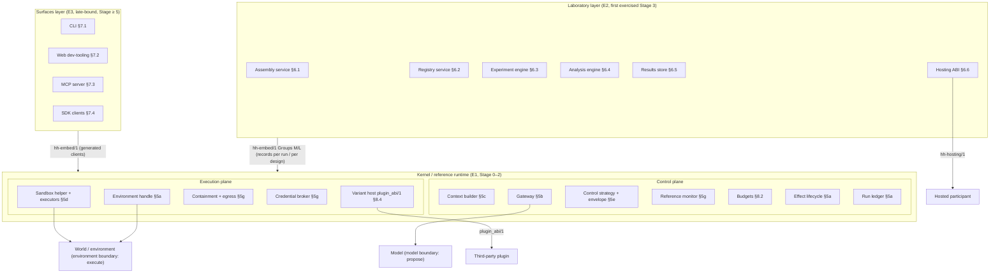

## 04 Architecture overview

This section fixes the shape of HarnessHarness as a whole: the two levels and the two boundaries of the ontology (ADR-0012), the three process layers of the ecosystem decision (ADR-0050), the one Core (C0) and four extension tiers (C1–C4) of doc 3 §1.3 as an explicit dependency DAG (ADR-0182 X1–X6), and the rule every later section obeys — an extension reaches another extension only through a contract reference, never through its internals. Nothing here adds a contract; every row of the DAG table names the section and ADRs that own it. §9 turns the DAG into the staged build ladder.

### 4.1 Two levels, two boundaries, seven planes (ADR-0012)

HarnessHarness has an **object level** — the harness under study, a *native participant* (IR-native, white-box) or a *hosted participant* (hosted-external, black-box; ADR-0001/0013) — and an **instrument level** — the Harness Lab, which assembles, runs, compares and evolves harnesses (ADR-0012 decision 1). The object level is partitioned into seven planes P1–P7 (observation & context, action & tools, control & orchestration, verification & feedback, state & durability, security & governance, measurement & evolution) under the home-plane rule: every entity kind, component class, plane operator and event family declares exactly one home; planes carry no dependency direction (§2; ADR-0012 decisions 2–3). Two boundaries cut the object level: the **model boundary**, crossed only by `propose` (the compiled `ProviderRequestPlan` out, the model's proposal in — §5b, §5c), and the **environment boundary**, crossed only by `execute` (an authorized effect out, a captured observation in — §5d, §5a). Everything between the two boundaries is kernel-owned decision machinery; everything beyond them is either a model or a world. The **control boundary β** is the third, movable line — which decision points are code-owned and which model-owned — represented in the Harness Definition and varied only by measured comparison (ADR-0012 decision 6; ADR-0105).

The reference runtime realises this as a **control plane** and an **execution plane**. The control plane is the kernel's decision path for one harness step: context admission (R-2.4.1) → `propose` through the gateway (R-2.3.1) → the control strategy's decision inside the envelope (R-2.6.1/R-2.6.2) → `authorize` by the reference monitor (R-2.8.1) with budget `check`/`reserve` (R-2.1.6) → the effect lifecycle's write-ahead `committed` record (R-2.2.2) — every step a ledger append by the run's single fenced writer (R-2.2.1). The execution plane is what the kernel drives across the environment boundary: the environment handle (R-2.2.5), the sandbox helper and executors (R-2.5.5), egress mediation and containment (R-2.8.4), the credential broker's channels (R-2.8.3), and out-of-process component variants behind `plugin_abi/1` (R-2.12.2). The control plane decides and records; the execution plane acts and reports; authority never flows from the execution plane inward (ADR-0181 V1; ADR-0182 X6; §8 rule 2).

### 4.2 Three process layers and three bindings (ADR-0050)

ADR-0050 D1 splits the program into three layers bound to ecosystems at different stages: the **kernel / reference runtime with its sandbox helper** (candidate E1; binds at Stage 0–2), the **laboratory** (candidate E2; first exercised at Stage 3) and the **surfaces** (E3 as declared default; late-bound at Stage ≥ 5 — OQ-130, ADR-0179 D4). The layers meet at two boundaries whose crossings are fixed by ADR-0050 D2 as records, never live objects: the kernel↔lab boundary crosses per run for run-time verbs and per design/publish for the design-time Group L verbs (ADR-0183 §A.2), the kernel↔surfaces boundary crosses through generated clients. Three bindings share one verb shape and differ in schema and direction (Ontology v3 §5e; CF-023):

| Binding | Direction | Who is on the far side | Contract | Section |
|---|---|---|---|---|
| `hh-embed/1` | outside → kernel | the CLI, the web surface, the MCP server's tool bodies, the Lab, the ACP artefact, third-party SDK clients — all *native attachments* with `observability_level = ledger` | ADR-0176…0179: Groups H/S/W/R/M/L/U, I1–I9, one frame model, a closed error sum, three transport bindings validated by one conformance suite | §7.4 |
| `plugin_abi/1` | kernel → extension | every non-kernel executable contribution: component variants, hooks/guards, validators, benchmark adapters | ADR-0180…0182: `PluginManifest/1`, closed placement sum, closed host callbacks, V1–V6, `GuardVerdict` | §8.4 |
| `hh-hosting/1` | Lab → hosted participant | an external harness joining the comparison plane as an `OpaqueProcess` | ADR-0164…0166: baseline / capability-declared / excluded verbs, `HostedEvent`, mediation stamp, `budget_enforcement` | §6.6 |

ADR-0050 §8 governs every ecosystem reference in this document: contracts are operations, inputs/outputs, invariants and failure modes; ecosystems appear only by candidate id and layer; no language, runtime, library or build tool is named in any contract, data model, criterion or stage plan.

### 4.3 The Core and the four extension tiers (doc 3 §1.3; ADR-0182)

**C0 — HarnessHarness Core** is the smallest set that makes the LCD battery's structural tests executable and the Stage-3 evaluation-first suite runnable: the ontology and the HIR/1 dialect with its cross-cutting records (§2, §3, §8), the run ledger, effect lifecycle and environment handle (§5a), the gateway, context builder, `react/minimal` strategy and envelope (§5b, §5c, §5e), the capability record, execution contract and helper (§5d), the reference monitor, credentials, containment, audit (§5g), the eval framework and telemetry (§5h), the extensibility mechanism (§8.4), and the C0 *slices* that ratified stage notes place inside C1–C4 items (ADR-0048, ADR-0146, ADR-0184, ADR-0209): the registry store, the experiment schemas and single-worker engine, the estimator kernel, results rows, the Stage-0 CLI driver, the `hh-embed/1` contract, `HostedEvent`/adapter zero, the Validator contract, extension records and pins, Π floor rows, the memory store, `evict_oldest`, the branch model and the counterfactual hook, the debt schemas and the run bundle. Every C0 class contract ships its trivial Stage-1 variant in C0 (doc 3 §1.3 rule 3), so removing any richer variant never removes a slot (ADR-0182 X4).

**C1–C4** are extension tiers along the declared DAG: C1 the Should-tier services and families (durable execution, router, profiles, caching, compaction, retrieval, tool scaling, protocol edges, verification fabric, extension trust, approvals, bundles, benchmarks, the Lab services, the CLI, the SDK), C2 the Could-tier depth (reversible execution, memory lifecycle, skills, the tool-interface compiler, the reconciler, critics, IFC (information-flow control) enforcement, the analysis engine, the Hosting ABI, the web surface, the MCP server), C3 the control/orchestration cluster (sub-agents, value-of-compute, coordination), C4 the evolution cluster and the organizational layer (evolution service, debt manager, attribution, co-evolution, fleets). C3/C4 items carry maturity flags and matched-budget conditionality (ADR-0002 (d)/(e); ADR-0209): their *specification* is unconditional, their *value* is conditional on model tier, task class and budget, and `research-grade` results never enter a C0–C3 acceptance decision.

**The six invariants (ADR-0182 D2–D7) as this document applies them.** **X1 contract-only reach:** an item's `depends_on` names only `ContractRef{kind ∈ {class_contract, record_kind, dialect, protocol_binding}, id, version_range}`; another item's implementation, process, files, private records, kernel projections beyond granted views, Π and the handle table are *internals* and unreachable — physically for third-party code (placement ≥ `subprocess_confined`, closed callbacks), by module-graph lint for first-party in-process variants (ADR-0181 D2/D3). **X2 tier monotonicity and acyclicity:** a C(n) item depends only on contracts whose *defining* tier is ≤ n and the item graph is acyclic; the readiness gate's spec-DAG check reports `tier_violations = []` and `cycles = []` (generalising T-LCD-06's `hosting_edges = []`). **X3 kernel-mediated interaction:** two extensions interact only through ledger records, HIR entities, effects and registry records, each observed through the observer's own contract. **X4 removability per tier:** for n ∈ {0..3} the build with tiers > n absent passes the tier-n acceptance suite unchanged — the `removability(n)` rows of the readiness report, run at every stage gate from Stage 2 (§9). **X5 substitution without ripple:** replacing a variant with any `substitutable` one changes no other item's `depends_on`; a class-contract change is a new `contract_version` under `ContractVersionPolicy` (ADR-0180 D3). **X6 authority never flows up:** a `Permission` is issued at `seal` and attenuates downward; extension-contributed `HarnessRule`s narrow only; the evolution service edits only `HirDiff`s with `authority_delta ∈ {none, narrowing}` and `budget_delta ∈ {none, tightening}`, and its own definition, proposer variants and campaign spec are outside every candidate's target set (`SelfModificationRefused`; ADR-0053 D-5; ADR-0195 G5).

Three reading conventions make the DAG table checkable. (i) **`KS` — the Core schema set.** Every `record_kind` and `dialect` reference (`hir/1`, `registry/1`, the ledger envelope, `ProvenanceRecord`, `DimensionId`/`MatchSpec`, `idp/1`/`VersionedRef`, `hh-bundle/1`, `hh-results-row/1`, `hh-experiment/1`, `MetricDeclaration`, the `hh-embed/1` and `plugin_abi/1` message schemas) resolves to the kernel's single schema source (ADR-0176 I1; ADR-0178 D1; ADR-0181 V6) and is written `KS`; the item that *owns* a schema is named in §8.5 and in the owning section, and mutual schema references between C0 items (a record embedded in a dialect that also constrains the record) are co-definitions inside `KS`, not edges. Edges in the table are therefore operation, class-contract and protocol dependencies. (ii) **Slice nodes.** A C0 slice ratified inside a C1–C4 item by a stage note is written `R-x.y.z⁰` and is a node of its own, so a C0 item may depend on it without depending on the extension (e.g. `R-2.1.4 → R-2.10.2⁰`, the registry *store*, never the C1 registry *service*); a C0 slice that lands in two stages is split `R-x.y.z⁰ᵃ`/`R-x.y.z⁰ᵇ` (three: `⁰ᶜ`) — the Lab kernel (schemas at S1, executables at S3 — ADR-0184 D2, ADR-0157 (e), ADR-0176 (e)), the CLI (`R-2.11.1⁰ᵃ` S0 driver / `⁰ᵇ` S1 attended mode — ADR-0167…0169 (e)), durability (`R-2.2.3⁰ᵃ` S1 / `⁰ᵇ` S2 / `⁰ᶜ` S3 — ADR-0130/0132 (e)), branches (`R-2.2.4⁰ᵃ` S2 / `⁰ᵇ` S3 replay and counterfactual hook — ADR-0133/0135 (e)), benchmarks (`R-2.9.4⁰ᵃ` S1 records / `⁰ᵇ` S3 adapters) and debt (`R-2.9.6⁰ᵃ` S1 schemas / `⁰ᵇ` S3 retirement fixtures — ADR-0209 D2), so that no node bundles content from two stages; a C0 slice may also be ratified by the owning ADR's own tier decision (`R-2.5.3⁰`, ADR-0093 D9 — CF-477). (iii) **Slices at a tier other than the item's.** Every slice of tier n ≠ the item's tier that §9 or a section's build-stage table names is a node of its own, written `R-x.y.zⁿ` — the C1 kernel `spawn` slice inside the C3 orchestrator (`R-2.6.3¹`; ADR-0209 D2, CF-397), the C1/C2 slices inside C0 items, the C1/C2 slices inside C4 items, the C2 slices inside C1 items and the C4 slices inside C0–C3 items. The second table of 4.4 lists all 63 with their edges (two of them unstaged: `R-2.8.4²`, `R-2.12.2²`). Each lands at its own tier and stage in §9, is absent from every removability build below its tier, and the DAG check reads its dependencies at the slice's tier (never at the item's). Where a slice is the *only* consumer of a higher-tier contract in its item — the K6 cache of R-2.3.4 (`R-2.3.4²`; K4 is a C1 slice at Stage 2, CF-478), the hosted-desugaring slice of R-2.10.1 (`R-2.10.1²`), the hosted-levels slice of R-2.10.3 (`R-2.10.3²`), the `participant` noun of R-2.11.1 (`R-2.11.1²`) — the item's own row carries no edge to that contract.

### 4.4 The dependency DAG

The first table lists every scope-register row (65 rows after the R-2.7.2 split; ADR-0146) with its section, tier and the first stage at which the item proper lands (`S0→S1` marks a C0 item whose §9.1 row lands a hand-authored subset before the contract lands at Stage 1), its C0 slice node(s), the Core contracts it consumes, the extension contracts it consumes and its owning ADRs. The second table lists every slice whose tier differs from its item's (convention (iii)). Tiers per `registers/scope.md`; the C0/C1/C2/C3/C4/program row counts are 24/19/11/3/5/3 (the register's summary table was corrected to these counts at the readiness pass). An extension edge annotated "consumed at Sn" is consumed only by the item's content landing at that stage (§9), which is how the stage check of §9.8 reads it.

| Scope item | Section | Tier · first stage of the item proper | C0 slice node(s) (stage) | Core contracts depended on | Extension contracts depended on (tier; stage of the consuming content where later than the item's first stage) | ADRs |
|---|---|---|---|---|---|---|
| `R-2.1.1` | §2 | C0 · S1 | whole item | — | — | ADR-0012…0014 |
| `R-2.1.2` | §3.1 | C0 · S0→S1 | whole item (§9.1 lands the hand-authored `validate`-only subset) | KS, R-2.1.1, R-2.1.5, R-2.12.1 | — | ADR-0015…0018 |
| `R-2.1.3` | §3.2 | C0 · S1 | whole item | item → KS, R-2.1.2, R-2.1.4, R-2.1.5, R-2.12.1 | — | ADR-0019…0022 |
| `R-2.1.4` | §3.3 | C0 · S1 | whole item | item → KS, R-2.1.2, R-2.1.5, R-2.12.1, R-2.1.6, R-2.10.2⁰ | — | ADR-0023…0025 |
| `R-2.1.5` | §8.1 | C0 · S0→S1 | whole item (§9.1: hand-stamped `principal`/`definition`/`external`) | item → KS, R-2.12.1 | — | ADR-0033…0035 |
| `R-2.1.6` | §8.2 | C0 · S0→S1 | whole item (§9.1: one root `BudgetNode`, `check`, `budget_exhausted`) | item → KS, R-2.1.2, R-2.1.5, R-2.12.1, R-2.2.1 | — | ADR-0039…0041 |
| `R-2.2.1` | §5a.1 | C0 · S1 | whole item | item → KS, R-2.12.1, R-2.1.5, R-2.1.2 | — | ADR-0026…0029 |
| `R-2.2.2` | §5a.2 | C0 · S1 | whole item | item → KS, R-2.2.1, R-2.1.2, R-2.1.5, R-2.1.6 | — | ADR-0030…0032 |
| `R-2.2.3` | §5a.3 | C1 · S2 | `R-2.2.3⁰ᵃ` (S1): checkpoint view, `restore` per scope, writer takeover, `retry_due`; `R-2.2.3⁰ᵇ` (S2): `verify_environment`/`verify_resume`, detached reconciliation, HLC on continuation/child runs, `preserve_until`; `R-2.2.3⁰ᶜ` (S3): the kill-point battery KP-1…9/13/15 × four classes (ADR-0130/0132 (e); ADR-0146 D2; convention (ii)) | `R-2.2.3⁰ᵃ` → KS, R-2.2.1, R-2.2.2, R-2.1.6, R-2.2.5; `R-2.2.3⁰ᵇ` → KS, R-2.2.3⁰ᵃ, R-2.2.1, R-2.2.2, R-2.2.5; `R-2.2.3⁰ᶜ` → KS, R-2.2.3⁰ᵇ, R-2.2.1, R-2.2.2, R-2.2.5; item (leases, `suspend`, wakeups, `HealingPolicy` — C1 · S2) → R-2.2.3⁰ᵃ, R-2.2.3⁰ᵇ, R-2.2.1, R-2.2.5 | — | ADR-0130…0132 |
| `R-2.2.4` | §5a.4 | C2 · S4 | `R-2.2.4⁰ᵃ` (S2): branch model, `coherent_fork_points`, inter-run `fork`, `fs_tree` snapshots, `rollback` (ADR-0133 (e)); `R-2.2.4⁰ᵇ` (S3): both replay-driver modes, `ReplayValidityReport`, recording rules, the `counterfactual` hook with the factual arm (ADR-0135 (e); convention (ii)) | `R-2.2.4⁰ᵃ` → KS, R-2.2.1, R-2.2.2, R-2.2.3⁰ᵃ, R-2.2.5, R-2.1.6; `R-2.2.4⁰ᵇ` → KS, R-2.2.4⁰ᵃ, R-2.2.1, R-2.2.2, R-2.2.5; item → R-2.2.4⁰ᵃ, R-2.2.4⁰ᵇ | — | ADR-0133…0135 |
| `R-2.2.5` | §5a.5 | C0 · S0→S1 | whole item (§9.1: `local_host`, `EnvHandle`, three states) | item → KS, R-2.2.1, R-2.2.2, R-2.1.6, R-2.8.4, R-2.12.1 | — | ADR-0136…0138 |
| `R-2.3.1` | §5b.1 | C0 · S0→S1 | whole item (§9.1: one wire dialect, usage on `completed`) | KS, R-2.2.1, R-2.1.3, R-2.1.6, R-2.8.3, R-2.8.4, R-2.12.1 | — | ADR-0118…0120 |
| `R-2.3.2` | §5b.2 | C1 · S5 | `R-2.3.2⁰` (S0): static role table | `R-2.3.2⁰` → KS, R-2.3.1, R-2.1.6; item → R-2.3.2⁰, R-2.3.1, R-2.6.2 | R-2.3.3 (C1), R-2.3.4 (C1) | ADR-0121…0123 |
| `R-2.3.3` | §5b.3 | C1 · S5 | `R-2.3.3⁰` (S1): ModelProfile/1 record, null profile | `R-2.3.3⁰` → KS, R-2.1.3, R-2.3.1; item → R-2.3.3⁰, R-2.1.3, R-2.4.1, R-2.9.6⁰ᵃ | — | ADR-0124…0126 |
| `R-2.3.4` | §5b.4 | C1 · S5 | `R-2.3.4⁰` (S1): prefix-stable invariants, cache accounting | `R-2.3.4⁰` → KS, R-2.3.1, R-2.4.1, R-2.2.1, R-2.1.6; item → R-2.3.4⁰ | R-2.3.3 (C1) | ADR-0127…0129 |
| `R-2.4.1` | §5c.1 | C0 · S0→S1 | whole item (§9.1: the `default` policy with six reserved slots) | item → KS, R-2.1.2, R-2.1.3, R-2.1.5, R-2.2.1, R-2.1.6, R-2.4.3⁰ | — | ADR-0072…0074 |
| `R-2.4.2` | §5c.2 | C1 · S5 | `R-2.4.2⁰` (S2): evict_oldest, gauge cap | `R-2.4.2⁰` → KS, R-2.4.1, R-2.2.1, R-2.1.5, R-2.1.6, R-2.3.1, R-2.1.4; item → R-2.4.2⁰ | R-2.3.3 (C1) | ADR-0075…0077 |
| `R-2.4.3` | §5c.3 | C1 · S4 | `R-2.4.3⁰` (S1): MemoryStore, retrieve | `R-2.4.3⁰` → KS, R-2.2.1, R-2.1.5, R-2.12.1; item → R-2.4.3⁰, R-2.4.1 | R-2.6.3¹ (C1) | ADR-0078…0080 |
| `R-2.4.4` | §5c.4 | C2 · S4 | `R-2.4.4⁰` (S1): validity functions E1–E4 | `R-2.4.4⁰` → KS, R-2.4.3⁰, R-2.12.1, R-2.1.5, R-2.2.1; item → R-2.4.4⁰ | R-2.4.3 (C1), R-2.7.3 (C2), R-2.8.7 (C1) | ADR-0081…0083 |
| `R-2.4.5` | §5c.5 | C2 · S5 | `R-2.4.5⁰` (S2): ProcedureProfile/1, lift_skill | `R-2.4.5⁰` → KS, R-2.1.2, R-2.1.3, R-2.4.1; item → R-2.4.5⁰, R-2.7.1⁰ | R-2.6.3¹ (C1) | ADR-0084…0086 |
| `R-2.5.1` | §5d.1 | C0 · S1 | whole item | item → KS, R-2.1.2, R-2.1.5, R-2.12.1, R-2.2.5 | — | ADR-0087…0089 |
| `R-2.5.2` | §5d.2 | C2 · S5 | `R-2.5.2⁰` (S1): SurfaceBinding schema, primitive shapes | `R-2.5.2⁰` → KS, R-2.1.3, R-2.5.1; item → R-2.5.2⁰, R-2.7.1⁰ | R-2.3.3 (C1), R-2.7.1 (C1) | ADR-0090…0092 |
| `R-2.5.3` | §5d.3 | C1 · S2 | `R-2.5.3⁰` (S1): exposure-mode sum, `Catalog`/`ExposurePlan`/`RevealedSet`, `direct_all`, `check_callable` (CF-477) | `R-2.5.3⁰` → KS, R-2.5.1, R-2.4.1, R-2.2.1, R-2.8.1; item → R-2.5.3⁰, R-2.5.1, R-2.4.1, R-2.2.1, R-2.8.1, R-2.4.2⁰, R-2.8.5⁰, R-2.5.4⁰; consumed at S3 | R-2.5.4 (C1); consumed at S4 | ADR-0093…0095 |
| `R-2.5.4` | §5d.4 | C1 · S4 | `R-2.5.4⁰` (S3): MCP stdio client + stateless server | `R-2.5.4⁰` → KS, R-2.1.3, R-2.5.1, R-2.8.1, R-2.8.3, R-2.8.4, R-2.2.1, R-2.5.5; item → R-2.5.4⁰ | R-2.11.4 (C1), R-2.8.5 (C1) | ADR-0096…0099 |
| `R-2.5.5` | §5d.5 | C0 · S0→S1 | whole item (§9.1: one in-process `tool_executor`; the S1 spike) | item → KS, R-2.2.2, R-2.2.5, R-2.8.1, R-2.8.3, R-2.8.4, R-2.1.6, R-2.2.1 | — | ADR-0100…0102 |
| `R-2.6.1` | §5e.1 | C0 · S0→S1 | whole item (§9.1: `react/minimal`) | item → KS, R-2.1.2, R-2.4.1, R-2.3.1, R-2.6.2, R-2.2.1, R-2.5.5 | — | ADR-0103…0105 |
| `R-2.6.2` | §5e.2 | C0 · S0→S1 | whole item (§9.1: ceilings, transport retry, tool timeout, parse refusal) | item → KS, R-2.1.6, R-2.2.1, R-2.2.2, R-2.8.1, R-2.2.3⁰ᵃ | — | ADR-0106…0108 |
| `R-2.6.3` | §5e.3 | C3 · S4 | — (its kernel slice `R-2.6.3¹` is C1, second table) | item → R-2.6.2, R-2.1.6 | R-2.6.3¹ (C1), R-2.6.5 (C3), R-2.4.5¹ (C1) | ADR-0185…0187 |
| `R-2.6.4` | §5e.4 | C3 · S4 | — | item → R-2.6.2, R-2.1.6, R-2.2.1, R-2.7.1⁰ | R-2.3.2 (C1); consumed at S5, R-2.6.3 (C3), R-2.10.4 (C2); consumed at S5, R-2.7.3 (C2) | ADR-0188…0190 |
| `R-2.6.5` | §5e.5 | C3 · S4 | — | item → R-2.2.3⁰ᵇ, R-2.2.1, R-2.1.5, R-2.7.2a, R-2.8.1 | R-2.6.3¹ (C1), R-2.4.4 (C2), R-2.7.1 (C1) | ADR-0191…0193 |
| `R-2.7.1` | §5f.1 | C1 · S3 | `R-2.7.1⁰` (S1): Validator contract, local checks | `R-2.7.1⁰` → KS, R-2.1.2, R-2.2.1, R-2.2.2, R-2.5.5, R-2.1.5, R-2.1.6; item → R-2.7.1⁰, R-2.9.2, R-2.2.2 | — | ADR-0109…0111 |
| `R-2.7.2a` | §5f.2 | C0 · S1 | whole item | KS, R-2.2.1, R-2.2.2, R-2.7.1⁰, R-2.1.5 | — | ADR-0112…0114 |
| `R-2.7.2b` | §5f.3 | C2 · S4 | — | R-2.7.2a, R-2.7.1⁰ | R-2.7.3 (C2), R-2.7.1 (C1), R-2.3.3 (C1); consumed at S5 | ADR-0114 |
| `R-2.7.3` | §5f.4 | C2 · S4 | `R-2.7.3⁰` (S1): critic schemas, programmatic critics | `R-2.7.3⁰` → KS, R-2.7.1⁰, R-2.2.1, R-2.8.1, R-2.1.6; item → R-2.7.3⁰ | R-2.6.3¹ (C1), R-2.8.7 (C1), R-2.7.1 (C1) | ADR-0115…0117 |
| `R-2.8.1` | §5g.1 | C0 · S1 | whole item | item → KS, R-2.1.5, R-2.1.2, R-2.2.1, R-2.2.2 | — | ADR-0051…0053 |
| `R-2.8.2` | §5g.2 | C2 · S2 | — | R-2.1.5, R-2.8.1, R-2.2.1, R-2.4.1, R-2.5.1 | R-2.7.1 (C1); consumed at S3, R-2.6.3¹ (C1); consumed at S4, R-2.10.6 (C2); consumed at S4 | ADR-0054…0056 |
| `R-2.8.3` | §5g.3 | C0 · S0→S1 | whole item (§9.1: kernel-held credential, allow-list, masking) | item → KS, R-2.8.1, R-2.8.4, R-2.2.1, R-2.1.5 | — | ADR-0057…0059 |
| `R-2.8.4` | §5g.4 | C0 · S1 | whole item | KS, R-2.8.1, R-2.1.5, R-2.2.1, R-2.1.6 | — | ADR-0060…0062 |
| `R-2.8.5` | §5g.5 | C1 · S4 | `R-2.8.5⁰` (S1): extension records, pins | `R-2.8.5⁰` → KS, R-2.12.1, R-2.1.5, R-2.2.1, R-2.5.5, R-2.8.1; item → R-2.8.5⁰, R-2.8.1 | — | ADR-0063…0065 |
| `R-2.8.6` | §5g.6 | C0 · S1 | whole item | item → KS, R-2.2.1, R-2.12.1, R-2.1.5, R-2.9.1 | — | ADR-0066…0068 |
| `R-2.8.7` | §5g.7 | C1 · S2 | `R-2.8.7⁰` (S1): Π floor rows, approval records | `R-2.8.7⁰` → KS, R-2.8.1, R-2.1.6, R-2.2.1, R-2.2.3⁰ᵃ, R-2.1.5; item → R-2.8.7⁰, R-2.8.1, R-2.8.5⁰, R-2.2.3⁰ᵃ | R-2.2.3 (C1), R-2.7.1 (C1); consumed at S3 | ADR-0069…0071 |
| `R-2.9.1` | §5h.1 | C0 · S0→S1 | whole item (§9.1: M1/M3/M7 in a single-file trace) | item → KS, R-2.2.1, R-2.1.6, R-2.12.1, R-2.1.5 | — | ADR-0042…0044 |
| `R-2.9.2` | §5h.2 | C0 · S1 | whole item | item → KS, R-2.1.6, R-2.2.1, R-2.9.1, R-2.1.1, R-2.12.1, R-2.7.1⁰ | — | ADR-0045…0047 |
| `R-2.9.3` | §5h.3 | C1 · S4 | `R-2.9.3⁰` (S3): bundle(kind = run), R0/R1 | `R-2.9.3⁰` → KS, R-2.12.1, R-2.2.1, R-2.8.6, R-2.9.2, R-2.1.6, R-2.8.5⁰; item → R-2.9.3⁰ | — | ADR-0139…0141 |
| `R-2.9.4` | §5h.4 | C1 · S4 | `R-2.9.4⁰ᵃ` (S1): `EnvironmentFamily`, task/suite/validity/split records, the L1 predicate and L2 check, `training_cutoff_claim`; `R-2.9.4⁰ᵇ` (S3): adapters A, C, D, E out of process, `separate` verifiers, the infra detector, parity reports, L4 (ADR-0142…0144 (e); convention (ii)) | `R-2.9.4⁰ᵃ` → KS, R-2.9.2, R-2.2.1; `R-2.9.4⁰ᵇ` → KS, R-2.9.4⁰ᵃ, R-2.7.1⁰, R-2.9.2, R-2.2.5, R-2.8.4, R-2.2.1, R-2.5.5; item → R-2.9.4⁰ᵃ, R-2.9.4⁰ᵇ, R-2.7.1⁰ | R-2.10.3 (C1) | ADR-0142…0144 |
| `R-2.9.5` | §5h.5 | C4 · S6 | `R-2.9.5⁰` (S3, optional publication): candidate/hypothesis/campaign/report schema documents and the `measurement.evolution.*` family; G2/G5/G6/G10 as `classify`/`validate_assembly` refusals | `R-2.9.5⁰` → KS, R-2.1.2, R-2.1.4, R-2.9.2, R-2.2.1; item → R-2.9.5⁰, R-2.1.2, R-2.1.4, R-2.8.1, R-2.1.6, R-2.2.1, R-2.12.2 | R-2.10.1 (C1), R-2.10.2 (C1), R-2.10.3 (C1), R-2.10.4 (C2), R-2.10.5 (C1), R-2.9.6 (C4), R-2.9.7 (C4), R-2.9.3 (C1), R-2.2.4 (C2), R-2.10.6 (C2); consumed at S6 (6c — hosted-coordinate campaigns over the `hh-hosting/1` capability declarations, ADR-0196 D7; CF-485) | ADR-0194…0196 |
| `R-2.9.6` | §5h.6 | C4 · S6 | `R-2.9.6⁰ᵃ` (S1): `DebtHomes/1`, `AssumptionDebtRecord/1`, `RemovalTest`/`RemovalVerdict`/`RetirementRecord`, `validate_removal_test`; `R-2.9.6⁰ᵇ` (S3): retirement experiments for every rule of the two minimal profiles, `settle_removal_test`/`retire`, `expired_used` exclusion, the minimal `DebtReport` (ADR-0197 (e); ADR-0209 D2; convention (ii)) | `R-2.9.6⁰ᵃ` → KS, R-2.12.1, R-2.1.4; `R-2.9.6⁰ᵇ` → KS, R-2.9.6⁰ᵃ, R-2.3.3⁰, R-2.10.3⁰ᵇ, R-2.9.2; item → R-2.9.6⁰ᵃ, R-2.9.6⁰ᵇ, R-2.12.1 | R-2.10.3 (C1), R-2.10.4 (C2), R-2.3.3 (C1) | ADR-0197/0198 |
| `R-2.9.7` | §5h.7 | C4 · S6 | — | item → R-2.2.4⁰ᵇ, R-2.9.2, R-2.2.1 | R-2.10.4 (C2), R-2.10.3 (C1), R-2.2.4 (C2), R-2.11.4 (C1) | ADR-0199…0201 |
| `R-2.9.8` | §5h.8 | C4 · S6 | `R-2.9.8⁰` (S1): `SnapshotClaim` extension, `CompatibilityRecord` schema | `R-2.9.8⁰` → KS, R-2.12.1, R-2.9.2, R-2.3.1; item → R-2.9.8⁰, R-2.12.1, R-2.1.4, R-2.9.2, R-2.3.1 | R-2.9.5 (C4), R-2.9.6 (C4), R-2.3.3 (C1), R-2.10.3 (C1) | ADR-0202…0204 |
| `R-2.10.1` | §6.1 | C1 · S3 | — | item → R-2.1.4, R-2.1.3, R-2.12.1, R-2.10.2⁰, R-2.8.5⁰, R-2.11.4⁰ᵇ | R-2.10.2 (C1); consumed at S4 | ADR-0147…0150 |
| `R-2.10.2` | §6.2 | C1 · S4 | `R-2.10.2⁰` (S1): registry store | `R-2.10.2⁰` → KS, R-2.12.1, R-2.1.5, R-2.2.1; item → R-2.10.2⁰, R-2.8.5⁰, R-2.12.1, R-2.1.6, R-2.12.2 | R-2.8.5 (C1) | ADR-0151…0153 |
| `R-2.10.3` | §6.3 | C1 · S4 | `R-2.10.3⁰ᵃ` (S1): experiment schemas; `R-2.10.3⁰ᵇ` (S3): register/expand, single-worker engine | `R-2.10.3⁰ᵃ` → KS, R-2.9.2, R-2.1.6, R-2.12.1; `R-2.10.3⁰ᵇ` → KS, R-2.10.3⁰ᵃ, R-2.2.1, R-2.2.3⁰ᵇ, R-2.2.5, R-2.3.1, R-2.1.4, R-2.10.2⁰, R-2.10.5⁰, R-2.9.4⁰ᵇ, R-2.11.4⁰ᵇ; item → R-2.10.3⁰ᵇ | R-2.10.1 (C1), R-2.10.2 (C1), R-2.10.5 (C1), R-2.9.3 (C1) | ADR-0154…0156 |
| `R-2.10.4` | §6.4 | C2 · S5 | `R-2.10.4⁰ᵃ` (S1): analysis schemas; `R-2.10.4⁰ᵇ` (S3): estimator kernel A1/A2/A3/A8/A12 | `R-2.10.4⁰ᵃ` → KS, R-2.9.2, R-2.12.1; `R-2.10.4⁰ᵇ` → KS, R-2.10.4⁰ᵃ, R-2.9.2, R-2.10.5⁰, R-2.11.4⁰ᵇ; item → R-2.10.4⁰ᵇ, R-2.9.6⁰ᵃ | R-2.10.5 (C1), R-2.10.3 (C1), R-2.10.6 (C2) | ADR-0157…0160 |
| `R-2.10.5` | §6.5 | C1 · S4 | `R-2.10.5⁰` (S3): ResultsRow/1, cells, lab-internal leaderboard | `R-2.10.5⁰` → KS, R-2.2.1, R-2.9.2, R-2.12.1, R-2.10.2⁰, R-2.8.6, R-2.1.6; item → R-2.10.5⁰, R-2.8.6 | R-2.9.3 (C1), R-2.10.2 (C1) | ADR-0161…0163 |
| `R-2.10.6` | §6.6 | C2 · S4 | `R-2.10.6⁰` (S3): HostedEvent, proj_ABI, adapter zero | `R-2.10.6⁰` → KS, R-2.1.2, R-2.9.2, R-2.11.4⁰ᵇ, R-2.5.4⁰; item → R-2.10.6⁰, R-2.8.1, R-2.8.3, R-2.8.4, R-2.2.5, R-2.5.5, R-2.9.2, R-2.1.6, R-2.11.3⁰ | R-2.5.4 (C1), R-2.10.2 (C1) | ADR-0164…0166 |
| `R-2.11.1` | §7.1 | C1 · S2 | `R-2.11.1⁰ᵃ` (S0): the CLI driver slice; `R-2.11.1⁰ᵇ` (S1): attended terminal mode with per-effect approvals, `approval *`, `run resume/fork/cancel/inspect`, the attendance declaration, I-1, the full exit-class table, `json`, stdin typing, `InvocationRecord` (ADR-0167…0169 (e); ADR-0184 D2; convention (ii)) | `R-2.11.1⁰ᵃ` → R-2.11.4⁰ᵃ, R-2.3.2⁰, R-2.1.6; `R-2.11.1⁰ᵇ` → R-2.11.1⁰ᵃ, R-2.11.4⁰ᵇ, R-2.1.6, R-2.9.1, R-2.8.7⁰, R-2.2.3⁰ᵃ; item → R-2.11.1⁰ᵇ, R-2.11.4⁰ᵇ, R-2.10.4⁰ᵃ, R-2.8.7⁰, R-2.1.6, R-2.9.2, R-2.9.1, R-2.10.2⁰; consumed at S3, R-2.10.3⁰ᵇ; consumed at S3, R-2.10.5⁰; consumed at S3, R-2.9.3⁰; consumed at S3 (`bundle create/validate`, `run export/import` — CF-484) | R-2.11.4 (C1); consumed at S4, R-2.10.1 (C1); consumed at S3, R-2.10.2 (C1); consumed at S4, R-2.10.3 (C1); consumed at S4, R-2.10.5 (C1); consumed at S4, R-2.8.7 (C1), R-2.5.4 (C1); consumed at S4, R-2.9.3 (C1); consumed at S4, R-2.8.5 (C1); consumed at S4 | ADR-0167…0169 |
| `R-2.11.2` | §7.2 | C2 · S5 (the C1 read-only instrument `R-2.11.2¹` lands at S4 — ADR-0170 (e); ADR-0184 D2) | — | item → R-2.11.4⁰ᵇ, R-2.2.4⁰ᵇ, R-2.8.6, R-2.8.7⁰, R-2.9.1, R-2.9.6⁰ᵃ | R-2.11.4 (C1), R-2.11.1 (C1), R-2.2.4 (C2), R-2.10.1 (C1), R-2.10.3 (C1), R-2.10.4 (C2); consumed at S5, R-2.10.5 (C1), R-2.9.3 (C1), R-2.8.7 (C1) | ADR-0170…0172 |
| `R-2.11.3` | §7.3 | C2 · S5 (the C1 `hh-lab/1` read/launch/experiment/results slice `R-2.11.3¹` lands at S4 — ADR-0173 (e); ADR-0184 D2) | `R-2.11.3⁰` (S3): fixture MCP server | `R-2.11.3⁰` → KS, R-2.5.4⁰, R-2.1.3, R-2.11.4⁰ᵇ, R-2.8.1; item → R-2.11.3⁰, R-2.11.4⁰ᵇ, R-2.1.3, R-2.1.4, R-2.8.1, R-2.8.3, R-2.1.6 | R-2.11.4 (C1), R-2.5.4 (C1), R-2.8.5 (C1), R-2.10.1 (C1), R-2.10.2 (C1), R-2.10.3 (C1), R-2.10.5 (C1), R-2.10.4 (C2); consumed at S5, R-2.8.7 (C1) | ADR-0173…0175 |
| `R-2.11.4` | §7.4 | C1 · S4 | `R-2.11.4⁰ᵃ` (S0): `hello`, `ContractIdentity`, schema export → codegen; `R-2.11.4⁰ᵇ` (S1): Groups H/S/W/R, frame model, error sum, bindings (a)/(b) | `R-2.11.4⁰ᵃ` → KS; `R-2.11.4⁰ᵇ` → KS, R-2.11.4⁰ᵃ, R-2.1.4, R-2.2.1, R-2.2.2, R-2.2.3⁰ᵃ, R-2.1.5, R-2.8.1, R-2.8.3, R-2.8.6, R-2.8.7⁰, R-2.12.1, R-2.1.6, R-2.5.1, R-2.5.5, R-2.2.5; item → R-2.11.4⁰ᵇ, R-2.6.1 | — | ADR-0176…0179 |
| `R-2.12.1` | §8.3 | C0 · S1 | whole item | item → KS | — | ADR-0036…0038 |
| `R-2.12.2` | §8.4 | C0 · S1 | whole item | item → KS, R-2.10.2⁰, R-2.8.5⁰, R-2.12.1, R-2.1.5, R-2.1.6, R-2.5.5, R-2.1.4 | — | ADR-0180…0182 |
| `R-2.12.3` | §11.5 | — | — | — | — — program-level decision | ADR-0009/0050 |
| `R-2.12.4` | §11.3 | — | — | — | — — program-level; deferred | ADR-0210 (deferral) |
| `R-2.12.5` | §1 | — | — | — | — — program-level | ADR-0003/0006/0007/0008/0011 |
| `R-2.12.6` | §5i.1 | C4 · S4 | — | R-2.2.3⁰ᵇ, R-2.8.7⁰, R-2.8.6, R-2.2.1, R-2.1.6, R-2.8.1, R-2.12.2 | R-2.2.3 (C1), R-2.8.7 (C1), R-2.6.3¹ (C1), R-2.10.3 (C1) | ADR-0205…0207 |

**Slice nodes at a tier other than their item's (convention (iii)).**

| Node | Item (tier) | Slice tier · stage | Content | Consumes (contracts; tier ≤ slice tier) | Assigning ADRs |
|---|---|---|---|---|---|
| `R-2.1.3¹` | `R-2.1.3` (C0) | C1 · S4 | the ACP session artefact in the compiler (stage 4 target) | R-2.1.3, R-2.5.4 | ADR-0019/0021 (e); ADR-0098 |
| `R-2.1.4¹ᵃ` | `R-2.1.4` (C0) | C1 · S3 | `validate_assembly` stage 6a (`validate_batch` pre-spend gate; CF-323) | R-2.1.4, R-2.10.1 | ADR-0025 as amended; ADR-0147 |
| `R-2.1.4¹ᵇ` | `R-2.1.4` (C0) | C1 · S5 | `validate_assembly` stage 6b — compiled-surface compatibility, `UnexpressibleSurface` propagated at plan time as `C-PROF-2` (CF-323); the assembly service's `plan` calls it (§6.1), it is not §6.1's slice | R-2.1.4, R-2.1.3, R-2.3.3 | ADR-0025 as amended; ADR-0147/0148 (e) |
| `R-2.1.5¹` | `R-2.1.5` (C0) | C1 · S4 | delegation attenuation with subagents and hosted children (P2, check 7 live), `participant` origin | R-2.1.5, R-2.6.3¹, R-2.10.6⁰ | ADR-0034/0035 (e) as amended |
| `R-2.1.6¹` | `R-2.1.6` (C0) | C1 · S4 | `slice`/`pool` delegation exercised by `spawn` (`allocate{mode}` is C0 schema — CF-471), `fan_out`/`delegation_depth` gauges | R-2.1.6, R-2.2.1 | ADR-0040 (e) as amended; ADR-0185 SP-2 |
| `R-2.1.6²` | `R-2.1.6` (C0) | C2 · S4 | hosted boundary budgets with the hosting adapter (`budget_enforcement` derivation) | R-2.1.6, R-2.10.6 | ADR-0040/0041 (e); ADR-0165 |
| `R-2.1.6⁴` | `R-2.1.6` (C0) | C4 · S6 | M3 `matched_total` as the gate of every evolution claim | R-2.1.6, R-2.9.5 | ADR-0041 (e); ADR-0195 |
| `R-2.2.1¹` | `R-2.2.1` (C0) | C1 · S4 | subagent events and lineage, hosted ingestion, lineage-aware export, the index latency criterion | R-2.2.1, R-2.6.3¹, R-2.10.6⁰ | ADR-0026/0027 (e) as amended |
| `R-2.2.2¹` | `R-2.2.2` (C0) | C1 · S2 | effect/resource leases, saga `compensate_run` | R-2.2.2, R-2.2.1, R-2.2.3⁰ᵃ | ADR-0031/0032 (e) |
| `R-2.2.2²` | `R-2.2.2` (C0) | C2 · S4 | target-side key forwarding, hosted status mapping | R-2.2.2, R-2.10.6 | ADR-0032 (e); ADR-0164 |
| `R-2.2.3²` | `R-2.2.3` (C1) | C2 · S5 | `control.wakeup.*` lowered to MCP tasks/push, hosted `resume` mapping, hibernation-aware leases | R-2.2.3, R-2.11.3, R-2.10.6 | ADR-0131/0132 (e); ADR-0175 |
| `R-2.2.5¹` | `R-2.2.5` (C0) | C1 · S4 | `remote_ephemeral`/`remote_persistent`, `provider_hosted` adapters, `suspended`, `share` mode, `detach_to_child`, provider meters | R-2.2.5, R-2.2.3 | ADR-0136…0138 (e) |
| `R-2.2.5²` | `R-2.2.5` (C0) | C2 · S5 | `memory` snapshots, `restore_in_place`, attested microVM images | R-2.2.5, R-2.2.4 | ADR-0136/0137 (e) |
| `R-2.3.4¹` | `R-2.3.4` (C1) | C1 · S2 | K4 tool-result cache as `Memory{kind: tool_result}` with the mutation epoch (CF-478) | R-2.3.4⁰, R-2.4.3⁰, R-2.4.4⁰, R-2.2.5 | ADR-0129 (e) |
| `R-2.3.4²` | `R-2.3.4` (C1) | C2 · S5 | K6 similarity-keyed semantic cache with the mandatory verifier and `readers` scoping | R-2.3.4, R-2.7.1, R-2.8.2, R-2.4.4 | ADR-0129 (e) |
| `R-2.4.1¹` | `R-2.4.1` (C0) | C1 · S5 | the context-policy family, profile slot families, demotion wrappers, reminder rules | R-2.4.1, R-2.3.3 | ADR-0072…0074 (e) |
| `R-2.4.1⁴` | `R-2.4.1` (C0) | C4 · S6 | guideline optimisation under the ADR-0046 gates | R-2.4.1, R-2.9.5 | ADR-0074 (e) |
| `R-2.4.2²` | `R-2.4.2` (C1) | C2 · S4 | hosted lift, `relower_summarize`, `fold_on_return`, the boundary companion, judged fidelity | R-2.4.2⁰, R-2.10.6, R-2.7.3 | ADR-0076/0077 (e) |
| `R-2.4.2⁴` | `R-2.4.2` (C1) | C4 · S6 | compaction rules as evolution targets under the gates | R-2.4.2, R-2.9.5 | ADR-0077 (e) |
| `R-2.4.3²` | `R-2.4.3` (C1) | C2 · S5 | `similarity_rerank` with pinned embedders, `readers` enforcement, lifecycle richness | R-2.4.3, R-2.4.4, R-2.8.2 | ADR-0079/0080 (e) |
| `R-2.4.4⁴` | `R-2.4.4` (C2) | C4 · S6 | memory-lineage reads by candidates; `validity_delta = loosening` gated like widening | R-2.4.4, R-2.9.5 | ADR-0082 d7 |
| `R-2.4.5¹` | `R-2.4.5` (C2) | C1 · S4 | the `subagent_task` target | R-2.4.5⁰, R-2.6.3¹ | ADR-0085 (e) |
| `R-2.5.1¹` | `R-2.5.1` (C0) | C1 · S4 | `search_projection` + `catalog`, the `provider_hosted` source | R-2.5.1, R-2.5.3, R-2.5.4 | ADR-0087/0088 (e) |
| `R-2.5.5¹` | `R-2.5.5` (C0) | C1 · S2 | executor-side dedup, `preserve_until`; at S4 remote executors and hosted `n/a` rows | R-2.5.5, R-2.2.2, R-2.2.1, R-2.2.5¹; consumed at S4 | ADR-0101/0102 (e) |
| `R-2.6.1¹` | `R-2.6.1` (C0) | C1 · S2 | `react/steerable` | R-2.6.1, R-2.6.2 | ADR-0104 (e) |
| `R-2.6.1⁴` | `R-2.6.1` (C0) | C4 · S6 | β-ablation `HirDiff`s on `ControlBoundary` as human-proposed evolution candidates at 6a — designed at Stage 5, executed under the ADR-0046 §7 gates from 6a (§9.7) | R-2.6.1, R-2.9.5 | ADR-0105 (e) |
| `R-2.6.2¹` | `R-2.6.2` (C0) | C1 · S4 | judged loop detector, subagent cancel/drain, `model_fallback` as an `attempt_delta`; at S5 the profile-conditioned thresholds/templates with retirement tests and the INV-9 sampling policy outside experiments | R-2.6.2, R-2.7.1, R-2.6.3¹, R-2.3.2⁰, R-2.3.3; consumed at S5 | ADR-0106…0108 (e) |
| `R-2.6.2²` | `R-2.6.2` (C0) | C2 · S4 | the hosted boundary envelope | R-2.6.2, R-2.10.6 | ADR-0108 (e) |
| `R-2.6.3¹` | `R-2.6.3` (C3) | C1 · S4 | `spawn`/`merge`, `SubagentSpec`/`SubagentResult`, SP-1…SP-8, C-1…C-8 (CF-397) | R-2.1.6, R-2.2.5, R-2.8.1, R-2.2.1, R-2.1.5, R-2.6.2, R-2.2.3⁰ᵇ | ADR-0185/0187 (e); ADR-0209 D2 |
| `R-2.6.4⁴` | `R-2.6.4` (C3) | C4 · S6 | `predictor` variants with `SearchBudgetRecord`; scheduling rules as tightening-only evolution targets | R-2.6.4, R-2.9.5 | ADR-0188…0190 (e); ADR-0209 |
| `R-2.6.5⁴` | `R-2.6.5` (C3) | C4 · S6 | `CoordinationPolicy` diffs tightening only; topology as an evolvable factor | R-2.6.5, R-2.9.5 | ADR-0193 (e) |
| `R-2.7.1²` | `R-2.7.1` (C1) | C2 · S4 | judged validators, hosted `end_state` verdicts | R-2.7.1, R-2.7.3, R-2.10.6 | ADR-0110/0111 (e) |
| `R-2.7.3⁴` | `R-2.7.3` (C2) | C4 · S6 | `held_out_from`/`JudgeLeakedIntoArtifact`, judge selectors with honeypots, untrusted-monitor protocols | R-2.7.3, R-2.9.5 | ADR-0115…0117 (e) |
| `R-2.8.1¹` | `R-2.8.1` (C0) | C1 · S4 | H-4/H-6 with subagents and hosted participants, AT-H1-04 full form | R-2.8.1, R-2.6.3¹, R-2.10.6⁰ | ADR-0051…0053 (e) |
| `R-2.8.4¹` | `R-2.8.4` (C0) | C1 · S4 | `user_space_kernel`/`microvm` classes with `attested` evidence, per-phase `policy_rule` layers, hosted `external`, the transparent-redirect backend class (AC-H4-12/-13) | R-2.8.4, R-2.8.5, R-2.10.6⁰ | ADR-0060…0062 (e) |
| `R-2.8.4²` | `R-2.8.4` (C0) | C2 · — (unstaged: ADR-0061 (e) names the tier and no stage; enters the ladder with a ratified stage note) | `tls.terminate`, `inspect_hooks`, R-2.8.2's reader-set flow check as the closer of `approved_host_body` (AC-H4-05 (iv)) | R-2.8.4, R-2.8.2 | ADR-0061 (e) |
| `R-2.8.3¹` | `R-2.8.3` (C0) | C1 · S4 | encoded-variant detectors, LT-12, `wrapped_long_lived`, hosted `credential_supply` | R-2.8.3, R-2.10.6⁰ | ADR-0057…0059 (e) |
| `R-2.8.5²` | `R-2.8.5` (C1) | C2 · S6 | evolution candidates using the model-install path under the experiment's `authority_cap` (6c) | R-2.8.5, R-2.9.5⁰ (schemas only) | ADR-0065 (e) |
| `R-2.8.6¹` | `R-2.8.6` (C0) | C1 · S4 | hosted `n/a` rows, bundle attestation, the lab-wide audit index, rotation end-to-end | R-2.8.6, R-2.9.3, R-2.10.6⁰ | ADR-0066…0068 (e) |
| `R-2.9.1¹` | `R-2.9.1` (C0) | C1 · S4 | M12 subagent rollup, M18 hosted ingestion, lossy interchange export | R-2.9.1, R-2.6.3¹, R-2.10.6⁰ | ADR-0042…0044 (e) |
| `R-2.9.2²` | `R-2.9.2` (C0) | C2 · S4 | judge oracles with calibration and independence, execution-alignment detectors, hosted rows with `capability_vector` strata | R-2.9.2, R-2.7.3, R-2.7.2b, R-2.10.6 | ADR-0045…0047 (e) |
| `R-2.9.3²` | `R-2.9.3` (C1) | C2 · S5 | R2 `reproduce` gated on profile pinning and image digests, hosted `end_state` R2, the independent-reproduction status | R-2.9.3, R-2.10.6, R-2.3.3 | ADR-0139…0141 (e); ADR-0038 (e) |
| `R-2.9.4²` | `R-2.9.4` (C1) | C2 · S5 | `browser_computer`/`search_research` families (OQ-341), τ²-bench, `probe_memorization`, judged graders | R-2.9.4, R-2.7.3, R-2.10.6 | ADR-0142…0144 (e) |
| `R-2.9.4⁴` | `R-2.9.4` (C1) | C4 · S6 | L3 enforced against every search run, Evo-Bench | R-2.9.4, R-2.9.5 | ADR-0143 (e) |
| `R-2.9.6¹` | `R-2.9.6` (C4) | C1 · S5 | live trigger evaluation, the `DebtIndex`, profile-change and evidence-supersession triggers, notices | R-2.9.6⁰ᵃ, R-2.3.3, R-2.10.3 | ADR-0197 (e); ADR-0209 D2 |
| `R-2.9.7²` | `R-2.9.7` (C4) | C2 · S5 | M1 designed ablation over `ComponentTarget`s incl. the `retirement` recipe, `AttributionReport/1`, KA-I7-4/-10/-11 | R-2.2.4⁰ᵇ, R-2.9.2, R-2.10.3, R-2.10.4, R-2.2.4 | ADR-0199/0200 (e); ADR-0209 D2 |
| `R-2.9.8¹` | `R-2.9.8` (C4) | C1 · S5 | the provider-drift half of the compatibility guard: synthetic claims from `DRIFT`, `run_regression_suite`, `drifted ⇒ expiring` | R-2.9.8⁰, R-2.3.3, R-2.10.3, R-2.9.6¹ | ADR-0203 (e)/D5; ADR-0209 D2 |
| `R-2.10.1²` | `R-2.10.1` (C1) | C2 · S4 | hosted desugaring populated, driver binding, T-4 diffs — the only consumer of R-2.10.6 in this item | R-2.10.1, R-2.10.6 | ADR-0149/0150 (e) |
| `R-2.10.3²` | `R-2.10.3` (C1) | C2 · S4 | hosted levels through the Hosting ABI verbs, the boundary companion — the only consumer of R-2.10.6 in this item | R-2.10.3, R-2.10.6 | ADR-0154…0156 (e) |
| `R-2.10.3⁴` | `R-2.10.3` (C1) | C4 · S6 | campaign experiments, `retirement_batch`, matched-total arms (6a); `adaptive_search` strategies under the gates (6b) | R-2.10.3, R-2.9.5, R-2.9.6 | ADR-0156 (e); ADR-0194; ADR-0209 D2 |
| `R-2.10.4¹` | `R-2.10.4` (C2) | C1 · S4 | A4 frontier, A5/A6, A9 rank sets, A11, A13 power, A15, `contrast` surfaces, KA-3/-6/-7/-10/-11 | R-2.10.4⁰ᵇ, R-2.10.5, R-2.10.3 | ADR-0157…0160 (e) |
| `R-2.10.4⁴` | `R-2.10.4` (C2) | C4 · S6 | gate rows, M2–M5, `critic_experiment`/value-of-compute rows | R-2.10.4, R-2.9.5, R-2.9.7 | ADR-0157 (e) |
| `R-2.10.5²` | `R-2.10.5` (C1) | C2 · S5 | hosted strata, `verifiable_by` per reader set | R-2.10.5, R-2.10.6, R-2.8.2 | ADR-0161/0163 (e) |
| `R-2.11.1²` | `R-2.11.1` (C1) | C2 · S4 | the `participant` noun — the only consumer of R-2.10.6 in this item | R-2.11.1, R-2.10.6 | ADR-0167 (e) |
| `R-2.11.2¹` | `R-2.11.2` (C2) | C1 · S4 | the read-only instrument V1, V2, V3-scrub, V5-monitor, V6 scorecard/comparison, V7–V11 over binding (c) with the full security battery | R-2.11.4, R-2.11.1, R-2.9.3, R-2.10.5 | ADR-0170…0172 (e); ADR-0184 D2 |
| `R-2.11.2⁴` | `R-2.11.2` (C2) | C4 · S6 | proposals and counterfactual arms through V3/V6 | R-2.11.2, R-2.9.5 | ADR-0170 D8 |
| `R-2.11.3¹` | `R-2.11.3` (C2) | C1 · S4 | the `hh-lab/1` read/launch/experiment/results groups over stdio and Streamable HTTP, `CallerBinding`, the surface-session run | R-2.11.3⁰, R-2.11.4, R-2.10.3, R-2.10.5, R-2.10.2 | ADR-0173…0175 (e); ADR-0184 D2 |
| `R-2.12.1¹` | `R-2.12.1` (C0) | C1 · S4 | hosted-participant bundles, lineage export, `rotate`/`migrate_id` end-to-end with the audit checkpoint | R-2.12.1, R-2.9.3, R-2.10.6⁰ | ADR-0036…0038 (e) |
| `R-2.12.1²` | `R-2.12.1` (C0) | C2 · S5 | R2 semantic reproduction gated on profile pinning | R-2.12.1, R-2.3.3, R-2.9.3² | ADR-0038 (e) |
| `R-2.12.1⁴` | `R-2.12.1` (C0) | C4 · S6 | evolution lineages and attribution over the lineage DAG | R-2.12.1, R-2.9.5, R-2.9.7 | ADR-0037 (e) |
| `R-2.12.2¹` | `R-2.12.2` (C0) | C1 · S4 | third-party publish/install, foreign import/export, attestation-gated admission, `remote`/`container` placements | R-2.12.2, R-2.10.2, R-2.8.5 | ADR-0180…0182 (e) |
| `R-2.12.2²` | `R-2.12.2` (C0) | C2 · — (deferred: OQ-410, ADR-0050 trigger 3) | `component_model` placement, cross-plugin flow checks with IFC, organisation-level `ContractVersionPolicy` layers | R-2.12.2, R-2.8.2 | ADR-0182 D8 |
| `R-2.12.2⁴` | `R-2.12.2` (C0) | C4 · S6 | evolution-service plugins in `exp/` | R-2.12.2, R-2.9.5 | ADR-0182 D8 |

**Verification statement (ADR-0182 X2; the spec-DAG check, re-run at the Phase 5 fixer pass — review round 2 — over the two tables above as data: the checker parses the rows, so a row edit that breaks a rule is caught at the next run).** Over the 163 nodes (62 tiered items, 38 C0 slice nodes incl. the `⁰ᵃ`/`⁰ᵇ`/`⁰ᶜ` splits, 63 slice nodes at another tier; `KS` beside them) and their 741 edges (59 of them to `KS`): every Core-column entry is `KS` or a C0 node (`R-2.6.3¹` is a C1 node and appears only in the extension column — CF-397); every edge `u → v` satisfies `tier(v) ≤ tier(u)` with the tier of a slice node read as the slice's own tier; the graph has no cycle — a topological order exists and begins `KS → R-2.11.4⁰ᵃ → R-2.1.1 → R-2.12.1 → R-2.1.5 → R-2.1.2 → R-2.2.1 → R-2.1.6 → R-2.10.2⁰ → R-2.1.4 → R-2.1.3 → R-2.2.2 → R-2.4.3⁰ → R-2.4.1 → R-2.4.4⁰ → R-2.8.1 → …` and ends `… → R-2.6.1⁴ → R-2.6.4⁴ → R-2.6.5⁴ → R-2.7.3⁴ → R-2.9.4⁴ → R-2.9.8`. **Result: `tier_violations = []`, `cycles = []`.** The stage check of §9.8 runs over the same edges; the two unstaged C2 slice nodes (`R-2.8.4²`, `R-2.12.2²`) take part in the tier check and are excluded from the stage check until a stage note is ratified. Where a section's *Dependencies* heading names a richer set of consumed items than these tables (sections list every consumer and every consumed record), the difference is a record-kind reference resolved to `KS` under convention (i); a reviewer who finds an operation dependency missing from the tables proposes it as a CF row — the tables, not the prose, are the checked artefact.

**Cross-extension coupling found and how it is bounded.** Every extension→extension edge in the table is a contract reference at a tier ≤ the consumer's; no edge reaches an internal. Three families deserve naming because they are where coupling would re-enter: (a) the Lab services (R-2.10.1…R-2.10.5, all C1) consume one another only through the `hh-embed/1` Group L operation records (assembly, registry, experiment, analysis, results verbs — ADR-0176 as amended, CF-383) and the experiment event family the results store validates (ADR-0162 D6); the analysis engine (C2) reads rows only through `query_rows @ watermark_set` and writes only through `record_analysis` (ADR-0157/0161); (b) the surfaces (R-2.11.1…R-2.11.3) reach every Lab operation through Group L and nothing else — a Lab noun, view or tool cannot ship before its Group L binding exists (ADR-0167 D4 as amended; AC-K4-2); (c) the C3/C4 cluster consumes the C1 `spawn` slice, the Lab services and the C0 debt/attribution schemas, never a Lab service's store or scheduler state, and is consumed by nothing below C3 except through registered `MetricDeclaration`s and gate rows (ADR-0046 §7; ADR-0208 §C). The Hosting ABI (C2) is consumed only by the C2 slice nodes of the second table (hosted desugaring, hosted levels, the `participant` noun, hosted boundary budgets/envelope/lifts/verdicts/strata), by the analysis engine's strata, by the web surface's badges and by the evolution service's hosted-coordinate campaigns (the C4 → C2 edge `R-2.9.5 → R-2.10.6`, consumed at 6c under `research-grade` — ADR-0196 D7; ADR-0208 §C.5; CF-485); no HIR entity, C0 contract or native item depends on it (T-LCD-06; AC-R-2.10.6-5; AC-R-2.12.2-12).

### 4.5 Reading the rest of the specification

§5a–§5i and §6–§8 are the subsystem specifications, each subsection under the nine headings of doc 3 §7.2 item 5 with its tier map at the head of the section; §9 places every node of 4.4 on the ladder; §10 states which acceptance criteria are preconditions of a claim; §11 records what is deferred and by which ADR. A reader building Stage 0 needs only §2, §3, §5a, §5b.1, §5b.2 (the static-router slice `R-2.3.2⁰`), §5c.1, §5d.5, §5e.1–2, §5g.3, §5h.1, §7.1, §7.4, §8.1 (the hand-stamped provenance subset), §8.2, §8.3 (the hand-authored identity subset), §10.6 and §11.5 (the language decision's triggers); §9.1 lists the exact slices.
